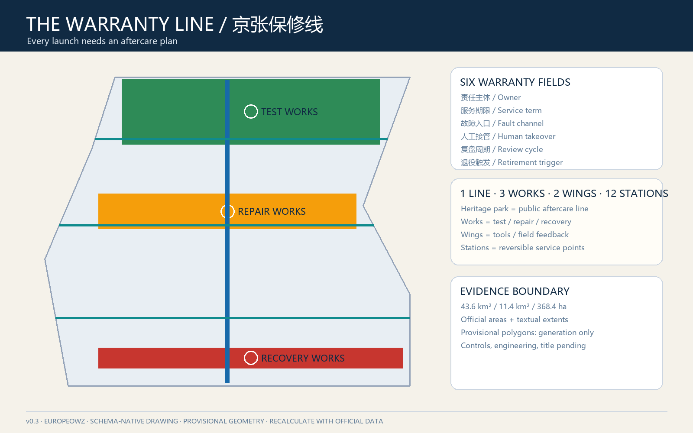
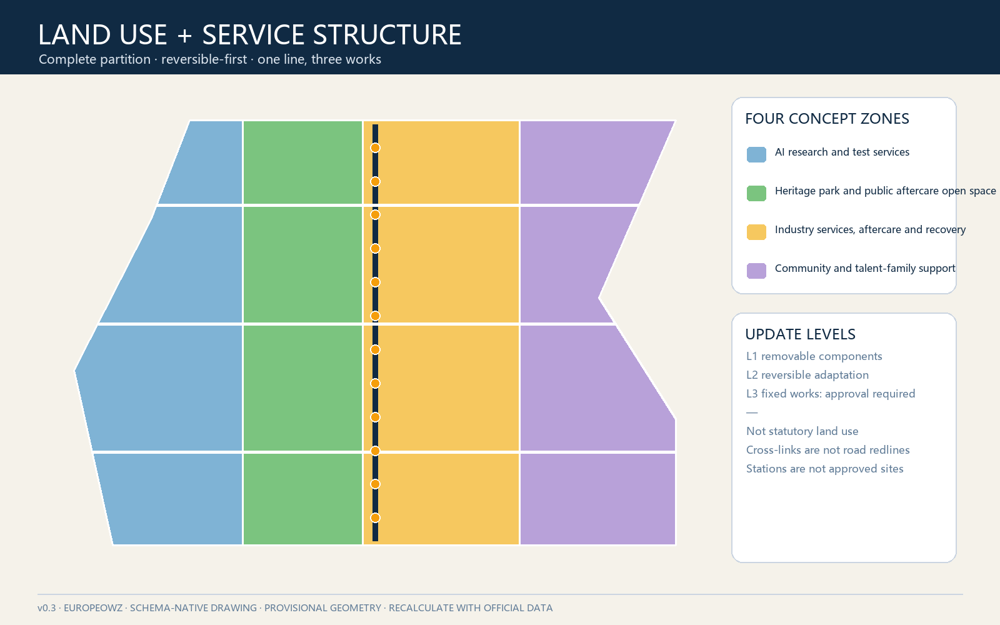
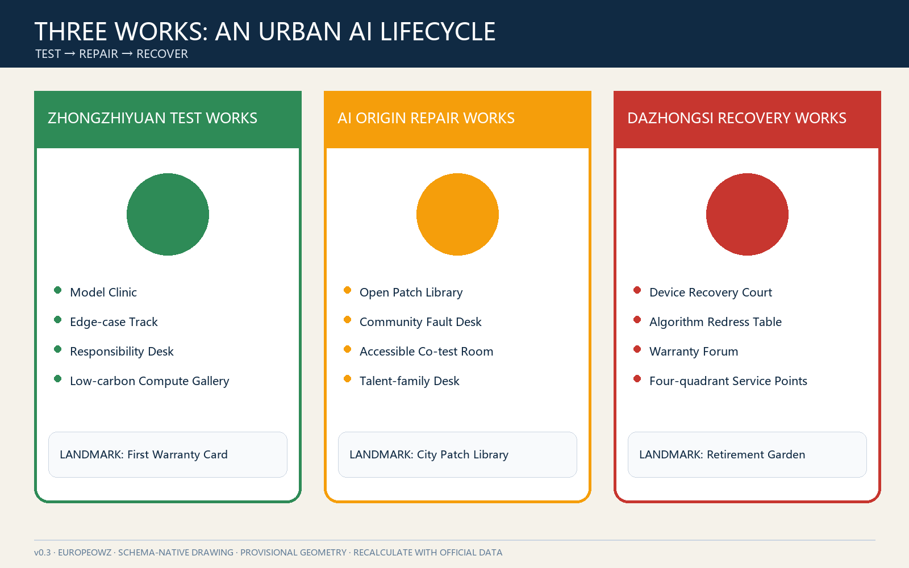
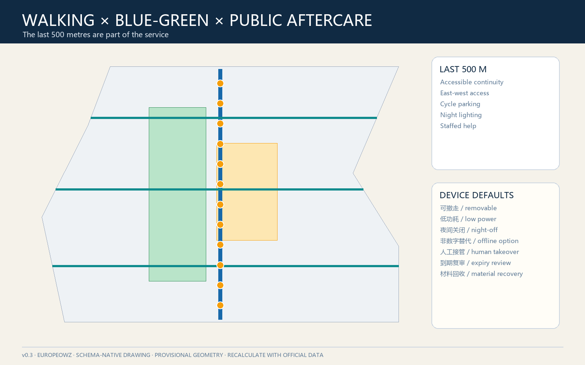
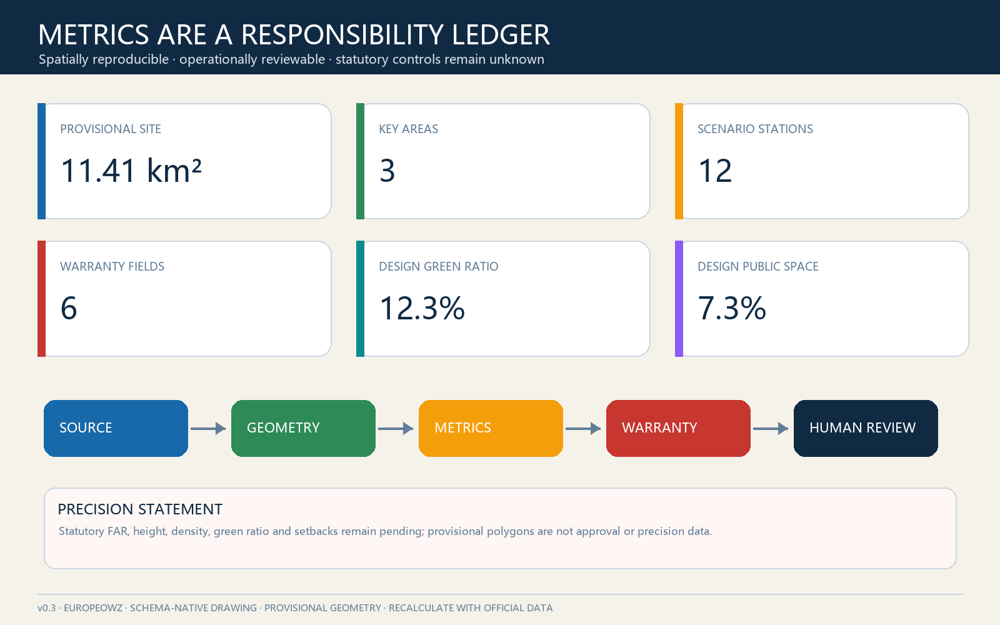

# The Warranty Line: Public Aftercare for Urban AI

Contributor: GitHub `@Europeowz`; the proposal was co-generated with OpenAI Codex. See `agent.json` and the copyright statement for responsibility and generation disclosures.

> **One-sentence proposal.** A railway earns trust through maintenance, not merely through its opening day. The Warranty Line therefore requires every urban-AI pilot to disclose who owns it, how long it is supported, where faults are reported, how a human takes over, when it is reviewed and how it retires. Every spatial move is a conceptual suggestion for professional development, not an approved plan or government decision.

## Design Basis and Source Inventory

The official announcement defines a 43.6 km² coordinated research area, an approximately 11.4 km² overall design area and three key areas totalling approximately 368.4 ha. National urban-design, regulatory-planning and land-use references provide the professional boundary, while the Agent taskbook supplies the three positionings, five functions, three-areas-two-wings framework and six mandatory tasks [source:OFFICIAL-ANNOUNCEMENT] [standard:PROJECT-OFFICIAL-ANNOUNCEMENT]. Full provenance and use limits are recorded in `sources.json`.

No verified official polygons, regulatory controls, road redlines, building survey, ownership, utilities, fire-safety or heritage-control files are available in the public package. The submitted boundary and key areas are therefore explicitly provisional constraints, suitable only for generation, discussion and intake checking [source:BOUNDARY-SOURCE] [data:geometry/site_boundary.geojson#SITE-001]. All geometry, metrics, figures and PDFs must be recalculated when authoritative data becomes available.

A public warranty has six mandatory fields: responsible owner, service window, fault and appeal channel, human takeover, review cycle and retirement trigger. A scenario missing any field remains an offline demonstration or sandbox. This turns human oversight and disclosure principles into an operational design rule [source:AGENT-TASKBOOK] [standard:PROJECT-AGENT-OPEN-CALL-TASKBOOK].

## Three-level Scope Framework

The coordinated area establishes interoperable service catalogues and accountability interfaces; the overall area turns the heritage park into a walkable aftercare line; and the three key areas host complementary pre-launch testing, community repair and market redress/retirement functions [depth:three_level_scope_framework] [data:geometry/key_areas.geojson#PROV-KEY-001].

The spatial concept is **one line, three works, two wings and twelve stations**. The heritage-park corridor is the line. Zhongzhiyuan is the Test Works, the AI Origin Community is the Repair Works, and Dazhongsi is the Recovery Works. The Zhongguancun service wing supplies legal, capital, compute, talent and standards support; the Xiaoyue River wing supplies real problems, feedback and bounded field testing. Twelve reversible stations provide daily interfaces [depth:overall_spatial_structure] [data:geometry/roads.geojson#ROAD-001].

| Scope | Central question | Proposal output | Trigger for professional development |
| --- | --- | --- | --- |
| 43.6 km² research | How can AI services remain maintainable across institutions? | Warranty protocol, service catalogue, annual defect report | Verified institutions, permissions and governance authority |
| Approx. 11.4 km² design | How can aftercare be visible and walkably accessible? | Heritage line, three cross-links, twelve stations | Official boundary and transport, heritage, utility data |
| Approx. 368.4 ha key areas | How can three districts divide lifecycle roles? | Test, Repair and Recovery Works | Exact key-area polygons, building survey and controls |

## Industry and Future-city Strategy for the Coordinated Research Area

The ecosystem is assessed by service life rather than launch volume. Six visible capacities are proposed: model evaluation, data permission, scenario testing, maintenance training, fault response and retirement/recovery. Universities supply methods and talent; platforms provide standards and sandboxes; companies retain product responsibility; communities and frontline workers provide voluntary feedback; independent specialists verify claims; public authorities retain their statutory roles.

Six international cases contribute mechanisms, not transferable promises: London Knowledge Quarter suggests a shared district brand and member network; STATION F shows shared resources with graduated access; Singapore one-north combines research, business, trials and daily life; Helsinki Maria 01 demonstrates incremental reuse and operations-first growth; Toronto's Vector Institute bridges research, industry and public partners; and AI Singapore's 100 Experiments links scoping, prototyping, handover and capability transfer [source:CASE-KQ] [source:CASE-AISG].

The proposed name is **The Warranty Line / 京张保修线**, with the statement **Every launch needs an aftercare plan**. The logo direction forms a W from two rail lines and the negative space of an open-ended spanner. Ink blue, maintenance orange, civic green and fault red distinguish states. “Works”, “stations” and an annual “Maintenance Season” extend the naming system. The visual identity remains a direction subject to professional design and trademark review.

## Urban Renewal and Regulatory-plan-depth Urban Design for the Overall Design Area

Without regulatory or building-baseline data, the proposal does not invent FAR, height or demolition decisions. It instead establishes a reversible-update ladder: begin with service counters and mobile components in confirmed public or shared space; adapt ground floors only after ownership, structure, fire safety and current use are verified; consider fixed construction only after formal planning and engineering review. The complete temporary land-use partition uses registered codes but remains a conceptual allocation [standard:MNR-LAND-USE-CLASSIFICATION-GUIDE] [data:geometry/land_use.geojson#LU-001].

A longitudinal daily-service spine is crossed by three east-west accessibility links at the Qinghe interface, Wudaokou–Origin Community and Dazhongsi station quadrants. The lines describe desired pedestrian relationships rather than road redlines, bridges or tunnels [depth:traffic_rail_slow_parking] [data:geometry/roads.geojson#ROAD-001].

Three warranty levels govern physical interventions: L1 removable signs and furniture; L2 reversible ground-floor adaptation and shared test rooms; L3 fixed construction requiring formal planning, fire, utility and engineering approval. Only L1-L2 reference prototypes are proposed [standard:MOHURD-URBAN-DESIGN-MEASURES] [depth:development_intensity_controls].

## Detailed Design for the Three Key Areas

The areas form three different lifecycle services rather than repeating a showroom-café-event formula [depth:three_key_area_detailed_design] [data:geometry/key_areas.geojson#PROV-KEY-002].

### Zhongzhiyuan Test Works

Concept components include a Model Clinic, Edge-case Track, Responsibility Desk and Low-carbon Compute Gallery. They make test methods, limitations and sign-off visible. Any live test requires separate security, data, transport, fire and ecological review. The Qinghe-facing landscape remains low-impact and reversible.

### AI Origin Repair Works

An Open Patch Library, Community Fault Desk, Accessible Co-test Room and Talent-family Service Desk occupy adaptable shared or ground-floor space only where access is confirmed. Residents may report anonymously, withdraw a report or use offline channels. Developers taking a ticket disclose the response window and named human owner. No campus or private property is assumed open.

### Dazhongsi Recovery Works

A Device Recovery Court, Algorithm-service Redress Table, International Warranty Forum and Four-quadrant Walking Service Points combine aftercare, redress and retirement. The redress table supplies explanations and human escalation but does not replace courts or regulators. Walking connections remain professional-design objectives, not engineering conclusions.

Three pilgrimage landmarks celebrate responsibility rather than technical spectacle: the **First Warranty Card** at Zhongzhiyuan, the **City Patch Library** at the Origin Community and the **Retirement Garden** at Dazhongsi. Their location, scale and construction require heritage, landscape, transport, ownership and engineering confirmation.

## AI Ecosystem, Personas and AI+ Scenarios

Six personas shape the service: researchers need reproducible tests; startups need affordable evaluation and handover templates; operations staff need fault queues and training; residents and older adults need offline access and human takeover; disabled people and caregivers need accessible co-testing and non-digital alternatives; international visitors need bilingual responsibility statements. Personas are service-design tools, never personal scores [source:AGENT-TASKBOOK] [depth:existing_conditions_diagnosis].

The twelve scenario cards use the same six warranty fields. The first three are industrial test and validation scenarios.

| # | Scenario and location | Lifecycle action | Public safeguard |
| --- | --- | --- | --- |
| 01 | Model edge-case clinic / Test Works | sandbox-test-sign-review | no live personal data; stoppable |
| 02 | Edge-device compatibility / Test Works | register-offline test-handover | vendor-neutral; energy logged |
| 03 | Enterprise-agent handover / two wings | scope-human baseline-deliver | reviewable; no policy promises |
| 04 | Accessible walking fault map / line | opt-in report-site check-close | no personal route tracking |
| 05 | Community service navigation / Origin | advise-human confirm-correct | never replaces staff |
| 06 | Health-service navigation / Origin | retrieve-human triage-exit | no diagnosis or medical records |
| 07 | AI cultural guide / park | cite-review-correct | historical review; screen-free option |
| 08 | Low-speed delivery co-test / sandbox | book-test-takeover | pedestrian first; approval required |
| 09 | Device repair and recovery / Dazhongsi | diagnose-wipe-route material | user confirms deletion |
| 10 | Recommendation appeal / Dazhongsi | explain-human review-clear | no sensitive inference; opt-out |
| 11 | Event-flow assistance / landmarks | aggregate-human dispatch-delete | no facial recognition |
| 12 | Facility-maintenance assistant / line | suggest-human assign-accept | AI cannot close tickets |

Industrial pilots pass five gates: data permission, site safety, named human responsibility, exit rehearsal and published result. All other scenarios begin as L0 explanations and upgrade only after permission. Twelve conceptual stations are jointly registered through the scenario cards, drawings and metrics ledger [data:geometry/public_space.geojson#PUBLIC-001] [metric:scenario_node_count].

## Land Use, Building Scale and Retain/Adapt/Replace Logic

The provisional partition balances research, park/open space, industry/commercial services and community support. It provides a topology-complete audit surface, not a statutory land-use plan [data:geometry/land_use.geojson#LU-002] [metric:site_area_sqm]. Green and public-space ratios are design results within rough geometry, not approved controls.

Each candidate building first needs evidence on ownership, structure, fire safety, energy, current use and cultural value. Only then can a professional team choose maintain, light adaptation, performance upgrade, function change or replacement. The current building layer represents one reversible-adaptation prototype for data-chain testing [depth:retain_renovate_demolish] [data:geometry/buildings.geojson#BLDG-001].

FAR, height, density, total floor area and setbacks remain pending official data. Warranty services should be tested against public-service and industry-support needs without using “AI” to justify extra development intensity [standard:MOHURD-CONTROL-DETAILED-PLANNING] [depth:height_massing_character].

## Transport, Rail, Utilities and Public Services

Transport design protects the last 500 metres: continuous accessible routes from stations, east-west crossings, bicycle parking, night lighting and staffed information. No new road alignment, bridge, tunnel or rail modification is claimed [data:geometry/roads.geojson#ROAD-002] [depth:traffic_rail_slow_parking].

Edge compute, charging, sensors and displays follow a “meter before deployment” rule: power, heat, network, noise, maintenance and retirement responsibility must be stated. Where capacity and utility data are absent, equipment stays mobile or offline. Every digital service retains a counter, telephone, printed explanation and human takeover [depth:municipal_new_infrastructure] [data:geometry/constraints.geojson#CONSTRAINTS].

## Blue-green Space, Public Space and Urban Character

The heritage park remains the protagonist; AI devices are removable supporting actors. Default components require no electricity: responsibility plaques, printed fault codes, seating and tactile guides. Powered devices use reversible foundations and night-off policies. Qinghe and Xiaoyue River ideas concern access and education only until ecological, flood and blue-line data are available [depth:blue_green_public_space] [data:geometry/green_space.geojson#GREEN-001].

The six-piece component library includes a Warranty Plaque, Offline Fault Post, Human-takeover Light, Mobile Co-test Table, Patch Display and Retirement-material Box. High contrast, bilingual wording and colour-blind-safe states sit alongside telephone and written channels. Components do not assume private campuses are public [data:geometry/public_space.geojson#PUBLIC-001] [metric:public_space_ratio].

The cultural narrative honours surveying, inspection, watchkeeping, track replacement and shift handover - maintenance work that maps to AI testing, aftercare, human takeover, updating and knowledge transfer. The city character is restrained, reliable, explainable and maintainable rather than spectacular or cyber-themed.

## Renewal Project List, Policy and Phasing

Nine independently stoppable packages are proposed: W01 Six-field Standard; W02 Model Clinic; W03 Community Fault Desk; W04 Repair and Recovery Court; W05 three accessible cross-links; W06 twelve-station wayfinding; W07 Open Patch Library; W08 Annual Defect Report; W09 Global Maintenance Season [depth:renewal_project_list] [data:geometry/phasing.geojson#PHASE-001].

| Phase | Deliverable action | Gate | Safe fallback |
| --- | --- | --- | --- |
| 0-6 months | fields, offline channel, three mobile desks | owner and privacy review | paper and human process |
| 6-18 months | three sandboxes and accessible co-test | site safety and exit rehearsal | offline demonstration |
| 18-36 months | twelve stations and annual report | data interoperability and operations | district-by-district service |
| After 36 months | fixed spaces and recovery network | formal approvals | retain reversible facilities |

Long-term operation follows one inspection season and one public report per year: collect issues in spring, run bounded tests in summer, publish defects and repairs in autumn, and decide renewal, correction or retirement in winter. Developer recognition comes from reproducible tickets and patches; company reputation comes from transparent aftercare and knowledge transfer. No investment, procurement or policy promise is implied [depth:phasing_implementation] [source:CASE-VECTOR].

## Indicators, Area Recalculation and Compliance

GeoJSON-derived metrics include provisional site area, prototype footprint, green/public-space ratios, three key areas and twelve scenario points. Statutory FAR, height, density, green ratio and setbacks remain unknown. Operational measures define recording methods, not promised performance: first response, human-takeover success, overdue tickets, recurring faults, accessible-issue closure, retirement completion and knowledge-transfer completion [depth:metrics_recalculation] [metric:key_area_count].

Proposed public-value gates are: every pilot has all six warranty fields; every high-risk test rehearses exit; every digital entrance has a non-digital alternative; public statistics are aggregated; and ticket closure requires a human. Complete task, standard and depth evidence remains in the three structured matrices.

## Risks, Copyright and Compliance

The main risks are unclear responsibility, maintenance abandonment, digital exclusion, surveillance expansion, vendor lock-in and permanent pilots. The response is the six-field warranty, offline access, human takeover, vendor neutrality, expiry review and reversible construction. Planning, transport, utility, fire, heritage, ecological, accessibility, data-protection and cybersecurity professionals must review every relevant step [depth:risk_missing_data] [source:SOURCE-REGISTRY].

This proposal claims no approval, regulatory amendment, ownership, fixed construction scale, engineering feasibility, investment or implementation schedule. Missing official geometry does not prevent conceptual review but blocks precision and approval-grade conclusions. All visuals are original diagrams generated from the package data; no news photography, commercial map tiles, portraits, company logos or restricted fonts are used.

## References

- Beijing Haidian planning authority, official open-call announcement.
- MOHURD urban-design and regulatory-planning measures; MNR land-use classification guide.
- Cleared Agent open-call taskbook extract.
- Official public pages of Knowledge Quarter London, STATION F, JTC one-north, Maria 01, Vector Institute and AI Singapore; provenance and access dates are in `sources.json`.
- Complete geometry, metrics, assumptions, standards, depth and task indexes are contained in the structured package [source:SITE-PACKAGE].
