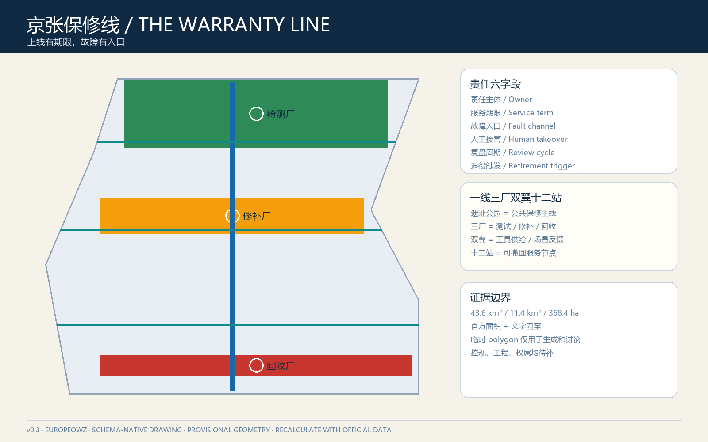
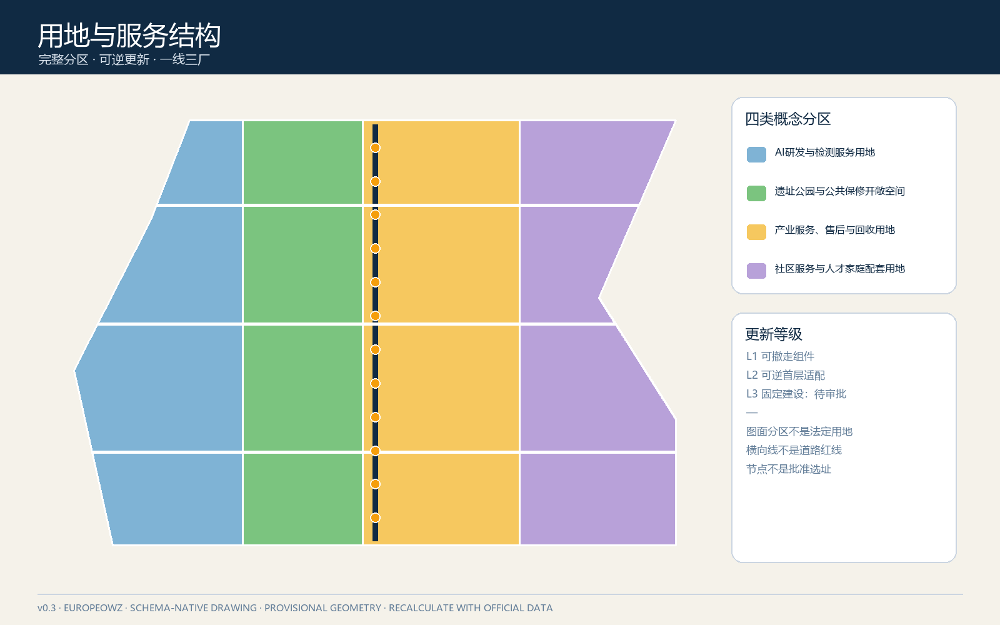
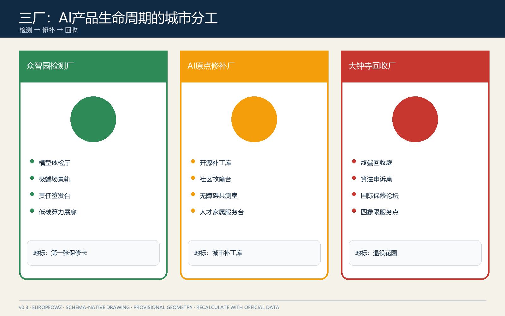
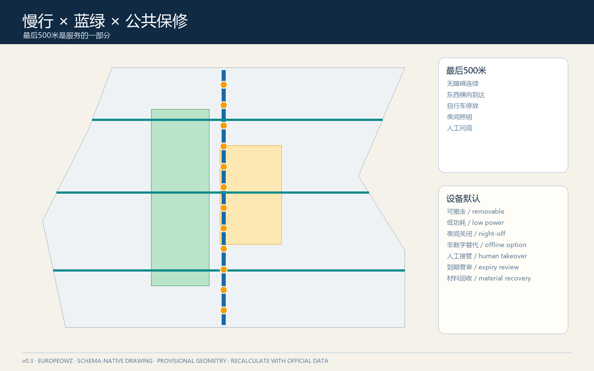
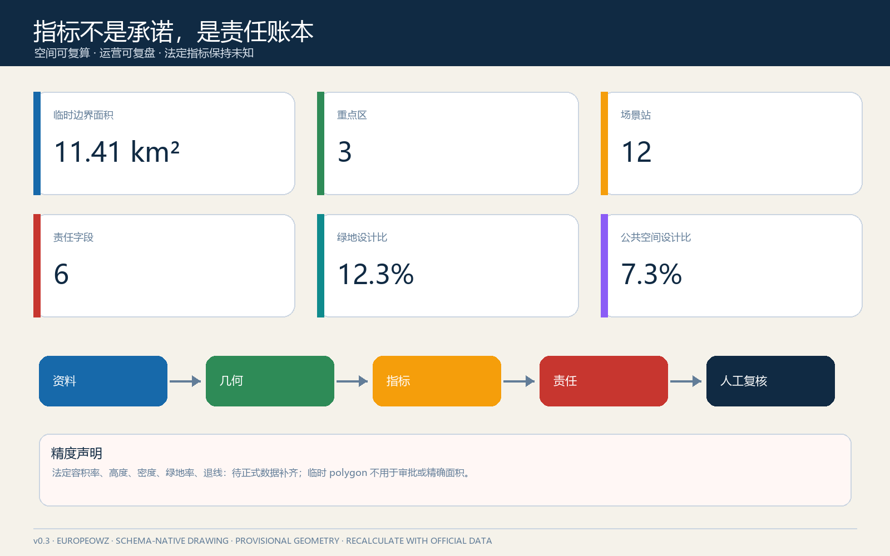

# 京张保修线：为城市AI建立公开售后

参赛者：GitHub `@Europeowz`；方案由 OpenAI Codex 协作生成，责任边界与生成说明详见 `agent.json` 和版权声明。

> **一句话提案。** 铁路的价值不只在首发，而在持续养护；京张保修线要求城市 AI 在上线前就公开“谁负责、保多久、坏了去哪报、如何人工接管、何时复盘和怎样退役”。所有空间落地均为概念建议，可供专业团队深化研究，不替代正式规划或政府审定。

## 设计依据与资料清单

本方案以官方公告确定的 43.6 平方公里统筹研究范围、约 11.4 平方公里总体设计范围和约 368.4 公顷三处重点区为任务边界，以住建部城市设计和控规管理要求、自然资源部用地分类指南为专业约束，并以智能体任务书的三大定位、五大功能、三区两翼及六项任务为内容框架 [source:OFFICIAL-ANNOUNCEMENT] [standard:PROJECT-OFFICIAL-ANNOUNCEMENT]。完整来源、用途许可和限制记录在 `sources.json`，专业标准与设计深度分别记录在两份矩阵中。

仓库目前没有可核验的官方精确红线、重点区 polygon、控规指标、道路红线、建筑现状、权属、市政、消防和文保控制文件。因此 `geometry/site_boundary.geojson` 与 `geometry/key_areas.geojson` 使用维护者标记的临时粗略范围，只用于生成、讨论和本地校验；不能作为法定红线、精确面积、工程可行性或审批依据 [source:BOUNDARY-SOURCE] [data:geometry/site_boundary.geojson#SITE-001]。官方数据发布后，全部设计层、指标、图件和 PDF 应整包复算，而不是局部替换。

“保修”不是消费营销隐喻，而是一套公共责任合同。任何 AI 场景只有在同时具备六项字段时才进入试点：`owner` 责任主体、`service_window` 服务期限、`fault_channel` 故障/申诉入口、`human_takeover` 人工接管、`review_cycle` 复盘周期、`retirement_trigger` 退役触发器。缺一项则保持离线演示或沙盒状态。该方法回应智能体任务书的人本治理、生成披露与人类最终判断原则 [source:AGENT-TASKBOOK] [standard:PROJECT-AGENT-OPEN-CALL-TASKBOOK]。

## 三层范围工作框架

三层范围对应三种“保修尺度”。统筹研究范围建立跨机构的 AI 服务目录、责任接口与互认机制；总体设计范围把京张遗址公园组织成一条可步行抵达的保修主线；三处重点区分别设置检测认证、社区售后和市场纠纷/回收功能。三层不是重复放大同一张总图，而是从制度、网络到原型逐级加深 [depth:three_level_scope_framework] [data:geometry/key_areas.geojson#PROV-KEY-001]。

总体结构为“**一线三厂、双翼十二站**”。一线是京张遗址公园及其两侧慢行公共空间形成的保修线；三厂是众智园“检测厂”、AI 原点“修补厂”、大钟寺“回收厂”；中关村科技服务翼提供法务、资本、算力、人才和标准工具，小月河场景赋能翼提供真实问题、使用反馈和低风险测试；十二站是可撤回的日常服务节点。结构图层仍受临时边界限制，只表达概念关系 [depth:overall_spatial_structure] [data:geometry/roads.geojson#ROAD-001]。

| 层级 | 关键判断 | 本方案产物 | 正式深化触发条件 |
| --- | --- | --- | --- |
| 43.6 km² 统筹研究 | AI 生态不能只有孵化和发布，还要有长期维护与退出 | 保修互认协议、服务目录、年度缺陷报告 | 机构清单、公共数据许可、跨区治理授权 |
| 约 11.4 km² 总体设计 | 公共服务入口应像地铁站一样可识别、可抵达 | 保修主线、东西三条缝合线、十二站 | 官方红线、道路/轨道/文保/市政资料 |
| 约 368.4 ha 重点区 | 三个片区应承担不同的生命周期角色 | 检测厂、修补厂、回收厂原型 | 精确重点区、现状建筑、权属与控规条件 |

## 统筹研究范围产业与未来城市研究

产业策略从“企业数量”转向“服务寿命”。建议建立六类公共可见能力：模型测评、数据许可、场景试验、运维培训、故障响应和退役回收。高校院所负责方法与人才，平台机构提供标准和沙盒，企业承担产品责任，社区与一线工作者提供使用反馈，专业机构实施独立复核，政府部门依法履行监管与审批职责。空间只提供协作接口，不替代任何法定权力。

全球案例只提取机制，不照搬规模或招商承诺：伦敦 Knowledge Quarter 的多机构联盟提示“共同品牌+成员协作”；巴黎 STATION F 的分区和项目制提示“共享资源+分层开放”；新加坡 one-north 的产业、研究与生活混合提示“试验与日常并置”；赫尔辛基 Maria 01 的旧医院渐进再利用提示“先运营、后扩容”；多伦多 Vector Institute 的研究—产业—政府桥接提示“独立能力中介”；AI Singapore 100 Experiments 的问题定义、原型、交付与知识转移提示“试点必须能交接”。这些案例属于参考机制，不能证明本地可直接实施 [source:CASE-KQ] [source:CASE-AISG]。

品牌主名称为“**京张保修线**”，英文为“**THE WARRANTY LINE**”，口号为“**上线有期限，故障有入口 / Every launch needs an aftercare plan**”。Logo 方向是一枚由两条铁轨和开口扳手负形组成的“W”：左轨代表技术上线，右轨代表公共责任，中央缺口代表人工接管。基础色为轨道墨蓝、检修橙、公共绿和故障红；仅使用开源或自制字体与图形。命名系统将三处重点区称为检测厂、修补厂、回收厂，将节点称为保修站，将年度活动称为“检修季”。以上均为视觉方向，需专业设计与商标检索深化。

## 总体设计范围城市更新与控规深度城市设计

总体设计不在缺少控规和现状调查时编造容积率、建筑高度或拆改留结论，而是提出一套“可逆更新优先级”：优先使用已有公共建筑首层、园区共享空间、站点厅外空间和公园服务设施布置轻量保修柜台；只有服务需求、权属、消防和交通条件被验证后，才讨论改造或新建。用地分区完整覆盖临时边界，用地代码遵循公开分类语义，但其功能配比属于概念性空间分配 [standard:MNR-LAND-USE-CLASSIFICATION-GUIDE] [data:geometry/land_use.geojson#LU-001]。

保修线采用“纵向日常服务脊+三条横向缝合线”。纵向脊串联三厂和遗址公园；横向线分别服务清河界面、五道口—原点社区、大钟寺站四象限，解决创新资源在铁路线两侧只相望不相达的问题。道路 GeoJSON 表达概念慢行关系，不是道路红线或桥隧方案 [depth:traffic_rail_slow_parking] [data:geometry/roads.geojson#ROAD-001]。

建议将建筑与公共空间按三种保修等级管理：L1 为可撤走的标识、桌椅和移动柜；L2 为可逆的首层适配、共享实验室和社区工作间；L3 为需规划、消防、市政和工程论证的固定建筑。提交包只把 L1-L2 作为参考原型，L3 全部列入待正式数据补齐。该分级落实了城市设计对公共空间、建筑体量与市政协调的要求，同时避免越过控规审批边界 [standard:MOHURD-URBAN-DESIGN-MEASURES] [depth:development_intensity_controls]。

## 重点区域详细设计

三处重点区不是同一套“展厅+咖啡+路演”的复制，而是构成 AI 产品生命周期的三段互补服务 [depth:three_key_area_detailed_design] [data:geometry/key_areas.geojson#PROV-KEY-002]。

### 众智园检测厂：上线前把问题暴露出来

概念建议围绕全栈自主、安全治理和标准制定，设置“模型体检厅、极端场景轨、责任签发台、低碳算力展廊”。模型体检厅用于公开展示测试方法和局限；极端场景轨只运行经审批的封闭模拟；责任签发台生成场景保修卡；临清河界面以低侵入导视、雨水花园和步行休息点承载公共参观。任何真实测试必须另行完成网络安全、数据、交通、消防和生态审查。

### AI 原点修补厂：让居民和开发者共同完成售后

概念建议以近校创新和低扰动更新为原则，在既有首层与共享空间中布置“开源补丁库、社区故障台、无障碍共测室、人才家属服务台”。居民提交问题时可选择匿名、撤回和线下渠道；开发者领取问题必须公开处理时限与人类负责人；补丁上线前后均保留对照记录。慢行联系只表达校区—园区—社区之间的公共到达关系，不推断校园或权属空间可开放。

### 大钟寺回收厂：把售后、争议和退役变成城市服务

概念建议依托轨道站点和商业服务优势，设置“智能终端回收庭、算法服务仲裁桌、国际保修路演厅、四象限步行服务点”。回收庭关注设备维修、数据清除和材料流向；仲裁桌提供可解释记录与转人工入口，不替代司法或行政程序；路演厅要求企业同时展示产品能力、故障边界和退出方案。四象限连通仅作为专业团队深化的步行目标，不能解释为工程方案。

三处 AI 朝圣地标分别是：众智园“**第一张保修卡**”——展示公共 AI 责任字段的签发门；原点社区“**城市补丁库**”——记录被发现、修复和撤回的问题；大钟寺“**退役花园**”——将停止使用的交互装置、匿名化经验和材料再利用公开展示。地标强调制度记忆而非技术崇拜，位置、尺度和结构均待文保、绿地、交通、权属及工程专业确认。

## AI 创新生态、人才画像与 AI+ 场景

本方案服务六类人：研发者需要可复现实验和明确责任；初创团队需要低成本测评与交接模板；企业运维人员需要故障队列和培训；居民与老人需要线下入口和人工接管；残障人士与照护者需要无障碍共测和非数字替代；国际访客需要双语责任说明。用户画像只用于设计服务，不建立个人评分或行为轨迹 [source:AGENT-TASKBOOK] [depth:existing_conditions_diagnosis]。

十二张场景卡均采用“责任六字段”，其中前三张为产业测试验证场景：

| # | 场景与空间 | 生命周期动作 | 公共底线 |
| --- | --- | --- | --- |
| 01 | 模型极端工况体检 / 众智园 | 沙盒测试—人工签发—限期复测 | 不接入真实个人数据；失败可停 |
| 02 | 端侧设备兼容测试 / 众智园 | 设备登记—离线试验—维护交接 | 不指定唯一供应商；记录能耗 |
| 03 | 企业服务智能体交接演练 / 两翼 | 问题定义—并行人工基线—交付 | 结果可复核；不得自动承诺政策 |
| 04 | 慢行无障碍故障地图 / 保修线 | 自愿上报—现场核查—修复闭环 | 不追踪个人路线；保留电话入口 |
| 05 | 社区公共服务导航 / 原点 | 建议—人工确认—错链纠正 | 不替代工作人员；公开更新时间 |
| 06 | 医疗服务导航 / 原点 | 信息检索—人工分诊—紧急退出 | 不诊断；不收集病历 |
| 07 | AI 文化导览 / 遗址公园 | 来源标注—内容复核—纠错 | 尊重历史；提供无屏版本 |
| 08 | 低速配送共测 / 指定沙盒 | 预约—低速试验—人工接管 | 行人优先；未审批不运行 |
| 09 | 智能终端维修与回收 / 大钟寺 | 故障诊断—数据清除—材料去向 | 用户确认删除；可查回收凭证 |
| 10 | 商业推荐申诉台 / 大钟寺 | 推荐解释—人工复核—偏好清除 | 不使用敏感推断；一键退出 |
| 11 | 活动客流辅助 / 三处地标 | 聚合计数—人工调度—活动后删除 | 不做人脸识别；不自动执法 |
| 12 | 公共设施维护助手 / 全线 | 工单建议—人工派发—验收公开 | AI 不直接关闭工单 |

前三项产业试验只有通过数据许可、场地安全、人工责任人、退出演练和结果披露五道门才可从离线演示进入限时试点。所有其他场景默认 L0 说明性展示，只有取得相应许可才升级。十二站点以本节场景卡、图件和指标账本共同登记，其位置为概念示意 [data:geometry/public_space.geojson#PUBLIC-001] [metric:scenario_node_count]。

## 用地、建筑规模与拆改留方案

临时用地分区将总体范围划分为研发创新、公园与开敞空间、产业/商业服务、社区服务与配套四类，目的是确保机器审查的完整覆盖，并建立“技术生产—公共体验—市场服务—日常照护”的空间平衡；它不是法定用地方案 [data:geometry/land_use.geojson#LU-002] [metric:site_area_sqm]。绿地与公共空间比例是临时几何下的设计结果，不能替代正式绿地率或公共空间控制指标。

建筑策略采用“保留事实未知、动作等级已知”的表达。对每个候选空间先建立权属、结构、消防、能耗、现状使用和文化价值六项调查，再分别判断保留维护、轻量适配、性能改造、功能置换或拆除重建。没有六项调查，不给出具体拆改留。当前 `buildings.geojson` 仅表示一个可逆适配原型范围，用于验证数据链和图件表达 [depth:retain_renovate_demolish] [data:geometry/buildings.geojson#BLDG-001]。

容积率、建筑高度、建筑密度、总建筑规模和退线均标记为待正式数据补齐。正式深化时应把保修服务所需面积纳入公共服务和产业配套测算，并比较新建与复用的全生命周期影响；不以“AI”作为额外开发强度的理由 [standard:MOHURD-CONTROL-DETAILED-PLANNING] [depth:height_massing_character]。

## 交通、轨道、市政与公共服务设施

交通策略优先保证到达保修服务的“最后 500 米”：轨道站出口到服务点的无障碍连续、东西穿越、非机动车停放、夜间照明和人工问询。保修线本身是一条低速慢行服务网络，不承诺新的道路线形、桥隧或轨道改造；相关节点只形成问题清单和专业接口 [data:geometry/roads.geojson#ROAD-002] [depth:traffic_rail_slow_parking]。

市政与新基建采用“先计量、后部署”。端侧算力柜、充电、传感和展示设备必须先说明电力、散热、网络、噪声、维护和退役责任；缺少容量与管线资料时保持移动式或离线样机。公共服务设施必须保留柜台、电话、纸质说明和人工接管，避免把数字化变成新的进入门槛 [depth:municipal_new_infrastructure] [data:geometry/constraints.geojson#CONSTRAINTS]。

## 蓝绿空间、公共空间与城市风貌

京张遗址公园是公共生活主角，AI 设备只是可撤走的配角。绿地中优先布置不取电的责任牌、纸质故障码、休息座椅和无障碍触觉线；需要电力或网络的设备采用可逆基础和夜间关闭策略。清河、小月河等蓝绿空间的生态、防洪和蓝线资料缺失，方案仅提出到达与教育叙事，不改变岸线或水工设施 [depth:blue_green_public_space] [data:geometry/green_space.geojson#GREEN-001]。

公共空间组件库包括六件：保修牌（责任六字段）、离线故障柱、人工接管灯、移动共测桌、补丁展架和退役材料箱。组件使用统一高对比、双语、色弱友好的信息层级，并提供二维码之外的电话与文字入口。公共空间原型集中在可步行到达的界面，不推定私人园区开放 [data:geometry/public_space.geojson#PUBLIC-001] [metric:public_space_ratio]。

文化叙事从“修铁路的人”而非抽象蒸汽符号出发：勘测、检修、值守、换轨和交接班对应 AI 的测试、维护、人工接管、更新和知识转移。导视系统区分整体品牌 W 标、三厂功能图标与十二站编号，不使用企业标识或历史人物肖像。城市气质是克制、可靠、可解释和可维护，而不是炫技或赛博景观。

## 更新项目清单、实施政策与分期计划

九个项目包均可独立暂停：W01 责任六字段标准；W02 众智园模型体检厅；W03 原点社区故障台；W04 大钟寺维修回收庭；W05 三条横向无障碍缝合线；W06 十二站导视；W07 开源补丁库；W08 年度缺陷报告；W09 全球检修季。任何项目未通过场地、数据、责任与退出门槛，不影响其他低风险项目继续 [depth:renewal_project_list] [data:geometry/phasing.geojson#PHASE-001]。

| 阶段 | 可交付动作 | 硬门 | 失败后的退路 |
| --- | --- | --- | --- |
| 0-6 个月：开账 | 责任字段、线下故障入口、三处移动服务台 | 责任主体与隐私审查 | 保留纸质与人工流程 |
| 6-18 个月：共测 | 三个产业沙盒、无障碍共测、公开复盘 | 场地安全与退出演练 | 降级离线演示 |
| 18-36 个月：成网 | 十二站、跨翼转介、年度报告 | 数据互认与稳定运维 | 分区独立运行 |
| 36 个月后：更新 | 固定空间、国际互认、退役回收 | 正式规划及工程审批 | 维持轻量可逆设施 |

长期运营采用“一季一检修、一年一报告”：春季收集问题与招募共测者，夏季运行低风险沙盒，秋季公开故障和修复，冬季决定续保、整改或退役。开发者社区以可复现工单和补丁贡献获得荣誉；企业以透明售后与知识转移建立信用；人才与项目通过试点—复盘—采购/合作评估转化，但不预设招商、资金或政策承诺 [depth:phasing_implementation] [source:CASE-VECTOR]。

## 指标体系、面积复算与合规矩阵

空间指标由 GeoJSON 在 EPSG:4548 下复算，包括临时边界面积、建筑原型基底、绿地/公共空间比例、三处重点区和十二场景节点；法定指标如容积率、高度、密度、绿地率和退线保持 unknown。运营指标不承诺绩效，只规定记录方法：故障首次响应时间、人工接管成功率、逾期工单、重复故障、无障碍问题闭环、退役完成率和知识转移完成度 [depth:metrics_recalculation] [metric:key_area_count]。

首轮公共价值阈值建议为：100% 试点有责任六字段；100% 高风险场景完成退出演练；所有数字入口都有非数字替代；所有公开统计采用聚合数据；所有故障关闭均由人确认。它们是治理门槛，不是场地现状或政府承诺。任务覆盖、专业标准和设计深度的完整证据链分别保存在 `compliance_matrix.json`、`standard_matrix.json` 和 `design_depth_matrix.json`。

## 风险、版权与合规说明

最大风险不是“AI 不够多”，而是责任模糊、维护断档、数字排斥、监控扩张、企业锁定和试点永久化。相应对策是责任六字段、线下入口、人工接管、供应商中立、到期复审与可逆设施。每项建议必须继续接受规划、交通、市政、消防、文保、生态、无障碍、数据保护和网络安全专业审查 [depth:risk_missing_data] [source:SOURCE-REGISTRY]。

本方案不声称官方批准、控规调整、土地权属、确定建设规模、工程可行性、投资承诺或实施时序。官方精确边界与重点区缺失不阻断内容讨论，但阻断精确面积和审批级结论。所有视觉由本智能体依据提交包结构化数据自行绘制；未使用新闻图片、商业地图瓦片、人物肖像、企业 Logo 或受限字体。外部案例仅引用公开网页中的机制，具体数字不作为本地测算依据。

## 参考资料

- 北京市规划和自然资源委员会海淀分局：《百年京张AI创新带城市设计国际方案征集资格预审公告》。
- 住房和城乡建设部：《城市设计管理办法》；《城市、镇控制性详细规划编制审批办法》。
- 自然资源部：《国土空间调查、规划、用途管制用地用海分类指南》。
- 面向全球智能体开源征集任务书结构化摘录。
- Knowledge Quarter London、STATION F、JTC one-north、Maria 01、Vector Institute、AI Singapore 官方公开页面；用途和访问日期见 `sources.json`。
- 几何、指标、假设、标准、深度和任务覆盖的完整机器索引见本提交包对应 JSON/GeoJSON 文件 [source:SITE-PACKAGE]。
