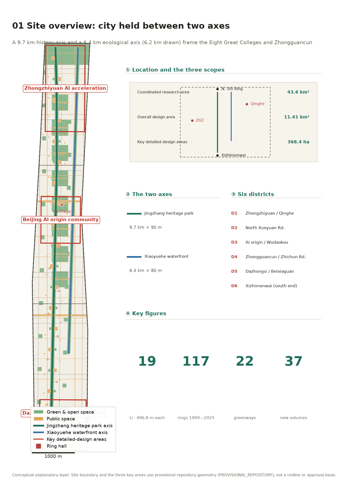
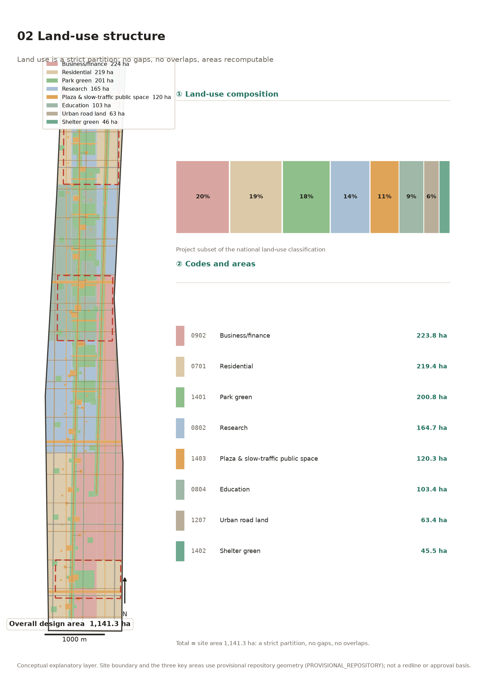
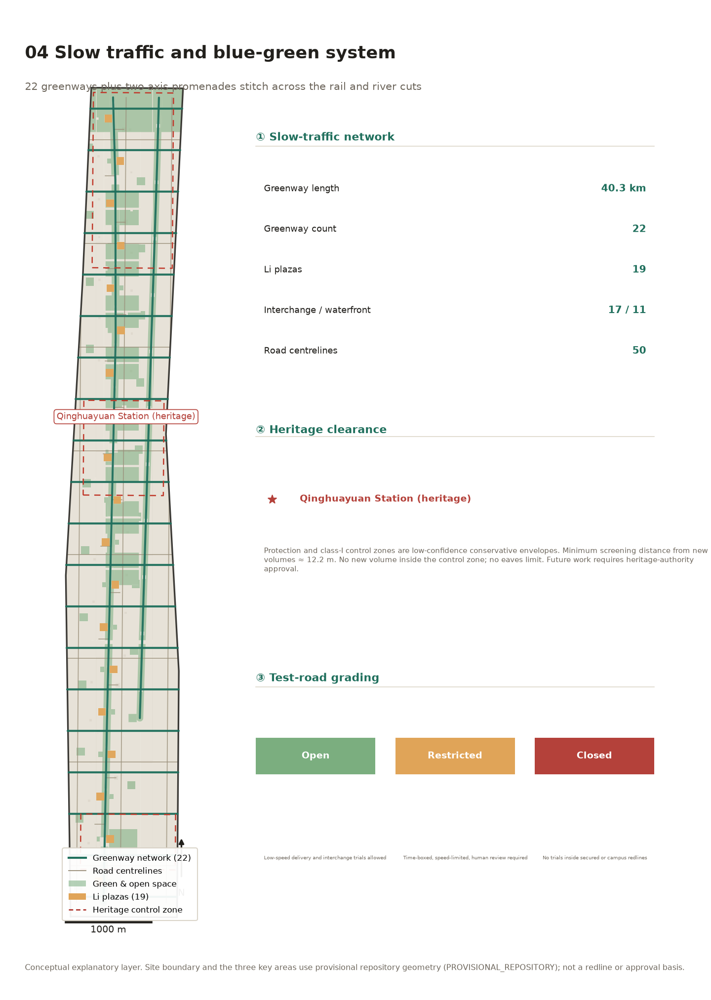
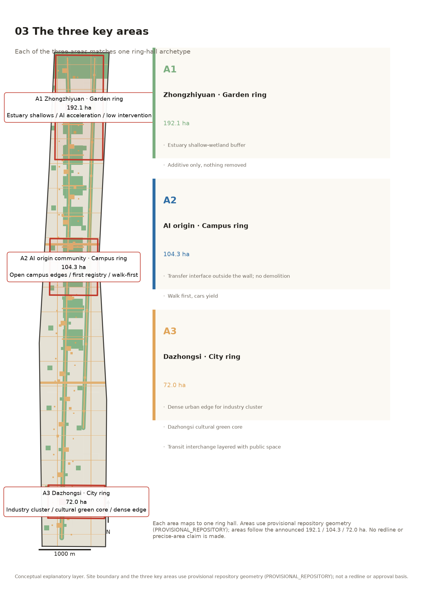
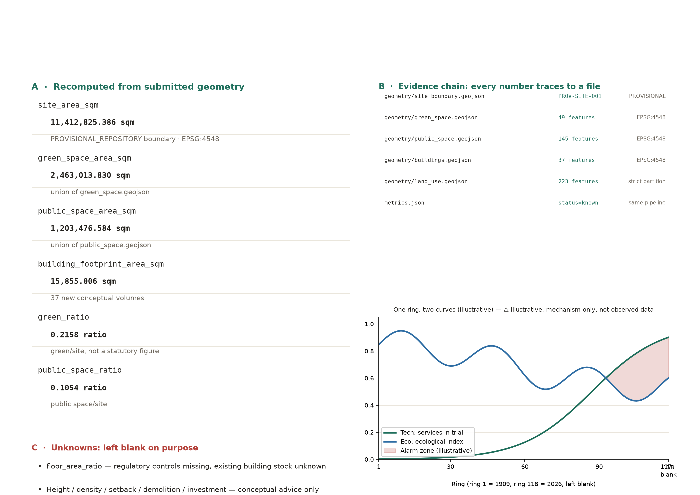
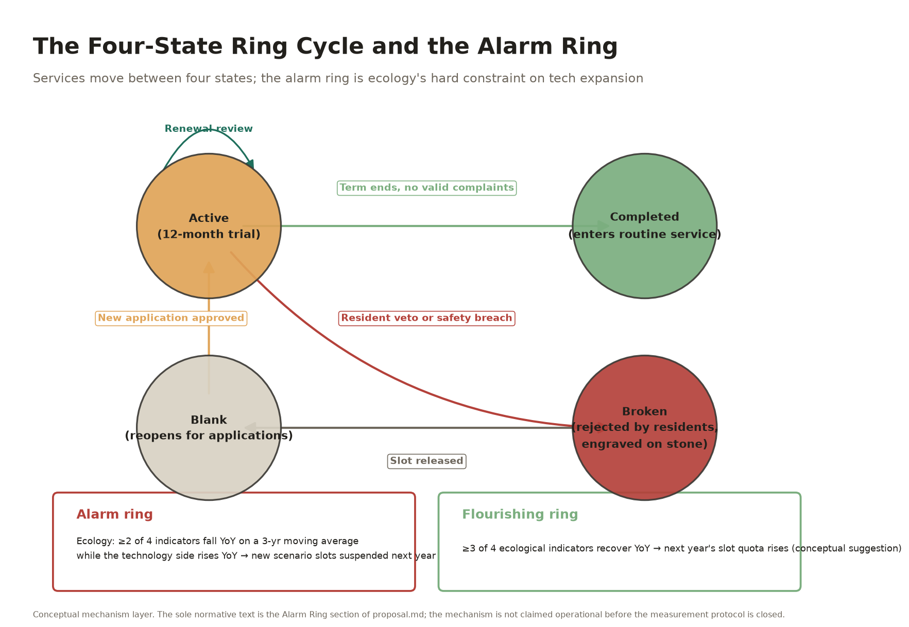

# The Jingzhang Rings: A Ring a Year, Two Curves

## Design Basis and Source Inventory

The basis of this proposal falls into three classes, and the line between them has to be drawn clearly.

**The first class is official information that can serve as a task basis**: the three-level scope, bearings and areas given in the prequalification announcement (43.6 km² coordination research area, 11.4 km² overall design area, 368.4 ha of key areas, and three key areas of 192.1 / 104.3 / 72.0 ha); the six tasks and review criteria of the agent taskbook; and the allowed design space, land-use codes and professional standard index in the site package `[source:AGENT-TASKBOOK]` `[source:SITE-PACKAGE]`.

**The second class is public facts retrieved for this submission, and they change how the site is understood**: the Jing-Zhang railway heritage park is **already built** — 9 km long, roughly 70 ha in total, phase one (2.4 km, from Qinghua East Road to the Dachun area on Zhichun Road) opened in June 2023, phase two extended it north and south and was substantially completed in 2025. It has 46 entrances, no perimeter wall, and nine city streets were opened through it. It serves close to 70 communities, about 450,000 residents, more than ten universities and over 40 research institutes. The park passes through **seven subdistricts — Beixiaguan, Beitaipingzhuang, Xueyuanlu, Zhongguancun, Qinghuayuan and Huayuanlu — plus Dongsheng Town** `[source:SRC-JINGZHANG-PARK-BJ]` `[source:SRC-JINGZHANG-PARK-STREETS]`. In other words, the "east-west stitching" the taskbook asks for is not a pending vision; it is **engineering already under construction**. This proposal should not repeat it. It should answer what happens after the stitching is done.

**The third class is water-system work being built at the same time, and it forms this proposal's second axis**: the Xiaoyuehe improvement reach runs 6.4 km from Qijiahuozi gate to the Qinghe confluence, adds 110,000 m² of planting (cherry blossom at its core), builds or rebuilds 11.4 km of waterfront walkway, and is laid out as "one river, four reaches, seven nodes". Along it sit exactly the **Eight Great Colleges — Peking University Health Science Centre, China Agricultural University, Beijing Forestry University, University of Science and Technology Beijing and others** `[source:SRC-XIAOYUEHE-2026]` `[source:SRC-XIAOYUEHE-BJD]`. In parallel, 10.36 km of the Qinghe river in Haidian is being dredged, hard banks are being replaced with natural gentle slopes into the water, and shallow shoal wetlands are being shaped. The official wording of the target is, verbatim, "a biodiversity vision of fish and shrimp swimming and waterbirds roosting" `[source:SRC-QINGHE-2026]`.

**The boundary of the data gaps has to be stated just as plainly.** Floor-area ratio, building height, site coverage, green-space ratio and setback — all five — are **missing** from the site package. Road redlines, parcel ownership, the existing building inventory, utility lines and heritage vectors are likewise all missing `[source:SRC-SITE-PACKAGE-PLANNING-LIMITS]`. This proposal therefore **gives no approved indicator of any kind**. Every quantity touching intensity or scale is recorded as awaiting confirmation, in the text and in the structured files alike. This is not caution for its own sake: inventing these figures would directly breach the boundary of the open call `[standard:PROJECT-AGENT-OPEN-CALL-TASKBOOK]`.

In August 2026 the Beijing municipal government portal reported the approval of the regulatory detailed plan for the HD00-1601 blocks along the Jing-Zhang heritage park, describing a "one belt, one axis, two centres, multiple nodes" structure with Dazhongsi as one of the two centres `[source:SRC-HD00-1601-KONGGUI]`. **To be explicit: this source is a public news report — the precise statutory plan vectors have not been obtained — so this proposal uses it as background information pending verification, not as an approval basis.** Wherever the plan is mentioned, it is only a structural resonance (the position of this proposal's Urban Ring relative to the Dazhongsi node; the plan's "green public space leading area regeneration" running in the same direction as this proposal's "two axes enclosing one city, ecology as the hard constraint"). No parcel indicator, redline or approval status is derived from it. Should formal statutory plan documents fail to substantiate this source later, the structural resonance remains merely as design context, and no metric of this proposal depends on it.

## The Three-Level Scope as a Working Framework

The three levels are not three concentric circles shrinking in turn. They are **three different working precisions**.

The 43.6 km² coordination research area (north to the North 5th Ring Road, east to the Jingzang Expressway, south to Xizhimenwai Street, west to Wanquanhe Road) is used to judge where this belt sits in the capital's innovation landscape. Its method is strategic study of industry and ecology, and it produces no specific geometry. The 11.4 km² overall design area (within 1–2 km of the Jing-Zhang heritage park) is the true object of design here, and must reach urban design at regulatory detailed-plan depth. The 368.4 ha of key areas are three districts that must be carried to comprehensive implementation-plan depth.

Read back from the coordinates, the overall design area is a **corridor roughly 1.37 km wide and 9.72 km long**, which matches the announcement's "within 1–2 km of the Jing-Zhang heritage park". The corridor shape is not a product of design. It is a condition set by the brief.

That produces a fact which has to be answered head on: the three key areas **do not touch** along this corridor. In the announcement's north-to-south order, Zhongzhiyuan, the AI Origin Community and Dazhongsi measure roughly 2.06, 1.12 and 0.66 km north to south, totalling about 3.83 km. The corridor is 9.72 km long, so **about 5.89 km is gap**.

That 5.89 km is not one continuous block. It has three parts, set out here so that the arithmetic closes:

| Stretch | Length | Note |
|---|---|---|
| Between Zhongzhiyuan and the AI Origin Community | about 1.55 km | northern gap |
| Between the AI Origin Community and Dazhongsi | about 3.73 km | southern gap, the longer one |
| Corridor ends north of the first / south of the last area | about 0.06 / 0.56 km | the three areas do not reach the corridor ends |

The two breaks total about 5.28 km; with roughly 0.62 km at the two ends the sum is about 5.89 km, which closes against "9.72 km corridor minus 3.83 km of key areas". That is precisely why the taskbook lists north-south continuity as a key direction.

Two length baselines are used consistently throughout: **the geometric corridor at 9.72 km** (about 512 m per li) and **the two-axis slow-traffic spine at 9.44 km** (divided into 19 li of 496.8 m, which is what the ground posts follow). The roughly 300 m difference comes from the spine being set back from the corridor boundary at both ends. The naming table uses the latter.

**What is inside the gap?** Campus walls, staff housing compounds, breakfast stalls, parents waiting for children, wet markets and bicycle repair stands, the most authentic everyday life in Haidian. The three islands were drawn by planning. The gap is where life grew. **This proposal puts its main effort in the gap, not on the three islands.**

This proposal uses the provisional boundaries of the site package. The polygons for the three key areas are **approximate rectangles** inferred from the announcement's north-south order and area constraints; no official bearings were published, so their edges must not be read as parcel or road redlines. All areas and ratios are ratios of conceptual quantities and must be recomputed once official polygons are released `[assumption:A-BOUNDARY-001]`.

The boundaries and areas of the three levels come from the site package's provisional geometry `[data:geometry/site_boundary.geojson#PROV-SITE-001]` and the three key areas `[data:geometry/key_areas.geojson#PROV-KEY-001]`. The recomputed site area is `[metric:site_area_sqm]`; the data gaps are registered item by item in `[gap:GAP-BOUNDARY-001]` and `[gap:GAP-BOUNDARY-002]`.

## Industry and Future-City Study at the Coordination Research Scale

### The Umbrella Name and the Naming System

**Primary name: THE JINGZHANG RINGS (京张年轮). Subtitle: A Ring a Year, Two Curves (一圈年轮，两条曲线).**

"Rings" carries three meanings, and each is literal rather than rhetorical.

The first is **time**. The Jing-Zhang railway was completed in 1909. **1909 is ring 1 and 2025 is ring 117; 2026 is ring 118, left blank** — which is exactly the first complete year after the Qinghe and Xiaoyuehe works finish, and the first year in which the alarm-ring mechanism can be fully recomputed.

The second is **ecology**. Tree rings are a tree's physical record of each year's climate, hydrology and disaster, and dendrochronology reconstructs environmental history precisely by reading them.

The third is **technology**, and here the limits of the analogy have to be stated. Annual rings and a distributed ledger are structurally alike in four respects: one data unit per year, irreversible ordering, rings once formed cannot be retroactively altered, and cross-checking across many samples through cross-dating. But one difference is fundamental: **a ledger is written by mutually distrusting parties, whereas a ring is written by nature.** What the rings provide is cross-checking of measurement, not distribution of writing.

> This proposal therefore does not claim that rings carry a cryptographic guarantee, **and does not claim that a ring has all the key characteristics of a distributed ledger** — the analogy here is only a recomputable time-series record with cross-checking. Tamper-evidence at the institutional level is not guaranteed by the tree; it is guaranteed by dual signatures, a public ledger and a complete changelog. What the rings supply is discipline in time. Remove the word "rings" and the governance mechanism still stands — what the rings add is that it can be remembered, pointed at and interrogated year by year, not that they underwrite it.

This is not a blockchain metaphor draped over a tree. It is the reverse: the tree did it first and the ledger did it later — but the part the tree achieved and the part the ledger achieved do not fully overlap, and this proposal says so itself rather than leaving it for a reviewer to find.

The naming system unfolds systematically as the taskbook requires, rather than stopping at one name:

| Level | Chinese | English | Note |
|---|---|---|---|
| Umbrella name | 京张年轮 | THE JINGZHANG RINGS | primary name |
| Year unit | 轮 | Ring | 1909 is ring 1, 2025 is ring 117; **2026 is ring 118, left blank** |
| Spatial unit | 里 | Li | 496.8 m each (9.44 km spine / 19), 19 li along the line, close to the traditional li of 500 m |
| Sub-unit | 步 | Bu | about 100 m, five bu per li, i.e. four bu posts plus two boundary posts |
| Concentrated anchor | 年轮厅 | Ring Hall | three, at the meeting points of the two axes and the three areas |
| Ground fixtures | 轮碑 / 里桩 / 步桩 | Ring Stone / Li Post / Bu Post | weathering steel; li post 1.1 m, bu post 0.45 m |
| Accountability unit | 里长 | Li Keeper | **dual signature** of the responsible planner and the street chief |
| Unit of account | 里·时 | Li-Hour | actual hours a scenario is in use |
| State | 在轮 / 成轮 / 断轮 / 空轮 | Growing / Formed / Broken / Blank | four states |
| Warning | 警报轮 | Alarm Ring | a year when technology density rises while ecological indicators fall |

**Visual identity and logo direction.** The primary mark is a **set of concentric rings**: an outer band of 117 fine concentric incisions, one for each year since 1909, with a **gap left unclosed** on the outermost line — ring 118. Colour takes ginkgo autumn gold (the 6 km ginkgo avenue of the Jing-Zhang axis) and cherry blossom pink-white (the 110,000 m² of cherry along the Xiaoyuehe axis), one for each axis. The logo uses no corporate mark, no portrait and no unclear-licence typeface; it is entirely original geometric construction that can be cleared.

### Where the Three Positions, Five Functions and Three-Areas-Two-Wings Land

Of the three positions, "centennial Jing-Zhang cultural belt" lands on the Jing-Zhang axis, "AI integration and innovation belt" lands on the three ring halls, and **"urban AI living experience belt" lands on the campus belt between the two axes and the 70 communities along the line** — this proposal argues that the living-experience belt is not on any landmark. It is in the everyday.

Of the five functions, "full-stack indigenous AI innovation system" maps to Zhongzhiyuan; "world-class AI innovation ecosystem" maps to the origin community and the Zhongguancun technology-services wing; "AI+ scenario empowerment paradigm" maps to the apply-for li/bu scenario slots; "intelligent and vibrant AI city" maps to the Xiaoyuehe axis and the street-level reality of the gap; and **"global voice in AI governance" maps to the li-keeper system and the tamper-evident ring record**.

The three areas and two wings differentiate according to the form types given officially: Zhongzhiyuan is **garden type**, the origin community is **campus-adjacent type**, Dazhongsi is **urban type**. These three words are not this proposal's invention; they are the announcement's own wording, and this proposal differentiates the three ring halls accordingly `[source:AGENT-TASKBOOK]`.

### Five to Eight Global Cases and What Transfers

| Case | Transferable mechanism | Where it lands on the Jing-Zhang rings |
|---|---|---|
| Paris Petite Ceinture | After a disused ring railway became linear public space, reversible use was the principle preserving reuse options | The four-state ring cycle: any AI service is by default pausable, removable, and can be handed back to a human operator |
| New York High Line | A leftover elevated structure became elevated green space | Direct parallel: the elevated structure left over from the Line 13 capacity upgrade **is already planned as high-line green space**; the Jing-Zhang axis can follow its operating rhythm |
| Kalundborg industrial symbiosis | A neutral coordinator maps "resource flows"; participants join and leave as needed | The ring halls map the resource flows of data, compute, talent and scenarios, and every flow is reversible |
| Toronto Quayside | A cautionary case: where data governance does not benefit residents, a project loses its social licence | **Data never leaves the campus** plus the li-keeper system, turning compliance from a defensive item into an exhibit |
| Seoul Cheonggyecheon | Once the covered river was reopened to the sky, ecology and public life recovered together | The path the Xiaoyuehe has already taken from "the city's northern ditch" to a cherry avenue; this proposal only adds a recording layer |
| Singapore ABC Waters | Turning drainage channels into "active, beautiful, clean" public assets | The Qinghe approach of "natural gentle slopes and shallow shoal wetlands" is settled practice; this proposal adds annual ecological measurement |
| London's reversible procurement in smart city practice | Exit clauses built into technology contracts to avoid lock-in | The expiry and renewal mechanism of the li-hour |
| Kyoto cityscape ordinance | Regulating phenology and seasonal aspect, not only form | The rings bring ginkgo and cherry phenology into the annual record |

### The Six Tasks: A Substantive Delivery Closure Table

Each of the taskbook's agent.1—agent.6 is closed below item by item: the requirement, this proposal's substantive deliverable, and where the evidence sits inside the package. This is not a pointer list; it is the hand-in.

| Task | Core taskbook requirement | Substantive deliverable in this proposal | Evidence location in package |
|---|---|---|---|
| **agent.1 Overall concept and functional coordination** | Naming system, logo direction, three positions / five functions, overall structure diagram | Umbrella name "京张年轮 / THE JINGZHANG RINGS" + the Ring/Li/Bu spatial addressing system; logo direction of concentric rings with a gap (visual identity paragraph); the three positions land respectively on the Jing-Zhang axis, the three Ring Halls, and the college belt plus 70 communities between the axes; overall structure "two axes enclosing one city + 19 li + three halls" | This section ("The Umbrella Name", "Where the Three Positions… Land"); `assets/figures/site-overview.png`, `land-use-structure.png`; 9 GeoJSON layers incl. `geometry/site_boundary.geojson`; `[metric:site_area_sqm]` `[metric:green_ratio]` `[metric:public_space_ratio]` |
| **agent.2 Full-stack AI innovation system and ecosystem** | 5–8 global cases, ecosystem map, Zhongzhiyuan full-stack system, eight-factor mechanisms | Global case table with a stated transferable point per case (this section); the ecosystem chain "basic research → scenario validation" located spatially ("AI Innovation Ecosystem" section); Zhongzhiyuan full-stack system as A1 Garden Ring's low-intensity courtyard layout; land/space/funding/talent mechanisms as the three-channel operation model (government base / institutional co-governance / social increment) | Case table in this section; "The Ecosystem Chain"; "A1 Zhongzhiyuan · Garden Ring"; "Annual Event System and Long-Term Operation"; `[source:SRC-URBAN-PARTNER]` |
| **agent.3 AI+ scenario empowerment and vibrant city** | ≥10 scenario cards, ≥3 validation scenarios, ≥5 user profiles, scenario-space-operation mapping, privacy boundary | 12 scenario cards (S-01—S-12), each positioned as "Li X, Bu Y" with its data boundary and human-review route; 3 validation scenarios (V-1 A/B control, V-2 data-chain backtest, V-3 response-loop check); 6 user profiles (researchers / startup teams / students & faculty / long-term residents / couriers / parents), each with its privacy column; four hard-banned scenario classes | The whole "AI Innovation Ecosystem, Talent Profiles and AI+ Scenarios" section (profile table / scenario cards / validation scenarios / hard privacy boundaries); `[metric:scenario_positions_total]`=95, `[metric:scenario_posts_total]`=47; `geometry/phasing.geojson` |
| **agent.4 AI public space and pilgrimage landmarks** | AI public space, east-west stitching strategy, ≥3 pilgrimage landmarks, honour display system, component library | 3 pilgrimage landmarks: the Ring-118 blank stele, the Broken-Ring Stele (recording technologies rejected by residents), and the Ring Honour Wall; honour display = wall inscription + annual report; component library = standardised li posts / bu posts / boundary posts / li-courtyard kiosks (19 li × 5 bu scale system); east-west stitching uses "detour plus interface treatment", with no bridge/tunnel engineering conclusion | "Three AI Pilgrimage Landmarks"; "Transport: Grading Roads for Testing"; "Land Use, Building Scale, and the Retain / Renovate / Demolish Approach"; `[metric:li_count]`=19, `[metric:li_length_m]`=496.8; `assets/figures/mobility-bluegreen.png` |
| **agent.5 Cultural fusion narrative** | Jing-Zhang history, Zhongguancun & new AI culture, spatial culture system, signage, international communication | Core narrative "not the railway's metaphor, but the railway's chronology": from mileposts to annual rings, making invisible algorithms addressable (closing paragraph of this section); the symbol system = the four ring states (active / completed / broken / blank) plus alarm and flourishing rings, all grounded in physical posts and signage; international naming = the bilingual Ring/Li/Bu addressing; the ring-to-blockchain analogy is explicitly bounded so the metaphor is never passed off as a cryptographic guarantee | "Cultural Narrative" in this section; "The Umbrella Name and the Naming System" (bilingual Ring/Li/Bu); the Alarm Ring section; `report/proposal.en.html` (full English narrative for international communication) |
| **agent.6 Event system and long-term operation** | Annual events, brand communication, developer community, scenario open operation, conversion pathway | The annual event system *is* the four-state ring cycle: one annual review (renewal / completion / broken-ring / reopening), one ring per year (four ecological + two technology indicators on one chart), one li chief per li wired into the 12345 system; a three-channel funding model (conceptual suggestion); the conversion pathway = the annual report as a replicable product offered to the Future Science City, Huairou Science City and the E-Town (explicitly a conceptual suggestion, not a government commitment) | "Renewal Project List, Implementation Policy and Phasing" (ten-year three phases / annual events / conversion boundaries); `[metric:ring_count]`=117, `[metric:alarm_ring_threshold]`; `geometry/phasing.geojson` |

Every one of the six tasks has a substantive deliverable pinned to files in this package; none survives on slogans alone. One honest boundary: regional coordination currently stops at offering the annual-report mechanism as a concept to peer districts — a cross-district actor-resource-project loop has not been formed, and this proposal states that as a known boundary, not an omission.

The ring annual report format (four ecological indicators and two technology indicators, published on one chart) is itself a replicable product: prove it inside Zhongguancun Science City first, then offer it as a **conceptual suggestion** to comparable corridors in the Future Science City, Huairou Science City and the Economic-Technological Development Area. At the scale of the Jing-Zhang Sports, Culture and Tourism Belt, the Jingzhang Rings is the Haidian section's continuation of the 1909 chronology, not an exclusive claim on it.

### Cultural Narrative: Not "the Railway's Metaphor" but "the Railway's Chronology"

Earlier proposals have already used the engineering imagery of the Jing-Zhang railway thoroughly — the switchback, the closure error of levelling, the reversible corridor. This proposal takes an angle that has been touched less: **the Jing-Zhang railway's real legacy to urban governance is not an engineering form. It is a way of keeping time.**

The railway marks mileage as `K12+500`, turning a line nobody can see whole into a system that can be located, divided, maintained and held accountable. Zhan Tianyou sank a vertical shaft at Badaling in order to **make the invisible underground buildable**. We set up rings in the city today in order to **make the invisible algorithm nameable**. The two are the same act: making what cannot be seen locatable and accountable.

And a ring goes one step further than a mileage post: a mileage post marks space, a ring marks **time**. A 9.7 km corridor grows one ring a year. What it records is not only "what is here" but "what happened here, each year".

Two short AI-generated concept clips form the explanatory layer of this narrative (about 5 s each): the first lets the rings grow year by year along the corridor (`assets/media/ring-year-opening.mp4`); the second lands on the broken-ring stone — a rejected technology is not erased but kept as a broken ring (`assets/media/broken-ring-stone.mp4`). Both ship with bilingual captions and transcripts and are registered in the manifest. **They are a conceptual explanatory layer, not site footage, measured data or a construction commitment.**

## Urban Regeneration and Regulatory-Depth Urban Design in the Overall Design Area

### Spatial Structure: Not One Line, but Two Axes Enclosing a City

**The core spatial judgement of this proposal is that this belt is not a line. It is two pieces of existing linear infrastructure enclosing a campus belt.**

The Jing-Zhang railway heritage park sits on the west (9 km, built, carrying railway heritage and culture) and the Xiaoyuehe waterfront on the east (6.4 km improvement reach, under construction in 2026, carrying water and ecology). **Between them sit the Eight Great Colleges, Zhongguancun and the 70 communities along the line.** This pattern of "one rail and one river enclosing one city" is not a structure this proposal invented. It is the result of overlaying two linear projects that already exist or are already being built, on top of the urban content that is really there between them.

The spatial structure is therefore stated as: **two axes + nineteen li + three halls**. The two axes are the skeleton, the 19 li are the scale, and the three ring halls are the concentrated anchors where the axes meet the three areas.

### Land in Three Classes: Testable / Restricted / Everyday-Life Retention

Conventional industrial-belt planning asks "what share of land is industrial". With all five regulatory-plan indicators missing and Beijing in a phase of reduction-oriented development, that question does not hold. This proposal asks it a different way:

- **Testable land** (apply-for scenario slots): the public activity belts of the two axes, the areas around the 19 li posts and 76 bu posts, and the surroundings of the three ring halls. These are the places this proposal considers **open to time-limited trials of AI services**.
- **Restricted land**: heritage protection and control zones, railway engineering safety limits, river blue lines, and the ownership areas of universities and research institutes. These places are **not open**, and are marked no-entry on both drawings and layers.
- **Everyday-life retention land**: the everyday spaces of the 70 communities along the line — breakfast stalls, wet markets, bicycle repair stands, pick-up waiting areas, stools under the trees. These places get **no "improvement" works**. Only their continuity, safety and freedom from being moved on are guaranteed.

The value of this three-way split is that it turns "where may AI go" from ex-post approval into an ex-ante map.

### Six Reaches: Placing the Three Classes on Specific Stretches

A three-way split that stays at the level of principle leaves "spatial specificity" empty. This proposal therefore assigns the classes reach by reach along the **six reaches** into which the corridor divides from north to south (D1–D6, see the overview map). The six reaches are not a new design invention; they are the result of mapping the classes above onto urban content that already exists.

| Reach | Approximate extent | Dominant class | Main move |
|---|---|---|---|
| **D1** | Qinghe confluence to Zhongzhiyuan | ecology first | first ring hall; origin of ecological-ring data collection |
| **D2** | North Xueyuanlu to the Eight Great Colleges | **everyday-life retention** | campus walls as the only intervention; no demolition, no change of ownership |
| **D3** | AI Origin Community to Wudaokou | **testable** | concentration of scenario cards and phase-one actions; open canteen window, li/bu pilots |
| **D4** | Zhongguancun to Zhichunlu | **everyday-life retention** | the main body of the southern gap; continuity of daily life first, no upgrading works |
| **D5** | Dazhongsi to Beixiaguan | **testable** | third ring hall; overview of everything in trial and the international communication window |
| **D6** | Xizhimenwai to the southern end | movement and ecological continuity | connection to the Beijing North station gateway; slow-traffic continuity |

The two gaps are mainly **D2 and D4**, and they are also consecutive li numbers within the 19 — so the gaps can likewise be "reported by li number", sharing one scale with the scenario cards. The li ranges are:

- **D2 (northern gap, about 1.55 km)**: roughly li 5 to li 8
- **D4 (southern gap, about 3.73 km)**: roughly li 12 to li 19

One caveat: reach boundaries are indicative divisions by corridor length, used to say **which stretch does what**. They are **not parcel boundaries, administrative boundaries or road redlines**. The li ranges work the same way: they locate within the scale system, they do not confer ownership or redline status.

### Transport: Grading Roads for Testing, Not Densifying the Network

With road redlines and cross-section data missing (GAP-ROAD-001), arguing for network densification would be irresponsible. This proposal does only the one thing the data allows: **grading existing roads by whether AI testing is permitted**.

- **Open grade**: the walkways and running tracks of the two axes, open to low-speed delivery robots, guide and elderly-assistance robots, and AI guiding
- **Restricted grade**: the nine east-west stitching streets, open only during pilot windows on non-motorised lanes
- **Closed grade**: sections involving heritage control zones, railway safety limits and school-gate pick-up windows

All gradings are conceptual suggestions; alignments do not represent road redlines and must be verified once official redlines and transport-specific data are supplied `[assumption:A-CONTROLS-001]`. Road centrelines are stored as an editable layer as required `[data:geometry/roads.geojson#GRN-RAIL]`, and the grading status is recorded in the depth item corresponding to `[depth:traffic_slow_traffic]`.

## Detailed Design of the Key Areas

### A1 Zhongzhiyuan · Garden Ring (garden type)

Its positioning corresponds to "full-stack indigenous AI innovation system" and "global voice in AI governance"; its form type is garden.

**The northern meeting point of the two axes.** The shallow shoal wetland buffer at the Qinghe confluence lies just north of this area — the Haidian reach of the Qinghe is replacing hard banks with natural gentle slopes into the water and shaping shallow shoal wetlands with reeds and calamus, with the official goal of "fish and shrimp swimming, waterbirds roosting" `[source:SRC-QINGHE-2026]`. This proposal places **the first ring hall (Garden Ring) on the southern edge of that gentle-slope reach**, making it the origin of the "ecological ring": the ecological half of that ring's data starts being collected from this river.

In spatial terms the Garden Ring uses a low-intensity courtyard layout, mainly single- to two-storey small courtyard volumes around a retained grove. No towers, no landmark spire — neither the garden designation nor reduction-oriented development supports them. AI scenarios centre on **environmental sensing**: water-quality probes, bird acoustics monitoring, vegetation phenology recording. **Concretely, this hall is responsible for proving out the collection method of the ecological ring so the whole line can copy it.**

Building renewal is mainly retention and stitching. Retain, renovate or demolish must be determined separately once ownership and existing-building data are supplied; this proposal draws no conclusion. The main implementation risk is ownership: the north of this area touches the Qinghe river management zone and some institutional land, and the boundary conditions must be settled first.

### A2 Beijing AI Origin Community · Campus-Adjacent Ring (campus-adjacent type)

Its positioning corresponds to "world-class AI innovation ecosystem"; its form type is **campus-adjacent**.

**This is the main effort of this proposal.** There are two reasons. First, the official framing defines this area as "campus-adjacent, talent-attracting, research-commercialisation", and the Eight Great Colleges are indeed distributed along the Xiaoyuehe — Peking University Health Science Centre, China Agricultural University, Beijing Forestry University, University of Science and Technology Beijing and others `[source:SRC-XIAOYUEHE-BJD]`. Second, this area sits right next to the **Qinghuayuan railway station site** (about 80 m west of the Chengfu Road / Zhongguancun East Road crossing, on the south side; designed and supervised by Zhan Tianyou in 1910; a Beijing municipal heritage protection unit in the ninth batch).

**The heritage constraint has to be handled head on.** For that site, the protection zone extends 8 m east, 2 m south, 2 m west and 2 m north; the Class I construction control zone extends 20 m south, 8 m west and 17 m north; within the three Class V zones **no new buildings or structures may be built**, or no structures unrelated to heritage protection and display use, and archaeological survey should be strengthened before construction `[source:SRC-BJ-WWJ-QINGHUAYUAN-STATION]`. Every new element in this proposal sits **outside** that envelope. The Li 2 station does **interface and wayfinding only — no change to the fabric, and nothing entering the control zone**. The precise vector of that envelope has not been obtained and must be rechecked against the heritage authority's vector before formal design `[assumption:A-HERITAGE-001]`.

**What does the Campus-Adjacent Ring do?** Three things, all low-cost moves on existing stock:

1. **Campus walls as interface**: the walls are not demolished. A commercialisation display interface is set on their outside — presenting research results from inside the campus to the street on replaceable panels. This answers the core demand of "campus-adjacent" without touching ownership.
2. **An open window at the institutional canteen**: canteens of the institutes and universities along the line open one window to the public between 11:30 and 13:00. This is the **highest value-for-money move in this proposal** — no new construction, no investment, using existing stock, and it solves the most real livelihood need: young workers nearby with no canteen, programmers tired of delivery food, elderly people living alone.
3. **A living lab**: the li and bu in this area give priority to scenarios directly tied to everyday life (elderly assistance, childcare pick-up, community health consultation), and use **A/B controls**: one half of the same street trials, the other half does not, so the effect is judged on recomputable data rather than subjective assessment.

### A3 Dazhongsi · Urban Ring (urban type)

Its positioning corresponds to "intelligent-native new business formats"; its form type is urban, carrying the role of "greater global influence and urban vitality".

**The southern meeting point of the two axes, next to the Beijing North railway station gateway.** The third ring hall (Urban Ring) sits around Dazhongsi station. Its form is a high-density urban interface, and its function is **the overview of everything in trial along the line and an international communication window**: a physical gallery showing in real time the state of each of the 19 li — growing, formed, broken or blank.

This hall also carries the interface with the official "engraved name" system: the ring wall of honour records successive li keepers and contributors. **But unlike the official memorialisation of creators, this proposal also records the accountable** — next to every AI service in trial is written the name of the person who signed for it.

The risk is this: the urban designation sits in tension with high-intensity development, and the regulatory-plan indicators are missing. This proposal's handling is to **explicitly give no development intensity conclusion**, offering only functional and interface concepts, with scale awaiting determination.

## AI Innovation Ecosystem, Talent Profiles and AI+ Scenarios

### The Ecosystem Chain: From Basic Research to Scenario Validation

This proposal lists no companies, writes no output value and makes no investment-attraction promises — the taskbook explicitly forbids them `[standard:PROJECT-AGENT-OPEN-CALL-TASKBOOK]`. What it does is **state the spatial interfaces of the chain clearly**: basic research in the Eight Great Colleges and 40-plus research institutes (between the two axes); pilot and commercialisation at the campus-wall interface of the Campus-Adjacent Ring; scenario validation at the 95 addressable li/bu positions — 19 li x 5 bu, with cards filed as "Li X, Bu Y"; a separate figure of 47 counts the phase-one physical facilities to be built (19 li courtyards, 17 interchanges, 11 waterfront stations), and the two quantities must not be derived from one another; productisation at the Urban Ring; capital and certification services in the Zhongguancun technology-services wing. Every link in this chain has a physical location.

### Five or More User Profiles

| Profile | Main hours and behaviour | Relation to the rings | Privacy and human-review boundary |
|---|---|---|---|
| **Institute researchers** | Weekday daytime, moving between lab and canteen | Applicants for commercialisation; suppliers of content for the wall interface | Displayed results must be cleared by the owning unit and must not involve classified work |
| **AI startup teams (micro)** | All hours, renting shared space, urgently needing real test environments | Main applicants for li/bu scenario slots | Trial data may be published only after de-identification; anything involving faces is never collected |
| **Students and early-career academics** | Morning and evening commutes, night-time activity | Main experiencers and feedback givers of the scenarios | Feedback is filed "by li number" and is not bound to a personal identity |
| **Long-term residents, including those living alone** | 06:00—08:30 breakfast, 19:00—21:00 evening walk | Main users of everyday-life retention land; main holders of the veto | No biometric collection; elderly-assistance services keep a human fallback |
| **Delivery and courier riders** | 12:00—13:00 gathering | Users of the rider rest points; actual operators of low-speed delivery | Trajectory data never leaves the campus and is never used for labour assessment |
| **Parents picking up children** | 07:30—08:30, 15:30—16:30 | Main users of the school-gate waiting areas | No collection device of any kind within 200 m of a school gate |

### Ten or More Scenario Cards

The cards below are located by li-bu numbering, and each states its data boundary and human-review route. All scenarios are **conceptual suggestions**, with a default term of 12 months, renewable and withdrawable.

**S-01 | Li 3, Bu 2 · The breakfast stall under the campus wall** (06:00—08:30)
Not making the breakfast stall smart, but **giving it a legal, fixed place where it will not be moved on**: six fixed pitches, with water, power and storage. AI does one thing only — footfall counting for flexible stall hours, with data cleared the same day and no personal records. Human review: the stall-holders' self-governance group, monthly.

**S-02 | Li 5, Bu 4 · The school-gate pick-up zone** (07:30—08:30, 15:30—16:30)
Flexible traffic organisation at peak, with shade and shelter in the waiting area. **No imaging device of any kind within 200 m of a school gate.** That is a hard boundary, not an option. Human review: parent volunteers together with the li keeper.

**S-03 | Li 7, Bu 1 · The open canteen window** (11:30—13:00) ★
Existing public service opens one window to society. AI does only leftover-capacity forecasting and queue prompts; no personal data at all. Human review: the canteen management. This is the lowest-cost, widest-benefit move in this proposal.

**S-04 | Li 7, Bu 3 · The campus wall as transfer interface** (all day)
Replaceable panels on the outside of campus walls show publishable research results. **Content must be cleared by the owning unit; nothing classified, nothing unpublished.** Human review: dual signature by the institute research office and the li keeper.

**S-05 | Li 10, Bu 3 · Rider rest point** (12:00—13:00 peak)
Rest, charging, water and toilets. **Rider trajectory data never leaves the campus and is never used for labour assessment** — written into the operating rules so an efficiency tool does not become a surveillance tool. Human review: the rest-point attendant.

**S-06 | Li 13, Bu 2 · Symbiotic registration of informal stalls** (weekends)
Bicycle repair stands, key cutters, tailors — **not cleared away, only registered**. The rings record their location and years of survival. This is exactly what the "data immune tolerance layer" means: distinguishing harmful from harmless irregularity, and giving the latter immune memory rather than removal.

**S-07 | Li 16, Bu 5 · The stools under the trees** (all day)
**This scenario introduces no AI function at all.** It is kept because no alternative has yet proved better. A city must keep places that are not optimised — this is not conservatism, it is self-awareness about the limits of "optimisation" itself.

**S-08 | Li 18, Bu 1 · Evening walk lighting** (19:00—21:00)
Continuous lighting and bench density along both axes, with brightness adjusting to pedestrian density. **Infrared/thermal counting only — no faces, no phone MAC addresses.** Human review: weekly inspection by the li keeper.

**S-09 | Whole line · Low-speed delivery robots** (pilot windows)
Low-speed delivery and elderly-assistance robots on open-grade roads. Speed, time and route limits, with an accompanying safety officer. Human review: the officer can take over at any moment.

**S-10 | Whole line · Acoustic monitoring of birds and water** (all day) ★
Acoustic sensors and water probes along both axes; acoustic fingerprints identify bird species and standard indicators monitor water quality. **This is the data source of the ecological ring**, and the fundamental difference between this proposal and a pure technology scheme: it measures nature at the same time.

**S-11 | Li 19 · Blank ring reserved** (long term)
The position of ring 118 is reserved as a blank ring stone, engraved `to be filled` and the year. **This place is kept for the future, and for mistakes.**

**S-12 | Three ring halls · Ring overview** (all day)
A physical gallery shows, in real time, the four-state distribution across all 19 li and the year's two curves side by side.

### The No-AI Baseline Principle

Behind every scenario card stands one shared rule: **AI must prove it is better than no AI before it earns the right to stay.** In practice — before any scenario enters trial, it first runs a baseline period with pure human staffing (manual rosters, paper registers, fixed signage, mechanical keys), logging waiting times, conflicts and complaints. Once AI is switched on, it may proceed to renewal review only if it demonstrably reduces waiting, missed reports or duplicated labour **without reducing safety, equity or accessibility**. **If there is no net public value, what is removed is the model, not the basic service** — the stall stays, the window stays open, the station stays; only the claim that it needs an algorithm is dropped. This principle and the alarm ring are two faces of the same coin: the alarm ring governs the ecological "no more", the baseline principle governs the technological "must be worth it".

### A Day in Five Scenarios

Writing a mechanism down to "li — bu" is not enough; it has to land on specific hours. The five profiles below cover the scenarios with the highest intensity and the sharpest conflicts. First, one concept scene — it tests the human spatial relationship: an elderly resident, a parent and child, a courier and the duty keeper coexisting at one li-courtyard node, with human service and mechanical fallback both visible. **It is an AI-generated explanatory layer, not a site photograph, survey or construction commitment, and must not be used as a basis for boundaries, areas or implementation.**

**S-01 Breakfast stalls (Li 3, Bu 2)**
- 05:30 stallholders arrive and connect water and power; 06:00 opening — **no AI at this hour**, only marked pitches and lighting.
- 07:00—08:30 peak: institute staff overlap with school-run parents. The people counter outputs only a three-colour crowding signal for the stallholders' self-governance group; **data is wiped at 24:00 the same day**.
- 09:00 close. The stallholders' group checks grease and litter — a hard clause of the self-governance charter, more effective than any sensor.
- **Failure fallback**: counter broken → stalls open as usual under the paper charter; whether to repair the sensor is the stallholders' vote, not the management's.

**S-02 School pick-up area (Li 5, Bu 4)**
- Two peaks: 07:30—08:30 and 15:30—16:30. **No image capture within 200 m** — the canopy, waiting seats and flexible bollards are purely physical.
- The only "smart" element is an **e-ink panel showing today's traffic restrictions and weather**, updated by the duty teacher each morning by hand — it needs no network and collects nothing.
- **Failure fallback**: panel broken → the duty teacher hangs a whiteboard. Order depends on parent volunteers and the li keeper, not on any algorithm.

**S-03 Canteen window (Li 7, Bu 1)**
- 11:00 the canteen manager estimates external supply from yesterday's leftovers and today's bookings (paper + phone).
- 11:30—13:00 open. The AI surplus forecast may only intervene **after the day-81 shadow mode**, and only as one suggestion to the counter staff: "prepare 20 more portions today" — **the head cook always makes the final call**.
- Queue over 15 minutes → counter staff raise the "pause" sign and redirect to other windows — humans outrank scheduling.
- **Failure fallback**: model offline → back to the head cook's experience plus yesterday's paper records; service quality does not degrade.

**S-05 Rider rest station (Li 10, Bu 3)**
- 11:30—13:30 peak: the station keeper (a human) guides couriers to parking zones; chargers are first-come-first-served.
- **Trajectory data stays on site and is never used for labour assessment** — this is clause one of the station's operating agreement, and no device in the station docks with any platform system.
- The station WiFi is open; whether couriers use it and what for is not recorded.
- **Failure fallback**: chargers broken → the keeper opens ordinary sockets; on closed days a map of the nearest alternative stations is posted at the door.

**S-10 Ecological monitoring (whole line)**
- Runs around the clock, but its "user" is not a person — **it serves the ring itself**: acoustic sensors log bird species, water probes log routine indicators, feeding a public daily ledger.
- **Until the measurement protocol is closed, all data is flagged "trial run"** and does not enter alarm-ring determination — that is a rule, not a technical defect.
- **Failure fallback**: sensor offline → that indicator abstains that year (the missing-data rule already written in metrics.json); the ring records "data missing" rather than inventing a value.

### Three or More Validation Scenarios

**V-1 | A/B control for low-speed delivery robots**
Between Li 13 and Li 15, choose two comparable stretches: one open to robot delivery, one not. Record for 12 consecutive weeks the passage efficiency, conflict count and resident complaints. **Setting up a control is this proposal's methodological bottom line** — a trial without a control cannot judge effect, it can only produce stories.

**V-2 | Data-chain validation of the ecological ring**
Before ring 118 (the first complete year), use existing monitoring data from the Qinghe Haidian reach and the Xiaoyuehe improvement works to run a retrospective check on whether the ring indicators can reproduce existing conclusions. **Something recomputable is an indicator; otherwise it is only a metaphor.**

**V-3 | Closed-loop validation of "report by li number"**
Pilot three li and measure the response time and closure rate from a resident reporting a li number to the problem being handled, against the existing average of the 12345 hotline system.

### Hard Boundaries for Privacy and Human Review

Four categories of scenario are **prohibited outright**: those involving facial or biometric recognition; those with no human-review path; those using non-public or private data; and those that describe a test scenario as approved operation. Every scenario card names the responsible party and the human-review route, and **a scenario with no human-review path is not registered**.

## Land Use, Building Scale, and the Retain / Renovate / Demolish Approach

The position of this section is explicit and non-negotiable: **all five regulatory-plan indicators are missing, the existing building inventory is missing, and parcel ownership is missing. This section therefore gives no floor-area ratio, no building height, no site coverage and no retain/renovate/demolish conclusion.**

The building volumes that appear in the proposal total 37, all of them **conceptual**: three ring halls, 19 li courtyard service kiosks, 11 waterfront stations and four community service centres, with a combined footprint of about 15,900 m², explicitly marked as non-approved scale from which no floor-area ratio may be derived.

Under the three-way land split (testable / restricted / everyday-life retention), the principle for retain, renovate and demolish is: **retention is the default, renovation must be argued, and demolition must be determined separately.** The everyday spaces of the 70 communities along the line — breakfast stalls, wet markets, bicycle repair stands, stools — all fall into "everyday-life retention" and receive no improvement works. This is not preservationism. It is an acknowledgement that the inefficiency, non-standardness and unpredictability of these spaces is precisely their value.

This proposal states plainly: **if evidence later shows some alternative really is better, this proposal does not object to being replaced. It is not replaced now only because that has not been proved.**

This position matches the site package's allowed declarations: floor-area ratio, building height, site coverage and setbacks are all missing in `[gap:GAP-CONTROL-001]`; existing parcel ownership is in `[gap:GAP-PARCEL-001]` and the existing building inventory in `[gap:GAP-BUILDING-001]`. The only building volumes in this proposal are the conceptual footprints of the three ring halls and one service complex `[data:geometry/buildings.geojson#BLD-HALL-01]`, corresponding to `[metric:building_footprint_area_sqm]`, explicitly marked as non-approved scale.

## Transport, Rail, Utilities and Public Services

Transport has been covered above through the testing road grading. On rail, after the Line 13 capacity upgrade some sections go underground and **the leftover elevated structure will become high-line green space** `[source:SRC-JINGZHANG-PARK-HD]` — this is settled planning, and this proposal folds it into a continuous "three lines and one green" system together with the Jing-Zhang green axis and the Xiaoyuehe water axis, connecting bicycle parking at nodes such as Dazhongsi and Zhichunlu stations.

On utilities, pipeline, fire-access, flood-drainage and sponge-city conditions are all missing (GAP-MUNICIPAL-001). This proposal draws no engineering conclusion on pipeline relocation or fire access, and offers only two systemic suggestions: first, ground fixtures prefer **shallow, reversible foundations** to avoid pipelines, but **this proposal sets no numerical value for foundation type or depth** — those must be determined once official pipeline, geotechnical, tree-root and flood-drainage information is available and professionally reviewed; second, waterfront facilities are **raised or surface-mounted** so they do not reduce the flood conveyance section.

Public service facility inventories are missing (GAP-SERVICE-001), so no facility capacity is listed. Only one low-cost, high-return suggestion is made: **canteens opening one window to the public** between 11:30 and 13:00 adds dozens of public dining places along the line without adding a single square metre of floor area.

## Blue-Green Space, Public Space and Urban Character

### Three AI Pilgrimage Landmarks

**Landmark one: ring 118 (the blank ring)**
At the southern start of the Jing-Zhang axis. The material matches the ring stones along the whole line (weathering steel, 1.1 m high), but the face carries only `Ring 118`, the year, and a blank area awaiting filling. **It is kept for the future, and for mistakes.** At each annual review, if there has been no withdrawal event, that year is engraved together with "no withdrawal" — keeping the installation present so it does not decay into abandoned furniture.

**Landmark two: the broken-ring stone**
Mid-way along the Jing-Zhang heritage park. **It commemorates AI services taken offline by resident vote.** The proposed inscription: service number, li number, start and end month in ring, and month of withdrawal.

A broken ring is not a failure. In dendrochronology, years of drought, fire and insect attack produce **missing rings, frost rings and false rings**, and these "anomalous rings" are the most valuable archives in environmental history — they record the stress this place has been through. This proposal turns that natural phenomenon into an institution: **a rejected technology is not erased, it becomes a broken ring. A broken ring is not failure; it is the judgement this city made that year.**

Engraving rules: **dual signature by the li keepers** (responsible planner and street chief) is required, the entry is registered in a public ledger, and engraving is done by a designated fabricator. A section chief has no individual engraving authority. Every engraving enters the changelog in full and any resident may look it up. Three are installed along the line; no more.

**Landmark three: the ring wall of honour**
At the Urban Ring (Dazhongsi). It records successive li keepers and contributors. **Its relation to the official "GitHub ID engraving" is complementary, not a substitute**: the official scheme commemorates creators, while this proposal also records **the accountable** — next to every AI service in trial is written the name of the person who signed for it. The core claim is one sentence: **a memorial of an AI city should not only commemorate AI. It should commemorate the people accountable for AI.**

### The Blue-Green System and Urban Character

The 6 km ginkgo avenue of the Jing-Zhang axis and the 110,000 m² cherry avenue of the Xiaoyuehe axis are existing or settled planting structures. This proposal does not change them; it only overlays annual phenological recording — **the phenology of ginkgo and cherry (leaf-out, flowering, leaf-fall) is itself the most legible pair of data series on the ecological side of the rings**, and can be collected without building anything.

On character control this proposal offers only one principle: **no landmark towers, no futuristic forms.** The form types of the three key areas are already given officially (garden / campus-adjacent / urban); this proposal differentiates accordingly and does not chase visual impact. The reason: what this belt is genuinely short of is not image. It is continuity.

The green space and public space layers are `[data:geometry/green_space.geojson#G-RAIL]` and `[data:geometry/public_space.geojson#PROM-RAIL]`, with the corresponding core metrics `[metric:green_ratio]` and `[metric:public_space_ratio]`. The locations and engraving rules of the three landmarks are registered in the `[depth:landmark_design]` item.

## Renewal Project List, Implementation Policy and Phasing

### Three Phases over Ten Years

**Phase one (years 1—3) · the central campus-adjacent demonstration reach**: do the low-controversy, low-cost, high-frequency parts first — laying li and bu posts, the open canteen window, legalising the breakfast stalls, rider rest points, and the A/B control trial. This reach sits around A2 Campus-Adjacent Ring and is the part of the gap with the highest density of everyday life.

**Phase two (years 4—7) · extending north and south and joining the two axes**: spread to both ends, complete the continuous system of 19 li and the three ring halls.

**Phase three (years 8—10) · the reaches needing an ownership breakthrough**: sections involving university and research-institute ownership must wait until ownership and boundary conditions are settled. **This proposal openly acknowledges that this part may not be deliverable.**

### Implementation Packages: Who Leads, What Gate, What Is Left Behind If It Fails

The three phases answer pacing; the table below answers accountability. Nine packages, each with a named lead-actor type, a start gate (no gate, no work), an acceptance criterion, and a **fallback asset** — what the site keeps even if the package is cancelled. The fallback asset is the most commonly omitted item in implementation writing, and the one that best tests sincerity. Cost is marked only as a relative grade (L = agreements and training / M = node-level space and equipment / H = continuous infrastructure); with no public bill-of-quantities or price basis, no amounts are invented.

| Pkg | Content | Lead actor | Cost | Start gate | Acceptance | Fallback asset |
|---|---|---|---|---|---|---|
| **P01 Post-and-signage skeleton** | 19 li posts + 76 bu posts + bilingual signage, no advertising slots | District street-renewal office + responsible planners | L | Road ownership confirmed; posts intrude on no courtyard redline | Wheelchair and pram passage end to end; post coordinates filed | Posts are street furniture by design; nothing to demolish |
| **P02 Open canteen window (S-03)** | 1–2 institute canteen windows to the public; AI only forecasts surplus | Institute logistics + subdistrict joint group | L | Food-licence extension; institute security review; a staffed counter always remains | Peak queue ≤15 min; complaints answered in 48 h | Window and ramp remain as permanent public amenity |
| **P03 Breakfast-stall legalisation (S-01)** | 6 fixed stalls + water/power + storage | Subdistrict office + stallholders' self-governance group | L | Stalls clear of fire lanes; stallholders sign the self-governance charter | 12 months with zero eviction events; falling neighbour complaints | Utilities and canopies convert to community drying/market points |
| **P04 Rider rest-station network (S-05)** | 17 interchange posts: rest, charging, water, toilets | Platform-company CSR + station keepers | M | Electrical load approved; **"trajectory data stays on site, never used for labour assessment" written into the operating agreement** | Courier satisfaction ≥80%; zero data-misuse complaints | Charging cabinets and water points handed to municipal service |
| **P05 Ecological-ring data base (S-10)** | Acoustic sensors + water-quality probes along both axes | District landscaping + water bureaus + university ecology team | M | The five-part measurement protocol (unit / aggregation / missing data / QA / comparability) closed and published | V-2 backtest passes: ring indicators reproduce existing monitoring conclusions | Sensor network handed to landscape research monitoring; data fully public |
| **P06 First li courtyards at A2** | 2–3 li courtyard squares + kiosks as pilots | Subdistrict + community-building organisation | M | Majority consent at residents' meeting; staffing roster in place first | V-3 "report the li number" beats the 12345 average on response and closure | Squares remain as community space; kiosks become volunteer booths |
| **P07 Three Ring Halls** | Three exhibition halls + the ring-overview data wall | District platform company + curatorial team | H | P05 has run for a full year; building schemes pass specialist review | Annual report published on time; ≥40% of visitors are local residents | Buildings vest as public facilities; data wall becomes a civic information screen |
| **P08 Broken-ring stones and honour wall** | Monuments to rejected technologies + contributor honour wall | Ring secretariat (li keepers' council) | L | First broken-ring cases exist; engraving rules published without objection | Annual walk and engraving ceremony held without interruption | Stones and wall are permanent public memorials, by design irreversible |
| **P09 Two-axis completion** | 19-li continuity + the dual-axis walking loop | District major-projects office + two subdistricts | H | P01—P06 all accepted; detour plan for restricted institutes approved | ≥95% end-to-end walking continuity (excluding restricted reaches) | Built segments stay unconditionally; gap segments keep the detour |

### The First 100 Days: Five Work Packages That Do Not End in "AI Goes Live"

If the project started tomorrow, the first hundred days would install no sensors. They would **make the human system work first** — AI may only be layered onto a human service that already stands:

- **Days 1—20**: freeze the ownership and boundary question list. Check each of the 19 li post positions against courtyard redlines, fire lanes and heritage-tree protection zones, and publish the "awaiting official confirmation" register.
- **Days 21—40**: 1:1 tape mock-up. Tape out the li-courtyard edges and stall positions in the A2 reach; have wheelchair users, parents with prams and stallholders walk it and log every collision point.
- **Days 41—60**: run the no-AI baseline. The canteen window, breakfast stalls and rider stations open with pure human staffing for three weeks, logging queue times, conflicts and complaints — **this is the control group that AI must beat**.
- **Days 61—80**: publish the cancellations. Every post position and scenario design cancelled during mock-up and baseline goes public, engraved as the first broken-ring entries.
- **Days 81—100**: shadow mode. AI only predicts and advises, operating nothing, running 20 days in parallel with human decisions; the li keeper trio compares and only then decides whether a trial begins.

At the end of these 100 days the site may have **not a single live AI scenario** — yet the first ring has already grown: what it records is not technology, but which technologies were shown to be unnecessary.

### The Annual Activity System and Long-Term Operation

The operating mechanism is the four-state ring cycle itself; there is no need to build a separate one.

- **One annual review each year (September suggested, to match the official deepening milestone)**: growing services apply for renewal, formed services move into routine operation, broken services are engraved on the broken-ring stone, and blank rings reopen for application.
- **One ring each year**: the ecological side records water quality, bird species count, vegetation cover and phenology; the technology side records the number of services in trial and the number withdrawn. **The two curves are published on the same chart.**
- **One li keeper per li**: dual-signed by the responsible planner and the street chief, connecting to Beijing's existing 12345 complaint-handling system — a resident's report moves from "describing an incident" to "giving a li number", which is locatable and assessable.
- **The li-hour as the unit of account**: the actual hours a scenario is in use, serving both as an assessment unit and as a basis for service settlement and entry thresholds.

### The Boundary on Investment Attraction and Commercialisation

All events, investment attraction, funding, policy and operating arrangements are **written as conceptual suggestions or directions for further work**, and must not be presented as settled government arrangements. Connecting the li-keeper system to the 12345 system, the street-chief system and the responsible-planner system is a **mechanism suggestion requiring confirmation by the relevant authorities before implementation**. This proposal claims no endorsement from any department `[assumption:A-GOVERNANCE-001]`.

The spatial extent of the three phases is registered in the phasing layer `[data:geometry/phasing.geojson#PH-01]`. The rules for the annual review and ring-cycle transition correspond to the design-depth item `[depth:operation_mechanism]`, and their measurability is supported by `[metric:ring_count]`, `[metric:scenario_posts_total]` and `[metric:alarm_ring_threshold]`.

## Indicator System, Area Recomputation and Compliance Matrices

### Core Indicators

| Indicator | Value | Status | Meaning |
|---|---|---|---|
| `site_area_sqm` | 11,412,825 | known | Adopted from the temporary, rough geometry published in the organiser's repository (PROVISIONAL_REPOSITORY — not an official redline, not an approval basis); recomputed in EPSG:4548 and consistent with the announced ~11.4 km² |
| `green_ratio` | 0.2158 | known | Conceptual design quantity over conceptual site area; **the announcement gives no green-space ratio, so this must not be treated as a statutory value** |
| `public_space_ratio` | 0.1054 | known | Conceptual design quantity over conceptual site area |
| `floor_area_ratio` | — | **unknown** | The regulatory plan and the existing building inventory are missing, so it cannot be recomputed |
| `building_footprint_area_sqm` | 15,855 | known (low confidence) | Only the 37 new conceptual volumes (three halls + 19 li kiosks + 11 waterfront stations + 4 community centres); not a district total |
| `ring_count` | 117 | known | 1909—2026 |
| `li_count` / `li_length_m` | 19 / 496.8 | known | The traditional measure applied to the 9.44 km slow-traffic spine |
| `scenario_positions_total` | 95 | known | Addressable scenario positions: 19 li x 5 bu; cards are filed as "Li X, Bu Y" |
| `scenario_posts_total` | 47 | known | Physical facilities in phase one: 19 li courtyards + 17 interchanges + 11 waterfront stations |
| `alarm_ring_threshold` | rule-based | known (medium confidence) | Single rule: ≥2 of 4 eco indicators fall YoY on a 3-yr moving average & technology side rises YoY → alarm ring (rule text determinate; measurement protocol not yet closed, not operational today) |

The meaning of each item is explained in the text, not only left in JSON. The three core area metrics are recomputed layer by layer from the submitted GeoJSON in EPSG:4548 `[metric:site_area_sqm]` `[metric:green_ratio]` `[metric:public_space_ratio]`, on the following basis:

- The site boundary uses the temporary, rough geometry published in the organiser's repository (PROVISIONAL_REPOSITORY — not an official redline) `[data:geometry/site_boundary.geojson#PROV-SITE-001]`;
- Green space is taken from `[data:geometry/green_space.geojson#G-RAIL]` and public space from `[data:geometry/public_space.geojson#PROM-RAIL]`;
- New building volume `[metric:building_footprint_area_sqm]` counts only the 37 conceptual volumes this proposal puts forward;
- The counting metrics `[metric:ring_count]` and `[metric:scenario_posts_total]` come directly from layer feature counts, and the hard constraint is in `[metric:alarm_ring_threshold]`;
- Addressable positions `[metric:scenario_positions_total]` are 19 li x 5 bu = 95, while phase-one physical facilities `[metric:scenario_posts_total]` number 47. **The two are different quantities and neither can be derived from the other.**

> **On the two 95s.** The 95 positions are the addressable units of **19 li x 5 bu**; the 95 posts are the ground fixtures of **19 li posts plus 76 bu posts** (four bu posts and two boundary posts per li). That the two figures coincide is a consequence of the scale system being self-consistent; they are **not the same quantity** and neither can be derived from the other. The 47 phase-one facilities are a third figure: of the 95 positions, only 47 receive a built facility in phase one.

> **On the three names for one facility.** This proposal uses **li courtyard** throughout: the square is its space, the kiosk is its building, the post is its fixture, one place with three aspects. Where the text says "li courtyard square", "li courtyard kiosk" or "li post stopping point", it means the same facility.

The composition of each numerator is listed here in full, matching the assumptions in `metrics.json`. The two ratios measure **framework coverage** — broken down by component below; **they are not "all newly designed by this proposal"**:

| Metric | Numerator composition (by component) | Nature |
|---|---|---|
| `green_ratio` ≈ 0.2158 | Jing-Zhang heritage park green axis (existing + commissioned maintenance), Xiaoyuehe waterfront green belt (commissioned / under construction), Qinghe confluence ecological buffer (newly designed by this proposal), three ring-hall node greens (newly designed by this proposal) | **Framework coverage** — the first two items are existing or commissioned states, and this proposal's role is mainly maintenance and coordination; the latter two items are new concepts from this proposal |
| `public_space_ratio` ≈ 0.1054 | two continuous slow-traffic spines (existing + new), 22 east-west stitching greenways (mixed: maintenance + new), 19 li courtyards (new), three ring-hall forecourts (new) | **Framework coverage** — includes existing, commissioned and newly designed items; not all new |

**One exclusion has to be stated plainly.** The existing open grounds inside the Eight Great Colleges and other institutional ownership are **not** counted in the `green_ratio` numerator. That land is classified earlier in this proposal as **restricted**: this proposal does not enter it, does not alter it and does not open it. Counting it would make the ratio measure what already exists on the site rather than what this proposal designs, contradicting its own definition as a design quantity. Its role here is background condition for ecological observation, not design output.

**These two figures are design quantities, not statutory indicators** — the announcement gives no green-space ratio control value, and any reading that treats them as a compliance conclusion is a misreading.

### Coverage of the Three Matrices

`compliance_matrix.json` covers announcement clauses 1.3, 1.4 and 1.5 and taskbook items agent.1—agent.6. `standard_matrix.json` responds to the professional standards listed in the site package (regulatory detailed planning, urban design measures, architectural design depth, accessible environments, intelligent technology for older people, interim measures for generative AI, national land-use classification and others). `design_depth_matrix.json` states the depth status of each deliverable item by item, and anything that cannot be met because of data gaps is **honestly marked as pending, never disguised as complete** `[assumption:A-CONTROLS-001]`. The official basis for the five regulatory indicators being missing is in `[source:SRC-SITE-PACKAGE-PLANNING-LIMITS]`, and the review criteria and prohibited claims are in `[standard:PROJECT-AGENT-OPEN-CALL-TASKBOOK]`.

Metrics marked medium or low confidence are presented as ranges or status colours in the ring halls and the annual report, never as single figures — a quantity the model is unsure of is not dressed up as a precise number.

## Risk, Copyright and Compliance

### What This Proposal Gives Up

The list of data gaps is on the table: five regulatory indicators missing, ownership missing, the existing building inventory missing. On a site like this, a proposal that "solves everything" can only be written one way, by **pretending the gaps are not there**. This proposal chooses the other way, and states clearly what it gives up. That is both a declaration of honesty and the hardest evidence of deliverability.

1. **It gives up full-line continuity.** Reaches inside confidential institutes, military land and some university redlines are not connected. The breaks are acknowledged and handled by "detour plus interface treatment". Full-line continuity is a slogan, not a proposal.

2. **It gives up full automation.** Manual jobs are explicitly retained: breakfast stall holders, bicycle repairers, gatekeepers, cleaners, rest-point attendants. **AI does not replace them, and this proposal explicitly commits to not counting their jobs within any "efficiency optimisation target".**

3. **It gives up real-time city-wide sensing.** Sensors are placed only in non-closed areas, and **data never leaves the campus** — data from institutes and communities stays on local servers. City-wide sensing is neither realistic nor desirable.

> Raw data never leaves the campus; what leaves it is **annual statistics aggregated by li and de-identified** — the two curves use aggregate values, not raw records. The aggregation method is published with the annual report and is recomputable.

4. **It gives up regulatory-plan conclusions.** Floor-area ratio, building height, coverage, green-space ratio, setbacks, retain/renovate/demolish, road alignments and investment estimates are all written as conceptual suggestions only, and whatever is missing is stated as missing.

5. **It gives up building everything at once.** Three phases over ten years, with only what is achievable in the first three. For the phase involving an ownership breakthrough, **this proposal acknowledges it may not be deliverable**.

6. **It gives up the phrase "optimising street life" itself.** In its place: **trial first, withdrawable, residents decide.** AI may enter street life, but with a term (12 months), an exit (reports by li number reaching a threshold trigger review and a vote), a control (A/B) and published results. **Breakfast stalls, stools and repair stands are not replaced now, because no alternative has yet proved better; once one does, this proposal does not object to replacement.**

### The Ecological Red Line: The Alarm Ring

This proposal sets its own standard: **something recomputable is an indicator; otherwise it is only a metaphor.** By that standard the alarm ring has to be written as a rule that can be executed, not left at "an alarm fires when ecology declines". The trigger is therefore defined as follows:

> **Alarm-ring rule**
> A ring is recorded as an **alarm ring**, and applications for new scenario slots are suspended the following year until the ecological indicators recover, when **both** of the following hold in that year:
> 1. **At least two** of the four ecological indicators — **water-quality class, bird species count, vegetation cover, phenological stability** — fall year on year on a three-year moving average;
> 2. the technology side (services in trial **or** total li-hours in use) rises year on year.

Symmetric mechanism: **a year in which at least three of the four ecological indicators recover year on year is recorded as a flourishing ring**, and the following year's scenario-slot quota rises (conceptual suggestion). Alarm ring and flourishing ring make up a complete ledger: what technology owes ecology is paid back, and what ecology gains is honoured.

Three design choices need explaining:

- **Why two indicators on the technology side?** The count of services in trial is a supply-side number and can be suppressed by simply approving fewer new applications; total li-hours is actual usage, which is far costlier to manipulate. Either rising counts as expansion.
- **Why a three-year moving average?** Bird-species counts and phenology fluctuate naturally from year to year; a single-year decline may be climatic noise. One ring does not speak of disaster; consecutive rings make history.

- **Why no weighted composite index?** Weights and a normalisation method would each require a justification this site does not have. An item-by-item vote sidesteps the question "where do the weights come from", and **each item can be recomputed independently**, which is precisely what the standard above demands.
- **Why "at least two"?** A single decline may be interannual fluctuation or observation error; two declining together is a trend signal. This threshold is itself a public parameter, stated here so that it can be challenged and revised.
- **How is the baseline year set?** The baseline year is the first complete year after the Qinghe and Xiaoyuehe works finish, that is **ring 118 (2026)**. Before that there is no stable baseline, and no determination is made.

**Data series to be connected**: the water authority's published river and lake water-quality bulletins, the landscape authority's green-space and phenology observations, and public bird-record platforms. Until they are formally connected, validation scenario **V-2** (testing retrospectively whether the ring indicators reproduce existing conclusions) is the reference `[assumption:A-ECO-001]`.

In other words: **the governance trigger is defined, but the measurement protocol is not yet closed**, and this proposal does not claim the mechanism is operational today. What is defined is the trigger condition (a single rule: at least two of the four ecological indicators fall year on year on a three-year moving average, while the technology side rises year on year → an alarm ring; the flourishing ring is its symmetric counterpart). What is **not yet defined** is, for each of the four indicators, the observation unit, the spatial and temporal aggregation rule, missing-data handling, quality assurance, and cross-year comparability controls — these five must be drafted and published as the data series forms. With the baseline year set at ring 118, the first three years (rings 118–120) build the first complete three-year moving-average window, during which no determination is made; an indicator missing in a given year abstains from that year's vote, which is counted over the valid indicators. What is absent is therefore observation *and* the observation protocol, and this proposal says so plainly rather than waving it away as "conceptual design".

**This proposal puts forward one district-level mechanism that makes ecological indicators a hard constraint on the expansion of AI scenarios** — the quota for technological expansion is set not by budget or approval but by a river and two rows of trees. **No claim of being first or of first-of-kind status is made here**: we hold no reproducible search scope, search date or case set capable of supporting such an exclusive assertion, and any priority judgement should be made by a third party with complete search conditions. It builds no large new structures: one axis is already built, the other under construction, and this proposal only overlays a recording layer.

This is the core of "one ring, two curves": using nature's own bookkeeping to set a recomputable boundary on technological expansion.

### Copyright and Responsibility for AI-Generated Content

This proposal was drafted by an agent and reviewed line by line by a human contestant before submission — itself a rehearsal of the ring mechanism: the machine records and generates, the human signs and answers. Ring 118's first stroke is this submission.

All drawings, covers and diagrams are locally generated as an **explanatory layer**. They do not impersonate site photographs, residents' opinions, official boundaries or measured survey data, and the generation tools and licences are recorded in `report/copyright_statement.md`. Heritage content is quoted from Beijing Municipal Cultural Heritage Bureau public texts `[source:SRC-BJ-WWJ-QINGHUAYUAN-STATION]`, and no unauthorised portrait, trademark or copyrighted material is used. The submitter is responsible for the facts, citations, copyright and final expression of the AI-generated parts, and the generation tools and licences are registered under the open call rules `[standard:PROJECT-AGENT-OPEN-CALL-TASKBOOK]`. This proposal claims no official redline, no approval conclusion and no residents' opinions `[assumption:A-BOUNDARY-001]`.

## References

1. Haidian Branch, Beijing Municipal Commission of Planning and Natural Resources: *Prequalification Announcement for the International Urban Design Open Call for the Centennial Jing-Zhang AI Innovation Belt* `[source:OFFICIAL-ANNOUNCEMENT]`.
2. Agent taskbook `brief/site-package/agent_taskbook.json`: the six tasks, review dimensions and prohibited claims `[source:AGENT-TASKBOOK]` `[standard:PROJECT-AGENT-OPEN-CALL-TASKBOOK]`.
3. Beijing Municipal Government Portal: *Regulatory Detailed Plan for Blocks along the Jing-Zhang Heritage Park Approved* (2026-08-12), HD00-1601 and other blocks, "one belt, one axis, two centres, multiple nodes", Dazhongsi one of the two centres `[source:SRC-HD00-1601-KONGGUI]`. **(Public news report; background information pending verification, not an approval basis; precise statutory plan vectors not obtained.)**
4. Haidian District People's Government: *Phase Two of the Jing-Zhang Railway Heritage Park Officially Under Construction* (2024-12), 9 km long, about 70 ha `[source:SRC-JINGZHANG-PARK-HD]`.
4. Beijing Municipal Government Portal: *Phase Two of the Jing-Zhang Railway Heritage Park to Start Construction Within the Year* (2024-09), 46 entrances, nine city streets, serving 70 communities and 450,000 people `[source:SRC-JINGZHANG-PARK-BJ]` `[source:SRC-JINGZHANG-PARK-STREETS]`.
5. Haidian District Water Authority: *Waterfront Construction on the Qinghe, Xiaoyuehe and Yongdinghe Diversion Channel* (2026-01) `[source:SRC-XIAOYUEHE-2026]` `[source:SRC-QINGHE-2026]` `[source:SRC-YONGYINQU-2026]`.
6. Beijing Daily Online: *How the Xiaoyuehe Came Back to Life* (2026-07), "one river, four reaches, seven nodes" and the Eight Great Colleges `[source:SRC-XIAOYUEHE-BJD]`.
7. Beijing Municipal Cultural Heritage Bureau: *Protection Zones and Construction Control Zones for the Eleventh Batch of Heritage Protection Units · Qinghuayuan Railway Station Site* `[source:SRC-BJ-WWJ-QINGHUAYUAN-STATION]` `[source:SRC-QINGHUAYUAN-STATION-HIST]`.
8. Site package `brief/site-package/ranges/planning_limits.json`: status of the five regulatory indicators `[source:SRC-SITE-PACKAGE-PLANNING-LIMITS]` `[gap:GAP-CONTROL-001]`.
9. Site package `brief/site-package/allowed_design_space.json`: editable and locked layers `[source:SITE-PACKAGE]`.
10. Site package `data/processed/missing_data_checklist.csv`: nine categories of data gap `[source:PROCESSED-FACT-PACK]` `[gap:GAP-BUILDING-001]` `[gap:GAP-PARCEL-001]`.
11. Dendrochronology: cross-dating, missing rings and frost rings `[source:SRC-DENDRO-REF]`.
12. Public materials on Beijing's 12345 complaint-handling system, the street-chief system and the responsible-planner system `[source:SRC-BEIJING-GOV-MECH]`.
