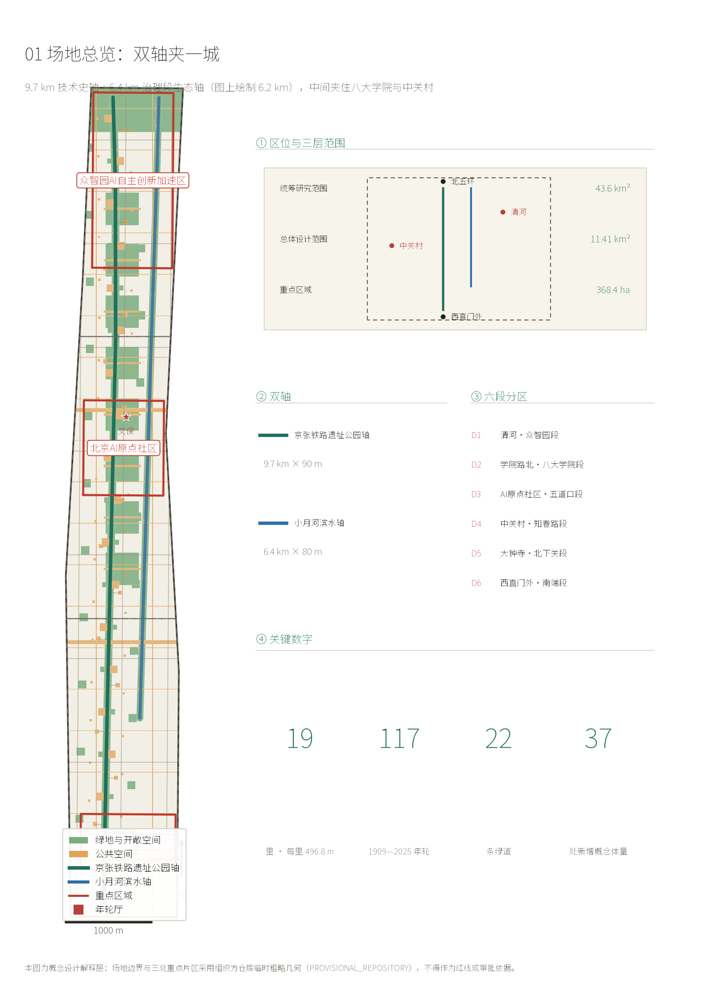
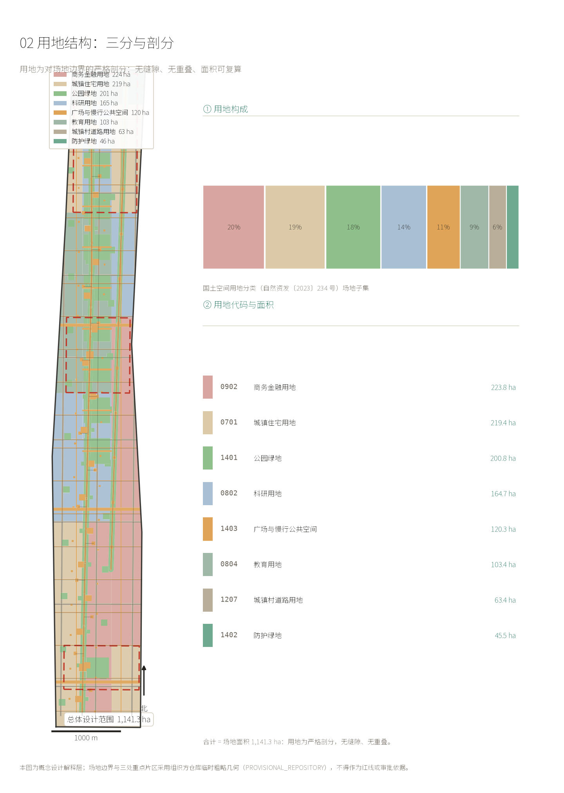
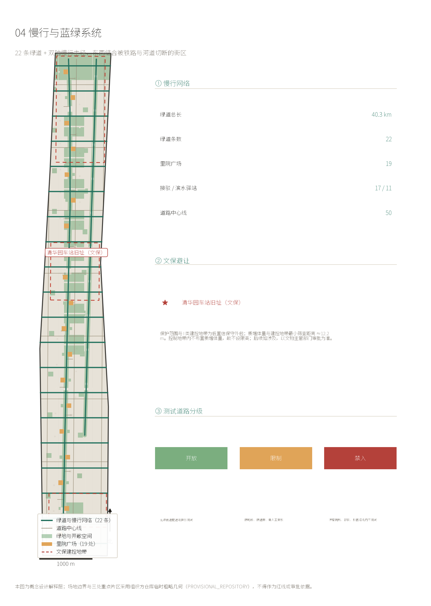
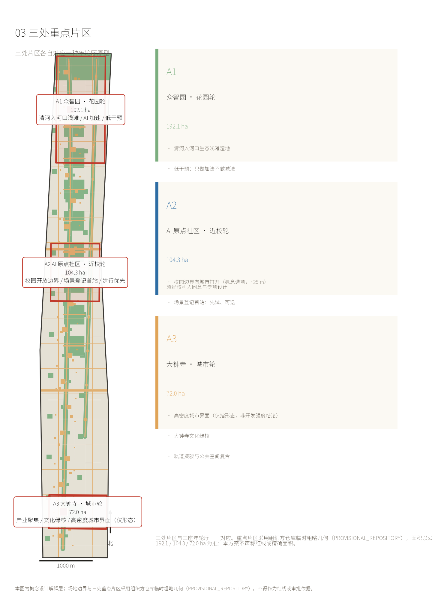
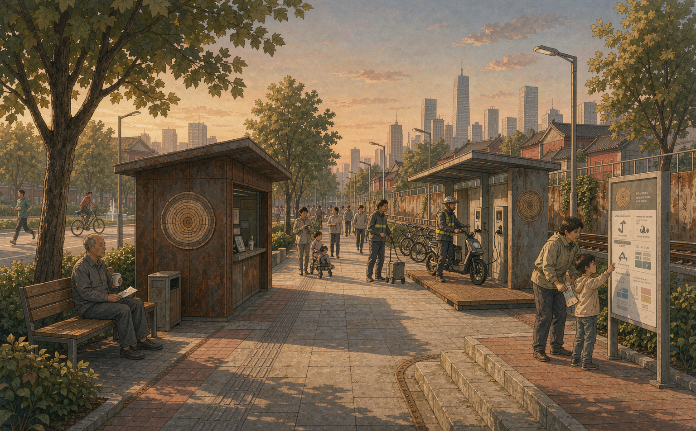
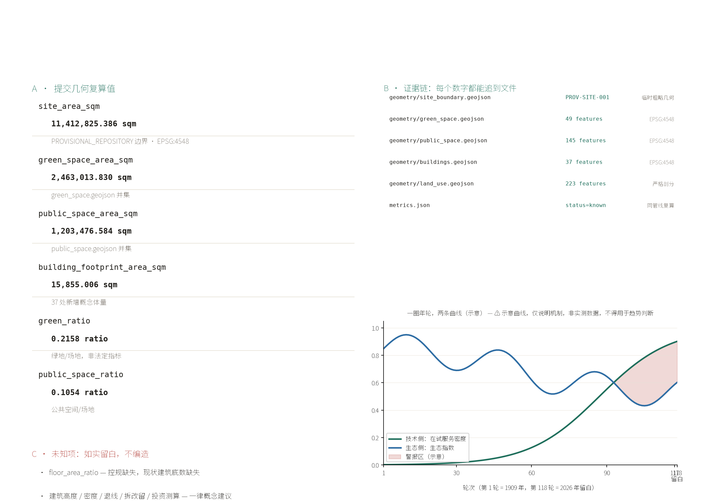
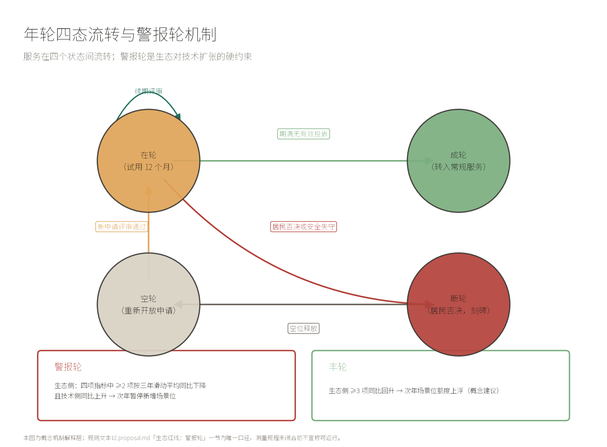

# 京张年轮：一圈年轮，两条曲线

## 设计依据与资料清单

本方案的依据分三类，界线必须说清。

**第一类是可作为任务依据的官方信息**：资格预审公告给出的三层范围四至与面积（统筹研究范围 43.6 平方公里、总体设计范围 11.4 平方公里、重点区域 368.4 公顷，以及三处重点区 192.1 / 104.3 / 72.0 公顷），面向智能体任务书的六项任务与评审口径，以及场地包中的允许设计空间、用地代码与专业标准索引 `[source:AGENT-TASKBOOK]` `[source:SITE-PACKAGE]`。

**第二类是本次补充检索到的公开事实**，它们改变了对场地的理解：京张铁路遗址公园**已经建成**——全长 9 公里、总面积约 70 公顷，一期（清华东路至知春路大运村，2.4 公里）2023 年 6 月开放，二期南北延展、2025 年主体建成；沿线设 46 个出入口、不设围墙，并修通 9 条城市支路；服务沿线近 70 个社区、约 45 万人、10 余所高校、40 余家科研机构；公园途经**北下关、北太平庄、学院路、中关村、清华园、花园路 7 个街道与东升镇** `[source:SRC-JINGZHANG-PARK-BJ]` `[source:SRC-JINGZHANG-PARK-STREETS]`。也就是说，任务书所说的"东西缝合"并非待办愿景，而是**已在施工的既成工程**——本方案不应重复它，而应回答"缝合之后怎么办"。

**第三类是同期在建的水系工程**，构成本方案的第二条轴：小月河治理段自祁家豁子闸至清河入口，长 6.4 公里，新增绿化 11 万平方米（以樱花为核心）、新建改建滨水步道 11.4 公里，布局为"一河四段七节点"，沿线正是**北大医学部、中国农业大学、北京林业大学、北京科技大学等"八大学院"** `[source:SRC-XIAOYUEHE-2026]` `[source:SRC-XIAOYUEHE-BJD]`；清河海淀段 10.36 公里同步疏浚，把硬质岸坡改为自然缓坡入水、塑造浅滩湿地，官方表述的目标原文是"实现鱼虾游弋、水鸟栖息的生物多样性愿景" `[source:SRC-QINGHE-2026]`。

**资料缺口的界线同样要说清。** 场地包中容积率、建筑高度、建筑密度、绿地率、退线五项**全部为缺失状态**；道路红线、地块权属、现状建筑底数、市政管线、文保矢量亦均缺失 `[source:SRC-SITE-PACKAGE-PLANNING-LIMITS]`。因此本方案**不给任何审定指标**，凡涉及强度与规模的量一律记为待确认，并在正文与结构化文件中同步标注。这不是保守，是因为编造这些数字会直接违反征集边界 `[standard:PROJECT-AGENT-OPEN-CALL-TASKBOOK]`。

2026 年 8 月，北京市人民政府门户网站报道了《京张铁路遗址公园沿线（人工智能创新街区重点地区）HD00-1601 等街区控规（2024—2035 年）》获批的消息，其中提到"一带一轴、两心多点"结构、大钟寺为两心之一 `[source:SRC-HD00-1601-KONGGUI]`。**需要说明：该来源目前为公开报道、尚未取得控规图则精确矢量，本方案将其作为待复核的背景信息使用，不作为审定依据**——正文中凡涉及该控规的内容仅为结构性呼应（本方案城市轮与大钟寺节点的位置关系、"以绿色公共空间引领区域更新"的方向与"双轴夹一城、生态为硬约束"同向），不据此推导任何地块指标、红线或审批状态。若该来源后续未能取得正式控规图则支撑，上述结构性呼应仅作为设计语境说明保留，不影响本方案任何指标的成立。

## 三层范围工作框架

三层范围不是三个依次缩小的同心圆，而是**三种不同的工作精度**。

统筹研究范围 43.6 平方公里（北至北五环路、东至京藏高速、南至西直门外大街、西至万泉河路）用于判断这条带在首都创新格局中的位置，工作方式是产业与生态的战略研究，不落具体图形。总体设计范围 11.4 平方公里（京张遗址公园周边 1—2 公里）是本次真正的设计对象，需要达到控制性详细规划深度的城市设计。重点区域 368.4 公顷是三个需要做到规划综合实施方案深度的片区。

从坐标上反算，总体设计范围是一条**约 1.37 公里宽、9.72 公里长的走廊**——这与公告"京张遗址公园周边 1—2 公里"的表述是一致的。走廊形态不是设计的产物，而是题目给定的条件。

这里出现一个必须正面回答的事实：三处重点区在这条走廊上**并不相连**。按公告自北向南的顺序，众智园、AI 原点社区、大钟寺三段南北长度分别约 2.06、1.12、0.66 公里，合计约 3.83 公里；走廊南北全长约 9.72 公里，**剩下约 5.89 公里是断裂带**。

这 5.89 公里不是一整块，由三部分组成。此处一并交代，以免读者自行做减法时发现对不上：

| 段落 | 长度 | 说明 |
|---|---|---|
| 众智园与 AI 原点社区之间 | 约 1.55 公里 | 断裂带北段 |
| AI 原点社区与大钟寺之间 | 约 3.73 公里 | 断裂带南段，较长 |
| 首区以北 / 末区以南的走廊端部 | 约 0.06 / 0.56 公里 | 三区并未顶到走廊南北两端 |

两段间隙合计约 5.28 公里，加上两端约 0.62 公里，合计约 5.89 公里，与"走廊 9.72 公里减去三区 3.83 公里"闭合。任务书把"南北连通"列为重点方向，原因正在于此。

另需说明两个长度基准，全文按此统一：**走廊几何全长 9.72 公里**（折合每里约 512 米），**双轴慢行主线 9.44 公里**（均分 19 里，每里 496.8 米，地面桩距以此为准）。两者约 300 米的差，来自慢行主线相对走廊边界在南北两端各有一段收束。命名体系表中的"里"以后者为准。

**断裂带里是什么？** 是高校围墙、家属院、早点摊、接送孩子的家长、菜市场与修车摊——也就是海淀最真实的日常。三座岛是规划划定的，断裂带才是生活长出来的。**本方案把主战场放在断裂带，而不是三座岛上。**

本方案使用场地包的 provisional 边界。三处重点区的 polygon 是按公告南北顺序与面积约束推定的**近似矩形**，官方未给四至，其边线不得解释为地块或道路红线；所有面积与比例均为概念量之比，官方 polygon 发布后须重算 `[assumption:A-BOUNDARY-001]`。

三层的边界与面积取自场地包的 provisional 几何 `[data:geometry/site_boundary.geojson#PROV-SITE-001]` 与三片重点区 `[data:geometry/key_areas.geojson#PROV-KEY-001]`，复算后的场地面积为 `[metric:site_area_sqm]`；数据缺口在 `[gap:GAP-BOUNDARY-001]` 与 `[gap:GAP-BOUNDARY-002]` 中逐条登记。

## 统筹研究范围产业与未来城市研究

### 一带总名与命名体系

**主名称：京张年轮（THE JINGZHANG RINGS）。副题：一圈年轮，两条曲线（One Ring, Two Curves）。**

"年轮"承载三重含义，每一重都是实指而非修辞。

其一为**时间**：京张铁路 1909 年建成。**1909 年为第 1 轮，2025 年为第 117 轮；2026 年即第 118 轮，留白待填**——它正好是清河与小月河治理工程竣工后的首个完整年度，也是"警报轮"机制首个具备完整复算条件的年份。

其二为**生态**：年轮是树木对每一年气候、水文与灾害的物理记录，年轮学（dendrochronology）正是通过读取这些年轮重建环境史。

其三为**技术**，这里要说清类比的边界。年轮与分布式账本在四个特征上同构：年度数据单元、时序不可逆、已形成的轮不可回溯修改、多株样本交叉定年（cross-dating）实现互校。但有一处根本差异必须说破——**账本的写入者是互不信任的多方，年轮的写入者是自然**：年轮提供的是"测量的互校"，不是"写入的分布"。

> 因此本方案不声称年轮具备密码学保证，**也不声称年轮具备分布式账本的全部关键特征**——此处只取"可复算的时序记录与交叉校验"这一层类比。制度层的不可篡改不由树保证，而由里长双签、公开台账与全量 changelog 保证；年轮提供的是时序纪律。 砍掉"年轮"两个字，这套治理机制依然成立——年轮做的是让它可被记住、可被指认、可被按年追问，而不是替它背书。

这不是把区块链的比方套到树上，而是反过来：树先做到了，账本后做到了——但树做到的那部分，和账本做到的那部分，并不完全重合，这一点我们自己先讲明。

命名体系按任务书要求成体系展开，而非只给一个名字：

| 层级 | 中文 | 英文 | 说明 |
|---|---|---|---|
| 一带总名 | 京张年轮 | THE JINGZHANG RINGS | 主名称 |
| 年单元 | 轮 | Ring | 1909 为第 1 轮，2025 为第 117 轮；**2026 为第 118 轮，留白** |
| 空间单元 | 里 | Li | 每里 496.8 米（慢行主线 9.44 km ÷ 19），全线 19 里，贴合市制一里 500 米 |
| 次单元 | 步 | Bu | 约 100 米，每里 5 步，即 4 根步桩 + 2 根界桩 |
| 集中锚点 | 年轮厅 | Ring Hall | 三座，落在双轴与三区的交汇点 |
| 地面装置 | 轮碑 / 里桩 / 步桩 | Ring Stone / Li Post / Bu Post | 耐候钢，里桩 1.1 米、步桩 0.45 米 |
| 责任单元 | 里长 | Li Keeper | 责任规划师与街巷长**双签** |
| 计量单位 | 里·时 | Li-Hour | 场景实际使用时长 |
| 状态 | 在轮 / 成轮 / 断轮 / 空轮 | Growing / Formed / Broken / Blank | 四态 |
| 预警 | 警报轮 | Alarm Ring | 技术密度上升而生态指标下降的年份 |

**视觉识别与 Logo 方向。** 主符号是一个**同心圆环组**：外环由 117 道细密的同心刻线构成，代表 1909 年以来的每一年；最外道留一道**未闭合的缺口**，即第 118 轮。色彩取银杏秋色（京张轴的 6 公里银杏长廊）与樱花粉白（小月河轴的 11 万平方米樱花）两色，分别对应两条轴。Logo 不使用任何具体企业标识、人物肖像或未清权字体，全部为可清权的原创几何构成。

### 三大定位、五大功能与三区两翼的落点

三大定位中，"百年京张文化带"落在京张轴，"AI 融合创新带"落在三座年轮厅，**"都市 AI 生活体验带"落在双轴之间的学院带与沿线 70 个社区**——本方案主张，生活体验带不在任何一个地标上，而在日常里。

五大功能中，"AI 全栈自主创新体系"对应众智园，"世界级 AI 创新生态"对应原点社区与中关村科技服务翼，"AI+场景赋能新范式"对应里/步可申请的场景位，"智能化 AI 活力城市"对应小月河轴与断裂带的市井现场，**"AI 治理全球话语权"对应里长制与年轮的不可篡改记录**。

三区两翼的落点按官方给定的形态类型分化：众智园为**花园型**、原点社区为**近校型**、大钟寺为**城市型**。这三个词不是本方案的发明，而是公告原文，本方案照此分化三座年轮厅 `[source:AGENT-TASKBOOK]`。

### 五至八个全球案例与可转化之处

| 案例 | 可转化的机制 | 在京张年的落点 |
|---|---|---|
| 巴黎小环线（Petite Ceinture） | 废弃环铁转为线性公共空间后，以"可逆使用"为原则保留复用可能 | 年轮的四态流转：任何 AI 服务默认可暂停、可移除、可被人接管 |
| 纽约高线（High Line） | 遗留高架结构转为高线绿地 | 直接对应：地铁 13 号线扩能后遗留高架**已规划为高线绿地**，京张轴可参照其运营节奏 |
| 卡伦堡工业共生体（Kalundborg） | 中性协调体测绘"资源流"，参与方按需接入与退出 | 年轮厅绘制数据—算力—人才—场景的资源流图，任一资源流可逆 |
| 多伦多 Quayside | 反面教材：数据治理若不由居民受益，项目会失去社会许可 | **数据不出院** + 里长制，把合规从防守项变成展示项 |
| 首尔清溪川 | 覆盖河道重见天日后，生态与公共生活同步回升 | 小月河从"城北龙须沟"到樱花长廊的既有路径，本方案只叠加记录层 |
| 新加坡 ABC 水计划 | 把排水渠转为"活跃、美观、清洁"的公共资产 | 清河"自然缓坡入水 + 浅滩湿地"的既定做法，本方案补上年度生态度量 |
| 伦敦智慧城市的"可逆采购"实践 | 技术合约内置退出条款，避免锁定 | 里·时的到期与续期机制 |
| 京都城市景观条例 | 以物候与季相为管控对象，而不仅是形态 | 年轮把银杏与樱花物候期纳入年度记录 |

### 六项任务的实质交付闭合表

任务书 agent.1—agent.6 的每一项，下表逐项闭合：要求、本方案的实质交付物、证据在包内的位置。不是指路，是交卷。

| 任务 | 任务书核心要求 | 本方案实质交付 | 包内证据位置 |
|---|---|---|---|
| **agent.1 总体概念与功能统筹** | 命名体系、Logo 方向、三大定位五大功能、总体空间结构图 | 主名称「京张年轮 / THE JINGZHANG RINGS」+ Ring/Li/Bu 空间寻址命名体系；Logo 方向为同心年轮加断口（视觉识别一节）；三大定位落点（文化带→京张轴、创新带→三座年轮厅、生活体验带→双轴间学院带与 70 社区）；「双轴夹一城 + 十九里 + 三厅」总体结构 | 本节「一带总名与命名体系」「三大定位、五大功能与三区两翼的落点」；`assets/figures/site-overview.png`、`land-use-structure.png`；`geometry/site_boundary.geojson` 等 9 图层；`[metric:site_area_sqm]` `[metric:green_ratio]` `[metric:public_space_ratio]` |
| **agent.2 AI 全栈自主创新体系与创新生态** | 5–8 个全球案例、生态图谱、众智园全栈体系、八要素机制 | 全球案例表（本节「五至八个全球案例与可转化之处」，逐项标注可转化点）；生态链「基础研究→场景验证」落位（「AI 创新生态」一节）；众智园全栈体系落在 A1 花园轮低强度庭院布局（A1 一节）；土地/空间/资金/人才等机制落在运营三层通道（政府保底/机构共治/社会增量，「年度活动体系与长期运营」） | 本节案例表；「AI 创新生态、人才画像与 AI+ 场景—生态链」；「A1 众智园·花园轮」；「更新项目清单—年度活动体系与长期运营」；`[source:SRC-URBAN-PARTNER]` |
| **agent.3 AI+ 场景赋能与活力城市** | ≥10 场景卡、≥3 验证场景、≥5 用户画像、场景-空间-运营映射、隐私边界 | 12 张场景卡（S-01—S-12），每张按「第 X 里第 Y 步」空间定位、标注数据边界与人工复核方式；3 个验证场景（V-1 A/B 对照、V-2 数据链回溯、V-3 响应闭环）；6 类用户画像（科研人员/创业团队/学生教师/老居民/骑手/接送家长），各带隐私边界列；四类禁入场景硬边界 | 「AI 创新生态、人才画像与 AI+ 场景」全节（画像表 / 场景卡 / 验证场景 / 隐私硬边界）；`[metric:scenario_positions_total]`=95、`[metric:scenario_posts_total]`=47；`geometry/phasing.geojson` |
| **agent.4 AI 公共空间与朝圣地标** | AI 公共空间、东西缝合策略、≥3 个朝圣地标、荣誉展示体系、组件库 | 3 个朝圣地标：第 118 轮留白轮碑、断轮碑（记录被居民否决的技术）、年轮荣誉墙；荣誉展示体系 = 荣誉墙刻名 + 年度公报；组件库 = 里桩/步桩/界桩/里院服务亭的标准化构件（19 里 × 5 步刻度体系）；东西缝合不做桥隧工程结论，采用「借道绕行 + 界面化处理」 | 「蓝绿空间、公共空间与城市风貌—三个 AI 朝圣地标」；「交通：测试道路分级」；「用地、建筑规模与拆改留方案」；`[metric:li_count]`=19、`[metric:li_length_m]`=496.8；`assets/figures/mobility-bluegreen.png` |
| **agent.5 文化融合叙事** | 京张历史文化、中关村与 AI 新文化、空间文化系统、导视符号、国际传播 | 核心叙事「不是铁路的隐喻，是铁路的纪年」：里程标→年轮，把不可见的算法变得可指认（本节末「文化叙事」）；符号系统 = 年轮四态（在轮/成轮/断轮/空轮）+ 警报轮/丰轮，全部可落到地面桩位与导视；国际命名 = Ring/Li/Bu 双语寻址；主动限定年轮与分布式账本类比的边界，不把隐喻伪装成密码学保证 | 本节「文化叙事：不是铁路的隐喻，是铁路的纪年」；「一带总名与命名体系」（Ring/Li/Bu 双语）；警报轮一节；`report/proposal.en.html`（完整英文叙事，面向国际传播） |
| **agent.6 活动体系与长期运营** | 年度活动体系、品牌传播、开发者社区、场景开放运营、转化路径 | 年度活动体系 = 年轮四态流转本身：每年一次年度复核（续期/成轮/断轮/重开）、每年一圈年轮（生态四指标+技术两指标同图发布）、每里一位里长对接 12345；运营资金三层通道（概念建议）；转化路径 = 年报作为可复制产品向未来科学城/怀柔科学城/经开区输出（明确标注为概念建议，非政府承诺） | 「更新项目清单、实施政策与分期计划—十年三期 / 年度活动体系与长期运营 / 招引转化的边界」；`[metric:ring_count]`=117、`[metric:alarm_ring_threshold]`；`geometry/phasing.geojson` |

六项任务各有实质交付物落在包内文件上；没有一项只有口号。区域协同一项如实说明：目前停留在年报机制的概念输出，尚未形成跨区主体—资源—项目闭环，这是本方案已知边界而非遗漏。

年轮的年报格式（生态侧四指标 + 技术侧两指标，同图发布）本身是一件可向区域复制的产品：中关村科学城内部先跑通，再作为**概念建议**输出给未来科学城、怀柔科学城与经开区的同类走廊；在京张体育文化旅游带的尺度上，京张年轮是海淀段对 1909 纪年的接续，而非独占。

### 文化叙事：不是"铁路的隐喻"，是"铁路的纪年"

前人的方案已经把京张铁路的工程意象用得很充分——人字形折返线、水准测量的闭合误差、可逆走廊。本方案换一个更少被触及的角度：**京张铁路留给城市治理的真正遗产不是某一种工程形式，而是一种纪年方式。**

铁路用 `K12+500` 这样的里程标记，把一条看不见全貌的线变成可定位、可分工、可维修、可追责的系统。詹天佑在八达岭打竖井，是为了**让看不见的地下变得可施工**。今天我们在城市里立年轮，是为了**让看不见的算法变得可指认**。两者是同一件事：让不可见的东西变得可定位、可追责。

而年轮比里程标更进一步：里程标标记空间，年轮标记**时间**。一条 9.7 公里的走廊，每年长一圈——它记录的不只是"这里有什么"，而是"这里每一年发生了什么"。

下面两段 AI 生成的概念短片是这一叙事的解释层（各约 5 秒）：第一段让年轮沿廊道逐年生长（`assets/media/ring-year-opening.mp4`），第二段落在断轮碑——被否决的技术不被抹去、而成为一圈断轮（`assets/media/broken-ring-stone.mp4`）。两段均配双语字幕与转写文本，登记于 manifest。**它们是概念解释层，不是现场影像、实测数据或工程承诺。**

## 总体设计范围城市更新与控规深度城市设计

### 空间结构：不是一条线，是双轴夹一城

**本方案的核心空间判断是：这条带不是一条线，而是两条既有的线性基础设施夹着一条学院带。**

京张铁路遗址公园在西（9 公里，已建成，承载铁路遗产与文化），小月河滨水空间在东（6.4 公里治理段，2026 年在建，承载水系与生态），**中间夹着八大学院、中关村与沿线 70 个社区**。这个"一铁一水夹一城"的格局不是本方案编造的结构，而是把两条已经存在或正在施工的线性工程，与它们之间真实的城市内容，如实叠在一起的结果。

因此空间结构表述为：**双轴 + 十九里 + 三厅**。双轴是骨架，19 里是刻度，三座年轮厅是双轴与三区交汇处的集中锚点。

### 用地三分：可试验 / 受限 / 生活保留

传统产业带规划关心"产业用地占比多少"。在控规五项指标全部缺失、且北京处于减量发展阶段的前提下，这个问法不成立。本方案改用另一种三分：

- **可试验用地**（可申请的场景位）：双轴的公共活动带、19 处里桩与 76 处步桩周边、三座年轮厅周边。这些是本方案认为**可以开放给 AI 服务做有期限试验**的地方。
- **受限用地**：文物保护建控地带、铁路工程安全限界、河道蓝线、高校与科研院所权属范围。这些地方**不开放**，且在图纸与图层上明确标注为禁入。
- **生活保留用地**：沿线 70 个社区的日常空间——早点摊、菜市场、修车摊、接送等候区、树荫下的马扎。这些地方**不做"提升"类改造**，只保证其连续性、安全性与不被驱赶。

这个三分的价值在于：它把"AI 能进哪里"这件事从事后审批变成了事前地图。

### 六段落位：把三分落到具体的哪一段

三分法若只停在原则层，"空间明确性"就落空。因此本方案按走廊自北向南切分的**六个段落**（D1—D6，见总览图）逐段落位。六段不是新的设计发明，而是把已经存在的城市内容与前述三分对上的结果：

| 段落 | 大致范围 | 主导属性 | 主要动作 |
|---|---|---|---|
| **D1** | 清河入河口—众智园 | 生态优先 | 第一年轮厅、生态年轮数据采集起点 |
| **D2** | 学院路北—八大学院段 | **生活保留** | 围墙界面化为唯一介入动作；不动墙体、不动权属 |
| **D3** | AI 原点社区—五道口段 | **可试验** | 场景卡与一期动作的集中段；大院食堂开放窗口、里/步试点 |
| **D4** | 中关村—知春路段 | **生活保留** | 断裂带南段主体；日常连续性优先，不做提升类改造 |
| **D5** | 大钟寺—北下关段 | **可试验** | 第三年轮厅、全线在试服务总览与国际传播窗口 |
| **D6** | 西直门外—南端 | 通行与生态连续 | 与北京北站门户衔接，慢行连续 |

两段断裂带的主体即 **D2 与 D4**，它们同时也是 19 里中编号相连的若干里——因此断裂带同样可以"报里号"，与场景卡的定位体系共用一套刻度。以下是六个段落对应的里号区间与两段间隙的位置关系：

- **D2（北断裂带，约 1.55 公里）**：约第 5—8 里
- **D4（南断裂带，约 3.73 公里）**：约第 12—19 里

需要说明：段落边界为按走廊长度等分的示意划分，用于说明"哪一段干什么"，**不代表地块边界、行政边界或道路红线**；里号区间同理，是刻度体系内的定位，不是权属或红线。

### 交通：测试道路分级，而非路网加密

在道路红线与断面数据缺失（GAP-ROAD-001）的前提下，谈路网加密是不负责任的。本方案只做一件数据允许的事：**把既有道路按"是否开放 AI 测试"分级**。

- **开放级**：双轴的步道与慢跑道，开放低速配送机器人、导盲与助老机器人、AI 导览等低速场景
- **限制级**：9 条东西缝合支路，仅开放非机动车道的试点时段
- **禁入级**：涉及文保建控、铁路安全限界与学校门口接送时段的路段

所有分级均为概念建议，线位不代表道路红线，须待官方道路红线与交通专项数据补齐后核定 `[assumption:A-CONTROLS-001]`。道路中心线按可编辑层要求入库 `[data:geometry/roads.geojson#GRN-RAIL]`，分级状态同步记录在 `[depth:traffic_slow_traffic]` 对应的深度项中。

## 重点区域详细设计

### A1 众智园 · 花园轮（花园型）

定位对应"AI 全栈自主创新体系"与"AI 治理全球话语权"；形态类型为花园型。

**双轴北端交汇点。** 清河入河口的浅滩湿地缓冲带就在这一区北侧——清河海淀段正在把硬质岸坡改为自然缓坡入水、以芦苇菖蒲塑造浅滩湿地，官方目标是"鱼虾游弋、水鸟栖息" `[source:SRC-QINGHE-2026]`。本方案把**第一年轮厅（花园轮）设在清河缓坡入水段的南缘**，使其成为"生态年轮"的起点：这一年轮的生态侧数据，就从这条河开始采集。

空间结构上，花园轮采用低强度庭院式布局，主体为单层至两层的小体量院落，围绕一片保留林展开。不做高层、不做地标塔——花园型定位与减量发展都不支持。AI 场景以**环境感知类**为主：水质传感、鸟类声学监测、植被物候记录。**具体地，这一厅负责把"生态年轮"的数据采集方法跑通，供全线复制。**

建筑更新以保留与织补为主，拆改留须待权属与现状建筑数据补齐后另行核定，本方案不作结论。实施风险主要是权属：这一区北侧涉及清河河道管理范围与部分院所用地，须待边界条件明确。

### A2 北京 AI 原点社区 · 近校轮（近校型）

定位对应"世界级 AI 创新生态"；形态类型为**近校型**。

**这是本方案的主战场。** 理由有二。其一，官方把这一区定义为"近校型、人才吸引力、科技成果转化"，而八大学院正沿小月河分布——北大医学部、中国农业大学、北京林业大学、北京科技大学等 `[source:SRC-XIAOYUEHE-BJD]`。其二，这一区紧邻**清华园车站旧址**（成府路与中关村东路交叉口向西约 80 米路南，1910 年詹天佑设计督建，北京市第九批市级文物保护单位）。

**文保约束必须正面处理。** 该旧址的保护范围为东 8 米、南 2 米、西 2 米、北 2 米；I 类建设控制地带为南 20 米、西 8 米、北 17 米；V 类三块地带内**不得新建建（构）筑物**，或不得新建与文物保护和展示利用无关的建构筑物，建设前应加强考古勘探 `[source:SRC-BJ-WWJ-QINGHUAYUAN-STATION]`。本方案的所有新增要素均位于这一外包的**外侧**，第二里站只做**界面与导视，不改本体、不进建控地带**；该外包的精确矢量尚未取得，正式设计前须以文物主管部门矢量复核 `[assumption:A-HERITAGE-001]`。

**近校轮做什么？** 三件事，都是低成本的存量动作：

1. **围墙界面化**：高校围墙不做拆除，只在其外侧设置成果转化展示界面——把院内的科研成果以可更换展板的形式呈现给街道。这回应"近校型"的核心诉求，且不动权属。
2. **大院食堂开放窗口**：沿线院所与高校的食堂在 11:30—13:00 向社会开放一个窗口。这是本方案中**性价比最高的动作**——不新建、不投资、用存量，解决的是最真实的民生需求：周边没有食堂的年轻从业者、吃腻外卖的程序员、独居老人。
3. **生活实验室**：这一区的里/步优先开放与日常生活直接相关的场景（助老、托幼接送、社区医疗咨询），并采用**A/B 对照**：同一条街的一半试点、一半不试点，用可复算的数据判断效果，而不是靠主观评价。

### A3 大钟寺 · 城市轮（城市型）

定位对应"智能原生新业态"；形态类型为城市型，承担"更具世界影响力、城市发展活力"的角色。

**双轴南端交汇点，紧邻北京北站门户。** 第三年轮厅（城市轮）设在大钟寺站周边，形态为城市型的高密度界面，功能是**全线在试服务的总览与国际传播窗口**：一个实体展厅，实时显示 19 里上每一处在试、成轮、断轮、空轮的状态。

这一厅同时承担官方"碑刻留名"体系的接口：年轮荣誉墙刻写历任里长与贡献者。**但与官方纪念"创造者"不同，本方案同时刻写"负责人"**——每一个在试的 AI 服务旁边，写着为它签字的人。

风险在于：这一区城市型定位与高强度开发之间存在张力，而控规指标缺失。本方案的处理是**明确不给开发强度结论**，只提出功能与界面的概念建议，规模待核定。

## AI 创新生态、人才画像与 AI+ 场景

### 生态链：从基础研究到场景验证

本方案不列企业名单、不写产值、不写招商承诺——任务书明确禁止 `[standard:PROJECT-AGENT-OPEN-CALL-TASKBOOK]`。它做的是**把生态链的空间接口说清楚**：基础研究在八大学院与 40 余家科研机构（双轴之间），中试与转化在近校轮的围墙界面，场景验证在 95 个里/步位——这是**可寻址位置数**（19 里 × 5 步），场景卡按「第 X 里第 Y 步」申请与定位；与之并列的另一个数字是**一期实物设施 47 处**（19 里院广场 + 17 接驳驿站 + 11 滨水驿站）。两者口径不同：前者是寻址单元，后者是要落地建造的东西，不可互相推导。产品化在城市轮，资本与认证服务在中关村科技服务翼。这条链上的每一环，都对应一个物理位置。

### 五类以上用户画像

| 画像 | 主要时段与行为 | 与年轮的关系 | 隐私与人工复核边界 |
|---|---|---|---|
| **院所科研人员** | 工作日白天，往返于实验室与食堂 | 成果转化的申请方；围墙界面的内容供给者 | 成果展示须经所属单位清权，不涉密 |
| **AI 创业团队（微型）** | 全时段，租用共享空间，急需真实测试环境 | 里/步场景位的主要申请方 | 试验数据脱敏后方可公开；涉及人脸的一律不采 |
| **高校学生与青年教师** | 早晚通勤、夜间活动 | 场景的主要体验者与反馈者 | 反馈以"报里号"形式，不绑定个人身份 |
| **沿线老居民（含独居老人）** | 06:00—08:30 早点、19:00—21:00 遛弯 | 生活保留用地的主要使用者；否决权的主要行使者 | 不采集生物特征；助老服务保留人工兜底 |
| **外卖与快递骑手** | 12:00—13:00 聚集 | 骑手驿站的使用者；低速配送场景的实际操作者 | 轨迹数据不出院、不用于劳动考核 |
| **接送孩子的家长** | 07:30—08:30、15:30—16:30 | 学校门口等候区的主要使用者 | 学校门口 200 米内不设任何采集设备 |

### 十张以上场景卡

以下场景卡按"里—步"编号定位，均标注数据边界与人工复核方式。所有场景均为**概念建议**，期限默认 12 个月，可续可退。

**S-01｜第三里第二步 · 院墙下的早点摊**（06:00—08:30）
不是把早点摊智能化，而是**给它一个合法、不被驱赶的固定位置**：划定 6 个固定摊位、提供水电接口与收纳设施。AI 只做一件事——人流计数用于**摊位时段弹性管理**，数据当日清零、不留存个人。人工复核：摊主自治小组每月一次。

**S-02｜第五里第四步 · 学校门口接送区**（07:30—08:30、15:30—16:30）
在接送高峰时段做弹性交通组织与等候区遮阳避雨。**学校门口 200 米范围内不设任何影像采集设备**——这条是硬边界，不是选项。人工复核：由家长志愿者与里长共同值守。

**S-03｜第七里第一步 · 大院食堂开放窗口**（11:30—13:00）★
存量公共服务向社会开一个窗口。AI 只做余量预测与排队提示，不涉及任何个人数据。人工复核：食堂管理方。这是本方案成本最低、受益面最广的动作。

**S-04｜第七里第三步 · 围墙成果转化界面**（全时段）
高校围墙外侧的可更换展板，展示院内可公开的科研成果。**内容须经所属单位清权，不涉密、不涉未发表数据**。人工复核：院所科研处 + 里长双签。

**S-05｜第十里第三步 · 骑手驿站**（12:00—13:00 高峰）
提供歇脚、充电、饮水与如厕。**骑手轨迹数据不出院、不用于劳动考核**——这条写进运营规则，防止效率工具变成监控工具。人工复核：驿站管理员。

**S-06｜第十三里第二步 · 非正规摊位的共生登记**（周末）
修车摊、配钥匙、裁缝铺等非正规业态**不被清除，只做登记**。年轮记录它们的位置与存续年数——这正是"数据免疫耐受层"的体现：区分有害与无害的非常规，对后者赋予免疫记忆而非清除。

**S-07｜第十六里第五步 · 树荫下的马扎**（全天）
**本场景不引入任何 AI 功能。** 保留它，是因为替代方案尚未证明更优。城市里必须留有不被优化的地方——这不是保守，是对"优化"本身的边界自觉。

**S-08｜第十八里第一步 · 傍晚遛弯照明**（19:00—21:00）
沿双轴的连续照明与座椅密度，按人流浓度自动调节亮度。**采红外/热力计数，不采人脸、不采手机 MAC**。人工复核：里长按周巡检。

**S-09｜全线 · 低速配送机器人**（试点时段）
在开放级道路上试点低速配送与助老机器人。限速、限时段、限路径，配备随行安全员。人工复核：安全员可随时接管。

**S-10｜全线 · 鸟类与水质声学监测**（全时段）★
在双轴布设声学传感器与水质探头，用声纹识别统计鸟种、用常规指标监测水质。**这是"生态年轮"的数据来源**，也是本方案与纯技术方案的根本区别：它同时度量自然。

**S-11｜第十九里 · 空轮预置**（长期）
第 118 轮的位置预置为空白轮碑，刻 `待填` 与年份。**这是给未来的位置，也是给错误的。**

**S-12｜三座年轮厅 · 年轮总览**（全时段）
实体展厅实时显示全线 19 里的四态分布与当年两条曲线的对比。

### 无 AI 基线原则

每张场景卡背后都有一条共同规则：**AI 必须证明自己比"没有 AI"更好，才有资格留下。** 具体做法是——每个场景在进入试点前，先以纯人工方式运行一段基线期（人工排班、纸本登记、固定标识、机械钥匙），记录等待时长、冲突与投诉；AI 上线后，只有在不降低安全、公平与可达性的前提下，证明它能减少等待、漏报或重复劳动，才进入续期评审。**若没有净公共价值，撤除的是模型，不是基本服务**——摊位还在、窗口还开、驿站还在，只是没有人再声称它需要算法。这条原则与警报轮是同一枚硬币的两面：警报轮管生态侧的"不能更多"，基线原则管技术侧的"必须更值"。

### 五个场景的一日时间剖面

机制写到"里—步"还不够，还要落到一天的具体时刻。以下五个剖面覆盖使用强度最高、冲突最集中的场景。先看一张概念场景图——它检验的是人本空间关系：老人、亲子、骑手、值守人员在同一处里院节点共存，人工服务与机械兜底都可见。**它是 AI 生成的解释层，不是现场照片、现状调查或工程承诺，不能作为边界、面积或实施依据。**

**S-01 早点摊（第三里第二步）**
- 05:30 摊主到场接水接电，06:00 开摊——**此时无 AI**，只有固定摊位划线与照明。
- 07:00—08:30 高峰：院所职工与送孩子的家长叠加。人流计数器只输出"当前拥挤度"三色灯给摊主自治小组，**当日 24:00 数据清零**。
- 09:00 收摊，摊主自治小组检查地面油污与垃圾——这是自治公约的硬性条款，比任何传感器都管用。
- **失效兜底**：计数器坏了 → 摊位照常开，摊主自治小组按纸本公约管理，传感器修不修由摊主投票决定，不由管理方决定。

**S-02 学校接送区（第五里第四步）**
- 07:30—08:30、15:30—16:30 两个高峰。**200 米内无任何影像采集设备**——遮阳棚、等候座椅、弹性隔离桩全部是纯物理设施。
- 唯一的"智能"是校门口的**电子墨水屏显示今日限行提示与天气**，内容由学校值班老师每天早上手动更新——它不需要联网，也不采集任何东西。
- **失效兜底**：电子屏坏了 → 值班老师挂出白板。接送秩序依赖家长志愿者与里长值守，不依赖任何算法。

**S-03 食堂窗口（第七里第一步）**
- 11:00 食堂管理方根据昨日剩余与今日预订（纸本+电话）预估对外供应份数。
- 11:30—13:00 开放。AI 余量预测只在**第 81 天影子模式之后**才可能介入，且只输出给窗口工作人员一条建议："今天建议多备 20 份。"——**最终备餐量永远由厨师长拍板**。
- 排队超过 15 分钟 → 窗口工作人员举"暂停"牌，引导到院内其他窗口——人工优先于算法调度。
- **失效兜底**：预测模型下线 → 回到厨师长经验 + 昨日纸本记录，服务质量不降级。

**S-05 骑手驿站（第十里第三步）**
- 11:30—13:30 高峰：驿站管理员（人工）引导骑手分区停放，充电桩先到先得。
- **轨迹数据不出院、不用于劳动考核**——这条写入驿站运营协议的第一条，驿站内不设任何与平台系统对接的打卡设备。
- 驿站 WiFi 是开放式公共网络，骑手连不连、用来干什么，管理方不记录。
- **失效兜底**：充电桩故障 → 管理员开放普通插座；驿站关门日 → 门口张贴最近的替代驿站地图。

**S-10 生态监测（全线）**
- 全天候运行，但它服务的不是某个"用户"，而是**年轮本身**：声学传感器记录鸟种、水质探头记录常规指标，数据每日汇入公开台账。
- **观测规程未闭合前，所有数据标记为"试运行"**，不进入警报轮判定——这是规则，不是技术缺陷。
- **失效兜底**：传感器离线 → 该指标该年不参与投票（metrics.json 已写明缺测处理规则），年轮记录"数据缺失"而不编造数值。

### 三个以上测试验证场景

**V-1｜低速配送机器人的 A/B 对照**
在第十三里至第十五里之间选两条条件相近的路段，一段开放机器人配送、一段不开放，连续 12 周记录通行效率、冲突次数与居民投诉量。**设置对照是本方案的方法论底线**——没有对照的试点无法判断效果，只能产生故事。

**V-2｜生态年轮的数据链验证**
在第 118 轮（首个完整年度）之前，用清河海淀段与小月河治理工程的既有监测数据做回溯验证，检验年轮指标能否复算既有结论。**可复算才是指标，否则只是比喻。**

**V-3｜"报里号"的响应闭环验证**
选取 3 个里做试点，检验居民"报里号"到问题处置的响应时长与办结率，与既有接诉即办的平均水平对照。

### 隐私与人工复核的硬边界

四类场景**一律禁止**：涉及人脸识别或生物特征识别的；无法人工复核的；使用非公开数据或隐私数据的；把测试场景写成已批准运营的。每条场景卡均标注责任主体与人工复核方式，**没有人工复核路径的场景不予登记**。

## 用地、建筑规模与拆改留方案

本节的立场是明确且不妥协的：**控规五项指标全部缺失，现状建筑底数缺失，地块权属缺失。因此本节不给容积率、不给建筑高度、不给建筑密度、不给拆改留结论。**

方案中出现的建筑量共 37 处，均为**概念体量**：三座年轮厅、19 处里院服务亭、11 处滨水驿站与 4 处社区服务中心，合计基底约 1.59 万平方米，且明确标注为非审定规模，不得据此推导容积率。

在用地三分（可试验 / 受限 / 生活保留）之下，拆改留的处理原则是：**保留为默认，改造须论证，拆除须另行核定。** 沿线 70 个社区的日常空间——早点摊、菜市场、修车摊、马扎——全部归入"生活保留"，不做提升类改造。这不是保护主义，而是承认这些空间的低效、非标准与不可预测本身就是其价值所在。

本方案在此明确：**若日后有证据表明某种替代方案确实更优，本方案不反对替换。当前不替换，只是因为尚未证明。**

上述立场与场地包的允许声明一致：容积率、建筑高度、建筑密度与退线在 `[gap:GAP-CONTROL-001]` 中均为缺失，现状地块权属见 `[gap:GAP-PARCEL-001]`、现状建筑底数见 `[gap:GAP-BUILDING-001]`。本方案中唯一的建筑量为三座年轮厅与一处服务综合体的概念基底 `[data:geometry/buildings.geojson#BLD-HALL-01]`，对应 `[metric:building_footprint_area_sqm]`，明确标注为非审定规模。

## 交通、轨道、市政与公共服务设施

交通方面已在上文说明测试道路分级。轨道方面，地铁 13 号线扩能改造后部分路段入地，**遗留高架将变为高线绿地** `[source:SRC-JINGZHANG-PARK-HD]`——这是既成规划，本方案将其与京张绿轴、小月河水轴一并纳入"三道一绿"的连续体系，并在大钟寺站、知春路站等节点衔接自行车停放。

市政方面，管线、消防通道、防洪排涝与海绵城市条件均缺失（GAP-MUNICIPAL-001）。本方案不作管线迁改或消防通道的工程结论，只提两条体系性建议：其一，地面装置优先采用**浅基础与可逆安装**以避让管线，但**基础形式与埋深在本方案中不作任何数值规定**——须在取得正式管线、岩土、树根与防洪排涝资料并经专业复核后确定；其二，滨水段设施采用**架空或贴装**，不缩小行洪断面。

公共服务设施底数缺失（GAP-SERVICE-001），因此不列设施容量。只提一项低成本高收益的建议：**大院食堂开放窗口**在 11:30—13:00 向社会开放，等于在不新增任何建筑面积的前提下，为沿线增加数十处公共就餐供给。

## 蓝绿空间、公共空间与城市风貌

### 三个 AI 朝圣地标

**地标一：第 118 轮（留白轮）**
位于京张轴南端起点。材质与全线轮碑一致（耐候钢，高 1.1 米），但表面只刻 `第118轮`、年份与一个待填的空白区。**它是留给未来的，也是留给错误的。** 每年的年度复核会上，若无注销事件，则刻当年年份与"无注销"——保持装置的存在感，避免它沦为废弃设施。

**地标二：断轮碑**
位于京张遗址公园中段。**纪念被居民投票否决而下线的 AI 服务。** 拟刻内容为：服务编号、所在里号、在轮起止年月、注销年月。

断轮不是失败。年轮学里，干旱、火灾与虫灾的年份会形成**断轮、霜轮与伪轮**，这些"异常轮"恰恰是环境史中最有价值的档案——它们记录的是这座城市经历过的压力。本方案把这个自然现象转为制度：**被否决的技术不被抹去，而成为一圈断轮。断轮不是失败，是这一年这座城市做过的判断。**

刻写规则：须**里长双签**（责任规划师与街巷长），并在公开台账登记后由指定厂商刻制；段长无单独刻写权；每次刻写全量计入 changelog，任何居民可查。全线设 3 处，不做多。

**地标三：年轮荣誉墙**
位于城市轮（大钟寺）。刻写历任里长与贡献者。**与官方"GitHub ID 碑刻留名"的关系是补充而非替代**：官方纪念创造者，本方案同时刻写**负责人**——每一个在试的 AI 服务旁边，写着为它签字的人。核心主张是一句话：**AI 城市的纪念物，不该只纪念 AI，应该纪念为 AI 负责的人。**

### 蓝绿系统与风貌

京张轴的 6 公里银杏长廊与小月河轴的 11 万平方米樱花长廊是既成或既定的种植结构，本方案不改动，只在其上叠加年度物候记录——**银杏与樱花的物候期（展叶、开花、落叶）本身就是年轮生态侧最直观的两项数据**，且无需新建任何设施即可采集。

风貌控制上，本方案只提一条原则：**不做地标塔、不做未来感造型。** 三个重点区的形态类型已由官方给定（花园型 / 近校型 / 城市型），本方案照此分化，不追求视觉冲击。理由是：这条带真正稀缺的不是形象，是连续性。

绿地与公共空间的图层分别为 `[data:geometry/green_space.geojson#G-RAIL]` 与 `[data:geometry/public_space.geojson#PROM-RAIL]`，对应的核心指标为 `[metric:green_ratio]` 与 `[metric:public_space_ratio]`；三处地标的位置与刻写规则登记在 `[depth:landmark_design]` 项中。

## 更新项目清单、实施政策与分期计划

### 十年三期

**一期（1—3 年）· 中段近校示范段**：优先做低争议、低成本、高频使用的部分——里桩与步桩铺设、大院食堂开放窗口、早点摊合法化、骑手驿站、A/B 对照试点。这一段位于 A2 近校轮周边，是断裂带中日常密度最高的部分。

三座年轮厅与 19 里院按**节点产品**逐批开放：一期先开放近校轮周边 2—3 个节点，其后每 1—2 年开放一批，维持滚动节奏。运营资金按三层通道设计（均为概念建议）：**政府保底**——里桩/步桩/轮碑属小微城市家具，建议纳入既有街巷更新与城市家具维护科目；**机构共治**——呼应官方"城市合伙人"机制，建议升级为常设共治平台，沿线高校院所进席位 `[source:SRC-URBAN-PARTNER]`；**社会增量**——设捐赠与志愿者通道，把志愿时数与年度踏勘写入运营 KPI。

**二期（4—7 年）· 南北延展与双轴贯通**：向南北两端铺开，完成 19 里的连续体系与三座年轮厅。

**三期（8—10 年）· 需权属突破段**：涉及高校与科研院所权属的段落，须待权属与边界条件明确后推进。**本方案明确承认这一段可能推不动。**

### 实施项目包：谁牵头、什么门槛、失败退什么

「十年三期」回答的是节奏；下表回答的是责任。九个实施包各自点名牵头责任方类型、开工门槛（不满足不开工）、阶段验收标准与失败后的退出资产——**退出资产指项目即使被撤销，也要留给场地的东西**，这是可实施性里最常被省略、却最能检验诚意的一项。成本只标相对等级（L=协议与培训类 / M=节点级空间与设备 / H=连续基础设施），因无公开工程量与价格依据，不填造金额。

| 包 | 内容 | 牵头责任方 | 成本 | 开工门槛 | 阶段验收 | 失败退出资产 |
|---|---|---|---|---|---|---|
| **P01 里桩步桩与导视骨架** | 19 里桩 + 76 步桩 + 双语导视，全线无刻字广告位 | 区城管委街巷更新口 + 责任规划师 | L | 既有道路权属确认；桩位不侵入任何院墙红线 | 轮椅与婴儿车全程可通；桩位坐标上图入库 | 桩体本身即为城市家具，不存在拆除遗留 |
| **P02 大院食堂开放窗口（S-03）** | 1—2 处院所食堂对外窗口，AI 只做余量预测 | 院所后勤 + 属地街道联合工作组 | L | 食品经营许可扩项；院所安全审查通过；现场保留人工售票通道 | 高峰排队 ≤15 分钟；投诉 48 小时响应 | 窗口与无障碍坡道保留为永久便民设施 |
| **P03 早点摊合法化（S-01）** | 6 个固定摊位 + 水电接口 + 收纳设施 | 街道办 + 摊主自治小组 | L | 摊位不堵消防通道；摊主签自治公约 | 无城管驱赶记录 12 个月；周边居民投诉率下降 | 水电接口与遮阳棚转为社区公共晾晒/市集点 |
| **P04 骑手驿站网络（S-05）** | 17 处接驳驿站，歇脚/充电/饮水/如厕 | 平台企业社会责任口 + 驿站管理员 | M | 用电负荷核定；**轨迹数据不出院、不用于劳动考核写入运营协议** | 骑手满意度抽样 ≥80%；零数据滥用投诉 | 充电柜与饮水点移交市政公共服务 |
| **P05 生态年轮数据底座（S-10）** | 声学传感器 + 水质探头沿双轴布设 | 区园林绿化局 + 水务局 + 高校生态团队 | M | 观测规程（单元/聚合/缺测/QA/跨年可比性）五项闭合并公开 | V-2 回溯验证通过：年轮指标能复算既有监测结论 | 传感器网络移交园林科研监测，数据全量公开 |
| **P06 A2 近校轮首批里院** | 2—3 处里院广场 + 服务亭，先行试点 | 街道 + 社区营造组织 | M | 居民议事会过半同意；人工值守排班先行 | V-3「报里号」响应时长与办结率优于接诉即办均值 | 里院广场保留为社区公共空间，亭子转为志愿岗亭 |
| **P07 三座年轮厅** | 三馆实体展厅 + 年轮总览数据墙 | 区级平台公司 + 策展团队 | H | P05 数据底座跑通满一年；建筑方案专项审查 | 年度公报按期发布；访客中本地居民占比 ≥40% | 建筑按公共设施确权，数据墙转为区情公开屏 |
| **P08 断轮碑与荣誉墙** | 被否技术的纪念碑 + 贡献者荣誉墙 | 年轮秘书处（里长联席会） | L | 首批断轮案例产生；刻名规则公示无异议 | 年度踏勘与刻名仪式连续举办 | 碑与墙为永久公共纪念物，不可逆 |
| **P09 南北延展与双轴贯通** | 19 里连续体系 + 双轴步道闭环 | 区级重大办 + 两街道办 | H | P01—P06 全部验收通过；涉密院所段绕行方案获批 | 双轴步行全程贯通率 ≥95%（不含受限段） | 已建成段无条件保留，断点段维持绕行 |

### 首 100 天：不以"上线 AI"为终点的五个工作包

如果明天立项，前 100 天做的不是装传感器，而是**把人工系统先跑通**——AI 只能叠加在一个已经成立的人工服务之上：

- **第 1—20 天**：冻结权属与边界问题清单。逐段核对 19 里桩位是否侵入院墙红线、消防通道与古树保护范围，列出"待官方确认"事项并公示。
- **第 21—40 天**：1:1 胶带放样。在 A2 段用胶带贴出里院广场边界与摊位位置，请轮椅使用者、婴儿车家长、摊贩实地走一遍，记录碰撞点。
- **第 41—60 天**：无 AI 基线运行。食堂窗口、早点摊、骑手驿站以纯人工方式开放 3 周，记录排队时长、冲突与投诉——**这就是 AI 必须超越的对照组**。
- **第 61—80 天**：公开取消原因。把放样与基线阶段发现的问题、被取消的桩位与场景设计逐项公开，刻上第一批"断轮"记录。
- **第 81—100 天**：影子模式。AI 只做预测与建议、不接管任何操作，与人工决策并行跑 20 天，由里长三人小组对照评估后才决定是否进入试点。

这 100 天结束时，场地上可能**一个 AI 场景都还没开**——但年轮的第一圈已经长出来了：它记录的不是技术，而是"哪些技术被证明不需要"。

### 年度活动体系与长期运营

运营机制的本体就是年轮的四态流转，不需要另建一套：

- **每年一次年度复核（建议 9 月，配合官方落地深化节点）**：在轮的服务申请续期，成轮的服务转入常规，断轮的服务刻上断轮碑，空轮重新开放申请。
- **每年一圈年轮**：生态侧记录水质、鸟种数、植被覆盖与物候；技术侧记录在试服务数与里·时总量。**两条曲线同图发布。**
- **每里一位里长**：由责任规划师与街巷长双签，对接北京市既有的接诉即办（12345）体系——居民诉求从"报事件"升级为"报里号"，可定位、可考核。
- **里·时作为计量单位**：场景的实际使用时长，既是考核单位，也可作为服务结算与准入门槛的依据。

场景位申请由**里长 + 责任规划师 + 居民代表三人小组**评审，建议 14 天内办结（对齐接诉即办的时限文化）；期限自登记日起算；续期标准只有两条——无有效投诉阈值触发、当年未触发警报轮。

里长为年度聘任、可轮值；建议其工作量纳入责任规划师与街巷长的既有考核与补贴渠道，不新设编制；年轮荣誉墙的刻名即激励的一部分——被看见是基层治理最便宜的报酬。

### 招引转化的边界

**里·时作为结算与准入的计量单位仅为机制设计，不涉及任何定价、收费或投资测算。** 低速配送等开放级场景的落地，须以交管部门与北京市相关管理口径确认为前提，本方案不声称其已获批。

所有活动、招商、资金、政策与运营安排**均写成概念建议或深化方向**，不得表述为已确定的政府安排。里长制对接接诉即办、街巷长制与责任规划师制度，属于**机制建议，须经相关主管部门确认后方可实施**；本方案不声称已获任何部门认可 `[assumption:A-GOVERNANCE-001]`。

三期的空间范围登记在分期图层 `[data:geometry/phasing.geojson#PH-01]`，年度复核与轮次流转的规则对应设计深度项 `[depth:operation_mechanism]`，其可度量性由 `[metric:ring_count]`、`[metric:scenario_posts_total]` 与 `[metric:alarm_ring_threshold]` 三项支撑。

## 指标体系、面积复算与合规矩阵

### 核心指标

| 指标 | 值 | 状态 | 含义 |
|---|---|---|---|
| `site_area_sqm` | 11,412,825 | known | 直接采用组织方仓库发布的临时粗略几何（PROVISIONAL_REPOSITORY，非官方红线、非审批依据），EPSG:4548 复算，与公告约 11.4 平方公里一致 |
| `green_ratio` | 0.2158 | known | 概念设计量/概念场地面积；**公告未给绿地率，不得当作法定值** |
| `public_space_ratio` | 0.1054 | known | 概念设计量/概念场地面积 |
| `floor_area_ratio` | — | **unknown** | 控规缺失且现状建筑底数缺失，无法复算 |
| `building_footprint_area_sqm` | 15,855 | known（低置信） | 仅 37 处新增概念体量（三馆 + 19 里院亭 + 11 滨水驿站 + 4 社区服务中心），不代表片区规模 |
| `ring_count` | 117 | known | 1909 为第 1 轮，2025 为第 117 轮；2026 为第 118 轮留白 |
| `li_count` / `li_length_m` | 19 / 496.8 | known | 慢行主线 9.44 km ÷ 19；走廊 9.72 km 折合每里约 512 m |
| `scenario_positions_total` | 95 | known | 可寻址场景位：19 里 × 5 步，场景卡按「第 X 里第 Y 步」定位 |
| `scenario_posts_total` | 47 | known | 一期实物设施：19 里院 + 17 接驳驿站 + 11 滨水驿站 |
| `alarm_ring_threshold` | 规则型 | known（中置信） | 唯一判定式：四项生态指标按三年滑动平均计、至少两项同比下降 且 技术侧同比上升 → 警报轮（规则文本确定；测量规程未闭合，当前不可运行） |

> 关于两个 95：场景位 95 是 **19 里 × 5 步**的寻址单元数，实物桩 95 是 **19 里桩 + 76 步桩**的地面构件数（每里 4 根步桩 + 2 根界桩）。两者数值相合是刻度体系自洽的结果，**不是同一个量**，不可互相推导。这与 47 处一期实物设施是第三个数：95 个位置里，一期只在其中 47 处建造设施。

> 关于同一处设施的三种叫法：本方案统一称**里院**——广场是它的空间，亭是它的建筑，驻留点是它的桩位，三位一格。文中"里院广场 / 里院服务亭 / 里桩驻留点"指的都是同一处。

每一项的含义都在正文里解释，而不只放在 JSON 里。三项核心面积指标由提交的 GeoJSON 在 EPSG:4548 下逐层复算得到 `[metric:site_area_sqm]` `[metric:green_ratio]` `[metric:public_space_ratio]`，口径如下：

- 场地边界采用组织方仓库发布的临时粗略几何（PROVISIONAL_REPOSITORY，非官方红线）`[data:geometry/site_boundary.geojson#PROV-SITE-001]`；
- 绿地取 `[data:geometry/green_space.geojson#G-RAIL]`、公共空间取 `[data:geometry/public_space.geojson#PROM-RAIL]`；
- 新增建筑量 `[metric:building_footprint_area_sqm]` 只统计本方案提出的 37 处概念体量；
- 计数类指标 `[metric:ring_count]`、`[metric:scenario_posts_total]` 直接取自图层要素数，硬约束见 `[metric:alarm_ring_threshold]`；
- 可寻址场景位 `[metric:scenario_positions_total]` 为 19 里 × 5 步 = 95 个，一期实物设施 `[metric:scenario_posts_total]` 为 47 处，**两者口径不同、不可互相推导**。

两个比例指标的分子构成，此处逐项列明，与 `metrics.json` 中的 assumptions 完全一致。两个比值度量的是**方案框架覆盖量**——按组分拆如下，**不等于"全部为本方案新增设计量"**：

| 指标 | 分子构成（按组分拆） | 性质 |
|---|---|---|
| `green_ratio` ≈ 0.2158 | 京张遗址公园绿轴（现状已建 + 已批准维护）、小月河滨水绿带（已批准/在建）、清河入河口生态缓冲带（本方案新增概念量）、三处年轮厅节点绿地（本方案新增概念量） | **方案框架覆盖量**——四项中前两项为既有或已批状态，本方案以纳入维护与协同为主；后两项为本方案新增概念 |
| `public_space_ratio` ≈ 0.1054 | 双轴连续慢行主径（含已建与本方案新增）、22 条东西缝合绿道（部分纳入维护、部分新增）、19 处里院广场（本方案新增）、三处年轮厅前广场（本方案新增） | **方案框架覆盖量**——含已建、已批与新增概念量三类；非全部新增 |

**一项必须说清的排除**：八大学院等院校权属范围内的既有开敞绿地**不计入** `green_ratio` 的分子。该范围在前文被列为**受限用地**——本方案不进入、不改动、也不开放。若把它算进来，这个比例度量的就不是"本方案设计了什么"，而是"场地上原本有什么"，与"设计量"的定性自相矛盾。它在本方案中的角色是生态观测的背景条件，不是设计产出。

**这两个数字是设计量，不是法定指标**——公告未给绿地率控制值，任何把它们当作合规结论的读法都是误读。

### 三个矩阵的覆盖

`compliance_matrix.json` 覆盖公告 1.3、1.4、1.5 与任务书 agent.1—agent.6；`standard_matrix.json` 响应场地包列出的专业标准（控规编制、城市设计措施、建筑设计深度、无障碍环境、老年人智能技术、生成式人工智能暂行办法、国土空间用地分类等）；`design_depth_matrix.json` 逐项说明各成果的深度状态，凡因数据缺口无法达标的项**一律如实标为待补，不伪装为已完成** `[assumption:A-CONTROLS-001]`。控规五项指标状态为 missing 的官方依据见 `[source:SRC-SITE-PACKAGE-PLANNING-LIMITS]`，评审口径与禁止声称见 `[standard:PROJECT-AGENT-OPEN-CALL-TASKBOOK]`。

凡标注 medium/low confidence 的指标，在年轮厅与年度公报中一律以区间或状态色呈现，不以单值示人——模型没把握的量，不装成准数。

## 风险、版权与合规说明

### 本方案放弃什么

数据缺口清单摆在那里：五项控规指标缺失、权属缺失、现状建筑底数缺失。在这样的场地里，一份"什么都解决了"的方案只有一种写法——**假装缺口不存在**。本方案选择另一种：把放弃写清楚。它既是诚实的声明，也是可实施性最硬的证据。

1. **放弃全线贯通。** 涉密院所、部队与部分高校红线内的段落不打通，承认断点，用"借道绕行 + 界面化处理"替代。全线贯通是口号，不是方案。

2. **放弃无人化。** 明确保留人工岗位：早点摊主、修车师傅、门卫、保洁、驿站管理员。**AI 不替代他们，且明确承诺不把他们的岗位计入"效率优化目标"。**

3. **放弃实时全域感知。** 只在非禁入区布设，且**数据不出院**——院所与社区的数据留在本地服务器。全域感知既不现实，也不该要。

> 原始数据不出院；出院的只有**按里聚合、脱敏后的年度统计量**——两条曲线用的是聚合值，不是原始记录。聚合口径随年报一并公开，可复算。

4. **放弃控规类结论。** 容积率、建筑高度、密度、绿地率、退线、拆改留、道路线位、投资测算，一律只写概念建议，缺什么写什么。

5. **放弃一次性建成。** 十年三期，前三年只做能做的；三期涉及权属突破的段落，**本方案承认可能推不动**。

6. **放弃"优化市井"这个提法本身。** 改为**先试、可退、居民说了算**：AI 可以进市井，但有期限（12 个月）、可退出（报里号达阈值触发复核与投票）、有对照（A/B）、结果公开。**早点摊、马扎、修车摊当前不被替代，理由是替代方案尚未证明更优；一旦证明，本方案不反对替换。**

### 生态红线：警报轮

本方案自己立了一条标准：**可复算才是指标，否则只是比喻。** 按这条标准，警报轮必须写成可以照着执行的规则，而不能停留在"生态下降就报警"。因此触发条件如下：

> **警报轮判定规则**
> 当年同时满足以下两条，该圈年轮记为**警报轮**，次年暂停新增场景位申请，直至生态指标回升：
> 1. 四项生态指标——**水质类别、鸟种数、植被覆盖、物候稳定性**——按三年滑动平均计，其中**至少两项**同比下降；
> 2. 当年技术侧（在试服务数 **或** 场景里·时总量）同比上升。

对称机制：**生态侧四项中至少三项同比回升的年份记为丰轮**，次年场景位申请额度上浮（概念建议）。警报轮与丰轮构成完整记账：技术欠生态的要还，生态盈出来的要兑现。

三个设计选择需要说明：

- **为什么技术侧用双指标？** 在试服务数是供给端数量，少批几个新申请就能让它不上升；里·时总量是实际使用量，操纵成本高得多。任一上升即视为技术侧扩张。
- **为什么是三年滑动平均？** 鸟种数、物候期的年际自然波动很大，单年下降可能只是气候噪音。一轮不言灾，连轮才成史。

- **为什么不加权合成综合指数？** 权重与归一化方法都需要额外的依据，而本场地缺乏这类依据。逐项投票式规则天然规避"权重哪来的"这一问，且**每一项都可独立复算**——这正符合上文那条标准。
- **为什么是"至少两项"？** 单一下降可能是年际波动或观测误差；两项同时下降才构成趋势信号。这个阈值本身也是可讨论的公共参数，写在这里就是为了可以被质疑和修订。
- **基线年怎么定？** 基线年为清河与小月河治理工程竣工后的首个完整年度，即**第 118 轮（2026 年）**。此前没有稳定基线，不判定。

**拟接入的数据序列**：水务部门河湖水质公开通报、园林绿化部门绿地与物候观测、公开观鸟记录平台。正式接入前，以验证场景 **V-2**（用既有监测数据回溯检验年轮指标能否复算既有结论）为准 `[assumption:A-ECO-001]`。

也就是说：这套机制**治理触发规则已定义，但测量规程尚未闭合**，本方案不宣称它当前即可运行。已定义的是触发条件（唯一判定式：四项生态指标按三年滑动平均计、至少两项同比下降，且当年技术侧同比上升，即触发"警报轮"；丰轮为其对称规则）；**尚未定义**的是四项指标各自的观测单元、时空聚合口径、缺失数据处理规则、质量保证要求与跨年可比性控制——这五项须随数据序列的形成另行制定并公开。基线年定为第 118 轮后，前三年（第 118–120 轮）用于建立三年滑动平均的首个完整窗口，期间不判定；任一年度缺测的指标该年不参与投票，按有效指标计票。缺的既是观测值，也是尚未写定的观测规程；本方案如实标注这一点，而不是用"概念设计"四个字带过。

**本方案提出一种将生态指标设为 AI 场景扩张硬约束的城区级机制**——技术扩张的配额不由预算或审批决定，而由一条河和两排树决定。**此处不作"首个""首创"一类排他性断言**：我们没有可复现的检索范围、检索日期与案例集来支撑此类主张，任何首创性判断都应由具备完整检索条件的第三方作出。它不新建任何大型构筑物：双轴一条已建成、一条在建，方案只叠加记录层。

### 版权与 AI 生成责任

本方案由 Agent 起草、人类参赛者逐条终审并提交——这本身就是"年轮"机制的一次预演：机器负责记录与生成，人负责签字与负责。第 118 轮的留白，第一笔就是这次提交。

所有图纸、封面与示意图均为本地生成的**解释层**，不冒充现场照片、居民意见、官方边界或实测数据，生成工具与许可记录在 `report/copyright_statement.md`。文保相关内容引自北京市文物局公开文本 `[source:SRC-BJ-WWJ-QINGHUAYUAN-STATION]`，未使用任何未授权肖像、商标或版权材料。AI 生成部分的事实、引用、版权与最终表达由提交者负责，生成工具与许可按征集规则登记 `[standard:PROJECT-AGENT-OPEN-CALL-TASKBOOK]`；本方案未声称任何官方红线、审批结论或居民意见 `[assumption:A-BOUNDARY-001]`。

## 参考资料

1. 北京市规划和自然资源委员会海淀分局：《百年京张 AI 创新带城市设计国际方案征集资格预审公告》 `[source:OFFICIAL-ANNOUNCEMENT]`。
2. 面向智能体任务书 `brief/site-package/agent_taskbook.json`：六项任务、评审维度与禁止声称 `[source:AGENT-TASKBOOK]` `[standard:PROJECT-AGENT-OPEN-CALL-TASKBOOK]`。
3. 北京市人民政府门户网站：《京张铁路遗址公园沿线街区控规获批》（2026-08-12），HD00-1601 等街区控规"一带一轴、两心多点"，大钟寺为两心之一 `[source:SRC-HD00-1601-KONGGUI]`。**（公开报道，待复核背景信息，不作为审定依据；未取得控规图则精确矢量）**
4. 海淀区人民政府：《京张铁路遗址公园二期正式开工》（2024-12），全长 9 公里、约 70 公顷 `[source:SRC-JINGZHANG-PARK-HD]`。
4. 北京市人民政府门户网站：《京张铁路遗址公园二期年内开工》（2024-09），46 个出入口、9 条城市支路、服务 70 社区 45 万人 `[source:SRC-JINGZHANG-PARK-BJ]` `[source:SRC-JINGZHANG-PARK-STREETS]`。
5. 海淀区水务局：《清河、小月河、永定河引水渠滨水空间建设》（2026-01） `[source:SRC-XIAOYUEHE-2026]` `[source:SRC-QINGHE-2026]` `[source:SRC-YONGYINQU-2026]`。
6. 京报网：《小月河重生记》（2026-07），"一河四段七节点"与八大学院 `[source:SRC-XIAOYUEHE-BJD]`。
7. 北京市文物局：《第十一批划定文保单位的保护范围及建控地带·清华园车站旧址》 `[source:SRC-BJ-WWJ-QINGHUAYUAN-STATION]` `[source:SRC-QINGHUAYUAN-STATION-HIST]`。
8. 场地包 `brief/site-package/ranges/planning_limits.json`：控规五项状态 `[source:SRC-SITE-PACKAGE-PLANNING-LIMITS]` `[gap:GAP-CONTROL-001]`。
9. 场地包 `brief/site-package/allowed_design_space.json`：可编辑层与锁定层 `[source:SITE-PACKAGE]`。
10. 场地包 `data/processed/missing_data_checklist.csv`：九类数据缺口 `[source:PROCESSED-FACT-PACK]` `[gap:GAP-BUILDING-001]` `[gap:GAP-PARCEL-001]`。
11. 年轮学（dendrochronology）：交叉定年、断轮与霜轮 `[source:SRC-DENDRO-REF]`。
12. 北京市接诉即办、街巷长制与责任规划师制度公开资料 `[source:SRC-BEIJING-GOV-MECH]`。
