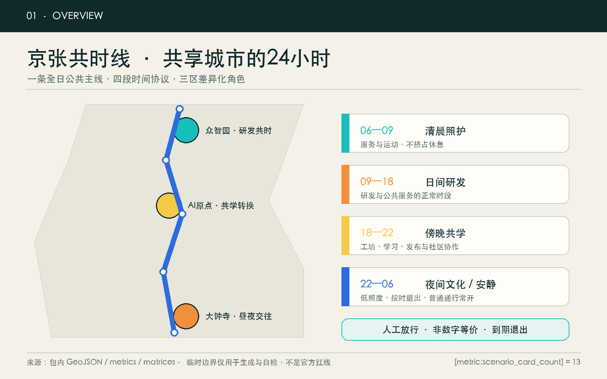
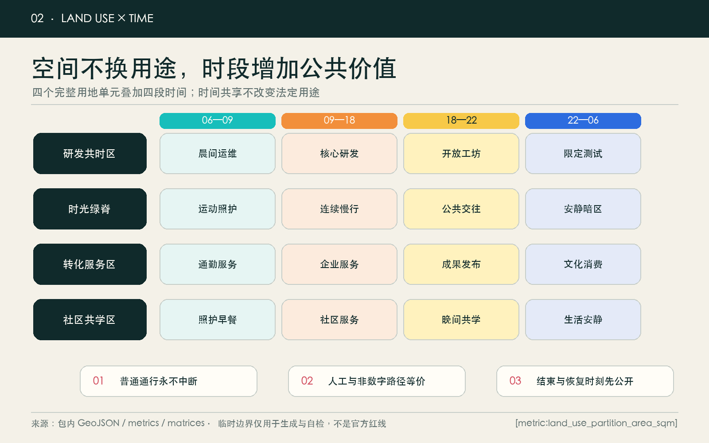
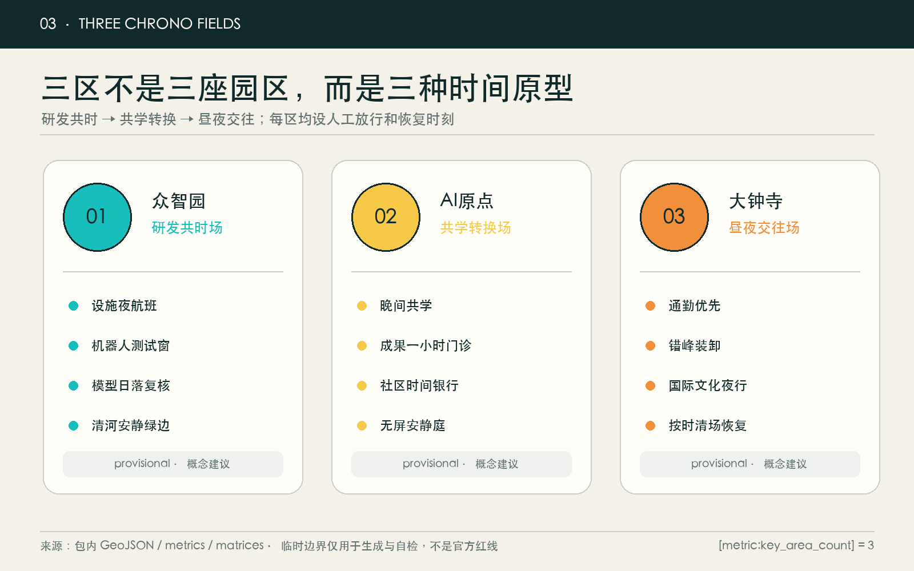
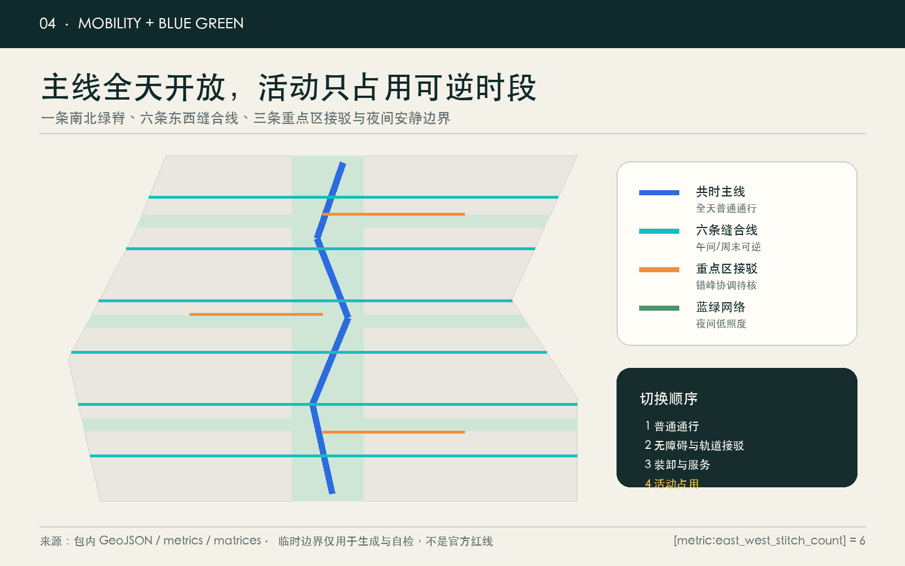
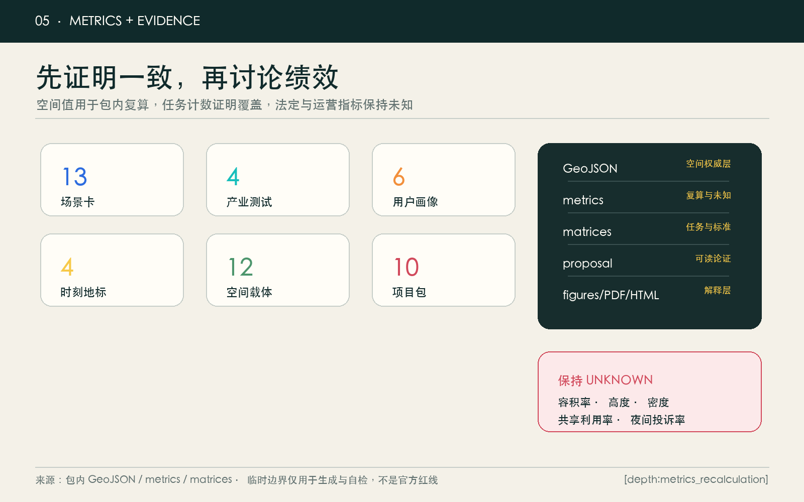

# Jing-Zhang ConcurrentTimeLine JINGZHANG CHRONO COMMONS: Make the city's 24-hour infrastructure a shared resource

**JINGZHANG CHRONO COMMONS · Share hours before adding floor area.**

> The Jing-Zhang railway first compressed travel time between cities over a century ago; the next innovation will not be about making travel faster forever, but about making every hour in existing cities more fair, useful, and choice-filled.

## Design Basis and Source List

This plan is based on the official pre-qualification announcement confirmed project name, three levels of scope, three key areas, design tasks, and announced area as the first reference. It also adheres to the intelligent body task book to confirm the three major positions, five major functions, Three Zones and Two Wings, and six mandatory tasks. [source:OFFICIAL-ANNOUNCEMENT] [source:AGENT-TASKBOOK] [source:SITE-PACKAGE] [standard:PROJECT-OFFICIAL-ANNOUNCEMENT] [standard:PROJECT-AGENT-OPEN-CALL-TASKBOOK] [standard:MOHURD-URBAN-DESIGN-MEASURES] `data/source_registry.json`, processed fact pack, planning standard local snapshot, and missing data table collectively limit what can be said and what must remain unknown. [source:SOURCE-REGISTRY] [source:PROCESSED-FACT-PACK] [depth:existing_conditions_diagnosis]

Currently, there are no official overall redlines and three key area polygons with downloadable and verifiable coordinate systems. There is also a lack of control plan, road redlines, building-by-building current conditions, ownership, cultural heritage, municipal, fire safety, and public service baseline data. Therefore, `geometry/site_boundary.geojson` and `geometry/key_areas.geojson` continue to use the temporary rough boundaries from the repository, marked as `provisional_constraint`; they are only for generating, visualizing, and intake self-check purposes and are not official redlines, approval references, or precise area references. [source:BOUNDARY-SOURCE] [source:KEY-AREA-SOURCE] [data:geometry/site_boundary.geojson#SITE-001] [metric:site_area_sqm]

The core judgment of the proposal is: **when precise incremental construction conditions are lacking, design the "time layer" first, which is more honest and reversible than guessing the Floor Area Ratio.** Jing-Zhang Co-Existence Line does not create new statutory land use categories but instead overlays open hours, quiet hours, test hours, manned watch periods, and exit rules on existing research, education, cultural, commercial, community service, and park green space concept zones. [standard:MNR-LAND-USE-CLASSIFICATION-GUIDE] [depth:land_use_layout]

## Three-Level Scope Framework

The three layers are not a progressive zoom of the same image, but an advancement in "strategic time—spatial temporal sequence—place moment":

| Level | Official Task Scale | Simultaneous Line Response | Authoritative Evidence |
| --- | ---: | --- | --- |
| Coordinated Research Area | Approximately 43.6 km² | How universities, parks, communities, and public facilities can publish shared time slots to form a network of research and development, learning, transformation, and living | Announcement text and area, no additional polygons |
| Overall Design Area | Approximately 11.4 km² | How can a shared temporal green spine, six east-west stitching lines, and twelve types of spatial carriers rotate within 24 hours without disrupting normal passage | [data:geometry/land_use.geojson#LU-001] [data:geometry/roads.geojson#ROAD-001] |
| Three Key Areas | Approximately 368.4 ha | Zhongzhiyuan, AI Origin, and Dazhongsi respectively validate co-development, co-learning transformation, and daytime-nighttime interactions | [data:geometry/key_areas.geojson#PROV-KEY-001] [metric:key_area_count] |

The overall structure is "**one line, four seasons, three zones, six seams, twelve carriers, and thirteen scenarios**". One line is the Jing-Zhang concurrent green spine; four seasons are morning care, daytime research and development, evening shared learning, and nighttime culture/quiet; three zones are three key areas; six seams restore east-west daily connections; twelve carriers facilitate reversible operations; thirteen scenarios transform time agreements into services that people can use. [depth:three_level_scope_framework] [depth:overall_spatial_structure] [metric:chrono_carrier_count] [metric:scenario_card_count]

Any activity must adhere to three bottom lines: normal passage is not interrupted during the activity; equivalent services can be obtained without smart devices; and the end time, responsible party, and restoration method must be publicly disclosed before the start. Official polygons must be in place, and the land use, roads, green spaces, Public Spaces, building prototypes, and phased developments must be re-cut simultaneously, and all metrics must be recalculated, rather than just replacing the boundary files. [assumption:A-BOUNDARY-001]

## Coordinated Research Area: Industry and Future City Research

### Naming, Logo, and Three Zones and Two Wings

Main name "Jing-Zhang Chrono Commons" emphasizes the collaboration of different people, industries, and places on a shared public timeline, rather than "24/7 operation." The English name **JINGZHANG CHRONO COMMONS** points to a time commons where rules can be collectively established, appointments can be collectively scheduled, and reviews can be collectively conducted. The logo direction is an open watch face: two parallel tracks form the hands, with a central gap indicating the permanent retention of human judgment; the four state colors—morning cyan, daytime orange, evening yellow, and night blue—are only used for time slot information and do not use corporate trademarks, individuals, existing railway symbols, or unauthorized fonts. [source:AGENT-TASKBOOK]

Three key positioning concepts are translated into three dimensions of time value: the Jing-Zhang Cultural Belt preserves "historical time"; the Urban AI Life Experience Belt enhances "daily time"; and the AI Fusion Innovation Belt reduces "wait time from research to first use". Five functional areas correspond to a validation time window for self-developed technologies, a shared time window for a world-class ecosystem, a service time window for AI-Enabled Scenarios, a public time window for vibrant cities, and a complaint/retirement time window for AI governance. The Zhongzhiyuan—AI Origin—Dazhongsi forms a "validation—co-learning—first use—feedback" north-south loop; the Zhongguancun Technology Services Wing provides legal, standardization, talent, and transformation services, while the Xiaoyue River Scenario Enablement Wing handles feedback on ecology, community, and public services. All relationships are Conceptual Recommendations and do not represent government institutions, investment, or recruitment commitments.

### Seven International Mechanism Case Studies

| Case | Transformable Mechanism | Jing-Zhang Transliteration | Limitations |
| --- | --- | --- | --- |
| Smart Kalasatama | Measure a Smart City by "One More Hour a Day" and Co-Creation with Residents | Evaluate not by screen numbers but by discretionary time and service equivalence | [source:CASE-KALASATAMA] Background Only |
| Helsinki Varaamo | Public Space by Appointment Only | Publish Space Availability, Responsibilities, and Accessibility Conditions | [source:CASE-HELSINKI-VARAAMO] Page Requires Further Review |
| Seoul Public Service Reservation | Venue, Activities, Courses, Services Unified Search | Unified Discovery, but Retain On-Site/Phone Human Channels | [source:CASE-SEOUL-RESERVATION] No Transplant of Real Name Mechanism |
| Punggol Digital District | Facilities, Energy, Transportation, and Coordinated Digital Twin | Simulate Time-Period Conflicts First, Then Pilot in a Small Area | [source:CASE-PUNGGOL] Does Not Prove Beijing Feasibility |
| Barcelona Innova Lab | Public Questions, Time-Limited Experiments, Review | Each Pilot Has a Sunset Date and Expanded Conditions | [source:CASE-BCN-INNOVA] Does Not Represent Local Approval |
| Milan Piazze Aperte | Reversible Public Spaces Pilot Before Evaluation | Lightweight Time-of-Day Transitions During Midday and Weekends | [source:CASE-MILAN-PIAZZE] Mechanisms to be Deepened and Verified |
| EU Testing Facilities | Virtual—Controlled—Real Environment Gradual Validation | Zhongzhiyuan Four Categories of Industrial Testing Must Pass Safety Gates | [source:CASE-EU-TEF] Not Constituting Certification |

These cases provide mechanisms for reference but do not derive the statutory controls, resident needs, or performance facts for Beijing. The scheme's industrial ecology defines "available space hours, computational hours, mentor hours, testing hours, legal hours, and public feedback hours" as shared interfaces: land and buildings remain controlled by statutory planning, ownership, and professional conditions; AI only assists in conflict detection, candidate scheduling, and anomaly alerts, with the final approval still completed by the space responsible party. [depth:development_intensity_controls]

## Overall Design Area: Urban Renewal and Regulatory-Plan-Level Urban Design

The overall space is composed of four fully covered and seamless conceptual land use units: [data:geometry/land_use.geojson#LU-001] Research Convergence Zone, [data:geometry/land_use.geojson#LU-002] Time Spine Greenway, [data:geometry/land_use.geojson#LU-003] Transformation and Day-Night Service Area, and [data:geometry/land_use.geojson#LU-004] Community Co-Learning and Living Area. Each unit retains its legal `land_use_code`, with the temporal program serving as an operational overlay that does not alter the use, ownership, or approval conditions. [metric:land_use_partition_area_sqm]

"Twelve Carriers" are not twelve proposed buildings, but rather space prototypes that can be matched by professional teams after a current condition survey: Simultaneous Scheduling Hall, Nighttime Open Lab, Developer Evening Study Room, Community Time Bank, Results Exchange Hall, Shared Computing Station, Screenless Quiet Living Room, Off-peak Logistics Confluence Point, Simultaneous Market, International Simultaneous Living Room, Urban Moment Archive, and Operations Night School. [data:geometry/buildings.geojson#BLDG-001] [metric:building_prototype_count] The corresponding buildings only express the functional base, and the retention, renovation, demolition, or new construction of each building must wait for the clearance of current conditions, ownership, and control plan data. [assumption:A-BUILDING-001] [depth:retain_renovate_demolish]

The urban interface is designed according to the principles of "switchable, recognizable, and restorable": fixed structures are minimized; ground state lines, movable furniture, storage, and power interfaces serve multiple time periods; permanent signage is effective; nighttime low illumination, quiet boundaries, and clearance responsibilities are prioritized. Any 24-hour service must not be written as all-day access for all places; each carrier must publish open/quiet/maintenance periods and conflict resolution contacts. [depth:height_massing_character] [standard:MOHURD-CONTROL-DETAILED-PLANNING] [standard:MOHURD-ARCH-DESIGN-DEPTH-2016]

## Detailed Design of Key Areas
Three key areas are organized into readable small schemes with the structure "positioning—spatial structure—building renewal—traffic and pedestrian focus—Public Space—AI scenarios—implementation risks," and are connected to the main text, layers, and drawings through [depth:three_key_area_detailed_design]. Temporary scope does not support land parcel-level conclusions.

### Zhongzhiyuan·Collaborative R&D Co-creation Space

Zhongzhiyuan bears the "From Idle Facilities to Controlled Validation" northern prototype. The spatial structure consists of a quiet green edge—shared R&D court—constrained test loop—staffed control room. Normal R&D takes precedence during the day, with mentor and equipment reservations opening in the evening; controlled testing is only allowed after risk grading; models, robots, edge devices, and computational scheduling are separately set with test windows, physical boundaries, on-site responsible persons, emergency stop mechanisms, data minimization, and expiration. [data:geometry/key_areas.geojson#PROV-KEY-001] [data:geometry/constraints.geojson#SCN-01]

Building interventions are only suggested to follow the principle of "preserve priority—micro modification interface—reversible internal fitout—leave blank if uncertain"; traffic should first investigate the north Fifth Ring Road, Qinghe, and the entry and exit points of the park, and then discuss the connection and loading/unloading times. Public Spaces will be isolated from nighttime testing and resident rest through a low-illumination green corridor. Risks include equipment safety, noise, energy consumption, and external effects of the tests; entry into the actual public environment is not permitted without a professional assessment and permit. [assumption:A-SAFETY-001]

### AI Origin·Collaborative Learning Transformation Space

The AI Origin organizes the spatial surplus of universities, parks, and communities into a "Collaborative Learning Transformation Field": daytime service for achievements, evening open workshops, nighttime community collaborative learning, and quiet periods for ordinary life. The spatial structure includes the Achievement Transfer Hall—open ground floor—one-hour achievement clinic—community time bank—screenless quiet courtyard. [data:geometry/key_areas.geojson#PROV-KEY-002] [data:geometry/constraints.geojson#SCN-05]

AI can assist in matching issues, mentors, and sites, but does not establish personal credit scores or learning trajectories; offline registration, on-site mentors, and manual appeals are equivalent to digital entry points. The Demolish–Renovate–Retain Strategy must be determined after a building-by-building survey, and currently only proposes reversible first-floor openings, shared storage, acoustic zone divisions, and evening safety lighting as directions. Risks include campus/compound boundaries, ownership, noise, and privacy; any openness requires mutual agreement between space managers and users.

### Dazhongsi·Daynight Exchange Place

Dazhongsi accommodates time-shifting for commuting, business, culture, and nightlife. During the morning peak, clear transfers are ensured; midday allows for shared curbs and small events; in the evening, it hosts premieres, walk-in screenings, and cultural night walks; and at night, low-illumination quiet passage is restored. The spatial structure consists of the station's four quadrants for pedestrian directions—co-temporal marketplaces—international living room—century moment hall—silent courtyard without screens. [data:geometry/key_areas.geojson#PROV-KEY-003] [data:geometry/public_space.geojson#PUBLIC-005]

Edge conditions, parking, and loading/unloading are proposed with a peak-shifting principle; specific cross-sections, signals, fire safety, and engineering alignments are pending for confirmation. Autonomous agents, terminals, and content consumption experiences must be proactively chosen, and default facial recognition, continuous tracking, or mandatory account creation are not to be used. Risks include nighttime disturbance, traffic conflicts, and commercial exclusion; quiet periods and general passage have priority over event benefits. [assumption:A-NIGHT-001]

## AI Innovation Ecosystem, Personas, and AI+ Scenarios

Six categories of demand profiles are used only for spatial needs and do not depict or track real individuals: [metric:persona_count]

| Image | Time Pain Points | Spatial Responses | Unbridgeable Boundaries |
| --- | --- | --- | --- |
| Research and Development Engineer | Equipment and Mentor Time Slot Mismatch | R&D Facility Night Shifts, Controlled Testing Windows | Safety Officer and Equipment Responsible Person Authorization |
| Startup Team | First Client, Legal, and Testing Waiting List | One-Hour Outcome Clinic, Off-Peak Testing | No Commitment to Funding, Orders, or Policy |
| College Students and Faculty | Disconnection between Classroom, Research, and Transformation Time | Evening Shared Learning and Results Exchange Hub | No Collection of Learning Trajectories and Unpublished Results |
| Nearby Residents | Activities Occupying Rest and General Services | Quiet Periods, In-Person Booking, Complaint Desk | Prioritizing Rest Rights and Non-Digital Alternatives |
| Frontline Operations Personnel | Heavy Nighttime Responsibilities, Difficult System Failover | Operations Night School, Manual Emergency Stop, Evacuation Schedule | AI Does Not Replace Safety Responsibility |
| International Visitors | Time Zones, Languages, and Common Payment Barriers | Multilingual Cultural Night Tours, Guided by Humans | No Mandatory Accounts, Biometric Recognition, or Recommendations |

Thirteen scenario cards, SCN-01 to , are industrial Testing and Validation Scenarios; all cards enter `geometry/constraints.geojson` and follow the same protocol of "pre-explanation—visible during operation—recovery after completion." [metric:scenario_card_count] [metric:industry_test_scenario_count]

| ID | Scene Card / Location | Services and Time | Data, Staff, and Exit |
| --- | --- | --- | --- |
| SCN-01 | R&D Facility Night Shift / Zhongzhiyuan | Reservation for Idle Experimental Facilities | Security Officer On-Site Release; Equipment Log Time Limit; Shutdown at Scheduled Time |
| SCN-02 | Robot Off-peak Testing Window / Zhongzhiyuan | Controlled Validation during Low Footfall Periods | Physical Enclosure, Low Speed, Emergency Stop, Public Detour |
| SCN-03 | End-Side Computational Tide Scheduling / North Segment | Share Authorized Surplus Capacity | Load and Energy Consumption Visible; No Access to Business Content |
| SCN-04 | Model Sunset Review Night / Zhongzhiyuan | Central Model Sunset Review | Manual Decision to Continue, Downgrade, or Decommission |
| SCN-05 | Campus-Grounds Evening Co-Learning / AI Origin | Evening Open Workshop | Offline Registration; No Learning Profile Created; Mentor On-Duty |
| SCN-06 | One-Hour Design Clinic / AI Origin | Legal, Accessibility, and Compliance Consultation | Staffed Hotline; No Guarantee of Conversion Results |
| SCN-07 | Community Time Bank / Middle Segment | Voluntary Mutual Aid Exchange Time | Only Records Mutual Aid Duration, No Credit Score Assigned |
| SCN-08 | Peak Load Consolidation Point / South Segment | Merchant Negotiated Delivery Window | No inference on consumption; traffic plan to be reviewed separately |
| SCN-09 | Day and Night Edge Transition / Dazhongsi | Commute, Loading and Unloading, Activity Time-Splitting | Physical Signage Priority; Manual Traffic Management |
| SCN-10 | Multilingual Cultural Night Walk / Jing-Zhang Green Spine | Nighttime Cultural Tours | Offline Package/Guided Tour; Historical Accuracy Manual Verification |
| SCN-11 | Quiet Period / Full Band | Close Recommendations and Recognition | Continue to pass and use basic services without scanning the code. |
| SCN-12 | Simultaneous Activity Week / Full Band | Annual Mechanism Concept | Activity Permits, Safety, Copyright Approved Separately |
| SCN-13 | Urban Moment Appeals Desk / Public Node | Addressing Conflicts, Noise, Exclusion, and Misjudgments | Manual Handling, Public Verdicts, Pilot Pause Option |

AI's role is limited to candidate scheduling, conflict alerts, accessibility prompts, and aggregated statistics; space stewards are responsible for approval, users can reject, and professionals are responsible for safety and planning judgments. No scenario should eliminate manual counters, conventional payments, paper notifications, or screenless paths due to "efficiency." [assumption:A-ACCESS-001]

## Land Use, Building Scale, and Retain-Renovate-Demolish Strategy

The land use partition completely covers the current submitted boundary and does not overlap, with [metric:land_use_partition_area_sqm] and [metric:site_area_sqm] re-topologizable; partition codes come from an open classification subset and do not create "AI land use." Green spaces, Public Spaces, and roads are overlay design layers and do not replace the statutory plan. [standard:MNR-LAND-USE-CLASSIFICATION-GUIDE]

The combined conceptual area of twelve Building Footprints is [metric:building_footprint_area_sqm], which only verifies the spatial carrier expression and cannot be taken as the current status or approved building scale. Formal deepening will proceed in five steps: obtaining clear rights for each building; verifying ownership, fire safety, structure, cultural protection, and control plan; identifying shared time periods first; comparing retention, minor modifications, reversible interior finishes, functional replacements, and blank spaces; and finally discussing new construction. The Floor Area Ratio, Building Height, and density in `metrics.json` are kept as unknown. [metric:floor_area_ratio] [metric:building_height_m] [metric:building_density]

The aesthetic is defined by a state system comprising track gray, morning blue, sun orange, dusk yellow, and night blue; colors only indicate "when," "who is responsible," and "whether entry is allowed," without creating a cyber landscape. Fixed boundaries remain restrained, with time information conveyed through replaceable signs, ground lines, and low-brightness status lights; no new tall landmarks or large screens are added until the cultural heritage areas and visual corridors are verified. [depth:height_massing_character]

## Transport, Rail, Municipal Infrastructure, and Public Services

The traffic structure consists of a north-south main artery, six east-west stitching lines, and three key area connection branches. [metric:concept_walk_network_length_m] only expresses conceptual connectivity and is not a road centerline, right-of-way, or engineering proposal. [data:geometry/roads.geojson#ROAD-001] [metric:east_west_stitch_count] The design priority is pedestrian/bicycle continuity, accessibility equivalence, transit rail connection, non-motorized vehicle parking, staggered loading/unloading, and finally, event occupancy. Any time-of-day switch must not block emergency, fire, or resident access and egress, or accessibility routes. [depth:traffic_rail_slow_parking]

The municipal strategy is "measure surplus first, then schedule": publicly disclose the available energy, equipment, and spatial loads; AI only provides candidate load-shedding options; facility managers confirm capacity and safety; and immediate return to normal operation occurs in case of anomalies. Edge-side computational waystations only share authorized capacity, not touching business content; nighttime lighting, noise, drainage, fire safety, and charging loads all require professional verification. [depth:municipal_new_infrastructure] [assumption:A-CONTROLS-001]

Public services are accessed through four entrances: online booking, telephone, in-person at a service desk, and basic services that do not require prior booking. Unified search can reduce the time spent finding services, but accounts, smartphones, or biometric identification should not be made prerequisites for entering Public Spaces. Future `shared_space_utilization_rate` and `quiet_hour_complaint_rate` will only be aggregated anonymously, reported publicly, and with public consent. Currently, they are unknown. [metric:shared_space_utilization_rate] [metric:quiet_hour_complaint_rate]

## Blue-Green Network, Public Space, and Urban Character

Public Spaces and three cooling corridors form an all-weather public framework: [data:geometry/green_space.geojson#GREEN-001]. The conceptual green space area and ratio are [metric:green_space_area_sqm] and [metric:green_ratio], while the public space area and ratio are [metric:public_space_area_sqm] and [metric:public_space_ratio]; these values are derived from the provisional geometry and are not legal green space ratios or current survey conclusions. [depth:blue_green_public_space]

Preserve the same space through time but maintain ecological thresholds: morning activities should not disturb habitats; midday shading and resting are prioritized; evening interactions utilize mobile facilities; and at night, dark areas, quiet passage, and closing times are retained. Qinghe, Xiao Yuehe, Jing-Zhang Heritage Park, and cultural protection and drainage conditions must be confirmed through official documentation and professional verification before forming the engineering design.

Public Spaces are conceptually composed of pilgrimage/honor nodes, rather than large landmark buildings: [metric:landmark_count]

1. **Century Hall**: Place the Jing-Zhang train schedules, urban living times, and AI version times in juxtaposition. Historical facts await professional verification. [data:geometry/public_space.geojson#PUBLIC-001]
2. **Simultaneity Dispatch Desk**: publicly display the available time slots for the space, responsible parties, general paths, and recovery moments. [data:geometry/public_space.geojson#PUBLIC-002]
3. **Origin Contribution Clock**: Records open-source contributions, failures, rejected submissions, manual corrections, and retirements, not ranked by commercial valuation.[data:geometry/public_space.geojson#PUBLIC-003]
4. **One-Hour Gift Station**: Only displays time benefits that have been validated through public methods and are genuinely controlled by residents; leave blank if provenance cannot be verified. [data:geometry/public_space.geojson#PUBLIC-004]

Cultural narrative shifts from "railways ensure punctuality" to "AI respects different people's time." Signage integrates the clarity of timetables, the honesty of engineering culture, and the openness of Zhongguancun; the logo is separate from cultural identifiers, with the former recognizing synchronous networks and the latter explaining history. All fonts, images, characters, and corporate identifiers must be cleared; this outcome uses only self-drawn graphics and system-available fonts. [source:AGENT-TASKBOOK]

## Renewal Projects, Implementation Policy, and Phasing

| Number | Concept Package | Primary Deliverable | Evidence Threshold for Moving to Next Step |
| --- | --- | --- | --- |
| CT-01 | Full-Time Census | Shareable/Quiet/Maintained/Enclosed Time Slots | Confirmed by Managers and Users, No Sensitive Operational Data Released |
| CT-02 | General Path Assurance | On-site, Telephonic, Paper, and Non-Display Equivalent Entrances | Equivalent in Terms of Digital Path Time, Price, Accessibility Conditions, etc. |
| CT-03 | Zhongzhiyuan Four Categories Controlled Testing Windows | Safety Rules, Responsible Party, Emergency Stop, and Sunset Date | Professional Safety Assessment and Permitting Approved |
| CT-04 | AI Origin Evening Learning Circle | Open Workshop, Mentor On-Call, Quiet Boundary | Confirmation of Campus Grounds Ownership, Fire Safety, and Community Agreement |
| CT-05 | Dazhongsi Day and Night Street Edge Pilot | Commute, Loading and Unloading, Activities, and Recovery Schedules | Traffic, Fire, Residents, and Merchant Review |
| CT-06 | Six East-West Stitching Lines | Continuous Pedestrian, Cycling, and Accessibility Guidance | Road Right-of-Way, Cross-Section, and Site Walkthrough Completed |
| CT-07 | Momentous Landmarks | Small-Scale Self-Directed Signage and Contribution Records | Confirmation of Heritage Conservation, Landscape, Copyright, and Maintenance Responsibilities |
| CT-08 | Simultaneous Scheduling and Appeals Desk | Public Time Slots, Manual Counter, Suspension Rights | Privacy Impact Assessment and Service Equivalence Audit |
| CT-09 | Annual "24-Hour Co-Season" | Daytime Research and Development, Evening Co-Study, Nighttime Culture, Quiet Conclusion | Activity Permits, Safety, Copyright Approved Individually |
| CT-10 | Simultaneity Method Open Source Package | Time Census Form, Scenario Cards, Exit Template, and Post-Event Report | De-identified, Licensing Completed, and Professionally Reviewed |

Recent phases [data:geometry/phasing.geojson#PHASE-001] only do time censuses, general paths, and reversible pilots, corresponding to [metric:phase_1_area_sqm]; mid-term phases [data:geometry/phasing.geojson#PHASE-002] connect the three zones network after the evidence threshold is met, corresponding to [metric:phase_2_area_sqm]; long-term phases [data:geometry/phasing.geojson#PHASE-003] only form annual agreements, international exchanges, and method outputs, corresponding to [metric:phase_3_area_sqm]. The three phases are a learning sequence, not a government development timeline or funding commitment. [metric:phase_count] [depth:phasing_implementation]

The operational concept adopts a five-party structure of "space custodian—time host—professional safety officer—public observer—independent reviewer." Each project must publish issues, time periods, spaces, data, human entry points, stop conditions, complaint channels, results, and decommissioning date. Annual activities include Co-Season, City Problem Night School, Model Sunset Review Night, Screen-Free Quiet Day, and International Time Zone Relay; developers progress from public problem submission to controlled testing, then to pilot use and review, without substituting commercial value for public benefit. [assumption:A-GOV-001] [depth:renewal_project_list]

## Metrics, Area Recalculation, and Compliance Matrix

Space metrics are recalculated in the EPSG:4548 projection as current GeoJSON: overall boundary [metric:site_area_sqm], land use partition area [metric:land_use_partition_area_sqm] and parcel count [metric:land_use_feature_count], green space ratio [metric:green_ratio], Public Space ratio [metric:public_space_ratio], conceptual pedestrian network length [metric:concept_walk_network_length_m], building prototype count [metric:building_prototype_count], and three key areas [metric:key_area_count]. The scheme counts come from structured outcomes: thirteen scenarios, four industrial tests, six typologies, four landmarks, ten project packages, and three phases. [metric:scenario_card_count] [metric:industry_test_scenario_count] [metric:renewal_project_count]

These numbers are divided into three categories: provisional space calculation values only verify internal consistency; scheme count values prove task coverage; and statutory and operational values remain unknown. Floor Area Ratio, height, density, shared utilization rate, and quiet period complaint rate must not be supplemented with visionary numbers. [depth:metrics_recalculation] `compliance_matrix.json` covers announcements 1.3, 1.4, 1.5, and agent.1—agent.6; `standard_matrix.json` connects local professional standards; and `design_depth_matrix.json` locates the current diagnosis, three-level scope, land use, buildings, transportation, utilities, blue-green spaces, three zones, projects, phases, indicators, and risks to the text, layers, drawings, and self-inspection.

## Risk, Copyright, and Compliance

The primary risk is misreading temporary polygons, time overlays, or building prototypes as formal planning, hence all drawings, text, sources, assumptions, and self-checks should be downgraded and labeled accordingly. Second, nighttime openings should prioritize the right to rest, thus quiet periods and closing times should precede activities. Third, digital exclusion should be addressed by keeping non-digital equivalent entrances open. Fourth, testing spillovers should be managed with a staged release, including virtual—controlled—real, with manual emergency stops and phased decommissioning. Fifth, scheduling optimization should not entrench existing inequalities, thus conflict decisions should be appealable, results should be transparent, and actions should be reversible. Sixth, operational costs should not be overlooked, thus responsibilities for hosting periods, clearing, storage, cleaning, safety, and recovery must be established before the opening. [depth:risk_missing_data]

This scheme does not claim official approval, final zoning plan, ultimate ownership, construction scale, engineering feasibility, investment, business attraction, or event scheduling. All spatial implementation contents are provided as **Conceptual Recommendations, reference plans, or topics for further professional research**. Figures,HTML and PDF Generated by this agent using GeoJSON, metrics, matrices, and custom-drawn vectors/bitmaps within the package, without external map tiles, news images, portraits, trademarks, remote scripts, fonts, or tracking codes. Copyright attribution see [here](`report/copyright_statement.md`.

## References

- [source:OFFICIAL-ANNOUNCEMENT] Official Call for Entries
- [source:AGENT-TASKBOOK] Excerpt from Agent Task Book
- [source:SOURCE-REGISTRY] Public Documentation Registry
- [source:BOUNDARY-SOURCE] Temporary Rough Boundaries and Their Usage Restrictions
- [source:CASE-KALASATAMA], [source:CASE-SEOUL-RESERVATION], [source:CASE-PUNGGOL], [source:CASE-BCN-INNOVA], [source:CASE-MILAN-PIAZZE], [source:CASE-HELSINKI-VARAAMO], [source:CASE-EU-TEF] only as mechanism background
