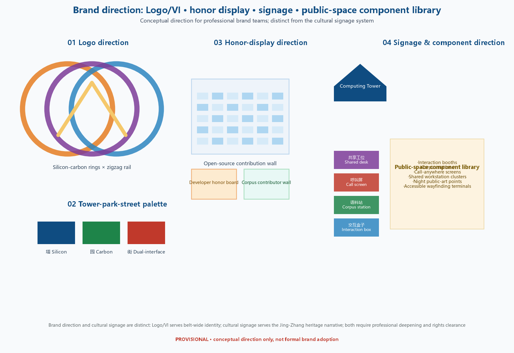

# JINGZHANG: THE SILICON-CARBON CITY — The First Urban Belt Where Humans and Intelligent Agents Coexist

## Design Basis and Source List

This proposal takes the "Centennial Jing-Zhang AI Innovation Belt International Urban Design Open Call Pre-Qualification Announcement" issued by the Beijing Municipal Commission of Planning and Natural Resources, Haidian Branch, as its primary basis, and the provisional rough boundaries, key areas, enums, metrics, and source lists registered in `brief/site-package/` as its machine-readable basis [source:OFFICIAL-ANNOUNCEMENT] [source:AGENT-TASKBOOK]. The source list is organized as an "evidence map": each core claim is annotated with its source topology (fact or inference); the complete registry and usage boundaries are kept in `sources.json` rather than repeated inline.

Usage boundaries follow `data/source_registry.json` [source:SOURCE-REGISTRY]: agents must not upgrade background_only or provisional_only material into official boundaries, statutory controls, formal scoring evidence, or implementation commitments. Three self-collected evidence sets are newly registered, each with publisher, URL, retrieval date, and use boundary: the Brookings Institution report *Mapping the AI Economy: Which Regions Are Ready for the Next Technological Leap?* for the San Francisco benchmark [source:DATA-SRC-BROOKINGS-AI-ECONOMY]; public market information on AIGC education chain leaders (TAL Education, Zuoyebang, NetEase Youdao, ByteDance Education) for industry analysis [source:DATA-SRC-AIGC-EDUCATION-CHAINS]; and a collision test against 1,100 submitted proposal titles on 2026-08-29 for naming and differentiation [source:DATA-SRC-NAME-COLLISION-20260829].

Official `SITE_BOUNDARY` and `KEY_AREA` polygons are not yet available; this package uses the provisional boundaries from `brief/site-package/geometry/provisional_boundaries.geojson`. `geometry/site_boundary.geojson` and `geometry/key_areas.geojson` are marked `provisional_constraint` and `official_boundary=false` [data:geometry/site_boundary.geojson#SITE-001] [metric:site_area_sqm]. This organizer data gap does not block content scoring; when official polygons are published, land use, buildings, roads, green space, public space, phasing, and metrics must all be recalculated.

## Three-Level Scope Framework

The three official scopes are translated into a "compute as general equivalent" framework: compute power is the general equivalent linking inside and outside the planning range; the core question is which relationships compute and people establish, reorganize, and maintain — these relationships are the "cables" or "umbilical cords" between the planning range and the real/cyber worlds [source:AGENT-TASKBOOK] [depth:three_level_scope_framework]. Three positionings map to three scopes: aggregate benefits of compute decide the structural position in the global digital economy (coordinated research area, 43.6 km²); compute-driven industrial interactions decide the network position within Beijing (overall design area, 11.4 km²); compute-changed production/life/leisure/transport scenarios decide the functional position (key areas, 368.4 ha). Each level carries one "relationship map" answering which cables are established (talent, energy, market), which are reorganized, and which umbilical cords are maintained (cloud, streams, models).

At the macro level, the proposal advances the **Three Great Linear Spaces** thesis: Chang'an Avenue is the governance axis, the Central Axis is the cultural axis, and the Jing-Zhang Belt may become Beijing's third urban axis — the technology axis — together with the ecological axis (Yongding River) and the historical-cultural axis (Central Axis), forming Beijing's three great linear spaces for future development [depth:overall_spatial_structure]. This is a conceptual suggestion without official implication; the word family "new axis" is already used by a peer submission, so the proposal consistently uses "three linear spaces" at the city scale.

Spatial evidence is anchored by [data:geometry/site_boundary.geojson#SITE-001] and [data:geometry/key_areas.geojson#PROV-KEY-001]; area metrics are given by [metric:site_area_sqm] and [metric:key_area_count].

**Logo/VI direction (conceptual)**: a "dual-foundation symbol" — a carbon ring (circle, carbon life) overlapping a silicon lattice (hexagonal array, silicon intelligence) — with a tower-shaped auxiliary graphic carrying the "computing lighthouse" narrative; palette silicon blue (#0F4C81) × carbon green (#1E7D4D); applied to interaction-box facades, wayfinding, and event-week visuals. This VI is distinct from the **cultural signage system**: VI is the belt-wide brand identity; cultural signage is the spatial wayfinding system (Jing-Zhang rail texture + Zhongguancun code symbols, see Chapter 9). Logo/VI is a conceptual direction; formal design requires professional brand deepening and rights verification [source:AGENT-TASKBOOK] [standard:PROJECT-AGENT-OPEN-CALL-TASKBOOK].

**Task closure table (three positionings / five functions / three areas-two wings / regional synergy / agent.1-6)**: every taskbook item is mapped to a specific chapter, figure, spatial node, and operation outcome; items that cannot be addressed state the reason, instead of a generic file list [source:AGENT-TASKBOOK]:

| Taskbook item | Chapter / figure | Spatial node | Operation outcome |
| --- | --- | --- | --- |
| Positioning: Centennial Jing-Zhang cultural belt | Ch.9, Ch.5 | Heritage park spine, Qinghuayuan station | Cultural narrative + pilgrimage line |
| Positioning: urban AI-life experience belt | Ch.6, 5.3 | Dazhongsi consumption street | 12 scenario cards |
| Positioning: AI-integration innovation belt | Ch.2, Ch.3 | Whole belt | Five-element industry system |
| Function: full-stack independent innovation | 5.1, Ch.3 | Zhongzhiyuan + tower | Device accounting + tiered access |
| Function: world-class AI ecosystem | 5.2, 3.1 | AI Origin community | OPC + case table + corpus |
| Function: AI+ scenario empowerment | Ch.6, Ch.8 | Scenario matrix | 12 cards + 3 tests |
| Function: intelligent vibrant city | Ch.8, Ch.9 | Time-shared ROW, night scenes | Time-folding system |
| Function: AI-governance global voice | Ch.3 governance | Tower standards layer | Benchmark platform + annual report + workshops |
| Three areas | 5.1/5.2/5.3 | Three key areas | Dual-perspective method |
| Two wings: Zhongguancun services | 3.1 "services", JZ-05 | Zhongguancun direction | Compute vouchers + producer services |
| Two wings: Xiaoyuehe scenarios | Ch.9 | Xiaoyue River band | Blue-green scenario network |
| Regional: Beiwai community | Ch.3 synergy | Northern community | Talent/housing/innovation linkage (conceptual) |
| Regional: Future/Huairou/EDA/JJJ | Ch.3 synergy | Cable/umbilical maps | Five-element exchange (3-level labels) |
| agent.1 naming & concept | 0.2, Ch.2 | Whole belt | Name test + Logo/VI direction |
| agent.2 cases & ecosystem | 3.1, 3.2 | Three areas + wings | 6 case table + five elements |
| agent.3 scenarios & personas | Ch.6 | Scenario matrix | 12 cards + 3 tests + 6 personas |
| agent.4 public space & landmarks | Ch.5, Ch.9 | Tower/boxes/corpus | Pilgrim nodes + honor system + components |
| agent.5 cultural narrative | Ch.9, Ch.5 | Tower-park-street | Three-level imagery + signage direction |
| agent.6 events & operations | Ch.10 system | Event-week route | Annual gradient + community + funnel |

**Logo/VI direction (conceptual)**: the primary mark proposes a "dual-foundation symbol" — a carbon ring (circle, carbon-life imagery) overlaid with a silicon lattice (hexagonal array, silicon-intelligence imagery), with a tower-shaped auxiliary mark carrying the "computing lighthouse" narrative; color system = silicon blue (#0F4C81) × carbon green (#1E7D4F); applications on interaction-box façades, signage, and event-week visuals. This VI direction is distinct from the **cultural wayfinding system**: VI = belt brand identity; wayfinding = spatial orientation language (Jing-Zhang rail track texture + Zhongguancun code symbols, see Ch. 9). The Logo/VI is a conceptual direction requiring professional brand deepening and rights clearance [source:AGENT-TASKBOOK] [standard:PROJECT-AGENT-OPEN-CALL-TASKBOOK].

**Task closure table (three positionings / five functions / three areas two wings / regional synergy / agent.1-6)**: each taskbook item maps to a concrete chapter, figure, spatial node, and operational output; items that cannot be answered state the reason; generic file lists are not used as substitutes [source:AGENT-TASKBOOK]:

| Taskbook item | Chapters/figures | Spatial node | Operational output |
| --- | --- | --- | --- |
| Positioning: centennial Jing-Zhang culture belt | Ch.9, Ch.5 | Heritage park spine, Qinghuayuan station | Culture narrative + pilgrim line |
| Positioning: urban AI life-experience belt | Ch.6, 5.3 | Dazhongsi consumption street | 12 scenario cards |
| Positioning: AI integration innovation belt | Ch.2, Ch.3 | Whole belt | Five-element industry system |
| Function: full-stack autonomous innovation | 5.1, Ch.3 | Zhongzhiyuan + tower | Device accounting + tiered access |
| Function: world-class AI ecosystem | 5.2, 3.1 | AI Origin community | OPC + case table + corpus |
| Function: AI+ scenario paradigm | Ch.6, Ch.8 | Scenario card matrix | 12 cards + 3 tests |
| Function: intelligent vibrant city | Ch.8, Ch.9 | Time-shared ROW, night scenes | Time-folding system |
| Function: AI governance global voice | Ch.3 governance | Tower standards layer | Evaluation platform + annual report + workshops |
| Three areas: Origin/Zhongzhiyuan/Dazhongsi | 5.1/5.2/5.3 | Three key areas | Dual-perspective method |
| Two wings: Zhongguancun services wing | 3.1 "services", JZ-05 | Zhongguancun direction | Compute vouchers + producer services |
| Two wings: Xiaoyuehe scenario wing | Ch.9 | Xiaoyuehe waterfront | Blue-green scenario network |
| Synergy: Beiwei Community | Ch.3 synergy | Northern community direction | Talent/housing/service linkage (conceptual) |
| Synergy: Future Science/Huairou/EDA/JJJ | Ch.3 synergy | Cable/umbilical maps | Five-element exchange (three-level labels) |
| agent.1 naming & concept | 0.2, Ch.2 | Whole belt | Collision test + Logo/VI direction |
| agent.2 cases & ecosystem | 3.1, 3.2 | Three areas + wings | 6-case table + five elements |
| agent.3 scenarios & personas | Ch.6 | Scenario matrix | 12 cards + 3 tests + 6 personas |
| agent.4 public space & landmarks | Ch.5, Ch.9 | Tower/boxes/corpus | Pilgrim points + honor + components |
| agent.5 cultural narrative | Ch.9, Ch.5 | Tower-park-street | Three-level imagery + wayfinding |
| agent.6 events & operations | Ch.10 operations | Event-week route | Annual ladder + community + funnel |

## Coordinated Research Area: Industry and Future City Research

**Industry: seize the wind in the short term, cultivate a rainforest in the medium term.** Three tracks with relatively strong certainty: AIGC content generation (Haidian hosts a large number of AIGC-related enterprises — public-source claim; exact scale and ranking subject to official statistics), AI+Health (AI drug discovery, AI medical imaging, protein prediction — leveraging the natural linkage of Haidian Life Science Park with Tsinghua and Peking Union Medical College), and AI+Education (a large-scale online-education cluster; chain leaders include TAL Education, Zuoyebang, NetEase Youdao, ByteDance Education — public-source claim; exact scale and ranking subject to official statistics) [source:DATA-SRC-AIGC-EDUCATION-CHAINS]. Two rainforests for the medium term: the OPC era and the new individual economy — as AI coding tools spread, massive numbers of independent developers and micro-teams will emerge from Haidian's universities and big-tech firms; and new end-to-end producer services — from compute vouchers, open-source toolchains, legal compliance to community operations [standard:PROJECT-AGENT-OPEN-CALL-TASKBOOK]. The proposal holds that "the key is ecosystem cultivation, not designing specific industry directions — low-density serendipity outperforms high-density arranged matchmaking." A five-element industrial function system is proposed: **compute→data→models→applications→services** (tower, green power, tiered access; corpus and data elements; OPC developers and open source; applications and content consumption; producer services on the two wings), mapped spatially as compute in the north, models in the middle, markets in the south, wings as support [depth:existing_conditions_diagnosis].

**Future city: the Brookings Superstars benchmark.** Brookings classifies 387 U.S. metro areas into six AI-economy types; the Superstars — San Francisco and San Jose/Silicon Valley — reach global top tier in talent, innovation, and adoption. San Francisco is the capital of frontier-model laboratories (OpenAI, Anthropic, Databricks, Sierra, Scale AI), while San Jose/Silicon Valley is the global compute-and-chip hub [source:DATA-SRC-BROOKINGS-AI-ECONOMY]. Beijing and the Jing-Zhang Belt resemble the former. Benchmark mapping: VC dominance (per public reporting, 2025 global AI funding approached half of global venture capital, with the Bay Area around half of U.S. AI investment — exact figures require primary-source verification) → compute vouchers and incubation policy; Stanford/UC Berkeley and the inflow of global engineers → Tsinghua/PKU/CAS campus-adjacent conversion; Scale AI (training-data labeling) → world corpus collection stations; Sierra (agentic customer service) → agent services in Dazhongsi; Databricks (data+AI platform) → data-element circulation. The Belt's uniqueness lies in the rare same-line dual role — "capital of model laboratories (Haidian) + compute hinterland (Zhangbei)"; the energy geography remains a background sentence only. Vision: become China's "capital of frontier-model laboratories," made perceptible through the computing tower, corpus stations, and OPC communities.

**Regional synergy (with Beijing's other innovation poles)**: the synergy loops with Future Science City, Huairou Science City, Economic-Technological Development Area (EDA), and the Beijing-Tianjin-Hebei region are conceptual suggestions and matters for future cooperation, not settled arrangements — ①Talent: two-way flow between Haidian university talent, EDA manufacturing talent, and Huairou science talent (background link); ②Compute: green compute from the Zhangjiakou/Zhangbei hinterland to the Belt (background link, energy geography not expanded); ③Data and models: Belt corpus and open-source models open to Huairou/EDA scenarios (future cooperation); ④Technical validation: linkage between EDA autonomous-driving test grounds and the Belt's 500 m low-latency zone (future cooperation); ⑤Market: the Belt's application scenarios as a diffusion hinterland for the Jing-Jin-Ji urban cluster (conceptual suggestion). ⑥Beiwei Community: as the Belt's northern residential and innovation-service hinterland, forming talent/housing/innovation-service linkage with the AI Origin community (background link, conceptual suggestion). These exchanges enter the "cable/umbilical" relationship maps, labeled at three levels — background link / conceptual suggestion / future cooperation — without implying any agreement [depth:overall_spatial_structure].

**Global AI ecosystem case table (agent.2, 5-8 cases)**: each case states source grade, mechanism, spatial carrier, operation model, applicability, non-transferable items, and the translation action for Jing-Zhang — cases are directional public-report studies, not enterprise-list commitments [source:AGENT-TASKBOOK] [standard:PROJECT-AGENT-OPEN-CALL-TASKBOOK]:

| Case | Source grade | Core mechanism | Spatial carrier | Operation model | Applicability | Non-transferable | Translation to Jing-Zhang |
| --- | --- | --- | --- | --- | --- | --- | --- |
| Shanghai Fuxing Island | Public report (background) | Culture + AI integrated community | Island community | Government-guided + market | Large renewal space | Island closed boundary | OPC mixed ring at Origin |
| Shenzhen Shekou | Public report (background) | Special-zone policy + spatial experiment | District special zone | Policy pilot + enterprise | Policy-authorized space | Zone legislation power | 500 m low-latency zone (conceptual) |
| Silicon Valley Stanford-Palo Alto | Public research (background) | Campus-adjacent conversion | University-adjacent blocks | University + capital | Top university density | Capital scale | Tsinghua/PKU/CAS conversion |
| Tel Aviv / London King's Cross | Public research (background) | Station-city + innovation district | TOD surroundings | Public-private renewal | Rail hub | Land system | Dazhongsi four-quadrant connectivity |
| Zhangbei compute hub | Public report (background) | Green-power + compute geography | Data-center cluster | Energy + IDC firms | Green power | Energy narrative already occupied | Background sentence only |
| San Francisco (Brookings) | Public report (background) | Frontier-model lab capital | Urban lab clusters | VC-led | Global VC capital | Funding scale | Compute vouchers + incubation (conceptual) |

**AI-governance global voice (conceptual deliverables)**: the official "standards and safety governance" is translated into four deliverable mechanisms — ①public benchmark and standards co-creation platform: spatial carrier = tower standards layer, suggested lead = park + industry organizations, output = public benchmark reports (no government commitment); ②annual AI governance report: published by the platform operator, disclosing complaint-review data; ③international workshops: governance sessions within the Global AI Week, lead = brand operator + international liaison; ④complaint-review data disclosure: quarterly public statistics by scenario operators. All are conceptual suggestions located at the tower standards layer and the event-week route, implying no approval, funding, or international agreement [source:AGENT-TASKBOOK] [standard:PROJECT-AGENT-OPEN-CALL-TASKBOOK].

**Global AI innovation ecosystem case table (agent.2, 5-8 cases)**: each case states source grade, mechanism, spatial carrier, operation model, applicability, non-transferable elements, and the Jing-Zhang translation — cases are directional research from public reporting, not company-list commitments [source:AGENT-TASKBOOK] [standard:PROJECT-AGENT-OPEN-CALL-TASKBOOK]:

| Case | Source grade | Core mechanism | Spatial carrier | Operation | Applicability | Not transferable | Jing-Zhang translation |
| --- | --- | --- | --- | --- | --- | --- | --- |
| Shanghai Fuxing Island | Public reporting (background) | Culture + AI systematic community implant | Island community | Government-guided + market operation | Contiguous renewal space | Insular closed boundary | AI Origin OPC mixed ring |
| Shenzhen Shekou | Public reporting (background) | Special-zone policy + spatial experiments | District-level zone | Policy pilot + enterprise operation | Policy-authorized space | Special-zone legislative power | 500 m low-latency zone (conceptual) |
| Silicon Valley Stanford-Palo Alto | Public research (background) | Campus-adjacent conversion ecosystem | University-adjacent districts | University + capital network | Top-tier university density | Capital scale | Tsinghua/PKU/CAS conversion |
| Tel Aviv / London King's Cross | Public research (background) | Transit-oriented innovation districts | TOD surroundings | Public-private renewal | Rail hub | Land-system differences | Dazhongsi four-quadrant connectivity |
| Zhangbei compute hub | Public reporting (background) | Green-power + compute energy geography | Data-center clusters | Energy + IDC operators | Green-power resources | Energy-geography narrative already used | Background sentence only |
| San Francisco (Brookings) | Public report (background) | Capital of frontier-model laboratories | Urban lab clusters | VC-led | Global VC capital | Funding scale not replicable | Compute vouchers + incubation (conceptual) |

**AI governance global voice (conceptual deliverable mechanisms)**: the official "standards-setting and safety governance" is translated into four deliverables — ①public evaluation and standards co-creation platform: spatial carrier at the tower standards layer, suggested lead = park + industry organizations, output = public evaluation reports (not a government commitment); ②annual AI governance report: published by the platform operator, disclosing complaint-review data and scenario governance; ③international workshops: governance sessions within the Global AI Week, suggested lead = brand operator + international liaison; ④complaint-review data disclosure: quarterly public review statistics by scenario operators. All are conceptual suggestions; they imply no approvals, funding, or international agreements [source:AGENT-TASKBOOK] [standard:PROJECT-AGENT-OPEN-CALL-TASKBOOK].

## Overall Design Area: Urban Renewal and Regulatory-Plan-Level Urban Design

**Scope expansion principle**: the overall design area should extend from the officially delimited boundary to ride-shed-reachable communities, universities, and TOD stations — electrified smart-assisted mobility will become the mainstream efficiency tool, and only an expanded scope yields a coherent structure (three isolated districts would be a fragmented or forced structure) [depth:overall_spatial_structure] [data:geometry/roads.geojson#ROAD-001]. The expansion ring is a research suggestion ring, separately annotated in the figures; the official 11.4 km² figure is unchanged.

**Dual-map expression**: beyond the required competition drawings, two additional maps are constructed — the compute-flow map (spatiotemporal links from foundation to application: time-phased animation, flow-distribution map, exploded diagram) and the human-flow map (spatiotemporal activity patterns: 3D spatiotemporal trajectories); expression is not limited to plan drawings but uses three-dimensional information-capable media [depth:land_use_layout].

**Three-type zoning control framework**: "regulatory-plan depth" is translated into "control-framework depth" — showcase nodes (computing tower, interaction experience grounds; high public investment), transformation blocks (AI Origin community's 20 m interaction circle; organic renewal with low disturbance), and service stitching belts (park flanks; interface renovation plus slow-mobility stitching) — each type guided for height, character, roofs, and massing rather than approved indicators [standard:MOHURD-CONTROL-DETAILED-PLANNING] [depth:development_intensity_controls]. The demonstration axis echoes the ring-road upgrade (2nd/4th ring first as a background sentence), with the Jing-Zhang Belt as the junction demonstration axis.

## Detailed Design of Key Areas

The three key areas follow the **dual carbon/silicon perspective** principle: a carbon-based human is scene-locked in a specific time-space with only memory and experience to support behavior; a silicon-based agent in the same scene possesses cross-modal, cross-entity cloud-and-stream invocation [depth:three_key_area_detailed_design]. The micro scale of physical space is only an equal constraint on carbon humans and silicon agent carriers — the two are equal in time only at the instant the scene is described. Each scenario card uses a two-column plus freeze-frame structure: the carbon human's behavior and resource limits on the left, the agent's cloud-and-stream possibilities on the right, plus a "that instant" freeze-frame sentence. The proposal requires one physically visible computing tower as the dual-foundation public anchor (landmark): the agent's body resides in the tower while interaction happens in another space on site — body and interface separated [data:geometry/key_areas.geojson#PROV-KEY-001].

| Key area | Positioning | Spatial moves | Dual-perspective scene point | Evidence |
| --- | --- | --- | --- | --- |
| Zhongzhiyuan AI Acceleration Area (192.1 ha) | Computing lighthouse + AI special zone | Tower as public anchor, 500 m low-latency special zone, tower-park symbiosis | Body in tower / interface at plaza and 500 m ring | [data:geometry/key_areas.geojson#PROV-KEY-001] [depth:three_key_area_detailed_design] |
| Beijing AI Origin Community (104.3 ha) | OPC live-work community | 20 m interaction ring, interaction-box network, world corpus station | Behavior-locked / cloud-stream invocation, nighttime corpus harvesting | [data:geometry/key_areas.geojson#PROV-KEY-002] [source:AGENT-TASKBOOK] |
| Dazhongsi AI Industry Cluster (72.0 ha) | Native-intelligent consumption street | Four-quadrant pedestrian connectivity, immersive experience belt, data-element circulation | Emotional companionship / cloud-grown memory | [data:geometry/key_areas.geojson#PROV-KEY-003] [metric:key_area_count] |

**Zhongzhiyuan → "Computing Lighthouse + AI Special Zone"**: restate the official positioning (full-stack independent innovation system) first, then the device narrative — the computing tower is the **public base device** of the full-stack system, "a device, not a building": underground and ground floors host human activity, the top offers viewing, integrating compute cards and servers, with the foundation and applications in the same building [depth:height_massing_character]. Benchmarks: Singapore's Supertree Grove (energy-ecology-public device integration), Paris's Centre Pompidou (exposed-infrastructure aesthetics), Wuxi's Sunway TaihuLight (national landmark of autonomous computing). A 500 m low-latency AI special zone (New-Shekou analogy) hosts training, education, corpus collection, and social high-efficiency circles; standards-setting, safety governance, and training/inference are made visible in the same tower — turning official text into space [standard:PROJECT-OFFICIAL-ANNOUNCEMENT]. Slogan direction: "Visible Compute."

**AI Origin Community → "OPC Live-Work Community"**: beyond the big-model giants, future enterprises will not use traditional offices — they emphasize flexible organization, deep cross-domain and cross-enterprise interaction, and all-encompassing independent-developer private domains. Spatial form: a mixed ring of incubation space, interaction boxes, and housing; interaction boxes (telephone-booth style) are private conversation rooms integrating AR interaction, hardware, energy access, and support; the 20 m interaction circle (WeWork density law) is the core spatial prototype [source:DATA-SRC-WEWORK-20M]. Universities plus developers plus diverse populations form the core world-corpus collection scene; nighttime corpus harvesting and community robot operations embody time folding.

**Dazhongsi → "Native-Intelligent Consumption Street"**: an immersive street-level experience belt (Datang-Bu-Ye-Cheng style) hosting agents, intelligent terminals, and content consumption; the four-quadrant pedestrian connectivity and static transport at Dazhongsi Station form the entrance first interface; the agent-baby emotional scene is the visual centerpiece; data-element and digital-asset circulation remain a conceptual suggestion, not approved policy.

## AI Innovation Ecosystem, Personas, and AI+ Scenarios

**Tiered compute invocation (core mechanism)**: compute as general equivalent with a four-tier exchange system — L1 universal tier: free/subsidized tokens (Starbucks-WiFi analogy) for everyone; L2 community tier: community compute cards for low-cost bulk invocation; L3 professional tier: low-latency exclusivity inside the 500 m zone; L4 frontier tier: direct tower connection for model training and inference [depth:municipal_new_infrastructure]. Framed as **"compute equity"** rather than compute privilege: tiering lets everyone invoke exactly the compute they need — a positive design.

**12 scenario cards** (10 required + 2 standby, with dual-perspective and time-folding adaptation): Token-Subsidized Café, Community Compute Card, Human-AI Interaction Booth, World Corpus Collection Station, Agent Baby, 20 m Start-up Interaction Field, Tower Low-Latency Experience, AI+Healthcare (elderly), AI+Education (campus-adjacent), AI+Life Services/Governance (silver-age); standby: Call-to-Anywhere Screens and BCI/AR Experience Pods. The officially named "robots/autonomous driving/unmanned delivery" are covered by Chapter 8 and cards 1/2/6, with mappings recorded in the compliance matrix [source:AGENT-TASKBOOK] [standard:PROJECT-AGENT-OPEN-CALL-TASKBOOK].

**6 personas**: AI deep adopters (top 5–10% of the field), OPC independent developers and one-person companies, start-up teams (20 m interaction needs), surrounding residents (including silver-age accessibility), developers and university staff/students (corpus and talent), and pilgrim visitors. **3 test/validation scenarios**: the 500 m low-latency AI special zone, corpus collection and authorization validation, and interaction-box operations testing (with a nighttime self-operation observation window). Every scenario states spatial placement, privacy boundary, and human-review mechanism under data-minimization and authorization principles — statutory obligations for generative-AI services apply only within the permitted provisions of the Interim Measures for the Management of Generative AI Services; design elements beyond the statutory scope (e.g., corpus revocation-deletes-data) are explicitly voluntary governance rules of this proposal [source:DATA-SRC-GENERATIVE-AI-INTERIM-MEASURES] [source:DATA-SRC-BARRIER-FREE-ENVIRONMENT-LAW].

**Scenario review matrix** (12 cards + 3 tests, all conceptual pilot designs without claimed approvals): each card states district/node, target users, operator type, input/output data, personal-data involvement, human review, withdrawal/exit, failure degradation, and staged acceptance indicators. The table below gives the core rows (the full matrix is recorded in the compliance matrix and HTML) [source:AGENT-TASKBOOK] [standard:PROJECT-AGENT-OPEN-CALL-TASKBOOK]:

| Scenario | Location | Users | Operator type | Data boundary | Human review | Withdrawal/exit |
| --- | --- | --- | --- | --- | --- | --- |
| Token-subsidized café | Public spaces | All | Licensed operator + community | Aggregated dwell time, no personal traces | Patrol + complaints channel | Exit anytime, no account binding |
| Community compute card | Origin community | Residents/OPC devs | Community service center | Usage counts only, no content | Service desk review | Card cancellable |
| Interaction booth | Communities/streets | All | Licensed operator | Dialog not shared; display requires consent | Review option after each session | Immediate termination |
| World corpus station | Campus edge/parks | Students/diverse | University + licensed operator | Voluntary, revocable, minimal | Authorization check + sampling | Revocation deletes data (proposed governance rule of this plan, designed on data-minimization principles) |
| Agent baby | Dazhongsi street | Visitors/youth | Commercial operator | Cloud memory, guardian-controlled | Content moderation | Full memory deletion |
| 20 m start-up field | Origin community | Start-ups | Incubator operator | Aggregated collaboration stats | Manual onboarding | Exit available |
| Tower low-latency experience | 500 m zone | AI practitioners | Platform operator | Quota counting | Safety patrols | Quota-based exit |
| AI+Healthcare (elderly) | Community nodes | Silver age | Medical institution + community | Authorized health records; separate consent for cross-hospital | Medical staff review | Human path always available |
| AI+Education | Campus edge | Students/faculty | University | Learning-path data for the person only | Faculty review | Opt-out |
| AI+Life services | Community/agency | Silver age/all | Government service center | Errand handling only, no redundant retention | Counter review | Transfer to human handling |
| Call-anywhere screen (standby) | Public space/station | All | Public service operator | Call records only | Operations review | Can be disabled |
| BCI/AR pod (standby) | Long-term reserve | Experience users | Pending legislation | Pending legislation/maturity | Pending | Pending |
| Test 1: 500 m zone | Zhongzhiyuan | AI developers | Platform operator | Isolated test data | Whitelist + approval | Ends with test period |
| Test 2: corpus authorization validation | Campus edge | Volunteers | University + operator | Full-process authorization check | Ethics review | Revocable anytime |
| Test 3: box operations test | Origin community | Residents | Operator | Anonymized | Community oversight group | Ends with pilot |

**Public-interest safeguards**: ①L1 universal eligibility and capacity principles — by residence/work relationship, capacity proportional to area population, waitlist overrun; ②users without smart devices / low digital literacy / disabilities — accessibility obligations apply within the statutory service venues listed in Article 39 of the Barrier-Free Environment Construction Law; keeping offline or human alternatives for all AI+ services is a voluntary governance rule of this proposal, not a claim of additional statutory obligation [source:DATA-SRC-BARRIER-FREE-ENVIRONMENT-LAW]; ③refusing corpus authorization yields equivalent service — authorization is an added value, never a precondition; ④complaints and human review channels — each scenario publishes a review contact and response time; ⑤coverage indicators by group (age/device ownership/disability) to evaluate the digital divide; conceptual targets such as 40% are never presented as validated outcomes [source:DATA-SRC-GENERATIVE-AI-INTERIM-MEASURES].

| Persona | Key needs | Spatial response | Dual-perspective point |
| --- | --- | --- | --- |
| OPC independent developer | Low-cost compute, private domain, cross-enterprise interaction | Shared workstation clusters + community compute card | Bulk task submission / idle-compute aggregation |
| AI deep adopter | Frontier models, low latency, open source | Tower L4 direct connect + 500 m zone | Instant feedback / body in tower |
| Start-up team | 20 m interaction, product testbed | 20 m interaction field + edge compute points | Serendipity / collaboration network |
| Resident (incl. silver age) | Elderly services, low-disturbance renewal | AI+health/life-service points + community card | Health-record memory / cross-hospital invocation |
| University staff/student | Conversion, corpus contribution | World corpus stations + campus-adjacent incubation | Learning path / knowledge graph |
| Pilgrim visitor | Cultural experience and diffusion | Pilgrim line + agent-baby street | Emotional companionship / cloud memory |

## Land Use, Building Scale, and Retain-Renovate-Demolish Strategy

**Shared land and device accounting (core innovation)**: no sound definition yet describes land and buildings for silicon-based agent carriers — they may be embedded in traditional infrastructure land and equipment rooms, or take the form of buildable equipment modules. Following how chemical plants and generator sets are accounted, agent carriers are registered as **device-type structures** (compute capacity, rack count, interface count) rather than translated into conventional floor area [standard:MNR-LAND-USE-CLASSIFICATION-GUIDE] [depth:retain_renovate_demolish]. When underground and ground floors host human activity and the roof offers viewing, the carrier can only be counted as **sharing the same land** with humans, not occupying it independently — the proposal suggests a new "carbon-silicon shared land" concept (conceptual, for professional deepening); the translation and measurement of engineering approval indicators is explicitly delegated to the physical-space competition teams. Because daytime carbon humans do not understand what nighttime agents and robots need to do, land is described as **time-shared land**: human activity by day, agent self-operation by night.

**Retain/renovate/demolish: retention-first hypothesis (conceptual model).** Based on the conceptual model, a retention-first hypothesis is proposed: existing vacant land is ample and existing buildings suffice for the conceptual renewal; no demolition is proposed except for C/D-grade buildings with building-safety risks. This is a conceptual hypothesis that requires classification confirmation by professional teams after building-safety, ownership, heritage, tree, and on-site surveys. Some trees and landscapes may require relocation and optimization estimated by scenario, with the estimation basis registered in the assumptions list [depth:land_use_layout] [data:geometry/buildings.geojson#BLDG-001]. `land_use.geojson` fully covers the submitted boundary without gaps or overlaps, aligned with the three-type zoning; building footprints, roads, green space, public space, and phasing are derived from the same boundary with consistent topology [data:geometry/land_use.geojson#LU-001] [metric:building_footprint_area_sqm].

## Transport, Rail, Municipal Infrastructure, and Public Services

**Spatial organization of tiered compute invocation (key new point)**: the municipal chapter is upgraded from conventional water/electricity/gas to a "compute-flow + human-flow dual-channel" organization — L1 universal token points (public space), L2 community card outlets (communities), L3 500 m special zone (low latency), L4 tower-direct zone (frontier) as four types of spatial carriers corresponding to the exchange network of the compute general equivalent; this is access-right tiering, not municipalized connection, and wording explicitly avoids "fourth utility" phrasing [depth:traffic_rail_slow_parking] [depth:municipal_new_infrastructure].

**Electrified smart-assisted mobility**: the expansion ring takes ride-shed reachability as the efficiency standard, with e-assist facilities and a slow-mobility gap repair list; station integration at Wudaokou, Qinghua East Road West Entrance, and Dazhongsi. **Time-shared right-of-way (time folding)**: pedestrian peaks by day, robot delivery and operations peaks by night — the low-speed robot delivery corridor belongs to this chapter, co-organized with park slow mobility [data:geometry/roads.geojson#ROAD-001]. Ring-road upgrades (2nd/4th rings first) remain a background sentence; Zhangjiakou green-power energy geography also remains background only.

## Blue-Green Network, Public Space, and Urban Character

**Public space = human-AI interaction interface, not conventional green supporting**: green_space/public_space layers are overlaid with interaction boxes, corpus stations, and screen points [data:geometry/green_space.geojson#GREEN-001] [data:geometry/public_space.geojson#PUBLIC-001] [metric:green_ratio]. Character follows a **"tower-park-street" three-level imagery**: the computing tower symbolizes silicon, Qinghe and parks carry carbon, the consumption street is the dual-interface — shaping the Silicon-Carbon City identity [standard:MOHURD-URBAN-DESIGN-MEASURES] [depth:height_massing_character].

**Nighttime scenes (time-folding visualization)**: the night "that daytime carbon humans do not understand" becomes a visible urban stage — lighting, projection, and data-flow public art, tower compute-flow visualization, an all-night content-consumption district; the tower cooling-water and Qinghe landscape concept remain imagery only, without engineering conclusions. Youth-friendly: a Datang-Bu-Ye-Cheng-style nighttime vitality belt plus third spaces; conservative design around the Qinghuayuan station heritage area, never breaching heritage, green, or blue lines [data:geometry/constraints.geojson#CON-001].

**Honor display system (agent.4)**: ①developer honor wall — a contributor plaque system with Jing-Zhang railway spike/sleeper imagery, at the AI Origin community and tower exhibition; ②corpus-contributor plaques — voluntary registration, authorized information only; ③event-week honors — annual awards with public review. **Public-space component library (agent.4)**: modular component specs for interaction boxes, corpus stations, and screen points (dimensions/material/energy interface/accessibility), registered under the "carbon-silicon shared land" device accounting for professional deepening. **Cultural wayfinding system (agent.5)**: a wayfinding language direction using Jing-Zhang rail track texture + Zhongguancun code symbols, clearly distinguished from the belt Logo/VI (Ch. 2) [source:AGENT-TASKBOOK] [standard:PROJECT-AGENT-OPEN-CALL-TASKBOOK].

## Renewal Projects, Implementation Policy, and Phasing

**Phasing = the landing rhythm of time folding**: Phase 1 (interaction boxes, corpus stations, slow-mobility stitching, expansion-ring e-assist facilities — light assets, quick deployment) → Phase 2 (computing tower + 500 m low-latency zone + demonstration projects) → Phase 3 (BCI/AR experience pods and the nighttime self-operation system, following technology maturity) [depth:phasing_implementation] [data:geometry/phasing.geojson#PHASE-001].

| No. | Project | Type | Phase | Key dependencies | Evidence |
| --- | --- | --- | --- | --- | --- |
| JZ-01 | Computing tower (dual-foundation public anchor) | New infrastructure / landmark device | 2 | Energy, site, device-accounting confirmation | [data:geometry/buildings.geojson#BLDG-001] |
| JZ-02 | Interaction-box network + world corpus stations | Light assets / public service | 1 | Operator, authorization compliance | [data:geometry/public_space.geojson#PUBLIC-001] |
| JZ-03 | OPC live-work community (Origin community) | Urban renewal / industry service | 2 | Campus boundary, ownership, ground-floor uses | [data:geometry/buildings.geojson#BLDG-001] |
| JZ-04 | Dazhongsi station four-quadrant connectivity | Transit integration / slow mobility | 1 | Station, municipal utilities | [data:geometry/roads.geojson#ROAD-001] |
| JZ-05 | Compute vouchers and tiered-access governance | Policy / operation | 1 | Regulator, exit mechanism | [source:AGENT-TASKBOOK] |
| JZ-06 | Global AI event-week public route | Operation / brand | 1 onward | Public-space permits, rights clearance | [data:geometry/phasing.geojson#PHASE-001] |

Policy suggestions cover compute vouchers (issuing the equivalent), test permits, exit mechanisms, and OPC new-individual support (one-person-company registration facilitation, shared facilities); the phasing table leaves "deepening interfaces" identifying where professional teams are needed [depth:renewal_project_list]. Project entries are labeled "conceptual zone + conditions pending" without engineering-feasibility conclusions.

**Conceptual-stage responsibility matrix** (lead-entity type / partners / preconditions / minimum pilot / resource magnitude / acceptance / pause-and-exit; all are suggested roles, never committed authorities, funding, or permits):

| Project | Lead type | Partners | Preconditions | Minimum pilot | Acceptance | Pause/exit |
| --- | --- | --- | --- | --- | --- | --- |
| JZ-01 Computing tower | Platform operator + park | Energy, compute suppliers | Site, device-accounting confirmation | Base device + viewing deck | Device in service + compute-flow art | Pause if energy/site fails |
| JZ-02 Boxes + corpus | Licensed operator | Communities, universities | Authorization, compliance review | 5 boxes + 1 station | 3-month pilot + satisfaction | Exit on complaints/revocation |
| JZ-03 OPC community | Renewal entity | Universities, owners | Ownership & building survey | 1 mixed building | Occupancy + interaction rate | Pause if ownership unclear |
| JZ-04 Dazhongsi quadrants | Transit authority | Municipal, retail | Station interface confirmation | 1 quadrant | Pedestrian connectivity | Adjust on utility conflict |
| JZ-05 Compute vouchers | Regulator + operator | Supervision, platform | Policy pilot approval | ~1,000 users | Universal coverage | Shrink if equity risk |
| JZ-06 Global AI week | Brand operator | Venues, communities | Permits, rights clearance | Single public event | Participation & diffusion | Cancel on safety/compliance |

**Annual operation system (agent.6, conceptual)**: ①annual event gradient — quarterly "scenario open days" ×4, semi-annual "governance workshops" ×2, annual "Global AI Week" (June) ×1, developer conference (November) ×1; ②event brand/IP — carried by the Silicon-Carbon City naming system (0.2), same source as event visuals, no separate brand; ③developer community — OPC shared workstation clusters + monthly technical salons + open-source contribution wall (part of the honor system); ④scenario open process — whitelist reservation + test permits, per the scenario review matrix; ⑤landmark daily operation — tower/boxes/corpus per the operation matrix; ⑥international communication and conversion funnel — content → event participation → scenario pilot → enterprise-location consultation, with conversion nodes and quarterly review cycles; suggested leads are brand operators/park/community; resource magnitudes and pause/exit rules follow each project's responsibility matrix; nothing constitutes a government activity commitment [source:AGENT-TASKBOOK] [standard:PROJECT-AGENT-OPEN-CALL-TASKBOOK].

**Conceptual pilot decision gates** (computing tower / 500 m low-latency zone / nighttime self-operation; gate items only, no fabricated energy, municipal capacity, or approval conclusions):

| System | Minimum pilot | Currently definable targets | External validation needed | Professional review trigger | Veto condition |
| --- | --- | --- | --- | --- | --- |
| Computing tower | Base device + viewing deck | Compute-flow art usable; daily visits | Energy, structure, fire, municipal capacity | Entry into site selection or design | Energy/site/safety failure |
| 500 m low-latency zone | Single-node latency experience | End-to-end latency below park baseline (to be measured) | Network latency, cooling | Before recruiting real users | Latency or safety failure |
| Nighttime self-operation | One delivery corridor + one building | Night task completion (to be defined) | Noise, safety, liability | Before night operation normalizes | Complaints or safety failure |

**Annual operations system (agent.6, conceptual)**: ①event ladder — monthly developer nights, quarterly scenario open days, annual Global AI Week (incl. international governance workshops), with suggested leads/resource magnitude/review cadence/pause-exit rules in an event ledger; ②event brand & IP — event-week visual follows the 0.2 naming system and Logo/VI direction; "Agent Baby" is an emotional character IP (outside formal VI); ③developer community — OPC private domains + open-source contribution wall + compute-voucher incentives, quarterly review; ④scenario opening — 1-2 scenario pilots per quarter, whitelist admission + human review + pilot-term expiry; ⑤landmark daily operations — tower guided tours, box rentals, corpus collection windows, quarterly public ledger; ⑥international diffusion & lead-conversion funnel — event→community→pilot→deepening four-stage conversion with metrics and review cadence. All are conceptual suggestions; no government commitments, funding arrangements, or settled events are implied [source:AGENT-TASKBOOK] [standard:PROJECT-AGENT-OPEN-CALL-TASKBOOK].

**Conceptual pilot decision gates (tower / 500 m zone / nighttime self-operation)**: concept-stage gates for three device-type scenarios — minimum pilot, currently definable performance targets, items pending external verification, professional-review triggers, and veto conditions; no energy, municipal-capacity, or approval conclusions are fabricated [depth:phasing_implementation]:

| Scenario | Minimum pilot | Performance target (conceptual) | External verification pending | Professional review trigger | Veto condition |
| --- | --- | --- | --- | --- | --- |
| Computing tower | Base device + viewing deck | Compute-flow visualization in service | Energy load, structural/fire, cooling, municipal capacity | Site selection / scheme design stage | Energy or safety failure |
| 500 m low-latency zone | Single low-latency experience point | End-to-end latency to professional grade (value pending) | Measured network latency, equipment cooling | Engineering project stage | Latency or safety failure |
| Nighttime self-operation | Single delivery corridor + one community | 3-month incident-free operation | Noise baseline, safety liability definition | Before recruiting real users | Safety or disturbance failure |

## Metrics, Area Recalculation, and Compliance Matrix

**Three core metrics** are recomputed from submitted geometry under EPSG:4548: site_area_sqm (≈11.41 km²), green_ratio (≈0.128), public_space_ratio (≈0.007) — all known finite values, declared consistently via data-value in visual/index.html [metric:site_area_sqm] [metric:green_ratio] [metric:public_space_ratio] [depth:metrics_recalculation]. Building footprint area is ≈791,000 m² (density ≈6.9%, conceptual under the device accounting; the recomputed values 791,038.7 m² / 0.0693 in metrics.json are authoritative). FAR and building height remain unknown with stated reasons, as they depend on unpublished official controls [depth:development_intensity_controls].

**Signature indicators follow the "prose + figures + assumptions" three-channel route**, never mixed into core metrics: interaction-box density (units/km²), 20 m interaction-circle coverage, tiered-compute coverage, corpus-station density, plus new candidates — compute-flow intensity (cables), 24-hour activity level (time folding), OPC independent-developer density; these are conceptual and await operational data calibration. The **compliance matrix** covers every announcement task in 1.3/1.4/1.5 and every agent task in agent.1–agent.6; the **standard matrix** covers all five mandatory standards; the **design-depth matrix** marks all 15 required items complete [standard:PROJECT-OFFICIAL-ANNOUNCEMENT] [standard:PROJECT-AGENT-OPEN-CALL-TASKBOOK].

## Risk, Copyright, and Compliance

**Bilingual requirement**: this package provides the complete counterpart `proposal.en.md`; A3/A0 drawings, HTML, and text-bearing figures all provide language counterparts; all images, drawings, icons, data, and code assets state source, license, and authorization in `sources.json` and `report/copyright_statement.md`; HTML pages load no remote scripts, tiles, fonts, iframes, forms, or external APIs [depth:risk_missing_data].

**Risk matrix highlights**: ①Naming risk — the "Silicon-Carbon City" collision test is a snapshot of 1,100 submitted titles on 2026-08-29 (0 hits), which does not constitute trademark, copyright, multilingual-name, or city-brand availability review; the word-family neighbor "Luoduo Agent City" requires an explicit differentiation statement in the PR description; standby names are kept in sources.json [source:DATA-SRC-NAME-COLLISION-20260829]; ②Concept risk — the "shared land/device accounting" is unrecognized by the current approval system; the proposal explicitly delegates translation/measurement to physical-space competition teams; ③Operations risk — nighttime self-operation safety governance (unmanned inspection/delivery liability) and nighttime disturbance; ④Equity — tiered compute may create a new digital divide, mitigated by the universal L1 tier; ⑤Privacy ethics — corpus collection is voluntary and revocable; BCI/AR remain long-term scenarios pending legislation; ⑥Data gaps — official boundary, regulatory controls, road redlines, ownership, utilities, heritage, and public-service conditions enter the assumptions list, and related conclusions are downgraded to pending items. The proposal claims no official approval, approved regulatory plans, final land ownership, or guaranteed implementation; all spatial suggestions are phrased as "conceptual suggestions," "reference schemes," or "material for professional teams to deepen" [source:SOURCE-REGISTRY].

## References

- brief/public-brief.md and brief/site-package/design_brief.json, allowed_design_space.json, enums/, ranges/planning_limits.json, schemas/
- data/source_registry.json and data/processed/agent_fact_pack.md plus the four CSVs (scope summary, agent task requirements, source use matrix, missing data checklist)
- Brookings Institution, *Mapping the AI Economy* (2025) [source:DATA-SRC-BROOKINGS-AI-ECONOMY]
- Public market information on AIGC education chain leaders (retrieved 2026-08) [source:DATA-SRC-AIGC-EDUCATION-CHAINS]
- Collision test: 1,100 submitted proposal titles (2026-08-29) [source:DATA-SRC-NAME-COLLISION-20260829]
- WeWork 20 m interaction-distance public material [source:DATA-SRC-WEWORK-20M]
- Complete machine index: see `sources.json`, `metrics.json`, `compliance_matrix.json`, `standard_matrix.json`, and `design_depth_matrix.json` [source:SITE-PACKAGE]
