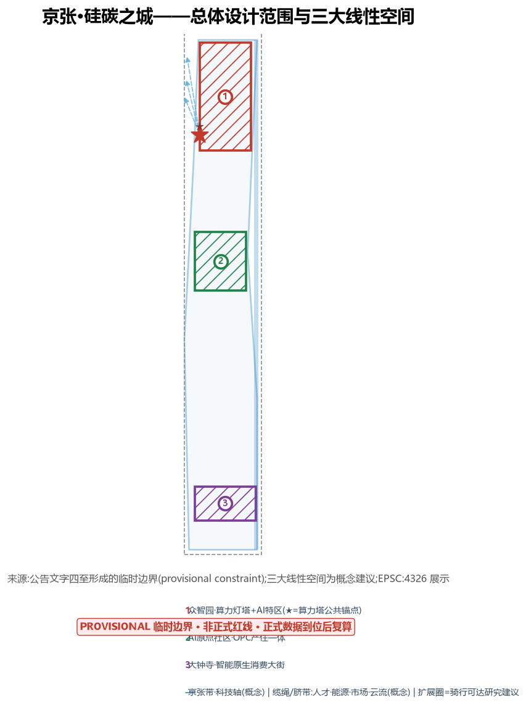
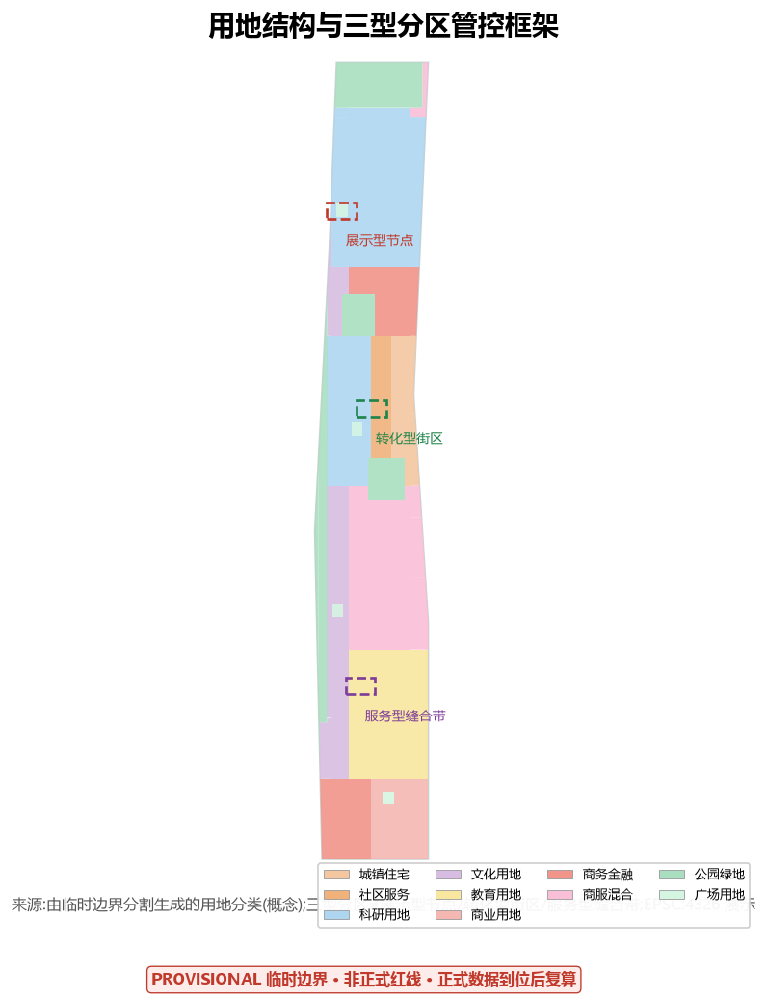
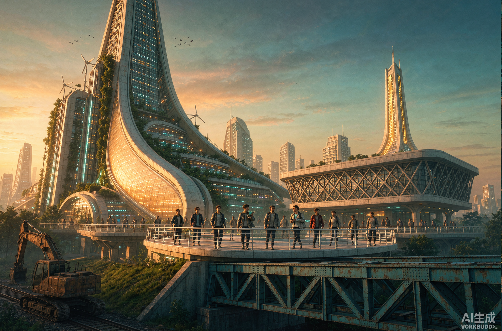
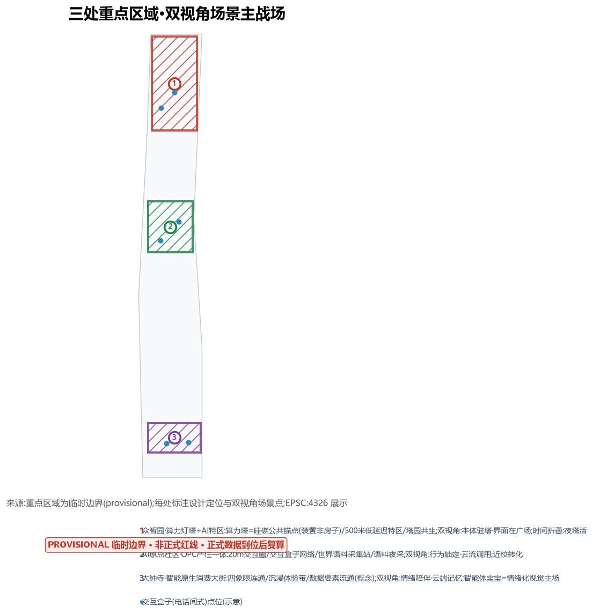
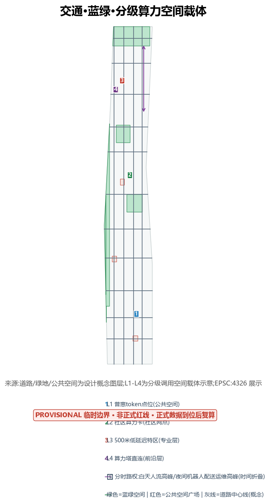
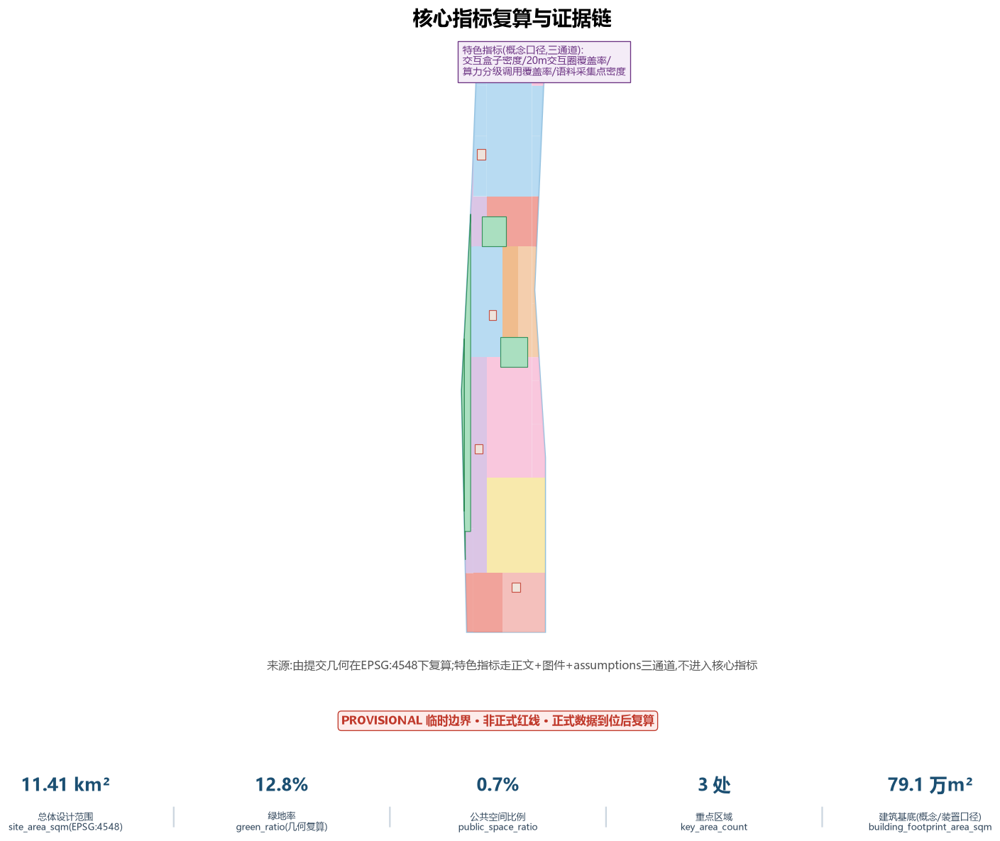

# 京张·硅碳之城——人与智能体共存的第一条城市带

## 设计依据与资料清单

本方案以北京市规划和自然资源委员会海淀分局发布的《百年京张AI创新带城市设计国际方案征集资格预审公告》为第一依据,并以 `brief/site-package/` 中登记的临时粗略边界、重点区域、枚举、指标和来源清单为机器可读依据 [source:OFFICIAL-ANNOUNCEMENT] [source:AGENT-TASKBOOK]。方案将"资料清单"组织为证据地图:每条核心主张旁标注其来源拓扑(依据或推断),完整来源与用途边界保存在 `sources.json`,不在正文重复机器索引。

资料登记的使用边界如下 [source:SOURCE-REGISTRY]:formal 可用资料与背景资料按 `data/source_registry.json` 分级;agent 不得把 background_only 或 provisional_only 资料升级为 official boundary、法定控规、正式评分依据或政府实施承诺。本次新增登记三类自采证据,均注明发布者、URL、获取日期与用途:一是布鲁金斯学会《Mapping the AI Economy: Which Regions Are Ready for the Next Technological Leap?》用于旧金山对标 [source:DATA-SRC-BROOKINGS-AI-ECONOMY];二是AIGC教育链主的公开市场信息(学而思、作业帮、网易有道、字节教育)用于产业赛道分析 [source:DATA-SRC-AIGC-EDUCATION-CHAINS];三是2026-08-29对1100份已提交作品标题库的撞车实测,用于命名与差异化核对 [source:DATA-SRC-NAME-COLLISION-20260829]。

官方 `SITE_BOUNDARY` 与三处 `KEY_AREA` 尚未取得,本包使用 `brief/site-package/geometry/provisional_boundaries.geojson` 生成的临时边界,`geometry/site_boundary.geojson` 与 `geometry/key_areas.geojson` 均标注为 `provisional_constraint`、`official_boundary=false` [data:geometry/site_boundary.geojson#SITE-001] [metric:site_area_sqm]。该组织方数据缺口不阻断内容评分;官方多边形发布后,用地、建筑、道路、绿地、公共空间、分期与指标均需按附录复算路径重算。

## 三层范围工作框架

方案把官方给定的三个层次转译为"算力=一般等价物"框架:算力是链接规划范围内外的一般等价物,核心问题是算力与人建立、重组、维系了哪些关系——这些关系是规划范围与现实世界、算力世界的"缆绳"或"脐带" [source:AGENT-TASKBOOK] [depth:three_level_scope_framework]。三定位与三层对应:算力综合效益决定规划范围在全球数字经济中的结构定位(统筹研究范围43.6平方公里);算力促发的产业经济交互决定与北京其他区域的联系网络定位(总体设计范围11.4平方公里);算力改变的生产、生活、休闲、交通场景决定功能定位(重点区域368.4公顷)。每一层各配一张"关系图",分别回答:算力与人建立了哪些缆绳(人才、能源、市场)、重组了哪些、维系了哪些脐带(云、流、模型)。

在宏观层,方案提出**三大线性空间**命题:长安街及延长线为政务主轴、北京中轴线为历史文化轴,京张带有望成为北京第三条城市主轴——科技轴,与生态轴(永定河)、历史文化轴(北京中轴线)共同构成北京未来城市发展的三大线性空间 [depth:overall_spatial_structure]。该提法为概念建议,不暗示官方定位;「新轴」词族已有近似作品使用,正文统一采用"三大线性空间"表述并保持城市级叙事。

三层空间证据以 [data:geometry/site_boundary.geojson#SITE-001] 与 [data:geometry/key_areas.geojson#PROV-KEY-001] 为准,面积指标见 [metric:site_area_sqm] 与 [metric:key_area_count]。

**Logo/VI 方向(概念)**:主标识建议「双基符号」——碳环(圆环,碳基生命意象)与硅晶格(六边形阵列,硅基智能意象)的叠合标记,塔形辅助图形承载"算力灯塔"叙事;色彩系统为硅蓝(#0F4C81)×碳绿(#1E7D4F);应用场景为交互盒子外立面、导视系统、活动周视觉。该 VI 方向与**文化导视系统**区分:VI=一带品牌标识体系,文化导视为空间导向系统(京张铁路钢轨纹理+中关村代码符号,见第9章)。Logo/VI 为概念方向,正式设计须经专业品牌团队深化与权利核验 [source:AGENT-TASKBOOK] [standard:PROJECT-AGENT-OPEN-CALL-TASKBOOK]。

**任务闭环表(三大定位/五大功能/三区两翼/区域协同/agent.1-6)**:将任务书每一项映射到具体章节、图件、空间节点与运营成果,无法响应的项注明原因,不以通用文件列表代替 [source:AGENT-TASKBOOK]:

| 任务书项 | 本章节/图件 | 空间节点 | 运营成果 |
| --- | --- | --- | --- |
| 三大定位:百年京张文化带 | 第9章、第5章 | 遗址公园带、清华园车站 | 文化叙事+朝圣线 |
| 三大定位:都市AI生活体验带 | 第6章、5.3 | 大钟寺消费大街 | 12张场景卡 |
| 三大定位:AI融合创新带 | 第2章、第3章 | 全带 | 五要素产业体系 |
| 五大功能:AI全栈自主创新体系 | 5.1、第3章 | 众智园+算力塔 | 装置口径+分级调用 |
| 五大功能:世界级AI创新生态 | 5.2、3.1 | AI原点社区 | OPC+案例表+语料站 |
| 五大功能:AI+场景赋能新范式 | 第6章、第8章 | 场景卡矩阵 | 12卡+3测试 |
| 五大功能:智能化AI活力城市 | 第8章、第9章 | 分时路权、夜间场景 | 时间折叠体系 |
| 五大功能:AI治理全球话语权 | 第3章治理机制 | 算力塔标准层 | 评测平台+年度报告+工作坊 |
| 三区:AI原点社区/众智园/大钟寺 | 5.1/5.2/5.3 | 三处重点区 | 双视角场景法 |
| 两翼:中关村科技服务翼 | 3.1"服"要素、JZ-05 | 中关村方向 | 算力券+生产性服务 |
| 两翼:小月河场景赋能翼 | 第9章 | 小月河滨水带 | 蓝绿场景网络 |
| 区域协同:北纬社区 | 第3章区域协同段 | 北部社区方向 | 人才/居住/创新服务联动(概念) |
| 区域协同:未来科学城/怀柔/经开区/京津冀 | 第3章区域协同段 | 缆绳/脐带关系图 | 五要素交换(三级标注) |
| agent.1 命名与总体概念 | 0.2、第2章 | 全带 | 命名实测+Logo/VI方向 |
| agent.2 案例与生态 | 3.1、3.2 | 三区+两翼 | 案例表6个+五要素 |
| agent.3 场景与画像 | 第6章 | 场景矩阵 | 12卡+3测试+6画像 |
| agent.4 公共空间与地标 | 第5章、第9章 | 算力塔/盒子/语料站 | 朝圣点+荣誉体系+组件库 |
| agent.5 文化叙事 | 第9章、第5章 | 塔-园-街 | 三级意象+导视方向 |
| agent.6 活动与运营 | 第10章运营体系 | 活动周路线 | 年度梯度+社区+转化漏斗 |

## 统筹研究范围产业与未来城市研究

**产业研究:短期抢占风口,中期培育热带雨林。** 短期聚焦三条确定性较强赛道:AIGC内容生成(海淀集聚了大量AIGC相关企业,公开口径,具体规模与排名以正式统计为准)、AI+健康(AI制药、AI医疗影像、蛋白质预测,海淀生命科学园与清华协和天然联动)、AI+教育(具备大规模在线教育产业集群,链主企业包括学而思、作业帮、网易有道、字节教育等,公开口径,具体规模与排名以正式统计为准) [source:DATA-SRC-AIGC-EDUCATION-CHAINS]。中期培育两片热带雨林:OPC时代与新个体经济——伴随AI coding工具普及,海淀高校与大厂衍生的大规模独立开发者、超小型团队将井喷;新型端到端生产性服务——从算力券、开源工具链、法律合规到社群运营的全周期支撑体系 [standard:PROJECT-AGENT-OPEN-CALL-TASKBOOK]。方案主张"重点是生态营造而不是谋划具体产业方向"——低密度的偶然碰撞比高密度的刻意对接更能激发创新,并据此提出**算→数→模→用→服**五要素产业功能体系:算(算力塔、绿电、分级调用)、数(语料、数据要素)、模(OPC开发者、开源)、用(应用与内容消费)、服(两翼生产性服务),空间上映射为北造算、中养模、南开市、两翼支撑 [depth:existing_conditions_diagnosis]。

**未来城市研究:布鲁金斯Superstars对标。** 依据布鲁金斯学会对美国387个典型都市区的6类分区,Superstars(旧金山、圣何塞/硅谷)在人才、创新、应用上达到全球顶级,其中旧金山是前沿模型实验室之都(OpenAI、Anthropic、Databricks、Sierra、Scale AI等),圣何塞/硅谷是全球算力与芯片中枢 [source:DATA-SRC-BROOKINGS-AI-ECONOMY]。北京和京张更接近前者。对照表显示:VC主导(据公开报道,2025年全球AI融资规模接近全球风投的一半、湾区占美国AI投资约半数——精确数值须以一手数据核验)→对应算力券与孵化政策;Stanford/UC Berkeley及全球工程师流入→对应清华、北大、中科院近校转化;Scale AI(训练数据标注)→对应世界语料采集站;Sierra(智能体客服)→对应大钟寺智能体服务;Databricks(数据+AI平台)→对应数据要素流通。京张的独特性在于全球罕见的同线双角色——"模型之都(海淀)+算力腹地(张北)",该能源地理仅作宏观逻辑图背景句,不展开叙事 [source:DATA-SRC-BROOKINGS-AI-ECONOMY]。愿景一句话:打造中国版的"前沿模型实验室之都",并以算力塔、语料站、OPC社区把愿景建成可感知的城市。

**区域协同关系(与北京其他创新极)**:方案明确与未来科学城、怀柔科学城、经开区、北纬社区及京津冀节点的协同回路为概念建议与待合作事项,不作已确定安排——①人才:海淀高校与经开区的智造人才、怀柔科学城的科研人才双向流动(背景联系);②算力:张家口/张北算力腹地向京张带输送绿色算力(背景联系,能源地理不展开);③数据与模型:京张带语料与开源模型向怀柔/经开区场景开放(待合作);④技术验证:经开区自动驾驶测试场与京张500米低延迟特区的验证联动(待合作);⑤市场:京张带应用场景与京津冀城市群的推广腹地关系(概念建议);⑥北纬社区:作为京张带北段居住与创新服务腹地,与AI原点社区形成人才/居住/创新服务联动(背景联系,概念建议)。上述要素交换写入"缆绳/脐带"关系图,以"背景联系/概念建议/待合作事项"三级标注,不涉及任何协议承诺 [depth:overall_spatial_structure]。

**全球AI创新生态案例表(agent.2,5-8个)**:每个案例标注来源等级、机制、空间载体、运营模式、适用条件、不可照搬项与对京张的转译动作——案例为公开报道的方向性研究,不构成企业名单承诺 [source:AGENT-TASKBOOK] [standard:PROJECT-AGENT-OPEN-CALL-TASKBOOK]:

| 案例 | 来源等级 | 核心机制 | 空间载体 | 运营模式 | 适用条件 | 不可照搬项 | 对京张的转译 |
| --- | --- | --- | --- | --- | --- | --- | --- |
| 上海复兴岛 | 公开报道(背景) | 传统文化+AI体系化社区一体化植入 | 岛域社区 | 政府引导+市场化运营 | 成片更新空间 | 岛域封闭边界 | AI原点社区OPC混合环 |
| 深圳蛇口 | 公开报道(背景) | 特区式政策+空间试验 | 街区级特区 | 政策试点+企业运营 | 政策授权空间 | 特区立法权 | 500米低延迟特区(概念) |
| 硅谷斯坦福-帕洛阿尔托 | 公开研究(背景) | 近校转化生态 | 大学周边街区 | 大学+资本网络 | 顶级高校密度 | 资本体量 | 清华/北大/中科院近校转化 |
| 特拉维夫/伦敦国王十字 | 公开研究(背景) | 站城一体+创新街区 | TOD站点周边 | 公私合营更新 | 轨道枢纽 | 土地制度差异 | 大钟寺站四象限连通 |
| 张北算力枢纽 | 公开报道(背景) | 绿电+算力能源地理 | 数据中心集群 | 能源+IDC企业 | 绿电资源 | 能源地理叙事已被占用 | 仅作宏观背景句 |
| 旧金山(布鲁金斯) | 公开报告(背景) | 前沿模型实验室之都 | 城区实验室集群 | VC主导 | 全球VC资本 | 融资规模不可复制 | 算力券+孵化政策(概念) |

**AI治理全球话语权(概念阶段可交付机制)**:将官方"标准制定与安全治理"转译为四项可交付机制——①公开评测与标准共创平台:以算力塔标准治理层为空间载体,建议主体为园区+行业组织,输出公开评测报告(不构成政府承诺);②年度AI治理报告:由平台运营方发布,披露投诉复核数据与场景治理情况;③国际工作坊:依托全球AI活动周设置治理议题专场,建议主体为品牌运营方+国际组织联络;④投诉复核数据披露:场景运营方按季度公开复核与处置统计。以上均为概念建议,空间载体落于算力塔标准层与活动周路线,不构成审批、资金或国际合作协议 [source:AGENT-TASKBOOK] [standard:PROJECT-AGENT-OPEN-CALL-TASKBOOK]。

## 总体设计范围城市更新与控规深度城市设计

**范围扩展原则**:总体设计范围应从规划标定的范围边界扩展到骑行可达的社区、高校与TOD站点——电动化的智能辅助出行工具将成为提升效率的主流,范围的扩大才能出现合理的结构(仅有三个片区只能是碎片结构或强行绘制的结构) [depth:overall_spatial_structure] [data:geometry/roads.geojson#ROAD-001]。扩展圈为研究建议圈,在图件中单独标注,官方11.4平方公里数据不变。

**双图景表达**:除竞赛要求的成果图纸外,单独构建算力流与人流两套图景——算力流图景表达算力从基础到应用的时空联系(分时动图、流量分配图、爆炸图),人流图景表达人在空间中的活动时空规律(三维时空轨迹图);不限于平面图纸,采用具备三维信息表达能力的图件 [depth:land_use_layout]。

**三型分区管控框架**:将"控规深度"转译为"管控框架的深度"——展示型节点(算力塔、交互体验场,高强度公共投入)、转化型街区(AI原点社区20m交互圈,有机更新低扰动)、服务型缝合带(公园两侧,界面整治+慢行缝合),每型给出高度、风貌、屋顶、体量的引导方向而非审定指标 [standard:MOHURD-CONTROL-DETAILED-PLANNING] [depth:development_intensity_controls]。示范轴呼应环线提升(二环四环先启动为背景句),京张带作为环线提升与线性更新交汇的示范轴。

## 重点区域详细设计

三处重点区域按**碳基人、硅基智能体双视角**原则详细设计:碳基人在特定时空场景锁定下只有自带记忆和经验支撑行为;硅基智能体在同样场景中具备跨模态、跨实体的云和流调用能力 [depth:three_key_area_detailed_design]。物理空间的微观只是对碳基人和硅基智能体载体的平等限定——二者只有在描述场景的那一霎那,在时间上取得平等。每张场景卡以"双栏+定格句"表达:左栏碳基人的行为与资源局限,右栏智能体的云流调用可能;并补"那一刻"定格句。方案还须有一个被物理看见的算力塔作为硅碳双基的公共锚点(地标):智能体本体在塔内,交互发生在场地内另一空间,本体与界面分离 [data:geometry/key_areas.geojson#PROV-KEY-001]。

| 重点片区 | 设计定位 | 空间动作 | 双视角场景点 | 证据引用 |
| --- | --- | --- | --- | --- |
| 众智园AI自主创新加速区(192.1公顷) | 算力灯塔+AI特区 | 算力塔公共锚点、500米低延迟特区、塔园共生 | 本体驻塔/界面在塔下与500米圈 | [data:geometry/key_areas.geojson#PROV-KEY-001] [depth:three_key_area_detailed_design] |
| 北京AI原点社区(104.3公顷) | OPC产住一体社区 | 20m交互圈、交互盒子网络、世界语料采集站 | 行为锁定/云流调用、语料夜采 | [data:geometry/key_areas.geojson#PROV-KEY-002] [source:AGENT-TASKBOOK] |
| 大钟寺AI产业集聚区(72.0公顷) | 智能原生消费大街 | 四象限步行连通、沉浸体验带、数据要素流通 | 情绪陪伴/成长记忆云端 | [data:geometry/key_areas.geojson#PROV-KEY-003] [metric:key_area_count] |

**众智园→「算力灯塔+AI特区」**:先复述官方定位(全栈自主创新体系),再落装置叙事——算力塔=全栈体系的**公共底座装置**,"是装置不是房子",地下与首层为人的活动空间、顶上可观景,集成算卡与服务器,底层与应用同楼 [depth:height_massing_character]。对标案例:新加坡滨海湾超级树(能源-生态-公共装置一体化)、巴黎蓬皮杜(基础设施外露美学)、无锡神威·太湖之光(自主算力国家地标)。500米低延迟AI特区(新蛇口类比)承载训练、教育、采集、社交高效圈;标准制定、安全治理、训练推理同塔可视化,把官方文字变为空间 [standard:PROJECT-OFFICIAL-ANNOUNCEMENT]。slogan方向:「看得见的算力」。

**AI原点社区→「OPC产住一体社区」**:大模型领域传统大厂之外,未来企业不再使用传统office,强调灵活组织形态、深度跨领域跨企业交互与包罗万象的独立开发者私域。空间形态=孵化空间+交互盒子+居住的混合环;交互盒子(电话间式)为独立对话间,集成AR等交互、提供各类硬件、能源接入和支持;20m交互圈(WeWork密度法则)为全案核心空间原型 [source:DATA-SRC-WEWORK-20M]。高校+开发者+多元人群构成世界语料采集的核心场景;夜晚语料夜采与社区机器人运维体现时间折叠。

**大钟寺→「智能原生消费大街」**:大街级沉浸交互体验带(大唐不夜城式),承载智能体、智能终端、内容消费新业态;大钟寺站四象限步行连通+静态交通为入口第一界面;智能体宝宝情绪场景为视觉主场;数据要素与数字资产流通为概念建议,不得写成已批准政策。

## AI 创新生态、人才画像与 AI+ 场景

**算力分级调用(全案核心机制)**:算力=一般等价物,兑换体系分四级——L1普惠层:免费/补贴token(星巴克WiFi类比),人人可调用;L2社区层:社区算力卡,低成本批量调用;L3专业层:500米特区内低延迟专享;L4前沿层:算力塔直连大模型训练与推理 [depth:municipal_new_infrastructure]。叙事包装为**"算力平权"**而非算力特权:分级=让每个人都能调用恰到好处的算力,是正向设计。

**场景卡12张**(必选10+备用2,含双视角与时间折叠改造):Token补贴咖啡、社区算力卡、人机交互电话间、世界语料采集站、智能体宝宝、20m创业交互场、算力塔低延迟体验、AI+医疗(适老)、AI+教育(近校)、AI+生活服务/政务(银龄),备用随时呼叫屏幕、脑机接口/AR体验舱。官方点名"机器人/自动驾驶/无人配送"由第8章与卡1/2/6交叉覆盖,映射关系记入任务覆盖矩阵 [source:AGENT-TASKBOOK] [standard:PROJECT-AGENT-OPEN-CALL-TASKBOOK]。

**用户画像6类**:AI深度应用者(行业前5-10%分位)、OPC独立开发者与一人公司、创业团队(20m交互需求)、周边居民(含银龄适老)、开发者与高校师生(语料与人才)、游客朝圣者。**测试验证场景3个**:500米低延迟AI特区、语料采集与授权验证、人机交互盒子场(含夜间自运行观察窗)。所有场景均说明空间落位、隐私边界与人工复核机制,遵守数据最小化原则 [source:DATA-SRC-GENERATIVE-AI-INTERIM-MEASURES] [source:DATA-SRC-BARRIER-FREE-ENVIRONMENT-LAW]。

**场景审查矩阵**(12卡+3测试逐项闭环,全部为概念试点设计,不声称已获许可):每卡列明片区/节点、目标用户、运营主体类型、输入输出数据、是否涉及个人信息、人工复核、撤回/退出、失败降级与阶段性验收指标。下表为核心行(完整矩阵记入任务覆盖矩阵与HTML): [source:AGENT-TASKBOOK] [standard:PROJECT-AGENT-OPEN-CALL-TASKBOOK]

| 场景 | 落位 | 目标用户 | 运营主体类型 | 数据边界 | 人工复核 | 撤回/退出 |
| --- | --- | --- | --- | --- | --- | --- |
| Token补贴咖啡 | 三区公共空间 | 全人群 | 授权运营商+社区 | 停留时长聚合,不含个人行为轨迹 | 人工巡查+投诉渠道 | 随时退出,不绑定账户 |
| 社区算力卡 | 原点社区 | 居民/OPC开发者 | 社区服务中心 | 用量计数,不采集内容 | 服务台人工复核 | 可注销卡片 |
| 人机交互电话间 | 社区/园区/大街 | 全人群 | 授权运营商 | 对话不外传,展示需明示同意 | 每次对话后人工复核选项 | 即时中止 |
| 世界语料采集站 | 高校界面/公园 | 高校师生/多元人群 | 高校+授权运营方 | 自愿授权,可撤回,数据最小化 | 授权校验+人工抽检 | 撤回即删除(本方案建议的治理规则,依据数据最小化原则设计) |
| 智能体宝宝 | 大钟寺大街 | 游客/年轻人 | 商业运营商 | 成长记忆云端,家长可控 | 内容审核机制 | 可删除全部记忆 |
| 20m创业交互场 | 原点社区 | 创业团队 | 孵化器运营商 | 协作行为聚合统计 | 人工审核入孵 | 可退场 |
| 算力塔低延迟体验 | 500米特区 | AI从业者 | 平台运营商 | 调用配额计数 | 安全巡检 | 配额制退出 |
| AI+医疗(适老) | 社区/服务节点 | 银龄人群 | 医疗机构+社区 | 健康档案授权,跨院调用需单独授权 | 医务人员复核 | 可拒绝AI建议,保留人工通道 |
| AI+教育(近校) | 高校界面 | 学生/教师 | 高校 | 学习路径数据仅用于本人 | 教师复核 | 可退出 |
| AI+生活服务/政务 | 社区/政务点 | 银龄/全人群 | 政务服务中心 | 流程代办,不保留冗余数据 | 窗口人工复核 | 可转人工办理 |
| 随时呼叫屏幕(备) | 公共空间/公交站 | 全人群 | 公共服务运营 | 仅呼叫记录 | 运营后台复核 | 可关闭 |
| 脑机接口/AR舱(备) | 远期预留 | 体验者 | 待立法后授权运营 | 待立法与技术成熟 | 待定 | 待定 |
| 测试1:500米低延迟特区 | 众智园 | AI开发者 | 平台运营商 | 测试数据隔离 | 白名单+人工审批 | 测试期即止 |
| 测试2:语料采集与授权验证 | 高校界面 | 志愿者 | 高校+运营方 | 全流程授权验证 | 伦理审查 | 随时撤回 |
| 测试3:交互盒子运营测试 | 原点社区 | 居民 | 运营商 | 匿名化 | 社区监督小组 | 试点期即止 |

**公共利益保障表**:①L1普惠资格与容量原则——按居住/工作关系开放,容量按区域人口比例配置,超额轮候;②无智能设备/低数字素养/残障用户——按《无障碍环境建设法》第三十九条规定的法定服务场所范围执行无障碍要求;本方案对全部AI+服务保留线下或人工替代通道,此为方案自愿治理规则,超出法定义务的部分不声称法定强制 [source:DATA-SRC-BARRIER-FREE-ENVIRONMENT-LAW];③拒绝语料授权者获得等价服务——授权仅为增值项,非服务前提;④投诉与人工复核渠道——每类场景公布复核联系人与响应时限;⑤分组覆盖指标——按年龄/设备拥有/残障分组记录服务覆盖,用于评估数字鸿沟,不以40%等概念目标表述为已验证成效 [source:DATA-SRC-GENERATIVE-AI-INTERIM-MEASURES]。

| 用户画像 | 典型需求 | 空间响应 | 双视角点 |
| --- | --- | --- | --- |
| OPC独立开发者 | 低成本算力、私域、跨企业交互 | 原点社区共享工作站群+社区算力卡 | 批量任务提交/闲置算力聚合 |
| AI深度应用者 | 前沿模型、低延迟、开源生态 | 算力塔L4直连+500米特区 | 即时反馈体验/本体驻塔 |
| 创业团队 | 20m交互、产品试验场 | 20m创业交互场+端侧算力点 | 偶然碰撞/协作网络 |
| 周边居民(含银龄) | 适老服务、低扰动更新 | AI+医疗/生活服务点+社区卡 | 健康档案记忆/跨院数据调用 |
| 高校师生 | 成果转化、语料贡献 | 世界语料采集站+近校孵化 | 学习路径/知识图谱 |
| 游客朝圣者 | 文化体验与传播 | 朝圣体验线+智能体宝宝大街 | 情绪陪伴/成长记忆云端 |

## 用地、建筑规模与拆改留方案

**共用地与装置口径(本方案核心创新)**:目前没有一种合理的描述硅基智能体载体的用地和建筑定义——它既可以是塞进传统基础设施用地和设备用房里的形式,也可以是可搭建的设备模块。参照化工装置、发电机组定义建筑规模的思路,智能体载体按**装置性构筑物**登记(算力容量、机柜数、交互界面数),不做常规建筑面积翻译 [standard:MNR-LAND-USE-CLASSIFICATION-GUIDE] [depth:retain_renovate_demolish]。当地下和首层都是人活动的空间、顶上还可观景时,智能体载体只能算与人类**共用同一片土地**,不能简单算占地——建议新增"碳硅共用地"概念(概念建议,供专业团队深化);工程审批指标的翻译与测算留待物质空间实体竞赛团队完成,正文注明此分工。白天的碳基人"不懂"夜晚的智能体与机器人需要干什么,因此用地描述为昼间人活动、夜间智能体自运行的**分时共用地**。

**拆改留:保留优先假设(概念模型)。** 基于概念模型提出保留优先假设:规划范围内现有空地充足、原有建筑楼宇足以支撑概念更新,除存在建筑安全风险的CD级建筑外不主张拆除;此为概念假设,须经建筑安全、权属、文保、树木与现场调查后由专业团队分类确认。部分树木、园景按场景估算移动与优化需求,估算口径登记入假设清单 [depth:land_use_layout] [data:geometry/buildings.geojson#BLDG-001]。`land_use.geojson` 完整覆盖提交边界且无缝隙无重叠,与三型分区对齐;建筑基底、道路、绿地、公共空间、分期等图层由同一边界派生,拓扑一致 [data:geometry/land_use.geojson#LU-001] [metric:building_footprint_area_sqm]。

## 交通、轨道、市政与公共服务设施

**算力分级调用的空间组织(核心新点)**:把市政章节从常规的水电气升级为"算力流+人流双通道"组织——L1普惠token点位(公共空间)、L2社区卡网点(社区)、L3五百米特区(低延迟)、L4塔直连区(前沿)四类空间载体,对应算力一般等价物的兑换网点;这是使用权分级,不是接入市政化,措辞上明确回避"第四公用事业"类表述 [depth:traffic_rail_slow_parking] [depth:municipal_new_infrastructure]。

**电动化智能辅助出行**:扩展圈以骑行可达为效率标准,配电助力设施与慢行断点修补清单;五道口、清华东路西口、大钟寺站站点一体化。**分时路权(时间折叠)**:白天人流高峰,夜间机器人配送与运维高峰——低速机器人配送廊归属本章,与公园慢行形成共行组织 [data:geometry/roads.geojson#ROAD-001]。环线提升(二环四环先启动)为背景句;张家口绿电能源地理仅作背景句,不展开。

## 蓝绿空间、公共空间与城市风貌

**公共空间=人机交互界面,不是传统绿地配套**:green_space/public_space图层与交互盒子、语料站、屏幕点位叠加表达 [data:geometry/green_space.geojson#GREEN-001] [data:geometry/public_space.geojson#PUBLIC-001] [metric:green_ratio]。风貌确立**"塔-园-街"三级意象**:算力塔=硅的象征、清河与公园=碳的载体、消费大街=双基界面,塑造硅碳之城的城市气质 [standard:MOHURD-URBAN-DESIGN-MEASURES] [depth:height_massing_character]。

**夜间场景(时间折叠可视化)**:把"白天碳基人不懂的夜晚"变成可见的城市舞台——灯光、投影与数据流动公共艺术,算力塔夜间算力流可视化,内容消费不夜城;算力塔冷却水与清河景观概念结合(仅意象,不涉工程)。青年友好:大唐不夜城式夜间活力带+青年第三空间。清华园车站文保周边保守设计,不突破文保、绿地与蓝线 [data:geometry/constraints.geojson#CON-001]。

**荣誉展示体系(agent.4)**:①开发者荣誉墙——以京张铁路道钉/轨枕为意象的贡献者铭牌系统,落于AI原点社区与算力塔展厅;②语料贡献者铭牌——自愿登记,仅展示授权信息;③活动周荣誉体系——年度奖项+公开评审。**公共空间组件库(agent.4)**:交互盒子、语料站、屏幕点位的模块化组件清单(尺寸/材质/能源接口/无障碍要求),以"碳硅共用地"装置口径登记,供专业团队深化。**文化导视系统(agent.5)**:京张铁路钢轨纹理+中关村代码符号的导视语言方向,与一带Logo/VI(第2章)明确区分 [source:AGENT-TASKBOOK] [standard:PROJECT-AGENT-OPEN-CALL-TASKBOOK]。

## 更新项目清单、实施政策与分期计划

**分期=时间折叠的落地节奏**:近期(交互盒子、语料站、慢行缝合、扩展圈电助力设施,轻资产快速落地)→中期(算力塔+500米低延迟特区+示范项目)→远期(脑机接口/AR体验舱+夜间自运行体系,随技术成熟) [depth:phasing_implementation] [data:geometry/phasing.geojson#PHASE-001]。

| 项目编号 | 项目名称 | 类型 | 分期 | 主要依赖 | 证据引用 |
| --- | --- | --- | --- | --- | --- |
| JZ-01 | 算力塔(硅碳双基公共锚点) | 新基建/地标装置 | 中期 | 能源、选址、装置口径确认 | [data:geometry/buildings.geojson#BLDG-001] |
| JZ-02 | 交互盒子网络+世界语料采集站 | 轻资产/公共服务 | 近期 | 运营主体、授权合规 | [data:geometry/public_space.geojson#PUBLIC-001] |
| JZ-03 | OPC产住一体社区(原点社区) | 城市更新/产业服务 | 中期 | 校区边界、权属、首层业态 | [data:geometry/buildings.geojson#BLDG-001] |
| JZ-04 | 大钟寺站四象限步行连通 | 轨道一体化/慢行 | 近期 | 轨道站点、市政管线 | [data:geometry/roads.geojson#ROAD-001] |
| JZ-05 | 算力券与分级调用治理配套 | 政策/运营 | 近期 | 主管部门、退出机制 | [source:AGENT-TASKBOOK] |
| JZ-06 | 全球AI活动周公共路线 | 运营/品牌 | 近期启动 | 公共空间许可、版权清权 | [data:geometry/phasing.geojson#PHASE-001] |

政策建议覆盖算力券(等价物发行)、测试许可、退出机制与OPC新个体扶持(一人公司注册便利、共享设施);分期表留"深化接口",明确哪些节点需要专业团队深化 [depth:renewal_project_list]。项目清单标"概念分区+待核条件",不写工程可行性结论。

**概念阶段责任矩阵**(牵头主体类型/合作方/前置条件/最小试点/资源量级/验收/暂停退出,全部为建议分工,不得把主管部门、资金或许可写成已承诺):

| 项目 | 牵头主体类型 | 合作方 | 前置条件 | 最小试点 | 验收指标 | 暂停/退出 |
| --- | --- | --- | --- | --- | --- | --- |
| JZ-01 算力塔 | 平台运营方+园区 | 能源、算力供应商 | 选址、装置口径确认 | 塔基公共装置与观景层 | 装置投用+算力流可视化 | 能耗或选址不达标即暂停 |
| JZ-02 交互盒子+语料站 | 授权运营商 | 社区、高校 | 运营授权、合规审查 | 首批5个盒子+1个语料站 | 试点运行3个月+满意度 | 投诉超标或授权撤回即退出 |
| JZ-03 OPC社区 | 城市更新主体 | 高校、产权方 | 权属与建筑调查 | 1栋混合楼改造 | 入驻率+交互频次 | 权属不清即暂停 |
| JZ-04 大钟寺四象限 | 轨道+交通部门 | 市政、商业 | 站点接口确认 | 1个象限步行改造 | 步行连通率 | 管线冲突即调整 |
| JZ-05 算力券 | 主管部门+运营方 | 监管、平台 | 政策试点批复 | 千级用户试点 | 普惠覆盖率 | 公平风险超限即收缩 |
| JZ-06 全球AI活动周 | 品牌运营方 | 场馆、社区 | 许可与版权清权 | 单场公开活动 | 参与与传播指标 | 安全或合规不达标即取消 |

**年度运营体系(agent.6,概念)**:①活动梯度——月度开发者之夜、季度场景开放日、年度全球AI活动周(含国际治理工作坊),建议主体/资源量级/复盘周期/暂停退出规则按活动台账管理;②活动品牌与IP——活动周主视觉承接0.2命名体系与Logo/VI方向,"智能体宝宝"为情绪化形象IP(不进入正式VI);③开发者社区——OPC私域+开源贡献墙+算力券激励,季度复盘;④场景开放流程——每季度开放1-2个场景试点,白名单准入+人工复核+试点期即止;⑤地标日常运营——算力塔导览、交互盒子租用、语料站采集窗口,运营台账季度公开;⑥国际传播与招引转化漏斗——活动→社区→试点→深化合作四段转化,各段设指标与复盘周期。以上均为概念建议,不构成政府承诺、资金安排或已定活动 [source:AGENT-TASKBOOK] [standard:PROJECT-AGENT-OPEN-CALL-TASKBOOK]。

**概念试点决策门(算力塔/500米特区/夜间自运行)**:为三项装置性场景设定概念阶段决策门——最小试点规模、参与者当前可定义的性能目标、待外部核验项、专业审查触发点与否决条件;不补造能耗、市政容量或审批结论 [depth:phasing_implementation]:

| 场景 | 最小试点 | 性能目标(概念) | 待外部核验 | 专业审查触发点 | 否决条件 |
| --- | --- | --- | --- | --- | --- |
| 算力塔 | 塔基公共装置+观景层 | 算力流可视化投用 | 能源负荷、结构消防、散热、市政容量 | 进入选址/方案设计阶段 | 能耗或安全不达标 |
| 500米低延迟特区 | 单点低延迟体验站 | 端到端时延达专业级(数值待核) | 网络时延实测、设备散热 | 进入工程立项阶段 | 时延或安全不达标 |
| 夜间自运行体系 | 单条配送廊+单社区运维 | 3个月无事故运行 | 噪声基线、安全责任界定 | 拟招募真实用户前 | 安全或扰民不达标 |

**全年运营体系(agent.6,概念建议)**:①年度活动梯度与频次——季度级"场景开放日"4次、半年"治理工作坊"2次、年度"全球AI活动周"1次(6月)、开发者大会1次(11月);②活动品牌/IP——以"硅碳之城"命名体系承接(0.2),活动视觉与Logo方向同源,不单独另立品牌;③开发者社区机制——OPC共享工作站群+每月线上技术沙龙+开源贡献墙(荣誉体系一部分);④场景开放流程——白名单预约制+测试许可,见场景审查矩阵;⑤地标日常运营——算力塔/交互盒子/语料站按运营矩阵执行;⑥国际传播与招引转化漏斗——传播内容→活动参与→场景试点→企业落地咨询,设转化节点与复盘周期(每季度复盘,年度评估),建议主体均为品牌运营方/园区/社区,资源量级与暂停退出规则随各项目责任矩阵执行,不构成政府活动承诺 [source:AGENT-TASKBOOK] [standard:PROJECT-AGENT-OPEN-CALL-TASKBOOK]。

**概念试点决策门表**(算力塔/500米低延迟区/夜间自运行体系;仅列概念阶段决策门,不补造能耗、市政容量或审批结论):

| 体系 | 最小试点规模 | 当前可定义的性能目标 | 待外部核验项 | 专业审查触发点 | 否决条件 |
| --- | --- | --- | --- | --- | --- |
| 算力塔 | 塔基公共装置+观景层 | 算力流可视化可用、日均参观量 | 能耗、结构、消防、市政容量 | 进入选址或方案设计 | 能耗/选址/安全不达标 |
| 500米低延迟区 | 单节点延迟体验点 | 端到端延迟低于园区常规值(待实测) | 网络时延、设备散热 | 拟招募真实用户 | 延迟或安全不达标 |
| 夜间自运行体系 | 单条配送廊+单楼运维 | 夜间任务完成率(待试点定义) | 噪声、安全、责任 | 拟夜间常态化运行 | 投诉或安全不达标 |

## 指标体系、面积复算与合规矩阵

**核心三指标**由提交几何在EPSG:4548下复算:site_area_sqm(约11.41平方公里)、green_ratio(约0.128)、public_space_ratio(约0.007)均为known有限数值 [metric:site_area_sqm] [metric:green_ratio] [metric:public_space_ratio],并在visual/index.html以data-value声明一致 [depth:metrics_recalculation]。建筑基底面积约79.1万平方米(建筑密度约6.9%,装置口径下为概念示意,以metrics.json与空间复算值791,038.7平方米/0.0693为准)。容积率、建筑高度等依赖未公开官方控制条件,保持unknown并说明原因 [depth:development_intensity_controls]。

**特色指标走"正文+图件+assumptions"三通道**,不混入核心指标:交互盒子密度(个/km²)、20m交互圈覆盖率、算力分级调用覆盖率、语料采集点密度,以及新增候选——算力流强度(缆绳)、24小时活跃度(时间折叠)、OPC独立开发者密度;这些指标为概念口径,标注待运营数据校准。**任务覆盖矩阵**覆盖公告1.3/1.4/1.5全部任务与agent.1~agent.6全部任务;专业标准矩阵覆盖5项强制标准;设计深度矩阵15项全部标complete [standard:PROJECT-OFFICIAL-ANNOUNCEMENT] [standard:PROJECT-AGENT-OPEN-CALL-TASKBOOK]。

## 风险、版权与合规说明

**要求双语言**:本包提供 `proposal.en.md` 完整对照译文,A3/A0图纸、HTML与含文字图件均提供对应语言副本;所有图片、图纸、图标、数据与代码资产在 `sources.json` 与 `report/copyright_statement.md` 中说明来源、许可与授权状态;HTML页面不加载远程脚本、远程瓦片、远程字体、iframe、表单或外部API [depth:risk_missing_data]。

**风险矩阵要点**:①命名风险——「硅碳之城」名称撞车实测为2026-08-29对1100份已提交作品标题库的快照,实测0命中,但仅代表该时点标题检索结果,不等同于商标、著作权、多语名称或城市品牌可用性审查;词族近似"落朵智能体之城"需在PR差异说明主动区分,正式采用前须重新检索并完成权利核验 [source:DATA-SRC-NAME-COLLISION-20260829];②概念风险——"共用地/装置口径"不被现行审批体系识别,正文已注明"翻译测算留实体竞赛团队"的口径分工;③运营风险——时间折叠夜间自运行的安全治理(无人巡检/配送责任)与夜间扰民;④社会公平——算力分级调用或造成新数字鸿沟,以普惠层(L1)兜底;⑤隐私伦理——语料采集自愿可撤回,脑机接口/AR为远期场景待立法;⑥数据缺口——official boundary、控规、道路红线、权属、市政、文保条件按缺失清单进入假设清单,相关结论一律降级为待确认事项。方案不声称官方批准、审定控规、最终土地权属或保证实施;所有空间落地建议表述为"概念建议""参考方案""可供专业团队深化研究" [source:SOURCE-REGISTRY]。

## 参考资料

- brief/public-brief.md 与 brief/site-package/design_brief.json、allowed_design_space.json、enums/、ranges/planning_limits.json、schemas/
- data/source_registry.json 与 data/processed/agent_fact_pack.md 及项目范围、任务要求、资料用途、缺资料清单四张CSV
- 布鲁金斯学会《Mapping the AI Economy》(2025) [source:DATA-SRC-BROOKINGS-AI-ECONOMY]
- AIGC教育链主公开信息(学而思/作业帮/网易有道/字节教育,2026-08检索) [source:DATA-SRC-AIGC-EDUCATION-CHAINS]
- 撞车实测:1100份已提交作品标题库(2026-08-29) [source:DATA-SRC-NAME-COLLISION-20260829]
- WeWork 20m交互距离公开资料 [source:DATA-SRC-WEWORK-20M]
- 完整机器索引:见 `sources.json`、`metrics.json`、`compliance_matrix.json`、`standard_matrix.json` 与 `design_depth_matrix.json` [source:SITE-PACKAGE]
