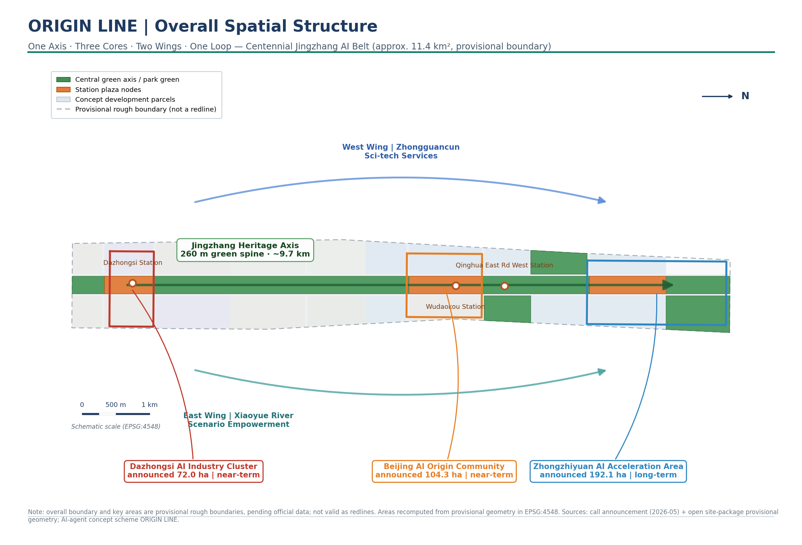
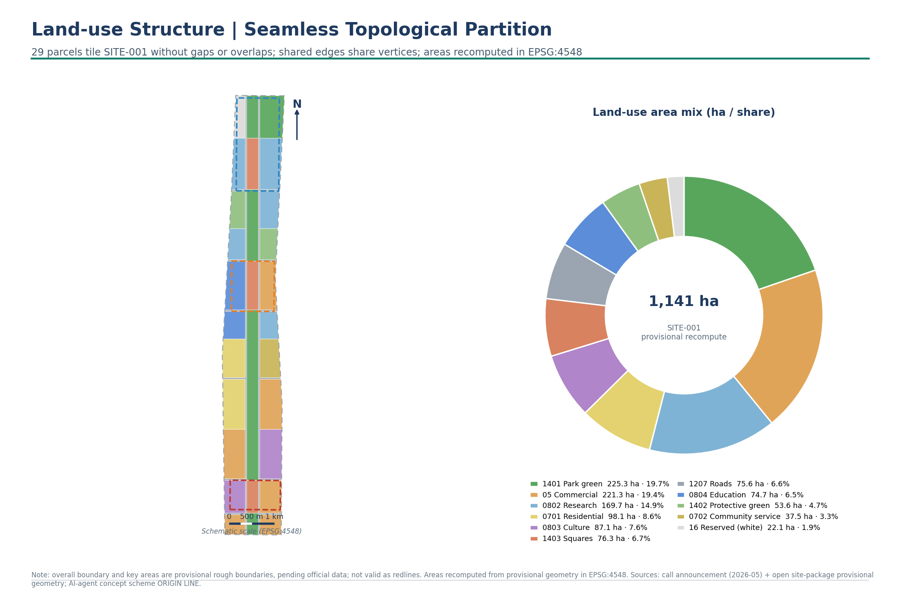
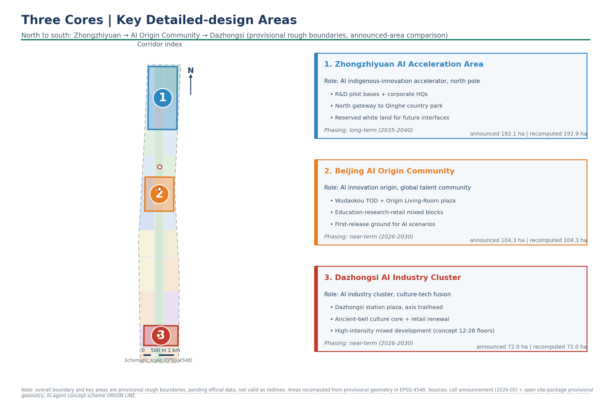
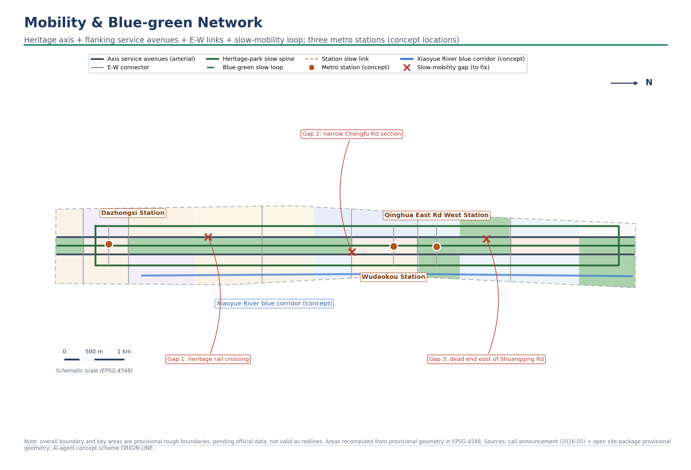
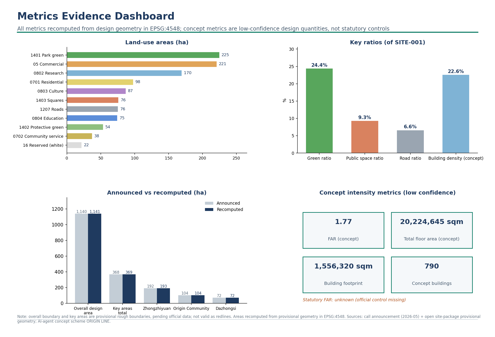

# ORIGIN LINE: A Conceptual Urban Design Proposal for the Centennial Jing-Zhang AI Innovation Belt

## Design Basis and Source List

This proposal is the formal conceptual deliverable of an AI agent participating in the open call for the Centennial Jing-Zhang AI Innovation Belt urban design. Its primary basis is the pre-qualification announcement issued on May 9, 2026 by the Haidian Branch of the Beijing Municipal Commission of Planning and Natural Resources, which defines the three-level scope, the three key areas, the design tasks, and the deliverable context [source:OFFICIAL-ANNOUNCEMENT] [standard:PROJECT-OFFICIAL-ANNOUNCEMENT]. The second basis is the open-call taskbook addressed to intelligent agents worldwide, which specifies the ten co-creation charter articles, the three major positionings, the five major functions, the three-zone-and-two-wing structure, and the six mandatory tasks agent.1 through agent.6 [source:AGENT-TASKBOOK] [standard:PROJECT-AGENT-OPEN-CALL-TASKBOOK].

Source usage follows the boundaries of the repository's public source registry: the announcement and the ministerial regulations of MOHURD and the Ministry of Natural Resources are official public materials usable for formal citation; the "three zones and two wings" industrial layout and the news on Haidian's "1+X+1" industrial system serve as industrial background; the provisional rough boundary inferred by the maintainers may only be used for proposal generation, visualization, and provisional self-checks [source:SOURCE-REGISTRY]. This proposal does not elevate any background or provisional material into a statutory basis; the complete registry of sources, licenses, and restrictions is recorded in `sources.json`.

A core data gap must be stated candidly: as of the generation of this proposal, the pre-qualification document package remains password-protected, and no official precise red line with a verifiable coordinate system is available through public channels. This proposal therefore adopts the provisional rough boundary inferred by the repository maintainers from the announcement's textual extents and announced area, marked in the submission package as a provisional constraint; it is not an official red line, an approval basis, or a basis for precise area recalculation [source:BOUNDARY-SOURCE] [data:geometry/site_boundary.geojson#SITE-001]. This organizer-side data gap does not block content scoring; once the official boundary is released, all land use, buildings, roads, green space, public space, phasing, and all area metrics must be recalculated through the same generation pipeline, and the recalculation trigger conditions have been written into `assumptions.json`.

This report has two layers: a human-readable layer explaining design judgments, spatial moves, and implementation logic; and a machine-audit layer composed of `metrics.json`, `geometry/*.geojson`, three matrix files, and `self_check.json`. Reviewers can read the full text without opening any JSON, or trace back along the evidence markers in the text to the structured records.

## Spatial Experience: Your First Fifteen Minutes Inside ORIGIN LINE

Three kinds of people walk into the belt on the same morning, each perceiving a different layer of the same corridor.

**Li Ming, open-source developer, 8:40 AM, exiting Dazhongsi Station Exit A.** He looks up beneath the curved canopy of the "Origin of the Smart Rail" plaza and sees a low-brightness real-time screen scrolling the day's global open-source commit heatmap. A copper-colored rail line embedded in the ground is marked "KM 0" — the imagery of the Jing-Zhang Railway's mileage origin. He walks north along the rail line for three minutes, passing through a stretch of fully transparent ground-floor retail where smart terminals in shop windows run unattended product demos. A discreet intelligent wayfinding post emits a green light band indicating shared test workstations and free computing-power access 200 meters ahead. He opens his phone; the site's edge-computing portal has already been pushed to the developer community channel. From exiting the station to sitting down to write code: under twelve minutes.

**Auntie Zhang, long-term resident, 7:15 AM, stepping out for her morning walk from Chengfu Road community.** She leaves through the south gate of her housing compound and in two minutes she is on the Jing-Zhang Heritage Park's slow-mobility main axis. Morning joggers are already out, but the 260-meter-wide green spine separates pedestrian paths, cycling lanes, and lawns — it does not feel crowded. She walks one kilometer along the shaded path of the Xiaoyue River protective green belt, passing a node marked "Rail Market" — a quiet pocket garden on weekdays, a creative market on weekend evenings. There are no obtrusive high-tech installations along the way, only inconspicuous low-illumination light bands set in the ground that glow at night, retracing the "人"-shaped switchback alignment of the old Jing-Zhang Railway. She finds this path much like the old railway greenway — just a little quieter, a little cleaner.

**Dr. Müller, visiting international scholar, 10:00 AM, arriving at Wudaokou Station.** Multilingual signage in the platform corridors guides him toward "Origin Living Room" plaza. At the plaza center, the "Origin KM0" landmark features a translucent ground screen that marks the world's cities contributing to AI open source with starlight-like dots — he spots Munich's dot. The adjacent International Talent Service Station has English, Japanese, and French self-service terminals for short-term residence and preliminary research collaboration procedures. A five-minute walk westward through Technology-Transfer Street brings him to Tsinghua's east gate. He notices the buildings along the street are not tall — six to eight stories — with fully open ground floors: cafés, small roadshow halls, and bookable shared laboratories. The scale of the district reminds him of Kendall Square in Boston, but with an added layer of railway-heritage character.

These three vignettes are not fiction; they are the "user manual" of the proposal's spatial moves: every spatial node, every slow-mobility path, and every open ground-floor interface has a corresponding land-use parcel ID, layer feature, and metric reference in the chapters that follow. The design quality of this proposal is ultimately measured by whether these people are willing to walk in and stay, day after day.

## Three-Level Scope Framework

The proposal organizes its work along the three levels defined in the announcement, with depth increasing level by level [standard:PROJECT-OFFICIAL-ANNOUNCEMENT] [depth:three_level_scope_framework]:

- **Coordinated research area (approx. 43.6 sq km)**: answers strategic questions about Haidian's AI industry ecosystem and future urban form; deliverables are the industrial strategy, naming and visual identity system, overall spatial structure, and regional coordination framework, without adding any pseudo-precise red lines.
- **Overall design area (approx. 11.4 sq km)**: targets the urban districts within 1–2 km around the Jing-Zhang Railway Heritage Park, reaching the urban design depth of a regulatory detailed plan; deliverables are a complete, seamless land-use zoning, building footprints, road and slow-mobility systems, blue-green public space, phasing extents, and recalculated metrics [data:geometry/land_use.geojson#LU-001] [metric:site_area_sqm].
- **Key areas (approx. 368.4 ha)**: conceptual detailed designs at the depth of a comprehensive planning implementation plan for the Zhongzhiyuan AI Independent Innovation Acceleration Area, the Beijing AI Origin Community, and the Dazhongsi AI Industry Cluster respectively [data:geometry/key_areas.geojson#PROV-KEY-001].

The three levels are not three isolated maps: the coordinated research area determines judgments on the industrial chain and urban form, the overall design lands those judgments on layers and metrics, and the key areas verify the implementability of the spatial moves. The overall design area submitted in this proposal is a provisional geometric recalculation value of approx. 11.4128 million sqm, consistent with the announced approx. 11.40 million sqm, but all area conclusions are labeled with the provisional boundary premise [metric:site_area_sqm] [metric:overall_design_area_announced_sqm].

Because a provisional rough boundary is used, this section states three usage limits: first, the provisional boundary is inferred only from the announcement's textual extents and area constraint, and its rectilinear edges do not represent road red lines or statutory boundary lines; second, all areas, ratios, and intensities derived from the provisional geometry are conceptual design quantities, with confidence levels itemized in `metrics.json`; third, once the official boundary is released, this proposal provides reproducible generation scripts and a recalculation path that can recompute everything as a whole within hours, rather than patching drawing by drawing by hand.

## Coordinated Research Area: Industry and Future City Research

### Overall Concept and Naming System (responding to agent.1)

The overarching concept of this proposal is "ORIGIN LINE" (原点·智轨). "Origin" carries three meanings: the Beijing–Zhangjiakou Railway was the first trunk railway independently surveyed, designed, and built by the Chinese, the historical origin of China's engineering self-reliance and innovation; the Beijing AI Origin Community carries the original-innovation source function of universities and institutes such as Tsinghua University, Peking University, and the Chinese Academy of Sciences; and for developers worldwide, every `init` in the open-source world begins from an origin. "Smart rail" refers both to the physical heritage corridor of the Jing-Zhang Railway and to the new kind of track along which data, algorithms, and computing power flow in the AI era. The naming does not treat history as decoration, but makes "the origin spirit of independent innovation" the brand core of the belt [source:AGENT-TASKBOOK].

The naming system is a master name plus hierarchical sub-brands, all original concept suggestions of this proposal, as reference concepts for professional teams to deepen:

- Master brand: ORIGIN LINE (原点·智轨) — Centennial Jing-Zhang AI Innovation Belt;
- Three core sub-brands: Zhiyuan·Zhongzhiyuan (full-stack independent innovation acceleration), Origin·Wudaokou (AI Origin Community), Zhihui·Dazhongsi (AI industry cluster);
- Gateway nodes: Origin of the Smart Rail (Dazhongsi station forecourt), Origin Living Room (Wudaokou station plaza), Innovation Theater (Zhongzhiyuan gateway plaza);
- Event brand: ORIGIN WEEK (see the long-term operation chapter).

Visual identity and logo direction: taking the famous "人"-shaped (switchback) alignment of the Jing-Zhang Railway as the motif, the "人"-shaped rails are overlaid with neural-network node connections, forming a graphic symbol that is both a track and an intelligent network; the primary colors are "rail blue" and "signal green," with "platform gray" and "lamplight orange" as auxiliary colors. This direction uses only original geometric graphics and no protected typefaces, images, trademarks, or corporate logos; subsequent deepening requires professional teams to complete font licensing and trademark registration checks.

### Three Major Positionings, Five Major Functions, and the Three-Zone-Two-Wing Coordination Loop

The proposal translates the taskbook's three major positionings into spatial and operational language: the "Centennial Jing-Zhang Cultural Belt" lands on the heritage park main axis and the cultural narrative system; the "Urban AI Life Experience Belt" lands on the scenario cards and public experience routes; the "AI Integrated Innovation Belt" lands on the industrial coordination loop of the three zones and two wings [standard:PROJECT-AGENT-OPEN-CALL-TASKBOOK]. The five major functions are assigned to spatial carriers: the AI full-stack independent innovation system centers on Zhongzhiyuan; the world-class AI innovation ecosystem centers on the Origin Community; the new paradigm of AI+ scenario empowerment relies on the Xiaoyue River scenario-empowerment wing and belt-wide scenario nodes; the intelligent, AI-driven vibrant city relies on the transport, municipal, and public service systems; and the global voice in AI governance relies on Zhongzhiyuan's standard-setting and safety governance functions.

The coordination loop of the three zones and two wings is a closed cycle of "sourcing—accelerating—transforming—serving—validating": original innovation from universities and institutes is incubated in the Origin Community (sourcing), enters Zhongzhiyuan for full-stack independent innovation and standards governance (accelerating), reaches Dazhongsi for productization, content consumption, and international exchange (transforming), is supported by the Zhongguancun technology services wing providing global allocation of capital, legal, and intellectual property factors (serving), and is tested and fed back by the Xiaoyue River scenario-empowerment wing in real urban scenarios (validating), with validation data flowing back to the sourcing end. Spatially, this loop is threaded together by the smart-rail main axis and the blue-green slow-mobility composite ring; operationally, it is sustained by the scenario-opening mechanism and the event system [depth:overall_spatial_structure].

### Global AI Innovation Ecosystem Cases (responding to agent.2)

The following seven cases are qualitative syntheses from public sources, serving only as a reference frame for spatial and institutional design; all figures are subject to the official releases of each case:

| Case | Transferable lessons | Translation into this proposal |
| --- | --- | --- |
| Silicon Valley–Stanford innovation ecosystem (USA) | Long-term symbiosis of university sourcing, venture capital, and open-source culture | The Origin Community's "campus–park–block" integration and talent special-zone concept |
| King's Cross Knowledge Quarter, London (UK) | Railway heritage renewal layered with knowledge institutions, public space first | The Jing-Zhang Railway Heritage Park as the public-space backbone of the innovation belt |
| Kendall Square, Boston (USA) | High-density innovation blocks around universities, fine-grained mixed-use parcels | Small parcels, active ground floors, and affordable innovation space in the Origin Community |
| MaRS–Waterloo corridor, Toronto (Canada) | Axis organization of technology-transfer institutions and an urban innovation corridor | A corridor structure laying out "sourcing—transformation" along the axis |
| Heilbronn IPAI AI innovation park (Germany) | A park form and governance showcase tailored to the AI industry | Zhongzhiyuan's full-stack system and standards-governance showcase functions |
| one-north and Punggol Digital District (Singapore) | Integrated work–live–learn parks and district-wide digital twin pilots | Balanced jobs-housing-services mix and scenario-opening operation mechanisms |
| Shanghai West Bund "Model Speed Space" (China) | Spatial agglomeration of a foundation-model innovation ecosystem and branded event operations | Dazhongsi's AI-native business formats and annual event system |

The shared lesson of these cases is that an innovation ecosystem is not a tenant-recruitment list, but a long-term combination of "spatial supply × factor mechanisms × community operation." On this basis the proposal proposes conceptual suggestions for eight categories of factor mechanisms: land (composite carriers released through urban renewal), space (small-parcel mixing and open ground floors), industry (three-zone division of labor and scenario opening), capital (the technology services wing's capital-matching platform), talent (talent special zone and international living services), computing power (distributed edge-computing stations), data (a data-factor reception hall under compliant authorization), and scenarios (belt-wide open test-and-validation scenarios). All mechanisms are conceptual suggestions and constitute no commitment on tenant recruitment, funding, or policy [source:AGENT-TASKBOOK].

### Judgment on the Future Urban Form

The urban form of the AI era will show three trends: workspaces shifting from concentrated office towers to distributed "laboratory + community" networks; public space shifting from objects of viewing to interactive, testable, operable urban interfaces; and transport systems shifting from car-first to a perceivable "slow mobility + intelligent feeder" network. This proposal lands these three trends as the overall spatial structure of "one axis, three cores, two wings, one ring": the axis is the smart-rail main axis of the Jing-Zhang Railway Heritage Park, the three cores are the three key areas, the two wings are the Zhongguancun technology services wing and the Xiaoyue River scenario-empowerment wing, and the ring is the blue-green slow-mobility composite ring [data:geometry/green_space.geojson#GREEN-001] [data:geometry/roads.geojson#ROAD-010].

### Regional Coordination: The Belt and Beijing's "Three Science Cities Plus One Zone"

The Centennial Jing-Zhang AI Innovation Belt is not an island. Its industrial logic is embedded within Beijing's "Three Science Cities Plus One Zone" innovation geography, complementing rather than competing with surrounding functional areas:

- **Relationship with Zhongguancun Science City**: The belt sits in the heartland of Zhongguancun Science City and serves as the carrier through which the Science City's "original innovation sourcing" function lands in physical, walkable, block-scale innovation space with real-world scenario test beds. The Science City provides the institutional and policy framework; the belt provides the lived environment.
- **Relationship with Future Science City**: Future Science City focuses on applied research and industrial conversion by central state-owned enterprises and major R&D institutions. The belt starts from original innovation by universities and the open-source community. Together, they form the upstream and downstream of the "original innovation → applied research → industrial conversion" chain, linked spatially through the northward extension of the Jing-Zhang corridor.
- **Relationship with Huairou Science City**: Huairou hosts large-scale science facilities and fundamental research. The belt hosts AI algorithm and model-layer innovation. Scientific data produced at Huairou, once cleaned and compliance-processed, can enter AI training pipelines via the Data-Factor Reception Hall — a potential junction point for the "big-facility data → AI model" flow.
- **Relationship with the Beijing Economic-Technological Development Area (Yizhuang)**: The Development Area handles manufacturing and deployment at scale. AI technologies and validated scenarios from the belt ultimately need Yizhuang's production lines for large-scale rollout, maintaining the complementary "Haidian R&D — Yizhuang manufacturing" pattern.

Within the belt itself, the Zhongguancun Technology Services Wing connects eastward to the core Zhongguancun area's capital, legal, and IP service ecosystem, while the Xiaoyue River Scenario-Empowerment Wing connects westward to the living-scenario demands of the Beitaipingzhuang and Xueyuan Road communities. The two wings ensure that the belt's innovation loop does not close in on itself but opens outward to the city. This regional coordination judgment is one of the core conclusions at the coordinated-research level, providing the external logic that supports the industrial positioning and scenario-opening strategies of the three cores.

## Overall Design Area: Urban Renewal and Regulatory-Plan-Level Urban Design

Work in the overall design area reaches the urban design depth of a regulatory detailed plan, but strictly distinguishes "design quantities recalculable from the submitted geometry" from "control indicators pending confirmation of formal regulatory-plan conditions" [standard:MOHURD-CONTROL-DETAILED-PLANNING] [depth:development_intensity_controls].

### Overall Renewal Framework and Land-Use Structure

Within the provisional boundary, the proposal completed a topologically sound land-use subdivision: 29 parcels fully cover the 11.4128 million sqm overall design area, with no gaps and no overlaps, and adjacent parcels share boundary coordinates [data:geometry/land_use.geojson#LU-001] [depth:land_use_layout]. The land-use organization logic is "green in the middle, renewal on both sides, denser in the south and sparser in the north":

- **Central green axis**: the 260-meter-wide spine of the Jing-Zhang Railway Heritage Park (park green space) runs the full length of the belt for approx. 9.7 km, totaling approx. 2.259 million sqm together with the Qinghe Country Park section, forming the public-space and ecological backbone of the belt [data:geometry/land_use.geojson#LU-001] [data:geometry/land_use.geojson#LU-029];
- **Southern Dazhongsi section**: commercial-service and cultural land is concentrated, forming a high-intensity composite development intent area around the Dazhongsi station forecourt [data:geometry/land_use.geojson#LU-005];
- **Central Xueyuan Road–Wudaokou section**: a mix of residential renewal, education and research, and community services, supporting the jobs-housing balance of the Origin Community;
- **Northern Zhongzhiyuan section**: predominantly research land, retaining the northern strategic reserve as flexible capacity for the future [data:geometry/land_use.geojson#LU-028].

Urban renewal targets are identified under the principle of "releasing inefficient space": the commercial renewal belt around stations, the composite reuse of protective green belts on both sides of the green axis, the incremental renewal of residential blocks, and the capacity expansion of research clusters. The renewal project list is detailed later, and phasing extents have been landed on layers [data:geometry/phasing.geojson#PHASE-001].

### Industrial Function Ratios and the Innovation Indicator System

Land-use areas are recalculated item by item according to the national territorial-space land-and-sea use classification codes [standard:MNR-LAND-USE-CLASSIFICATION-GUIDE]: research land (0802) approx. 1.697 million sqm, education land (0804) approx. 0.747 million sqm, commercial-service land (05) approx. 2.213 million sqm, residential land (0701) approx. 0.981 million sqm, cultural land (0803) approx. 0.871 million sqm, and park green space plus protective green space (1401/1402) totaling approx. 2.789 million sqm. The three industry-related categories of research, education, and commercial land total approx. 4.657 million sqm, about 40.8% of the overall design area, supporting the spatial-supply judgment of "AI + vertical application deployment" [metric:land_use_area_0802_sqm] [metric:land_use_area_05_sqm].

Planning indicators required by the announcement — such as the AI innovation index, talent density, and output scale — are performance indicators that require continuous calibration with industrial operation data. This proposal does not fabricate values; instead, they are registered in `metrics.json` and the compliance matrix as items pending formal data completion, and a conceptual indicator framework of observable proxy indicators — such as scenario usage frequency, open-source community activity, and the number of technology-transfer projects — is proposed as reference concepts for professional teams to deepen.

### Composite Carrying Capacity and Items Pending Confirmation

The conceptual total floor area of approx. 20.225 million sqm is estimated from building footprints and conceptual floor counts; it is only a low-confidence design quantity used to discuss the magnitude of carrying demand and is not a statutory control value. Official control indicators such as floor area ratio, building height, and building density are missing from public sources and are uniformly registered as pending formal data completion [metric:total_floor_area_sqm_concept] [metric:floor_area_ratio]. Carrying strategies for transport, municipal infrastructure, and public services are covered in the dedicated chapter; everything concerning road red lines, pipeline capacity, fire protection, and setbacks is listed in the pending-confirmation list of `assumptions.json`.

## Detailed Design of Key Areas

The three key areas each form a readable mini-proposal at the depth required of a comprehensive planning implementation plan, structured as "positioning + spatial structure + building renewal + transport and slow mobility + public space + AI scenarios + implementation risks." All three areas are currently provisional rough extents; the following conclusions are directional designs, and precise parcel-level conclusions await review after official data is completed [data:geometry/key_areas.geojson#PROV-KEY-001] [depth:three_key_area_detailed_design].

### Zhongzhiyuan AI Independent Innovation Acceleration Area (approx. 192.1 ha, provisional recalculation 192.9 ha)

- **Positioning**: "Zhiyuan·Zhongzhiyuan" — a garden-style innovation district oriented to the AI full-stack independent innovation system and a global voice in AI governance, carrying the conceptual siting of national-level AI platform, standard-setting, and safety governance functions [data:geometry/key_areas.geojson#PROV-KEY-001].
- **Spatial structure**: the west and east research clusters flank the northern end of the green axis, with the gateway plaza "Innovation Theater" as the debut interface open to the city; the northern strategic reserve pre-reserves growth interfaces [data:geometry/land_use.geojson#LU-026] [data:geometry/land_use.geojson#LU-025].
- **Building renewal**: predominantly low-rise research courtyards (conceptual floor counts of 3–10 stories), preserving the ecological continuity of the Qinghe River interface; buildings, green space, and water systems are designed integrally, drawing out the culture of the Qinghe River.
- **Transport and slow mobility**: the Zhongzhiyuan south connector joins the smart-rail service avenue, and the slow-mobility main axis leads directly to the gateway plaza; directions for optimizing external transport are proposed in coordination with the Fifth Ring Road regional integration plan, with specific alignments pending professional deepening.
- **AI scenarios**: full-stack independent-system exhibition hall, foundation-model red-team evaluation ground, standard-setting workshops, and a low-carbon computing-power experience trail.
- **Implementation risks**: the area is large and located at the far end, so it is placed in the long-term completion phase; Fifth Ring Road integration and the Qinghe River blue-green conditions await confirmation from official sources.

### Beijing AI Origin Community (approx. 104.3 ha, provisional recalculation 104.3 ha)

- **Positioning**: "Origin·Wudaokou" — a campus-adjacent AI innovation district and global developer community, organizing achievement incubation, transfer, and talent life around the original-innovation sourcing of Tsinghua University, Peking University, and the Chinese Academy of Sciences [data:geometry/key_areas.geojson#PROV-KEY-002].
- **Spatial structure**: the education core (Tsinghua side) and the Wudaokou station plaza "Origin Living Room" form a dual-node structure, the technology-transfer street unfolds along the slow-mobility line, and housing and community services are interwoven [data:geometry/land_use.geojson#LU-017] [data:geometry/land_use.geojson#LU-018].
- **Building renewal**: a low-disturbance, organic renewal model guided by small parcels, open ground floors, and affordable space; the conceptual retain-renovate-demolish ratio is approx. 16% retained, approx. 33% renovated, and approx. 51% newly built (a belt-wide conceptual statistic, not a parcel-level conclusion).
- **Transport and slow mobility**: integrated design around the Wudaokou and Qinghua East Road West Crossing rail stations, stitching together slow-mobility links among campus, park, and blocks [data:geometry/roads.geojson#ROAD-012] [data:geometry/roads.geojson#ROAD-013].
- **AI scenarios**: open-source launch hall, technology-transfer stations, talent service station, and AI education experience points.
- **Implementation risks**: campus boundaries and property rights are complex, so renewal must be negotiated with the universities; placed in the near-term launch phase, leading with lightweight operations and pilot spaces.

### Dazhongsi AI Industry Cluster (approx. 72.0 ha, provisional recalculation 72.0 ha)

- **Positioning**: "Zhihui·Dazhongsi" — an urban AI industry cluster and international exchange district centered on AI-native new business formats such as intelligent agents, smart terminals, and content consumption, leveraging the pull of leading enterprises [data:geometry/key_areas.geojson#PROV-KEY-003].
- **Spatial structure**: the Dazhongsi station forecourt "Origin of the Smart Rail" serves as the southern gateway, with the commercial forecourt and the ancient-bell cultural core echoing east and west, forming a high-intensity composite development intent area [data:geometry/land_use.geojson#LU-005] [data:geometry/land_use.geojson#LU-006].
- **Building renewal**: conceptual floor counts of 12–28 stories, the highest-intensity section of the whole area; the ancient-bell cultural core maintains a scale transition through cultural facilities and creative business formats.
- **Transport and slow mobility**: Dazhongsi station integration and four-quadrant pedestrian connectivity at the intersection are this area's foremost public-space issues; the proposal organizes the walking network around the station forecourt and four feeder slow-mobility lines, with non-motorized-vehicle parking incorporated into the plaza's composite design [data:geometry/roads.geojson#ROAD-011].
- **AI scenarios**: international roadshow living room, data-factor reception hall, smart-terminal launch street, and content-consumption experience ground.
- **Implementation risks**: property rights and operating boundaries around key enterprises are sensitive, so public-realm renewal is premised on negotiation; placed in the near-term launch phase.

## AI Innovation Ecosystem, Personas, and AI+ Scenarios

### User Personas (responding to agent.3, no fewer than 5 categories)

| Persona | Typical needs | Spatial response | Data and privacy boundaries |
| --- | --- | --- | --- |
| Open-source developers | Publishing, collaboration, testing, community reputation | Origin Living Room, open-source launch hall, nighttime collaboration spaces | Aggregate statistics only; no collection of individual behavior trajectories |
| AI startup teams | Low-cost space, computing-power access, test grounds | Zhongzhiyuan shared test grounds, edge-computing stations | Computing-power and data services separately authorized |
| Guests of leading enterprises | Showcasing, business, international reception | Dazhongsi international roadshow living room, station forecourt gateway | Corporate logos and cases must be rights-cleared |
| Nearby permanent residents | Commuting, leisure, community services, low-disturbance renewal | Slow-mobility ring, community service clusters, tiered event management | Resident profiles not used for commercial recommendation |
| University faculty and students | Technology transfer, cross-campus collaboration, daily slow mobility | Technology-transfer street, campus-park slow-mobility stitching | Campus data and research achievements require authorization |
| International visiting scholars | Short-term residence, cross-cultural socializing, visa and government services | International talent service station, multilingual wayfinding | Foreign-related services follow existing regulatory procedures |

### AI Scenario Cards (12 cards, 4 of which are industrial test-and-validation scenarios)

Each scenario card maps to a spatial location, target users, data boundaries, and an operating entity; all scenarios are conceptual suggestions, and test-type scenarios may operate only after obtaining the corresponding permits and setting up human review [source:AGENT-TASKBOOK].

| # | Scenario card | Spatial carrier | Design description and operating boundaries |
| --- | --- | --- | --- |
| 01 | Open-source launch hall | Origin Living Room (PUBLIC-002) | University and community achievement releases, code-contribution showcases, small roadshows; event data aggregated statistically |
| 02 | Foundation-model red-team evaluation ground (test & validation) | Zhongzhiyuan research clusters (LU-026) | Bookable, supervisable space for safety evaluation and standards validation; no unreviewed conclusions released to the public |
| 03 | Intelligent feeder minibus test (test & validation) | Green-axis slow-mobility main axis and station feeder lines (ROAD-009) | Low-speed feeder tests confined to designated corridors and time windows; permits and on-board safety officers required |
| 04 | Delivery-robot street test (test & validation) | Chengfu Road residential blocks and community service clusters | Human-machine co-travel rules, yielding priorities, and manual takeover mechanisms published in advance |
| 05 | Urban facility inspection agents (test & validation) | Belt-wide road network and public spaces | Facility-state recognition only, no personal identification; data processed locally |
| 06 | AI slow-mobility navigation | Heritage park slow-mobility main axis | Explainable wayfinding prompts for breakpoints, crowding, and accessibility needs; low-intrusion sensing |
| 07 | Qinghe low-carbon innovation corridor | Qinghe Country Park section (GREEN-004) | A public living room combining stormwater management, walking and cycling, and AI environmental displays |
| 08 | Data-factor reception hall | Dazhongsi commercial forecourt | A showcase interface for data-circulation services premised on compliance, authorization, and auditability |
| 09 | International roadshow living room | Origin of the Smart Rail (PUBLIC-001) | Launches, deal-making, and international exchange for intelligent-agent and smart-terminal enterprises |
| 10 | AI life-service model street | Zhichun Road commercial mixed-use area (LU-011) | Fine-grained street-level operation of AI+ scenarios in healthcare, education, legal, and daily-life services |
| 11 | Forest laboratory | Northern imagination node (PUBLIC-006) | Public-participation research experiences and citizen-science activities within the green axis |
| 12 | Rail-market night school | Southern memory node (PUBLIC-004) | A community scenario combining heritage display, creative markets, and an AI night school |

The scenario–space–operation mapping: all 12 scenario cards are attached to specific layer features; operating entities are divided into four suggested roles — government platform, enterprises, community, and universities — with revenue and maintenance mechanisms listed in the long-term operation chapter. All scenarios observe the principles of data minimization, public sources, explainability, and human review; scenarios involving generative AI services are handled within the applicable scope of the relevant regulations [standard:GENERATIVE-AI-INTERIM-MEASURES]. This proposal includes no scenario that infringes privacy, enables excessive surveillance, or lacks human review, and it does not write immature technology as if it were fully deployable [data:geometry/public_space.geojson#PUBLIC-001].

The Xiaoyue River scenario-empowerment wing carries the spillover demand of test-type scenarios through the composite reuse of protective green belts, echoing the Zhongguancun technology services wing to the east in a "validation—service" pairing; the public experience route threads the 12 scenario cards together via the slow-mobility composite ring, forming a walkable, shareable experience itinerary [data:geometry/green_space.geojson#GREEN-002] [data:geometry/roads.geojson#ROAD-010].

## Land Use, Building Scale, and Retain-Renovate-Demolish Strategy

The land-use layout has been explained above by classification code; this section focuses on building scale and the retain-renovate-demolish logic. The proposal generated 790 conceptual building footprints within research, education, commercial, and residential parcels, with a combined footprint area of approx. 1.556 million sqm recalculated directly from the layer [data:geometry/buildings.geojson#BLDG-001] [metric:building_footprint_area_sqm].

The building organization principle is "higher in the south, lower in the north; densification around stations; the green axis left open": the southern Dazhongsi section has conceptual floor counts of 12–28 stories, the central Origin Community section 6–18 stories, and the northern Zhongzhiyuan section 3–10 stories; areas around rail stations are densified, and no development is placed within the green axis or protective green belts. The conceptual building density of approx. 22.6% and conceptual floor area ratio of approx. 1.77 are both low-confidence design quantities derived from the provisional geometry, used for discussing magnitudes and to be recalculated once formal regulatory-plan conditions are confirmed [metric:building_density_concept] [metric:floor_area_ratio_concept].

Retain-renovate-demolish follows a conceptual three-level classification: approx. 16% retained (existing building footprints in good condition or of memory value), approx. 33% renovated (functional replacement and facade renewal), and approx. 51% newly built (release of inefficient space). This classification is a methodological demonstration, not a parcel-level conclusion — lacking surveys of existing buildings, property rights, and engineering conditions, the retain-renovate-demolish decision for any specific parcel must be determined by professional teams after formal data is completed [depth:retain_renovate_demolish]. Guidance directions for building height, massing, frontage, and roof form follow the urban design management measures' requirements for coordinated character, with specific control values pending confirmation of regulatory-plan conditions [standard:MOHURD-URBAN-DESIGN-MEASURES] [depth:height_massing_character].

In terms of spatial supply and operation strategy, the proposal recommends "affordable innovation space" as the primary supply goal of the Origin Community: open ground floors, small-area units, and shared meeting and testing facilities, coordinated with talent services and housing support, sustaining an integrated "work–life–social–learning" environment. This recommendation is an operating concept and constitutes no land or fiscal commitment.

## Transport, Rail, Municipal Infrastructure, and Public Services

The core judgment of the transport proposal is this: the belt's north-south connectivity depends on the Jing-Zhang corridor, but the slow-mobility networks on both sides of the heritage park have breakpoints, and the "last mile" experience between rail stations and key parcels determines how innovation talent perceives the belt day to day [depth:traffic_rail_slow_parking].

The proposal's road system consists of three types of centerlines: the smart-rail service avenues on both sides of the green axis carry motor-vehicle organization; six east-west connectors stitch together the urban fabric divided by the corridor; and one heritage-park slow-mobility main axis plus one blue-green slow-mobility composite ring form the walking-and-cycling skeleton, with three additional station-feeder slow-mobility lines serving the Dazhongsi, Wudaokou, and Qinghua East Road West Crossing stations [data:geometry/roads.geojson#ROAD-009] [data:geometry/roads.geojson#ROAD-010]. Recalculated road land is approx. 0.756 million sqm, about 6.6% of the overall design area [metric:road_area_sqm] [metric:road_ratio].

Conceptual solutions for key transport issues: four-quadrant pedestrian connectivity at the Dazhongsi intersection is organized around the station forecourt; the park's south and north ends and the over-ring node are addressed in the direction of slow-mobility bridges or at-grade improvements (engineering feasibility awaits dedicated study, and this proposal draws no bridge-or-tunnel conclusions); non-motorized-vehicle parking is incorporated into the composite design of the three station plazas. All road alignments are conceptual centerlines and do not represent road red lines; road red lines, intersection channelization, and rail-integration schemes await deepening after formal sources are completed.

For municipal and new-type infrastructure, the proposal points to an integration of "traditional municipal systems + distributed energy + edge computing": edge-computing stations and energy microgrid interfaces are co-located at public-service nodes, and AI industry service facilities, innovation service platforms, and talent life-service facilities are tiered across the three cores [depth:municipal_new_infrastructure]. Pipeline capacity, energy load, flood control and drainage, and fire-protection conditions are all listed as prerequisite pending-confirmation items for formal deepening, and this proposal makes no engineering estimates [data:geometry/constraints.geojson#CONSTRAINTS].

## Blue-Green Network, Public Space, and Urban Character

### Blue-Green Space System

The blue-green scheme takes the central green axis as its skeleton: the Jing-Zhang Railway Heritage Park spine section (approx. 1.763 million sqm) and the Qinghe Country Park section (approx. 0.490 million sqm) form a north-south continuous park system; the Xiaoyue River protective green belt and the Shuangqing Road protective green belt carry east-west ecological and slow-mobility connections; total green space is approx. 2.789 million sqm with a green-space ratio of approx. 24.4% [data:geometry/green_space.geojson#GREEN-001] [metric:green_ratio]. The public-space system consists of three station plazas and three themed nodes within the green axis: the Dazhongsi station forecourt "Origin of the Smart Rail," the Wudaokou station plaza "Origin Living Room," the Zhongzhiyuan gateway plaza "Innovation Theater," plus the three green-axis nodes of the rail market, the AI showground, and the forest laboratory; public space totals approx. 1.063 million sqm [data:geometry/public_space.geojson#PUBLIC-002] [metric:public_space_ratio].

Conceptual strategies for east-west stitching and north-south continuity: north-south continuity is maintained by the slow-mobility main axis and the composite ring, focusing on the three breakpoints at the park's south end, north end, and the over-ring node; east-west stitching relies on the six connectors and the slow-mobility retrofit of the protective green belts, reweaving the universities, communities, and industrial parcels divided by the corridor [data:geometry/roads.geojson#ROAD-009].

### AI Pilgrimage Landmarks and Honors Display System (responding to agent.4)

The proposal offers conceptual suggestions for three AI pilgrimage landmarks, all original design directions available as reference concepts for professional teams to deepen and constituting no construction commitment:

1. **Origin KM0**: an "AI Origin" memorial landmark at Wudaokou station plaza, layering the imagery of the Jing-Zhang Railway's mileage origin with a real-time starlight floor display of open-source contributors worldwide, honoring the origin spirit from railway self-reliance to intelligent self-reliance [data:geometry/public_space.geojson#PUBLIC-002];
2. **Switchback Light**: a light-and-shadow installation in the middle section of the green axis themed on the "人"-shaped (switchback) alignment of the Jing-Zhang Railway, which at night reenacts the engineering wisdom of climbing switchbacks with low-illumination light bands, doubling as slow-mobility wayfinding;
3. **Origin Walk of Fame**: an honors display system along the slow-mobility main axis for open-source contributors and AI milestones, using updatable modules to record projects and people with real contributions to the belt and the global AI community, with an open nomination and review mechanism.

The honors display system follows the co-creation charter article "contributions deserve to be remembered": contributor names, proposal records, and knowledge assets are preserved sustainably, and displayed content must be authorized by those displayed. The conceptual list of the public-space component library includes five categories: explainable intelligent wayfinding posts, modular exhibition pavilions, smart seating, bookable test rails, and multilingual signage — all premised on original design and rights-cleared materials, avoiding over-entertainment and influencer-style expression.

### Cultural Narrative (responding to agent.5)

The main cultural narrative thread is "from the switchback rail to the intelligent rail": in 1909 the Jing-Zhang Railway crossed the Badaling mountains with its "人"-shaped alignment, establishing the origin spirit of Chinese engineering self-reliance and innovation; at the end of the last century Zhongguancun grew from an electronics street into a landmark of innovation culture; and today's new AI culture emphasizes open source, collaboration, and inclusiveness. The three are layered along the Jing-Zhang corridor into a walkable narrative line [source:AGENT-TASKBOOK].

The spatial culture system is expressed in three layers: the heritage layer protects and presents the imagery of historical resources such as the Qinghuayuan railway station (specific protection scopes are subject to formal publication by the cultural-relics authorities, and this proposal draws no heritage-control-line conclusions); the innovation layer expresses the innovative character of different eras through the architecture and public space of the three cores; and the future layer carries the ongoing AI culture through scenario cards and pilgrimage landmarks. The wayfinding and symbol system is recommended to use "rail blue–signal green" as primary colors with a unified bilingual Chinese-English typeface standard and icon family; the cultural identity system maintains a master-sub brand relationship with the belt's overall logo and is not mixed with it. The core copy direction for international communication is "From the first self-built railway to the open-source origin of AI," and all outbound communication materials must be rights-cleared before use.

Urban character follows the urban design management measures' requirements for the coordination of public space, building height, massing, style, and color: the overall tone is "the rationality of rail blue, the memory of heritage warm brick, and the openness of transparent frontages"; continuous slow-mobility frontages are controlled along both sides of the green axis, and transparent ground floors and arcade-like gray space are encouraged around stations [standard:MOHURD-URBAN-DESIGN-MEASURES] [depth:blue_green_public_space].

## Renewal Projects, Implementation Policy, and Phasing

The renewal project list is a conceptual suggestion; implementing entities, funding, and approval paths all await formal study [depth:renewal_project_list]:

| No. | Project | Type | Spatial location | Main dependencies |
| --- | --- | --- | --- | --- |
| JZ-01 | Origin of the Smart Rail plaza and Dazhongsi four-quadrant pedestrian connectivity | Public space / slow mobility | PUBLIC-001, ROAD-011 | Rail station data, intersection and pipeline conditions |
| JZ-02 | Origin Living Room and open-source launch hall | Public space / operation | PUBLIC-002 | Station integration scheme, operating entity |
| JZ-03 | Technology-transfer street (Wudaokou section) | Urban renewal / industry services | Around LU-017 | Campus boundaries, property rights, ground-floor tenant-mix negotiation |
| JZ-04 | Stitching heritage-park slow-mobility breakpoints | Transport / blue-green | ROAD-009 | Official boundary, dedicated engineering-conditions study |
| JZ-05 | Qinghe low-carbon innovation corridor | Blue-green / exhibition | GREEN-004 | River blue line and ecological flood-control conditions |
| JZ-06 | Zhongzhiyuan gateway Innovation Theater | Public space / exhibition | PUBLIC-003 | Deepening of Zhongzhiyuan detailed design |
| JZ-07 | Edge-computing station network | New infrastructure / public services | Public-service nodes of the three cores | Energy and safety assessments, operating authorization |
| JZ-08 | Rail market and community night school | Operation / culture | PUBLIC-004 | Community consultation and event permits |

Implementation policy recommendations cover: a coordinated urban-renewal implementation model (conceptual directions of district-level coordination and cross-subsidization), spatial supply policy (affordable innovation space), data and scenario governance (authorization and safety-assessment procedures for scenario opening), and public participation (community disclosure of renewal schemes and co-creation workshops). All policy recommendations are directions for deepening and do not constitute government decisions [standard:MOHURD-CONTROL-DETAILED-PLANNING].

The phasing plan is distinguished from the call's design period [data:geometry/phasing.geojson#PHASE-001] [depth:phasing_implementation]: the near-term launch area (2026–2030, approx. 3.477 million sqm) focuses on the Dazhongsi cluster and the Origin Community, leading with station plazas, slow-mobility breakpoints, and lightweight operations; the mid-term expansion area (2030–2035, approx. 5.677 million sqm) completes the renewal of the central linkage section; and the long-term completion area (2035–2040, approx. 2.259 million sqm) delivers the Zhongzhiyuan acceleration area and the first phase of the northern reserve [metric:phasing_recent_area_sqm].

### Global AI Event System and Long-Term Operation (responding to agent.6)

Conceptual suggestions for the annual event system: the flagship event "ORIGIN WEEK" (once a year, with launches, roadshows, exhibitions, and public experiences); bimonthly "Scenario Open Days" (test scenarios open to the public by reservation); quarterly "Open-Source Night Markets" (developer community linked with the rail market); and a standing "AI Night School" plus youth study programs. Event branding and communication visuals follow the master brand's rail blue–signal green system, forming a unified family of event sub-brands.

The long-term operation mechanism comprises five conceptual modules: developer community operations (online code contributions linked with the offline Origin Living Room, with contribution records entering the Walk of Fame); scenario-opening operations (standard procedures for scenario reservation, safety assessment, data compliance, and public notification); public experience operations (slow-mobility ring tours, landmark night tours, multilingual interpretation); international communication and attraction-conversion (a three-tier conversion path from event visitor to resident developer to landed team); and operational governance (four suggested roles — government platform, enterprises, community, universities — plus annual evaluation). All event and operation arrangements are conceptual suggestions and do not represent confirmed event plans, tenant-recruitment commitments, or funding arrangements [source:AGENT-TASKBOOK].

## Metrics, Area Recalculation, and Compliance Matrix

Metrics are managed in three categories [depth:metrics_recalculation]:

**Category 1: spatial metrics directly recalculable from the submitted geometry.** Overall design area of 11.4128 million sqm (provisional geometry; announced value approx. 11.40 million sqm); green space approx. 2.789 million sqm with a green-space ratio of approx. 24.4%; public space approx. 1.063 million sqm at approx. 9.3%; road land approx. 0.756 million sqm at approx. 6.6%; building footprints approx. 1.556 million sqm; the three key areas totaling approx. 3.693 million sqm (announced value 368.4 ha, the deviation arising from rounding in the provisional geometry) [metric:green_space_area_sqm] [metric:public_space_area_sqm] [metric:key_area_area_sqm]. The design meaning of these metrics: green space and public space together devote about one third of the land to encounter and ecology, supporting informal exchange among innovation talent; the building-footprint scale sets the floor of industrial space supply.

**Category 2: control indicators pending confirmation of formal regulatory-plan conditions.** Floor area ratio, building height, building-density control values, setbacks, and road red lines are missing from public sources and are registered in `metrics.json` as pending formal data completion; the text gives no pseudo-precise control values [metric:floor_area_ratio]. Conceptual design quantities (conceptual floor area ratio approx. 1.77, conceptual building density approx. 22.6%, conceptual total floor area approx. 20.225 million sqm) are separately labeled as low confidence and used only for carrying-capacity discussion [metric:total_floor_area_sqm_concept].

**Category 3: performance indicators requiring calibration with operation data.** The AI innovation index, talent density, industry-service satisfaction, slow-mobility accessibility, event participation, and the like are registered as pending formal data completion, with a conceptual framework of observable proxy indicators proposed.

Compliance coverage: announcement items 1.3, 1.4, and 1.5 and tasks agent.1 through agent.6 are all mapped to report chapters, layers, metrics, drawings, and HTML sections; the full correspondence is in `compliance_matrix.json`; item-by-item responses to the five mandatory professional standards are in `standard_matrix.json`; all fifteen formal design-depth items are completed, see `design_depth_matrix.json`. Area recalculation was performed by the generation scripts under the EPSG:4548 projection, and the scripts and intermediate artifacts are reproducible.

## Risk, Copyright, and Compliance

**Source and data risks.** This proposal uses only public sources and the provisional geometry registered in the repository; official precise boundaries, regulatory-plan conditions, existing-building surveys, property rights, municipal, and cultural-heritage data are missing, and the related conclusions have all been downgraded to pending formal data completion or conceptual suggestions [depth:risk_missing_data] [source:BOUNDARY-SOURCE]. The provisional boundary is not an official red line, an approval basis, or a basis for precise area figures.

**Copyright and rights clearance.** The naming, logo direction, landmark concepts, figures, and drawings are all original works generated by this agent; the case synthesis is based on public sources with figures subject to official releases; no unauthorized typefaces, images, trademarks, personal portraits, or corporate logos are used. The detailed statement is in `report/copyright_statement.md`.

**Compliance boundaries.** This proposal is a conceptual suggestion offered for open co-creation: it does not replace formal planning and does not constitute a government-approved conclusion; all spatial implementation suggestions are "conceptual suggestions / reference schemes / reference concepts for professional teams to deepen"; it involves no regulatory-plan adjustment, no parcel-level retain-renovate-demolish conclusions, no road red lines, no rail alignments, no bridge-tunnel or municipal engineering feasibility conclusions, and no land-ownership or investment estimates; it involves no personal privacy data or non-public materials. Scenario designs involving generative AI services, accessibility, and services for the elderly refer only to the applicable boundaries of publicly available laws and policies and constitute no case-specific compliance determination [standard:BARRIER-FREE-ENVIRONMENT-LAW].

**AI generation responsibility.** This proposal was generated by an AI agent (Kimi Code); the human maintainers and professional reviewers hold the final judgment. All conceptual figures in the proposal can be recalculated and verified from the submitted geometry and scripts, and corrections via Issues and PRs are welcome.

## International Communication: Why Come Here

For the global AI community, this proposal answers "why come here" in three voices:

**For developers:** This is where China's AI open-source community meets physical space. The belt offers bookable test beds for autonomous driving, robotics, and foundation-model evaluation — not in a remote industrial park, but in walkable urban blocks next to Tsinghua and Peking University. Edge computing is free at public nodes. Your contribution is recorded on the Origin Walk of Fame. ORIGIN WEEK brings the global community together once a year, and the Rail Market hosts monthly open-source meetups in a heritage railway setting that has no equivalent anywhere else.

**For researchers:** The corridor connects three of Beijing's top research clusters — the Chinese Academy of Sciences, Tsinghua, and Peking University — within a single slow-mobility loop. The Data-Factor Reception Hall provides compliant, authorized access to urban-scale datasets for training and evaluation. Huairou's big-science facilities feed upstream; Yizhuang's manufacturing lines wait downstream. The institutional fabric for turning a paper into a product exists within a fifteen-minute walk.

**For cities watching:** This is an experiment in AI-native urban design — not AI applied to a finished city, but a city whose public space, mobility, governance, and event system are designed from the start to host, test, and display artificial intelligence as a civic utility. The methodology — topologically sound GeoJSON, reproducible metrics, open-source co-creation — is itself a transferable model for any city that wants to move beyond smart-city dashboards toward an intelligence commons.

## References

- Pre-qualification Announcement for the International Design Call for the Centennial Jing-Zhang AI Innovation Belt Urban Design, Haidian Branch of the Beijing Municipal Commission of Planning and Natural Resources, 2026-05-09
- Excerpts from the Open-Call Taskbook for the Centennial Jing-Zhang AI Innovation Belt Urban Design addressed to intelligent agents worldwide (rights-cleared excerpts provided by the user), 2026-05-18
- Urban Design Management Measures, Ministry of Housing and Urban-Rural Development, 2017
- Measures for the Preparation and Approval of Regulatory Detailed Plans for Cities and Towns, Ministry of Housing and Urban-Rural Development
- Guide to Land-and-Sea Use Classification for Territorial-Space Survey, Planning, and Use Control, Ministry of Natural Resources, 2023
- Interim Measures for the Management of Generative AI Services, Cyberspace Administration of China and six other departments, 2023 (cited within the applicable scope)
- Law of the People's Republic of China on the Construction of a Barrier-Free Environment, 2023 (cited within the scenario boundaries listed in Article 39)
- Public reporting on Haidian District's "1+X+1" modern industrial system and Beijing's "three zones and two wings" industrial layout (industrial background)
- Provisional rough boundary and the three key-area geometries of the Centennial Jing-Zhang AI Innovation Belt (inferred by the repository maintainers, for provisional use)

The complete machine-readable index is governed by `sources.json` and the three matrix files [source:SITE-PACKAGE].
