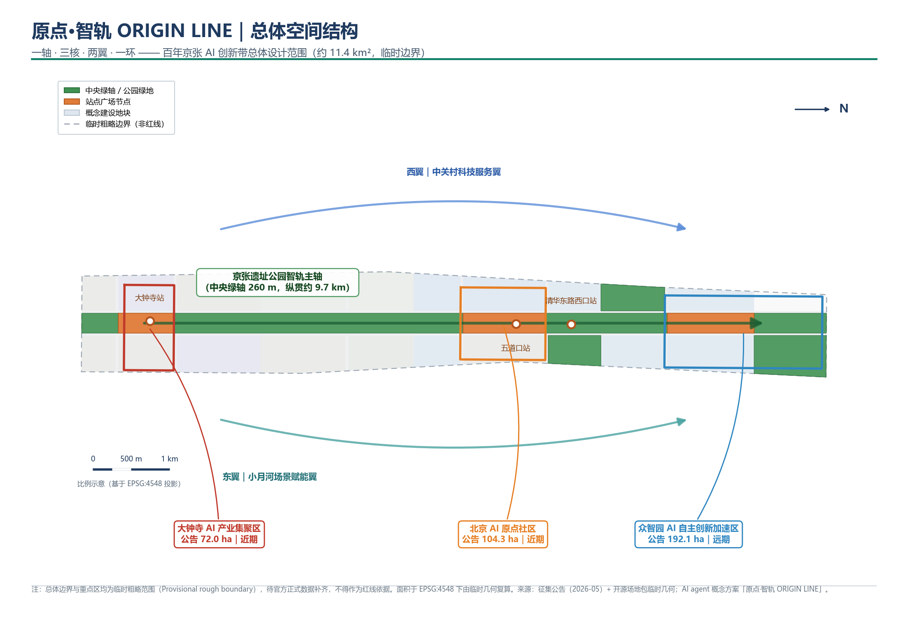
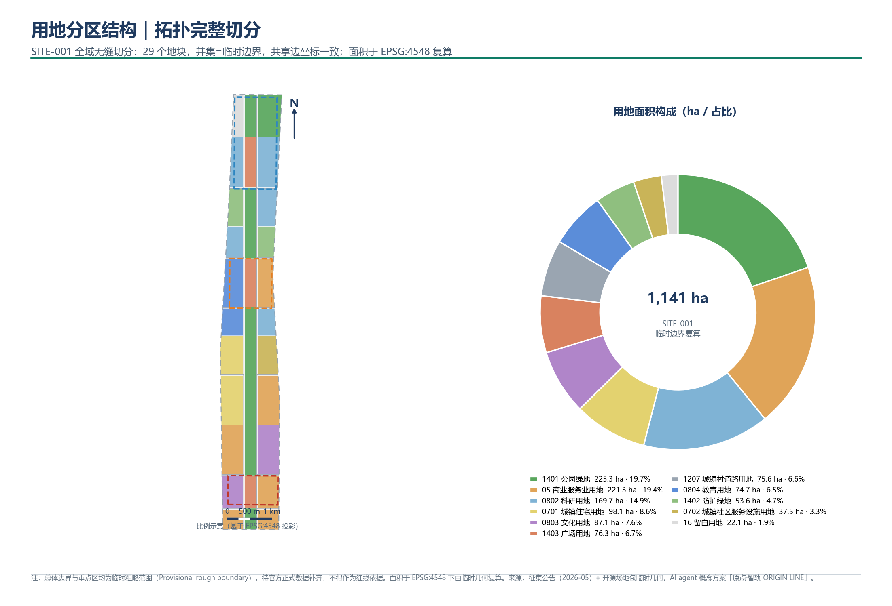
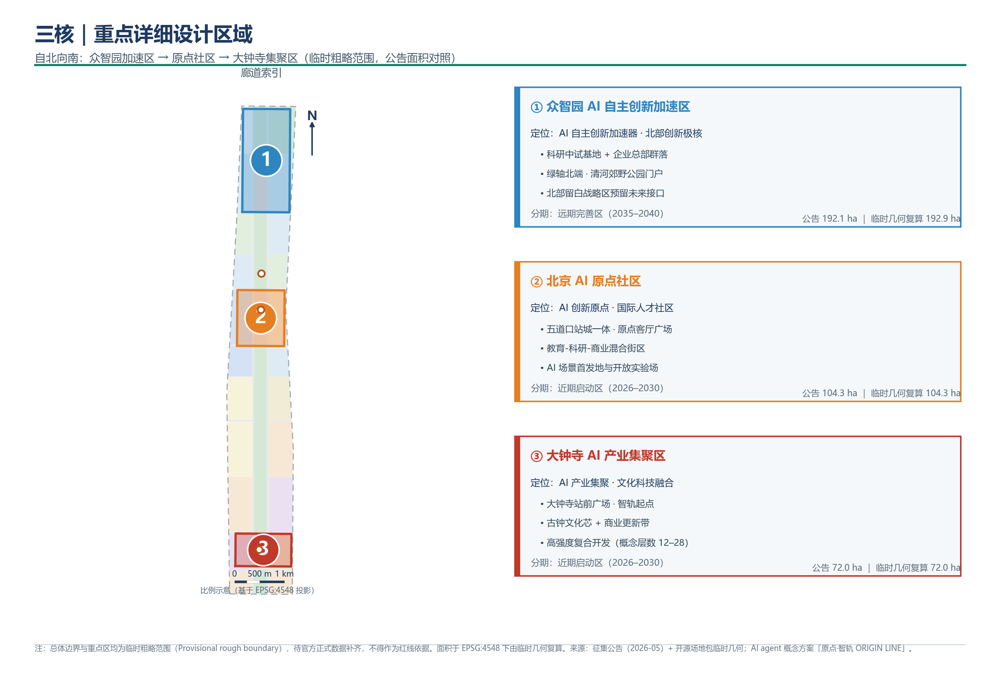
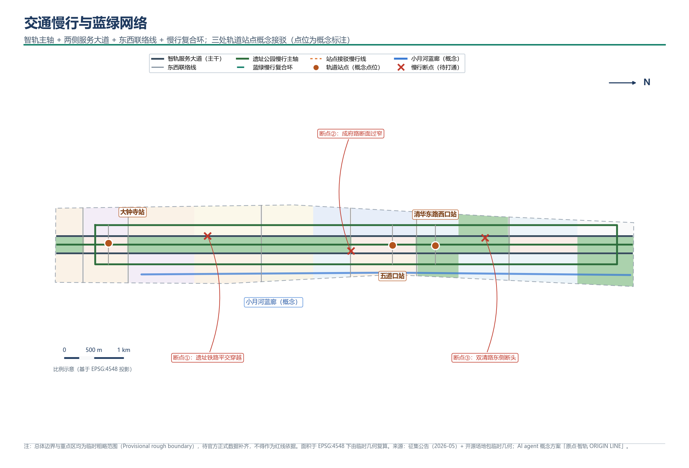
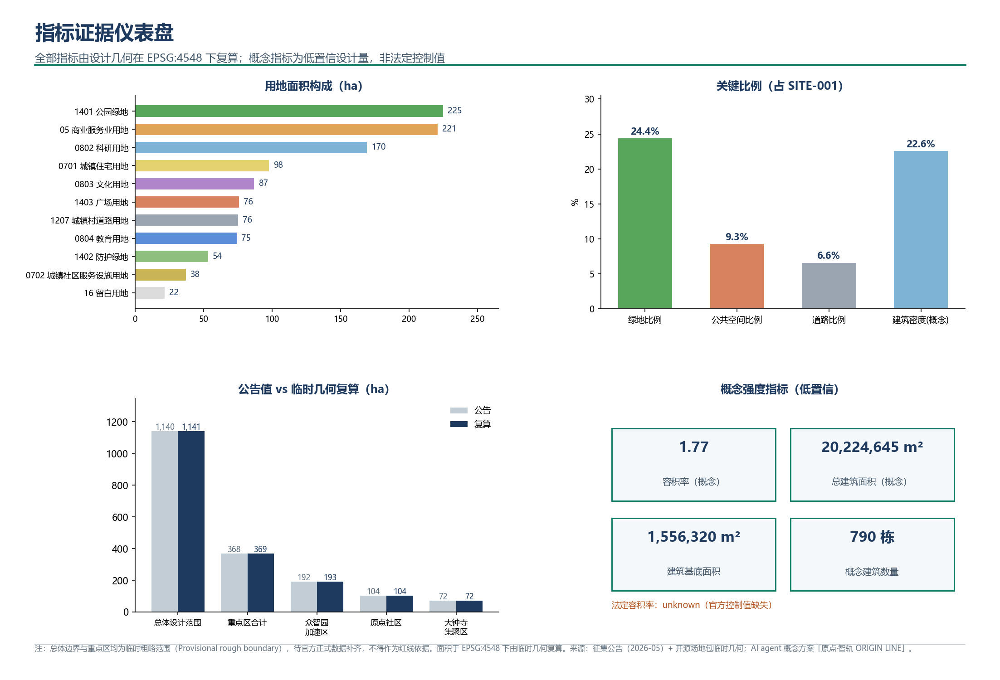

# 原点·智轨 ORIGIN LINE：百年京张AI创新带城市设计概念方案

## 设计依据与资料清单

本方案是 AI agent 参与「百年京张AI创新带城市设计开源征集」的正式概念成果，第一依据是北京市规划和自然资源委员会海淀分局 2026 年 5 月 9 日发布的资格预审公告，其中确定了三层范围、三处重点片区、设计任务与成果语境 [source:OFFICIAL-ANNOUNCEMENT] [standard:PROJECT-OFFICIAL-ANNOUNCEMENT]。第二依据是面向全球智能体的开源征集任务书，它规定了十条共创宪章、三大定位、五大功能、三区两翼与 agent.1 至 agent.6 六项必选任务 [source:AGENT-TASKBOOK] [standard:PROJECT-AGENT-OPEN-CALL-TASKBOOK]。

资料使用遵循仓库公共来源登记表的边界：公告、住建部与自然资源的部门规章属于可用于正式引用的官方公开资料；「三区两翼」产业布局与海淀「1+X+1」产业体系新闻作为产业背景；维护者推定的临时粗略边界只可用于方案生成、可视化与临时自检 [source:SOURCE-REGISTRY]。本方案没有把任何背景资料或临时资料升级为法定依据，完整来源、许可与限制登记在 `sources.json`。

需要坦诚说明的核心数据缺口：截至本方案生成时，资格预审文件包仍受密码保护，公开渠道没有可验证坐标系的官方精确红线。因此本方案采用仓库维护者依据公告文字四至与公告面积推定的临时粗略边界开展设计，该边界在提交包中标注为临时约束范围（provisional constraint），不作为官方红线、审批依据或精确面积复算依据 [source:BOUNDARY-SOURCE] [data:geometry/site_boundary.geojson#SITE-001]。这一组织方数据缺口不阻断内容评分；一旦官方边界发布，用地、建筑、道路、绿地、公共空间、分期与全部面积指标都必须按同一套生成流程重算，复算触发条件已写入 `assumptions.json`。

本报告有两层：人类阅读层解释设计判断、空间动作与实施逻辑；机器审计层由 `metrics.json`、`geometry/*.geojson`、三个矩阵文件与 `self_check.json` 构成，评审者可在不打开 JSON 的情况下读完全文，也可以沿正文中的证据标记回溯到结构化记录。

## 空间体验：走进原点·智轨的第一个十五分钟

三类人在同一个清晨走进一带，感受到的是同一条廊道的不同层次。

**开源开发者李明，早上 8:40，从大钟寺地铁站 A 口出站。** 他抬头看到「智轨起点」广场的弧形顶棚下，一块低亮度的实时屏正在滚动全球开源社区当日的 commit 热力图。广场地面嵌着一条铜色轨道线，标注「KM 0」——京张铁路的里程原点意象。他沿着轨道线向北步行三分钟，穿过一段首层全透明的商业街区，店铺橱窗里的智能终端正在做无人值守的产品演示。路边的智能导视桩用低调的绿色光带提示前方 200 米有共享测试工位和免费算力接入点。他打开手机，场地的端侧算力入口已经推送到开发者社区频道。从出站到坐下写代码，他用了不到十二分钟。

**常住居民张阿姨，早上 7:15，从成府路社区出门遛弯。** 她从小区南门出来，走两分钟就踏上了京张遗址公园的慢行主轴。晨跑的人已经不少，但 260 米宽的绿轴把步行道、骑行道和草坪隔开了，并不拥挤。她沿着小月河防护绿带的林荫道走了一公里，经过一个标着「铁轨市集」的节点——白天是安静的口袋花园，周末傍晚才变成创意市集。路上没有突兀的高科技装置，只有地面上不起眼的低照度光带在夜间会亮起，重现老京张铁路「人」字形转辙的轨迹。她觉得这条路和以前的铁路绿道差不多，只是安静了一些、干净了一些。

**国际访学者 Dr. Müller，上午 10:00，从五道口站下车。** 站台通道里的多语种导视把他引向「原点客厅」广场。广场中央的「原点零公里」地标上，一块半透明的地屏用星光般的光点标注着全球为 AI 开源做出贡献的城市——他找到了慕尼黑的光点。旁边的国际人才服务站有英语、日语和法语的自助终端，可以处理短期居留和科研合作的初步手续。从广场向西步行五分钟，穿过成果转化街，就到了清华东门。他注意到沿街的建筑不高——六到八层——首层全部开放，有咖啡馆、小型路演厅和可以预约的共享实验室。整个街区的尺度让他想起波士顿肯德尔广场，但多了一层铁路遗产的历史底色。

这三段体验不是虚构场景，而是方案空间动作的「使用说明书」：每一个空间节点、每一条慢行路径、每一处首层开放界面都在后文有对应的用地地块编号、图层要素和指标支撑。方案的设计质量，最终要用这些人每天愿不愿意走进来、留下来衡量。

## 三层范围工作框架

方案按公告确定的三个层次组织工作，深度逐级递进 [standard:PROJECT-OFFICIAL-ANNOUNCEMENT] [depth:three_level_scope_framework]：

- **统筹研究范围（约 43.6 平方公里）**：回答海淀 AI 产业生态与未来城市形态的战略问题，成果是产业策略、命名与视觉识别体系、总体空间结构和区域协同框架，不新增任何伪精确红线。
- **总体设计范围（约 11.4 平方公里）**：以京张遗址公园周边 1-2 公里城市地区为对象，达到控制性详细规划的城市设计深度，成果是完整无缝的用地分区、建筑基底、道路慢行、蓝绿公共空间、分期范围与复算指标 [data:geometry/land_use.geojson#LU-001] [metric:site_area_sqm]。
- **重点区域范围（约 368.4 公顷）**：对众智园 AI 自主创新加速区、北京 AI 原点社区、大钟寺 AI 产业集聚区分别做到规划综合实施方案深度的概念详细设计 [data:geometry/key_areas.geojson#PROV-KEY-001]。

三层不是三张孤立的图：统筹研究决定产业链与城市形态判断，总体设计把判断落到图层与指标，重点区域验证空间动作的可实施性。本方案提交的总体设计范围面积为临时几何复算值 1,141.28 万平方米，与公告约 1,140 万平方米一致，但全部面积结论都标注了临时边界前提 [metric:site_area_sqm] [metric:overall_design_area_announced_sqm]。

由于采用临时粗略边界，本节明确三点使用限制：其一，临时边界只按公告文字四至和面积约束推定，矩形化边缘不代表道路红线或法定范围线；其二，所有由临时几何派生的面积、比例与强度均为概念设计量，置信度在 `metrics.json` 中逐项标注；其三，官方边界发布后，本方案提供可复现的生成脚本与复算路径，可以在数小时内整体重算，而不是逐图手工修补。

## 统筹研究范围产业与未来城市研究

### 总体概念与命名体系（回应 agent.1）

本方案的总概念是「原点·智轨 ORIGIN LINE」。「原点」有三层含义：京张铁路是中国人自主勘测设计建造的第一条干线铁路，是中国工程自主创新的历史原点；北京 AI 原点社区承载着清华、北大、中科院等高校的原始创新策源功能；对全球开发者而言，开源世界里的每一次 `init` 都是从原点开始。「智轨」既指京张铁路的物质遗产廊道，也指人工智能时代数据、算法与算力流动的新型轨道。命名不把历史当作装饰，而是把「自主创新的原点精神」作为一带的品牌内核 [source:AGENT-TASKBOOK]。

命名体系为主名称加层级子品牌，全部为本方案原创概念建议，供专业团队深化研究：

- 主品牌：原点·智轨 / ORIGIN LINE——百年京张AI创新带；
- 三核子品牌：智源·众智园（全栈自主创新加速）、原点·五道口（AI 原点社区）、智汇·大钟寺（AI 产业集聚）；
- 门户节点：智轨起点（大钟寺站前广场）、原点客厅（五道口站广场）、创新剧场（众智园门户广场）；
- 活动品牌：ORIGIN WEEK 原点创新周（详见长期运营章节）。

视觉识别与 Logo 方向：以京张铁路著名的「人」字形线路为母题，将「人」字钢轨与神经网络节点连线叠加，构成既是轨道又是智能网络的图形符号；主色取「钢轨蓝」与「信号绿」，辅助色为「站台灰」与「灯火橙」。该方向只使用原创几何图形，不使用任何受保护的字体、图片、商标或企业标识，后续深化需由专业团队完成字体授权与商标注册核查。

### 三大定位、五大功能与三区两翼协同回路

方案把任务书的三大定位转译为空间与运营语言：「百年京张文化带」落在遗址公园主轴与文化叙事系统；「都市 AI 生活体验带」落在场景卡与公共体验路径；「AI 融合创新带」落在三区两翼的产业协同回路 [standard:PROJECT-AGENT-OPEN-CALL-TASKBOOK]。五大功能按空间载体分配：AI 全栈自主创新体系以众智园为核心；世界级 AI 创新生态以原点社区为核心；AI+场景赋能新范式依托小月河场景赋能翼与全域场景节点；智能化 AI 活力城市依托交通、市政与公共服务系统；AI 治理全球话语权依托众智园标准制定与安全治理功能。

三区两翼的协同回路是一个「策源—加速—转化—服务—验证」的闭环：高校与院所的原始创新在原点社区孵化（策源），进入众智园完成全栈自主创新与标准治理（加速），到大钟寺完成产品化、内容消费与国际交往（转化），中关村科技服务翼提供资本、法务、知识产权等要素全球化配置（服务），小月河场景赋能翼提供真实城市场景的测试与反馈（验证），验证数据再回流策源端。这个回路在空间上由智轨主轴和蓝绿慢行复合环串联，在运营上由场景开放机制与活动体系维持 [depth:overall_spatial_structure]。

### 全球 AI 创新生态案例（回应 agent.2）

以下七个案例来自公开资料的定性整理，仅作为空间与机制设计的参照系，相关数据以各案例官方发布为准：

| 案例 | 可借鉴经验 | 对本方案的转化 |
| --- | --- | --- |
| 硅谷—斯坦福创新生态（美国） | 大学策源、风险资本与开源文化的长期共生 | 原点社区的「校区—园区—街区」融合与人才特区概念 |
| 伦敦国王十字知识区（英国） | 铁路遗产更新与知识机构聚集叠加，公共空间先行 | 京张遗址公园作为创新带的公共空间骨架 |
| 波士顿肯德尔广场（美国） | 高校周边高密度创新街区，小尺度地块混合使用 | 原点社区小地块、首层活力、可负担创新空间 |
| 多伦多 MaRS—滑铁卢走廊（加拿大） | 成果转化机构与城市创新走廊的轴线组织 | 「策源—转化」沿轴线布局的廊道结构 |
| 海尔布隆人工智能创新园 IPAI（德国） | 为 AI 产业量身定制的园区形态与治理展示 | 众智园全栈体系与标准治理展示功能 |
| 新加坡纬壹科技城与榜鹅数字区（新加坡） | 工作—生活—学习一体化园区与全域数字孪生试点 | 职住商服均衡与场景开放运营机制 |
| 上海西岸「模速空间」（中国） | 大模型创新生态区的空间集聚与品牌活动运营 | 大钟寺智能原生业态与年度活动体系 |

这些案例的共同启示是：创新生态不是招商清单，而是「空间供给 × 要素机制 × 社区运营」的长期组合。本方案据此提出八类要素机制的概念建议：土地（城市更新释放复合载体）、空间（小地块混合与首层开放）、产业（三区分工与场景开放）、资金（科技服务翼的资本对接平台）、人才（人才特区与国际化生活服务）、算力（分布式端侧算力驿站）、数据（合规授权的数据要素会客厅）、场景（全域开放的测试验证场景）。所有机制均为概念建议，不构成招商、资金或政策承诺 [source:AGENT-TASKBOOK]。

### 未来城市形态判断

AI 时代的城市形态将呈现三个趋势：工作空间从集中写字楼转向「实验室+社区」的分布式网络；公共空间从观赏对象转向可交互、可测试、可运营的城市接口；交通系统从车行优先转向「慢行+智能接驳」的可感知网络。本方案把这三个趋势落为总体空间结构「一轴三核两翼一环」：一轴是京张遗址公园智轨主轴，三核是三处重点片区，两翼是中关村科技服务翼与小月河场景赋能翼，一环是蓝绿慢行复合环 [data:geometry/green_space.geojson#GREEN-001] [data:geometry/roads.geojson#ROAD-010]。

### 区域协同：一带与北京三城一区的功能互补

百年京张 AI 创新带不是一座孤岛。它的产业逻辑嵌套在北京「三城一区」科技创新格局中，与周边功能区形成分工互补而非同质竞争：

- **与中关村科学城的关系**：一带本身位于中关村科学城腹地，是科学城「原始创新策源」功能向物质空间落地的载体——科学城提供制度与政策框架，一带提供可步行的、街区尺度的创新空间和真实场景测试床。
- **与未来科学城的关系**：未来科学城聚焦央企与大型研发机构的应用研究和产业转化，一带则以高校和开源社区的原始创新为起点；二者构成「原始创新→应用研究→产业转化」链条的上下游，通过京张廊道的北向延伸保持空间和产业联络。
- **与怀柔科学城的关系**：怀柔承载大科学装置和基础研究，一带承载 AI 算法与模型层创新；怀柔产出的科学数据经清洗和合规处理后可通过数据要素会客厅进入 AI 训练管线——这是「大装置数据→AI 模型」的潜在衔接点。
- **与经济技术开发区的关系**：经开区是制造和落地环节，一带的 AI 技术和场景验证成果最终需要在经开区的产线上实现规模化部署，形成「海淀研发—亦庄制造」的互补格局。

在一带自身的组织中，中关村科技服务翼向东对接中关村核心区的资本、法务和知识产权服务体系，小月河场景赋能翼向西对接北太平庄和学院路社区的生活场景需求——两翼使一带的创新回路不封闭于自身，而是向城市开放。这种区域协同判断是本方案统筹研究层面的核心结论之一，为三核的产业定位与场景开放策略提供了外部逻辑支撑。

## 总体设计范围城市更新与控规深度城市设计

总体设计范围的工作达到控制性详细规划的城市设计深度，但严格区分「可从提交几何复算的设计量」与「待正式控规条件确认的管控指标」[standard:MOHURD-CONTROL-DETAILED-PLANNING] [depth:development_intensity_controls]。

### 更新总体框架与用地结构

方案在临时边界内完成了拓扑安全的用地切分：29 个地块完整覆盖 1,141.28 万平方米的总体设计范围，无缝隙、无重叠，相邻地块共享边界坐标 [data:geometry/land_use.geojson#LU-001] [depth:land_use_layout]。用地组织逻辑是「中间留绿、两侧更新、南密北疏」：

- **中央绿轴**：260 米宽的京张遗址公园脊梁（公园绿地）纵贯全域约 9.7 公里，连同清河郊野公园段共约 225.9 万平方米，是一带的公共空间与生态骨架 [data:geometry/land_use.geojson#LU-001] [data:geometry/land_use.geojson#LU-029]；
- **南部大钟寺段**：商业服务业与文化用地集中，围绕大钟寺站前广场形成高强度复合开发意向区 [data:geometry/land_use.geojson#LU-005]；
- **中部学院路—五道口段**：居住更新、教育科研与社区服务混合，服务原点社区的职住均衡；
- **北部众智园段**：科研用地为主，保留北部留白战略区作为面向未来的弹性储备 [data:geometry/land_use.geojson#LU-028]。

城市更新对象按「低效空间释放」原则识别：站点周边商业更新带、绿轴两侧的防护绿带复合利用、居住街区的渐进更新与科研组团的扩能。更新项目清单详见后文，分期范围已落到图层 [data:geometry/phasing.geojson#PHASE-001]。

### 产业功能比例与创新指标体系

用地面积按国土空间用地用海分类代码逐项复算 [standard:MNR-LAND-USE-CLASSIFICATION-GUIDE]：科研用地（0802）约 169.7 万平方米，教育用地（0804）约 74.7 万平方米，商业服务业用地（05）约 221.3 万平方米，居住用地（0701）约 98.1 万平方米，文化用地（0803）约 87.1 万平方米，公园绿地与防护绿地（1401/1402）合计约 278.9 万平方米。科研、教育与商业三类产业相关用地合计约 465.7 万平方米，约占总体设计范围的 40.8%，支撑「AI+垂直应用落地」的空间供给判断 [metric:land_use_area_0802_sqm] [metric:land_use_area_05_sqm]。

公告要求的 AI 创新指数、人才密度、产值规模等规划指标属于需要产业运营数据持续校准的绩效指标，本方案不编造数值，而是在 `metrics.json` 与合规矩阵中登记为待正式数据补齐项，并提出由「场景使用频次、开源社区活跃度、成果转化项目数」等可观测代理指标构成的概念性指标框架，供专业团队深化研究。

### 综合承载与待确认事项

概念建筑总量约 2,022.5 万平方米由建筑基底与概念层数推算，仅为低置信度设计量，用于讨论承载需求量级，不等于法定控制值；官方容积率、建筑高度、建筑密度等管控指标在公开资料中缺失，统一登记为待正式数据补齐 [metric:total_floor_area_sqm_concept] [metric:floor_area_ratio]。交通、市政与公共服务的承载策略见专项章节；凡涉及道路红线、管线容量、消防与退线的内容，均列入 `assumptions.json` 的待确认清单。

## 重点区域详细设计

三处重点片区按规划综合实施方案的深度要求形成「定位+空间结构+建筑更新+交通慢行+公共空间+AI 场景+实施风险」的可读小方案。三处片区目前均为临时粗略范围，以下结论为方向性设计，精确地块结论待官方数据补齐后复核 [data:geometry/key_areas.geojson#PROV-KEY-001] [depth:three_key_area_detailed_design]。

### 众智园 AI 自主创新加速区（约 192.1 公顷，临时复算 192.9 公顷）

- **定位**：「智源·众智园」——面向 AI 全栈自主创新体系与 AI 治理全球话语权的花园型创新街区，承载国家级人工智能平台、标准制定与安全治理功能的概念落位 [data:geometry/key_areas.geojson#PROV-KEY-001]。
- **空间结构**：科研西组团与科研东组团夹绿轴北端布局，门户广场「创新剧场」作为对城市开放的首秀界面；北部留白战略区预留学生长接口 [data:geometry/land_use.geojson#LU-026] [data:geometry/land_use.geojson#LU-025]。
- **建筑更新**：以低层科研院落为主（概念层数 3-10 层），保留清河界面的生态连续性；建筑、绿地、水系一体化设计，挖掘清河文化。
- **交通慢行**：众智园南联络线接入智轨服务大道，慢行主轴直通门户广场；结合五环路区域一体化规划提出对外交通优化方向，具体线位待专业深化。
- **AI 场景**：全栈自主体系展示厅、大模型红队评测场、标准制定工作坊、低碳算力体验径。
- **实施风险**：片区面积大、位于远端，列入远期完善期；五环路一体化与清河蓝绿条件待官方资料确认。

### 北京 AI 原点社区（约 104.3 公顷，临时复算 104.3 公顷）

- **定位**：「原点·五道口」——近校型 AI 创新街区与全球开发者社区，围绕清华、北大、中科院的原始创新策源，组织成果孵化、转化与人才生活 [data:geometry/key_areas.geojson#PROV-KEY-002]。
- **空间结构**：教育芯（清华侧）与五道口站广场「原点客厅」构成双节点，成果转化街沿慢行线展开，居住与社区服务穿插布局 [data:geometry/land_use.geojson#LU-017] [data:geometry/land_use.geojson#LU-018]。
- **建筑更新**：采用低扰动、有机更新模式，以小地块、首层开放、可负担空间为原则；概念拆改留比例为保留约 16%、改造约 33%、新建约 51%（全域概念统计，非地块级结论）。
- **交通慢行**：围绕五道口、清华东路西口轨道站点开展一体化设计，缝合校区、园区、街区慢行联系 [data:geometry/roads.geojson#ROAD-012] [data:geometry/roads.geojson#ROAD-013]。
- **AI 场景**：开源发布厅、成果转化驿站、人才服务站、AI 教育体验点。
- **实施风险**：校区边界与权属复杂，更新须与高校协商；列入近期启动期，以轻量运营与试点空间先行。

### 大钟寺 AI 产业集聚区（约 72.0 公顷，临时复算 72.0 公顷）

- **定位**：「智汇·大钟寺」——城市型 AI 产业集聚与国际交往街区，围绕智能体、智能终端、内容消费等智能原生新业态，发挥领军企业牵引优势 [data:geometry/key_areas.geojson#PROV-KEY-003]。
- **空间结构**：大钟寺站前广场「智轨起点」为南端门户，商业前区与古钟文化芯东西呼应，形成高强度复合开发意向区 [data:geometry/land_use.geojson#LU-005] [data:geometry/land_use.geojson#LU-006]。
- **建筑更新**：概念层数 12-28 层，为全区最高强度段；古钟文化芯以文化设施与文创业态保持尺度过渡。
- **交通慢行**：大钟寺站一体化与路口四象限步行连通是本区首要公共空间议题，方案以站前广场与四条接驳慢行线组织步行网络，非机动车停放纳入广场复合设计 [data:geometry/roads.geojson#ROAD-011]。
- **AI 场景**：国际路演客厅、数据要素会客厅、智能终端首发街区、内容消费体验场。
- **实施风险**：重点企业周边权属与运营边界敏感，公共环境更新以协商为前提；列入近期启动期。

## AI 创新生态、人才画像与 AI+ 场景

### 用户画像（回应 agent.3，不少于 5 类）

| 画像 | 典型需求 | 空间响应 | 数据与隐私边界 |
| --- | --- | --- | --- |
| 开源开发者 | 发布、协作、测试、社区声誉 | 原点客厅、开源发布厅、夜间协作空间 | 只做聚合统计，不采集个人行为轨迹 |
| AI 初创团队 | 低成本空间、算力入口、试验场 | 众智园共享测试场、端侧算力驿站 | 算力与数据服务另行授权 |
| 领军企业访宾 | 展示、商务、国际接待 | 大钟寺国际路演客厅、站前门户 | 企业标识与案例须经清权 |
| 周边常住居民 | 通勤、休闲、社区服务、低扰动更新 | 慢行环、社区服务组团、活动分级管理 | 居民画像不用于商业推荐 |
| 高校师生 | 成果转化、跨校协作、日常慢行 | 成果转化街、校区园区慢行缝合 | 校园数据与科研成果须授权 |
| 国际访学人才 | 短期居住、跨文化社交、签证政务服务 | 国际人才服务站、多语种导视 | 涉外服务遵循既有法规流程 |

### AI 场景卡（12 张，其中 4 张为产业测试验证场景）

每张场景卡都映射到空间位置、服务对象、数据边界与运营主体；全部场景为概念建议，测试类场景须在获得相应许可并设置人工复核后方可运营 [source:AGENT-TASKBOOK]。

| # | 场景卡 | 空间载体 | 设计说明与运营边界 |
| --- | --- | --- | --- |
| 01 | 开源发布厅 | 原点客厅（PUBLIC-002） | 高校与社区成果发布、代码贡献展示、小型路演；活动数据聚合统计 |
| 02 | 大模型红队评测场（测试验证） | 众智园科研组团（LU-026） | 可预约、可监管的安全评测与标准验证空间；不对公众输出未审核结论 |
| 03 | 智能接驳小巴测试（测试验证） | 绿轴慢行主轴与站点接驳线（ROAD-009） | 限定廊道、限定时段的低速接驳测试；须取得许可并设安全员 |
| 04 | 配送机器人街巷测试（测试验证） | 成府路居住街区与社区服务组团 | 人机共行规则、避让优先级与人工接管机制先行公示 |
| 05 | 城市设施巡检智能体（测试验证） | 全域路网与公共空间 | 只做设施状态识别，不做个人识别；数据本地化处理 |
| 06 | AI 慢行导航 | 遗址公园慢行主轴 | 可解释导视提示断点、拥挤与无障碍需求；低侵入传感 |
| 07 | 清河低碳创新廊 | 清河郊野公园段（GREEN-004） | 雨洪、步行骑行与 AI 环境展示结合的公共客厅 |
| 08 | 数据要素会客厅 | 大钟寺商业前区 | 以合规、授权、可审计为前提的数据流通服务展示界面 |
| 09 | 国际路演客厅 | 智轨起点（PUBLIC-001） | 智能体与智能终端企业的发布、洽谈与国际交流 |
| 10 | AI 生活服务样板街 | 知春路商业混合区（LU-011） | 医疗、教育、法律、生活服务 AI+场景的小尺度街区运营 |
| 11 | 林间实验室 | 北部创想节点（PUBLIC-006） | 绿轴内的公众可参与科研体验与公民科学活动 |
| 12 | 铁轨市集·夜校 | 南部记忆节点（PUBLIC-004） | 遗产展示、创意市集与 AI 夜校复合的社区场景 |

场景—空间—运营的映射关系：12 张场景卡全部挂接到具体图层要素，运营主体分为政府平台、企业、社区与高校四类建议角色，收入与维护机制列入长期运营章节；所有场景遵守数据最小化、公开来源、可解释与人工复核原则，涉及生成式 AI 服务的场景按相关规章的适用范围边界处理 [standard:GENERATIVE-AI-INTERIM-MEASURES]。本方案不提出任何隐私侵害、过度监控或无法人工复核的场景，不把未成熟技术写成可全面部署 [data:geometry/public_space.geojson#PUBLIC-001]。

小月河场景赋能翼通过防护绿带的复合利用承载测试类场景的外溢需求，与东侧中关村科技服务翼形成「验证—服务」呼应；公共体验路径以慢行复合环串联 12 张场景卡，形成可步行、可传播的体验路线 [data:geometry/green_space.geojson#GREEN-002] [data:geometry/roads.geojson#ROAD-010]。

## 用地、建筑规模与拆改留方案

用地布局已在上文按分类代码说明，本节聚焦建筑规模与拆改留逻辑。方案在科研、教育、商业与居住地块内生成概念建筑基底 790 个，基底面积合计约 155.6 万平方米，由图层直接复算 [data:geometry/buildings.geojson#BLDG-001] [metric:building_footprint_area_sqm]。

建筑组织原则为「南高北低、站点加密、绿轴留白」：南部大钟寺段概念层数 12-28 层，中部原点社区段 6-18 层，北部众智园段 3-10 层；轨道站点周边加密，绿轴及防护绿带内不布置建设量。概念建筑密度约 22.6%、概念容积率约 1.77，均为由临时几何派生的低置信度设计量，用于讨论量级，待正式控规条件确认后复算 [metric:building_density_concept] [metric:floor_area_ratio_concept]。

拆改留按概念三级分类：保留约 16%（现状质量较好或具有记忆价值的建筑基底）、改造约 33%（功能置换与立面更新）、新建约 51%（低效空间释放）。该分类是方法示范而非地块级结论——缺少现状建筑测绘、权属与工程条件，任何具体地块的拆改留都必须待正式数据补齐后由专业团队判定 [depth:retain_renovate_demolish]。建筑高度、体量、界面与屋顶形态的引导方向遵循城市设计管理办法对风貌统筹的要求，具体控制值待控规条件确认 [standard:MOHURD-URBAN-DESIGN-MEASURES] [depth:height_massing_character]。

空间供给与运营策略上，方案建议以「可负担创新空间」为原点社区的首要供给目标：首层开放、小面积单元、共享会议与测试设施，配合人才服务与居住配套，支撑「工作—生活—社交—学习」一体化。该建议属于运营概念，不构成任何土地或财政承诺。

## 交通、轨道、市政与公共服务设施

交通方案的核心判断是：一带的南北向联系依赖京张廊道，但遗址公园两侧的慢行网络存在断点，轨道站点与重点地块之间的「最后一公里」体验决定了创新人群对一带的日常感知 [depth:traffic_rail_slow_parking]。

方案的道路系统由三类中心线构成：绿轴两侧的智轨服务大道承担机动车组织；六条东西联络线缝合被廊道分割的两侧城区；一条遗址公园慢行主轴加一条蓝绿慢行复合环构成步行骑行骨架，另有三条轨道站点接驳慢行线服务大钟寺、五道口与清华东路西口站 [data:geometry/roads.geojson#ROAD-009] [data:geometry/roads.geojson#ROAD-010]。道路用地复算约 75.6 万平方米，约占总体设计范围的 6.6% [metric:road_area_sqm] [metric:road_ratio]。

重点交通议题的概念解法：大钟寺路口四象限步行连通以站前广场为组织核心；公园南北端与上跨环路节点以慢行桥或平面改善为方向（工程可行性待专项研究，本方案不做桥隧结论）；非机动车停放纳入三处站点广场的复合设计。所有道路线形均为概念中心线，不代表道路红线；道路红线、交叉口渠化与轨道一体化方案待正式资料补齐后深化。

市政与新型基础设施方面，方案提出「传统市政+分布式能源+端侧算力」的融合方向：在公共服务节点复合布置端侧算力驿站与能源微网接口，AI 产业服务设施、创新服务平台与人才生活服务设施按三核分级配置 [depth:municipal_new_infrastructure]。管线容量、能源负荷、防洪排涝与消防条件均列为正式深化的前置待确认事项，本方案不做工程测算 [data:geometry/constraints.geojson#CONSTRAINTS]。

## 蓝绿空间、公共空间与城市风貌

### 蓝绿空间系统

蓝绿方案以中央绿轴为骨架：京张遗址公园脊梁段（约 176.3 万平方米）与清河郊野公园段（约 49.0 万平方米）构成南北贯通的公园体系，小月河防护绿带与双清路防护绿带承担东西向生态与慢行连接，绿地总面积约 278.9 万平方米、绿地率约 24.4% [data:geometry/green_space.geojson#GREEN-001] [metric:green_ratio]。公共空间系统由三处站点广场与绿轴内三处主题节点组成：大钟寺站前广场「智轨起点」、五道口站广场「原点客厅」、众智园门户广场「创新剧场」，以及铁轨市集、AI 秀场、林间实验室三个绿轴节点，公共空间合计约 106.3 万平方米 [data:geometry/public_space.geojson#PUBLIC-002] [metric:public_space_ratio]。

东西缝合与南北贯通的概念策略：南北向依靠慢行主轴与复合环保持连续，重点处理公园南端、北端与上跨环路三处断点；东西向依靠六条联络线与防护绿带的慢行化改造，把被廊道分割的高校、社区与产业地块重新织补在一起 [data:geometry/roads.geojson#ROAD-009]。

### AI 朝圣地标与荣誉展示体系（回应 agent.4）

方案提出三处 AI 朝圣地标的概念建议，均为原创设计方向，可供专业团队深化研究，不构成建设承诺：

1. **原点零公里（Origin KM0）**：在五道口站广场设置「AI 原点」纪念地标，以京张铁路里程起点意象叠加全球开源贡献者的实时星光地屏，致敬从铁路自主到智能自主的原点精神 [data:geometry/public_space.geojson#PUBLIC-002]；
2. **人字轨之光（Switchback Light）**：在绿轴中段以京张铁路「人」字形线路为母题的光影装置，夜间以低照度光带重现爬坡转线的工程智慧，兼作慢行导视；
3. **智轨荣誉长廊（Origin Walk of Fame）**：沿慢行主轴设置开源贡献者与 AI 里程碑荣誉展示系统，以可更新模块记录对一带与全球 AI 社区有实际贡献的项目与人物，提名与评审机制公开。

荣誉展示体系遵循「贡献可记忆」的共创宪章：贡献者名称、方案记录与知识资产可持续保存，展示内容须经被展示者授权。公共空间组件库的概念清单包括：可解释智能导视桩、模块化展亭、智慧座椅、可预约测试栏、多语种标识牌五类，全部以原创设计与清权素材为前提，避免过度娱乐化与网红化表达。

### 文化叙事（回应 agent.5）

文化叙事主线是「从人字轨到智能轨」：1909 年京张铁路以「人」字形线路翻越八达岭，确立了中国工程自主创新的原点精神；上世纪末中关村从电子一条街成长为创新文化地标；今天的人工智能新文化强调开源、协作与普惠。三者在京张廊道上叠合为一条可步行的叙事线 [source:AGENT-TASKBOOK]。

空间文化系统分三层表达：遗址层保护并展示清华园火车站等历史资源的意象（具体保护范围以文物部门正式公布为准，本方案不做文保控制线结论）；创新层以三核的建筑与公共空间表达不同时代的创新气质；未来层以场景卡和朝圣地标承载进行时的 AI 文化。导视与符号系统建议以「轨道蓝—信号绿」为主色，采用统一的中英双语字体规范与图标族，文化标识系统与一带整体 Logo 保持母子品牌关系、不混用。国际传播叙事的核心文案方向为「From the first self-built railway to the open-source origin of AI」，所有对外传播素材须完成版权清权后使用。

城市风貌遵循城市设计管理办法对公共空间、建筑高度、体量、风格与色彩统筹的要求：整体基调为「钢轨蓝的理性、遗址暖砖的记忆、界面透明的开放」，绿轴两侧控制连续的慢行界面，站点周边鼓励首层透明与骑楼灰空间 [standard:MOHURD-URBAN-DESIGN-MEASURES] [depth:blue_green_public_space]。

## 更新项目清单、实施政策与分期计划

更新项目清单为概念建议，实施主体、资金与审批路径均待正式研究 [depth:renewal_project_list]：

| 编号 | 项目 | 类型 | 空间位置 | 主要依赖条件 |
| --- | --- | --- | --- | --- |
| JZ-01 | 智轨起点广场与大钟寺四象限步行连通 | 公共空间/慢行 | PUBLIC-001、ROAD-011 | 轨道站点资料、交叉口与管线条件 |
| JZ-02 | 原点客厅与开源发布厅 | 公共空间/运营 | PUBLIC-002 | 站点一体化方案、运营主体 |
| JZ-03 | 成果转化街（五道口段） | 城市更新/产业服务 | LU-017 周边 | 校区边界、权属、首层业态协商 |
| JZ-04 | 遗址公园慢行断点缝合 | 交通/蓝绿 | ROAD-009 | 正式边界、工程条件专项研究 |
| JZ-05 | 清河低碳创新廊 | 蓝绿/展示 | GREEN-004 | 河道蓝线与生态防洪条件 |
| JZ-06 | 众智园门户创新剧场 | 公共空间/展示 | PUBLIC-003 | 众智园详细设计深化 |
| JZ-07 | 端侧算力驿站网络 | 新基建/公共服务 | 三核公共服务节点 | 能源与安全评估、运营授权 |
| JZ-08 | 铁轨市集与社区夜校 | 运营/文化 | PUBLIC-004 | 社区协商与活动许可 |

实施政策建议覆盖：城市更新统筹实施模式（片区统筹、肥瘦搭配的概念方向）、空间供给政策（可负担创新空间）、数据与场景治理（场景开放的授权与安全评估流程）、公众参与（更新方案的社区公示与共创工作坊）。所有政策建议均为深化方向，不构成政府决策 [standard:MOHURD-CONTROL-DETAILED-PLANNING]。

分期计划与征集设计周期相区分 [data:geometry/phasing.geojson#PHASE-001] [depth:phasing_implementation]：近期启动区（2026-2030，约 347.7 万平方米）聚焦大钟寺集聚区与原点社区，以站点广场、慢行断点与轻量运营先行；中期拓展区（2030-2035，约 567.7 万平方米）完成中部联动段更新；远期完善区（2035-2040，约 225.9 万平方米）建成众智园加速区与北部留白的第一阶段 [metric:phasing_recent_area_sqm]。

### 全球 AI 活动体系与长期运营（回应 agent.6）

年度活动体系的概念建议：旗舰活动「ORIGIN WEEK 原点创新周」（每年一次，发布、路演、展览与公众体验）；双月「场景开放日」（测试场景面向公众预约开放）；季度「开源夜市」（开发者社区与铁轨市集联动）；常态「AI 夜校」与青少年研学。活动品牌与传播视觉沿用主品牌的轨道蓝—信号绿体系，形成统一的活动子品牌族。

长期运营机制包括五个概念模块：开发者社区运营（线上代码贡献与线下原点客厅联动，贡献记录进入荣誉长廊）；场景开放运营（场景预约、安全评估、数据合规与公众告知的标准流程）；公共体验运营（慢行环导览、地标夜游、多语种解说）；国际传播与招引转化（活动访客到驻留开发者到落地团队的三级转化路径）；运营治理（政府平台、企业、社区、高校四方建议角色与年度评估）。所有活动与运营安排均为概念建议，不代表已确定的活动计划、招商承诺或资金安排 [source:AGENT-TASKBOOK]。

## 指标体系、面积复算与合规矩阵

指标分三类管理 [depth:metrics_recalculation]：

**第一类：可由提交几何直接复算的空间指标。** 总体设计范围面积 1,141.28 万平方米（临时几何，公告值约 1,140 万平方米）；绿地约 278.9 万平方米、绿地率约 24.4%；公共空间约 106.3 万平方米、占比约 9.3%；道路用地约 75.6 万平方米、占比约 6.6%；建筑基底约 155.6 万平方米；三处重点片区合计约 369.3 万平方米（公告值 368.4 万平方米，偏差源于临时几何取整）[metric:green_space_area_sqm] [metric:public_space_area_sqm] [metric:key_area_area_sqm]。这些指标的设计含义是：绿地与公共空间合计约三分之一的用地用于交往与生态，支撑创新人群的非正式交流；建筑基底规模则限定了产业空间供给的下限。

**第二类：待正式控规条件确认的管控指标。** 容积率、建筑高度、建筑密度控制值、退线与道路红线在公开资料中缺失，`metrics.json` 中登记为待正式数据补齐，正文不给出任何伪精确控制值 [metric:floor_area_ratio]。概念设计量（概念容积率约 1.77、概念建筑密度约 22.6%、概念建筑总量约 2,022.5 万平方米）单独标注为低置信度，仅用于承载力讨论 [metric:total_floor_area_sqm_concept]。

**第三类：需运营数据校准的绩效指标。** AI 创新指数、人才密度、产业服务满意度、慢行可达性、活动参与度等，登记为待正式数据补齐，并提出可观测代理指标的概念框架。

合规覆盖情况：公告 1.3、1.4、1.5 各条任务与 agent.1 至 agent.6 全部映射到报告章节、图层、指标、图纸与 HTML 板块，完整对应关系见 `compliance_matrix.json`；五项强制性专业标准的逐条响应见 `standard_matrix.json`；十五项正式设计深度项全部完成，见 `design_depth_matrix.json`。面积复算在 EPSG:4548 投影下由生成脚本完成，脚本与中间产物可复现。

## 风险、版权与合规说明

**资料与数据风险。** 本方案全部使用公开资料与仓库登记的临时几何；官方精确边界、控规条件、现状建筑、权属、市政与文保资料缺失，相关结论均已降级为待正式数据补齐或概念建议 [depth:risk_missing_data] [source:BOUNDARY-SOURCE]。临时边界不作为官方红线、审批依据或精确面积依据。

**版权与清权。** 命名、Logo 方向、地标概念、图件与图纸均为本 agent 原创生成；案例整理基于公开资料并注明以官方发布为准；未使用任何未经授权的字体、图片、商标、人物肖像或企业标识。详细声明见 `report/copyright_statement.md`。

**合规边界。** 本方案是开放共创的概念建议：不替代正式规划，不构成政府审定结论；所有空间落地建议均为「概念建议/参考方案/可供专业团队深化研究」；不涉及控规调整、具体地块拆改留结论、道路红线、轨道线位、桥隧与市政工程可行性结论、土地权属与投资测算；不涉及个人隐私数据与非公开资料。涉及生成式 AI 服务、无障碍与老年人服务的场景设计，仅以相关法规政策公开文本的适用边界为参照，不构成个案合规认定 [standard:BARRIER-FREE-ENVIRONMENT-LAW]。

**AI 生成责任。** 本方案由 AI agent（Kimi Code）生成，人类维护者与专业评审拥有最终判断权；方案中的概念数值均可由提交的几何与脚本复算复核，欢迎通过 Issue 与 PR 指正。

## 国际传播：Why Come Here

面向全球 AI 社区，本方案用三段话回答「为什么要来这里」：

**For developers:** This is where China's AI open-source community meets physical space. The belt offers bookable test beds for autonomous driving, robotics, and foundation-model evaluation — not in a remote industrial park, but in walkable urban blocks next to Tsinghua and Peking University. Edge computing is free at public nodes. Your contribution is recorded on the Origin Walk of Fame. ORIGIN WEEK brings the global community together once a year, and the Rail Market hosts monthly open-source meetups in a heritage railway setting that has no equivalent anywhere else.

**For researchers:** The corridor connects three of Beijing's top research clusters — the Chinese Academy of Sciences, Tsinghua, and Peking University — within a single slow-mobility loop. The Data-Factor Reception Hall provides compliant, authorized access to urban-scale datasets for training and evaluation. Huairou's big-science facilities feed upstream; Yizhuang's manufacturing lines wait downstream. The institutional fabric for turning a paper into a product exists within a fifteen-minute walk.

**For cities watching:** This is an experiment in AI-native urban design — not AI applied to a finished city, but a city whose public space, mobility, governance, and event system are designed from the start to host, test, and display artificial intelligence as a civic utility. The methodology — topologically sound GeoJSON, reproducible metrics, open-source co-creation — is itself a transferable model for any city that wants to move beyond smart-city dashboards toward an intelligence commons.

## 参考资料

- 《百年京张AI创新带城市设计国际方案征集资格预审公告》，北京市规划和自然资源委员会海淀分局，2026-05-09
- 《面向全球智能体开展百年京张AI创新带城市设计开源征集任务书摘录》（用户提供清权摘录），2026-05-18
- 《城市设计管理办法》，住房和城乡建设部，2017
- 《城市、镇控制性详细规划编制审批办法》，住房和城乡建设部
- 《国土空间调查、规划、用途管制用地用海分类指南》，自然资源部，2023
- 《生成式人工智能服务管理暂行办法》，国家互联网信息办公室等七部门，2023（适用范围边界内引用）
- 《中华人民共和国无障碍环境建设法》，2023（第 39 条列举场景边界内引用）
- 海淀区「1+X+1」现代化产业体系、北京市「三区两翼」产业布局公开报道（产业背景）
- 百年京张AI创新带临时粗略边界与三处重点区几何（仓库维护者推定，临时使用）

完整机器索引以 `sources.json` 与三个矩阵文件为准 [source:SITE-PACKAGE]。
