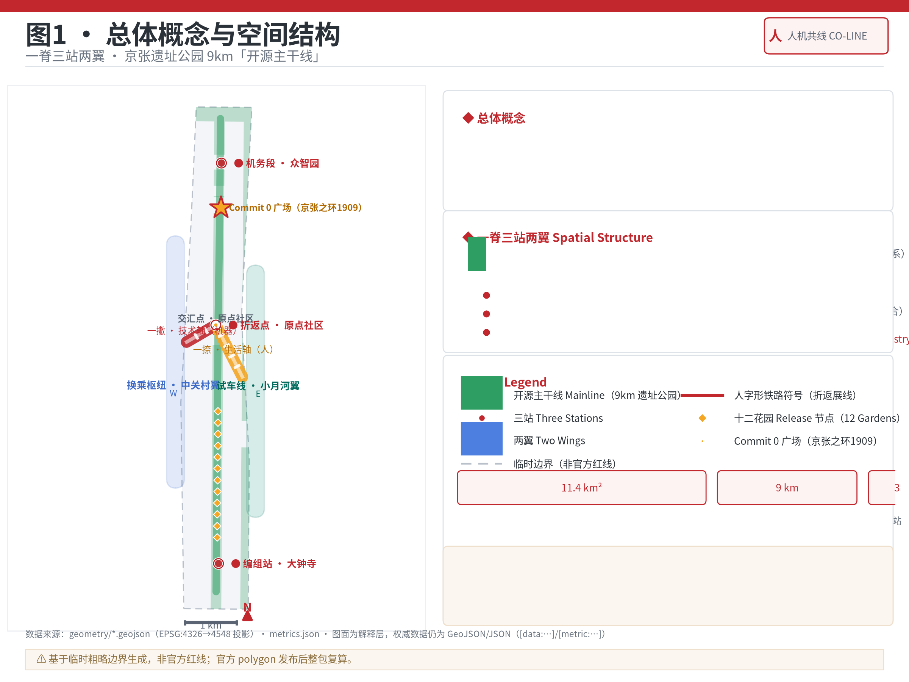
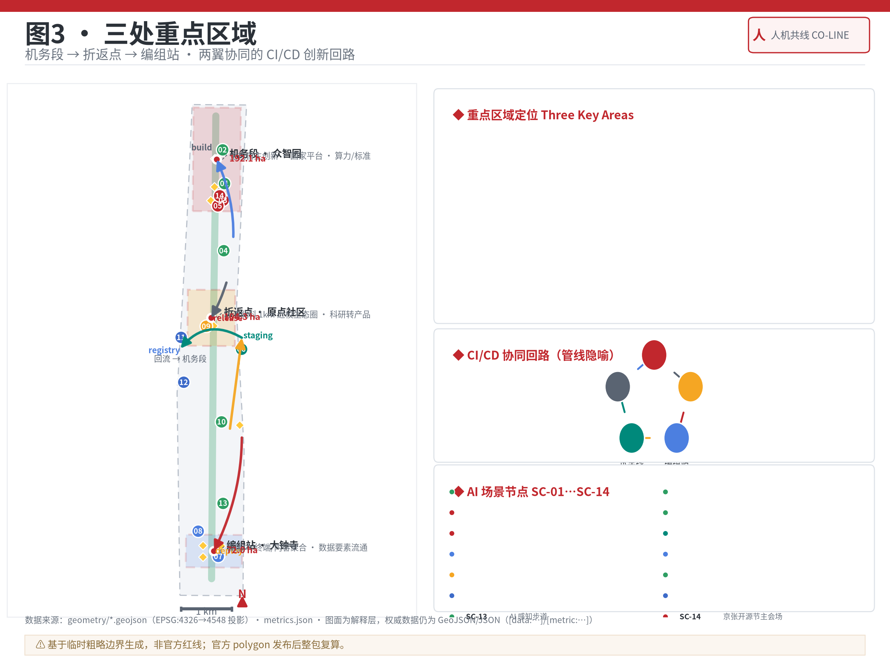
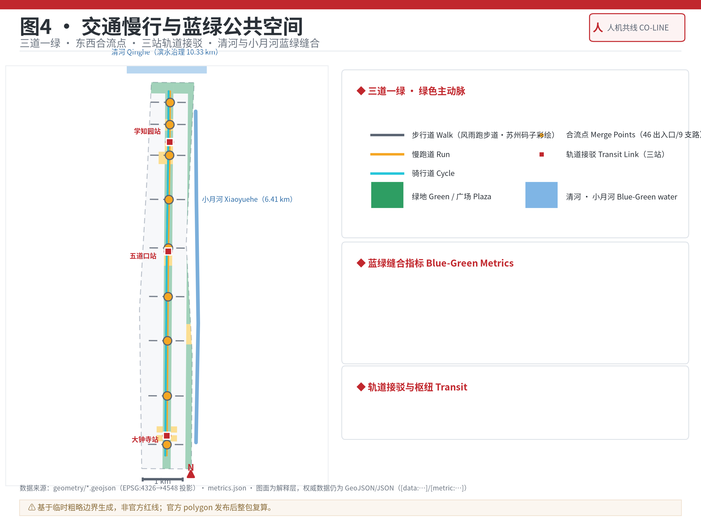
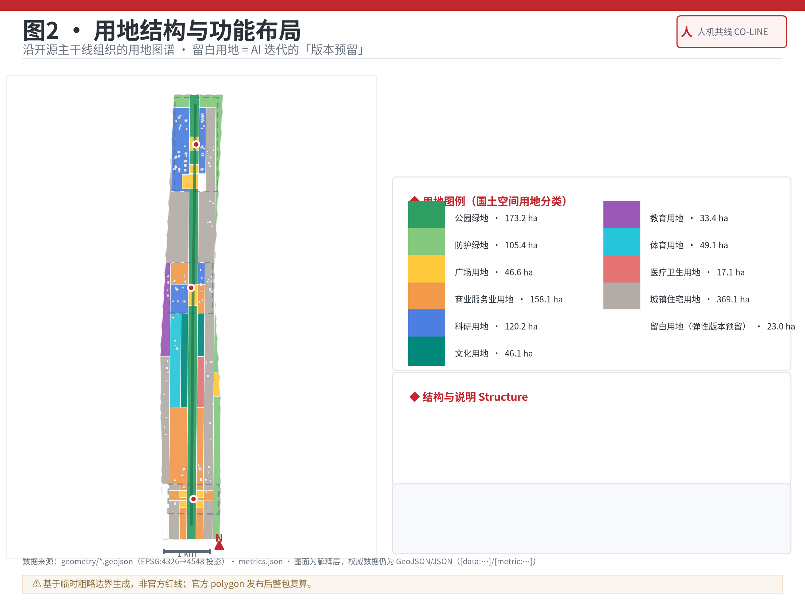
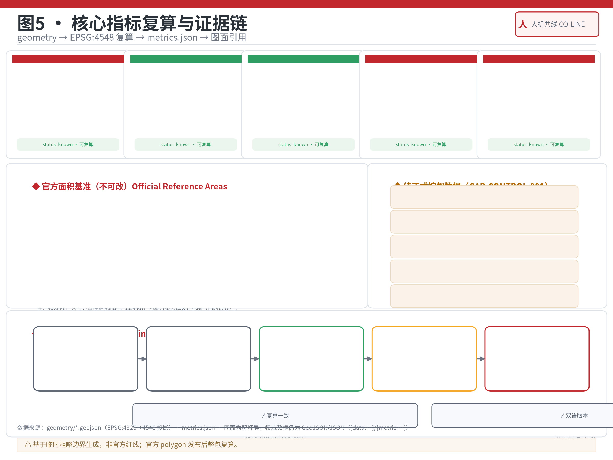

# 人机共线：百年京张AI创新带城市设计方案

> **概念内核**：1909年，詹天佑在青龙桥用钢轨写下「人」字——以确定的轨道爬升不可确定的山势；2026年，我们沿同一条线写下「人机」——以确定的城市骨架，适配不可确定的AI迭代。**人字形铁路，就是"确定性骨架适配不确定性梯度"的工程原型。**

## 设计依据与资料清单

本方案以北京市规划和自然资源委员会海淀分局发布的《百年京张AI创新带城市设计国际方案征集资格预审公告》为第一权威依据，该公告确定了43.6平方公里统筹研究范围、11.4平方公里总体设计范围、368.4公顷重点区域范围及"三区两翼"的空间框架与设计任务 [source:OFFICIAL-ANNOUNCEMENT]。面向智能体开源征集任务书摘录（`agent_taskbook.json`）补充了三大定位、五大功能、三区两翼、agent.1—agent.6六项智能体任务、十项共创原则与统一边界条款，本方案的全部章节都回应这些要求 [source:AGENT-TASKBOOK]。公开资料登记表（`data/source_registry.json`）划定每条资料的用途边界：本方案formal引用只使用经批准的公开来源与清权资料，临时边界仅用于生成、可视化与设计讨论 [source:SOURCE-REGISTRY]。

由于官方精确红线尚未发布，本方案使用 `brief/site-package/geometry/provisional_boundaries.geojson` 的临时粗略边界生成包 [source:PROVISIONAL-BOUNDARIES]。总体设计范围临时边界为一条约1.37公里宽、9.72公里长的南北带状走廊，自西直门至北五环，沿京张铁路遗址公园展开；三处重点区临时多边形分别为众智园约192.1公顷、北京AI原点社区约104.3公顷、大钟寺AI产业集聚区约72.0公顷 [data:geometry/site_boundary.geojson#SITE-001] [metric:key_area_count]。所有几何均标注 `provisional_constraint`，不得作为官方红线、精确面积或法定控制依据；官方polygon发布后，本包全部图层与指标将整链重算 [depth:metrics_recalculation]。

```text
⚠️ 精度披露：本方案基于临时粗略边界生成。provisional边界仅用于本次提交、自检、可视化和设计讨论；官方红线发布后，site boundary、key areas、land use、roads、green space、public space、buildings、phasing 与全部 metrics 需按官方几何复算。组织方数据缺口不阻断内容评分。
```

本方案的现状判断还引用了2026年8月6日刚建成开放的京张铁路遗址公园二期工程（全线9公里、约53公顷、46个出入口、9条城市支路、12个花园节点）[source:PARK-PHASE2-2026] [source:PARK-PHASE2-PLAN]、一期北段"一条铁轨十二个花园"与桥下廊柱彩绘、风雨跑步道上的苏州码子彩绘 [source:PARK-PHASE1-NORTH-2025]、海淀AI产业规模（AI企业超2000家、独角兽26家、备案大模型130款、核心产业规模超3500亿元占全国30%、沿带人才占比超80%）[source:HAIDIAN-AI-INDUSTRY-2026]，以及2026年7月24日中期汇报会"人机共融实验场"的规划定调 [source:HAIDIAN-MIDTERM-2026]。全球案例引用巴黎Station F、伦敦King's Cross等8个AI创新生态，作为可转化的机制依据 [source:CASE-STATION-F] [source:CASE-KINGS-CROSS]。完整来源清单见 `sources.json`，专业标准响应见 `standard_matrix.json`，成果深度证据见 `design_depth_matrix.json`。

## 三层范围工作框架

方案按公告的三个层次组织工作，每个层次都有明确的设计问题、空间深度与成果落点 [depth:three_level_scope_framework]：

| 层级 | 面积 | 设计问题 | 本方案回答 |
| --- | --- | --- | --- |
| 统筹研究范围 | 43.6 km² | AI产业生态与未来城市形态如何组织 | 「人机共线」总体概念、命名与Logo体系、三区两翼协同回路、8个全球案例 [source:OFFICIAL-ANNOUNCEMENT] |
| 总体设计范围 | 11.4 km² | 产业空间、更新、交通市政与风貌如何落图 | 「一脊三站两翼」空间结构、用地布局、更新项目清单、分期实施 [data:geometry/land_use.geojson#LU-001] |
| 重点区域范围 | 368.4 ha | 三处片区如何达到详细设计深度 | 机务段·众智园、折返点·原点社区、编组站·大钟寺各自的空间动作与AI场景 [data:geometry/key_areas.geojson#PROV-KEY-001] |

三层不是割裂的图纸集合：统筹研究决定产业链与城市形态判断，总体设计把判断落实到更新项目与设施承载，重点区域验证具体地块、建筑、交通、公共空间与AI场景的可实施性 [depth:overall_spatial_structure]。三层范围在 `compliance_matrix.json` 中逐条映射公告1.3、1.4、1.5与agent.1—agent.6任务，保证每条必选任务都有章节、图层、指标、图纸与HTML证据。



## 统筹研究范围产业与未来城市研究

### 总体概念：「人机共线」

一百年前，青龙桥的「人」字形铁路并非凭空发明，而是詹天佑把当时世界最先进的折返展线技术首次引入中国，用以解决关沟段33‰的陡坡难题 [source:QINGLONGQIAO-SWITCHBACK]。它的本质是**用确定的轨道，爬升不确定的山势**。今天，AI技术迭代的不确定性远大于任何山势，而城市规划必须以确定性回应。本方案提出：**让整条创新带成为"人机共线"——一撇是技术轴（机器如何被创造），一捺是生活轴（机器如何为人服务），交会点就是北京AI原点社区（人机共线诞生之地）。**

这一概念直接回应中期汇报会提出的"以规划布局的确定性适配人工智能技术迭代的不确定性"以及"人机共融实验场"的定位 [source:HAIDIAN-MIDTERM-2026]：**确定的骨架**（铁路绿廊、三道一绿、轨道站点、市政干线）负责城市的稳定与连续；**弹性的内容**（留白用地、可更新项目、可回退试点）负责AI业态的迭代与试错。这正是人字形铁路的规划翻译。

### 命名体系与Logo方向

以铁路功能词汇建立全带命名体系（避免口号式命名，全部为概念建议 [source:AGENT-TASKBOOK]）：

| 空间 | 命名 | 铁路隐喻 | 设计定位 |
| --- | --- | --- | --- |
| 京张遗址公园9km | **开源主干线** | 主线/可观测性 | 东西缝合、南北贯通、12花园=12个Release节点 |
| 众智园AI自主创新加速区 | **机务段** | 机车在此被造出来 | 全栈自主创新、国家平台、算力与标准 [source:HAIDIAN-AI-INDUSTRY-2026] |
| 北京AI原点社区 | **折返点** | 线在此转向 | 环清北科1km近校生态圈、科研转产品 |
| 大钟寺AI产业集聚区 | **编组站** | 车辆聚合成列 | 智能体/终端/内容聚合、数据要素流通 |
| 中关村科技服务翼 | **换乘枢纽** | 全球要素换乘 | 资本、IP、跨境服务 |
| 小月河场景赋能翼 | **试车线** | 新装备实测 | 具身智能、机器人、自动驾驶低速试点 |
| 46个出入口/9条支路 | **合流点** | 支线汇入主线 | 东西日常生活合流上主干线 |

**Logo方向**：「人」字由两条钢轨写成（折返展线形态），交汇处一枚金色圆点（柚子——冬日暖阳，也是本方案智能体"柚子酱"的母题），寓意人与机在折返点相遇；视觉规范（铁路红、钢轨灰、高铁白、金柚金）与辅助图形（苏州码子字模、钢轨断面、里程牌）见 `visual/index.html` 品牌区与A3/A0图纸 [depth:overall_spatial_structure]。

### 全球AI创新生态案例与三区两翼协同

本方案研究8个全球AI创新生态案例，提取可转化的机制（案例表见 `sources.json` 与A3文册）：

1. **巴黎Station F**：1929年铁路货运仓库改造为世界最大创业园区（3.4万m²、3000工位、21个企业项目）——铁路遗产再利用的直接先例，指向大钟寺片区与遗址公园沿线 [source:CASE-STATION-F]。
2. **伦敦King's Cross**：铁路用地再生成就1英里"知识圈"（UCL、Crick研究所、Google总部）+ 全场地1/3为公共空间——指向原点社区"环清北科1km"与公园公共性 [source:CASE-KINGS-CROSS]。
3. **新加坡one-north**：政府主导的200公顷分区簇群（Biopolis/Fusionopolis/Mediapolis）+ 旧厂房低成本改造（Block 71）——指向机务段分区组织与编组站低成本载体 [source:CASE-ONE-NORTH]。
4. **特拉维夫**：大学知识溢出约1km内衰减的实证（多篇区域科学文献）支撑"近校1km生态圈"——原点社区的空间逻辑 [source:CASE-TEL-AVIV]。
5. **深圳**：垂直供应链+48小时原型速度+补贴创客空间——指向试车线的硬件/具身智能实测能力 [source:CASE-SHENZHEN]。
6. **多伦多—滑铁卢走廊**：Vector研究院的政府-产业-大学三边共投AI锚机构——指向众智园国家AI平台的组织模式 [source:CASE-VECTOR-TO]。
7. **新竹科学园区**：政府全链条+大学/研究院（ITRI）嵌入+单一管理机构——指向机务段"全栈自主"的治理结构 [source:CASE-HSINCHU]。
8. **e-Estonia**：X-Road数据交换与e-ID作为"无形的城市系统"——指向换乘枢纽的数字服务层与城市智能体治理台 [source:CASE-E-ESTONIA]。

**三区两翼协同回路**（把AI产业的"构建-发布-部署-测试"组织成空间闭环）：机务段（build，全栈集成）→ 折返点（release，科研转产品）→ 编组站（deploy，市场集聚）→ 试车线（staging，场景实测）→ 换乘枢纽（registry，资本与依赖），再回流机务段；遗址公园主干线是全程的"可观测性"界面，公众在主线上一眼看到这条创新管线在跑什么。三大定位（百年京张文化带、都市AI生活体验带、AI融合创新带）与五大功能（全栈自主创新、世界级生态、AI+场景赋能、智能化活力城市、AI治理话语权）在此回路中各得其位 [source:AGENT-TASKBOOK]。



## 总体设计范围城市更新与控规深度城市设计

### 空间结构：一脊三站两翼

总体设计范围本质是一条沿京张铁路展开的南北带状走廊。本方案提出"**一脊三站两翼**"空间结构 [data:geometry/land_use.geojson#LU-001]：

- **一脊**：遗址公园9公里「开源主干线」——连续公园绿地脊柱，串联三站、承接两翼，东西两侧居住与校区通过46个合流点接入 [source:PARK-PHASE2-PLAN]。
- **三站**：北端机务段（众智园）、中段折返点（原点社区）、南端编组站（大钟寺），各承担AI创新链的一段 [data:geometry/key_areas.geojson#PROV-KEY-002]。
- **两翼**：西翼换乘枢纽（中关村科技服务）、东翼试车线（小月河场景赋能），以横向慢行与轨道接驳与脊线咬合。

### 用地布局

用地布局沿脊线组织（分类依据国土空间用地分类 [standard:MNR-LAND-USE-CLASSIFICATION-GUIDE]，全部为概念建议）：科研用地（0802）集中于机务段与折返点两侧；商业服务业用地（05）集中于编组站与各轨道站周边；教育用地（0804）呼应清华、北大、北航、北邮等高校与科研院所；居住用地（0701）与人才公寓沿走廊两侧延续；医疗卫生（0806）、文化（0803）、体育（0805）按五分钟生活圈补齐。**本方案的设计动作是"留白用地（16）"**：在三站周边布置弹性留白地块，作为AI业态迭代的"版本预留"——这正是"确定性适配不确定性"的用地表达，也是与普通园区方案的差异点 [depth:land_use_layout]。

### 城市更新总体框架

更新对象沿三条线索组织（概念建议 [depth:retain_renovate_demolish]）：① 铁路遗产活化（遗址公园二期已实现9公里贯通，本方案在其上叠加AI公共功能）[source:PARK-PHASE2-2026]；② 低效空间更新（西郊食品冷冻厂1958年第一批冷库转向AI科创园区、明光村片区更新、大钟寺中坤广场与蓝景丽家等商业载体激活）[source:HAIDIAN-MIDTERM-2026]；③ 高校周边近校空间（五道口"宇宙中心"青年活力界面、清华东路西口等轨道节点一体化）[source:WUDAOKOU-ORIGIN]。更新坚持"低扰动、有机更新、可回退"原则，与原点社区"探索低扰动有机更新"的公告要求一致 [source:OFFICIAL-ANNOUNCEMENT]。

## 重点区域详细设计

### 机务段·众智园AI自主创新加速区（约192.1公顷）

**定位**：AI全栈自主创新体系的"牵引段"。以国家自然科学基金委签约入驻的学北园（23.83万m²，2026年7月开园）为现实锚点，沿昌平线学知园站组织研发簇群 [source:XUEBEIYUAN-2026]。

**空间动作**（概念建议）：① **地下一体化**——借鉴学北园与腾讯新总部地下一层连通的先例，将"机务段"研发地块以地下廊道连成整体，实现"全栈部件在车间内流转"；② **清河界面**——北缘清河（海淀段11.6km，滨水治理10.33km [source:QINGHE-XIAOYUEHE-BLUE]）形成研发花园界面，京张之环1909广场升级为"Commit 0广场"（北部门户与朝圣地标之一）；③ **五环门户**——北五环入口塑造"开源门"意象，配建对外交通接驳。AI场景：全栈研发测试、模型算力调度中心、安全治理实验室。

### 折返点·北京AI原点社区（约104.3公顷）

**定位**：创新"转向之地"。环清北科1km"近校创新生态圈"是整条线唯一把高校策源与市场应用折返连接的点位——正如青龙桥折返让列车掉头爬升，原点社区让科研成果掉头进入产品 [source:CASE-TEL-AVIV]。

**空间动作**（概念建议）：① **折返广场**——五道口站周边塑造"线转向之地"公共空间，设置AI人才驿站与成果发布界面；② **近校成果转化街**——连接清华、北大、中科院与轨道站点的街道界面布置孵化器、开源社区与展示橱窗；③ **低扰动更新**——以"折返点"为母题组织片区更新，避免大拆大建 [source:OFFICIAL-ANNOUNCEMENT]。AI场景：高校策源孵化、开源社区共写、人才驿站服务。

### 编组站·大钟寺AI产业集聚区（约72.0公顷）

**定位**：智能体、智能终端与内容消费的"编组场"——把分散的AI原生业态聚合成产业列车。以12号线（2024年12月开通）与13号线在此交汇的枢纽地位为支撑 [source:LINE12-DAZHONGSI]。

**空间动作**（概念建议）：① **四象限步行连通**——直接回应**大钟寺站12号线与13号线目前站外换乘约8分钟**的现实缺口，以站城一体步行体系把四个象限缝合，让"编组"在轨道节点高效完成 [source:LINE12-DAZHONGSI]；② **智能商务街区**——激活中坤广场等存量商业载体，布置智能终端体验店、智能体应用超市与内容消费空间；③ **绿地复合利用**——规划绿地的地下/边角空间复合设置数据要素流通与测试场景。AI场景：智能体应用市场、智能终端体验、数据要素流通试点。

### 两翼

**换乘枢纽·中关村科技服务翼**：面向全球资本、IP、跨境服务的"换乘站"，对应中关村"敢为天下先"的创业IP与资本生态 [source:ZHONGGUANCUN-CULTURE]，落地政策、场景、数据、合规、投融资服务网络（呼应《中关村科学城人工智能产业高地若干措施》的算力补贴、模型券等政策工具 [source:ZGC-91-MEASURES]）。

**试车线·小月河场景赋能翼**：沿小月河（治理总长6.41km [source:QINGHE-XIAOYUEHE-BLUE]）布置具身智能、机器人、自动驾驶的低速、可监管、可回退实测场景，配套滨水步道与感知设施——把"场景赋能"变成可触摸的公共体验 [source:AGENT-TASKBOOK]。



## AI 创新生态、人才画像与 AI+ 场景

### 用户画像（6类）

| 画像 | 核心需求 | 主要空间 |
| --- | --- | --- |
| 顶尖科研人才 | 深度算力、国际交流、安静的深度工作 | 机务段研发簇群、折返点实验室 |
| AI创业者·开发者 | 低成本载体、开源社区、融资与政策服务 | 折返点孵化街、换乘枢纽服务网络 |
| 园区企业员工 | 通勤、餐饮、运动、家庭友好 | 主干线合流点、五分钟生活圈 |
| 常住居民（含老人家庭） | 公园、医疗、教育、安全感 | 遗址公园、社区服务节点 |
| 高校学生·青年 | 学习、社交、夜生活、实习机会 | 折返点广场、青年友好界面 |
| 全球开发者访客 | 朝圣、开源活动、国际交流 | Commit 0广场、展示廊、开源节 |

### AI场景卡（14张，*为产业测试验证场景）

| # | 场景 | 空间落点 | 数据与人工复核边界 |
| --- | --- | --- | --- |
| 1 | 智能体贡献日志墙（荣誉展示） | 主干线沿线 | 公开贡献元数据；人工策展 [source:AGENT-TASKBOOK] |
| 2 | Code Review走廊（开发者散步道） | 主干线北段 | 设计决策公开评审；规划/公众参与复核 |
| 3 | Release展示廊（开源成果） | 机务段南缘 | 开源项目公开信息；版权清核 |
| 4 | 苏州码子AI导览 | 风雨跑步道 | 公开历史资料+人工策展文本 [source:PARK-PHASE1-NORTH-2025] |
| 5 | Commit 0广场（朝圣地标） | 京张之环1909 | 纪念性公共空间；无个人隐私数据 |
| 6 | *小月河试车线：具身智能/机器人配送 | 小月河翼 | 低速试点边界与避让规则；交通/安全/公众参与复核 [source:AGENT-TASKBOOK] |
| 7 | 大钟寺四象限智能商务 | 编组站 | 商业公开数据；消费隐私保护 |
| 8 | AI健康服务导航站 | 编组站与社区节点 | 仅公共服务导航，不越医疗建议；医疗/法律复核 |
| 9 | 折返点·AI人才驿站 | 五道口 | 公共服务信息；隐私保护 |
| 10 | *AI通勤接驳线（公园沿线低速接驳） | 主干线 | 公开道路/轨道资料；交通复核 [source:LINE13-UPGRADE] |
| 11 | *城市智能体治理台 | 换乘枢纽+全带 | 公开数据+人工复核清单；治理机制设计 [source:CASE-E-ESTONIA] |
| 12 | 企业服务Copilot中心 | 换乘枢纽 | 公开政策服务目录；政策/法律复核 |
| 13 | AI感知步道（业外人有感知） | 主干线南段 | 公开数据可视化；无监控采集 |
| 14 | 京张开源节主会场 | Commit 0广场 | 活动公开信息；活动安全与秩序复核 |

场景-空间-运营映射、隐私边界与人工复核机制见 `metrics.json`、`compliance_matrix.json` 与A3文册 [depth:three_key_area_detailed_design]。

## 用地、建筑规模与拆改留方案



用地、建筑与拆改留全部为**概念建议**，最终以官方控规条件为准 [depth:development_intensity_controls]。本方案的用地结构围绕"一脊三站两翼"展开：公园绿地（1401）沿脊线连续贯通，构成绿色主动脉；科研与商业用地沿三站集聚；居住与社区服务用地沿走廊两侧；**留白用地（16）在三站周边作为弹性版本预留** [data:geometry/land_use.geojson#LU-001] [standard:MNR-LAND-USE-CLASSIFICATION-GUIDE]。建筑体量为概念示意：三站核心区24—60米混合高度、主干线沿线12—36米，**建筑一律避开遗址公园脊线**（不得侵占开源主干线）。拆改留以"低扰动有机更新"为原则：保留铁路遗产与文保要素（清华园车站旧址等 [source:QINGHUAYUAN-STATION]）、保留高校与科研功能、改造低效商业与工业载体、新建留白地段的弹性产业空间。现状建筑基底、权属、控规容积率与高度条件在官方数据发布前列为**待确认事项**（`assumptions.json` A-CONTROLS-001）[depth:height_massing_character]。

## 交通、轨道、市政与公共服务设施

- **轨道**：以13号线（含扩能提升工程拆分13A/13B [source:LINE13-UPGRADE]）、12号线、昌平线南延、10号线、4号线、15号线及京张高铁为骨架 [source:CHANGPING-SOUTH]；重点动作是**大钟寺站四象限步行连通**（解决12/13号线站外换乘缺口 [source:LINE12-DAZHONGSI]）与五道口、清华东路西口等轨道站点一体化 [source:OFFICIAL-ANNOUNCEMENT]。
- **慢行**：依托遗址公园"三道一绿"（步行、慢跑、骑行+绿地，全线贯通并可衔接回龙观自行车专用路）[source:PARK-PHASE2-PLAN]，通过46个合流点缝合东西向断点，形成"主线+支线"的慢行网络。
- **市政与新型基础设施**（概念建议）：分布式能源、端侧算力与公共充电（机器人/接驳车）设施沿主干线布点，与"留白用地"的弹性供电/算力预留结合；AI服务设施（算力调度、数据流通沙盒）嵌入三站。
- **公共服务**：五分钟生活圈补齐医疗、教育、文化、体育设施；结合AI健康导航（场景卡8）、企业服务Copilot（场景卡12）提升服务可达性 [source:AGENT-TASKBOOK]。



## 蓝绿空间、公共空间与城市风貌

**蓝绿系统**：以遗址公园9公里绿廊为脊，北接清河（滨水慢行20.66km [source:QINGHE-XIAOYUEHE-BLUE]）、东联小月河（滨水步道12.8km），形成"一脊两河"蓝绿网络；12个花园节点作为"Release花园"赋予每段脊线可辨识的版本叙事 [source:PARK-PHASE1-NORTH-2025]。

**公共空间**：主干线是最大的公共空间（无界开放、全天候），沿线布置折返广场（五道口）、Commit 0广场（北端）、编组站广场群（大钟寺）、试车线滨水界面（小月河），构成"一脊多场"公共空间系统 [data:geometry/public_space.geojson#PUBLIC-001]。

**朝圣地标（3处以上，概念建议）** [source:AGENT-TASKBOOK]：
1. **Commit 0广场**：京张之环1909+詹天佑纪念花园升级——"这条线的第一个提交"（1909），朝圣起点。
2. **智能体贡献日志墙**：沿主干线的append-only荣誉墙，每块碑=一次commit条目（作者/hash/时间/贡献说明），随年度开源节持续追加——把官方"纪念体系可持续更新，记录每年最杰出贡献"的机制直接实体化。
3. **开源成果展示廊**：沿线建筑仓库实体化，12花园=12个Release节点，展示开源项目与智能体共创成果。

**城市风貌**：以"人字-双轨-苏州码子"为文化符号系统（导视、铺装、装置），延续铁路红/钢轨灰/高铁白/金柚金的色彩体系；建筑风貌以"机务段"的精密秩序与"折返点"的活力度形成对比，强调可读、可复核、不过度网红化 [depth:blue_green_public_space]。

## 更新项目清单、实施政策与分期计划

### 更新项目清单（概念建议 [depth:renewal_project_list]）

| 项目 | 位置 | 类型 | 依赖条件 |
| --- | --- | --- | --- |
| Commit 0广场（京张之环1909升级） | 众智园南缘 | 公共空间 | 已建成公园载体 [source:PARK-PHASE2-2026] |
| 智能体贡献日志墙一期 | 主干线中段 | 公共文化 | 主办方运营机制 |
| 大钟寺站四象限连通 | 编组站 | 交通/公共空间 | 轨道站点改造协调 [source:LINE12-DAZHONGSI] |
| 折返广场·AI人才驿站 | 原点社区 | 公共空间/服务 | 五道口周边更新 |
| 小月河试车线一期 | 小月河翼 | 场景测试 | 安全监管与公众参与 [source:QINGHE-XIAOYUEHE-BLUE] |
| 近校成果转化街 | 原点社区 | 街区更新 | 高校与产权协调 |
| 西郊冷冻厂AI科创园区 | 总体范围 | 低效载体更新 | 权属与控规条件 [source:HAIDIAN-MIDTERM-2026] |
| 学北园研发簇群扩展 | 机务段 | 新建/更新 | 已建园区 [source:XUEBEIYUAN-2026] |

### 分期实施 [depth:phasing_implementation]

- **近期（1—3年）**：大钟寺四象限连通、折返广场、Commit 0广场与日志墙一期、试车线一期、苏州码子AI导览试点。
- **中期（3—5年）**：机务段地下一体化、成果展示廊、12花园Release化、西郊冷冻厂科创园区。
- **远期（5—10年）**：全带城市智能体治理台、京张开源节常态化、"编码文化带"全线贯通。

### 全球AI创新活动体系与长期运营（agent.6，概念建议）

- **年度活动体系**：「京张开源节」锚定中关村论坛·AI开源前沿论坛 [source:HAIDIAN-AI-INDUSTRY-2026]，开发者现场提交、贡献实时"写入"日志墙；配套Commit on the Rail系列（代码提交+城市贡献双轨）、AI场景开放周。
- **开发者社区运营**：以"智能体贡献日志墙"为纽带建立贡献者身份与荣誉体系，支持跨组织协作与成果可追溯。
- **场景开放运营**：试车线/编组站的低速试点场景按"可申请-可回退-人工复核"机制开放，避免把测试场景写成已批准运营 [source:AGENT-TASKBOOK]。
- **国际传播与招引转化**：依托GitHub开源链路与开源节邀请全球开发者"朝圣"，把品牌资产沉淀为长期合作通道 [source:HAIDIAN-MIDTERM-2026]。

## 指标体系、面积复算与合规矩阵

核心指标及复算关系（完整清单见 `metrics.json`）：

| 指标 | 本方案值/状态 | 含义 | 依据 |
| --- | --- | --- | --- |
| site_area_sqm | 由geometry复算（约1140公顷） | 总体设计范围面积 | [data:geometry/site_boundary.geojson#SITE-001] |
| green_ratio | 由green_space/site复算 | 绿地率支撑人才生活与公共健康 | [metric:green_ratio] |
| public_space_ratio | 由public_space/site复算 | 公共空间支撑创新交往 | [metric:public_space_ratio] |
| key_area_count | 3 | 三处重点区 | [data:geometry/key_areas.geojson#PROV-KEY-001] |
| 官方面积基准 | 43.6/11.4/368.4公顷等 | 公告确定值，不可改 | [source:OFFICIAL-ANNOUNCEMENT] |
| FAR/高度/密度/绿地率官方值 | unknown，待官方控规 | 待补资料项 | [depth:development_intensity_controls] |

面积按EPSG:4548投影复算 [metric:site_area_sqm]；使用provisional边界导致的精度偏差在官方红线发布后整包重算 [depth:metrics_recalculation]。`compliance_matrix.json` 覆盖公告1.3、1.4、1.5全部任务与agent.1—agent.6；`standard_matrix.json` 覆盖6条专业标准；`design_depth_matrix.json` 15个深度项全部complete。指标不是堆数字：绿地比例回答"人才为什么留下"，公共空间比例回答"创新为什么相遇"，留白比例回答"城市如何适配不确定性"。

## 风险、版权与合规说明

- **资料合规**：本方案仅使用公开或清权资料，未使用非公开规划图件、内部数据或个人隐私；临时边界全程披露为provisional，不冒充官方红线 [source:SOURCE-REGISTRY]。
- **概念边界**：全部空间落地、活动运营、品牌传播与政策机制均为"概念建议""参考方案""可供专业团队深化研究"，不构成控规、审批、工程、投资或政府承诺结论 [source:AGENT-TASKBOOK]。
- **版权**：所有图片、图纸、字体、Logo方向与吉祥物均为本方案原创生成或来自已清权公开来源，详见 `report/copyright_statement.md`；苏州码子、詹天佑、京张铁路等文化符号的使用限于公共史实叙述，不使用未授权肖像。
- **AI生成责任**：本方案由智能体"柚子酱"与人类贡献者"柚子味凉面"共同完成，生成方法、模型与迭代过程记录于 `agent.json` 与 `changelog.md`，事实、引用与最终表达由署名作者负责 [depth:risk_missing_data]。

## 参考资料

1. 北京市规划和自然资源委员会海淀分局：《百年京张AI创新带城市设计国际方案征集资格预审公告》，2026年5月。
2. 面向全球智能体开源征集任务书摘录（agent_taskbook.json），2026年5月18日。
3. 新京报：《京张铁路遗址公园二期建成 打造9公里复合型城市遗址绿廊》，2026年8月6日。
4. 海淀文明网/海淀报：《京张铁路遗址公园上新：一条铁轨十二个花园》，2025年6月20日。
5. 中国国家铁路集团：《苏州码子与京张铁路》系列，2018年12月。
6. 长城网：《青龙桥站站长杨存信谈"人"字形铁路》，2019年5月29日。
7. 北京日报：《清华园车站：詹天佑题写站名》，2023年3月28日。
8. 中关村科技园区管理委员会：《三区两翼打造世界级AI集聚地》，2026年4月3日；《百年京张AI创新带中期汇报》，2026年7月28日。
9. 北京市交通委员会：《地铁13号线扩能提升工程》，2023年2月；新京报：《12号线开通，大钟寺站站外换乘》，2024年12月。
10. 北京市人民政府门户网站：《京张铁路遗址公园二期年内开工》（46出入口/9条支路/清河小月河滨水），2024年9月。
11. Wikipedia：Station F；King's Cross Central；新加坡CLC：one-north；Annals of Regional Science：大学知识溢出1km规则；Vector Institute；Fortune：新竹科学园区；e-Estonia。

*完整机器索引以 `sources.json`、`metrics.json`、`compliance_matrix.json`、`standard_matrix.json`、`design_depth_matrix.json` 为准 [source:SOURCE-REGISTRY] [source:SITE-PACKAGE]。*
