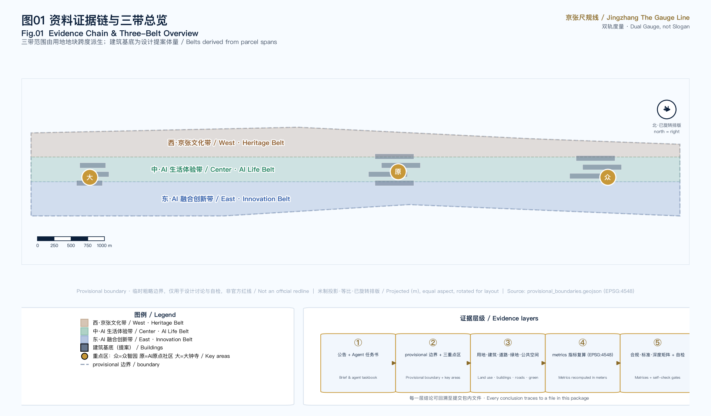
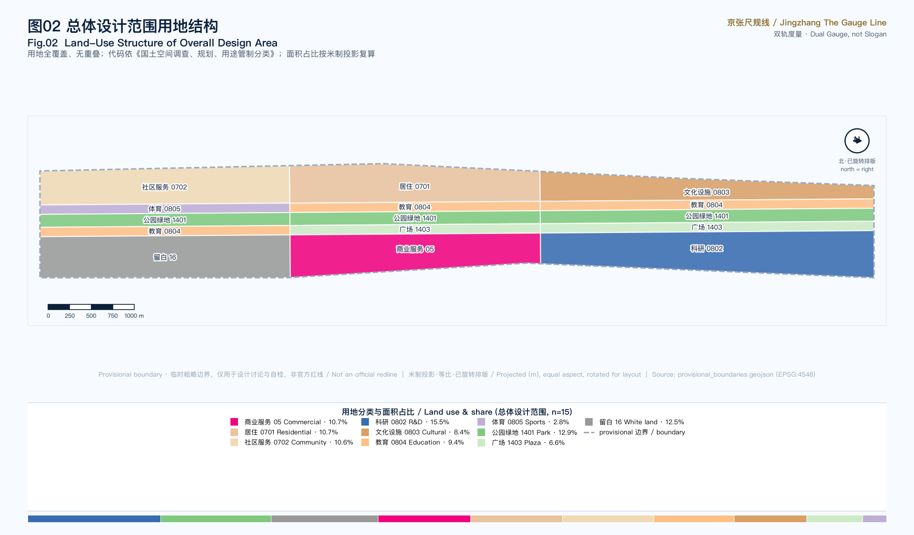
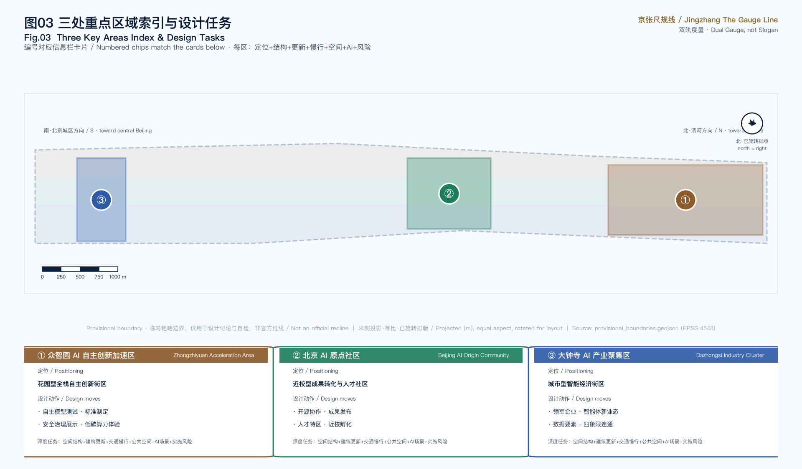
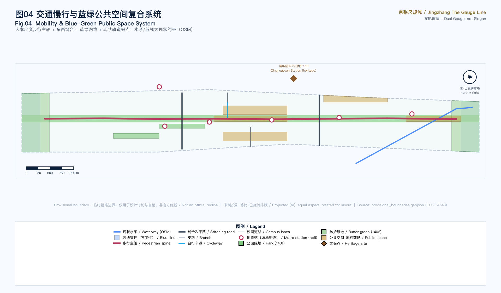
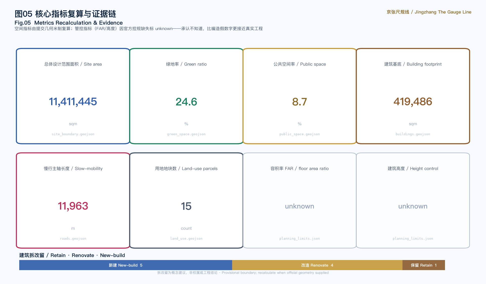

# Jingzhang The Gauge Line / 京张尺规线

> **Motif: the dual gauge (Dual Gauge, not Slogan).** The Jingzhang Railway was China's first mastery of "precise engineering" — Zhan Tianyou's switchback line translated a terrain problem into a buildable geometric solution. A century later, AI urban design should likewise return to "buildable geometry": not yet another open-source protocol, but a scale judgment for every street and every parcel. **But the AI era adds a second ruler: the sensing radius, service radius and decision latency of agents must equally be measurable, placeable and reviewable in space.** This proposal fuses the two rulers into a "dual gauge": the spatial gauge answers "how is land used", the AI gauge answers "how is intelligence distributed, where are the boundaries, and where are the human-review points" — neither suffices alone.

## Design Basis and Source Inventory

This proposal takes the *International Call for Urban Design of the Centennial Jingzhang AI Innovation Belt* issued by the Haidian Branch of the Beijing Municipal Commission of Planning and Natural Resources as its primary basis [source:OFFICIAL-ANNOUNCEMENT], and the agent-facing taskbook [source:AGENT-TASKBOOK] together with the provisional boundaries, enums, metrics and source lists registered by maintainers in `brief/site-package/` as machine-readable bases [source:SITE-PACKAGE]. Before generating the proposal, the agent read `design_brief.json`, `allowed_design_space.json`, `sources.json`, `enums/`, `ranges/planning_limits.json`, `schemas/` and `data/source_registry.json` [source:SOURCE-REGISTRY], and used `data/processed/agent_fact_pack.md` to build a task, scope, source-use and gap checklist [source:PROCESSED-FACT-PACK].

Source-use boundaries are explicit: the official announcement and agent taskbook are formal-ready sources; `provisional_boundaries.geojson` is a provisional source used only for temporary generation, self-check and design discussion [source:BOUNDARY-SOURCE]; OSM base data is used only as background under ODbL attribution. All content concerning development intensity, building height, road redlines, retain/renovate/demolish and heritage control is written as "conceptual suggestion / reference scheme / pending official regulatory confirmation", never disguised as an official approved conclusion [depth:risk_missing_data].

**Boundary status:** The official SITE_BOUNDARY and three KEY_AREA polygons are not yet available, so this proposal uses `provisional_boundaries.geojson` to generate a temporary formal package [source:KEY-AREA-SOURCE]. `geometry/site_boundary.geojson` and `geometry/key_areas.geojson` are both marked `provisional_constraint`, `official_boundary=false`. This organizer data gap does not block content scoring; after official polygons are supplied, site boundary, key areas, land use, roads, green space, public space, buildings, phasing and metrics must all be recalculated [metric:site_area_sqm]. Boundary evidence returns to the overall-scope layer [data:geometry/site_boundary.geojson#SITE-001].

## Three-Level Scope Framework

The proposal organizes work along the three levels defined by the announcement, translating the abstract "three levels" into measurable work objects:

| Level | Scope | Design question | Proposal answer | Data anchor |
| --- | --- | --- | --- | --- |
| Coordinated research | 43.6 km² | AI industry ecosystem and future city form | "university sourcing—open-source collaboration—enterprise conversion—public experience—international communication" innovation chain | compliance_matrix.json |
| Overall design | 11.4 km² | Industry space, urban renewal, mobility, civic character | Three vertical belts + slow-mobility spine + blue-green network | [data:geometry/land_use.geojson#LU-001] |
| Key detailed design | 368.4 ha | How the three key areas reach detailed-design depth | Each area: positioning + structure + retain/renovate + mobility + public space + AI scenarios + risk | [data:geometry/key_areas.geojson#PROV-KEY-001] |

The three levels are not isolated drawing sets. Coordinated research determines the industry-chain and city-form judgment; overall design translates that judgment into renewal projects, spatial structure and facility capacity; key-area detailed design validates the implementability of specific parcels, buildings, mobility, public space and AI scenarios. Any area, ratio, scale or project count that cannot be recomputed from structured data is not written as a formal conclusion [depth:three_level_scope_framework] [depth:overall_spatial_structure].

The core spatial judgment is a **"three vertical belts" structure**: the overall design scope is divided west-to-east into three north-south belts, each carrying one of the call's three positioning lines. This is not a newly drawn redline but a readable translation of the three-level scope into land-use organization — the west belt carries the "Centennial Jingzhang Cultural Belt" (residential, cultural, community service), the central belt carries the "Urban AI Life Experience Belt" (heritage park green axis, education, sports, plaza), and the east belt carries the "AI Convergence Innovation Belt" (R&D, commercial service, white land). Land-use polygons are derived from SITE_BOUNDARY, fully covering it without gaps or overlaps, using the 07/08/05/14/16 system of the national land-use classification [standard:MNR-LAND-USE-CLASSIFICATION-GUIDE].

## Coordinated Research: Industry and Future-City Strategy

### Naming and Visual Identity

**Primary name: Jingzhang The Gauge Line.** "Gauge" — the track gauge — is the most fundamental unit of railway engineering and a pun on "standard of measurement", echoing the proposal's "measurable" claim. The three lines are named **Gauge of Heritage**, **Gauge of Life** and **Gauge of Innovation**, unified under the "measurement" motif. The visual direction draws on railway engineering blueprints and precision ruler imagery: deep-blue ground, copper-gold ticks, white-line grid, avoiding atmospheric illustration and entertainment-style icons [standard:PROJECT-AGENT-OPEN-CALL-TASKBOOK].

**Logo direction (agent.1 deliverable):** the primary mark is `assets/brand/logo.svg` — an original, pure-geometry, font-free figure: a deep-blue rounded square as blueprint ground; the gold **herringbone chevron** recalls the climbing switchback of Zhan Tianyou's Jingzhang Railway and reads equally as an open pair of compasses; below, the **solid white rail** is the "ruler of space" and the **dashed gold rail** is the "ruler of intelligence", with green sleepers and gauge ticks completing the motif. The mark works in monochrome, stays legible at 16 px, and extends to the four-level signage system, event sub-brands and digital interfaces; heritage memorial marks (e.g. Qinghuayuan Station) are layered separately from the primary logo and never mixed.

Naming serves recognition rather than slogan: it explains the spatial logic of the proposal (everything returns to scale) and resonates with the engineering heritage of the Jingzhang Railway — Zhan Tianyou solved "how to make a railway climb Guan'gou within a given gradient"; this proposal solves "how to make AI truly enter every parcel of the city within a given boundary".

### Global AI Innovation Ecosystem Cases (agent.2)

The proposal surveys six global AI innovation ecosystem cases and extracts transferable spatial and operational lessons (all publicly documented cases, not investment promises):

| Case | Core lesson | Action translated for Haidian |
| --- | --- | --- |
| Silicon Valley Sand Hill Road | Geographic proximity of capital and universities drives conversion | AI Origin Community "near-campus incubation street" shortening lab-to-capital distance |
| Shenzhen Bay Tech Eco-Park | Park-as-testbed, integration of industry space and scenario opening | Zhongzhiyuan "public testbed" turning standard-setting into a visitable node |
| Munich Kunstareal (art & campus quarter) | Symbiosis of campuses, museums and tech functions | Jingzhang heritage park green axis carrying both cultural narrative and AI display |
| Tsukuba Science City | Scale balance of research, housing and public service | Functional ratios of the three vertical belts and talent-life supply |
| Amsterdam Science Park | Open shared courtyards and developer-community operation | Developer walk, open-source display gallery, contribution honor wall |
| Singapore one-north | Station-integrated, walkable campus form | Dazhongsi station four-quadrant connection, human-scale pedestrian spine |

These cases show that a world-class AI ecosystem relies not on algorithms alone but on the synergy loop of "space supply — scenario opening — talent life — capital proximity". The proposal lands this loop on three areas and two wings: Zhongzhiyuan (full-stack autonomous AI innovation), AI Origin Community (world-class AI innovation ecosystem), Dazhongsi (intelligent native new business), supported by the Zhongguancun technology-service wing (global factor allocation, capital empowerment) and the Xiaoyuehe scenario-empowerment wing (AI scenario enablement) [source:AGENT-TASKBOOK] [depth:overall_spatial_structure]. Note: names such as "Zhongzhiyuan" and "Beijing AI Origin Community" originate from the call taskbook; "Zhongzhiyuan" has no independent authoritative real-world source and is the organizer's naming, while "AI Origin Community" corresponds to the real built area around Wudaokou's Dongsheng Building [source:AGENT-TASKBOOK].

### Haidian AI Industry Baseline (official data anchoring)

The proposal does not invent an industry ecosystem from scratch but anchors it to Haidian's published baseline: Haidian AI core industry scale **282.2 billion yuan (2024, +30% YoY, ~80% of Beijing)**, ~1900 AI enterprises, 95 filed large models, and the city's first 10^16-FLOP (万P) intelligent-computing cluster [source:HAIDIAN-AI-INDUSTRY-STATS]; 92 national key labs in the district (63.4% of Beijing, 17.9% of China) and 51 unicorns [source:HAIDIAN-STATISTICS]. The strongest planning anchor is the **Zhongguancun AI Large-Model Industry Cluster core area (~9.5 km², east: Xueyuan Rd, south: Zhichun Rd, west: Wanquanhe Rd, north: Tsinghua West/East Rd)**, inaugurated 2023 — it overlaps the proposal's overall design scope [source:ZGC-LARGEMODEL-CLUSTER-OFFICIAL]. Two of the proposal's key areas — **Wudaokou (Beijing AI Origin Community) and Dazhongsi — are the two official pilot areas of Haidian's 53 km² AI Innovation Block** (released at the 2024 Zhongguancun Forum) [source:HAIDIAN-AI-INNOVATION-BLOCK]. This means the proposal does not "site the belt from nothing" but deepens space for pilot areas already officially recognized and already carrying industry momentum. All industry figures are official aggregate statistics (non-spatial), cited with year and caliber, not investment or recruitment commitments.

### Regional Innovation Collaboration: Three Areas, Two Wings and Cross-District Loops (agent.1/agent.2)

The three belts and three key areas are not islands. The taskbook calls for a "three areas, two wings" synergy loop; the proposal translates the two wings into two operable support mechanisms and maps collaboration directions with neighboring innovation poles (all mechanism-level conceptual suggestions, not government agreements or settled arrangements) [source:AGENT-TASKBOOK]:

| Wing | Taskbook positioning | Spatial & mechanism translation |
| --- | --- | --- |
| Zhongguancun technology-service wing | Global factor allocation, Zhongguancun IP and capital empowerment | Carried by the Dazhongsi international roadshow living room and data-factor reception hall, hosting conceptual pathways for technology trading, IP services and cross-border capital matchmaking; wing functions land in the east belt's commercial (05) and white-land (16) elastic supply [data:geometry/land_use.geojson#LU-014] |
| Xiaoyuehe scenario-empowerment wing | AI scenario enablement and intelligent vitality city | Carried by the Xiaoyuehe waterfront [data:geometry/constraints.geojson#WATER-OSM-001]: a "waterfront scenario test segment" where slow-mobility navigation, environmental sensing and night-vitality scenarios run continuously along the Xiaoyuehe–heritage-park axis, forming the public experience path of the 12 scenario cards [metric:scenario_card_count] |

Cross-district collaboration loops (conceptual mechanisms, not settled arrangements):

| Partner | Direction | Interface in this proposal |
| --- | --- | --- |
| Beiwei Community | Residential and community-service hinterland | West-belt residential/community land (0701/0702) stitched by the pedestrian spine |
| Future Science City (Changping) | Hard-tech R&D and pilot-scale linkage | Conceptual channel from Zhongzhiyuan test/validation scenarios to pilot manufacturing [data:geometry/key_areas.geojson#PROV-KEY-001] |
| Huairou Science City | Big-science facilities and basic research | Release and showcase mechanism of the open-source release hall |
| Beijing E-Town (Yizhuang) | Intelligent manufacturing and industrialization | Conceptual matchmaking path of the Dazhongsi data-factor reception hall [data:geometry/key_areas.geojson#PROV-KEY-003] |
| Beijing-Tianjin-Hebei city cluster | Jing-Zhang cultural corridor and regional brand resonance | Narrative extension of the Jingzhang memory route and Centennial Milestone Plaza — the railway itself is a cross-regional heritage |

The synergy is two-way: the belt exports scenario and standard-setting display interfaces; its neighbors feed back research results, manufacturing capacity and visitors. All cross-district mechanisms are conceptual suggestions pending negotiation among the relevant bodies and official arrangement.

### AI Innovation Ecosystem Map and Factor Mechanisms (agent.2)

The eight factors required by the taskbook — land, space, industry, capital, talent, computing power, data, scenarios — are translated into a reviewable ecosystem map: each factor carries a public-fact anchor, a spatial placement and a mechanism suggestion, all traceable to layers or public sources [depth:overall_spatial_structure]:

| Factor | Public-fact anchor | Spatial placement | Mechanism suggestion (conceptual) |
| --- | --- | --- | --- |
| Land / space | Large-Model Cluster core area ~9.5 km² overlapping this scope [source:ZGC-LARGEMODEL-CLUSTER-OFFICIAL] | 15 parcels across three belts | White land (16) as elastic supply; intensity pending official controls |
| Industry | Haidian AI core industry 282.2 bn yuan, ~1900 firms [source:HAIDIAN-AI-INDUSTRY-STATS] | Dazhongsi AI Industry Cluster | Conceptual mechanism of roadshow display + data-factor circulation |
| Capital | "Capital empowerment" positioning of the technology-service wing [source:AGENT-TASKBOOK] | International roadshow living room | Roadshow-matchmaking-conversion pathway; no funding commitments |
| Talent | 19 universities and research institutes along the corridor [source:OSM-2026] | AI Origin Community | Near-campus incubation + talent-zone concept |
| Computing power | Beijing's first 10^16-FLOP cluster in Haidian [source:HAIDIAN-AI-INDUSTRY-STATS] | Edge-compute relays | Distributed compute as public-service prototype (card 03) |
| Data | Beijing open-data platform: 4457 datasets [source:BEIJING-OPEN-DATA-PLATFORM] | Data-factor reception hall | Compliant registry + audited-circulation concept (card 09) |
| Scenarios | 53 ha heritage park + Xiaoyuehe/Qinghe waterfronts [source:JINGZHANG-PARK-OFFICIAL] | All 12 scenario cards placed | Scenario open days + test reservation concept |

The map's judgment: Haidian lacks no factors — it lacks **spatial interfaces between them**. Capital sits next to universities without meeting places; computing power is strong but sealed in server rooms; data is abundant but lacks a trusted circulation interface. The three key areas answer exactly these three "missing interfaces".

Future-city-form research answers "how AI changes work, life, learning, mobility and public service". This proposal's stance: **these changes ultimately land on changes in spatial scale** — remote collaboration changes office-space density demand, edge computing changes the symbiosis of server rooms and public-service facilities, autonomous driving changes curb-and-sidewalk allocation. The proposal translates these trends into concrete land-use ratios, street cross-sections and public-space scales rather than vague tech vision.

**The AI gauge: projecting the second ruler into space.** AI is not uniformly pervasive "digital air"; it has measurable operating scales, which the proposal projects into three kinds of spatial judgment [depth:overall_spatial_structure]:

1. **Sensing radius.** The coverage radius of the sensors/data sources an agent depends on determines the density of "sensing nodes". The proposal places low-intrusion sensing nodes only in public space (breakpoints, heat, facility status), with sensing radius organized in 300–500 m units, aggregated output, no personal identification [data:geometry/roads.geojson#ROAD-001].
2. **Service radius.** Edge-compute relays, slow-mobility navigation and unmanned delivery each have different physical service radii — compute relays 500 m, slow-mobility navigation belt-wide, unmanned delivery a 2–3 km ring relayed through stations. Service radius directly determines facility siting and right-of-way allocation, written into the scenario cards and renewal projects [metric:scenario_card_count].
3. **Decision latency and review points.** Real-time decisions (slow-mobility breakpoint alerts) may respond automatically in seconds but must be logged; decisions involving approval, safety or privacy (release, testing, consultation) must retain human review points. The spatial placement of review points is the spatialization of "human-in-the-loop" — every AI scenario card states its human review point [depth:multi_agent_governance].

## Overall Design: Urban Renewal and Regulatory-Plan Urban Design

This section is the proposal's main differentiator. The overall design scope (11.4 km²) requires urban-design depth at the regulatory-plan level — exactly where most AI submissions are weak. This proposal gives auditable spatial structure, land-use layout, building renewal and facility capacity.

### Land-Use Structure

Land-use polygons are derived from SITE_BOUNDARY projected to EPSG:4548 — 15 parcels, fully covering without gaps or overlaps [depth:land_use_layout]. Land-use codes use the 0701 (residential) / 0702 (community service) / 0802 (R&D) / 0803 (culture) / 0804 (education) / 0805 (sports) / 05 (commercial service) / 1401 (park green) / 1403 (plaza) / 16 (white land) system [standard:MNR-LAND-USE-CLASSIFICATION-GUIDE]. The functional ratio of the three belts embodies the "measurement" judgment: the innovation belt is anchored by R&D land, the life belt by park green, the cultural belt balances talent life and heritage with residential + cultural uses. White land (16) is explicitly marked "pending official regulatory plan", acknowledging the data gap rather than masking it with a fake precise figure [data:geometry/land_use.geojson#LU-001].

### Building Retain / Renovate / Demolish

The building-footprint scheme distinguishes three renewal actions: **new_build**, **renovate**, **retain**, each labeled in the `renovation_action` field of `geometry/buildings.geojson` [depth:retain_renovate_demolish]. For example, the AI Origin Community's near-campus incubator and open-source collaboration building are marked "renovate" (activating stock); Zhongzhiyuan's autonomous-model experiment block and safety-evaluation lab are "new_build" (industry supply); Dazhongsi's existing retail is "retain". Total building footprint is recomputable from the layer [metric:building_footprint_area_sqm]; the retain/renovate/demolish classification is a conceptual suggestion, not an ownership or engineering conclusion.

### Development Intensity and Pending Controls

Floor-area ratio, building height and building density are all `missing` in the site package; this proposal marks them `unknown` and states the required source (approved regulatory plan or taskbook attachment) [standard:MOHURD-CONTROL-DETAILED-PLANNING]. This is a compliance boundary and also part of the spatial gauge within the "dual gauge" methodology: **admitting ignorance is closer to real engineering than fabricating a precise false number**. The proposal offers the method (how to fill these metrics once controls arrive), not a fabricated conclusion [depth:development_intensity_controls].

## Key-Area Detailed Design

The three key areas are where the proposal lands. Each forms a readable mini-scheme of "positioning + spatial structure + building renewal + mobility + public space + AI scenarios + implementation risk", referencing the corresponding feature in `geometry/key_areas.geojson` [depth:three_key_area_detailed_design].

### Zhongzhiyuan AI Autonomous Innovation Acceleration Area (PROV-KEY-001)

**Positioning:** A garden-type full-stack autonomous-innovation block, hosting the national AI platform, standard-setting, safety governance and low-carbon computing experience. **Structure:** Strengthen the Qinghe frontage and external-access organization; carry open testing and standard-governance display in green space. **Buildings:** Autonomous-model experiment block and safety-evaluation lab are new_build; low-carbon computing relay is new_build (edge-computing + public-service fusion prototype). **Mobility:** External branch road + Qinghe low-carbon innovation corridor (walk + cycle). **Public space:** Open-source display gallery and public testbed, turning standard-setting into a visitable node. **AI scenarios:** Autonomous-model testing, safety-governance sandbox, standard-setting workshops. **Risk:** Qinghe blue line, ecological and flood conditions pending; building height subject to landscape limits [data:geometry/key_areas.geojson#PROV-KEY-001] [source:AGENT-TASKBOOK].

### Beijing AI Origin Community (PROV-KEY-002)

**Positioning:** A near-campus conversion and talent community, hosting open-source collaboration, achievement release, talent special zones and near-campus incubation. **Structure:** Stitch campus, park and block slow-mobility; supply achievement-release, talent-service, residential-life and open-source-collaboration space. **Buildings:** Near-campus incubator and open-source collaboration building are renovate (activating stock); achievement-release hall is new_build. **Mobility:** Near-campus cycle link + campus-park slow-mobility stitching. **Public space:** Developer-walk courtyard, carrying daily open-source-community collaboration and reputation. **AI scenarios:** Open-source release hall, near-campus conversion street, talent-life steward. **Risk:** Campus boundary, ownership, ground-floor tenure pending [data:geometry/key_areas.geojson#PROV-KEY-002].

### Dazhongsi AI Industry Cluster (PROV-KEY-003)

**Positioning:** An urban-type intelligent-economy and international-exchange block, hosting leading enterprises, agent new business, content consumption and data factors. **Structure:** Dazhongsi station integration, four-quadrant pedestrian connection, commercial service and key-enterprise public-environment renewal. **Buildings:** Existing retail retained; intelligent-terminal display building renovated; data-factor reception hall new_build. **Mobility:** Dazhongsi station four-quadrant branch + pedestrian connection. **Public space:** Agent contribution honor-wall forecourt, serving display, negotiation and media release. **AI scenarios:** International roadshow living room, data-factor reception hall, intelligent-terminal display. **Risk:** Rail station, intersection, municipal utilities pending; enterprise logos and cases require clearance [data:geometry/key_areas.geojson#PROV-KEY-003] [metric:key_area_count].

## AI Innovation Ecosystem, Personas and AI+ Scenarios

### Corridor Education-Resource Baseline (real grounding for agent.3 personas)

The proposal's "near-campus conversion" and personas rest on the corridor's real education density: based on OpenStreetMap current data (ODbL, retrieved 2026-08-10), the corridor concentrates **19 universities and research institutes**, including Tsinghua, Peking, BUPT (Double First-Class: information & communication / computer science), Beihang (Double First-Class: control / computer / software), USTB, China University of Geosciences, Beijing Forestry, China Agricultural University, and UCAS Zhongguancun campus [source:OSM-2026] [source:MOE-DOUBLE-FIRST-CLASS]. This confirms the real logic of siting the "Beijing AI Origin Community" — the Wudaokou–Xueyuan Road belt is one of China's densest sources of universities and AI talent. Spatial moves like the "near-campus incubation street" and "developer walk" are not invented but provide walkable containers for existing talent and conversion demand. Coordinates are written into `geometry/roads.geojson` as SCENARIO_NODE features [metric:universities_along_corridor].

### Five User Personas (agent.3)

| Persona | Core need | Spatial response | Privacy boundary |
| --- | --- | --- | --- |
| Open-source developer | Release, collaboration, testing, reputation | Origin-community release hall, developer walk, night collaboration space | No personal trajectory; activity data aggregated only |
| Startup team | Low-cost office, compute entry, product testbed | Zhongzhiyuan shared testbed, edge-compute relay | Compute and data services require separate authorization |
| Enterprise visitor | Display, business, reception, recruiting | Dazhongsi international roadshow living room, rail access, enterprise-adjacent public space | Enterprise logos and cases require clearance |
| Resident | Commute, leisure, community service, low-disturbance renewal | Heritage park slow-mobility loop, embedded community service, graded night lighting | No resident profiling for commercial recommendation |
| Faculty and student | Conversion, cross-campus collaboration, daily slow-mobility | Campus-park slow-mobility stitching, conversion station, AI education point | Campus data and research results require authorization |

### Public Interest and All-Age Inclusive Design (agent.3 extension)

Public interest is not an appendix but the starting point of scale. Beyond the five personas, a public innovation belt must also answer the groups most easily overlooked by technology narratives. The following are design guidance and conceptual suggestions, not engineering conclusions [standard:MOHURD-URBAN-DESIGN-MEASURES]:

| Group | Core need | Spatial response (conceptual) |
| --- | --- | --- |
| Elderly | Digital divide, rest density, emergency safety | "Digital-recharge stations" in the heritage park where volunteers and service agents teach smart-service use; seating and shade guidance every 200–300 m along the spine; sensing nodes doubling as one-touch call points |
| Children | Science education, safety, nature contact | "AI + railway" science nodes on the Jingzhang memory route (Qinghuayuan Station narrative); slow-mobility-priority segments and speed-limit suggestions near schools |
| People with mobility impairments | Accessibility continuity | Spine gradient guidance (≤1/12); uninterrupted tactile paving; reserved accessible-lift suggestions at the Dazhongsi four-quadrant connection [data:geometry/public_space.geojson#PUBLIC-004] |
| Night workers and women | Night-time travel safety | Graded night lighting linked with low-intrusion aggregate heat sensing — identifying only "where it is dark/empty", never persons [depth:multi_agent_governance] |
| Low-income young talent | Affordable living and first startup steps | Low-cost desk concept in near-campus incubators; reserved affordable functions in community-service land (0702) |
| Tourists and visitors | Legibility, multilingual, navigable | Four-level bilingual signage system; the memorial system lets visitors "read" the century dialogue of Jingzhang and AI |

The governance meaning of inclusion: every agent service for these groups is bound by the Agent Operating Protocol — data minimization, human-in-the-loop, no substitution for statutory process; statutory standards for accessibility and elderly facilities follow formal design and acceptance.

### Multi-Agent Collaborative Governance: the Belt's "Agent Operating Protocol" (agent.3 deepening)

AI-native does not mean "install an AI on every facility" — it means **multiple agents collaborating in the same space must follow one consistent operating protocol**. This proposal introduces a "belt multi-agent collaborative governance framework" that classifies agents into four roles, each with explicit data boundaries, spatial placement and human review points [depth:multi_agent_governance]:

| Agent role | Duty | Data boundary | Spatial placement | Human review point |
| --- | --- | --- | --- | --- |
| Perception agent | Slow-mobility breakpoints, public-space heat, facility-status monitoring | Low-intrusion aggregated sensing; no personal identification, no trajectory collection | Low-intrusion nodes in public space (300–500 m units) | Sensing-point inventory periodically inspected by humans |
| Service agent | Slow-mobility navigation, facility-maintenance work orders, unmanned-delivery dispatch | Public/authorized data only; no personal profiles | Edge-compute relays, slow-mobility spine, curb handover points | Dispatch suggestions logged; major rerouting confirmed by humans |
| Governance agent | Safety review, compliance audit, energy control | Read-only aggregated data; auditable logs | Zhongzhiyuan safety-governance sandbox, data-factor reception hall | Red-team results reviewed by humans |
| Operations agent | Event scheduling, scenario dispatch, contribution records | Authorized data minimized | Dazhongsi operations living room, open-source release hall | Released content and event arrangements reviewed by humans |

Four operating protocols constrain every agent: **(1) data minimization** — only necessary aggregated data, sensing does not identify individuals; **(2) human-in-the-loop** — decisions involving approval, safety, privacy or enforcement must retain human review points; agents recommend, never decide; **(3) explainable logging** — all automated decisions are traceable and auditable, logs open to the operator; **(4) no substitution for statutory process** — agent output does not constitute planning approval, heritage, ownership or engineering conclusions [source:AGENT-TASKBOOK]. The framework's governance principles are consistent with taskbook agent.3's privacy and human-review boundary; no scenario may bypass these protocols in the name of an agent.

### AI Scenario Cards (≥10, of which ≥3 are test/validation scenarios)

Each card states its "sense → decide → act" AI loop and human review point, making "AI-native" an auditable operating structure — not an AI label, but a clear statement of which agents operate in what space, on what data, with what decisions, and who reviews:

| # | Scenario card | Spatial carrier | Type | AI loop (sense → decide → act) | Human review point |
| --- | --- | --- | --- | --- | --- |
| 01 | Open-source release hall | AI Origin Community | experience | aggregated contribution data → community-reputation model → release podium and honor wall | release content reviewed by humans; contribution data aggregated only |
| 02 | Safety-governance sandbox | Zhongzhiyuan | test/validation | red-team input → risk-assessment model → isolated sandbox run | red-team testing bookable and supervised; results reviewed by humans |
| 03 | Edge-compute relay | Overall-scope nodes | test/validation | energy/load telemetry → load-dispatch model → edge-inference node allocation | compute service requires authorization; energy data public |
| 04 | Autonomous-model testbed | Zhongzhiyuan public testbed | test/validation | public test set → evaluation model → testbed display | test data isolated; evaluation results confirmed by humans |
| 05 | AI slow-mobility navigation | Heritage park belt | experience | low-intrusion breakpoint sensing → breakpoint identification → navigation and facility work orders | work orders reviewed by humans; no personal tracking |
| 06 | Dazhongsi international roadshow living room | Dazhongsi area | experience | registration/agenda data → agenda-recommendation model → roadshow and interpretation | enterprise logos cleared; business data not public |
| 07 | Qinghe low-carbon innovation corridor | Zhongzhiyuan Qinghe frontage | experience | environmental monitoring → carbon-accounting model → corridor display | environmental data public; no personal-behavior collection |
| 08 | Near-campus conversion street | AI Origin Community | experience | public achievement database → matching-recommendation model → conversion-station liaison | IP and research results used under authorization |
| 09 | Data-factor reception hall | Dazhongsi area | experience | compliant registered data → flow-trace model → hall terminals | compliant, authorized, auditable; flow fully traced |
| 10 | AI life-service model street | Community-commerce junction | experience | public service info → service-matching model → street terminals | medical/education/legal scenarios reviewed by humans |
| 11 | Jingzhang memory route | Belt public-space system | experience | historical archive → narrative-orchestration model → route signage | historical materials authorized; portraits/trademarks cleared |
| 12 | Global AI Week route | Belt public-space system | experience | event calendar → route-orchestration model → signage and circulation | tiered activity safety; copyright cleared |

All scenarios land on concrete layers and nodes: public-space scenarios reference [data:geometry/public_space.geojson#PUBLIC-001], mobility scenarios reference [data:geometry/roads.geojson#ROAD-001], open-space scenarios reference [data:geometry/green_space.geojson#GREEN-001], governance and safety scenarios reference [data:geometry/constraints.geojson#CONST-001]. AI-governance suggestions follow data-minimization, public-source, explainable and human-review principles; a city agent assists in identifying slow-mobility breakpoints, public-space heat and facility-maintenance needs, but does not replace planning approval and does not output unauthorized personal profiles [metric:scenario_card_count].

## Land Use, Building Scale and Retain/Renovate/Demolish

The land-use layout follows the national land-use classification, forming complete, closed, gap-free parcels. The building scheme distinguishes retain, renovate and new-build, clarifying footprint, function, character, roof, massing and height-control suggestion levels. Where existing-building, ownership, regulatory-plan and engineering conditions are missing, the proposal offers only method and a pending-calibration list, not fabricated retain/renovate/demolish conclusions [standard:MNR-LAND-USE-CLASSIFICATION-GUIDE] [depth:height_massing_character].

Primary evidence for land use and buildings: [data:geometry/land_use.geojson#LU-001], [data:geometry/buildings.geojson#BLDG-001] and [metric:building_footprint_area_sqm]. Building-scale and intensity metrics are consistent with `metrics.json` and the layers; where total floor area, FAR, height, density, green ratio, setback and building control lines lack official conditions, they are listed as `unknown` or `pending_control`, not given fixed false values.

## Mobility, Rail, Municipal and Public-Service Facilities

The mobility core is a **human-scale pedestrian spine** — a north-south slow-mobility axis through the heritage-park green axis (pedestrian), overlaid with two east-west stitching secondary roads, reconnecting the east-west fabric severed by the railway and ring roads [depth:traffic_rail_slow_parking]. This contrasts with most AI submissions that reduce mobility to "autonomous driving + data": this proposal holds that in the AI era **streets belong first to the bodily scale of pedestrians**, and intelligence is a means to serve that scale, not a replacement. The spine's alignment is anchored to **real existing rail stations**: based on OSM current data, the corridor has 12 subway stations (Dazhongsi, Jimenqiao, Zhichun Rd, Zhichunli, Xitucheng, Wudaokou, Xueyuanqiao, Liudaokou, Qinghua East Rd West, Beishatan, Xuezhiyuan, Qinghe Xiaoying Bridge) [source:OSM-2026]; the spine-plus-station interface forms a "rail + walk" accessibility backbone, and the Dazhongsi four-quadrant connection has real ridership basis [metric:subway_stations_along_corridor]. Rider / ride-hailing / courier operational volume references Meituan (3.36M monthly active riders) and Didi public-report aggregate statistics [source:MEITUAN-RIDER-REPORT] [source:DIDI-MOBILITY-REPORT] to ground the AI life-service model street and unmanned-delivery scenarios — this is national aggregate background data, not corridor-measured flow. The Beijing Public Data Open Platform (4,457 datasets across 71 units, incl. education/transport/geospatial themes) is referenced as a data-resource index for later calibration [source:BEIJING-OPEN-DATA-PLATFORM].

Road and slow-mobility layers stay within the submitted boundary and cross-check against public space, green space, industry nodes and key areas. Key coverage includes the North 5th Ring crossing, Wudaokou, Qinghua East Road West, Dazhongsi station and key-enterprise access. Where road redlines, utilities, fire and municipal conditions are missing, assumptions record the pending items [depth:municipal_new_infrastructure] [data:geometry/roads.geojson#ROAD-001].

Municipal and public-service facilities cover AI industry services, innovation platforms, talent-life services, new infrastructure, distributed energy, edge computing and integration with traditional municipal systems. The edge-compute relay serves as a "new-infrastructure prototype pending deepening", translating computing from closed server rooms into a visible node inside public-service facilities. Missing utility, energy, drainage, flood and fire data are listed as formal-deepening prerequisites.

## Blue-Green Space, Public Space and Urban Character

Blue-green space takes the Jingzhang heritage park belt as its backbone, coordinating Qinghe, Xiaoyuehe and the surrounding university, enterprise and community travel demand into a north-south and east-west connected walk, cycle and green-space system. Green space includes the Jingzhang heritage-park green axis (continuous park green), Qinghe/Xiaoyuehe buffer green and neighborhood parks [data:geometry/green_space.geojson#GREEN-001] [metric:green_ratio]. The 24.6% green ratio supports talent life and innovation exchange — a number recomputed from the layer, not a slogan [depth:blue_green_public_space]. The backbone rests on real features: the **Jingzhang Railway Heritage Park is officially ~9 km long** (south: Xizhimen / Beijing North; north: North 5th Ring; Phase 2 fully opened 2026-08-06, total site ~53 ha, serving ~70 communities and 450k residents), its space reclaimed from the original surface railway after the Beijing-Zhangjiakou HSR went underground inside the 5th Ring (Qinghuayuan tunnel) [source:JINGZHANG-PARK-OFFICIAL] [metric:heritage_park_length_km]; the **Xiaoyuehe, Wanquanhe and Qinghe** current waterway coordinates are written into `geometry/constraints.geojson` (based on OSM current data, ODbL) [source:OSM-2026] as the existing-condition basis for waterfront slow-mobility design — statutory blue lines still follow official water-authority data, and this proposal uses current waterways only for design discussion and visualization.

### AI Pilgrimage Landmarks and Honor-Display System (agent.4)

The proposal offers 3+ AI pilgrimage landmarks / honor-display nodes, echoing the call's vision of "engraving contributors' GitHub IDs on the Jingzhang heritage park":

1. **Jingzhang Starting Plaza** (PUBLIC-001): pilgrimage-landmark forecourt, human-scale gathering space, hosting the Global AI Week opening.
2. **Agent Contribution Honor Wall** (PUBLIC-004): Dazhongsi forecourt, recording outstanding agents and contributors, linked to the developer community and public-space system.
3. **Open-Source Achievement Display Gallery** (PUBLIC-002): Zhongzhiyuan, translating open-source code contributions and standard-setting into a walkable display interface.
4. **Centennial Milestone Plaza** (PUBLIC-005): Jingzhang terminus, a spacetime dialogue between Zhan Tianyou's engineering heritage and new AI culture.

Landmarks, signage, logo, fonts, images, portraits and enterprise logos must be cleared; no over-entertainment, and no conceptual landmark written as approved construction [standard:MOHURD-URBAN-DESIGN-MEASURES]. Urban character fuses Jingzhang railway history, Zhongguancun innovation culture and new AI culture, anchored to real cultural resources: **the Qinghuayuan Station site is a Beijing Municipal Cultural Heritage Protection Unit (9th batch, 2023)**, built 1910, its station name "清华園車站" calligraphed by Zhan Tianyou, and the first stop of the 1949 "进京赶考" [source:HERITAGE-QINGYUAN-OFFICIAL]; **Dazhongsi (Juesheng Temple) is a 4th-batch National Key Cultural Heritage Protection Unit (1996)**, now the Great Bell Temple Museum [source:DAZHONGSI-HERITAGE-OFFICIAL]. The "Centennial Milestone Plaza" and "Open-Source Display Gallery" should respond to the cultural weight of these two heritage sites, proposing city tone, building character, roof form, massing, interface and public-art guidance; heritage construction-control zones follow official heritage data, and this proposal gives only a directional location in `geometry/constraints.geojson` [data:geometry/constraints.geojson#HERITAGE-QHY-001].

### Public-Space Component Library (agent.4)

The landmarks and public-space system are delivered as a reusable component library — modularization lets the memorial system and smart services expand year by year, stay maintainable, and be deepened by professional teams. Conceptual specifications only; materials, appearance and suppliers must be cleared — not engineering selection conclusions:

| Component | Function | Conceptual specification | Placement |
| --- | --- | --- | --- |
| Honor-wall module | Records contributors' GitHub IDs and outstanding agents | Modular cast-bronze nameplate unit (~1.2×2.4 m), extensible year by year | Dazhongsi forecourt, heritage-park nodes [data:geometry/public_space.geojson#PUBLIC-004] |
| Smart bench | Rest + wireless charging + low-intrusion environmental sensing | Solar canopy; sensing aggregates environmental metrics only, never identifies persons | Along the pedestrian spine (guidance: every 200–300 m) |
| Information kiosk | Wayfinding + event info + emergency call | Bilingual e-ink display, offline map, one-touch call | Rail-station interchanges and key-area entrances |
| Wayfinding sign | Carrier of the four-level signage system | Gauge motif, bilingual, night-legible | Belt-wide (see signage direction) |
| Micro compute kiosk | Edge inference node + public network | Co-located with edge-compute relays; energy data public | Card-03 nodes |
| Accessibility kit | Ramps, tactile paving, tactile maps | Gradient ≤1/12; tactile guidance at nodes | Connection nodes and landmark forecourts |

Component governance matches the scenario cards: any sensing component is bound by the Agent Operating Protocol; any signage or imagery component must be rights-cleared [source:AGENT-TASKBOOK].

### Signage System Direction and International Communication Narrative (agent.5 deepening)

**Signage system direction:** a four-level system — gateway signs (belt ends and key-area entrances), node signs (landmarks and scenario nodes), path signs (pedestrian spine and stitching roads), facility signs (components and service points). Fully bilingual (Chinese/English); the graphic motif is the "gauge" — twin parallel rails with tick teeth, deep-blue ground with copper-gold ticks and white-line grid, consistent with all drawings; the heritage segment may adopt aged-copper tones and early-industrial detailing, the AI segment stays geometric and clean. Cultural identity marks and the belt's primary logo belong to two separate layers and are never mixed; fonts, icons and symbols must be original or rights-cleared [standard:MOHURD-URBAN-DESIGN-MEASURES].

**International communication narrative (ready-to-use concept copy):**

> **The Gauge Line** — where a century of engineering precision meets the measurable city of AI. One corridor, two rulers: one measures how land is used, the other measures how intelligence is distributed, bounded and reviewed.

The communication anchors are real cultural weight, not slogans: the Qinghuayuan Station site (1910, name calligraphed by Zhan Tianyou) and the engineering spirit of the Jingzhang herringbone switchback, together with the six-century bells of Dazhongsi (national heritage), form the twin anchors of the "Centennial Jingzhang × new AI culture" international narrative [source:HERITAGE-QINGYUAN-OFFICIAL] [source:DAZHONGSI-HERITAGE-OFFICIAL].

## Renewal Project List, Implementation Policy and Phasing

| Project ID | Project name | Type | Key dependency | Evidence |
| --- | --- | --- | --- | --- |
| JZ-01 | Heritage-park slow-mobility spine and breakpoint stitching | Public space / mobility | Road redline, under-bridge space, traffic review | [data:geometry/roads.geojson#ROAD-001] |
| JZ-02 | Zhongzhiyuan Qinghe innovation frontage | Blue-green / industry display | River blue line, ecology and flood conditions | [data:geometry/green_space.geojson#GREEN-001] |
| JZ-03 | Origin-community near-campus conversion street | Urban renewal / industry service | Campus boundary, ownership, ground-floor tenure | [data:geometry/buildings.geojson#BLDG-001] |
| JZ-04 | Dazhongsi station four-quadrant pedestrian connection | Rail integration / slow-mobility | Rail station, intersection, municipal utilities | [data:geometry/public_space.geojson#PUBLIC-001] |
| JZ-05 | AI public-service and edge-compute node | New infrastructure / public service | Energy, compute, safety, operator | [data:geometry/constraints.geojson#CONST-001] |
| JZ-06 | Global AI Week public route | Operation / brand | Public-space permit, activity safety, copyright clearance | [data:geometry/phasing.geojson#PHASE-001] |

Phasing is distinguished from the 100-day call design cycle: the call cycle is the submission deadline; implementation phasing is the urban-renewal and construction path. The proposal offers near-term pilots (heritage-park slow-mobility spine and public-space activation), mid-term renewal (AI Origin Community near-campus incubation and open-source collaboration), and long-term governance (Zhongzhiyuan and Dazhongsi industry deepening) [depth:renewal_project_list] [depth:phasing_implementation].

### Global AI Innovation Activity System and Long-Term Operation (agent.6)

**Annual activity system** (conceptual suggestions, not settled arrangements; event safety, permits and copyright follow formal approval):

| Season | Event brand | Spatial carrier | Operating mechanism (concept) |
| --- | --- | --- | --- |
| Spring | Open-Source Hackathon Season | AI Origin Community release hall | Hosted by the developer community, co-hosted with corridor universities |
| Summer | Global AI Week | Opening at Jingzhang Starting Plaza + belt-wide experience route | Multilingual international communication, linked with scenario open days |
| Autumn | Achievement Release Season | Dazhongsi international roadshow living room | Roadshow-matchmaking-conversion pathway |
| Winter | Jingzhang Memory Light-Narrative Week | Heritage-park green axis | Cultural narrative + public art, assets cleared first |

**Brand IP system:** the "Gauge Line" master brand and the four seasonal sub-brands share the gauge visual motif (deep-blue ground, copper-gold ticks, twin rails), extending to signage, cultural products and digital interfaces; all visual assets must be original or rights-cleared, and cultural identity marks are layered separately from the primary logo (see agent.5 signage direction).

**Developer-community operation:** a conceptual loop of "open-source contribution → reputation accumulation → honor-wall engraving → near-campus incubation matchmaking" — contribution data is used only in aggregate; community governance is assisted by operations agents with final judgment by human teams (charter.7: humans make the final call) [source:AGENT-TASKBOOK].

**Scenario-open operation:** the public testbed and safety-governance sandbox run on a "reservation + supervision" concept, with test/validation scenarios open to enterprise and university teams and results reviewed by humans; scenario open days turn testing itself into a visitable urban event.

**Conversion pathway (recruitment funnel, conceptual mechanism):** visitor (heritage park and pilgrimage-landmark experience) → participant (AI Week / open days / hackathons) → developer (open-source community and reputation system) → founder/team (near-campus incubation, roadshow-lounge matchmaking) — every stage has an explicit spatial carrier and operating action, avoiding "events without retention". Follow-on conversion of talent, enterprises and developers relies on the conceptual capital-and-IP service mechanism of the Zhongguancun technology-service wing [source:AGENT-TASKBOOK].

**International communication and recruitment:** the bilingual "dual gauge" narrative (agent.5 concept copy) + the annual event calendar + a rights-cleared communication visual kit support international attention; all investment, policy, funding and operation arrangements are written as conceptual suggestions, never as settled commitments.

## Indicator System, Area Recomputation and Compliance Matrix

Indicators fall into three classes, avoiding mistaking operational vision for approved planning conditions. **Class 1** (spatial metrics recomputable from submitted geometry): overall-scope area, green ratio, public-space ratio, building footprint, slow-mobility spine length, land-use parcel count, retain/renovate/demolish counts [depth:metrics_recalculation]. **Class 2** (control metrics requiring official regulatory support): FAR, building height, building density, setback, road redline, facility standards — `missing` in the site package, marked `unknown` [standard:MOHURD-CONTROL-DETAILED-PLANNING]. **Class 3** (performance metrics requiring operational data): AI innovation index, talent density, activity participation, scenario-use frequency — pending operational-data intake.

Core metrics: overall design area 11,411,445 sqm, green ratio 24.6%, public-space ratio 8.7%, building footprint 419,486 sqm, slow-mobility total length 11,963 m, land-use parcels 15, key areas 3 [metric:site_area_sqm] [metric:green_ratio]. Third-party anchored metrics: 19 corridor universities, 12 subway stations, 9 km heritage park, Haidian AI core industry 282.2bn yuan, ZGC large-model cluster core 9.5 km², 92 national key labs [metric:universities_along_corridor] [metric:haidian_ai_core_industry_scale_billion_yuan]. AI-native metric: 12 scenario cards (3 test/validation) [metric:scenario_card_count]. Full values and formulas are in `metrics.json`.

The compliance matrix covers all mandatory tasks of announcement 1.3, 1.4, 1.5 and agent.1–agent.6, each mapped to report sections, layers, metrics, drawings, HTML pages, sources, assumptions and self-check items.

## Risk, Copyright and Compliance

This proposal is based on official public materials and the provisional boundary; it does not claim official approval, approved regulatory plan, final land ownership, final construction scale or guaranteed implementation. The AI agent is responsible for facts, sources, copyright, spatial data, metrics and expression; maintainers and professional reviewers may request rework or rejection based on self-check results, spatial review and the compliance matrix [depth:risk_missing_data] [data:geometry/constraints.geojson#CONST-001].

**Bilingual requirement:** The primary file is Chinese; a complete equivalent translation is provided via `proposal.en.md`; A3/A0, HTML and text-bearing figures provide language counterparts, preferring the call's bilingual terminology glossary. All images, drawings, icons, data and code assets document their source, license and authorization status in `sources.json` and `report/copyright_statement.md`. HTML pages load no remote scripts, map tiles, fonts, iframes, forms or external APIs, and do not track reviewers.

**Main data gaps and pending items:** Official SITE_BOUNDARY, three KEY_AREA polygons, FAR, building height, building density, road redlines, ownership, municipal utilities, heritage control lines and engineering conditions are all `missing`, marked `unknown`/`pending` in `assumptions.json` and `metrics.json`. Under the provisional boundary, all spatial conclusions are directional designs pending recomputation once official data is released.

## References

- brief/public-brief.md — public brief draft
- brief/site-package/agent_taskbook.json — agent-facing taskbook
- brief/site-package/allowed_design_space.json — allowed design space and layer policy
- brief/site-package/ranges/planning_limits.json — known areas and pending controls
- data/source_registry.json — public source registry
- data/processed/agent_fact_pack.md — agent-readable navigation layer
- OpenStreetMap (ODbL, retrieved 2026-08-10) — corridor universities / subway stations / waterways as existing-condition base layer
- Beijing Municipal Science & Technology Commission / Haidian District Statistics Bureau — Haidian AI industry and economic statistics (282.2bn yuan / ~1900 enterprises / 92 national key labs)
- Beijing Municipal Cultural Heritage Bureau — Qinghuayuan Station site (municipal heritage unit), Dazhongsi (national key heritage unit)
- Beijing Municipal Development & Reform Commission / Science and Technology Daily — Jingzhang Railway Heritage Park (9 km / 53 ha) public information
- Ministry of Education — Second-round Double First-Class list (corridor universities' disciplines)
- Meituan / Didi corporate mobility reports — rider / ride-hailing aggregate statistics (scenario background)
- Full machine index: see `sources.json`, `metrics.json`, `compliance_matrix.json`, `standard_matrix.json`, `design_depth_matrix.json` [source:SITE-PACKAGE]
