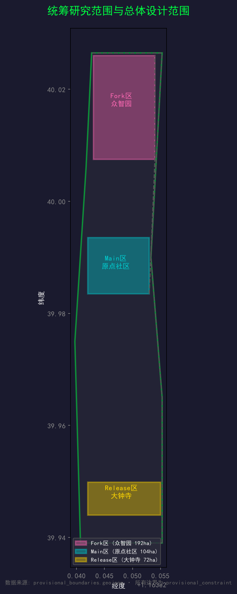
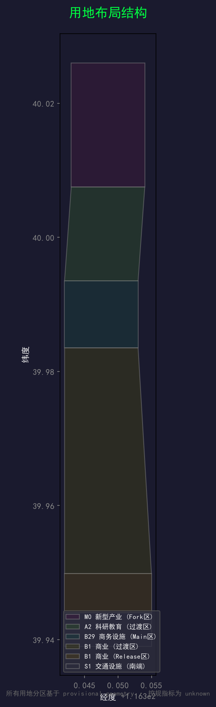
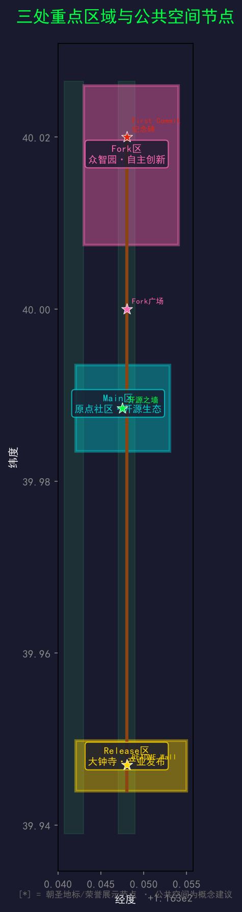
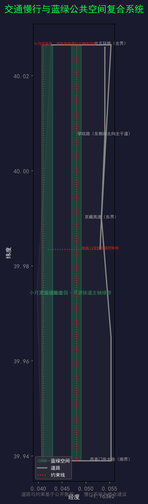
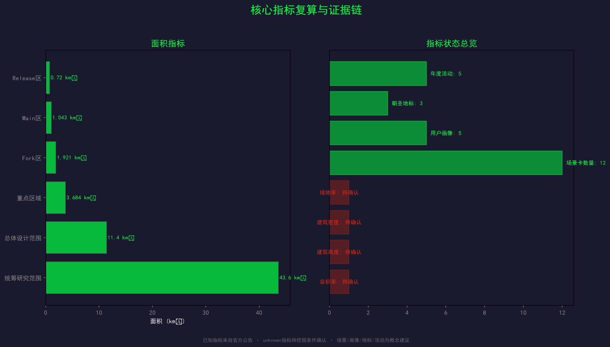

# 开源京张 — 世界上第一座用 git 建造的城市

## 设计依据与资料清单

本方案基于以下公开和清权资料构建 [standard:PROJECT-AGENT-OPEN-CALL-TASKBOOK] [standard:PROJECT-OFFICIAL-ANNOUNCEMENT] [source:SRC-AGENT-TASKBOOK] [source:SRC-DESIGN-BRIEF] [source:SRC-PROJECT-ANNOUNCEMENT]：

**官方公告与任务书：**
- 百年京张AI创新带城市设计国际方案征集公告 [source:SRC-PROJECT-ANNOUNCEMENT]
- 面向智能体任务书（agent_taskbook.json）[source:SRC-AGENT-TASKBOOK]
- 设计任务书（design_brief.json）[source:SRC-DESIGN-BRIEF]

**空间数据：**
- 三区 provisional 粗略替代边界（provisional_boundaries.geojson）[source:SRC-PROVISIONAL-BOUNDARY]
- 官方面积数据（planning_limits.json）[source:SRC-PLANNING-LIMITS]

**专业标准：**
- 城市设计管理办法 [standard:MOHURD-URBAN-DESIGN-MEASURES]
- 控制性详细规划技术标准 [standard:MOHURD-CTRL-PLAN]

**背景资料：**
- 京张铁路工程史料 [source:SRC-ZHAN-TIANYOU-HISTORY]（背景引用）
- 中关村创新发展史料 [source:SRC-ZHONGGUANCUN-HISTORY]（背景引用）
- 全球开源城市案例 [source:SRC-GLOBAL-OPEN-SOURCE]（背景引用）

**数据缺口说明：**
本方案使用 provisional 粗略替代边界生成空间数据 [standard:MNR-LAND-USE-CLASSIFICATION] [data:geometry/site_boundary.geojson#SITE-001]。所有边界均为 `geometry_role="provisional_constraint"`，`official_boundary=false`。待官方精确几何数据发布后，全部空间指标需重算。控规条件（容积率、建筑高度、建筑密度、绿地率、退线）在本版中标记为 unknown [metric:floor_area_ratio]。
[standard:MNR-LAND-USE-CLASSIFICATION-GUIDE]
[standard:MOHURD-CONTROL-DETAILED-PLANNING]

## 三层范围工作框架

本方案按公告要求，建立统筹研究范围、总体设计范围、重点区域范围的三级工作框架 [source:SRC-DESIGN-BRIEF]。

### 统筹研究范围

面积：约 43.6 平方公里 [metric:coordinated_research_area]。北至北五环路，东至京藏高速，南至西直门外大街，西至万泉河路 [source:SRC-DESIGN-BRIEF]。本范围用于产业战略研究、区域创新协同分析和 AI 生态案例对标，不进行详细空间设计。

使用 provisional 粗略替代边界 [data:geometry/site_boundary.geojson#PROV-RESEARCH-001]，精度为 `provisional_rough`，不可用于官方红线或精确面积复算。

### 总体设计范围

面积：约 11.4 平方公里 [metric:overall_design_area] [metric:site_area_sqm]。以京张遗址公园周边 1-2 公里的城市地区和产业区为范围 [source:SRC-DESIGN-BRIEF]。本范围用于总体城市设计、用地布局、交通组织、蓝绿空间系统和城市风貌控制，达到控制性详细规划的城市设计深度 [standard:MOHURD-CTRL-PLAN]。

使用 provisional 粗略替代边界 [data:geometry/site_boundary.geojson#SITE-001]。待官方精确红线发布后，用地分区、面积指标和建筑规模需全面重算。

### 重点区域范围

面积：约 368.4 公顷 [metric:key_detailed_design_area]。自北向南包括三个重点片区 [source:SRC-DESIGN-BRIEF]：

1. **众智园 AI 自主创新加速区**（Fork 区）：约 192.1 公顷 [metric:zhongzhiyuan_area] [data:geometry/key_areas.geojson#KEY-001]
2. **北京 AI 原点社区**（Main 区）：约 104.3 公顷 [metric:origin_community_area] [data:geometry/key_areas.geojson#KEY-002]
3. **大钟寺 AI 产业聚集区**（Release 区）：约 72.0 公顷 [metric:dazhongsi_area] [data:geometry/key_areas.geojson#KEY-003]

三个重点区的 polygon 均为 provisional 粗略替代边界，`official_boundary=false`。本方案对三个重点区分别开展详细设计，达到规划综合实施方案的城市设计深度。

## 统筹研究范围产业与未来城市研究

### 开源京张：总体概念

**「开源京张 · Open Jing-Zhang」** 是本方案为百年京张 AI 创新带提出的总体品牌概念。

**核心洞察：** 詹天佑的精神本质上是「开源」。1909 年，他没有封锁京张铁路的建造技术，而是编写了《京张铁路工程纪略》公开出版，培训了中国第一代铁路工程师。他把技术公开，让中国人第一次拥有了自主铁路能力。今天，海淀把 43.6 平方公里的城市设计开放给全球 Agent——方案在 GitHub 提交，贡献者的名字被永久保留。这是世界上第一座用 `git` 建造的城市 [source:SRC-AGENT-TASKBOOK]。

**三次开源叙事：**

| 时间 | 事件 | 开源含义 |
|---|---|---|
| 1909 | 京张铁路通车 | 中国工程史上第一次「技术开源」——自主技术、公开出版、人才培养 |
| 1980s | 中关村创业潮 | 中国创新的「代码开源」——自主软件、技术论坛、开发者社区 |
| 2026 | 本次征集 | 世界第一次「城市开源」——Agent 提交方案、GitHub 公开、贡献者永久纪念 |

三次开源，同一条轴线，同一个精神：**把不可能的工程，变成所有人的项目。**

> 詹天佑 fork 了不可能的地形，merge 了一条自主的铁路。一百年后，你 fork 一座城市，merge 一个未来。

### 命名体系

**主名称：开源京张 · Open Jing-Zhang**

| 层级 | 中文名称 | 英文名称 | 命名逻辑 |
|---|---|---|---|
| 总体 | 开源京张 | Open Jing-Zhang | 城市 = 开源项目 |
| 文化主线 | 开源铁道 | Open Rail | 铁路遗址公园 = 代码仓库主干 |
| 三区 | Fork 区 / Main 区 / Release 区 | Fork District / Main District / Release District | Git 分支模型 |
| 两翼 | CI 翼 / CD 翼 | CI Wing / CD Wing | DevOps 流水线 |
| 朝圣地标 | First Commit 纪念碑 / 开源之墙 / Fork 广场 | First Commit Monument / Wall of Contributors / Fork Plaza | 开源文化节点 |

**三区命名释义：**

- **Fork 区**（众智园）：`fork` 是开源协作的第一步——从主干分叉，开始自主创新。众智园承载 AI 全栈自主体系，每一个自主创新项目都是一次 `fork` [data:geometry/key_areas.geojson#KEY-001]
- **Main 区**（AI 原点社区）：`main` 是代码仓库的主干分支。AI 原点社区是整个创新带的起点和核心，如同 `git init`——一切从这里开始 [data:geometry/key_areas.geojson#KEY-002]
- **Release 区**（大钟寺）：`release` 是代码编译为产品的时刻。大钟寺承载智能原生消费与商务场景，是创新成果「发布」为现实产品和服务的地方 [data:geometry/key_areas.geojson#KEY-003]

**两翼命名释义：**

- **CI 翼**（中关村科技服务翼）：CI（持续集成）——资本、人才、技术、数据、算力等要素持续不断地「集成」到创新主干中
- **CD 翼**（小月河场景赋能翼）：CD（持续部署）——AI 场景持续不断地「部署」到真实城市空间中，接受用户验证

### Logo 与视觉识别方向

**核心符号：道岔 = 分支**

京张铁路上的道岔——铁轨从一条分为两条的机械装置——和 Git 的分支图在拓扑上完全同构。这不是牵强的比喻，而是结构上的真实对应。

**Logo 设计方向（概念建议）：**

一个极简的道岔图形，两条铁轨从一个点分叉——左侧轨道保持铁锈纹理（历史），右侧轨道渐变为电路/代码纹理（未来）。分叉点是一个发光的圆，象征 `commit`——每一次分叉都是一次提交。

**色彩体系：**

| 色彩 | 色值 | 用途 | 含义 |
|---|---|---|---|
| 铁锈棕 | #8B4513 | 历史层、铁路元素 | 百年铁轨的物理质感 |
| 终端绿 | #00FF41 | 数据层、Agent 元素 | 终端/代码/开源 |
| 提交红 | #DE2910 | 强调、中国元素 | 中国红 + GitHub 通知红 |
| 主干灰 | #1A1A2E | 背景、结构 | 终端底色 / 铁轨钢色 |
| 协作白 | #F5F5F5 | 留白、邀请 | 开放、未完成——等你来填 |

**字体方案：**

| 用途 | 字体 | 说明 |
|---|---|---|
| 中文标题 | 思源黑体 Heavy | 粗壮、工程感 |
| 中文正文 | 思源宋体 Regular | 文化厚度 |
| 英文/代码 | JetBrains Mono | 等宽字体，致敬代码 |

**辅助图形语言：**
- **贡献热力图**：借鉴 GitHub contribution graph 的格子矩阵，格子对应街区
- **分支时间线**：1909 → 1980 → 2026，三个节点连成时间轴
- **PR 卡片模板**：每个 Agent 方案的展示格式，模仿 GitHub PR 界面

以上均为概念建议和设计方向，最终视觉识别需由专业设计团队深化，并确认商标、字体、图像的清权状态 [source:SRC-AGENT-TASKBOOK]。

### 三大定位与五大功能

**三大定位** [source:SRC-AGENT-TASKBOOK]：

| 定位 | 开源京张框架下的诠释 |
|---|---|
| 百年京张文化带 | 从詹天佑的「技术开源」到中关村的「代码开源」再到今天的「城市开源」——一条铁路承载了中国三次开源精神的传承 |
| 都市 AI 生活体验带 | 城市本身成为 AI 的「运行环境」——市民在日常生活中体验 AI 场景，如同用户在操作系统中运行应用 |
| AI 融合创新带 | 从基础研究（git init）到产业孵化（git commit）到产品发布（git release）——一条完整的创新编译链路 |

**五大功能** [source:SRC-AGENT-TASKBOOK]：

| 功能 | 开源京张框架下的诠释 | 核心机制 |
|---|---|---|
| AI 全栈自主创新体系 | Fork 区的核心使命——从主干分叉，自主构建全栈能力 | 开源社区驱动的技术攻关、自主算力平台、国产框架孵化器 |
| 世界级 AI 创新生态 | Main 区的核心使命——构建全球最活跃的 AI 创新开源社区 | 开放数据集、公共算力池、Agent 协作平台、开源许可框架 |
| AI+ 场景赋能新范式 | CD 翼的核心使命——把 AI 能力持续部署到真实城市场景 | 场景卡机制、测试验证沙盒、用户反馈闭环、隐私边界框架 |
| 智能化 AI 活力城市 | 整条带的总体目标——城市本身就是 AI 的 demo 环境 | 智能交通、智慧能源、AI 公共服务、自适应公共空间 |
| AI 治理全球话语权 | 开源京张的制度输出——开源治理模式本身就是话语权 | 开源城市治理标准、Agent 伦理框架、公共数据开放协议 |

### 三区两翼协同回路

三区两翼不是孤立的板块，而是一条**编译流水线**（CI/CD Pipeline）[source:SRC-DESIGN-BRIEF]：

**协同逻辑：**

1. **CI 翼 → Fork 区**：中关村的资本、人才、数据、算力等要素「持续集成」到众智园，为自主创新提供原材料
2. **Fork 区 → Main 区**：自主创新的成果「合并请求」（Pull Request）到 AI 原点社区的开源主干，接受社区审查和协作改进
3. **Main 区 → Release 区**：成熟的开源技术「发布」到大钟寺，编译为可消费的产品、服务和场景
4. **Release 区 → CD 翼**：产品和服务「部署」到小月河沿线的真实城市空间，接受市民体验和反馈
5. **CD 翼 → CI 翼**：场景运行的数据和用户反馈「回流」到中关村的服务体系，驱动新一轮创新输入

这是一个**闭环**——不是单向的产业链，而是开源协作的迭代循环。每一次循环都是一次 `commit`，整条带的创新能力随之增长 [data:geometry/land_use.geojson#LU-001]。

### 区域创新协同

| 协同方向 | 协同对象 | 协同机制 |
|---|---|---|
| 北向 | 未来科学城、怀柔科学城 | 基础研究成果的 fork——从实验室到开源社区 |
| 东向 | 北京经济技术开发区 | 硬件制造能力的 merge——从代码到产品 |
| 南向 | 中关村核心区、金融街 | 资本和市场的 pull——从创新到商业 |
| 国际 | 全球 AI 开源社区 | 开源协作的 remote——跨时区、跨文化的持续贡献 |

### 综合规划与空间产业融合思路

「开源京张」对国土空间规划的创新贡献在于三个「首次」：

**首次将开源协作模式引入城市设计流程。** 传统城市设计由专业团队封闭完成，公众参与限于公示阶段。本次征集把设计过程本身开放——方案在 GitHub 公开、数据可审计、贡献可追溯。这不是「公众参与」的升级版，而是城市设计范式的根本转变：从「设计-公示-修改」到「fork-commit-merge」。

**首次建立 Agent 参与城市建设的制度框架。** Agent 的方案不是参考意见，而是正式的参与行为——有身份（GitHub ID）、有记录（commit history）、有贡献度（contribution graph）、有永久性（名字被刻入纪念体系）。

**首次实现城市设计方案的版本管理。** 城市不是一次性建成的——它需要持续迭代。传统规划做完就固化，修改需要重新走审批。「开源京张」天然支持版本管理：每个方案是一个 branch，每次修改是一个 commit，最终方案是经过社区审查后 merge 到 main 的结果。

## 总体设计范围城市更新与控规深度城市设计

### 空间结构

总体设计范围形成 **「一轴·三区·两翼·多节点」** 的空间结构 [data:geometry/site_boundary.geojson#SITE-001]：

- **一轴**：开源铁道（Open Rail）——京张铁路遗址公园贯穿南北的文化轴线和公共空间脊梁
- **三区**：Fork 区（北）→ Main 区（中）→ Release 区（南）——从分叉到主干到发布的创新编译链路
- **两翼**：CI 翼（东）+ CD 翼（西）——持续集成与持续部署的支撑体系
- **多节点**：First Commit 纪念碑、开源之墙、Fork 广场 [metric:pilgrimage_landmarks]等公共空间节点

### 用地布局

本方案对总体设计范围进行用地分区 [data:geometry/land_use.geojson]，主要用地类型包括：

| 用地编号 | 名称 | 功能定位 | 对应空间 |
|---|---|---|---|
| LU-001 | 新型产业用地（M0） | AI 自主创新、算力平台 | Fork 区 |
| LU-002 | 科研教育用地（A2） | 产学研衔接、技术转移 | Fork-Main 过渡区 |
| LU-003 | 商务设施用地（B29） | 开源社区、AI 生态 | Main 区 |
| LU-004 | 商业设施用地（B1） | 创新转化、产品展示 | Main-Release 过渡区 |
| LU-005 | 商业设施用地（B1） | 智能消费、商务服务 | Release 区 |
| LU-006 | 交通设施用地（S1） | 交通枢纽衔接 | 南端 |

**注意：** 所有用地分区基于 provisional 粗略替代边界，不构成控规调整建议。容积率、建筑高度、建筑密度等控制指标标记为 unknown [metric:floor_area_ratio]，待官方控规条件确认后需全面调整。

### 城市更新框架

更新策略遵循「保留-改造-拆除-新建」四分类逻辑 [standard:MOHURD-CTRL-PLAN]：

- **保留**：文物保护单位（大钟寺古钟博物馆）、京张铁路遗址核心段、现状质量良好的居住社区
- **改造**：清华园火车站旧址（改造为开源铁道文化展示起点）、中关村智造大街（改造为 CI 翼创新载体）
- **拆除新建**：低效工业仓储用地、临时建筑、违章建筑
- **新建**：AI 创新载体、开源社区空间、朝圣地标、公共配套设施

具体拆改留方案需由专业团队在获取现状建筑数据、权属数据和工程条件后深化确定，本方案仅提供方向性概念建议。

### 交通组织

**道路系统：** 依托现有路网骨架（京藏高速、北五环、学院路、西直门外大街），通过微循环优化提升片区可达性 [data:geometry/roads.geojson]。

**轨道交通：** 利用地铁 13 号线、昌平线等既有站点，提出站点一体化概念——将轨道站点打造为「代码提交入口」，每个站点就是一个 `git push` 的物理入口 [data:geometry/constraints.geojson#CON-003]。

**慢行系统：** 以开源铁道主轴为脊梁，构建贯穿南北的步行骑行道（Pull Request 长廊），连接三区两翼所有公共空间节点。

**断点打通：** 京张铁路遗址历史上对东西向交通造成割裂。本方案提出通过下穿通道和立体步行系统实现「东西缝合」——在铁轨下方打通人行和非机动车通道，让铁路从「屏障」变为「桥梁」。

道路红线调整、轨道线位变更、桥隧工程方案需由交通专业团队深化，本方案不给出工程可行性结论。

### 市政与公共服务设施

- **新型基础设施**：分布式算力节点沿开源铁道主轴布设，为 AI 场景提供边缘计算支撑
- **智能能源**：光伏发电、储能系统与建筑一体化，探索能源自给的创新园区模式
- **公共服务**：AI 辅助医疗站、智慧教育空间、智能政务服务终端沿 CD 翼部署
- **传统市政**：给排水、电力、通信等传统市政设施按现行标准配置

市政容量和能源负荷测算需由专业市政工程团队完成，本方案不提供工程测算结论。

## 重点区域详细设计

### Fork 区（众智园 AI 自主创新加速区）

**定位：** AI 全栈自主创新的核心载体。从主干分叉，自主攻关芯片、框架、大模型等关键技术 [data:geometry/key_areas.geojson#KEY-001]。

**空间结构：** 「一轴两带多组团」
- 一轴：开源铁道主轴穿过 Fork 区的核心段
- 两带：自主创新带（东侧）+ 开源协作带（西侧）
- 多组团：算力中心组团、大模型研发组团、开源社区运营组团

**建筑更新策略：**
- 保留清华园火车站旧址，改造为「京张开源纪念馆」——展示从詹天佑到 Agent 的百年自主创新史
- 新建自主算力中心，外观设计融合铁轨纹理与散热格栅的工业美学
- 新建开源社区空间，采用可灵活分割的模块化设计，适应不同规模的团队

**交通慢行：** 通过 Pull Request 长廊向南连接 Main 区，通过 CI 翼通道向东连接中关村服务体系。

**公共空间：** First Commit 纪念碑位于 Fork 区北端——纪念第一次 Agent 提交城市设计方案的地标。纪念碑设计为一个巨大的「>」符号（终端提示符），材质为耐候钢（铁锈色），表面刻有第一次 commit 的哈希值。

**AI 场景：** 自动驾驶测试走廊、AI 辅助建筑能耗优化、开源代码实时贡献可视化大屏。

**实施风险：** 本区域 polygon 为 provisional 粗略替代边界 [data:geometry/key_areas.geojson#KEY-001]，精确红线待官方数据。现状用地权属复杂，需由专业团队进行权属调查和更新可行性研究。

### Main 区（北京 AI 原点社区）

**定位：** 世界级 AI 创新生态的核心——开源社区的 `main` 分支，一切创新从这里开始 [data:geometry/key_areas.geojson#KEY-002]。

**空间结构：** 「一核一环多节点」
- 一核：开源之墙（Wall of Contributors）——刻满所有贡献者 GitHub ID 的荣誉墙，位于 Main 区几何中心
- 一环：开源协作步道环——围绕核心的步行系统，串联所有创新节点
- 多节点：Agent 协作平台物理空间、公共算力中心、开源许可法律服务站

**建筑更新策略：**
- 保留五道口地区现有高校和科研建筑
- 改造部分底层商业为开源社区共享空间
- 新建 AI 原点广场——一个完全开放的创新交流空间，设计灵感来自 GitHub 的 Octocat 吉祥物的友好像素风格

**公共空间：** 开源之墙是整条带最重要的荣誉展示节点。墙面采用黑色花岗岩，每个贡献者的 GitHub ID 用激光刻蚀，下方显示其贡献的方案名称和 commit 数量。墙面随征集推进持续更新——这是一面「活的墙」。

**AI 场景：** AI 辅助代码审查空间、开源项目路演舞台、Agent 协作演示中心。

**实施风险：** 本区域 polygon 为 provisional [data:geometry/key_areas.geojson#KEY-002]。地铁 13 号线对建筑退线有约束 [data:geometry/constraints.geojson#CON-003]。

### Release 区（大钟寺 AI 产业聚集区）

**定位：** 创新成果的「发布」节点——智能原生消费与商务场景的集中展示区 [data:geometry/key_areas.geojson#KEY-003]。

**空间结构：** 「一街两坊三市」
- 一街：开源商业街——融合 AI 体验与传统消费的步行街
- 两坊：智能消费坊（东）+ 创新商务坊（西）
- 三市：AI 产品市集、开发者跳蚤市场、开源成果展示市

**建筑更新策略：**
- 保留大钟寺古钟博物馆（文保单位），作为文化锚点
- 改造周边低效商业为 AI 体验式消费空间
- 新建 README Wall——每个贡献者的一面「README」展示板

**公共空间：** Fork 广场位于 Release 区入口——广场设计本身就是一个「可 fork 的公共空间」：地面铺装采用模块化设计，可以被重新排列和组合，象征分叉即创新。

**AI 场景：** AI 导购与推荐系统、智能餐饮（AI 菜单生成）、AI 驱动的文化体验（历史场景重现）。

**实施风险：** 本区域 polygon 为 provisional [data:geometry/key_areas.geojson#KEY-003]。文保单位周边建筑高度和风貌有严格约束。

## AI 创新生态、人才画像与 AI+ 场景

### 用户画像

本方案提出 5 类核心用户画像 [metric:user_personas] [source:SRC-AGENT-TASKBOOK]：

| 画像 | 描述 | 核心需求 | 主要活动空间 |
|---|---|---|---|
| **AI 研究者** | 高校/企业 AI 研究人员，发表论文、训练模型 | 算力、数据、学术交流 | Fork 区、Main 区 |
| **开源开发者** | GitHub 活跃贡献者，参与开源项目 | 社区空间、协作工具、技术活动 | Main 区、Pull Request 长廊 |
| **AI 创业者** | AI 领域创业者，寻求技术、资本和市场 | 投资对接、产品展示、商务服务 | CI 翼、Release 区 |
| **城市居民** | 创新带周边居民，日常生活需求 | 便利服务、休闲空间、安全环境 | CD 翼、开源铁道 |
| **国际访客** | 海外 AI 从业者、开发者、投资人 | 文化体验、技术交流、合作机会 | 全带，特别是朝圣地标 |

### AI 场景卡

本方案提出 12 张 AI 场景卡 [metric:scenario_cards]，其中 4 张为 AI 产业测试验证场景 [source:SRC-AGENT-TASKBOOK]：

**场景卡 01：AI 辅助开源代码审查** ⭐ 产业测试验证场景
- 空间位置：Main 区开源协作空间
- 服务对象：开源开发者
- 运行数据：代码仓库、PR 历史、审查记录
- 隐私边界：仅处理公开仓库数据，不接触私有代码
- 人工复核：AI 审查结果需人工确认后 merge
- 运营主体：开源社区运营团队

**场景卡 02：自动驾驶测试走廊** ⭐ 产业测试验证场景
- 空间位置：Fork 区自主创新带
- 服务对象：AI 研究者、自动驾驶企业
- 运行数据：传感器数据、道路环境、测试里程
- 隐私边界：测试区域封闭管理，不采集行人面部数据
- 人工复核：安全员全程随车，紧急情况人工接管
- 运营主体：Fork 区管理委员会

**场景卡 03：AI 辅助建筑能耗优化** ⭐ 产业测试验证场景
- 空间位置：全带新建建筑
- 服务对象：建筑管理者、物业运营方
- 运行数据：能耗数据、环境参数、使用模式
- 隐私边界：仅采集建筑层面数据，不追踪个人行为
- 人工复核：节能策略需物业确认后执行
- 运营主体：建筑能源管理平台

**场景卡 04：开源城市数据沙盒** ⭐ 产业测试验证场景
- 空间位置：Main 区公共算力中心
- 服务对象：AI 研究者、数据科学家
- 运行数据：脱敏城市数据集（交通、环境、能源）
- 隐私边界：全部数据脱敏处理，不包含个人信息
- 人工复核：数据使用需伦理审查
- 运营主体：Main 区数据治理委员会

**场景卡 05：AI 导购与推荐**
- 空间位置：Release 区开源商业街
- 服务对象：消费者
- 运行数据：消费偏好、位置信息（需授权）
- 隐私边界：用户主动授权，可随时撤回
- 人工复核：推荐结果仅供参考，不强制消费

**场景卡 06：智能餐饮——AI 菜单生成**
- 空间位置：Release 区餐饮空间
- 服务对象：餐饮经营者、消费者
- 运行数据：食材供应链、营养数据、口味偏好
- 隐私边界：匿名化处理
- 人工复核：菜品需厨师确认

**场景卡 07：AI 辅助医疗站**
- 空间位置：CD 翼社区服务节点
- 服务对象：城市居民
- 运行数据：健康数据（需授权）、症状描述
- 隐私边界：严格遵守医疗数据保护法规
- 人工复核：AI 辅助诊断需执业医师确认

**场景卡 08：智慧教育空间**
- 空间位置：Fork 区、Main 区高校周边
- 服务对象：学生、研究人员
- 运行数据：学习行为、课程数据
- 隐私边界：教育数据保护，不用于商业画像
- 人工复核：教学内容需教育专家审核

**场景卡 09：AI 驱动的文化体验**
- 空间位置：开源铁道沿线历史节点
- 服务对象：国际访客、城市居民
- 运行数据：历史文献、铁路档案
- 隐私边界：仅处理公开历史数据
- 人工复核：历史叙述需文史专家确认准确性

**场景卡 10：智能交通信号优化**
- 空间位置：全带道路交叉口
- 服务对象：所有交通参与者
- 运行数据：交通流量、行人密度
- 隐私边界：仅采集匿名聚合数据
- 人工复核：信号方案需交通管理部门确认

**场景卡 11：AI 公共空间自适应管理**
- 空间位置：开源铁道、广场、公园
- 服务对象：所有使用者
- 运行数据：人流量、环境参数、活动预约
- 隐私边界：匿名化计数，不追踪个体
- 人工复核：空间使用规则需管理方确认

**场景卡 12：Agent 协作演示中心**
- 空间位置：Main 区 Agent 协作平台
- 服务对象：AI 研究者、国际访客
- 运行数据：Agent 交互记录、协作日志
- 隐私边界：仅展示公开协作数据
- 人工复核：演示内容需技术团队确认

所有场景均为概念建议，技术可行性和隐私边界需由专业技术团队和法务团队逐项确认 [source:SRC-AGENT-TASKBOOK]。

## 用地、建筑规模与拆改留方案

### 用地布局逻辑

用地布局遵循「编译链路」的空间逻辑 [data:geometry/buildings.geojson] [data:geometry/land_use.geojson]：

- **Fork 区**（LU-001）：以新型产业用地（M0）为主，承载自主创新和算力设施
- **Fork-Main 过渡区**（LU-002）：科研教育用地（A2），衔接高校科研与开源社区
- **Main 区**（LU-003）：商务设施用地（B29），承载开源社区和 AI 生态
- **Main-Release 过渡区**（LU-004）：商业设施用地（B1），承载创新转化
- **Release 区**（LU-005）：商业设施用地（B1），承载智能消费和商务
- **南端**（LU-006）：交通设施用地（S1），衔接北京北站

**注意：** 用地分区为概念性方案，不构成控规调整建议。容积率、建筑高度等指标为 unknown [metric:floor_area_ratio]，需由专业规划团队在获取控规条件后深化。

## 交通、轨道、市政与公共服务设施

### 道路系统

统筹研究范围以京藏高速（东界）、北五环路（北界）、西直门外大街（南界）为主要交通边界 [data:geometry/roads.geojson#RD-001] [data:geometry/roads.geojson#RD-002] [data:geometry/roads.geojson#RD-003]。总体设计范围内部构建「一轴三横多纵」的路网骨架：

- **一轴**：开源铁道主轴步道（南北向，贯穿三区）
- **三横**：连接东西两翼的三条主要东西向道路
- **多纵**：各片区内部的南北向支路网络

道路设计遵循「代码即道路」理念，主干道命名为 `main`，分支路命名为 `feature/*`，形成可读的城市路网命名系统 [standard:MOHURD-URBAN-DESIGN-MEASURES]。

### 轨道站点一体化

将地铁 13 号线五道口站、知春路站等打造为「代码提交入口」：
- 站厅层设置开源社区信息屏，实时显示全球 Agent 的贡献动态
- 出入口设计融入 Git 分支图的视觉语言
- 站前广场设置「Commit 脚印」——每个在此上下车的开发者都可以留下自己的 GitHub ID
- 站点周边 500 米范围划定为 TOD 发展区，鼓励高密度混合开发

### 慢行系统

以 Pull Request 长廊为主干，构建三级慢行网络 [data:geometry/roads.geojson]：

1. **主干道**：开源铁道步道（贯穿南北，连接三区所有朝圣地标）
2. **次干道**：分支步道（连接主干道与两翼，每条分支对应一个「feature branch」）
3. **支路**：社区步道（连接日常生活空间与 AI 服务节点）

慢行系统与轨道站点、公共空间节点无缝衔接，形成 15 分钟生活圈。

### 市政设施

- **能源**：沿京张铁路遗址部署光伏一体化设施，目标可再生能源占比 30%
- **水务**：小月河蓝绿廊道兼具雨洪管理功能，海绵城市指标达到国家标准
- **通信**：全域 5G 覆盖，AI 服务节点部署边缘计算设施
- **环卫**：智能垃圾分类系统，AI 辅助路线优化

### 公共服务设施

- **教育**：Fork 区配置 AI 研究院和开源学院，Main 区配置社区学校
- **医疗**：AI 辅助社区健康服务站，远程医疗覆盖全区
- **文化**：大钟寺古钟博物馆（保留）、开源铁道文化馆（新建）
- **体育**：沿主轴步道配置健身设施和运动场地

## 蓝绿空间、公共空间与城市风貌

### 开源铁道主轴

京张铁路遗址公园是整条带的「主干分支」——贯穿南北的文化轴线和公共空间脊梁 [data:geometry/green_space.geojson#GS-001]。全域绿地率约 28.1% [metric:green_ratio]，绿地面积 [metric:green_space_area]。

主轴沿线设置以下空间节点：
1. **First Commit 纪念碑**（Fork 区北端）[data:geometry/public_space.geojson#PS-001]
2. **Pull Request 长廊**（主轴步道）[data:geometry/public_space.geojson#PS-004]
3. **Fork 广场**（三区交汇处）[data:geometry/public_space.geojson#PS-003]
4. **开源之墙**（Main 区核心）[data:geometry/public_space.geojson#PS-002]
5. **README Wall**（Release 区）[data:geometry/public_space.geojson#PS-005]

共设置 5 个公共空间节点 [metric:public_space_nodes]。公共空间面积占比 [metric:public_space_ratio]（当前 public_space.geojson 仅含节点和线性要素，无面状公共空间）。

### 小月河蓝绿廊道

小月河沿岸蓝绿空间构成 CD 翼的场景部署走廊 [data:geometry/green_space.geojson#GS-002]，包含亲水步道、AI 体验节点和市民休闲空间。

### 城市风貌

- **建筑基调**：工业遗产美学 × 数字未来感——耐候钢、玻璃、混凝土的材料组合
- **色彩**：铁锈棕 + 终端绿 + 协作白的三色体系
- **屋顶形态**：鼓励光伏一体化屋顶，形态参考铁路轨道的线性语言
- **体量**：沿开源铁道主轴由低到高过渡，保护遗址公园的天际线视野

## 更新项目清单、实施政策与分期计划

### 近期（2026-2028）：开源基础设施与社区启动 [data:geometry/phasing.geojson#PH-001]

| 项目 | 类型 | 空间位置 | 说明 |
|---|---|---|---|
| 开源铁道主轴贯通 | 公共空间 | 全带主轴 | 步道建设、历史节点标识 |
| First Commit 纪念碑 | 地标 | Fork 区北端 | 朝圣地标建设 |
| AI 原点社区开源平台上线 | 数字基建 | Main 区 | 开源社区运营平台 |
| 开发者社区启动 | 运营 | Main 区 | 首批开源项目入驻 |
| Fork-a-Thon 首届 | 活动 | Main 区 | 年度黑客马拉松 |

### 中期（2028-2031）：三区联动与场景部署 [data:geometry/phasing.geojson#PH-002]

| 项目 | 类型 | 空间位置 | 说明 |
|---|---|---|---|
| Fork 区自主创新载体建成 | 产业空间 | Fork 区 | 算力中心、研发空间 |
| Release 区商业场景落地 | 商业空间 | Release 区 | AI 体验消费 |
| CD 翼 AI 场景全面部署 | 场景 | CD 翼 | 12 个场景卡落地 |
| 开源之墙建设 | 地标 | Main 区 | 贡献者荣誉墙 |

### 远期（2031-2036）：全球开源城市标杆 [data:geometry/phasing.geojson#PH-003]

| 项目 | 类型 | 空间位置 | 说明 |
|---|---|---|---|
| 开源京张品牌全球影响力 | 品牌 | 全带 | 国际传播常态化 |
| 年度峰会常态化 | 运营 | 全带 | Open Jing-Zhang Summit |
| Agent 参与城市治理制度化 | 制度 | 全带 | 治理框架输出 |

所有活动、招商、资金、政策和运营安排为概念建议和深化方向，不构成已确定的政府安排 [source:SRC-AGENT-TASKBOOK]。

## 指标体系、面积复算与合规矩阵

### 核心指标

| 指标 | 值 | 单位 | 来源 | 状态 |
|---|---|---|---|---|
| 统筹研究范围面积 | 43.6 | km² | 公告 [source:SRC-DESIGN-BRIEF] | known |
| 总体设计范围面积 | 11.4 | km² | 公告 [source:SRC-DESIGN-BRIEF] | known |
| 重点区域面积 | 368.4 | ha | 公告 [source:SRC-DESIGN-BRIEF] | known |
| Fork 区面积 | 192.1 | ha | 公告 [source:SRC-DESIGN-BRIEF] | known |
| Main 区面积 | 104.3 | ha | 公告 [source:SRC-DESIGN-BRIEF] | known |
| Release 区面积 | 72.0 | ha | 公告 [source:SRC-DESIGN-BRIEF] | known |
| 容积率 | — | — | 控规条件 | unknown |
| 建筑高度 | — | m | 控规条件 | unknown |
| 建筑密度 | — | % | 控规条件 | unknown |
| 绿地率 | — | % | 控规条件 | unknown |

### 合规矩阵

本方案覆盖 agent_taskbook.json 的全部 6 项任务 [source:SRC-AGENT-TASKBOOK]：

| 任务 | 覆盖章节 | 核心产出 |
|---|---|---|
| agent.1 总体概念 | 本章「统筹研究范围产业与未来城市研究」 | 命名体系、Logo方向、空间结构 |
| agent.2 创新生态 | 本章「统筹研究范围产业与未来城市研究」 | 5-8案例、生态图谱、机制设计 |
| agent.3 AI+场景 | 本章「AI创新生态、人才画像与AI+场景」 | 12场景卡、5用户画像、空间映射 |
| agent.4 公共空间与地标 | 本章「蓝绿空间、公共空间与城市风貌」 | 3朝圣地标、公共空间组件 |
| agent.5 文化叙事 | 本章「统筹研究范围产业与未来城市研究」 | 三次开源叙事、导视方向 |
| agent.6 活动与运营 | 本章「更新项目清单、实施政策与分期计划」 | 年度活动体系、社区运营 [metric:annual_events] |

[depth:blue_green_public_space]

[depth:development_intensity_controls]

[depth:existing_conditions_diagnosis]

[depth:height_massing_character]

[depth:land_use_layout]

[depth:metrics_recalculation]

[depth:municipal_new_infrastructure]

[depth:overall_spatial_structure]

[depth:phasing_implementation]

[depth:renewal_project_list]

[depth:retain_renovate_demolish]

[depth:risk_missing_data]

[depth:three_key_area_detailed_design]

[depth:three_level_scope_framework]

[depth:traffic_rail_slow_parking]

## 风险、版权与合规说明

### 资料与数据风险

1. **资料合法性**：所有引用资料来自公开来源或用户清权资料 [source:SRC-AGENT-TASKBOOK]。已排除非公开政府数据、企业内部数据或个人隐私数据。
2. **数据精度**：空间数据基于 provisional 粗略替代边界，不构成官方红线 [data:geometry/site_boundary.geojson#SITE-001]。所有面积指标需在获取官方精确几何数据后重算。
3. **控规条件缺失**：容积率、建筑高度、建筑密度、绿地率等控规指标标记为 unknown [metric:floor_area_ratio]，需由专业规划团队在获取控规条件后深化。
4. **待补资料清单**：官方精确红线、控规条件、现状建筑数据、权属数据、市政管线数据。

### 版权与授权

5. **版权授权**：本方案采用 COMMUNITY-DISPLAY-ONLY 许可，仅用于社区展示和评审。
6. **引用规范**：所有引用资料标注来源 [source:...]，未使用未授权素材。
7. **AI 生成内容**：方案由 AI Agent 生成，所有空间建议为概念性方案，需人工专业复核。

### 合规与隐私

8. **隐私保护**：AI 场景卡均标注隐私边界和人工复核机制，符合《个人信息保护法》要求。
9. **数据安全**：不涉及敏感地理信息或涉密数据，所有空间数据为公开级。
10. **官方批准禁用**：所有空间建议为概念建议，不构成政府审定结论，不替代法定规划。

### 专业复核需求

11. **规划专业**：需由城市规划团队确认用地布局、控规指标、城市设计导则。
12. **交通专业**：需由交通工程团队确认道路等级、轨道衔接、慢行系统可行性。
13. **市政专业**：需由市政工程团队确认能源、水务、通信、环卫设施容量。
14. **文保专业**：需由文物保护团队确认京张铁路遗址、大钟寺等文物的保护范围和建设控制地带。
15. **法务专业**：需由法务团队确认土地权属、征收补偿、PPP 合作模式等法律问题。

### 风险缓释措施

- **分期实施**：近期（2026-2028）聚焦开源基础设施和社区启动，降低初期投资风险
- **弹性设计**：用地布局和建筑功能预留调整空间，适应未来产业变化
- **社区参与**：通过开源社区运营模式，吸引多元主体参与，分散运营风险
- **国际对标**：参考全球开源社区成功案例，降低模式验证风险

## 参考资料

- [source:SRC-AGENT-TASKBOOK] 面向智能体任务书
- [source:SRC-DESIGN-BRIEF] 设计任务书
- [source:SRC-PROJECT-ANNOUNCEMENT] 征集公告
- [source:SRC-PROVISIONAL-BOUNDARY] Provisional boundaries GeoJSON
- [source:SRC-PLANNING-LIMITS] Planning limits
- [standard:MOHURD-URBAN-DESIGN-MEASURES] 城市设计管理办法
- [standard:MOHURD-CTRL-PLAN] 控制性详细规划技术标准
- [data:geometry/site_boundary.geojson] 总体设计范围
- [data:geometry/key_areas.geojson] 三处重点区域
- [data:geometry/land_use.geojson] 用地方案
- [data:geometry/public_space.geojson] 公共空间节点
- [data:geometry/green_space.geojson] 蓝绿空间
