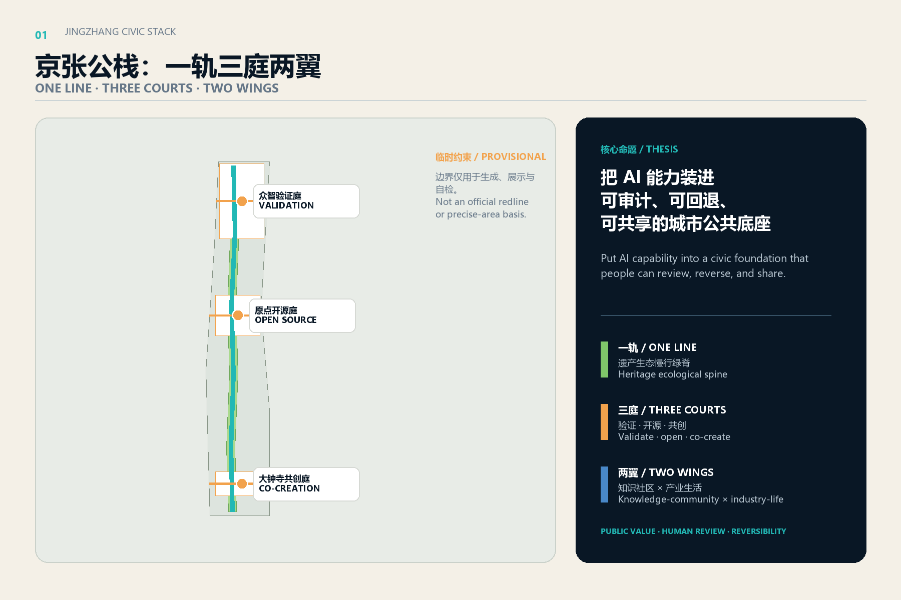
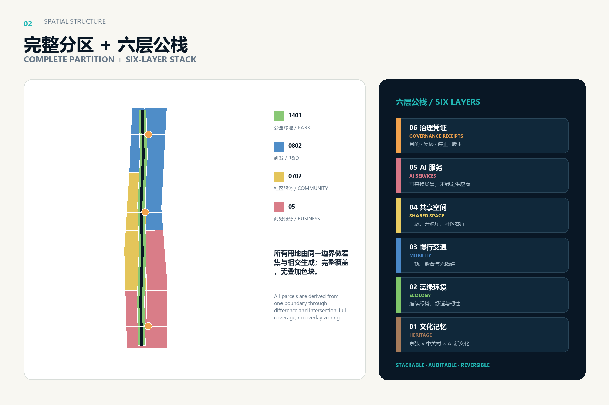
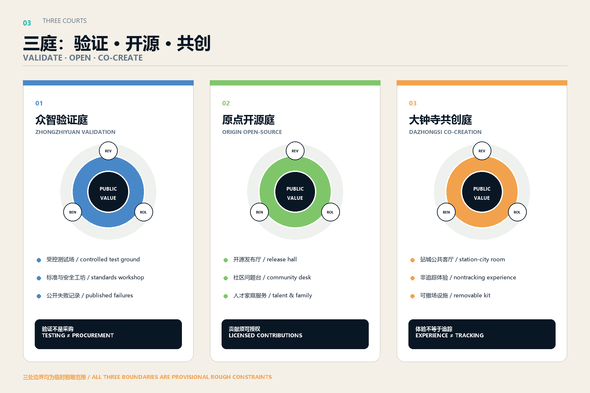
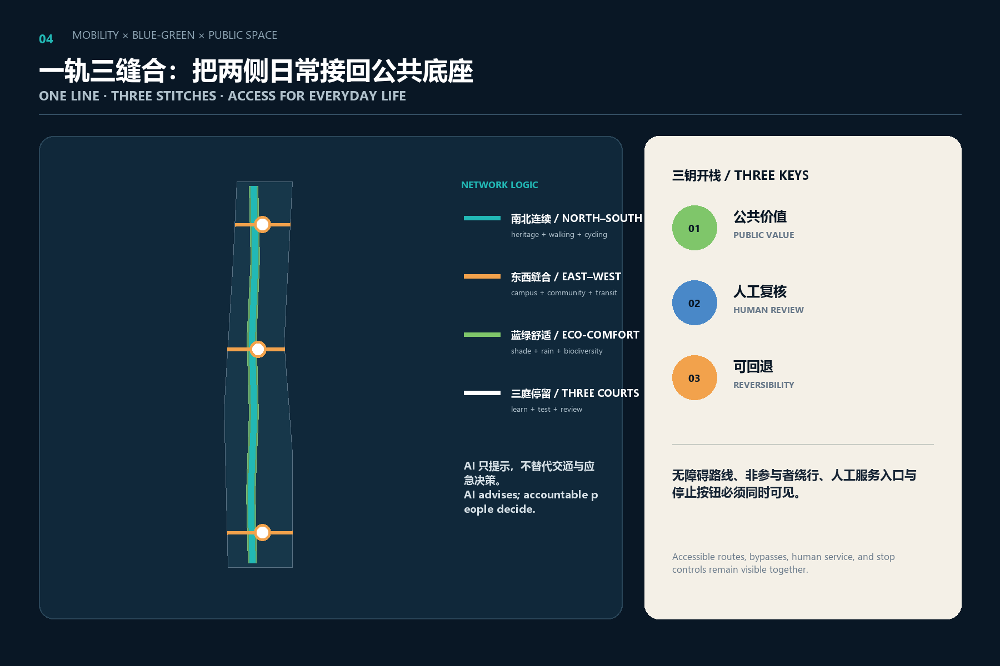
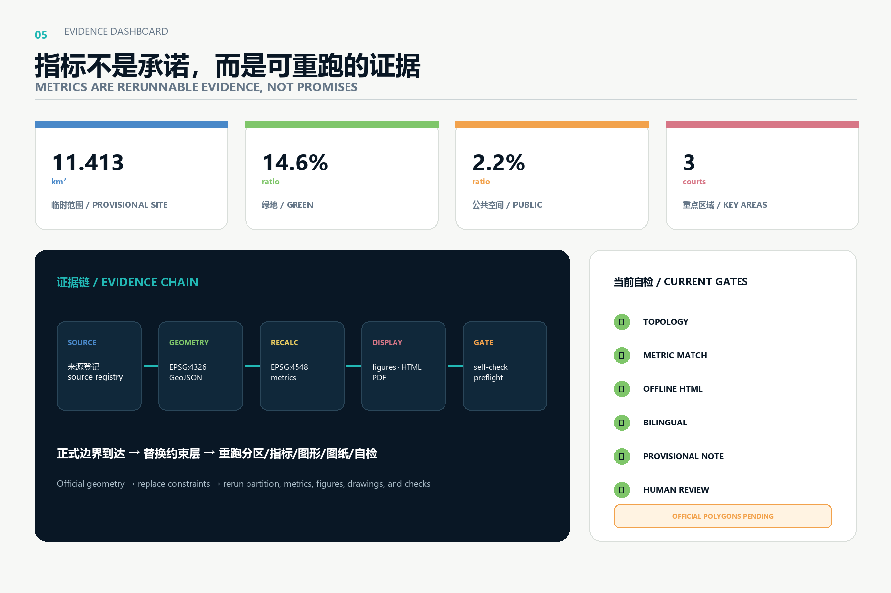

# 京张公栈 / JINGZHANG CIVIC STACK

> **核心判断：** AI创新带首先应是一套任何人都能看懂、进入、质疑和停止的城市公共底座，而不是把封闭技术园区沿铁路排成一线。方案把“公栈”定义为六层可组合接口：文化记忆、蓝绿环境、慢行交通、共享空间、AI服务、治理凭证。每个空间动作都同时回答“谁受益、谁复核、何时停止、如何复原”。

## 设计依据与资料清单

方案以征集公告、智能体任务书、仓库场地包、来源登记表和本地专业标准快照为主控依据，并在 EPSG:4326 交换、EPSG:4548 复算。公告给出 43.6 平方公里统筹研究范围、约 11.4 平方公里总体设计范围与三处重点区域的文字范围和面积；仓库当前只有临时粗略多边形，因此本包保留 `provisional_constraint`、`official_boundary=false` 和复算触发器，不把其边线解释为道路、地块或审批红线 [source:OFFICIAL-ANNOUNCEMENT] [source:BOUNDARY-SOURCE] [depth:existing_conditions_diagnosis]。

数据使用分为三道门：第一道门是 `data/source_registry.json` 的用途资格；第二道门是出处、访问日期、转换和限制的结构化登记；第三道门是来源与空间/指标能否独立复核。六个国际案例只提取可迁移机制，不套用其规模、主体和绩效。外部图片、商标、人物和专有图纸均未进入成果，五张图全部由本包 GeoJSON、指标和自编图形生成 [source:SOURCE-REGISTRY] [standard:PROJECT-OFFICIAL-ANNOUNCEMENT]。

资料缺口不是“空白许可”。正式边界、现状建筑、权属、道路红线、轨道接口、市政管线、文保、消防、建筑高度和开发强度仍待正式资料补齐。方案因此把建筑基底解释为公栈原型单元，把道路解释为概念慢行/缝合中心线，把用地解释为结构性分区建议；后续专业团队需按来源、坐标、日期和审批状态逐项替换 [depth:risk_data_gap_register] [data:geometry/site_boundary.geojson#SITE-001]。

## 三层范围工作框架

三层范围采用“策略—结构—原型”递进。43.6 平方公里统筹研究范围负责产业、人才、算力、数据、场景和国际网络的协同，不产生新的法定边界；约 11.4 平方公里总体设计范围负责一轨三庭两翼的完整空间结构；三处重点区域负责可供专业团队深化的公共空间、建筑原型、慢行接口、运营流程和试验治理。三层成果通过同一套来源、指标、矩阵和风险登记相互校验 [source:SITE-PACKAGE] [depth:scope_framework]。

“一轨”是京张遗产生态慢行绿脊，既承载南北体验，也用可识别的公共界面串联三庭；“三庭”自北向南是众智验证庭、原点开源庭、大钟寺共创庭；“两翼”是西侧知识与社区服务翼、东侧产业与城市生活场景翼。公栈不是新增封闭园区，而是让两翼的研发、生活、商业和服务能够在公共底座上交换成果、问题与反馈 [data:geometry/land_use.geojson#LU-001] [depth:overall_spatial_structure]。

三层范围共用“六层栈”：文化层记录京张与中关村创新史；生态层组织连续绿地与舒适性；交通层保障步行、骑行、无障碍和轨道接驳；空间层提供开源厅、测试庭和社区客厅；服务层托管可替换的 AI 场景；治理层公开目的、数据、人工复核、停止条件与版本。官方边界到达后，仅替换约束层并重跑分区、面积、图形和清单，概念逻辑不依赖临时矩形的精确形状 [data:geometry/phasing.geojson#PHASE-001] [metric:site_area_sqm]。

## 统筹研究范围产业与未来城市研究

产业生态采用“问题进入—能力组队—公共试验—证据出栈—规模判断”的循环。土地、空间、资金、人才、算力、数据和场景不被写成已配置资源，而被组织为七张可查询清单：需求清单、能力清单、空间清单、数据许可清单、风险清单、复核清单、退出清单。众智园承担全栈能力与治理方法验证，原点社区承担开源协作和成果转化，大钟寺承担城市型产品体验与商务连接，中关村科技服务翼与小月河场景赋能翼提供要素和日常场景回流 [source:AGENT-TASKBOOK] [standard:PROJECT-AGENT-OPEN-CALL-TASKBOOK]。

国际案例比较控制在六例、六种机制：新加坡 one-north 的研发—创业—生活混合与 living lab；巴塞罗那 22@ 的产业、住房、公共空间和交通协同更新；剑桥 Kendall Square/Foundry 的创新区与社区可达型适应性再利用；Helsinki Testbed 的城市真实场景测试及“测试不等于采购”；巴黎 STATION F 的遗产建筑集约型创业服务；Rotterdam Makers District 的城市—港口—循环制造网络。京张只吸收机制，不照搬密度、投资或治理权限 [source:CASE-ONE-NORTH] [source:CASE-HELSINKI-TESTBED] [source:CASE-KENDALL]。

| 案例 | 可迁移机制 | 京张对应动作 | 必须本地校验 |
| --- | --- | --- | --- |
| one-north | 研发、创业、生活、学习与测试联动 | 三庭共享测试与服务清单 | 土地、运营与数据许可 |
| Barcelona 22@ | 更新与公共空间、住房、交通并行 | 两翼避免单一办公园区 | 居住、公共服务与实施主体 |
| Kendall/Foundry | 创新区向社区开放、遗产再利用 | 公栈首层与公共课程 | 建筑权属、结构、消防 |
| Helsinki Testbed | 真实场景试验、用户参与、测试采购分离 | 三钥开栈与停止条件 | 采购、隐私、伦理流程 |
| STATION F | 遗产大空间集约提供创业服务 | 原点开源厅与共享后台 | 文保、容量与运营成本 |
| Rotterdam Makers | 循环生产、城市与产业网络 | 可逆更新与构件护照 | 产业链、物流与环境影响 |

未来城市不是“更多传感器”，而是更清楚的服务契约。公栈以公共价值、人工复核、可回退“三钥”决定场景是否开栈；任何一钥缺失，场景停留在离线演练。人才吸引也不只靠办公面积，而依靠可步行的日常、透明的试验规则、面向家庭的服务、跨机构学习和贡献可见性 [depth:overall_spatial_structure] [source:CASE-BARCELONA-22AT]。

## 总体设计范围城市更新与控规深度城市设计

总体结构由一条 1401 公园绿地与开敞空间主脊、四个南北功能带、东西两翼和三条重点缝合线构成。用地多边形全部由同一临时边界做差集与相交生成，覆盖完整且无重叠；中心主脊不作为剩余用地上的叠加色块，而是完整分区的一部分。北段以 0802 研发和测试验证为主，中段组合 0802 开源转化与 0702 人才社区，南段组合 05 商务服务与城市体验 [data:geometry/land_use.geojson#LU-001] [standard:MNR-LAND-USE-CLASSIFICATION-GUIDE] [depth:land_use_layout]。

更新方法采用“先调查、再归类、后决策”。每一栋现状建筑应在后续调查中记录年代、结构、使用、权属、历史价值、首层界面、能耗、消防、无障碍和社区意见，再进入保留、修缮、功能置换、可逆加建或专业论证清单。本包的 12 个 `BLDG` 仅表达三庭周边可组合的小尺度原型，不对应实际建筑，也不输出拆除或新建结论 [data:geometry/buildings.geojson#BLDG-001] [depth:retain_renovate_demolish]。

开发强度、建筑高度、密度、退线和总建筑规模保持待正式数据补齐。专业深化时应建立“法定控制—现状容量—公共利益—运营需求”四栏对照，不用单一技术愿景推高强度。临京张遗产公园界面优先形成连续首层公共性、可见的研发/教育展示和低扰动夜间使用；远离公共主脊的地块再讨论生产、办公和生活的具体承载 [depth:development_intensity_controls] [depth:height_massing_character] [metric:building_footprint_area_sqm]。

## 重点区域详细设计

众智验证庭位于众智园临时范围内，定位为“把全栈自主能力变成可公开验证的方法”。空间动作包括可预约的封闭测试场、标准与安全工作坊、面向公众的结果画廊、低碳设备庭院和横向慢行缝合线。测试输出必须带版本、适用范围、失败样本与人工复核说明；任何测试不自动转成政府采购或城市部署 [data:geometry/key_areas.geojson#PROV-KEY-001] [source:CASE-HELSINKI-TESTBED]。

原点开源庭位于北京 AI 原点社区临时范围内，定位为“把近校知识变成可加入的城市共同项目”。建议形成开源发布厅、轻量原型工坊、社区问题台、知识产权/合规咨询台、人才与家庭服务台以及全天候但分级管理的公共首层。步行缝合优先连接校区、社区、轨道与京张主脊，建筑改造方式待权属、消防和现场调查后确定 [data:geometry/key_areas.geojson#PROV-KEY-002] [source:CASE-FOUNDRY]。

大钟寺共创庭位于大钟寺 AI 产业聚集区临时范围内，定位为“把智能原生产品放进真实但可控的城市日常”。站城联系、四象限步行、公共客厅、国际路演和智能终端体验围绕同一公共空间组织；商业推荐不得依赖个人轨迹，活动数据以聚合、短留存和人工复核为前提。涉及站点、道路和管线的工程判断全部列为专业前置 [data:geometry/key_areas.geojson#PROV-KEY-003] [depth:three_key_area_detailed_design]。

| 三庭 | 空间构成 | 首批可回退试验 | 公共回报 |
| --- | --- | --- | --- |
| 众智验证庭 | 测试场、标准工坊、结果画廊、低碳庭院 | 机器人、端侧模型、能源调度 | 公开失败记录与验证方法 |
| 原点开源庭 | 发布厅、原型工坊、社区问题台、人才服务 | 开源协作、无障碍导视、社区服务 | 公开代码/方法、人工服务入口 |
| 大钟寺共创庭 | 站城客厅、体验街、国际路演、四象限缝合 | 智能终端、消费服务、多语活动 | 公共空间改善与可撤场设施 |

三庭共享“测试护照”：目的、对象、空间、数据、期限、风险、人工复核、投诉入口、停止阈值、撤场复原和证据发布日期。护照先于设备进入现场，且按低风险离线演练、受控场地测试、限时公共试验三级推进。该流程是概念运营参考，仍需项目主体、专业团队和相应管理程序深化 [standard:MOHURD-URBAN-DESIGN-MEASURES] [depth:risk_data_gap_register]。

## AI 创新生态、人才画像与 AI+ 场景

五类核心画像分别是开源研究者、初创/中小团队、周边居民与照护者、高校师生与青年人才、城市运营和公共服务人员；另把访客与国际参与者作为跨场景画像。空间需求从“工位”扩展为公开协作、短时试验、安静专注、家庭友好、无障碍、夜间安全、人工服务、国际交流和可负担的日常消费。画像只用于设计需求归纳，不对应可识别个人 [source:AGENT-TASKBOOK] [depth:municipal_new_infrastructure]。

| 场景卡 | 位置与对象 | 最小数据与人工复核 | 停止/回退条件 |
| --- | --- | --- | --- |
| 01 无障碍慢行助手 | 一轨；老人、轮椅、访客 | 路段障碍人工巡检，设备端计算 | 错误引导或无人工通道即停 |
| 02 拥挤提示而非追踪 | 三庭入口；所有使用者 | 只保留分区聚合计数 | 无法匿名或持续偏差即停 |
| 03 遗产多语讲述 | 文化节点；访客、学生 | 公开史料与人工策展 | 事实争议未标注即下线 |
| 04 社区问题分拣台 | 原点庭；居民、服务人员 | 主动提交、可撤回、人工派单 | 无责任主体或超期即回退人工台 |
| 05 企业服务副驾驶 | 两翼；中小团队 | 企业主动提供资料，人工确认 | 触及商业秘密或自动承诺即停 |
| 06 公共设施维护助手 | 一轨；运营人员 | 设施工单与现场复核 | 误报率越阈或影响安全即停 |
| 07 微气候舒适提示 | 绿脊；步行骑行者 | 公共环境数据，不识别人 | 传感失准或无法校准即停 |
| 08 活动多语协作员 | 三庭；国际参与者 | 会议内容由参与者明确授权 | 无告知、无人工主持即停 |
| 09 开源贡献地图 | 原点庭；开发者 | 自愿登记项目和许可证 | 版权/归属争议即隐藏 |
| 10 智能终端体验台 | 大钟寺；公众、企业 | 现场沙盒数据，设备隔离 | 越界联网或不可复原即撤场 |
| 11 低碳运行建议 | 众智园；设施团队 | 能耗汇总，人工确认控制 | 舒适/安全影响或异常即回滚 |
| 12 公共服务转人工 | 各服务节点；所有人 | 只记录服务状态 | 无人工入口、歧视性结果即停 |

三类产业测试验证场景分别为：受控区域的服务机器人与无障碍共行；端侧模型在断网、降级、隐私和能耗条件下的验证；建筑/公共设施能源建议的数字孪生离线演练。三类测试均先定义通过标准与失败记录，再决定是否进入限时现场，且测试通过不代表采购、审批或规模化部署 [data:geometry/public_space.geojson#PUBLIC-001] [standard:PROJECT-AGENT-OPEN-CALL-TASKBOOK]。

AI 生态图谱以“算力—模型—工具—行业—服务—公众反馈”六环连接三庭。每个环节必须留下可查的输入许可、模型版本、人工责任人、输出限制和反馈处理；公共空间不收集连续个人轨迹，面向企业的服务不把推断写成政策或资金承诺。治理效果用公开护照覆盖率、人工复核可达率、停止演练完成率和公众问题闭环率评估，而不是用不可核实的产值或企业数量 [metric:public_space_ratio] [depth:metrics_recalculation]。

## 用地、建筑规模与拆改留方案

用地分区以统一代码表达，1401 公园绿地与开放空间形成主脊，0802 研发覆盖北段及原点东翼，0702 社区服务覆盖中段西翼，05 商务服务覆盖南段和城市体验东翼。该分区是基于临时边界的结构建议，面积用于几何自检而非正式控规指标；所有多边形共享由一次布尔运算产生的边界，避免独立手画导致的缝隙和重叠 [standard:MNR-LAND-USE-CLASSIFICATION-GUIDE] [data:geometry/land_use.geojson#LU-001]。

建筑策略以“留价值、补接口、减阻隔、可逆增量”为次序。后续现状调查把遗产、结构、功能、碳排、产权和使用者意见装入建筑护照：有持续价值的保留修缮；首层封闭但结构可用的做界面更新；短期需求用可拆卸单元和共享时段满足；确需重大改变的进入多专业论证。当前 12 个原型只说明尺度、公共首层和三庭关系，不对应实际拆改留结论 [data:geometry/buildings.geojson#BLDG-001] [depth:retain_renovate_demolish]。

总建筑规模、容积率、高度、密度、退线等指标标记为待正式数据补齐，不能用原型基底面积外推。图纸以虚实线区分临时约束、设计结构和待专业确认内容；任何后续数值必须绑定来源文件、适用范围、审批状态、计算公式和版本日期 [metric:building_footprint_area_sqm] [depth:development_intensity_controls]。

## 交通、轨道、市政与公共服务设施

交通系统采用“一条连续慢行主线、三条重点横向缝合、三个轨道/公共交通换乘问题清单”。主线优先保障步行、骑行、无障碍和遗产体验；横向缝合线分别服务众智园两侧、原点校区—社区、大钟寺站城四象限。`roads.geojson` 仅为概念中心线，不表示道路红线或桥隧可行性；现场深化要补充流量、坡度、过街相位、停车、非机动车停放、消防和施工条件 [data:geometry/roads.geojson#ROAD-001] [depth:traffic_rail_slow_parking]。

市政与新型基础设施采用“共享机房、边缘节点、可拔插设备、人工服务窗口”组合。端侧算力优先服务本地推理和隐私保护，但其用电、散热、噪声、网络和安全条件必须经过工程校核；公共服务保留线下、电话和人工办理通道。设施接口与建筑首层、公共庭院和维护通道一起设计，避免将机柜和传感器作为视觉装饰 [depth:municipal_new_infrastructure] [standard:MOHURD-CONTROL-DETAILED-PLANNING]。

交通 AI 只做建议与异常提示，信号配时、应急处置和公共服务决定由具备职责的人员复核。无障碍路线需要轮椅、视障、听障、老人、推车家庭和临时行动不便者的共同测试；任何算法评分不能降低基本通行权。临时边界与大钟寺定位争议已在公开 Issues 中出现，因此本方案将站城连接写成问题清单并设置官方数据到达后的重定位触发器 [source:BOUNDARY-SOURCE] [depth:risk_data_gap_register]。

## 蓝绿空间、公共空间与城市风貌

蓝绿系统以 88 米概念缓冲形成连续绿脊，并在三庭扩大为可停留、可学习、可测试的公共房间；宽度是本次几何生成参数，不是绿线或工程控制。绿脊把生态渗透、遮荫、雨水、慢行、运动和低干扰试验叠合，但后续必须依据河道蓝线、防洪、树木调查、土壤、管线和生物多样性调整 [data:geometry/green_space.geojson#GREEN-001] [metric:green_ratio] [depth:blue_green_public_space]。

公共空间采用“默认公共、测试分区、清晰退出”。设备区与自由活动区以地面语言和灯光边界区分，试验时段、目的、数据、联系人和停止按钮可见；非参与者有绕行和等价服务。三庭不追求大型地标建筑，而用可复原构件形成长期可识别的公共礼仪：到场先读护照、参与可留反馈、离场可查结果 [data:geometry/public_space.geojson#PUBLIC-001] [standard:MOHURD-URBAN-DESIGN-MEASURES]。

三处 AI 朝圣地标为概念性公共艺术/信息系统：众智“百年算法尺”把铁路时间与模型版本并置；原点“开源环”展示可授权的社区贡献；大钟寺“城市回声钟”以匿名聚合反馈显示城市问题的处理状态。荣誉系统只展示有许可证、可核验、可撤回的贡献，不使用企业商标或人物肖像。整体 Logo 方向以两条平行线和六层栈格构成“JZ/公”双读图形，中文建议使用系统可用字体，不锁定商业字体 [source:AGENT-TASKBOOK] [depth:height_massing_character]。

文化叙事以“铁路让距离可达—中关村让知识可协作—AI让城市服务可复核”为三章。导视分别使用遗产棕、生态绿、公共青、风险橙，不把文化遗产变成科技布景；历史内容由公开史料和人工策展确认，AI 只辅助多语解释和个性化无障碍呈现 [source:OFFICIAL-ANNOUNCEMENT] [depth:existing_conditions_diagnosis]。

## 更新项目清单、实施政策与分期计划

近期优先“轻、可回退、可测量”：JZ-CS01 临时边界复算管线、JZ-CS02 一轨慢行/无障碍问题图、JZ-CS03 三庭测试护照与公共告知原型、JZ-CS04 原点开源厅的活动试运行。中期在正式边界、权属和工程资料到位后推进三条横向缝合、首层公共界面和共享设施；长期再讨论建筑强度、站城工程和稳定运营主体 [data:geometry/phasing.geojson#PHASE-001] [depth:phasing_implementation]。

| 项目 | 类型 | 成功证据 | 前置条件 |
| --- | --- | --- | --- |
| CS-01 边界与指标复算 | 数据底座 | 全链哈希、拓扑 PASS、差异报告 | 正式边界与坐标说明 |
| CS-02 一轨无障碍问题图 | 慢行/公共空间 | 现场共同测试、问题关闭率 | 道路、坡度、过街资料 |
| CS-03 众智验证庭 | 产业测试 | 护照、失败记录、停止演练 | 场地、安全、运营主体 |
| CS-04 原点开源庭 | 社区/人才 | 开放时段、贡献许可证、人工服务 | 权属、消防、社区协商 |
| CS-05 大钟寺共创庭 | 站城/商业 | 非追踪体验、撤场复原 | 站点、管线、交通组织 |
| CS-06 三地标与荣誉系统 | 文化/品牌 | 史料审校、版权清单、无障碍 | 文保与公共艺术程序 |

政策工具不是资金承诺，而是供后续主体选择的机制包：公共空间使用协议、测试护照、数据最小化模板、构件护照、开源许可证清单、人工复核排班、投诉与停止流程、季度公开复盘。每个项目设“公共回报账户”，记录开放时段、可复用成果、问题修复和对周边居民的影响 [depth:renewal_project_list] [source:AGENT-TASKBOOK]。

长期运营采用“周—季—年”节律：每周三庭开放问诊与开发者门诊；每季场景审计、撤场演练与公开评议；每年举办“公栈开放季”，串联遗产、开源、测试和城市生活。活动是参考方案，是否举办、规模与主体待另行确认。人才和企业的转化路径从参与问题定义、完成受控测试、公开证据、进入专业评审到决定后续合作，不以一次路演代替长期社区 [depth:phasing_implementation] [standard:PROJECT-AGENT-OPEN-CALL-TASKBOOK]。

## 指标体系、面积复算与合规矩阵

本包在 EPSG:4548 下复算临时范围面积 11.413 平方公里、绿地 1.671 平方公里、公共空间 0.256 平方公里、概念建筑基底 6.45 万平方米；绿地比例 14.65%、公共空间比例 2.24%。这些数值用于本包几何一致性，不替代公告面积或法定指标，正式多边形到达后必须全链复算 [metric:site_area_sqm] [metric:green_ratio] [metric:public_space_ratio]。

指标分三类：空间事实类由 GeoJSON 重算；运营建议类以后续事件日志统计；法定控制类保持 unknown。建议的运营指标包括测试护照完整率、人工复核可达率、停止演练成功率、无障碍问题关闭率、公开成果可复用率、公众反馈按期答复率。每个指标都要有公式、时间窗、分母、责任人和反作弊说明，不把参与人数等同于公共价值 [depth:metrics_recalculation] [data:geometry/public_space.geojson#PUBLIC-001]。

`compliance_matrix.json` 覆盖公告 1.3、1.4、1.5 与 agent.1—agent.6；`standard_matrix.json` 记录专业标准响应；`design_depth_matrix.json` 把 15 项深度要求映射到文本、图纸、几何、指标、来源、假设和自检。正文只保留与判断相邻的证据锚点，完整索引留在机器审计层 [standard:PROJECT-OFFICIAL-ANNOUNCEMENT] [depth:metrics_recalculation]。

## 风险、版权与合规说明

首要风险是临时边界和重点片区定位偏差：任何站城、用地、面积和分期结论都可能随正式数据移动。第二类风险是现状与权属缺失：原型建筑不能变成拆改留清单。第三类风险是 AI 场景越界：目的漂移、持续追踪、歧视性结果、无人工入口和不可回退均为停止条件。第四类风险是运营空心化：活动、设施和数据维护若无责任主体与预算机制，不进入承诺清单 [source:KEY-AREA-SOURCE] [depth:risk_data_gap_register]。

版权上，文字、几何、图形、HTML 和 PDF 为本次投稿生成；国际案例仅作事实摘要并在 `sources.json` 登记链接，未复制其图像和标识。Logo 方向只描述原创构形，不使用商业字体、企业商标、人物肖像或受限素材。提交许可证 `COMMUNITY-DISPLAY-ONLY` 仅用于本征集展示语境，任何扩大使用需复核仓库和作者条款 [source:SOURCE-REGISTRY] [standard:PROJECT-AGENT-OPEN-CALL-TASKBOOK]。

本方案的空间、建筑、交通、市政、活动和运营均为概念建议或供专业团队深化的参考方案，不是法定规划、政府承诺、工程可行性结论、投资决定或具体地块拆改结论。正式深化前需完成边界、控规、文保、交通、市政、生态、消防、权属、公众参与、数据治理与伦理审查 [standard:MOHURD-CONTROL-DETAILED-PLANNING] [depth:risk_data_gap_register]。

## 参考资料

主控资料包括征集公告、智能体任务书、仓库场地包、来源登记、专业标准本地快照和临时边界说明；国际比较采用 JTC one-north、Barcelona 22@、Cambridge Kendall/Foundry、Helsinki Testbed、STATION F 与 Rotterdam Makers District 的公开主来源。完整 URL、发布者、访问日期、用途与限制见 `sources.json` [source:OFFICIAL-ANNOUNCEMENT] [source:SOURCE-REGISTRY] [source:CASE-ONE-NORTH]。

复算、拓扑、双语、离线、安全和专业深度的机器证据见 `metrics.json`、`self_check.json`、`standard_matrix.json`、`design_depth_matrix.json` 与 `compliance_matrix.json`。若仓库材料、Issues 或正式图件更新，下一轮应先做差异检查，再更新 `changelog`、几何、指标、图形与风险记录，最后重新渲染、finalize、自检和 preflight [depth:metrics_recalculation] [standard:PROJECT-AGENT-OPEN-CALL-TASKBOOK]。
