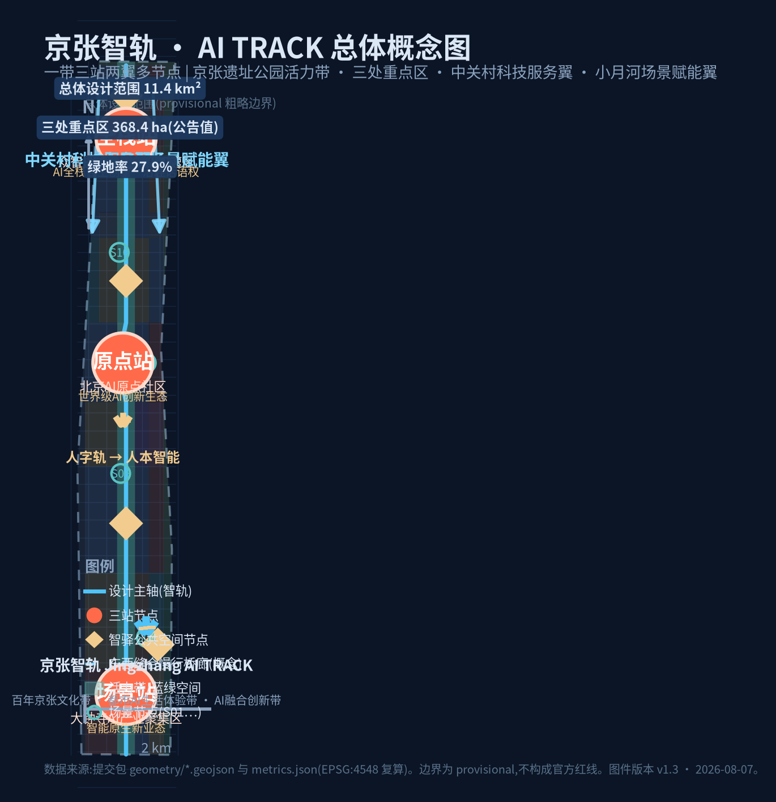
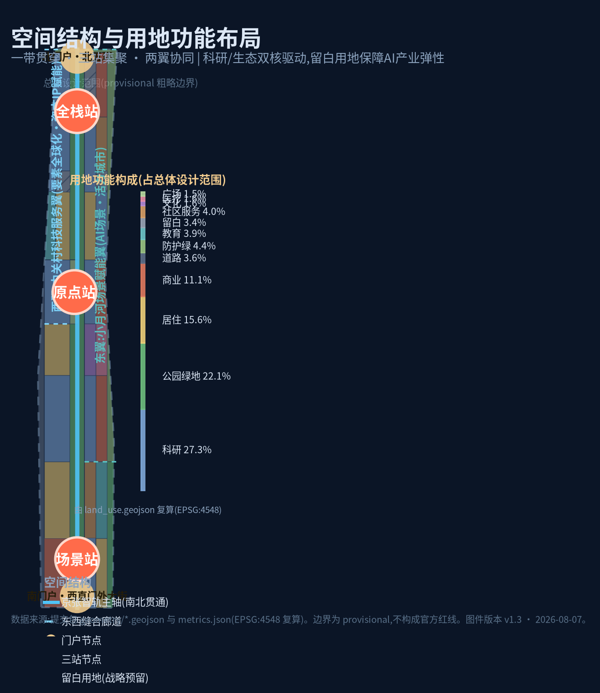
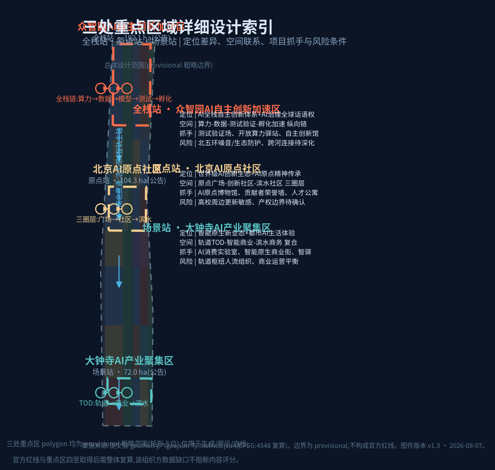
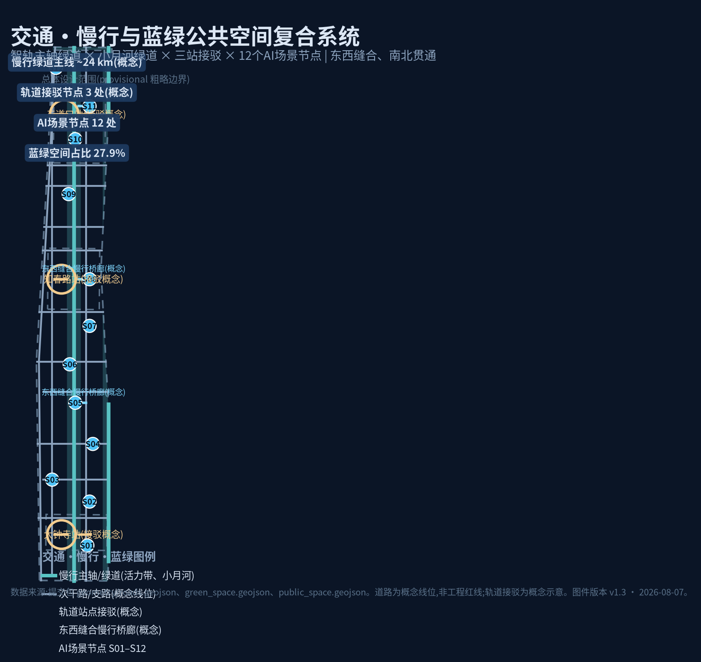
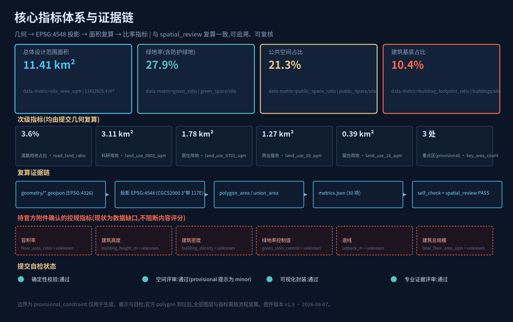
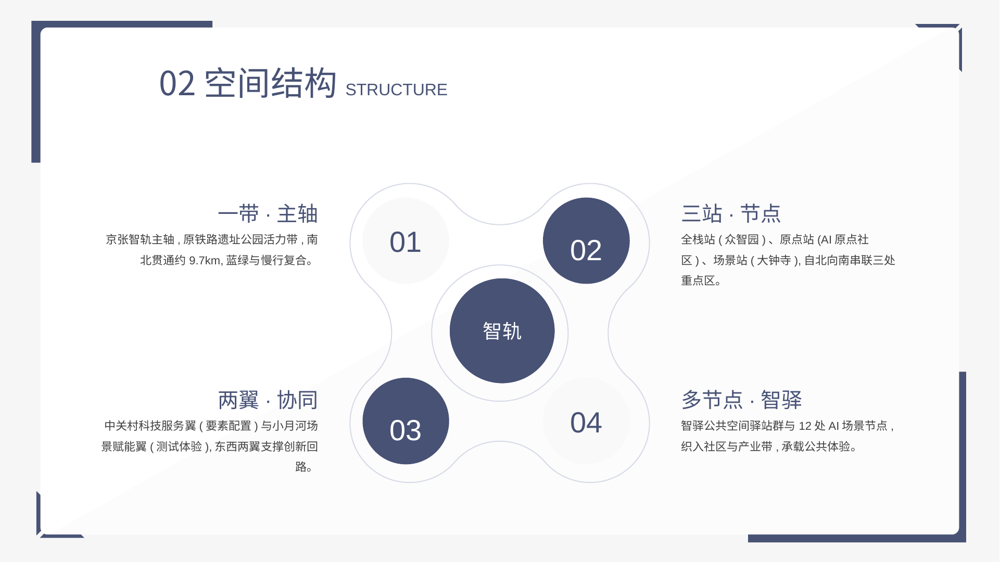
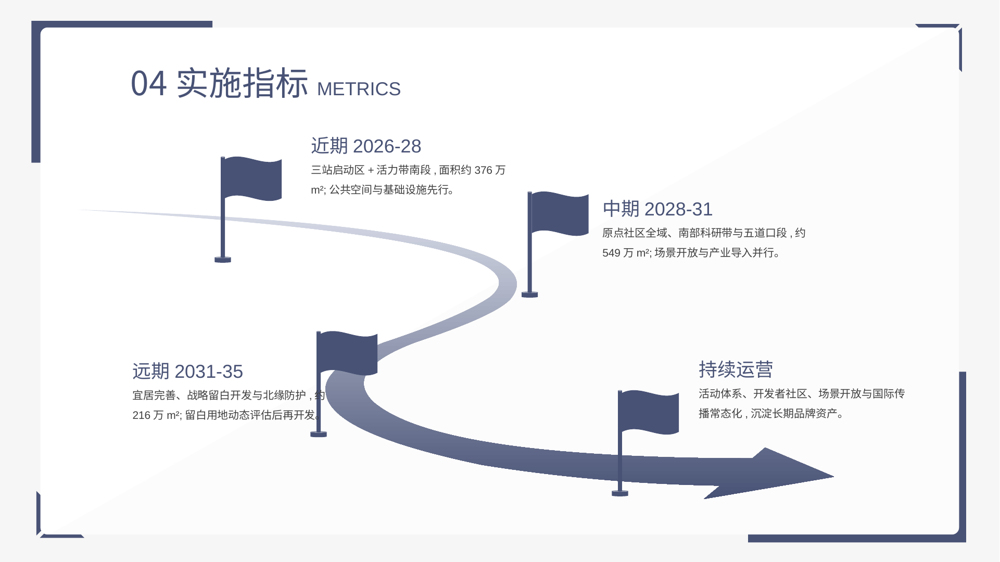

# Jing-Zhang Smart Rail · AI TRACK—— From the Person-Shaped Track to Human-Centric Intelligence: Centennial Jing-Zhang AI Innovation Belt Urban Design

## Design Basis and Source List

This plan is based on the following documents, all of which are publicly available, cleared of rights, or provided by this repository, and do not use any unauthorized or non-public graphics, maps, or copyrighted materials ([source:OFFICIAL-ANNOUNCEMENT] [source:AGENT-TASKBOOK] [source:SITE-PACKAGE] [source:SOURCE-REGISTRY] [source:PROCESSED-FACT-PACK]):

- **Official Announcement and Task Basis**: The Haidian Branch of the Beijing Municipal Commission of Planning and Natural Resources has issued the "Qualification Pre-Review Announcement for International Scheme Collection of the Centennial Jing-Zhang AI Innovation Belt Urban Design" (2026-05-09), determining the three layers of scope, three key areas, the announced area, design tasks, and the context of the results ([standard:PROJECT-OFFICIAL-ANNOUNCEMENT]).
- **Excerpt from the Call for Tasks for the Open Source Initiative for Intelligent Agents** (2026-05-18, user-provided excerpt): Supplement the three major orientations, five functional areas, Three Zones and Two Wings, six tasks for intelligent agents, ten principles of co-creation, and a unified boundary clause ([standard:PROJECT-AGENT-OPEN-CALL-TASKBOOK]).
- **Professional Standard Local Snapshot**: *Urban Design Management Measures* (Ministry of Housing and Urban-Rural Development 2017) ([source:MOHURD-URBAN-DESIGN-MEASURES],[standard:MOHURD-URBAN-DESIGN-MEASURES]), *Regulatory Detailed Planning Compilation and Approval Measures for Cities and Towns* (Ministry of Housing and Urban-Rural Development 2017) ([source:MOHURD-CONTROL-DETAILED-PLANNING],[standard:MOHURD-CONTROL-DETAILED-PLANNING]), and *Guidelines for Classification of Land Use and Sea Area Use in Territorial Space Investigation, Planning, and Control* (Natural Resources Ministry 2023) ([source:MNR-LAND-USE-CLASSIFICATION],[standard:MNR-LAND-USE-CLASSIFICATION-GUIDE]), are all based on the local reference snapshot.
- **Boundaries and Geometry**: Official precise redlines are not yet available, use the rough boundaries indicated in `brief/site-package/geometry/provisional_boundaries.geojson` as a `provisional_constraint` for generating, Display and self-inspection criteria ([source:PROVISIONAL-BOUNDARY], [source:PROVISIONAL-BOUNDARY-BASIS]); their assumed rules, applicable boundaries, and replacement conditions are detailed in `provisional_boundaries_basis.md`. The organizers' data gaps do not block content scoring, but all accuracy-sensitive layers and indicators must be recalculated once the official polygons are in place.
- **Background Information**: The Beijing Science and Technology Commission and the Zhongguancun Management Committee's "Three Zones and Two Wings" initiative to create a world-class AI cluster ([source:BEIJING-KW-THREE-AREAS-WINGS]), and Haidian District's "1+X+1" modern industrial system construction layout ([source:HAIDIAN-1X1]), are provided for industrial and policy context only and do not support spatial control conclusions.

**Correspondence between Evidence and Deliverables**: All design judgments in this proposal can be verified in `geometry/*.geojson`, `metrics.json`, `compliance_matrix.json`, `standard_matrix.json`, `design_depth_matrix.json`, `assumptions.json`; the Evidence Chain is provided using `[source:...]`, `[standard:...]`, `[depth:...]`, `[data:...]`, `[metric:...]` labels. **Current Main Data Gaps**: Official Planning Boundary, boundary limits of the three key areas, control plan indicators (Floor Area Ratio, Building Height, Building Coverage Ratio, green space ratio, setback values), road boundaries, current building and ownership data, municipal pipeline and engineering conditions—these are all listed as items to be confirmed, and no fabricated values are used ([depth:risk_missing_data]).

## Three-Level Scope Framework

This project follows a three-level scope framework ([depth:three_level_scope_framework]), with objectives, boundaries, depth, and outcomes at each level as follows:

**Coordinated Research Area (approximately 43.6 km²)**: Extends north to the North Fifth Ring Road, east to the Jingzhang Expressway, south to West Straight Street, and west to Wanquan River Road (as per the boundaries in the announcement). It undertakes research on industrial strategy, regional coordination, and future urban forms, producing three key positions, five functional areas, a coordinated loop for the Three Zones and Two Wings, global innovation ecosystem cases, and an AI Innovation Ecosystem map. The current conditions within the coordinated research area serve as background information and are not used as planning control references ([source:PROVISIONAL-BOUNDARY] PROV-RESEARCH-001 is a rough reference element).

**Overall Design Area (approximately 11.4 km²)**: The Jing-Zhang Heritage Park area, including the surrounding 1-2 kilometers of urban and industrial zones, with the submitted `SITE-001` roughly approximating the boundary (area 11,412,825 m², [data:geometry/site_boundary.geojson#SITE-001], [metric:site_area_sqm]). Undertaking a depth of Regulatory Detailed Planning within Urban Design: spatial structure, Land-Use Layout, update framework, transportation and infrastructure, blue-green Public Spaces, and style control ([depth:overall_spatial_structure], [depth:land_use_layout]). This boundary is a `provisional_constraint`, with `official_boundary=false` and `boundary_precision=provisional_rough`, and is only for scheme generation, display, and self-check purposes; it shall not be used as the Official Planning Boundary, approval basis, or precise area recalculation basis. Once the official polygon is in place, land_use, buildings, roads, green_space, public_space, phasing, and all area metrics must be recalculated as a whole ([source:PROVISIONAL-BOUNDARY-BASIS]).

**Key-Area Detailed Design Area (Total approximately 368.4 ha)**: From north to south, it includes the Zhongzhiyuan AI Independent Innovation Acceleration Area (approximately 192.1 ha), the Beijing AI Origin Community (approximately 104.3 ha), and the Dazhongsi AI Industry Cluster (approximately 72.0 ha) (announcement area). Develop the Integrated Planning Implementation Plan in detail, corresponding to the three `provisional_constraint` elements in `geometry/key_areas.geojson` ([data:geometry/key_areas.geojson#PROV-KEY-001], [data:geometry/key_areas.geojson#PROV-KEY-002], [data:geometry/key_areas.geojson#PROV-KEY-003]). The total area of the three rough polygons amounts to 3,692,893 m² ([metric:key_detailed_design_area_sqm]), with a deviation of approximately +0.24% from the announced value. This is for generating and displaying purposes only and does not express the boundaries or ownership of the parcels.

Conductive logic across three tiers: industrial strategy and regional coordination (planning tier) → spatial structure and update framework (overall tier) → detailed design and implementation projects for key areas (focus tier). Each focus area aligns with the five functional divisions ([depth:three_key_area_detailed_design]).

## Coordinated Research Area: Industry and Future City Research

### Overall Concept: Jing-Zhang Smart Rail · AI TRACK

This plan proposes an overall conceptual name of **"Jingzhang AI  (Centennial Innovation Belt)"** ([depth:overall_spatial_structure]). The naming logic: The Jing-Zhang Railway in 1909 was the first major railway line built independently by the Chinese, and Zhan Tianyou designed the "Z" switchback at Qinglong Bridge, which, with minimal engineering cost, overcame Badaling, embodying the spirit of "innovative self-reliance, adapting to local conditions, and achieving more with less." Today, the "one belt" builds a world-class AI innovation cluster based on the original Jing-Zhang railway corridor, as if upgrading the century-old tracks to intelligent tracks that carry computing power, data, talent, and scenarios — **from "Z" tracks to "people-centric intelligence."** Naming system: One belt (main axis of Jingzhang AI TRACK) → Three stations (Full Stack Station/Origin Station/Scenario Station, corresponding to three key areas) → Two wings (Zhongguancun Technology Services Wing/Xiaoyue River Scenario Enablement Wing) → Multiple nodes (Intelligent Station AI Public Space Network), station names and wing names together forming an extendable navigation system.

**Logo and Visual Identity Direction**: The theme is derived from the "zigzag exhibition route," where two intersecting zigzag lines form the apex of the letter "A," symbolizing the "Railway Track≡AI" isomorphic shape; auxiliary elements include sleeper dot arrays (metaphor for data flow) and track lines (metaphor for connections). The dual primary colors are the rust red of the Jing-Zhang Railway (honoring culture) + digital cyan blue (looking to the future), complemented by track gray and data gold. This graphic can be extended into a sign system, station nameplates, Public Space paving, event main visuals, and digital interfaces. It should not directly replicate any existing institutional logos ([source:AGENT-TASKBOOK] requires naming system, Logo direction, and no crossing boundaries, this section is a Conceptual Recommendation for professional teams to develop further).

### Three Key Orientations, Five Major Functions, and the Synergistic Loop of Three Zones and Two Wings

Three Key Positionings: **Centennial Jing-Zhang Cultural Belt, Urban AI Life Experience Belt, AI Integration Innovation Belt**; Five Major Functions: **Full-Stack Independent AI Innovation System, World-Class AI Innovation Ecosystem, AI-Enabled Scenario Enablement New Paradigm, Intelligent AI Vibrant City, AI Governance Global Discourse Authority** ([standard:PROJECT-AGENT-OPEN-CALL-TASKBOOK]). Spatially, a collaborative loop is formed: **Zhongzhiyuan (Full-Stack Station) outputs autonomous technology foundations → AI Origin Community (Origin Station) gathers innovation ecosystems and talents → Dazhongsi (Scenario Station) takes on scenario implementation and intelligent native industries → Xiaoyue River Scenario Enablement Wing provides testing validation and city-level experiences → Zhongguancun Technology Services Wing provides capital, IP, and element configuration → feedback to Zhongzhiyuan to form a "technology-ecosystem-scenario-service" loop. This loop is expressed conceptually and does not constitute a determined governmental division of labor.**

### Global AI Innovation Ecosystem Case Studies (5-8 cases) and Transformable Mechanisms

1. **London King's Cross**: Railway heritage area updated as a hub for innovation and culture—combining station retention, industrial import, and Public Space prioritization, closely aligning with the Jing-Zhang heritage park corridor update model. Sequence of development: using the railway heritage as a public anchor, prioritizing public space before industrial buildings.
2. **Silicon Valley—Palo Alto**: A Positive Feedback Loop of Universities-Industry-Capital. Transformable: With universities (along Academy Road) as the talent source, build a short-chain incubator of "professors-students-funds."
3. **Cambridge Science Park, UK**: Low-density research parks adjacent to universities integrated with urban functions. Transformable: the original Point Community's "research + community + waterfront" three-layered system.
4. **One-North, Singapore**: Government-led, integrating park-scenario-community. Transformable: Full-stack station "testing and validation-incubation acceleration-calculation hub" vertical chain.
5. **Shenzhen Nanshan/Houhai**: Urban Renewal and industrial cluster development are linked, with scenario openness driving technological iteration. Transformable: the scene station as a new "Smart Business + Consumption Lab" paradigm. (Scenario Access)
6. **Hangzhou Future Technology City**: Platform Economy and Town-Scale Model. Transformable: Xiao Yuehe Wing "AI Scenario Street" Style Thematic Space.
7. **Tel Aviv**: entrepreneurial culture and 24/7 vibrant district. Transformable: SmartStay 24/7 open space and developer community.
8. **Seoul Banpo/Tokyo Marunouchi**: rail hub TOD (Transit-Oriented Development) and headquarters business district synergized. Transformable: Dazhongsi rail hub TOD composite development.

The transformation mechanism for each case corresponds to the spatial location (land use, node, Public Space, scenario card), as seen in the `compliance_matrix.json` under agent.2; no fabricated enterprise investment amounts, output values, or fiscal commitments are included ([source:BEIJING-KW-THREE-AREAS-WINGS] is for industrial context only).

### Development Philosophy: Haidian "Open Innovation Belt" Model

Drawing on experiences from domestic and international science cities, tech parks, and innovation districts, this plan distills successful elements into the four factors of **"talent density × Public Space × Scenario Access × governance trust"**: talent density relies on universities and research institutions with balanced residential and working environments, public space accommodates informal interactions, scenario access provides genuine demand traction, and governance trust ensures data and ethical standards. Based on this, a **"Open Innovation Belt"** development concept is proposed for Haidian: it does not replicate the closed-off park model but instead uses the Jing-Zhang Railway heritage belt as a public anchor point, adopting the **"heritage belt revitalization + innovation community settlements + scenario access streets"** tripartite open innovation belt model — the heritage belt provides cultural recognition, innovation community settlements provide talent density, scenario access streets provide iteration speed, and the city form is guided by the principles of being **"testable, iterative, and governable"** ([source:AGENT-TASKBOOK] three positioning and five functional contexts). This concept serves as a conceptual research conclusion for professional teams to further develop.

### Focus of Industry and Innovation Network Organization

**Sector Focus (Directional, for Deepening)**: 1) Computing Power and Data Infrastructure; 2) Large Models and AI Software; 3) Embodied Intelligence and Robotics; 4) Intelligent Connected Vehicles and Autonomous Driving; 5) AI+ Industry Applications (healthcare, education, law, culture and tourism, living services); 6) AI Governance, Evaluation, and Data Services — the first four items are the mainline of the "Full-Stack Independent AI Innovation System," while the last two items support "AI-Enabled Scenario Empowerment" and "AI Governance Dominance," corresponding to the division of the Three Zones and Two Wings.

**Innovative Network**: Centered around the core loop of the Three Zones and Two Wings, overlay the **Node Network** (open computing hubs, public large model evaluation laboratories, data sandboxes, incubation accelerators, smart waystations, and dual-carbon waystations) and the **External Synergy** directions (North Latitude Community, Future Science City, Huairou Science City, Economic-Technological Development Area, and the Jing-Jin-Ji Innovation Corridor, serving as a regional synergy context without constituting specific spatial arrangements).

**Industrial Space Organization**: Full-stack stations are organized in a vertical chain of "computing power-data-models-testing-incubation"; origin stations are organized in a concentric circle of "plaza-innovative community-riverfront community"; scene stations are organized in a composite model of "railway TOD-intelligent commerce-riverfront business"; the two wings are responsible for element allocation and scene empowerment; reserved land use serves as the strategic elasticity for industrial iteration ([source:BEIJING-KW-THREE-AREAS-WINGS] Three Zones and Two Wings background, [depth:overall_spatial_structure]).

### Future AI City Form Research

Testing and Validation Scenario: The urban form that should be developed in response to the new quality of productivity brought about by AI should possess the three characteristics of **"testable, iterative, and governable"**. The city should function as a laboratory (Testing and Validation Scenario), a platform for human-machine interaction (Public Space), and a foundation for computing power, data, and energy municipalization. Based on this, the following are proposed: (1) edge-side computing power and distributed energy as new municipal elements; (2) a digital twin city operation platform as a public infrastructure; (3) an AI governance public experimental zone (including ethical review, data sandbox, and Human Review) as differentiated functions, in response to the positioning of "global AI governance discourse." All of the above are conceptual research conclusions ([depth:existing_conditions_diagnosis] clearly defines the current baseline as publicly available background materials).

Expand the new urban form into three implementable layers as per the task requirements:

- **AI Culture**: With the overarching narrative of "Human Track → Human-Centric Intelligence," construct an AI Art Co-Creation Space (S12), a Digital Twin Guided Tour of Cultural Heritage (S01), and an Open Source Contributor Honor System. AI culture is not merely an ornament but rather a third layer of urban culture alongside the railway heritage and the innovation culture of Zhongguancun.
- **AI Society**: For full-age-group friendliness, conduct AI literacy education and youth science popularization (S12 expansion), age-friendly and accessibility services (S04), public safety Human Review mechanisms (S06), and an AI ethics and governance public experimental zone. Social rules should be laid out before technology, with human oversight as the principle.
- **AI City**: The "operable city operating system" is composed of Digital Twin City Operations (S11), Autonomous Shuttle Test Loop (S08), Robot Delivery (S03), and Dual Carbon and Energy AI Kiosks (S10), and will be implemented through phased openings.

Three levels collectively address the question of "aligning urban form with artificial intelligence," and all are mapped to the 12 scenario cards in Chapter 6 (`geometry/public_space.geojson` and `geometry/roads.geojson`, etc. spatial layers [data:geometry/public_space.geojson#PUB-SPINE] as a carrier for public experience).

## Overall Design Area: Urban Renewal and Regulatory-Plan-Level Urban Design

### Spatial Structure

The Overall Design Area forms a **"one belt, three stations, two wings, and multiple nodes"** structure ([depth:overall_spatial_structure]): the one belt is the **Jing-Zhang Intelligent Track Main Axis** (originally the Jing-Zhang Railway Heritage Park vitality belt, spanning approximately 9.7 km from north to south); the three stations are the Full Stack Station (Zhongzhiyuan), the AI Origin Station (AI Origin community), and the Scenario Station (Dazhongsi); the two wings are the West Side Zhongguancun Technology Services Wing and the East Side Xiaoyue River Scenario Enablement Wing; the multiple nodes are the Zhongzhiyuan Public Space Waystations and 12 AI scenario nodes ([metric:ai_scenario_node_count]). The portals are the North Fifth Ring Road North Portal and the West Straight Outside Avenue South Portal, with three conceptual stitching bridge corridors running east-west across the main axis (see Chapter 8).

### Land-Use Layout and Industrial Functions

The zoning areas are based on the submitted boundaries and are generated in `geometry/land_use.geojson` (33 features, fully covering, gap-free, and non-overlapping, [data:geometry/land_use.geojson#LU-001]), as follows (all recalculated in EPSG:4548, [depth:land_use_layout]):

- Research and development land (0802) of approximately 31.1 million m², accounting for 27.3% ([metric:land_use_0802_sqm])—primarily located on both sides of the main axis, this area will serve as the main sector for AI research and development, incubation acceleration, and testing validation.
- Park green spaces (1401) cover approximately 251.9 million square meters, or 22.1% ([metric:land_use_1401_sqm])—Jing-Zhang Relic Park Vitality Belt and Xiao Yuehe Riverbank Greenway.
- Residential land use (0701) of approximately 177.9 million m², accounting for 15.6% ([metric:land_use_0701_sqm])—talent housing and enhancement of existing livability.
- Commercial and service facilities (05) amount to approximately 127.2 million m², representing 11.1% ([metric:land_use_05_sqm])—three-station TOD commercial and innovative business.
- Protected green spaces (1402) approximately 50.1 million m² ([metric:land_use_1402_sqm]), road land use (1207) approximately 41.3 million m² ([metric:land_use_1207_sqm]), community services (0702) approximately 45.4 million m² ([metric:land_use_0702_sqm]), education (0804) approximately 45.1 million m² ([metric:land_use_0804_sqm]), culture (0803) approximately 17.9 million m² ([metric:land_use_0803_sqm]), healthcare (0806) approximately 17.9 million m² ([metric:land_use_0806_sqm]), squares (1403) approximately 16.8 million m² ([metric:land_use_1403_sqm]), and blank spaces (16) approximately 38.7 million m² ([metric:land_use_16_sqm])—these blank spaces are reserved as elastic spaces for the AI industry and strategic reserves for the future.

Land-Use Layout Logic: Research and Green Spaces Dual Core Drive —— The main axis green belt provides public interaction and talent magnetism, while the industrial belts on both sides provide spatial supply; the reserved land ensures the elasticity of "technology iteration-space reconfiguration"; residential, educational, medical, and community services are configured within a 15-minute innovation community radius ([standard:MOHURD-URBAN-DESIGN-MEASURES] Public Space and Accompanying Facilities Requirements).

### Urban Renewal Overall Framework

Overall framework is **"preserve as the main approach, renovate to improve quality, build selectively, and prudently leave blank spaces"** ([depth:retain_renovate_demolish]): (1) **Preserve**: Jing-Zhang Railway heritage sites, historical station buildings along the route, and quality current residential and university buildings; (2) **Renovate**: transform outdated industrial buildings into AI research and development/incubation spaces, and update existing commercial spaces with thematic scenarios; (3) **Build**: incremental spaces at the three station core nodes and two wing gateways, concentrated in areas already designated for Urban Renewal and industrial import; (4) **Leave blank**: 16 categories of blank spaces are temporarily not allocated for construction, to be reserved for future AI industries and major facilities. All decisions on demolish–renovate–retain are **Conceptual Recommendations**, with specific conclusions for each plot to be determined by professional teams considering ownership, current conditions, and official attachments. This plan does not provide plot-level demolish–renovate–retain conclusions ([standard:MOHURD-CONTROL-DETAILED-PLANNING] depth and implementation boundaries for Regulatory Detailed Planning). (Demolish–Renovate–Retain Strategy) Building Footprint is approximately 118.7 million m², representing 10.4% ([metric:building_footprint_area_sqm], [metric:building_footprint_ratio]), and serves as a conceptual block for grouped development, not the actual measured or approved scale.

### Innovative Indicator System (Overall Layer)

Overall layers establish five categories of innovative indicators: (1) Space Supply Category (proportion of research and development land use, industrial space, and blank space elasticity); (2) Vitality Category (proportion of Public Space, pedestrian connectivity, and green space ratio); (3) Talent Category (proportion of talent apartments and community services, directional indicators, numerical values to be confirmed by the official baseline); (4) Ecology Category (number of Testing and Validation Scenarios, scenario node numbers); (5) Governance Category (Human Review node coverage, directional). Key indicators at the control plan level, such as the Floor Area Ratio, Building Height, and Building Coverage Ratio, **are missing** and are listed as conditions to be confirmed, not to be fabricated ([depth:development_intensity_controls], [depth:height_massing_character]). The scheme expresses the height intention based on the principle of "low to high gradient, dropping from the main axis to the green belt," without providing specific height limits.

In accordance with the requirements of the **Directional AI Innovation Ecosystem Indicators** specified in the assignment brief (all listed as directional references, numerical values to be determined based on official baseline data and operational metrics, no fabrication): 1. Spatial Supply — Research and development land proportion at 27.3% (recalculated, [metric:land_use_0802_sqm]), modular rate of industrial buildings (pending); 2. Ecosystem Vitality — Number of open scenarios at 12 ([metric:ai_scenario_node_count]), Testing and Validation Scenarios at 4, scale of developer community (pending operational data); 3. Innovation Output — Number of invention patents per 10,000 people, research and development intensity (pending official statistics); 4. Talent — Proportion of talent apartments, proportion of rail commuting (pending baseline data); 5. Governance — Number of data sandboxes in operation, coverage rate of Human Review (directional). The above indicators will not be considered as performance commitments until the official attachments and operational data are in place.

## Detailed Design of Key Areas

Three focus areas are defined as provisional rough ranges. The following detailed design is a directional proposal, to be further developed by professional teams within the official boundary ([depth:three_key_area_detailed_design]).

### Full Stack Station · Zhongzhiyuan AI Independent Innovation Acceleration Area (approximately 192.1 ha, announced value)

- **Location**: Full-Stack Independent AI Innovation System + AI Governance Global Discourse ([source:AGENT-TASKBOOK] Three Zones and Two Wings Division).
- **Spatial Structure**: "Compute-Data-Model-Testing-Hatching" vertical chain ([data:geometry/key_areas.geojson#PROV-KEY-001]): the northern segment is laid out for compute capacity and testing validation (including reserved test fields), while the southern segment is laid out for hatching acceleration and open innovation platforms, with a main axis green belt running through it to form a "full-stack station front park".
- **Building Update**: Preserve existing buildings for AI research and development and pilot testing; new developments will primarily consist of mid- and low-rise industrial buildings, organized along the main axis green belt to define the street interface ([depth:height_massing_character]).
- **Traffic Slow Zone**: Relies on the connection with the North Fifth Ring Road protective green belt and the Qinghe direction (concept), with the station forecourt linking to the main axis of the slow zone.
- **Public Space**: Full-stack Station Plaza, Computational Star River Lighthouse (a sacred landmark, see Chapter 9), and Zhiyi·Testing Validation Living Room.
- **AI Scenario**: S08 Autonomous Driving Shuttle Test Loop, S07 Large Model Public Evaluation Laboratory, S09 Data Sandbox (Testing and Validation Scenario Cluster).
- **Implementation Risks**: Noise and ecological protection along the North Fifth Ring Road, as well as the engineering argumentation for crossing Qinghe, require testing scenarios to be approved and subject to safety supervision ([depth:risk_missing_data]).

### Origin Station · Beijing AI Origin Community (approximately 104.3 ha, announced value)

- **Location**: World-Class AI Innovation Ecosystem [source:AGENT-TASKBOOK], inheriting the spirit of the "AI Origin" and the innovation culture of Zhongguancun.
- **Spatial Structure**: "Origin Square-Innovation Community-Waterfront Community" three-tiered system ([data:geometry/key_areas.geojson#PROV-KEY-002]): the core tier consists of Origin Square and Origin Park (main axis S1/S2 segments), the middle tier includes research and development/incubation/innovative commercial spaces, and the outer tier comprises residential areas for talent and the Little Moon River Waterfront Community.
- **Building Renovation**: Residential and building micro-updates in the vicinity of universities will preserve their primary residential functions; new developments will be concentrated around the original central square.
- **Traffic Slow Zone**: Connect the transverse road of Zhi Chun Road with the rail transit station (concept), and link the riverside pedestrian path with the Xiao Yuehe Greenway.
- **Public Space**: Original Square, AI Origin Monument (one of the pilgrimage landmarks), Contributors Honor Wall (honors display system).
- **AI Scenarios**: S05 Enterprise Services Co-pilot, S06 Public Safety Human Review, S11 Digital Twin Community Operations.
- **Implementation Risks**: High sensitivity in the surrounding area of higher education institutions, pending confirmation of property and ownership boundaries, and the need for opinions from cultural heritage authorities for the protection of historical memory sites.

### Scenestation · Dazhongsi AI Industry Cluster (approximately 72.0 ha, announced value)

- **Location**: Smart Native New Business Zones + Urban AI Life Experience Belt Gateway ([source:AGENT-TASKBOOK] Three Zones and Two Wings Division).
- **Spatial Structure**: "Track TOD-Smart Business-Bayfront Business" Composite ([data:geometry/key_areas.geojson#PROV-KEY-003]): Organized around the track hub station, this high-intensity mixed-use development concept (concept) features an extended green axis as a station forecourt, with the eastern side connecting to the southern segment of the Little Moon River waterfront green belt.
- **Building Renovation**: Commercial building scenario-based updates, with a focus on new developments (concepts) above and around the stations and along the tracks.
- **Traffic Slow Zone**: Dazhongsi Station Connectivity (Concept), Separation of People and Vehicles at the Station Forecourt, Extension of the Waterfront Greenway to the South.
- **Public Space**: Scene Station Front Plaza, Wisdom Clock Landmark (one of the pilgrimage landmarks), AI Consumption Laboratory Block.
- **AI Scenarios**: S02 Smart Bus Shuttle, S03 Low-Speed Robot Delivery, S04 AI Health Kiosks, S12 AI Cultural Co-Creation Hub.
- **Implementation Risks**: The organization of pedestrian flow at rail hubs is complex, balancing commercial and public attributes, and TOD development requires coordination between the rail department and engineering stakeholders.

## AI Innovation Ecosystem, Personas, and AI+ Scenarios

### User Profiles (7 categories)

1. **AI Entrepreneurs/Developers**: You need low-cost computing power, testing environments, funding connections, and a developer community—corresponding to incubation accelerators, ZhiYi 24/7 spaces, and open computing stations.
2. **Research Personnel/University Students and Faculty**: Need laboratories, data sandboxes, and academic exchange spaces—corresponding to the research land layer and the original point community.
3. **Tech Industry Employees**: Require high-quality office spaces, commuting connections, and dining and fitness options—corresponding to a 15-minute service circle in the industrial zone.
4. **Surrounding Residents**: Need a livable environment, community services, and Public Space—corresponding to the residential layer and community parks.
5. **Visitors/Experiencers**: Need AI cultural experiences, guided tours, and landmark check-ins—corresponding to sacred landmarks and AI cultural tour scenarios.
6. **Elders/Digitally Vulnerable Groups**: Require age-friendly services and human counters as a safety net—corresponding to the Human Review at AI Health Kiosks and community services.
7. **Government/Operational Manager**: Need urban operational status awareness, event handling, and Human Review—corresponding to the digital twin operations and public safety review scenarios.

### AI Scenario Card (12 cards, including 4 Testing and Validation Scenario cards)

Each scene card provides: spatial anchors, service targets, operational data, privacy boundaries, Human Review, operating entity, visualization layers, and risks (for the complete table, see `visual/index.html` and the A3 brochure; this is a readable summary).

- **S01 AI Cultural Guide**(Space: Main Axis Greenway/Original Point Community; Operation: Cultural Tourism Operator + Developer Community; [scenario:ai-cultural-guide]): Provide multilingual, accessible historical cultural tours along the Jing-Zhang Smart Rail Main Axis; data is publicly available cultural information, anonymized for use; human-reviewed content. (Human Review)
- **S02 Smart Bus Shuttle Integration** (Space: Three Stations TOD; Operation: Transportation Operation Entity): Dynamic Dispatch of Buses/Shuttles; Involves travel data, used after desensitization, with Human Review for dispatch strategy.
- **S03 Low-Speed Robot Delivery**(Space: Dazhongsi Intelligent Commercial District/Origin Community): Delivery robots operating within a designated area at limited speeds; safety officers and emergency stop buttons are set up, with Human Review for abnormal events.
- **S04 AI Health Kiosk** (Space: Community Service Facility; [scenario:ai-health-service-navigation]): Health Self-Assessment, Medical Navigation, Elderly Services; Medical data remains within the kiosk, processed locally, with Human Review by doctors or social workers.
- **S05 Enterprise Service Co-pilot**(space: industrial cluster;[scenario:enterprise-service-copilot]): policy matching, qualification application, intelligent assistant for scenario alignment; enterprise data authorized for use, Human Review of key conclusions.
- **S06 Public Safety Human Review** (Space: Digital Twin Operations Center; [scenario:public-safety-operations-review]): Abnormal event AI warning + human intervention closed loop; video data managed according to public safety standards, with full process traceability and reviewability.
- **S07 Public Testing and Validation Laboratory (Testing and Validation Scenario)**: Public facility for model capability evaluation; test data desensitization and authorization, with public review of evaluation results.
- **S08 Autonomous Shuttle Testing Loop (Testing and Validation Scenario)**: Shuttle testing within a designated test loop and during a specified time period; safety officers must accompany the vehicle, and there must be remote monitoring with an artificial takeover mechanism. The testing must be conducted in accordance with the approved test regulations after obtaining the necessary approval from the relevant authorities.
- **S09 Data Sandbox and Privacy Computing Testing (Testing and Validation Scenario)**: Provides an environment for multi-institution joint modeling where data remains within the domain; privacy computing + human audit.
- **S10 Dual Carbon and Energy AI Station (Testing and Validation Scenario)**: AI optimization experiment for distributed energy and carbon emissions monitoring; data is public metering data, with Human Review for control strategy.
- **S11 Digital Twin City Operations** (Spatial Scope: Full Band; Operating Entity: City Operations Entity): Digital Twin of City Operations Status; shares the Human Review mechanism with S06.
- **S12 AI Cultural Co-Creation Hub (Including AI+ Education)** (Space: Scene Station/Original Point Community): Citizens, students, and developers collaborate to create AI cultural content, undertaking **AI literacy education and youth science popularization** (study-travel tours, programming workshops, AI ethics classes); copyright and content review mechanisms, with educational content subject to **Human Review** by teachers.

All scenarios are **Conceptual Recommendations** and are not considered approved for operation; the **Testing and Validation Scenario** particularly emphasizes the "must be approved, conditional, and manually supported" three principles. The scenario-space-operation mapping is found in the `compliance_matrix.json` agent.3 item ([depth:traffic_rail_slow_parking] providing spatial support).

**Coverage of AI Technology Application Domains in the Task Requirements**: AI+Transportation=S02 Smart Shuttle Services, S08 Autonomous Driving Test Loop; AI+Healthcare=S04 AI Health Kiosks; AI+Education=S12 AI Cultural Co-Creation Stations (Moral Education and Study Trips); Robots=S03 Low-Speed Robot Delivery; Autonomous Driving=S08; Unmanned Delivery=S03; AI+Culture and Tourism=S01 AI Cultural Guided Tours; AI+Public Space and Urban Governance=S06 Public Safety Human Review, S11 Digital Twin City Operations; AI+Enterprise Services=S05 Enterprise Service Co-Pilot. All nine domains are mapped to scenario cards and spatial layers, providing experiences, demonstrations, and promotional opportunities.

### Scene-Space-Operation Mapping

Scenarios are located by space type: the Main Axis (Public Experience: S01/S11/S12), the Three Stations (Industrial and Commercial: S02/S03/S05/S07/S08/S09), the Community (Lifeline: S04/S06), and the Wings (Testing and Empowerment: S08/S09/S10). The operational mechanism is unified as a four-layer structure of "Public Platform + Professional Operation + Developer Community + Human Review." Data and privacy boundaries are detailed in Chapter 12.

## Land Use, Building Scale, and Retain-Renovate-Demolish Strategy

The Land-Use Layout and proportions are listed in Chapter 4, all derived from the recalculated `geometry/land_use.geojson` ([data:geometry/land_use.geojson#LU-001] and 33 other elements). In terms of buildings: the submitted `geometry/buildings.geojson` includes a conceptual aggregation of 285 building massing elements (plot → group → building two-level structure, including courtyard, surrounding, and row layout), with a total base area of approximately 118.7 million m², accounting for 10.4% ([metric:building_footprint_area_sqm] and [metric:building_footprint_ratio]). The types cover AI research and development, laboratories, incubators, offices, mixed-use functions, education and research, residential areas, talent apartments, community services, commercial, and cultural displays ([data:geometry/buildings.geojson#BLDG-001]). Building scale, Floor Area Ratio (), Building Height, and Building Coverage Ratio () are **missing statutory indicators**, listed as conditions to be confirmed in the pending control plan ([depth:development_intensity_controls]). The scheme only provides the "volume principle of dropping from the main axis to the green belt and moderate concentration at the station center" ([depth:height_massing_character]), without specifying any plot-level height limits, intensities, or Demolish–Renovate–Retain (D–R–R) conclusions ([standard:MOHURD-CONTROL-DETAILED-PLANNING]). (Demolish–Renovate–Retain Strategy)

The Demolish–Renovate–Retain strategy follows the overall framework outlined in Chapter 4: retain the Jing-Zhang Railway site and memory places, retain high-quality existing stock, renovate inefficient industrial and commercial spaces, build new developments concentrated around the three stations and two wings, and leave green spaces undeveloped for the near term ([depth:retain_renovate_demolish]). Spatial supply and operational strategies: research and talent housing will be configured according to the principles of "job-residence balance and transit-oriented development," while industrial spaces will be dominated by modular buildings that are "divisible and iterative," to accommodate the rapid expansion and contraction of AI companies. (Demolish–Renovate–Retain Strategy)

## Transport, Rail, Municipal Infrastructure, and Public Services

- **Micro-Circulation Network (Conceptual Alignment)**: The west side features a technological service arterial road running along the western edge, while the east side includes an innovative secondary arterial road parallel to the main axis. Eight lateral roads connect the eastern and western wings ([data:geometry/roads.geojson#ROAD-NS-W], [data:geometry/roads.geojson#ROAD-EW-2]). The road alignments are all conceptual indications and are not final engineering boundaries. They need to be refined in conjunction with the official road network plan.
- **Transit-Station Integration (Concept)**: Propose the concept of integrating the Dazhongsi, Zhichunlu, and Wodao Kou three track stations with existing track lines ([data:geometry/roads.geojson#ROAD-TR-1]), organizing an integrated transfer system of "track + slow travel + feeder micro-circulation." The station locations are conceptual assumptions and do not represent confirmed line positions or site selections.
- **Walking and Cycling Network**: The Jing-Zhang Intelligent Rail Transit Main Axis Greenway and Xiao Yuehe Riverbank Greenway form the north-south dual greenways, with three conceptual stitching bridge corridors crossing the main axis, constructing a continuous walking and cycling network; the priority for walking and cycling is Main Axis Greenway > Riverbank Greenway > street branch roads.
- **Parking and Non-Motorized Transportation**: Arrange shared bicycles and transfer facilities around the rail transit stations (conceptual idea); provide parking spaces in the office areas based on demand and reserve spaces for future shared use.
- **Urban Infrastructure and New Infrastructure**: Distributed energy and edge-side computing are included as new municipal elements in street design; rain gardens and sponge streets are arranged along green belts; digital twin operation platforms and the digital management of municipal pipelines are directions for public infrastructure ([depth:municipal_new_infrastructure]). Professional calculations for municipal capacity and energy load are listed as pending materials, without drawing engineering conclusions.
- **Public Service Facilities**: Configure educational, medical, cultural, sports, and community services according to the "15-minute innovation community" (land use see [metric:land_use_0804_sqm], [metric:land_use_0806_sqm], [metric:land_use_0702_sqm]); innovation service platforms (policies, financing, computing power, data, and scenario connections) are set up in conjunction with the Zhongguancun Technology Services Wing and the industrial belt.

## Blue-Green Network, Public Space, and Urban Character

**Blue-Green System**: With the Jing-Zhang Site Park Vitality Axis as the main axis, the Little Moon River Waterfront Green Belt as the eastern wing, the North Fifth Ring Road Ecological Green Belt as the northern boundary, and community parks as nodes, a "one axis, one belt, one ring, and multiple gardens" blue-green network is formed ([data:geometry/green_space.geojson#GREEN-SPINE-M] and 7 other green space elements; [data:geometry/constraints.geojson#CONST-HERITAGE-001] is a conceptual illustration of the Jing-Zhang Railway Heritage Cultural Corridor, [depth:blue_green_public_space]). The green space area is approximately 318.9 million m², with a green space ratio of about 27.9% ([metric:green_space_area_sqm], [metric:green_ratio]). Public Space is centered around a main axis public experience corridor and three station front plazas, totaling approximately 242.9 million m², accounting for 21.3% ([metric:public_space_area_sqm], [metric:public_space_ratio], [data:geometry/public_space.geojson#PUB-SPINE]).

**AI Public Spaces and Sacred Landmarks (3 or More)**:
1) **AI Origin Monument** (Origin Station): A sculptural theme of a zigzag exhibition line to commemorate the 1909 starting point of independent innovation and the AI Origin community spirit;
2) **Computing Galaxy Lighthouse** (Full Stack Station): A computational/data visualization landmark facing the portal to the North Fifth Ring Road;
3) **Intelligent Clock** (Scenario Station): A public art installation combining the historical imagery of Dazhongsi with AI time/data flow;
4) Honor Display System: Contributor honor wall, open-source contributor list, AI innovation celebrity corridor, distributed in the Origin Community and the Main Axis Intelligent Rest Stop;
5) Public Space Component Library: "Zigzag Track Paving," "Sleeping Pillar Lamp Posts," "Intelligent Rest Stop Modules (standardized AI service/relaxation/information units)," etc., reusable components ([source:AGENT-TASKBOOK] agent.4 requirements; all landmarks are Conceptual Recommendations and are not considered approved for construction, and no unauthorized use of any corporate or personal identifiers is involved).

**Youth-Friendly Strategy**: The Vital Belt and Three Station Nodes are designed for young makers and developers—**Space-Friendly**: 24-hour smart kiosks, low-cost shared workstations and incubators, youth apartments (talent apartments), and night running paths and street sports areas along the main axis (with lighting and safety design); **Scenario-Friendly**: Scene cards S03/S05/S08/S12 are prioritized for youth open testing and co-creation; **Mechanism-Friendly**: Youth co-creation programs, developer marathons, youth advisory groups, and contribution point honor walls are linked (Conceptual Recommendation). Youth-friendly elements run through the Public Space Component Library (smart kiosk modules include youth co-creation units) and the annual activity system ([source:AGENT-TASKBOOK] agent.4 Public Space and Youth Vitality Requirements).

**Urban Character**: The urban tone is a dual color scheme of "bronze red × sky blue," echoing the railway heritage and digital future; along the main axis, a unifying ziggurat symbol system is applied to signage, paving, and furniture. The architectural style emphasizes "simple industrial feel + technological transparency," with roofs encouraged to integrate photovoltaics and equipment as a whole. Along the green belt interface, emphasis is placed on transparency and friendliness ([standard:MOHURD-URBAN-DESIGN-MEASURES] Urban Design and Character Control Requirements).

## Renewal Projects, Implementation Policy, and Phasing

**Updated Project List (18 items, Conceptual Recommendation)**: Corresponding to `compliance_matrix.json` and the Annex in A3 document, the types include: core projects of three stations (6 items: Full Stack Station Open Computing Hub, Test Validation Field, Origin Square, Origin Museum, Scene Station TOD Integration, AI Consumption Lab); vitality belt projects (4 items: Main Axis Greenway Connectivity, 3 Fusion Bridge Corridor Locations, Smart Waypoint Cluster, Heritage Display Node); Zhongguancun Technology Services Wing projects (4 items: Zhongguancun Technology Services Wing Platform, Xiao Yuehe River Waterfront Path, Digital Twin Operations Center, Dual Carbon Station); and livelihood and new infrastructure projects (4 items: Talent Apartments, Community Service Center, Education and Medical Care Improvement, Digitalized Municipal Pipelines). Each item is noted with spatial location (corresponding layer), dependency conditions (ownership/infrastructure/approval), and implementation subject direction (concept), without investment estimation ([depth:renewal_project_list]).

**Phased Implementation** (corresponding to `geometry/phasing.geojson` three elements): **Near-term (2026-2028)**: Activation Zone + South Segment of Vital Belt, an area of approximately 376.1 million m² ([metric:phase_1_area_sqm], [data:geometry/phasing.geojson#PHASE-1]); **Mid-term (2028-2031)**: Entire Origin Point Community, Southern Research Belt, and Wudaokou Segment, an area of approximately 549.4 million m² ([metric:phase_2_area_sqm], [data:geometry/phasing.geojson#PHASE-2]); **Long-term (2031-2035)**: Livable and Complete Development, Strategic Reserve Areas, and Northern Perimeter Protection, an area of approximately 215.8 million m² ([metric:phase_3_area_sqm], [data:geometry/phasing.geojson#PHASE-3]). Implementation Policy Recommendations: Public Space and Infrastructure Prioritization, Scenario Access and Industry Introduction Concurrently, and Dynamic Assessment and Redevelopment of Vacant Land ([depth:phasing_implementation]); all policies and timelines are Conceptual Recommendations.

**Global AI Innovation Ecosystem and Long-term Operations (agent.6)**:
1) Annual Activity System: Jing-Zhang AI Innovation Festival (annual), Renzi Track Developer Marathon, Global AI Governance Forum (biennial), Scenario Access Season;
2) Activity Branding and Promotion: Use the Renzi Track≡AI main visual to unify the activity brand;
3) Developer Community Operations: Online open-source community + offline smart stations + integration of contribution points and honor walls;
4) Scenario Access Operations: Phased opening of scenario cards, public data sandbox and evaluation laboratory operations, corporate/university co-construction mechanism;
5) Public Experience and Urban Landmark Operations: Pilgrimage route for sacred landmarks, AI cultural tours, and linkage with night economy;
6) International Promotion and Conversion: Overseas developer activities, international evaluation ranking lists, scenario achievement exhibitions, and integrated business attraction process.
All of the above are **Conceptual Recommendations and Deepening Directions**, not expressed as confirmed government activities ([source:AGENT-TASKBOOK] agent.6 boundary conditions).

## Metrics, Area Recalculation, and Compliance Matrix

**Core Metrics Explanation and Recalculation**: All area and ratio metrics have been recalculated (metrics_recalculation) based on the submitted geometry in EPSG:4548 (CGCS2000 3° belt 117E) ([depth:metrics_recalculation]). The formulas and sources for each metric are documented in `metrics.json`. Key Metrics Meanings: (1) Overall Design Area 11,412,825 m²([metric:site_area_sqm]) —— the provisional boundary for the spatial work of the proposal; (2) Green Rate 27.9%([metric:green_ratio]) —— the environmental foundation and talent magnet supporting the "Urban AI Life Experience Belt"; (3) Public Space Proportion 21.3%([metric:public_space_ratio]) —— supporting innovative interactions and AI public experiences; (4) Research and Development Land 27.3%([metric:land_use_0802_sqm]) —— the primary supply of industrial space; (5) Building Footprint Proportion 10.4%([metric:building_footprint_ratio]) —— constraining the total development volume together with the confirmed control plan intensity; (6) Road Land Proportion 3.6%([metric:road_land_ratio]) —— a narrow road network oriented towards pedestrian and slow traffic; this metric only counts 1,207 road land cells, with the main axis greenway, Waterfront greenways and pedestrian paths are included in the green space and Public Space layer, but not in road land use, therefore below the conventional new city standard;(7) Key areas with 3 locations, totaling approximately 369.3 million m² ([metric:key_area_count], [metric:key_detailed_design_area_sqm]);(8) Scenario nodes with 12 locations ([metric:ai_scenario_node_count]), and updated projects with 18 items ([metric:renewal_project_count]).

**Pending Confirmation of Control Regulations**: Floor Area Ratio, Building Height, Building Density, Green Space Ratio, setback distances, total building scale——values for these metrics in `planning_limits.json` are all listed as . This document accordingly lists the corresponding indicators as `unknown` (such as [metric:floor_area_ratio], [metric:total_floor_area_sqm], [metric:building_density] status and reasons), and these will be recalculated upon obtaining the official attachments. (Building Coverage Ratio)

**Compliance Coverage**: `compliance_matrix.json` covers official tasks 1.3.1-1.3.3, 1.4.1-1.4.3, and 1.5.1.1-1.5.3.3, totaling 17 items, along with agent tasks agent.1-agent.6, totaling 6 items; `standard_matrix.json` covers 5 mandatory professional standards; `design_depth_matrix.json` covers 15 formal design depth items, all marked as complete and provided with an Evidence Chain ([depth:metrics_recalculation] corroborating with the compliance matrix).

## Risk, Copyright, and Compliance

- **Legal Status of the Materials**: All based on publicly available or Rights-Cleared Materials, `sources.json` registers the source and purpose boundary for each item; no non-public maps, personal privacy data, or unauthorized materials were used.
- **provisional boundary restrictions**: The overall boundary and three key areas are all `provisional_constraint`, which are already indicated in `proposal.md`, `visual/index.html`, `sources.json`, `assumptions.json`, and `self_check.json`; they should not be used as the Official Planning Boundary, approval basis, or precise area reference; once the official polygon is in place, a comprehensive recalculation will be necessary [depth:risk_missing_data].
- **Conceptual Recommendation Attributes**: All spatial recommendations, activity concepts, policies, and operational mechanisms in this scheme are **conceptual recommendations, reference proposals, or topics for in-depth research by professional teams**. They do not replace formal planning, nor do they constitute government approval, investment commitments, or implementation arrangements ([source:AGENT-TASKBOOK] boundary conditions).
- **Copyright**: This proposal is displayed under the COMMUNITY-DISPLAY-ONLY license as per the repository submission rules; all graphics, text, and data structures are original creations by this intelligent agent, and no unauthorized fonts, trademarks, images, or likenesses have been used; for detailed statements, see `report/copyright_statement.md`.
- **Privacy and AI Responsibility**: All personal data involved in the scene cards require desensitization, authorization, and local processing; critical stages are subject to Human Review. AI-generated content must disclose the generation method and limitations.
- **List of Pending Documentation**: Official Planning Boundary, boundary of the key area, control plan indicators, road boundary, current buildings and ownership, municipal utility lines and engineering conditions, and cultural heritage control line—shall all be listed as pending confirmation and shall not be fabricated.
- **Professional Review Requirements**: The scheme must be reviewed and refined by a team of urban planning, transportation, utilities, industrial, and legal professionals after the official documentation is in place.

## Scheme Diagram (PPT Version)

To facilitate reporting and dissemination, this proposal provides a set of minimalist business-style presentation diagrams derived from the proposal content, consistent with `proposal.md`, `metrics.json`, and all matrices; the diagrams serve as an explanatory layer, with authoritative data still based on machine-readable files ([source:SITE-PACKAGE]). The following are two core diagram pages for spatial structure and implementation roadmap; the complete 10-page presentation can be found in the "Proposal Diagrams (PPT Version)" section of `visual/index.html`.

## References

- `brief/site-package/design_brief.json` — project structure, three-tier scope, coordinate, and area policy guidelines
- `brief/site-package/allowed_design_space.json` — data and geometric policies, editable/locked layers
- `brief/site-package/agent_taskbook.json` — Extract of the Agent Task Book (three orientations, five functions, Three Zones and Two Wings, agent.1-6)
- `brief/site-package/sources.json` — Site Package Sources
- `brief/site-package/ranges/planning_limits.json` — announced area with missing planning limit indicators
- `brief/site-package/standards/standards.json` and `standards/references/*` — professional standard local snapshots
- `brief/site-package/geometry/provisional_boundaries.geojson` and `provisional_boundaries_basis.md` — Provisional Boundary and Basis for Determination
- `data/source_registry.json` and `data/processed/*` — source registry and processed fact packages
- `docs/formal-submission-guide.md`, `templates/proposal.md` — submission guidance and templates
- `brief/site-package/schemas/*.json` — validation schemas for each deliverable file structure

The above materials and references correspond one-to-one with those in the main text's `[source:...]`, `[standard:...]`, `[depth:...]`, `[data:...]`, `[metric:...]` citations ([source:SITE-PACKAGE] is the entry point for all local documentation, and [depth:risk_missing_data] outlines the list of missing data).
