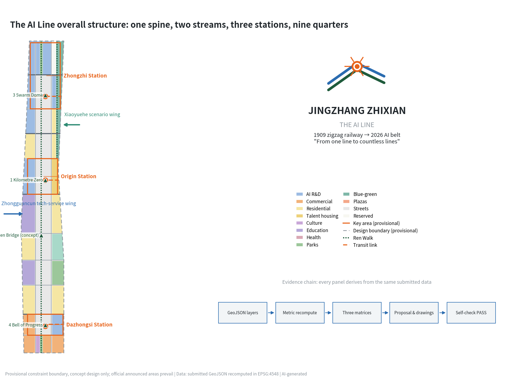
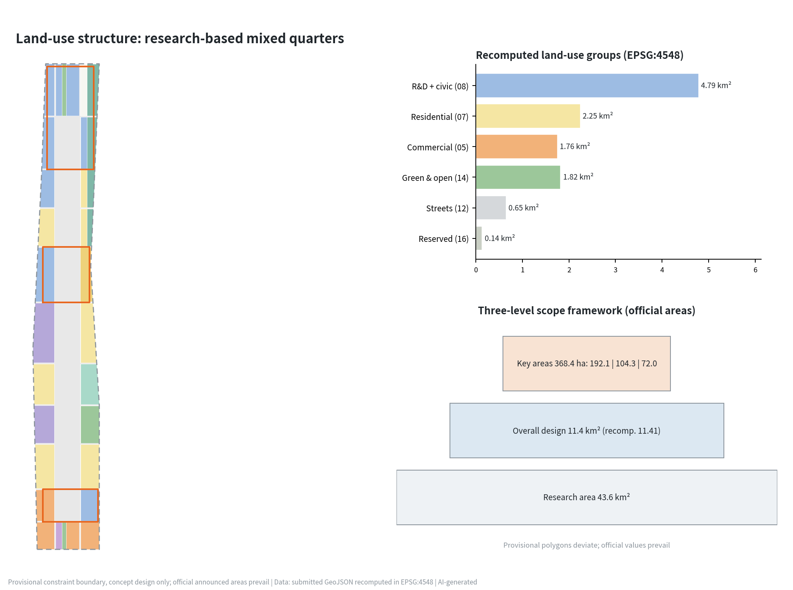
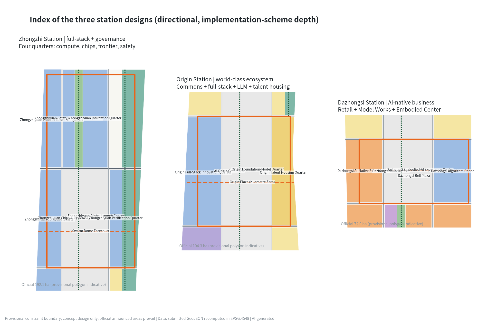
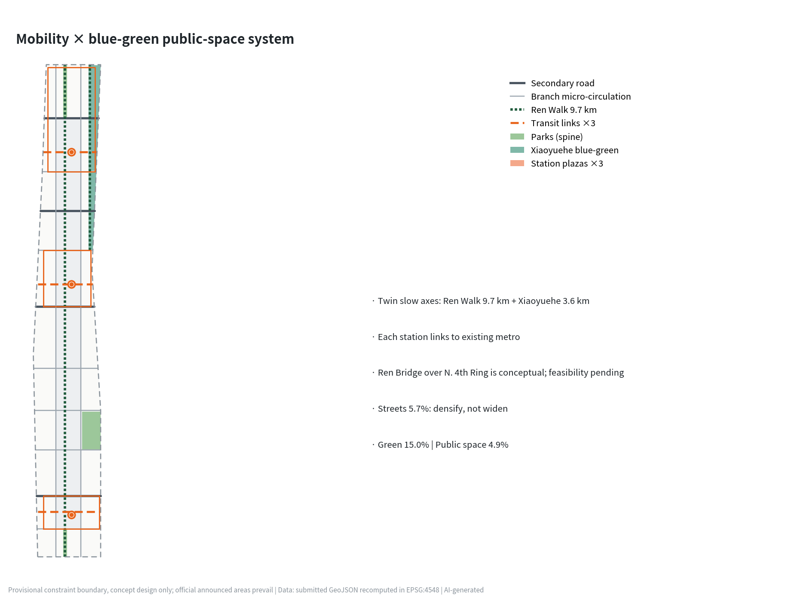
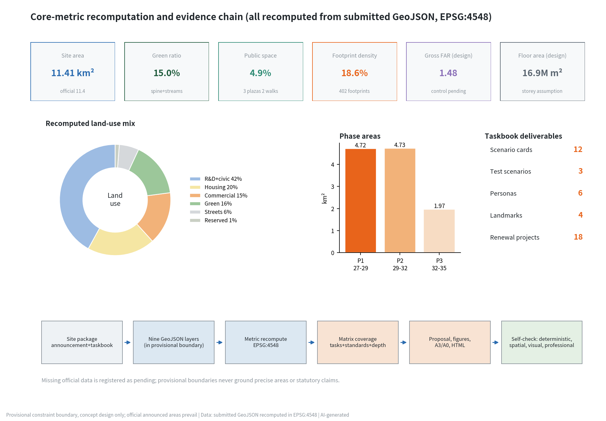

# The AI Line — Urban Design Proposal for the Centennial Jingzhang AI Innovation Belt

In 1909 the Jingzhang Railway crossed the Guangou pass with its zigzag "人"-shaped switchback, becoming the origin point of a trunk railway designed independently by Chinese engineers. In 2026 the same corridor receives a new mission: to become a global pilgrimage site for AI innovation. This proposal names the belt **"Jingzhang Zhixian · The AI Line"**: the "Line" is both the century-old railway line and a line of code. The AI Line translates the Jingzhang Railway Heritage Park into an AI experience green spine running the full length of the district and turns the three key areas into three "smart stations", so that the spirit of independent innovation of a century ago and today's full-stack AI innovation continue along one line. The design is developed on the provisional rough boundary registered by the organizers; every spatial suggestion is a conceptual suggestion or reference scheme for professional teams to deepen, does not replace statutory planning, and does not constitute a government-approved conclusion [source:AGENT-TASKBOOK].

## Design Basis and Source List

The first basis of this proposal is the pre-qualification announcement of the international solicitation, which fixes the three scope levels, official areas, and design tasks, together with the agent-facing open-call taskbook that defines six required agent tasks, the co-creation charter, and boundary clauses [source:OFFICIAL-ANNOUNCEMENT] [source:AGENT-TASKBOOK]. The spatial base uses the provisional rough boundary and three key-area polygons registered in the repository; they may be used only for temporary generation, visualization, and self-check, never as official redlines or a precise-area basis. All areas in this text are recomputed from the submitted geometry in EPSG:4548 and labeled provisional [source:BOUNDARY-SOURCE] [data:geometry/site_boundary.geojson#SITE-001].

Source selection follows the public source registry: formal judgments rely only on formal-ready sources (the announcement, MOHURD and MNR regulations, district industrial policy), the "three areas, two wings" reporting serves as background narrative only, and the provisional boundary is only an intake clue. Complete sources, rights, and limitations are recorded in the source list file; this section does not repeat the machine index [source:SOURCE-REGISTRY]. Generation disclosure: this proposal was generated by an AI agent (an Anthropic Claude model) under human supervision; geometry, metrics, drawings, and web pages are derived from the submitted data by one script chain and are fully recomputable [source:SITE-PACKAGE]. Missing official regulatory controls (FAR, height limits, green ratio) are written as pending official data and never disguised as approved conditions [metric:floor_area_ratio_official_control].

## Three-Level Scope Framework

The coordinated research area (about 43.6 km², N. Fifth Ring — Jingzang Expressway — Xizhimenwai Street — Wanquanhe Road) carries industrial strategy and regional synergy research: how the AI Line forms loops with Zhongguancun, the Xueyuan Road academic belt, Future Science City, and the Beijing-Tianjin-Hebei innovation corridor [source:OFFICIAL-ANNOUNCEMENT]. The overall design area (officially 11.4 km²; about 11.413 million m² recomputed from the provisional boundary) carries regulatory-plan-depth overall urban design: the spine-streams-stations-quarters structure, land-use and intensity zoning, the renewal framework, and phasing [metric:site_area_sqm] [data:geometry/site_boundary.geojson#SITE-001]. The key detailed-design scope (officially 368.4 ha) carries implementation-scheme-depth detailed design, from north to south the Zhongzhiyuan AI Acceleration Area (192.1 ha), the Beijing AI Origin Community (104.3 ha), and the Dazhongsi AI Industry Cluster (72.0 ha) — the three stations [metric:key_detailed_design_area_total_sqm] [data:geometry/key_areas.geojson#PROV-KEY-001].

A provisional-status declaration is mandatory: all three boundary levels are rough polygons drawn by maintainers from official text descriptions and are provisional constraints; their areas deviate from officially announced values (the provisional key-area polygons do not sum to 368.4 ha). Wherever precise area matters, this proposal treats the officially announced values as authoritative and the recomputed values as design reference; once official vectors arrive, land-use zoning, metrics, and drawings must be recalculated as a whole [source:BOUNDARY-SOURCE] [depth:three_level_scope_framework].

## Coordinated Research Area: Industry and Future City Research

**Overall concept and naming system (agent task 1).** Main name "Jingzhang Zhixian", English name **The AI Line**, subtitle "Centennial Jingzhang AI Innovation Belt". The naming system extends to "one line, three stations, two wings, nine quarters": the key areas are named **Zhongzhi Station, Origin Station, Dazhongsi Station**, continuing the railway-station naming tradition; the nine renewal quarters are named as "fang" units (Origin Full-Stack Innovation Quarter, Dazhongsi Model Works, etc., matching the land-use layer one to one); the slow-mobility axis is named **Ren Walk** — from the "人"-shaped switchback at Qinglongqiao, where the character for "human" simultaneously declares human-centered AI [data:geometry/roads.geojson#ROAD-013] [source:AGENT-TASKBOOK]. Logo direction: a double-track polyline derived from the zigzag railway, converging into a neuron node at the turning point, forming a "human × neural network" composite mark; standard colors are locomotive green, signal orange, and pixel blue; the visual system extends to station-sign wayfinding, milestone steles, and digital badges. Only an original geometric construction is described; no existing typeface, trademark, or third-party artwork is used, and trademark search plus professional design deepening are required before implementation [depth:overall_spatial_structure].

**Three positionings, five functions, and the three-areas-two-wings loop (agent task 2).** The Centennial Jingzhang Culture Belt maps to the green spine and the cultural narrative system; the Urban AI Life Experience Belt maps to the scenario-empowerment wing and the 12 scenario cards; the AI Fusion Innovation Belt maps to the three-station industrial system [source:AGENT-TASKBOOK]. The five functions close a spatial loop: Zhongzhi Station carries the full-stack independent innovation system and global AI governance voice (compute — chips — models — safety governance quarters), Origin Station carries the world-class AI innovation ecosystem (Commons + full-stack quarter + talent housing), Dazhongsi Station carries AI-native new business, the Zhongguancun technology-service wing feeds capital, IP, and global allocation from the west, and the Xiaoyuehe scenario wing opens real test scenarios along the blue-green belt [data:geometry/key_areas.geojson#PROV-KEY-002].

**Global AI ecosystem cases (6).** Kendall Square, Boston, shows that a top campus plus walkable mixed blocks converts laboratory density into startup density — the model for Origin Station's university-industry R&D quarter. King's Cross Knowledge Quarter, London, proves railway-heritage regeneration can directly incubate AI headquarters (DeepMind settled there) — the best precedent for a heritage-park-plus-AI narrative. Singapore's one-north shows a government-operated live-work-learn-play mixed campus retains global R&D institutions over decades. Shanghai Xuhui West Bund's "Mosu Space" shows the speed of a vertical LLM incubator combined with waterfront public space. Shenzhen Nanshan Science Park shows the decisive role of hardware supply-chain density for embodied AI. Stanford Research Park shows the patient-capital value of university long-lease land. Together they support the core judgment: AI ecosystem spatial competitiveness = knowledge-source density × scenario openness × walkable mix × cultural identity; the AI Line answers with the academic belt, the scenario wing, the nine-quarter fabric, and the Ren IP [source:AGENT-TASKBOOK] [depth:existing_conditions_diagnosis].

**Factor mechanisms.** Land and space: quarter renewal is stock-first, with the reserved gateway at the North Fifth Ring as elastic supply [data:geometry/land_use.geojson#LU-059]; capital and talent: an "AI Line co-creation fund" and an international scholar residency are suggested (conceptual); compute and data: the Zhongzhiyuan compute quarter concentrates facilities and opens inference quotas belt-wide; scenarios: the Xiaoyuehe wing opens real urban scenarios to global teams through an annual "open testing season". All mechanisms are operating suggestions, not investment or policy commitments [source:AGENT-TASKBOOK].

## Overall Design Area: Urban Renewal and Regulatory-Plan-Level Urban Design

The overall structure is **one spine, two streams, three stations, nine quarters**. The spine: the Jingzhang Heritage Park AI green spine runs about 9.7 km through the district at a designed width of about 85 m, carrying Ren Walk, the honor promenade, and the AI public-space sequence [data:geometry/green_space.geojson#GREEN-003]. The streams: the Xiaoyuehe blue-green buffer in the north (carrier of the scenario wing) and the Zhuanhe Bend waterfront in the south form the eastern blue-green sub-axis [data:geometry/green_space.geojson#GREEN-010]. The stations: the three key areas as intensity and vitality peaks. The quarters: renewal districts framed by two north-south smart streets and ten east-west streets; the street network takes 5.7% of land, achieved by micro-circulation densification rather than demolition-led widening [metric:road_ratio] [metric:land_use_area_sqm_12].

Recomputed land-use structure: research land (0802) about 3.776 million m², 33.1%, the industrial base; residential and community services (07 group) about 2.065 million m² for job-housing balance; commercial services (05) about 1.304 million m² concentrated at stations and smart-street frontages; public administration and services (culture, education, sports, health in group 08) about 0.947 million m²; green and open space (group 14, including plazas) about 1.826 million m²; reserved land about 0.147 million m² [metric:land_use_area_sqm_08] [metric:land_use_area_sqm_14] [data:geometry/land_use.geojson#LU-001]. Development intensity: total proposed floor area about 16.87 million m², gross FAR about 1.48, footprint density 18.6% — a conceptual intensity allocation; official FAR, height, and green-ratio controls are missing, so all intensity conclusions are pending design assumptions, not an approval basis [metric:total_floor_area_sqm] [metric:floor_area_ratio] [metric:floor_area_ratio_official_control].

Suggested innovation indicators (for later regulatory research): AI scenario openness (open test scenarios per km²), landmark accessibility (15-minute slow-mobility coverage), spine continuity (share of gap-free mileage), and developer-residency intensity (person-days per year). Running in parallel with conventional controls, they sketch a dedicated "AI innovation belt plan-sheet" [depth:development_intensity_controls] [standard:MOHURD-CONTROL-DETAILED-PLANNING].

The urban character baseline is "locomotive-green spine + red-brick memory + pixel facades": low, transparent frontages along the heritage park, and a "high north, rhythmic middle, dense south" skyline for the three station clusters; height zoning will be refined once official limits are confirmed [metric:building_height_official_control_m] [standard:MOHURD-URBAN-DESIGN-MEASURES].

## Detailed Design of Key Areas

**Zhongzhiyuan AI Acceleration Area (Zhongzhi Station, officially 192.1 ha).** Positioning: the national carrier of the full-stack independent innovation system and global AI governance voice [data:geometry/key_areas.geojson#PROV-KEY-001]. Structure: four quarters around a valley — compute (SW), chips and systems (center), frontier research (NW), safety and governance (N-center) — enclosing the Global Launch Center and the Swarm Dome forecourt [data:geometry/land_use.geojson#LU-048] [data:geometry/public_space.geojson#PUB-003]. Building renewal: 8-storey R&D slabs as the base fabric; the verification quarter hosts long-span pilot-test halls; the reserved gateway stays unbuilt in Phase 1 as custom supply for international institutions [data:geometry/buildings.geojson#BLDG-355]. Mobility: Zhongzhi South Street is the rail-connection corridor with an autonomous shuttle terminal at the forecourt [data:geometry/roads.geojson#ROAD-017]. AI scenarios: annual model/chip launch season and open safety-evaluation tournaments. Risk: the provisional polygon may deviate substantially from the official scope, so parcel-level statements remain directional [depth:three_key_area_detailed_design].

**Beijing AI Origin Community (Origin Station, officially 104.3 ha).** Positioning: the "commons + incubator + home" of a world-class AI ecosystem [data:geometry/key_areas.geojson#PROV-KEY-002]. Structure: the spine widens into Origin Plaza; the AI Origin Commons (culture quarter) and the full-stack innovation quarter sit to the west, the foundation-model quarter faces Xueyuan Road to the east, and 16-storey talent housing serves young scientists [data:geometry/land_use.geojson#LU-034] [data:geometry/public_space.geojson#PUB-002]. The Kilometre Zero marker stands at the plaza center as the narrative origin of the belt. Renewal favors retention and conversion, inserting 24-hour developer spaces into low-rise street podiums; the Origin transit link connects existing metro stations, and a pedestrian underpass beneath the plaza is proposed for study (engineering feasibility requires professional verification). Scenarios: developer residencies, model roadshows, and AI-native cafés and bookstores.

**Dazhongsi AI Industry Cluster (Dazhongsi Station, officially 72.0 ha).** Positioning: AI-native business and the "ancient bell × new voice" cultural touchpoint [data:geometry/key_areas.geojson#PROV-KEY-003]. Structure: the AI-native retail quarter unfolds along West Smart Street; the Model Works and Algorithm Depot provide low-cost space for small teams; the Embodied-AI Experience Center faces Bell Plaza in dialogue with the Ancient Bell Museum ("one bell, one dome") — the protected museum and its control zones are strictly avoided and untouched [data:geometry/land_use.geojson#LU-006] [data:geometry/public_space.geojson#PUB-001]. Renewal converts existing halls and retail stock; new construction is limited to corner infill; Zhongming 2nd Street is the secondary road for external distribution. Scenarios: AI-native flagship retail, robot dining, and service-experience streets.

## AI Innovation Ecosystem, Personas, and AI+ Scenarios

**Six persona types**: (1) AI researchers and engineers (efficient commutes, late-night services, compute access); (2) founders (low-cost space, financing access, launch stages); (3) university students (internship channels, open courses, youth housing); (4) residents including older adults (daily services must not gain barriers through智能化; staffed counters and accessible routes are retained) [standard:BARRIER-FREE-ENVIRONMENT-LAW]; (5) international developers and visitors (English wayfinding, short-stay residency, visa-facilitation suggestions); (6) urban governance and operations staff (auditable city-agent toolchains) [source:AGENT-TASKBOOK] [metric:persona_type_count].

**Twelve AI scenario cards** (three industry test/validation scenarios marked ★; each card fixes location, users, data and privacy boundary, human review, and operator; all are conceptual and require statutory security assessment before deployment) [metric:ai_scenario_card_count] [standard:GENERATIVE-AI-INTERIM-MEASURES]:

| # | Scenario card | Location | Users | Data & privacy boundary | Human review & operation |
|---|---------------|----------|-------|-------------------------|--------------------------|
| 1 | Ren Walk AI mobility steward | Full spine [data:geometry/roads.geojson#ROAD-013] | Commuters, visitors | Anonymous flow statistics, no individual identification | Operator reviews all push content |
| 2 | Jingzhang Storyline AI guide | Milestone steles | Visitors, students | Public historical corpus, generated content labeled | Historians proofread facts |
| 3 | Community health AI navigation | Smart Health Quarter | Residents, older adults | User-provided, minimal collection | Staffed registration windows retained |
| 4 | Enterprise-service AI copilot | Tech Services Quarter | SMEs | Enterprise-authorized data, no third-party sharing | Government items get human final review |
| 5 | AI+education open classroom | Academic Quarter | Students, public | Open course content | Teacher-led, AI-assisted |
| 6 | Legal & compliance AI assistant | Origin Commons | Startup teams | Public legal corpus | Licensed lawyers review opinions |
| 7 | AI-native retail street | Dazhongsi Retail Quarter | Consumers | Anonymous in-store checkout, opt-in only | Cash and staffed checkout retained |
| 8 | Building energy-carbon AI | Public buildings | Facility owners, government | Building operation data, no personal data | Monthly review by energy engineers |
| 9 | Accessibility & aging AI companion | Belt-wide public space | Older adults, disabled users | Voluntary opt-in, local processing first | Community stations as human fallback [standard:ELDERLY-SMART-TECH-PLAN-2020-45] |
| 10★ | Low-speed robot delivery test | Xiaoyuehe wing [data:geometry/public_space.geojson#PUB-005] | Logistics firms | Published test segments, peak avoidance | Safety officers onboard, human takeover |
| 11★ | Autonomous micro-shuttle test | Three transit links | Mobility firms | Designated lines, informed consent | Dual remote/onboard safety officers |
| 12★ | Urban embodied-agent proving ground | Zhongzhiyuan verification quarter | Robotics firms | Closed-to-semi-open graded testing | Test licenses and expert review [metric:ai_test_scenario_count] |

The scenario-space-operation mapping rule: every scenario must bind one concrete geometry feature, one accountable operator, and one human-review path; scenarios failing any of the three do not enter the open list. Scenarios violating privacy, enabling excessive surveillance, or lacking human review are prohibited [source:AGENT-TASKBOOK].

## Land Use, Building Scale, and Retain-Renovate-Demolish Strategy

Land-use layout is given in the land-use layer and the structural recomputation above; this section explains the retain-renovate-demolish logic. The nine quarters operate on four levels: retain (universities, heritage, mature housing held constant); renovate (existing R&D buildings and halls receive AI functions — the bulk of renewal); regenerate (inefficient retail and storage parcels rebuilt as quarter units); new-build (limited to station cores and corner infill; the reserved area stays untouched in Phase 1) [data:geometry/land_use.geojson#LU-022] [depth:retain_renovate_demolish]. Because building ownership, condition, and tenancy surveys are not part of the cleared package, this proposal states no parcel-level demolition conclusions; all classifications are district-level directions pending survey [source:SOURCE-REGISTRY].

Building scale: proposed footprints total about 2.126 million m² and floor area about 16.87 million m², converting storey assumptions per type (8 for research, 12 for housing, 16 for talent apartments); footprint density is 18.6% [metric:building_footprint_area_sqm] [metric:building_density] [data:geometry/buildings.geojson#BLDG-001]. The scale is a conceptual supply check (at 30-40 m² of research floor per capita it flexibly hosts roughly 250-300 thousand researchers), not an approved quantum [depth:land_use_layout].

## Transport, Rail, Municipal Infrastructure, and Public Services

Roads: a two-vertical (West/East Smart Streets), ten-horizontal densified branch grid provides micro-circulation, and four secondary roads (Zhongming 2nd, Chengfu Smart, Origin North, Zhongzhi South) handle external distribution [data:geometry/roads.geojson#ROAD-002] [depth:traffic_rail_slow_parking]. Rail integration: each station has a transit link to existing metro stations; forecourts integrate autonomous shuttles, shared bikes, and robot-delivery bays; existing rail alignments are locked elements and no realignment is proposed. Slow mobility: Ren Walk is designed gap-free end to end and pairs with the Xiaoyuehe waterfront walk into 9.7 km + 3.6 km twin axes; crossings such as the North Fourth Ring are stitched by the conceptual Ren Bridge (bridge engineering feasibility requires professional study) [data:geometry/roads.geojson#ROAD-014]. Parking: interception parking at station edges, shared bays within quarters, tidal dispatch for bikes.

Municipal and new infrastructure: legacy utilities keep existing corridors and are upsized with street renewal (utility records are missing and listed as pending); new infrastructure follows "central intelligent computing + edge nodes" — the compute quarter hosts the campus-scale facility, each quarter gets edge compute and sensing gateways, and lamp posts integrate 5G micro-cells and V2X units; rooftop PV on public buildings and ground-source study along the spine are proposed (energy-load calculation pending professional work) [depth:municipal_new_infrastructure]. Public services: each quarter holds a 15-minute life circle with community services, childcare, elderly care, and fitness; healthcare anchors at the Smart Health Quarter [data:geometry/land_use.geojson#LU-045].

## Blue-Green Network, Public Space, and Urban Character

The green system comprises the spine (about 83 ha), the two streams (about 25 ha of Xiaoyuehe buffer plus the Zhuanhe frontage), and corner parks; the submitted green ratio is 15.0% — a recomputed design-belt value, with official green-ratio control pending [metric:green_space_area_sqm] [metric:green_ratio] [data:geometry/green_space.geojson#GREEN-002]. Public space comprises the three station plazas (Bell, Origin, Swarm Dome), the Ren Walk honor promenade, and the Xiaoyuehe waterfront commons, at 4.9% of the site [metric:public_space_area_sqm] [metric:public_space_ratio] [data:geometry/public_space.geojson#PUB-001].

**AI pilgrimage landmark system (agent task 4, four landmarks)** [metric:ai_landmark_count]: (1) **Kilometre Zero Origin Marker** (Origin Plaza): an interactive monument modeled on the railway's zero-kilometre stone where global developers inscribe open-source contributions into a digital layer; (2) **Ren Bridge** (conceptual crossing of the North Fourth Ring): the deck itself forms the strokes of "人", uniting slow-mobility stitching with a spiritual totem; (3) **Swarm Dome** (Zhongzhiyuan): the launch-center dome hosting annual model releases and open safety tournaments; (4) **Bell of Progress** (Bell Plaza): an AI sound installation answering Dazhongsi's bell culture with generated chimes at set hours — the heritage bells themselves are never altered. Honor display: the **Builders' Hall of Fame** along the Ren Walk promenade inscribes individuals and teams with substantive open-source contributions on milestone steles (community-juried, no commercial naming) [data:geometry/public_space.geojson#PUB-004]. Component library: station-sign wayfinding, milestone steles, movable test pods, and smart benches, unified in locomotive green plus signal orange [depth:blue_green_public_space] [standard:MOHURD-URBAN-DESIGN-MEASURES].

All landmarks are conceptual, keep clear of heritage protection scopes and control zones, and must not be described as approved construction [source:AGENT-TASKBOOK].

**Cultural narrative (agent task 5).** The master narrative is **"From one line to countless lines"**: in 1909 Zhan Tianyou proved with one zigzag line that Chinese engineers could build trunk railways independently; in the 1980s Zhongguancun proved with one Electronics Street that knowledge could go to market; in the 2020s this corridor will prove full-stack AI independence with countless lines of code. Spatial carriers: one milestone stele per kilometre along the spine, from the Kilometre Zero marker to the Fifth-Ring gateway, narrating the railway opening, Zhan Tianyou, the railway workers, Electronics Street, Lenovo and Founder, Wudaokou the "centre of the universe", and the era of large models — a 9.7 km open-air epic of innovation; the wayfinding symbol system modernizes the railway vocabulary of station signs, signals, and switches [data:geometry/green_space.geojson#GREEN-013]. International communication rides the built-in pun of The AI Line under the theme "Walk the Line, Write the Future". Historical statements follow public records; no unlicensed portraits or images are used [source:AGENT-TASKBOOK].

## Renewal Projects, Implementation Policy, and Phasing

Eighteen renewal projects proceed in three phases, matching the phasing layer [metric:renewal_project_count] [data:geometry/phasing.geojson#PHASE-001] [depth:renewal_project_list]:

| Phase | Projects (type) | Location |
|-------|-----------------|----------|
| Phase 1 2027-2029 | Ren Walk full opening (public space); Kilometre Zero and Origin Plaza (landmark); Origin Commons conversion (renovation); Dazhongsi retail-quarter conversion (renovation); Swarm Dome and Launch Center (new); Compute Quarter phase 1 (new); three transit links (mobility); Builders' Hall of Fame promenade (public space) | Stations + spine |
| Phase 2 2029-2032 | AI conversion of quarter building stock (renovation); Xiaoyuehe open-testing base (scenario); talent-housing quarter (new); Smart Health Quarter (renovation); university-industry R&D quarter (renovation); smart-street micro-circulation densification (mobility) | Nine quarters + wing |
| Phase 3 2032-2035 | Ren Bridge stitching (landmark/mobility); reserved-gateway custom development (new); South Campus education upgrade (renovation); regional innovation-corridor connection (mechanism) | Gateways + seams |

Recomputed phase areas: Phase 1 about 4.716 million m² (station bands plus the street network first), Phase 2 about 4.732 million m², Phase 3 about 1.966 million m² [metric:phase_1_area_sqm] [metric:phase_2_area_sqm] [metric:phase_3_area_sqm]. Policy suggestions (all conceptual): the urban-renewal toolkit for stock conversion; a "test license + insurance + safety officer" triple for scenario opening; challenge-based custom land supply for the reserved area; public participation through quarter co-creation workshops and open-source deliberation (Issue-based).

**Annual event system and long-term operations (agent task 6).** Flagship: the **Origin Summit** each autumn (model and chip releases + open safety tournament + city scenario open day). Seasonal rhythm: the **Jingzhang AI Marathon** in spring (hackathon × road race along Ren Walk), the **Open Testing Season** in summer (Xiaoyuehe wing scenarios opened to global teams), and **Builders' Night** in winter (new Hall-of-Fame inscriptions). Community: **Platform Z** — a global developer-residency mechanism exchanging open-source contribution for desks, compute quotas, and short-stay housing. Brand assets: The AI Line visual system, the stele content library, evaluation datasets, and annual reports accumulate as public knowledge assets. Conversion funnel: testing-season winners → residency → low-cost quarter space → station headquarters. All events and attraction mechanisms are operating suggestions, not government commitments [source:AGENT-TASKBOOK] [depth:phasing_implementation].

## Metrics, Area Recalculation, and Compliance Matrix

Design meaning and recomputed results of the core indicators: overall design area 11.413 million m² (provisional recompute; official 11.4 million) [metric:site_area_sqm]; a 15.0% green ratio underwrites talent expectations for open space, with the spine giving 83% of quarters a park within 300 m [metric:green_ratio]; a 4.9% public-space ratio is deliberately concentrated in three plazas and two promenades — "fewer, finer, fully connected" — to maximize encounter density [metric:public_space_ratio]; 18.6% footprint density and gross FAR 1.48 are mid-intensity for stock renewal and keep headroom for calibration to official controls [metric:building_density] [metric:floor_area_ratio]; a 5.7% road share reflects micro-circulation densification rather than widening [metric:road_ratio].

The remaining core indicators read as follows: 2.065 million m² of housing-group land is checked for job-housing balance [metric:land_use_area_sqm_07]; 1.304 million m² of commercial land concentrates at stations and smart streets [metric:land_use_area_sqm_05]; research-led industrial space is capacity-checked through 16.87 million m² of floor area [metric:total_floor_area_sqm]; the key-area count and the official total are registered side by side, and provisional polygons are excluded from area scoring [metric:key_area_count]; 0.147 million m² of reserved land is an institutional answer to uncertainty [metric:land_use_area_sqm_16]. Scenario and operating indicators (12 cards, 3 test scenarios, 6 personas, 4 landmarks, 18 projects) are human-countable in their chapters [metric:ai_scenario_card_count].

The compliance matrix covers every announcement item in 1.3/1.4/1.5 and agent tasks agent.1-agent.6; the standard matrix answers the urban-design measures, regulatory-plan measures, land-classification guide, architectural design-depth code, the generative-AI interim measures, the barrier-free law, and the elderly-smart-tech plan item by item; all 15 required design-depth items are complete and linked to layers and drawings [standard:PROJECT-OFFICIAL-ANNOUNCEMENT] [standard:MNR-LAND-USE-CLASSIFICATION-GUIDE] [depth:metrics_recalculation]. Recomputed road land is about 0.654 million m² [metric:road_area_sqm]; remaining group values live in the metrics file and are not repeated here.

## Risk, Copyright, and Compliance

Boundary risk: every spatial boundary is a provisional constraint; when official vectors arrive, land-use zoning, all area metrics, drawings, and visualizations must be recalculated [source:BOUNDARY-SOURCE] [depth:risk_missing_data]. Data gaps: official regulatory controls, building surveys, ownership, utility records, and heritage-zone vectors are missing; related conclusions are pending design assumptions [metric:building_height_official_control_m]. Compliance boundary: this proposal issues no statutory planning judgments such as FAR, no parcel-level demolition conclusions, no bridge/tunnel or municipal feasibility conclusions; it uses no non-public data, no personal data, and no unlicensed typefaces, images, or trademarks; every spatial suggestion is a conceptual suggestion or reference scheme for professional deepening [source:AGENT-TASKBOOK] [standard:MOHURD-ARCH-DESIGN-DEPTH-2016].

Copyright and generation disclosure: the text, naming, logo construction, drawings, and web pages are original AI-agent output submitted under the community display license; the toolchain is disclosed in the copyright statement; AI-generated content is labeled, and historical statements are checked against public records [standard:GENERATIVE-AI-INTERIM-MEASURES] [source:SITE-PACKAGE].

## References

1. Haidian Branch, Beijing Municipal Commission of Planning and Natural Resources: Pre-qualification Announcement of the International Solicitation for the Centennial Jingzhang AI Innovation Belt Urban Design, 2026-05-09.
2. Excerpted Taskbook for the Global-Agent Open Call of the Centennial Jingzhang AI Innovation Belt, 2026-05-18 (user-provided cleared document).
3. MOHURD: Administrative Measures for Urban Design, 2017.
4. MOHURD: Measures for the Formulation and Approval of Regulatory Detailed Plans of Cities and Towns.
5. Ministry of Natural Resources: Guide to Land-Use and Sea-Use Classification for Territorial Spatial Survey, Planning, and Use Regulation, 2023.
6. Cyberspace Administration of China et al.: Interim Measures for the Administration of Generative AI Services, 2023.
7. Barrier-Free Environment Construction Law of the People's Republic of China, 2023.
8. General Office of the State Council: Implementation Plan on Effectively Solving the Difficulties of the Elderly in Using Intelligent Technologies (Guobanfa [2020] No. 45).
9. Beijing Municipal Science & Technology Commission and Zhongguancun Administrative Committee: "Three Areas, Two Wings" for a World-Class AI Cluster, 2026-04 (background).
10. Haidian District People's Government: "1+X+1" Modern Industrial System Layout, 2026-03 (background).
11. Repository maintainers: Provisional rough boundary and three key-area polygons with drawing basis, 2026-06 (provisional).

These are the materials that actually shaped the design judgments; the complete machine-readable source records, rights, and limitations follow the source registry [source:SOURCE-REGISTRY].
