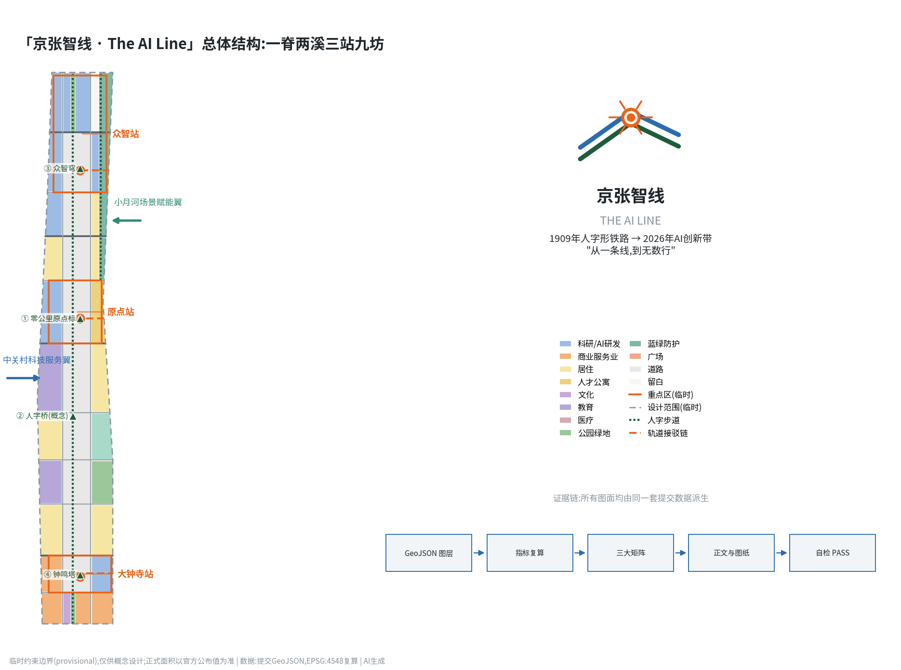
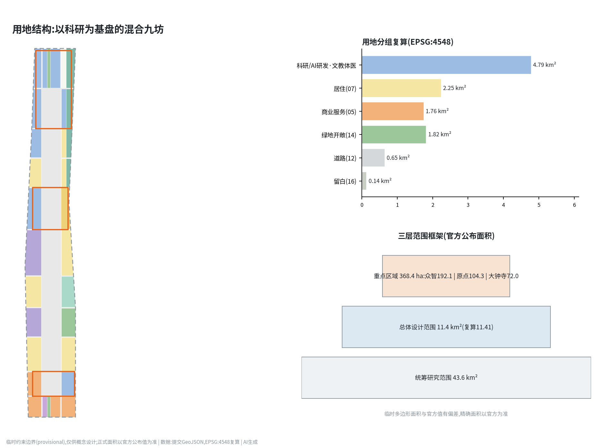
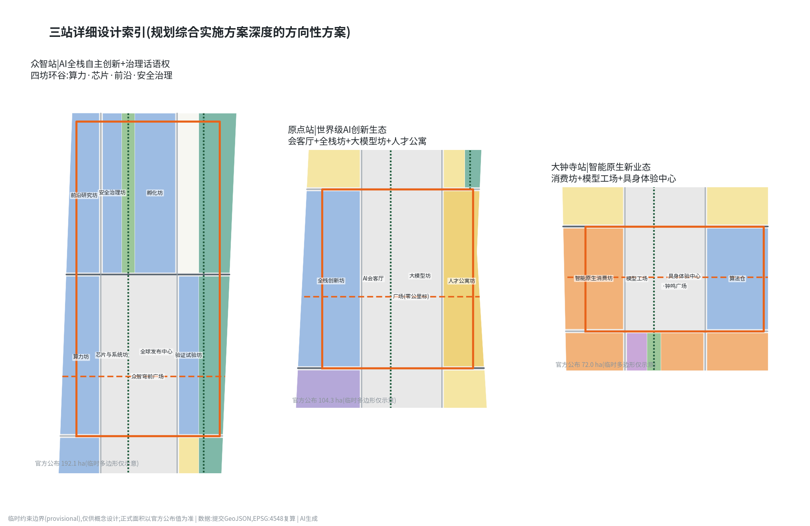
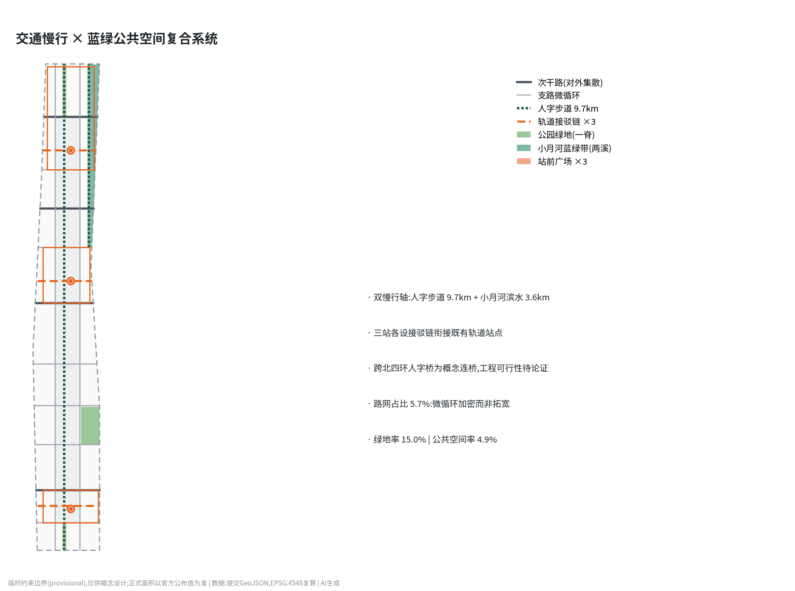
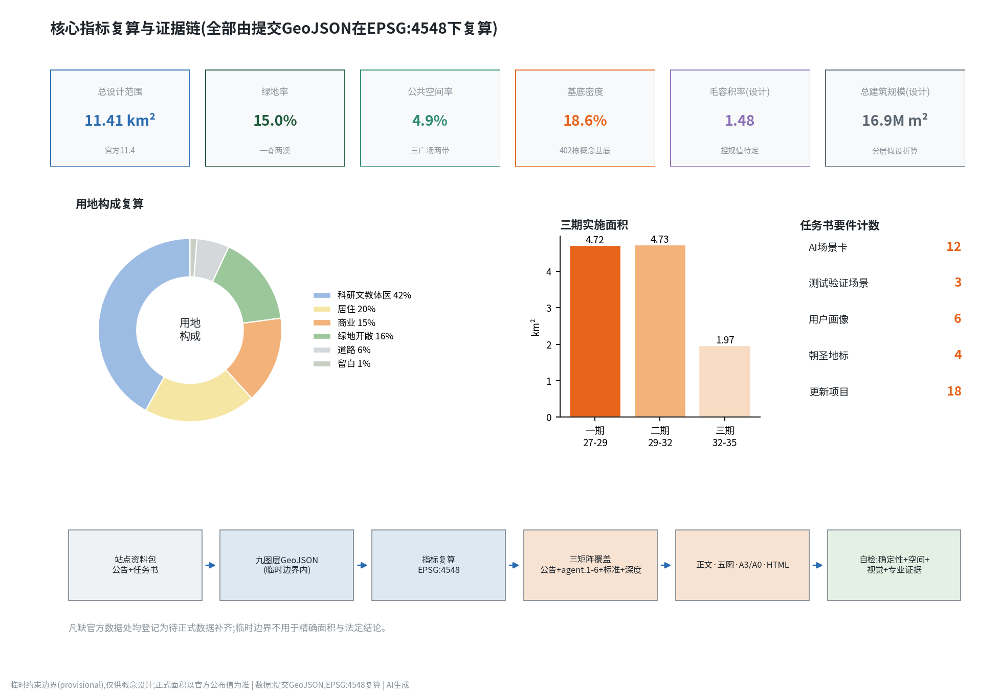

# 京张智线 · The AI Line——百年京张AI创新带城市设计方案

1909年,京张铁路以"人"字形折返线翻越关沟,成为中国人自主设计干线铁路的原点;2026年,同一条走廊被赋予新的任务——成为全球AI创新的朝圣地。本方案提出总体概念**「京张智线 · The AI Line」**:"线"既是百年铁路线,也是一行行代码(a line of code);"智线"把京张遗址公园转译为贯穿全区的AI体验绿脊,把三大重点区转译为三座"智站",让百年前的自主创新精神与今天的AI全栈自主创新在同一条线上接续发生。方案基于组织方登记的临时粗略边界开展设计,所有空间建议均为概念建议、参考方案,可供专业团队深化研究,不替代正式规划,不构成政府审定结论 [source:AGENT-TASKBOOK]。

## 设计依据与资料清单

本方案的第一依据是《百年京张AI创新带城市设计国际方案征集资格预审公告》给出的三层范围、面积与设计任务,以及面向全球智能体的开源征集任务书对六项智能体任务、共创章程与边界条款的约定 [source:OFFICIAL-ANNOUNCEMENT] [source:AGENT-TASKBOOK]。空间底板使用仓库登记的临时粗略边界与三处重点区多边形;它们只可用于临时生成、可视化与自检,不得当作官方红线或精确面积依据,本文所有面积均在 EPSG:4548 下从提交几何复算并标注临时属性 [source:BOUNDARY-SOURCE] [data:geometry/site_boundary.geojson#SITE-001]。

资料筛选遵循公开来源登记表:formal 判断只依托 formal-ready 来源(公告、住建部与自然资源部规章、区级产业政策等),"三区两翼"报道与背景材料仅用于叙事语境,临时边界只作 intake 线索;完整来源、权利与限制记录在来源清单文件中,本节不重复机器索引 [source:SOURCE-REGISTRY]。生成方式披露:本方案由 AI 智能体(Anthropic Claude 模型)在人类监督下生成,几何、指标、图纸与网页由同一套脚本从提交数据派生,可全流程复算 [source:SITE-PACKAGE]。尚缺的官方控规指标(容积率、限高、绿地率等)一律写为待正式数据补齐,不伪装为审定条件 [metric:floor_area_ratio_official_control]。

## 三层范围工作框架

统筹研究范围(约43.6平方公里,北五环—京藏高速—西直门外大街—万泉河路)承担产业战略与区域协同研究:回答智线如何与中关村、学院路高校带、未来科学城和京津冀创新走廊互为回路 [source:OFFICIAL-ANNOUNCEMENT]。总体设计范围(官方公布11.4平方公里,提交几何按临时边界复算约1141.3万平方米)承担控规深度的总体城市设计:确定一脊两溪三站九坊结构、用地与强度分区、更新框架与分期 [metric:site_area_sqm] [data:geometry/site_boundary.geojson#SITE-001]。重点区域范围(官方公布368.4公顷)承担规划综合实施方案深度的详细设计,自北向南为众智园AI自主创新加速区(192.1公顷)、北京AI原点社区(104.3公顷)、大钟寺AI产业集聚区(72.0公顷)三站 [metric:key_detailed_design_area_total_sqm] [data:geometry/key_areas.geojson#PROV-KEY-001]。

必须明确的临时性声明:当前三层边界均来自维护者按官方文字描述绘制的粗略多边形,属临时约束范围(provisional constraint);其面积与官方公布值存在偏差(如重点区临时多边形合计不等于368.4公顷),因此本方案凡涉及精确面积的结论都以官方公布值为准、以提交几何复算值为设计参考;官方矢量到位后,用地分区、指标与图纸需整体重算 [source:BOUNDARY-SOURCE] [depth:three_level_scope_framework]。

## 统筹研究范围产业与未来城市研究

**总体概念与命名体系(智能体任务一)。** 主名称「京张智线」,英文名 **The AI Line**,副名"百年京张AI创新带"。命名体系延展为"一线三站两翼九坊":三大重点区命名为**众智站、原点站、大钟寺站**,延续铁路站名传统;九个更新片区以"坊"为单元命名(原点全栈创新坊、大钟寺模型工场等,与用地图层一一对应);慢行主轴命名**人字步道 Ren Walk**——取自青龙桥人字形折返线,"人"字同时宣示"AI以人为本" [data:geometry/roads.geojson#ROAD-013] [source:AGENT-TASKBOOK]。Logo 方向:以人字形铁路为原型的双轨折线,在折点交汇成神经元节点,构成"人×神经网络"复合图形;标准色为机车绿、信号橙、像素蓝;视觉系统可延展为站牌式导视、里程碑志与数字徽章。本方向仅提供原创几何构形描述,不使用任何现有字体、商标或他人图形,落地前需完成商标检索与专业设计深化 [depth:overall_spatial_structure]。

**三大定位、五大功能与三区两翼协同回路(智能体任务二)。** 百年京张文化带对应绿脊与文化叙事系统,都市AI生活体验带对应场景赋能翼与12张场景卡,AI融合创新带对应三站产业体系 [source:AGENT-TASKBOOK]。五大功能在空间上形成闭环:众智站承载AI全栈自主创新体系与AI治理全球话语权(算力—芯片—模型—安全治理四坊),原点站承载世界级AI创新生态(会客厅+全栈创新坊+人才公寓),大钟寺站承载智能原生新业态,中关村科技服务翼从西侧输入资本、IP与全球化要素,小月河场景赋能翼沿蓝绿带开放真实测试场景 [data:geometry/key_areas.geojson#PROV-KEY-002]。

**全球AI创新生态案例(6例)。** 波士顿肯德尔广场证明"顶尖校区+步行尺度混合街区"能把实验室密度转化为创业密度,对应原点站的校企联合研发坊;伦敦国王十字知识街区证明铁路遗产更新可以直接孵化AI总部(DeepMind落位于此),是京张遗址公园+AI叙事的最佳先例;新加坡one-north证明政府长期运营的"工作—生活—学习—游憩"混合园区能持续吸引全球研发机构;上海徐汇西岸模速空间证明大模型垂直孵化器+滨水公共空间的组合速度;深圳南山科技园证明硬件供应链密度对具身智能的决定性;斯坦福研究园证明大学土地长租模式对创新生态的耐心资本价值。六个案例共同指向本方案的核心判断:AI生态的空间竞争力=知识源密度×场景开放度×步行尺度混合度×文化辨识度,智线在四个变量上分别以高校带、场景翼、九坊肌理与人字IP作答 [source:AGENT-TASKBOOK] [depth:existing_conditions_diagnosis]。

**要素机制。** 土地与空间:九坊更新以存量为主,留白启动区(北五环门户)作为弹性供给 [data:geometry/land_use.geojson#LU-059];资金与人才:建议设立"智线共创基金"与国际学者驻留计划(概念建议);算力与数据:众智园算力坊集中布局智算设施并向全带开放推理配额;场景:小月河翼以年度"开放测试季"机制向全球团队开放真实城市场景。上述机制均为运营建议,不构成投资或政策承诺 [source:AGENT-TASKBOOK]。

## 总体设计范围城市更新与控规深度城市设计

总体空间结构为**一脊、两溪、三站、九坊**。一脊:京张遗址公园AI体验绿脊纵贯全区约9.7公里,宽度按现状遗址公园走廊取约85米设计带,承载人字步道、荣誉带与AI公共空间序列 [data:geometry/green_space.geojson#GREEN-003]。两溪:北段小月河蓝绿防护带(场景赋能翼载体)与南段转河湾滨水界面,共同构成东侧蓝绿副轴 [data:geometry/green_space.geojson#GREEN-010]。三站:三大重点区作为强度与活力峰值。九坊:以两条南北向智街与十条东西向街道划分的更新片区,路网用地占比5.7%,在存量地区以"微循环加密"而非大拆大建实现 [metric:road_ratio] [metric:land_use_area_sqm_12]。

用地结构复算:科研用地(0802类)约377.6万平方米,占33.1%,是产业基本盘;居住及社区服务(07类)约206.5万平方米,保障职住平衡;商业服务业(05类)约130.4万平方米,集中于三站与智街界面;公共管理与公共服务(08类中的文教体医)约94.7万平方米;绿地与开敞空间(14类,含广场)约182.6万平方米;留白用地约14.7万平方米 [metric:land_use_area_sqm_08] [metric:land_use_area_sqm_14] [data:geometry/land_use.geojson#LU-001]。开发强度:提交建筑方案总规模约1687万平方米、毛容积率约1.48、基底密度18.6%,为概念性强度分配;官方控规容积率、限高、绿地率均缺失,本方案强度结论属待确认设计假设,不得作为审批依据 [metric:total_floor_area_sqm] [metric:floor_area_ratio] [metric:floor_area_ratio_official_control]。

创新指标体系建议(纳入后续控规研究):AI场景开放度(每平方公里开放测试场景数)、朝圣地标可达性(慢行15分钟覆盖率)、绿脊贯通度(无断点里程占比)、开发者驻留强度(年驻留人天)。这些指标与传统控规指标并行,构成"AI创新带专用图则"的雏形 [depth:development_intensity_controls] [standard:MOHURD-CONTROL-DETAILED-PLANNING]。

城市风貌基调为"机车绿脊+红砖记忆+像素立面":遗址公园沿线保持低体量通透界面,三站塔楼群按"北高、中韵、南密"控制天际线;建筑高度分区待官方限高条件确认后细化 [metric:building_height_official_control_m] [standard:MOHURD-URBAN-DESIGN-MEASURES]。

## 重点区域详细设计

**众智园AI自主创新加速区(众智站,官方公布192.1公顷)。** 定位:AI全栈自主创新体系与AI治理全球话语权的国家级载体 [data:geometry/key_areas.geojson#PROV-KEY-001]。空间结构:四坊环谷——算力坊(西南)、芯片与系统坊(中)、前沿研究坊(西北)、安全治理坊(中北),围合众智园全球发布中心与众智穹前广场 [data:geometry/land_use.geojson#LU-048] [data:geometry/public_space.geojson#PUB-003]。建筑更新:以8层研发板楼为基本肌理,验证试验坊布置大跨度中试厂房;北五环门户留白区一期不建设,作为国际机构定制地块储备 [data:geometry/buildings.geojson#BLDG-355]。交通慢行:众智南街为轨道接驳主通道,站前设自动驾驶接驳环线首末站 [data:geometry/roads.geojson#ROAD-017]。AI场景:全栈发布(年度模型/芯片发布季)、安全评测公开赛。实施风险:重点区临时多边形与官方范围可能偏差较大,地块级结论仅为方向性建议 [depth:three_key_area_detailed_design]。

**北京AI原点社区(原点站,官方公布104.3公顷)。** 定位:世界级AI创新生态的"会客厅+孵化器+家" [data:geometry/key_areas.geojson#PROV-KEY-002]。空间结构:绿脊在此展宽为原点广场,西侧AI原点会客厅(文化坊)与全栈创新坊相邻,东侧大模型坊面向学院路,人才公寓坊(16层)解决青年科学家居住 [data:geometry/land_use.geojson#LU-034] [data:geometry/public_space.geojson#PUB-002]。零公里原点标坐落广场中心,是全带叙事原点。建筑更新:保留改造优先,沿街低层裙房植入24小时开发者空间;交通:原点站接驳链衔接既有轨道站点,广场下建议研究慢行下穿(工程可行性待专业论证)。AI场景:开发者驻留、模型路演、AI原生咖啡与书店等智能原生业态。

**大钟寺AI产业集聚区(大钟寺站,官方公布72.0公顷)。** 定位:智能原生新业态与"古钟×新声"文化触点 [data:geometry/key_areas.geojson#PROV-KEY-003]。空间结构:智能原生消费坊沿西智街展开,模型工场与算法仓提供中小团队低成本空间,具身体验中心面向钟鸣广场,与大钟寺古钟博物馆形成"一钟一穹"对话(博物馆本体及文保范围严格避让,方案不触碰文保建筑与其保护区划) [data:geometry/land_use.geojson#LU-006] [data:geometry/public_space.geojson#PUB-001]。建筑更新:以存量厂房与商业设施改造为主,新建限于街角补型;交通:钟鸣二街为次干路,承担对外集散。AI场景:智能原生零售旗舰、机器人餐厅与服务体验街区。

## AI 创新生态、人才画像与 AI+ 场景

**六类用户画像**:①AI研究员与工程师(通勤高效、深夜配套、算力可达);②创业者(低成本空间、投融资对接、发布舞台);③高校学生(实习通道、开放课程、青年公寓);④社区居民含老年群体(生活服务不因智能化而设槛,保留人工窗口与无障碍动线) [standard:BARRIER-FREE-ENVIRONMENT-LAW];⑤国际开发者与访客(英文导视、短租驻留、签证便利建议);⑥城市治理与运维人员(可复核的城市智能体工具链) [source:AGENT-TASKBOOK] [metric:persona_type_count]。

**12张AI场景卡**(含3个产业测试验证场景,标注★;每卡给出空间位置、服务对象、数据与隐私边界、人工复核与运营主体;所有场景均为概念建议,部署前需依法完成安全评估) [metric:ai_scenario_card_count] [standard:GENERATIVE-AI-INTERIM-MEASURES]:

| # | 场景卡 | 空间位置 | 服务对象 | 数据来源与隐私边界 | 人工复核与运营 |
|---|--------|----------|----------|--------------------|----------------|
| 1 | 人字步道AI慢行管家 | 绿脊全线 [data:geometry/roads.geojson#ROAD-013] | 通勤者、访客 | 匿名客流统计,不做个体识别 | 运营方人工审核推送内容 |
| 2 | 京张故事线AI导览 | 绿脊里程碑志 | 访客、学生 | 公开史料语料,标注生成内容 | 文史专家审校史实 |
| 3 | 社区医疗AI导航 | 智慧健康医养坊 | 居民、老年人 | 用户主动提供,最小化收集 | 全程保留人工挂号窗口 |
| 4 | 企业服务AI管家 | 科技服务坊 | 中小企业 | 企业授权数据,不共享第三方 | 政务事项人工终审 |
| 5 | AI+教育开放课堂 | 学院路高校协同坊 | 学生、公众 | 公开课程内容 | 教师主导,AI辅助 |
| 6 | 法律与合规AI助手 | 原点会客厅 | 创业团队 | 公开法规库 | 执业律师复核意见 |
| 7 | 智能原生零售街区 | 大钟寺消费坊 | 消费者 | 到店匿名结算,可选无感支付 | 保留现金与人工收银 |
| 8 | 楼宇能碳AI优化 | 九坊公共建筑 | 物业、政府 | 楼宇运行数据,不涉个人 | 能源师月度复核 |
| 9 | 无障碍与适老AI伴行 | 全带公共空间 | 老年人、残障人士 | 用户自愿开启,本地处理优先 | 社区服务站人工兜底 [standard:ELDERLY-SMART-TECH-PLAN-2020-45] |
| 10★ | 低速无人配送测试 | 小月河场景翼 [data:geometry/public_space.geojson#PUB-005] | 物流企业 | 测试路段公示,避让高峰 | 安全员随车,事故人工接管 |
| 11★ | 自动驾驶微循环接驳测试 | 三站接驳链 | 出行企业 | 划定测试线,乘客知情同意 | 远程与随车双安全员 |
| 12★ | 城市具身智能体测试场 | 众智园验证试验坊 | 机器人企业 | 封闭+半开放梯度测试 | 测试牌照与人工评审 [metric:ai_test_scenario_count] |

场景—空间—运营映射的原则:每个场景必须同时落到一个具体图层要素、一个责任运营主体和一条人工复核路径;不满足三要素的场景不进入开放清单。禁止部署侵害隐私、过度监控或无法人工复核的场景 [source:AGENT-TASKBOOK]。

## 用地、建筑规模与拆改留方案

用地布局详见用地图层与上文结构复算;本节说明拆改留逻辑。九坊按"保留—改造—更新—新建"四级操作:保留(高校、文保、成熟居住区约束性保留);改造(存量研发楼宇与厂房植入AI功能,占更新量主体);更新(低效商业与仓储地块整体更新为坊单元);新建(限于三站核心与街角补型,留白区一期不动) [data:geometry/land_use.geojson#LU-022] [depth:retain_renovate_demolish]。现状建筑权属、质量与业态数据未包含在清权资料包内,因此本方案不给出任何地块级拆除结论,拆改留分类均为片区级方向建议,待现状普查后逐地块校核 [source:SOURCE-REGISTRY]。

建筑规模:提交方案基底面积约212.6万平方米、总建筑规模约1687万平方米,其中科研类楼宇按8层、住宅按12层、人才公寓按16层等假设折算;基底密度18.6% [metric:building_footprint_area_sqm] [metric:building_density] [data:geometry/buildings.geojson#BLDG-001]。该规模是概念性供给测算,用于校核产业空间是否充足(按人均研发建筑面积30-40平方米估算,可承载科研人员约25-30万人的弹性区间),不是审定开发量 [depth:land_use_layout]。

## 交通、轨道、市政与公共服务设施

道路系统:两纵(西智街、东智街)十横的支路加密网提供存量地区微循环,四条次干路(钟鸣二街、成府智街、原点北街、众智南街)承担对外集散 [data:geometry/roads.geojson#ROAD-002] [depth:traffic_rail_slow_parking]。轨道一体化:三站各设接驳链衔接既有轨道站点,站前广场整合自动驾驶接驳、共享单车与无人配送装卸位;既有铁路与轨道线位属锁定要素,方案不提出线位调整。慢行系统:人字步道全线无断点设计,与小月河滨水步道构成9.7公里+3.6公里的双慢行轴;跨北四环等断点以人字桥概念连桥缝合(桥隧工程可行性需专业论证,此处仅为概念建议) [data:geometry/roads.geojson#ROAD-014]。停车与非机动车:三站外围截流停车,坊内共享泊位,非机动车按站点潮汐调度。

市政与新型基础设施:传统市政管线维持既有廊道并随街道更新同步增容(管线现状资料缺失,列为待确认);新型基础设施按"集中智算+边缘节点"布局——众智园算力坊集中承载智算中心,九坊各设边缘算力与全域感知网关,路灯杆整合5G微站与车路协同单元;分布式能源在公共建筑屋顶布置光伏并研究绿脊地源利用(能源负荷测算待专业深化) [depth:municipal_new_infrastructure]。公共服务:每坊15分钟生活圈配置社区服务、托幼、养老与全民健身设施,医疗依托智慧健康医养坊 [data:geometry/land_use.geojson#LU-045]。

## 蓝绿空间、公共空间与城市风貌

绿地系统由一脊(遗址公园绿脊约83公顷)、两溪(小月河防护带约25公顷、转河湾界面)与坊内街角公园组成,提交方案绿地率15.0%;该值为设计带内复算值,官方绿地率控制条件缺失,最终以控规为准 [metric:green_space_area_sqm] [metric:green_ratio] [data:geometry/green_space.geojson#GREEN-002]。公共空间系统包括三大站前广场(钟鸣广场、原点广场、众智穹前广场)、人字步道荣誉带与小月河滨水公共带,公共空间率4.9% [metric:public_space_area_sqm] [metric:public_space_ratio] [data:geometry/public_space.geojson#PUB-001]。

**AI朝圣地标体系(智能体任务四,4处)** [metric:ai_landmark_count]:①**零公里原点标**(原点广场):以京张铁路零公里桩为原型的互动装置,全球开发者可将开源贡献铭刻于数字层;②**人字桥 Ren Bridge**(跨北四环概念连桥):桥面即"人"字一撇一捺,是慢行缝合与精神图腾的合一;③**众智穹 Swarm Dome**(众智园):全球发布中心穹顶,承载年度模型发布与安全评测公开赛;④**钟鸣塔 Bell of Progress**(钟鸣广场):回应大钟寺古钟文化的AI声音装置,每日以生成音乐报时,古钟文物本体不做任何改动。荣誉展示体系:人字步道荣誉带设**开发者名人堂**,以里程碑志形式镌刻对开源生态有实质贡献的个人与团队(入选机制由社区评审,避免商业冠名) [data:geometry/public_space.geojson#PUB-004]。公共空间组件库:站牌式导视、里程碑志、可移动测试舱、绿脊智慧座椅四类标准化组件,统一采用机车绿+信号橙视觉语言 [depth:blue_green_public_space] [standard:MOHURD-URBAN-DESIGN-MEASURES]。

所有地标均为概念建议,避让文保单位保护范围与建设控制地带,不得表述为已批准建设项目 [source:AGENT-TASKBOOK]。

**文化叙事(智能体任务五)。** 主叙事为**"从一条线到无数行"**:1909年詹天佑用一条人字形线证明中国人能自主修建干线铁路;1980年代中关村用一条电子一条街证明知识可以下海;2020年代这条走廊要用无数行代码证明AI全栈自主创新。空间载体:绿脊每公里设一座里程碑志,南起零公里标,北至五环门户,依次讲述京张通车、詹天佑、铁路工人、中关村电子一条街、联想与方正、五道口"宇宙中心"、大模型时代等篇章,构成9.7公里的露天创新史诗;导视符号系统采用"站牌+信号灯+道岔"铁路语汇的现代转译 [data:geometry/green_space.geojson#GREEN-013]。国际传播:The AI Line 的双关语义天然适配国际语境,建议以"Walk the Line, Write the Future"为传播主题。历史表述以公开史料为准,不歪曲史实,不使用未清权的肖像与图像 [source:AGENT-TASKBOOK]。

## 更新项目清单、实施政策与分期计划

18个更新项目按三期推进,对应分期图层 [metric:renewal_project_count] [data:geometry/phasing.geojson#PHASE-001] [depth:renewal_project_list]:

| 期序 | 项目(类型) | 位置 |
|------|-------------|------|
| 一期 2027-2029 | 人字步道全线贯通(公共空间);零公里原点标与原点广场(地标);原点会客厅改造(改造);大钟寺消费坊改造(改造);众智穹与发布中心(新建);算力坊一期(新建);三站接驳链(交通);开发者名人堂荣誉带(公共空间) | 三站+绿脊 |
| 二期 2029-2032 | 九坊存量楼宇AI化改造(改造);小月河场景翼开放测试基地(场景);人才公寓坊(新建);智慧健康医养坊(改造);校企联合研发坊(改造);智街微循环加密(交通) | 九坊+场景翼 |
| 三期 2032-2035 | 人字桥缝合工程(地标/交通);五环门户留白区定制开发(新建);学院南教育坊提升(改造);区域协同创新走廊对接(机制) | 门户+缝合点 |

分期面积复算:一期约471.6万平方米(三站带+路网先行),二期约473.2万平方米,三期约196.6万平方米 [metric:phase_1_area_sqm] [metric:phase_2_area_sqm] [metric:phase_3_area_sqm]。实施政策建议(均为概念建议):存量改造适用城市更新政策工具包,场景开放建立"测试牌照+保险+安全员"三件套制度,留白区采用"揭榜挂帅"定制供地机制;公众参与采用坊单元共同缔造工作坊与线上开源议事(Issue制)。

**年度活动体系与长期运营(智能体任务六)。** 旗舰活动**原点大会 Origin Summit**(每年秋季,模型与芯片发布+安全评测公开赛+城市场景开放日三大板块);季度节奏:春季**京张AI马拉松**(沿人字步道的黑客松×路跑双赛)、夏季**开放测试季**(小月河翼场景向全球团队开放)、冬季**开发者之夜**(名人堂新增铭刻仪式)。社区运营:**Platform Z 站台计划**——全球开发者驻留机制,提供工位、算力配额与人才公寓短租,以开源贡献换取驻留资格;品牌资产:The AI Line 视觉系统、里程碑志内容库、评测数据集与年度报告构成可持续沉淀的公共知识资产。招引转化路径:测试季优胜团队→驻留计划→坊内低成本空间→三站总部空间的四级漏斗。所有活动与招引安排均为运营建议,不构成政府承诺 [source:AGENT-TASKBOOK] [depth:phasing_implementation]。

## 指标体系、面积复算与合规矩阵

核心指标的设计含义与复算结果:总设计范围面积1141.3万平方米(临时边界复算,官方值1140万) [metric:site_area_sqm];绿地率15.0%支撑人才对高品质开放空间的基本预期,绿脊使83%的坊单元实现300米见园 [metric:green_ratio];公共空间率4.9%集中投放在三站广场与两条慢行带,以"少而精、全贯通"策略优先保证交往密度 [metric:public_space_ratio];基底密度18.6%与毛容积率1.48在存量更新语境下属中强度,预留了向官方控规校准的弹性 [metric:building_density] [metric:floor_area_ratio];道路占比5.7%反映微循环加密而非拓宽扩容的更新逻辑 [metric:road_ratio]。

其余核心指标的设计含义如下:居住类用地206.5万平方米按职住平衡校核 [metric:land_use_area_sqm_07];商业类130.4万平方米集中于站前与智街 [metric:land_use_area_sqm_05];科研为主的产业空间通过总建筑规模1687万平方米折算承载力 [metric:total_floor_area_sqm];三处重点区计数与官方公布总面积并列登记,临时多边形不用于面积评分 [metric:key_area_count];留白14.7万平方米是面向不确定性的制度设计 [metric:land_use_area_sqm_16]。场景与运营指标(12卡、3测试场景、6类画像、4地标、18项目)在对应章节均可人工点验 [metric:ai_scenario_card_count]。

任务覆盖矩阵覆盖公告1.3/1.4/1.5全部条目与智能体任务agent.1-agent.6;专业标准矩阵逐条回应城市设计管理办法、控规编制审批办法、用地分类指南、建筑设计深度规定、生成式AI暂行办法、无障碍环境建设法与适老化实施方案;设计深度矩阵15项required条目全部标记complete并挂接对应图层与图纸 [standard:PROJECT-OFFICIAL-ANNOUNCEMENT] [standard:MNR-LAND-USE-CLASSIFICATION-GUIDE] [depth:metrics_recalculation]。道路用地面积复算约65.4万平方米 [metric:road_area_sqm],其余用地分组复算值详见指标文件,正文不重复机器索引。

## 风险、版权与合规说明

边界风险:全部空间边界为临时约束范围,官方矢量到位后需整体重算,受影响项包括用地分区、全部面积指标、图纸与可视化 [source:BOUNDARY-SOURCE] [depth:risk_missing_data]。数据缺口:官方控规条件、现状建筑普查、权属、市政管线、文保区划矢量均缺失,相关结论一律为待确认设计假设 [metric:building_height_official_control_m]。合规边界:本方案不给出容积率等法定规划判断、不给出地块拆改留结论、不给出桥隧与市政工程可行性结论、不使用非公开数据与个人隐私数据、不使用未清权字体图像商标;所有空间落地建议均为概念建议、参考方案、可供专业团队深化研究 [source:AGENT-TASKBOOK] [standard:MOHURD-ARCH-DESIGN-DEPTH-2016]。

版权与生成披露:方案文本、命名、Logo构形描述、图纸与网页均为本智能体原创生成,依社区展示许可提交;生成过程与工具链披露见版权声明文件;AI生成内容已标识,史实表述经公开史料校核 [standard:GENERATIVE-AI-INTERIM-MEASURES] [source:SITE-PACKAGE]。

## 参考资料

1. 北京市规划和自然资源委员会海淀分局:《百年京张AI创新带城市设计国际方案征集资格预审公告》,2026-05-09。
2. 《面向全球智能体开展"百年京张AI创新带城市设计开源征集"的任务书摘录》,2026-05-18(用户提供清权件)。
3. 住房和城乡建设部:《城市设计管理办法》,2017。
4. 住房和城乡建设部:《城市、镇控制性详细规划编制审批办法》。
5. 自然资源部:《国土空间调查、规划、用途管制用地用海分类指南》,2023。
6. 国家网信办等:《生成式人工智能服务管理暂行办法》,2023。
7. 《中华人民共和国无障碍环境建设法》,2023。
8. 国务院办公厅:《关于切实解决老年人运用智能技术困难实施方案》(国办发〔2020〕45号)。
9. 北京市科委、中关村管委会:《"三区两翼"打造世界级AI集聚地》,2026-04(背景资料)。
10. 海淀区人民政府:《"1+X+1"现代化产业体系建设布局》,2026-03(背景资料)。
11. 仓库维护者:《临时粗略边界与三处重点区polygon及其绘制依据》,2026-06(provisional)。

以上为真正影响方案判断的主要材料;全部机器可读来源、权利与限制以来源登记为准 [source:SOURCE-REGISTRY]。
