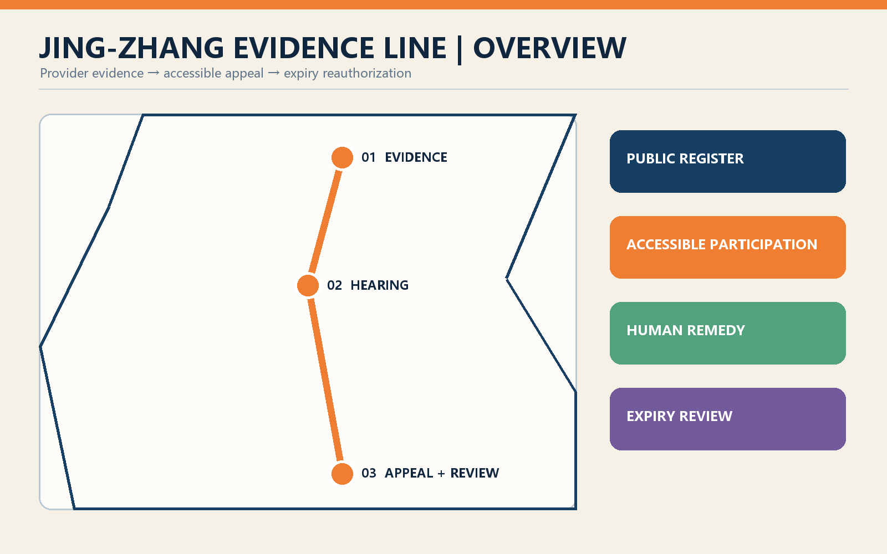
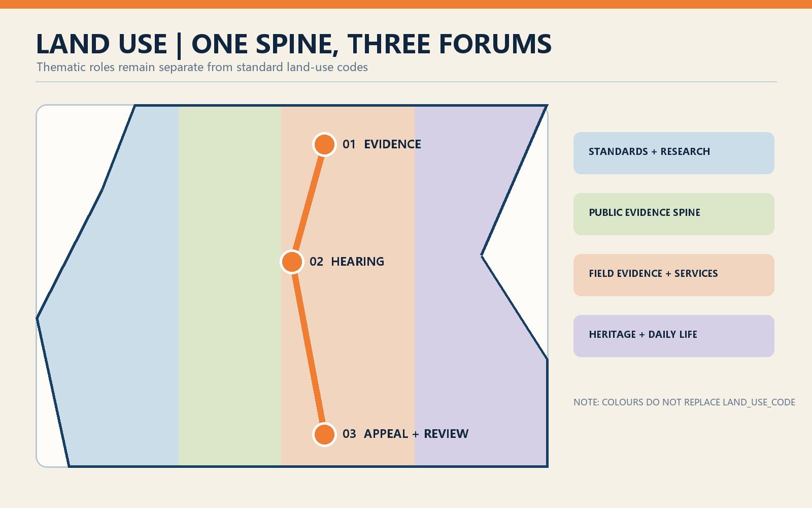
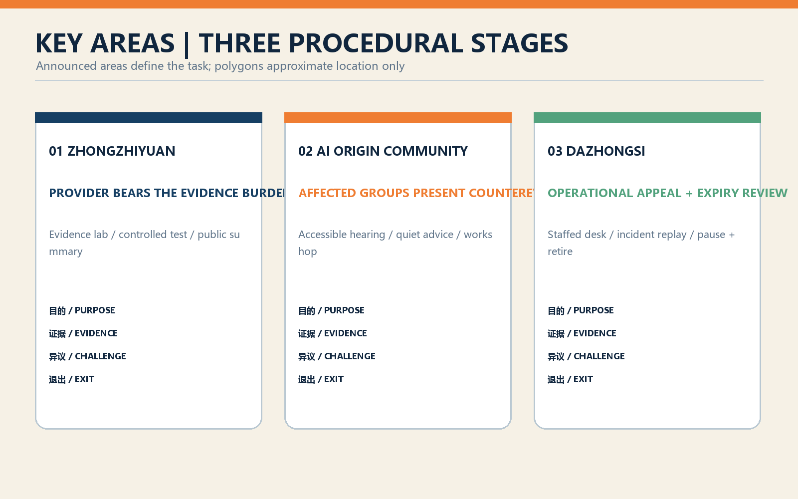
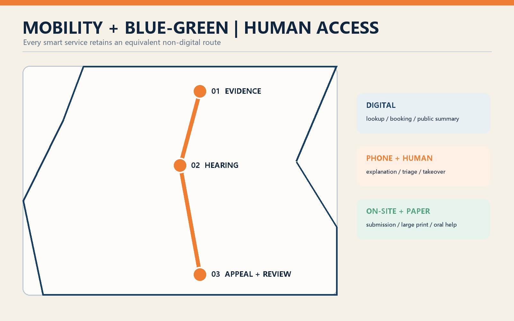
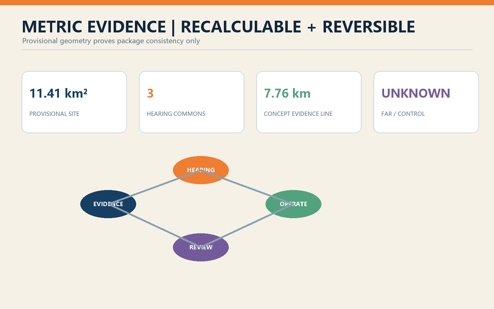

# Jing-Zhang Evidence Line: Public Evidence, Accessible Appeal, and Expiry Review for Urban AI

## Design Basis and Source List

The proposal is based directly on the official Centennial Jing-Zhang AI Innovation Belt open-call announcement, the agent taskbook, and the repository site package. The announcement defines a coordinated research area of about 43.6 square kilometres, an overall design area of about 11.4 square kilometres, and three key areas totalling about 368.4 hectares. Professional expression follows the listed urban-design, regulatory-planning, and land-use references. The complaint mechanism in China's Interim Measures for Generative AI Services is used as an operational reference, within its actual scope.[source:OFFICIAL-ANNOUNCEMENT] [source:AGENT-TASKBOOK]

The submitted site and key-area polygons are provisional repository geometry. They retain `official_boundary=false` and `geometry_role=provisional_constraint` and support concept generation, recalculation, and internal consistency checks only. They are not statutory boundaries, title evidence, or approved development controls. FAR, height, road redlines, ownership, municipal capacity, and heritage limits remain unknown and must be confirmed before professional implementation.[source:BOUNDARY-SOURCE] [assumption:A-BOUNDARY-001]

Machine-readable evidence is distributed across the source, assumption, metric, compliance, standard, depth, and GeoJSON files. The drawings and offline HTML are readable projections of those records. International cases support comparative methods for testing, registration, and participation; they do not create local legal duties.[source:IMDA-AI-VERIFY] [source:NIST-ARIA]

## Three-Level Scope Framework

The Evidence Line overlays three spatial scales with three procedural stages. The 43.6-square-kilometre research area establishes a shared rule for the urban-AI supply chain: whoever proposes a deployment explains its purpose, data, beneficiaries, risks, and exit plan. The 11.4-square-kilometre design area uses the Jing-Zhang heritage park as a public evidence spine. The three key areas host pre-launch evidence, affected-community hearing, and operational remedy plus reauthorization.[depth:three_level_scope_framework] [data:geometry/site_boundary.geojson#SITE-001]

Space does not replace legal or administrative procedure. “Hearing” here means a public-participation prototype whose formal scope would be determined by competent authorities, operators, and communities. The design provides practical interfaces: a public register, evidence laboratory, accessible hearing room, staffed appeal desk, incident review room, and expiry-review forum. If a statutory process applies, that process governs.

Each scale produces both spatial and governance outputs. Research maps services, stakeholders, and annual risks; overall design creates one spine, three forums, and twelve access points; key-area design locates projects and operational scripts. Every service retains digital and non-digital access, and every claim distinguishes registered evidence, design advice, and unresolved conditions.[standard:PROJECT-AGENT-OPEN-CALL-TASKBOOK] [assumption:A-GOVERNANCE-001]

## Coordinated Research Area: Industry and Future City Research

Haidian's advantage is proximity among universities, research institutes, platform firms, start-ups, and dense urban life. The proposal organizes that proximity as a chain of research, testing, public evidence, scenario procurement, and continuous review. Companies receive a predictable trial pathway and assurance support; researchers supply evaluation methods; residents and front-line workers contribute use contexts; independent assessors preserve contrary evidence. The city becomes infrastructure capable of examining AI, not merely a showroom for it.[source:AISI-EVALUATIONS] [source:IMDA-AI-VERIFY]

The identity is “Jing-Zhang Evidence Line.” The historical railway demonstrated independent engineering through material proof; the contemporary belt asks urban AI to show public evidence before it enters everyday life. Railway milestones, signals, and tickets are translated into risk levels, evidence states, and review dates without imitating protected fabric. Evidence milestones record four possible states: cleared, conditionally cleared, paused, and retired.[assumption:A-HERITAGE-001] [depth:overall_spatial_structure]

The associated economy includes evaluation tooling, data governance, accessibility testing, participation, incident investigation, model documentation, insurance, and dispute resolution. An annual Urban AI Evidence Week could publish anonymized test summaries, failures, and remediation progress. This is an operational proposal rather than a government commitment; it makes careful governance a visible professional service and part of the innovation value chain.

## Overall Design Area: Urban Renewal and Regulatory-Plan-Level Urban Design

The spatial structure is one spine, three forums, two wings, and twelve touchpoints. The heritage park is the evidence spine. Zhongzhiyuan hosts the Evidence Forum, AI Origin Community the Public Hearing Forum, and Dazhongsi the Appeal and Review Forum. A western wing links universities and standards capacity; an eastern wing links enterprises, communities, and field evidence. Twelve touchpoints at transit entrances, park stations, and community centres provide register lookup, staffed help, accessible feedback, and paper submission.[data:geometry/roads.geojson#ROAD-EVIDENCE-001] [depth:overall_spatial_structure]

The four standard-coded land-use partitions are retained so thematic names do not masquerade as statutory classifications. Governance functions are added through `program_role`. Three conceptual service pavilions, three hearing commons, and the pedestrian evidence line remain inside the provisional site. Pavilion footprints are design proposals, not a survey of existing buildings; retain-renovate-demolish decisions await building, title, and structural records.[standard:MNR-LAND-USE-CLASSIFICATION-GUIDE] [assumption:A-BUILDING-001]

Controls prioritize active ground floors, continuous walking, legible signs, and low-disturbance night operation. No invented values are given for height, density, setbacks, or parking. Reversible public-space works and operating pilots proceed before major construction; transport, municipal, heritage, and ownership confirmation are prerequisites for later stages.[standard:MOHURD-CONTROL-DETAILED-PLANNING] [metric:floor_area_ratio]

## Detailed Design of Key Areas

**Zhongzhiyuan - Evidence Forum.** An evidence laboratory, controlled test field, and public register form the pre-launch loop. Providers submit purpose limits, data notes, disaggregated performance, failure modes, human takeover, and retirement plans. Researchers and independent assessors conduct red-team, accessibility, and field tests. The river-facing public realm displays publishable methods and conclusions, never sensitive records.[data:geometry/key_areas.geojson#PROV-KEY-001] [source:NIST-ARIA]

**AI Origin Community - Public Hearing Forum.** Divisible hearing rooms, quiet advice rooms, and community evidence workshops sit near universities and innovation communities. Residents, disabled people, students, merchants, and front-line workers can inspect purpose statements, offer counterexamples, and request human explanations. Material is available online, on paper, in large print, and through staffed oral submission.[data:geometry/key_areas.geojson#PROV-KEY-002] [source:NYC-AI-PARTICIPATION]

**Dazhongsi - Appeal and Review Forum.** A staffed counter, incident review room, recall notice point, and expiry square serve deployed systems. Every pilot receives a review date. At expiry it must resubmit evidence on outcomes, unequal impacts, complaints, remedy, and exit; without review it moves to pause or retirement. Four-quadrant pedestrian links from the station make remedy visible in everyday commercial space.[data:geometry/key_areas.geojson#PROV-KEY-003] [source:HELSINKI-AI-REGISTER]

The announcement's textual areas of 192.1, 104.3, and 72.0 hectares define the task. Submitted polygons approximate location only and must not be treated as precise area. All pavilions, routes, and projects are conceptual until official polygons, survey, transport, utilities, title, fire, structure, and heritage conditions are verified.[assumption:A-KEYAREA-001] [metric:key_area_count]

## AI Innovation Ecosystem, Personas, and AI+ Scenarios

Six core personas shape the design: a start-up seeking an assurance pathway; a public-sector procurer responsible for operation; a researcher conducting evaluation; a resident affected by service; a disabled or older user requiring accessible access; and a front-line worker handling appeals. Enterprises, merchants, students, visitors, and independent media are secondary personas. These are interview hypotheses, not profiles derived from personal tracking.[assumption:A-STAKEHOLDER-001] [source:EU-AI-ACT-27]

Twelve scenario cards form an operational test library: AI walking guidance; low-speed robot delivery; public-safety operations review; health-service navigation; heritage guidance; enterprise copilot; pre-launch data and bias audit; accessible-interaction test; multilingual stress test; incident replay and takeover drill; public counterexample workshop; and expiry reauthorization review. Cards seven to nine are industry validation settings and cards ten to twelve are public oversight settings. Each card records scope, owner, data minimization, exit condition, and review date.

High average accuracy is not a sole pass criterion. Pre-launch review tests subgroup performance, misuse, and service interruption; operation records appeals, takeover, correction time, and repeated harm; expiry compares expected public value with observed external costs. The UK AISI states that evaluation is not a certification of safety, and this proposal keeps that careful distinction.[source:AISI-EVALUATIONS] [source:IMDA-AI-VERIFY]

Zhongzhiyuan hosts scenarios 7-10, AI Origin Community hosts 4, 6, 8, 9, and 11, and Dazhongsi hosts 1-3, 5, 10, and 12. Scenarios may cross areas but retain one accountable owner and a staffed access point. Public safety, health navigation, and other high-impact tools support search and triage only; substantive authority remains with the governing service.[data:geometry/public_space.geojson#PUBLIC-HEARING-001] [assumption:A-OPERATIONS-001]

## Land Use, Building Scale, and Retain-Renovate-Demolish Strategy

The land-use layer retains standard codes and a complete non-overlapping partition. `program_role` overlays evidence lab, hearing commons, and appeal services without inventing statutory classes. The provisional geometry calculates an overall site of about 1,141.28 hectares, consistent with the announcement's approximate 11.4-square-kilometre task scale but not an official survey result.[metric:site_area_sqm] [data:geometry/land_use.geojson#LU-001]

The building strategy follows retain first, light adaptation second, and minimum new construction third. Existing buildings remain “survey required” because inventory data are absent. Ground-floor lobbies, exhibition rooms, community centres, and transit retail could become shared interfaces. Three new reversible pavilions are conceptual public-service prototypes; their recalculated footprint is not a development-control entitlement.[data:geometry/buildings.geojson#BLDG-EVIDENCE-001] [metric:building_footprint_area_sqm]

The pavilions use a six-metre kit, demountable structure, sheltered threshold, and clear sight lines. They separate open inquiry, private advice, staff safety, and maintenance. Accessible entrances do not cross loading or robot paths. Photovoltaics and rainwater capture are options subject to capacity, fire, and structural studies. A formal retain-renovate-demolish schedule awaits survey, title, structure, fire, heritage, and operator confirmation.[assumption:A-CONTROLS-001] [depth:retain_renovate_demolish]

## Transport, Rail, Municipal Infrastructure, and Public Services

Transport is organized as a walkable public-service network. The evidence line connects the key areas and twelve touchpoints at rail entrances, intersections, and park stations. Each touchpoint includes a paper box, lookup code, voice-help option, and staffed hours. Dazhongsi gains legible four-quadrant paths to appeal services; AI Origin Community gains campus-park-community links; Zhongzhiyuan separates controlled test movement from ordinary walking by time or lane.[data:geometry/roads.geojson#ROAD-EVIDENCE-001] [depth:traffic_rail_slow_parking]

Robot and automated-mobility trials must be visible, stoppable, and avoidable. Routes and hours are bounded, physical emergency stop and remote takeover are provided, pedestrians receive priority, and an equivalent non-smart route remains. Traffic counts, station demand, road redlines, and parking demand are unavailable, so the submitted line is a conceptual connection rather than transport engineering.[assumption:A-TRANSPORT-001] [source:NIST-ARIA]

Municipal interfaces support edge redaction, public logs, and emergency isolation, while identifiable appeal records remain in legally managed business systems. Services use digital, telephone or human, and on-site or paper channels. Article 39 of China's Barrier-Free Environment Law is cited only for the public services it enumerates; wider multi-channel access is proposed as a design principle, not an expanded legal claim.[source:PRC-BARRIER-FREE-LAW] [source:PRC-GENAI-MEASURES]

## Blue-Green Network, Public Space, and Urban Character

The heritage park is both evidence spine and climate, drainage, recreation, and cultural infrastructure. Provisional green and public-space layers are retained and supplemented with three hearing commons. Reversible wayfinding avoids damage to railway heritage. Evidence milestones foreground service purpose and review date, and show cleared, conditional, paused, or retired states rather than permanent model rankings.[data:geometry/green_space.geojson#GREEN-001] [metric:green_ratio]

Public space follows an open, assisted, and private gradient. The square supports register browsing and public sessions; sheltered edges support help; quiet rooms protect sensitive appeals. Shade, seating, accessible toilets, water, low-glare lighting, and legible directions take priority over large screens. Displays have dim and off periods to reduce advertising and sensing pressure on residents.[data:geometry/public_space.geojson#PUBLIC-HEARING-002] [depth:blue_green_public_space]

The visual language draws from railway order: deep blue for registered fact, signal orange for review risk, warm white for public interfaces, and green for open space. Evidence tickets and review-date stamps form the graphic identity without copying historic station details. Exact protection limits, heights, and material controls for railway, Qinghuayuan, and Dazhongsi contexts await official heritage and planning data.[assumption:A-HERITAGE-001] [standard:MOHURD-URBAN-DESIGN-MEASURES]

## Renewal Projects, Implementation Policy, and Phasing

Phase 1, zero to eighteen months, uses lightweight pilots: JZ-E01 public AI register and paper index; JZ-E02 community evidence workshops; JZ-E03 staffed Dazhongsi appeal desk; JZ-E04 four test protocols. Phase 2, eighteen to thirty-six months, delivers JZ-E05 evidence lab, JZ-E06 three hearing commons, JZ-E07 twelve access points, and JZ-E08 incident review. Phase 3, after thirty-six months, determines permanent space and network scale using evaluation evidence.[data:geometry/phasing.geojson#PHASE-EVIDENCE-001] [depth:phasing_implementation]

The main policy proposal is time-bounded scenario authorization. A proposer first gives public evidence; the competent or procuring body sets test and participation intensity according to risk; operation retains appeal, correction, and pause interfaces; expiry triggers review of outcome, unequal impact, complaint, remedy, and exit. This design advice does not replace approval, procurement, administrative review, or judicial remedy.[assumption:A-GOVERNANCE-001] [source:EU-AI-ACT-27]

Four roles operate the line: accountable service owners maintain the service and exit plan; independent assessors test it; community partners organize accessible participation; public oversight reviews records and conflicts. Budgets, agency roles, and procurement are unresolved, so every project requires confirmation of owner, funding, site, data, and safety. Annual anonymized reports treat withdrawal, pause, and retirement as legitimate outcomes.[source:HELSINKI-AI-REGISTER] [assumption:A-OPERATIONS-001]

## Metrics, Area Recalculation, and Compliance Matrix

Spatial exchange uses EPSG:4326 and area calculation uses EPSG:4548. The provisional site area, design pavilion footprint, green ratio, public-space ratio, and key-area count appear in `metrics.json`; FAR remains unknown. Land-use polygons cover the site without overlap, and design elements remain within it. These metrics demonstrate internal consistency and do not confer official status on provisional geometry.[metric:site_area_sqm] [metric:key_area_count]

Six auditable governance measures are proposed without false numerical thresholds: registration coverage, on-time review, accessible human access, appeal response, repeated harm and completed exit, and breadth of affected-group participation. Formal thresholds depend on scenario risk, service rules, and consultation. Every measure must state its denominator, time window, subgroup differences, and accountable owner so that an average cannot hide poor experience.[source:NYC-AI-PARTICIPATION] [source:EU-AI-ACT-27]

The compliance matrix covers the seventeen announcement tasks and agent.1-agent.6. The standard matrix maps professional and governance sources, and the depth matrix checks fifteen design-depth items. The package should not claim readiness when a task lacks narrative, drawing, geometry, metric, source, assumption, or self-check evidence. Figure values remain traceable to JSON and GeoJSON.[depth:metrics_recalculation] [standard:PROJECT-OFFICIAL-ANNOUNCEMENT]

## Risk, Copyright, and Compliance

The primary risk is mistaking a governance prototype for a statutory process. Hearing, authorization, and review are labelled conceptual advice whose formal scope requires lawful determination. A second risk is incomplete boundary and control data that may change area, roads, buildings, and project locations; professional development must replace all dependent outputs and recalculate them. AI risks include bias, privacy breach, automation dependence, inaccessible appeal, discrimination, and supplier exit.[assumption:A-CONTROLS-001] [source:PRC-GENAI-MEASURES]

Controls include data minimization, purpose limitation, disaggregated tests, human review, equivalent non-digital service, incident pause, record retention, and expiry exit. High-impact scenarios are not cleared by vendor self-assessment alone. Public summaries are separated from sensitive technical material; appeal records never enter the public visualization. Test reports state method, sample, and limitations and never claim to have proven a system safe.[source:AISI-EVALUATIONS] [source:IMDA-AI-VERIFY]

OpenAI Codex generated the package text, code-native figures, and layouts under submitter responsibility. Public references are used with attribution; third-party logos are not embedded. The license is `COMMUNITY-DISPLAY-ONLY`; provenance appears in `sources.json` and `report/copyright_statement.md`. Offline HTML loads no remote scripts, fonts, maps, forms, or analytics. Chinese and English artifacts are paired; the Chinese proposal controls if a translation differs.[source:SITE-PACKAGE] [assumption:A-COPYRIGHT-001]

## References

Direct project sources comprise the announcement, agent taskbook, site package, source registry, professional-standard snapshots, and provisional geometry. Exact paths, permitted use, and licensing notes appear in `sources.json`. The narrative keeps only a small number of evidence markers beside each claim so the proposal remains readable.[source:SOURCE-REGISTRY] [source:PROCESSED-FACT-PACK]

Comparative sources include Singapore IMDA AI Verify, the UK AI Security Institute evaluation approach, US NIST ARIA, Helsinki AI Register, Amsterdam algorithm transparency, New York City public-participation guidance, and EU AI Act Article 27. They support testing, independent evaluation, field trials, registers, communication, participation, and impact assessment respectively and are not cited as Chinese law.[source:NIST-ARIA] [source:HELSINKI-AI-REGISTER]

Amsterdam adds a method for explaining algorithmic purpose and accountability to ordinary residents. The location of the three key areas still comes only from provisional competition geometry and is never inferred from an international case.[source:AMSTERDAM-ALGORITHMS] [source:KEY-AREA-SOURCE]

Chinese governance references include the Interim Measures for Generative AI Services and the Barrier-Free Environment Law, each used within its stated scope. Urban-design and land-use expression follows the listed national professional documents. When official boundaries, regulatory plans, utilities, transport, building, ownership, and heritage records become available, the complete spatial calculation, drawing render, and validation workflow must be run again.[source:PRC-GENAI-MEASURES] [source:PRC-BARRIER-FREE-LAW]

Remaining professional-depth evidence covers existing-condition diagnosis, land-use layout, and development-intensity controls; each is tied to structured layers and data gaps rather than invented facts.[depth:existing_conditions_diagnosis] [depth:land_use_layout] [depth:development_intensity_controls]

Height and massing, municipal infrastructure, and three-key-area design retain separate checks. The unavailable architectural-depth document remains a declared gap.[depth:height_massing_character] [depth:municipal_new_infrastructure] [depth:three_key_area_detailed_design]

Renewal projects, risk gaps, and the empty official-constraint layer jointly define the implementation boundary.[depth:renewal_project_list] [depth:risk_missing_data] [data:geometry/constraints.geojson#CONSTRAINTS]

Additional known package metrics remain directly recalculable from submitted layers.[metric:public_space_ratio] [metric:evidence_spine_length_m] [metric:public_hearing_commons_count]

Formal architectural design depth awaits the official document and a qualified professional team; this proposal supplies only urban-design-level concept footprints, interfaces, and prerequisites.[standard:MOHURD-ARCH-DESIGN-DEPTH-2016]
