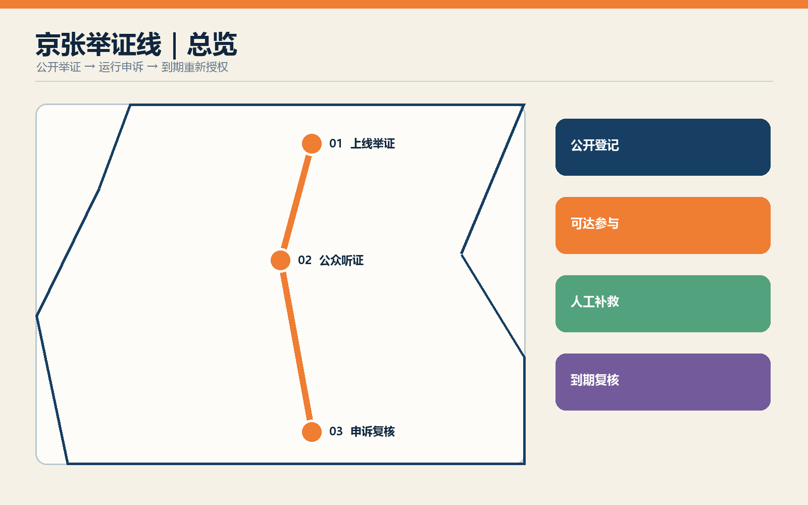
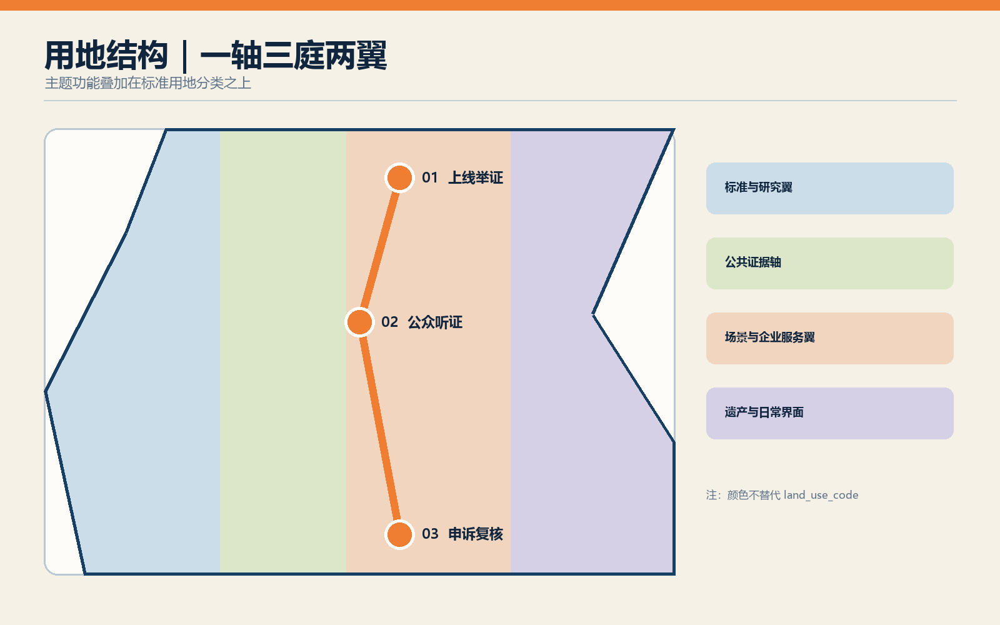
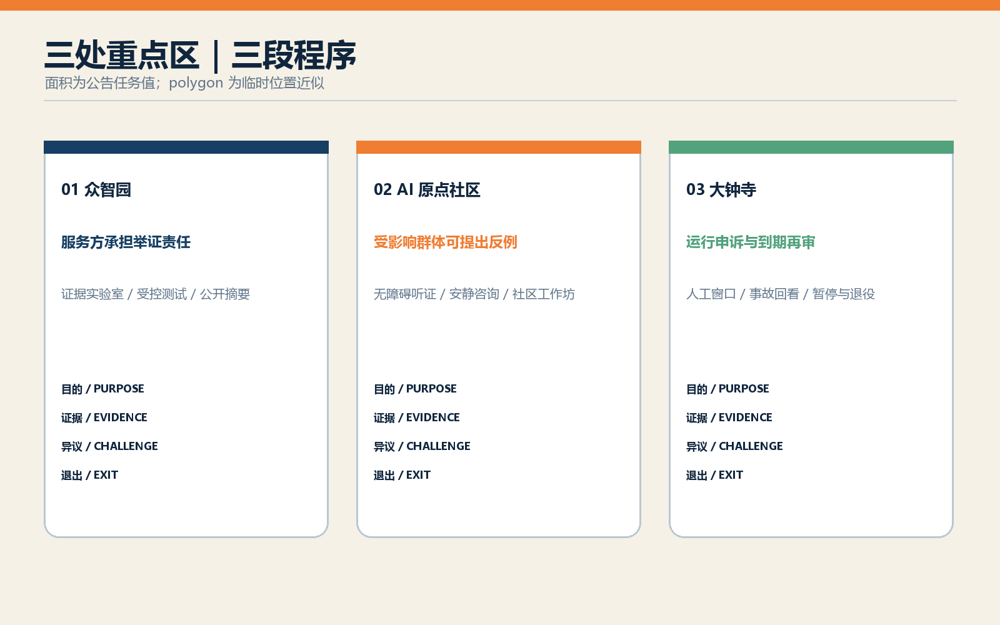
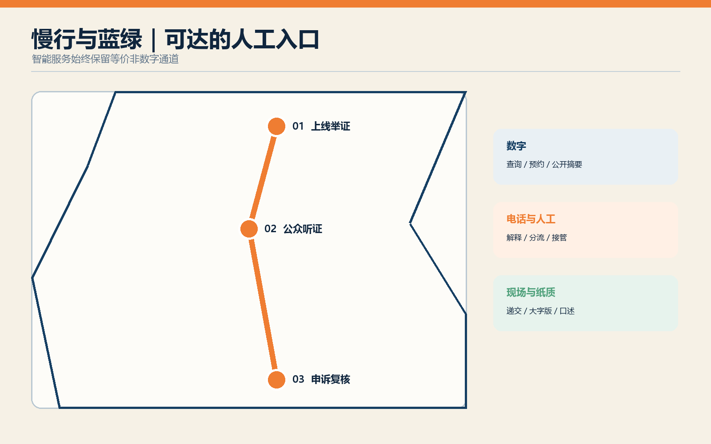
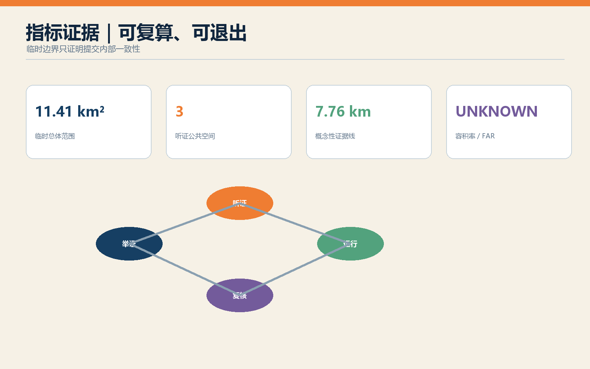

# 京张举证线：面向城市 AI 的上线听证、运行申诉与到期复核

## 设计依据与资料清单

本方案以《百年京张 AI 创新带城市设计国际方案征集》公告、智能体任务书和仓库场地包为直接依据。公告确定约 43.6 平方公里统筹研究、约 11.4 平方公里总体设计和约 368.4 公顷重点区域三个层次；场地包提供任务、来源登记、专业标准快照和临时几何。设计遵循住建部城市设计、控制性详细规划以及自然资源部用地分类文件的表达边界，同时把《生成式人工智能服务管理暂行办法》中的投诉举报机制作为运行治理参考。[source:OFFICIAL-ANNOUNCEMENT] [source:AGENT-TASKBOOK]

提交所用 `site_boundary` 与三个 `key_areas` 均来自仓库 provisional geometry，属性保留 `official_boundary=false` 和 `geometry_role=provisional_constraint`。它们只用于概念推演、面积复算和一致性校验，不是法定红线、确权依据或批准控制条件。容积率、建筑高度、道路红线、产权、市政容量和文保边界仍为未知；任何涉及这些条件的动作均须在正式数据到位后复核。[source:BOUNDARY-SOURCE] [assumption:A-BOUNDARY-001]

机器可读证据分布在 `sources.json`、`assumptions.json`、`metrics.json`、三张矩阵和九组 GeoJSON 中。图纸与离线 HTML 是这些文件的可读投影，不另造精确事实。国际案例用于比较测试、登记和公众参与方法，包括 AI Verify、英国 AI Security Institute、NIST ARIA、赫尔辛基 AI Register、阿姆斯特丹算法透明机制、纽约市 AI 行动计划与欧盟 AI Act 第 27 条；它们不构成本地法律义务。[source:IMDA-AI-VERIFY] [source:NIST-ARIA]

## 三层范围工作框架

“举证线”把三层空间与三段程序叠合。43.6 平方公里统筹研究范围建立城市 AI 供应链的共同规则：谁提出部署，谁说明目的、数据、受益者、风险与退出方法。11.4 平方公里总体设计范围以京张遗址公园为“公共证据轴”，串联测试、听证、申诉和复核节点。三个重点区域分别承担上线前举证、受影响群体听证以及运行后救济与重新授权，形成可步行、可阅读、可追溯的治理地景。[depth:three_level_scope_framework] [data:geometry/site_boundary.geojson#SITE-001]

空间不是行政程序的替代物。这里所称“听证”是城市设计层面的公众参与原型，由未来主管部门、运营方和社区共同确定适用范围；若法律另有正式程序，以正式程序为准。举证线只给出可落地的空间、记录和服务接口：公开登记台、证据实验室、无障碍听证厅、人工申诉窗口、事故回看室和到期复核广场。

每个层级都同时输出空间和治理结果。研究层形成 AI 服务分类、利益相关者地图和年度风险议程；总体层形成一轴三庭六类接口；重点层形成节点总图、项目清单和运营剧本。所有节点都有数字与非数字入口，所有结论区分公开来源、设计建议和待确认条件。[standard:PROJECT-AGENT-OPEN-CALL-TASKBOOK] [assumption:A-GOVERNANCE-001]

## 统筹研究范围产业与未来城市研究

海淀的优势在于高校、科研机构、平台企业、创业团队与高密度城市生活相邻。方案把这种邻近关系组织为“研究—测试—公开举证—场景采购—持续复核”的产业链。企业获得可预测的试验路径和合规辅导，研究机构提供测试方法，居民与一线服务人员提供使用情境，独立评估者保存相反证据。城市由单次展示 AI 的橱窗，转为能持续审查 AI 的公共基础设施。[source:AISI-EVALUATIONS] [source:IMDA-AI-VERIFY]

品牌采用“京张举证线 / JING-ZHANG EVIDENCE LINE”。京张铁路曾以工程证据证明自主建造能力；今天的创新带以公开证据证明城市 AI 是否值得进入公共生活。铁路里程碑、信号灯和站牌语汇被转译为风险等级、证据状态和复核日期，但不仿制文物。遗址公园上的“证据里程”记录通过、附条件通过、暂停和退役四种状态，让技术史与城市治理史并置。[assumption:A-HERITAGE-001] [depth:overall_spatial_structure]

产业服务包括评测工具、数据治理、无障碍测试、公共参与、事故调查、模型文档、保险与争议解决。建议建立年度“城市 AI 证据周”，发布经匿名化的测试摘要、失败案例和整改进度。活动是运营建议，不代表政府承诺；其价值在于把安全治理变成可采购的专业服务，使谨慎与创新形成同一条价值链。

## 总体设计范围城市更新与控规深度城市设计

总体结构为“一轴、三庭、两翼、十二触点”。一轴是京张遗址公园公共证据轴；三庭对应众智园“上线举证庭”、AI 原点社区“公众听证庭”、大钟寺“申诉复核庭”；西翼连接高校与标准能力，东翼连接企业、社区和真实场景。十二个触点嵌入轨道口、园区入口、社区服务中心和公园驿站，提供登记查询、人工帮助、无障碍反馈和纸质材料递交。[data:geometry/roads.geojson#ROAD-EVIDENCE-001] [depth:overall_spatial_structure]

用地保持仓库脚手架的四类标准编码分区，以避免把主题名称伪装成法定用地分类；主题功能通过 `program_role` 叠加。三处新增概念性服务亭、三块听证公共空间和一条慢行证据线均位于 provisional site 内。建筑基底只是设计提案，不代表现状建筑；存量建筑的保留、改造或拆除需等待建筑普查、权属和结构鉴定。[standard:MNR-LAND-USE-CLASSIFICATION-GUIDE] [assumption:A-BUILDING-001]

控制策略强调首层公共性、步行连续、标识可读和夜间低扰动。高度、密度、退线与停车配建不填入假设数值，统一标为待控规确认。更新优先采用既有公共空间微改造、可逆构筑物和运营试点，重大建设在交通、市政、文保及产权条件明确后另行设计。[standard:MOHURD-CONTROL-DETAILED-PLANNING] [metric:floor_area_ratio]

## 重点区域详细设计

**众智园｜上线举证庭。** 以证据实验室、受控试验场和公开登记厅组成上线前测试环。服务提供者提交用途边界、数据说明、性能分组、失败模式、人工接管与停用方案；研究机构和第三方评估者开展红队、无障碍与真实场景测试。清河侧公共空间展示可公开的测试方法和结论，不展示敏感数据。[data:geometry/key_areas.geojson#PROV-KEY-001] [source:NIST-ARIA]

**北京 AI 原点社区｜公众听证庭。** 临近高校与创新社区布置可分隔听证厅、安静咨询室和社区证据工作坊。居民、残障人士、学生、商户和一线工作人员可以查看用途说明、提出反例并要求人工解释。听证材料同时提供网页、纸质、大字版与现场口述入口。空间连接校区、园区和公园慢行网络，形成技术发布与公共审查并列的社区客厅。[data:geometry/key_areas.geojson#PROV-KEY-002] [source:NYC-AI-PARTICIPATION]

**大钟寺｜申诉复核庭。** 面向已运行场景设置人工服务柜台、事故回看室、召回发布台和到期复核广场。每项试点在进入运行时获得明确复核日期；临期须重新提交效果、偏差、投诉、补救和退出证据，未完成复核则转入暂停或退役。轨道站四象限步行联系和商业界面为高频服务提供可见入口。[data:geometry/key_areas.geojson#PROV-KEY-003] [source:HELSINKI-AI-REGISTER]

三处片区的面积采用公告文字值 192.1、104.3、72.0 公顷作为任务说明，提交 polygon 仅作位置近似，不能据其误判精确面积。详图所示构筑物、路线与项目均为概念性设计；正式深化前须替换官方边界并完成现状测绘、交通、市政、权属、消防、结构和文保核查。[assumption:A-KEYAREA-001] [metric:key_area_count]

## AI 创新生态、人才画像与 AI+ 场景

六类核心画像分别为：需要合规路径的初创团队、负责采购和运行的公共部门人员、承担评测的研究者、受到服务影响的居民、需要可达入口的残障与老年使用者、处理申诉的一线工作人员。补充画像包括园区企业、商户、学生、游客和独立媒体。画像均为待访谈验证的设计假设，不使用个人追踪数据。[assumption:A-STAKEHOLDER-001] [source:EU-AI-ACT-27]

十二张场景卡构成运营测试库：①AI 慢行导航；②低速机器人配送；③公共安全运行复核；④医疗服务导航；⑤文化遗产导览；⑥企业服务副驾；⑦上线前数据与偏差审计；⑧无障碍交互测试；⑨多语言压力测试；⑩事故回放与人工接管演练；⑪公众反例工作坊；⑫到期再授权评议。其中 7—9 是产业测试验证场景，10—12 是公共监督场景。每张卡记录目的、范围、责任人、数据最小化、退出条件和复核日期。

场景不以“高准确率”作为唯一通行证。上线前至少检查不同人群的性能差异、误用风险和服务中断后果；运行中记录申诉量、人工接管、纠正时间和重复伤害；到期时比较预期公共价值与实际外部成本。英国 AISI 明确说明评估不能等同“安全认证”，本方案沿用这一谨慎表述。[source:AISI-EVALUATIONS] [source:IMDA-AI-VERIFY]

空间承载与场景对应：众智园承载 7—10，原点社区承载 4、6、8、9、11，大钟寺承载 1—3、5、10、12；场景可跨区，但必须有唯一责任主体和人工服务点。企业服务、医疗导航和公共安全等高影响场景不直接输出决定，只辅助查找、分流和提示，最终权责按业务制度执行。[data:geometry/public_space.geojson#PUBLIC-HEARING-001] [assumption:A-OPERATIONS-001]

## 用地、建筑规模与拆改留方案

用地 GeoJSON 保留标准 `land_use_code` 和完整无重叠分区，并增加 evidence-lab、hearing-commons、appeal-services 等非管控属性，便于把治理功能与法定分类分开阅读。临时图层计算的总体范围面积约 1,141.28 公顷；该值仅说明当前提交几何，公告仍以约 11.4 平方公里为任务尺度。[metric:site_area_sqm] [data:geometry/land_use.geojson#LU-001]

建筑策略采用“保留优先、轻改造先行、新建最少”的顺序。既有建筑在没有普查资料时全部标为“待调查”，不下拆除结论；优先把首层大堂、园区展厅、社区服务中心和轨道商业空间改造成共享接口。新增的举证亭、听证亭和申诉亭为可逆小型公共服务原型，其概念基底面积由 GeoJSON 复算，面积不代表建设指标。[data:geometry/buildings.geojson#BLDG-EVIDENCE-001] [metric:building_footprint_area_sqm]

三个原型采用统一的 6 米模数、可拆装结构、遮雨廊和清晰视线。内部包含开放查询、私密咨询、工作人员安全区和设备维护区；无障碍入口不与货运或机器人路径冲突。屋面可结合光伏与雨水收集，但容量、消防和结构荷载须经专项设计。正式拆改留表需在现状测绘、产权、结构、消防、文保和运营主体确认后补齐。[assumption:A-CONTROLS-001] [depth:retain_renovate_demolish]

## 交通、轨道、市政与公共服务设施

交通以步行可达的公共服务网络为主。证据线连接三处重点区，并在轨道站、主要路口和公园驿站设置十二个触点；每个触点兼具纸质材料箱、二维码查询、语音求助和人工值守时段。大钟寺重点完善站口至申诉复核庭的四象限步行识别，原点社区强化校区—园区—社区慢行缝合，众智园把试验车辆与普通步行空间分时或分带组织。[data:geometry/roads.geojson#ROAD-EVIDENCE-001] [depth:traffic_rail_slow_parking]

低速机器人和自动驾驶试验采用“可见、可停、可绕行”的原则：限定路线和时段，设置实体急停与远程接管，发生冲突时优先保障行人，并保留不使用智能服务的等价路径。交通流量、轨道客流、道路红线和停车需求尚无可靠数据，因此路线是概念连接，不作为交通工程结论。[assumption:A-TRANSPORT-001] [source:NIST-ARIA]

市政层设置端侧脱敏、公开日志和应急断电接口，但不在公共空间储存可识别投诉材料。敏感记录进入依法管理的业务系统，展板和开放登记只显示匿名统计。公共服务按“数字入口 + 电话/人工 + 现场/纸质”配置；《无障碍环境建设法》第 39 条只对其列举的公共服务提出明确要求，本方案将多通道入口作为更广泛的设计原则，不扩大解释法律适用范围。[source:PRC-BARRIER-FREE-LAW] [source:PRC-GENAI-MEASURES]

## 蓝绿空间、公共空间与城市风貌

京张遗址公园是连续的证据轴，也是降温、雨洪、休闲和文化叙事的复合基础设施。现有 provisional 绿地和公共空间图层被保留并补充三块听证公共空间；铺装采用可逆标识，不破坏铁路遗存。证据里程牌以日期、服务目的和复核状态为主要信息，避免将模型排名塑造成永久荣誉。[data:geometry/green_space.geojson#GREEN-001] [metric:green_ratio]

公共空间按“公开—半公开—私密”梯度布置。广场可浏览登记和参加公开活动，廊下可获得协助，安静室处理需要隐私的申诉。树荫座椅、无障碍卫生间、饮水、夜间照明和清晰导向优先于大型屏幕。显示设备设低亮度时段和关闭模式，避免持续广告与感知设备侵扰居民。[data:geometry/public_space.geojson#PUBLIC-HEARING-002] [depth:blue_green_public_space]

城市风貌取自铁路结构的秩序感：深蓝代表已登记事实，信号橙代表待复核风险，暖白用于公众界面，绿色表示开放空间。图形系统使用“证据票据”和“复核日期戳”，不复制历史站房细部。涉及清华园站、大钟寺和铁路遗存的具体保护范围、建筑高度与材料控制均待文保和规划资料确认。[assumption:A-HERITAGE-001] [standard:MOHURD-URBAN-DESIGN-MEASURES]

## 更新项目清单、实施政策与分期计划

近期（0—18 个月）以轻量试点为主：JZ-E01 公共 AI 登记页与纸质索引、JZ-E02 原点社区证据工作坊、JZ-E03 大钟寺人工申诉窗口、JZ-E04 三类测试协议。中期（18—36 个月）实施 JZ-E05 众智园证据实验室、JZ-E06 三处听证公共空间、JZ-E07 十二个服务触点和 JZ-E08 事故回看机制。远期（36 个月后）再根据评估决定永久空间、产业服务规模和跨区网络。[data:geometry/phasing.geojson#PHASE-EVIDENCE-001] [depth:phasing_implementation]

政策建议采用“有期限的场景许可”。试点提出者先公开举证，主管或采购主体依据风险确定测试和公众参与强度；运行中必须保留人工申诉、纠正与暂停接口；到期后依据效果、差异影响、投诉和补救材料重新审议。该机制是设计建议，不能替代现行审批、采购、行政复议或司法救济。[assumption:A-GOVERNANCE-001] [source:EU-AI-ACT-27]

运营由四类角色共同完成：场景责任单位维护服务与退出方案，独立评估机构执行测试，社区合作方组织可达参与，公共监督方审查记录与冲突。预算、政府部门分工和采购路径尚未确定，所有项目在进入实施前须完成主体、资金、场地、数据和安全五项确认。每年发布匿名化运行年报，同时接受撤回、暂停和退役作为正常结果。[source:HELSINKI-AI-REGISTER] [assumption:A-OPERATIONS-001]

## 指标体系、面积复算与合规矩阵

空间指标由 EPSG:4326 交换、EPSG:4548 计算。当前 provisional site 面积、设计建筑基底、绿地率、公共空间率和三处重点区域数量写入 `metrics.json`；容积率保持 unknown。土地分区必须覆盖 site 且无重叠，设计要素不得越界。指标表达的是本提交内部一致性，不将临时边界升级为官方依据。[metric:site_area_sqm] [metric:key_area_count]

治理指标采用可审计但不设伪精确门槛的六组量：已登记场景覆盖率、按期复核率、人工入口可达性、申诉获答情况、重复伤害与退出完成度、受影响群体参与广度。正式阈值应由场景风险、业务规范和公众协商确定；本方案只规定必须记录分母、时间窗、群体差异和负责单位，避免用总平均掩盖弱势群体体验。[source:NYC-AI-PARTICIPATION] [source:EU-AI-ACT-27]

`compliance_matrix.json` 覆盖公告 17 项和 agent.1—agent.6，`standard_matrix.json` 对照专业与治理依据，`design_depth_matrix.json` 检查 15 项设计深度。任何一项缺少章节、图纸、几何、指标、来源、假设或自检证据时，包不应宣称 ready。图中数值可回到 JSON 和 GeoJSON 复算。[depth:metrics_recalculation] [standard:PROJECT-OFFICIAL-ANNOUNCEMENT]

## 风险、版权与合规说明

首要风险是把设计性治理原型误读为法定程序。所有“听证、许可、复核”均标注为概念建议，正式适用须由有权主体依法确定。第二类风险是边界与控规资料不完整，可能改变面积、道路、建筑和项目位置；正式深化须整体替换并重算。第三类风险来自 AI 本身，包括偏差、隐私泄露、过度依赖、无法申诉、自动化歧视和供应商退出。[assumption:A-CONTROLS-001] [source:PRC-GENAI-MEASURES]

风险控制包括数据最小化、用途限制、分组测试、人工复核、等价非数字通道、事故暂停、记录保存与到期退出。高影响场景不得仅以企业自评通过；公开摘要与敏感技术材料分层保存。投诉材料不进入公共可视化，公开案例需去标识并获得适当授权。任何测试结果都说明方法、样本和局限，不宣称“已证明安全”。[source:AISI-EVALUATIONS] [source:IMDA-AI-VERIFY]

本包的文本、代码生成图件和布局由 OpenAI Codex 生成并由提交者负责；公共资料按引用用途使用，第三方网站标识不嵌入图件。许可为 `COMMUNITY-DISPLAY-ONLY`，版权与来源见 `report/copyright_statement.md` 和 `sources.json`。离线 HTML 不加载远程脚本、字体、地图、表单或分析工具。中英文文本与图件成对提供；若语义冲突，以中文原文为主。[source:SITE-PACKAGE] [assumption:A-COPYRIGHT-001]

## 参考资料

项目直接依据包括官方公告、智能体任务书、场地包、来源登记、专业标准快照和临时边界；完整路径、使用范围与许可记录见 `sources.json`。正文只在相关判断旁保留少量证据标记，避免把机器索引堆入阅读段落。[source:SOURCE-REGISTRY] [source:PROCESSED-FACT-PACK]

国际方法参考包括新加坡 IMDA AI Verify、英国 AI Security Institute 评估方法、美国 NIST ARIA、赫尔辛基 AI Register、阿姆斯特丹算法透明实践、纽约市 AI 公共参与指南和欧盟 AI Act 第 27 条。它们分别支持测试工具、独立评估、现场测试、公开登记、透明沟通、参与设计与影响评估的比较研究，均不作为中国本地法律结论。[source:NIST-ARIA] [source:HELSINKI-AI-REGISTER]

阿姆斯特丹案例补充了面向普通公众解释算法用途和责任的沟通方法；三处重点区域的位置证据仍只来自赛事仓库的临时范围，不从国际案例推导场地事实。[source:AMSTERDAM-ALGORITHMS] [source:KEY-AREA-SOURCE]

中国治理参考包括《生成式人工智能服务管理暂行办法》和《无障碍环境建设法》。前者第 15 条用于说明投诉举报机制，后者第 39 条仅在其列举的公共服务范围内引用。城市设计与用地表达回到标准矩阵所列住建部、自然资源部文件。待官方边界、控规、市政、交通、建筑、权属与文保资料补齐后，须重新运行空间复算、图纸渲染和完整自检。[source:PRC-GENAI-MEASURES] [source:PRC-BARRIER-FREE-LAW]

专业深度的剩余索引包括现状诊断、用地布局与强度控制；它们在图层和待确认清单中分别落位，不以缺失数据推导结论。[depth:existing_conditions_diagnosis] [depth:land_use_layout] [depth:development_intensity_controls]

建筑高度体量、市政新基建和三处重点区详设均保留独立核对项；建筑专业设计深度文件尚未取得，矩阵将其标为资料缺口。[depth:height_massing_character] [depth:municipal_new_infrastructure] [depth:three_key_area_detailed_design]

更新项目、风险缺口和临时约束图层共同界定实施边界。图中另行显示公共空间比例、概念证据线长度和三处听证公共空间数量，数值均可从提交图层复算。[depth:renewal_project_list] [depth:risk_missing_data] [data:geometry/constraints.geojson#CONSTRAINTS]

提交包的新增已知指标在正文集中声明，避免被误认为官方规划控制。[metric:public_space_ratio] [metric:evidence_spine_length_m] [metric:public_hearing_commons_count]

建筑专业正式深度仍待官方文件和专业团队补充，本方案只完成城市设计层面的概念基底、接口与前置条件表达。[standard:MOHURD-ARCH-DESIGN-DEPTH-2016]
