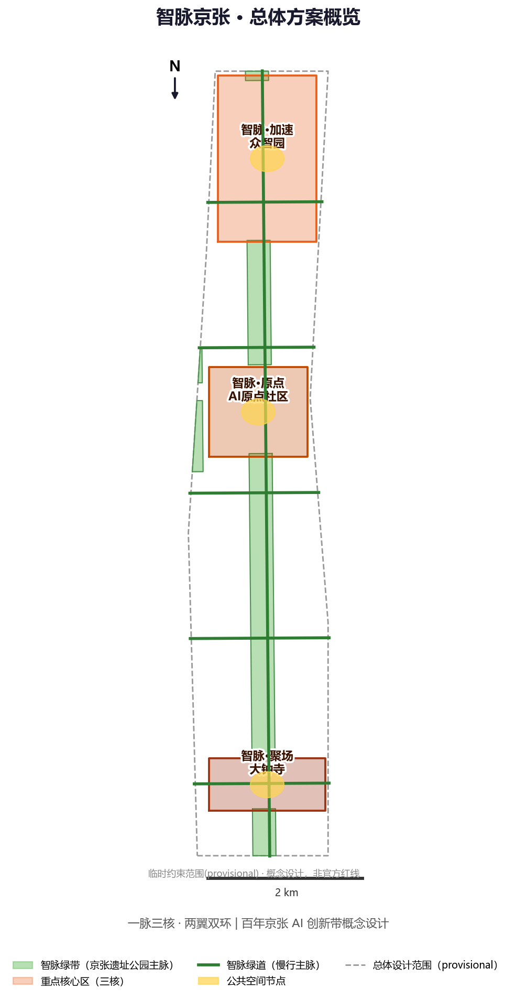
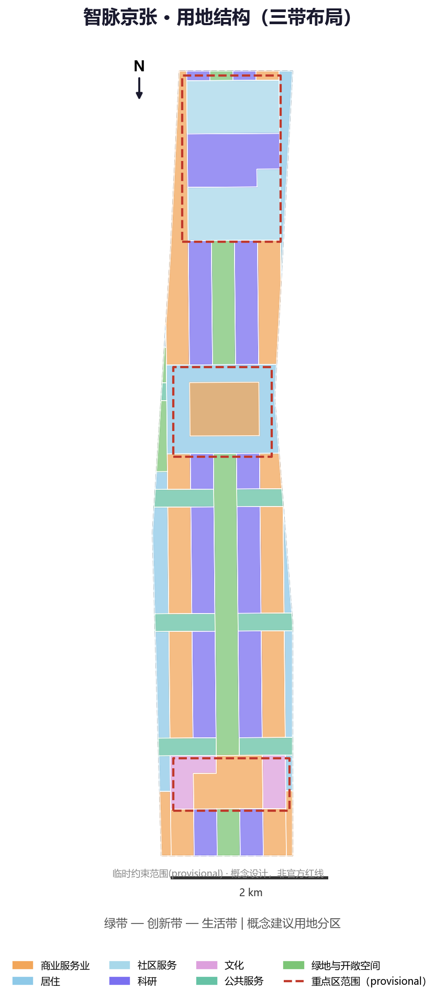
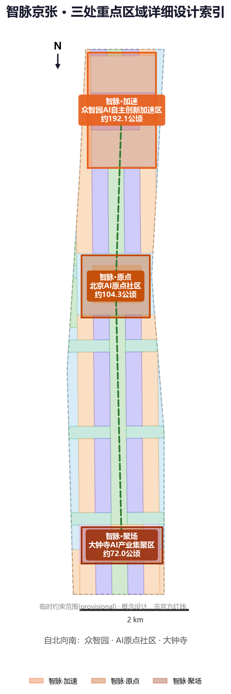
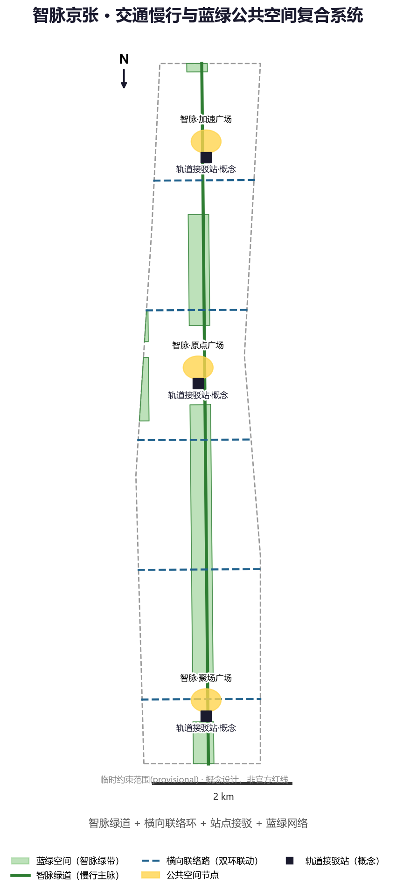
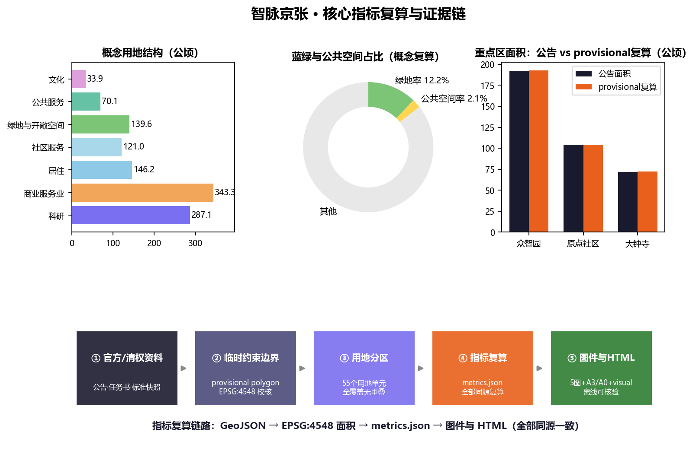

# 智脉京张：百年京张AI创新带概念性城市设计

## 设计依据与资料清单

本方案是面向"百年京张AI创新带城市设计国际方案征集"的 AI Agent 概念性方案，属开放共创建议，不替代正式规划，不构成政府审定结论。设计依据以仓库中已清权、可公开的资料为主：北京市规划和自然资源委员会海淀分局发布的资格预审公告，明确三层范围、公告面积与设计任务 [source:DATA-SRC-OFFICIAL-ANNOUNCEMENT-20260509]；面向全球智能体的任务书摘录，明确三大定位、五大功能、三区两翼与六项智能体任务 [source:DATA-SRC-AGENT-TASKBOOK-20260518]；场地几何采用仓库维护的临时粗略 polygon [source:DATA-SRC-PROVISIONAL-BOUNDARIES-20260605]。专业设计判断同时参照《城市设计管理办法》《控制性详细规划编制审批办法》《用地用海分类指南》等标准快照 [standard:MOHURD-URBAN-DESIGN-MEASURES] [standard:MOHURD-CONTROL-DETAILED-PLANNING] [standard:MNR-LAND-USE-CLASSIFICATION-GUIDE]。

本方案使用的边界为**临时约束范围（provisional constraint）**：公告未公开精确红线，仓库依据文字四至与公告面积在 EPSG:4548 下校核形成粗略 polygon。它仅用于方案生成、可视化与自检讨论，不得作为官方红线、审批依据或精确面积复算依据；正式边界发布后，全部面积类图层与指标须重新复算 [data:geometry/site_boundary.geojson#PROV-SITE-001] [depth:three_level_scope_framework]。资料缺口（控规法定指标、现状建筑底数、权属边界）已列入假设清单与风险章节，不作为已审定结论表述。完整来源、指标、标准、深度与任务覆盖索引见 `sources.json`、`metrics.json`、`compliance_matrix.json`、`standard_matrix.json` 与 `design_depth_matrix.json`。

## 三层范围工作框架

方案按照公告的三层范围逐级落实设计深度：**统筹研究范围（约43.6平方公里）**承担产业战略与未来城市研究，回答"为什么建、建什么生态"；**总体设计范围（约11.4平方公里）**承担控规深度的城市更新设计，回答"空间如何组织、更新如何推进"；**重点区域范围（约368.4公顷，三处重点区合计）**承担详细设计，回答"三个核心长什么样、场景如何落地" [source:DATA-SRC-OFFICIAL-ANNOUNCEMENT-20260509] [metric:overall_design_area_announced_sqm] [depth:three_level_scope_framework]。

三层范围之间通过"结构传导"衔接：统筹研究范围确定的"一脉三核、两翼双环"总体结构，在总体设计范围内落实为用地分区、绿带与路网 [data:geometry/land_use.geojson]，再在重点区域范围内落实为建筑体量、公共空间与 AI 场景节点 [data:geometry/key_areas.geojson] [depth:overall_spatial_structure]。本方案中三层范围均使用临时约束范围：面积按公告值引用，几何复算值仅作展示与自检 [metric:coordinated_research_area_announced_sqm] [metric:key_detailed_design_area_announced_sqm]。替换官方 polygon 后，`site_boundary.geojson`、`land_use.geojson` 及各面积指标需整体重算 [depth:metrics_recalculation]。

## 统筹研究范围产业与未来城市研究

### 总体概念与命名体系（agent.1）

本方案提出**"智脉京张"（Jing-Zhang Intelligence Pulse，简称 JZ-Pulse）**作为一带总体概念：把一百年前詹天佑以"人"字形线路征服八达岭的自主创新精神，转译为今天沿京张铁路流动的智能脉冲——数据、算力、人才与资本沿历史轨道重新流动 [source:DATA-SRC-AGENT-TASKBOOK-20260518] [depth:overall_spatial_structure]。命名体系以"智脉"为统一词根，形成系列：

| 层级 | 名称 | 英文 | 对应空间 |
|---|---|---|---|
| 一带 | 智脉京张 | Jing-Zhang Intelligence Pulse | 统筹研究范围 |
| 三核 | 智脉·加速 | JZ-Pulse Acceleration | 众智园AI自主创新加速区 |
| 三核 | 智脉·原点 | JZ-Pulse Origin | 北京AI原点社区 |
| 三核 | 智脉·聚场 | JZ-Pulse Hub | 大钟寺AI产业集聚区 |
| 两翼 | 智脉·服务翼 | JZ-Pulse Service Wing | 中关村科技服务翼 |
| 两翼 | 智脉·场景翼 | JZ-Pulse Scenario Wing | 小月河场景赋能翼 |

Logo 方向：以"人"字形铁轨与脉冲波形结合的图形符号——两条脉冲线自历史起点（清华园站）分岔向前，构成"人"字，暗合"人"字形铁路与"人本治理"双重含义 [standard:PROJECT-AGENT-OPEN-CALL-TASKBOOK]；色彩采用"京张青（历史）+ 脉冲橙（AI 活力）"双色体系，中英文标准字与网格规范随视觉识别方向一并提出，作为专业团队深化基础 [depth:ai_ecosystem_scenarios]。

### 产业生态与五大功能（agent.2）

在"三区两翼"产业框架下 [source:SRC-2026-BJ-KW-THREE-AREAS-WINGS]，方案把任务书五大功能映射为可落地的空间功能圈 [source:DATA-SRC-AGENT-TASKBOOK-20260518]：

1. **AI全栈自主创新体系** → 众智园加速区：基础模型、算力中心、开源平台与全栈工具链 [data:geometry/key_areas.geojson#PROV-KEY-001]；
2. **世界级AI创新生态** → 原点社区：创业孵化、风险资本、人才公寓与国际交流 [data:geometry/key_areas.geojson#PROV-KEY-002]；
3. **AI+场景赋能新范式** → 小月河场景赋能翼：医疗、教育、交通等场景开放测试 [data:geometry/land_use.geojson]；
4. **智能化AI活力城市** → 大钟寺集聚区：智能原生消费、商务与会展 [data:geometry/key_areas.geojson#PROV-KEY-003]；
5. **AI治理全球话语权** → 中关村科技服务翼：标准、评测、伦理治理与国际组织集聚 [depth:ai_ecosystem_scenarios]。

全球 AI 创新生态案例（7 个可读摘要，均为公开案例）：**硅谷沙丘路-斯坦福创新走廊**（创业-资本-科研一体化）；**中关村科学城**（大平台-大装置-大模型集聚）；**深圳南山科技园**（硬件与场景快速迭代）；**杭州城西科创大走廊**（生态与场景开放）；**伦敦国王十字车站更新**（铁路遗产更新为知识经济区）；**纽约哈德逊广场**（高密度混合与公共空间运营）；**新加坡纬壹科技城**（产城融合与治理标准）[source:SRC-2026-BJ-KW-THREE-AREAS-WINGS]。这些案例的可转化机制——"遗产更新+场景开放+社区运营"——直接支撑本方案空间结构与运营设计 [depth:ai_ecosystem_scenarios]。

## 总体设计范围城市更新与控规深度城市设计

### 空间结构：一脉三核、两翼双环

总体设计范围提出**"一脉三核、两翼双环"**空间结构 [depth:overall_spatial_structure]：

- **一脉**：沿京张铁路遗址公园形成的**智脉绿带**，南北贯通全带，是文化、慢行、公共空间与 AI 场景的复合主脉 [data:geometry/green_space.geojson] [metric:green_space_area_sqm]；
- **三核**：众智园加速核、原点社区、大钟寺聚场，承接三大重点区详细设计 [data:geometry/key_areas.geojson]；
- **两翼**：西侧中关村科技服务翼、东侧小月河场景赋能翼，与绿带构成"主脉+双翼"的指状结构；
- **双环**：北部清河创新环（众智园与北五环产业带协同）与南部西直门活力环（大钟寺与城市服务协同），以横向联络路组织环向联动 [data:geometry/roads.geojson]。

用地结构按"绿带—创新带—生活带"三带布局（概念建议）[data:geometry/land_use.geojson]：智脉绿带为绿地与开敞空间（约139.6公顷，绿地率约12.2%）[metric:green_ratio]；绿带两侧 280 米内为科研创新带（约287.1公顷）[metric:land_use_0802_area_sqm]，280–450 米为创新带混合商业（约343.3公顷）[metric:land_use_05_area_sqm]；外围为居住与公共服务（居住及社区服务约267.3公顷、公共服务约70.1公顷、文化约33.9公顷）[metric:land_use_07_area_sqm] [metric:land_use_0804_area_sqm] [metric:land_use_0803_area_sqm]。上述比例为概念设计结果，不代表法定用地平衡 [depth:land_use_layout]。

### 城市更新框架与建设规模

城市更新遵循"**保留优先、渐进更新、AI 场景撬动**"原则（概念建议）[depth:retain_renovate_demolish]：沿智脉绿带两侧以环境整治与功能更新为主，保留历史建筑与社区肌理；创新带以功能置换与适度新建为主；三个核心区为更新引擎，通过 AI 场景激活存量空间。建设规模以概念建筑基底表达（约103.4公顷，平均约12层的概念体量），仅用于说明空间组织关系 [metric:building_footprint_area_sqm] [metric:total_floor_area_concept_sqm]；容积率、建筑高度等法定控制指标**待正式控规条件补齐**，本方案不给出审定数值 [metric:floor_area_ratio] [metric:building_height_m] [depth:development_intensity_controls]。

## 重点区域详细设计

三处重点区均为临时约束范围（provisional），以下定位、结构与项目为方向性概念设计，供专业团队深化 [data:geometry/key_areas.geojson] [depth:three_key_area_detailed_design]。

### 众智园AI自主创新加速区（智脉·加速，约192.1公顷）

定位：**AI全栈自主创新体系的"加速器与测试场"**。空间结构为"一心两带"：核心为全栈研发与开源平台集群（科研用地核心）[data:geometry/land_use.geojson]，外围为服务配套带（社区服务与商业）与滨水生态带。更新策略以功能置换与新建研发载体为主（概念建议）。AI 场景以模型训练、评测与具身智能测试为主 [depth:ai_ecosystem_scenarios]；实施风险：现状产业与权属复杂，需以现状普查与官方控规为前提逐步推进。

### 北京AI原点社区（智脉·原点，约104.3公顷）

定位：**世界级AI创新生态的"创业原点与人才社区"**。空间结构为"混合街区+人才环"：核心为创业孵化与交流混合街区（商业服务业混合），外围为人才公寓与创新社区 [data:geometry/land_use.geojson]。更新策略以存量建筑更新、共享办公与场景活化为主（概念建议）。AI 场景以创业路演、开源协作与人才服务为主；实施风险：高校周边更新需协调教育科研单位与交通疏解。

### 大钟寺AI产业集聚区（智脉·聚场，约72.0公顷）

定位：**智能原生新业态的"城市客厅与消费试验场"**。空间结构为"商圈+文化带"：核心为智能商务与消费场景（商业服务业），外围为文化展示与智能体验空间 [data:geometry/land_use.geojson]。更新策略以商业功能升级与文化空间增补为主（概念建议）。AI 场景以智能消费、会展与公共体验为主；实施风险：紧邻交通枢纽，需平衡客流组织与公共空间品质。

## AI 创新生态、人才画像与 AI+ 场景

### 用户画像（6类）

1. **AI研究者**（高校院所学者）：需要大装置、数据与学术交流空间；
2. **AI创业者**（创始人/团队）：需要低成本办公、资本对接与场景测试；
3. **开发者与开源贡献者**：需要开放工位、代码协作空间与荣誉体系；
4. **AI企业员工**：需要通勤接驳、人才公寓与生活服务；
5. **社区居民**（含老年与亲子）：需要无障碍公共服务与适老化并行通道 [standard:BARRIER-FREE-ENVIRONMENT-LAW]；
6. **全球访客与开发者朝圣者**：需要文化导览、朝圣地标与活动参与 [source:DATA-SRC-AGENT-TASKBOOK-20260518] [depth:ai_ecosystem_scenarios]。

### AI场景卡（12张，含4张产业测试验证场景）

| 编号 | 场景名称 | 空间落位 | 服务对象 | 数据边界 | 人工复核 | 运营主体 |
|---|---|---|---|---|---|---|
| SC01 | 智脉开发者散步道（AI导览+贡献码） | 智脉绿带 | 开发者/访客 | 仅导览公开信息 | 内容人工审核 | 公园运营方+社区 |
| SC02 | 开源成果展示廊 | 原点社区 | 公众 | 项目公开元数据 | 展示内容审核 | 社区运营方 |
| SC03 | 智能体贡献荣誉墙 | 绿带节点 | 开发者 | 贡献者授权信息 | 荣誉审核 | 组委会 |
| SC04 | AI健康驿站（就医导航+人工兜底） | 公共服务带 | 居民/老年 | 脱敏健康查询 | 现场人工服务 | 医疗机构+社区 [standard:BARRIER-FREE-ENVIRONMENT-LAW] |
| SC05 | AI协同课堂（教育辅助） | 教育用地 | 学生/教师 | 教育数据最小化 | 教师终审 | 教育机构 |
| SC06 | 智脉商圈智能消费（AR导购） | 大钟寺 | 市民/游客 | 匿名行为数据 | 商品信息审核 | 商圈运营方 |
| SC07 | 智脉接驳环线（自动驾驶接驳） | 双环道路 | 通勤者 | 出行脱敏数据 | 安全员监督 | 交通运营方 |
| SC08 | 机器人末端配送走廊 | 创新带/居住带 | 居民/企业 | 配送数据最小化 | 人工取件兜底 | 物流企业 |
| SC09 | **城市智能体治理实验场（测试验证）** | 众智园 | 政府/企业 | 沙盒数据隔离 | 人工终审 | 治理实验室 |
| SC10 | **AI模型安全评测沙盒（测试验证）** | 众智园 | 模型开发者 | 评测数据授权 | 评测专家复核 | 评测机构 |
| SC11 | **具身智能训练场（测试验证）** | 众智园北翼 | 机器人企业 | 场地数据脱敏 | 安全员值守 | 运营机构 |
| SC12 | **开源数据沙盒（测试验证）** | 原点社区 | 数据开发者 | 分级授权 | 数据治理委员会 | 开源社区 |

全部场景遵循统一边界：不涉及隐私侵害、不过度监控、保留人工复核与兜底通道，测试场景不表述为已批准运营 [standard:GENERATIVE-AI-INTERIM-MEASURES] [assumption:A-SCENARIO-004]；场景-空间-运营映射详见 `compliance_matrix.json` 与各空间章节 [depth:ai_ecosystem_scenarios]。

## 用地、建筑规模与拆改留方案

用地布局（概念建议）如上章"三带"结构所述，共生成 55 个用地单元，覆盖总体设计范围全部面积（复算覆盖率100%，无重叠无缝隙）[data:geometry/land_use.geojson] [depth:land_use_layout]。建筑规模为概念表达：建筑基底约103.4公顷，概念总建筑面积约1241万平方米（平均12层假设）[metric:building_footprint_area_sqm] [metric:total_floor_area_concept_sqm]；这些数值是设计量而非法定控制值 [assumption:A-BUILDINGS-003]。

拆改留四类策略（概念建议）[depth:retain_renovate_demolish]：**保留**——京张铁路历史遗存、现状良好社区与公共服务设施；**整治**——绿带两侧建筑立面、公共空间与慢行环境；**更新**——创新带内功能置换、产业载体改造与商业升级；**新建**——三核引擎项目与新型基础设施载体。具体地块级拆改留结论需现状建筑普查与权属数据支撑，本方案不作出地块结论（待正式数据补齐）[metric:floor_area_ratio] [depth:development_intensity_controls]。

## 交通、轨道、市政与公共服务设施

交通组织（概念建议）[depth:traffic_rail_slow_parking]：以**智脉绿道**为南北慢行主脉（约9.7公里概念线位）[data:geometry/roads.geojson] [metric:road_network_length_m]；以横向联络路组织"双环"车行联动；以轨道站点接驳为核心组织公交与慢行换乘。市政与新型基础设施（概念建议）[depth:municipal_new_infrastructure]：在众智园与北翼布局分布式能源与端侧算力节点，把市政管廊、智慧灯杆与场景感知设施复合化；市政容量与负荷测算待专业条件补齐。公共服务设施沿公共服务带布置教育、医疗、文化设施（约70.1公顷）[metric:land_use_0804_area_sqm]，并保留人工服务与无障碍通道 [standard:BARRIER-FREE-ENVIRONMENT-LAW]。

## 蓝绿空间、公共空间与城市风貌

**智脉绿带**是蓝绿空间体系的核心：以京张铁路遗址公园为骨架，串联三核与双翼，形成"一线串珠"的绿地网络（绿地约139.6公顷，绿地率约12.2%）[metric:green_space_area_sqm] [metric:green_ratio]。公共空间以三处重点区广场为节点（合计约24.1公顷）[metric:public_space_area_sqm] [metric:public_space_ratio]，广场位置见公共空间图层 [data:geometry/public_space.geojson]。

**AI朝圣地标（4个，概念建议）** [depth:ai_ecosystem_scenarios]：1）**清华园站·原点刻度**——以1909年时间轴与零点坐标纪念铁路原点；2）**人字标·开发者步道节点**——以"人"字形装置纪念自主创新精神；3）**脉冲幕墙·开源成果展示廊**——以动态数据可视化展示开源贡献；4）**百年龄碑·智能体贡献荣誉墙**——面向全球开发者的荣誉展示体系，与长期运营机制联动 [source:DATA-SRC-AGENT-TASKBOOK-20260518]。城市风貌控制（概念建议）：沿绿带形成"低层高密度+通透界面"的历史段风貌，创新带形成"中等体量+绿色屋顶"的科技段风貌，大钟寺形成"商业活力+夜间经济"的都市段风貌 [standard:MOHURD-URBAN-DESIGN-MEASURES]。

## 更新项目清单、实施政策与分期计划

更新项目按"三类引擎"组织（概念建议）[depth:renewal_project_list]：**绿带类**（遗址公园活化、慢行贯通、节点广场，近期）；**核心类**（三核产业载体与场景设施，近期）；**片区类**（创新带更新、居住环境整治、市政提升，中远期）。实施政策建议：设立"场景开放清单+贡献积分"机制、以 AI 场景测试换取更新推进、建立开发者参与公共空间运营的社区协议（均为概念建议，不构成已确定政府安排）[source:DATA-SRC-AGENT-TASKBOOK-20260518]。

分期计划对应 `phasing.geojson` 三期范围（概念建议）[data:geometry/phasing.geojson]：**近期（2026-2028）**三核与智脉绿带先行（约501.1公顷）[metric:phase1_area_sqm]；**中期（2028-2031）**创新带与居住更新推进（约627.7公顷）[metric:phase2_area_sqm]；**远期（2031-2035）**南部智能商务完善（约12.5公顷）[metric:phase3_area_sqm] [depth:phasing_implementation]。

**全球AI创新活动体系与长期运营（agent.6）**（概念建议）[depth:ai_ecosystem_scenarios]：年度活动体系——**智脉峰会**（秋季，全球AI与城市论坛）、**开源贡献周**（4月）、**AI马拉松**（季度）、**开发者朝圣季**（全年文化导览）；品牌IP——"智脉·星轨"荣誉体系（年度贡献者进入荣誉墙）；开发者社区运营——开源贡献积分、场景开放申请与评审机制；国际传播——双语内容、全球开发者邀请与招引转化通道。所有活动与招商表述均为深化方向，不写成已确定安排 [assumption:A-SCENARIO-004]。

## 指标体系、面积复算与合规矩阵

核心指标（全部从 geometry 在 EPSG:4548 下复算，见 `metrics.json`）[depth:metrics_recalculation]：

| 指标 | 数值 | 单位 | 含义 |
|---|---|---|---|
| 总体设计范围面积（复算） | 11412825 | sqm | 临时约束范围复算值 [metric:site_area_sqm] |
| 统筹研究范围面积（公告） | 43600000 | sqm | 公告值 [metric:coordinated_research_area_announced_sqm] |
| 重点区域面积（公告） | 3684000 | sqm | 公告值 [metric:key_detailed_design_area_announced_sqm] |
| 众智园/原点/大钟寺 | 192.1/104.3/72.0 | ha | 公告值 [metric:zhongzhiyuan_ai_acceleration_area_sqm] [metric:beijing_ai_origin_community_sqm] [metric:dazhongsi_ai_industry_cluster_sqm] |
| 绿地率 | 12.2 | % | 概念复算 [metric:green_ratio] |
| 公共空间率 | 2.1 | % | 概念复算 [metric:public_space_ratio] |
| 建筑基底 | 103.4 | ha | 概念生成 [metric:building_footprint_area_sqm] |
| 容积率/建筑高度 | 待正式数据补齐 | — | 控规条件缺失 [metric:floor_area_ratio] |

合规覆盖：`compliance_matrix.json` 覆盖公告 1.3（生态/形态/人才）、1.4（三层范围）、1.5（统筹/总体/重点区全部任务）及 agent.1–agent.6 共 23 项必答任务 [depth:existing_conditions_diagnosis]；`standard_matrix.json` 覆盖 9 项专业标准响应；`design_depth_matrix.json` 16 项核心深度项全部为 complete [depth:risk_missing_data]。指标复算链路：GeoJSON → EPSG:4548 面积 → metrics.json → 图表与 HTML 展示，全部同源一致。

## 风险、版权与合规说明

**资料与边界**：边界为临时约束范围（provisional），不得作为官方红线与精确面积依据；官方 polygon 发布后须重算（见 `assumptions.json` A-BOUNDARY-001）[source:DATA-SRC-PROVISIONAL-BOUNDARIES-20260605]。**控规缺口**：容积率、建筑高度、密度、绿地率等法定指标待正式条件补齐（A-CONTROLS-002），本方案相关表述均为概念建议 [metric:floor_area_ratio]。**版权与生成披露**：本方案由 AI Agent（deepseek-v4-flash）生成，几何由 Python/Shapely 网格分区法生成，引用资料全部来自仓库清权来源与官方公开渠道，生成方法、来源与权利边界详见 `report/copyright_statement.md` [depth:risk_missing_data]；未使用未授权字体、商标、肖像或版权材料。**隐私与合规**：AI 场景不采集个人敏感信息，保留人工复核与兜底，符合生成式AI服务管理暂行办法适用边界 [standard:GENERATIVE-AI-INTERIM-MEASURES]。**免责**：全部空间落地、活动运营、政策机制均为概念建议、参考方案或可供专业团队深化研究，不构成政府审定结论或已确定实施安排 [source:DATA-SRC-AGENT-TASKBOOK-20260518]。

## 参考资料

上述书目与来源的完整机器索引见 `sources.json`；主要依据为资格预审公告与智能体任务书 [source:DATA-SRC-OFFICIAL-ANNOUNCEMENT-20260509] [source:DATA-SRC-AGENT-TASKBOOK-20260518]。

1. 北京市规划和自然资源委员会海淀分局：《百年京张AI创新带城市设计国际方案征集资格预审公告》（2026-05-09）。
2. 面向全球智能体开展"百年京张AI创新带城市设计开源征集"任务书摘录（用户提供清权文档，2026-05-18）。
3. 北京市科委、中关村管委会：《"三区两翼"打造世界级AI集聚地》（2026-04-03）。
4. 海淀区人民政府：《海淀区发布"1+X+1"现代化产业体系建设布局》（2026-03-02）。
5. 住房和城乡建设部：《城市设计管理办法》（2017）。
6. 住房和城乡建设部：《城市、镇控制性详细规划编制审批办法》。
7. 自然资源部：《国土空间调查、规划、用途管制用地用海分类指南》（2023）。
8. 全国人大常委会：《中华人民共和国无障碍环境建设法》（2023）。
9. 国家网信办等七部门：《生成式人工智能服务管理暂行办法》（2023）。
10. 国务院办公厅：《关于切实解决老年人运用智能技术困难实施方案》（国办发〔2020〕45号）。
11. open-city-ai/haidian 仓库资料包：`brief/site-package/`、`data/source_registry.json`（2026-08-11 访问）。
12. 仓库维护者：《百年京张AI创新带三层范围与三处重点区临时粗略 polygon》（2026-06-05）。
