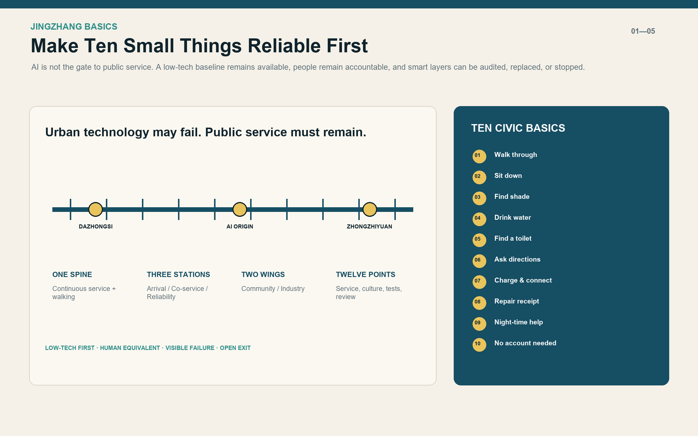
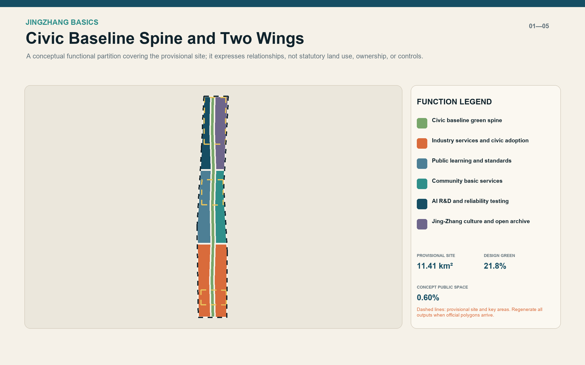
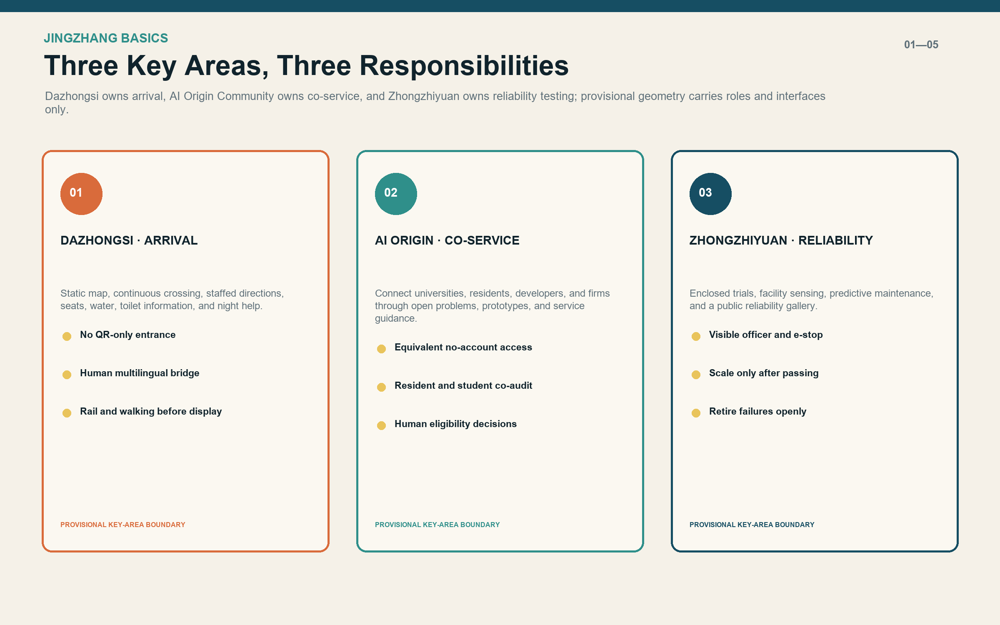
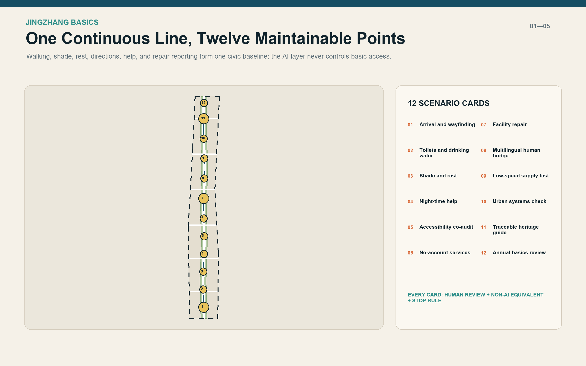
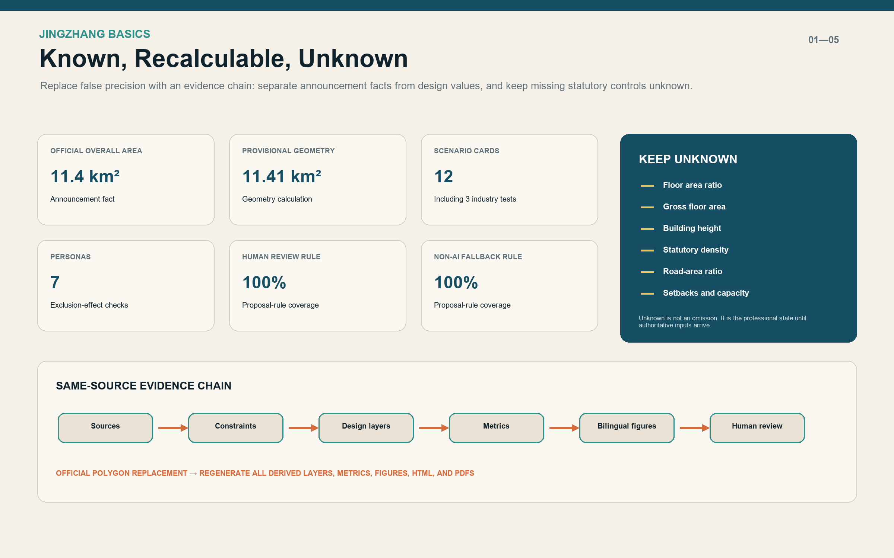

# JINGZHANG BASICS

> **Make ten small things reliable first.** Before calling the corridor an AI city, make sure everyone can walk through it, sit down, find shade, drink water, locate a toilet, ask for directions, request help at night, and report a broken facility. A person must not lose an equivalent service because they lack a smartphone, an account, or consent to profiling. AI is a replaceable and auditable enhancement, never the gatekeeper.

## Design Basis and Source List

This proposal uses the official prequalification announcement, the repository's agent-facing taskbook extract, and the registered site package as its working basis. The announcement defines a 43.6-square-kilometre coordinated research area, an approximately 11.4-square-kilometre overall design area, and three key areas. The package does not currently contain official precise redlines, road boundaries, ownership, surveyed buildings, verified facility inventories, or regulatory controls. Repository-maintained rough polygons are therefore treated only as provisional constraints.[source:OFFICIAL-ANNOUNCEMENT]

The design begins with everyday reliability rather than a list of technologies. The taskbook asks for identity, global cases, scenario cards, industry tests, personas, pilgrimage landmarks, and long-term operation. JINGZHANG BASICS turns these requirements into one testable proposition: technology may fail, but the public service must remain. Every scenario therefore identifies accountable staff, human review, an equivalent non-AI route, minimum-data rules, and a stop condition.[source:AGENT-TASKBOOK]

Evidence is separated into four layers. Official public records support the project title, tasks, and announced areas. Provisional repository geometry supports generation and discussion only. International cases contribute mechanisms rather than imported targets or authority. Agent-generated layers express design interfaces rather than existing conditions. Full provenance, assumptions, standards, and design-depth mappings are recorded in the structured JSON files.[source:SOURCE-REGISTRY]

No site walk, resident interview, accessibility co-audit, facility inventory, or operator confirmation was available to this Agent. The proposal therefore does not claim that a specific service is absent or adequate today. The generated provisional site measures approximately 11.41 square kilometres and is used only for topology and relative design calculations. Announced areas remain the authoritative public statements, and all derived outputs must be regenerated when official polygons arrive.[data:geometry/site_boundary.geojson#SITE-001]

## Three-Level Scope Framework

At the coordinated-research scale, the proposal asks why an AI innovation belt should remain useful over time. The answer is a regional collaboration system through which universities, companies, communities, public bodies, and maintainers can test urban technology against real public needs. At the overall-design scale, one north-south civic baseline spine, six east-west links, three Basics Stations, and twelve service points translate that public value into space. At the key-area scale, Dazhongsi, the AI Origin Community, and Zhongzhiyuan take responsibility for arrival, co-service, and reliability testing respectively.[depth:three_level_scope_framework]

The three scales deliberately use different precision. The 43.6-square-kilometre research layer sets industry and governance relationships without inventing parcel lines. The overall-design layer uses a complete conceptual land-use partition and continuous public-space system to test structure. The three key areas are developed through roles, scenarios, implementation gates, and operating responsibilities. This avoids presenting a regional strategy as construction documentation while still allowing public-value choices to be evaluated.[standard:PROJECT-OFFICIAL-ANNOUNCEMENT]

The spatial concept is “one spine, three stations, two wings, twelve points.” The spine is a low-tech-first public-service and slow-mobility line. The three stations serve arrivals, everyday users, and testing or maintenance teams. The two wings accommodate community life and industry or research. Twelve distributed points carry services, culture, controlled industry tests, and annual governance review. Every shape is a replaceable interface that can be regenerated against official constraints.[data:geometry/land_use.geojson#LU-SPINE]

Success is not measured by the number of AI installations. It is measured by continuity of the ten basic services, named responsibility, a working substitute during failure, equivalent access for different users, and the ability to stop a test publicly. These criteria are carried into the metrics, twelve scenario cards, and three implementation phases so the concept remains linked to delivery.[metric:core_everyday_service_count]

## Coordinated Research Area: Industry and Future City Research

The regional industry position is an **urban reliability testbed**, not another generic “global AI centre.” Haidian's universities, research institutes, firms, and open-source communities can supply technology. The rarer shared asset is a reusable set of urban problems, explicit test boundaries, participation by affected users, open failure records, and an evidence chain from prototype to procurement or retirement. Firms gain controlled real-world validation, the city gains comparable and reversible options, and residents are not forced to become test subjects.[depth:overall_spatial_structure]

Seven global cases are used only for mechanisms. Punggol Digital District links education, industry, community, and an open digital platform. Smart Kalasatama used agile pilots in pursuit of smoother everyday life. European AI Testing and Experimentation Facilities demonstrate physical and virtual real-world validation. Amsterdam's algorithm register demonstrates public explanations of purpose, operation, and impact. Seoul's Smart Shelter and Barcelona's climate shelters show that compact technical nodes should first offer comfort, seating, water, information, and known opening hours. NIST AI RMF supplies a voluntary govern-map-measure-manage risk cycle.[source:CASE-KALASATAMA]

The resulting innovation chain is: collect public problems; audit baseline services; build a controlled prototype; evaluate with affected users; procure, revise, or retire; and publish the review. It does not promise a regulatory sandbox, certification, funding, or imported institutional authority. Every industry test must identify a public problem, spatial carrier, data list, safety owner, human review, and stopping rule. A product that fails physical safety, accessibility, or non-AI equivalence does not scale.[source:CASE-EU-TEF]

The identity is **JINGZHANG BASICS / 京张基本功**. Its mark is a continuous line joining three solid circles, with ten short ticks representing the civic baseline. It can be applied to ground guidance, service-status signs, the Civic Service Commons, and an annual report without requiring a monumental object. The long-term event is the “Jingzhang Basics Annual Check,” publishing what worked, what remains under repair, which AI trials retired, and the next three priorities.[source:CASE-AMSTERDAM]

## Overall Design Area: Urban Renewal and Regulatory-Plan-Level Urban Design

The first overall-design action is an evidence programme, not a predetermined amount of new construction. Existing buildings, roads, trees, open spaces, utilities, ownership, and facilities require formal surveys before detailed decisions. The twelve rectangular building footprints in this package only represent conceptual spatial carriers. They are not surveyed buildings, demolition instructions, or approved construction. The land-use layer fully partitions the provisional boundary to test relationships, not to change statutory land use.[data:geometry/buildings.geojson#BLDG-001]

The southern wings accommodate industry services, arrival support, and daily services. The central wings host public learning, standards work, and community basic services. The northern wings host AI research, reliability testing, an open archive, and Jing-Zhang culture. The middle civic baseline green spine is not residual landscaping. It combines walking, shade, seating, directions, water, night-time help, and repair reporting into one maintainable public system.[data:geometry/land_use.geojson#LU-SPINE]

The renewal rule is “retain first, repair second, adapt reversibly, and require separate evidence for demolition.” No building can enter a confirmed demolition list without identity, structural safety, ownership, heritage value, operational need, and alternatives. Concept carriers should first occupy existing ground floors, edge spaces, station interfaces, or reversible structures. Statutory floor area ratio, gross floor area, height, density, and setbacks remain unknown rather than filled with proxy values.[metric:floor_area_ratio]

Regulatory-plan-level depth is expressed through a complete chain of problem, spatial response, metric, missing input, and recalculation method. The conceptual land-use topology closes, design green and public-space ratios can be recalculated, and centreline lengths can be measured. Statutory controls that cannot be calculated remain in the data-gap register. Once official data arrives, constraints are replaced first, derived layers are regenerated second, and professional planning, transport, municipal, fire, landscape, and accessibility review follows.[depth:development_intensity_controls]

## Detailed Design of Key Areas

**Dazhongsi AI Industry Cluster: Arrival Basics Station.** This area shapes the transition from rail, bus, cycling, and walking into the innovation belt. It first provides a legible static map, continuous crossings, a visible staffed direction point, seats, water, toilet information, and night help. Multilingual guidance and live flow information may be added, but smart-terminal display cannot obstruct accessible movement or make scanning a code the only way to obtain directions.[data:geometry/key_areas.geojson#PROV-KEY-003]

**Beijing AI Origin Community: Co-service Basics Station.** This area connects universities, residents, developers, and young firms. Rather than creating another closed campus, it provides shared meeting space, public learning, understandable project explanations, community services, and a no-account service counter. Residents, students, firms, and maintainers co-audit scenarios. Algorithmic output remains advice, while eligibility, aid, health, and legal matters return to accountable people.[data:geometry/key_areas.geojson#PROV-KEY-002]

**Zhongzhiyuan AI Innovation Accelerator: Reliability Basics Station.** This area hosts enclosed low-speed supply trials, edge-based facility-status sensing, fault prediction, and a public reliability gallery. Test space is separated from everyday open space. A visible safety officer, emergency stop, schedule, responsible entity, and exit rule are mandatory. Only capabilities that pass can be replicated in small increments along the civic baseline; failed trials are recorded and retired.[data:geometry/key_areas.geojson#PROV-KEY-001]

The three areas share three disciplines: verify existing conditions before deciding building actions; keep staffed and non-AI equivalent channels for every digital entry; and give each device a maintenance interface, visible failure state, and temporary substitute. Local detailed plans must be redrawn after official polygons, ownership, and engineering conditions are available. The current material defines roles, interfaces, and connections without pretending to be a survey-accurate master plan.[depth:three_key_area_detailed_design]

## AI Innovation Ecosystem, Personas, and AI+ Scenarios

Seven personas are used to test exclusion, not to predict individuals. An older person without a smartphone needs paper and staffed access. A wheelchair or cane user needs a continuous route that can be audited together. A parent with a stroller needs rest, water, family care, and reliable toilet information. A student or researcher needs learning and controlled testing space. A night-shift or service worker needs lighting, transport information, and help. An international visitor needs multilingual explanation and a human bridge. A facility maintainer needs ownership, tickets, and substitutes. None of these personas feeds commercial recommendation or identity inference.[standard:PROJECT-AGENT-OPEN-CALL-TASKBOOK]

The twelve scenario cards are: arrival and wayfinding; toilets and drinking water; shade and rest; night-time help; accessibility co-audit; no-account service; facility repair; multilingual human bridge; low-speed supply test; urban systems check; traceable Jing-Zhang guide; and annual Basics review. Three industry tests cover predictive facility maintenance, enclosed low-speed supply, and edge-based facility-condition sensing. Each card identifies users, place, baseline service, AI enhancement, data, human review, non-AI fallback, and stop condition.[metric:scenario_card_count]

AI appears in only four task families: organising public information, flagging possible route or facility problems, assisting multilingual expression, and summarising aggregate feedback. It does not identify people, replace statutory approval, issue final medical, legal, aid, or eligibility decisions, or bind public-space access to an account. The 100% human-review and non-AI-fallback metrics describe proposal-rule coverage, not deployed performance.[metric:human_review_coverage_ratio]

Three pilgrimage landmarks avoid monumentality. “Basics Mile Zero” at Dazhongsi displays the ten services and nearest known status. “Civic Service Commons” in the AI Origin Community opens problems, prototypes, and operating instructions. “Urban Reliability Gallery” in Zhongzhiyuan displays repair duration, retired trials, and review decisions. Their value comes from useful information and continuing operation rather than spectacular form or screen count.[source:CASE-NIST-AI-RMF]

Operations use four accountable roles: a facility owner for the physical service, a data steward for provenance and minimisation, a model owner for version and limitations, and a public-service owner for appeals and staffed alternatives. If any role is absent, safety cannot be verified, or the non-AI substitute fails, the AI layer remains closed.[source:GENAI-MEASURES]

## Land Use, Building Scale, and Retain-Renovate-Demolish Strategy

The conceptual land-use structure contains six wing areas and one civic baseline green spine. The spine uses the park-green-space code to express design intent. The wings use research, education, community service, commercial service, and cultural codes. This classification tests functional relationships and does not alter ownership or statutory designation. Shared generated boundaries provide complete coverage without overlap.[metric:land_use_area_sqm]

Twelve conceptual building carriers support mobility transfer, community service, mixed use, education, incubation, culture, and research testing. Each has a small reversible footprint and the strategy `retain_or_adapt_first_pending_survey`. They cannot be read as an inventory of existing buildings, a floor-area schedule, or a construction programme. Location, outline, and use all require calibration against survey, ownership, and professional assessment.[data:geometry/buildings.geojson#BLDG-007]

Retain-renovate-demolish decisions pass five gates: confirmed identity and ownership; structural and fire assessment; heritage and tree review; demonstrated operational need and alternatives; and a life-cycle carbon comparison. The default before these gates is retention or reversible adaptation. Demolition is not a renewal KPI, and new floor area is not an innovation KPI. Better measures are service continuity, public access, and clear maintenance responsibility.[depth:retain_renovate_demolish]

No numerical height, floor area ratio, or gross floor area is proposed at this stage. Later massing work requires official parcel areas, retained floor area, programme capacities, sunlight, traffic, fire, utilities, heritage, view corridors, and phasing. Statutory controls, design recommendations, and scenarios must be labelled separately. These metrics remain `unknown` in `metrics.json` so conceptual footprint area cannot be mistaken for an approval parameter.[metric:building_height_m]

## Transport, Rail, Municipal Infrastructure, and Public Services

Transport priorities are continuous walking first, clear rail arrival second, parkable and repairable cycling third, and motor-vehicle decisions after professional data. The north-south walking spine joins the three stations, six east-west links connect both wings, and a cycle branch runs alongside rather than through the walking line. The current conceptual centrelines total approximately 36.3 kilometres. This is a connectivity measure, not an engineering quantity or road-redline length.[data:geometry/roads.geojson#ROAD-001]

Every service point combines a physical, staffed, and digital layer. The physical layer offers seating, shade, lighting, water, and legible signs. Staff handle directions, help, eligibility, and expert matters. The digital layer may add current status, language assistance, fault prompts, and aggregate feedback. A point cannot close because a system is offline, and a QR code cannot be its only entrance.[source:ELDERLY-SMART-TECH]

Municipal and new infrastructure should be small, isolatable, and maintainable. Edge sensing observes facility condition or aggregate environment, not faces or individual trajectories. Low-speed robots operate only inside designated controlled areas and times. Charging and communication interfaces require electrical, fire, and cybersecurity review. A failed device must show its status, responsible party, and temporary substitute.[source:CASE-SEOUL]

Formal development must add station flows, crossings, road hierarchy, redlines, parking, buses, fire access, utilities, drainage, electricity, communications, and verified service capacity. This proposal does not set parking numbers, lane counts, pipe dimensions, or facility capacities. Accessible routes must be co-audited with affected users rather than inferred only from simulation or standards.[standard:PROJECT-BARRIER-FREE-LAW]

## Blue-Green Network, Public Space, and Urban Character

The blue-green system treats landscape as service infrastructure. A conceptual green spine follows the north-south route, combining continuous shade, rest, cooling, walking, and cycling. Its generated design-green ratio is about 21.8%, while the twelve service-point polygons form about 0.60% conceptual public space. These figures describe proposal geometry only; they are not statutory green-space controls.[metric:green_ratio]

Heat and extreme-weather response begins with trees, ventilation, drinkable water, known opening hours, and staff presence before adding environmental prompts. Barcelona's climate-shelter network informs a distributed, accessible, legible service model, but its coverage and temperature values are not imported as Beijing targets. Local microclimate, tree, and user surveys must verify real comfort.[source:CASE-BARCELONA]

Urban character combines the linear memory of the century-old Jing-Zhang railway with contemporary civic-service components. Materials and signs should be durable, repairable, and restrained in brightness. Cultural content uses rights-cleared sources and fixed plaques as a reliable base; an AI guide may expand material on demand but may not invent unverified history. Night lighting prioritises crossings, help, and recognition rather than turning the corridor into a screen canyon.[data:geometry/green_space.geojson#GREEN-001]

No water body, heritage building, or tree is drawn as a confirmed existing condition because the available data is insufficient. Formal design must overlay hydrology, stormwater, trees, heritage, and underground-space information, then identify permeable ground, sponge nodes, quiet areas, and habitat continuity. If evidence conflicts with the conceptual green spine, the design changes; the evidence is not made to fit the diagram.[depth:blue_green_public_space]

## Renewal Projects, Implementation Policy, and Phasing

**Phase 1 — Verify facts and basic services first.** Obtain official boundaries and controls; complete multi-time fieldwork, accessibility co-audits, and inventories of facilities and responsible parties. Repair static guidance, crossings, lighting, seating, water, toilet information, and reporting channels first. Establish Basics Mile Zero. AI tests do not begin without this baseline.[data:geometry/phasing.geojson#PHASE-001]

**Phase 2 — Controlled pilots and east-west links.** After ownership, fire, traffic, and operating responsibility are clear, complete priority segments of the six cross-links, open the Civic Service Commons, and begin three tests: predictive facility maintenance, edge-based condition sensing, and enclosed low-speed supply. Each test has a baseline, time window, safety officer, human review, public feedback, and stop condition.[data:geometry/phasing.geojson#PHASE-002]

**Phase 3 — Scale what passes or retire openly.** Replication along the civic baseline occurs only when basic services remain intact, accessibility co-audits pass, complaints are handled, maintenance cost is supportable, and data boundaries are sound. A failed trial publishes the reason, retains its learning record, and removes the device. The Urban Reliability Gallery hosts the annual review.[data:geometry/phasing.geojson#PHASE-003]

Policy tools are a public problem list, scenario entry card, minimum-data list, non-AI-equivalence clause, failure-substitute clause, trial-exit clause, affected-user co-audit, public algorithm explanation, and annual Basics review. Procurement should be divided into problem, evidence, small test, review, and expansion stages. A single award must not become an indefinite deployment promise.[source:CASE-PDD]

Operations use a role register without inventing named institutions in this submission. Each node needs asset ownership, on-site service, data governance, model maintenance, and appeal handling. Budget, staffing, opening hours, maintenance cycle, and emergency plan require confirmation by formal operators. The three phase polygons are conceptual sequencing interfaces, not an adopted government timetable.[depth:phasing_implementation]

## Metrics, Area Recalculation, and Compliance Matrix

Metrics fall into three classes. Announcement facts include the approximately 11.4-square-kilometre overall design area and the three key areas with announced areas. Recalculable design values include provisional site area, conceptual land-use coverage, design green and public-space ratios, centreline length, and counts of nodes and scenarios. Unknown controls include floor area ratio, gross floor area, height, statutory density, road-area ratio, setbacks, and facility capacity. One class cannot substitute for another.[metric:official_declared_overall_design_area_sqm]

The current same-source calculation produces a provisional area of about 11.41 square kilometres; seven conceptual land-use features with complete coverage; three key areas; twelve scenario cards, including three industry tests; seven personas; three civic landmarks; seven global cases; and three phases. Human review and non-AI fallback cover all scenario rules. These are completeness measures for the proposal, not claims of operating performance.[metric:global_case_count]

The recalculation order is fixed: read constraint layers; calculate in EPSG:4548; generate land use, roads, green space, public space, buildings, and phasing; write metrics; generate five figure pairs, offline HTML, and PDFs from the same data; refresh manifest hashes; and validate. When official polygons replace provisional ones, every derived artefact must regenerate together rather than changing numbers manually on drawings.[depth:metrics_recalculation]

The compliance matrix covers the 23 mandatory announcement tasks and six agent-taskbook tasks, with links to sections, geometry, metrics, drawings, visual pages, sources, assumptions, and checks. The standards and design-depth matrices explain how each requirement is addressed without pretending that missing inputs have undergone statutory review. Transport, utilities, fire, heritage, landscape, accessibility, and operation still require responsible professional review.[standard:MNR-LAND-USE-CLASSIFICATION-GUIDE]

## Risk, Copyright, and Compliance

The highest risk is treating provisional geometry as official. Every map, GeoJSON file, metric, and PDF therefore marks the boundary as provisional and requires full regeneration when official data arrives. A second risk is making site conclusions without field presence, so this proposal defines audit subjects and prototypes rather than judging current adequacy. A third risk is making AI a compulsory entrance, so every scenario keeps human review and an equivalent non-AI channel.[depth:risk_missing_data]

Privacy rules prohibit facial or identity inference, personal trajectory databases in public space, and commercial recommendation based on personas. Only public, aggregate, or explicitly authorised data may be used, while sensitive services return to accountable staff. Controlled areas, emergency stops, version records, minimum privilege, visible failure status, and reversible installation address technical risk. Model output never replaces statutory approval or professional responsibility.[source:CASE-NIST-AI-RMF]

The Chinese and English text, design GeoJSON, metrics, diagrams, offline pages, and PDFs were generated by OpenAI Codex for FoxBai's submission and are offered under CC BY 4.0. External material is paraphrased for mechanism-level reference with attribution and remains under source rights. The package redistributes no third-party photographs, commercial map tiles, logos, portraits, or font files, and the offline pages load no remote resources.[source:SITE-PACKAGE]

This proposal is not government approval, a statutory plan, engineering design, investment commitment, or legal opinion. Professional development starts only after official boundaries and controls, ownership and building surveys, transport and utility evidence, fire and heritage review, tree data, named operators and budgets, public participation, and impact assessment are available. Conflicts are resolved by authoritative data and lawful professional procedures.[source:BOUNDARY-SOURCE]

## References

1. Haidian Branch of the Beijing Municipal Commission of Planning and Natural Resources, prequalification announcement for the Centennial Jing-Zhang AI Innovation Belt, 2026.[source:OFFICIAL-ANNOUNCEMENT]
2. Agent-facing open-call taskbook extract and repository site package.[source:AGENT-TASKBOOK]
3. Barrier-Free Environment Construction Law of the PRC; State Council plan on older people's difficulties with smart technology; Interim Measures for Generative AI Services.[source:BARRIER-FREE-LAW]
4. JTC Punggol Digital District; Forum Virium Helsinki Smart Kalasatama; European Commission AI TEFs; City of Amsterdam algorithm register.[source:CASE-PDD]
5. Seoul Metropolitan Government Smart Shelter; Barcelona Climate Shelters; NIST AI Risk Management Framework 1.0.[source:CASE-SEOUL]

Complete titles, publishers, dates, intended uses, and limitations are recorded in `sources.json`. International cases are not Beijing planning standards. Processed repository notes do not create new authority. System fonts are used locally for rendering and are not redistributed. Figures, tables, and metrics derive from the structured submission files so that they can be recalculated when official constraints replace the provisional geometry.[source:PROCESSED-FACT-PACK]
