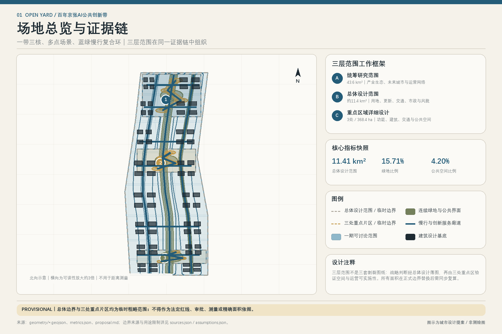
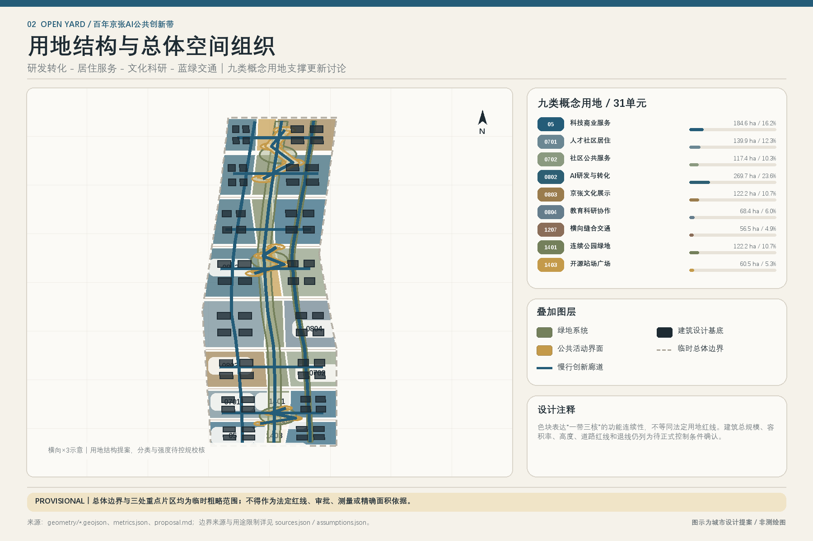
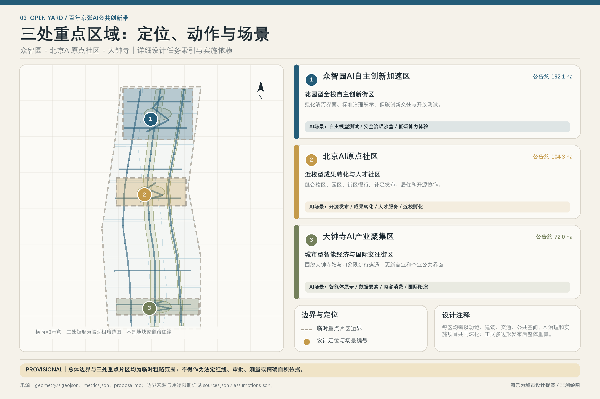
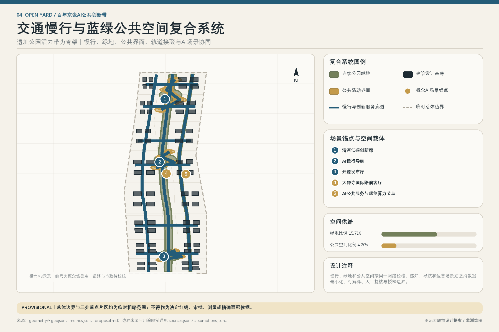
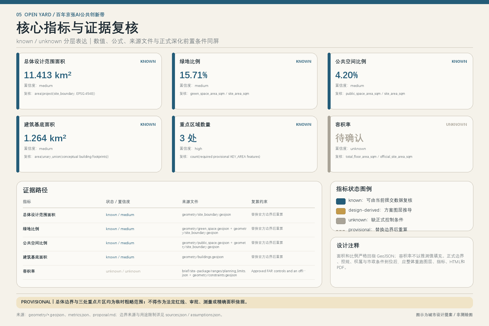

# OPEN YARD:  Jing-Zhang AI Public Innovation Belt

> **Urban Design Conceptual Recommendation.** This text is a formal conceptual urban design proposal for an open-source call, not a legal plan, government-verified conclusion, or engineering implementation document. The current geometry/site_boundary.geojson and geometry/key_areas.geojson are both provisional rough polygons provided by the repository maintainer; their rectangular or rough boundaries should not be interpreted as road right-of-way, parcel boundaries, ownership boundaries, or construction control lines. All spatial, project, activity, policy, and operational arrangements mentioned in this text are conceptual recommendations, reference schemes, or materials for further in-depth study by professional teams. Once official polygons, control plans, existing buildings, roads, utilities, cultural heritage, and ownership data are completed, the boundaries must be replaced in their entirety, and the layers, indicators, drawings, and phased plans must be recalculated. [source:BOUNDARY-SOURCE] [source:KEY-AREA-SOURCE] [standard:PROJECT-AGENT-OPEN-CALL-TASKBOOK] [depth:risk_missing_data]

"Open Source Station" is not about making the railway into a tech-themed park, but rather borrowing the most public organizational logic of the railway: the **station yard** allows different stakeholders to stop and collaborate, the **switch** facilitates the conversion of outcomes between research, industry, and public services, the **platform** ensures that technologies are visible, tested, and questioned by the public, and the **schedule** provides a clear rhythm for testing, verification, opening, and exiting. The Jing-Zhang Railway Heritage Park thus becomes the main public "thread" running north to south, with three key areas serving as differentiated innovation "station yards," the Zhongguancun Technology Services Wing and the Xiaoyue River Scenario Enablement Wing as horizontal collaborative "side tracks," and twelve service nodes without additional railway connotations as walkable, operable, and iterative "stations." This structure responds to the three key positions, five functional areas, and the "Three Zones and Two Wings," while placing AI governance, human-centric Public Spaces, and long-term operations on par with industry importance. [source:AGENT-TASKBOOK] [standard:PROJECT-OFFICIAL-ANNOUNCEMENT] [depth:overall_spatial_structure]

## Design Basis and Source List

### 1. Evidence Level and Usage Method

The proposal first reads from , then uses site packages, public announcements, clearance task orders, professional standards, and structured data from the submission package. The materials are not "usable with links," but are tiered by purpose:

- **formal-ready Task Basis**: Used to confirm the project name, estimated value of the third-level scope, names of three key areas, design tasks, and professional principles; it cannot be used to derive precise red lines or to infer that the project has an approved control plan.
- **background case**: For comparative analysis of innovative ecosystems, spatial operations, and update mechanisms; does not support the red line, indicators, business attraction, investment, or implementation commitments for the Jing-Zhang project.
- **provisional-only geometry**: This is only for scheme generation, topological self-check, offline visualization, and non-validated design discussions; it shall not be used as a basis for precise areas, demolition–renovate–retain strategy, or engineering line positioning. (Demolish–Renovate–Retain Strategy)
- **unknown / pending control**: When official attachments are missing, keep it unknown. Enter it into assumptions, risk lists, and next-phase investigation tasks without filling it with "reasonable guesses."

This hierarchy follows [source:SOURCE-REGISTRY] and [source:PROCESSED-FACT-PACK]; the processed fact pack is for reading navigation only, with the factual authority still reverting to the original registry source. The source, standard, depth, data, and metric evidence tags in the text correspond to sources.json, standard_matrix.json, design_depth_matrix.json, geometry, and metrics.json, respectively, for bidirectional verification by machines and humans. [depth:existing_conditions_diagnosis]

| Checkable ID | Role in this Proposal | Valid for Verification | Explicit Prohibition of Boundary Crossing |
| --- | --- | --- | --- |
| [source:OFFICIAL-ANNOUNCEMENT] | Project Purpose, Scope of the Announcement, Three Key Areas, and Design Tasks | 43.6 square kilometers, 11.4 square kilometers, 368.4 hectares as announced; Tasks 1.3—1.5 | Precise polygon, control plan indicators, engineering feasibility, government implementation commitment |
| [source:AGENT-TASKBOOK] | Three Key Orientations, Five Functional Areas, Six Intelligent Body Tasks, and Unified Boundary Conditions | Thresholds for Naming, Case Studies, Scene Cards, Landmarks, Culture, and Operations | Statutory Planning, Demolish-Renovate-Retain Strategy, Investment Funds, and Approved Activities | (Demolish–Renovate–Retain Strategy)
| [source:SITE-PACKAGE] | Enumerations, Ranges, Schemas, Standards, and Workflows | Unify Fields, Layers, Indicators, and Validation Logic | Inference of Real-World Status Beyond Package Permissions |
| [source:SOURCE-REGISTRY] | Availability Table of Documentation | Distinguish formal, background, provisional, and disabled | Upgrade background or provisional materials to official references |
| [source:PROCESSED-FACT-PACK] | Navigation Layer for Tasks, Scope, and Gaps | Helps Establish Checklists | Becomes a New Authority in Place of Original Sources |
| [source:BOUNDARY-SOURCE], [source:KEY-AREA-SOURCE] | Temporary Overall Scope and Geometry of Three Key Areas | Generation, Display, Self-Checking, and Conceptual Relationships | Official Redline, Accurate Area, Road or Parcel Boundaries |

### 2. Professional Standard Response Boundary

This proposal applies the Urban Design Management Measures to coordinate building layout, Public Space, appearance, and historical and cultural elements. It uses the Control Detailed Planning Compilation and Approval Measures to distinguish between "statutory controls—design recommendations—pending confirmation conditions," and it employs the National Land Use Classification Guide to unify classification semantics. [standard:MOHURD-URBAN-DESIGN-MEASURES] [standard:MOHURD-CONTROL-DETAILED-PLANNING] [standard:MNR-LAND-USE-CLASSIFICATION-GUIDE]

[standard:PROJECT-OFFICIAL-ANNOUNCEMENT] and [standard:PROJECT-AGENT-OPEN-CALL-TASKBOOK] are the primary project task controls. The current [standard:MOHURD-ARCH-DESIGN-DEPTH-2016] is missing from the repository and is not mandatory; this plan only serves as a gap indicator for the need to provide official architectural professional documents, without claiming that the architectural design depth has been completed based on it.

### 3. Submission Package Relationship

proposal.md is the sole main text; geometry is spatial evidence, metrics is recalculated evidence, three matrices are an index of tasks—standards—depth, and five base maps are explanatory layers. report/proposal.html is the offline reading version. If the graphics conflict with structured data, the geometry, metrics, and matrices serve as the starting point for verification, and trigger a Human Review, and rendering images are not to be used as a substitute for data.

### 4. Current Gaps and Design Responses

Identified preconditions gaps include: the official three-story range polygon, three key area polygons, current control plan and planning conditions, road red lines and sections, parcel ownership, current building outlines/heights/uses/years, cultural heritage control areas, municipal pipeline and fire flood protection conditions, and public service facility baseline. The submission package expresses these as a "data gap constraint" covering the entire range, as defined in [data:geometry/constraints.geojson#CONSTRAINT-GAP-001], which is not an official control plan or real control line. Their collective impact is: this round can form **spatial organization methods, scene governance protocols, updated object classification methods, and project combinations**, but cannot form conclusions on the **Floor Area Ratio, Building Height, specific building retention/demolition, bridge and tunnel alignments, pipeline relocation, investment amounts, or development timelines**. [depth:risk_missing_data]

## Three-Level Scope Framework

### 1. The third layer is not three isolated boundary maps.

The official announcement provides a Coordinated Research Area of approximately 43.6 square kilometers, an Overall Design Area of approximately 11.4 square kilometers, and three key areas totaling approximately 368.4 hectares. The areas mentioned in the official announcement are the task metrics, while the polygons in the current submission are temporary rough proxies and should not be confused with each other. [source:OFFICIAL-ANNOUNCEMENT] [source:BOUNDARY-SOURCE] [metric:site_area_sqm]

| Level | Official Task Statement | Core Issues of This Scheme | Design Depth and Main Outcomes | Current Spatial Evidence and Constraints |
| --- | --- | --- | --- | --- |
| Coordinated Research Area | Approximately 43.6 square kilometers, studying the "Three Zones and Two Wings" industrial sector and its integration with a future city | How the AI innovation chain can form a closed loop with urban publicness | Strategic, ecological case studies, five functional areas, regional collaboration, and operational models | Only announcement text and temporary scope; no precise land use or capacity determinations |
| Overall Design Area | Approximately 11.4 square kilometers, including the urban areas and industrial zones around the Jing-Zhang Heritage Park | How to carry forward Urban Renewal to accommodate industry, living, transportation, blue-green spaces, and new infrastructure | A conceptual framework for the depth of regulatory plan Urban Design, land use structure, project list, indicators, and pending confirmation controls | [data:geometry/site_boundary.geojson#SITE-001] as provisional; calculation of area for submission package consistency check |
| Key-Area Detailed Design Area | 368.4 hectares in total | How the three station areas will form differentiated industrial and Public Space prototypes | An Integrated Planning Implementation Plan with a directionally focused Urban Design scheme | [data:geometry/key_areas.geojson#PROV-KEY-001], [#PROV-KEY-002], [#PROV-KEY-003] are all provisional |

Three layers of transmission follow the "strategic definition of functions — overall organizational network — key area validation scenarios — operational feedback for readjustment." The strategic layer proposes three fields and two wings with twelve stations; the overall layer explains the network using land use, pedestrian and bicycle facilities, blue-green spaces, Public Spaces, and phased diagrams; the key area layer validates operability using scenario cards and updated projects; the operational layer decides on continuation, adjustment, or exit through public indicators and Human Review. This closed loop corresponds to [depth:three_level_scope_framework], [depth:overall_spatial_structure], and [depth:phasing_implementation].

### 2. Provisional boundary's Replacement Protocol

At this stage, the supported layers in [data:geometry/site_boundary.geojson#SITE-001] can perform topological checks within the same Provisional Boundary, but do not support precise parcel conclusions. Once the official data is available, it must be executed in one go:

1. Verify the source, version, coordinate system, license, and SHA-256, and register them in sources.json;
2. Replace SITE_BOUNDARY with three KEY_AREA instances; do not manually stretch the old polygon.
3. Re-cut land_use, buildings, roads, green_space, public_space, phasing;
4. Recalculate all areas and ratios using EPSG:4548, and update the metrics and data-value in the diagram.
5. Review each of the twelve stations, scene cards, and updated projects to ensure they still fall within the legal design envelope.
6. Conduct a professional assessment of conflicts related to cultural heritage, roads, fire safety, utilities, and property rights.
7. Re-render the five diagrams, HTML, A3/A0, and run a complete quality check.

Before the aforementioned replacements are completed, "station" only denotes the service node type and operational unit, **and does not indicate the addition of a new railway station, track works, or a determined site location**.

## Coordinated Research Area: Industry and Future City Research

### 1. Overall Concept: Transform InnoVate into a Public Plaza

The unique value of the Jing-Zhang lies not only in the overlay of "railway heritage + AI industry," but in the public problems that the railway once addressed: connecting people, goods, and knowledge according to rules. In the AI era, similar connections are needed for basic research, model tools, computational power data, product validation, enterprise services, resident needs, and public governance. OPEN YARD therefore proposes four operational spatial primitives:

| Railway Primitives | AI Public Innovation Infrastructure | Spatial Implications | Governance Implications |
| --- | --- | --- | --- |
| Yard | A collaborative community for research, enterprises, developers, residents, and operators | Three key areas form differentiated composite cores | Entry rules are transparent, with public interest and safety reviews prioritized |
| Switch | Threshold for transitioning from research to validation, transformation, or public services | Interface for converting between campus-street, station-city, and park-community | Each transition involves authorization, evaluation, Human Review, and exit criteria |
| Platform | Public Space with Visibility, Testability, and Accountability | Ground-Level Public Spaces, Exhibition and Testing Areas, Corner Services, and Online Dashboards | Not Treating Residents as "Test Subjects," with Informed Consent, Minimal Data Collection, and Right to Appeal |
| Timetable | Pilot Lifecycle and Annual Activity Framework | Daily Operations, Quarterly Reviews, Annual Iterations | Clearly Define When to Launch, Review, Pause, and Archive to Avoid Permanent Piloting |

This concept will implement the three positioning goals as follows: the Jing-Zhang main line will carry the "Century Jing-Zhang Cultural Belt," the daily services of the twelve stations will carry the "Urban AI Life Experience Belt," and the collaboration loops between the three fields and the two wings will carry the "AI Fusion Innovation Belt." The five functions are not five separate parcels of land, but rather share a common set of turnout protocols: full-stack independent innovation is formed in Zhongzhiyuan to develop validation capabilities, a world-class innovation ecosystem is formed in the Origin Community to develop open transformation capabilities, AI-Enabled Scenarios are formed in the Little Moon River Wing and Public Space to develop experimental capabilities, intelligent and vibrant cities enter daily life through the twelve stations, and AI governance discourse is sedimented through standards, safety, open evaluations, and public review. [source:AGENT-TASKBOOK] [standard:PROJECT-AGENT-OPEN-CALL-TASKBOOK]

### 2. Three Fields, Two Wings, Twelve Stations

"The three fields" correspond one-to-one with the three key areas mentioned in the announcement; the "two wings" adopt the Zhongguancun Technology Services Wing and the Xiaoyue River Scenario Enablement Wing as specified in the mission statement; the "twelve stations" are a combinable directory of service nodes. Their locations are all directionally mapped.

| ID | Concept Station Name | Belonging Structure | Core Function | Primary Service Object | Structured Mapping |
| --- | --- | --- | --- | --- | --- |
| ST-01 Full Stack Experiment Station | Zhongzhiyuan Full Stack Safety Station | Controlled Testing and Interoperability Validation of Models, Computing Power, and Toolchains | Research Team, Platform Enterprises, Evaluation Institutions | [data:geometry/key_areas.geojson#PROV-KEY-001] |
| ST-02 Standard Safety Station | Zhongzhiyuan Full-stack Safety Station | Safety Assessment, Standard Co-research, Red Team Review, and Public Explanation | Enterprise Compliance Teams, Researchers, Public Governance Stakeholders | [data:geometry/key_areas.geojson#PROV-KEY-001] |
| ST-03 Green Computing Station | Zhongzhiyuan Full-stack Security Hub | Edge-side Computing Reservation, Energy Consumption Visualization, and Low-carbon Operation and Maintenance Education | Start-up Teams, Operators, Public | [data:geometry/key_areas.geojson#PROV-KEY-001] |
| ST-04 Open Source Origin Station | Beijing AI Origin Station | Code Release, Maintainer Collaboration, Contribution Records, and Open Source Education | Developers, University Students and Faculty, Start-up Teams | [data:geometry/key_areas.geojson#PROV-KEY-002] |
| ST-05 Results Transfer Hub | Beijing AI Origin Station | Legal, Intellectual Property, Product Validation, and Entrepreneurship Services for Research Outcomes | Research Team, Technology Transfer Personnel, Small and Medium Enterprises | [data:geometry/key_areas.geojson#PROV-KEY-002] |
| ST-06 Talent Life Hub | Beijing AI Origin Station | A One-Stop Hub for Talent and Community Services for Work—Learning—Socializing—Living | Young Talent, Families, Nearby Residents | [data:geometry/key_areas.geojson#PROV-KEY-002] |
| ST-07 Intelligent Body City Living Room Station | Dazhongsi Intelligent Economy Station | Intelligent Body Product Demonstration, Corporate Services, and Public Dialogue | Enterprises, Consumers, International Visitors | [data:geometry/key_areas.geojson#PROV-KEY-003] |
| ST-08 Intelligent Terminal Verification Station | Dazhongsi Intelligent Economic Hub | Accessibility, Reliability, Energy Consumption, and Human-Computer Interaction Testing | Terminal Enterprises, User Representatives, Testing Institutions | [data:geometry/key_areas.geojson#PROV-KEY-003] |
| ST-09 International Roadshow Station | Dazhongsi Smart Economy Hub | Multilingual Launch, Industry Exchange, Need Matching, and Compliance Explanation | International Team, Investment, and Professional Service Institutions | [data:geometry/key_areas.geojson#PROV-KEY-003] |
| ST-10 Jing-Zhang Memory Station | Jing-Zhang Public Mainline | Historical records, open-source milestones, and traceable displays of urban change | residents, students, visitors, researchers | [data:geometry/public_space.geojson#OY-ST10] |
| ST-11 Boundaryless Slow-Travel Station | Zhongguancun Technology Services Wing | Barrier-Free Navigation, Slow-Travel Discontinuity Feedback, and Inter-Institutional Service Transfer | Commuters, Mobility-Impaired Individuals, Campus Visitors | [data:geometry/roads.geojson#ROAD-SPINE-01] |
| ST-12 Xiaoyue River Scenario Station | Xiaoyue River Scenario Enablement Wing | Controlled Open Validation of AI+ Healthcare, Education, Law, and Life Services | Residents, Public Service Personnel, Scenario Enterprises | [data:geometry/green_space.geojson#GREEN-SPINE-01], [data:geometry/public_space.geojson#OY-ST12] |

Twelve stations adopt a "fixed governance protocol + movable components" approach instead of one-time large-scale construction: a unified identity, data, appointment, notification, Human Review, and evaluation protocol forms the fixed layer; display stands, test stations, rain shelter seating, accessible digital terminals, and activity modules form the adjustable layer. The specific number, location, floor area, and equipment specifications of each station must be determined after the official polygon, ownership, and professional conditions are clearly defined.

### 3. Naming, Logo, and Visual Identity Direction

Main name is "**Open Yard**", with the English name "OPEN YARD", and the description "JING-ZHANG CIVIC AI BELT / Jing-Zhang AI Public Innovation Belt". "Open" refers to both open-source code and open problems, open interfaces, open evaluations, and open contributions. "Station Yard" emphasizes multi-stakeholder collaboration and public rules, avoiding reducing the project to a single science park.

Conceptual Recommendation for the logo: The basic configuration is based on "two parallel tracks opening in the center to form a Y-shaped turnout." O can serve as a circular public station platform, while Y points to the Yard and the chosen diverging path; the Chinese "Open Yard" and the English "OPEN YARD" should maintain clear hierarchy. The suggested color palette includes track graphite gray, public green, signal amber, and paper warm white; specific color values, accessibility contrast, font licensing, trademark similarity, and small-scale recognizability must be verified separately. Signage should not use government emblems, corporate trademarks, personal likenesses, or unauthorized fonts. The visual system can be extended to:

- "Line color" distinguishes between the three fields and two wings, not using color as a designated land use.
- "Stations" display scene status: Under Study, Closed for Testing, Public Beta, Human Review, On Hold, Archived;
- "Ticket" records evidence of a project's journey from problem identification to validation, review, and exit.
- "Schedule" publishes annual activities and quarterly reviews;
- "Milepost" records authorized open-source contributions and does not form a commercial ranking.

All logos, names, and landmarks are conceptual proposals and must undergo trademark, font, cultural expression, and international communication reviews before formal adoption. [source:AGENT-TASKBOOK]

### 4. Six Global Innovation Ecological Case Studies and Translatability Mechanisms

The case study is provided only for mechanism analogy and does not support the Jing-Zhang red line, control plan, construction scale, funding, or implementation commitments; it neither replicates its governance system nor uses the case data as indicators for this project.

| Case | Verifiable Mechanism Clues | Translation of OPEN YARD | Parts Not Translated Faithfully |
| --- | --- | --- | --- |
| Singapore One-North | work-live-play-learn integrated, green connectivity, cluster industries, and living lab/testbed [source:CASE-ONE-NORTH-JTC] | Embed testing capabilities in three venues while avoiding a single office park through public green lines and talent living services | Land tenure, development scale, number of firms, and policy tools are not directly applicable |
| France Paris-Saclay | Campus—Research—Industry Synergy and Innovation Transportation [source:CASE-PARIS-SACLAY] | Use "Results Transfer Station" to connect university origination, validation, and commercialization, and incorporate transportation experiments into safety thresholds | Regional scale, rail investment, and institutional arrangements are not part of the Jing-Zhang established conditions |
| Canada Toronto MaRS | Co-located with universities, startups, enterprises, investment, and research platforms in the urban core [source:CASE-MARS-TORONTO] | The origination community reduces inter-institutional collaboration barriers with shared platforms, and the public first floor facilitates serendipity and showcases | Not replacing the street network with monolithic structures, not promising to replicate funding models |
| UK London Knowledge Quarter | Multi-Type Knowledge Institutions Forming a Walkable Scale Network through Alliances, Branding, and Knowledge Exchange [source:CASE-KQ-LONDON] | The Wings Are Connected by Member Agreements and Public Routes, with Twelve Stations Serving as Network Entrances | Not Mimicking Membership Fees, Organizational Boundaries, and the UK Model |
| Finland Helsinki Maria 01 | Adaptive Reuse of an Old Hospital, Pilot with Small-Scale Projects Followed by Community Operation [source:CASE-MARIA01] | The Demolish–Renovate–Retain Strategy adheres to a survey-first, pilot-use, then build approach; using operation to validate space needs | This does not determine any specific building in Jing-Zhang that can be altered or should be retained |
| Kendall Square, Cambridge,  | Innovation Economy and Mixed Community, Ground-Level Activity, Open Spaces, and Long-Term Public Management in Parallel [source:CASE-KENDALL-CRA] | Establish long-term evaluation by proportion of Public Space, pedestrian connectivity, and resident services constraining industrial specialization | Do not replicate its Development Intensity, redevelopment pathway, or development agreement |

Six cases collectively point to four judgments: ecology is defined by **high-density relationships** rather than a corporate roster; Public Space is a collaborative infrastructure rather than mere decoration; testing must include real operational and exit mechanisms; and updates require long-term governance rather than one-time delivery. These four judgments correspond to three scenes, twelve stations, scenario cards, and the "Timetable Council". [depth:overall_spatial_structure]

### 5. Regional Synergy and Industry—Spatial Closed Loop

The tiered system is suggested to form a "Concept Origination—Open Source—Validation—Transformation—Experience—Feedback" six-loop cycle:

1. Institutions of higher learning, research teams, and basic capability providers raise questions and contribute foundational abilities;
2. The Origin Community completes open-source collaboration, talent organization, and early transformation;
3. Zhongzhiyuan provides full-stack, secure, standard-compliant, and edge-side infrastructure validation;
4. Dazhongsi provides an urban interface for intelligent bodies, terminals, content, and international business;
5. The Jing-Zhang public mainline provides agreed-upon daily scenes alongside the Yijue River wing;
6. The Zhongguancun Technology Services Wing provides legal services, intellectual property, funding, standards, and an international network, and then feeds the results back to the R&D end.

Each ring is based on non-exclusive interfaces, without pre-setting designated suppliers or fabricating lists of companies, values, investments, or fiscal commitments. The industrial indicators that are open for professional teams to deepen include: the number of cross-institutional joint projects, open-source maintenance activity levels, compliance pass rate from testing to public service, utilization rate of shared facilities by small and medium-sized enterprises (SMEs), accessibility of talent services, and timeliness of scenario exits; all of these require establishing baselines, and are not currently written as achieved performance.

## Overall Design Area: Urban Renewal and Regulatory-Plan-Level Urban Design

### 1. Overall Structure: One Public Axis, Three Fields, Two Wings, Twelve Stations

The Overall Design Area focuses on Jing-Zhang Heritage Park and its surrounding Public Spaces as the "public mainline," with three key zones serving as "stations," and two wings connecting the east-west knowledge and scene connections, organized by twelve stations for public services. This structure prioritizes addressing four types of discontinuities:

- **Spatial Discontinuity**: The north-south Public Spaces are not continuous, and the east-west connections require crossing roads and the boundaries of the park.
- **Functional Discontinuity**: Research and development spaces are separated from living, exhibition, legal, and conversion services.
- **Regulatory Gaps**: Testing, public engagement, procurement, and exit criteria lack unified standards;
- **Time Discontinuity**: Temporary activities do not settle into long-term community assets and maintainable infrastructure.

Submit a package that expresses nine categories of functional areas through 31 consecutive, non-overlapping land use units, among which representative units include [data:geometry/land_use.geojson#LU-W01], [data:geometry/land_use.geojson#LU-W05], [data:geometry/land_use.geojson#LU-C02], and [data:geometry/land_use.geojson#LU-R01]. Express the slow-moving and innovation service spine using [data:geometry/roads.geojson#ROAD-SPINE-01], the blue-green and public interface using [data:geometry/green_space.geojson#GREEN-SPINE-01] and [data:geometry/public_space.geojson#OY-ST01], and the concept scope of the first phase using [data:geometry/phasing.geojson#PHASE-ZONE-01]. They are all design proposal layers, not current surveying or regulatory plans. [depth:land_use_layout]

### 2. Five Types of Spatial Objects for Urban Renewal

Overall updates do not start from "how much to demolish," but from what spaces are needed for the AI ecosystem and what public values residents can gain:

1. **Sites and Memorials**: Conduct a heritage and historical value survey to form traceable records; only implement reversible display and tour concepts.
2. **Buildings That Can Continue to Be Used:** After a fire safety, structural integrity, title, energy consumption, and occupancy condition assessment, prioritize the retention and light renovation for shared offices, community services, and open-source activities.
3. **Inefficient Ground Floors and Boundary Spaces**: Create a "platform" through transparent interfaces, shared entrance lobbies, corridor spaces, nighttime zoning, and accessibility improvements.
4. **Traffic and Infrastructure Gaps**: Complete the safety and engineering specialties first, then discuss the pedestrian and bicycle integration in spaces such as under bridges, in front of stations, at intersections, or in corners.
5. **Pending Update Site**: Only establish a list of opportunities and constraints, and do not provide specific demolition, new construction, or Development Intensity when lacking site, building, and ownership data.

These five categories correspond to [depth:retain_renovate_demolish]. The current building layer is expressed by 64 conceptual baselines such as [data:geometry/buildings.geojson#BLDG-W01-01], which represent discussable courtyards and interfaces. This only demonstrates that the submission package includes a design building layer, and does not represent that such buildings actually exist at those locations, nor can it be used as a basis for determining the retention or demolition of building units.

### 3. Functional Composite and Public Value

The conceptual land use zoning is not a simple industrial belt: industrial/technology services, residential and community services, research and development, cultural displays, traffic and roadways, parks, and green spaces together form an "industry-public-life" structure; representative units can be seen in [data:geometry/land_use.geojson#LU-W01], [data:geometry/land_use.geojson#LU-W02], [data:geometry/land_use.geojson#LU-W05], and [data:geometry/land_use.geojson#LU-C01].

The spatial organization proposes four conceptual compatibility principles:

- Research and development spaces should be configured with accessible dining, childcare consultation, sports, communication, and public service facilities, without forming isolated research and development islands.
- Commercial services should prioritize the clear presentation of explainable intelligent native products, professional services, and daily retail needs for the community, without allowing high-noise short-term events to squeeze out residents.
- Public Spaces and parks allow for low-impact, removable, and safety and heritage-reviewed test components, without turning green spaces into permanent equipment areas.
- Community service scenarios default to minimal data usage, Human Review, and offline alternative channels to ensure that those who do not use AI can still access the services.

The current proportions can only be interpreted as the structural relationship of a provisional design geometry and should not be incorporated into the statutory controls. The final land use nature and compatibility must be verified by a professional team based on the formal control plan and [standard:MNR-LAND-USE-CLASSIFICATION-GUIDE].

### 4. Development Intensity, Building Form, and Carrying Capacity

The warehouse does not have the approved Floor Area Ratio, Building Height, Building Coverage Ratio, Green Space Ratio, setback requirements, road boundary lines, fire safety, municipal, and cultural heritage control conditions for this project; therefore, [metric:floor_area_ratio] remains unknown. The scheme does not propose pseudo-precise height or total built area. [standard:MOHURD-CONTROL-DETAILED-PLANNING] [depth:development_intensity_controls]

Formative principles for further development in the next phase are:

- Maintain a continuous, friendly, and accessible first-floor scale along the Jing-Zhang public mainline, with important historical interfaces protected after a preservation assessment.
- Additional volumes, if approved, should feature a segmented, transparent, and traversable public base to reduce long façade barriers.
- Three internal priority shared courtyards, link corridors, or elevated or ground-level Public Spaces must be preserved, but their fire safety, structural integrity, daylighting, and property feasibility must be subject to specialized argumentation;
- Evaluate the roof prioritarily for the feasibility of photovoltaic, rainwater, active, and habitat composite systems, without directly committing to load or energy benefits;
- Nighttime lighting follows principles of zoned, time-based, low-glare, and eco-friendly design;
- The architectural appearance does not use generic sci-fi facades, but rather embodies the spirit of the AI era through the durability of materials, replaceable components, maintainable equipment, and explainable information.

These are directional responses to [depth:height_massing_character], which cannot replace statutory planning conditions or architectural scheme reviews.

### 5. The "Known—Recommended—To Be Confirmed" Three-Column Format for Control Detailed Plan Depth

| Object | Current Known | Conceptual Recommendation | Must Confirm Before Formal Deepening |
| --- | --- | --- | --- |
| Scope | Approximate Area and Text Description | Three Fields and Two Wings Twelve Stations Network | Official Polygon and Coordinate System |
| Land Use | Composed of 31 Seamless Units Divided into Nine Conceptual Zones | Research and Development Transformation, Residential Services, Cultural and Scientific Research, Blue-Green Transportation Integration | Current Control Plan, Land Category, Compatibility, Ownership |
| Building | 64 Conceptual Building Footprints Envelope | Preserve Prioritized and Reversible Renovation, Public Ground Floor | As-Built Survey, Structural and Fire Safety, Property Rights, Cultural Heritage |
| Transportation | One spine, two wings, six east-west connections within the three fields, totaling 12 conceptual central lines | Seam stitching, station-city integration, priority for accessibility | Road right-of-way, traffic volume, station conditions, engineering specialties |
| Urban Design | Task Requirements and Shortage List | Distributed Services, Edge Computing Capacity, Monitoring and Maintenance | Capacity, Pipelines, Flood Control, Fire Safety, Energy, and Cybersecurity |
| Implementation | Seamless Coverage of Temporary Overall Boundaries with 3 Concept Phases | Data and Operations First, Light Renovation Second, then Comprehensive Update | Main Body, Funding, Approval, Public Opinion, and Construction Conditions |

## Detailed Design of Key Areas

The detailed design for the three key areas all adopt a seven-item structure: "location—spatial structure—building renewal—traffic and pedestrian access—Public Space—AI scenarios—implementation risks." All boundaries are provisional rough polygons, and the area of the districts is understood as approximate values from the announcement; the descriptions are only for directional comparison. [source:OFFICIAL-ANNOUNCEMENT] [depth:three_key_area_detailed_design]

### 1. Zhongzhiyuan AI Independent Innovation Acceleration Area: Full-stack Safety Station

**Location.** Focused on full-stack independent innovation, standard co-research, security governance, and green computing display, the site forms a "garden-type innovation station" where technology is validated, risks are explained, and standards are collectively maintained. Its announced area is approximately 192.1 hectares; this round's direction maps to [data:geometry/key_areas.geojson#PROV-KEY-001], which is not an official district boundary.

**Spatial Structure.** The Conceptual Recommendation forms "Shared Testing Core—Qinghe Green Interface—Public Interpretive Loop—External Collaboration Portal." The Shared Testing Core accommodates ST-01 Full-Stack Experiment Station; the Public Interpretive Loop connects to ST-02 Standard Safety Station; and the Green Interface accommodates ST-03 Green Computing Station. These four elements are in a functional relationship, not specific buildings or road alignments.

**Building Renovation and Update.** Conduct a four-category survey on the existing buildings: A) preservation and maintenance, B) adaptive reuse, C) functional enhancement, and D) special case judgment. No specific building will be designated for demolition until the survey is completed. Suitable space types include controlled laboratories, shared testing rooms, small briefing halls, open-source collaboration spaces, and public safety interpretation galleries. Any new requirements for server rooms, cooling, loading, and fire safety must be reviewed by both municipal and architectural specialists.

**Traffic Slow Zone.** Conceptually, external traffic circulation is placed at the periphery of the district, while pedestrian and bicycle circulation and internal shuttle services are integrated at the core; explore safe connections with the discontinuities related to the North Fifth Ring Road, but do not propose specific bridge or tunnel alignment or feasibility conclusions. Continuous accessibility, bicycle parking, logistics, and visitor flow separation should become hard constraints in the next phase of the traffic specialty. [depth:traffic_rail_slow_parking]

**Public Space.** The Qinghe interface is set with removable test platforms, shaded seating, outdoor meeting components, and energy consumption explanation modules, based on ecological, flood prevention, and blue line conditions. It does not occupy ecologically sensitive spaces and does not commercialize public green spaces. It can be related to the continuous green space concept of [data:geometry/green_space.geojson#GREEN-SPINE-01], but the actual scope awaits official documentation.

**AI Scenarios.** Prioritize the safe open evaluation of the C01 model, the interoperability of autonomous toolchains for the C02 scenario, and the green scheduling of edge-side computing power for the C03 scenario. Publicly display and separate physical zones for open testing and closed testing. Any red team data, vulnerability information, or internal enterprise models must not directly enter the public interface.

**Implementation Risks.** The primary risks include the Official Boundary, Qinghe Flood Control Ecology, Fifth Ring Road Traffic, municipal capacity, computational energy consumption, cybersecurity, and the absence of corporate data and ownership. The preliminary actions should be document verification, joint testing agreements, and small-scale indoor pilot studies, rather than determining the construction scale first.

### 2. Beijing AI Origin Community: Open Source Transformation Hub

**Location.** Focused on the original innovation of universities, open-source maintenance, result incubation, talent living, and organic updates near the campus, form a transition hub from "papers/codes/prototypes" to "compliant products/public value." The announced area covers approximately 104.3 hectares; this round's direction is mapped to [data:geometry/key_areas.geojson#PROV-KEY-002], which should not be interpreted as the boundaries of campus, park, or district ownership.

**Spatial Structure.** The Conceptual Recommendation forms "Open Source Hallway—Results Transition Street—Talent Living Ring—Campus Park Interface." ST-04 Open Source Origin Station serves as the contribution and release interface, while ST-05 Results Transition Station integrates legal, intellectual property, testing, and entrepreneurial services. ST-06 Talent Living Station provides daily amenities. The interface emphasizes walkable connections between the campus, park, and neighborhood but does not advocate for crossing closed or sensitive spaces.

**Building Renovation.** Adopt a "condition-first, then aesthetic transformation" approach: inventory shared meeting rooms, unused ground floors, underutilized ancillary spaces, and facilities that can be reused in different time slots, and decide on light renovations; preserve spaces with historical, community, or research memory value. Strictly segregate noise, pedestrian flow, and nighttime activities between residential and research spaces. Any decision regarding the Demolish–Renovate–Retain Strategy must be based on current as-built drawings, ownership, structural and fire safety conditions, and public opinion.

**Traffic Slow Zone.** Conduct a station-city integration concept study around stations such as Wudaokou and the west end of Qinghua East Road, prioritizing improvements in pedestrian orientation, transfer information, continuity of accessibility, bicycle parking, and interfaces with campuses and parks; no proposals for station body renovations or road alignment determinations. Consider [data:geometry/roads.geojson#ROAD-SPINE-01] as a prototype for the "Slow Zone and Innovation Service Corridor," rather than the existing road.

**Public Space.** The ground-level open space forms a "stayable knowledge platform": it serves for result displays and consultations during the day, and operates with booking and quiet management at night. It features free drinking water, seating, charging stations, and non-digital service windows, allowing non-technological populations to share in the updated benefits.

**AI Scenarios.** Prioritize the handling of C05 open-source releases and contributions map, C06 research outcomes compliant transformation, C07 learning and career navigation, and C08 public welfare legal and intellectual property preliminary screening. AI outputs are auxiliary suggestions, and key educational, legal, employment, and intellectual property decisions are to be verified by qualified personnel.

**Implementation Risks.** The primary risks include the university and campus boundaries, research and personal data, residential disturbance, intellectual property, conditions at rail stations, fire safety, and unclear ownership. It is recommended that any pilot projects be low-impact and removable, and only be conducted within authorized existing spaces.

### 3. Dazhongsi AI Industry Cluster: Smart Economy Hub

**Location.** Oriented towards intelligent entities, smart terminals, content consumption, professional services, and international exchanges, the urban-type intelligent economic hub will form a place where "products are experiential, algorithms are explainable, transactions are auditable, and public environments are shareable." The announced area covers approximately 72.0 hectares; the current direction maps to [data:geometry/key_areas.geojson#PROV-KEY-003], which does not represent specific parcels or enterprise boundaries.

**Spatial Structure.** The Conceptual Recommendation forms the "Track City Living Room—Smart Terminal Verification Corridor—Content and Professional Service Street—Quadrant Walkway Research Area." ST-07 Smart Entity City Living Room Station, ST-08 Smart Terminal Verification Station, and ST-09 International Pitch Station constitute a continuous interface from experience, verification to exchange. The "quadrant" refers to the problem framework that requires traffic specialty validation, not an approved connected project.

**Building Renovation.** Prioritize activating existing ground-level spaces, commercial vacancies, and shared meeting areas by establishing small-scale, short-term, and flexible test display units; avoid creating a "sense of the future" through large-scale demolition and reconstruction. The smart terminal test space should be divided into public experience areas, controlled test zones, equipment maintenance areas, and data processing zones.

**Traffic Slow Zones.** The integrated study around Dazhongsi station focuses on identifying transfer directions, cross-street waiting, accessibility, bicycle parking, evacuation during peak activities, and pedestrian experiences between key blocks. Any bridge connections, underpasses, reconfiguration of intersections, and station body works require further argumentation by rail, traffic, municipal, and fire safety professionals.

**Public Space.** Planned green spaces should be used for low-impact, removable activities that are compatible with the green space function; the surrounding public environment of enterprises should maintain public access, and brand displays should not be turned into privatized barriers. [data:geometry/public_space.geojson#OY-ST08]

**AI Scenarios.** Prioritize handling C04 Smart Terminal Reliability and Accessibility Verification, C09 Smart Entity Product Liability Statements, and C12 Multilingual Pitching and Demand Matching; user experience data should be collected with explicit consent, minimized in scope, and deleted locally.

**Implementation Risks.** The primary risks include track and road construction conditions, commercial operations and resident disruption, data element compliance, consumer protection, business trademarks and copyrights, green spaces, and ownership. Begin with an operational agreement and indoor validation before deciding on spatial transformations.

### 4. Coordinated Three-way Collaboration Rather Than Homogeneous Competition

| Conversion Node | Input | Main Station | Output | Human Threshold |
| --- | --- | --- | --- | --- |
| Research → Testable | Papers, Code, Models, Prototypes | Original Community → Zhongzhiyuan | Test Plan, Risk List, Data Cards | Intellectual Property, Ethics, Data and Security Review |
| Test → Convertible | Evaluation Results, User Issues | Zhongzhiyuan → Yuandian Community/Dazhongsi | Product Assumptions, Service Design, Compliance Path | Professional Signoff and Involvement of Affected Groups |
| Product → Experiential | Explanatory Version, Responsibility Statement | Dazhongsi/Xiaoyuehe Wing | Controlled Public Experience | Explicit Consent, Alternative Channels, On-Site Human Supervision |
| Experience → Expand or Exit | Aggregate Feedback and Risk Events | Schedule Council | Expand, Amend, Suspend, or Archive Decisions | Independent Review and Public Rationale |

## AI Innovation Ecosystem, Personas, and AI+ Scenarios

### 1. Talent and Urban User Profiles

User profiles only express demand types and are not based on individual tracking, are not used for ad targeting, and do not solidify any group into algorithmic labels.

| Image ID | User Group | Key Tasks and Pain Points | Spatial and Service Responses | Equity Boundaries |
| --- | --- | --- | --- | --- |
| P-01 Baseline Researchers and Algorithm Engineers | Secure Computing Power, Reproducible Experiments, Inter-institutional Collaboration | ST-01/02 Shared Testing and Standard Collaboration | No Unauthorized Model or Research Data Must Be Surrendered |
| P-02 Open Source Maintainers and Independent Developers | Release, Collaboration, Reputation Tracking, Low-Cost Workspaces | ST-04 Open Source Origin Station, Nightly Scheduled Collaboration | Contribution evaluation does not equal commercial ranking, does not publicly track personal trajectories |
| P-03 Start-up and Small and Medium Enterprises Teams | Low-barrier testing, legal/IP, client validation | ST-05 Results Transfer Switch Station, Shared Testing Period | Do not bind to a specific supplier, and do not trade data for space. |
| P-04 Headquarter Company R&D and Compliance Team | Standard Interoperability, Talent Exchange, Responsibility Communication | ST-02/07/09 | Corporate Case Studies and Logos Must Be Authorized, Not Exclusively Occupied |
| P-05 Higher Education Students and Young Talent | Learning, Internships, Socializing, Residing, and Career Choices | ST-04/06 and Pedestrian Network | Educational and Employment Advice Must Be Explainable and Subject to Human Review |
| P-06 Surrounding Residents and Community Businesses | Quiet, Safe, Convenient Services, Shared Updated Revenues | ST-06/10/12, Non-Digital Windows | Do Not Turn the Community into an Open-Ended Experiment, Establish Complaints and Exit Mechanisms |
| P-07 Elderly, Caregivers of Children, and Mobility Impaired | Barrier-Free Access, Clear Wayfinding, Offline Services | ST-11 All Station Accessibility Components | Manual and Paper Alternatives Provided in Case of AI Failure, No Collection of Sensitive Identifiers |
| P-08 Public Services and Venue Operations Staff | Maintain Systems, Clear Responsibilities, Event Management | Timetable Backend, Human Review Desk | Do Not Replace Labor Rights with Automated Performance Monitoring |
| P-09 International Visitors and Cross-Cultural Teams | Multilingual Information, Short-Term Access, Compliance Understanding | ST-09/10, Multilingual Signage | Machine Translation Must Be Marked and Support Manual Corrections |

### 2. Uniform Scenographic Governance Protocol

All scenarios must first pass through the "Six Gates": public interest, data legitimacy, technological maturity, safety and ethics, accessibility and fairness, and operational sustainability. After passing, they still only enter a pilot with limited time, limited space, and limited participants. Each scenario must possess:

- Data directory, retention period, access permissions, and deletion mechanisms;
- Clearly communicate, allow rejection, and ensure no loss of basic services;
- Human Review, responsibility entity, escalation of events, and appeal channels;
- Offline or Non-AI Alternatives;
- Online submission, quarterly review, suspension, exit, and archiving conditions;
- Aggregate and anonymized public metrics, without disclosing individual trajectories or business secrets.

Scene combinations cover seven task directions: AI+Software and Information Technology is handled by C-01, C-02, and C-05, AI+Healthcare by C-12, AI+Education by C-07, AI+Law by C-06 and C-08, AI+Life Services by C-07, C-09, and C-12, AI+Transportation by C-10, and AI+Public Space by C-10 and C-11. Industrial testing and urban services use the same governance threshold, but high-impact professional services maintain a more rigorous Human Review.

### 3. Twelve AI Scene Cards

#### C-01 Model Safety Open Evaluation Station [Industrial Testing Validation 1]

- **Space/Site**: ST-01 Full-stack Experiment Station, with the focus on the controlled indoor testing space of [data:geometry/key_areas.geojson#PROV-KEY-001].
- **Target Audience**: Baseline Model Team, Evaluation Institutions, Public Governance and Academic Researchers.
- **Running Data**: Public benchmarks, synthetic prompts, authorized test sets, model cards, and event logs; prohibit uploading personal privacy, unauthorized enterprise data, and real vulnerability details to the public endpoint.
- **Privacy Boundary**: Test data is classified and isolated by default, with no input retained; public results only present aggregated levels and methods.
- **Human Review**: Approved by a safety officer, subject matter expert, and independent observer.
- **Concept Implementation Entity**: This could be undertaken by a non-exclusive testing consortium of multiple parties, with the actual entity to be legally determined.
- **Visual Layer:** Key Area Index + "Under Study/Closed Beta/Public Release" Status, Does Not Display Sensitive Model Content.
- **Key Risks and Gates**: Baseline Pollution, Attack Diffusion, Conflict of Interest; Not to be Opened for Experience Until Reviewed and Cleared Through Isolation and Disclosure Checks.

#### C-02 Autonomous Toolchain Interoperability Station [Industrial Testing and Validation 2]

- **Space/Location**: Appointments-Based Experimental Platform between ST-01 and ST-02, Direction Mapping PROV-KEY-001.
- **Service Object**: chips, frameworks, models, databases, agent tools, and operations teams.
- **Operational Data**: synthetic workload, performance/stability logs, energy consumption readings, and interface specifications.
- **Privacy Boundaries**: Do not request source code or trade secrets for interoperability testing; log data is de-identified and destroyed by project.
- **Human Review**: The testing engineer confirms reproducibility, and the security personnel confirm interface permissions.
- **Concept Implementation Entity**: Open Standards Working Group + Site Operator.
- **Visual Layers**: Displayed through capability matrices and failure causes, without ranking vendors.
- **Key Risks and Gates**: Supplier lock-in, irreproducibility, energy consumption externalities; at least two non-exclusive interfaces must be supported to enter the public demonstration.

#### C-03 Green End-Side Computing Power Scheduling Station [Industrial Testing Verification 3]

- **Space/Site**: ST-03 Green Computing Station, establish only a public interpretation relationship with [data:geometry/green_space.geojson#GREEN-SPINE-01], and equipment shall not default enter the green space.
- **Target Audience**: Start-up teams, park operators, researchers, and the public.
- **Operational Data**: task queue, equipment utilization, temperature, energy consumption, and carbon emissions calculation methods.
- **Privacy Boundary**: Only collect facility-level data and do not record developers' specific code, identity trajectories, or business content.
- **Human Review**: Facility engineers review capacity, safety, and energy consumption anomalies.
- **Concept Implementation Entity**: Certified Infrastructure Operator + Public Oversight Mechanism.
- **Visual Layers**: site-level energy consumption ranges, queue status, and energy-saving recommendations.
- **Key Risks and Gates**: The electrical, municipal, thermal, fire, and noise conditions are unknown; software simulation or testing within existing compliant rooms is the only option until the engineering specialty is complete.

#### C-04 Reliability of Intelligent Terminals and Accessibility Validation Station (Industrial Testing Validation 4)

- **Space/Location**: ST-08 Intelligent Terminal Verification Station, Direction Mapping [data:geometry/key_areas.geojson#PROV-KEY-003].
- **Target Audience**: robotics/terminal companies, representatives of accessibility users, inspectors, and consumers.
- **Operational Data**: synthesized tasks, equipment failures, near misses, accessibility evaluations, and user voluntary feedback.
- **Privacy Boundaries**: Default setting is no facial recognition and no continuous recording; when recording is necessary, it should be limited to specific areas, time periods, purposes, and deletion deadlines.
- **Human Review**: Safety officers take over on-site, with user representatives participating and adhering to the standards.
- **Concept Operational Entity**: Third-party Testing/Research Institution + Site Safety Operations.
- **Visual Layers**: Test routes, closed status, number of manual takeovers, and accessibility issues list.
- **Key Risks and Gates**: personal safety, misleading consumers, obstruction by equipment; entry to open streets is prohibited until the enclosed field tests are completed.

#### C-05 Open Source Release and Contribution Spectrum

- **Space/Site**: ST-04 Open Source Origin Station, Direction Mapping [data:geometry/key_areas.geojson#PROV-KEY-002].
- **Target Audience**: Maintainers, students, enterprise open-source offices, and public learners.
- **Operating Data**: Approved repository metadata, versions, licenses, and voluntary contributor statements.
- **Privacy Boundary**: Do not capture private repositories, emails, or individual behavior profiles; allow contributors to hide or correct their display.
- **Human Review**: Permits, ownership, and security disclosures are reviewed by the maintainer.
- **Concept Implementation Entity**: Open Source Community Committee + Site Operations Team.
- **Visual Layers:** Project Relationships, Maintenance Status, and Public Value, Not Ranked Simply by Submission Frequency.
- **Main Risks and Gates**: copyright, supply chain security, contributor harassment; projects with unclear licensing do not enter the honor display.

#### C-06 Compliance Assistant for Legally Converting Research Achievements

- **Location/Site**: ST-05 Results Switching Station.
- **Target Audience**: university research teams, technology transfer professionals, startups, and small and medium-sized enterprises.
- **Operating Data**: User-provided public summaries, permitted requirements, and non-confidential business issues.
- **Privacy Boundaries**: Do not upload unpublished papers, patent drafts, trade secrets, or personal sensitive information to public models.
- **Human Review**: Final opinions provided by intellectual property, legal, ethical, and industry experts.
- **Concept Implementation Entity**: Professional Service Alliance; AI to be used for Information Organization.
- **Visual Layer**: Status of the process flow from research to testing, licensing, and transformation.
- **Main Risks and Gates**: Incorrect legal advice, title disputes; any output will be marked as "Unofficial Legal Opinion" and will provide an option for a manual appointment.

#### C-07 Learning and Career Navigation Station

- **Space/Site**: ST-06 Talent Living Hub, to be piloted in authorized community/campus interface spaces.
- **Target Audience**: students, job changers, young talents, and user teams.
- **Operational Data**: skills, voluntary goals, public course, and job information filled in by the user.
- **Privacy Boundaries**: Do not infer sensitive attributes such as family background, health, gender, or ethnicity; do not sell the profile.
- **Human Review**: A professional consultant or educator verifies high-impact recommendations.
- **Concept Operational Entity**: Education/Job Public Service or Compliance Social Institution.
- **Visual Layers**: Skill Paths, Course Accessibility, and Offline Service Hours.
- **Key Risks and Gates**: bias, overcommitment, protection of minors; retention of paper and manual services.

#### C-08 Public Legal Aid and Intellectual Property Preliminary Screening Station

- **Space/Location**: The offline service windows of ST-05 and ST-12.
- **Target Audience**: Residents, open-source developers, community merchants, and startup teams.
- **Operating Data**: Public regulations, authorized knowledge bases, and the minimum facts provided by users.
- **Privacy Boundary**: Sensitive cases do not enter the public terminal, and consultation records are handled according to legal service requirements.
- **Human Review**: Final judgment made by a lawyer or qualified service personnel.
- **Concept Implementation Entity**: Confirmed public legal service network.
- **Visual Layers**: Service Category, Wait Time, Status of Referral to Live Agent.
- **Main Risks and Gates**: Delusions, Jurisdictional Errors, Confidentiality Obligations; AI shall not independently provide formal legal opinions.

#### C-09 Statement of Liability for Intelligent Entity Products Display

- **Space/Site**: ST-07 Smart Body Urban Living Room Station.
- **Target Audience**: consumers, enterprise product teams, media, and regulatory researchers.
- **Operational Data**: Model cards authorized by the enterprise, functional boundaries, failure cases, versions, and complaint resolution procedures.
- **Privacy Boundaries**: Do not collect irrelevant identity information; experience logs are default to local storage, short-term, and deletable.
- **Human Review**: The on-site product responsible person explains the limitations and accepts appeals.
- **Concept Operational Entity**: Site Operator + Exhibitor, Responsibility Cannot Be Transferred to AI.
- **Visual Layer**: Capabilities, Limitations, Data Source Categories, Manual Takeover Entry.
- **Main Risks and Gates**: Marketing Exaggeration, Dark Patterns, Ambiguous Responsibility; No Responsibility Disclosure Cards Shall Be Made Public.

#### C-10 Accessible Slow Travel and Congestion Alerts

- **Space/Location**: ST-11 Boundless Pedestrian Station, Concept Corridor Referencing [data:geometry/roads.geojson#ROAD-SPINE-01].
- **Service Users**: pedestrians, cyclists, wheelchair users, seniors, child caregivers, and event operators.
- **Operational Data**: facility outages, user voluntary reports, anonymized peak hour passenger flow, and official open data.
- **Privacy Boundaries**: No facial recognition, no individual trajectory generation; only retain zone and time period aggregated values.
- **Human Review**: Traffic/Field personnel confirm road closures, construction, and accessibility information.
- **Concept Implementation Entity**: Public Space Operations and Traffic Service Collaboration Mechanism.
- **Visual Layers**: Break Points, Availability of Ramps/Elevators, Crowding Level, and Manual Verification Time.
- **Main Risks and Gates**: Erroneous navigation and digital exclusion; critical routes must be manually verified and provide physical signage.

#### C-11 Jing-Zhang Memory Open Archive and AI Guided Tour

- **Space/Location**: ST-10 Jing-Zhang Memory Station, based on the concept of a public interface as defined in [data:geometry/public_space.geojson#OY-ST10].
- **Service Users**: residents, students, visitors, historical researchers and cultural operators.
- **Running Data**: official public records, authorized oral histories, Qing rights photographs and text, and open metadata.
- **Privacy Boundaries**: Oral histories can be withdrawn; portraits and family information must be authorized; no synthetic pseudo-histories.
- **Human Review**: Historical, cultural heritage, and community representatives review the content, ensuring that the machine-generated narrative is prominently identified.
- **Concept Implementation Entities**: cultural institutions, communities, and open archive maintainers.
- **Visual Layers**: timeline, source, version, correction records, and field tour nodes.
- **Main Risks and Gates**: Historical inaccuracies, copyright conflicts, and heritage conservation issues; no content without sources shall be displayed as facts.

#### C-12 Community Health Navigation and Multilingual Service Referral

- **Space/Site**: ST-12 Xiao Yuehe Scene Station and ST-06 Talent Living Station; ST-09 provides verified multilingual public information.
- **Service Targets**: residents, older adults, caregivers, young talents, international visitors, and grassroots public service personnel.
- **Operational Data**: Officially publicly available and regularly verified medical/health service directories, open hours, accessibility information, as well as user-expressed service goals for the current session; no health records are established.
- **Privacy Boundaries**: Do not retain cross-case associations of symptoms, medical history, identity, and location. Do not access unauthorized medical records. Do not use consultations for advertising.
- **Human Review**: Baseline healthcare, health service, or public service personnel confirm the referral; in emergency cases, directly prompt the use of formal emergency response channels.
- **Concept Operational Entity**: Confirmed medical and health/public service institution + community service operator, with AI serving only as an information navigator.
- **Visual Layers:** Verified service types, operating hours, accessibility conditions, manned windows, and the most recent verification date.
- **Main Risks and Gates**: Misdiagnosis, delays, outdated directories, and translation errors; the system shall not diagnose, prescribe, or bypass referral; unverified information shall not enter the recommendation.

The twelve cards correspond to the scene—space—operational requirements from [source:AGENT-TASKBOOK], and are subject to final human judgment as the benchmark. The number of scenes does not equate to a one-time simultaneous launch; each scene should independently enter, pause, or exit after undergoing demand validation.

## Land Use, Building Scale, and Retain-Renovate-Demolish Strategy

### 1. Conceptual Land Use Structure

Current  divides the temporary overall boundary topology into 31 design polygons, organized into nine conceptual land use categories according to the . The union of all units covers the current temporary site geometry with no gaps or overlaps; this is only for testing the integrity of the "industry—public—life" functional zones and does not represent the current land use classification, planning approval, or buildable area. [standard:MNR-LAND-USE-CLASSIFICATION-GUIDE] [depth:land_use_layout]

| Classification Code and Representative Feature | Purpose of the Submission Package | Temporary Geometric Area | Design Implication | Pre-Approval Verification |
| --- | --- | ---: | --- | --- |
| 05 · [data:geometry/land_use.geojson#LU-W01] | Smart Native Commercial and Technology Services | 1,845,789.880㎡ | Conversion, Legal, IP, Roadshow, and Daily Commercial Services | Formal Land Use Category, Title Ownership, Current Usage, Market Demand, and Compatibility with Control Plan |
| 0701 · [data:geometry/land_use.geojson#LU-W02] | Talent and Community Residences | 1,398,772.839㎡ | Talent Living and Community Residences Focus | Population, Housing, Public Services, and Facility Carrying Capacity |
| 0702 · [data:geometry/land_use.geojson#LU-E03] | Community Public Service Facilities | 1,174,140.166㎡ | Education, Health, Community, and Public Services Focus | Facility Baseline, Service Radius, Operating Entity, and Public Demand |
| 0802 · [data:geometry/land_use.geojson#LU-W05] | AI Research and Technology Transfer | 2,697,388.678㎡ | Full-stack Research, Shared Testing, and Technology Transfer Direction | Ownership, Current Use, Pollution/Safety, Zoning and Engineering Conditions |
| 0803 · [data:geometry/land_use.geojson#LU-W03] | Jing-Zhang Cultural Preservation and Open Display | 1,222,093.000㎡ | Industrial Heritage Narrative, Public Display, and Open Collaboration | Preservation Value, Copyright, Foot Traffic, Safety, and Publicness |
| 0804 · [data:geometry/land_use.geojson#LU-E04] | Collaborative Education and Research | 683,529.745㎡ | Higher Education and Research Collaboration | Institutional Needs, Campus Boundaries, Research Safety and Sharing Mechanisms |
| 1207 · [data:geometry/land_use.geojson#LU-R01] | Horizontal Seam and Transportation Hub | 564,600.963㎡ | Seven East-West Connecting Bands and Necessary Transfer Directions | Road Right-of-Way, Transportation Organization, Utilities, Fire Safety, and Engineering Feasibility |
| 1401 · [data:geometry/land_use.geojson#LU-C02] | Continuous Park Green Space | 1,221,939.230㎡ | Blue-Green Continuity, Recreation, Culture, and Low-Impact Testing | Green Line, Blue Line, Cultural Preservation, Flood Control, and Existing Park Boundaries |
| 1403 · [data:geometry/land_use.geojson#LU-C01] | Open Source Station Public Plaza | 604,570.884㎡ | Exchange, deliberation, demonstration, service, and interface for temporary activities | Public openness, evacuation, accessibility, noise, and operational responsibility |

The nine categories of units, calculated by the union area without rounding, total 11,412,825.386㎡, which closes topologically with the current Provisional Boundary; the classified areas in the table may show a rounding difference of 0.001㎡ due to retaining three decimal places. These proportions are for design discussion only. Once the formal boundary, statutory land use, and facility requirements are in place, the zones must be rezoned and recalculated; these areas or proportions should not be included in the control plan conditions.

### 2. Building Scale and Spatial Supply

[metric:building_footprint_area_sqm] Currently at 1,264,438.300㎡, this is the combined area of 64 conceptual Building Footprints. Representative records can be found in [data:geometry/buildings.geojson#BLDG-W01-01]. It represents the conceptual envelope within the submitted package design layer and is not a comprehensive survey of existing buildings, thus it cannot be used to derive the total floor area, Floor Area Ratio, Building Coverage Ratio, total industrial space, or retention and demolition scales. [metric:floor_area_ratio] is unknown, in line with the principle of not creating precise figures when definitive control plans are lacking. [depth:development_intensity_controls]

The supply of built spaces adopts a "hour-month-year" three-tiered flexibility:

- Hourly: Meeting rooms, pitch halls, test stations, and public classrooms are reserved by time slot.
- Monthly: Start-up teams, joint projects, and scenario operations can short-term occupy adjustable modules.
- Grade: Following sustained demand, public value, and professional criteria validation, the proposal proceeds to architectural adaptive reuse or additional space consideration.

This ensures that space supply is driven by operational evidence, avoiding large-scale construction for AI sectors that have not yet been validated.

### 3. Demolish–Renovate–Retain Strategy: Evidence First, then Categorization

This round will not make any actual decisions regarding the demolish–renovate–retain strategy for buildings. In the next phase, it is suggested to establish five scoring categories: historical and cultural value, structural and fire safety, continuous usage value, carbon and resource costs, and Public Space contribution; and then form: (Demolish–Renovate–Retain Strategy)

- **Preserve**: With historical/community/research memory or ongoing use value, preserve and enhance performance;
- **Revised**: Structural integrity is present but the functions are not well-matched; it should be renovated with a focus on reversible changes, low carbon impact, and accessibility.
- **Entirety:** Through the integration and improvement of interfaces, ground floors, courtyards, and corridors to enhance publicness;
- **Remove**: Discussion should only occur after a thorough examination of safety, public interest, ownership, environment, and due legal process.
- **New**: Studies should be conducted only when existing stock is insufficient to meet verified demand, and when control plans, municipal, traffic, and fire safety requirements are established.

Each item must be bound to a building survey number, public opinion, carbon comparison, and approval path. [depth:retain_renovate_demolish] [standard:MOHURD-URBAN-DESIGN-MEASURES]

## Transport, Rail, Municipal Infrastructure, and Public Services

### 1. "Main line accessible, side lines reachable, station yard transferable"

Traffic strategy priorities include walking and accessibility, cycling, public transit connections, shared/converged mobility, essential motor vehicles, and logistics. The concept [data:geometry/roads.geojson#ROAD-SPINE-01] represents the spine for slow travel and innovative services, used only to illustrate network relationships. [depth:traffic_rail_slow_parking]

All four actions require specialized validation:

1. **North-South Continuity**: Address the discontinuities, open hours, lighting, slopes, shading, and winter maintenance along the Jing-Zhang Heritage Park corridor.
2. **East-West Seam**: Identify legitimate passage interfaces between campuses, parks, communities, and rail stations;
3. **Station-City Transfer**: At Wudaoku, Qinghua Donglu Xi Kou, and Dazhongsi station, study the orientation, accessibility, non-motorized vehicles, and peak hour pedestrian flow at the task book nodes.
4. **Static Traffic**: Incorporate the parking of non-motorized vehicles, loading and unloading, ride-hailing vehicle stops, and temporary traffic activities into street management to avoid occupying blind paths, green spaces, and fire safety areas.

Any overpasses, underpasses, road intersections reconstructions, rail stations, road right-of-way, or cross-section schemes are not part of the conclusions of this round.

### 2. Shared Foundation for Municipalities and New Infrastructure

New infrastructure does not operate in isolation but works in conjunction with traditional facilities: [depth:municipal_new_infrastructure]

| Base | Conceptual Function | Publicness Requirements | Preceding Professional Conditions |
| --- | --- | --- | --- |
| Edge Computing and Network | Scenarios with Low Latency, Controlled Data Processing, Development Testing | Non-Exclusive Access, Public Resource Quotas, Transparent Energy Consumption | Power, Communication, Data Center, Fire Safety, Cybersecurity |
| Data Trust Space | Authorization, Directory, Audit, Deletion, and Cross-Subject Collaboration | Data Minimization, Purpose Limitation, Right to Exit | Data Compliance, Contract, Passwords, and Security Assessment |
| Equipment Operations Platform | Status of Sensors, Terminals, and Public Components | No Resident Monitoring, Faults Can Be Handled Manually | Equipment Standards, Maintenance Budget, Responsibility Entity |
| Distributed Energy Research | Feasibility Study of Photovoltaics, Storage, Heat Recovery, and Scheduling | Energy Conservation First, then Capacity Expansion, Public Accounting Boundary | Load, Fire Safety, Power Grid, Sunlight, Noise |
| Flood and Ecological Monitoring | Support for Maintaining Sponge Pads, Green Spaces, and Water Systems | Protecting Priorities, Not Replacing Ecological Expertise with Technology | Blue-Green Lines, Flood Protection, Soil and Ecological Surveys |

### 3. Network of Public Service Facilities

Twelve stations will adopt three methods—physical windows, digital services, and mobile services—to supplement talent and resident services. The facility directory includes: technology transfer, open-source collaboration, employment education, legal/IP support, health navigation, childcare/family information, cultural tours, sports and leisure, international services, and accessibility support. Currently, there is a lack of a baseline for public service facilities, making it impossible to claim that the service radius is adequate. In the next phase, a gap map should be established based on official facility data, population, and usage surveys, and then decisions should be made regarding co-construction, reuse, or addition.

## Blue-Green Network, Public Space, and Urban Character

### 1. Jing-Zhang Main Line: From "Passing Green Belt" to "Public Innovation Commons"

The blue-green system prioritizes continuous ecology and everyday accessibility, with AI serving as an auxiliary layer. The current conceptual green space layer totals 1,793,389.127㎡, with a representative continuous spine seen [data:geometry/green_space.geojson#GREEN-SPINE-01], and the [metric:green_ratio] is 0.157138. The conceptual Public Space layer totals 479,062.609㎡, with the first "open-source station" node seen [data:geometry/public_space.geojson#OY-ST01], and the [metric:public_space_ratio] is 0.041976. Both are calculated from provisional design geometry and cannot replace the statutory green space ratio or the implemented park boundaries. [depth:blue_green_public_space]

Conceptual strategies include:

- Continuous pedestrian and cycling priority over large landscape structures;
- The ecological, cultural heritage, flood control, and public safety constraints are prioritized for Qinghe, Xiaoyuehe, and Jing-Zhang Site Park.
- AI components are low-intrusive, removable, and maintainable, and include "device-free quiet segments."
- Innovative activities should be tiered and scheduled to protect residents' quietness at night and ecological rhythms;
- Public Space evaluation should consider shade, seating, drinking water, toilets, accessibility, and friendliness for both children and seniors, rather than just the number of technology displays.
- Slow-moving points will be addressed item by item through a problem checklist and specialized design, without promising a specific engineering form in advance.

### 2. Four AI Pilgrimage Landmarks and Honor Display Nodes

"Podium" in this scheme refers to a respect for the spirit of science, public contributions, and responsible innovation, without creating exaggerated or sensationalized forms. The four landmarks are all Conceptual Recommendations:

1. **Jing-Zhang·Open Source Zero-Kilometer Milestone Corridor**: Located at an appropriate public interface within the AI Origin community or the Jing-Zhang Public Mainline, this corridor records authorized, verifiable open-source milestones and contributions to the project; it uses modules that are updatable, correctable, and revocable without altering the railway history.
2. **Full Stack Safety Lighthouse**: A public explanation node in Zhongzhiyuan that displays the model test's research, warning, pause, and pass states using traffic light semantics; it does not disclose vulnerabilities or corporate secrets, nor does it impersonate regulatory certification.
3. **Open Source Switch·Global Contribution Wall**: Visualize the transformation path from "research—code—testing—public value," with contributions displayed under a license and subject to community review, ranked not by wealth or traffic.
4. **Intelligent City Living Room**: Public Space for Discussion and Accountability in Dazhongsi, showcasing what intelligent entities can do, what they cannot do, who is responsible, and how to file complaints; brand exposure adheres to the rules of the public space.

Landmarks and the twelve stations use the same component library: sleeper-style seating, turnout-shaped information stands, station-post status lights, mileposts, accessible tactile/voice navigation interfaces, and mobile test platforms. Specific materials, foundations, dimensions, locations, and engineering safety must be refined by conservation, landscape, structural, fire safety, and accessibility professionals. [source:AGENT-TASKBOOK]

### 3. A Single Narrative for Three Cultures

Cultural narrative is not a patchwork of "old railway + new screen," but a continuous line of value:

- **Jing-Zhang Railway Culture**: Autonomous design, engineering realism, spanning terrain and public connection;
- **Innovative Culture of Zhongguancun**: education and research, market transformation, pioneering spirit, and open collaboration;
- **AI New Culture**: reproducible, explainable, responsible, open-source collaborative, and ultimately judged by humans.

The spatial narrative progresses through "Departure—Branching—Collaboration—Validation—Arrival—Re-Departure": ST-10 narrates the historical departure, three exhibitions showcasing different forms of collaboration, four industrial test scenarios demonstrating validation, a landmark recording public contributions, and a schedule allowing annual updates. Historical facts are limited to official public or authorized materials, with machine-generated content clearly marked; unlicensed images, portraits, trademarks, and thesis images are not included in the deliverables. [standard:MOHURD-URBAN-DESIGN-MEASURES]

### 4. Urban Character and Interface Control Direction

The stylistic keywords are "moderate industrial memory, open innovative interface, readable technical structure, and warm daily life." It is not about creating a sense of the future through mirrored metal, giant screens, or unconventional buildings. It is recommended that the professional team deepen the following:

- Preserve the memory of the tracks, stations, and industrial elements, but do not fabricate historical remnants;
- Increase the transparency, accessibility, and amenity of the ground floor while protecting the privacy of both research and residential spaces;
- Roof-mounted equipment, data rooms, and outdoor terminals are neatly arranged, maintainable, and designed to reduce noise and glare;
- Signage will be bilingual in Chinese and English, with graphical and tactile/voice compatibility; critical safety information will be in Chinese.
- Advertising, corporate branding, and public contribution display zones should avoid commercializing Public Spaces.
- All height, massing, roof, color, and facade requirements shall be quantified based on the formal zoning plan, cultural heritage, and architectural conditions. [depth:height_massing_character]

## Renewal Projects, Implementation Policy, and Phasing

### 1. List of Concept Update Projects

Project list is a work package for the next phase, not an approved project. Spatial locations are directional, and the implementation subject is written as "Suggested Collaborators," which does not represent government designation or institutional commitment. [depth:renewal_project_list]

| Number | Concept Project | Type and Location | Main Content | Suggested Collaborators | Key Dependencies | Recommended Phase |
| --- | --- | --- | --- | --- | --- | --- |
| OY-00 | Official Data Replacement and Current Basemap | Full Scope/Baseline Work | Official Boundary, Sites, Buildings, Roads, Utilities, Cultural Heritage, Facility Baseline Entry | Organizer, Professional Team, Data Maintainers | Legal Clear Title Documentation | Preparation Period |
| OY-01 | Jing-Zhang Public Mainline Continuity Survey | Jing-Zhang Heritage Park/Public Space | List of Discontinuities, Accessibility, Open Hours, Ecological and Cultural Heritage Issues | Planning, Transportation, Landscape, Cultural Heritage, Community | Official Park/Road/Cultural Heritage Materials | Preparation Period |
| OY-02 | Twelve Stations Universal Component Pilot | Three Fields and Two Wings | Signage, Verification Booths, Seats, Status Lights, and Non-Digital Window Prototypes | Design, Operations, Accessibility for Users | Site Permits, Fire Safety, Copyright | Recent |
| OY-03 | Zhongzhiyuan Full Stack Experiment Station | PROV-KEY-001 Direction | Controlled Testing and Standard Collaboration for C01/C02 | Research and Academia, Industry, Evaluation, and Security Teams | Network Security, Data, and Data Center Conditions | Recent |
| OY-04 | Full Stack Safety Tower and Interpretive Corridor | PROV-KEY-001 Direction | Responsibility Statement, Public Education, Standard Workshops | Safety Research, Public Education, Site Operations | Content Review, Corporate Authorization | Ongoing |
| OY-05 | Original Point Open Source Hall | PROV-KEY-002 Direction | Open Source Release, Maintainer Collaboration, Contribution Records | Universities, Communities, Open Source Organizations | Space Licensing, License Review | Recent |
| OY-06 | Transformation Services Street | PROV-KEY-002 Direction | IP, Legal, Ethical, Testing, and Transformation Services | Professional Services, Technology Transfer, Community | Ownership, Current Use, Qualifications | Mid-term |
| OY-07 | Talent Living Hub Network | Origin Community/Twin Wings | Employment and Learning, Health Navigation, Family and International Services | Public Services, Community, Social Institutions | Infrastructure Base, Population Demand | Mid-term |
| OY-08 | Intelligent Body Urban Living Room | PROV-KEY-003 Direction | Product Responsibility Statement, Public Dialogue, and Multilingual Roadshow | Business, Consumer Representatives, Operations Team | Trademark Copyright, Consumer Protection | Recent |
| OY-09 | Dazhongsi Station Quadrant Four Pedestrian Specialization | Surrounding Dazhongsi Station | Transfer, Crosswalk, Accessibility, Non-Motorized, and Evacuation Study | Track, Transportation, Urban Infrastructure, Accessibility Experts | Formal Roads/Station and Engineering Documentation | Mid-term Research |
| OY-10 | Zhongguancun Technology Services Wing Members Network | Westward/Cross-Institutional | Legal, IP, Capital, International, and Talent Services Interface | Professional Institutions and Innovative Organizations | Member Agreements, Conflict of Interest Rules | Recent Operations |
| OY-11 | Xiao Yuehe Scenario Access Network | Eastward/Public Services | AI+ Education, Medical Navigation, Legal, Life Services Pilot | Community, Public Services, Scenario Team | Data Compliance, Public Consent, Ecological Conditions | Mid-term |
| OY-12 | Jing-Zhang Memory Open Archive | Public Mainline | Clear Rights Archives, Oral History, Guided Tours, and Version Correction | Cultural Heritage and Culture, Community, School | Fact Review, Portrait Copyright | Recent |
| OY-13 | Open Source Contribution Honor System | Offline/Online | Verifiable Contributions, Licensing Status, and Reversion | Open Source Community, Cultural Operations, Copyright Advisor | Evaluation Criteria, Licensing, Maintenance | Mid-term |
| OY-14 | OPEN YARD Annual Schedule | Full Band/Operation | Activities, Scenario Access, Quarterly Review, and Annual Archiving | community council, professional operator | Site, Safety, Budget, Approval | Continue |

### 2. Phases: Order by evidence maturity rather than construction impetus

[data:geometry/phasing.geojson#PHASE-ZONE-01] This currently only represents the "Sample Protocol and Three Field Initiation Scope," declaring an area of 3,692,893.005㎡; it is not the approved development phasing. The remaining two phases and the first phase topologically close to cover a temporary overall boundary with no overlap. Conceptual phased implementation is suggested as follows: [depth:phasing_implementation]

- **Preparation Phase (Reference Window of 0-12 Months)**: Gather additional materials, conduct a baseline survey, assess public needs, address copyright and data governance, perform indoor pilot testing, and develop component prototypes; no irreversible construction shall be undertaken.
- **Recent Pilot (1-3 Year Reference Window)**: Initiate low-disturbance sites such as ST-01/02/04/07/10 in legally authorized spaces, with quarterly reviews in operation.
- **Mid-Term Network Formation (3-5 Year Reference Window)**: Progress in pedestrian and bicycle connectivity, adaptive reuse of buildings, and the development of service networks should be advanced only when pilot evidence, official planning, and engineering conditions are in place.
- **Long-Term Iteration (Reference Window of More Than 5 Years)**: Based on data regarding public value, ecology, industry, and maintenance, decide on expansion, contraction, or exit; preserve the legal procedures for updating the control plan and project approval.

These periods are merely for the research framework, not for government scheduling, funding plans, or construction commitments.

### 3. Policy and Governance Tools Recommendations

1. **Permit for Open Scenarios:** Define pilots by specifying questions, data, timeframes, affected groups, responsible parties, and exit conditions; prohibit "deploy first, permit later."
2. **Public Value Agreement**: Projects that obtain support for Public Spaces or shared facilities must provide measurable public returns, such as open courses, accessibility improvements, open-source tools, or public evaluations.
3. **Prioritizing Existing Assets with Reversible Updates**: Validate spatial needs before major construction, comparing the carbon, costs, and disruptions of retention and renovation versus new construction.
4. **Data Trustworthiness and Auditability**: Data usage includes a directory, authorization, logs, deletion, and event reporting; no cross-scenario personal profiles are created.
5. **Public Engagement Dual Channel**: Online public questions run alongside offline public forums; children, seniors, those with disabilities, tenants, merchants, and frontline operators are invited to participate in the review.
6. **Scenek Exit Fund/Responsibility Reserve**: Operators are responsible for the removal of equipment, deletion of data, site restoration, and user notification; specific funding mechanisms must be legally designed.
7. **Non-Exclusive Procurement and Interfaces**: Prioritize open standards, portable data, and replacement mechanisms, avoiding locking public services into a single model or endpoint.
8. **Annual Public Review**: Publish performance, risks, complaints, and exit decisions; review them jointly with human experts and public representatives.

### 4. Long-term Operation: A "City Schedule"

Suggest establishing a conceptual governance framework for the "OPEN YARD Moment Table Council," including observer seats from the public sector, professionals in urban planning, transportation, municipal affairs, and cultural heritage, research enterprises, developer communities, residents, and representatives of accessibility, data experts, and ethicists. The actual organizational form, powers, and funding must be legally defined.

The annual activity system adopts a "four seasons per week, stations open every month, and quarterly reviews":

| Rhythm | Concept Activity Brand | Content | Transformation Outcome | Compliance Boundaries |
| --- | --- | --- | --- | --- |
| Spring | OPEN SOURCE DEPARTURE | Maintainers Conference, Student Contribution Camp, Issue Submission | Project Enters the Original Point of Open Source | No Commitment to Awards, Policies, or Procurement |
| Summer | LIVING LAB SIGNAL Urban Experiment Season | Closed Testing, Barrier-Free Co-Testing, Public Safety Classes | Form Testing and Remediation Records | Open Only After Passing Safety Gates |
| Fall |JING-ZHANG AI WEEK Conceptual Recommendation | Jing-Zhang AI Innovation Week | International Roadshow, Case Exchange, Public Experience Route | Collaboration Intention and Requirement Card | The activity is a conceptual recommendation; separate approval for the venue is required.
| winter | RESPONSIBLE AI REVIEW Season | Annual Audit, Failure Postmortem, Exit, and Honor Update | Expand/Pause/Archive Decision | Do not substitute promotional material for independent review. |
| Monthly | OPEN STATION DAY | Rotating Open Station Events, Resident Q&A | Small-Scale Continuous Feedback | Noise, Crowd, and Privacy Control |
| Continuous | Maintainer-in-Residence | Open-source maintenance, community education, operational improvements | Long-term community capacity | Public residency qualifications, avoid conflicts of interest |

The path to attraction and transformation is defined as: "Identify the Problem → Join the Community → Enter Controlled Testing → Obtain Professional Services → Provide a Statement of Responsibility → Pilot in Legal Scenarios → Review for Scaling or Exit → Document Open Knowledge." All recruitment, funding, policies, and activities are not written as already determined government arrangements. [source:AGENT-TASKBOOK]

## Metrics, Area Recalculation, and Compliance Matrix

### 1. A conservative interpretation of the current core indicators

| Indicator ID | Current Record | Formula/Source | Design Implication | Authority and Limitations |
| --- | ---: | --- | --- | --- |
| [metric:site_area_sqm] | 11,412,825.386㎡ | polygon_area([data:geometry/site_boundary.geojson#SITE-001]) | as a layer coverage and ratio denominator | SITE-001 is provisional and cannot replace the announced approximately 11.4 square kilometers or the official precise area |
| [metric:key_area_count] | 3 | count(key_areas) | Ensure that there are directional plans for three key areas | Only verify the count; all three polygons are not official |
| [metric:building_footprint_area_sqm] | 1,264,438.300㎡ | unary_union concept Building Footprint (representative record: [data:geometry/buildings.geojson#BLDG-W01-01]) | expresses the concept of the building footprint layer | not the total existing non-actual building area, and cannot derive the Building Coverage Ratio |
| [metric:green_ratio] | 0.157138 (15.7138%) | green space / site area | Check the contribution of the green space concept layer to the quality of life and ecology for talent | Non-regulatory green space ratio, recalculated with boundary and green space data |
| [metric:public_space_ratio] | 0.041976 (4.1976%) | Public Space / site area | check the supply of spaces for open collaboration, culture, and service interfaces | non-verified public space metric |
| [metric:floor_area_ratio] | unknown | total floor area / official site area | Development Intensity should not be fabricated when there is no control plan | Wait for the formal control plan and architectural boundary data |

If there are discrepancies between the confidence in the metrics and the provisional role of the geometry, the more conservative spatial authority should prevail: provisional geometry will not become official due to precise numerical values. All graphical percentages should also be synchronized with the metrics and should not be recalculated manually. [depth:metrics_recalculation]

### 2. Full Machine Indicator Evidence Table

The following metrics are provided by a single true value from metrics.json along with corresponding geometry, word count, or gap/overlap list; this section explains their formula semantics without creating additional numerical values within the text. Metrics with "gap/overlap" are used for quality control, and their ideal values should not be pre-written but should be based on the recalculated results.

| Indicator Group | Validatable Indicator ID | Calculation or Verification Meaning | Design Judgment |
| --- | --- | --- | --- |
| Scope Baseline | [metric:site_area_sqm], [metric:announced_overall_design_area_sqm] | Record the temporary submitted polygon area separately from the announced approximately 11.4 square kilometers | Both are listed side by side without substituting for each other; the former is used for topology, while the latter is used for task scope |
| Land Use Topology | [metric:land_use_partition_area_sqm], [metric:land_use_gap_area_sqm], [metric:land_use_overlap_area_sqm] | Partition Area Sum, Uncovered Area, Overlap Area | The land use structure must be fully closed; re-verify after replacing the official boundary. |
| Building Supply | [metric:building_footprint_area_sqm] | Sum of Designed Building Footprint Areas | Only Describes Conceptual Building Levels, Not Equal to Current or Total Building Scale |
| Blue-Green Public Space | [metric:green_space_area_sqm], [metric:green_ratio], [metric:public_space_area_sqm], [metric:public_space_ratio] | Area of Green Spaces/Public Spaces and Their Relative Proportion to the Temporary Site Area | Verify if the Innovation Belt Provides for Ecological, Social Interaction, and Public Service Spaces |
| Pedestrian and Cyclist Priority | [metric:road_area_sqm], [metric:road_ratio], [metric:road_centerline_length_m], [metric:slow_mobility_length_m], [metric:east_west_connector_count] | Area and Ratio of Road Design Layer, Centerline Length and Slow Mobility Length, Number of East-West Conceptual Connectors | Notes on network completeness, does not represent road boundaries, cross-sections, or quantities |
| Key Areas | [metric:key_area_count], [metric:key_detailed_design_area_sqm] | Total Number and Provisional Geometric Area of Three Key Areas | The number should cover the three tasks; the area is still subject to provisional precision limitations |
| Phasing Topology | [metric:phasing_coverage_area_sqm], [metric:phasing_gap_area_sqm], [metric:phasing_overlap_area_sqm] | Phasing Coverage, Gaps, and Overlaps | Ensure the self-consistency of the phasing layer, preventing conceptual phases from becoming approved development phasing |
| Overall Concept | [metric:field_count], [metric:wing_count], [metric:station_count] | Text and Structured Count of Three Fields, Two Wings, and Twelve Stations | Prevent Mismatch Between Conceptual Phrases and Delivered Content |
| Scenarios and Users | [metric:scenario_card_count], [metric:industry_test_scenario_count], [metric:persona_count] | Number of Scenario Cards, Industry Test Cards, and Personas | Verify the minimum threshold for task orders; quantity does not substitute for scenario quality and ethical review |
| Landmarks and Projects | [metric:landmark_count], [metric:renewal_project_count] | Count of Landmarks and Renewal Projects List | Ensure that the cultural heritage and work packages are readable and accessible |
| Package Integrity and Gaps | [metric:geometry_feature_count_total], [metric:constraint_data_gap_count] | Total count of geometry features and constraint data gaps count | Shows both "what was generated" and "what is still unknown," preventing false completeness |

The above-known indicators should include status, value, unit, source_files, formula, confidence, and assumptions. Any values inconsistent with the drawings, HTML, or matrices trigger re-rendering and Human Review; values such as the Floor Area Ratio without official controls remain unknown.

### 3. Suggest additional performance metrics

The following indicators currently lack a baseline and are in the direction of operational deepening, not achieved goals:

| Dimension | Suggested Indicator | Calculation Approach | Prevent Misuse |
| --- | --- | --- | --- |
| Industrial Synergy | Cross-Institutional Project Transition Completion Rate | Projects/ Applications Completed with Manual Review and Progressed to the Next Stage | Not Encouraging Quantity at the Expense of Safety Standards |
| Open Source Ecosystem | Active Maintenance and Clear Licensing Rate | Continuously Maintained and License-Verifiable Projects/Display Projects | Not Ranked by Individual Submission Count |
| Scenario Governance | Timely Reassessment Rate, Timely Exit Rate | Number of scenarios reassessed or exited on time out of scenarios that should have been reassessed | Publicly report failures and exits, not just successes |
| Quality of Life for Talent | Accessibility of Basic Services within a 15-Minute Walk | Calculated Based on Official Facilities and Real Road Network | Current Formal Road Network and Facility Baseline Not Available |
| Public Space | Proportion of Accessible Segments, Average Staying Time, and Complaint Resolution | Professional Surveying + Anonymous Aggregation + Manual Investigation | No Tracking of Individual Trajectories |
| Green Operations | Unit Service Energy Consumption, Equipment Maintainability Rate | Facility Billing/Service Volume, Timely Maintained Equipment/Total Equipment | Define the Calculation Boundary First to Avoid "Greenwashing" |
| Public Trust | Responsibility Disclosure Completion Rate, Appeal Closure Rate | Complete Responsibility Cards/Open Scenarios; Timely Processing/Appeals | Do Not Equate Public Opinion Scores with Trust |

### 4. Matrix Coverage Explanation

compliance_matrix.json covers announcements 1.3, 1.4, and 1.5 with agents.1—agents.6; standard_matrix.json covers project announcements, task orders, Urban Design, control plans, land use classification, and building depth gaps; design_depth_matrix.json covers 15 depth items. This document is now fully readable and expanded.

- Three Levels of Scope and Overall Spatial Structure: [depth:three_level_scope_framework] [depth:overall_spatial_structure]
- Current Status and Gaps: [depth:existing_conditions_diagnosis], [depth:risk_missing_data];
- Land use, intensity, form, demolish–renovate–retain strategy: [depth:land_use_layout], [depth:development_intensity_controls], [depth:height_massing_character], [depth:retain_renovate_demolish];  (Demolish–Renovate–Retain Strategy)
- Traffic, Municipal, Blue-Green: [depth:traffic_rail_slow_parking], [depth:municipal_new_infrastructure], [depth:blue_green_public_space];
- Three Key Areas: [depth:three_key_area_detailed_design]
- Project, Phasing, Metrics: [depth:renewal_project_list], [depth:phasing_implementation], [depth:metrics_recalculation].

The term "complete" in the matrix only indicates that the chain of conceptual outcomes for this round has been covered, and does not imply that official documentation is complete, the project is feasible, or that it has government approval. The matrix evidence must be reviewed synchronously whenever there are changes in geometry, metrics, or the main text.

## Risk, Copyright, and Compliance

### 1. Major Risks and Mitigation

| Risk | Current Status | Possible Consequences | This Round of Control | Next Stage Precautions |
| --- | --- | --- | --- | --- |
| official boundary missing | known | location and area deviations | marked provisional throughout, no precise conclusions drawn | obtain clear official polygon and recalculate overall |
| Missing Master Plan/Ownership/Building Baseline Data | Known | Misjudgment of Intensity and Demolish-Renovate-Retain Strategy | FAR unknown, no designated building units | Master Plan, Cadastre, Surveying and Mapping, Structural and Fire Safety | (Demolish–Renovate–Retain Strategy)
| Missing Road/Track/Municipal Data | Known | Connectivity and Capacity Not Feasible | Only Problem Framework, No Engineering Alignment | Transportation, Track, Municipal, Flood Control, Fire Safety Specialized |
| Absence of Preservation and Ecological Controls | Known | Damage to Heritage or Ecology | Landmarks Reversible, Protection Priority | Preservation and Blue-Green Line with Ecological Investigation |
| Data Privacy and Algorithmic Bias | Scenario Risks | Rights Infringed, Trust Decline | Minimum Data, Refusal Option, Human Review, Exit | DPIA/Ethical Review, Independent Testing, Appeal |
| Technology Maturity and Supplier Lock-in | Scenario Risks | Failure, Cost, and Unsustainability | Closed Testing, Open Interfaces, Alternative Channels | Interoperability Testing, Contract Exit Clauses |
| Activity Disturbance and Public Space Privatization | Operational Risk | Noise, Crowding, Exclusion | Time- and Space-Zoning, Resident Participation, Non-Commercial Basic Services | Permits, Crowd Safety, Continuous Monitoring |
| Historical Narrative and Asset Copyright | Content Risks | Historical Inaccuracies, Infringement | Use Clear Rights Sources, Source and AI Generated Content Markers | Expert Review, Authorization, and Trademark Search |

### 2. AI and Human Responsibility

AI agent is responsible for generating text structure, conceptual relationships, and evidence labels, but does not have the authority for planning approval, engineering sign-off, legal certification, or government authorization. Human professional teams and supervisory procedures make the final judgments on boundaries, zoning, architecture, transportation, municipal services, cultural heritage, safety, data compliance, copyright, and implementation. Any "AI recommendations" should be subject to questioning, modification, suspension, and deletion. [source:AGENT-TASKBOOK]

### 3. Copyright, Licenses, and External Assets

The main text, structured design description, and original naming were generated by the submitting agent; five images,PDF And Offline HTML Only use assets generated within the submission directory or publicly available materials registered in sources.json. International cases should be used for textual comparison only and should not embed their web pages, images, maps, logos, or layouts. Case names and institutional names are used solely for necessary reference and do not imply collaboration, endorsement, or sponsorship.

"OPEN YARD / Open Yard"Logo direction, four landmarks, and visual color schemes are concept proposals. They must undergo trademark, font, graphic similarity, cultural expression, and accessibility reviews before formal use. Unauthorized corporate trademarks, personal likenesses, thesis illustrations, commercial map screenshots, remote fonts, remote scripts, or map tiles must not be used. Historical archives, oral histories, and contributor names must have clear permissions, revocation, and correction mechanisms. For a complete explanation, see report/copyright_statement.md.

### 4. Prohibitive Statement

This proposal does not claim: obtaining official approval; having formal red lines; forming approved control plans; determining land ownership; confirming construction scale, Floor Area Ratio or Building Height; determining the retention or demolition of building units; proving the feasibility of bridges, tunnels, roads, tracks, or municipal works; obtaining investment, financial, business attraction, procurement, event, or policy commitments; or ensuring implementation or selection. All recommendations are subject to the laws, regulations, statutory planning procedures, professional standards, public safety, ethics, and copyright conditions of the People's Republic of China. [standard:MOHURD-CONTROL-DETAILED-PLANNING] [depth:risk_missing_data]

## References

The two draft documents in the lightweight public index are only for background and reference purposes, and do not replace official announcements, site plan tasks, or professional standards:

- brief/public-brief.md (public-draft, as a Vision and Issue Background)
- brief/README.md (public-draft, as a boundary description for public/private documentation)

### Project, Data, and Standards References

| Evidence Tag | Corresponding Documentation and Purpose |
| --- | --- |
| [source:OFFICIAL-ANNOUNCEMENT] | Qualification Pre-Review Announcement for International Urban Design Proposal of the Centennial Jing-Zhang AI Innovation Belt |
| [source:AGENT-TASKBOOK] | Excerpt from the Open Call for Tasks for the Global Intelligent Agent Open Source Initiative |
| [source:SITE-PACKAGE] | brief/site-package/Structured Brief, Scope, Enumerations, Schema, and Standards |
| [source:SOURCE-REGISTRY] | data/source_registry.json Purpose Registration |
| [source:PROCESSED-FACT-PACK] | data/processed/agent_fact_pack.md Navigation Layer |
| [source:BOUNDARY-SOURCE], [source:KEY-AREA-SOURCE] | provisional boundaries, for generation, display, and self-check |
| [standard:PROJECT-OFFICIAL-ANNOUNCEMENT] | Project Scope, Tasks, and Context of Deliverables |
| [standard:PROJECT-AGENT-OPEN-CALL-TASKBOOK] | Six Tasks of the Agent and Unified Boundaries |
| [standard:MOHURD-URBAN-DESIGN-MEASURES] | Public Space, Aesthetic Character, Cultural and Historical Principles, and Building Interface Guidelines |
| [standard:MOHURD-CONTROL-DETAILED-PLANNING] | Distinguishing Between Statutory Controls, Design Recommendations, and Conditions for Confirmation |
| [standard:MNR-LAND-USE-CLASSIFICATION-GUIDE] | Semantic Classification of Land Use |
| [standard:MOHURD-ARCH-DESIGN-DEPTH-2016] | This is currently only a gap indicator and is not to be considered as formal authoritative guidance. |

### Global case background sources

| Evidence Tag | Case Materials |
| --- | --- |
| [source:CASE-ONE-NORTH-JTC] | The official website of the JTC one-north project in Singapore |
| [source:CASE-PARIS-SACLAY] | Overall/Investment Institution Public Materials for Paris-Saclay |
| [source:CASE-MARS-TORONTO] | MaRS Place Matters Project Materials |
| [source:CASE-KQ-LONDON] | Knowledge Quarter London project website |
| [source:CASE-MARIA01] | Maria 01 Campus Project Website |
| [source:CASE-KENDALL-CRA] | Cambridge Redevelopment Authority Kendall Square Project Page |

The above examples only support mechanism analogies; the spatial, planning, indicator, and implementation conclusions of the Jing-Zhang project must return to local formal/rights documentation and subsequent official attachments.
