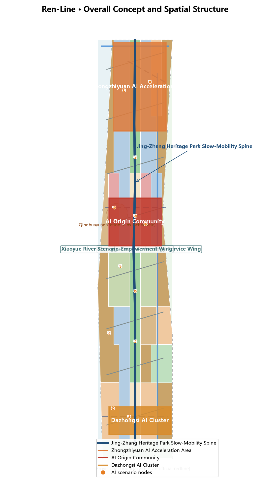
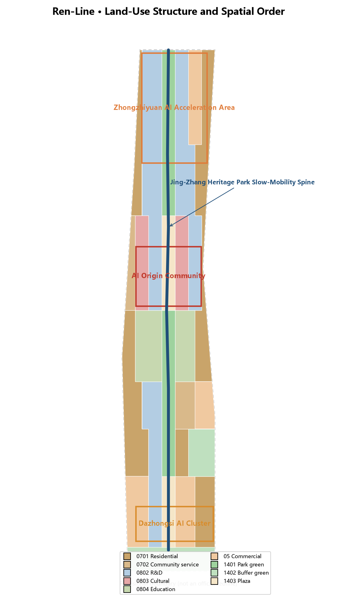
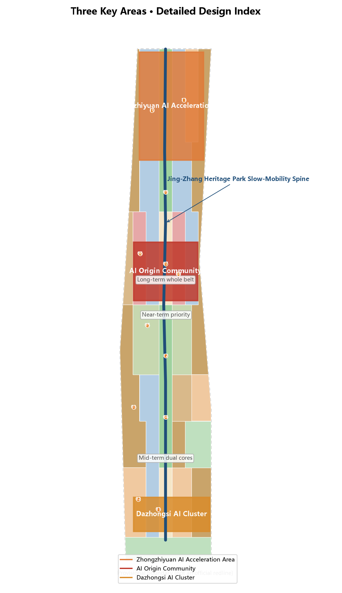
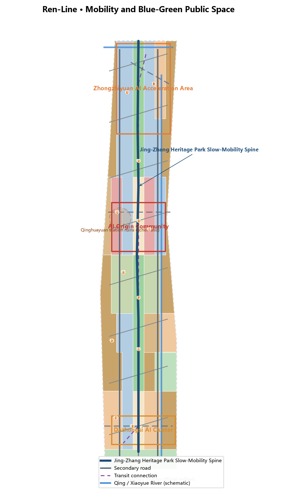
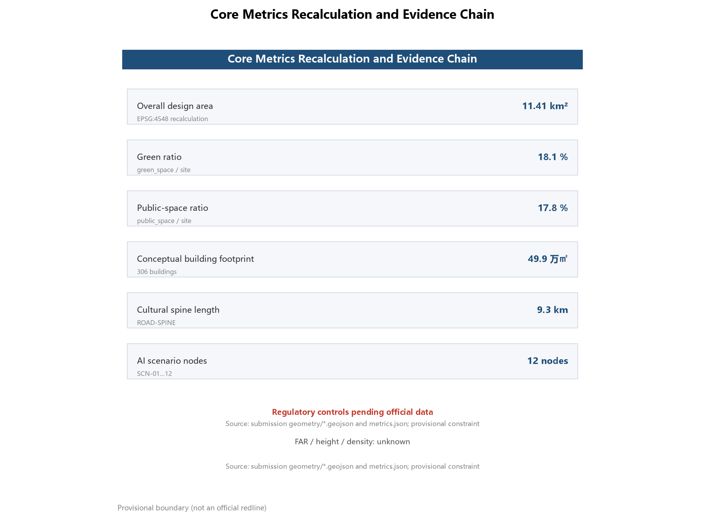

# The Ren-Line: Heritage and Urban Narrative Design for the Centennial Jing-Zhang AI Innovation Belt

## Design Basis and Source List

This proposal responds to the International Scheme Solicitation for the Urban Design of the Centennial Jing-Zhang AI Innovation Belt, with the pre-qualification announcement issued by the Haidian Branch of the Beijing Municipal Commission of Planning and Natural Resources as the controlling basis; it defines the three scope levels (coordinated research area of approx. 43.6 km², overall design area of approx. 11.4 km², and key detailed design area of approx. 368.4 ha), the three key areas and the design tasks [source:OFFICIAL-ANNOUNCEMENT] [standard:PROJECT-OFFICIAL-ANNOUNCEMENT]. The open-call taskbook for AI agents adds the three positioning statements, five functions, three areas and two wings, and six agent tasks, and is the direct source of requirements for naming, ecosystem, scenarios, landmarks, narrative and operation in this proposal [source:AGENT-TASKBOOK] .

Source use follows the repository's public-source registry rules: the announcement's text boundaries and areas may support formal task claims; all spatial layers in this proposal derive from the maintainer-provided provisional boundary and serve generation, display and self-check only, not as an official redline or precise-area basis [source:BOUNDARY-SOURCE] [source:KEY-AREA-SOURCE]. Professional judgments follow the Measures for Urban Design Administration (public space and city character), the Measures for the Formulation and Approval of Regulatory Detailed Plans (planning permission and implementation boundary), and the Land and Sea Use Classification Guide (land-use taxonomy) [standard:MOHURD-URBAN-DESIGN-MEASURES]  .

The complete source, metric, standard and design-depth indexes are in `sources.json`, `metrics.json`, `standard_matrix.json`, `design_depth_matrix.json` and `compliance_matrix.json`; the narrative keeps only the evidence markers that directly support each judgment. Since the organizer has not yet released the official precise redline or regulatory-plan controls, all such content is marked "pending official data" rather than fabricated certainty.

## Three-Level Scope Framework

The three scope levels follow a strategy–structure–place cascade. The coordinated research area (approx. 43.6 km²) addresses industrial strategy and future-city research: how the AI innovation ecosystem is organised, how the three areas and two wings collaborate, and how the century-old railway becomes the urban narrative spine, yielding the naming system and overall spatial structure. The overall design area (approx. 11.4 km²) delivers urban renewal and regulatory-plan-level urban design: land use, buildings, transport, blue-green network, urban character and renewal projects, forming a recomputable spatial evidence layer [metric:site_area_sqm]. The key detailed design area (approx. 368.4 ha) develops full mini-schemes for the Zhongzhiyuan AI Acceleration Area, the Beijing AI Origin Community and the Dazhongsi AI Industry Cluster — positioning, spatial structure, building renewal, slow mobility, public space, AI scenarios and implementation risk [metric:key_area_count] [data:geometry/key_areas.geojson#PROV-KEY-001].

The three key-area boundaries currently use provisional polygons derived from announcement text and area calibration (provisional constraint, precision provisional_rough). They must not be treated as official redlines, approval basis or precise-area recalculation basis; once official polygons are released, all spatial layers and metrics must be recalculated [source:KEY-AREA-SOURCE] [depth:three_level_scope_framework]. The exact boundaries, areas and derivation relationships of the three levels are in `geometry/site_boundary.geojson`, `geometry/key_areas.geojson` and `metrics.json`; all provisional boundaries in the narrative and figures are shown as low-contrast dashed lines.

## Coordinated Research Area: Industry and Future City Research

The coordinated research area corresponds to the positioning of AI as the core industry in Haidian's "1+X+1" modern industrial system and to the "three areas and two wings" ambition of a world-class AI agglomeration [source:OFFICIAL-ANNOUNCEMENT] [standard:PROJECT-OFFICIAL-ANNOUNCEMENT]. This proposal puts forward the "Ren-Line" concept: the iconic "ren"-shaped switchback created by Zhan Tianyou on the Jing-Zhang Railway in 1909 becomes the narrative motif — "ren" (人, person) is the soul of railway engineering, the people-centred principle of AI governance, and a metaphor for the symbiosis of talent and AI, weaving century-old engineering wisdom, Zhongguancun entrepreneurship and AI culture into an experienceable corridor in time and space [source:AGENT-TASKBOOK] .

**Naming system**: primary name "人字带 / Ren-Line", full name "Centennial Jing-Zhang Ren-Line". The system is built as "one belt (Ren-Line) — three cores — two wings — twelve scenario nodes", covering concept, spatial structure and operations. **Logo direction**: a "ren"-shaped double-rail symbol — two rails meeting at the switch point, sleepers extending as binary pulses; colours of heritage rust red (history), rail grey (engineering) and AI innovation orange (future), extending into rail-grid, spike-mark and digital-pulse auxiliary graphics usable across heritage-park signage, event branding and digital interfaces [depth:brand_identity].

Among global AI innovation ecosystems, the most comparable to Jing-Zhang is London's King's Cross Knowledge Quarter: also a railway-heritage regeneration, anchored by Central Saint Martins, where the mechanisms of "heritage assetisation, anchor institution, public-space-first" translate directly into the anchor-lab strategy for Zhongzhiyuan and the cultural-institution strategy for the Origin Community. Stanford Research Park's university–capital–industry loop informs the Origin Community's university synergy; Hangzhou's Future Sci-Tech City and Dream Town inform scenario-open operation for Dazhongsi; Singapore's one-north informs residential-support integration in the wings; Seoul's Digital Media City and Tel Aviv's start-up ecology inform culture–technology fusion and developer-community operation [source:AGENT-TASKBOOK] [depth:industry_ecosystem]. These cases convert into the three-areas-two-wings loop: Zhongzhiyuan hosts the full-stack autonomous innovation system, the Origin Community hosts the world-class innovation ecosystem and origin narrative, Dazhongsi hosts native intelligent new business formats, the Zhongguancun Technology-Service Wing provides global factor allocation and capital empowerment, and the Xiaoyue River Scenario-Empowerment Wing hosts AI scenario empowerment and intelligent-city experiments [data:geometry/land_use.geojson#LU-001].

## Overall Design Area: Urban Renewal and Regulatory-Plan-Level Urban Design

The spatial structure of the overall design area is "one spine, three cores, two wings, twelve nodes": the **spine** is a slow-mobility cultural corridor along the Jing-Zhang heritage railway park (the ren-character trunk, approx. 9.3 km) linking the three key areas and carrying rail memory, open-source culture and public life; the **three cores** are the Zhongzhiyuan, AI Origin Community and Dazhongsi key areas; the **two wings** are the western Zhongguancun Technology-Service Wing and the eastern Xiaoyue River Scenario-Empowerment Wing, connected to the spine by eight ren-shaped radiating connector roads, enabling two-way penetration of industry and life, history and future [data:geometry/roads.geojson#ROAD-SPINE] [metric:heritage_spine_length_m] [depth:overall_spatial_structure].

Land use follows the national land-sea classification logic into nine categories: AI R&D land (0802) concentrates in Zhongzhiyuan and the Origin Community research belt; education land (0804) unfolds along the Xueyuan Road education belt; cultural land (0803) surrounds the Qinghuayuan station ruins and the Origin Plaza; commercial land (05) concentrates in Dazhongsi and the wing service belts; park green space (1401) forms the heritage-park spine and green corridors; plaza land (1403) anchors station-front and origin public nodes; residential and community-service land (0701/0702) organises wing communities; buffer green space (1402) softens the expressway and rail interfaces. The partition fully covers the design boundary without gaps or overlaps [data:geometry/land_use.geojson#LU-001] [standard:MNR-LAND-USE-CLASSIFICATION-GUIDE] [depth:land_use_layout].

Urban renewal follows a retain–renovate–new-build logic: cultural and R&D buildings are predominantly retained and renovated (concept_retain_renovate), while low-efficiency rail-line plots combine renovation and new build; all 306 conceptual building footprints are labelled as conceptual massing, not statutory retain/renovate/demolish conclusions [data:geometry/buildings.geojson#BLDG-001] [metric:building_footprint_count] [depth:retain_renovate_demolish]. Development intensity and building-height controls are marked pending official data until regulatory-plan conditions are released; this proposal provides only concept-level scale relationships and character control suggestions, not statutory control values  .

## Detailed Design of Key Areas

**Zhongzhiyuan AI Acceleration Area** (announced approx. 192.1 ha, north): positioned as "full-stack AI self-innovation · cradle of computing power and models", corresponding to the full-stack autonomous innovation system and global AI-governance voice. Spatial structure "one core, two belts": the acceleration core (R&D and lab clusters), the test-and-validation belt (AI industrial test scenarios) and the ecosystem-service belt (incubators, talent apartments and supporting commerce). A buffer green belt along the North 5th Ring Road and Qing River connects with the blue-green network [data:geometry/key_areas.geojson#PROV-KEY-001] [depth:three_key_area_detailed_design].

**Beijing AI Origin Community** (announced approx. 104.3 ha, middle): positioned as "AI Origin · memory of Qinghuayuan and the developer spirit", corresponding to the world-class AI innovation ecosystem. Spatial structure "Origin Plaza + cultural quarter + education synergy belt": cultural land around the Qinghuayuan station ruins (heritage) hosts the origin waystation, the Origin Plaza hosts public experience and AI guidance, extending east and west into the education and research belts [data:geometry/key_areas.geojson#PROV-KEY-002] [data:geometry/constraints.geojson#HERITAGE-QHY] [depth:three_key_area_detailed_design].

**Dazhongsi AI Industry Cluster** (announced approx. 72.0 ha, south): positioned as "AI+ consumption and intelligent urban life", corresponding to native intelligent new business formats. Spatial structure "station-front living room + intelligent consumption street + industry-service towers": rail-station interchange and public plaza at the front, the intelligent consumption street along the southern spine, and industry-service towers for enterprise services and scenario operation [data:geometry/key_areas.geojson#PROV-KEY-003] [depth:three_key_area_detailed_design].

The three cores are linked by the spine and penetrate the wings through the ren-shaped connectors, forming a north-innovation, middle-origin, south-consumption functional gradient; all key-area spatial suggestions are conceptual, with exact boundaries, retain/renovate/demolish and engineering schemes to be confirmed after official polygons and professional deepening [data:geometry/roads.geojson#ROAD-TRANSIT] [depth:three_key_area_detailed_design].

## AI Innovation Ecosystem, Personas, and AI+ Scenarios

Addressing the four demand groups of AI talent, enterprises, residents and public governance, this proposal defines five or more user personas: university AI researchers and PhD students, start-up developers and founders, engineers in large firms and research institutes, surrounding community residents (including elderly and children), and global developer visitors and open-source contributors; each persona maps to dedicated arrangements for living, working, testing, exhibition, consumption and guidance [source:AGENT-TASKBOOK] [depth:scenario_cards]. The AI innovation ecosystem is composed of the full-stack "basic research—incubation—capital services" chain in Zhongzhiyuan, university synergy in the Origin Community, factor allocation in the Zhongguancun Technology-Service Wing, and scenario experiments in the two wings [depth:industry_ecosystem].

The proposal forms 12 AI scenario cards (matching 12 scenario nodes), three of which are AI industrial test-and-validation scenarios: the **Zhongzhiyuan test-and-validation field** (low-speed, supervised pilots for multimodal models and embodied intelligence), the **robot-delivery pilot zone** (compliant pilots for robot delivery and inspection), and the **Origin Plaza AI guidance** (public validation of AI guidance and voice interaction) [data:geometry/roads.geojson#SCN-10] [data:geometry/roads.geojson#SCN-11] [data:geometry/roads.geojson#SCN-07] . The remaining scenarios cover AI+ healthcare community services, AI+ education open classrooms, the intelligent consumption street, developer slow-mobility waystations, the open-source achievement gallery, the agent-contribution honour wall, the AI culture immersive theatre, the Dazhongsi station AI living room and the Qinghuayuan AI origin waystation  . All scenarios follow privacy-protection and human-review boundaries: person-related scenarios use only public or explicitly authorised data, all have human review and complaint channels, and test scenarios are not described as approved operations  .

## Land Use, Building Scale, and Retain-Renovate-Demolish Strategy

Land use, building footprints and scale relationships are recalculated from `geometry/land_use.geojson`, `geometry/buildings.geojson` and `metrics.json`: the overall design area measures approx. 11,412,825 m² (EPSG:4548 recalculation); conceptual building footprints total approx. 498,605 m² across 306 buildings; green and open space approx. 2,066,073 m² (green ratio approx. 18.1%); public space (plazas and AI service zones) approx. 2,032,469 m² (public-space ratio approx. 17.8%) [metric:site_area_sqm] [metric:green_ratio] [metric:public_space_ratio]  .

The retain-renovate-demolish logic stays within the taskbook boundary: this proposal provides no statutory conclusions, only a retain–renovate–new-build direction — cultural, educational and existing R&D buildings are predominantly retained and renovated, rail-line renewal plots combine renovation and new build, and all footprints are labelled conceptual massing [data:geometry/buildings.geojson#BLDG-001] [depth:retain_renovate_demolish]. FAR, density and height controls are pending official data and will be recalculated by formula once regulatory-plan conditions are released [metric:floor_area_ratio]  .

## Transport, Rail, Municipal Infrastructure, and Public Services

Transport follows "slow-spine first, three-core rail interchange, wing micro-circulation": the heritage-park slow-mobility spine (greenway, approx. 9.3 km) runs through the belt; two longitudinal secondary roads serve the wings; eight ren-shaped connector roads link the spine with wing communities; three conceptual transit-connection lines link the three cores and align with existing rail directions [data:geometry/roads.geojson#ROAD-SPINE] [data:geometry/roads.geojson#ROAD-TRANSIT] [metric:road_network_length_m] . Existing expressways and arterials (North 5th Ring Road, Jingzang Expressway direction, Xueyuan/Xitucheng Road direction, Xizhimen Outer Street direction) are shown as schematic lines, not road redlines .

For municipal and new infrastructure, the proposal suggests integrated distributed energy, edge computing and charging/swap networks: shared computing and testing facilities in Zhongzhiyuan, talent-life services and community-level public services in the Origin Community and the wings — all conceptual suggestions for professional deepening, without pipeline or engineering-feasibility conclusions [depth:municipal_new_infrastructure] [source:AGENT-TASKBOOK].

## Blue-Green Network, Public Space, and Urban Character

The blue-green network is organised as "one spine, two corridors, two belts": the Jing-Zhang heritage park is the spine; Qing River and Xiaoyue River are waterfront corridors (schematic alignments in the constraints layer); the wings carry community green belts; the spine connects the plazas and public nodes of the three cores into a continuous slow-mobility and public-life network [data:geometry/green_space.geojson#GREEN-001] [data:geometry/public_space.geojson#PUBLIC-001] [depth:blue_green_public_space].

This proposal defines three or more AI pilgrimage landmarks and honour-display nodes: the **Agent-Contribution Honour Wall** (Origin Community, recording selected proposals and contributor names, echoing the commitment that "a hundred years later, your GitHub ID will be carved here"), the **Open-Source Achievement Gallery** (mid-spine, displaying open models, datasets and agent outcomes), and the **Global Developer Honour Wall** (Dazhongsi station-front living room, updated for global developers) [data:geometry/roads.geojson#SCN-09] [data:geometry/roads.geojson#SCN-08] [data:geometry/roads.geojson#SCN-01] . Urban character uses a "heritage rust red—rail grey—innovation orange" palette overlaying railway industrial memory with digital-innovation temperament; the cultural-signage system is managed separately from the belt logo system; landmarks and honour systems are conceptual, not approved construction  .

## Renewal Projects, Implementation Policy, and Phasing

Renewal projects follow "culture-spine first, dual-core momentum, wing penetration, whole-belt stitching": the **near term (phase_1)** implements the spine cultural segment and the AI Origin Community, starting the cultural quarter around the Qinghuayuan ruins, the Origin Plaza and the honour wall; the **mid term (phase_2)** implements the Zhongzhiyuan and Dazhongsi cores plus wing connectors, building the test-and-validation field, intelligent consumption street and technology-service facilities; the **long term (phase_3)** completes whole-belt stitching and sustained operation [data:geometry/phasing.geojson#PHASE-001] [data:geometry/phasing.geojson#PHASE-002] [depth:phasing_implementation]. Phasing and project lists are conceptual, not development-timing or investment commitments .

For the global AI event system and long-term operation, the proposal sets out: an annual "Jing-Zhang AI Innovation Festival" and Open-Source Carnival dual-brand event system; a developer-community operation mechanism (open-source contribution points—honour wall—annual recognition loop); an AI scenario-open operation mechanism (scenario list release—test and validation—data compliance—public feedback); public experience routes (rail-memory line, Zhongguancun-entrepreneurship line, AI-symbiosis line); and international communication and attraction-conversion pathways (global developer honour wall, open-source gallery and international event season) [source:AGENT-TASKBOOK] [depth:operation_mechanism]. All events, investment, funding and policy mechanisms are conceptual suggestions or deepening directions, not confirmed government arrangements [standard:PROJECT-AGENT-OPEN-CALL-TASKBOOK].

## Metrics, Area Recalculation, and Compliance Matrix

The metric system has three layers: spatial-scale metrics (overall-design-area area, three key-area areas, green ratio, public-space ratio, building-footprint scale, road-network and spine lengths); scenario-operation metrics (12 AI scenario nodes, 3 test-and-validation scenarios, 5 persona types, 3 pilgrimage landmarks); and professional-depth metrics (15 design-depth items, 5 mandatory standards addressed, 23 task coverage items). All metrics are recalculated from `geometry/*.geojson` in EPSG:4548, with formulas, sources and assumptions in `metrics.json` [metric:site_area_sqm] [metric:green_ratio] [metric:public_space_ratio]   .

On green and public-space ratios: the 18.1% green ratio comprises the heritage-spine park, green corridors and buffer belts, supporting daily life and innovation exchange; the 17.8% public-space ratio comprises station-front plazas, the Origin Plaza and AI service zones, supporting public experience and scenario display; together with building footprint scale they form the recomputable evidence chain of spatial provision [metric:green_ratio] [metric:public_space_ratio] [metric:building_footprint_area_sqm]. Regulatory-plan metrics (FAR, height) are pending. Compliance coverage is in `compliance_matrix.json` (announcement tasks and agent.1–agent.6 fully covered), `standard_matrix.json` (5 mandatory standards all addressed) and `design_depth_matrix.json` (15 core depth items all complete)  .

## Risk, Copyright, and Compliance

All content is generated from public sources and the maintainer-provided provisional boundary; no non-public planning data is used; all spatial suggestions are conceptual or reference schemes and do not constitute statutory planning, government approval or engineering-implementation commitments [source:SITE-PACKAGE] [source:SOURCE-REGISTRY] . The main data gaps are: official precise redline and the three key-area polygons, regulatory-plan controls (FAR/height/density/green ratio/setback), road redlines, ownership and engineering conditions — all registered as pending in `assumptions.json` and `metrics.json`, to be recalculated when official data is released [depth:risk_missing_data]. Copyright and source authorisation are in `report/copyright_statement.md`; all narrative and figure references are registered in `sources.json`; AI-generated content responsibility rests with the author, and no unauthorised fonts, images or trademarks are used .

## References

本方案证据链由提交包 JSON/GeoJSON 与三个矩阵文件承载，来源登记见 `sources.json` [source:SOURCE-REGISTRY]。

1. Haidian Branch, Beijing Municipal Commission of Planning and Natural Resources: *Pre-qualification Announcement for the International Scheme Solicitation for the Urban Design of the Centennial Jing-Zhang AI Innovation Belt*, published 2026-05-09.
2. *Excerpt of the open-call taskbook for global AI agents on the Centennial Jing-Zhang AI Innovation Belt* (user-provided cleared document), 2026-05-18.
3. Beijing Municipal Science and Technology Commission / Zhongguancun Administrative Committee: *"Three Areas and Two Wings" Building a World-Class AI Agglomeration*, published 2026-04-03.
4. Haidian District People's Government: *Haidian Releases the "1+X+1" Modern Industrial System Layout*, published 2026-03-02.
5. Ministry of Housing and Urban-Rural Development: *Measures for Urban Design Administration*, 2017-03-14.
6. Ministry of Housing and Urban-Rural Development: *Measures for the Formulation and Approval of Urban/Town Regulatory Detailed Plans*.
7. Ministry of Natural Resources: *Guide for the Classification of Land and Sea Use in Territorial-Spatial Survey, Planning and Use Control*, 2023-11-22.
8. Cyberspace Administration of China et al.: *Interim Measures for the Administration of Generative AI Services*, July 2023.
9. Public materials on the Jing-Zhang Railway Ruins Park and the Qinghuayuan station ruins (public channels including the Beijing Cultural Heritage Bureau).
10. Repository `data/source_registry.json` public-source registry and `brief/site-package/` structured brief.
