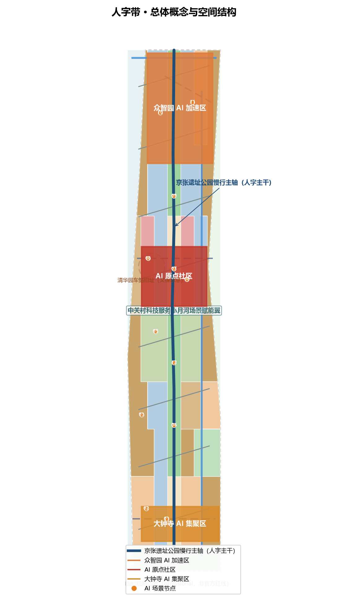
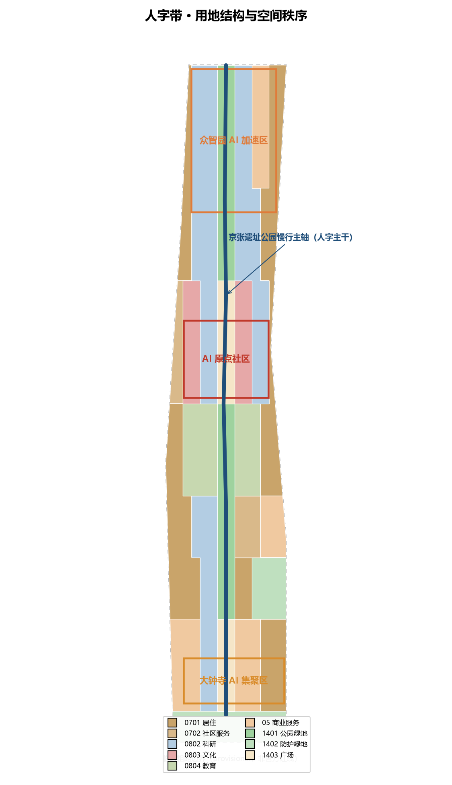
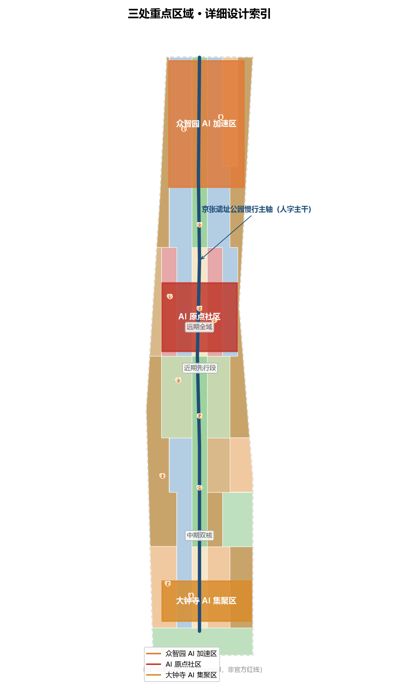
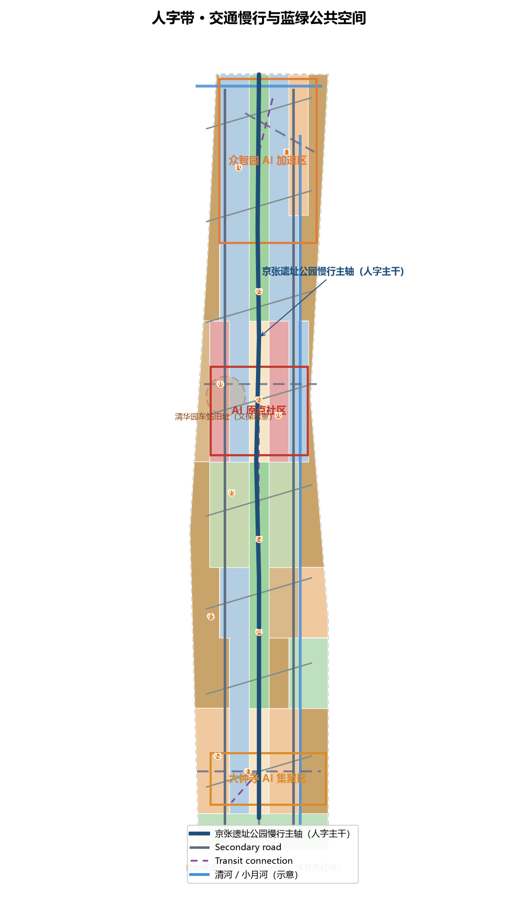
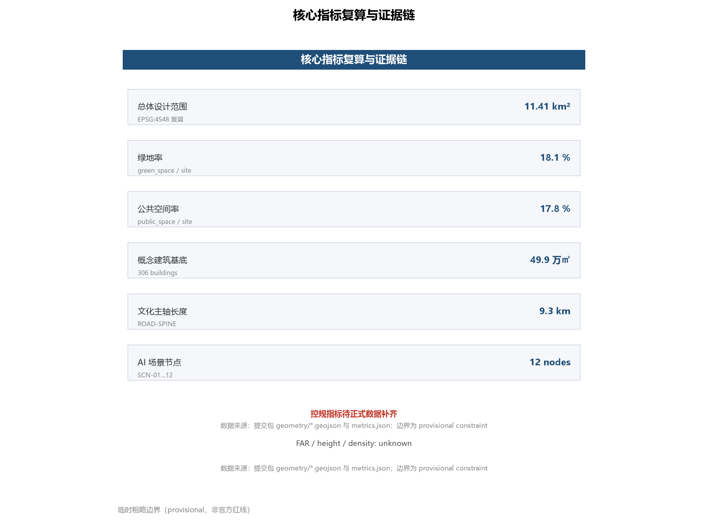

# 人字带：百年京张AI创新带文化遗产与城市叙事设计方案

## 设计依据与资料清单

本方案面向「百年京张AI创新带城市设计国际方案征集」，以北京市规划和自然资源委员会海淀分局发布的资格预审公告为项目主控依据，其明确了三层范围（统筹研究范围约43.6平方公里、总体设计范围约11.4平方公里、重点区域约368.4公顷）、三处重点区域及设计任务 [source:OFFICIAL-ANNOUNCEMENT] [standard:PROJECT-OFFICIAL-ANNOUNCEMENT]。面向智能体开源征集任务书补充了三大定位、五大功能、三区两翼与六项智能体任务，是本方案在命名、生态、场景、地标、叙事与运营层面的直接要求来源 [source:AGENT-TASKBOOK] 。

资料使用遵循仓库公开资料登记规则：公告文字四至与面积可作为 formal 任务依据；本方案所有空间图层基于维护者提供的临时粗略边界（provisional boundary）派生，仅用于生成、展示与自检，不作为官方红线或精确面积依据 [source:BOUNDARY-SOURCE] [source:KEY-AREA-SOURCE]。专业判断依据《城市设计管理办法》对公共空间与城市特色的控制要求、《城市、镇控制性详细规划编制审批办法》对规划许可与实施管理的边界要求，以及《国土空间调查、规划、用途管制用地用海分类指南》的用地分类逻辑 [standard:MOHURD-URBAN-DESIGN-MEASURES]  。

完整来源、指标、标准与设计深度索引见 `sources.json`、`metrics.json`、`standard_matrix.json`、`design_depth_matrix.json` 与 `compliance_matrix.json`，正文只保留直接支撑判断的证据引用。组织方尚未发布官方精确红线与控规指标，本方案相应内容按「待正式数据补齐」处理，不虚构官方结论。

## 三层范围工作框架

三层范围采用「战略—结构—场所」逐级传导的工作框架。统筹研究范围（约43.6平方公里）承担产业战略与未来城市研究：回答AI创新生态如何组织、三区两翼如何协同、百年铁路如何成为城市叙事主线，并据此提出命名体系与总体空间结构。总体设计范围（约11.4平方公里）承担城市更新与控规深度城市设计：落实用地、建筑、交通、蓝绿、风貌与更新项目，形成可复算的空间证据层 [metric:site_area_sqm]。重点区域范围（约368.4公顷）对众智园AI自主创新加速区、北京AI原点社区、大钟寺AI产业集聚区开展详细设计，形成「定位＋空间结构＋建筑更新＋交通慢行＋公共空间＋AI场景＋实施风险」的完整小方案 [metric:key_area_count] [data:geometry/key_areas.geojson#PROV-KEY-001]。

三处重点区域边界目前使用公告文字定位与面积校核形成的临时粗略多边形（provisional constraint），精度为 provisional_rough，不得作为官方红线、审批依据或精确面积复算依据；官方polygon发布后，全部空间图层与指标需统一重算 [source:KEY-AREA-SOURCE] [depth:three_level_scope_framework]。三层范围的具体边界、面积与派生关系见 `geometry/site_boundary.geojson`、`geometry/key_areas.geojson` 与 `metrics.json`，正文与图件中所有临时边界均以低对比度虚线标注。

## 统筹研究范围产业与未来城市研究

统筹研究范围对应海淀「1+X+1」现代化产业体系布局中AI作为核心产业的定位，以及「三区两翼」打造世界级AI集聚地的区域语境 [source:OFFICIAL-ANNOUNCEMENT] [standard:PROJECT-OFFICIAL-ANNOUNCEMENT]。本方案提出「人字带」总体概念：以詹天佑1909年主持修建京张铁路时创造的『人字形』折返线路为叙事母题——『人』既是铁路工程的灵魂符号，也是『以人为本』的AI治理原则，更是人才与AI共生新文化的隐喻，将百年工程智慧、中关村创业精神与AI新文化编织为一条可体验的时空走廊 [source:AGENT-TASKBOOK] 。

**命名体系**：主名称「人字带」，英文名「Ren-Line」，全称「百年京张·人字带（Centennial Jing-Zhang Ren-Line）」。命名体系由「一带（Ren-Line）—三核（Three Cores）—两翼（Two Wings）—12节点（12 Scenario Nodes）」构成，覆盖总体概念、空间结构与场景运营。**Logo方向**：以『人』字形双轨符号为核心——两条钢轨在岔尖汇合，轨枕延伸为二进制脉冲线；配色取京张铁锈红（历史）、钢轨灰（工程）与AI创新橙（未来），延展出轨道网格、道钉标识与数字脉冲三类辅助图形，可同时用于遗址公园导视、活动品牌与数字界面 [depth:brand_identity]。

全球AI创新生态案例中，与京张语境最具可比性的是伦敦国王十字知识区（King's Cross Knowledge Quarter）：同为铁路遗产活化，以中央圣马丁学院为锚点形成知识型城市更新，其『遗产资产化、锚点机构带动、公共空间先行』机制可直接转化为众智园的锚点实验室策略与原点社区的文化机构策略；硅谷斯坦福研究园的大学—资本—产业环为AI原点社区的高校协同提供参照；杭州未来科技城与梦想小镇的场景开放运营为大钟寺智能消费与场景测试提供参照；新加坡纬壹科技城（one-north）的园区社区融合为两翼居住配套提供参照；首尔数字媒体城与特拉维夫创业生态分别对应文化科技融合与开发者社区运营 [source:AGENT-TASKBOOK] [depth:industry_ecosystem]。上述案例在本方案中转化为三区两翼的协同回路：众智园承载AI全栈自主创新体系，AI原点社区承载世界级AI创新生态与原点叙事，大钟寺承载智能原生新业态，中关村科技服务翼承担要素全球化配置与资本赋能，小月河场景赋能翼承担AI场景赋能与智能化活力城市试验 [data:geometry/land_use.geojson#LU-001]。

## 总体设计范围城市更新与控规深度城市设计

总体设计范围的空间结构概括为「一轴、三核、两翼、十二节点」：**一轴**是沿京张铁路遗址公园形成的慢行文化主轴（人字主干，约9.3公里），串联三处重点区域并承担铁轨记忆、开源文化与公共生活；**三核**为众智园、AI原点社区、大钟寺三处重点区域；**两翼**为西侧中关村科技服务翼与东侧小月河场景赋能翼，由八条『人字形』放射联络路与主轴连接，形成产业与生活、历史与未来的双向渗透 [data:geometry/roads.geojson#ROAD-SPINE] [metric:heritage_spine_length_m] [depth:overall_spatial_structure]。

用地布局按国土空间用地用海分类逻辑组织，形成九类用地分区：AI研发创新用地（0802）集中于众智园与原点社区科研带，教育用地（0804）沿学院路教育带展开，文化用地（0803）围绕清华园车站旧址与原点广场布局，商业服务业用地（05）集聚于大钟寺与两翼服务带，公园绿地（1401）形成遗址公园主轴与滨绿走廊，广场用地（1403）锚定站前与原点公共节点，居住与社区服务用地（0701/0702）组织两翼社区，防护绿地（1402）沿快速路与铁路界面缓冲，全部用地分区无缝隙覆盖总体设计边界且互不重叠 [data:geometry/land_use.geojson#LU-001] [standard:MNR-LAND-USE-CLASSIFICATION-GUIDE] [depth:land_use_layout]。

城市更新遵循「保留—改造—新建」分层逻辑：科研与文化类建筑以保留改造为主（concept_retain_renovate），轨道沿线低效用地与产业更新地块以改造与新建结合，全部306栋概念建筑基底均标注为概念体量，不构成法定拆改留结论 [data:geometry/buildings.geojson#BLDG-001] [metric:building_footprint_count] [depth:retain_renovate_demolish]。开发强度与建筑高度等控规条件在官方条件发布前统一记为待确认，本方案仅提供概念层级的规模关系与风貌控制建议，不表述为法定控制值  。

## 重点区域详细设计

**众智园AI自主创新加速区**（公告约192.1公顷，北端）：定位「AI全栈自主创新·算力与模型的摇篮」，对应AI全栈自主创新体系与AI治理全球话语权职能。空间结构为「一核两带」：创新加速核（科研与实验室建筑群）、测试验证带（AI产业测试验证场景）与生态服务带（孵化器、人才公寓与配套商业）。依托北五环与清河界面设置防护绿带，与清河蓝绿空间衔接 [data:geometry/key_areas.geojson#PROV-KEY-001] [depth:three_key_area_detailed_design]。

**北京AI原点社区**（公告约104.3公顷，中段）：定位「AI原点·清华园记忆与开发者精神」，对应世界级AI创新生态职能。空间结构为「原点广场＋文化街区＋教育协同带」：清华园车站旧址（文保）周边组织文化用地与原点驿站，原点广场承担公共体验与AI导览，向东西分别衔接学院路教育带与科研带 [data:geometry/key_areas.geojson#PROV-KEY-002] [data:geometry/constraints.geojson#HERITAGE-QHY] [depth:three_key_area_detailed_design]。

**大钟寺AI产业集聚区**（公告约72.0公顷，南端）：定位「AI+消费与城市智能生活」，对应智能原生新业态职能。空间结构为「站前会客厅＋智能消费街＋产业服务楼群」：依托既有轨道站组织接驳与公共广场，智能消费体验街沿主轴南段展开，产业服务楼群承载企业服务与场景运营 [data:geometry/key_areas.geojson#PROV-KEY-003] [depth:three_key_area_detailed_design]。

三个重点区均以主轴为空间纽带、以人字形联络路向两翼渗透，形成北创新、中原点、南消费的南北功能梯度；所有重点区空间建议均为概念建议，具体用地边界、拆改留与工程方案待官方polygon与专业团队深化后确定 [data:geometry/roads.geojson#ROAD-TRANSIT] [depth:three_key_area_detailed_design]。

## AI 创新生态、人才画像与 AI+ 场景

面向AI人才、企业、居民与公共治理四类需求，本方案提出五类以上用户画像：高校AI研究员与博士生、初创团队开发者与创业者、大厂与科研院所AI工程师、周边社区居民（含老年人儿童）、全球开发者游客与开源贡献者，每类画像对应居住、办公、测试、展示、消费与导览的专属空间安排 [source:AGENT-TASKBOOK] [depth:scenario_cards]。AI创新生态通过众智园的『基础研究—产业孵化—资本服务』全栈链路、原点社区的高校协同、中关村科技服务翼的要素配置与两翼的场景试验协同构成 [depth:industry_ecosystem]。

本方案形成12张AI场景卡（对应12个场景节点），其中3张为AI产业测试验证场景：**众智园测试验证场**（多模态模型与具身智能的低速、受监管试点）、**机器人配送试点区**（机器人配送与巡检的合规试点）、**原点广场智能导览**（AI导览与语音交互的公众验证）[data:geometry/roads.geojson#SCN-10] [data:geometry/roads.geojson#SCN-11] [data:geometry/roads.geojson#SCN-07] 。其余场景覆盖AI+医疗社区服务、AI+教育开放课堂、智能消费体验街、开发者慢行驿站、开源成果展示廊、智能体贡献荣誉墙、AI文化沉浸剧场、大钟寺站AI会客厅与清华园AI原点驿站  。所有场景遵循隐私保护与人工复核边界：涉及个人数据的场景仅采用公开数据或用户明示授权数据，均设人工复核与投诉处置通道，测试验证场景不表述为已批准运营  。

## 用地、建筑规模与拆改留方案

用地布局、建筑基底与规模关系以 `geometry/land_use.geojson`、`geometry/buildings.geojson` 与 `metrics.json` 为复算依据：总体设计范围面积约11,412,825平方米（EPSG:4548复算），概念建筑基底合计约498,605平方米、共306栋，绿地与开敞空间约2,066,073平方米（绿地率约18.1%），公共空间（含广场与AI服务区）约2,032,469平方米（公共空间率约17.8%）[metric:site_area_sqm] [metric:green_ratio] [metric:public_space_ratio]  。

拆改留逻辑与任务书边界一致：本方案不提供法定拆改留结论，仅以「保留—改造—新建」分类表达更新方向——文化、教育与现状科研建筑以保留改造为主，轨道沿线更新地块以改造与新建结合，所有建筑基底标注为概念体量 [data:geometry/buildings.geojson#BLDG-001] [depth:retain_renovate_demolish]。容积率、建筑密度、建筑高度等控规指标状态为待正式数据补齐，待官方控规条件发布后按公式复算 [metric:floor_area_ratio]  。

## 交通、轨道、市政与公共服务设施

交通组织以「慢行主轴优先、三核轨道接驳、两翼微循环」为原则：京张遗址公园慢行主轴（绿道，约9.3公里）贯穿全带，西侧与东侧两条次干路承担两翼集散，八条人字形联络路连接主轴与两翼社区，三条轨道接驳概念线串联三核并与既有轨道交通方向衔接 [data:geometry/roads.geojson#ROAD-SPINE] [data:geometry/roads.geojson#ROAD-TRANSIT] [metric:road_network_length_m] 。现状快速路与主干路（北五环、京藏高速方向、学院路/西土城路方向、西直门外大街方向）作为既有交通骨架以示意线表达，非道路红线 。

市政与新型基础设施方面，本方案提出分布式能源、端侧算力与充电/换电网络的融合配置方向，在众智园部署算力与测试设施共享服务，在原点社区与两翼布局人才生活服务与社区级公共服务设施，均作为概念建议供专业团队深化，不涉及具体管线与工程可行性结论 [depth:municipal_new_infrastructure] [source:AGENT-TASKBOOK]。

## 蓝绿空间、公共空间与城市风貌

蓝绿空间以「一轴一廊两带」组织：京张遗址公园活力带为主轴，清河与小月河为滨水廊道（走向示意见约束图层），两翼设置社区绿带；主轴串联三个重点区的广场与公共节点，形成连续的慢行与公共生活网络 [data:geometry/green_space.geojson#GREEN-001] [data:geometry/public_space.geojson#PUBLIC-001] [depth:blue_green_public_space]。

本方案提出不少于3个AI朝圣地标与荣誉展示节点：**智能体贡献荣誉墙**（原点社区，记录入选方案与贡献者名称，呼应『百年后这里也会刻上你的GitHub ID』的纪念承诺）、**开源成果展示廊**（主轴中段，展示开源模型、数据集与Agent成果）、**全球开发者荣誉墙**（大钟寺站前会客厅，面向全球开发者长期更新）[data:geometry/roads.geojson#SCN-09] [data:geometry/roads.geojson#SCN-08] [data:geometry/roads.geojson#SCN-01] 。城市风貌以「铁锈红—钢轨灰—创新橙」为基调色，延续铁路工业记忆与数字创新气质的叠加，文化标识系统与一带Logo系统区分管理，地标与荣誉体系均为概念建议，不构成已批准建设  。

## 更新项目清单、实施政策与分期计划

更新项目按「文化主轴先行、双核带动、两翼渗透、全域缝合」安排分期：**近期（phase_1）**先行实施主轴文化段与AI原点社区，启动清华园旧址周边文化街区、原点广场与荣誉墙；**中期（phase_2）**实施众智园与大钟寺双核及两翼联络，建设测试验证场、智能消费街与科技服务设施；**远期（phase_3）**完成全域缝合与持续运营 [data:geometry/phasing.geojson#PHASE-001] [data:geometry/phasing.geojson#PHASE-002] [depth:phasing_implementation]。分期与项目清单均为概念建议，不构成开发时序或投资承诺 。

面向全球AI创新活动体系与长期运营，本方案提出：年度「京张AI创新节」与开源嘉年华双品牌活动体系；开发者社区运营机制（开源贡献积分—荣誉墙—年度表彰的转化闭环）；AI场景开放运营机制（场景清单发布—测试验证—数据合规—公众反馈）；公共体验路线（铁轨记忆线—中关村创业线—AI共生线三线导览）；国际传播与招引转化路径（全球开发者荣誉墙、开源成果展示廊与国际活动季）[source:AGENT-TASKBOOK] [depth:operation_mechanism]。所有活动、招商、资金与政策机制均表述为概念建议或深化方向，不表述为已确定的政府安排 [standard:PROJECT-AGENT-OPEN-CALL-TASKBOOK]。

## 指标体系、面积复算与合规矩阵

本方案指标体系分三层：空间规模指标（总体设计范围面积、三重点区面积、绿地率、公共空间率、建筑基底规模、路网长度与主轴长度）、场景运营指标（12个AI场景节点、3个测试验证场景、5类用户画像、3个朝圣地标）、专业深度指标（15项设计深度项、5项mandatory标准响应、23项任务覆盖）。全部指标以 `geometry/*.geojson` 在EPSG:4548投影下复算，公式、来源与假设见 `metrics.json` [metric:site_area_sqm] [metric:green_ratio] [metric:public_space_ratio]   。

绿地率与公共空间率说明：18.1%的绿地率由遗址公园主轴绿地、滨绿走廊与防护绿地构成，支撑人才日常生活与创新交往；17.8%的公共空间率由站前广场、原点广场与AI服务区构成，支撑公共体验与场景展示；两者与建筑基底规模共同构成空间供给的可复算证据链 [metric:green_ratio] [metric:public_space_ratio] [metric:building_footprint_area_sqm]。控规类指标（容积率、建筑高度）为待确认状态。合规覆盖见 `compliance_matrix.json`（公告任务与agent.1—agent.6全覆盖）、`standard_matrix.json`（5项mandatory标准全部addressed）、`design_depth_matrix.json`（15项核心深度项全部complete） 。

## 风险、版权与合规说明

本方案全部内容基于公开资料与维护者提供的临时边界生成，未使用非公开规划资料；空间建议均为概念建议或参考方案，不构成法定规划、政府审定结论或工程实施承诺 [source:SITE-PACKAGE] [source:SOURCE-REGISTRY] 。主要数据缺口为：官方精确红线与三处重点区域polygon、控规指标（容积率/建筑高度/密度/绿地率/退线）、道路红线、权属与工程条件，均在 `assumptions.json` 与 `metrics.json` 中登记为待补，官方数据发布后需统一重算 [depth:risk_missing_data]。版权与来源授权见 `report/copyright_statement.md`；正文与图件引用均登记于 `sources.json`，AI生成内容责任由作者承担，未使用未授权字体、图像或商标 。

## 参考资料

本方案证据链由提交包 JSON/GeoJSON 与三个矩阵文件承载，来源登记见 `sources.json` [source:SOURCE-REGISTRY]。

1. 北京市规划和自然资源委员会海淀分局：《百年京张AI创新带城市设计国际方案征集资格预审公告》，2026年5月9日发布。
2. 面向全球智能体开展「百年京张AI创新带城市设计开源征集」任务书摘录（用户提供清权文档），2026年5月18日。
3. 北京市科学技术委员会、中关村科技园区管理委员会：《「三区两翼」打造世界级AI集聚地》，2026年4月3日。
4. 北京市海淀区人民政府：《海淀区发布「1+X+1」现代化产业体系建设布局》，2026年3月2日。
5. 住房和城乡建设部：《城市设计管理办法》，2017年3月14日。
6. 住房和城乡建设部：《城市、镇控制性详细规划编制审批办法》。
7. 自然资源部：《国土空间调查、规划、用途管制用地用海分类指南》，2023年11月22日。
8. 国家互联网信息办公室等七部门：《生成式人工智能服务管理暂行办法》，2023年7月。
9. 京张铁路遗址公园及清华园车站旧址公开资料（北京市文物局等公开渠道）。
10. 仓库 `data/source_registry.json` 公开资料登记表与 `brief/site-package/` 结构化任务书。
