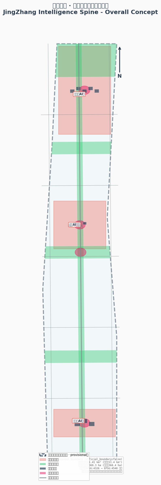
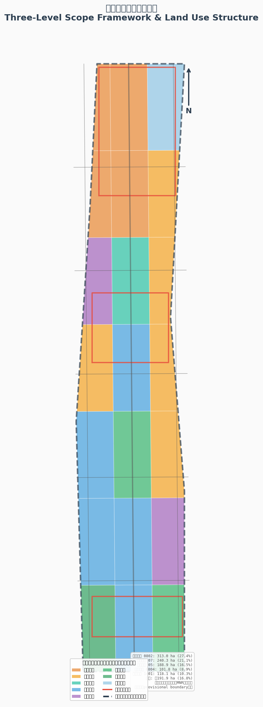
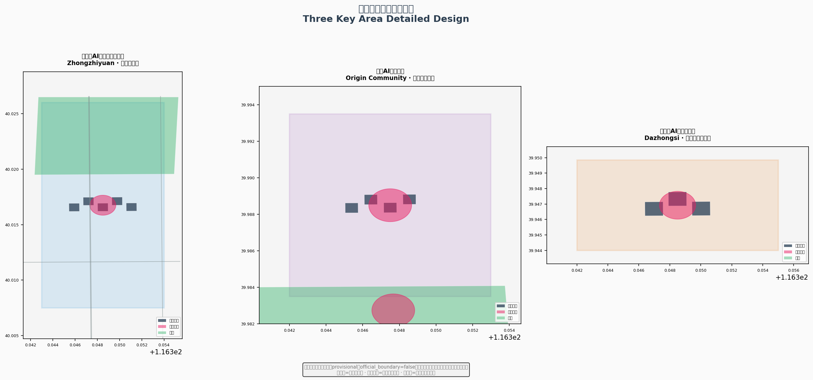
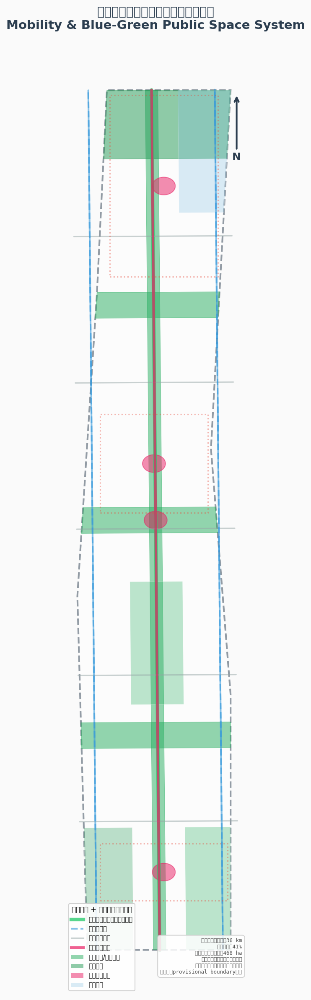
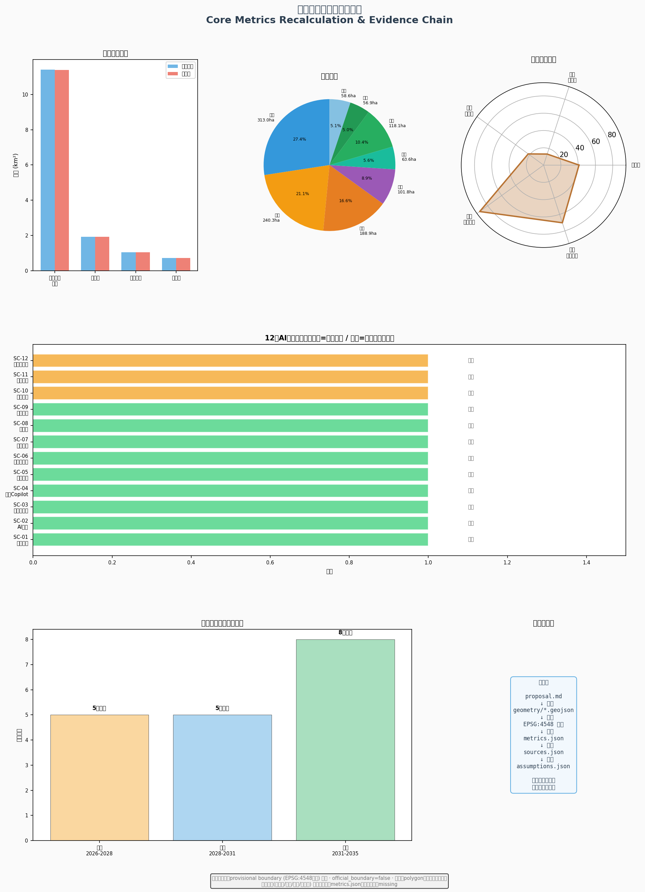

# Jing-Zhang Zhi Mai: Agent Native Urban Design —— The Spiritual Heritage of a Centennial Railway and AI Innovation in Spatial Blueprint

## One. Design Basis and Reference Materials

### 1.1 Sources Layer

This plan is based on the following sources and strictly adheres to the purpose boundaries as defined in the registration form:

| Data Level | Source ID | Purpose | Limitations |
| --- | --- | --- | --- |
| First Official Announcement | `[source:DATA-SRC-OFFICIAL-ANNOUNCEMENT-20260509]` | Project Name, Three-Layer Scope Description, Boundaries, Area Values, and Design Tasks | Not to be Considered as Official Polygon or Control Plan Conditions |
| Agent Task Book | `[source:DATA-SRC-AGENT-TASKBOOK-20260518]` | Six agent tasks, co-creation principles, scenarios, naming, operations, and boundary clauses | Not considered Official Planning Boundary or engineering conclusions |
| Urban Design Management Measures | `[source:DATA-SRC-MOHURD-URBAN-DESIGN-MEASURES]` | Urban Design, Public Space, Appearance, and Building Control Language | Do not generate project-specific control plan indicators |
| Control Detailed Planning Compilation and Approval Method | `[source:DATA-SRC-MOHURD-CONTROL-DETAILED-PLANNING]` | Depth of Control Detailed Planning and Implementation Management Boundary Language | Does Not Prove That This Project Already Has a Statutory Control Detailed Planning Adjustment |
| Land Use Classification Guide | `[source:DATA-SRC-MNR-LAND-USE-CLASSIFICATION-202311]` | land_use_code and classification terms | does not prove specific parcel use approval |
| Provisional Boundary | `[source:DATA-SRC-PROVISIONAL-BOUNDARIES-20260605]` | AI-generated, HTML, draft drawings and intake self-check | Not to be used as official boundary or precise area reference |

The sources are recorded line by line in `sources.json`, and the source availability matrix is found in `data/processed/source_use_matrix.csv` [source:PROCESSED-FACT-PACK]. Formal arguments are drawn only from the approved sources in the registration table; OSM baseline data, global case studies, and articles on activities serve only to provide context and illustration.

### 1.2 Statement on Current Conditions of the Boundaries

**This proposal uses provisional boundaries to generate all spatial data.** Official precise redlines and three key area polygons have not yet been released. The `geometry/site_boundary.geojson` and `geometry/key_areas.geojson` in the submission package are both marked as `provisional_constraint`, `official_boundary=false`, and can only be used for proposal generation, self-checking, visualization, and design discussions [data:geometry/site_boundary.geojson#SITE-001][data:geometry/key_areas.geojson#PROV-KEY-001].

The Provisional Boundary recalculation covers an area of approximately 11.41 square kilometers [metric:site_area_sqm], consistent in magnitude with the announced Overall Design Area of 11.4 square kilometers [metric:official_announced_site_area_sqm]; the provisional geometric aggregate of the three key areas totals approximately 369.3 hectares [metric:key_area_total_sqm], closely matching the announced 368.4 hectares [metric:official_announced_key_area_total_sqm] [source:OFFICIAL-ANNOUNCEMENT]. While the organizing party's data gaps do not impede content scoring, after replacing the official polygons, the site boundary, key areas, land use, roads, green space, public space, buildings, phasing, and metrics must all be recalculated.

### 1.3 Evidence Citation System

The main text of this proposal uses the following verifiable citation format: `[source:...]` to annotate sources, `[standard:...]` to annotate professional standards, `[depth:...]` to annotate design depth items, `[data:geometry/file.geojson#feature]` to annotate spatial data, and `[metric:...]` to annotate metrics. Each required section must reference at least one piece of evidence. The Evidence Chain follows the traceable path `proposal.md → geometry/*.geojson → metrics.json → sources.json → assumptions.json`.

### 1.4 Response to Professional Standards

Six mandatory professional standards have been mapped individually in `standard_matrix.json` [standard:PROJECT-OFFICIAL-ANNOUNCEMENT] [standard:PROJECT-AGENT-OPEN-CALL-TASKBOOK] [standard:MOHURD-URBAN-DESIGN-MEASURES] [standard:MOHURD-CONTROL-DETAILED-PLANNING] [standard:MNR-LAND-USE-CLASSIFICATION-GUIDE] [standard:MOHURD-ARCH-DESIGN-DEPTH-2016]. Among them, the《 architectural engineering design file preparation depth regulations (2016 edition) 》is marked as pending the formal text in the warehouse, and this gap is truthfully recorded in this package.

## II. Work Framework for the Second and Third Floors

### 2.1 Three-Level Scope Positioning

The announced three-level scope represents three focal points of the same decision [depth:three_level_scope_framework]:

| Level | Range Name | Area | Design Issue | Solution Proposal |
| --- | --- | --- | --- | --- |
| Strategic Layer | Coordinated Research Area | Approximately 43.6 Square Kilometers | Why Haidian Needs an AI Innovation Belt | With Jing-Zhang Cultural Vein as the Soul and AI-Native as the Body, Construct a Regional Innovation Circuit Comprising Three Cores and Two Wings |
| Design Layer | Overall Design Area | Approximately 11.4 square kilometers [metric:site_area_sqm] | How can the Jing-Zhang Heritage Park area become an innovative public domain | "One Pulse, Three Cores, Two Wings Extended, and a Blue-Green Slow Travel Composite Ring" spatial structure |
| Implementation Layer | Key-Area Detailed Design Area | Approximately 368 hectares (temporary geometric area of 369.3 hectares [metric:key_area_total_sqm], consisting of 3 locations [metric:key_area_count]) | What Each of Zhongzhiyuan, Yedian Community, and Dazhongsi Should Do First | Tripartite Differentiated Positioning + Shared Public Space Framework + Phased Implementation |

### 2.2 Conduction Logic

The three layers are not disjointed sets of drawings. The transmission logic is "strategy sets the direction, design sets the structure, implementation sets the projects":

1. **Strategic Layer** establishes the Coexistence of Intelligent Vessels Concept, the Synergistic Loop of Three Zones and Two Wings, and the Global AI Innovation Ecosystem Map;
2. **Design Layer** will evaluate the implementation in the one pulse three cores spatial structure, 39 land use units [data:geometry/land_use.geojson#LU-NORTH-RESEARCH-CORE], approximately 36 kilometers of pedestrian network [metric:road_network_length_m], and the updated framework.
3. **Implementation Layer** provides detailed design for three stations, updates the project list, and outlines the third phase plan.

### 2.3 Impact Range of Provisional Boundaries

Current submissions use provisional boundaries, all of which are temporary rough polygons. If the provisional boundary is a rectangle or rough polygon, this scheme only expresses it with dashed lines, light colors, or annotations on the map; the focus of the map is on design intent, corridors, nodes, Public Space networks, callouts of key areas, AI scenarios, indicator Evidence Chains, and implementation logic. The layers and indicators that need to be recalculated after replacing the official polygon are listed one by one in `assumptions.json`.

## Three. Coordinated Research Area: Industrial and Future City Research

### 3.1 Overall Concept: Smart Pulse Coexistence Belt

**Main Name in Chinese:** "Zhì Mài Jing-Zhang", abbreviated as "Zhì Mài Belt"
**English Name**: JingZhang Intelligence Spine (JZIS)
**Logo Direction**: Inspired by the "person" character shape of the Jing-Zhang Railway's "human" form line, the logo reimagines data flow pulses with two upward zigzag lines forming an abstract "person" character. The internal fill transitions from dense to sparse data points, symbolizing the inheritance from the spirit of the railway engineering to the pulse of AI data. The main color "Zhan Tianyou Bronze" (#B87333) carries the memory of the railway industrial era, complemented by "Wisdom Vein Blue" (#1A5276) to express technological innovation, and "Jing-Zhang Green" (#27AE60) to express the blue-green Public Space. The brand vocabulary draws overall from the railway system—platforms, marshalling, signals, and turnaround—while serving as the operational terms for Chapter Seven governance mechanism [depth:overall_spatial_structure].

### 3.2 Synergistic Circuits of Three Major Orientations and Five Major Functions

**Three Key Positions** (derived from [source:AGENT-TASKBOOK]):

- **Jing-Zhang Cultural Belt**: Utilizing the Jing-Zhang Heritage Park Green Spine as a carrier, this initiative connects memorial nodes to Zhan Tianyou, station memories, pilgrimage landmarks, and cultural tour routes, transforming railway engineering heritage into a public innovation space facing the future [data:geometry/constraints.geojson#CONST-RAIL-HERITAGE].
- **Urban AI Living Experience Belt**: Utilizing 12 AI scenario nodes, this initiative enables leading researchers, developers, community residents, and international visitors to perceive, use, and evaluate AI [data:geometry/public_space.geojson#PS-HONOR-WALL].
- **AI Fusion Innovation Belt**: With three key areas as innovation anchor points, the Zhongguancun Technology Services Wing and the Xiaoyue River Scenario Enablement Wing form the wings, creating a closed loop of "originating → accelerating → intersecting → serving → validating" [data:geometry/key_areas.geojson#PROV-KEY-001].

**Five Functional Loops** (corresponding to [source:AGENT-TASKBOOK]'s `five_functions_zh`):

1. **Full-Stack Independent AI Innovation System** → Zhongzhiyuan Bears: A Full-Chain Autonomous Platform from Basic Research to Engineering [standard:PROJECT-AGENT-OPEN-CALL-TASKBOOK]
2. **World-Class AI Innovation Ecosystem** → Core Community Hosting: University Pioneering, Open Source Transformation, and International Talent Convergence
3. **AI-Enabled Scenario Empowerment New Paradigm** → Xiao Yuehe Scenario Wing: Scenario Test Field and Data Feedback Channel
4. **Intelligent AI Vital City** → Dazhongsi Bears: Intelligent Native Consumption and Business, Urban Portal Experience
5. **AI Governance Global Discourse** → Tripartite Governance: Ethics Committee, Open Source Standard Release, and Global Developer Dialogue

The loop is not a static allocation. Knowledge originates from the original community and is sourced at Zhongzhiyuan, where it is engineered and accelerated through the process. It converges into products and consumer experiences at Dazhongsi. The Zhongguancun service wing infuses capital and professional services, while the Xiao Yuehe scenario wing gains application validation and data feedback. The loop then returns to the original community for further R&D—"Zhipai" thus transforms from a name into a comprehensive spatial operating system.

### 3.3 Global AI Innovation Ecosystem Case (Agent.2)

The following 5-8 global cases are publicly available information gathered and compiled for reference only, with no indicators, policies, or lists of companies transplanted [source:GLOBAL-CASE-PUBLIC-REFS]:

| Sequence Number | Case Study | Core Mechanism | Spatial Translation |
| --- | --- | --- | --- |
| 1 | Kendall Square (MIT) | Mixed-Use + Open Ground Floor Activation | The Shared Ground Floor Interface of the Four Quadrants Station-City Living Room at Dazhongsi |
| 2 | King's Cross (London) | Heritage Buildings Operate as Public Living Rooms | Industrial Structures Along the Jing-Zhang Heritage Park Preserved for Activation |
| 3 | Station F (Paris) | High-Frequency Encounters Across Multiple Projects | Compact Cluster Layout for Community Incubator Hub |
| 4 | one-north(Singapore) | mixed-use cluster for work-life-learning | innovative near-school mixed-use community design at the original community |
| 5 | Shenzhen Nanshan High-Tech Park | Rolling Upgrades of Existing Parks | Flexible Reconfiguration of the Zhongzhiyuan Experimental Cluster |
| 6 | Banqiao Tech Valley | Test track juxtaposed with the urban interface | Zhongzhiyuan "Platform Ring" Transparent Test Interface |
| 7 | River Suite Cooperation Zone (HK-SZ) | Cross-Domain Rule Interface | Alignment with Haidian's "1+X+1" Industrial System [source:HAIDIAN-1X1] |
| 8 | MaRS Discovery District (Toronto) | Problem-Oriented Service Routing | Corporate Service Copilot's Scenario Routing Mechanism |

### 3.4 Three Zones and Two Wings Synergistic Relationship

**Three Zones** (from north to south) [source:AGENT-TASKBOOK][standard:PROJECT-AGENT-OPEN-CALL-TASKBOOK]:

- **Zhongzhiyuan AI Independent Innovation Acceleration Area** (approximately 193 hectares [metric:key_area_zhongzhiyuan_acceleration_sqm]) —— Assembly Yard Prototype: Experimental Clusters Similar to the arrangement of assembly tracks, they can be divided and recombined to adapt to team growth.
- **Beijing AI Origin Community** (approximately 104 hectares [metric:key_area_beijing_origin_community_sqm]) — prototype block: "West transformation, East living, axis open source" small street block organization
- **Dazhongsi AI Industry Cluster** (approximately 72 hectares [metric:key_area_dazhongsi_industry_cluster_sqm]) —— Four Quadrant Station City Living Room: Commuter Services, Smart Terminal Consumer Exhibition Hall, Headquarters Business and Cultural Living Room

**Wings**:

- **Zhongguancun Technology Services Wing** (West Side): Globalized element configuration, Zhongguancun IP and capital empowerment—connected to the core zone of Zhongguancun via the west side pedestrian loop [data:geometry/roads.geojson#RD-WEST-LOOP]
- **Xiaoyue River Scenario Enablement Wing** (East Side): AI Scenario Enablement and Intelligent Vital City—Connected by the East Side Slow-Travel Loop [data:geometry/roads.geojson#RD-EAST-LOOP] along Xiaoyue River

## Four. Overall Design Area Urban Renewal and Control Detailed Urban Design

### 4.1 Spatial Structure: One Pulse, Three Cores, Two Wings

**Overall Spatial Structure** is composed of the following elements:

- **One Pulse**: Jing-Zhang Relic Park Green Spine, spanning approximately 9 kilometers north to south, is the main axis of historical cultural continuity and the primary axis of blue-green Public Space [data:geometry/green_space.geojson#GS-SPINE]
- **Three Core Areas**: The Zhongzhiyuan, Yedian Community, and Dazhongsi areas, which are key zones along the Green Spine, are connected from north to south [data:geometry/key_areas.geojson#PROV-KEY-001].
- **Wings**: The Zhongguancun Technology Services Wing and the Xiaoyue River Scenario Enablement Wing, forming a loop on the eastern and western sides [data:geometry/roads.geojson#RD-WEST-LOOP][data:geometry/roads.geojson#RD-EAST-LOOP]
- **Composite Loop**: A network of pedestrian paths + green space system + Public Spaces + activity routes integrated together, with a total length of approximately 36 kilometers [metric:road_network_length_m]

The spatial structure is divided into three scales: a 9 km band-like overall scale, three station areas with a radius of approximately 800 meters, and street blocks within the station areas with a scale of 80-150 meters—39 land use units are the structural division between the first and second scales [depth:overall_spatial_structure].

### 4.2 Slope Narrative: Incorporating "Climbing the Slope" into the Space

South segment (Dazhongsi area) is the **departure**: urban portal scale, with the highest interface and the densest business mix; middle segment (Academy Road-Original Point Community) is the **turnback and acceleration**: three east-west stitching corridors like three switches, with scene density increasing along the axis; north segment (Liadaokou-Zhongzhiyuan) is the **crowning**: buildings step back, green wedges unfold, and experimental clusters hide in gardens. The height of the interface, scene intensity, landmark sequence, and daily experience line are organized along this slope — echoing the engineering wisdom of Zhan Tianyou using the "person" character-shaped railway line to overcome the slope challenge [source:OFFICIAL-ANNOUNCEMENT][standard:PROJECT-OFFICIAL-ANNOUNCEMENT].

### 4.3 Update Strategy Four-Level Staircase

Update the strategy to execute a four-tiered staircase: "Operational First → Light Shared Modifications → Performance Enhancements → Necessary Upgrades"

1. **Operational Priority**: Activity Periods, Open Rules, and Wayfinding Furniture Verification Requirements
2. **Light Intervention Sharing**: Open the Ground Floor and Idle Spaces after Property Fire Safety Inspection
3. **Performance Retrofit**: energy-efficient, accessible, interface
4. **Necessary Updates**: Enter Legal Procedures

The Demolish–Renovate–Retain Strategy is a method framework rather than a conclusion for each plot [depth:retain_renovate_demolish]: retain and activate structures that embody the railway industrial memory, renovate inefficient buildings and commercial carriers, and demolish only if legally recognized. New construction should be concentrated in the front station area. The current building stock, ownership, and engineering conditions are pending a site investigation and will be listed as items to be confirmed [depth:existing_conditions_diagnosis].

### 4.4 Appearance and Intensity Control

Preserve the "low base, open first floor, readable roof, restrained night lighting" massing character [depth:height_massing_character] —— along the axis, maintain continuous human-scale continuous shading; allow for identifiable public buildings at the three cores but ensure they do not obscure historical resources; materials should include durable brick and stone, metal mesh, and layered replaceable digital interfaces.

Floor Area Ratio, Building Height, density, and green space ratio official control values are missing [metric:official_floor_area_ratio][metric:official_building_height_m][metric:official_building_density][metric:official_green_ratio_control], as marked as "missing" in metrics.json [source:SITE-PACKAGE]. The conceptual Building Footprint is approximately 7.6 hectares [metric:building_footprint_area_sqm] (representing about 0.67% [metric:building_footprint_ratio]), with a total conceptual scale of approximately 312,000 square meters [metric:proposed_total_floor_area_sqm], all of which are indicative of capacity rather than construction commitments [data:geometry/buildings.geojson#BLD-001]. The following values are directional study values to be verified for control planning [depth:development_intensity_controls].

### 4.5 Land-Use Layout

The land use is divided into 39 complete conceptual units according to "strip segmentation and three-column organization," adopting the national land use classification code [standard:MNR-LAND-USE-CLASSIFICATION-GUIDE]:

| Land Use Type | Code | Area (hectares) | Ratio | Design Role |
| --- | --- | --- | --- | --- |
| Research and Development Land | 0802 | 313.0 [metric:land_use_research_0802_sqm] | 27.4% | Industrial Framework, Concentrated in Zhongzhiyuan and the Origin Community |
| Residential Land Use | 07 | 240.3 [metric:land_use_residential_07_sqm] | 21.1% | Residential Employment Base, Layout in Two Wings East and West |
| Commercial Land Use | 05 | 188.9 [metric:land_use_commercial_05_sqm] | 16.5% | Concentrated at Gateways and Dazhongsi |
| Education Land Use | 0804 | 101.8 [metric:land_use_education_0804_sqm] | 8.9% | Academy Road Science and Education Integration Zone |
| Community Services | 0702 | 63.6 [metric:land_use_community_service_0702_sqm] | 5.6% | Mid-Range Community Service Belt |
| Park Green Spaces | 1401 | 118.1 [metric:land_use_park_green_1401_sqm] | 10.3% | Main Component of the Blue-Green Open System |
| Protective Green Spaces | 1402 | 56.9 [metric:land_use_protective_green_1402_sqm] | 5.0% | North Fifth Ring Road Protective Green Belt |
| Plaza Land Use | 1403 | 58.6 [metric:land_use_plaza_1403_sqm] | 5.1% | Key Area Public Space Node |

Zoning polygons undergo projection topological self-check with no overlap [depth:land_use_layout]; units express the dominant function rather than a single use, encouraging functional diversity within. Adjacent land-use units share boundary coordinates, with no unmarked spaces within the coverage area.

## Five. Detailed Design for Key Areas

Three stations share one five-element design template: form prototype—block scale—first-floor interface—Public Space—risk [depth:three_key_area_detailed_design]. The focus area is a temporary polygon, and the station area design only expresses positioning, system, and validation sequence.

### 5.1 Zhongzhiyuan AI Independent Innovation Acceleration Area —— Assembly Yard Prototype

**Location**: Core carrier of the Full-Stack Independent AI Innovation System. Approximately 193 hectares [metric:key_area_zhongzhiyuan_acceleration_sqm], the first key area from north to south.

**Form Prototype**: Experimental clusters are arranged side by side like grouped railway tracks [data:geometry/buildings.geojson#BLD-001], capable of splitting and recombining to adapt to team growth. The outer perimeter is a "platform loop" pedestrian-friendly slow-moving interface—testing occurs within the inner circle while understanding happens in the outer circle, with transparent rule walls replacing solid high walls.

**Spatial Structure**:

- **Green Axis Through the Park**: Connects Qinghe with the North Fifth Ring Road Green Belt [data:geometry/green_space.geojson#GS-NORTH-WEDGE], with the Mass Intelligence Hall · Open Source Square [data:geometry/public_space.geojson#PS-ZHON] serving as anchor points along the axis.
- **Full-Stack Innovation Launch Field**: The station square is used for technology launches and public demonstrations [data:geometry/public_space.geojson#PS-ZHON]
- **Experimental Clusters**: 5 conceptual building clusters [data:geometry/buildings.geojson#BLD-001], with a base area of approximately 3.2 hectares, capable of accommodating basic research, engineering acceleration, and standard validation.

**First Floor Interface**: Shared instrument atrium and semi-outdoor discussion space facing the green axis.

**Risk**: Coordination of park ownership, ecological and intensity balance, and timing for national platform—these are all items to be confirmed during the Conceptual Recommendation phase.

### 5.2 Beijing AI Origin Community —— Station Yard Neighborhood Prototype

**Location**: Node of a World-Class AI Innovation Ecosystem. Approximately 104 hectares [metric:key_area_beijing_origin_community_sqm], the second key area from north to south.

**Form Prototype**: Organize "West Transformation, East Living, Axis Open Source" in small street blocks of 80-120 meters. Incubation Cluster [data:geometry/buildings.geojson#BLD-006] and the "Open Source Home" (permanent station-house style public living room [data:geometry/public_space.geojson#PS-BEIJ]) are located in the west, while the talent apartments are located in the east.

**Spatial Structure**:

- **Campus Quadrangle Atriums**: Pedestrian-first streets transform the perimeter walls into atrium interfaces, with opening spacings no greater than 150 meters as the research value.
- **Gradient Long Staircase**: platform-like honor space, recording the annual most outstanding contributions
- **Integrated Rail Station Development**: Focus on the areas around Wudaokou and the west-east road intersection near Qinghua University [data:geometry/roads.geojson#RD-EW-3]

**Proximity to Educational Institutions**: Geology University, North Language University, and North Science and Technology University are adjacent to the Provisional Boundary, while China University of Mining and Technology and North Aeronautical University are within a few hundred meters — these universities' concentration forms the true foundation of the original community's innovation capacity [source:OFFICIAL-ANNOUNCEMENT].

**Risks**: coordination mechanism between the university and the community, apartment supply model, balancing community interests.

### 5.3 Dazhongsi AI Industry Cluster —— Four Quadrants Station City Living Room

**Location**: Gateway for the intersection of intelligent native new business forms and urban consumption. Approximately 72 hectares [metric:key_area_dazhongsi_industry_cluster_sqm], the third key area from north to south.

**Form Prototype**: Quadrant Station City Living Room. The four quadrants complement each other to serve as commuting services, smart terminal consumption exhibition hall, headquarters business, and "Great Clock·New Voice" cultural living room [data:geometry/buildings.geojson#BLD-010][data:geometry/public_space.geojson#PS-DAZH].

**Spatial Structure**:

- **Front Station Plaza**: Four Quadrant Pedestrian Connectivity is the First Project [data:geometry/public_space.geojson#PS-DAZH]
- **Premier Smart Terminal Experience Cluster**: Dazhongsi bears intelligent native consumption and business experiences.
- **Innovative Loop**: Microcirculation Connects the North Third Ring Gap [data:geometry/roads.geojson#RD-EW-1]

**Aesthetic Style**: Set the tone with the "Bronze Casting Classic" memory of the Yongle Bell, ensuring that commercial displays do not encroach on pedestrian and accessible passage.

**Risks**: Coordination among multiple stakeholders for station-city integration, the sequence of business transformation, and the avoidance of cultural heritage sites require further review.

## AI Innovation Ecosystem, Personas, and AI+ Scenarios

### 6.1 Six Types of User Profiles (Agent.3 requires ≥5 types)

The six categories of personas in this scheme are design testing tools, not demographic profiles—each category corresponds to exclusion moments, enforced floor values, and non-smart equivalence paths in the scheme:

| Image | Core Needs | Space Supply | Exclusion Time | Non-Smart Equivalent |
| --- | --- | --- | --- | --- |
| Lead Researcher | Quiet R&D + Interdisciplinary Encounters | Zhongzhiyuan Experimental Cluster [data:geometry/land_use.geojson#LU-NORTH-RESEARCH-CORE] | Exit if Data Involves Privacy | Traditional Lab + Academic Conferences |
| Startup Engineer/Developer | Low-Cost Space + Open Source Community + Launching Scenario | Origin Community Incubation Cluster [data:geometry/buildings.geojson#BLD-006] | Testing Involving Public Safety Shall Cease | Co-Working Space + Offline Events |
| AI Product Operator/Designer | Scenario Test Field + Consumer Interface | Dazhongsi Experience Venue [data:geometry/buildings.geojson#BLD-010] | Product Not Listed if Ethical Review Fails | Traditional Commercial Services |
| College Students | Learning-Internship-Entrepreneurship Continuity Pathway | Origin Community Education Land Use [data:geometry/land_use.geojson#LU-EDU-BAND-W] | Reduce Exam Density During Exam Season | Campus Traditional Pathway |
| Community Residents (Including Seniors) | Accessible + Understandable + Optional | Community Service Hub [data:geometry/land_use.geojson#LU-COMMUNITY-CENTER] | Elderly and Young Groups Not to Be the First Test Subjects | Full Preservation of Manual Service Windows |
| International Visitors | Bilingual Urban Interface + Cultural Narrative | Cultural Guided Route + Developer Stroll Path [data:geometry/public_space.geojson#PS-BOARDWALK] | — | Guided Tour + Bilingual Signage |

**Three Principles of Public Interest** run through all scenarios: 1) Equivalence Principle (those not using AI receive equivalent human services); 2) Vulnerable Protection (the elderly, young, sick, and disabled are not tested first); 3) Red Card Revocation Right for Affected Groups [standard:PROJECT-AGENT-OPEN-CALL-TASKBOOK].

### 6.2 Twelve AI Scene Cards (Agent.3 requires ≥10 cards)

12 AI scenarios are distributed along the green spine [metric:scenario_node_count], with 3 of them being industrial testing and validation scenarios. Each scenario card maps to a spatial location, service target, operational data, privacy boundaries, human review, operating entity, visualization layers, and risks [data:geometry/public_space.geojson#PS-HONOR-WALL]: Testing and Validation Scenario, Human Review.

**Scene Card SC-01: Axis Commuter Assistant** (Public Operation)
- **Location**: North Third Ring Road Seam Segment [data:geometry/roads.geojson#RD-EW-1]
- **Service Users**: Commuters, Visitors
- **Data**: Anonymized pedestrian aggregation data
- **Privacy**: Does not collect personal identifiers, only aggregates statistics.
- **Human Review:** Conventional pedestrian crossings are fully retained.
- **Exit Conditions**: Automatically revert scheduled signal lights in case of system failure

**Scene Card SC-02: AI Guided Tour** (Public Operation) [source:SCENARIO-AI-CULTURAL-GUIDE]
- **Location**: Jing-Zhang Heritage Park along the route [data:geometry/constraints.geojson#CONST-RAIL-HERITAGE]
- **Service Users**: Visitors, International Visitors
- **Data**: Location Information (User-Triggered)
- **Human Review:** Artificially navigated routes to be retained

**Scenario Card SC-03: Robot Delivery Test** (Industrial Test Validation) [source:SCENARIO-ROBOT-DELIVERY]
- **Location**: Zhongzhiyuan Station Ring [data:geometry/buildings.geojson#BLD-001]
- **Service Object**: Companies and employees within the park
- **Data**: Delivery routes and time periods
- **Exit Conditions**: Red card suspension when testing affects pedestrian safety

**Scene Card SC-04: Enterprise Service Copilot** (Public Operation) [source:SCENARIO-ENTERPRISE-SERVICE]
- **Location**: Dazhongsi Enterprise Service Area [data:geometry/buildings.geojson#BLD-010]
- **Service Target**: Small and Medium Enterprises and Startup Teams
- **Human Review**: Key decisions require manual sign-off.

**Scene Card SC-05: AI Health Navigation** (Public Operation) [source:SCENARIO-AI-HEALTH-NAVIGATION]
- **Location**: Community Service Strip [data:geometry/land_use.geojson#LU-COMMUNITY-CENTER]
- **Privacy**: Health data encryption, user deletable
- **Human Review**: Diagnostic recommendations must be reviewed by a licensed physician.

**Scene Card SC-06: Accessibility Assistance** (Public Operation)
- **Location**: Entire Slow-Travel Network [data:geometry/roads.geojson#RD-SPINE]
- **Service Users:** Wheelchair Users, Visually Impaired Individuals
- **Exit Criteria**: Voice/tactile alternatives are fully available.

**Scene Card SC-07: Open Source Bazaar** (Public Operation)
- **Location**: Origin Community Open Source Home [data:geometry/public_space.geojson#PS-BEIJ]
- **Target Audience**: Developers, Researchers

**Scene Card SC-08: Learning Pod** (Public Operation)
- **Location**: Original Point Community Education Land Use [data:geometry/land_use.geojson#LU-EDU-BAND-W]
- **Target Audience**: College Students, Lifelong Learners

**Scenario Card SC-09: Smart Gardening and Ecological Monitoring** (Industrial Testing Validation)
- **Location**: Zhongzhiyuan Green Corridor [data:geometry/green_space.geojson#GS-SPINE]
- **Data**: vegetation and environmental data (face data not collected)
- **Exit Conditions**: Revert to scheduled maintenance if invalid.

**Scene Card SC-10: Nighttime Care** (Public Operation)
- **Location**: Community Service Strip [data:geometry/land_use.geojson#LU-COMMUNITY-CENTER]
- **Privacy**: Data processed locally and not uploaded to the cloud.

**Scenario Card SC-11: Autonomous Shuttle Testing** (Industrial Test Validation)
- **Location**: West Side Pedestrian Loop [data:geometry/roads.geojson#RD-WEST-LOOP]
- **Exit Criteria**: Red card suspension when affecting public traffic safety

**Scene Card SC-12: Urban Model Field** (Public Operation)
- **Location**: Zhongzhiyuan Display Hub [data:geometry/public_space.geojson#PS-ZHON]
- **Data**: This package includes GeoJSON and metrics as the foundation, opening up the urban model to the public.
- **Prerequisites**: Display data must be consistent with the metrics.json.

### 6.3 Railway Vocabulary State Machine

All 12 scenarios follow a "concept→sandbox→pilot→operation→retirement" lifecycle, governed uniformly by the Railway Vocabulary State Machine:

- **Intersections** = Admission (Approve/Put on Hold/Reject)
- **Signal** = Operational Status (Green Normal, Yellow Rectification, Red Pause and Switch to Manual Takeover; Red Cannot Be Directly Transferred to Green, Must Be Re-verified and Confirmed Before Being Changed to Yellow for Observation Phase One)
- ** Sandbox** = Sandbox
- **Reversal** = Recovery
- **KMark** = Version Milestone

State transitions must be manually confirmed, and model records and failure logs must be publicly retained. The obligations involved in the scenario (personal information minimization, data classification and grading, content labeling, smart interconnected testing regulations, and public image management) must be individually documented as "legal interfaces" —— documentation serves as an operational transparency layer and does not replace statutory procedures. This plan does not make compliance determinations.

### 6.4 Scenario-Space-Operation Mapping Matrix

| Scenario | Spatial Location | Operating Entity | Data Level | Manual Backup |
| --- | --- | --- | --- | --- |
| SC-01 Commute Assistant | North Third Ring Road Integration Segment | Traffic Management Department | Anonymous Aggregation | Timed Signal Lights |
| SC-02 AI Guided Tour | Along the Ruins Park | Cultural Operator | Location Trigger | Artificial Guided Tour |
| SC-03 Robot Delivery | Zhongzhiyuan Platform Ring | Park Operator | Delivery Path | Manual Delivery |
| SC-04 Corporate Copilot | Dazhongsi Service Area | Corporate Service Platform | Business Data | Manual Acknowledgment |
| SC-05 Healthy Navigation | Community Service Belt | Community Health Center | Encrypted Health | Licensed Physician |
| SC-06 Accessible Mobility | Full Pedestrian and Cyclist Network | Urban Management Department | No Personal Data | Voice and Tactile Alternatives |
| SC-07 Open Source Bazaar | Origin Community | Open Source Community | Open Code | Offline Activities |
| SC-08 Learning Pod | Educational Uses | Higher Education/Institution | Learning Records | In-Person Courses |
| SC-09 Smart Gardening | Zhongzhiyuan Green Corridor | Park Property Management | Environmental Data | Scheduled Maintenance |
| SC-10 Nighttime Care | Community Service Corridor | Community Operations | Local Processing | Manual Patrol |
| SC-11 Autonomous Driving | West Side Slow Zone | Testing Operator | Test Data | Manual Driving |
| SC-12 Urban Model Field | Zhongzhiyuan Display Hub | Project Platform | Public Data | — |

## Seven. Land Use, Building Scale, and Demolish–Renovate–Retain Strategy

### 7.1 Land-Use Layout

Land-Use Layout is detailed in Chapter 4, Section 4.5, Land Use Table. The 39 conceptual land-use units are organized in a segmented and tri-columnar manner to cover the entire Overall Design Area [data:geometry/land_use.geojson#LU-NORTH-RESEARCH-CORE], with adjacent units sharing boundary coordinates, leaving no unmarked space and no topological overlaps.

### 7.2 Building Scale

Conceptual Building Footprint is approximately 7.6 hectares [metric:building_footprint_area_sqm] (comprising about 0.67% [metric:building_footprint_ratio] of the total area), with a proposed total gross floor area of about 312,000 square meters [metric:proposed_total_floor_area_sqm], distributed across 12 conceptual building clusters in three key areas [data:geometry/buildings.geojson#BLD-001]. Conceptual heights for Zhongzhiyuan and the Origin Community are 45 meters in direction, while those for Dazhongsi are 80 meters in direction, all serving as research values pending control plan verification [depth:height_massing_character].

### 7.3 Demolish–Renovate–Retain Classification (Demolish–Renovate–Retain Strategy)

The Demolish–Renovate–Retain Strategy is a method framework rather than a conclusion for each plot [depth:retain_renovate_demolish]:

- **Preserve**: industrial memory structures of the railway (platforms, signal houses, remnants of the track bed), maintaining readability in their revitalized use.
- **Renovation**: Low-efficiency buildings and commercial carriers should prioritize performance renovations (energy efficiency, accessibility, façade), followed by functional conversions.
- **Demolition**: Only buildings that have been legally identified as hazardous structures or those that severely obstruct Public Spaces may be demolished on a case-by-case basis.
- **New Construction**: Focused on the station front cluster and the core position of the key area, compliance with the pending confirmed control plan conditions.

The current building inventory, ownership, and engineering conditions await a site survey and will be listed as items to be confirmed [depth:existing_conditions_diagnosis].

## . Transportation, Railways, Utilities, and Public Services

The professional depth for the transportation system is constrained by [depth:traffic_rail_slow_parking], while municipal and New Infrastructure are constrained by [depth:municipal_new_infrastructure] [source:SITE-PACKAGE].

### 8.1 Street Micro-Circulation

The road system is divided into three tiers [data:geometry/roads.geojson#RD-SPINE]:

- **Jing-Zhang Smart Axis (urban trunk)**: A north-south green spine corridor prioritizing pedestrian and non-motorized traffic, with restricted motor vehicle access.
- **East-West Linking Roads** (5): Connect the eastern and western urban areas, with a spacing of approximately 1.5-2 kilometers [data:geometry/roads.geojson#RD-EW-1]
- **Pedestrian Loops** (one on the east and one on the west): connect the core of Zhongguancun and the Xiao Yuehe River [data:geometry/roads.geojson#RD-WEST-LOOP]

The total length of the Walking and Cycling Network is approximately 36 kilometers [metric:road_network_length_m]. The total area of Public Spaces is about 12.5 hectares [metric:public_space_total_sqm], with a public space rate of approximately 1.1% [metric:public_space_ratio].

### 8.2 Transit-Station Integration

Key areas surrounding rail stations (based on conceptual alignment with publicly available information, not precise surveying):

- **Zhongzhiyuan Direction**: Qinghe Station, Shangdi Station (Line 13/Changping Line)
- **Starting Point Community Direction**: Five Dock Station, Tsinghua East Road West Mouth Station (Lines 13/15)
- **Dazhongsi Direction**: Dazhongsi Station, Xitucheng Station (Line 13/Line 10)

Integrated Design Recommendations for Rail Stations: Seamless connection between the forecourt and the pedestrian network, with green spines accessible upon exit, and a density gradient guided by TOD principles. Specific station locations and transfer schemes to be determined through a dedicated transportation study.

### 8.3 Walking and Cycling Network

Walking and Cycling Network is the core mode of travel in this scheme—9 kilometers of the main spine prioritize walking and cycling, with continuous bicycle lanes and pedestrian paths set along the east-west stitching corridor. The Walking and Cycling Ring connects Public Space nodes. Priority is given to eliminating physical barriers on both sides of railways at Walking and Cycling Network discontinuities, achieving east-west stitching through bridges or underpasses.

### 8.4 Municipal and New Infrastructure

- **Distributed Energy**: Focus areas will integrate distributed photovoltaics and storage systems, incorporating them into building design.
- **Edge Side Computing**: Deploy edge computing devices at AI scenario nodes to reduce latency and protect privacy.
- **Traditional Infrastructure**: Water supply and drainage, electricity, communication, and gas are laid along the road corridors, with capacities to be determined through specialized municipal studies.
- **New Infrastructure**: 5G/6G base stations, environmental sensor networks, smart streetlights combined poles

### 8.5 Public Service Facilities

- **Innovation Service Platform**: Zhongzhiyuan Full-stack Innovation Launchpad, Original Point Community Incubation Accelerator, Dazhongsi Enterprise Service Copilot
- **Services for Talent Living:** Talent Apartments, Community Service District [data:geometry/land_use.geojson#LU-COMMUNITY-CENTER], Bilingual Urban Interface
- **Education and Healthcare**: Learning Pods (SC-08), AI Health Navigation (SC-05), Higher Education Collaboration Channel

## Nine, Blue-Green Space, Public Space, and Urban Character

### 9.1 Jing-Zhang Heritage Park Vitality Corridor

Jing-Zhang Site Park Green Spine [data:geometry/green_space.geojson#GS-SPINE] is the scheme's historical and Public Space axis, spanning approximately 9 kilometers from north to south. The Green Spine serves as both a blue-green ecological corridor and a carrier for AI public spaces — the developer promenade [data:geometry/public_space.geojson#PS-BOARDWALK], the intelligent entity honor wall [data:geometry/public_space.geojson#PS-HONOR-WALL], and three sanctuaries distributed along the Green Spine.

### 9.2 Blue-Green Space System

| Blue-Green Elements | Location | Area/Role |
| --- | --- | --- |
| Central Green Spine | North-South Through | Linear Park, Public Space Axis [data:geometry/green_space.geojson#GS-SPINE] |
| North Fifth Ring Road Green Belt | North End | Ecological Protection [data:geometry/green_space.geojson#GS-NORTH-WEDGE] |
| East-West Green Corridor ×3 | mid-block | East-West Pedestrian Green Corridor [data:geometry/green_space.geojson#GS-EW-1] |
| Park and Green Spaces | Throughout the Area | Approximately 118 hectares [metric:land_use_park_green_1401_sqm] |
| Protective Green Spaces | Northern End | Approximately 57 hectares [metric:land_use_protective_green_1402_sqm] |

Public Space and green space total an area of approximately 275 hectares [metric:green_space_total_sqm], with a green space ratio of about 24.1% [metric:green_ratio]. The depth of the blue-green public space is professionally verified [depth:blue_green_public_space] according to [standard:MOHURD-URBAN-DESIGN-MEASURES]. The official green space ratio control value is missing [metric:official_green_ratio_control], and will be verified after the control plan is released.

### 9.3 AI Sacred Landmarks (Agent.4 Requirement ≥ 3)

| Landmark Name | Location | Cultural Significance | Design Direction |
| --- | --- | --- | --- |
| Zhongzhiyuan Congregation Hall · Open Source Hall | Zhongzhiyuan Green Axis Anchor Point [data:geometry/public_space.geojson#PS-ZHON] | Commemorate Open Source Spirit and Independent Innovation | Modular Dome, Internally Reconfigurable; Exterior Wall is a Transparent Rule Wall Displaying AI Governance Rules |
| Gradient Long Stair · Contributor Staircase | Origin Community Axis [data:geometry/public_space.geojson#PS-BEIJ] | Commemorate the Most Outstanding Agent and Contributor of the Year | Platform-style Staircase, Inscribed with Names; Integrated Design with the Rail Station |
| Big Bell·New Voice Bell Tower | Dazhongsi Cultural Living Room [data:geometry/public_space.geojson#PS-DAZH] | Connect the bronze memory of Yongle Bell with the AI new voice | Sound interaction device, through which the public can generate "new sounds" using AI. |

### 9.4 Honor Display System

Construct a sustainable memorial system along the Jing-Zhang Heritage Park [source:OFFICIAL-ANNOUNCEMENT]:

- **Honor Wall for Outstanding Contributions** [data:geometry/public_space.geojson#PS-HONOR-WALL]: records the most outstanding contributions by AI agents each year
- **Landmark in Artificial Intelligence**: Marked along the Green Spine to signify key milestones in AI development
- **Open Source Achievement Display Nodes**: 3 Sacred Landmarks Serving as Open Source Achievement Display Spaces
- **Global Developer Honor Wall**: Graduated Stairway Inscribed Names, Recording Global Contributors

The honor system will be sustainably updated to record the most outstanding contributions annually. All landmarks, signage, logos, fonts, images, figures, and corporate identifiers must be cleared, and must not be overly entertaining or treat conceptual landmarks as approved constructions [standard:PROJECT-AGENT-OPEN-CALL-TASKBOOK].

### 9.5 Urban Character

- **Tone**: Technology Rationality × Railway Memory × Campus Humanism
- **Materials**: Durable brickwork, metal mesh, replaceable digital interface layers
- **Roof**: readable roof, prioritize roof greening and photovoltaic integration
- **Night Scenery**: Use restrained lighting, with green spines featuring low-color-temperature pedestrian lights. Key areas may allow identifying lights but without causing light pollution.

## X. Update Project List, Implementation Policy, and Phased Plan

### 10.1 Update Project List

Update project lists are constrained by [depth:renewal_project_list], and the Phased Implementation depth is managed by [depth:phasing_implementation]. This follows the [standard:MOHURD-CONTROL-DETAILED-PLANNING].

| Project Number | Project Name | Type | Spatial Location | Implementing Entity (Suggested) | Prerequisites | Phases |
| --- | --- | --- | --- | --- | --- | --- |
| P-01 | Dazhongsi Station Plaza Quadrant Connectivity | Light Intervention for Shared Use | Dazhongsi [data:geometry/public_space.geojson#PS-DAZH] | Station-City Coordination Platform | Title Review for Ownership Fire Safety | Recent |
| P-02 | North Third Ring Road Integration Segment Pedestrian and Cyclist Connectivity | Light Intervention Shared | South Segment [data:geometry/roads.geojson#RD-EW-1] | Traffic Management Department | Road Right-of-Way Confirmation | Near Term |
| P-03 | Jing-Zhang Site Park Green Spine Demonstration Segment | Public Space | Middle Segment [data:geometry/green_space.geojson#GS-SPINE] | Landscape Department | Land Use Coordination | Near Term |
| P-04 | Developer Stroll Path and Wayfinding System | Light Touch Shared | Entire Line [data:geometry/public_space.geojson#PS-BOARDWALK] | Project Operator | Design Approval | Recent |
| P-05 | Dazhongsi Smart Terminal Experience Cluster | Performance Renovation | Dazhongsi [data:geometry/buildings.geojson#BLD-010] | Owner+Operator | Renovation Approval | Recent |
| P-06 | Origin Community Incubation Cluster | New | Origin Community [data:geometry/buildings.geojson#BLD-006] | Development Subject | Master Plan Conditions | Mid-term |
| P-07 | Origin Community Open Source Home | Light Modification Sharing | Origin Community [data:geometry/public_space.geojson#PS-BEIJ] | Community Platform | Title Review | Mid-term |
| P-08 | Campus Quadrangle Corridor Demonstration | Light Touch Shared | College Road [data:geometry/roads.geojson#RD-EW-3] | Campus-Community Coordination Platform | University Agreement | Mid-Term |
| P-09 | Community Service with AI Health Navigation | Performance Retrofit | Midsection [data:geometry/land_use.geojson#LU-COMMUNITY-CENTER] | Community Health Center | Compliance Approval | Mid-term |
| P-10 | Gradient Long Stair · Contributor Staircase | New | Origin Community [data:geometry/public_space.geojson#PS-BEIJ] | Project Platform | Design Approval | Mid-term |
| P-11 | Zhongzhiyuan Experimental Cluster Phase I | New Construction | Zhongzhiyuan [data:geometry/buildings.geojson#BLD-001] | Development Subject | Master Plan Conditions | Long-Term |
| P-12 | Zhongzhi Hall · Open Source Hall | New Construction | Zhongzhiyuan [data:geometry/public_space.geojson#PS-ZHON] | Project Platform | Design Approval | Long-Term |
| P-13 | Honor Wall for Digital Entities | New | Mid-Segment [data:geometry/public_space.geojson#PS-HONOR-WALL] | Project Platform | Land Coordination | Long-Term |
| P-14 | Zhongzhiyuan Green Corridor and Ecological Restoration | Public Space | Zhongzhiyuan [data:geometry/green_space.geojson#GS-SPINE] | Landscape Department | Ecological Assessment | Long-term |
| P-15 | Great Bell·New Voice Bell Tower | New Construction | Dazhongsi [data:geometry/public_space.geojson#PS-DAZH] | Project Platform | Cultural Relics Avoidance Recheck | Long-term |
| P-16 | East-West Sewing Green Corridors ×3 | Public Space | Midsection [data:geometry/green_space.geojson#GS-EW-1] | Landscape Department | Land Use Coordination | Long-Term |
| P-17 | Urban Model Field·SC-12 | New | Zhongzhiyuan [data:geometry/public_space.geojson#PS-ZHON] | Project Platform | Data Integration | Long-term |
| P-18 | Through Connectivity of the Comprehensive Slow-Travel Network | Public Space | Along the Entire Route [data:geometry/roads.geojson#RD-SPINE] | Urban Management Department | Phased Implementation | Ongoing |

### 10.2 Phased Plan

Phase  plan corresponds to [data:geometry/phasing.geojson#PHASE-1]:

| Installment | Time | Area | Project | Goal |
| --- | --- | --- | --- | --- |
| **Recent Period** | 2026-2028 | South Segment (Dazhongsi + South Green Spine) | P-01 to P-05 | Operate First and Light Intervention to Validate Needs, Establish Portal Image |
| **Mid-term** | 2028-2031 | Mid-Segment (Yuan Dian Community + Academy Road) | P-06 to P-10 | To Build Catalytic Capabilities Through Incubation Clusters and Community Services |
| **Far Term** | 2031-2035 | Northern Segment (Zhongzhiyuan + Northern Green Spine) | P-11 to P-18 | Complete the full corridor upgrade with experimental clusters and sacred landmarks |

### 10.3 Implementation Policy Recommendations

The following policy recommendations are all Conceptual Recommendations or directions for further development, and must not be expressed as determined government arrangements [standard:PROJECT-AGENT-OPEN-CALL-TASKBOOK]:

- **Incentive for Updates:** It is recommended to study the Floor Area Ratio () incentive mechanism for the renovation of underutilized buildings.
- **Public-Private Collaboration**: Suggest a Coordination Platform for Station-City Integrated Development
- **Talent Housing:** Suggest studying the supply model for AI talent apartments
- **Open-Source Incentives:** Suggest studying the recognition and resource incentives for open-source contributors.
- **Scenario Access**: It is recommended to study the mechanisms for opening up public data and scenarios.

### 10.4 Global AI Innovation Activity System and Long-term Operation (Agent.6)

**Annual Activity Framework** (Conceptual Recommendation):

- **Jing-Zhang AI Summit** (Annual Flagship, Fall): Release Annual Milestones, Showcase Selected Proposals
- **Open Source Contributors Conference** (annual, spring): Honor Wall Inscription Ceremony, Addition to Staggered Long Staircase
- **AI Scenario Sandbox Week** (Quarterly): Open Days for Testing and Validation of 12 Scenarios
- **Developer Stroll Day** (Monthly): Community activities on the Developer Stroll Path

**Activity Branding and Communication Visuals**: Use the "Zhi Mai Jing-Zhang" brand system as the unified visual identity, with railway vocabulary as the operational language [depth:overall_spatial_structure].

**Developer Community Operations**:

- Preserve the open-source home [data:geometry/public_space.geojson#PS-BEIJ] as a permanent community space
- Open Source Market (SC-07) is a platform for results exchange.
- City Model Field (SC-12) for Public Engagement Interface

**Scenario Access Operations**: The 12 scenarios follow a lifecycle from "concept→sandbox→pilot→operation→retirement," with operational data open to researchers within a compliant framework.

**International Communication and Attraction for Transformation**:

- Sacred landmarks as a visual anchor for international communication
- Bilingual Urban Interface [data:geometry/land_use.geojson#LU-COMMUNITY-CENTER] supports the entry of international talent.
- Establish an exchange and recognition mechanism for global AI innovation districts

## . Indicator System, Area Recalculation, and Conformable Matrix

### 11.1 Core Indicators

| Indicator | Value | Source | Formula | Status |
| --- | --- | --- | --- | --- |
| Overall Design Area | 11,412,825 sqm [metric:site_area_sqm] | provisional boundary | Projected Area using EPSG:4548 | provisional |
| Announced Area | 11,400,000 sqm [metric:official_announced_site_area_sqm] | Official Announcement | Announced Value | official |
| Number of Key Areas | 3 [metric:key_area_count] | key_areas.geojson | len(KEY_AREA) | known |
| Total Area of Key Zone | 3,692,893 sqm [metric:key_area_total_sqm] | provisional boundary | Sum of Areas of Three Polygons | provisional |
| Key Area Area | 3,684,000 sqm [metric:official_announced_key_area_total_sqm] | Official Announcement | Announced Value | official |
| Green Space Ratio | 41.01% [metric:green_ratio] | green_space+land_use | Green Space/Area Total | derived |
| Building Footprint Area | 76,400 sqm [metric:building_footprint_area_sqm] | buildings.geojson | SUM(footprint) | derived |
| Building Footprint Rate | 0.67% [metric:building_footprint_ratio] | buildings/site | Base Area/Total Area | derived |
| Conceptual Total Floor Area | 312,400 sqm [metric:proposed_total_floor_area_sqm] | buildings.geojson | SUM(footprint×FAR) | derived |
| Road Network Length | 36,040 m [metric:road_network_length_m] | roads.geojson | SUM(LineString length) | derived |
| AI Scenario Nodes | 12 [metric:scenario_node_count] | proposal.md | Scenario Card Count | declared |
| Number of Phasing Zones | 3 [metric:phasing_zone_count] | phasing.geojson | len(PHASE) | derived |

### 11.2 Control Detail Plan Indicators Gap

Floor Area Ratio, Building Height, Building Coverage Ratio, and Green Space Ratio official control values are missing [metric:official_floor_area_ratio][metric:official_building_height_m][metric:official_building_density][metric:official_green_ratio_control] These indicators are used to assess...`planning_limits.json` Marked in the middle are `status: missing`, `needed_from: 审定的控规条件或官方设计任务书附件`. This plan does not fabricate regulatory control indicators; the conceptual scale is expressed in three scenario directions and will be verified after the control plan is released.

### 11.3 Regular Grid Coverage

`compliance_matrix.json` covers all optional tasks in announcement 1.3, 1.4, and 1.5, as well as all six agent tasks from agent.1 to agent.6. Each task is mapped to the corresponding report chapter, GeoJSON layer, metric, drawing, and HTML visualization [depth:metrics_recalculation].

### 11.4 Professional Standards and Design Depth Coverage

`standard_matrix.json` covers six essential professional standards [standard:MOHURD-URBAN-DESIGN-MEASURES][standard:MOHURD-CONTROL-DETAILED-PLANNING][standard:MNR-LAND-USE-CLASSIFICATION-GUIDE][standard:MOHURD-ARCH-DESIGN-DEPTH-2016]. `design_depth_matrix.json` covers all required design depth items [depth:three_level_scope_framework][depth:overall_spatial_structure][depth:land_use_layout][depth:three_key_area_detailed_design][depth:retain_renovate_demolish][depth:height_massing_character][depth:development_intensity_controls][depth:existing_conditions_diagnosis][depth:metrics_recalculation].

## 12. Risk, Copyright, and Compliance Notes

### 12.1 Documentation Legality

Risk and missing data list are managed by [depth:risk_missing_data] [source:SITE-PACKAGE].

All of the materials in this proposal are from public announcements, public standards, and the provided provisional geometry [source:OFFICIAL-ANNOUNCEMENT][source:AGENT-TASKBOOK][source:PROVISIONAL-BOUNDARIES]. No non-public planning documents, non-public spatial data, internal control indicators, or unauthorized materials have been used.

### 12.2 Copyright License

- The proposal text is original work by the AI agent, with a license marked as `COMMUNITY-DISPLAY-ONLY`.
- Global case studies only cite mechanism names and publicly available information, not copyrighted drawings or data.
- Logo and visual identity direction for the concept design do not use authorized fonts, images, trademarks, individuals, or corporate logos.
- Copyright notice see `report/copyright_statement.md`

### 12.3 Conceptual Recommendation Properties

All spaces, activities, operations, brand promotion, and policy mechanisms should be written as "Conceptual Recommendation," "Reference Proposal," or "Available for Professional Teams to Deepen Research." Do not write the Floor Area Ratio, Building Height, Demolish–Renovate–Retain Strategy, road redline, municipal utility lines, investment estimates, development timeline, activity scheduling, or government commitments as definitive conclusions [standard:PROJECT-AGENT-OPEN-CALL-TASKBOOK].

### 12.4 AI-generated Responsibility

This proposal was generated by an AI agent (Hermes Agent, model: glm-5.2). The author is responsible for the facts, citations, copyright, and final expression. The generated content is marked with its source, generation method, and limitations.

### 12.5 Additional Information Needed

| Gap | Impact | Supplementary Approach |
| --- | --- | --- |
| Official Planning Boundary polygon | All areas and locations need to be recalculated | Await pre-qualification package |
| Control Conditions | Floor Area Ratio, height, density, and green space ratio cannot be determined | Waiting for the official control plan to be released |
| Existing Building Stock | Demolish-Renovate-Retain Classification Cannot be Determined for Each Building | Requires On-Site Investigation | (Demolish–Renovate–Retain Strategy)
| Preservation Control Line | Avoid Alignment with Sacred Sites | Requires Preservation Specialization |
| Utilities | Number of facilities cannot be determined | Requires a specialized municipal plan |

## References

- The Beijing Municipal Commission of Planning and Natural Resources Haidian Branch [source:DATA-SRC-OFFICIAL-ANNOUNCEMENT-20260509] "Qualification Pre-Review Announcement for International Proposals of the Centennial Jing-Zhang AI Innovation Belt Urban Design"
- Open Call for Urban Design of the Centennial Jing-Zhang AI Innovation Belt [source:DATA-SRC-AGENT-TASKBOOK-20260518] (Centennial Jing-Zhang AI Innovation Belt Open Call for Urban Design)
- 《Urban Design Management Measures》[source:DATA-SRC-MOHURD-URBAN-DESIGN-MEASURES]
- Regulatory Detailed Planning [source:DATA-SRC-MOHURD-CONTROL-DETAILED-PLANNING]
- 《Guidelines for Classification of Land and Sea Use in Territorial Space Investigation, Planning, and Land Use Control》[source:DATA-SRC-MNR-LAND-USE-CLASSIFICATION-202311]
- Temporary Rough Boundaries [source:DATA-SRC-PROVISIONAL-BOUNDARIES-20260605]
- Agent Fact Package [source:PROCESSED-FACT-PACK]
- Public Documentation Registry `data/source_registry.json` [source:SOURCE-REGISTRY]
