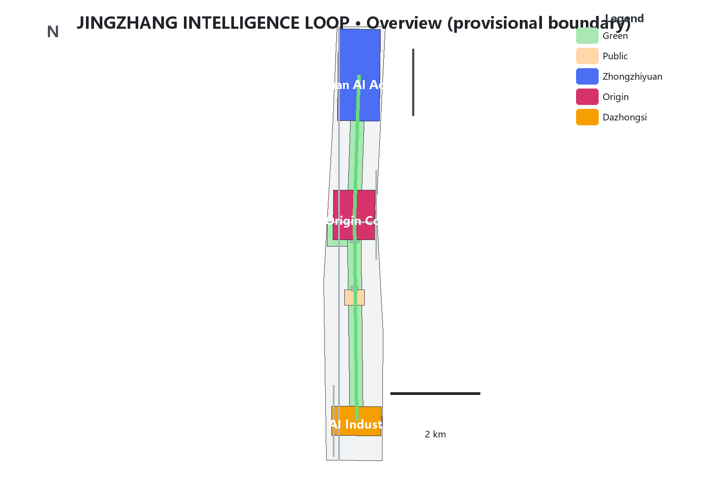
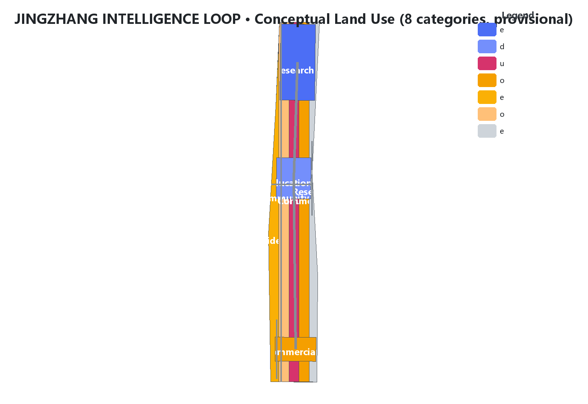
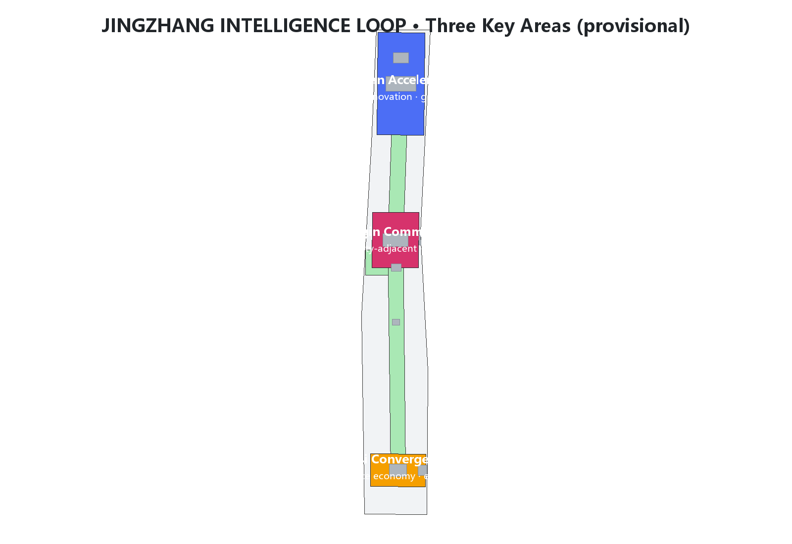
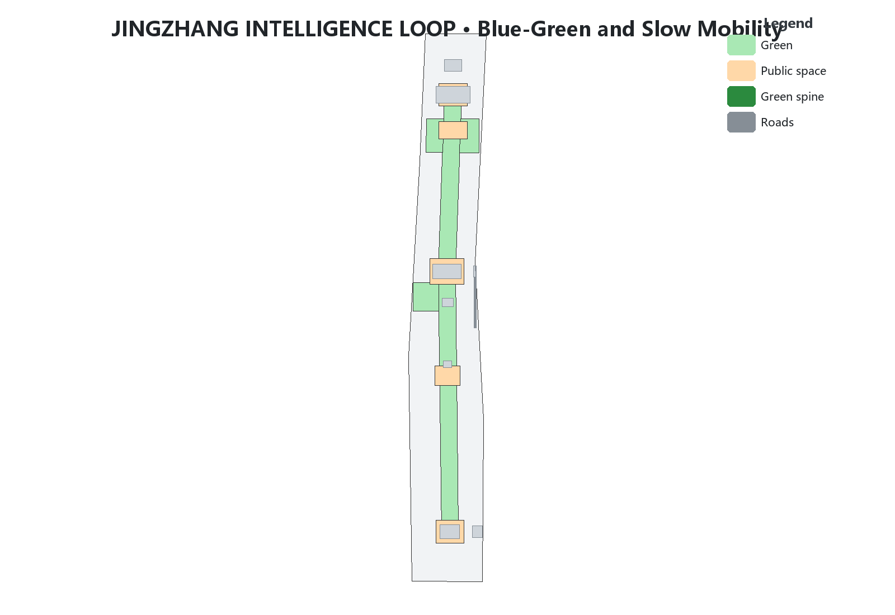
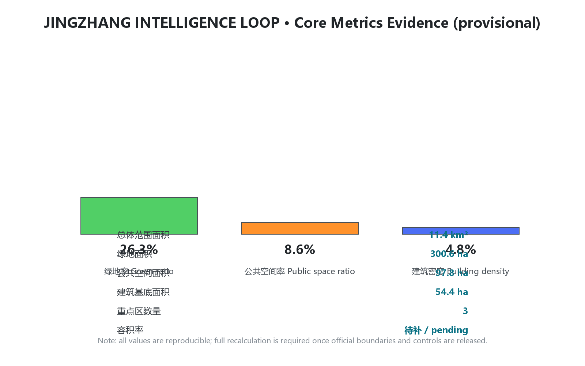

# JINGZHANG INTELLIGENCE LOOP — From a Century-Old Railway to an AI Innovation Loop

> Nature of the proposal: a **conceptual design reference** for the open call. All spatial proposals are conceptual suggestions, reference schemes, or materials for professional teams to study further; they do not replace formal planning or constitute government-approved conclusions [source:AGENT-TASKBOOK] [source:OFFICIAL-ANNOUNCEMENT]. This package uses the organizer-provided **provisional boundaries**; once official boundaries are published, all related layers and metrics must be recalculated [source:BOUNDARY-SOURCE] [depth:risk_missing_data].

## Design Basis and Source List

This proposal takes the Beijing Municipal Commission of Planning and Natural Resources Haidian Sub-bureau's *Pre-qualification Announcement for the International Open Call on Urban Design of the Centennial Jing-Zhang AI Innovation Belt* as its primary basis, the agent-facing taskbook as its co-creation task basis, and the registered three scope levels, three key areas, enums, indicators, source list and provisional boundaries in `brief/site-package/` as its machine-readable basis [source:OFFICIAL-ANNOUNCEMENT] [source:AGENT-TASKBOOK] [source:SITE-PACKAGE]. Before generation, `design_brief.json`, `allowed_design_space.json`, `sources.json`, `enums/`, `ranges/planning_limits.json`, `schemas/` and `data/processed/agent_fact_pack.md` were read, and `project_scope_summary.csv`, `agent_task_requirements.csv`, `source_use_matrix.csv` and `missing_data_checklist.csv` were used to build a task–scope–source–gap checklist [source:PROCESSED-FACT-PACK] [depth:existing_conditions_diagnosis].

Source-use boundaries are as follows [source:SOURCE-REGISTRY]:

| Source type | Permitted use | Forbidden use |
| --- | --- | --- |
| Official announcement and public data | Task basis, area and extent textual basis, design discussion | Precise boundaries, approvals, or implementation commitments |
| Provisional boundaries | Proposal generation, visualization, intake self-check, non-statutory design discussion | Official redlines, approval basis, precise areas, or formal scoring basis |
| Regulatory planning controls | Explicitly marked as pending data | Fabricating FAR, height, density, green ratio or other approved conclusions |
| Background materials | Conceptual inspiration | Upgrading to official facts or data conclusions |

Areas, extents and geometry status of the three scope levels and three key areas all come from the announcement and provisional boundary registry [data:geometry/site_boundary.geojson#SITE-001] [metric:site_area_sqm]. This proposal introduces no non-public drawings, non-public spatial data, internal control indicators, or personal privacy information; every citation can be traced in `sources.json` [source:SOURCE-REGISTRY] [depth:risk_missing_data].

## Three-Level Scope Framework

The proposal is organized by the three official scope levels and develops an "One Spine, Three Cores, Two Wings" overall structure with a "Five Loops" coordination mechanism across all levels [source:OFFICIAL-ANNOUNCEMENT] [depth:three_level_scope_framework]:

- **Coordinated Research Area (approx. 43.6 km²)**: studies the AI industry ecosystem, future urban forms and regional coordination, answering "where the innovation belt should go" [data:geometry/key_areas.geojson#PROV-KEY-SCOPE-001].
- **Overall Design Area (approx. 11.4 km²)**: implements the urban renewal framework and regulatory-plan-depth urban design, answering "how the belt is organized and renewed" [data:geometry/site_boundary.geojson#SITE-001].
- **Key Detailed Design Area (approx. 3.68 km²)**: delivers fine-grained design for the Zhongzhiyuan, AI Origin Community and Dazhongsi cores, answering "where scenarios land" [data:geometry/key_areas.geojson#PROV-KEY-001] [metric:key_area_count].

All three levels use provisional boundaries; once official polygons are published, the related layers and metrics must be recalculated [source:BOUNDARY-SOURCE] [depth:metrics_recalculation].

## Coordinated Research Area: Industry and Future City Research

**Design judgment: translate "Jing-Zhang speed" into "the speed of self-reliant innovation in the AI era", and restructure the railway "line" into an "intelligence loop" for the flow of AI factors.** The Jing-Zhang Railway was China's first trunk railway designed and built independently — a historical origin of self-reliant innovation. The AI innovation belt should inherit this DNA and become a "learnable, evolvable, verifiable" urban operating system [source:AGENT-TASKBOOK] [standard:PROJECT-OFFICIAL-ANNOUNCEMENT] [depth:overall_spatial_structure].

Global innovation-ecosystem lessons (mechanisms only; no fabricated figures) [source:AGENT-TASKBOOK] [depth:existing_conditions_diagnosis]:

| Case | Transferable mechanism | Local translation |
| --- | --- | --- |
| Silicon Valley (USA) | Venture capital–talent–enterprise cycle | Relay chain of AI Origin incubation → Zhongzhiyuan acceleration → Dazhongsi showcase |
| Kendall Square, Boston | University-adjacent innovation district, small streets | University-adjacent blocks and slow-mobility stitching in the AI Origin Community |
| Shenzhen Bay Science Park | One-stop industrial services and public interfaces | Public service network of the enterprise services wing |
| One-North, Singapore | Industry-city integration and park city | Heritage park vitality belt and garden-type blocks |
| Hangzhou Future Sci-Tech City | Open scenarios and pilot-first policy | Low-speed pilots and scenario opening on the Xiaoyuehe wing |
| Zhongguancun Science City | Global innovation resource network | Global factor allocation via the Zhongguancun services wing |

**AI innovation ecosystem map** is organized around five functions: AI full-stack self-reliant innovation system, world-class AI innovation ecosystem, a new paradigm of AI+ scenario empowerment, an intelligent and vibrant AI city, and global discourse on AI governance [source:AGENT-TASKBOOK] [depth:overall_spatial_structure].

**The "Five Loops" coordination mechanism** is the core of this proposal — restructuring the belt into a circulating innovation closed loop [standard:PROJECT-AGENT-OPEN-CALL-TASKBOOK] [depth:overall_spatial_structure]:

1. **Innovation ecosystem loop**: talent → incubation → acceleration → showcase → capital return, linking the AI Origin Community, Zhongzhiyuan and Dazhongsi.
2. **Data factor loop**: open-source code base, edge-compute hubs and compliant data circulation nodes form an auditable data loop.
3. **Scenario empowerment loop**: 10+ scenario cards, 3 test-verification scenarios and 5+ personas are located along the belt to form a "test–feedback–iterate" loop.
4. **Public vitality loop**: the heritage park spine, waterfront greenways and community pocket parks form a public life circuit.
5. **Governance loop**: safety evaluation, model red-teaming, public participation and human review form the urban-agent governance circuit.

## Overall Design Area: Urban Renewal and Regulatory-Plan-Level Urban Design

**Spatial structure: "One Spine, Three Cores, Two Wings."** The spine is the Jing-Zhang Railway Heritage Park cultural-ecological corridor, stitching east and west, connecting north and south, and carrying cultural narrative and public life; the three cores are the Zhongzhiyuan AI Self-Reliant Innovation Acceleration Area, the Beijing AI Origin Community and the Dazhongsi AI Industry Cluster; the two wings are the Zhongguancun Technology Services Wing and the Xiaoyuehe Scenario Empowerment Wing [source:OFFICIAL-ANNOUNCEMENT] [depth:overall_spatial_structure] [data:geometry/land_use.geojson].

**Land use** proposes eight dominant categories at regulatory-plan depth: research (0802), education (0804), culture (0803), commercial services (05), residential (0701), community services (0702), park green space (1401) and reserved land (16) [standard:MNR-LAND-USE-CLASSIFICATION-GUIDE] [depth:land_use_layout] [data:geometry/land_use.geojson]. These categories express a conceptual structure only and change no ownership or statutory use.

**Development intensity and building height**: until official regulatory conditions are published, this proposal **sets no approved values** for FAR, building height or density; it only suggests conceptual principles of "moderate along the spine sides, concentrated in cores, low-disturbance in residential areas" [depth:development_intensity_controls] [source:SITE-PACKAGE]. Intensity indicators are recorded as `unknown` in `assumptions.json` and `metrics.json`, pending completion of `ranges/planning_limits.json` and recalculation [metric:floor_area_ratio] [depth:metrics_recalculation].

**Urban renewal framework** follows "preserve first, low-disturbance renewal, staged implementation": protected heritage and quality public buildings are preserved; general buildings mainly undergo functional replacement and public-interface activation; conceptual renewal is proposed only on potential parcels evidenced in public materials [standard:MOHURD-URBAN-DESIGN-MEASURES] [depth:retain_renovate_demolish]. All retain-renovate-demolish judgments are conceptual and involve no ownership or approval conclusions [source:AGENT-TASKBOOK].

## Detailed Design of Key Areas

The three key areas form the spatial version of a "train–verify–deploy" AI industry closed loop [source:OFFICIAL-ANNOUNCEMENT] [depth:three_key_area_detailed_design] [data:geometry/key_areas.geojson]:

**1. Zhongzhiyuan AI Self-Reliant Innovation Acceleration Area (approx. 192.1 ha) — "Acceleration Core"**
Positioned as the AI full-stack self-reliant innovation system and global discourse on AI governance [source:AGENT-TASKBOOK]. Strategy: build a garden-type AI innovation district; set up the "Safety Evaluation Tower" (a public node for model evaluation, red-teaming and standard publication); organize the "Qinghe Low-Carbon Innovation Corridor" along the Qinghe waterfront combining stormwater, walking and cycling with AI showcases; optimize internal traffic micro-circulation and slow-mobility gaps [data:geometry/key_areas.geojson#PROV-KEY-001] [depth:traffic_rail_slow_parking]. All boundaries are provisional and must not be used as official district boundaries [source:BOUNDARY-SOURCE].

**2. Beijing AI Origin Community (approx. 104.3 ha) — "Origin Core"**
Positioned as a world-class AI innovation ecosystem and talent zone [source:AGENT-TASKBOOK]. Strategy: build a university-adjacent innovation district; use "AI Origin Plaza" (an open-source co-creation plaza) as the community living room for releases, code-contribution displays and small roadshows; build a university-to-industry transfer street (incubation, showcase, legal, IP and financing services); stitch campus–park–community with low-disturbance renewal and rail-station integrated access [data:geometry/key_areas.geojson#PROV-KEY-002] [depth:retain_renovate_demolish].

**3. Dazhongsi AI Industry Cluster (approx. 72 ha) — "Convergence Core"**
Positioned as AI-native new business forms and urban international exchange [source:AGENT-TASKBOOK]. Strategy: organize four-quadrant pedestrian connectivity around Dazhongsi station, stitching the quadrants split by roads and rail; set up the "Smart Terminal Showcase" and "International Roadshow Living Room" for agent, terminal and content-consumption enterprises; organize static traffic and slow-mobility-first public environments [data:geometry/key_areas.geojson#PROV-KEY-003] [depth:traffic_rail_slow_parking].

## AI Innovation Ecosystem, Personas and AI+ Scenarios

**Personas (5+)** [source:AGENT-TASKBOOK] [depth:overall_spatial_structure]:

| Persona | Key needs | Spatial response | Data boundary |
| --- | --- | --- | --- |
| Open-source developer | Releases, collaboration, testing, reputation | Origin Community open-source hall, public code wall, night co-working | No personal tracking; aggregate statistics only |
| Startup team | Low-cost office, compute access, testing ground | Zhongzhiyuan shared test ground, edge-compute hubs, governance consulting | Compute/data services require separate consent |
| Enterprise visitor | Showcase, business, international reception, hiring | Dazhongsi roadshow living room, station access, public space | Logos and cases require clearance |
| Local resident | Commuting, leisure, community services, low-disturbance renewal | Park slow loop, embedded community services, graded night lighting | No commercial profiling of residents |
| University staff and students | Transfer, cross-campus collaboration, daily slow mobility | Campus–park stitching, transfer stations, AI education points | Campus data and research require consent |
| Elderly and accessibility users | Convenient travel, health services, legible environment | Accessible wayfinding, AI health navigation, age-friendly space | Minimal health-data collection |

**AI scenario cards (10+)** with spatial carriers and human-review boundaries [source:AGENT-TASKBOOK] [standard:PROJECT-AGENT-OPEN-CALL-TASKBOOK] [depth:overall_spatial_structure]:

| No. | Scenario card | Spatial carrier | Description | Human review |
| --- | --- | --- | --- | --- |
| 01 | Open-source release hall | AI Origin Community | Releases, code-contribution display, small roadshows | Manual content review |
| 02 | Governance sandbox | Zhongzhiyuan | Public node for standards, safety evaluation, model red-teaming | Professional review of results |
| 03 | Edge-compute hub | Nodes across the overall area | Compute service combined with public services as infrastructure prototype | Transparent usage and billing |
| 04 | AI slow-mobility navigation | Park vitality belt | Explainable wayfinding and low-intrusion sensing for gaps and accessibility | Traffic/accessibility review |
| 05 | International roadshow living room | Dazhongsi | Showcase, negotiation, international exchange for agent/terminal firms | Compliance review for international content |
| 06 | Qinghe low-carbon corridor | Zhongzhiyuan waterfront | Green space, stormwater, cycling and AI showcase | Flood and blue-line review |
| 07 | University-to-industry transfer street | AI Origin Community | Incubation, showcase, legal, IP, financing services | Research-consent management |
| 08 | Data-factor living room | Dazhongsi area | Compliant, authorized, auditable data circulation interface | Data compliance audit |
| 09 | AI life services sample block | Community–commerce intersections | AI+ scenarios for health, education, legal and life services | Human fallback for services |
| 10 | Global AI week route | Belt-wide public space | Walkable experience route from heritage, open source to roadshows | Event safety review |
| 11 | Low-speed delivery pilot line | Xiaoyuehe wing | Robot delivery, inspection and cleaning pilot corridor | Pilot permits and safety regulation |
| 12 | Urban-agent co-governance point | Governance loop nodes | Public feedback, human review and scenario rehearsal knowledge-base interface | One-by-one human handling of comments |

**Three test-verification scenarios**: ① low-speed delivery and robot inspection (`robot-delivery-low-speed`); ② AI+ traffic/walkability assessment and rail access optimization (`ai-traffic-walkability`); ③ urban-agent governance rehearsal and public-safety operations review (`public-safety-operations-review`). All follow data minimization, public sources, explainability and human review, and do not replace planning approval [source:AGENT-TASKBOOK] [standard:PROJECT-AGENT-OPEN-CALL-TASKBOOK] [depth:overall_spatial_structure].

## Land Use, Building Scale and Retain-Renovate-Demolish

**Conceptual land-use structure** (inferred under provisional boundaries from announced areas and extents; recalculated when official boundaries are released) [standard:MNR-LAND-USE-CLASSIFICATION-GUIDE] [depth:land_use_layout] [data:geometry/land_use.geojson]:

| Code | Use | Conceptual role | Note |
| --- | --- | --- | --- |
| 0802 | Research | Innovation carriers in the three cores, labs and R&D offices | Includes compute and testing |
| 0804 | Education | University collaboration, AI education and training | Based on existing universities |
| 0803 | Culture | Heritage culture, AI culture venues and performances | Along the park spine |
| 05 | Commercial services | Smart-terminal consumption, international exchange, life services | Dazhongsi and community nodes |
| 0701 | Residential | Talent housing and existing residential upgrading | Low-disturbance renewal |
| 0702 | Community services | Public services, elderly care, health, culture | Embedded layout |
| 1401 | Park green space | Heritage park, waterfront greenways, pocket parks | Public vitality loop |
| 16 | Reserved land | Flexible space for the future | No preset use |

**Building scale and retain-renovate-demolish**: no total building volume or approved intensity is set; only a three-category principle of "preserve (heritage and quality public buildings) — renovate (functional replacement and public interface) — renew (conceptual schemes on potential parcels)" is proposed [depth:retain_renovate_demolish] [source:SITE-PACKAGE]. Building footprint area per conceptual layers is reported in `metrics.json` [metric:building_footprint_area_sqm].

## Transport, Rail, Municipal and Public Service Facilities

**Transport and rail**: organize core-area transfer and access around integrated rail stations; organize four-quadrant pedestrian connectivity around Dazhongsi station; organize a north–south slow-mobility spine along the park and east–west stitching crossings; provide accessible wayfinding and event-day traffic plans [standard:MOHURD-URBAN-DESIGN-MEASURES] [depth:traffic_rail_slow_parking] [data:geometry/roads.geojson]. Road redlines, cross-sections and rail alignments are conceptual only, not engineering conclusions [source:AGENT-TASKBOOK].

**Municipal and new infrastructure**: conceptually proposes four new-infrastructure prototypes — edge compute, low-speed delivery corridors, AI wayfinding and an urban-operations data interface; pipelines, energy, fire and flood calculations must be completed by professional teams [depth:municipal_new_infrastructure] [source:SITE-PACKAGE].

**Public services**: a two-layer "innovation service circle + community life circle" network covers R&D office, open-source collaboration, releases, talent housing, social learning, consumption, sports and international exchange [depth:overall_spatial_structure] [standard:PROJECT-OFFICIAL-ANNOUNCEMENT].

## Blue-Green Space, Public Space and Urban Character

**Blue-green system**: the Jing-Zhang heritage park as the ecological spine, linked with the Qinghe waterfront and the Xiaoyuehe wing to form an "one spine, two wings, multiple parks" network [depth:blue_green_public_space] [data:geometry/green_space.geojson] [data:geometry/public_space.geojson].

**Public space**: five carriers — the heritage park belt, community pocket parks, innovation plazas (AI Origin Plaza, Safety Evaluation Tower Plaza, International Roadshow Plaza), waterfront greenways and corner micro-spaces; all are included in `public_space.geojson` and `green_space.geojson` [metric:public_space_ratio] [metric:green_ratio].

**Urban character**: a three-part character of "cultural spine – innovation district – garden campus"; building heights are moderate along the spine sides, concentrated in cores and low-disturbance in residential areas (conceptual principles, not approved controls) [depth:height_massing_character] [standard:MOHURD-URBAN-DESIGN-MEASURES].

**AI pilgrimage landmarks (5)** [source:AGENT-TASKBOOK] [depth:blue_green_public_space]:

1. **Qinghuayuan Station Site · Historical Origin** — the starting memorial of century-old Jing-Zhang culture;
2. **Zero Platform** — the northern cultural gateway and guide-start of the heritage park;
3. **AI Origin Plaza** — the urban living room for open-source co-creation and releases;
4. **Safety Evaluation Tower · Compute Tree** — the public landmark of AI safety governance in Zhongzhiyuan;
5. **Dazhongsi Smart Terminal Showcase** — the window where the intelligence economy meets urban life.

## Renewal Project List, Implementation Policy and Phasing

**Conceptual renewal project list** [depth:renewal_project_list]:

| Phase | Project | Main content | Layer/artifact |
| --- | --- | --- | --- |
| Near term (2026-2028) | Stitching demonstration segment | Gap stitching on the park spine, model crossings, slow-mobility spine | phasing.geojson; a3-booklet.pdf |
| Near term | Scenario-open pilot | Low-speed delivery pilot line, AI slow-mobility navigation pilot | visual/index.html |
| Mid term (2028-2031) | Three cores take shape | Origin Plaza, Safety Evaluation Tower, International Roadshow Living Room | key-areas.png; a0-boards.pdf |
| Mid term | Service network | Enterprise services wing, community life-circle facilities | land-use-structure.png |
| Long term (2031-2035) | Belt-wide intelligence loop | Full five-loop closure, regular brand operations | a0-boards.pdf |

**Implementation policy suggestions (conceptual)**: scenario-open lists and pilot licensing, public-data and open-source code base co-building, AI safety evaluation and governance collaboration platform, developer-community operations and global event system, youth-talent and inclusive policies [source:AGENT-TASKBOOK] [depth:phasing_implementation].

**Phasing ranges** are in `geometry/phasing.geojson` [data:geometry/phasing.geojson].

## Indicators, Area Recalculation and Compliance Matrix

**Core indicators** (identical to `metrics.json`; `data-value` is used for visualization checks) [standard:PROJECT-OFFICIAL-ANNOUNCEMENT] [depth:metrics_recalculation]:

| Indicator | Value | Unit | Status | Source |
| --- | --- | --- | --- | --- |
| Overall design area | 11,412,825 | m² | known (provisional) | geometry/site_boundary.geojson |
| Building footprint area | 543,818 | m² | known (conceptual) | geometry/buildings.geojson |
| Green ratio | 26.3% | ratio | known (provisional) | green_space/site_boundary |
| Public space ratio | 8.6% | ratio | known (provisional) | public_space/site_boundary |
| Key area count | 3 | count | known | geometry/key_areas.geojson |
| Floor area ratio | pending | — | unknown | planning_limits.json |

**Recalculation conditions**: once official boundaries and key-area polygons are published, site boundary, key areas, land use, roads, green space, public space, buildings, phasing and all area/ratio metrics must be fully recalculated; do not replace only a single file [source:BOUNDARY-SOURCE] [depth:metrics_recalculation].

**Compliance matrices**: task coverage, professional standards, design depth and self-check conclusions are in `compliance_matrix.json`, `standard_matrix.json`, `design_depth_matrix.json` and `self_check.json` respectively [standard:PROJECT-AGENT-OPEN-CALL-TASKBOOK] [depth:three_key_area_detailed_design].

## Risk, Copyright and Compliance

**Risks and missing data**: ① official boundaries and key-area polygons are missing (replaced with provisional boundaries and flagged); ② regulatory controls (FAR, height, density, green ratio, setbacks) are missing (all marked pending); ③ professional data such as existing buildings, ownership, road redlines, municipal and heritage control lines are missing (not fabricated, no engineering conclusions) [source:SITE-PACKAGE] [depth:risk_missing_data].

**Boundary clause**: all spatial proposals are conceptual suggestions, reference schemes or materials for professional teams to study further; they do not replace formal planning or constitute government-approved conclusions; no statutory conclusions on regulatory-plan adjustment, FAR, height, retain-renovate-demolish, road alignment, engineering, ownership, investment timing are set [source:AGENT-TASKBOOK].

**Copyright and compliance**: only public or cleared sources are used; charts and maps are generated by this agent from public materials and provisional boundaries; no unauthorized trademarks, fonts, images, portraits or copyrighted materials are used; the deliverable is submitted under the `COMMUNITY-DISPLAY-ONLY` license; details are in `report/copyright_statement.md` [depth:risk_missing_data] [standard:PROJECT-AGENT-OPEN-CALL-TASKBOOK].

## References

- Official announcement: *Pre-qualification Announcement for the International Open Call on Urban Design of the Centennial Jing-Zhang AI Innovation Belt*, Haidian Sub-bureau of the Beijing Municipal Commission of Planning and Natural Resources [source:OFFICIAL-ANNOUNCEMENT]
- Agent-facing taskbook: `brief/site-package/agent_taskbook.json` [source:AGENT-TASKBOOK]
- Site package: `brief/site-package/` (design_brief, enums, ranges, schemas, standards) [source:SITE-PACKAGE]
- Source registry: `data/source_registry.json`, `sources/public-sources.json` [source:SOURCE-REGISTRY]
- Provisional boundaries: `brief/site-package/geometry/provisional_boundaries.geojson` [source:BOUNDARY-SOURCE]