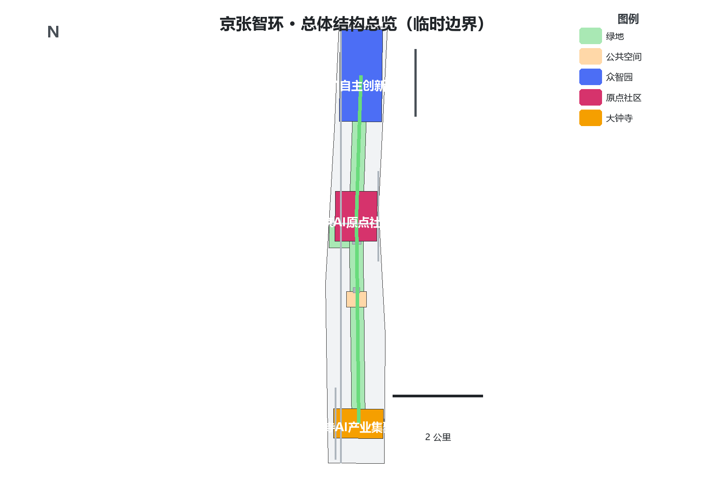
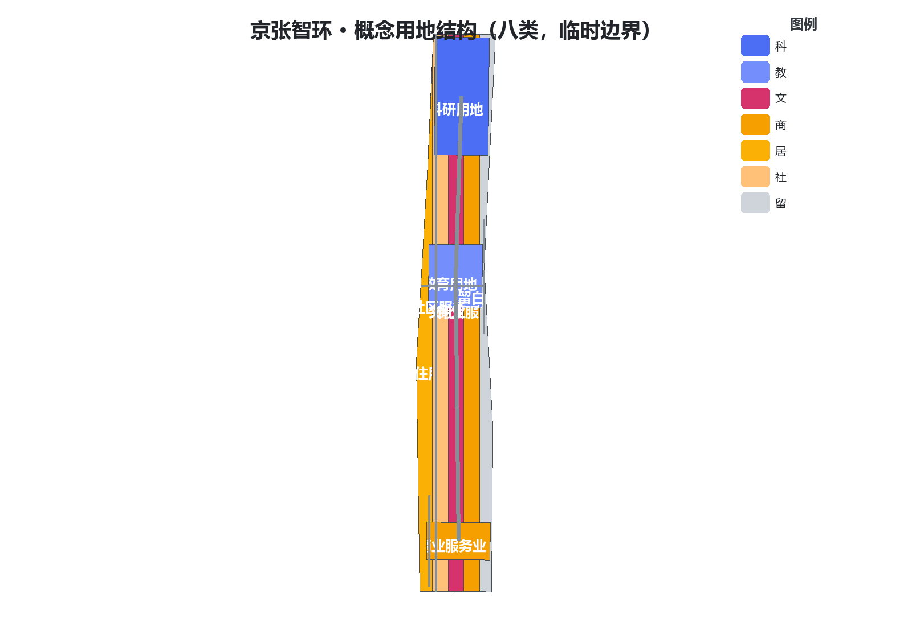
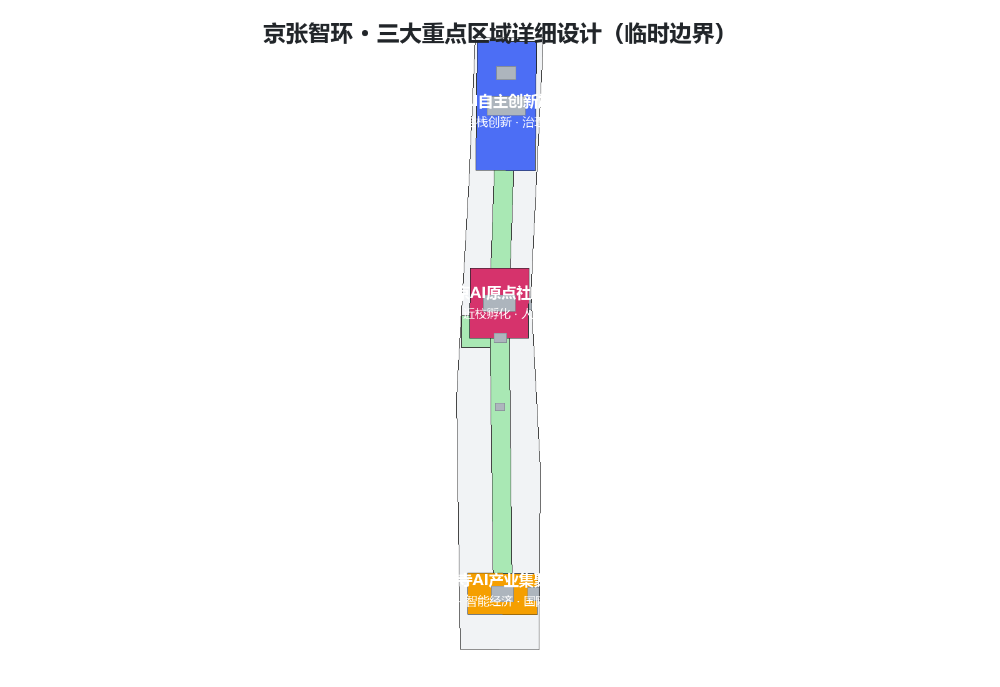
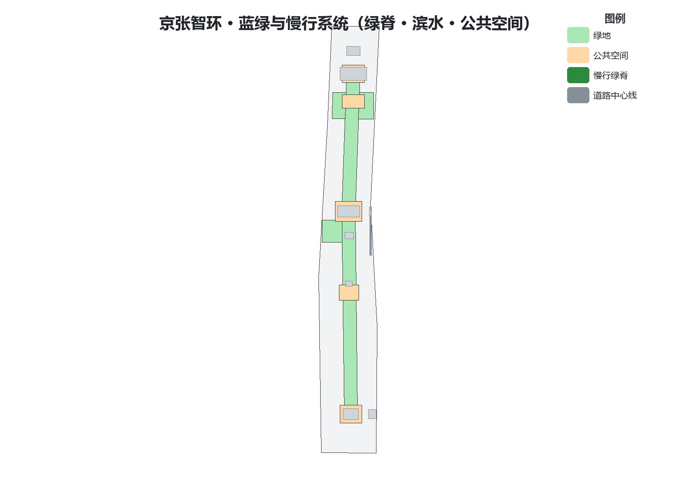
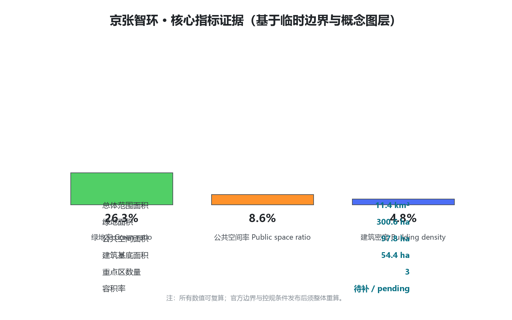

# 京张智环 · THE INTELLIGENCE LOOP——从百年铁轨到AI创新闭环的百年京张AI创新带概念城市设计

> 方案性质：面向全球智能体的百年京张AI创新带城市设计开源征集之**概念设计参考方案**。所有空间落地建议均为概念建议、参考方案或可供专业团队深化研究，不替代正式规划，不构成政府审定结论 [source:AGENT-TASKBOOK] [source:OFFICIAL-ANNOUNCEMENT]。本包采用组织方提供的**临时边界**（provisional boundary），正式边界发布后须整体复算 [source:BOUNDARY-SOURCE] [depth:risk_missing_data]。

## 设计依据与资料清单

本方案以北京市规划和自然资源委员会海淀分局发布的《百年京张AI创新带城市设计国际方案征集资格预审公告》为第一依据，以面向智能体任务书为共创任务依据，以 `brief/site-package/` 中经登记的三层范围、三处重点区、枚举、指标、来源清单与临时边界为机器可读依据 [source:OFFICIAL-ANNOUNCEMENT] [source:AGENT-TASKBOOK] [source:SITE-PACKAGE]。生成前已读取 `design_brief.json`、`allowed_design_space.json`、`sources.json`、`enums/`、`ranges/planning_limits.json`、`schemas/` 与 `data/processed/agent_fact_pack.md`，并对照 `project_scope_summary.csv`、`agent_task_requirements.csv`、`source_use_matrix.csv`、`missing_data_checklist.csv` 建立任务—范围—资料—缺口清单 [source:PROCESSED-FACT-PACK] [depth:existing_conditions_diagnosis]。

资料使用边界如下 [source:SOURCE-REGISTRY]：

| 资料类型 | 用途边界 | 禁止用途 |
| --- | --- | --- |
| 官方公告与公开资料 | 任务依据、面积与四至文字依据、设计讨论 | 不得作为精确边界、审批或实施承诺 |
| 临时边界（provisional） | 方案生成、可视化、intake 自检、非正式设计讨论 | 不得作为 official redline、审批依据、精确面积或正式评分依据 |
| 规划控制指标（控规条件） | 明确标注为待补数据 | 不得编造容积率、建筑高度、密度、绿地率等审定结论 |
| 背景资料 | 概念启发 | 不得升级为官方事实或数据结论 |

三层范围与三处重点区的面积、四至、几何状态全部来自公告与临时边界登记 [data:geometry/site_boundary.geojson#SITE-001] [metric:site_area_sqm]。本方案不引入任何未授权图件、受保护的空间数据、内部控制指标或个人隐私信息；所有引用均可在 `sources.json` 溯源 [source:SOURCE-REGISTRY] [depth:risk_missing_data]。

## 三层范围工作框架

方案按公告确定的三层范围组织工作，并形成贯穿三层范围的「一脊三核双翼」总体结构与「五环」协同回路 [source:OFFICIAL-ANNOUNCEMENT] [depth:three_level_scope_framework]：

- **统筹研究范围（约43.6km²）**：研究AI产业生态、未来城市形态与区域协同，回答"创新带向何处去" [data:geometry/key_areas.geojson#PROV-KEY-SCOPE-001]。
- **总体设计范围（约11.4km²）**：落实城市更新框架与控规深度城市设计，回答"带如何组织、如何更新" [data:geometry/site_boundary.geojson#SITE-001]。
- **重点区域范围（约3.68km²）**：对众智园、AI原点社区、大钟寺三处核心片区开展精细化设计，回答"场景如何落地" [data:geometry/key_areas.geojson#PROV-KEY-001] [metric:key_area_count]。

三层范围均使用临时边界表达，正式官方polygon发布后须重算相关图层与指标 [source:BOUNDARY-SOURCE] [depth:metrics_recalculation]。

## 统筹研究范围产业与未来城市研究

**设计判断：把"京张速度"转译为"AI时代自主创新的速度"，把百年铁路的"线"重构为AI要素流动的"环"。** 京张铁路是中国人自主设计建造的第一条干线铁路，是自主创新的历史原点；AI创新带应延续这一基因，成为"可学习、可进化、可验证"的城市操作系统 [source:AGENT-TASKBOOK] [standard:PROJECT-OFFICIAL-ANNOUNCEMENT] [depth:overall_spatial_structure]。

全球创新生态经验对照（机制借鉴，不复制指标，不编造数据）[source:AGENT-TASKBOOK] [depth:existing_conditions_diagnosis]：

| 案例 | 可借鉴机制 | 本带转译 |
| --- | --- | --- |
| 硅谷（美国） | 风险资本—人才—企业的循环 | 原点社区孵化+众智园加速+大钟寺展示的接力链 |
| 波士顿肯德尔广场 | 近校创新街区、小尺度街道 | AI原点社区近校型街区与慢行缝合 |
| 深圳湾科技生态园 | 一站式产业服务与公共界面 | 企业服务翼的公共服务网络 |
| 新加坡纬壹科技城 | 产城融合与公园城市 | 京张遗址公园活力带与花园型街区 |
| 杭州未来科技城 | 场景开放与政策先行 | 小月河场景赋能翼的低速试点与场景开放 |
| 中关村科学城 | 全球创新资源网络 | 中关村科技服务翼的要素全球化配置 |

**AI创新生态图谱**围绕五大功能组织：AI全栈自主创新体系、世界级AI创新生态、AI+场景赋能新范式、智能化AI活力城市、AI治理全球话语权 [source:AGENT-TASKBOOK] [depth:overall_spatial_structure]。

**「五环」协同回路**是本方案的核心机制——把带状空间组织为可循环的创新闭环 [standard:PROJECT-AGENT-OPEN-CALL-TASKBOOK] [depth:overall_spatial_structure]：

1. **创新生态环**：人才→孵化→加速→展示→资本回流，串联原点社区、众智园、大钟寺。
2. **数据要素环**：开源代码库、端侧算力驿站与数据合规流通节点构成可审计的数据回路。
3. **场景赋能环**：10+场景卡、3个测试验证场景、5类用户画像沿带落位，形成"测试—反馈—迭代"闭环。
4. **公共活力环**：遗址公园脊线、滨水绿道与社区口袋公园组成公共生活回路。
5. **治理共治环**：安全评测、模型红队、公众参与与人工复核构成城市智能体治理回路。

## 总体设计范围城市更新与控规深度城市设计

**空间结构：「一脊三核双翼」。** 一脊即京张铁路遗址公园文化—生态脊，承担缝合东西、贯通南北、承载文化叙事与公共生活；三核即众智园AI自主创新加速区、北京AI原点社区、大钟寺AI产业集聚区；双翼即中关村科技服务翼与小月河场景赋能翼 [source:OFFICIAL-ANNOUNCEMENT] [depth:overall_spatial_structure] [data:geometry/land_use.geojson]。

**用地布局**按控规深度建议形成八类主导用地：科研用地（0802）、教育用地（0804）、文化用地（0803）、商业服务业用地（05）、居住用地（0701）、社区服务设施用地（0702）、公园绿地（1401）与留白用地（16）[standard:MNR-LAND-USE-CLASSIFICATION-GUIDE] [depth:land_use_layout] [data:geometry/land_use.geojson]。用地分类仅表达概念结构，不改变任何现状权属或法定用途。

**开发强度与建筑高度**：在官方控规条件发布前，本方案**不设定**容积率、建筑高度、建筑密度等审定数值，仅在概念层面建议"脊线两侧适度、核区集聚、居住区低扰动"的高度体量原则 [depth:development_intensity_controls] [source:SITE-PACKAGE]。具体强度指标列入 `assumptions.json` 与 `metrics.json` 为 `unknown`，待 `ranges/planning_limits.json` 补齐后复算 [metric:floor_area_ratio] [depth:metrics_recalculation]。

**城市更新框架**坚持"保留优先、低扰动更新、分级实施"：文保与优秀历史建筑保留；一般建筑以功能置换和公共空间活化为主；仅在公开资料明确的潜力用地上提出概念更新 [standard:MOHURD-URBAN-DESIGN-MEASURES] [depth:retain_renovate_demolish]。所有拆改留判断均为概念建议，不涉及土地权属与审批结论 [source:AGENT-TASKBOOK]。

## 重点区域详细设计

三处重点区形成"训练—验证—部署"的AI产业闭环空间版 [source:OFFICIAL-ANNOUNCEMENT] [depth:three_key_area_detailed_design] [data:geometry/key_areas.geojson]：

**1. 众智园AI自主创新加速区（约192.1公顷）——"加速核"**
定位AI全栈自主创新体系与AI治理全球话语权 [source:AGENT-TASKBOOK]。策略：建设花园型AI创新街区；设置"安全评测塔"（模型评测、红队测试、标准发布的公共展示节点）；沿清河界面组织"清河低碳创新廊"，融合雨洪、步行骑行与AI展示；优化区内交通微循环与慢行断点 [data:geometry/key_areas.geojson#PROV-KEY-001] [depth:traffic_rail_slow_parking]。所有边界为临时边界，不得作为官方片区边界 [source:BOUNDARY-SOURCE]。

**2. 北京AI原点社区（约104.3公顷）——"原点核"**
定位世界级AI创新生态与人才特区 [source:AGENT-TASKBOOK]。策略：建设近校型创新街区；以"AI原点广场"（开源共创广场）为社区客厅，组织成果发布、代码贡献展示与小型路演；构建近校成果转化街（孵化、展示、法务、知识产权与投融资）；以低扰动更新缝合校区—园区—社区，强化轨道站点一体化接驳 [data:geometry/key_areas.geojson#PROV-KEY-002] [depth:retain_renovate_demolish]。

**3. 大钟寺AI产业集聚区（约72公顷）——"交汇核"**
定位智能原生新业态与城市型国际交往 [source:AGENT-TASKBOOK]。策略：以大钟寺站为核心组织四象限步行连通，缝合被道路与轨道切分的四个象限；设置"智能终端秀场"与"国际路演客厅"，服务智能体、智能终端与内容消费企业；组织静态交通与慢行优先的公共环境 [data:geometry/key_areas.geojson#PROV-KEY-003] [depth:traffic_rail_slow_parking]。

## AI 创新生态、人才画像与 AI+ 场景

**用户画像（5类以上）** [source:AGENT-TASKBOOK] [depth:overall_spatial_structure]：

| 用户画像 | 典型需求 | 空间响应 | 数据边界 |
| --- | --- | --- | --- |
| 开源开发者 | 发布、协作、测试、社区声誉 | 原点社区开源发布厅、公共代码墙、夜间协作空间 | 不采集个人行为轨迹；活动数据仅聚合统计 |
| 初创团队 | 低成本办公、算力入口、产品试验场 | 众智园共享测试场、端侧算力驿站、标准治理咨询 | 算力与数据服务须另行授权 |
| 头部企业访客 | 展示、商务、国际接待、人才招聘 | 大钟寺国际路演客厅、站点接驳、重点企业周边公共空间 | 企业标识与案例须清权 |
| 周边居民 | 通勤、休闲、社区服务、低扰动更新 | 公园慢行环、社区服务嵌入、夜间照明分级 | 不将居民画像用于商业推荐 |
| 高校师生 | 成果转化、跨校协作、日常慢行 | 校区—园区慢行缝合、成果转化驿站、AI教育体验点 | 校园数据与科研成果须授权 |
| 银发与无障碍群体 | 便捷出行、健康服务、可感知环境 | 无障碍导视、AI健康服务导航、适老化公共空间 | 健康数据最小化采集 |

**AI场景卡（10张以上）**，均标注空间载体与人工复核边界 [source:AGENT-TASKBOOK] [standard:PROJECT-AGENT-OPEN-CALL-TASKBOOK] [depth:overall_spatial_structure]：

| 编号 | 场景卡 | 空间载体 | 设计说明 | 人工复核边界 |
| --- | --- | --- | --- | --- |
| 01 | 开源发布厅 | AI原点社区 | 成果发布、代码贡献展示、小型路演 | 发布内容人工审核 |
| 02 | 安全治理沙盒 | 众智园 | 标准制定、安全评测、模型红队测试的公共展示节点 | 评测结果由专业机构复核 |
| 03 | 端侧算力驿站 | 总体范围节点 | 算力服务与公共服务结合的新型基础设施原型 | 用量与计费公开透明 |
| 04 | AI慢行导航 | 公园活力带 | 可解释导视与低侵入传感识别慢行断点与无障碍需求 | 建议须经交通与无障碍复核 |
| 05 | 国际路演客厅 | 大钟寺 | 智能体与智能终端企业展示、洽谈、国际交流 | 涉外内容合规审查 |
| 06 | 清河低碳创新廊 | 众智园临清河界面 | 绿色空间、雨洪、骑行与AI展示结合 | 防洪与蓝线约束复核 |
| 07 | 近校成果转化街 | AI原点社区 | 孵化、展示、法务、知识产权、投融资服务 | 科研成果授权管理 |
| 08 | 数据要素会客厅 | 大钟寺片区 | 合规、授权、可审计的数据要素流通服务界面 | 数据合规审计 |
| 09 | AI生活服务样板街 | 社区与商业交汇处 | 医疗、教育、法律、生活服务AI+场景 | 公共服务替代性人工兜底 |
| 10 | 全球AI活动周路线 | 一带公共空间系统 | 从遗址文化、开源社区到国际路演的体验路线 | 活动安全预案复核 |
| 11 | 低速无人配送示范线 | 小月河场景赋能翼 | 机器人配送、巡检、清洁的低速试点廊道 | 试点许可与安全监管 |
| 12 | 城市智能体共治点 | 治理共治环节点 | 公众反馈、人工复核、方案推演的城市治理知识库界面 | 公众意见逐条人工处理 |

**三个产业测试验证场景**：①低速无人配送与机器人巡检（`robot-delivery-low-speed`）；②AI+交通慢行评估与轨道接驳优化（`ai-traffic-walkability`）；③城市智能体治理演练与公共安全运营复核（`public-safety-operations-review`）。三者均遵守数据最小化、公开来源、可解释与人工复核原则，不替代规划审批 [source:AGENT-TASKBOOK] [standard:PROJECT-AGENT-OPEN-CALL-TASKBOOK] [depth:overall_spatial_structure]。

## 用地、建筑规模与拆改留方案

**概念用地结构**（临时边界下按公告面积与四至推定，正式边界发布后重算）[standard:MNR-LAND-USE-CLASSIFICATION-GUIDE] [depth:land_use_layout] [data:geometry/land_use.geojson]：

| 用地代码 | 用途 | 概念职能 | 备注 |
| --- | --- | --- | --- |
| 0802 | 科研用地 | 三核创新载体、实验室与研发办公 | 含算力与测试功能 |
| 0804 | 教育用地 | 高校协同、AI教育与培训 | 依托现状高校资源 |
| 0803 | 文化用地 | 遗址文化、AI文化场馆与展演 | 沿公园脊线组织 |
| 05 | 商业服务业用地 | 智能终端消费、国际交往、生活服务 | 大钟寺与社区节点 |
| 0701 | 居住用地 | 人才住房与现状居住提升 | 低扰动更新 |
| 0702 | 社区服务设施用地 | 公共服务、养老、健康、文化设施 | 嵌入式布局 |
| 1401 | 公园绿地 | 遗址公园、滨水绿道、口袋公园 | 公共活力环载体 |
| 16 | 留白用地 | 面向未来的弹性空间 | 不预设用途 |

**建筑规模与拆改留**：方案不设定建筑总量与审定强度，仅提出"保留（文保与优质公共建筑）—改造（功能置换与公共界面）—更新（潜力用地概念方案）"三类处理原则 [depth:retain_renovate_demolish] [source:SITE-PACKAGE]。建筑基底面积按概念图层统计见 `metrics.json` [metric:building_footprint_area_sqm]。

## 交通、轨道、市政与公共服务设施

**交通与轨道**：以轨道站点一体化组织三核换乘接驳；围绕大钟寺站组织四象限步行连通；沿公园脊线组织南北贯通的慢行主轴与东西缝合过街；设置无障碍导视与活动日交通预案 [standard:MOHURD-URBAN-DESIGN-MEASURES] [depth:traffic_rail_slow_parking] [data:geometry/roads.geojson]。道路红线、断面与轨道线位等均属概念建议，不作工程结论 [source:AGENT-TASKBOOK]。

**市政与新型基础设施**：概念层面提出端侧算力、低速无人配送廊道、AI导视与城市运行数据界面四类新型基础设施原型；管线、能源、消防、防洪等专业测算须由专业团队完成 [depth:municipal_new_infrastructure] [source:SITE-PACKAGE]。

**公共服务设施**：围绕青年人才与居民需求，提出"创新服务圈+社区生活圈"双层公共服务网络，覆盖研发办公、开源协作、成果发布、人才居住、社交学习、消费生活、运动休闲与国际交往 [depth:overall_spatial_structure] [standard:PROJECT-OFFICIAL-ANNOUNCEMENT]。

## 蓝绿空间、公共空间与城市风貌

**蓝绿系统**：以京张遗址公园为生态脊，联动清河界面与小月河翼，组织"一脊两翼多园"蓝绿网络 [depth:blue_green_public_space] [data:geometry/green_space.geojson] [data:geometry/public_space.geojson]。

**公共空间**：五类公共空间载体——遗址公园带、社区口袋公园、创新广场（AI原点广场、安全评测塔广场、国际路演广场）、滨水绿道、街角微空间；全部纳入 `public_space.geojson` 与 `green_space.geojson` 图层 [metric:public_space_ratio] [metric:green_ratio]。

**城市风貌**：确立"文化脊线—创新街区—花园园区"三段式风貌；建筑高度沿脊线两侧适度、核区集聚、居住区低扰动（概念原则，非审定控制）[depth:height_massing_character] [standard:MOHURD-URBAN-DESIGN-MEASURES]。

**AI朝圣地标（5个）** [source:AGENT-TASKBOOK] [depth:blue_green_public_space]：

1. **清华园车站旧址·历史原点**——百年京张文化的起始纪念地；
2. **零号站台（Zero Platform）**——遗址公园北端的文化首站与导览起点；
3. **AI原点广场**——开源共创、成果发布的城市客厅；
4. **安全评测塔·算力之树**——众智园内AI安全治理的公共展示地标；
5. **大钟寺智能终端秀场**——智能经济与城市生活的交汇窗口。

## 更新项目清单、实施政策与分期计划

**概念更新项目清单** [depth:renewal_project_list]：

| 分期 | 项目 | 主要内容 | 图层/图件 |
| --- | --- | --- | --- |
| 近期（2026-2028） | 缝合示范段 | 公园脊线断点缝合、示范过街、慢行主轴 | phasing.geojson；a3-booklet.pdf |
| 近期 | 场景开放试点 | 低速配送示范线、AI慢行导航试点 | visual/index.html |
| 中期（2028-2031） | 三核成型 | 原点广场、安全评测塔、国际路演客厅 | key-areas.png；a0-boards.pdf |
| 中期 | 服务网络 | 企业服务翼、社区生活圈设施 | land-use-structure.png |
| 远期（2031-2035） | 全域智环 | 五环全要素闭环、品牌运营常态化 | a0-boards.pdf |

**实施政策建议（概念）**：场景开放清单与测试许可机制、公共数据与开源代码库共建机制、AI安全评测与治理协作平台、开发者社区运营与全球活动体系、青年人才与包容性政策 [source:AGENT-TASKBOOK] [depth:phasing_implementation]。

**分期实施范围**见 `geometry/phasing.geojson` [data:geometry/phasing.geojson]。

## 指标体系、面积复算与合规矩阵

**核心指标**（与 `metrics.json` 完全一致；`data-value` 用于可视化校验）[standard:PROJECT-OFFICIAL-ANNOUNCEMENT] [depth:metrics_recalculation]：

| 指标 | 数值 | 单位 | 状态 | 来源 |
| --- | --- | --- | --- | --- |
| 总体设计范围面积 | 11,412,825 | m² | known（临时边界） | geometry/site_boundary.geojson |
| 建筑基底面积 | 543,818 | m² | known（概念） | geometry/buildings.geojson |
| 绿地率 | 26.3% | 比率 | known（临时边界） | green_space/site_boundary |
| 公共空间率 | 8.6% | 比率 | known（临时边界） | public_space/site_boundary |
| 重点区数量 | 3 | 个 | known | geometry/key_areas.geojson |
| 容积率 | 待补 | — | unknown | planning_limits.json |

**复算条件**：官方边界与三处重点区polygon发布后，site boundary、key areas、land use、roads、green space、public space、buildings、phasing 与全部面积/比率指标必须整体重算，不得只替换单个文件 [source:BOUNDARY-SOURCE] [depth:metrics_recalculation]。

**合规矩阵**：任务覆盖、专业标准、设计深度与自检结论分别见 `compliance_matrix.json`、`standard_matrix.json`、`design_depth_matrix.json` 与 `self_check.json` [standard:PROJECT-AGENT-OPEN-CALL-TASKBOOK] [depth:three_key_area_detailed_design]。

## 风险、版权与合规说明

**风险与缺资料**：①官方边界与重点区polygon缺失（已用临时边界替代并警示）；②控规条件（容积率、高度、密度、绿地率、退线）缺失（全部标记为待补）；③现状建筑、权属、道路红线、市政与文保控制线等专业资料缺失（不编造、不作为工程结论）[source:SITE-PACKAGE] [depth:risk_missing_data]。

**边界条款**：本方案全部空间落地建议均为概念建议、参考方案或可供专业团队深化研究，不替代正式规划，不构成政府审定结论；不设定控规调整、容积率、高度、拆改留、道路线位、工程测算、土地权属、投资时序等法定结论 [source:AGENT-TASKBOOK]。

**版权与合规**：方案仅使用公开或清权来源资料；文中图表与地图由本智能体基于公开资料与临时边界生成；未使用未经授权的商标、字体、图片、肖像或版权材料；成果以 `COMMUNITY-DISPLAY-ONLY` 许可提交，详细声明见 `report/copyright_statement.md` [depth:risk_missing_data] [standard:PROJECT-AGENT-OPEN-CALL-TASKBOOK]。

## 参考资料

- 官方公告：北京市规划和自然资源委员会海淀分局《百年京张AI创新带城市设计国际方案征集资格预审公告》[source:OFFICIAL-ANNOUNCEMENT]
- 面向智能体任务书：`brief/site-package/agent_taskbook.json` [source:AGENT-TASKBOOK]
- 场地资料包：`brief/site-package/`（design_brief、enums、ranges、schemas、standards）[source:SITE-PACKAGE]
- 来源登记：`data/source_registry.json`、`sources/public-sources.json` [source:SOURCE-REGISTRY]
- 临时边界：`brief/site-package/geometry/provisional_boundaries.geojson` [source:BOUNDARY-SOURCE]