# JING-ZHANG BREAKS NEW GROUND

**Two industrial revolutions, one change in China's role: in the earlier wave, independent railway engineering through learning, absorption and transformation; in the AI-driven wave, real-city experimentation with the ambition to help define and seek to lead.**

From Agents participating in real urban design to AI entering real urban service: the former has a public record; the latter still awaits external evidence.

Can an early-career user who does not depend on a smartphone and uses wheelchair access as the design-test condition complete one learning or career referral at a staffed window—and can human service resume immediately when AI fails, is ambiguous, or is declined?

*Design-historical framing and strategic ambition | Concept proposal | Unexecuted contract template | No national-pilot designation, government authorization, procurement, delivery, world-first status or demonstrated global leadership implied*

## V0.17 REL00 Replay Edition: From Executable Template to Reproducible Replay

V0.17 begins from V0.16, which is merged with `review/intake-accepted`. The final Review Agent record on PR #4313 is an advisory 96/100 with `formal-review-ready` and `featured-candidate`; feasibility is the only 4/5 dimension [source:SUBMISSION-INTAKE-PR-4313]. The same implementation core received feasibility 5/5 and advisory 100/100 in V0.15 PR #4308 [source:SUBMISSION-INTAKE-PR-4308], showing that 4→5 has no published mechanical anchor and cannot honestly be closed by inventing external evidence. V0.17 therefore preserves the four scales, capacity/egress, staffing/FTE, ROM, maintenance, exit reserve, seven execution forms and every `null / unknown / HOLD` external state. It adds one participant-completed action: a standard-library replay of four positive transitions and eight fail-closed injections, plus one verdict page organized by the four official feasibility criteria. Both 96 and 100 are advisory automated-review results—not formal jury scores or guarantees for this edition.

| Reading time | Question to answer first | Suggested evidence path |
| --- | --- | --- |
| **30 seconds: one judgment** | Why must this be Jing-Zhang; how does China move from learning, transformation and independent breakthrough in the earlier wave toward seeking to define and lead in this one; and under what boundary should AI enter the city? | Opening two-industrial-revolutions thesis → “Why Jing-Zhang” → overall spatial figure → “one person, one task, one revocable contract” |
| **3 minutes: one closed loop** | How do Three Zones and Two Wings, three key areas and five flagships reach FP01—and how does failure return to human service? | Overall space (including key areas/flagships) → two-level test → FP01 four scales → pre-feasibility decision → conditional delivery and exit |
| **15 minutes: one evidence chain** | What supports each of the seven dimensions; what can be judged now and what must remain HOLD? | Full proposal → `metrics.json` and three matrices → five FP01 structured evidence packs and verifiers → `assets/media/fp01-execution-workbook.md` → bilingual HTML, A3/A0 and `self_check.json` |

### Seven-Dimension Evidence Index

| Formal dimension / weight | One-sentence judgment | Primary review locations |
| --- | --- | --- |
| Brief alignment / 20 | Starts from Jing-Zhang history, Haidian's role as a source of AI innovation and Three Zones and Two Wings, then answers industry, space, public governance and long-term operations | “Why Jing-Zhang,” `assets/figures/site-overview.en.png`, three scopes, `compliance_matrix.json` |
| Originality / 10 | Translates “breaking new ground” into a revocable urban first-use contract, Return Ticket and capability return rather than another technology-park form | Two-level test, trusted operations, `visual/assets/fp01-contract.json`, `visual/assets/agent-participation-ledger.json` |
| AI and planning innovation / 15 | Six conversion capabilities, AI City API, Trusted AI Compact, twelve scenarios and spatial prototypes form one city-scale application system | Six-node network, seven interfaces, five flagships, four-scale prototype, `geometry/public_space.geojson` |
| Implementation feasibility / 20 | Four scales, capacity/egress, accountability/FTE, quantities, dependencies, ROM cost/operations, maintenance, acceptance, alternatives and exit meet in one decision package; the REL00 interface has completed twelve synthetic replay cases | “Feasibility Decision” below, `visual/assets/fp01-delivery-control.json`, `visual/assets/fp01-rel00-desk-replay.json` and verifier, `assets/figures/fp01-implementation-verdict.en.png` |
| Public interest and inclusion / 10 | The same service retains staffed, no-phone, no-account, human-only, appeal, deletion and exit routes | Human journey, four receipt classes, public-space components, `visual/assets/fp01-evidence-readiness.json` |
| Risk and compliance / 10 | Real problem, site, parties, cost, professional review, authorization and results are all gated; missing evidence means revise or stop | `sources.json`, `assumptions.json`, `standard_matrix.json`, `design_depth_matrix.json`, `compliance_matrix.json`, `report/copyright_statement.md` |
| Expression completeness / 15 | Paired proposals, five fixed AI-review figure pairs, offline web exhibits, A3/A0, machine evidence and four-gate self-check remain cross-traceable | The five pairs are `site-overview`, `land-use-structure`, `key-areas`, `mobility-bluegreen` and `metrics-evidence`; see `manifest.json` and `self_check.json` |

### FP01 Feasibility Decision: What Is Judgeable Now, and What Still Cannot Be Released

The participant-controlled delivery structure is compressed into **three key-area interfaces, four spatial scales from 1:500 through 1:20, and six D0 methods** [metric:key_area_interface_prototype_count] [metric:fp01_pre_feasibility_scale_count] [metric:fp01_d0_measurement_method_coverage_ratio]. It sets **five H0-H4 gates, sixteen delivery role classes and one decision-owner role at each gate** [metric:fp01_evidence_gate_count] [metric:fp01_delivery_role_class_count] [metric:fp01_hold_point_single_decision_owner_ratio].

The same handoff registers **six design-test quantity lines, ten critical dependencies and seven cost classes** [metric:fp01_design_test_boq_item_count] [metric:fp01_critical_dependency_step_count] [metric:fp01_cost_plan_class_count]. Release control adds **twelve acceptance indicators, six conditional release stages and four reversible alternatives** [metric:fp01_acceptance_indicator_count] [metric:fp01_release_stage_count] [metric:fp01_fallback_alternative_count].

**Eight proposal-structure indicators are judgeable now; four still depend on a real problem/baseline, site/professional conditions, independent rehearsal and separate authorization** [metric:fp01_immediately_judgeable_acceptance_indicator_count] [metric:fp01_field_dependent_acceptance_indicator_count]. External releases, verified cost inputs and authorized site actions documented in this package all remain **zero**. Zero means that this package supplies no attributable record; it is neither a zero-cost nor a zero-risk claim, and it makes no factual claim about activities outside this package [metric:fp01_external_release_granted_count] [metric:fp01_verified_cost_input_count] [metric:fp01_documented_authorized_site_action_count].

| Official feasibility criterion | Participant-controlled evidence delivered | Current status | External trigger and owner | Stop rule |
| --- | --- | --- | --- | --- |
| Phase path | D0-D100, K01-K10 and REL00-REL05 form a non-skippable dependency, decision and exit chain | Structure complete; actual dates empty | H0-H4 roles obtain attributable evidence | Any missing dependency or sign-off retains the current gate |
| Pilot areas | Three key-area concept interfaces and four scales from 1:500 to 1:20, with capacity/egress design envelopes | Participant design assumptions only; no survey or code conclusion | Organizer supplies official geometry; site/professional roles complete H1-H2 | No site action before carrier, access, fire and accessibility verification |
| Participating actors | Sixteen roles, one decision owner per gate, separation of duties, staffing and FTE template | Role structure reviewable; organizations, names, roster, acceptance and signatures empty | Service owner, site/budget authority, independent evaluator and professional roles accept duties | No public service without named accountability |
| Indicators and data boundary | Six D0 methods, twelve acceptance indicators, complete evidence-intake fields and seven bilingual execution forms | Methods/forms reviewable; real sample, results and external artifacts remain zero | Users/accessibility representatives, service owner and independent reviewer obtain H0-H3 records | Missing version, method, rights, limitations, review or sign-off keeps evidence `pending` |
| Cost, operations and exit | Parameterized ROM CAPEX/OPEX sensitivity, staffing coverage, maintenance cycles, restoration reserve and ALT01-04 linked to gates | Design envelope reproducible; quotes, formal estimate, funding and procurement empty | H1 supplies cleared cost basis and budget/procurement authority; H4 separately authorizes action | Unaffordable cost/staffing/maintenance/exit means substitute, reduce or close |

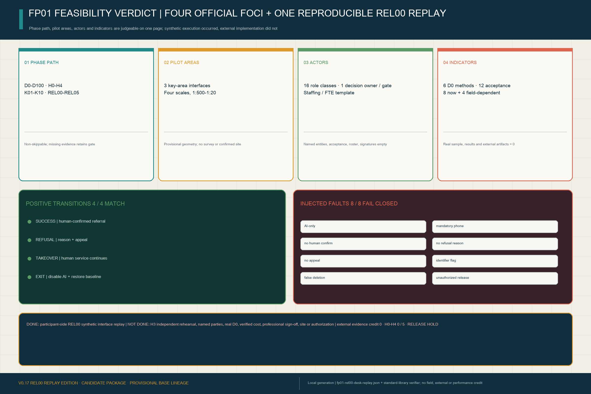

### REL00 Participant-Side Desk Replay: Actually Run, Strictly Not Field Evidence

`visual/assets/fp01-rel00-desk-replay.json` registers **twelve synthetic cases**: four positive transitions—success, reasoned refusal, human takeover and exit restoration—and eight injected faults covering AI-only service, mandatory smartphone, missing human confirmation, missing refusal reason, missing appeal, a direct-identifier flag, false deletion-completion and unauthorized release [metric:fp01_rel00_synthetic_fixture_count]. `visual/assets/verify-fp01-rel00-desk-replay.js` does not treat the written pass rates as answers. It recomputes each decision from the inputs and compares it with the recorded result. The replay returns **4/4 positive matches and 8/8 negative controls failing closed** [metric:fp01_rel00_positive_transition_match_ratio] [metric:fp01_rel00_negative_control_block_ratio].

This is completed **participant-side design-time execution evidence**, but it belongs only to `REL00 desk review and open correction`. It is not H3 independent rehearsal, real-user testing, security certification, professional sign-off or urban implementation. External-evidence credit entering H0-H4 remains **zero** and external release remains `HOLD` [metric:fp01_rel00_external_evidence_credit_count] [metric:fp01_evidence_verified_gate_count] [metric:fp01_external_release_granted_count]. This separation makes “runnable” and “implemented” simultaneously reviewable without replacing accountability or field evidence with a polished template.

The structured package first fixes **four scales, two original parameter envelopes and one capacity/egress template** [metric:fp01_pre_feasibility_scale_count] [metric:fp01_original_parameter_envelope_count] [metric:fp01_capacity_egress_template_count].

Its operating and cost side adds **one staffing/FTE template, three ROM sensitivity scenarios and one exit-restoration reserve template** [metric:fp01_staffing_fte_template_count] [metric:fp01_rom_sensitivity_scenario_count] [metric:fp01_exit_restoration_reserve_template_count].

Lifecycle control registers **four maintenance cycles, complete ALT01-04 gate/cost/permission mapping and eighteen required external-evidence receipt fields** [metric:fp01_maintenance_cycle_count] [metric:fp01_gate_cost_permission_alternative_mapping_ratio] [metric:fp01_external_evidence_receipt_required_field_count].

Accepted external receipts and pre-feasibility external releases both remain zero [metric:fp01_accepted_external_evidence_receipt_count] [metric:fp01_pre_feasibility_external_release_granted_count]. These are completeness measures—not a self-rating of maturity.

V0.17 retains the review sequence **Jing-Zhang overall spatial framework → three key areas and five flagships → one FP01 task → H0-H4 evidence gates**. The opening overview takes the official textual Three Zones and Two Wings framework as its upper-level basis, then overlays provisional SITE/KEY geometry, the Jing-Zhang public-evidence spine, three key areas, five concept flagships and six conversion capabilities. It is relationship design awaiting official boundary calibration—not new statutory zoning, precise siting or a confirmed project [metric:site_area_sqm] [metric:key_area_count] [metric:flagship_pilot_count].

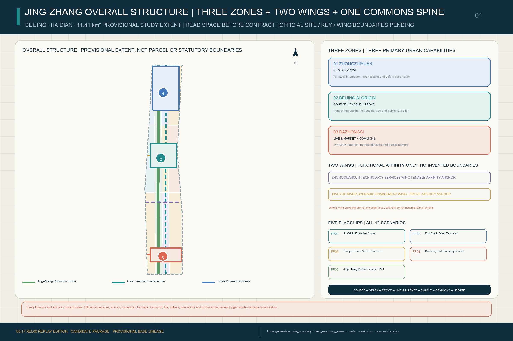

This edition makes “breaking new ground again” two connected but non-interchangeable evidence levels. **The co-creation process now has documented public revision loops** [source:OPEN-CALL-PROJECT-STATEMENT] [source:AGENT-TASKBOOK]. PR #4306 records V0.14/V0.14.1 repair, advisory 96/100, intake and merge [source:SUBMISSION-INTAKE-PR-4306]. PR #4308 records V0.15 deterministic PASS, advisory 100/100, `formal-review-ready`, `featured-candidate`, intake and merge [source:SUBMISSION-INTAKE-PR-4308]. PR #4313 records V0.16's font repair, four-gate PASS, advisory 96/100, the same two recommendations, intake and merge [source:SUBMISSION-INTAKE-PR-4313]. **Formal selection, Gallery publication, professional deepening and urban implementation are not proven by any record:** advisory scores are not formal jury scores, and intake/merge are not adoption. The urban level still requires site, accountable parties, the human baseline, rights conditions, professional review, independent controlled rehearsal and separate authorization. Neither public co-creation nor the REL00 synthetic replay substitutes for H0-H4 external evidence [standard:PROJECT-AGENT-OPEN-CALL-TASKBOOK].

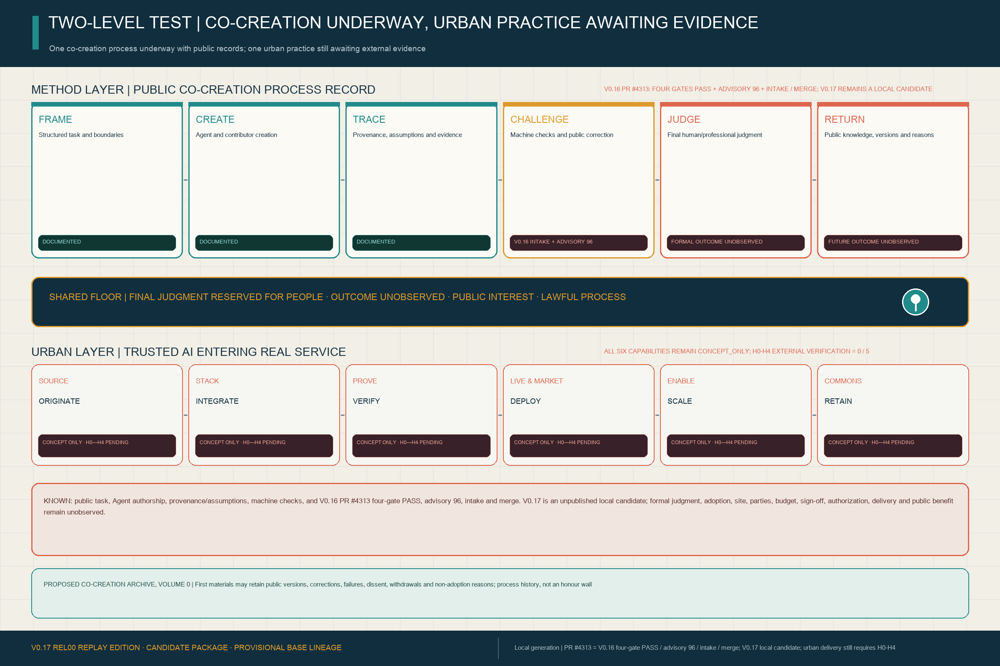

“Documented” in the figure means only that a public, traceable process record exists. PR #4306, #4308 and #4313 each prove repair, repository checks, advisory review, intake and merge only for their bound versions. None proves formal selection, Gallery publication, adoption, implementation, government endorsement or national designation. V0.17 is still a local candidate and has not been pushed or opened as a new PR; if it is later published, only its live PR and official labels will establish status. `visual/assets/agent-participation-ledger.json` locks these fact levels and human-authority boundaries into a machine-checkable record.

H0-H4 definitions are stored in `visual/assets/fp01-evidence-readiness.json`. Seven printable, item-fillable and signable bilingual forms are stored separately in `assets/media/fp01-execution-workbook.md`, with their machine mirror and anti-fabrication verifier in `visual/assets/fp01-execution-kit.json` and `visual/assets/verify-fp01-execution-kit.js`; these remain blank execution tools. The REL00 replay is executed synthetic design-time evidence, but explicitly receives no field or external-evidence credit. Neither material type is completed due diligence or implementation proof. Definition coverage is 1.0 across five gates [metric:fp01_evidence_gate_count] [metric:fp01_evidence_gate_definition_coverage_ratio].

Externally verified gates currently stand at **0/5** and verified external evidence artifacts at **0** [metric:fp01_evidence_verified_gate_count] [metric:fp01_external_evidence_artifact_verified_count]. These zeros describe the present evidence register; they are not a test-failure rate. They do not turn a site, operator, budget, professional review, operating result or authorization into obtained evidence. Missing date, source, accountable signatory or independent review stops FP01 at the current gate.

V0.17 continues to retain those zeros as the current evidence state. It adds a concept delivery-control book for the next professional team: one reversible interface prototype for each key area; event boundaries, formula, missingness and reporting rules for all six D0 measures; and role-class RACI for every H0-H4 gate [metric:key_area_interface_prototype_count] [metric:fp01_d0_measurement_method_coverage_ratio] [metric:fp01_hold_point_raci_coverage_ratio].

The same control book registers one-kit design-test quantities for M01-M06 and a K01-K10 critical dependency path. Actual quantities, unit prices, amounts, entities, signatures and dates stay empty until external evidence enters the applicable gate [metric:fp01_design_test_boq_item_count] [metric:fp01_critical_dependency_step_count].

## One Person, One Task, One Revocable Contract

V0.17 begins FP01 with one **candidate service question to be confirmed at D0**, not three parallel scenarios. Can a fictional composite user at Protocol Station Zero find one suitable learning or career service without a smartphone or an AI-only route, have it confirmed by a person, and receive a paper or portable receipt with appeal, deletion and exit rights? The persona is not a fieldwork subject. Wheelchair access and no-phone entry are demanding accessibility and non-digital design tests only; the actual user, demand frequency and present service baseline must be co-designed, measured and confirmed by an accountable service owner and user representatives at D0 [data:geometry/public_space.geojson#ROOM-TEST-001] [metric:fp01_concrete_service_problem_count] [metric:fp01_observed_human_baseline_task_completion_rate].

| Role | Duty within the same service task | Prohibited action |
| --- | --- | --- |
| **S07 user service** | Search the ordinary catalogue, assist explanation and let a learning/career professional confirm one referral or reasoned refusal | AI cannot decide admission, employment, eligibility, benefits or ranking of people |
| **S03 independent evaluation** | Review usability, bias, accessibility, human takeover and failure evidence | A supplier cannot self-certify or open a separate user service |
| **S04 API support** | Exchange catalogue provenance, version, receipt, appeal, deletion and exit fields | It cannot pool raw personal data or approve a service outcome or procurement |
| **D0 human baseline** | Complete the same task through a staffed desk plus an ordinary paper/phone catalogue | Completion, elapsed time and appeal comprehension remain unmeasured; no assumed value fills the gap |

The seven-step journey has one spine: **arrive at the staffed window → choose AI assistance or human-only service → state the minimum necessary need → compare the ordinary catalogue → receive a human-confirmed referral or refusal → take a paper/portable receipt → appeal, delete or exit and restore the human baseline**. Declining AI at entry does not reduce service. Ambiguity, user request or a high-severity rights issue triggers human takeover. `visual/assets/fp01-contract.json` makes the journey, D0-D100 gates, C01-C12 clauses and four synthetic receipt fixtures reviewable with a standard-library script; none is an operating record [metric:fp01_receipt_event_type_coverage_ratio] [metric:fp01_contract_clause_coverage_ratio].

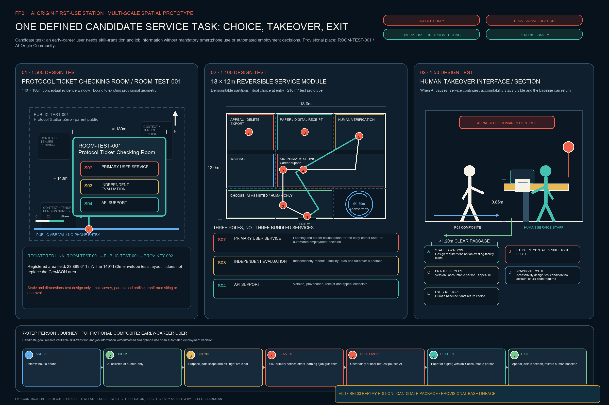

The base spatial figure translates the mechanism into three scales for professional deepening. The 1:500 view uses provisional `ROOM-TEST-001` to test arrival, parent public space and three distinct duties. The 1:100 view uses an 18 x 12 m demountable module to test dual entry, human verification, receipts, appeal and wheelchair turning. The 1:50 interface tests a staffed window, visible pause state, printed receipt, no-phone route and exit restoration. V0.17 retains the 1:20 demountable-interface layer added to the delivery-control book in V0.15; it defines connection, inspection and replacement rules among the choice gate, staffed desk, receipt dock, emergency stop and ordinary-service restoration without disguising a generic interface assumption as a construction detail. The base figure retains three prototype scales while the pre-feasibility handoff totals four; every scale must be remade after official geometry, survey, ownership, current-standard review and operating co-design [metric:fp01_spatial_prototype_scale_count] [metric:fp01_pre_feasibility_scale_count] [depth:three_key_area_detailed_design].

Four illustrative receipt classes make reversal legible. **Success** never means AI determined eligibility. **Refusal** requires a reason, human confirmation and appeal. **Human takeover** keeps the ordinary catalogue available. **Exit restoration** disables AI, restores the human baseline, and requires a separately accountable deletion completion or exception acknowledgement. The fixtures prove field and state-transition coverage only—not completed deletion, service operation or public benefit.

## Why Jing-Zhang: China's Changing Role Across Two Industrial Revolutions

China's AI agenda is moving from isolated breakthroughs toward systematic application, and national AI Plus policy links AI with industry, public wellbeing and governance [source:NATIONAL-AI-APPLICATION-ORIENTATION-2025] [source:STATE-COUNCIL-AI-PLUS-2025]. Fifteenth Five-Year planning further emphasizes industrial application capacity [source:NATIONAL-FIFTEENTH-FIVE-YEAR-AI-APPLICATION-2025]. Haidian proposes a super AI test field and a “human-AI integrated test field” in which planning certainty accommodates technological uncertainty [source:BEIJING-SUPER-AI-TESTFIELD] [source:HAIDIAN-JINGZHANG-MIDTERM-2026]. This proposal translates those directions into an urban-design question that can be challenged, measured and stopped. Strategic alignment is not represented as national-pilot designation, government authorization, approved planning or proven global leadership.

The first evidence level is already underway through this open call. Agents read machine-readable tasks and produce structured planning and design artifacts that people and machines can jointly inspect. Public versions and Issues/PRs support correction, while selection, professional deepening and final judgment remain with people and professional teams. Outputs and process records may continue in the public knowledge base. The urban evidence level proposed here still requires the real problem, site, accountability, baseline, rights, professional review, controlled rehearsal and authorization demanded by H0-H4. Open co-creation can show that parts of a method are organized, traceable and revisable; it cannot substitute for implementation evidence [source:OPEN-CALL-PROJECT-STATEMENT] [source:AGENT-TASKBOOK] [standard:PROJECT-AGENT-OPEN-CALL-TASKBOOK].

In 1909, the Jing-Zhang Railway demonstrated China's independent capacity to survey, design, build and manage a complex modern system [source:HIST-JINGZHANG-RAILWAY] [source:HIST-JINGZHANG-PARK]. Historical records also document Jeme Tien Yow's study of railway engineering in the United States, his integration of overseas learning with Chinese traditional technique and local conditions, and his career as an emblem of modern Chinese industry moving “from foreign import to autonomy” [source:HIST-JINGZHANG-FROM-LEARNING-TO-AUTONOMY]. These are traceable historical facts. This proposal draws from them a design-historical thesis: during the earlier industrial revolution's diffusion, China moved from learning, absorbing and reworking a railway-industrial system first developed in the West to an autonomous engineering breakthrough. Today, national AI strategy and Haidian's test-field ambition create the possibility of another change in role: not merely following or deploying technology, but using the real city to build capability in industrial application, urban governance and everyday life and, in global competition, to help define and seek to lead an AI-driven industrial revolution. The first opening wrote engineering capacity into China's geography; the next must write intelligence and accountable governance into its cities. The two-industrial-revolutions comparison is this proposal's design-historical framing, and seeking leadership is a strategic ambition. Only real services passing H0-H4 can move this from method to urban capability; this submission does not demonstrate national designation, implementation, world-first status or global leadership.

One FP01 contract is supported by six urban capabilities. SOURCE lets a problem originate; STACK lets systems integrate; PROVE tests evidence; LIVE & MARKET provides real use; ENABLE supports portability and scaling; and COMMONS retains methods and failure evidence. The AI City API, Jing-Zhang Trusted AI Compact, human takeover, non-digital fallback, appeal and exit run across them. These are this proposal's analytical framework—not an official national assessment system or six new districts [metric:application_capability_stage_count] [metric:application_capability_mapping_coverage_ratio] [standard:PROJECT-AGENT-OPEN-CALL-TASKBOOK].

Each stable machine role retains one primary concept anchor for evidence navigation; no proxy anchor becomes an official wing boundary or confirmed site [metric:network_role_count] [metric:network_role_anchor_count]. Five flagship pilots and twelve scenarios still cover the taskbook, but FP01 first proves “one person, one task, one contract” before any claim of diffusion [metric:flagship_pilot_count] [metric:fp01_first_use_delivery_contract_template_count].

## Design Basis and Source List

The official announcement supports the project name, textual scopes, approximate areas and task requirements. The cleared Agent taskbook supports the six Agent-facing tasks and public-compliance boundaries. Local professional-reference snapshots support urban-design, regulatory-planning and land-use-classification language. Repository provisional geometry supports generation, visualization and intake checks only; it must not be represented as an official boundary, statutory control or precise-area basis [source:OFFICIAL-ANNOUNCEMENT] [source:AGENT-TASKBOOK] [source:SOURCE-REGISTRY]. V0.17 reinterprets the existing BUILD—TEST—LIVE evidence structure as six conversion capabilities and their stable six-node urban network without altering the provisional V0.3 base.

The official-task basis and known/missing evidence are reviewed explicitly rather than inferred from the concept narrative [standard:PROJECT-OFFICIAL-ANNOUNCEMENT] [depth:existing_conditions_diagnosis].

`data/processed/agent_fact_pack.md` is a navigation layer for this proposal rather than a new authority [source:PROCESSED-FACT-PACK]. It organizes the three scopes, key areas, task requirements and data gaps, while factual claims still return to the registered primary materials [source:OFFICIAL-ANNOUNCEMENT] [source:AGENT-TASKBOOK].

The three nested street rooms, seven interface entities and three human journeys registered in V0.6 remain trusted-operations evidence [metric:protocol_street_room_count] [metric:protocol_interface_entity_count] [metric:human_journey_count]. Three capacity-return nodes are counted separately [metric:capacity_return_node_count]. Scenario-to-return-node and interface-entity-to-valid-room resolution coverage remain 1.0 [metric:return_ticket_reference_coverage_ratio] [metric:protocol_interface_entity_coverage_ratio].

These textual changes do not rewrite SITE/KEY shapes, the 3×4 land-use topology or the provisional denominator. Nested rooms remain counted once in the parent-public-space union, which is 432,600 m² [metric:public_space_area_sqm]. Because exact official boundaries, controls and independent professional sign-off are unavailable, V0.17 remains an open-source concept using provisional constraints, not an approval deliverable [standard:MOHURD-ARCH-DESIGN-DEPTH-2016].

This submission also leaves a separate **process-evidence chain**: `structured task and boundary → sources and assumptions → Agent judgment → spatial and metric artifacts → deterministic self-check → public correction → human-judgment gate and authority boundary → versioned archive`. It records the presently reviewable stages and marks the human judgment and return outcomes that remain unobserved. It is not evidence of site, users, budget, professional sign-off or implementation outcomes, and it does not count toward FP01's H0-H4 external evidence [source:OPEN-CALL-PROJECT-STATEMENT] [source:SUBMISSION-INTAKE-PR-4017].

Exact official polygons, regulatory controls, road redlines, ownership/cadastral data, existing-building surveys, heritage controls, utilities and facility baselines remain pending official or rights-cleared data. SITE-001 and the three KEY_AREA polygons are explicitly provisional and must trigger whole-package regeneration when official geometry arrives [data:geometry/site_boundary.geojson#SITE-001] [source:BOUNDARY-SOURCE] [source:KEY-AREA-SOURCE]. Complete evidence remains in `sources.json`, `metrics.json`, the GeoJSON layers and the three matrices.

V0.17's “zero coordinate movement” does not mean the provisional geometry has been verified as correct. The repository's provisional-boundary basis records community check #846, which identified an approximately 412.5-metre offset between an OSM park reference and SITE-001. Community check #1029 further reports that the centroid of provisional Dazhongsi area PROV-KEY-003 is about 2,257 metres from Dazhongsi Station and its nearest boundary about 1,788 metres away, while Beijing North Station falls inside that provisional polygon. These distances are reproducible community background warnings—not official correction, survey evidence or a replacement boundary. V0.17 records the discrepancy in geometry attributes and the assumption ledger but moves no coordinates; the “Dazhongsi station-city and four-quadrant walking link” remains a relational objective pending official geometry [source:SITE-PACKAGE] [source:COMMUNITY-GEOMETRY-CROSSCHECK-1029].

## Three-Level Scope Framework

The Coordinated Research Area uses the official approximate **43.6 km²** figure but currently has no submitted polygon. The Overall Design Area uses the official approximate **11.4 km²** figure and provisional SITE-001, calculated at about 11.413 km² in EPSG:4548. The Key-Area Detailed Design Area uses the official approximate **368.4 ha** total and three rough provisional polygons [metric:announced_coordinated_research_area_sqm] [metric:announced_overall_design_area_sqm] [metric:announced_key_detailed_design_area_sqm]. These three levels cannot substitute for one another [depth:three_level_scope_framework].

The provisional denominator remains directly traceable to the site layer [data:geometry/site_boundary.geojson#SITE-001] [metric:site_area_sqm]. The three detailed-design areas are counted from their own layer [data:geometry/key_areas.geojson#PROV-KEY-001] [metric:key_area_count].

The processed fact pack remains a reading aid for this scope chain, not a substitute for the registered sources [source:PROCESSED-FACT-PACK].

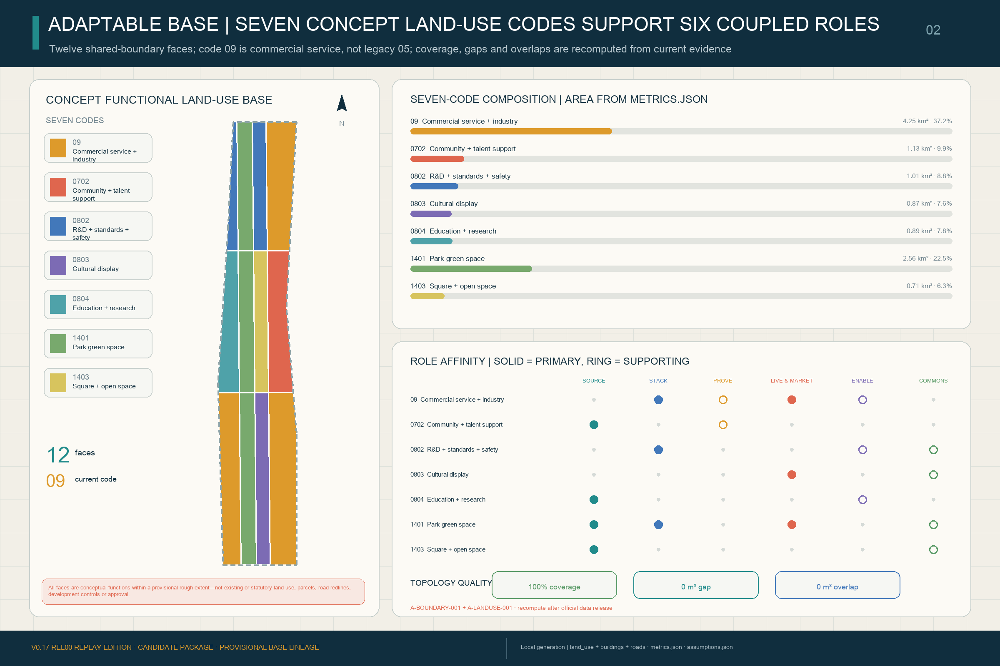

The three scopes work as one evidence chain. Coordinated research defines the industry and future-city logic; overall design translates it into renewal projects, spatial structure and facilities; and key-area design tests implementability through sites, buildings, movement, public space and AI scenarios. V0.17 uses **SOURCE—STACK—PROVE—LIVE & MARKET—ENABLE—COMMONS** as the coordinated-research network. The heritage park is its historic and public-space spine; Zhongzhiyuan leads STACK and PROVE; the Beijing AI Origin Community leads SOURCE, ENABLE and PROVE; Dazhongsi leads LIVE & MARKET; and the wings feed professional services, scenario access and public experience into ENABLE and COMMONS. The trusted-operations entities remain along the existing Seven-Interface Civic Service Link without creating a fourth statutory zone, new redline or change to SITE/KEY shapes or the 3×4 topology [data:geometry/roads.geojson#ROAD-INTERFACE-001] [data:geometry/public_space.geojson#ROOM-BUILD-001] [depth:three_level_scope_framework]. The provisional site and service-link evidence also keep this overlay subordinate to the overall spatial structure [data:geometry/site_boundary.geojson#SITE-001] [data:geometry/roads.geojson#ROAD-INTERFACE-001] [depth:overall_spatial_structure].

| Scope | Design question | V0.17 response | Evidence landing |
| --- | --- | --- | --- |
| Coordinated Research Area | How should the AI ecosystem and future urban form be organized? | A six-node network converting frontier innovation into industry, markets and shared capability | `compliance_matrix.json`, `standard_matrix.json` |
| Overall Design Area | How do industry space, renewal, mobility, utilities and character become spatial? | The existing 3×4 base carries the network, two longitudinal links, green spine, public space and implementation packages | [data:geometry/land_use.geojson#LU-BUILD-01] [data:geometry/roads.geojson#ROAD-SPINE-001] |
| Key-Area Detailed Design | How do the three areas reach implementation-plan depth? | Spatial actions, AI scenarios and dependencies for SOURCE/ENABLE, STACK/PROVE and LIVE & MARKET | [data:geometry/key_areas.geojson#PROV-KEY-001] [data:geometry/key_areas.geojson#PROV-KEY-002] [data:geometry/key_areas.geojson#PROV-KEY-003] |

### Point-by-Point Brief Mapping: Three Positions, Five Functions, Three Zones and Two Wings

The mappings below connect every strategic brief item to spatial, scenario, governance and operating evidence; they do not substitute a synonymous concept label for a point-by-point response [source:AGENT-TASKBOOK] [standard:PROJECT-AGENT-OPEN-CALL-TASKBOOK].

| Brief item | Direct V0.17 response | Primary carrier and review entry |
| --- | --- | --- |
| Centennial Jing-Zhang Cultural Belt | The railway-heritage spine, “Breaks New Ground” narrative and Co-Creation Archive connect engineering autonomy, public memory and reusable methods | Jing-Zhang Railway Heritage Park, FP05, `assets/figures/site-overview.en.png` |
| Urban AI Life Experience Belt | AI experience becomes ordinary service that preserves choice, human takeover, appeal, deletion and exit | Seven-Interface Civic Service Link, three journeys, `assets/figures/mobility-bluegreen.en.png` |
| AI Convergence Innovation Belt | A six-node capability network and five flagships close the loop from research and full-stack capacity to proof, first use, markets and shared capability | SOURCE—COMMONS, five flagships, `assets/figures/land-use-structure.en.png` |
| Full-Stack Independent AI Innovation System | STACK organizes chips, compute, frameworks, models, Agents and data tools; PROVE supplies independent testing and stop conditions | Zhongzhiyuan, FP02, S01/S10 |
| World-Class AI Innovation Ecosystem | SOURCE and ENABLE connect universities, open-source communities, firms, talent, IP, capital and regional interfaces | Beijing AI Origin Community, Zhongguancun Technology Services Wing, six international mechanism comparisons |
| New Paradigm for AI-Enabled Scenario Empowerment | Twelve scenarios enter five stoppable, reviewable flagships along a technology—trial—first-use—diffusion—commons path | Xiaoyue River Scenario Enablement Wing, FP01—FP05, scenario cards |
| Intelligent and Vibrant AI City | LIVE & MARKET connects commerce, mobility, culture and public service to one human baseline and continuous operating rhythm | Dazhongsi, Seven-Interface link, quarterly—semiannual—annual cycle |
| Global Voice in AI Governance | AI City API, Trusted AI Compact, H0-H4, public failure evidence and a human final-judgment gate form a method that can be debated and reused | Zhongzhiyuan governance capacity, FP05 archive, three FP01 structured evidence packs |

| Three Zones and Two Wings | Lead capabilities | Connection to the overall system |
| --- | --- | --- |
| Beijing AI Origin Community | SOURCE + ENABLE + PROVE | Original innovation, near-campus translation, first-use service and public proof enter FP01 |
| Zhongzhiyuan AI Independent Innovation Acceleration Area | STACK + PROVE | Full-stack infrastructure, safety evaluation, low-carbon compute and governance methods enter FP02 |
| Dazhongsi AI Industry Cluster | LIVE & MARKET + COMMONS | Everyday markets, station-city experience, public deliberation and exit records enter FP04 |
| Zhongguancun Technology Services Wing | ENABLE | Talent, IP, capital and professional services support cross-party delivery across five flagships |
| Xiaoyue River Scenario Enablement Wing | PROVE + COMMONS | Public-space co-testing, inclusive mobility, community feedback and failure evidence enter FP03/FP05 |

## Coordinated Research Area: Industry and Future City Research

The ecosystem is organized as a feedback network rather than a single validation pipeline. The Three Zones and Two Wings remain the official spatial framework; the six nodes assign complementary urban-capability roles, while the trusted operations layer provides public interfaces, evidence, human takeover and return across them [source:AGENT-TASKBOOK] [standard:PROJECT-AGENT-OPEN-CALL-TASKBOOK].

| Network node | Core question | Lead spatial carriers | Capability left to the city |
| --- | --- | --- | --- |
| **SOURCE** | How does original research enter open collaboration and translation faster? | Beijing AI Origin Community, universities/institutes and the Zhongguancun service wing | Open knowledge, research translation, global talent and problem-finding capacity |
| **STACK** | How do chips, compute, frameworks, models, agents and data tools work together? | Zhongzhiyuan AI independent-innovation accelerator | Shared full-stack technology and accessible infrastructure |
| **PROVE** | How are technology, space, business models and governance tested in real conditions? | Zhongzhiyuan, AI Origin and the Xiaoyue River Scenario Enablement Wing | Test methods, failure evidence, standards and scale/stop conditions |
| **LIVE & MARKET** | How does AI enter commerce, work, mobility, culture and public services through real demand? | Dazhongsi and everyday-service nodes across the belt | Sustainable operations, enterprise/consumer conversion and perceptible public services |
| **ENABLE** | What allows innovators and talent to remain and collaborate? | Zhongguancun service wing, AI Origin and rail micro-centres | Capital, talent, IP support, housing, professional services and infrastructure |
| **COMMONS** | What remains permanently available after technology diffuses? | Jing-Zhang Heritage Park, community interfaces and public-knowledge nodes | Open methods, continuous public space, service baselines, public memory and reuse capacity |

Regional coordination is designed as a set of capability-exchange interfaces, not as an attempt to draw external districts into this submission boundary. Beiwei Community is a proposed adjacent resident-needs and grassroots-service feedback entry; Future Science City and Huairou Science City are proposed interfaces for basic research, major-science-facility knowledge and test methods; Beijing E-Town is a proposed interface for embodied AI, advanced manufacturing and engineering scale-up; and the Beijing–Tianjin–Hebei region is a proposed interface for supply chains, cross-regional scenario reuse and standards feedback. These are unconfirmed collaboration directions—not signed partnerships, resource inventories, investments or cross-district spatial controls—and every exchange remains subject to authorization, IP, data-boundary and accountable-party review [source:AGENT-TASKBOOK].

Urban character, public space and building layout are therefore treated as one coordinated design problem, while statutory controls remain pending [standard:MOHURD-URBAN-DESIGN-MEASURES]. The spatial structure remains traceable through representative land-use and public-space carriers [data:geometry/land_use.geojson#LU-BUILD-01] [data:geometry/public_space.geojson#PUBLIC-BUILD-001] [depth:overall_spatial_structure].

V0.3 retains six deliberately different case types rather than treating them as a like-for-like ranking [metric:global_case_group_count]:

| Case | Transferable mechanism | Translation and limit |
| --- | --- | --- |
| Singapore Punggol Digital District ODP | Integrated physical/digital district backbone, API access and test environment | Federated service interface between BUILD and TEST; platform efficiency does not establish civic legitimacy [source:CASE-PUNGGOL-ODP] |
| EU AI Testing and Experimentation Facilities | Lab-to-real integration, validation and end-user-defined scenarios, protocols and metrics | A staged testing ladder; testing is not regulatory approval [source:CASE-EU-TEF] |
| Helsinki and Amsterdam algorithm registers | Publicly readable information about city AI/algorithms and feedback/contact routes | System cards, accountable contacts and correction routes; disclosure alone is not audit or appeal [source:CASE-HELSINKI-AI-REGISTER] [source:CASE-AMSTERDAM-ALGORITHM-REGISTER] |
| Montréal Declaration for Responsible AI | Scenario-based citizen and expert co-construction of principles | A method for revising the civic compact; principles still need owners, cards and version logs [source:CASE-MONTREAL-DECLARATION] |
| NIST AI RMF | Continuous Govern—Map—Measure—Manage lifecycle, feedback and decommissioning | Continuous monitoring, review, pause and retirement; not a planning standard or legal approval [source:CASE-NIST-AI-RMF] |
| Toronto Quayside / Sidewalk Toronto | Open standards, data-minimization and public-interest governance were explicit project concerns before the partnership ended | Define public authority, interoperability, social licence and exit before technical lock-in; no claim that governance controversy alone caused withdrawal [source:CASE-SIDEWALK-QUAYSIDE] |

The resulting position is not another protocol brand, validation pipeline, traffic-light display or abstract “city operating system.” It is the **SOURCE—STACK—PROVE—LIVE & MARKET—ENABLE—COMMONS** conversion network, moving the question from “does Haidian have models?” to “can its frontier innovation form industry, markets, public services and replicable AI application capacity?” The AI City API, Jing-Zhang Trusted AI Compact, seven interfaces and capability-return mechanism run across all nodes as the trusted operations layer [metric:protocol_interface_count]. Passing a test is never represented as government approval, national-pilot designation or adoption of this submission.

### Trusted Operations Layer: Two-Layer Protocol, Human Takeover, and Public Receipt

The trusted operations layer is neither the overall brand nor a pass issued to technology. Before a capability moves from PROVE into LIVE & MARKET, a public-readable receipt explains seven minimum fields plus human takeover, non-digital fallback, appeal, data/component portability, pause and retirement. The machine-readable portion is exchanged through the AI City API; public rights and amendment are governed by the **Jing-Zhang Trusted AI Compact**. Entry and return paths must be equally legible [metric:protocol_interface_count] [source:AGENT-TASKBOOK] [standard:PROJECT-AGENT-OPEN-CALL-TASKBOOK].

The proposal does not mechanically copy the open-call workflow into urban operations. It extracts transferable institutional actions: structured tasks become system and service cards; provenance and versioning map to I1-I3; deterministic checks become minimum safety and format gates; Issue/PR-style public correction becomes appeal, dissent and version logs; human final judgment becomes an accountable `go / revise / stop` sign-off; and open version retention becomes COMMONS. Urban service carries greater risk than proposal submission, so H0-H4 must additionally cover the human baseline, user rights, procurement, engineering, professional review and exit. “Open source” cannot replace statutory responsibility.

V0.17 retains the seven resolvable prototype entities registered in V0.6 for evidence stability. Each has one lead street room and carries a rule for replicating the complete interface kit across all three rooms. Entity count remains 7 and resolution coverage 1.0; this does not make the former protocol terminology the overall concept [metric:protocol_interface_entity_count] [metric:protocol_interface_entity_coverage_ratio].

| Entity | Minimum interface | AI City API machine contract | Jing-Zhang Trusted AI Compact public right |
| --- | --- | --- | --- |
| I1 Identity and Provenance Station | identity / provenance | exchange deployment ID, accountable operator and provenance receipt | see responsibility and obtain an equivalent staffed or non-digital explanation [data:geometry/public_space.geojson#INTERFACE-I1] |
| I2 Data Purpose and Retention Station | data purpose / retention | declare purpose, minimum-data boundary, retention and deletion status | receive plain-language notice and use deletion or non-digital routes [data:geometry/public_space.geojson#INTERFACE-I2] |
| I3 Capability and Limitation Station | capability / limitations | exchange version, applicable tasks, known failures and prohibited uses | receive accountable human explanation and avoid use beyond declared limits [data:geometry/public_space.geojson#INTERFACE-I3] |
| I4 Human Authority and Non-AI Service Station | human authority / non-digital fallback | exchange takeover owner, stop status and fallback availability | complete equivalent service through a visible staffed point without mandatory AI or smartphone use [data:geometry/public_space.geojson#INTERFACE-I4] |
| I5 Appeal and Remedy Station | appeal / redress | exchange case reference, service clock, human decision and correction status | receive a trackable complaint, human decision and effective remedy [data:geometry/public_space.geojson#INTERFACE-I5] |
| I6 Interoperability and Portability Station | interoperability / portability | exchange export format, handover status and service-continuity fields | port necessary records, switch operators and avoid service lock-in [data:geometry/public_space.geojson#INTERFACE-I6] |
| I7 Version, Pause, Exit and Public Memory Station | version / pause / retirement / public memory | exchange current version, pause, retirement, change and return status | inspect a durable record of failures, changes, retirement and returned capacity [data:geometry/public_space.geojson#INTERFACE-I7] |

### One Master Brand: One Civic Language for Pilots, Events, Contribution Records, and Public Space

**JING-ZHANG BREAKS NEW GROUND / `京张，再次开路`** is the only master brand. The `JZ SWITCH MARK` combines the historic railway trunk, a forward branch for AI application, a return line for withdrawal and capability return, an open bracket defining a bounded public experiment, and a human node retaining final judgment. V0.17 fixes only this concept grammar—not a final official logo, government emblem or railway-company mark. Every use must show the bilingual name, version, date and the words `CONCEPT PROPOSAL / UNAUTHORIZED / NO GOVERNMENT ENDORSEMENT`; colour cannot be the sole carrier of status [metric:brand_architecture_layer_count] [source:AGENT-TASKBOOK].

| Layer | Fixed content | Common rule |
| --- | --- | --- |
| **L0 master brand** | JING-ZHANG BREAKS NEW GROUND / `京张，再次开路` | One Switch Mark only; horizontal, vertical and monochrome lockups retain clear space, bilingual name, version and text status |
| **L1 five flagships** | Fixed bilingual names for FP01—FP05 | Use “master brand + FP number + name + current gate/status”; no independent flagship logos [metric:brand_flagship_mapping_coverage_ratio] |
| **L2 open series** | Quarterly flagship open day, semiannual evidence review, annual Jing-Zhang Breaks New Ground Assembly, continuous public changelog | Proposed operating rhythms only—not confirmed organizers, dates, venues or budgets |
| **L3 Jing-Zhang Contribution Record** | Five amendable classes: public problem, open build, independent verification, rights stewardship, and failure correction/capability return | No ranking of people or firms and no current recipients; every record traces source, version, accountable role, independent review, objection and withdrawal [metric:honor_contribution_class_count] |
| **L4 three landmarks and six components** | Protocol Station Zero, Civic AI Test Yard, Jing-Zhang Commons Ledger; reversible components M01—M06 | No landmark logos; every component must be removable, portable and able to support ordinary public activity after AI is disabled [metric:reversible_public_space_component_count] [metric:landmark_component_mapping_coverage_ratio] |

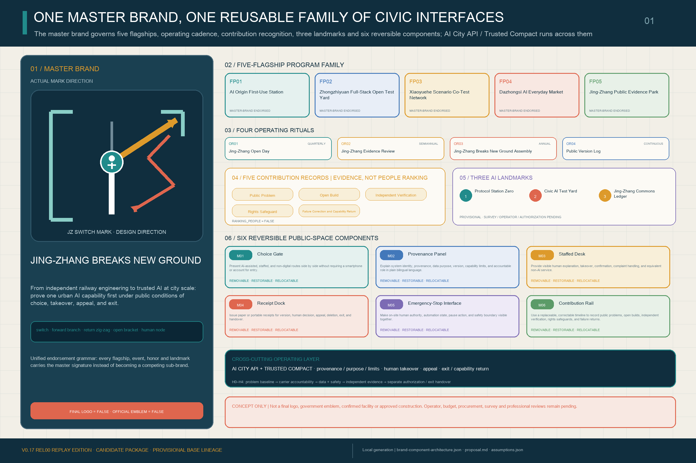

Six components turn identity into a public-space language for entry, use and exit rather than a graphic skin. **M01 Choice Gate** presents AI-assisted and human-only entries side by side. **M02 Provenance Sign** states version, source, capability boundary and accountable role. **M03 Staffed Desk** supports human confirmation, no-smartphone and no-account routes. **M04 Receipt Dock** provides reasons for refusal, appeal, deletion and exit. **M05 Stop Interface** pauses AI and restores ordinary service. **M06 Contribution Rail** displays versions, corrections, failures, retirement and capability return. Every component maps to I1—I7, applicable flagships and landmarks, while material, dimension, fixing, power, data connection, formal siting, accessibility, fire, heritage and engineering feasibility await survey and professional review. Every current component is `concept_only` [standard:PROJECT-AGENT-OPEN-CALL-TASKBOOK] [depth:blue_green_public_space].

The AI City API, Jing-Zhang Trusted AI Compact, seven interfaces, public receipts and capability return remain a cross-cutting operations layer, not a second master brand. Layer, mapping, contribution-class and component-coverage measures prove only proposal-internal expression and reference closure—not logo approval, event delivery, honours granted, landmark siting, component installation, operator adoption or public benefit.

## Overall Design Area: Urban Renewal and Regulatory-Plan-Level Urban Design

V0.3 provides the reproducible evidence base: north-to-south **BUILD, TEST and LIVE** lifecycle segments cross west-to-east **knowledge/R&D, public green spine, civic interface and everyday service** bands, producing twelve cells from shared cut lines. LEARN/UPDATE is a feedback network across all three segments, not a fourth statutory zone. The twelve polygons cover SITE-001 completely with no material gap, outside area or overlap; they are concept functions, not existing or statutory land use [data:geometry/land_use.geojson#LU-BUILD-01] [metric:land_use_coverage_ratio] [metric:land_use_overlap_area_sqm]. V0.17 keeps this geometry unchanged and uses it as evidence for the larger six-node urban network [depth:land_use_layout].

V0.17 overlays SOURCE—STACK—PROVE—LIVE & MARKET—ENABLE—COMMONS on the existing **3×4 matrix**. A capability can originate in a university or open-source community, enter a shared stack, be tested in bounded and real settings, reach daily service or first-use procurement, receive professional and infrastructural support, and return methods and failure evidence to the commons. The spatial relationship is traceable in the land-use and service-link layers [data:geometry/land_use.geojson#LU-BUILD-01] [data:geometry/roads.geojson#ROAD-INTERFACE-001]. Overall structure and land-use depth are reviewed separately [depth:overall_spatial_structure] [depth:land_use_layout]. This overlay is not a new statutory land-use class or area-control metric.

Two registered longitudinal links—the **Jing-Zhang Public Green Spine** and **Seven-Interface Civic Service Link**—plus the four existing cross-links make the spatial base for the six-node network. These are conceptual walking, cycling and service relationships, not road redlines or engineering alignments [data:geometry/roads.geojson#ROAD-SPINE-001] [data:geometry/roads.geojson#ROAD-INTERFACE-001] [metric:slow_mobility_length_m]. Three 1401 cells directly generate the green-space layer. Six public interfaces and six small program envelopes anchor the key areas; every envelope lies within its provisional key area and has zero conflict with 1401, 1403 or public-space polygons [data:geometry/key_areas.geojson#PROV-KEY-001].

Against the provisional denominator, design green space is about **2.563 million m² / 22.459%**, six public interfaces about **432,600 m² / 3.7905%**, concept envelopes **27,775 m² / 0.2434%**, and the conceptual network about **24.15 km** [metric:green_ratio] [metric:public_space_ratio] [metric:concept_building_coverage_ratio]. These test design choices only. Total floor area, FAR, statutory building density, height, setbacks, road area and road ratio remain `unknown` [metric:floor_area_ratio] [metric:setback_m]. The completed deliverable is a control-status table, not a set of approved values [standard:MOHURD-CONTROL-DETAILED-PLANNING] [depth:development_intensity_controls].

## Detailed Design of Key Areas

- **Zhongzhiyuan / existing BUILD segment — STACK + PROVE:** the Civic AI Test Yard, Capability Contract Court, Safety Evaluation Lab and Standards Hub support full-stack integration and engineering proof through S01, S02 and S10. Public observation and controlled-test routes remain distinct; public trials require human stop authority, incident logging and declared capability limits [data:geometry/key_areas.geojson#PROV-KEY-001] [metric:scenario_node_zhongzhiyuan_count].
- **Beijing AI Origin Community / existing TEST segment — SOURCE + ENABLE + PROVE:** a frontier-release/public-validation interface, Community Service Interface Court, Learning Studio and Human Review/Appeal Point support S03, S04, S05 and S07 and provide professional referral for S08. A public trial card precedes service activation [data:geometry/key_areas.geojson#PROV-KEY-002] [metric:scenario_node_ai_origin_count].
- **Dazhongsi / existing LIVE segment — LIVE & MARKET:** the public evidence ledger, Dazhongsi Urban Living Room, Living Heritage Studio and AI-native commerce space support S11 and S12 and connect to S09. Wider service diffusion requires independent evaluation, consumer notice, appeals and retirement arrangements [data:geometry/key_areas.geojson#PROV-KEY-003] [metric:scenario_node_dazhongsi_count].

The two wings connect services, capital, professional support, scenario access and public experience. Exact locations and physical interventions remain pending official polygons, ownership, transport, heritage and engineering evidence [data:geometry/key_areas.geojson#PROV-KEY-001] [data:geometry/key_areas.geojson#PROV-KEY-002] [data:geometry/key_areas.geojson#PROV-KEY-003].

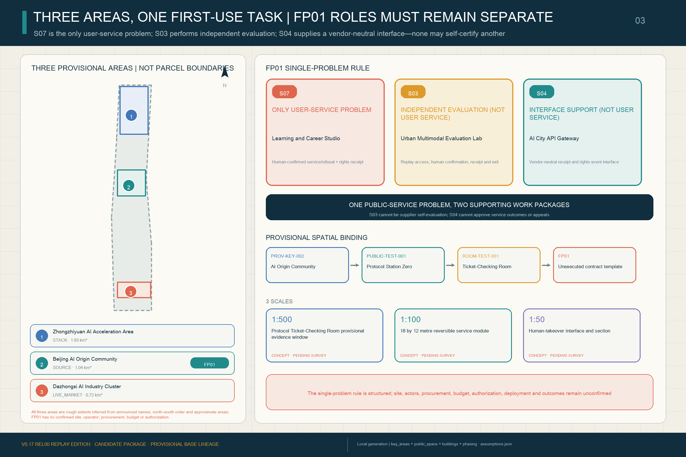

### Three Conceptual Spatial Experiences

*Zhongzhiyuan places a public greenway, observation walk, transparent safety boundary, staffed control desk, physical emergency stop and visible energy interface in one section. Concept experience only—not current conditions, precise siting, an architectural proposal or an approved project.*

*AI Origin lets a wheelchair/no-smartphone user reach a staffed counter along an accessible path; the evaluation room, stop control and appeal referral are visible but institutionally separated. Concept experience only—not current conditions, precise siting, an architectural proposal or an approved project.*

*Dazhongsi keeps small merchants and creators at the market frontstage while staffed service, dispute review and an updateable contribution archive form one continuous civic interface. Concept experience only—not current conditions, precise siting, an architectural proposal or an approved project.*

### Three Trusted-Operations Street Rooms

V0.17 retains the three ticket-issuing, ticket-checking and return polygons registered in V0.6 as evidence windows in the trusted operations layer, not as the overall brand [metric:protocol_street_room_count]. Each room is nested in an existing parent public space; union accounting adds no public-space area, so area and ratio remain 432,600 m² and 3.7905% [metric:public_space_area_sqm] [metric:public_space_ratio]. They are concept evidence windows on the provisional rough base—not additional landmarks, buildings, official redlines, confirmed venues or implementation commitments. Boundaries, ownership, scale and operators remain pending survey and professional co-design [data:geometry/public_space.geojson#ROOM-BUILD-001] [data:geometry/public_space.geojson#ROOM-TEST-001] [data:geometry/public_space.geojson#ROOM-LIVE-001].

| Protocol street-room entity | Nested parent carrier / alias | Public action | Evidence boundary |
| --- | --- | --- | --- |
| **ROOM-BUILD-001: Protocol Ticket-Issuing Room** (Zhongzhiyuan / BUILD) | `PUBLIC-BUILD-002` / Capability Contract Court | Renders provenance, data purpose, capability limits, responsible human and return conditions as a readable receipt | Issues no government permit; the nested concept polygon must be recalculated with official inputs [data:geometry/public_space.geojson#ROOM-BUILD-001] |
| **ROOM-TEST-001: Protocol Ticket-Checking Room** (AI Origin / TEST) | `PUBLIC-TEST-001` / Protocol Station Zero | Checks the ticket against bounded trials, human review, non-digital fallback and appeal readiness | Is not certification or regulatory approval; the nested concept polygon must be recalculated with official inputs [data:geometry/public_space.geojson#ROOM-TEST-001] |
| **ROOM-LIVE-001: Protocol Return Room** (Dazhongsi / LIVE—LEARN) | `PUBLIC-LIVE-001` / Jing-Zhang Commons Ledger | Records continuation, modification, pause, retirement, service restoration and public-memory changes | Is not an existing institution or statutory process; the nested concept polygon must be recalculated with official inputs [data:geometry/public_space.geojson#ROOM-LIVE-001] |

## AI Innovation Ecosystem, Personas, and AI+ Scenarios

V0.17 retains twelve `application_scenario` features in `public_space.geojson`; S01–S03 are industry validation cases [data:geometry/public_space.geojson#SCENARIO-S01] [metric:scenario_node_count] [metric:industry_validation_scenario_count]. They are no longer presented as twelve unrelated exhibits: the implementation chapter bundles them into five flagship pilots covering SOURCE/ENABLE, STACK, PROVE, LIVE & MARKET and COMMONS, with a technology → trial → first-use procurement → diffusion → standards/shared-capability path. Each point still carries a spatial carrier, host features, applicable key area, dependency package, personas, operator role, data boundary, human-review requirement, non-AI fallback, appeal route and `deployment_status=concept_only`. All 12/12 have human review, spatial assignment and phase assignment [metric:scenario_human_review_coverage_ratio] [metric:scenario_spatial_assignment_coverage_ratio] [metric:scenario_phase_assignment_coverage_ratio]. The 25 unique persona labels are testing roles, not demographic profiling or personal inference [metric:persona_count].

| User profile | Typical needs | Spatial response | Self-check boundary |
| --- | --- | --- | --- |
| Open-source developers | Publishing, collaboration, testing and community reputation | AI Origin release hall, public code wall and evening collaboration space | No individual movement tracking; activity data only in aggregate |
| Early-stage teams | Affordable workspace, compute access and product trials | Zhongzhiyuan shared test yard, edge-compute access and standards/governance advice | Compute and data services require separate authorization |
| Established-enterprise visitors | Demonstration, business exchange, international reception and recruitment | Dazhongsi international demo lounge, transit interchange and public space near anchor firms | Company identities and cases require rights clearance |
| Nearby residents | Commuting, recreation, community service and low-disruption renewal | Heritage-park walking/cycling loop, embedded community service, graded lighting and events | Resident profiles may not be used for commercial recommendation |
| University students and researchers | Research translation, cross-campus collaboration and everyday active travel | Campus—park links, translation stations and AI learning-experience nodes | Campus data and research outputs require authorization |

| ID | Scenario | Lifecycle / carrier | Primary safeguard |
| --- | --- | --- | --- |
| 01 | Model and Agent Safety Sandbox — testing and validation | BUILD / TEST; Zhongzhiyuan | red-team, audit and stop rules |
| 02 | Embodied AI Street Lab — testing and validation | BUILD / TEST; bounded test yard | geofencing, steward supervision and incident logs |
| 03 | Urban Multimodal Evaluation Lab — testing and validation | TEST; AI Origin | bias, accessibility and failure-mode evidence |
| 04 | AI City API Gateway | TEST / LEARN; belt service interfaces | registry, permissions, appeals, rollback and versioning |
| 05 | Public-Service Navigation Copilot | TEST / LIVE; community service points | assistance only, human and non-digital fallback |
| 06 | Inclusive Mobility Copilot | TEST / LIVE; park and station links | minimal sensing and no commercial resident profiling |
| 07 | Learning and Career Studio | TEST / LIVE; AI Origin learning spaces | no automated eligibility decisions |
| 08 | Health-Service Wayfinding Assistant | TEST / LIVE; community/mobility nodes | no autonomous diagnosis; professional escalation |
| 09 | Jing-Zhang Living Heritage Trail | LIVE / LEARN; railway heritage spine | sourced interpretation and public correction |
| 10 | Low-Carbon Compute and Energy Observatory | BUILD / LEARN; Zhongzhiyuan | measured performance and uncertainty disclosure |
| 11 | AI-Native Commerce and Creative Market | LIVE; Dazhongsi | provenance, rights clearance and consumer disclosure |
| 12 | Civic Deliberation and Evidence Observatory | LEARN / UPDATE; public forums | public evidence, incidents, appeals and change logs |

Initial personas include open-source developers, early-stage teams, established enterprises/operators, university students/researchers, nearby residents, older adults and people with accessibility needs, workers/commuters, visitors, public-service professionals, and urban operators/professional reviewers [depth:three_key_area_detailed_design].

### Three Representative Human Journeys

V0.17 retains three registered `human_journey_anchor` points from the existing persona set [metric:human_journey_count]. They test whether the five flagship pilots can operate safely within ordinary service journeys. They remain concept audit indices connecting scenarios, rooms, interfaces and return nodes—not surveyed accessible routes, road-access commitments or proof of current service availability [depth:three_key_area_detailed_design].

| Person | Outbound: using AI | Return: what the city must give back |
| --- | --- | --- |
| **P01 / JOURNEY-J01: wheelchair user without a smartphone** | Reads the Return Ticket at TEST/LIVE mobility and service nodes through print, audio, onsite staff or accessible signs, without being required to install an app or create an account | If guidance fails, the route is inaccessible or the system pauses, human accessibility assistance and a usable alternative route resume; appeal remains available without a digital account, and the TEST return node records the repair [data:geometry/public_space.geojson#JOURNEY-J01] [data:geometry/public_space.geojson#RETURN-TEST-001] |
| **P02 / JOURNEY-J02: small-shop operator / creator** | Sees content provenance, fees, capability limits, accountable contacts and dispute routes in AI-native commerce or creative services; may contest generated content, recommendations or transaction assistance | Human review pauses the affected automated content or decision and restores human sales, refund or creative-work handling; the LIVE return node preserves remedy and provenance records [data:geometry/public_space.geojson#JOURNEY-J02] [data:geometry/public_space.geojson#RETURN-LIVE-001] |
| **P03 / JOURNEY-J03: maintenance worker / frontline operator** | Checks authority, risk and non-AI fallback before each machine handoff, retaining the authority to refuse the handoff or pause automation | After a pause, restores conventional service and completes logging, retesting and review; if the capability still fails, retires it and uses the BUILD return node to send operating and failure evidence to the next Constitution version [data:geometry/public_space.geojson#JOURNEY-J03] [data:geometry/public_space.geojson#RETURN-BUILD-001] |

## Land Use, Building Scale, and Retain-Renovate-Demolish Strategy

The twelve land-use faces are a complete conceptual function partition, not existing or statutory land use. Six building polygons are explicitly `conceptual_envelope=true` and `adaptive_reuse_or_lightweight_infill_subject_to_survey`. They demonstrate carrier logic and land-use compatibility; all six remain pending survey-based classification [data:geometry/land_use.geojson#LU-BUILD-03] [data:geometry/buildings.geojson#BLDG-BUILD-001] [metric:building_action_pending_count]. They are not an existing-building record or a retain, renovate, demolish or new-build decision [standard:MNR-LAND-USE-CLASSIFICATION-GUIDE] [standard:MOHURD-ARCH-DESIGN-DEPTH-2016] [depth:land_use_layout].

Height, massing, frontage and roof character remain design directions rather than control values, while every envelope stays pending retain/renovate/demolish classification [depth:height_massing_character] [depth:retain_renovate_demolish] [standard:MOHURD-ARCH-DESIGN-DEPTH-2016].

## Transport, Rail, Municipal Infrastructure, and Public Services

The concept prioritizes station integration, walking/cycling continuity, accessibility, low-intrusion sensing, public-service fallback and the relationship between new and conventional infrastructure [data:geometry/roads.geojson#ROAD-SPINE-001] [data:geometry/public_space.geojson#SCENARIO-S06] [depth:traffic_rail_slow_parking]. Municipal and public-service systems are the material base of ENABLE: industry-service platforms, talent services, distributed energy, edge compute and conventional utilities are reviewed together [depth:municipal_new_infrastructure]. `geometry/constraints.geojson` is intentionally empty because no verified, rights-cleared rail alignment, river/flood condition, road redline, station exit, ownership, utility/fire, heritage or tree dataset is available [data:geometry/constraints.geojson]. Station-city and river-interface language therefore remains a relationship to verify, not a confirmed alignment.

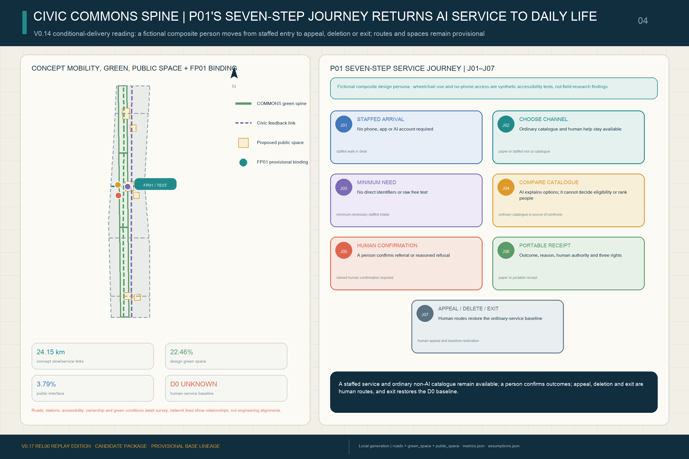

## Blue-Green Network, Public Space, and Urban Character

The railway heritage park is COMMONS for the whole network rather than a technology showroom. The green-space layer is derived directly from the three 1401 cells, with zero geometry difference. V0.17 retains three registered AI landmarks for evidence stability but makes each a tangible public-space prototype. **Protocol Station Zero** in AI Origin is a low-threshold SOURCE/PROVE validation pavilion with physical trial cards, an accessible information counter and staffed fallback. The **Civic AI Test Yard** in Zhongzhiyuan is an indoor-outdoor STACK/PROVE observation court with transparent safety edges, a public viewing walk, physical emergency stop and visible energy metering. The **Jing-Zhang Commons Ledger** in Dazhongsi is an updateable public gallery from LIVE & MARKET to COMMONS, using a tactile timeline, replaceable version panels and multilingual/accessibility interfaces to retain contributions, corrections, exits and failures [metric:landmark_count]. These registered names no longer form the overall brand. Exact sites, scale, construction and heritage relationships remain pending official and professional evidence [source:AGENT-TASKBOOK] [depth:blue_green_public_space].

The blue-green and public-space check returns the conceptual green layer and AI Origin interface to the design-depth evidence [data:geometry/green_space.geojson#GREEN-BUILD-001] [data:geometry/public_space.geojson#PUBLIC-TEST-001] [depth:blue_green_public_space]. The design green ratio is tracked separately from statutory controls [metric:green_ratio], while the integration of character, public space and building layout remains tied to the professional standard [standard:MOHURD-URBAN-DESIGN-MEASURES].

## Renewal Projects, Implementation Policy, and Phasing

Six concept renewal projects remain mapped to three evidence-gated packages [depth:renewal_project_list] [depth:phasing_implementation] [data:geometry/phasing.geojson#PHASE-001]:

| Project | Concept package | Principal dependency | Evidence |
| --- | --- | --- | --- |
| JZ-01 Public-green-spine gap repair | P1 public spine and seven-interface lead | road redlines, underpass space, accessibility and traffic review | [data:geometry/roads.geojson#ROAD-SPINE-001] |
| JZ-02 Zhongzhiyuan innovation green edge and public test route | P1 public spine and seven-interface lead | river/ecology/flood conditions and separation of test/observation routes | [data:geometry/green_space.geojson#GREEN-BUILD-001] |
| JZ-03 AI Origin near-campus translation and review station | P2 western R&D and professional validation | campus boundary, ownership, building survey and service operator | [data:geometry/buildings.geojson#BLDG-TEST-002] |
| JZ-04 Dazhongsi station-city and four-quadrant walking link | P3 eastern daily service and urban diffusion | station exits, crossings, utilities and pedestrian-flow review | [data:geometry/roads.geojson#ROAD-LIVE-001] |
| JZ-05 AI public-service and low-carbon-compute observation node | P2 western R&D and professional validation | energy, compute, safety, fire and operator conditions | [data:geometry/public_space.geojson#SCENARIO-S10] [data:geometry/constraints.geojson] |
| JZ-06 Jing-Zhang Breaks New Ground Assembly and public experience route | P3 eastern daily service and urban diffusion | public-space permit, independent evaluation, event safety and rights clearance | [data:geometry/phasing.geojson#PHASE-003] |

The three packages are dependencies, not near/mid/long-term promises. **P1 COMMONS / ENABLE lead** repairs the public green spine and establishes service baselines, seven interfaces, human fallback and incident routes. **P2 SOURCE / STACK / PROVE formation** advances research, shared full-stack facilities and real-world validation only after ownership, building survey, professional safety, energy and transport conditions are verified. **P3 LIVE & MARKET diffusion** expands daily service, market use and communication only after independent evaluation, appeal capacity, interoperability, first-use-procurement boundaries and exit plans are demonstrated [data:geometry/phasing.geojson#PHASE-001] [data:geometry/phasing.geojson#PHASE-002] [data:geometry/phasing.geojson#PHASE-003]. The three polygons cover the provisional site with no material overlap [metric:phase_coverage_ratio]. Their dependency relation is independently indexed through the same three package geometries [data:geometry/phasing.geojson#PHASE-001] [data:geometry/phasing.geojson#PHASE-002] [data:geometry/phasing.geojson#PHASE-003]. Material overlap remains zero [metric:phase_overlap_area_sqm].

### Five Flagship Pilots and the First-Use Path

V0.17 organizes the twelve scenarios by official spatial roles as five implementation-discussion pilots: **FP01 AI Origin First-Use Station** (SOURCE + ENABLE), **FP02 Zhongzhiyuan Full-Stack Open Test Yard** (STACK), **FP03 Xiaoyue River Scenario Co-Test Network** (PROVE), **FP04 Dazhongsi AI Everyday Market** (LIVE & MARKET), and **FP05 Jing-Zhang Public Evidence Park** (COMMONS). FP05 is also the public observation, feedback and failure-evidence layer for the first four. This configuration responds to Beijing's published directions on a super AI test field, full-stack agents/interoperability, technology—industry—city integration and a human—AI symbiosis test field, without implying that this specific project, site, procurement or budget is approved or that this submission has been adopted [source:BEIJING-SUPER-AI-TESTFIELD] [source:BEIJING-AGENT-POLICY-2026] [source:HAIDIAN-JINGZHANG-MIDTERM-2026].

All five use a non-skippable five-gate path: **G1 technology readiness** verifies provenance, capability limits, baseline and accountable parties; **G2 bounded trial** limits time, space, users and data and drills human takeover; **G3 first-use procurement** requires public-readable evidence, a service baseline, exit terms and professional review before a contract can be considered; **G4 diffusion** tests cross-operator interoperability, portability and supplier diversity; **G5 standards/shared-capability output** places rights-cleared, de-identified methods, failure evidence and interfaces into COMMONS. Failure at any gate means modify or stop, not substitute a showcase. The shared 90-day gates are **D30 accountability and boundaries** (consortium, baseline, site/funding/data boundaries and stop conditions drafted), **D60 bounded co-test** (controlled trial, incident record, human takeover and non-digital fallback drill), and **D90 evidence decision** (public-readable results, professional review and a continue/modify/stop decision; only a pass may enter first-use-procurement or expansion discussions). Each consortium must confirm indicator definitions, baselines and targets at D30. The one-year fields below are disclosure requirements, not preset performance promises [depth:phasing_implementation].

To prevent a concept template from being presented as implementation-ready, every flagship and reversible component also passes five delivery hold points. They define **who must supply which evidence and how work stops when evidence is missing**; they do not invent named organizations, budgets or procurement facts [metric:delivery_hold_point_coverage_ratio].

| Hold point | Required before the next step | Present boundary / action when missing |
| --- | --- | --- |
| **H0 public problem and ordinary-service baseline** | User representatives and an accountable service role co-confirm the problem, human/non-digital process, D0 method and prohibited automated decisions | Not measured; stop the task if it cannot be confirmed |
| **H1 carrier and delivery accountability** | Survey, ownership/permission, accountable operating and maintenance roles, funding boundary and lawful procurement route | Formal site, parties, budget and procurement remain unconfirmed; retain `concept_only` status |
| **H2 professional and rights conditions** | Data authorization, safety, accessibility, non-digital path, and applicable transport, utilities, energy, fire and heritage checks | Any missing critical condition blocks real-user use or installation |
| **H3 independent evidence and remedy** | Separated procurement/operation/evaluation/appeal duties, failure record, independent review, appeal clock and restoration drill | No supplier self-certification; no replayable evidence means revise / stop |
| **H4 separate authorization and exit handover** | Statutory approval, procurement, legal/professional authorization, plus data disposal, component removal, human-baseline restoration and public record | Passing earlier gates is not permission; incomplete authorization means close and return |

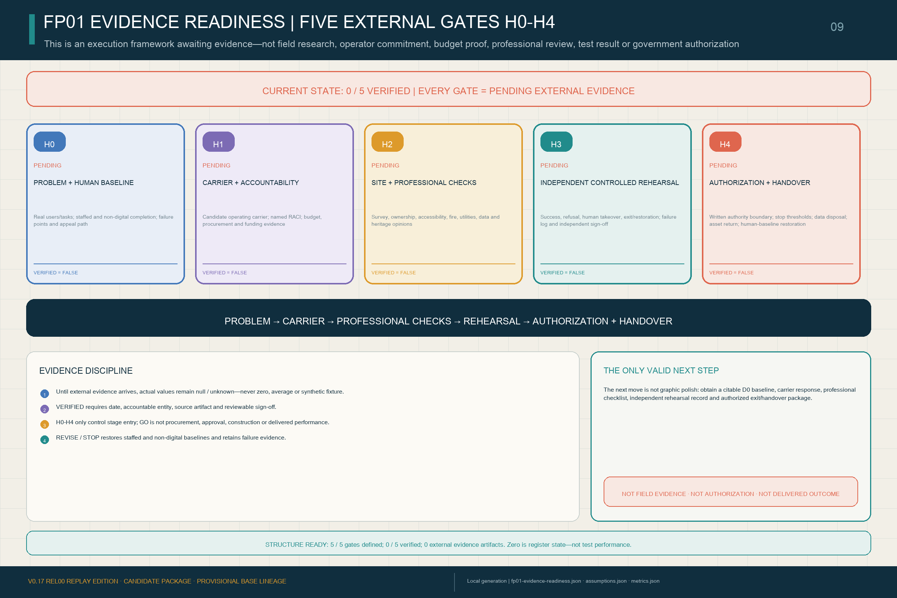

`visual/assets/fp01-evidence-readiness.json` decomposes every gate into **required artifacts, accountable roles, independent review, stop action and state transition**. Its verifier rejects a `verified` record without a date, signatory, source and review evidence. All five gates presently remain `pending_external_evidence`: H0 awaits a real problem and human baseline; H1 awaits surveyed carriers, named parties, budget and procurement route; H2 awaits applicable accessibility, fire, utilities, energy, transport, data and safety opinions; H3 awaits an independently controlled rehearsal with failure and restoration records; H4 awaits statutory authorization, exit and handover. Complete bilingual blank forms are in `assets/media/fp01-execution-workbook.md`, with a machine mirror in `visual/assets/fp01-execution-kit.json`. They are evidence-acquisition and execution protocols—not completed due diligence or implementation proof [metric:fp01_evidence_verified_gate_count].

Public versions, Issues, PRs and machine checks from this open call can prove only that the co-creation process is traceable and revisable. Any future public human-judgment record likewise cannot populate FP01's site, users, baseline, budget, professional-review, rehearsal or authorization fields, and cannot turn the current `0/5` external-evidence state into a pass.

### V0.17 Pre-Feasibility and Conditional Delivery: Put Scale, People, Money, Maintenance and Exit Together

The three key areas now differ through technical interfaces, not only functional labels. Zhongzhiyuan separates a public observation line, bounded test line and operator safety line in a **24 × 12 m concept test interface**. AI Origin combines the choice gate, provenance panel, staffed desk and receipt dock in an **18 × 12 m concept first-use module**. Dazhongsi connects everyday service, dispute remedy and the contribution rail in a **30 × 6 m concept public-record interface**. The 1:20 layer uses a 3.0 × 2.4 m reference bay, 1.8 m clear interaction band and 0.75-2.10 m component-height band only to test connection, inspection, replacement and ordinary-use restoration for the six demountable components. These are original design envelopes—not existing dimensions, code conclusions, construction details or procurement specifications [metric:key_area_interface_prototype_count] [metric:fp01_pre_feasibility_scale_count] [metric:fp01_original_parameter_envelope_count].

D0-B01-B06 now define start and end events, numerator/denominator or time formula, missingness and reporting. Thirty tasks across at least three service days are only a **formative-observation floor** that accountable parties or applicable ethics/data review may raise or reject—not an obtained sample, statistical power or performance result [metric:fp01_d0_measurement_method_coverage_ratio]. H0-H4 also receive gate-by-gate role-class RACI while names, organizations, responsibility acceptance and signatures remain empty [metric:fp01_hold_point_raci_coverage_ratio].

V0.17 gives every hold point one `decision_owner_role` plus required co-signatory classes, for sixteen registered delivery-role classes in total; actual organizations, people, appointments, rosters and signatures remain empty [metric:fp01_delivery_role_class_count] [metric:fp01_hold_point_single_decision_owner_ratio]. A concept public window requires concurrent coverage for **frontline service and accessibility, human referral/refusal and appeal authority, and safety/operations and stop authority**. Supplier self-certification cannot replace independent evaluation. A staffing sensitivity template combines 20-40 public-window hours per week, three concurrent duties, 24-30 productive hours per FTE-week and a 1.15-1.35 relief factor into an illustrative 2.3-6.75 FTE envelope; it is not a workforce commitment. Released capacity takes the lowest of surveyed net-area/approved-person-area capacity, approved life-safety occupancy, verified accessible service positions and staffed-role coverage. Two conceptual independent exit paths and a 1.2-1.8 m route-width range become usable only after H1-H2 professional verification [metric:fp01_capacity_egress_template_count] [metric:fp01_staffing_fte_template_count].

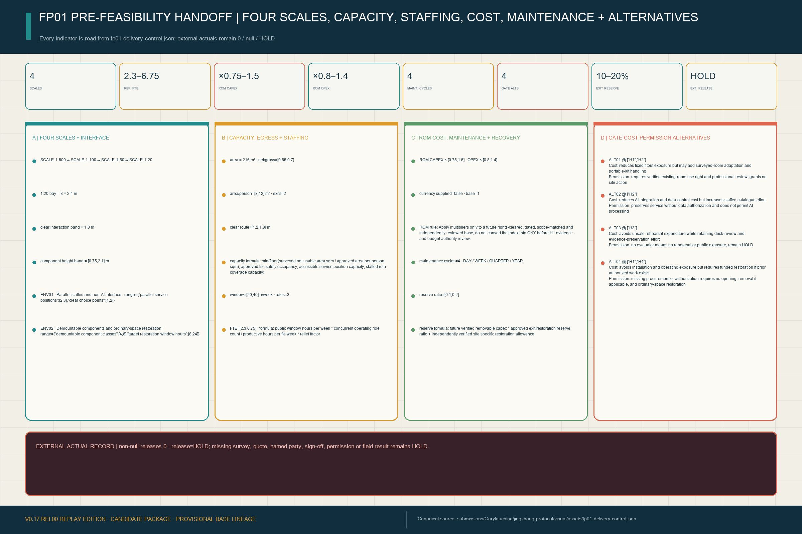

The one-kit design-test schedule records only minimum quantities for M01-M06. Seven cost classes cover survey/existing condition, reversible components, accessibility and staffed setup, hardware/connectivity, operations/maintenance, data/security/independent evaluation/public evidence, and removal/restoration/reserve. Amounts still follow `verified actual quantity × rights-cleared comparable unit cost + approved contingency` [metric:fp01_design_test_boq_item_count] [metric:fp01_cost_plan_class_count]. Only after a rights-cleared, date- and scope-matched base exists may ROM-LOW / REFERENCE / HIGH test CAPEX multipliers of 0.75 / 1.00 / 1.50 and OPEX multipliers of 0.80 / 1.00 / 1.40; no currency amount is supplied now [metric:fp01_rom_sensitivity_scenario_count]. The exit-restoration reserve proposes only 10%-20% of future verified removable CAPEX plus a separately verified site allowance; it is not a funded reserve [metric:fp01_exit_restoration_reserve_template_count]. Actual quantities, rates, amounts, funding, procurement and sign-off remain `null`, with zero verified cost inputs [metric:fp01_verified_cost_input_count].

K01-K10 connect parallel H0 problem confirmation and H1 carrier screening to professional checks, D0 baseline, rehearsal, decision, authorization and handover as a non-bypassable dependency path. It is a delivery-control model, not a committed programme [metric:fp01_critical_dependency_step_count]. AT01-AT12 divide acceptance into eight proposal-structure checks and four field/authorization checks; all six REL00-REL05 release stages retain `external_release_granted=false` [metric:fp01_acceptance_indicator_count] [metric:fp01_release_stage_count]. Maintenance operates on four cycles: daily before opening, weekly control, quarterly/material-change independent review, and annual/pre-renewal restore-or-renew decision [metric:fp01_maintenance_cycle_count]. ALT01-ALT04 map respectively to H1/H2 carrier, H2 data, H3 independent evaluation and H1/H4 procurement/authorization gates, with cost and permission tradeoffs visible; absent authority and evidence, each remains HOLD [metric:fp01_fallback_alternative_count] [metric:fp01_gate_cost_permission_alternative_mapping_ratio].

Seven execution forms turn the model into working surfaces for a professional team: carrier survey, responsibility acceptance, D0 observation, BoQ/cost basis, non-binding procurement package, professional/gate/acceptance review, and rehearsal/maintenance/exit handover, with 230 unique required fields [metric:fp01_execution_form_count] [metric:fp01_execution_required_field_count]. EX-06 covers all four rehearsal scripts—success, refusal, human_takeover and exit_restoration—while actual rehearsal and verified external execution records remain zero [metric:fp01_execution_rehearsal_event_class_coverage_ratio] [metric:fp01_execution_verified_external_record_count]. Every external artifact must also supply version, source, method/sample, limitations/missingness, rights/publication class, conflicts, independent review, disposition, sign-off and SHA-256. All eighteen receipt fields are empty and accepted external receipts remain zero. Complete blank forms prove only that handoff interfaces exist—not that real parties accepted the work [metric:fp01_external_evidence_receipt_required_field_count] [metric:fp01_accepted_external_evidence_receipt_count].

#### FP01: One 100-Day First-Use Contract, Not Three Showcases

V0.17 makes FP01 the first implementation-discussion prototype for the capability chain. **S07 is the only user-facing service problem; S03 performs independent evaluation only; and S04 provides interface and receipt support only.** They are neither three parallel showcases nor proof that a service owner has confirmed a real demand. The package currently registers only `FP01-S07-PROBLEM-001`, a **candidate problem to be co-confirmed by an accountable service owner and user representatives at D0**, with equal human-only service, refusal, takeover and exit paths. `FP01-CONTRACT-001` binds one service, provisional AI Origin carriers, accountable roles, evidence gates and exit actions as an **unexecuted contract template**. Its fixed status is `concept_template_unexecuted`; it is not a government project, confirmed site, verified demand, procurement notice, award or signed contract [data:geometry/public_space.geojson#SCENARIO-S07] [metric:fp01_concrete_service_problem_count].

| Gate | Contract clauses and public evidence required | Action if not passed |
| --- | --- | --- |
| **D0 problem entry** | C01 human/non-digital service baseline and problem statement; users, prohibited automated decisions and current accountable party identified | Do not enter first use if there is no public problem or baseline |
| **D30 accountability and boundaries** | C02 separation of procurement, operation, evaluation and appeal roles; C03 model/interface version, provenance and capability limits; C04 site, funding, data, term and stop thresholds | Return for missing accountability or boundaries; no real-user test |
| **D60 bounded co-test** | C05 interoperability and portability evidence; C06 account-free/no-smartphone, accessible and human-takeover paths; C07 incident, appeal and public record; C08 stop, baseline-restoration and data-disposal drill | Freeze automation, restore the human baseline and retain failure evidence |
| **D90 independent decision** | C09 public-readable evidence pack covering passes, failures and uncertainty; C10 independent professional go / revise / stop decision with dissent recorded | Revise returns to the relevant gate; stop enters exit and handover |
| **D100 public handover** | C11 only after separate statutory procurement, legal and professional authorization may a revocable ten-day acceptance be discussed; C12 failure means no outcome payment, baseline restoration, data disposal, portable-asset return and failure-evidence retention | Missing authorization is a failure; D90 never substitutes for procurement |

Machine evidence confirms only that one template is registered, all five D0/D30/D60/D90/D100 gates are present and all twelve C01–C12 clauses are present [metric:fp01_first_use_delivery_contract_template_count] [metric:fp01_100_day_gate_coverage_ratio] [metric:fp01_contract_clause_coverage_ratio]. Fields and state transitions for four **synthetic receipt fixtures**—success, refusal, human_takeover and exit_restoration—can also be replayed [metric:fp01_receipt_event_type_coverage_ratio]. These structures do not prove execution, live receipts or completed deletion; the actual number of first-use procurements remains `unknown` [metric:flagship_first_use_procurement_count].

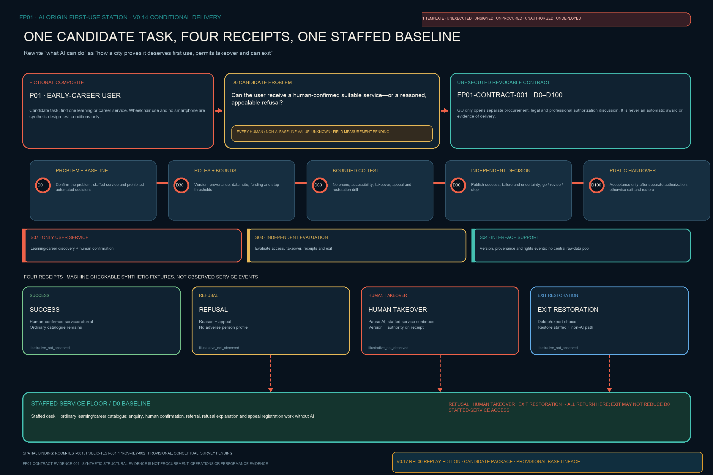

| Pilot / scenarios | Proposed operating-role consortium | Pilot-specific 90-day evidence | One-year fields to disclose | Funding, space, and data boundaries |
| --- | --- | --- | --- | --- |
| **FP01 AI Origin First-Use Station**: S03 multimodal evaluation + S04 AI City API access + S07 learning/career collaboration; SOURCE → ENABLE [data:geometry/public_space.geojson#SCENARIO-S03] | universities/research teams, open-source community, professional evaluator, public/park service operator, talent/IP services and accessibility representatives; procurer and evaluator separated | D30 capability/data/accountability cards and first-use problem list; D60 interoperability, human referral and account-free route test; D90 public evaluation, appeal drill and first-use/modify/stop recommendation | actual-denominator access/interoperability success, human-referral completion, no-account service availability, issue closure time, first-use contracts and cross-organization reuse, with failures/exits | only a conceptual mix of scenario access, professional evaluation, service procurement and research/standards funds; provisional AI Origin carriers, not confirmed premises; public, authorized or minimum-necessary data only; no automated education/employment eligibility decision |
| **FP02 Zhongzhiyuan Full-Stack Open Test Yard**: S01 model/agent safety sandbox + S10 low-carbon compute/energy observatory; STACK [data:geometry/public_space.geojson#SCENARIO-S01] [data:geometry/public_space.geojson#SCENARIO-S10] | model/agent and chip/compute firms, testing/certification and cybersecurity teams, energy/park operator, university labs and independent professional observers; vendors may not self-certify | D30 fixed versions, compute/energy baseline, red-team scope and stop threshold; D60 safety stress, failover, human stop and meter calibration; D90 publish passed and failed cases, energy uncertainty and external-trial decision | test completion/failure distribution, incidents/near misses, human-stop drills, energy per task and metering completeness, reuse of interfaces/test methods and progression by gate; no cherry-picked best result | conceptual facility access, operator co-funding and research/standards validation only; ownership, fire, energy-capacity and route-separation checks required; tiered access for model/log/energy data, with rights-cleared aggregates/methods in public |
| **FP03 Xiaoyue River Scenario Co-Test Network**: S02 embodied AI street lab + S05 public-service navigation + S06 inclusive mobility + S08 health-service wayfinding; PROVE [data:geometry/public_space.geojson#SCENARIO-S02] | subdistrict/community and park operating roles, robot/service providers, mobility/accessibility professionals, health-service referral role, site safety stewards and resident/user representatives | D30 node-specific time-space geofences, prohibited cases, human baseline and complaint route; D60 supervised movement, failure, referral and emergency-stop co-test; D90 decide continue, adjust nodes or stop from incidents, access, completion and public feedback | safe trial periods/tasks, interventions/near misses, accessible and no-smartphone route availability, service-referral completion, complaint closure and conventional-service continuity; no diagnostic-performance claim | only conceptual public-space trial management, operator input and professional evaluation; “network” means a proposed collaboration between the Xiaoyue River Scenario Enablement Wing and existing public spaces, not a confirmed route; river, flood, transport, ownership and ecology evidence remain pending; no routine face recognition, resident commercial profiling or autonomous diagnosis; minimum raw-sensing retention |
| **FP04 Dazhongsi AI Everyday Market**: S11 AI-native commerce/creative market + S12 civic deliberation/evidence observatory; LIVE & MARKET [data:geometry/public_space.geojson#SCENARIO-S11] [data:geometry/public_space.geojson#SCENARIO-S12] | commercial/cultural operators, large and small firms/creators, consumer-rights and copyright professionals, payment/data services, district operations and civic deliberation representatives; platform, merchant and dispute reviewer traceable | D30 product/content provenance, notice, fees, refund and human-service baseline; D60 transaction, copyright-dispute, complaint and system-exit test; D90 publish demand, remedy and first-use-procurement/market-diffusion decision | actual use/repeat use, retained human service, provenance/rights completeness, dispute/remedy time, supplier diversity, first-use procurement and cross-scenario diffusion; footfall is not a public-value proxy | conceptual operator investment, service procurement and compliant market revenue; station-city, green-space co-use, ownership, pedestrian-flow and heritage review required; purpose-limited, opt-out transaction/recommendation data; no reuse of public-service data for commercial profiling |
| **FP05 Jing-Zhang Public Evidence Park**: S09 living heritage trail; COMMONS and the observation/feedback layer for FP01–FP04 [data:geometry/public_space.geojson#SCENARIO-S09] | heritage/park operator roles, archivists/historians, accessible/multilingual content team, first-four pilot representatives, community participants, independent reviewers and open-source maintainers | D30 source, content-rights, public-evidence and correction rules; D60 multilingual/accessible trail and observation-feedback entry test; D90 publish corrections, failures, continue/stop decisions and a first reusable method pack | sourced-content coverage, accessible/multilingual reach, public corrections/closure, evidence-release completeness for FP01–FP04, retained failure cases and reuse of methods/interfaces; one-off attendance is not the sole outcome | conceptual park operations, public culture, research/standards and social collaboration only; heritage route awaits heritage, ownership, trees, traffic and park permission; rights-cleared sources, de-identified operating evidence and authorized feedback only, protecting complainants and participants |

All five remain `concept_only` operating/spatial bundles, not confirmed government pilots, procurement lists, site permits, contracted consortia or funding arrangements. First-use procurement is an optional G3 translation instrument; it cannot bypass statutory procurement, planning approval, professional safety review or competition. G5 outputs are proposals for further consideration by competent authorities, standards bodies and open-source communities.

### Trusted Operations Layer: Civic Capability Return Mechanism

“Return” does not transfer city data or public authority to a technology provider. It safely hands service capability back to the public and urban operating system when a term ends, a material version changes, evidence fails, an appeal remains unresolved, an operator withdraws, or rights, data or engineering conditions no longer hold. V0.17 retains the three registered BUILD, TEST and LIVE capacity-return nodes [metric:capacity_return_node_count]. They respectively return open methods and failure evidence; app-free services and accessibility repair; and appeal, remedy and public memory [data:geometry/public_space.geojson#RETURN-BUILD-001] [data:geometry/public_space.geojson#RETURN-TEST-001] [data:geometry/public_space.geojson#RETURN-LIVE-001]. All twelve Return-Ticket-required scenarios resolve to the appropriate node, giving reference coverage of 1.0. This proves machine-reference closure, not delivered capability [metric:return_ticket_reference_coverage_ratio]. All three are `concept_only` point indices, not existing institutions, operators or construction commitments.

The process spans all three dependency packages and is governed by [depth:phasing_implementation]:

1. **Trigger and freeze:** stop affected automated functions rather than expand under uncertainty.
2. **Restore the baseline:** switch to human or non-digital service so the essential service continues.
3. **Port and hand over:** transfer records, interfaces and portable components needed to sustain service, as declared in advance.
4. **Close data and space:** delete/archive data according to purpose and propose removal/return of reversible equipment and public-space restoration.
5. **Leave public memory:** record the decision, reason, impact, accountable party and version change with public access and appeal.
6. **Enter the next version:** send operating and failure evidence to LEARN/UPDATE as input to the next trusted-operations revision.

This is a design mechanism for further legal, data, operational, planning and engineering work—not current policy, a legal duty, signed contract or deployed process.

COMMONS need not wait for a future pilot before receiving its first proposed materials. Subject to rights clearance and public-disclosure limits, the already public taskbook versions, relationships among Agent proposal versions, sources and assumptions, machine checks and Issue/PR corrections, together with any future public human-review conclusions and disclosed reasons for adoption, non-adoption or revision, could form the first materials for the proposed **Jing-Zhang Co-Creation Archive, Volume 0 / 京张共创档案·第 0 卷**. FP05 Public Evidence Park, the M06 Contribution Rail and the three landmarks could carry this proposed archive together. It should retain not only selected work but also failures, dissent, withdrawals and unused methods. This would be a public process history—not an honour award or retrospective claim of implementation [source:OPEN-CALL-PROJECT-STATEMENT] [source:AGENT-TASKBOOK].

The proposed rhythm is quarterly flagship-pilot open days, semiannual evidence review, an annual **Jing-Zhang Breaks New Ground Assembly**, and a continuous public version log. Developers/operators submit test and market evidence; residents/users raise questions or appeals; professional teams assess spatial, technical, commercial, legal and ethical impacts; and the public record explains why a pilot advances a gate, scales, changes, pauses or ends. This is an operating concept, not a confirmed organizer event, budget or policy commitment [source:AGENT-TASKBOOK] [depth:phasing_implementation].

## Metrics, Area Recalculation, and Compliance Matrix

V0.17 separates official approximate scope figures, reproducible design geometry and missing statutory/engineering controls. Known spatial metrics are recalculated from GeoJSON in EPSG:4548; missing controls remain `unknown`, never zero or average. SITE-001 is about 11.413 km²; land-use and phase coverage remain 1.0 with no material overlap [depth:metrics_recalculation] [metric:site_area_sqm] [depth:land_use_layout]. The application layer retains twelve scenarios, three industry validations, seven protocol classes, three landmarks and six renewal projects [metric:scenario_node_count] [metric:protocol_interface_count].

The six conversion-capability stages are registered as a count of 6, and structural mapping across stable roles, the five flagship pilots and the trusted-operations layer is registered at 1.0 [metric:application_capability_stage_count] [metric:application_capability_mapping_coverage_ratio]. This proves proposal-internal mapping completeness only; it does not prove procurement, deployment, external adoption, standards output, public benefit or global leadership.

The unified brand evidence registers five architecture layers, mapped flagships and five contribution classes [metric:brand_architecture_layer_count] [metric:brand_flagship_mapping_coverage_ratio] [metric:honor_contribution_class_count].

The public-space component evidence separately registers six reversible components, component coverage across three landmarks and all H0—H4 hold points [metric:reversible_public_space_component_count] [metric:landmark_component_mapping_coverage_ratio] [metric:delivery_hold_point_coverage_ratio]. These values prove concept-system completeness only—not logo approval, delivered events, recognition granted, installed components or delivery readiness.

V0.17 further turns H0-H4 from concept hold points into a separate evidence register. It contains five gates with definition coverage of 1.0 [metric:fp01_evidence_gate_count] [metric:fp01_evidence_gate_definition_coverage_ratio].

Externally verified gates and verified external artifacts both currently equal zero [metric:fp01_evidence_verified_gate_count] [metric:fp01_external_evidence_artifact_verified_count]. The first two values prove template completeness only. The two zeros expose missing field and authorization evidence and must not be read as operating performance.

The delivery-control book separately registers three key-area technical interfaces, six D0 measurement methods and H0-H4 RACI, with complete coverage for the latter two [metric:key_area_interface_prototype_count] [metric:fp01_d0_measurement_method_coverage_ratio] [metric:fp01_hold_point_raci_coverage_ratio]. These values prove complete professional-deepening entry points, not actual observation or accepted responsibility.

The one-kit design-test schedule contains six items and the critical dependency path ten steps [metric:fp01_design_test_boq_item_count] [metric:fp01_critical_dependency_step_count]. Actual quantities, costs, budgets, procurement, entities and signatures remain empty, so structural counts cannot be added to implementation maturity.

The V0.17 handoff further registers sixteen delivery-role classes, one decision owner at each hold point and twelve acceptance indicators—eight proposal-structure and four field-dependent [metric:fp01_delivery_role_class_count] [metric:fp01_hold_point_single_decision_owner_ratio] [metric:fp01_acceptance_indicator_count].

Six conditional-release stages, four reversible alternatives and seven cost classes form a stoppable implementation handoff rather than an automatic delivery path [metric:fp01_release_stage_count] [metric:fp01_fallback_alternative_count] [metric:fp01_cost_plan_class_count].

External releases, verified cost inputs and authorized site actions documented in this package all remain zero. These zeros mean that the package has no attributable record; they do not claim that no external activity, cost or risk exists [metric:fp01_external_release_granted_count] [metric:fp01_verified_cost_input_count] [metric:fp01_documented_authorized_site_action_count].

The flagship structure is machine-registered: there are five concept pilots, and all twelve scenarios belong to exactly one pilot, giving coverage of 1.0 [metric:flagship_pilot_count] [metric:flagship_scenario_bundle_coverage_ratio]. All five record an operating consortium, 90-day gates, one-year disclosure fields, funding/space/data boundaries and the five-gate path, so both structure-coverage measures are 1.0 [metric:flagship_implementation_plan_coverage_ratio] [metric:flagship_lifecycle_gate_coverage_ratio]. This proves record completeness, not implementation performance.

Actual first-use procurements and market-diffusion adoptions remain `unknown` [metric:flagship_first_use_procurement_count] [metric:flagship_market_diffusion_adoption_count]. Published standards and independently verified public-benefit outcomes also remain `unknown` [metric:flagship_published_standard_output_count] [metric:flagship_verified_public_benefit_count]. Definitions, baselines and targets must be fixed at D30 and updated from real operation.

The trusted-operations evidence retained from V0.6 contains three nested street rooms, seven interface entities and three human journeys [metric:protocol_street_room_count]. It also contains three capacity-return nodes, with application-scenario return-reference coverage of 1.0 and interface-entity-to-room resolution coverage of 1.0 [metric:capacity_return_node_count]. Nested-room union accounting leaves public-space area and ratio unchanged; point features are concept indices, not confirmed siting.

In the evidence-status summary, FP01 still has five fully defined gates but zero externally verified gates and zero verified external artifacts; this is an acquisition protocol, not proof of site, operator, budget, professional review, rehearsal or authorization [metric:fp01_evidence_verified_gate_count]. Its delivery-control summary registers three key-area interfaces, six measurement methods, five-gate RACI, six design-test quantity items and ten critical-dependency steps; actual dimensions, quantities, prices, budgets, entities, signatures and results remain empty [metric:fp01_design_test_boq_item_count].

The evidence chain is `source → judgment → geometry/metric → figure/drawing → matrix → self-check`. Regulatory total floor area, FAR, building density, height, setbacks, road area and road ratio remain explicitly unknown until official controls, surveys and rights-cleared professional data are available [metric:total_floor_area_sqm] [metric:floor_area_ratio] [metric:setback_m].

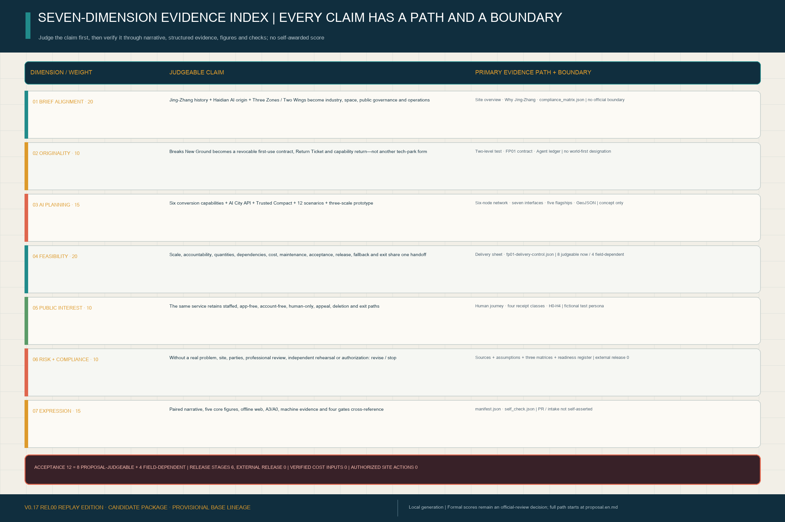

## Risk, Copyright, and Compliance

The package provides paired Chinese/English proposals, offline HTML, A3 booklets, A0 boards and text-bearing figures. Sources, licences and authorization status are recorded in `sources.json` and `report/copyright_statement.md`; the HTML uses no remote scripts, map tiles, remote fonts, iframes, forms or external APIs and does not track reviewers. To avoid depending on a Chinese system font in the review environment, the four HTML files share one local CSS asset containing only the Noto Sans SC WOFF2 glyph subset needed by the current pages. The font is pinned to a Google Fonts revision and used under the SIL Open Font License 1.1; it provides offline typographic portability only and is not planning evidence [source:FONT-NOTO-SANS-SC]. Package scope and missing-data boundaries remain indexed in the site package, empty constraint layer and risk-depth record [source:SITE-PACKAGE] [data:geometry/constraints.geojson] [depth:risk_missing_data].

Public-source boundaries, privacy protection, copyright permission, human review and implementation compliance use separate gates. This package cites only public or licensed material recorded in the source register; any later non-public material must not enter the public package without rights, confidentiality and personal-information review. Real interviews, observation logs, receipts or incident records must first be minimized and de-identified, then reviewed by a non-supplier role for scope, consent status and disclosure level. Material lacking authorization, a lawful handling basis or traceable provenance cannot advance H0-H4 or support an implementation-performance claim.

The `JZ SWITCH MARK` is an original concept direction generated for this package's structural communication. It does not copy or use a national emblem, government insignia, railway-company identity, entrant trademark or third-party official visual identity, and it is not authorized as an official government or project logo. The Contribution Record currently names no recipient and is not a government honour, technical certification or commercial ranking.

Generative-AI service rules enter later compliance review only where an actual function falls within the applicable scope, including content marking and complaint handling [standard:GENERATIVE-AI-INTERIM-MEASURES]. Accessible information, staffed service and non-digital fallback use the barrier-free law and older-adult smart-technology policy as deepening references; this proposal does not misrepresent those references as completed statutory acceptance [standard:BARRIER-FREE-ENVIRONMENT-LAW] [standard:ELDERLY-SMART-TECH-PLAN-2020-45].

This proposal interprets the open call as an early institutional example of AI participating in complex public-interest professional work and as a public, auditable window into China's AI application and governance capacity. This is a **design judgment** based on the public task mechanism and process record—not a government-conferred historical designation, national-pilot status or proof of global leadership. What can presently be verified is Agent participation, structured tasks, public versioned collaboration, machine checks, and the rule and authority boundary reserving final judgment for people and professional teams. Formal judgment, public-knowledge return, selection, adoption, implementation and long-term historical significance remain separately observable outcomes [source:OPEN-CALL-PROJECT-STATEMENT] [source:AGENT-TASKBOOK] [source:SUBMISSION-INTAKE-PR-4017].

This proposal does not claim designation as a national pilot, government authorization, adoption of this submission, official approval, enacted regulation, final ownership, confirmed construction scale, engineering feasibility, funding, proven global leadership or guaranteed implementation. V0.17 resets the overall narrative as six conversion capabilities, their stable six-node network and a trusted-operations layer, and bundles the twelve scenarios into five conceptual flagship pilots without changing the provisional V0.3 spatial evidence base. The three nested street rooms, seven interface entities, three human journeys, three capacity-return nodes and related metrics registered in V0.6 remain trusted-operations evidence. All entities, pilots, brand layers, contribution classes, landmarks, reversible components and H0—H4 hold points are `agent_generated_design`, `conceptual_not_statutory` and `official_siting=false`. Nested rooms do not increase unioned public-space area; interface, journey and return points are spatial-responsibility indices. Pilot names, consortia, 90-day gates, one-year indicators and funding arrangements are not government permits, confirmed sites, statutory processes, procurement decisions, signed contracts or deployed services. Missing official and professional inputs remain deepening prerequisites rather than invented facts [depth:risk_missing_data] [source:SITE-PACKAGE] [data:geometry/constraints.geojson].

## References

- Official open-call announcement and local reference snapshot.
- Cleared Agent open-call taskbook and structured requirements.
- Repository design brief, data source registry and provisional-geometry basis [source:SITE-PACKAGE].
- Local professional reference snapshots for urban design, regulatory detailed planning and land-use classification.
- Complete machine-readable evidence remains in the submission sources, metrics, GeoJSON and matrices.
