# 京张，再次开路 / JING-ZHANG BREAKS NEW GROUND

**两轮工业革命，一次中国角色转变：上一轮，在学习、吸收和转化西方铁路工业体系中实现自主筑路；这一轮，以真实城市试验争取参与定义并引领 AI 工业革命。**

从 Agent 参与真实城市设计，到 AI 进入真实城市服务：前者已有公开记录，后者仍待外部实证。

一名不依赖智能手机、以轮椅通行为无障碍测试条件的早期职业阶段使用者，能否在一个有人值守的窗口完成一次学习或职业服务转介；AI 失效、含糊或被拒绝时，人工服务能否立即恢复？

*设计史观与战略目标｜概念提案｜合同模板未执行｜不代表国家级试点认定、政府授权、采购、实施、世界首创或已证明全球领先*

## V0.17 REL00 推演版：让“可实施”从模板进入可复现回放

V0.17 从已合并且获 `review/intake-accepted` 的 V0.16 出发；PR #4313 的最终 Review Agent 咨询性结果为 96/100、`formal-review-ready` 与 `featured-candidate`，其中唯一的 4/5 是可实施性 [source:SUBMISSION-INTAKE-PR-4313]。同一实施核心曾在 V0.15 的 PR #4308 获可实施性 5/5 与咨询性 100/100 [source:SUBMISSION-INTAKE-PR-4308]，说明 4→5 没有公开的机械锚点，也不能靠虚构外部证据关闭。V0.17 因而保留四尺度、容量/疏散、人员/FTE、ROM、维护、退出储备、七类执行空表及全部 `null / unknown / HOLD` 外部状态，只增加一项参与者真正完成的工作：以标准库脚本回放 4 个正向状态转换和 8 个 fail-closed 故障注入，并把官方可实施性四要素压成一张可复核裁定页。96 与 100 都只是咨询性自动评审，不是正式评委得分，也不保证本版结果。

| 阅读用时 | 先回答什么 | 建议证据路径 |
| --- | --- | --- |
| **30 秒：一个裁定** | 为什么必须是京张；中国如何从上一轮的学习转化与自主突破，走向这一轮争取定义并引领；AI 应以什么边界进入城市 | 首页“两轮工业革命”命题 → “为什么是京张” → 总体空间图 → “一个人、一件事、一份可撤销合同” |
| **3 分钟：一条闭环** | 三区两翼、三重点区、五旗舰如何落到 FP01；失败后如何回到人工服务 | 总体空间（含三片区/五旗舰） → 双层验证 → FP01 四尺度 → 预可行性判定 → 条件交付与退场 |
| **15 分钟：一条证据链** | 七项评分维度各自凭什么成立；哪些能现在判断，哪些必须继续 HOLD | 完整正文 → `metrics.json` 与三矩阵 → FP01 五份结构化证据及校验器 → `assets/media/fp01-execution-workbook.md` → 双语 HTML、A3/A0 与 `self_check.json` |

### 七维证据索引

| 正式维度 / 权重 | 一句话判断 | 主要可核查位置 |
| --- | --- | --- |
| 任务书相关性 / 20 | 从京张历史、海淀 AI 源头创新和三区两翼出发，回应产业、空间、公共治理与长期运营 | “为什么是京张”、`assets/figures/site-overview.png`、三层范围、`compliance_matrix.json` |
| 原创性 / 10 | 把“开路”转译为可撤销的城市首用合同、回程票和能力返还，而不是新的科技园造型 | 双层验证、可信运行层、`visual/assets/fp01-contract.json`、`visual/assets/agent-participation-ledger.json` |
| AI 与城市规划创新性 / 15 | 六项城市转化能力、AI City API、可信应用公约、十二场景与空间原型共同构成城市级应用系统 | 六节点网络、七接口、五旗舰、四尺度原型、`geometry/public_space.geojson` |
| 可实施性 / 20 | 四尺度、容量/疏散、责任/FTE、数量、依赖、ROM 成本/运维、维护、验收、备选与退场进入同一决策包；REL00 接口已完成 12 例合成回放 | 本页“可实施性判定”、`visual/assets/fp01-delivery-control.json`、`visual/assets/fp01-rel00-desk-replay.json` 及校验器、`assets/figures/fp01-implementation-verdict.png` |
| 公共利益与包容性 / 10 | 同一服务必须保留有人、无手机、无账号、纯人工、申诉、删除和退出路径 | 人物旅程、四类回执、公共空间组件、`visual/assets/fp01-evidence-readiness.json` |
| 风险与合规 / 10 | 真实问题、场地、主体、成本、专业复核、授权和结果缺一不可，缺证只可 revise / stop | `sources.json`、`assumptions.json`、`standard_matrix.json`、`design_depth_matrix.json`、`compliance_matrix.json`、`report/copyright_statement.md` |
| 表达完整度 / 15 | 中英正文、官方自动评审固定读取的五组核心图、离线网页、A3/A0、机器证据和四门自检可相互追溯 | 五组核心图为 `site-overview`、`land-use-structure`、`key-areas`、`mobility-bluegreen`、`metrics-evidence` 中英配对；总索引见 `manifest.json` 与 `self_check.json` |

### FP01 可实施性判定：现在能判断什么，仍不能放行什么

参赛者可控制的交付结构现已压缩为 **3 个重点区界面、1:500—1:100—1:50—1:20 四个空间尺度和 6 项 D0 方法** [metric:key_area_interface_prototype_count] [metric:fp01_pre_feasibility_scale_count] [metric:fp01_d0_measurement_method_coverage_ratio]。它设置 **5 道 H0—H4 门、16 类交付角色，且每门只有 1 个决定责任角色** [metric:fp01_evidence_gate_count] [metric:fp01_delivery_role_class_count] [metric:fp01_hold_point_single_decision_owner_ratio]。

同一交接登记 **6 行设计测试数量、10 步关键依赖和 7 类成本** [metric:fp01_design_test_boq_item_count] [metric:fp01_critical_dependency_step_count] [metric:fp01_cost_plan_class_count]。放行侧另设 **12 项验收、6 个条件释放阶段和 4 种可逆备选** [metric:fp01_acceptance_indicator_count] [metric:fp01_release_stage_count] [metric:fp01_fallback_alternative_count]。

其中 **8 项方案结构现在可判断，4 项仍依赖真实问题/基线、场地/专业条件、独立复演与另行授权** [metric:fp01_immediately_judgeable_acceptance_indicator_count] [metric:fp01_field_dependent_acceptance_indicator_count]。当前登记的外部放行、经核实成本输入和本包所载授权现场动作均为 **0**；“0”只表示本包没有可归属记录，不表示零成本、零风险或对全部外部活动作事实判断 [metric:fp01_external_release_granted_count] [metric:fp01_verified_cost_input_count] [metric:fp01_documented_authorized_site_action_count]。

| 官方可实施性判据 | 参赛者可控制且已交付的证据 | 当前状态 | 外部触发与责任 | 停止规则 |
| --- | --- | --- | --- | --- |
| 阶段路径 | D0—D100、K01—K10、REL00—REL05 形成不可跳级的依赖、决定和退出链 | 结构完整；实际日期为空 | H0—H4 责任角色取得可归属证据 | 任一依赖或签认缺失即保持原门 |
| 试点区域 | 三重点区概念界面与 1:500—1:20 四尺度接口，附容量/疏散设计包络 | 仅为参赛者设计假设；非测绘、非规范结论 | 组织方提供正式边界；场地/专业角色完成 H1—H2 | 未核实载体、通行、消防与无障碍前不得现场动作 |
| 参与主体 | 16 类角色、逐门唯一决定责任、职责分离、排班与 FTE 计算模板 | 角色结构可审；机构、姓名、排班、接受和签署为空 | 服务责任方、场地/预算方、独立评测与专业角色接受职责 | 未形成实名责任链不得开放公共服务 |
| 指标与数据边界 | 六项 D0 方法、十二项验收、完整证据接收字段和七类双语执行空表 | 方法和表单可审；真实样本、结果与外部附件均为 0 | 使用者/无障碍代表、服务方及独立复核者共同取得 H0—H3 材料 | 缺版本、方法、权利、局限、复核或签认即 `pending` |
| 成本、运维与退出 | 参数化 ROM CAPEX/OPEX 敏感性、人员覆盖、维护周期、恢复储备、ALT01—04 与门槛绑定 | 设计范围可复算；报价、正式概算、资金和采购为空 | H1 取得清权成本依据与预算/采购权力；H4 另行授权 | 成本/人员/维护/退出任一不可承受即替代、缩减或关闭 |

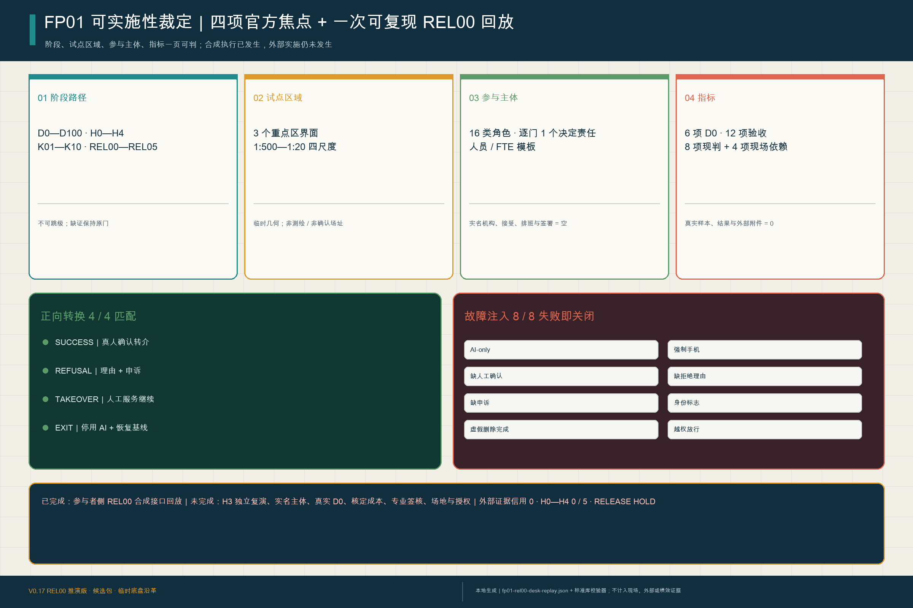

### REL00 参与者侧桌面回放：真实运行，严格不冒充现场

`visual/assets/fp01-rel00-desk-replay.json` 登记 **12 个合成案例**：成功、理由化拒绝、人工接管、退出恢复 4 个正向状态转换，以及 AI-only、强制手机、缺人工确认、缺拒绝理由、缺申诉、直接身份标志、虚假删除完成、越权放行 8 个故障注入 [metric:fp01_rel00_synthetic_fixture_count]。`visual/assets/verify-fp01-rel00-desk-replay.js` 不读取预先写好的“通过率”作为答案，而是从每个输入重新计算决定，再对照已记录结果；本次复算为 **4/4 正向转换匹配、8/8 负向控制失败即关闭** [metric:fp01_rel00_positive_transition_match_ratio] [metric:fp01_rel00_negative_control_block_ratio]。

这是一项已完成的**参与者侧设计时执行证据**，但只属于 `REL00 desk review and open correction`。它不是 H3 独立复演、真实用户测试、安全认证、专业签核或城市实施；进入 H0—H4 的外部证据计数仍为 **0**，外部放行仍为 `HOLD` [metric:fp01_rel00_external_evidence_credit_count] [metric:fp01_evidence_verified_gate_count] [metric:fp01_external_release_granted_count]。这种分层使“可运行”与“已落地”同时可审，不以更漂亮的模板替代责任主体和现场证据。

结构化决策包先锁定 **4 个尺度、2 个原创参数包络和 1 套容量/疏散模板** [metric:fp01_pre_feasibility_scale_count] [metric:fp01_original_parameter_envelope_count] [metric:fp01_capacity_egress_template_count]。

运营与成本侧另有 **1 套人员/FTE 模板、3 档 ROM 敏感性和 1 套退出恢复储备** [metric:fp01_staffing_fte_template_count] [metric:fp01_rom_sensitivity_scenario_count] [metric:fp01_exit_restoration_reserve_template_count]。

生命周期侧登记 **4 个维护周期、ALT01—04 对 gate/成本/许可的完整映射，以及 18 个外部证据接收必填字段** [metric:fp01_maintenance_cycle_count] [metric:fp01_gate_cost_permission_alternative_mapping_ratio] [metric:fp01_external_evidence_receipt_required_field_count]。

当前已接收的外部回执和预可行性外部放行均为 0 [metric:fp01_accepted_external_evidence_receipt_count] [metric:fp01_pre_feasibility_external_release_granted_count]。这些是结构完整度，不是成熟度自评分。

V0.17 继续采用“**京张总体空间 → 三处重点区域与五个旗舰 → FP01 一项任务 → H0—H4 实证门**”的评审顺序。首张总览图以官方“三区两翼”文字框架为上位依据，叠合临时 SITE/KEY 几何、京张公共证据脊、三处重点区域、五个概念旗舰和六项转化能力；它表达的是待官方边界校准的关系设计，不是新划法定分区、精确区位或确认项目 [metric:site_area_sqm] [metric:key_area_count] [metric:flagship_pilot_count]。

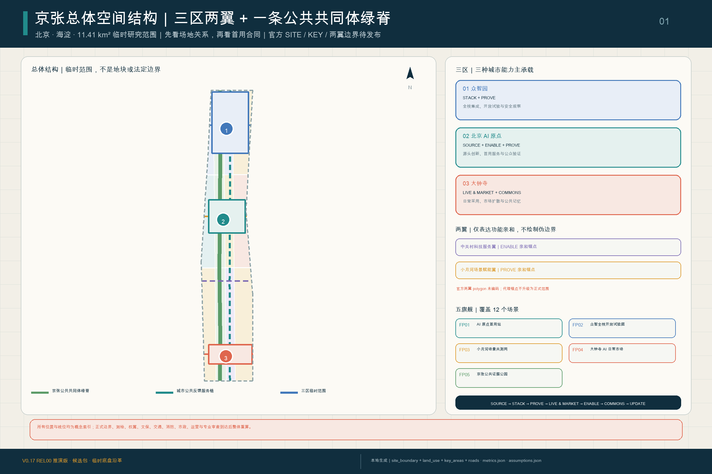

本版把“再次开路”明确为两个相连而不混同的证据层。**共创过程正在发生并已有公开修订闭环** [source:OPEN-CALL-PROJECT-STATEMENT] [source:AGENT-TASKBOOK]：PR #4306 记录 V0.14/V0.14.1 的缺陷发现、修复、咨询性 96/100、intake 与合并 [source:SUBMISSION-INTAKE-PR-4306]；PR #4308 记录 V0.15 确定性 PASS、咨询性 100/100、`formal-review-ready`、`featured-candidate`、intake 与合并 [source:SUBMISSION-INTAKE-PR-4308]；PR #4313 记录 V0.16 字体缺陷修复后的四门 PASS、咨询性 96/100、同样的两项推荐、intake 与合并 [source:SUBMISSION-INTAKE-PR-4313]。**正式评选、Gallery 发布、专业深化与城市实施仍未由这些记录证明**；咨询性分数不是正式评委得分，intake 与合并也不是采纳。城市层仍须取得场地、责任主体、人工基线、权利条件、专业审查、独立受控演练和另行授权；公开共创与 REL00 合成回放均不替代 H0—H4 外部实证 [standard:PROJECT-AGENT-OPEN-CALL-TASKBOOK]。

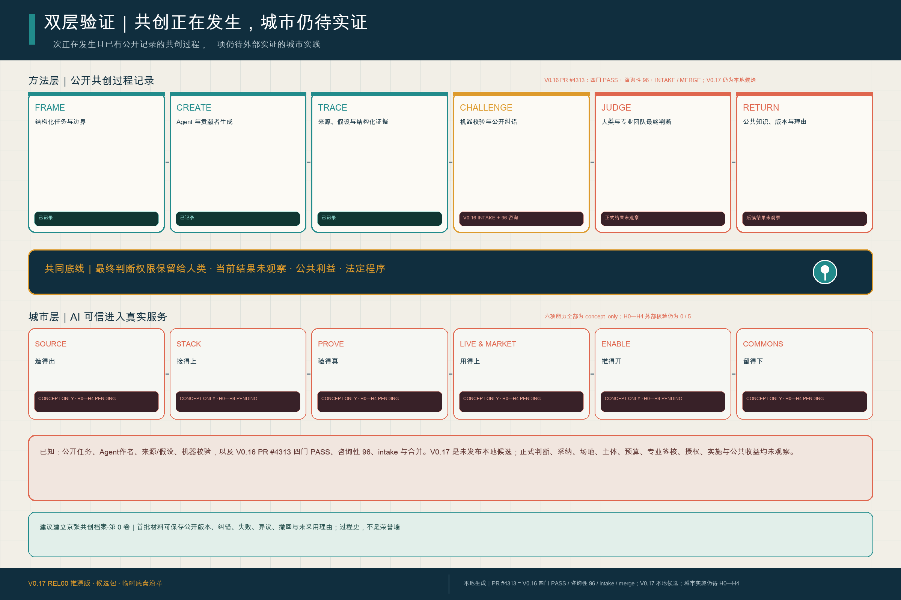

图中的“已记录”只表示存在公开、可追溯的过程材料。PR #4306、#4308 与 #4313 分别证明各自绑定版本的修复、仓库校验、咨询性评审、intake 与合并，不证明正式评选、Gallery 发布、采纳、实施、政府背书或国家级认定。V0.17 仍是本地候选版，尚未推送或创建新 PR；若以后发布，只有对应实时 PR 与官方标签构成状态证据。机器账本 `visual/assets/agent-participation-ledger.json` 将这些事实等级和人类权限边界逐项锁定。

H0—H4 的证据定义保存在 `visual/assets/fp01-evidence-readiness.json`；七类可打印、可逐项填写和签认的双语空表另存为 `assets/media/fp01-execution-workbook.md`，其机器镜像与反伪造校验分别为 `visual/assets/fp01-execution-kit.json` 和 `visual/assets/verify-fp01-execution-kit.js`。这些仍是空白执行工具。REL00 回放则是已经执行的合成设计时证据，但明确排除现场与外部证据信用；两类材料都不是已完成的尽调或实施证明。五道门的定义覆盖率为 1.0 [metric:fp01_evidence_gate_count] [metric:fp01_evidence_gate_definition_coverage_ratio]。

当前经外部材料核验通过的门为 **0/5**，经核验的外部证据附件为 **0** [metric:fp01_evidence_verified_gate_count] [metric:fp01_external_evidence_artifact_verified_count]。这两个零是证据登记簿的当前状态，不是测试失败率，也不把场地、主体、预算、专业审查、运行结果或授权伪装成已经取得；任何一门缺少日期、来源、责任人或独立复核，FP01 就停在原门。

V0.17 继续把这两个零作为当前证据状态，并把专业团队下一步必须完成的工作做成一册概念交付控制簿：三片区各有一张可逆界面原型，六项 D0 指标都有事件边界、公式、缺失值和报告口径，H0—H4 每门都有角色类 RACI [metric:key_area_interface_prototype_count] [metric:fp01_d0_measurement_method_coverage_ratio] [metric:fp01_hold_point_raci_coverage_ratio]。

同一控制簿还登记 M01—M06 单套设计测试数量与 K01—K10 关键依赖；实际工程量、单价、金额、主体、签署和日期保持空白，直到外部证据进入相应门 [metric:fp01_design_test_boq_item_count] [metric:fp01_critical_dependency_step_count]。

## 一个人、一件事、一份可撤销合同

V0.17 不再用三个平行场景解释 FP01，而先提出一个 **D0 待确认的候选服务问题**：一名虚构复合测试人物，能否在协议零号站的有人窗口，不依赖智能手机或 AI-only 路径，找到并由人工确认一项合适的学习或职业服务，同时取得可申诉、可删除、可退出的纸质或便携回执？人物不是实地调研对象，轮椅通行与无手机条件只用于检验最严格的无障碍和非数字服务底线；实际人物、需求频率和现有服务基线均须由责任服务方与使用者代表在 D0 共创、测量和确认 [data:geometry/public_space.geojson#ROOM-TEST-001] [metric:fp01_concrete_service_problem_count] [metric:fp01_observed_human_baseline_task_completion_rate]。

| 角色 | 在同一项服务任务中的职责 | 不能做什么 |
| --- | --- | --- |
| **S07 用户服务** | 查询普通目录，辅助解释，由职业/学习服务人员确认一次转介或有理由的拒绝 | AI 不决定录取、就业、资格、福利或人员排序 |
| **S03 独立评测** | 复核可用性、偏差、无障碍、人工接管和失败证据 | 供应商不能自证通过，也不向使用者另开一项服务 |
| **S04 API 支撑** | 交换目录出处、版本、回执、申诉、删除和退出字段 | 不汇聚原始个人数据，不批准服务结果或采购 |
| **D0 人工基线** | 有人服务台 + 普通纸质/电话目录完成同一任务 | 当前完成率、时长和申诉理解度均待实测，不用假定值填补 |

七步人物旅程只有一条主线：**到达有人窗口 → 选择 AI 辅助或纯人工 → 声明最少必要需求 → 对照普通目录 → 人工确认转介或拒绝 → 取得纸质/便携回执 → 申诉、删除或退出并恢复人工基线**。入口拒绝 AI 不降低服务等级；任何含糊输出、使用者请求或高等级权利风险都触发人工接管。`visual/assets/fp01-contract.json` 把旅程、D0—D100、C01—C12 和四类合成回执做成可由标准库脚本复核的设计证据，但这些回执不是运行记录 [metric:fp01_receipt_event_type_coverage_ratio] [metric:fp01_contract_clause_coverage_ratio]。

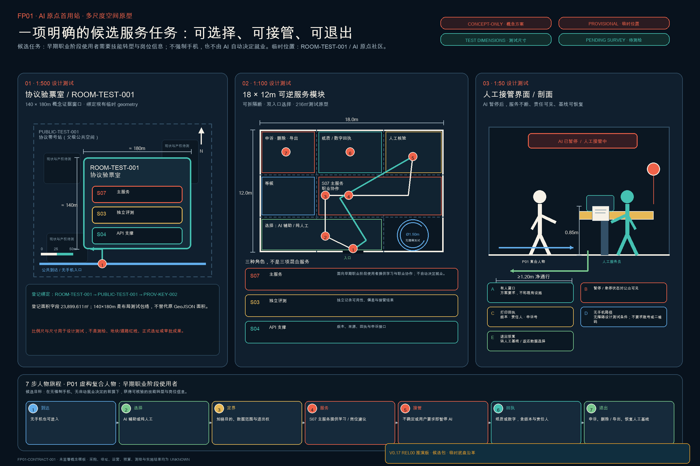

基础空间图把机制落到三个可继续深化的尺度：1:500 使用既有 `ROOM-TEST-001` 临时证据窗口检查到达、父公共空间与三种职责；1:100 使用 18×12 米可拆分模块检查双入口、人工核验、回执、申诉与轮椅回转；1:50 检查有人窗口、暂停状态、打印回执、无手机路径和退出恢复界面。V0.17 保留 V0.15 交付控制簿已增加的 1:20 可拆接口详图层，用于定义选择门、有人台、回执坞、急停与普通服务恢复之间的连接、检查与替换规则；它不把通用接口假设伪装成施工节点。基础图仍有 3 个空间原型尺度，预可行性交接合计 4 个尺度；它们均须在官方边界、现场测绘、权属、现行规范和运营共创后重做 [metric:fp01_spatial_prototype_scale_count] [metric:fp01_pre_feasibility_scale_count] [depth:three_key_area_detailed_design]。

四类示例回执分别记录：**成功**不等于 AI 决定资格；**拒绝**必须有理由、人工确认和申诉；**人工接管**要求普通目录继续可用；**退出恢复**要求 AI 停用、人工基线恢复，并由责任人另行确认删除或例外。示例只证明字段与状态转换齐全，不证明删除已经完成、服务已经运行或公共利益已经发生。

## 为什么是京张：两轮工业革命中的中国角色转变

中国的人工智能议程正在从单点技术突破走向规模化、体系化应用；国家“人工智能+”部署强调把 AI 同产业、民生和治理结合 [source:NATIONAL-AI-APPLICATION-ORIENTATION-2025] [source:STATE-COUNCIL-AI-PLUS-2025]。国家“十五五”相关部署进一步强调产业应用能力 [source:NATIONAL-FIFTEENTH-FIVE-YEAR-AI-APPLICATION-2025]。海淀提出超级 AI 试验场与“人机共融实验场”，并要求用规划确定性适配技术迭代的不确定性 [source:BEIJING-SUPER-AI-TESTFIELD] [source:HAIDIAN-JINGZHANG-MIDTERM-2026]。本方案把这些方向转译为一项可被质疑、测量和停止的城市设计命题，不把战略对齐误写成国家级试点认定、政府授权、获批规划或世界领先证明。

本次征集使第一层验证已经开始：Agent 读取机器可读任务，形成可由人和机器共同审查的专业成果，通过公开版本与 Issue/PR 接受纠错；筛选、专业深化和最终判断仍留给人类与专业团队，成果及过程记录可在权利与公开边界允许时进入公共知识库继续迭代。第二层尚未发生：AI 要进入真实城市服务，仍须取得 H0—H4 所要求的真实问题、场地、责任、基线、权利、专业复核、受控演练与授权。公开共创能够证明方法可组织、可追溯、可修订，却不能替代空间实施实证 [source:OPEN-CALL-PROJECT-STATEMENT] [source:AGENT-TASKBOOK] [standard:PROJECT-AGENT-OPEN-CALL-TASKBOOK]。

1909 年，京张铁路证明中国能够自主勘测、设计、施工和管理一套复杂现代工程 [source:HIST-JINGZHANG-RAILWAY] [source:HIST-JINGZHANG-PARK]。史料还记录了詹天佑赴美专习铁路工程、把海外所学与中国传统技艺及本土条件融会贯通，并将其概括为中国近代工业“从外来到自主”的缩影 [source:HIST-JINGZHANG-FROM-LEARNING-TO-AUTONOMY]。这些是可追溯的历史事实；本方案据此提出一条设计史观：中国在上一轮工业革命扩散中，由学习、吸收和转化西方率先形成的铁路工业体系，走向自主工程突破。今天，国家人工智能议程和海淀试验场目标提供另一种角色转换的战略可能：不只跟随或部署技术，而是以真实城市为试验场形成产业应用、城市治理和日常生活能力，面向全球竞争，争取参与定义并引领 AI 驱动的新一轮工业革命。第一次开路把工程能力写入中国山河；再次开路要把智能能力与可问责治理共同写入中国城市。“两轮工业革命”是本方案的设计史观，“争取引领”是战略目标；只有真实服务通过 H0—H4 证据门，才可能从方法样本走向城市能力。本投稿不证明国家级认定、实施、世界首创或全球领先。

一份 FP01 合同由六项城市能力支撑：SOURCE 让问题“造得出”，STACK 让系统“接得上”，PROVE 让结果“验得真”，LIVE & MARKET 让服务“用得上”，ENABLE 让方法“推得开”，COMMONS 让证据“留得下”。AI City API、京张 AI 可信应用公约、人工接管、非数字替代、申诉与退出横贯其间；六项能力是本方案的分析框架，不是国家现行评价体系或六块新区 [metric:application_capability_stage_count] [metric:application_capability_mapping_coverage_ratio] [standard:PROJECT-AGENT-OPEN-CALL-TASKBOOK]。

六个稳定机器角色均有一个首要概念锚点；锚点只用于证据导航，不把代理锚点升级为官方翼边界或确认场址 [metric:network_role_count] [metric:network_role_anchor_count]。五个旗舰试点和十二个场景仍完整覆盖任务书，但先由 FP01 证明“一个人、一件事、一份合同”，再讨论扩散 [metric:flagship_pilot_count] [metric:fp01_first_use_delivery_contract_template_count]。

## 设计依据与资料清单

本方案以北京市规划和自然资源委员会海淀分局发布的《百年京张AI创新带城市设计国际方案征集资格预审公告》为第一依据，并以 `brief/site-package/` 中经维护者登记的任务、范围、枚举、指标和来源清单为机器可读依据。所有判断均拆分为可追溯来源、可复算指标、可校验图层和可人工复核假设。公告要求达到控制性详细规划的城市设计深度和规划综合实施方案的城市设计深度；V0.17 在不改动 V0.3 临时空间底盘的前提下，把既有 BUILD—TEST—LIVE 证据结构重新解释为六项转化能力及其稳定六节点网络。

V0.6 登记的 3 个嵌套协议街室、7 个接口实体、3 条人物旅程和 3 个能力返还节点被保留为可信运行层 [metric:protocol_street_room_count] [metric:protocol_interface_entity_count] [metric:human_journey_count]。能力返还数量单独核对 [metric:capacity_return_node_count]。12 个既有应用场景对返还节点的引用覆盖率为 1.0，七接口实体对有效街室的解析覆盖率为 1.0 [metric:return_ticket_reference_coverage_ratio] [metric:protocol_interface_entity_coverage_ratio]。

这些文字重构没有改写 SITE/KEY 形状、3×4 用地拓扑或 V0.3 临时边界分母；嵌套街室按父公共空间 union 计数，公共空间面积仍为 432,600 ㎡ [metric:public_space_area_sqm]。由于官方精确边界、控制条件与独立专业签核尚未取得，完整 V0.17 文本仍是使用临时约束的开源概念建议，不是审批成果 [standard:MOHURD-ARCH-DESIGN-DEPTH-2016]。

方案不是独立愿景文本，而是从公告、面向智能体任务书和场地资料出发组织成果；本节只把最关键依据放在判断旁边 [source:OFFICIAL-ANNOUNCEMENT] [source:AGENT-TASKBOOK] [depth:existing_conditions_diagnosis]。完整来源和标准覆盖分别保存在 `sources.json`、`standard_matrix.json` 与 `design_depth_matrix.json`，不在正文重复机器索引。

本投稿自身还留下一条独立的**过程证据链**：`结构化任务与边界 → 来源与假设 → Agent 判断 → 空间与指标成果 → 确定性自检 → 公开纠错 → 人类判断门与权限边界 → 版本归档`。它记录已经可核验的环节，并明确标出尚待观察的人类判断与返还结果；它不是场地、使用者、预算、专业签核或实施成效证据，也不进入 FP01 的 H0—H4 外部实证计数 [source:OPEN-CALL-PROJECT-STATEMENT] [source:SUBMISSION-INTAKE-PR-4017]。

资料登记表的使用边界如下 [source:SOURCE-REGISTRY]：

- data/source_registry.json 登记公开、清权与临时资料的用途边界。
- 当前登记摘要：formal 可用资料 7 条，背景资料 1 条，provisional-only 资料 1 条。
- agent 不得把 background_only 或 provisional_only 资料升级为 official boundary、法定控规、正式评分依据或政府实施承诺。

`data/processed/agent_fact_pack.md` 是本方案的阅读导航层，不是新的权威来源 [source:PROCESSED-FACT-PACK]。它帮助 agent 把三层范围、三处重点区、公告任务、agent.1-agent.6、资料可用性和缺资料事项组织成可读方案；事实判断仍需回到已登记的原始材料 [source:OFFICIAL-ANNOUNCEMENT] [source:AGENT-TASKBOOK]，完整来源关系由 `sources.json` 保存。

官方 `SITE_BOUNDARY` 与三处 `KEY_AREA` 精确 polygon 尚未提供，V0.3 继续使用仓库登记的临时粗略几何。`geometry/site_boundary.geojson` 与 `geometry/key_areas.geojson` 均明确标注 `provisional_constraint`、`official_boundary=false`，只能用于方案生成、自检、可视化和设计讨论，不能作为官方红线、审批依据、精确面积依据或法定控制结论 [data:geometry/site_boundary.geojson#SITE-001] [source:BOUNDARY-SOURCE] [source:KEY-AREA-SOURCE]。

V0.17 的“零坐标移动”不代表临时几何已被证实正确。仓库的临时边界依据已记录社区核查 #846 所指出的 OSM 公园参照与 SITE-001 之间约 412.5 米的偏离；社区核查 #1029 又指出，临时大钟寺重点区 PROV-KEY-003 的质心距大钟寺站约 2257 米、最近边界约 1788 米，而北京北站位于该临时面内。上述距离只是社区可复核的背景警报，不是官方纠偏、测绘结论或新边界。V0.17 因此把差异写入图层属性和假设账本，但保持全部坐标不动；“大钟寺站城与四象限步行连接”仍只表达待官方几何核准的关系目标 [source:SITE-PACKAGE] [source:COMMUNITY-GEOMETRY-CROSSCHECK-1029]。

因此本轮状态是：**临时边界内的设计拓扑与可信运行证据已经可复算，但仍须在官方几何发布后整体重算**。替换边界时必须同步重生成用地、道路、绿地、公共空间、建筑、场景节点、分期、指标和图件，不能只替换单个文件。

边界解释可回到总体范围图层和面积复算 [data:geometry/site_boundary.geojson#SITE-001] [metric:site_area_sqm]。

三处重点区由独立图层和数量指标核对 [data:geometry/key_areas.geojson#PROV-KEY-001] [metric:key_area_count]。这意味着读者可以从正文进入证据，但不必先读一串机器编号。

## 三层范围工作框架

方案按照公告确定的三个层次组织工作：统筹研究范围使用公告约 **43.6 平方公里**的数值，但当前没有对应 polygon；总体设计范围使用公告约 **11.4 平方公里**及临时 SITE-001（EPSG:4548 实算约 11.413 平方公里）；重点区域使用公告约 **368.4 公顷**及三处临时粗略 polygon。前者只做产业与未来城市研究，后两者承载可复算空间设计；三种范围不得互相替代 [metric:announced_coordinated_research_area_sqm] [metric:announced_overall_design_area_sqm] [metric:announced_key_detailed_design_area_sqm]。

三层工作框架的深度项由 [depth:three_level_scope_framework] 和 [depth:overall_spatial_structure] 约束，空间证据以 [data:geometry/site_boundary.geojson#SITE-001] 与 [data:geometry/key_areas.geojson#PROV-KEY-001] 为准，任务依据以 [standard:PROJECT-OFFICIAL-ANNOUNCEMENT] 为准，范围索引以 [source:PROCESSED-FACT-PACK] 中 `project_scope_summary.csv` 的三层范围表为导航。

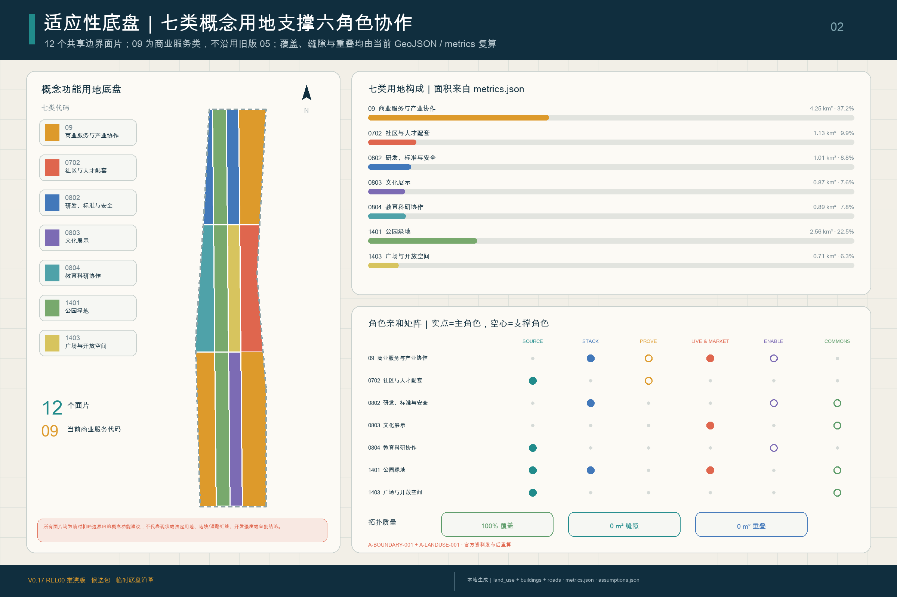

三层工作不是互相割裂的图纸集合。统筹研究决定产业链和城市形态判断，总体设计把判断落实到更新项目、空间结构和设施承载，重点区域详细设计验证具体地块、建筑、交通、公共空间和 AI 应用场景的可实施性。本包先锁定 provisional 边界及其限制，再生成用地、建筑、道路、绿地、公共空间、分期和服务节点，并从图层复算面积、比例、长度与数量；无法复算或缺少正式条件的值一律保留为 `unknown`。

本方案以 **SOURCE—STACK—PROVE—LIVE & MARKET—ENABLE—COMMONS** 为统筹研究网络：京张遗址公园构成历史与公共空间主轴，众智园承接 STACK 与 PROVE，北京 AI 原点社区承接 SOURCE、ENABLE 与 PROVE，大钟寺承接 LIVE & MARKET，两翼把专业服务、场景开放和公共经验送入 ENABLE 与 COMMONS。V0.17 沿既有七接口城市服务链保留可信运行实体，用嵌套房间和概念索引点保障公众行动，但不新增法定分区、新红线，也不改变 SITE/KEY 形状或 3×4 用地拓扑 [data:geometry/roads.geojson#ROAD-INTERFACE-001] [data:geometry/public_space.geojson#ROOM-BUILD-001] [depth:three_level_scope_framework]。

| 层级 | 设计问题 | 方案回答 | 数据落点 |
| --- | --- | --- | --- |
| 统筹研究范围 | AI产业生态和未来城市形态如何组织 | 建立从 SOURCE 到 COMMONS 的六节点网络，把源头创新转化为产业、市场与公共能力 | compliance_matrix.json、standard_matrix.json |
| 总体设计范围 | 产业空间、城市更新、交通市政和风貌如何落图 | 以既有 3×4 用地底盘承载六节点网络、双纵向联系、绿脊、公共空间和实施包 | [data:geometry/land_use.geojson#LU-BUILD-01]、[data:geometry/roads.geojson#ROAD-SPINE-001] |
| 重点区域范围 | 三处片区如何达到详细设计深度 | 分别落实 SOURCE/ENABLE、STACK/PROVE、LIVE & MARKET 的空间动作、AI场景和实施依赖 | [data:geometry/key_areas.geojson#PROV-KEY-001]、[data:geometry/key_areas.geojson#PROV-KEY-002]、[data:geometry/key_areas.geojson#PROV-KEY-003] |

### 任务书“三大定位—五大功能—三区两翼”逐项响应

以下映射把任务书的战略语言落到本方案的空间、场景、治理和运营证据，不以概念同义改写代替逐项回应 [source:AGENT-TASKBOOK] [standard:PROJECT-AGENT-OPEN-CALL-TASKBOOK]。

| 任务书条目 | V0.17 的直接回答 | 主要承载与评审入口 |
| --- | --- | --- |
| 百年京张文化带 | 以铁路遗产主轴、“再次开路”叙事和共创档案连接工程自主、公共记忆与可复用方法 | 京张遗址公园、FP05、`assets/figures/site-overview.png` |
| 都市 AI 生活体验带 | 把 AI 体验改写为可选择、可人工接管、可申诉、可删除和可退出的日常服务 | 七接口服务链、三条人物旅程、`assets/figures/mobility-bluegreen.png` |
| AI 融合创新带 | 用六节点能力网络和五个旗舰把科研、全栈、验证、首用、市场与公共能力闭环 | SOURCE—COMMONS、五旗舰、`assets/figures/land-use-structure.png` |
| AI 全栈自主创新体系 | STACK 组织芯片、算力、框架、模型、Agent 与数据工具，PROVE 负责独立测试和停止条件 | 众智园、FP02、S01/S10 |
| 世界级 AI 创新生态 | SOURCE 与 ENABLE 连接高校院所、开源社区、企业、人才、知识产权、资本与区域接口 | AI 原点社区、中关村科技服务翼、六组国际机制比较 |
| AI+ 场景赋能新范式 | 12 个场景按技术—试验—首用—扩散—共同能力路径归入五个可停可审旗舰 | 小月河场景赋能翼、FP01—FP05、场景卡 |
| 智能化 AI 活力城市 | LIVE & MARKET 将商业、交通、文化和公共服务接入同一人工基线与持续运营节奏 | 大钟寺、七接口、季度—半年—年度运营循环 |
| AI 治理全球话语权 | 以 AI City API、可信应用公约、H0—H4、公开失败证据和人类终判门形成可讨论的方法输出 | 众智园治理能力、FP05 共创档案、三份 FP01 结构化证据 |

| 三区两翼 | 主导能力 | 与总体系统的连接 |
| --- | --- | --- |
| 北京 AI 原点社区 | SOURCE + ENABLE + PROVE | 原始创新、近校转化、首用服务和公开验证进入 FP01 |
| 众智园 AI 自主创新加速区 | STACK + PROVE | 全栈底座、安全评测、低碳算力和治理方法进入 FP02 |
| 大钟寺 AI 产业聚集区 | LIVE & MARKET + COMMONS | 日常市场、站城体验、公共议事和退出记录进入 FP04 |
| 中关村科技服务翼 | ENABLE | 人才、知识产权、资本与专业服务支撑五旗舰跨主体协作 |
| 小月河场景赋能翼 | PROVE + COMMONS | 公共空间共测、包容性移动、社区反馈和失败证据进入 FP03/FP05 |

## 统筹研究范围产业与未来城市研究

V0.17 以任务书提出的世界级 AI 创新生态为统筹研究对象，把高校院所、企业、算力算法数据要素、孵化与科技服务分别放入 SOURCE、STACK、ENABLE，再通过 PROVE、LIVE & MARKET 和 COMMONS 形成从技术到可复制 AI 应用能力的反馈网络。命名、视觉识别、总体空间结构、场景开放与长期运营共同服务“百年京张文化带、都市 AI 生活体验带、AI 融合创新带”；以上对照表已把三大定位、五大功能和三区两翼逐项连接到可见证据。

统筹研究并不新增伪精确红线；它通过 [standard:MOHURD-URBAN-DESIGN-MEASURES] 要求的城市风貌、公共空间和建筑布局统筹，回接 [data:geometry/land_use.geojson#LU-BUILD-01]、[data:geometry/public_space.geojson#PUBLIC-BUILD-001] 与 [depth:overall_spatial_structure]，说明产业策略最终要落到可见、可复核的空间结构。

未来城市形态不以新增一块“AI 用地”解决问题，而以三类可见变化回应工作、生活、社交、学习、交通和公共服务：公共绿脊与七接口服务链形成连续可达底盘；三处重点区提供不同强度的研发、试验、首用与日常市场载体；五个旗舰试点把可停止、可人工接管、可复盘的运营门嵌入具体空间。产业战略、人才、空间供给和垂直应用中缺少正式基线的部分继续保持待校准；活动、社区和体验路线均为概念建议，不写成已确定政府安排。

六节点网络把“三区两翼”从名称集合转译为城市能力分工；节点可在多个片区出现，只有主承载角色不同：

| 网络节点 | 核心问题 | 首要空间承载 | 需要留下的城市能力 |
| --- | --- | --- | --- |
| **SOURCE / 源头** | 原始创新怎样更快进入开放协作和成果转化 | 北京 AI 原点社区、高校院所及中关村科技服务翼 | 开源知识、科研转化、全球人才与问题发现能力 |
| **STACK / 全栈** | 芯片、算力、框架、模型、智能体、数据工具怎样协同 | 众智园 AI 自主创新加速区 | 自主可控的共性技术与可接入基础设施 |
| **PROVE / 实证** | 技术、空间、商业模式和治理规则怎样在真实环境中被验证 | 众智园、AI 原点社区及小月河场景赋能翼 | 测试方法、失败证据、标准与扩展/停止条件 |
| **LIVE & MARKET / 生活与市场** | AI 怎样进入商业、办公、交通、文化与公共服务并形成真实需求 | 大钟寺及全带日常服务节点 | 可持续运营、消费与企业转化、可感知公共服务 |
| **ENABLE / 赋能** | 什么要素让创新主体和人才能够长期留下并协同 | 中关村科技服务翼、AI 原点社区及轨道微中心 | 资本、人才、知识产权、住房、专业服务和基础设施 |
| **COMMONS / 城市共同体** | 技术扩散后，什么永久留给城市和公众 | 京张遗址公园、社区界面与公共知识节点 | 开放方法、连续公共空间、服务基线、公共记忆和复用能力 |

区域协同被设计成“能力交换接口”，而不是把外部地区画入本次边界。北纬社区作为邻近居民需求与基层服务反馈入口；未来科学城、怀柔科学城面向基础研究、大科学装置与测试方法协作；经开区面向具身智能、先进制造和规模化工程验证；京津冀面向供应链、跨区域场景复用和标准反馈。上述对象只说明建议协作方向，不代表已签合作、资源清单、投资安排或跨区空间控制；任何交换都须以授权、知识产权、数据边界和责任主体为前提 [source:AGENT-TASKBOOK]。

V0.3 保留六组互补案例，刻意区分实体创新区、分布式测试网络、城市公开制度、公众共创方法、组织风险框架和未落地项目。它们不是同类排名，也不用于移植境外制度，而用于提炼“再次开路”网络需要同时具备的源头、全栈、实证、市场、赋能、共同体与可信运行机制 [metric:global_case_group_count]：

| 案例类型与案例 | 经一手来源核验的机制 | 对“再次开路”网络的转译 | 不复制的边界 |
| --- | --- | --- | --- |
| 实体创新区：新加坡榜鹅数字园区 ODP | 把实体设施、城区运行数据、API 和安全测试环境组织为可接入的园区底座 | 形成跨运营者的 STACK 与 PROVE 基础设施 [source:CASE-PUNGGOL-ODP] | 平台效率不等于公共合法性；不照搬规模、绩效或集中控制模式 |
| 分布式测试网络：欧盟 AI Testing and Experimentation Facilities | 在真实或近真实环境中完成集成、测试、验证和展示，并让终端用户参与定义场景、协议和指标 | 建立 SOURCE/STACK—PROVE—LIVE & MARKET 的实证梯级 [source:CASE-EU-TEF] | 测试服务不等于监管批准，也不能替代本地专业审批 |
| 城市公开制度：赫尔辛基与阿姆斯特丹算法登记 | 公开城市所用 AI/算法的用途和信息，并提供反馈或责任联系 | 每个 LIVE & MARKET 场景必须接入可信运行层，提供公众可读的系统卡、负责人和纠错入口 [source:CASE-HELSINKI-AI-REGISTER] [source:CASE-AMSTERDAM-ALGORITHM-REGISTER] | 登记不等于独立审计、申诉裁决或部署许可 |
| 公众共创：蒙特利尔负责任 AI 宣言 | 通过多场景、公众与专家共同讨论形成原则 | 让教育、健康和城市服务经验进入 COMMONS，并持续修订可信运行规则 [source:CASE-MONTREAL-DECLARATION] | 原则宣言必须继续绑定责任人、场景卡和版本日志 |
| 全生命周期框架：NIST AI RMF | 以 Govern—Map—Measure—Manage 形成持续风险循环，并纳入清退和外部反馈 | 为 PROVE 到 LIVE & MARKET 配置持续监测、复审、暂停和退出机制 [source:CASE-NIST-AI-RMF] | 自愿性组织框架不是城市设计标准、法律合规证明或法定审批 |
| 治理警示：多伦多 Quayside / Sidewalk Toronto | 官方文件曾要求开放标准、数据最小化、公众参与和独立顾问，但项目合作最终终止 | 在 LIVE & MARKET 扩大前先明确 COMMONS、公共权责、开放接口、社会许可和退出安排 [source:CASE-SIDEWALK-QUAYSIDE] | 不把数据治理争议写成项目终止的唯一原因，也不把未落地设想当成建成绩效 |

这些案例共同指向一个差异化选择：京张的总体创新不再是一套治理协议，而是 **SOURCE—STACK—PROVE—LIVE & MARKET—ENABLE—COMMONS** 组成的城市转化网络。它把“有没有模型”推进到“能否形成产业、市场、公共服务和可复制的 AI 应用能力”。AI City API、京张 AI 可信应用公约、七接口与能力返还机制作为可信运行层横贯所有节点；不同运营者可保留各自系统，但须提供最低一致的七类接口 [metric:protocol_interface_count]。任何测试通过都不被表述为政府批准、国家级试点认定或本投稿已被采纳。

### 可信运行层：双层协议、人工接管与公共回执

可信运行层不是总体品牌，也不是给技术发放的通行证。它要求每项能力从 PROVE 进入 LIVE & MARKET 前，都以七个字段说明当前能力，并公开人工接管、非数字替代、申诉、数据与组件迁移、暂停和退出路径；机器可读部分由 AI City API 交换，公共规则与修订程序由 **京张 AI 可信应用公约 / Jing-Zhang Trusted AI Compact** 约束。“回程票”保留为公众可读回执：只有当故障、争议与退出路径同样清楚，能力才适合进入日常服务 [metric:protocol_interface_count] [source:AGENT-TASKBOOK] [standard:PROJECT-AGENT-OPEN-CALL-TASKBOOK]。

本方案不把征集工作流机械复制到城市，而只提炼其中可迁移的制度动作：结构化任务对应系统与服务卡；来源和版本对应 I1—I3；确定性校验对应最低安全与格式门；Issue/PR 式公开纠错对应申诉、异议和版本日志；人类最终判断对应由责任主体签认的 `go / revise / stop`；开放版本沉淀对应 COMMONS。城市服务风险高于方案提交，因此还必须增加人工基线、使用者权利、采购、工程、专业审查和退出等 H0—H4 条件；“开源”不能替代法定责任。

V0.17 沿用 V0.6 登记的七个可解析原型实体，每个实体关联一个主街室，并携带向三处街室复制完整接口套件的规则；实体数为 7，解析覆盖率为 1.0。保留这些机器实体是为了证据稳定，不代表旧协议命名仍是总体概念 [metric:protocol_interface_entity_count] [metric:protocol_interface_entity_coverage_ratio]。

| 实体 | 最低接口 | AI City API 的机器契约 | 京张 AI 可信应用公约的公共权利 |
| --- | --- | --- | --- |
| I1 身份与出处站 | 身份 / 来源 | 交换部署 ID、负责运营者和来源回执 | 看见责任主体并取得人工或非数字等价说明 [data:geometry/public_space.geojson#INTERFACE-I1] |
| I2 数据目的与留存站 | 数据目的 / 保存期限 | 声明用途、最小数据边界、期限与删除状态 | 以通俗语言知情，并可使用删除与非数字路径 [data:geometry/public_space.geojson#INTERFACE-I2] |
| I3 能力与边界站 | 能力 / 限制 | 交换版本、适用任务、已知失败和禁止用途 | 获得可问责的人工解释，不在声明边界外被使用 [data:geometry/public_space.geojson#INTERFACE-I3] |
| I4 人工接管与无 AI 服务站 | 人工权责 / 非数字替代 | 交换接管人、停止状态和 fallback 可用性 | 通过可见人工点完成同等服务，不被迫使用 AI 或智能手机 [data:geometry/public_space.geojson#INTERFACE-I4] |
| I5 申诉与补救站 | 申诉 / 补救 | 交换案件引用、处理时限、人工决定与纠正状态 | 获得可追踪投诉、人工决定和有效补救 [data:geometry/public_space.geojson#INTERFACE-I5] |
| I6 互操作与可迁移站 | 互操作 / 可迁移 | 交换导出格式、移交状态和服务连续性字段 | 迁出必要记录、切换运营者并避免服务锁定 [data:geometry/public_space.geojson#INTERFACE-I6] |
| I7 版本、暂停、退出与公共记忆站 | 版本 / 暂停 / 退出 / 公共记忆 | 交换当前版本、暂停、退役、变更和返还状态 | 查阅失败、修改、退役及能力返还的持久记录 [data:geometry/public_space.geojson#INTERFACE-I7] |

### 一个主品牌：把试点、活动、贡献记录与公共空间连成一套城市语言

**京张，再次开路 / JING-ZHANG BREAKS NEW GROUND** 是唯一总体品牌。开路符 / `JZ SWITCH MARK` 把京张铁路主干、面向 AI 应用的前进分支、表示撤回与能力返还的回程折线、限定公共试验边界的开放括号，以及保留人工最终判断的节点圆点组合成同一标识方向。当前只锁定概念语法，不冒充最终官方 Logo、政府徽记或铁路企业标识；所有应用必须同时显示中英名称、版本、日期和 `概念提案 / 未授权 / 非政府背书` 状态，颜色不得成为状态的唯一表达 [metric:brand_architecture_layer_count] [source:AGENT-TASKBOOK]。

| 层级 | 固定内容 | 统一使用规则 |
| --- | --- | --- |
| **L0 主品牌** | 京张，再次开路 / JING-ZHANG BREAKS NEW GROUND | 只使用一个开路符；横式、竖式和单色锁定组合均保留安全空间、双语名称、版本与文字状态 |
| **L1 五旗舰** | FP01—FP05 的固定双语名称 | 采用“主品牌 + FP 编号 + 名称 + 当前 Gate/状态”，不得另设五套独立 Logo [metric:brand_flagship_mapping_coverage_ratio] |
| **L2 开放系列** | 季度旗舰开放日、半年证据审查、年度京张开路大会、持续公开版本日志 | 都是建议节律，不表示主办方、日程、场地或预算已经确定 |
| **L3 京张贡献谱** | 公共问题、开放构建、独立验证、权利守护、失败纠错与能力返还五类可修订记录 | 不排名人物或企业，不登记当前获奖者；记录必须能追溯来源、版本、责任角色、独立复核、异议和撤回 [metric:honor_contribution_class_count] |
| **L4 三地标与六组件** | 协议零号站、城市智能试验场、京张贡献档案馆；M01—M06 可逆组件 | 地标不另设 Logo；组件须可拆、可迁移、可停用 AI 后继续支持普通公共活动 [metric:reversible_public_space_component_count] [metric:landmark_component_mapping_coverage_ratio] |

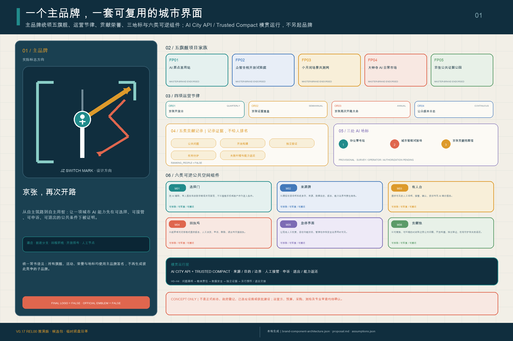

六件组件把视觉识别变成可进入、可使用、可退出的公共空间语言，而非只做一套平面形象：**M01 选择门**并列 AI 与纯人工入口；**M02 来源牌**显示版本、出处、能力边界与责任角色；**M03 有人台**承接人工确认、无手机与无账号路径；**M04 回执坞**提供拒绝理由、申诉、删除与退出；**M05 急停界面**暂停 AI 并恢复普通服务；**M06 贡献轨**公开版本、纠错、失败、退役与能力返还。每件组件均绑定 I1—I7 接口、适用旗舰和地标，但材料、尺寸、固定方式、供电、数据连接、正式位置、无障碍、消防、文保与工程可行性仍待测绘和专业审查；当前状态一律为 `concept_only` [standard:PROJECT-AGENT-OPEN-CALL-TASKBOOK] [depth:blue_green_public_space]。

AI City API、京张 AI 可信应用公约、七接口、公共回执与能力返还只构成横贯运行层，不是第二主品牌。品牌层级、旗舰映射、贡献类别和组件覆盖率只证明提案内部的表达与引用闭合，不证明标识获批、活动举办、荣誉授予、地标选址、组件安装、运营采用或公共效益。

## 总体设计范围城市更新与控规深度城市设计

V0.3 的可复算空间矩阵继续作为 V0.17 的证据底盘：南北方向为已登记的 **BUILD、TEST、LIVE** 三段，东西方向为 **知识研发、公共绿脊、公民接口、日常服务** 四类界面带，形成 12 个共享切割线的概念用地单元。V0.17 不把这组生命周期词继续当作总体品牌，而将 SOURCE、STACK、PROVE、LIVE & MARKET、ENABLE、COMMONS 叠加为跨片区网络。分类是功能建议而非现状或法定用地 [data:geometry/land_use.geojson#LU-BUILD-01] [depth:land_use_layout]。12 个 polygon 完整覆盖 SITE-001，实质 gap、outside 与 overlap 均为 0 [metric:land_use_coverage_ratio] [metric:land_use_overlap_area_sqm]。

六节点网络不另划六种“概念用地”。SOURCE 与 STACK 主要利用知识研发和创新载体，PROVE 跨越实验、公共绿脊和公民接口，LIVE & MARKET 进入日常服务与复合商业界面，ENABLE 依托两翼、轨道微中心和共享设施，COMMONS 以遗址公园、公共空间和公共知识为骨架。可信运行层横贯全部节点，保留人工接管与返还路径。空间关系可回到用地与服务链图层 [data:geometry/land_use.geojson#LU-BUILD-01] [data:geometry/roads.geojson#ROAD-INTERFACE-001]；规划深度由总体结构与用地布局两项检查 [depth:overall_spatial_structure] [depth:land_use_layout]。这些角色不是新的法定用地分类或面积管控指标。

矩阵上叠加两条已登记的纵向公共联系——**京张公共绿脊**与**七接口城市服务链**——以及既有四条横链，构成六节点网络的空间底架。它表达慢行、服务和场景关系，不是道路红线或工程线位 [data:geometry/roads.geojson#ROAD-SPINE-001] [data:geometry/roads.geojson#ROAD-INTERFACE-001] [metric:slow_mobility_length_m]。三个 1401 单元直接派生为连续绿脊，避免用地与绿地分别手画；六处公共界面和六个小型概念承载原型锚定重点区。所有建筑原型均位于临时边界和相应重点区内，并与 1401、1403 及公共空间保持零冲突。

在临时边界分母下，V0.3 实算设计绿地约 **256.32 万㎡ / 22.459%**，六处公共界面约 **43.26 万㎡ / 3.7905%**，概念建筑基底 **2.7775 万㎡ / 0.2434%**，概念慢行与服务联系约 **24.15 km** [metric:green_ratio] [metric:public_space_ratio] [metric:concept_building_coverage_ratio]。这些数值只用于检验方案选择，不是审定绿地率、建筑密度或道路指标。

本节按照 [standard:MOHURD-CONTROL-DETAILED-PLANNING] 与 [standard:MOHURD-ARCH-DESIGN-DEPTH-2016] 把控规及建筑方案设计深度内容拆成可审查对象：用地拓扑、概念承载体、慢行服务网、项目清单、已知/未知控制状态和复算方法分别进入图层与矩阵。由于缺少现状建筑、权属、控规、道路红线与工程条件，总建筑规模、容积率、建筑密度、高度、退线、道路面积和道路率均保持 `unknown`；典型未知项可在指标表核对 [metric:floor_area_ratio] [metric:setback_m]。完成的是控制条件状态表，不是取得了法定数值 [depth:development_intensity_controls] [depth:land_use_layout]。

总体设计把轨道站点联系、道路微循环、非机动车与停车需求、创新和人才服务、新型基础设施、分布式能源及端侧算力共同纳入 ENABLE 底盘。当前图层只表达空间关系和依赖；建筑高度、开发强度、道路红线、退线与设施标准均待正式控规和专业条件确认。

## 重点区域详细设计

三处重点区以不同城市动作承接同一条转化链。众智园把全栈设施、低碳算力观察、室内外安全试验与公众旁观界面组合为 STACK/PROVE 场所；AI 原点以近校成果转化、开源发布、公共验证、人才生活服务和校区—园区慢行缝合形成 SOURCE/ENABLE/PROVE 界面；大钟寺以站城步行联系、AI 原生商业、公共议事、遗产路线和可退出服务构成 LIVE & MARKET/COMMONS 界面。具体建筑拆改留、道路线位、站口、绿地复合和工程规模仍须以正式调查与专业条件深化。

三处重点区域分别以 [data:geometry/key_areas.geojson#PROV-KEY-001]、[data:geometry/key_areas.geojson#PROV-KEY-002]、[data:geometry/key_areas.geojson#PROV-KEY-003] 建立可追溯索引，并由 [depth:three_key_area_detailed_design] 核对功能、建筑承载、交通关系、公共空间、场景和实施依赖。三面均为临时概念范围，不是官方红线。

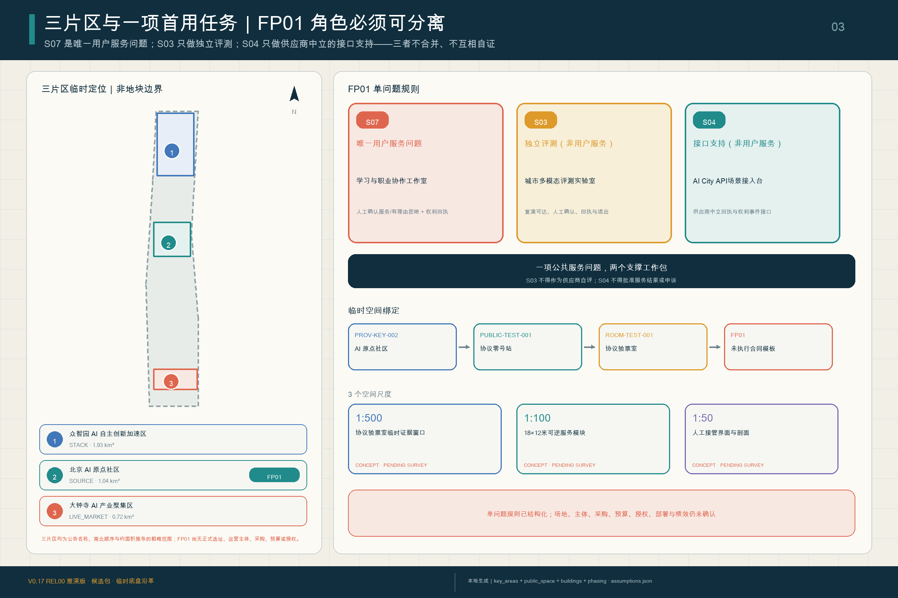

### 三片区空间体验原型

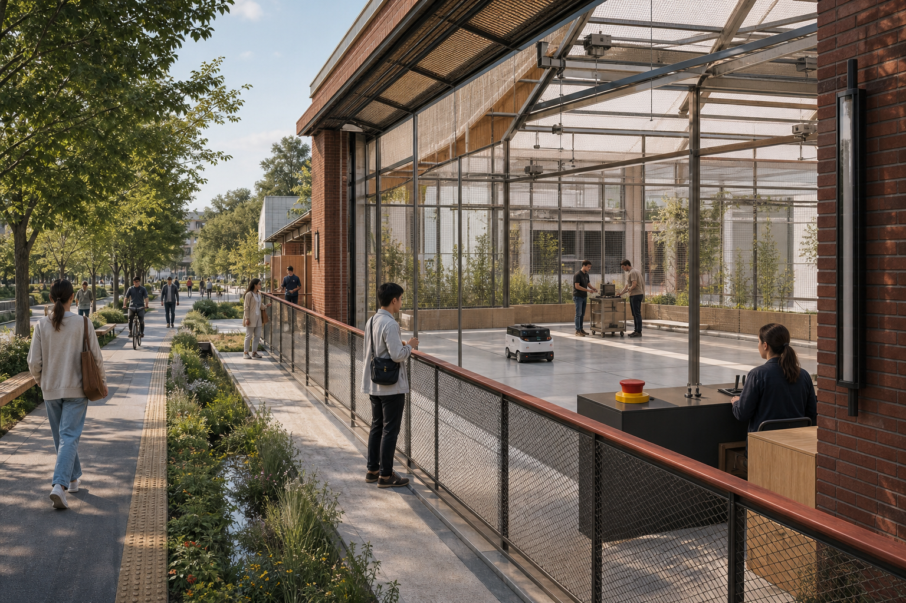

*众智园：公共绿道、旁观廊、透明安全边界、有人控制台、物理急停与能耗可见界面在同一剖面中并置。概念体验图，不代表现状、精确位置、建筑方案或获批工程。*

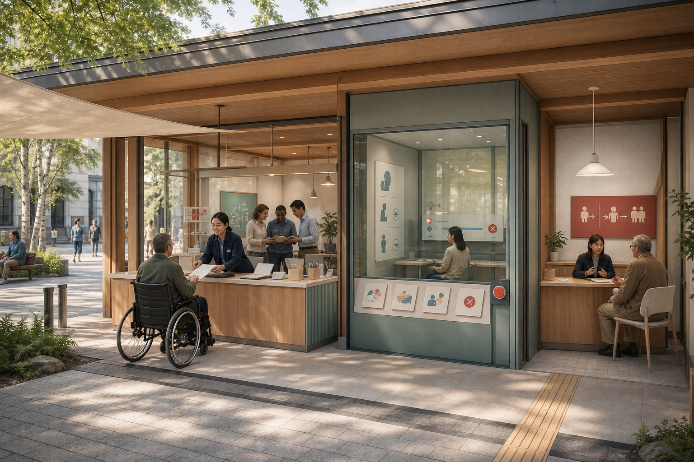

*AI 原点：轮椅/无手机使用者沿无障碍路径抵达有人柜台；评测室、停止控制与申诉转介彼此可见但职责分离。概念体验图，不代表现状、精确位置、建筑方案或获批工程。*

*大钟寺：小店和创作者继续占据市场前台，人工服务、争议复核与可更新贡献档案形成连续公共界面。概念体验图，不代表现状、精确位置、建筑方案或获批工程。*

### 三处可信运行街室

V0.17 保留 V0.6 以“制票—验票—回程”登记的 3 个协议街室 polygon，作为可信运行层的证据窗口，而不是总体品牌 [metric:protocol_street_room_count]。三个房间分别嵌套在既有父公共空间内，union 计数不增加公共空间面积，面积与比例仍为 432,600 ㎡和 3.7905% [metric:public_space_area_sqm] [metric:public_space_ratio]。它们不是新增地标、建筑、官方红线、经确认场所或实施承诺；边界、产权、尺度与运营主体仍待测绘和专业共创深化 [data:geometry/public_space.geojson#ROOM-BUILD-001] [data:geometry/public_space.geojson#ROOM-TEST-001] [data:geometry/public_space.geojson#ROOM-LIVE-001]。

| 协议街室实体 | 嵌套父载体 / 别名 | 面向公众的动作 | 事实边界 |
| --- | --- | --- | --- |
| **ROOM-BUILD-001：协议制票室 / Protocol Ticket-Issuing Room**（众智园 / BUILD） | `PUBLIC-BUILD-002` / 能力契约发布庭 | 把身份来源、数据目的、能力限制、责任人和回程条件写成可读回执 | 不签发政府许可；嵌套概念面须随正式资料重算 [data:geometry/public_space.geojson#ROOM-BUILD-001] |
| **ROOM-TEST-001：协议验票室 / Protocol Ticket-Checking Room**（AI 原点 / TEST） | `PUBLIC-TEST-001` / 协议零号站 | 用受控试验、人工复核、非数字替代和申诉准备度核对回程票 | 不等于检测认证或监管批准；嵌套概念面须随正式资料重算 [data:geometry/public_space.geojson#ROOM-TEST-001] |
| **ROOM-LIVE-001：协议回程室 / Protocol Return Room**（大钟寺 / LIVE—LEARN） | `PUBLIC-LIVE-001` / 京张贡献档案馆 | 记录继续、修改、暂停、退出、服务恢复与公共记忆变更 | 不代表已建机构或法定程序；嵌套概念面须随正式资料重算 [data:geometry/public_space.geojson#ROOM-LIVE-001] |

`geometry/key_areas.geojson` 已登记三处 `provisional_constraint`，正文、来源、假设、自检和图纸均明确它们不能作为审批红线或精确面积依据。合规矩阵分别覆盖公告 1.5.3.1、1.5.3.2、1.5.3.3；双语 HTML、A3 文册和 A0 展板同步展示三片区索引、空间动作、场景、门槛与指标状态。

| 重点片区 | 六节点网络角色 | V0.17 空间抓手 | 场景与实施门槛 | 证据引用 |
| --- | --- | --- | --- | --- |
| 众智园（既有 BUILD 段） | **STACK + PROVE**：全栈自主创新与工程验证 | 可穿行绿界、公众旁观廊、室内外试验庭、低碳算力观察与传统服务隔离线 | S01、S02、S10；受控测试路线与公众旁观路线分离，进入公共试验前须具备人工停止、事件记录与能力边界 | [data:geometry/key_areas.geojson#PROV-KEY-001] [metric:scenario_node_zhongzhiyuan_count] |
| AI 原点（既有 TEST 段） | **SOURCE + ENABLE + PROVE**：原始创新、近校转化与真实用户验证 | 校区—园区慢行缝合、源头发布与公共验证界面、学习工作室、人工复核与申诉站 | S03、S04、S05、S07，并为 S08 提供专业转介；公开试验卡必须先于服务上线 | [data:geometry/key_areas.geojson#PROV-KEY-002] [metric:scenario_node_ai_origin_count] |
| 大钟寺（既有 LIVE 段） | **LIVE & MARKET**：智能经济、公共生活与国际交往 | 站口—街区步行缝合、城市客厅、可逆市集界面、活态遗产路线与公共证据廊 | S11、S12，并与 S09 遗产路线连接；扩大服务前须完成独立评估、消费者告知、申诉和退出安排 | [data:geometry/key_areas.geojson#PROV-KEY-003] [metric:scenario_node_dazhongsi_count] |

## AI 创新生态、人才画像与 AI+ 场景

V0.17 以开源开发者、初创团队、企业访客、周边居民、高校师生等角色检验研发办公、协作发布、企业服务、居住生活、社交学习、消费、休闲与国际交往需求。交通、公共服务、消费、健康、教育和生活服务等 12 个场景均绑定服务对象、概念载体、数据边界、人工复核、非 AI 备选、申诉入口和建议运营角色。

V0.17 在 `public_space.geojson` 中沿用 12 个 `application_scenario`，其中 S01—S03 为产业测试验证场景 [data:geometry/public_space.geojson#SCENARIO-S01] [metric:scenario_node_count] [metric:industry_validation_scenario_count]。12 个场景不再作为互不相关的清单，而是在实施章节组合为 5 个旗舰试点，覆盖从 SOURCE/STACK、PROVE、首用采购与 LIVE & MARKET，到扩散和 COMMONS 标准输出的完整路径。每个应用场景点继续包含空间载体、适用重点区、实施包、用户画像、运营角色、数据边界、人工复核、非 AI 备选、申诉通道和 `deployment_status=concept_only`；12/12 完成人工复核、空间载体和实施包映射 [metric:scenario_human_review_coverage_ratio] [metric:scenario_spatial_assignment_coverage_ratio] [metric:scenario_phase_assignment_coverage_ratio]。25 个去重 persona 标签服务于多主体测试，不代表人口统计画像或对个人作出的推断 [metric:persona_count]。

| 用户画像 | 典型需求 | 空间响应 | 自检边界 |
| --- | --- | --- | --- |
| 开源开发者 | 发布、协作、测试、社区声誉 | 原点社区开源发布厅、公共代码墙、夜间协作空间 | 不采集个人行为轨迹；活动数据只做聚合统计 |
| 初创团队 | 低成本办公、算力入口、产品试验场 | 众智园共享测试场、端侧算力服务点、标准治理咨询 | 算力和数据服务需另行授权 |
| 头部企业访客 | 展示、商务、国际接待、人才招聘 | 大钟寺国际路演客厅、轨道站点接驳、重点企业周边公共空间 | 企业标识和案例须清权 |
| 周边居民 | 通勤、休闲、社区服务、低扰动更新 | 京张遗址公园慢行环、社区服务嵌入、夜间照明和活动分级 | 不将居民画像用于商业推荐 |
| 高校师生 | 成果转化、跨校协作、日常慢行 | 校区-园区慢行缝合、成果转化驿站、AI教育体验点 | 校园数据和科研成果需授权 |

| 场景卡 | 生命周期 / 空间载体 | 设计说明与治理门槛 |
| --- | --- | --- |
| 01 模型与 Agent 安全沙盒（产业测试验证） | BUILD / TEST；众智园共享实验空间 | 红队、安全评测、审计与停止规则必须先于公开展示；不得把测试通过表述为监管批准 |
| 02 具身智能街区试验场（产业测试验证） | BUILD / TEST；受控室内外试验场 | 采用限定时段、地理围栏、现场管理员、事件日志和一键停机，正式位置待交通与权属核验 |
| 03 城市多模态评测实验室（产业测试验证） | TEST；AI 原点社区 | 与真实用户共同验证偏差、无障碍、误报和失败模式，结果进入公开可读的评测卡 |
| 04 AI City API 场景接入台 | TEST / LEARN；三片区公共服务界面 | 登记场景、数据用途、模型能力、人工复核、投诉申诉、停止回滚和版本号 |
| 05 公共服务导航助手 | TEST / LIVE；社区服务点 | 只辅助查找与办理引导，不替代资格或行政判断，并保留现场人工和非数字服务路径 |
| 06 包容性慢行协同助手 | TEST / LIVE；京张遗址公园及站点联系 | 以最小化感知支持无障碍与慢行绕行；不得建立居民商业画像 |
| 07 学习与职业协作工作室 | TEST / LIVE；AI 原点学习空间 | 提供可解释资源匹配与导师协作，不进行自动录取、就业资格或信用决策 |
| 08 健康服务导引助手 | TEST / LIVE；社区与交通节点 | 仅做服务导航和分级提示，不进行自主诊断；高风险情形转人工专业服务 |
| 09 京张活态遗产路线 | LIVE / LEARN；铁路遗产公共空间主轴 | 用可追溯史料、多语无障碍内容和公众纠错机制连接铁路工程史、中关村文化与 AI 新文化 |
| 10 低碳算力与能源观察站 | BUILD / LEARN；众智园基础设施展示节点 | 展示经测量的能耗与算力指标及不确定性，不虚构能源容量或减排绩效 |
| 11 AI 原生商业与创意市集 | LIVE；大钟寺公共与复合空间 | 对生成内容、来源和消费者界面进行清晰标识，保留人工服务并完成版权清权 |
| 12 城市议事与证据观察站 | LEARN / UPDATE；贡献档案馆与公共论坛 | 汇总运行证据、投诉、事件、独立评审和版本变更，支持决定“扩大、修改、暂停或终止” |

全部场景采用数据最小化、公开或授权来源、可解释和人工复核原则。城市智能体只辅助识别慢行断点、公共空间使用、设施维护、企业服务需求与活动安全风险，不替代规划审批，不生成未经授权的个人画像，也不声称获得官方实施承诺。12 个场景均已进入结构化图层与合规矩阵，使产业、空间、用户和公共利益关系可查。

### 三条代表性人物旅程

V0.17 沿用从既有 persona 集合中登记的 3 个 `human_journey_anchor` 点 [metric:human_journey_count]。它们用于检验五个旗舰试点能否在普通人的服务旅程中安全运行，是连接场景、房间、接口和返还节点的概念审计索引，不是经测绘确认的无障碍路线、道路通行承诺或当前服务可用性证明 [depth:three_key_area_detailed_design]。

| 人物 | 如何使用 AI 城市能力 | 可信运行层必须保障什么 |
| --- | --- | --- |
| **P01 / JOURNEY-J01：不使用智能手机的轮椅使用者** | 在 TEST/LIVE 慢行与服务节点通过纸面、语音、现场人员或无障碍标识读取回程票，不以安装应用或建立账户为前提 | 当导引失效、路线不可达或系统暂停时，回到人工无障碍协助和可用替代路线；无需数字账户也能申诉，并由 TEST 返还节点记录修复 [data:geometry/public_space.geojson#JOURNEY-J01] [data:geometry/public_space.geojson#RETURN-TEST-001] |
| **P02 / JOURNEY-J02：小店经营者 / 创作者** | 在 AI 原生商业或创意服务中查看内容来源、费用、能力限制、责任人和争议入口；可对生成内容、推荐或交易辅助提出异议 | 争议触发人工复核，暂停受影响的自动内容或决定，恢复人工售卖、退款或作品处理，并由 LIVE 返还节点保存补救与来源记录 [data:geometry/public_space.geojson#JOURNEY-J02] [data:geometry/public_space.geojson#RETURN-LIVE-001] |
| **P03 / JOURNEY-J03：维护人员 / 一线运营者** | 在每次机器交接前核对权限、风险和非 AI 备选，保留拒绝交接或暂停自动功能的权力 | 触发暂停后恢复常规服务，完成记录、复测与复核；若仍不达标则退役，并由 BUILD 返还节点把操作与失败证据送入公约下一版 [data:geometry/public_space.geojson#JOURNEY-J03] [data:geometry/public_space.geojson#RETURN-BUILD-001] |

## 用地、建筑规模与拆改留方案

12 个概念功能面以共享切割线形成完整闭合分区；6 个小型建筑面只表达“既有调查后可适应性改造或轻量填充”的承载位置。由于没有现状建筑、权属、控规和工程条件，V0.17 不把任何对象提前判定为保留、改造、拆除或新建，而把逐栋测绘、产权核对、结构/消防评估、历史价值判断和功能适配作为进入设计深化的顺序门。

用地分类依据 [standard:MNR-LAND-USE-CLASSIFICATION-GUIDE]，建筑方案表达参照 [standard:MOHURD-ARCH-DESIGN-DEPTH-2016]，用地布局由 [depth:land_use_layout] 检查，建筑高度、体量、界面和风貌控制由 [depth:height_massing_character] 管理，拆改留方法由 [depth:retain_renovate_demolish] 管理。V0.3 的 12 个用地面仅是概念功能分区；6 个建筑面均标为 `conceptual_envelope=true` 和 `adaptive_reuse_or_lightweight_infill_subject_to_survey`。它们证明承载方法与空间兼容性，不证明现状建筑或拆改留决定；6/6 均列入待调查分类 [data:geometry/land_use.geojson#LU-BUILD-03] [data:geometry/buildings.geojson#BLDG-BUILD-001] [metric:building_action_pending_count]。

建筑规模和强度状态与 `metrics.json`、图层及图纸一致：总建面、容积率、建筑高度、建筑密度、退线和建筑控制线因缺少官方条件保持 `unknown` 或 `pending_control`；绿地、公共空间与建筑基底只作为临时边界内的设计复算值。A3、A0 与离线 HTML 均将已知设计值和待正式资料项分栏展示。

## 交通、轨道、市政与公共服务设施

交通与市政设计以“连续公共底盘 + 可核验接口”组织：京张公共绿脊和七接口服务链承担南北慢行与服务连续性，四条横链接入三处重点区；北五环跨越、公园端点、五道口、清华东路西口、大钟寺站及重点企业周边均列为需专业复核的断点，而不是被画成已确认工程线。停车、非机动车停放、站口、道路红线、管线和消防条件缺失，因此目前只表达联系、服务需求和进入门槛。

交通和市政专业深度分别由 [depth:traffic_rail_slow_parking] 与 [depth:municipal_new_infrastructure] 约束；设计关系引用 [data:geometry/roads.geojson#ROAD-SPINE-001]、[data:geometry/roads.geojson#ROAD-INTERFACE-001] 和 [data:geometry/public_space.geojson#SCENARIO-S06]。`geometry/constraints.geojson` 当前有意保持空层，因为没有可核验、可清权的铁路线位、河道与防洪、道路红线、轨道出入口、权属、市政消防、文保或树木数据 [data:geometry/constraints.geojson]。因此“站城连接”“清河界面”等均是待核实的设计关系，不能读作已确认线位。

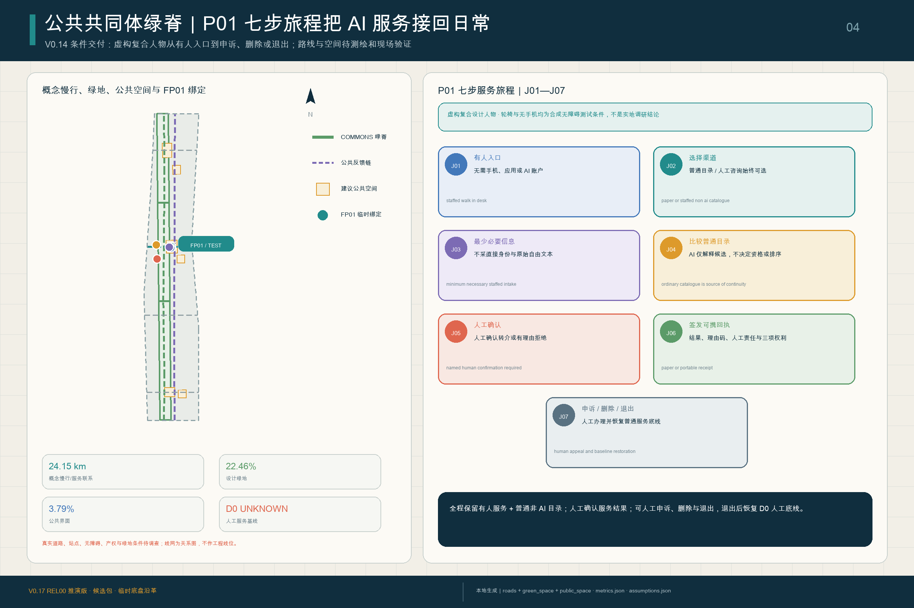

市政和公共服务设施构成 ENABLE 的物质基础：AI 产业与创新服务、人才生活服务、分布式能源、端侧算力和传统市政系统被纳入同一依赖表。设施标准、服务半径、管线、能源、排水、防洪和消防条件尚未取得，因此当前只登记概念载体、建议运营角色、分期关系和正式深化前置条件。

## 蓝绿空间、公共空间与城市风貌

蓝绿系统把京张遗址公园作为全网 COMMONS：三段 1401 概念绿地形成连续南北底盘，横向联系把高校、企业、社区和三处重点区接入公园。公共界面不是把公园改成科技展场，而是在出入口、断点和活动节点叠加可撤除的休憩、无障碍协助、公众旁观、测试告知和常规服务；任何清河、小月河、防洪、树木、桥下空间或遗产工程动作均须在正式资料后再定位。

蓝绿公共空间由设计深度项和绿地、公共空间图层共同校核 [depth:blue_green_public_space] [data:geometry/green_space.geojson#GREEN-BUILD-001] [data:geometry/public_space.geojson#PUBLIC-TEST-001]。绿地层由三个 1401 用地面直接派生，几何对称差为 0；绿地和公共空间比例在正文只解释设计意义，完整复算保存在 `metrics.json`。城市风貌、公共空间和建筑控制的统筹则回到专业标准矩阵 [standard:MOHURD-URBAN-DESIGN-MEASURES]。

城市风貌以“自主工程、开放验证、公共可读”为共同语汇：保留京张工程遗产的尺度、材料记忆与线性空间感，不仿古造景；新介入采用轻量、可逆、可维护构件，把测试边界、人工服务、能耗和版本信息做成建筑界面的一部分。清华园站、北影及其他文化资源只有在权利与文保条件核实后才能进入具体设计；字体、图像、肖像和企业标识必须清权，建筑高度、屋顶、体量和控制线不作伪精确承诺。

V0.17 沿用三个已登记、可供专业团队深化研究的 AI 公共地标，但把“地标”落实为可体验的公共空间原型。北京 AI 原点社区的 **协议零号站 / Protocol Station Zero** 是 SOURCE/PROVE 的低门槛验证亭：实体试验卡、无障碍信息台和有人值守窗口让能力来源、用途、限制与替代服务可见。众智园的 **城市智能试验场 / Civic AI Test Yard** 是 STACK/PROVE 的室内外观察庭：透明安全边界、公众旁观廊、物理急停和能耗显示同时展示成功与失败。大钟寺的 **京张贡献档案馆 / Jing-Zhang Commons Ledger** 是 LIVE & MARKET 通向 COMMONS 的可更新公共廊：以触觉时间线、可替换版本板和多语/无障碍界面保存贡献、纠错、退出与失败教训 [metric:landmark_count]。这些登记名服务于既有机器证据，不再构成总体品牌；具体位置、尺度、建筑方式和文保关系均待官方边界、权属、文保和工程条件补齐后深化 [source:AGENT-TASKBOOK] [depth:blue_green_public_space]。

## 更新项目清单、实施政策与分期计划

V0.17 继续把实施组织为可审查的依赖链：六个更新项目分别挂接空间载体、主要风险和进入门槛，三组实施包表达先修公共底盘、再形成 SOURCE/STACK/PROVE、最后讨论 LIVE & MARKET 扩散。责任主体、权属、资金、审批和工程条件未确认的部分继续列为依赖，不以概念名称冒充立项。

项目清单和分期深度由 [depth:renewal_project_list] 与 [depth:phasing_implementation] 管理，分期空间证据以 [data:geometry/phasing.geojson#PHASE-001] 为索引。权属、资金、实施主体和审批路径尚未确认的项目均在“主要依赖 / 进入门槛”栏显式披露，不构成落地承诺。

| 项目编号 | 项目名称 | 概念实施包 | 主要依赖 / 进入门槛 | 证据引用 |
| --- | --- | --- | --- | --- |
| JZ-01 | 京张公共绿脊慢行断点缝合 | P1 公共绿脊与七接口先导 | 道路红线、桥下空间、无障碍与交通组织复核 | [data:geometry/roads.geojson#ROAD-SPINE-001] |
| JZ-02 | 众智园创新绿界与公开测试路线 | P1 公共绿脊与七接口先导 | 河道/生态/防洪条件、测试与旁观路线分离 | [data:geometry/green_space.geojson#GREEN-BUILD-001] |
| JZ-03 | 原点社区近校成果转化与复核站 | P2 西侧知识研发与专业验证 | 校区边界、权属、现状建筑调查、服务主体 | [data:geometry/buildings.geojson#BLDG-TEST-002] |
| JZ-04 | 大钟寺站城与四象限步行连接 | P3 东侧日常服务与城市扩散 | 轨道出入口、道路交叉口、市政管线与客流复核 | [data:geometry/roads.geojson#ROAD-LIVE-001] |
| JZ-05 | AI 公共服务与低碳算力观察节点 | P2 西侧知识研发与专业验证 | 能源、算力、安全、消防和运营主体；当前约束层为空 | [data:geometry/public_space.geojson#SCENARIO-S10] [data:geometry/constraints.geojson] |
| JZ-06 | 京张开路大会与公共体验路线 | P3 东侧日常服务与城市扩散 | 公共空间许可、独立评估、活动安全和版权清权 | [data:geometry/phasing.geojson#PHASE-003] |

V0.3 的三期不是“近期/中期/远期”工期承诺，而是三组可相互检验的依赖包：**P1 COMMONS / ENABLE 先导**先缝合公共绿脊、基本服务、七接口、人工替代与事件通道；**P2 SOURCE / STACK / PROVE 成形**只在权属、建筑调查、专业安全、能源与交通条件核实后推进研发、全栈设施和实景验证；**P3 LIVE & MARKET 扩散**只有在独立评估、申诉能力、互操作、首用采购边界与退出计划得到证明后，才扩大日常服务、市场应用和城市传播 [data:geometry/phasing.geojson#PHASE-001] [data:geometry/phasing.geojson#PHASE-002] [data:geometry/phasing.geojson#PHASE-003]。三面完整覆盖临时边界且零实质重叠 [metric:phase_coverage_ratio] [metric:phase_overlap_area_sqm]。

### 五个旗舰试点与首用路径

V0.17 不把 12 个场景当作平行展项，而是按官方空间角色组织为五个可进入实施讨论的旗舰试点：**FP01 AI 原点首用站**（SOURCE + ENABLE）、**FP02 众智全栈开放试验庭**（STACK）、**FP03 小月河场景共测网**（PROVE）、**FP04 大钟寺 AI 日常市场**（LIVE & MARKET）和 **FP05 京张公共证据公园**（COMMONS）。FP05 同时是前四项的公开观察、反馈和失败证据入口。这个组合呼应北京关于超级 AI 试验场、全栈智能体与互操作、科技—产业—城市融合和“人机共融实验场”的公开部署，但不把政策方向误写成已批准的本项目、场址、采购、预算或本投稿已被采纳 [source:BEIJING-SUPER-AI-TESTFIELD] [source:BEIJING-AGENT-POLICY-2026] [source:HAIDIAN-JINGZHANG-MIDTERM-2026]。

五项试点共用一条不可跳级的五门路径：**G1 技术准备**核验来源、能力边界、基线和责任主体；**G2 有界试验**限定时间、空间、用户与数据，并演练人工接管；**G3 首用采购**以可读证据、服务基线、退出条款和专业复核为进入合同的前提；**G4 扩散**验证跨运营者互操作、可迁移和供应多样性；**G5 标准与共同能力输出**把经清权、去标识的方法、失败证据和接口沉淀到 COMMONS。任何一门不通过都只能修改或停止，不能用展示活动替代。共用 90 日三门为：**D30 定责定界**（联合体、基线、场地/资金/数据边界和停止条件形成书面草案）；**D60 有界共测**（完成受控试验、事件记录、人工接管与非数字替代演练）；**D90 证据决策**（公开可读结果经专业复核后形成继续、修改或停止决定，只有通过者才可讨论首用采购或扩大）。各项一年指标的口径、基线和目标值须在 D30 由责任联合体确认；下表列的是应披露字段，不是预设政绩值或实施承诺 [depth:phasing_implementation]。

为避免把概念模板写成“已经可实施”，五项旗舰与六件组件还共用五个交付停止点。它们只规定**谁必须补什么证据以及缺证时怎样停**，不虚构实名主体、预算或采购事实 [metric:delivery_hold_point_coverage_ratio]：

| 停止点 | 进入下一步前必须取得 | 当前边界 / 缺证动作 |
| --- | --- | --- |
| **H0 公共问题与普通服务基线** | 使用者代表与责任服务角色共同确认问题、人工/非数字流程、D0 测量法和禁止自动决定事项 | 当前未实测；不能确认则停止该任务 |
| **H1 载体与交付责任** | 测绘、权属/许可、可问责运营与维护角色、资金边界和合法采购路径 | 正式场地、主体、预算和采购均未确认；保持 `concept_only` |
| **H2 专业与权利条件** | 数据授权、安全、无障碍、非数字路径，以及交通、市政、能源、消防、文保等适用专业核验 | 任一关键条件缺失，不进入真实用户或安装环节 |
| **H3 独立证据与补救** | 采购/运营/评测/申诉职责分离，失败记录、独立复核、申诉时钟与恢复演练 | 不允许供应商自证；无可复演证据则 revise / stop |
| **H4 另行授权与退出交接** | 法定审批、采购、法律与专业授权，及数据处置、组件拆除、人工基线恢复和公共记录 | 通过前门不等于获准实施；授权不全则关闭并返还 |

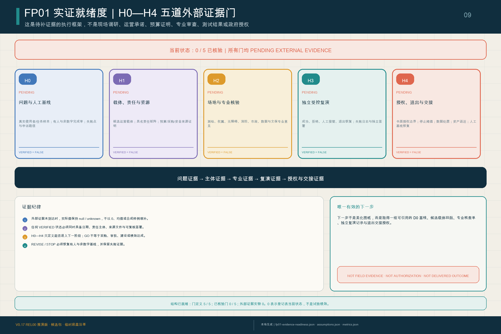

`visual/assets/fp01-evidence-readiness.json` 把每道门拆成**必需材料、责任角色、独立复核、停止动作和状态转换**；配套脚本拒绝把缺少日期、签署者、来源或复核的记录标成 `verified`。当前五道门统一保持 `pending_external_evidence`：H0 等待真实问题与人工基线，H1 等待测绘载体、实名主体、预算和采购路径，H2 等待无障碍、消防、市政、能源、交通、数据与安全等适用专业意见，H3 等待独立受控演练及失败/恢复记录，H4 等待法定授权、退出与交接。完整双语空表收录于 `assets/media/fp01-execution-workbook.md`，机器镜像为 `visual/assets/fp01-execution-kit.json`；它们是证据获取与执行协议，不是已完成的尽调或实施证明 [metric:fp01_evidence_verified_gate_count]。

本次征集的公开版本、Issue、PR 与机器校验，只能证明共创流程能够被追溯和修订；未来公开的人类判断记录也不得填写 FP01 的场地、使用者、基线、预算、专业审查、演练或授权字段，更不得把当前 `0/5` 外部实证改写为已通过。

### V0.17 预可行性与条件交付页：把尺度、人员、钱、维护和退出放在一起

三处重点区不再只用功能名区分：众智园以公众旁观线、受控测试线和运营安全线形成 **24×12 米概念测试界面**；AI 原点以选择门、来源牌、有人台和回执坞形成 **18×12 米概念首用模块**；大钟寺以日常服务、争议补救和贡献轨形成 **30×6 米概念公共记录界面**。1:20 接口采用 3.0×2.4 米参考 bay、1.8 米清晰交互带和 0.75—2.10 米组件高度带，只检查六类可拆组件的连接、检查、替换及普通用途恢复；这些是原创设计包络，不是现状尺寸、规范结论、施工节点或采购规格 [metric:key_area_interface_prototype_count] [metric:fp01_pre_feasibility_scale_count] [metric:fp01_original_parameter_envelope_count]。

D0-B01—B06 现在逐项定义起止事件、分子分母或时间公式、缺失值和报告口径；30 次任务、至少 3 个服务日只是可被责任方或伦理/数据审查提高或否决的**形成性观察下限**，不是已经取得的样本、统计功效或绩效 [metric:fp01_d0_measurement_method_coverage_ratio]。H0—H4 同时形成逐门角色类 RACI，但姓名、机构、责任接受和签署继续为空 [metric:fp01_hold_point_raci_coverage_ratio]。

V0.17 为每道门另设唯一 `decision_owner_role` 与所需会签角色，共登记 16 类交付角色；真实组织、人员、任命、排班与签字仍为空 [metric:fp01_delivery_role_class_count] [metric:fp01_hold_point_single_decision_owner_ratio]。概念运营窗口必须同时覆盖**前线服务与无障碍、人工转介/拒绝与申诉权、运行安全与停止权**三类职责，独立评测不得由供应商自证代替。人员模板以每周 20—40 个公共窗口小时、3 类并发职责、每 FTE 每周 24—30 个有效小时和 1.15—1.35 替补系数构成 2.3—6.75 FTE 的示意包络；它是排班敏感性，不是用工承诺。现场容量取“按测绘净面积和获批人均面积所得值、消防/生命安全核定、无障碍服务位、已落实岗位覆盖”四者最低值；两条概念独立出口路径和 1.2—1.8 米通行宽度也只有在 H1—H2 专业核验后才可使用 [metric:fp01_capacity_egress_template_count] [metric:fp01_staffing_fte_template_count]。

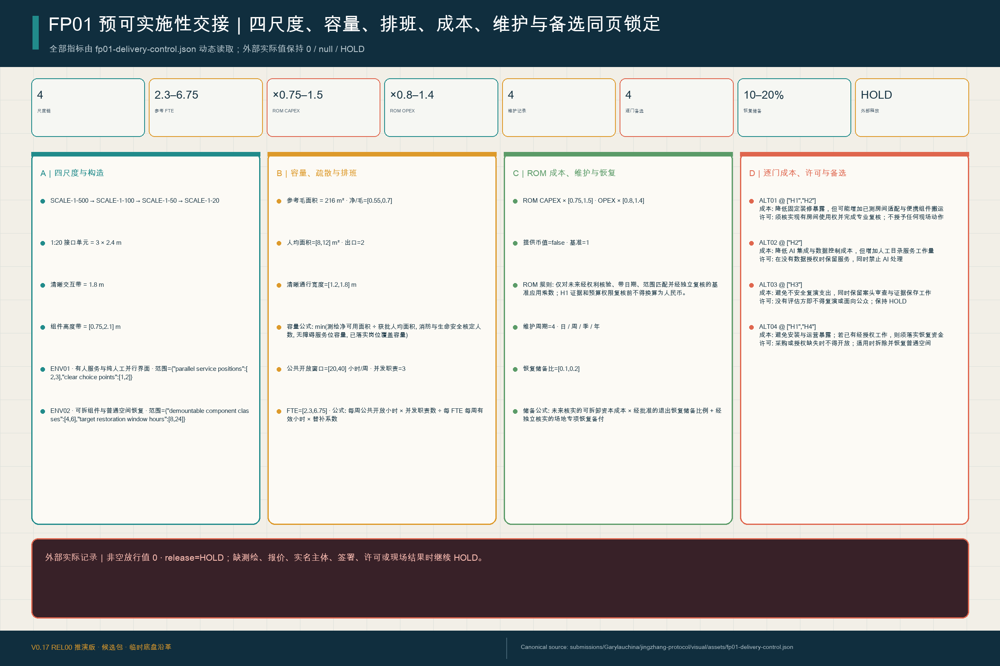

单套设计测试包只登记 M01—M06 的最小测试数量。七类成本覆盖测绘现状、可逆构件、无障碍与有人服务、硬件连接、运营维护、数据/安全/独立评测/公共证据，以及拆除恢复与预备费；金额仍只按“经核实实际数量 × 清权可比单价 + 获批预备费”计算 [metric:fp01_design_test_boq_item_count] [metric:fp01_cost_plan_class_count]。在未来取得同范围、同日期且清权的基准后，ROM-LOW / REFERENCE / HIGH 才可分别测试 CAPEX 0.75 / 1.00 / 1.50 与 OPEX 0.80 / 1.00 / 1.40 的敏感性；当前不提供币值 [metric:fp01_rom_sensitivity_scenario_count]。退出恢复储备只提出未来经核实可拆 CAPEX 的 10%—20% 参数范围，并须另加场地专项恢复额；它不是已拨资金 [metric:fp01_exit_restoration_reserve_template_count]。实际数量、单价、金额、资金来源、采购路线和预算签署全部为 `null`，经核实成本输入为 0；缺报价意味着未知，绝不意味着零成本 [metric:fp01_verified_cost_input_count]。

K01—K10 把可并行的 H0 问题确认与 H1 载体初筛，同后续专业核验、D0 基线、复演、决定、授权及交接串成不可跳级的关键依赖；它是交付控制模型，不是已承诺工期 [metric:fp01_critical_dependency_step_count]。AT01—AT12 把验收分成 8 项方案结构审查与 4 项现场/授权审查；REL00—REL05 的六级释放全部保持 `external_release_granted=false` [metric:fp01_acceptance_indicator_count] [metric:fp01_release_stage_count]。维护按**每日开放前、每周控制、每季或重大变化后独立复核、每年或续期前恢复/续用决定**四个周期组织 [metric:fp01_maintenance_cycle_count]。ALT01—ALT04 分别绑定 H1/H2 载体、H2 数据、H3 独立评测和 H1/H4 采购/授权门，并公开相应成本与许可权衡；没有选择权力和门槛证据时仍为 HOLD [metric:fp01_fallback_alternative_count] [metric:fp01_gate_cost_permission_alternative_mapping_ratio]。

七类执行空表把上述模型转成专业团队可以直接接手的工作面：载体调查、责任接受、D0 观察、BoQ/成本基准、非约束采购包、专业复核/门槛/验收，以及复演/维护/退出交接，共有 230 个唯一必填字段 [metric:fp01_execution_form_count] [metric:fp01_execution_required_field_count]。EX-06 完整覆盖 success、refusal、human_takeover、exit_restoration 四类复演脚本，但当前复演记录与经核验外部执行记录均为 0 [metric:fp01_execution_rehearsal_event_class_coverage_ratio] [metric:fp01_execution_verified_external_record_count]。每件外部材料还必须填写版本、来源、方法/样本、局限/缺失、权利/公开级别、利益冲突、独立复核、处置、签认和 SHA-256；当前 18 个接收字段全部为空，已接收外部回执为 0。空表完整只说明交接接口已做好，不说明现实主体已接受任务 [metric:fp01_external_evidence_receipt_required_field_count] [metric:fp01_accepted_external_evidence_receipt_count]。

#### FP01：一份 100 天首用合同，不是三个展项

V0.17 选择 FP01 作为整套能力链的首个可讨论实施原型：**S07 是唯一面向使用者的服务问题，S03 只做独立评测，S04 只做接口与回执支撑**。它们不是三个并列展项，也不证明现实中已有一项获得服务方确认的需求。当前只登记 `FP01-S07-PROBLEM-001` 这一个 **D0 待由责任服务方与使用者代表共同确认的候选问题**，并且保留同等的纯人工服务、拒绝、接管与退出路径。`FP01-CONTRACT-001` 把一项服务、原点社区的临时概念载体、责任角色、证据门和退出动作绑定为一份**未执行的合同模板**；其固定状态为 `concept_template_unexecuted`，不代表政府立项、场地确认、需求实证、采购公告、中标或签约 [data:geometry/public_space.geojson#SCENARIO-S07] [metric:fp01_concrete_service_problem_count]。

| 时间门 | 必须形成的合同条款与公开证据 | 不通过时的动作 |
| --- | --- | --- |
| **D0 问题入场** | C01 人工/非数字服务基线与问题陈述；明确使用者、不可自动决定事项和当前责任方 | 不满足公共问题与基线条件，不进入首用流程 |
| **D30 定责定界** | C02 采购、运营、评测、申诉职责分离；C03 模型/接口版本、来源与能力边界；C04 场地、资金、数据、期限与停止阈值 | 退回补齐责任或边界，不得开始真实用户测试 |
| **D60 有界共测** | C05 互操作与迁移证据；C06 无账号/无手机、无障碍、人工接管路径；C07 事件、申诉和公开记录；C08 停止、恢复基线与数据处置演练 | 冻结自动功能，恢复人工基线，保存失败证据 |
| **D90 独立决策** | C09 可公开的通过项、失败项和不确定性证据包；C10 由独立专业复核形成 go / revise / stop 决定并记录异议 | revise 返回相应门复测；stop 直接进入退出交接 |
| **D100 公开交接** | C11 仅在另行完成法定采购、法律与专业授权后，才可讨论可撤销的 10 天验收；C12 未通过则不支付结果款、恢复基线、处置数据、返还可迁移资产并保留失败证据 | 任何授权缺失都按未通过处理，不以 D90 通过替代采购程序 |

机器证据只确认这份模板已登记 1 份、D0/D30/D60/D90/D100 五个门完整、C01—C12 十二条款完整 [metric:fp01_first_use_delivery_contract_template_count] [metric:fp01_100_day_gate_coverage_ratio] [metric:fp01_contract_clause_coverage_ratio]。另外，success / refusal / human_takeover / exit_restoration 四类**合成回执夹具**的字段与状态转换可重放 [metric:fp01_receipt_event_type_coverage_ratio]。这些结构不证明合同已经执行、回执来自真实运行或删除已经完成；实际首用采购数量继续保持 `unknown` [metric:flagship_first_use_procurement_count]。

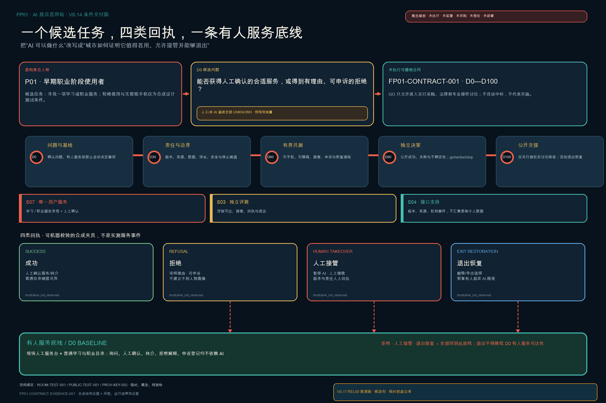

| 旗舰试点 / 场景 | 运营角色联合体（建议） | 90 日三门的专项证据 | 一年应披露指标 | 资金、空间与数据边界 |
| --- | --- | --- | --- | --- |
| **FP01 AI 原点首用站**：S03 城市多模态评测 + S04 AI City API 接入 + S07 学习与职业协作；SOURCE → ENABLE [data:geometry/public_space.geojson#SCENARIO-S03] | 高校/科研团队、开源社区、专业评测方、公共或园区服务运营者、人才与知识产权服务机构、无障碍代表共同负责；采购方与评测方角色分离 | D30 发布能力/数据/责任卡与首用问题清单；D60 完成互操作、人工转介和无账号路径共测；D90 公开评测结果、申诉演练与首用/修改/停止建议 | 按实际分母披露接入与互操作成功率、人工转介完成情况、无数字账户服务可用性、问题关闭时长、首用合同及跨主体复用情况；同时公布失败与退出 | 资金仅可讨论场景开放、专业评测、服务采购和科研/标准协作的组合，不预设额度；使用 AI 原点临时概念载体，不主张已确认房屋或场地；只用公开、获授权或最小必要数据，不以教育/就业资格作自动决定 |
| **FP02 众智全栈开放试验庭**：S01 模型与 Agent 安全沙盒 + S10 低碳算力与能源观察；STACK [data:geometry/public_space.geojson#SCENARIO-S01] [data:geometry/public_space.geojson#SCENARIO-S10] | 模型/智能体与芯片算力企业、测试认证和网络安全团队、能源/园区运营者、高校实验室、独立专业观察员共同负责；设备方不得自证通过 | D30 固定版本、算力/能耗基线、红队范围与停止阈值；D60 完成安全压力、故障切换、人工停机和计量校准；D90 同时发布通过项、失败项、能耗不确定性与是否进入外部试验的决定 | 披露测试完成与失败分布、重大/近失事件、人工停止演练、单位任务能耗与计量完整性、接口/测试方法复用和进入下一门的比例；不得只报最佳值 | 资金可由设施开放、企业共担、科研与标准验证构成，不承诺补贴；场地须服从权属、消防、能源容量和公众/测试路线分隔核验；模型、日志和能耗数据分级授权，公开层只含清权汇总与方法 |
| **FP03 小月河场景共测网**：S02 具身智能街区 + S05 公共服务导航 + S06 包容性慢行 + S08 健康服务导引；PROVE [data:geometry/public_space.geojson#SCENARIO-S02] | 街道/社区与公园运营角色、机器人及服务提供者、交通和无障碍专业团队、医疗服务转介方、现场安全管理员、居民/使用者代表共同负责 | D30 划定各节点时空围栏、禁入情形、人工基线和投诉入口；D60 在现场管理员监督下共测通行、故障、转介和一键停机；D90 依据事件、可达性、服务完成和公众反馈决定继续、调整节点或停止 | 披露安全试验时段与任务量、人工干预和近失事件、无障碍/无手机路径可用性、服务转介完成情况、投诉关闭与传统服务连续性；健康场景不统计诊断绩效 | 资金仅讨论公共空间试验管理、运营方投入和专业评测，不预设建设项目；“网”表示小月河场景赋能翼与既有公共空间之间的概念协作，不主张一条已确认路线，须待河道、防洪、交通、权属和生态条件确认；不做人脸常态识别、居民商业画像或自主诊断，原始感知数据最小化保存 |
| **FP04 大钟寺 AI 日常市场**：S11 AI 原生商业与创意市集 + S12 城市议事与证据观察；LIVE & MARKET [data:geometry/public_space.geojson#SCENARIO-S11] [data:geometry/public_space.geojson#SCENARIO-S12] | 商业/文化运营者、大小企业与创作者、消费者权益和版权专业方、支付/数据服务者、街区运营与公众议事代表共同负责；平台、商户与争议复核者职责可追溯 | D30 确认商品/内容来源、消费者告知、费用、退款与人工服务基线；D60 共测交易、版权争议、投诉和系统退出；D90 发布真实需求、纠纷补救和是否进入首用采购/市场扩散的决定 | 披露实际使用与复购、人工服务保留、来源/版权完整度、争议及补救时长、供应主体多样性、首用采购与跨场景扩散；不得以客流替代公共价值 | 资金以运营投入、服务采购和合规市场收入为概念组合，不承诺政府采购；空间须服从大钟寺站城、绿地复合、权属、客流和文保核验；交易与推荐数据目的限定、可退出，不把公共服务数据用于商业画像 |
| **FP05 京张公共证据公园**：S09 京张活态遗产路线；COMMONS，并承接 FP01—FP04 的公开观察与反馈 [data:geometry/public_space.geojson#SCENARIO-S09] | 遗产/公园运营角色、档案与历史研究者、无障碍和多语内容团队、前四项试点代表、社区参与者、独立评审与开源维护者共同负责 | D30 建立史料来源、内容权利、公开证据与纠错规则；D60 测试多语/无障碍路线及前四项观察反馈入口；D90 公开更正、失败记录、继续/停止决定和第一版可复用方法包 | 披露有来源内容覆盖、无障碍/多语可达、公众纠错及关闭、前四项证据发布完整性、失败案例留存、方法/接口被复用情况；不以单次活动人数作为唯一成效 | 资金可由公园运营、公共文化、研究/标准和社会协作构成，不承诺活动预算；遗产路线及节点须待文保、权属、树木、交通和公园许可核验；只发布清权史料、去标识运行证据与经授权反馈，保护投诉人和试验参与者 |

以上五项仍是 `concept_only` 的运营与空间组合，不是已确定的政府试点、采购清单、场地许可、合同联合体或资金安排。首用采购是 G3 的一种可选转化工具，不等于绕过法定采购、规划审批、专业安全审查或竞争程序；G5 的标准输出也只是供主管部门、标准组织和开源社区进一步审议的建议。

### 可信运行层：城市能力返还机制

“返还”不是把城市数据或公共权力让渡给技术提供者，而是在期限届满、重大版本变化、证据不达标、申诉久未解决、运营方退出，或权利/数据/工程条件失效时，把服务能力安全地交还给公众与城市运营体系。V0.17 沿用已登记的 BUILD、TEST、LIVE 三个能力返还节点，数量为 3 [metric:capacity_return_node_count]；它们分别承担开放方法与失败证据、无应用服务与可达性修复、申诉补救与公共记忆返还 [data:geometry/public_space.geojson#RETURN-BUILD-001] [data:geometry/public_space.geojson#RETURN-TEST-001] [data:geometry/public_space.geojson#RETURN-LIVE-001]。12 个要求回程票的应用场景均可反向解析到相应返还节点，引用覆盖率为 1.0；这证明机器引用闭合，不证明能力已经交付 [metric:return_ticket_reference_coverage_ratio]。三个节点均为 `concept_only` 点位索引，不是既有机构、运营主体或建设承诺。

概念流程跨越三个依赖包 [data:geometry/phasing.geojson#PHASE-001] [data:geometry/phasing.geojson#PHASE-002] [data:geometry/phasing.geojson#PHASE-003]。其实施深度由 [depth:phasing_implementation] 约束：

1. **触发并冻结**：停止受影响的自动功能，避免在事实不明时继续扩张。
2. **恢复基线**：切回人工或非数字服务，保障基本服务不中断。
3. **迁移与交接**：按事先声明导出或移交维持服务所需的记录、接口与可迁移组件。
4. **数据与空间收口**：依照声明用途删除或归档数据；对可逆设备提出拆除、返还和公共空间恢复建议。
5. **留下公共记忆**：记录决定、原因、影响、责任人和版本变化，允许公众查询与申诉。
6. **进入下一版**：把运行与失败证据送回 LEARN/UPDATE，作为京张 AI 可信应用公约修订的输入。

这是一项待法律、数据、运营、规划与工程团队共同深化的设计机制，不是现行政策、法律义务、已签署合同或已部署流程。

COMMONS 的第一批拟议内容不必等待未来试点。建议在权利许可和公开范围允许的条件下，将本次征集已经公开的任务书版本、Agent 方案版本关系、来源与假设、机器校验、Issue/PR 纠错，以及未来公开的人类评审结论、采纳、未采纳或修改理由，作为 **“京张共创档案·第 0 卷 / Jing-Zhang Co-Creation Archive, Volume 0”** 的首批材料。FP05 京张公共证据公园、M06 贡献轨与三处地标可共同承载这份拟议档案；它不仅保存入选成果，也保存失败、异议、撤回和未被采用的方法。这里拟议保存的是公开过程史，不是荣誉授予，也不追认任何方案已经实施 [source:OPEN-CALL-PROJECT-STATEMENT] [source:AGENT-TASKBOOK]。

长期运营的核心不是重复举办科技节，而是让六节点网络持续学习并留下可复用的 AI 应用能力。V0.17 建议形成“季度旗舰试点开放日—半年证据审查—年度京张开路大会—持续版本日志”的节奏：开发者和运营方提交测试与市场证据，居民与用户提出问题或申诉，专业团队评估空间、技术、商业、法律与伦理影响，再公开说明某项试点为何进入下一门、扩大、修改、暂停或终止。年度大会可集中展示全球案例、开源工具、首用实践、失败复盘、贡献荣誉与可信运行规则的下一版草案；这是一项运营概念，不代表主办方已确定活动、预算或政策安排 [source:AGENT-TASKBOOK] [depth:phasing_implementation]。

## 指标体系、面积复算与合规矩阵

V0.17 把指标分为三类：可由 GeoJSON 在 EPSG:4548 复算的设计指标；来自公告的近似范围数字；以及因缺少官方条件而保持 `unknown` 的法定/工程指标。任何设计值都不能升级为审定指标，任何 unknown 都不能用 0 或“平均值”填补 [depth:metrics_recalculation]。

七类最低接口继续作为可信运行层的机器结构证据 [metric:protocol_interface_count]。

六项转化能力的阶段数登记为 6，能力与稳定节点、五个旗舰试点及可信运行层的结构映射覆盖率登记为 1.0 [metric:application_capability_stage_count] [metric:application_capability_mapping_coverage_ratio]。这只证明提案内部映射完整，不证明采购、部署、外部采用、标准产出、公共效益或全球领先。

统一品牌证据登记五层品牌架构、五旗舰映射和五类贡献记录 [metric:brand_architecture_layer_count] [metric:brand_flagship_mapping_coverage_ratio] [metric:honor_contribution_class_count]。

公共空间组件证据另行登记六件可逆组件、三地标组件覆盖和 H0—H4 停止点 [metric:reversible_public_space_component_count] [metric:landmark_component_mapping_coverage_ratio] [metric:delivery_hold_point_coverage_ratio]。这些值只证明概念系统完整，不证明 Logo 获批、活动实施、荣誉授予、组件安装或交付就绪。

V0.17 进一步把 H0—H4 从概念停止点升级为独立的实证登记簿：门数为 5，门定义覆盖率为 1.0 [metric:fp01_evidence_gate_count] [metric:fp01_evidence_gate_definition_coverage_ratio]。

经外部材料核验通过的门和经核验外部附件当前均为 0 [metric:fp01_evidence_verified_gate_count] [metric:fp01_external_evidence_artifact_verified_count]。前两项只证明模板完整，后两项如实暴露尚未取得的现场与授权证据，不能与运营绩效混读。

交付控制簿另行登记三片区技术界面、六项 D0 测量口径和 H0—H4 RACI，后两项覆盖率均为 1.0 [metric:key_area_interface_prototype_count] [metric:fp01_d0_measurement_method_coverage_ratio] [metric:fp01_hold_point_raci_coverage_ratio]。这些值证明专业深化入口完整，不证明实际观察或责任接受。

单套设计测试数量为六项，关键依赖为十步 [metric:fp01_design_test_boq_item_count] [metric:fp01_critical_dependency_step_count]。实际工程量、成本、预算、采购、主体和签署仍为空，因此不能把结构数量与实施成熟度相加。

V0.17 条件交接另登记 16 类交付角色、每门 1 个决定责任角色，以及 12 项验收指标，其中 8 项可在方案层判断、4 项依赖现场或授权证据 [metric:fp01_delivery_role_class_count] [metric:fp01_hold_point_single_decision_owner_ratio] [metric:fp01_acceptance_indicator_count]。

六级条件释放、四种可逆备选和七类成本共同构成可停止的实施交接，而不是一条自动落地路径 [metric:fp01_release_stage_count] [metric:fp01_fallback_alternative_count] [metric:fp01_cost_plan_class_count]。

外部放行、经核实成本输入和本包所载授权现场动作均保持为 0；这些零值表示包内没有可归属记录，不代表城市外部不存在活动、成本或风险 [metric:fp01_external_release_granted_count] [metric:fp01_verified_cost_input_count] [metric:fp01_documented_authorized_site_action_count]。

旗舰试点的结构状态已经机器登记：概念试点为 5 个，12 个场景恰好归入一个试点，覆盖率为 1.0 [metric:flagship_pilot_count] [metric:flagship_scenario_bundle_coverage_ratio]；五项均登记运营联合体、90 日门、年度披露字段、资金/空间/数据边界及五门路径，结构覆盖率均为 1.0 [metric:flagship_implementation_plan_coverage_ratio] [metric:flagship_lifecycle_gate_coverage_ratio]。这只证明方案记录完整，不证明实施结果。

首用采购与市场扩散的实际数量仍为 `unknown` [metric:flagship_first_use_procurement_count] [metric:flagship_market_diffusion_adoption_count]；正式标准输出与经独立验证的公共收益数量也仍为 `unknown` [metric:flagship_published_standard_output_count] [metric:flagship_verified_public_benefit_count]。一年指标须在 D30 锁定口径、基线和目标，并在运行后据实更新。

| 证据状态 | 当前结果 | 解释边界 |
| --- | --- | --- |
| 公告近似值 | 统筹研究约 43.6 km²；总体设计约 11.4 km²；三重点区合计约 368.4 ha | 43.6 km² 无提交 polygon；三个范围层级不可互相替代 |
| 临时几何实算 | SITE-001 约 11.413 km²；用地与分期 coverage 1.0、实质 overlap 0 | 仅对临时粗略边界成立 [metric:site_area_sqm] |
| 设计配置 | 绿地 22.459%；公共界面 3.7905%；概念线网约 24.15 km；6 个建筑承载原型 | 仅检验空间选择与连通逻辑 [metric:green_ratio] |
| 应用场景与治理 | 12 个应用场景、3 个产业验证、7 类协议、3 个地标、6 个更新项目 | 数量可核，运营主体与授权尚待确认 [metric:scenario_node_count] |
| 协议空间实体 | 3 个嵌套协议街室、7 个接口实体、3 条人物旅程 | 街室不重复增加公共空间面积；接口与旅程点是概念索引 [metric:protocol_street_room_count] |
| 返还与引用闭合 | 3 个能力返还节点；应用场景返还引用覆盖率 1.0；接口实体解析覆盖率 1.0 | 证明结构化引用闭合，不证明服务已交付或位置已确认 [metric:capacity_return_node_count] |
| FP01 实证就绪 | 5 道门定义完整；外部核验通过门 0；经核验外部附件 0 | 当前只有取证协议与空白登记，不代表现场、主体、预算、专业审查、演练或授权已经完成 [metric:fp01_evidence_verified_gate_count] |
| FP01 交付控制 | 3 个片区界面、6 项测量口径、5 门 RACI、6 项设计测试数量、10 步关键依赖 | 只证明深化结构完整；实际尺寸、工程量、单价、预算、主体、签署和结果保持空白 [metric:fp01_design_test_boq_item_count] |
| FP01 条件交接 | 16 类角色、每门 1 个决定责任角色、12 项验收（8 项方案层 / 4 项现场层）、6 级释放、4 个备选、7 类成本 | 外部释放 0、经核实成本输入 0、本包所载授权现场动作 0；只证明可判断与可停止，不证明获准实施 [metric:fp01_acceptance_indicator_count] [metric:fp01_external_release_granted_count] |
| 保持 unknown | 总建面、容积率、建筑密度、高度、退线、道路面积/比率 | 待官方控规、现状、权属、道路和工程资料 [metric:total_floor_area_sqm] [metric:floor_area_ratio] [metric:setback_m] |

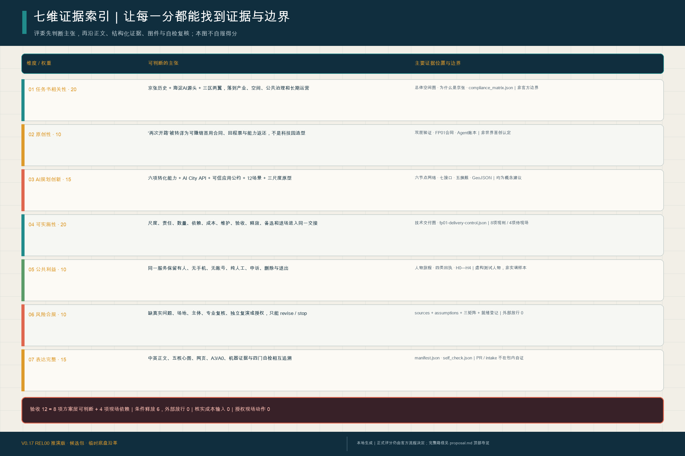

合规矩阵作为任务响应性的主控文件，已把公告 1.3、1.4、1.5 与 agent.1—agent.6 对应到报告章节、图层、指标、图纸、HTML、来源、假设和自检项；缺项会在专业证据门直接暴露，而不是由正文口号遮盖。

指标体系已经按三类状态保存：可由提交几何复算的面积、比例、长度与数量进入 `metrics.json`；需要官方控规或附件支撑的容积率、高度、密度、退线、道路红线与设施标准保持 `unknown`；需要运营或产业数据校准的 AI 创新、人才、服务满意度、慢行可达性、活动与场景绩效进入假设和后续披露字段。这样把设计选择、法定控制与运营绩效分开，避免把愿景误写成审定条件。

## 风险、版权与合规说明

本包已提供中文/英文 proposal、HTML、A3 文册、A0 展板及含文字图件的对应版本，并采用赛事术语表保持译名一致。图片、图纸、图标、数据和代码资产的来源、许可与授权状态记录在 `sources.json` 和 `report/copyright_statement.md`；离线 HTML 不加载远程脚本、地图瓦片、远程字体、iframe、表单或外部 API，也不跟踪评审者行为。为避免评审环境缺少中文系统字体，四份 HTML 共用一个本地 CSS，其中仅内嵌当前页面所需的 Noto Sans SC WOFF2 字形子集；字体取自固定的 Google Fonts 版本并遵循 SIL Open Font License 1.1，该资源只解决离线排版可移植性，不构成规划事实或方案证据 [source:FONT-NOTO-SANS-SC]。

公开资料边界、隐私保护、版权许可、人工复核与实施合规分别设门：本包只引用来源登记簿内的公开或已获许可材料；以后取得的非公开材料不得未经权利、保密和个人信息审查直接进入公开包。真实访谈、观察日志、回执或事件记录须先最小化和去标识，并由非供应商角色人工复核适用范围、同意状态和公开粒度；缺少授权、合法处理基础或可追溯来源时，材料不用于推进 H0—H4，也不用于证明实施成效。

开路符 / `JZ SWITCH MARK` 是本包为结构表达自行生成的概念标志方向，不复制或使用国徽、政府徽记、铁路企业标识、参赛机构商标或第三方官方视觉身份；它没有被授权为政府或项目正式 Logo。贡献谱不登记当前获奖者，也不构成官方荣誉、技术认证或商业排名。

风险和缺资料清单由风险深度项、空的约束图层和场地包共同校核 [depth:risk_missing_data] [data:geometry/constraints.geojson] [source:SITE-PACKAGE]。`missing_data_checklist.csv` 中列出的 official boundary、key area、控规、道路、地块、建筑、市政、文保和公共服务缺口均进入 `assumptions.json`、自检和正文风险章节。任何缺少官方控规、道路红线、权属、市政、消防或文保条件的结论，都降级为待确认事项；完整专业核对保存在标准矩阵中。

生成式 AI 服务只有在实际功能落入相应适用范围时，才进入生成内容标识、投诉处置等后续合规审查 [standard:GENERATIVE-AI-INTERIM-MEASURES]。无障碍信息、有人服务与非数字替代以无障碍法律和老年人智能技术政策作为深化参照，但本方案不把政策参照误写成已完成的逐项法定验收 [standard:BARRIER-FREE-ENVIRONMENT-LAW] [standard:ELDERLY-SMART-TECH-PLAN-2020-45]。

本方案把这次征集解释为 AI 参与公共领域复杂专业工作的早期制度样本，并将其视为观察中国 AI 应用与治理能力的一扇公开、可核查窗口；这是基于公开任务机制和过程记录作出的**设计判断**，不是政府授予的历史定位、国家级试点认定或世界领先结论。当前可核验的是 Agent 参与、结构化任务、公开版本协作、机器校验，以及将最终判断保留给人类与专业团队的规则和权限边界；正式判断、公共知识返还、是否入选、采用、实施及其长期历史意义仍须分别观察 [source:OPEN-CALL-PROJECT-STATEMENT] [source:AGENT-TASKBOOK] [source:SUBMISSION-INTAKE-PR-4017]。

本方案不声称国家级试点认定、政府授权、本投稿已被采纳、官方批准、审定控规、最终土地权属、最终建设规模、已经证明世界领先或保证实施。V0.17 在不改动 V0.3 空间证据底盘的前提下，以六项转化能力、稳定六节点网络和可信运行层重构总体叙事，并把 12 个场景编组为 5 个概念性旗舰试点；V0.6 已登记的 3 个嵌套街室、7 个接口实体、3 条人物旅程、3 个能力返还节点及相应指标继续作为可信运行证据。这些实体、试点、品牌层级、贡献类别、地标、可逆组件和 H0—H4 均为 `agent_generated_design`、`conceptual_not_statutory`、`official_siting=false` 的概念成果。嵌套房间没有增加公共空间 union 面积，接口、旅程和返还点只是空间责任索引；试点名称、联合体、90 日门槛、一年指标和资金安排不是政府许可、确认场址、法定程序、采购决定、签署合同或已部署服务。官方/专业资料缺口继续作为深化前提，不被伪装成已知条件 [depth:risk_missing_data] [source:SITE-PACKAGE] [data:geometry/constraints.geojson]。

## 参考资料

- brief/public-brief.md
- brief/site-package/design_brief.json
- brief/site-package/allowed_design_space.json
- brief/site-package/enums/
- brief/site-package/ranges/planning_limits.json
- data/processed/agent_fact_pack.md
- `sources.json`、`metrics.json`、`compliance_matrix.json`、`standard_matrix.json`、`design_depth_matrix.json`
- 本节书目入口依据场地包登记，完整出处和许可见结构化来源清单 [source:SITE-PACKAGE]
