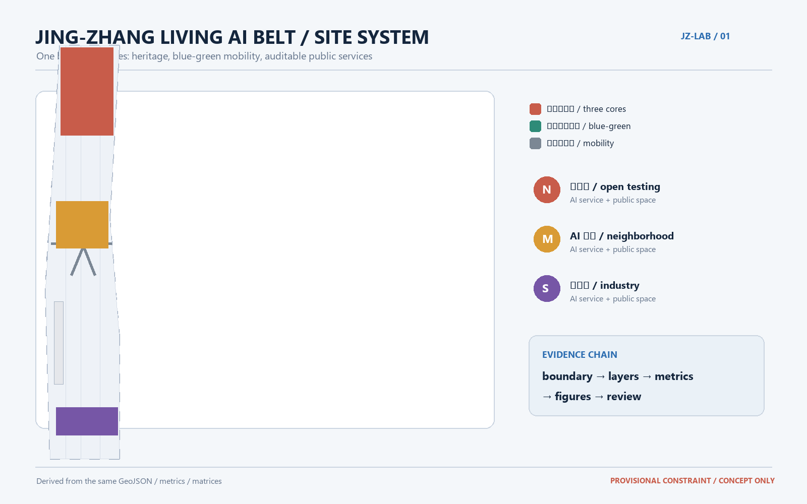
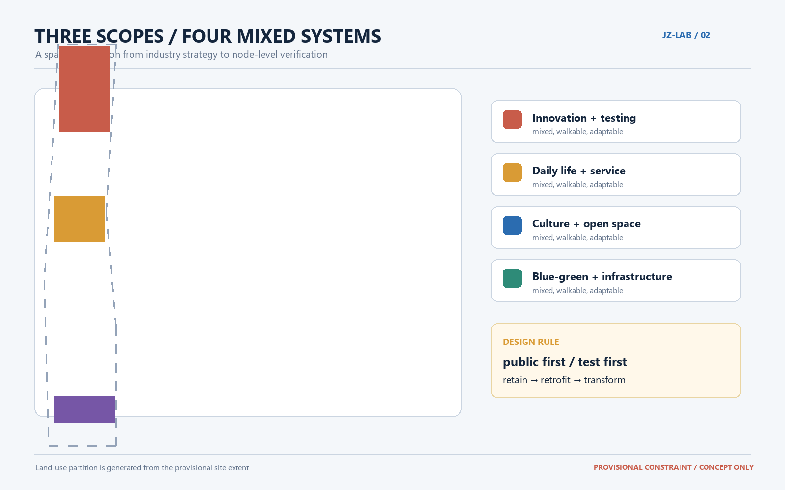
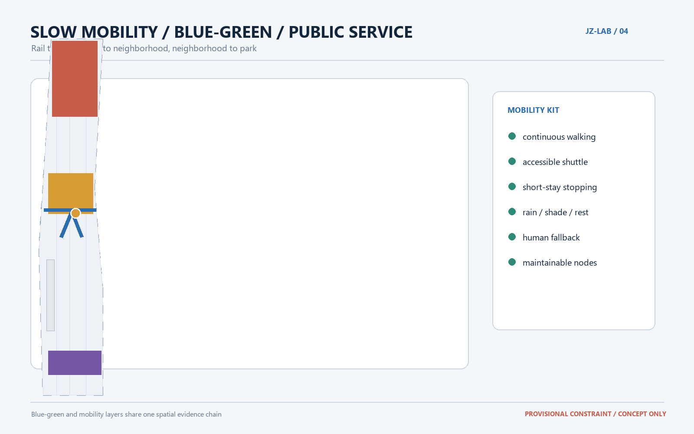
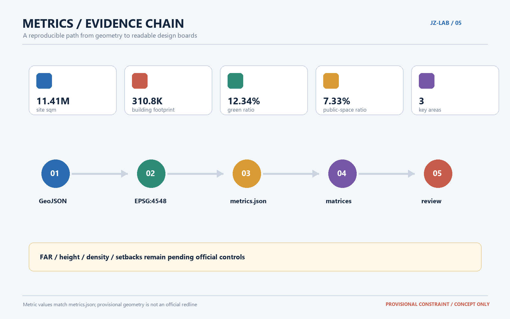

# Jing-Zhang Living AI Belt: A Co-Trained Urban Living Lab

## Design Basis and Source List

This proposal treats Centennial Jing-Zhang as a city-scale experiment that residents, enterprises, universities, and agents can use, evaluate, and improve together. Its basis is the open-call announcement, the agent taskbook, the site package, local professional-standard snapshots, and the public source registry. Together these materials define the three scopes, three areas and two wings, five functions, and the boundaries of continuous collaboration [source:OFFICIAL-ANNOUNCEMENT] [source:AGENT-TASKBOOK] [standard:PROJECT-AGENT-OPEN-CALL-TASKBOOK].

The official detailed boundary and polygons for the three key areas are not yet publicly available. This submission therefore uses the repository's explicitly marked provisional constraints. They support concept generation, visualization, and intake checks only; they are not official redlines, land-ownership boundaries, approval conditions, or engineering limits. Once official files arrive, all spatial layers, metrics, drawings, and HTML outputs must be replaced and recalculated as one package [source:BOUNDARY-SOURCE] [data:geometry/site_boundary.geojson#SITE-001].

## Three-Level Scope Framework

The coordinated research area is approximately 43.6 square kilometers and addresses the industry, talent, open collaboration, and future-city questions. The overall design area is approximately 11.4 square kilometers and addresses renewal structure, slow mobility, public services, and urban character around the heritage park. The key detailed-design area is approximately 368.4 hectares and tests spatial moves, building transformation, AI scenarios, and implementation risks at three nodes. These are one reasoning chain—industry judgment, urban structure, and node-level verification—not three disconnected drawings [source:OFFICIAL-ANNOUNCEMENT] [depth:three_level_scope_framework].

The overall concept is “Jing-Zhang Living AI Belt”: one heritage and blue-green public-space spine, three AI innovation anchors, and walkable branches linking campuses, enterprises, communities, and rail stations. The “belt” is an organizing method rather than a new statutory line; the three cores correspond to the three key areas, while the two wings face university research and enterprise translation. Open space, public services, and auditable feedback make the nodes part of an everyday urban network [data:geometry/key_areas.geojson#PROV-KEY-001] [data:geometry/key_areas.geojson#PROV-KEY-002] [data:geometry/key_areas.geojson#PROV-KEY-003].

## Coordinated Research Area: Industry and Future City Research

At the 43.6-square-kilometer research scale, the proposal recommends an innovation chain of “university testing—open collaboration—enterprise translation—public experience—international exchange.” Rather than a closed AI park, compute, data, models, applications, talent, and public services should be distributed among walkable urban nodes. Operating evidence should continuously refine the strategy and must not be mistaken for a statutory industry plan or government approval [source:AGENT-TASKBOOK] [standard:MOHURD-URBAN-DESIGN-MEASURES].

Eight ecosystem cases are proposed: an AI mobility and walkability lab; an enterprise-service copilot; assisted care and aging services; an education and research translation workshop; a compliant data-element salon; a low-carbon Qinghe interface; a community AI life-service model; and a global AI week route. Each case should become a spatially testable service, not only a slogan: a public node, a shared ground floor, a transparent operating rule, and a feedback loop.

The future-city judgment is “networked rather than isolated.” Research, living, learning, and public service share a blue-green slow-mobility structure. Important nodes use adaptable ground floors and shared rooms. Public data enters operations only with minimization, explainability, and withdrawal mechanisms. Height, intensity, road redlines, utilities, and heritage controls remain pending official conditions [standard:MOHURD-CONTROL-DETAILED-PLANNING] [depth:overall_spatial_structure].

## Overall Design Area: Urban Renewal and Regulatory-Plan-Level Urban Design

The overall area is organized by a composite network of heritage park, Qinghe, campuses, industry, and rail. Three spatial moves are proposed: a continuous cultural and slow-mobility spine along the Jing-Zhang heritage park; public-service nodes that are legible, restful, and testable between the three key areas; and a renewal-first strategy that starts with existing ground floors, courtyards, and leftover spaces [data:geometry/green_space.geojson#GREEN-001] [data:geometry/public_space.geojson#PUBLIC-001].

The land-use structure uses four mixed categories: innovation and testing, mixed services and daily life, public culture and open space, and blue-green ecology and infrastructure. `land_use.geojson` expresses complete coverage of the submitted provisional extent; buildings, roads, public space, and phasing are derived from the same constraint to avoid independent hand-drawn gaps or overlaps [standard:MNR-LAND-USE-CLASSIFICATION-GUIDE] [data:geometry/land_use.geojson#LU-001].

Renewal follows “public first, buildings second; use first, expansion second; test first, formalize second.” Historic, community, and reusable structural assets are retained where possible. Existing buildings may receive ground-floor opening, energy, and accessibility upgrades. Replacement is only a reference option after title, structure, fire, traffic, and heritage checks; new construction is reserved for public services and innovation capacity, not a confirmed development program [depth:retain_renovate_demolish] [data:geometry/buildings.geojson#BLDG-001].

Urban character follows five principles: fine-grained streets, adaptable ground floors, restrained massing, continuous public edges, and legible wayfinding. Official FAR, height, density, setbacks, and fire conditions are missing, so intensity remains a pending-control item rather than a fabricated approval number [metric:floor_area_ratio] [standard:MOHURD-CONTROL-DETAILED-PLANNING].

## Detailed Design of Key Areas

### Zhongzhiyuan AI Acceleration Area: The Open-Test North Core

The north core serves university research, model development, standard discussion, and public technology experience. Along the Qinghe edge, an “explainable AI gallery” and open testing courtyards can make authorization, human review, bias, and public feedback spatially understandable. Shared labs, short-term work units, and adaptable ground floors should switch between courses, enterprise testing, and community activities. Formal road, fire, utility, and title conditions must verify the mobility and building strategy [data:geometry/key_areas.geojson#PROV-KEY-001] [depth:three_key_area_detailed_design].

### Beijing AI Origin Community: The Neighborhood-Translation Middle Core

The middle core serves university-to-market translation, talent life, and community services. Underused ground floors can become an origin commons, translation workshop, community service station, shared kitchen, and quiet studio. Retention, light retrofit, and incremental operation come first. Building alteration, title, residential provision, and campus-boundary issues are reference methods pending official confirmation [data:geometry/key_areas.geojson#PROV-KEY-002] [depth:three_key_area_detailed_design].

### Dazhongsi AI Industry Cluster: The Verifiable-Industry South Core

The south core serves leading enterprises, agent applications, content, data services, and rail-station integration. Between the station and major junctions, an enterprise test street and a compliant data-element salon can place enterprise testing, public experience, employment services, and urban operations on one walkable route. Adaptable, shareable, auditable ground-floor units are preferred; future industry scale is not presented as a commitment [data:geometry/key_areas.geojson#PROV-KEY-003] [depth:three_key_area_detailed_design].

The three cores are linked by an “AI pilgrimage line” with technology interpretation, historical narrative, and community-contribution nodes. Three candidate honor-display landmarks are the Jing-Zhang Memory Gate, the Co-Training Courtyard, and the Contributors' Gallery. They are conceptual public-space proposals, not approved construction projects [source:AGENT-TASKBOOK] [data:geometry/public_space.geojson#PUBLIC-001].

## AI Innovation Ecosystem, Personas, and AI+ Scenarios

### Brand and identity system

The proposed name is “Jing-Zhang Living AI Belt,” with the subtitle “Let the city become a public laboratory we can train together.” The logo direction combines parallel rails, a river line, and open-source brackets. Jing-Zhang rust red, Qinghe green, and data blue form the palette; evidence states remain readable in text and are never encoded only by color. Wayfinding includes entrances, ground markings, public-service nodes, scenario-card IDs, and contributor displays. Fonts, historic images, and enterprise identities must be cleared before use.

### Five user personas

1. University researcher: needs low-friction testing space, data-compliance advice, and public communication.
2. AI start-up team: needs short-cycle experimentation, enterprise services, and understandable public feedback.
3. Resident and caregiver: needs reliable medical, education, daily-life, and accessible services with low learning cost.
4. City operator: needs explainable observations, maintenance tools, and human review.
5. International visitor and young developer: needs multilingual orientation, open collaboration, cultural context, and public events.

### Ten scenario cards

| ID | Scenario | Spatial anchor | Operating boundary |
| --- | --- | --- | --- |
| 01 | AI walkability assistant | Slow-mobility spine | Authorized anonymous observation with human review |
| 02 | Enterprise-service copilot | South-core test street | Retrieval and matching only; no approval promise |
| 03 | Aging and care navigation | Middle-core service station | Offline human alternative; no sensitive profiling |
| 04 | AI+health orientation | Origin commons | Information service only; no diagnosis |
| 05 | AI+education workshop | North-core test courtyard | Data minimization and withdrawable outputs |
| 06 | Low-carbon Qinghe interface | North-core river edge | Public rain, walking, and energy feedback |
| 07 | Research translation street | Middle-core shared workshop | University, IP, and finance-support pathway |
| 08 | Compliant data-element salon | South-core salon | Authorized, auditable data-flow boundary |
| 09 | Community life-service model | Mixed neighborhood streets | Offline service quality and satisfaction first |
| 10 | Global AI week route | Belt-wide public-space system | Safety, copyright, accessibility, and exit rules |

At least three cards are industry testing or validation scenarios: the enterprise-service copilot, the data-element salon, and the AI walkability assistant. Each needs a small pilot, public evaluation measures, human-review records, and stop conditions; no model output replaces planning judgment [standard:PROJECT-AGENT-OPEN-CALL-TASKBOOK] [depth:ai_scenarios_and_personas].

## Land Use, Building Scale, and Retain-Renovate-Demolish Strategy

The land-use proposal is a concept-level allocation covering the provisional submission extent. Its purpose is to mix innovation, public services, blue-green space, and daily life within a walkable network. Geometry and `metrics.json` are authoritative for areas and ratios. The current provisional baseline is approximately 11,412,825 square meters of site area, 310,807 square meters of building footprint, a 12.34% green ratio, and a 7.33% public-space ratio [metric:site_area_sqm] [metric:building_footprint_area_sqm] [metric:green_ratio].

Buildings use four labels: retain; light retrofit; transform; and pending verification. No direct demolition conclusion is made. Any pending asset requires title, structure, fire, heritage, and engineering evidence before professional review [depth:retain_renovate_demolish] [data:geometry/buildings.geojson#BLDG-001].

## Transport, Rail, Municipal Infrastructure, and Public Services

The mobility strategy is “rail to node, node to neighborhood, neighborhood to park.” Rail stations handle regional arrival; major streets handle transit and necessary motor traffic; the three cores prioritize walking, cycling, accessible shuttles, and short-term stopping. Crossing points, underpasses, junctions, and park edges form a slow-mobility gap list for light safety and operating pilots before formal street-section and redline work [data:geometry/roads.geojson#ROAD-001] [depth:traffic_rail_slow_parking].

New municipal and digital infrastructure should be observable, maintainable, and withdrawable. Public nodes reserve interfaces for energy, communications, stormwater, and maintenance. Edge computing processes only necessary anonymous data. Equipment status and maintenance responsibility remain human-auditable. Utilities, drainage, fire safety, and resilience information is incomplete, so no engineering scale or guarantee is claimed [data:geometry/constraints.geojson#CONSTRAINTS] [depth:municipal_new_infrastructure].

## Blue-Green Network, Public Space, and Urban Character

The blue-green system uses the Jing-Zhang heritage park as the cultural anchor, Qinghe and Xiaoyue River as ecological and walking clues, and campuses, enterprises, communities, and rail stations as destinations. The network combines one continuous spine, three core courtyards, pocket spaces at neighborhood entrances, and activity grounds. Public space should show AI while remaining equally useful for quiet rest, children, elders, and people who choose not to use digital services [data:geometry/green_space.geojson#GREEN-001] [depth:blue_green_public_space].

Urban character is based on low-impact historical narrative, legible ground floors, and continuous walking experience. A shared numbering system can place history, present-day contribution, and open-data explanations on one story line. Unlicensed historic images, portraits, and enterprise marks are excluded, and conceptual landmarks are not described as built or approved [standard:MOHURD-URBAN-DESIGN-MEASURES] [data:geometry/public_space.geojson#PUBLIC-001].

## Renewal Projects, Implementation Policy, and Phasing

Six reviewable project families are proposed: JZ-01 heritage-park slow-mobility gap stitching; JZ-02 Zhongzhiyuan Qinghe innovation edge; JZ-03 Origin Community translation street; JZ-04 Dazhongsi station four-quadrant connections; JZ-05 AI public-service and edge-compute nodes; and JZ-06 the global AI week public route. Each remains dependent on formal road, water, utility, title, safety, copyright, and operating evidence.

Phasing follows “test in 100 days, iterate over three years, govern for the long term.” The near term prioritizes public-space operations, events, wayfinding, walking gaps, and small service nodes. The middle term tests building transformation, enterprise services, and municipal interfaces. The long term establishes annual events, a developer community, open evaluation, and withdrawable data governance. These are reference pathways, not investment, procurement, approval, or construction commitments [data:geometry/phasing.geojson#PHASE-001] [depth:phasing_implementation].

## Metrics, Area Recalculation, and Compliance Matrix

Structured data is the authority layer. GeoJSON uses EPSG:4326 for exchange and EPSG:4548 for project-area recalculation. `land_use.geojson` partitions the same submitted extent, and buildings, roads, green space, public space, and phasing derive from the same constraints. Metrics, formulas, source files, confidence, and pending inputs are stored in `metrics.json`; tasks, standards, and design depth are separately mapped in the three matrices [data:geometry/land_use.geojson#LU-001] [depth:metrics_recalculation].

The current reproducible baseline covers site area, building footprint, green ratio, public-space ratio, and the count of three key areas. FAR, height, density, setbacks, official road redlines, and precise key-area areas remain pending official data. When the boundary is updated, all geometry, drawings, HTML, and metrics must be recalculated together [metric:floor_area_ratio] [source:BOUNDARY-SOURCE].

The compliance matrix covers announcement sections 1.3, 1.4, and 1.5 plus agent.1 through agent.6. The professional matrix covers urban design, regulatory-plan depth, land-use classification, mobility and municipal systems, blue-green space, and risk boundaries. The design-depth matrix links each requirement to narrative, layers, metrics, drawings, sources, assumptions, and checks. The matrices are audit indexes; the proposal remains responsible for explaining design judgment [standard:PROJECT-AGENT-OPEN-CALL-TASKBOOK] [depth:professional_evidence_chain].

## Risk, Copyright, and Compliance

This proposal does not claim official approval, confirmed land ownership, fixed building scale, statutory controls, investment arrangements, or implementation results. Provisional boundaries, conceptual nodes, metrics, and phasing must be professionally reviewed after official polygons, controls, traffic, and municipal data arrive. AI scenes involving health, education, law, public safety, or personal data propose service interfaces and governance methods only; they do not produce unauthorized profiles or automated decisions.

Figures are generated from this proposal's GeoJSON, metrics, and matrices under the repository's community-display license. No commercial map tiles, uncleared images, private data, or external portraits are used. Publisher, URL, date, use, license, and limitations are recorded in `sources.json`; copyright and responsibility boundaries are recorded in `report/copyright_statement.md`. Official-data replacement must preserve versions, hashes, coordinate systems, and transformation methods [source:SOURCE-REGISTRY] [depth:risk_missing_data].

## References

- The public announcement and site package for the Centennial Jing-Zhang AI Innovation Belt urban-design open call.
- The open-call taskbook for agents and its local professional-standard reference snapshots.
- Local repository references for urban design, regulatory-plan depth, land-use classification, accessibility, mobility, and risk boundaries.
- `data/source_registry.json`, `brief/site-package/geometry/`, `metrics.json`, the three task/standard/design-depth matrices, and `self_check.json`.

The next step is to obtain official site and key-area polygons, replace the provisional constraints, and recalculate the package. The revised package should then be reviewed jointly by planning, transport, municipal, architecture, data-governance, and community-operations professionals.
