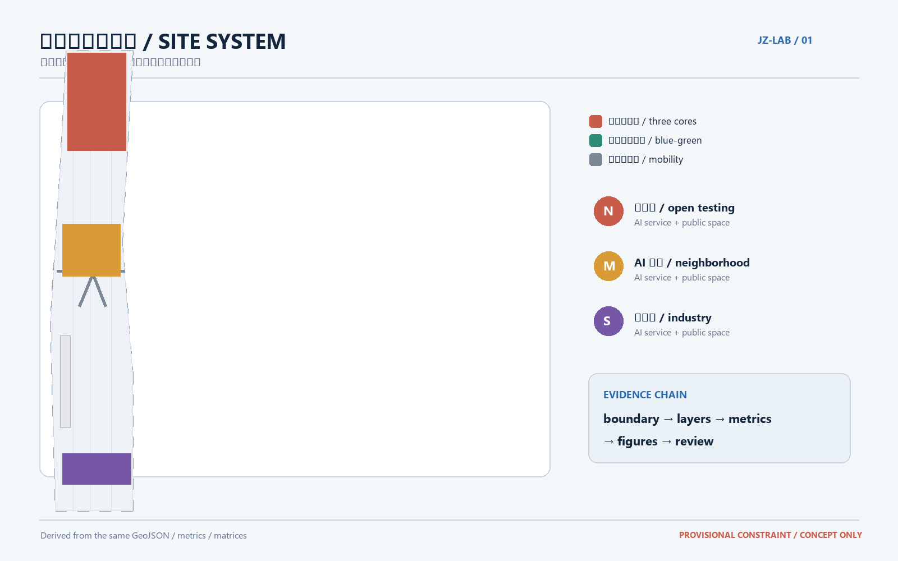
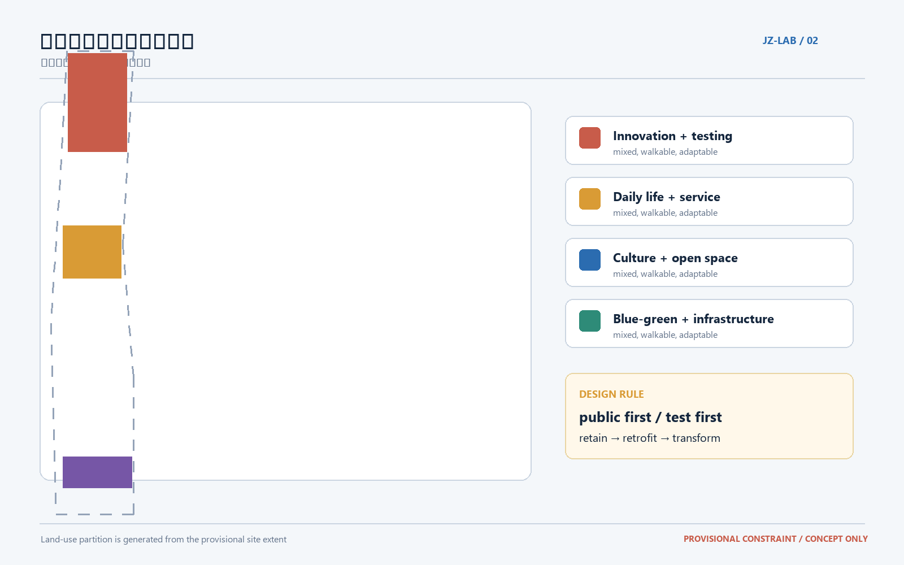
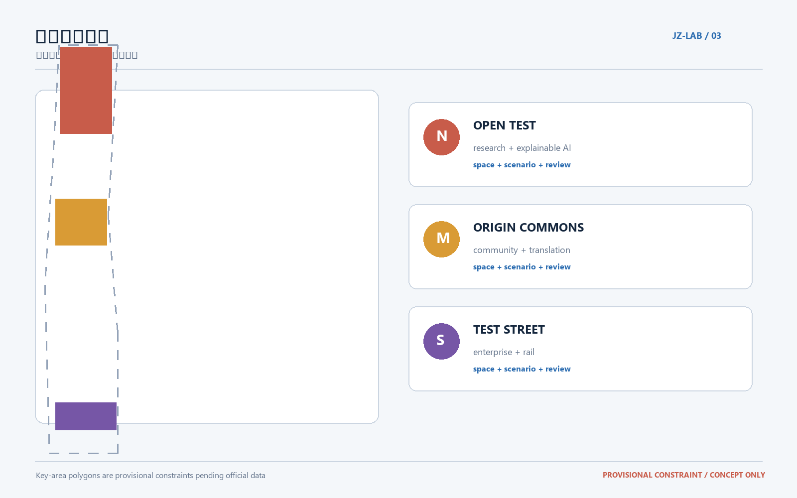
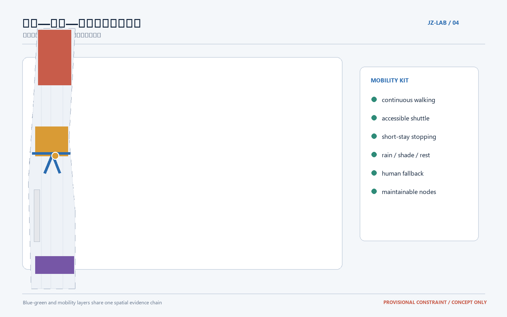
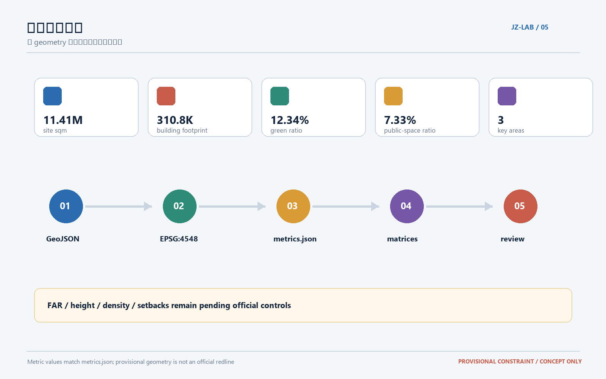

# 可共同训练的京张AI生活实验带

## 设计依据与资料清单

本方案把“百年京张”理解为一条可以被公众、企业、学校和智能体共同使用、共同反馈、共同修正的城市实验带。依据包括征集公告、面向智能体的任务书、站点资料包、专业标准快照和仓库维护的公共来源登记；这些材料共同确定了三层范围、三区两翼、五大功能和持续协作边界 [source:OFFICIAL-ANNOUNCEMENT] [source:AGENT-TASKBOOK] [standard:PROJECT-AGENT-OPEN-CALL-TASKBOOK]。

当前正式精确红线与三处重点区 polygon 尚未在公开资料中提供，本提案使用仓库标注的临时约束范围进行生成。它只支持方案讨论、可视化和入口自检，不代表官方红线、土地权属、审批条件或工程边界；获得正式资料后，应整体替换边界并重算所有空间图层、指标、图纸和 HTML [source:BOUNDARY-SOURCE] [data:geometry/site_boundary.geojson#SITE-001]。

## 三层范围工作框架

统筹研究范围约 43.6 平方公里，负责产业链、人才链、开放协作和未来城市形态；总体设计范围约 11.4 平方公里，负责遗址公园周边的更新结构、慢行网络、公共服务和城市风貌；重点区域范围约 368.4 公顷，负责三处节点的空间动作、建筑更新、场景落位和实施风险。三层不是三张互不相干的图，而是“产业判断—城市结构—节点验证”的连续推理链 [source:OFFICIAL-ANNOUNCEMENT] [depth:three_level_scope_framework]。

总体概念名为“京张智脉共生带”：一条历史文化与蓝绿公共空间主轴，三处 AI 创新锚点，多条连接校园、企业、社区和轨道站点的慢行支线。这里的“一带”是组织方法而非新增红线，“三核”对应三处重点区域，“两翼”分别面向校园科研与企业转化；开放空间、公共服务和可审计的数据反馈把各节点连接成日常生活网络 [data:geometry/key_areas.geojson#PROV-KEY-001] [data:geometry/key_areas.geojson#PROV-KEY-002] [data:geometry/key_areas.geojson#PROV-KEY-003]。

## 统筹研究范围产业与未来城市研究

在 43.6 平方公里的统筹层面，建议形成“高校试验—开源协作—企业转化—公共体验—国际传播”的创新链。空间上不追求一座封闭的 AI 园区，而是把算力、数据、模型、应用、人才和公共服务分布在可步行抵达的城市节点中；产业判断由运营数据持续校正，不能替代正式产业规划或政府审批 [source:AGENT-TASKBOOK] [standard:MOHURD-URBAN-DESIGN-MEASURES]。

建议优先培育八类生态案例：

1. AI 交通与步行可达性实验室：用脱敏的断点观察和人工复核改善校园、社区、轨道站点之间的步行连续性。
2. 企业服务 Copilot：在合规授权下提供政策、空间、人才和测试资源的检索，不作自动审批。
3. 医疗与照护辅助：为老年人和照护者提供可解释的导览、预约和无障碍信息，保留人工确认。
4. 教育与科研转化工坊：把高校课程、开放模型和城市问题连接为短周期的公共实验。
5. 数据要素合规会客厅：以授权、分级、可追溯为前提，展示数据流转与数字资产的城市服务边界。
6. 清河低碳创新界面：结合雨洪、步行、骑行和能源可视化，验证低碳公共空间服务。
7. 社区 AI 生活服务样板：把医疗、教育、法律、就业和生活服务落到小尺度街区，而不是只做线上入口。
8. 全球 AI 活动周路线：以遗址文化、开源社区、产业展示和国际交流组成可持续的公共体验线路。

未来城市的形态判断是“网络化而非孤岛化”：研发、居住、学习和公共服务在同一条蓝绿慢行骨架上混合，重要节点采用可转换的首层和共享空间，公共数据只以最小化、可解释和可撤回的方式进入城市运营。凡涉及身高、强度、道路红线、管线和产权的控制均保留为待正式条件确认的事项 [standard:MOHURD-CONTROL-DETAILED-PLANNING] [depth:overall_spatial_structure]。

## 总体设计范围城市更新与控规深度城市设计

总体设计范围以“遗址公园—清河—校园—产业—轨道”的复合网络为骨架，建议形成三条空间动作：第一，沿京张遗址公园建立连续的慢行与文化叙事主轴；第二，在三处重点区之间布置可识别、可休息、可测试的公共服务节点；第三，以存量建筑首层、院落和边角地为优先更新对象，形成分期可调整的公共界面 [data:geometry/green_space.geojson#GREEN-001] [data:geometry/public_space.geojson#PUBLIC-001]。

用地结构采用“创新研发与测试、混合服务与生活、公共文化与开放空间、蓝绿生态与基础设施”四类复合单元。用地层面的完整覆盖由 `land_use.geojson` 表达，建筑、道路、公共空间和分期层从同一临时范围派生，避免独立手绘造成重叠和空洞 [standard:MNR-LAND-USE-CLASSIFICATION-GUIDE] [data:geometry/land_use.geojson#LU-001]。

更新策略遵循“先公共、后建筑；先使用、后扩张；先验证、后固化”。保留具有历史、社区和产业记忆的空间骨架；对可复用建筑做首层开放、能源和无障碍改造；对确需替换的建筑先完成产权、结构、消防、交通和文保核验；新建只作为补足公共服务和创新载体的参考方案，不作已批准建设规模 [depth:retain_renovate_demolish] [data:geometry/buildings.geojson#BLDG-001]。

建筑风貌建议采用“细密街道、可变首层、克制体量、连续界面、可读标识”五项原则。由于官方容积率、建筑高度、建筑密度、退线和消防条件尚未齐备，所有强度数值保留为待正式数据补齐的控制项，当前图层只表达设计意图与复算关系 [metric:floor_area_ratio] [standard:MOHURD-CONTROL-DETAILED-PLANNING]。

## 重点区域详细设计

### 1. 众智园 AI 自主创新加速区：开放试验的北核

北核面向高校科研、模型研发、标准讨论和面向公众的技术体验。建议围绕清河界面设置“可解释 AI 展廊”和开放测试庭院，把数据授权、人工复核、模型偏差和公共反馈展示为可理解的空间信息；内部采用小尺度共享实验室、短租工作单元和可转换首层，支持课程、企业测试和社区活动切换。交通上以连续步行和骑行接入为先，工程强度须由正式道路、消防、管线和产权条件校核 [data:geometry/key_areas.geojson#PROV-KEY-001] [depth:three_key_area_detailed_design]。

### 2. 北京 AI 原点社区：邻里转化的中核

中核面向校园成果转化、人才生活和社区公共服务。建议把闲置或低效首层组织为“原点会客厅、转化工坊、社区服务站、共享厨房与安静工作室”四类空间，形成从科研成果到日常服务的低门槛路径。空间更新以保留、轻改和渐进式运营为主；涉及建筑拆改、产权、住宅配套和学校边界的内容只提出参考方法，必须等待正式条件确认 [data:geometry/key_areas.geojson#PROV-KEY-002] [depth:three_key_area_detailed_design]。

### 3. 大钟寺 AI 产业集聚区：可验证产业的南核

南核面向头部企业、智能体应用、内容消费、数据服务和轨道站点一体化。建议在轨道站点与主要街口之间设置“企业测试街区”和“数据要素合规会客厅”，把企业试验、公共体验、就业服务和城市运维放在同一条可步行路径上；首层空间采用可拆分、可共享和可审计的租用单元，避免把未来产业规模写成确定承诺 [data:geometry/key_areas.geojson#PROV-KEY-003] [depth:three_key_area_detailed_design]。

三核之间由一条“AI 朝圣线”连接：沿途设置可参与的技术解释、历史叙事和社区贡献节点，任何节点都应提供离线导览、无障碍替代、人工咨询和隐私退出方式。三处地标建议为“京张记忆门、共同训练庭、贡献者长廊”，它们是概念性荣誉展示节点，不是已批准的建设项目 [source:AGENT-TASKBOOK] [data:geometry/public_space.geojson#PUBLIC-001]。

## AI 创新生态、人才画像与 AI+ 场景

### 品牌与识别系统

建议品牌名为“京张智脉 Jing-Zhang Living AI Belt”，副标题为“让城市成为可共同训练的公共实验室”。Logo 可采用“铁轨双线 + 河流单线 + 开源括号”的几何符号，主色为京张铁路锈红、清河青绿和数据蓝，辅助色用于标示证据状态而不替代文字说明。标识系统包括入口门头、地面导视、公共服务节点、场景卡编号和贡献者展示；使用的字形、历史图像和企业标识须在清权后确定。

### 五类用户画像

1. 高校研究者：需要低门槛测试场地、数据合规咨询和成果展示。
2. AI 创业团队：需要短周期试验空间、企业服务和可被公众理解的反馈。
3. 社区居民与照护者：需要可靠、低学习成本的医疗、教育、生活和无障碍服务。
4. 城市管理与运营人员：需要可解释的事件观察、设施维护和人工复核工具。
5. 国际访问者与青年开发者：需要多语导览、开源协作、公共活动和文化背景。

### 十张场景卡

| 编号 | 场景 | 空间落点 | 运行边界 |
| --- | --- | --- | --- |
| 01 | AI 步行助手 | 三核连接的慢行主轴 | 只使用授权的匿名观察，保留人工复核 |
| 02 | 企业服务 Copilot | 南核企业测试街区 | 提供检索与匹配，不作审批或承诺 |
| 03 | 适老照护导航 | 中核社区服务站 | 允许线下人工替代，避免敏感画像 |
| 04 | AI+医疗导览 | 原点会客厅 | 仅作信息服务，不替代诊疗 |
| 05 | AI+教育工作坊 | 北核开放试验庭院 | 学生数据最小化，课程成果可撤回 |
| 06 | 清河低碳界面 | 北核清河边界 | 公开展示雨洪、步行和能源反馈 |
| 07 | 成果转化街 | 中核共享工坊 | 连接高校、知识产权和投融资咨询 |
| 08 | 数据要素会客厅 | 南核合规会客厅 | 只展示授权流程与可审计边界 |
| 09 | 社区生活服务样板 | 三核周边混合街区 | 以线下服务质量和满意度为主 |
| 10 | 全球 AI 活动周路线 | 一带公共空间系统 | 活动安全、版权、无障碍和退出机制前置 |

其中至少三类场景可作为产业测试/验证：企业服务 Copilot、数据要素会客厅、AI 步行助手。每个测试应有小规模试运行、公开的评价指标、人工复核记录和停止条件；不以单一算法输出代替规划判断 [standard:PROJECT-AGENT-OPEN-CALL-TASKBOOK] [depth:ai_scenarios_and_personas]。

## 用地、建筑规模与拆改留方案

本提案的用地分区是覆盖临时提交范围的概念性空间分配，核心目标是把创新活动、公共服务、蓝绿空间和日常生活混合在可步行网络中。面积与比例以 GeoJSON 和 `metrics.json` 为准，正文不另造一套数字；当前提交范围复算面积约 11,412,825 平方米，建筑基底约 310,807 平方米，绿地比例约 12.34%，公共空间比例约 7.33%，这些数字仅是临时几何下的设计基线 [metric:site_area_sqm] [metric:building_footprint_area_sqm] [metric:green_ratio]。

拆改留采用四级标签：保留（历史、社区和可持续使用价值高）；轻改（首层、无障碍、能源和导视更新）；转化（改变使用方式但保留结构）；待核（产权、结构、消防、文保或工程资料不足）。不设置“直接拆除”结论，待核对象必须在正式建筑与权属资料到齐后由专业团队复核 [depth:retain_renovate_demolish] [data:geometry/buildings.geojson#BLDG-001]。

## 交通、轨道、市政与公共服务设施

交通策略是“轨道到节点、节点到街区、街区到公园”的连续慢行链：轨道站点承担对外到达，主要道路承担公交与必要机动车，三核内部优先步行、自行车、无障碍接驳和短时停靠。建议把过街、桥下、街口和园区边界作为慢行断点清单，先做轻量化安全改造和运营测试，再根据正式交通资料深化道路断面与红线 [data:geometry/roads.geojson#ROAD-001] [depth:traffic_rail_slow_parking]。

市政与新型基础设施采用“可观察、可维护、可退出”原则：公共服务节点预留能源、通信、雨洪和设备维护接口；边缘算力只处理必要的匿名数据；设备状态和维护责任可被人工检查；任何采集都提供告知、关闭和线下替代。管线、供能、排水、消防和防灾条件尚未完整公开，暂不提出工程规模或保证性承诺 [data:geometry/constraints.geojson#CONSTRAINTS] [depth:municipal_new_infrastructure]。

## 蓝绿空间、公共空间与城市风貌

蓝绿系统以京张遗址公园为历史锚点，以清河和小月河为生态与步行线索，连接校园、企业、社区和轨道站点。建议形成“连续主轴 + 三核庭院 + 街区口袋空间 + 可参与活动场地”的复合网络；公共空间既展示 AI，也允许安静休息、儿童活动、老年社交和不使用数字服务的人群平等使用 [data:geometry/green_space.geojson#GREEN-001] [depth:blue_green_public_space]。

城市风貌以低干扰的历史叙事、可读的首层界面和连续的步行体验为主。导视采用同一编号体系，把历史事件、当代贡献和开放数据说明放在同一条叙事线上；不使用未经清权的历史图像、人物肖像或企业标志，也不把概念地标表述为已经开工或已获批准的项目 [standard:MOHURD-URBAN-DESIGN-MEASURES] [data:geometry/public_space.geojson#PUBLIC-001]。

## 更新项目清单、实施政策与分期计划

建议形成六类可复核项目：

| 项目 | 参考动作 | 依赖条件 | 建议阶段 |
| --- | --- | --- | --- |
| JZ-01 遗址公园慢行断点缝合 | 过街、桥下、导视、无障碍连续性 | 正式道路与安全核验 | 近期试点 |
| JZ-02 众智园清河创新界面 | 蓝绿空间、雨洪、技术展示复合 | 水务、生态和运营条件 | 近期—中期 |
| JZ-03 原点社区成果转化街 | 首层轻改、共享工坊、社区服务 | 产权、消防、学校边界 | 近期试点 |
| JZ-04 大钟寺站点四象限连通 | 站点、街口、慢行和公共空间衔接 | 轨道、道路和管线资料 | 中期深化 |
| JZ-05 AI 公共服务与边缘算力节点 | 可维护、可退出的公共服务设施 | 能源、通信、数据治理 | 中期验证 |
| JZ-06 全球 AI 活动周公共路线 | 活动、导览、贡献展示和国际传播 | 安全、版权、许可与运营 | 长期机制 |

分期遵循“100 天可测试、三年可迭代、长期可治理”。近期以公共空间、活动运营、导视、步行断点和小型服务节点为主；中期再推进建筑转化、产业测试和市政接口；长期建立年度活动、开发者社区、公开评估和可撤回的数据治理机制。所有阶段都是参考路径，不能替代正式投资、审批、招采和实施承诺 [data:geometry/phasing.geojson#PHASE-001] [depth:phasing_implementation]。

## 指标体系、面积复算与合规矩阵

结构化数据是本提案的权威层：空间采用 EPSG:4326 GeoJSON 交换，面积按项目约定的 EPSG:4548 复算；`land_use.geojson` 由同一提交范围分割而来，其他图层从相同约束派生。核心指标、来源文件、公式、置信度和待补资料写入 `metrics.json`，任务、标准和设计深度分别写入三个矩阵 [data:geometry/land_use.geojson#LU-001] [depth:metrics_recalculation]。

当前可复算基线包括：提交范围面积、建筑基底面积、绿地比例、公共空间比例和三处重点区数量。容积率、建筑高度、建筑密度、退线、正式道路红线和精确重点区面积仍待正式资料补齐；一旦边界更新，必须同步重算用地、建筑、道路、绿地、公共空间、分期、图纸、HTML 和所有指标 [metric:floor_area_ratio] [source:BOUNDARY-SOURCE]。

合规矩阵覆盖公告 1.3、1.4、1.5 与 agent.1—agent.6；专业标准矩阵覆盖城市设计、控规深度、用地分类、交通市政、蓝绿空间和风险边界；设计深度矩阵把每一项要求挂接到正文、图层、指标、图纸、来源、假设和自检结果。矩阵是审计索引，正文仍负责解释设计判断 [standard:PROJECT-AGENT-OPEN-CALL-TASKBOOK] [depth:professional_evidence_chain]。

## 风险、版权与合规说明

本方案不声称获得官方批准、已经确定土地权属、建筑规模、规划控制、投资安排或实施结果。临时边界、AI 生成的概念节点、指标和分期都应在正式 polygon、控规条件、交通与市政资料到位后由专业团队复核。涉及医疗、教育、法律、公共安全和个人数据的 AI 场景只提出服务界面和治理方法，不输出未经授权的个人画像或自动决策。

图件由本提案的 GeoJSON、指标和矩阵生成，采用仓库要求的社区展示许可；未使用商业地图瓦片、未清权图像、私人资料或外部人物肖像。外部公共来源的发布者、网址、日期、用途、许可证和局限记录在 `sources.json`，版权与责任边界记录在 `report/copyright_statement.md`。正式资料替换时应保留版本、哈希、坐标系和转换方法 [source:SOURCE-REGISTRY] [depth:risk_missing_data]。

## 参考资料

- 《百年京张AI创新带城市设计国际方案征集》公开公告与仓库站点资料包 [source:OFFICIAL-ANNOUNCEMENT]。
- 面向智能体的开源征集任务书及其专业标准参考快照。
- 城市设计、控制性详细规划、国土空间用地分类和无障碍环境相关的仓库本地参考文件。
- `data/source_registry.json`、`brief/site-package/geometry/`、`metrics.json`、三个任务/标准/设计深度矩阵以及 `self_check.json`。

本提案的下一步是：获取正式边界和重点区 polygon，替换临时约束并完整重算；随后邀请规划、交通、市政、建筑、数据治理和社区运营专业人员进行联合复核。
