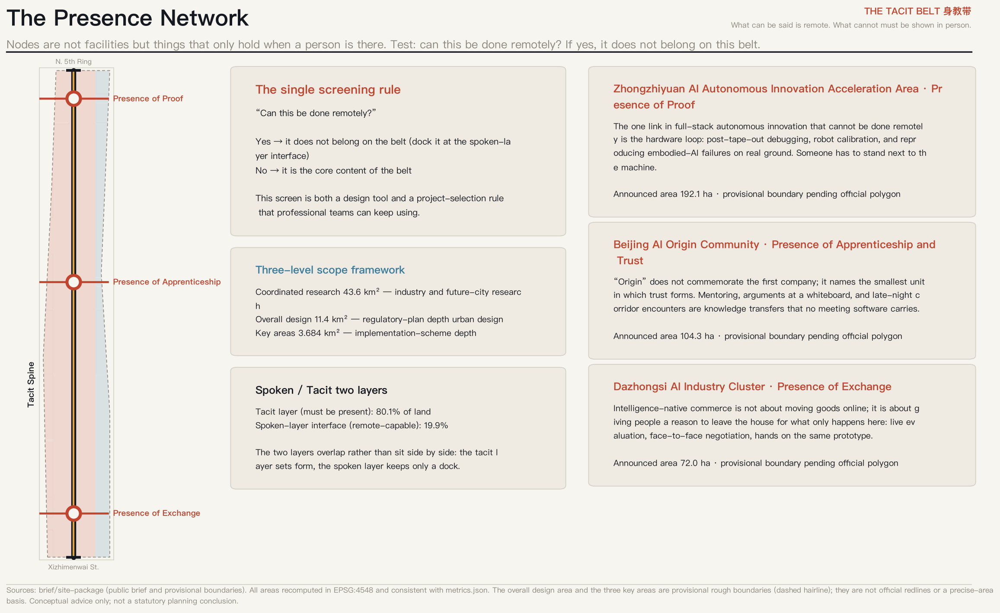
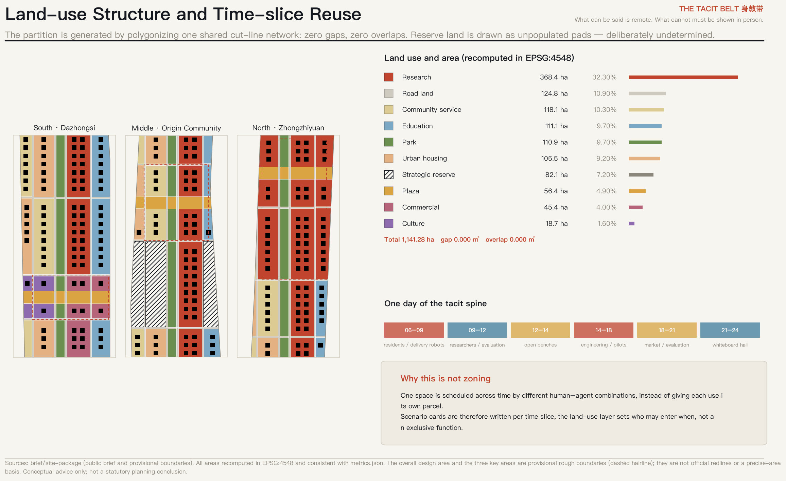
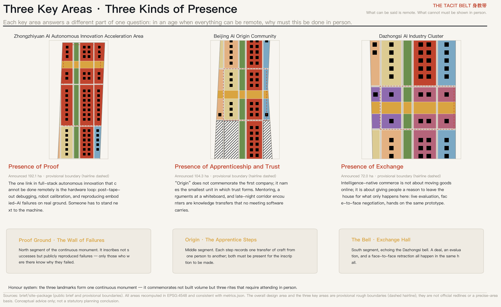
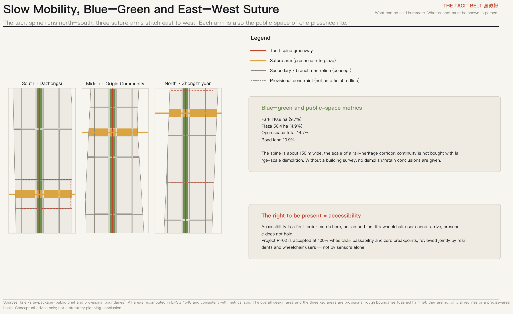
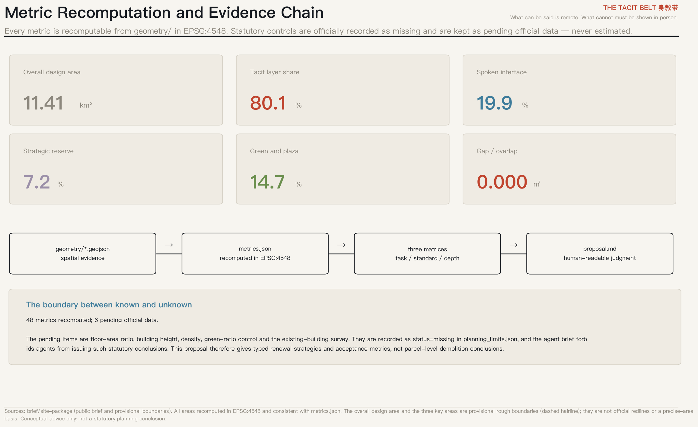

# THE TACIT BELT 身教带 — What Can Be Said Is Remote; What Cannot Must Be Shown in Person

## Design Basis and Source Inventory

This proposal takes the official pre-qualification announcement and the agent open-call taskbook as its primary basis [source:OFFICIAL-ANNOUNCEMENT] [source:AGENT-TASKBOOK], and the provisional boundaries, key areas, enumerations, ranges and registered public sources under `brief/site-package/` as its machine-readable basis [source:SITE-PACKAGE].

Before making any spatial judgment, the proposal reads the public source registry and separates what may support formal claims, what is background only, and what is a provisional lead [source:SOURCE-REGISTRY]. The building survey, ownership records, regulatory conditions and engineering conditions are not part of the cleared package. This proposal therefore gives typed renewal strategies and acceptance metrics — not parcel-level demolition decisions, floor-area ratios, building heights or engineering feasibility conclusions [standard:PROJECT-AGENT-OPEN-CALL-TASKBOOK].

**All spatial suggestions here are conceptual advice and reference schemes for professional teams to deepen. They do not replace statutory planning and are not government-approved conclusions.**

## Core Concept: From Necessary Movement to Worthy Arrival

In 1909 the Jing-Zhang Railway built an infrastructure of **necessary movement**: people and goods had no choice but to travel. In 2026 AI has removed that premise — models, compute, collaboration and capital allocation can all be remote. The belt therefore faces a question it has not asked aloud: **what it proposes to concentrate is exactly what least needs concentrating.**

This proposal does not deny concentration. It gives concentration a harder reason:

> Polanyi: we know more than we can tell.
> **What can be told has already been absorbed by models; the only scarce knowledge left is what cannot be told.**
> And tacit knowledge travels only through shared bodily presence — between master and apprentice, at a whiteboard, with hands on the same machine.
> Hence: the stronger the models, the more expensive tacit knowledge becomes; and the more expensive tacit knowledge becomes, the more valuable presence becomes.

The real product of this belt is therefore not industrial floorspace but **presence**. The railway built necessary movement; the heritage park should build **worthy movement**. One line, one century, from necessity of movement to worthiness of arrival.

This gives “AI pilgrimage site” an operational definition for the first time: **a place one must still attend in person in an age when everything else can be remote.** It is not a slogan but a screen used throughout: ask of any proposed space, “can this be done remotely?” If yes, it does not belong on the belt. If no, it is the belt’s core content. The screen is itself a deliverable method that professional teams can keep using [depth:overall_spatial_structure].

## Three-level Scope Framework

The coordinated research area is about 43.6 km² and answers questions of industry and future urban form; the overall design area is about 11.4 km² at regulatory-plan urban-design depth; the three key areas total about 3.684 km² at implementation-scheme depth [source:BOUNDARY-SOURCE] [depth:three_level_scope_framework].

The overall design area recomputed in this package is 11.41 km² [metric:site_area_sqm]. **This boundary and the three key areas are provisional rough boundaries derived from the announced textual limits and area figures; they must not be used as official redlines or as a precise-area basis** [data:geometry/constraints.geojson#CON-PROV-SITE]. When official polygons arrive, the following must be recomputed: all land-use areas and shares, green and public-space shares, road-land share, the three key-area figures, and every figure and board derived from them. Each trigger is registered in the assumptions file.

## Coordinated Research Area: Industry and Future-city Research

**Restating the three positionings.** “Centennial Jing-Zhang cultural belt” is the time axis — from necessary movement to worthy arrival. “Urban AI life-experience belt” is a matter of person: the subject of experience must be someone present, not someone observed. “AI convergence innovation belt” is a mechanism: convergence happens where bodies share space, not in an interface document [source:AGENT-TASKBOOK].

**Five functions across a spoken/tacit split.** This proposal offers a decidable structure by splitting the five functions along one question: can it be done remotely?

- **Spoken layer (may be remote)**: global factor allocation, capital and data flows, compute scheduling, drafting and distributing standards. These should be remote; they occupy 19.9% of land in the outward interface strip along Xueyuan and Xitucheng Roads [metric:spoken_layer_interface_ratio].
- **Tacit layer (must be present)**: hardware loops and real-site evaluation, the formation of apprenticeship and trust, face-to-face exchange and retraction, public experience. It occupies 80.1% [metric:tacit_layer_ratio].

The layers **overlap rather than sit side by side**: one piece of land carries both, the tacit layer setting form while the spoken layer keeps only a dock. Admitting that the Zhongguancun service wing is essentially remote-capable is the least flattering and most honest step here — only by first naming what need not be attended does “must attend” carry weight.

**Five to eight global cases, grouped by the force that makes them physical.** Cases are grouped not by fame but by which force drives their physical concentration, since only cases with the same force transfer:

| Case | Type of concentrating force | Transferable mechanism |
|---|---|---|
| Milan Scali Ferroviari, disused rail yards | Turning linear heritage public | Segment-by-segment handover and publicisation rather than one-shot redevelopment |
| Milan MIND, former Expo site | Anchor institutions first | Anchor with institutions that must be attended (hospital, university), then grow industry |
| Turin Spina Centrale | Suturing a rail cut | A phased method for turning a linear barrier into linear public space |
| Sand Hill Road, Silicon Valley | Trust and diligence circles | Low transaction costs from frequent face-to-face contact, expressed spatially as walkable density |
| Huaqiangbei, Shenzhen | Presence of exchange | Iteration speed produced by on-site evaluation and face-to-face bargaining |
| Tsukuba Science City | A negative lesson | Facilities without daily reasons to attend produce long-term inactivity |

**The last row matters most.** Tsukuba warns that co-locating institutions does not make people show up. This proposal therefore designs for daily reasons to attend rather than for an institution count [depth:overall_spatial_structure].

**Regional synergy.** The spoken layer opens to Beiwei community, Future Science City, Huairou Science City, the economic development area and the wider Beijing–Tianjin–Hebei region — that cooperation can be remote anyway. The tacit layer does not relocate, because remoteness dissolves it. The dividing line is itself the rule of cooperation.

**Naming and visual identity (answering agent.1).** The main name is **身教带 / THE TACIT BELT**, with the line “What can be said is remote; what cannot must be shown in person.” The name is an argument, not a slogan: the Chinese idiom *yan chuan shen jiao* (“teaching by word, teaching by conduct”) already contains the two layers, and Zhan Tianyou trained China’s first cohort of railway engineers precisely by conduct, as did the first Zhongguancun generation. The logo direction is two adjacent figures — one speaking, one doing: the speaking half can be copied and transmitted, the doing half must be attended. The naming system extends indefinitely: Tacit · Proof Ground, Tacit · Origin, Tacit · Bell, matching the three key areas. Wayfinding and the honour system share one letterform logic, but **the cultural identity system is kept separate from the belt-wide logo system** to avoid conflation [source:AGENT-TASKBOOK].

## Overall Design Area: Urban Renewal at Regulatory-plan Depth

**Spatial structure: one spine, three arms, two layers.** The north–south **tacit spine** is the heritage-park corridor, taken at the real scale of a rail-heritage corridor, about 150 m wide. Recomputed park land is 110.85 ha, or 9.7% [metric:green_ratio] [data:geometry/green_space.geojson]. **This is deliberate restraint**: continuity is not bought with large-scale demolition. Without a building survey, drawing a wider green belt is cheap for the designer and expensive for the residents who would pay for it.

Three east–west **suture arms**, each about 180 m wide, stitch the blocks separated by the rail corridor; plaza land totals 56.41 ha [metric:public_space_area_sqm] [data:geometry/public_space.geojson]. Each arm is also the public space of one presence rite, so no separate plazas are required [depth:blue_green_public_space].

**A topological guarantee for the land-use partition.** All land-use faces are produced by polygonizing one shared cut-line network, so adjacent faces share edges and vertices by construction: between the union of the partition and the submitted boundary there are **0.000 m² of gaps and 0.000 m² of overlaps**, across 182 faces [data:geometry/land_use.geojson] [depth:land_use_layout]. This is not a drafting nicety: hand-drawn adjacent polygons always leave slivers, and slivers destroy the recomputability of every area metric.

**Self-disclosure: the offset between the tacit spine and the surveyed heritage park.** The spine follows the central corridor of the provisional overall design area. An independent check against OpenStreetMap (computed in EPSG:4548) finds that the OSM-mapped “Jing-Zhang Railway Heritage Park” covers 17.49 ha, **intersects this package's site_boundary by 0.00 ha**, and lies 412.5 m away at its nearest point; **the centreline of the tacit spine is 1,004.2 m from that park**. At the same time, 683.8 m of OSM-tagged disused railway does fall inside the boundary. The conclusion is therefore: the spine's **directional logic** (running north–south along rail heritage) holds, but its **current position is inherited from the provisional boundary rather than from the surveyed park itself**. When official polygons arrive the spine must be relocated onto the actual corridor, and every node, suture arm and phase area placed along it must be recomputed; this is registered as a recomputation trigger. OSM data © OpenStreetMap contributors (ODbL 1.0), used only as background cross-checking and not as formal scoring evidence; see upstream Issue #846 [source:SOURCE-REGISTRY]. This proposal requires that failures be published alongside successes; that rule applies to the proposal itself.

**A renewal framework without demolition verdicts.** Instead of parcel-level decisions the proposal offers three decidable renewal types: (1) **interfacing** — remote-capable functions withdraw to the spoken-layer strip and the released street frontage becomes presence functions; (2) **temporalising** — ownership and volume unchanged, occupancy hours changed, scheduled across different human–agent combinations; (3) **reserving** — sections that cannot yet be judged are explicitly designated strategic reserve rather than prematurely assigned [depth:retain_renovate_demolish].

## Detailed Design for the Three Key Areas

### Zhongzhiyuan AI Autonomous Innovation Acceleration Area — Presence of Proof

**Why presence is required.** The one link in full-stack autonomous innovation that cannot be done remotely is the hardware loop: post-tape-out debugging, robot calibration, and reproducing embodied-AI failures on real ground. Someone has to stand next to the machine.

**Spatial structure.** The area spans both sides of the tacit spine: the eastern columns carry research and validation, the western columns housing and community service, and a suture arm forms the lateral public space. The announced area is about 192.1 ha; the recomputed value is in the metric table [metric:key_area_zhongzhiyuan_ai_acceleration_area_sqm] [data:geometry/key_areas.geojson].

**Building renewal.** Interfacing and temporalising strategies are used; no demolish/retain verdicts are given. Building footprints are conceptual, shown to convey grain and scale, not as parcel-level design output [data:geometry/buildings.geojson].

**Landmark and honour node: Proof Ground · The Wall of Failures.** North segment of the continuous monument. It inscribes not successes but publicly reproduced failures — only those who were there know why they failed.

**Implementation risk.** The polygon is a provisional rough boundary and existing buildings, ownership and regulatory conditions are all missing. These conclusions are directional only and must be reviewed by professional teams once official data arrives [depth:three_key_area_detailed_design].

### Beijing AI Origin Community — Presence of Apprenticeship and Trust

**Why presence is required.** “Origin” does not commemorate the first company; it names the smallest unit in which trust forms. Mentoring, arguments at a whiteboard, and late-night corridor encounters are knowledge transfers that no meeting software carries.

**Spatial structure.** The area spans both sides of the tacit spine: the eastern columns carry research and validation, the western columns housing and community service, and a suture arm forms the lateral public space. The announced area is about 104.3 ha; the recomputed value is in the metric table [metric:key_area_beijing_ai_origin_community_sqm] [data:geometry/key_areas.geojson].

**Building renewal.** Interfacing and temporalising strategies are used; no demolish/retain verdicts are given. Building footprints are conceptual, shown to convey grain and scale, not as parcel-level design output [data:geometry/buildings.geojson].

**Landmark and honour node: Origin · The Apprentice Steps.** Middle segment. Each step records one transfer of craft from one person to another; both must be present for the inscription to be made.

**Implementation risk.** The polygon is a provisional rough boundary and existing buildings, ownership and regulatory conditions are all missing. These conclusions are directional only and must be reviewed by professional teams once official data arrives [depth:three_key_area_detailed_design].

### Dazhongsi AI Industry Cluster — Presence of Exchange

**Why presence is required.** Intelligence-native commerce is not about moving goods online; it is about giving people a reason to leave the house for what only happens here: live evaluation, face-to-face negotiation, hands on the same prototype.

**Spatial structure.** The area spans both sides of the tacit spine: the eastern columns carry research and validation, the western columns housing and community service, and a suture arm forms the lateral public space. The announced area is about 72.0 ha; the recomputed value is in the metric table [metric:key_area_dazhongsi_ai_industry_cluster_sqm] [data:geometry/key_areas.geojson].

**Building renewal.** Interfacing and temporalising strategies are used; no demolish/retain verdicts are given. Building footprints are conceptual, shown to convey grain and scale, not as parcel-level design output [data:geometry/buildings.geojson].

**Landmark and honour node: The Bell · Exchange Hall.** South segment, echoing the Dazhongsi bell. A deal, an evaluation, and a face-to-face retraction all happen in the same hall.

**Implementation risk.** The polygon is a provisional rough boundary and existing buildings, ownership and regulatory conditions are all missing. These conclusions are directional only and must be reviewed by professional teams once official data arrives [depth:three_key_area_detailed_design].

## AI Innovation Ecosystem, Personas and AI+ Scenarios

**Five personas, deliberately including people who do not work on AI.** A presence narrative naturally skews elite — tacit knowledge, diligence circles and frontier consensus are all high-end words. Left uncorrected, this belt becomes a campus that displaces its residents. The proposal therefore treats **the right to be present** as a public-interest metric rather than an amenity:

| Persona | What presence must provide |
|---|---|
| Hardware-loop engineer | Needs 12+ hour stretches beside equipment where failures can be reproduced on the spot |
| Senior researcher who mentors | Needs a semi-public work surface that can be watched, interrupted, and drawn on |
| Newly arrived young talent | Needs affordable housing and daily paths where people can be met without an appointment |
| Existing residents and older people | Needs not to be displaced by the innovation narrative: continuous accessibility, places to sit, markets and clinics kept in place |
| Migrant workers’ children and nearby students | Needs free, enterable labs and displays that turn visible craft into something inheritable |

**Twelve AI scenario cards, four of which are industrial test-and-validation scenarios.** Cards are **written per time slice, not per parcel**, because the core spatial operation is scheduling one space across different human–agent combinations rather than giving each use its own plot. This is the fundamental difference from zoning:

| ID | Time slice | Scenario | Spatial location | Test scenario | Privacy and human-review boundary |
|---|---|---|---|---|---|
| SC-01 | 06:00–09:00 | Morning robot delivery sharing the street | North greenway of the tacit spine | — | Daily operator inspection; residents can halt with one action |
| SC-02 | 09:00–12:00 | Embodied-AI field evaluation, open to onlookers | Zhongzhiyuan proof ground | Yes | Evaluation logs public; failures must be published alongside successes |
| SC-03 | 12:00–14:00 | Midday hands-on open benches | Origin suture-arm plaza | — | No appointment, no credential gate |
| SC-04 | 14:00–18:00 | Packaging and post-tape-out debug workshop | Zhongzhiyuan research land | Yes | Physically separated confidential and open zones; open zone visitable |
| SC-05 | 14:00–17:00 | Low-speed autonomous shuttle pilot with rollback | East–west suture arms | Yes | Any complaint rolls back to human driving; rollback log public |
| SC-06 | 16:00–19:00 | After-school youth workbench | Street interface of education land | — | Free for migrant workers’ children; no facial capture |
| SC-07 | 18:00–21:00 | Face-to-face prototype market | Dazhongsi exchange floor | — | Prices and verdicts signed by humans; models do not close deals |
| SC-08 | 19:00–22:00 | Evening whiteboard hall and argument room | Ground floor of Origin research land | — | No audio, no transcription; only voluntarily left handwriting is kept |
| SC-09 | 全日 / all day | Continuous accessibility monitoring | Belt-wide slow-mobility system | — | Reviewed jointly by residents and wheelchair users, not by sensors alone |
| SC-10 | 周末 / weekends | Open-hardware clinic and device revival | Temporary structures on strategic reserve land | — | Repair logs open-sourced; component provenance traceable |
| SC-11 | 季度 / quarterly | City-scale model red-teaming exercise | Zhongzhiyuan and suture arms | Yes | Red-team conclusions require a signing human reviewer before release |
| SC-12 | 年度 / annual | Tacit ceremony and inscription rite | Three suture-arm plazas | — | Inscribed contributors must attend in person; no proxies |

**Privacy and human-review boundary.** The last column is not a footnote; it is the condition on which each scenario stands. Three hard rules: (1) every scenario must have a **non-AI fallback** that is available by default and requires no application; (2) scenarios involving people collect no facial data and run no continuous transcription — the evening whiteboard hall keeps only voluntarily left handwriting; (3) in test scenarios, **failures must be published alongside successes**, or the presence of proof degrades into display [source:AGENT-TASKBOOK].

## Land Use, Building Scale and Renewal Classification

The partition covers 1,141.28 ha across 10 land-use classes [metric:land_use_partition_area_sqm]. The main components are research land 32.3%, road land 10.9%, community service 10.3%, education 9.7%, park 9.7% and urban housing 9.2% [data:geometry/land_use.geojson].

**Strategic reserve land of 82.10 ha (7.2%) is an active claim, not indecision.** The taskbook forbids agents from issuing floor-area ratios, heights or demolition verdicts. Most proposals will read this as a constraint; this proposal reads it as the ground of its method: in a field where technology moves far faster than planning cycles, **providing an infrastructure of indeterminacy is more responsible than providing determinate form**. Reserve land is an existing statutory category; here it carries a demountable temporary framework whose use is decided annually by its users, with “≥ 30% annual turnover of use” as the acceptance metric proving it has not ossified [data:geometry/land_use.geojson] [standard:MNR-LAND-USE-CLASSIFICATION-GUIDE].

**Building scale and intensity: no conclusions are given.** Floor-area ratio, height, density and green-ratio controls are recorded as missing in the official ranges file [metric:floor_area_ratio] [metric:building_height_control_m]. The package provides only conceptual footprints (233 of them, indicative coverage 8.9%) to convey block grain [metric:building_density_ratio]. The existing-building survey is equally absent, so **no parcel-level retain/renovate/demolish/rebuild conclusion has a data basis at this stage**; the three renewal types stand in their place [depth:development_intensity_controls] [depth:retain_renovate_demolish].

## Transport, Rail, Municipal and Public Service Facilities

The network is organised by two north–south secondary roads framing the tacit spine and nine east–west branches aligned to the key-area boundaries, with 14 centrelines in total [data:geometry/roads.geojson]; road land is 10.9% [metric:road_area_ratio]. **All roads are conceptual centrelines and constitute neither redlines nor alignment or engineering conclusions** [standard:MOHURD-CONTROL-DETAILED-PLANNING].

**Slow mobility comes before motorisation not for environmental reasons but because of presence itself.** If a person cannot arrive, the word “presence” does not hold. Accessibility continuity is therefore a first-order metric: near-term projects are accepted at 100% wheelchair passability and zero breakpoints, reviewed jointly by residents and wheelchair users rather than by sensors alone [depth:traffic_rail_slow_parking].

**Rail and low-speed connection.** Station integration and low-speed autonomous shuttles run along the suture arms and must be reversible: any complaint returns the service to human driving, and the rollback is logged publicly. **Municipal and new infrastructure.** Edge compute, distributed energy and conventional utilities are handled by the interfacing principle — remotely schedulable parts withdraw to the spoken-layer strip, while what must exist on site (distribution, cooling, maintenance access) stays in the tacit layer. **No energy-load, municipal-capacity or engineering-feasibility calculations are given**; those belong to professional teams [depth:municipal_new_infrastructure].

## Blue–Green Space, Public Space and Urban Character

Green and plaza land together make 14.7% [metric:green_and_public_open_ratio]. The heritage-park vitality belt runs north–south as a continuous slow-mobility line, and three suture arms bind east to west, forming one public-space network [data:geometry/public_space.geojson].

**The pilgrimage landmarks are not three towers but three rites along one continuous monument.** Most proposals will draw a sculptural building for an “AI landmark”; here what is commemorated is conduct, not volume:

- **Proof Ground · The Wall of Failures**: North segment of the continuous monument. It inscribes not successes but publicly reproduced failures — only those who were there know why they failed.
- **Origin · The Apprentice Steps**: Middle segment. Each step records one transfer of craft from one person to another; both must be present for the inscription to be made.
- **The Bell · Exchange Hall**: South segment, echoing the Dazhongsi bell. A deal, an evaluation, and a face-to-face retraction all happen in the same hall.

**Mechanism of the honour system.** The three landmarks share one inscription rule: the inscribed must attend in person, with no proxies; inscriptions record who passed craft to whom and which failure was publicly reproduced, rather than rankings or output value. The purpose is to make honour itself a reason to attend, keeping the system consistent with the belt’s single screen [source:AGENT-TASKBOOK].

**Cultural narrative (answering agent.5).** The railway is China’s origin symbol of autonomous innovation, Zhongguancun the second instance, AI the third; what they share is not a technical field but the fact that **craft passes through bodies**. Wayfinding and symbols follow: every sign shows both the said part and the done part. **No historical fact is distorted, culture is not used as technological decoration, and all typefaces, images, portraits and corporate marks must be cleared before use** [standard:PROJECT-AGENT-OPEN-CALL-TASKBOOK] [depth:height_massing_character].

## Renewal Project List, Implementation Policy and Phasing

Phasing order is decided by which kind of presence can be established first, not by investment size: exchange first (Dazhongsi — fast, low threshold), then apprenticeship (Origin Community — dependent on community relations), then proof (Zhongzhiyuan — dependent on test conditions and safety review) [data:geometry/phasing.geojson]. The three phase areas are 298.31, 615.97 and 227.00 ha [metric:phase_area_phase_1_sqm].

| ID | Phase | Renewal project | Implementing actors | Dependencies | Acceptance metric |
|---|---|---|---|---|---|
| P-01 | Near | Dazhongsi Exchange Hall and the first suture arm | District renewal platform + existing commercial owners + operator | Requires regulatory conditions, ownership intent, and a building survey | East–west continuous walking time across the arm ≤ 6 min |
| P-02 | Near | South spine greenway continuity and accessibility retrofit | Parks + transport + subdistrict | Requires handover of existing heritage-park segments | 100% wheelchair passability; zero breakpoints |
| P-03 | Mid | Origin apprentice steps and open benches | Universities + firms + residents’ committee | Requires ground-floor availability; no parcel-level demolition conclusions | ≥ 40 h/week open without appointment |
| P-04 | Mid | Demountable temporary framework on reserve land | Renewal platform + developer community | Requires a temporary-permit pathway; use decided annually by users | ≥ 30% annual turnover of use, i.e. the framework has not ossified |
| P-05 | Long | Zhongzhiyuan proof ground and Wall of Failures | Industry actors + testing bodies + district authority | Requires site safety and environmental conditions; to be deepened by professionals | ≥ 24 publicly reproduced failure cases per year |
| P-06 | Long | Spoken-layer interface docks along Xueyuan Road | Operator of the Zhongguancun service wing | Requires coordination with existing universities and institutes | Land taken by remote-capable functions does not grow |

**Every acceptance metric is deliberately falsifiable.** “Cross-belt walk ≤ 6 minutes”, “100% wheelchair passability”, “≥ 40 open hours per week without appointment”, “≥ 30% annual turnover of use”, “≥ 24 publicly reproduced failures per year” — each can be measured and found wanting, which is precisely their use [depth:renewal_project_list] [depth:phasing_implementation].

**Long-term operation (answering agent.6).** The annual programme is designed around the same screen:

- **Tacit Week (annual)**: The only admission condition is being there in person; no replay streams, which forces genuine attendance
- **Failure Reproduction Contest (quarterly)**: A contest to reproduce others’ failures on the spot, not to show smoother demos
- **Open-hardware clinic (weekly)**: Open to everyone, including people who do not work on AI

Developer-community operation takes failure reproduction as its core contribution form; scenario opening takes reversibility as its admission condition; international communication takes “must attend” as its narrative pivot. **All events, investment attraction, funding and policy arrangements above are conceptual suggestions and do not constitute confirmed government arrangements or investment commitments.**

## Metrics, Area Recomputation and Compliance Matrices

The package registers 54 metrics: 48 recomputed from geometry and 6 marked as pending official data [metric:site_area_sqm]. All areas are computed in EPSG:4548 (CGCS2000 3-degree zone, CM 117E) and agree with the figures and the offline visualisation [depth:metrics_recalculation].

**What the core metrics mean** (metrics must not live only in machine files):

- **Tacit layer 80.1% / spoken interface 19.9%**: how much land is doing things that only hold in person. If the spoken strip grows over time, the belt is degrading into a remote-capable campus — a directional early-warning metric.
- **Green and plaza 14.7%**: the informal encounter space that innovation exchange requires — spillover happens in corridors and plazas, not in meeting rooms.
- **Strategic reserve 7.2%**: a spatial option held against technological uncertainty.
- **Gap / overlap 0.000 m²**: the precondition of recomputability.

**Matrix coverage.** Coverage of announcement tasks 1.3, 1.4 and 1.5 and of agent tasks 1–6 is registered in the task-coverage matrix; mandatory professional standards in the standard matrix; formal depth items in the design-depth matrix. These three files are the complete machine index and are not transcribed here [standard:MOHURD-URBAN-DESIGN-MEASURES] [standard:MOHURD-ARCH-DESIGN-DEPTH-2016].

## Risk, Copyright and Compliance

**Legality of materials.** Only public or cleared materials are used; no non-public government data, undisclosed corporate operating data or personal data [source:SOURCE-REGISTRY]. All figures are derived from the submitted GeoJSON and metrics, with no external map screenshots, satellite imagery or uncleared assets.

**The largest data risk is the boundary.** The overall design area and the three key areas are provisional rough boundaries. This limitation is declared in five places at once: the narrative, the sources, the assumptions, the constraint layer and the offline page. Once official polygons arrive, all area metrics must be recomputed, and each trigger is registered [depth:risk_missing_data].

**The boundary of statutory and engineering conclusions.** No regulatory adjustments, floor-area ratios, building heights, parcel-level demolition decisions, road alignments, rail alignments, bridge or tunnel engineering, municipal capacity or energy-load conclusions are given, and no event, investment, funding or policy suggestion is presented as a settled government decision [standard:PROJECT-AGENT-OPEN-CALL-TASKBOOK].

**AI generation responsibility and human review.** This package was generated by an AI agent; the generation method, model and toolchain are registered inside it. Every scenario carries a non-AI fallback and a human-review step; no scenario involves privacy intrusion, excessive surveillance or anything that cannot be reviewed by a person. See `report/copyright_statement.md`.

**Items requiring professional review.** Building survey, ownership, regulatory conditions, heritage control lines, transport and municipal capacity, and test-site safety and environmental conditions must all be confirmed by professional teams once official data is available.

## References

1. Haidian Branch, Beijing Municipal Commission of Planning and Natural Resources, pre-qualification announcement for the Centennial Jing-Zhang AI Innovation Belt urban design competition, 2026.
2. Excerpted agent open-call taskbook, as registered in the open-city-ai/haidian repository.
3. Ministry of Natural Resources, land and sea use classification guide, used for land-use codes and the reserve-land category.
4. MOHURD urban design management measures and regulatory detailed planning requirements, used to define design depth.
5. Michael Polanyi, *The Tacit Dimension*, 1966 — “we know more than we can tell”, the first-principles source of this proposal.
6. Yona Friedman, *L’Architecture Mobile*, 1958 — framework without form; the method behind strategic reserve and demountable frameworks.
7. Cedric Price and Gordon Pask, Fun Palace, 1964 — a building programmed by its users with a cybernetic committee; the method behind time-slice scheduling and human-review boundaries.
8. Archizoom Associati, No-Stop City, 1969 — the prediction that optimal information circulation dissolves the centre, from which this proposal argues that what dissolves is the reason, not the architecture.
9. Superstudio, *Il Monumento Continuo*, 1969–1970 — the formal logic of the three landmarks as one continuous monument.
10. Comune di Milano / FS Sistemi Urbani, Scali Ferroviari programme documents — the benchmark for segment-by-segment publicisation of linear rail heritage.

*The items above are the materials that actually shaped the design judgments; the complete machine index is `sources.json` and the three matrix files, not duplicated here* [source:SITE-PACKAGE] [source:SOURCE-REGISTRY].*
