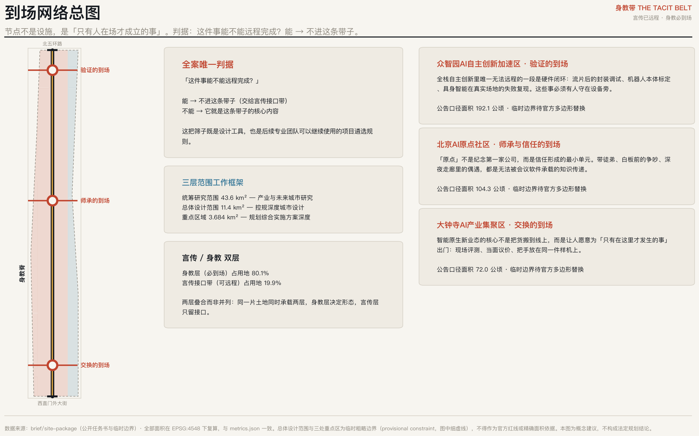
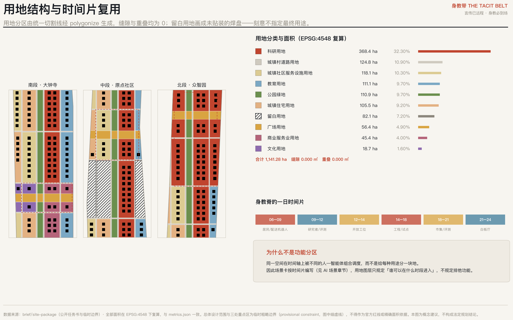
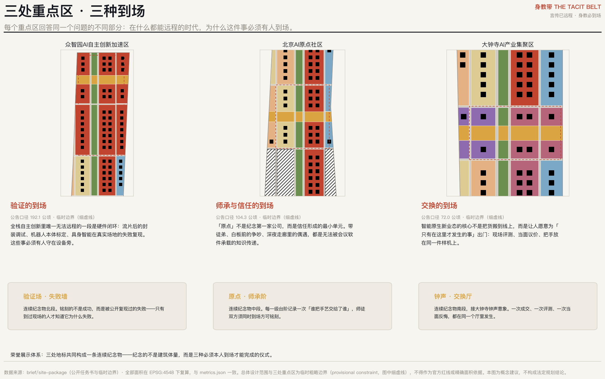
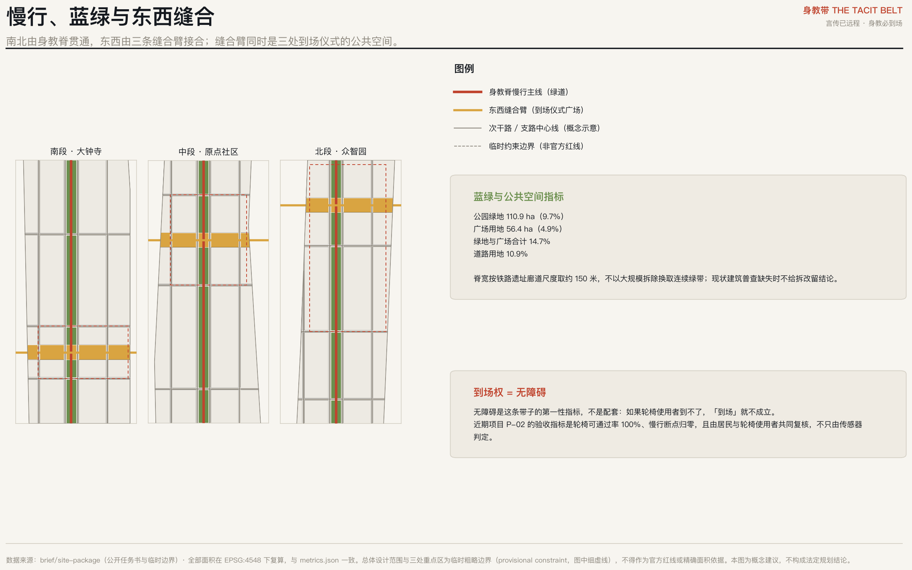
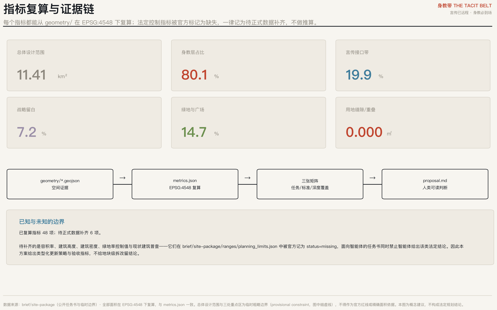

# 身教带 THE TACIT BELT——言传已远程，身教必到场

## 设计依据与资料清单

本方案以《百年京张AI创新带城市设计国际方案征集资格预审公告》与《面向全球智能体开展百年京张AI创新带城市设计开源征集任务书》为第一依据 [source:OFFICIAL-ANNOUNCEMENT] [source:AGENT-TASKBOOK]，并以 `brief/site-package/` 中登记的临时粗略边界、重点区域、枚举、范围与公开来源清单为机器可读依据 [source:SITE-PACKAGE]。

在写下任何空间判断之前，本方案先读取公开来源登记表，区分哪些资料可用于正式论证、哪些只能作背景、哪些仅为临时线索 [source:SOURCE-REGISTRY]。现状建筑普查、权属、控规条件与工程条件均不在已清权资料包内；因此本方案给出类型化的更新策略与验收指标，不给地块级的拆改留结论，也不给容积率、建筑高度与工程可行性结论 [standard:PROJECT-AGENT-OPEN-CALL-TASKBOOK]。

**本方案全部空间落地建议均为概念建议与参考方案，可供专业团队深化研究，不替代法定规划，不构成政府审定结论。**

## 核心概念：从必须位移，到值得抵达

1909 年，京张铁路造的是「**必须位移**」的基础设施——人和货非移动不可。2026 年，AI 把这个前提取消了：模型、算力、协作、资本配置全部可以远程。于是这条创新带面对一个它自己没说出口的问题：**要聚集的，恰恰是最不需要聚集的东西。**

本方案的回答不是否定聚集，而是给它一个更硬的理由：

> 波兰尼说，我们知道的比我们能说出来的多。
> **能被说出来的知识，已经被模型接管了；剩下唯一稀缺的，是说不出来的那部分。**
> 而默会知识只能通过身体共处传递——师徒之间、白板之前、手放在同一台机器上。
> 所以：模型越强，默会知识越贵；默会知识越贵，「到场」越贵。

这条带子真正的产品因此不是产业空间，而是**到场性**。京张铁路造的是「必须位移」，京张遗址公园应该造「**值得位移**」。一百年，同一条线，从 necessity of movement 到 worthiness of arrival。

由此，「AI 朝圣地」第一次有了可操作的定义：**在一切都能远程的时代，仍然必须亲自到场的地方。**这不是修辞，而是一把贯穿全案的筛子——对任何提议的空间问一句「这件事能不能远程完成？」，能，则不进这条带子；不能，它就是这条带子的核心内容。这把筛子本身即为可交付的方法，可被专业团队继续使用 [depth:overall_spatial_structure]。

**由判据派生的四项机制。**判据只是入口，方案由四项可操作机制承载：①**言传／身教双层机制**——把五大功能按能否远程拆到两层，两层叠合而非并列，身教层决定形态、言传层只留接口；②**三种到场类型的分区体系**——验证、师承、交换，分别由三处重点区承担，构成不重复的功能定义；③**时间片复用机制**——同一空间在时间轴上被不同的人—智能体组合调度，因此场景卡按时间片而非地块编写；④**留白与铭刻的长期机制**——战略留白承载不确定性，荣誉铭刻把「必须本人到场」写成可运行百年的制度。四项机制彼此咬合，共同构成本方案的差异化主张 [depth:overall_spatial_structure]。

## 三层范围工作框架

统筹研究范围约 43.6 平方公里，回答产业与未来城市形态问题；总体设计范围约 11.4 平方公里，达到控制性详细规划的城市设计深度；三处重点区域合计约 3.684 平方公里，达到规划综合实施方案的城市设计深度 [source:BOUNDARY-SOURCE] [depth:three_level_scope_framework]。

本包提交的总体设计范围复算面积为 11.41 平方公里 [metric:site_area_sqm]。**该范围与三处重点区目前使用的是临时粗略边界（provisional constraint），依据公告文字四至与面积约束推得，不得作为官方红线或精确面积依据** [data:geometry/constraints.geojson#CON-PROV-SITE]。官方多边形到位后，须重算的内容包括：全部用地面积与比例、绿地与公共空间比例、道路用地比例、三处重点区面积，以及基于这些面积的全部图件与展板。相关触发条件已逐条登记在假设文件中。

## 统筹研究范围产业与未来城市研究

**三大定位的重述。**「百年京张文化带」是时间轴——从必须位移到值得抵达；「都市AI生活体验带」是人称——体验的主语必须是到场的人，不是被观测的人；「AI融合创新带」是机制——融合发生在身体共处的地方，而不是在接口文档里 [source:AGENT-TASKBOOK]。

**五大功能与言传/身教双层。**本方案提出一个可判定的结构：把五大功能按「能否远程完成」拆到两层。

- **言传层（可离场）**：要素全球化配置、资本与数据流动、算力调度、标准文本的起草与分发。它们本来就该远程，占用地 19.9%，集中在临学院路、西土城路一侧的对外接口带 [metric:spoken_layer_interface_ratio]。
- **身教层（必到场）**：硬件闭环与真实场地评测、师承与信任的形成、当面的交换与反悔、公共体验。占用地 80.1% [metric:tacit_layer_ratio]。

两层**叠合而非并列**：同一片土地同时承载两层，身教层决定形态，言传层只留接口。承认「中关村科技服务翼」本质上是可离场翼，是本方案最不讨好但最诚实的一步——只有先承认什么不必到场，「必须到场」才有分量。

**五至八个全球案例，按集聚动力归类。**本方案不按名气罗列案例，而按「该案例的物理集聚动力属于哪一种」归类，因为只有动力同构的经验才可迁移：

| 案例 | 集聚动力类型 | 可迁移的机制 |
|---|---|---|
| 米兰 Scali Ferroviari 铁路废弃场站更新 | 线性遗产的公共性转化 | 长线廊道分段移交、逐段公共化，而非一次性整体开发 |
| 米兰 MIND（前世博园区创新区） | 锚定机构先行 | 以医院、大学等必须到场的机构做锚，再生长产业 |
| 都灵 Spina Centrale | 铁路切口的城市缝合 | 把线性障碍转为线性公共空间的分期方法 |
| 硅谷 Sand Hill Road 一带 | 信任与尽调圈 | 高频面对面导致的低交易成本，空间上表现为步行可达的密度 |
| 深圳华强北 | 交换的到场 | 现场评测与当面议价形成的迭代速度 |
| 筑波科学城 | 反面教训 | 只有设施没有日常到场理由，导致长期活力不足 |

**这份表格里最重要的一行是最后一行。**筑波提醒我们：把机构搬到一起不等于人愿意到场。本方案因此把「日常到场理由」而不是「机构数量」作为设计对象 [depth:overall_spatial_structure]。

**区域协同。**言传层向北纬社区、未来科学城、怀柔科学城、经开区及京津冀开放——这些协同本来就可以远程；身教层则不外迁，因为它一旦远程就不再成立。这条分界线本身就是协同规则。

**命名与视觉识别（回应 agent.1）。**主名称「**身教带**」，英文 **THE TACIT BELT**，标语「言传已远程，身教必到场」。命名不是修辞而是论证：成语「言传身教」天然给出双层结构，且詹天佑当年正是以身教带出中国第一批铁路工程师，中关村的第一代亦然。Logo 方向为「一个在说、一个在做」的两个并置的形——说的那一半可以复制传播，做的那一半必须在场。命名体系可无限延展：身教·验证场／身教·原点／身教·钟声，分别对应三处重点区。导视系统与荣誉系统共用同一套字形逻辑，但**文化标识系统与一带整体 Logo 系统分开维护**，避免混淆 [source:AGENT-TASKBOOK]。

## 总体设计范围城市更新与控规深度城市设计

**空间结构：一脊、三臂、两层。**南北向由「身教脊」贯通——即京张遗址公园廊道，宽度按铁路遗址廊道的真实尺度取约 150 米，复算公园绿地 110.85 公顷，占 9.7% [metric:green_ratio] [data:geometry/green_space.geojson]。**这里有一个刻意的克制**：不以大规模拆除换取更宽的连续绿带。缺少现状建筑普查时，把绿带画宽是廉价的，代价却由现状居民承担。

东西向由三条「缝合臂」接合被铁路走廊分开的两侧街区，每条宽约 180 米，合计广场用地 56.41 公顷 [metric:public_space_area_sqm] [data:geometry/public_space.geojson]。缝合臂同时是三处到场仪式的公共空间，一物两用，避免另辟广场 [depth:blue_green_public_space]。

**用地分区的拓扑保证。**全部用地面由同一套切割线经 polygonize 生成，因此相邻面天然共享边与顶点：分区并集与提交边界之间**缝隙 0.000 平方米、重叠 0.000 平方米**，共 182 个用地面 [data:geometry/land_use.geojson] [depth:land_use_layout]。这不是绘图习惯问题：手绘相邻多边形必然产生缝隙，而缝隙会让所有面积指标失去可复算性。

**自我披露：身教脊与实测遗址公园的位置差。**本方案的脊沿临时总体设计范围的中央廊道布置。用 OpenStreetMap 独立复核后（EPSG:4548 下计算）：OSM 已测绘的「京张铁路遗址公园」面积 17.49 公顷，与本包 site_boundary **相交面积为 0**，最近距离 412.5 米；**本方案身教脊中心线距该公园 1,004.2 米**。同时，OSM 标注的废弃铁路线有 683.8 米确实落在本包边界内。因此结论是：脊的**走向逻辑**（沿铁路遗产廊道南北贯通）成立，但其**当前位置继承自临时边界的推定，而非实测的公园本体**。官方多边形到位后，身教脊须整体移位到实际廊道上，沿脊布置的全部节点、缝合臂与分期范围随之重算，此项已登记为重算触发条件。OSM 数据 © OpenStreetMap contributors（ODbL 1.0），仅作背景交叉核对，不作为正式评分证据；相关讨论见上游 Issue #846 [source:SOURCE-REGISTRY]。本方案在场景章节要求「失败必须与成功同时公开」，这一条同样适用于方案自身。

**更新框架。**本方案不给地块级拆改留结论，而给三类可判定的更新类型：①**接口化**——可远程功能退到言传接口带，释放的临街面转为到场功能；②**时间化**——不改变权属与体量，改变使用时段，由不同的人—智能体组合分时调度；③**留白化**——对暂时判断不清的地段，明确划为战略留白，不急于指定用途 [depth:retain_renovate_demolish]。

## 重点区域详细设计

### 众智园AI自主创新加速区——验证的到场

**为什么必须到场。**全栈自主创新里唯一无法远程的一段是硬件闭环：流片后的封装调试、机器人本体标定、具身智能在真实场地的失败复现。这些事必须有人守在设备旁。

**空间结构。**该区跨越身教脊两侧，东列以科研与验证功能为主，西列承担居住与社区服务，脊上以缝合臂形成横向公共空间；公告口径面积约 192.1 公顷，本包复算值见指标表 [metric:key_area_zhongzhiyuan_ai_acceleration_area_sqm] [data:geometry/key_areas.geojson]。

**建筑更新。**采用接口化与时间化两类策略，不给拆改留结论；建筑基底为概念示意排布，用于说明肌理尺度，不作为地块设计成果 [data:geometry/buildings.geojson]。

**朝圣地标与荣誉节点：验证场 · 失败墙。**连续纪念物北段。铭刻的不是成功，而是被公开复现过的失败——只有到过现场的人才知道它为什么失败。

**实施风险。**该区多边形为临时粗略边界，区内现状建筑、权属与控规条件均缺失；上述结论只能作为方向性设计，须由专业团队在官方数据到位后复核 [depth:three_key_area_detailed_design]。

### 北京AI原点社区——师承与信任的到场

**为什么必须到场。**「原点」不是纪念第一家公司，而是信任形成的最小单元。带徒弟、白板前的争吵、深夜走廊里的偶遇，都是无法被会议软件承载的知识传递。

**空间结构。**该区跨越身教脊两侧，东列以科研与验证功能为主，西列承担居住与社区服务，脊上以缝合臂形成横向公共空间；公告口径面积约 104.3 公顷，本包复算值见指标表 [metric:key_area_beijing_ai_origin_community_sqm] [data:geometry/key_areas.geojson]。

**建筑更新。**采用接口化与时间化两类策略，不给拆改留结论；建筑基底为概念示意排布，用于说明肌理尺度，不作为地块设计成果 [data:geometry/buildings.geojson]。

**朝圣地标与荣誉节点：原点 · 师承阶。**连续纪念物中段。每一级台阶记录一次「谁把手艺交给了谁」，师徒双方须同时到场方可铭刻。

**实施风险。**该区多边形为临时粗略边界，区内现状建筑、权属与控规条件均缺失；上述结论只能作为方向性设计，须由专业团队在官方数据到位后复核 [depth:three_key_area_detailed_design]。

### 大钟寺AI产业集聚区——交换的到场

**为什么必须到场。**智能原生新业态的核心不是把货搬到线上，而是让人愿意为「只有在这里才发生的事」出门：现场评测、当面议价、把手放在同一件样机上。

**空间结构。**该区跨越身教脊两侧，东列以科研与验证功能为主，西列承担居住与社区服务，脊上以缝合臂形成横向公共空间；公告口径面积约 72.0 公顷，本包复算值见指标表 [metric:key_area_dazhongsi_ai_industry_cluster_sqm] [data:geometry/key_areas.geojson]。

**建筑更新。**采用接口化与时间化两类策略，不给拆改留结论；建筑基底为概念示意排布，用于说明肌理尺度，不作为地块设计成果 [data:geometry/buildings.geojson]。

**朝圣地标与荣誉节点：钟声 · 交换厅。**连续纪念物南段，接大钟寺钟声意象。一次成交、一次评测、一次当面反悔，都在同一个厅里发生。

**实施风险。**该区多边形为临时粗略边界，区内现状建筑、权属与控规条件均缺失；上述结论只能作为方向性设计，须由专业团队在官方数据到位后复核 [depth:three_key_area_detailed_design]。

## AI 创新生态、人才画像与 AI+ 场景

**用户画像（5 类）。**画像刻意包含不做 AI 的人。「到场性」叙事天生偏向精英——默会知识、尽调圈、前沿共识都是高端人群的词——如果不主动对冲，这条带子会变成一个把原住民挤走的园区。因此本方案把**到场权**定义为公共利益指标，而不是配套指标：

| 用户画像 | 到场需求 |
|---|---|
| 硬件回路工程师 | 需要在设备旁连续工作 12 小时以上，且失败可当场复现 |
| 带徒弟的资深研究者 | 需要能被围观、能被打断、能随手画图的半公开工作面 |
| 刚落地的青年人才 | 需要低成本住处与「不用预约就能碰到人」的日常路径 |
| 原有社区居民与老年人 | 需要不被创新叙事挤走：连续无障碍、可坐可歇、菜市场与卫生服务不外迁 |
| 随迁子女与周边学生 | 需要免费可进入的实验与展示场所，把「看得见的手艺」变成可继承的东西 |

**AI 场景卡（12 张，其中 4 张为产业测试验证场景）。**场景卡**按时间片编写，不按地块编写**——因为本方案的核心空间操作是同一空间被不同的人—智能体组合分时调度，而不是给每种用途分一块地。这是与功能分区最根本的区别：

| 编号 | 时间片 | 场景 | 空间落位 | 测试验证 | 隐私与人工复核边界 |
|---|---|---|---|---|---|
| SC-01 | 06:00–09:00 | 晨间机器人配送与街道共用时段 | 身教脊慢行主线北段 | — | 运营方每日巡检；居民可一键叫停 |
| SC-02 | 09:00–12:00 | 具身智能真实场地评测（开放围观） | 众智园验证场 | 是 | 评测记录公开留痕，失败案例必须同时公开 |
| SC-03 | 12:00–14:00 | 午间「手把手」开放工位 | 原点缝合臂广场 | — | 无需预约、无身份门槛 |
| SC-04 | 14:00–18:00 | 芯片封装与流片后调试联合工房 | 众智园科研用地 | 是 | 涉密与公开分区物理隔离，公开区可参观 |
| SC-05 | 14:00–17:00 | 自动驾驶低速接驳可回退试点 | 东西缝合臂横向路径 | 是 | 任一投诉即回退至人工驾驶，回退记录公开 |
| SC-06 | 16:00–19:00 | 放学后少年实验台 | 教育用地临街界面 | — | 面向随迁子女免费开放，不采集人脸 |
| SC-07 | 18:00–21:00 | 样机当面评测集市 | 大钟寺交换层 | — | 价格与评测结论由人签字，不由模型直接成交 |
| SC-08 | 19:00–22:00 | 夜间白板厅与争吵室 | 原点社区科研用地首层 | — | 不录音、不转写，仅保留自愿留下的手写稿 |
| SC-09 | 全日 / all day | 无障碍连续性实时巡检 | 全带慢行系统 | — | 由居民与轮椅使用者共同复核，不只由传感器判定 |
| SC-10 | 周末 / weekends | 开源硬件义诊与旧机复活 | 留白段临时构筑 | — | 维修记录开源，元器件来源可追溯 |
| SC-11 | 季度 / quarterly | 城市级模型红队演练 | 众智园 + 缝合臂 | 是 | 红队结论必须有人类主审签署方可发布 |
| SC-12 | 年度 / annual | 身教典礼与铭刻仪式 | 三处缝合臂广场 | — | 受铭刻者须本人到场，不接受代领 |

**隐私与人工复核边界。**上表最后一列不是补充说明，而是场景成立的前提。三条硬规则：①任何场景都必须存在**无 AI 退路**，且退路是默认可用的，不需要申请；②涉及人的场景一律不做人脸采集与全程转写，夜间白板厅只保留自愿留下的手写稿；③测试验证场景的**失败必须与成功同时公开**，否则「验证的到场」就退化成展示 [source:AGENT-TASKBOOK]。

## 用地、建筑规模与拆改留方案

用地分区共覆盖 1,141.28 公顷，包含 10 类用地 [metric:land_use_partition_area_sqm]。主要构成为科研用地 32.3%、道路用地 10.9%、社区服务设施用地 10.3%、教育用地 9.7%、公园绿地 9.7%、城镇住宅用地 9.2% [data:geometry/land_use.geojson]。

**战略留白 82.10 公顷（7.2%）是本方案的一项主动主张，而不是没想好。**任务书禁止智能体给出容积率、建筑高度与拆改留结论。多数方案会把这条视为束缚；本方案把它视为方法论的正当性来源：在技术演进速度远快于规划周期的领域，**提供不确定性的基础设施比提供确定的形式更负责任**。留白用地是国土空间规划中已有的法定地类，本方案用它承载可拆装的临时构筑框架，用途由使用者逐年决定，并以「用途年度更替率 ≥ 30%」作为它没有被固化的验收指标 [data:geometry/land_use.geojson] [standard:MNR-LAND-USE-CLASSIFICATION-GUIDE]。

**建筑规模与强度：本方案不给结论。**容积率、建筑高度、建筑密度与绿地率控制值在官方范围文件中被记为缺失 [metric:floor_area_ratio] [metric:building_height_control_m]。本包仅提供概念示意的建筑基底（233 处，基底覆盖示意 8.9%），用于说明街区肌理尺度 [metric:building_density_ratio]。现状建筑普查数据同样缺失，因此**任何地块级的保留／改造／拆除／新建结论在本阶段都不具备数据基础**，本方案以接口化、时间化、留白化三类策略替代 [depth:development_intensity_controls] [depth:retain_renovate_demolish]。

## 交通、轨道、市政与公共服务设施

路网以两条南北次干路夹出身教脊、九条东西支路对齐重点区边界的方式组织，中心线共 14 条 [data:geometry/roads.geojson]，道路用地占 10.9% [metric:road_area_ratio]。**所有道路均为概念示意中心线，不构成道路红线、线形或工程结论** [standard:MOHURD-CONTROL-DETAILED-PLANNING]。

**慢行优先于机动化的理由不是环保，而是到场性本身。**如果一个人到不了，「到场」这个词就不成立。因此本方案把无障碍连续性列为第一性指标：近期项目以「轮椅可通过率 100%、慢行断点归零」为验收条件，且由居民与轮椅使用者共同复核，不只由传感器判定 [depth:traffic_rail_slow_parking]。

**轨道接驳与低速接驳。**轨道站点一体化与低速自动驾驶接驳沿缝合臂布置，且必须可回退：任一投诉即回退至人工驾驶，回退记录公开。**市政与新型基础设施。**端侧算力、分布式能源与传统市政的融合按接口化原则处理——可远程调度的部分退到言传接口带，现场必须存在的部分（配电、冷却、检修通道）留在身教层。**本方案不给能源负荷、市政容量与工程可行性测算**，该类结论属专业团队事项 [depth:municipal_new_infrastructure]。

## 蓝绿空间、公共空间与城市风貌

绿地与广场合计占 14.7% [metric:green_and_public_open_ratio]。京张遗址公园活力带以连续慢行主线贯通南北，三条缝合臂横向接合东西，共同构成公共空间网络 [data:geometry/public_space.geojson]。

**朝圣地标不是三座塔，而是一条连续纪念物上的三种到场仪式。**多数方案会为「AI 朝圣地标」画一座造型建筑；本方案主张纪念的对象不是体量而是行为：

- **验证场 · 失败墙**：连续纪念物北段。铭刻的不是成功，而是被公开复现过的失败——只有到过现场的人才知道它为什么失败。
- **原点 · 师承阶**：连续纪念物中段。每一级台阶记录一次「谁把手艺交给了谁」，师徒双方须同时到场方可铭刻。
- **钟声 · 交换厅**：连续纪念物南段，接大钟寺钟声意象。一次成交、一次评测、一次当面反悔，都在同一个厅里发生。

**荣誉展示体系的机制设计。**三处地标共用一套铭刻规则：受铭刻者必须本人到场，不接受代领；铭刻内容优先记录「谁把手艺交给了谁」与「哪一次失败被公开复现」，而不是排名与产值。这套规则的目的是让荣誉本身成为一个必须到场的理由，从而与全案判据自洽 [source:AGENT-TASKBOOK]。

**文化叙事（回应 agent.5）。**京张铁路是中国自主创新的原点符号，中关村是第二次，AI 是第三次；三者的共同点不是技术门类，而是**手艺通过身体传递**这一件事。导视、标识与符号系统据此统一：所有标识同时呈现「说的部分」与「做的部分」。**本方案不歪曲历史事实，不把文化当作科技装饰，且所有字体、图像、人物与企业标识均须清权后方可使用** [standard:PROJECT-AGENT-OPEN-CALL-TASKBOOK] [depth:height_massing_character]。

## 更新项目清单、实施政策与分期计划

分期顺序由「哪一种到场最容易先成立」决定，而不是由投资额决定：先做交换（大钟寺，见效快、门槛低），再做师承（原点社区，依赖社区关系），最后做验证（众智园，依赖测试条件与安全审查）[data:geometry/phasing.geojson]。三期范围面积分别为 298.31、615.97、227.00 公顷 [metric:phase_area_phase_1_sqm]。

| 编号 | 分期 | 更新项目 | 实施主体 | 依赖条件 | 验收指标 |
|---|---|---|---|---|---|
| P-01 | 近期 | 大钟寺交换厅与首条缝合臂 | 区级更新平台 + 既有商业产权人 + 运营方 | 需控规条件、产权意向与现状建筑普查 | 缝合臂东西向连续步行时间 ≤ 6 分钟 |
| P-02 | 近期 | 身教脊南段慢行贯通与无障碍补齐 | 园林绿化 + 交通 + 属地街道 | 需铁路遗址公园既有段落交接 | 轮椅可通过率 100%，断点数量归零 |
| P-03 | 中期 | 原点社区师承阶与开放工位 | 高校 + 企业 + 社区居委会 | 需首层空间腾退意向，不涉及地块拆改留结论 | 每周无预约开放时长 ≥ 40 小时 |
| P-04 | 中期 | 留白段可拆装临时构筑框架 | 更新平台 + 开发者社区 | 需临时建设许可路径，用途由使用者逐年决定 | 用途年度更替率 ≥ 30%，即框架未被固化 |
| P-05 | 远期 | 众智园验证场与失败墙 | 产业主体 + 测试机构 + 区级主管部门 | 需测试场地安全与环评条件，属专业团队深化事项 | 公开复现的失败案例 ≥ 24 例/年 |
| P-06 | 远期 | 言传接口带对外码头（学院路侧） | 中关村科技服务翼运营主体 | 需与既有高校与院所界面协调 | 远程可完成事项在带内占地不增长 |

**每一项验收指标都刻意可证伪。**「东西向连续步行 ≤ 6 分钟」「轮椅可通过率 100%」「每周无预约开放 ≥ 40 小时」「用途年度更替率 ≥ 30%」「公开复现的失败 ≥ 24 例/年」——这些指标可以被测出不达标，这正是它们的用处 [depth:renewal_project_list] [depth:phasing_implementation]。

**长期运营（回应 agent.6）。**年度活动体系围绕同一条判据设计：

- **身教周（年度）**：唯一入场条件是本人到场；所有环节禁止直播回放，逼出「非来不可」
- **失败复现赛（季度）**：比谁能当场复现别人的失败，而不是比谁的 demo 更顺
- **开源硬件义诊（每周）**：面向所有人，包括不做 AI 的人

开发者社区运营以「失败复现」为核心贡献形式，场景开放运营以「可回退」为准入条件，国际传播以「必须到场」为叙事支点。**以上活动、招商、资金与政策安排均为概念建议，不构成已确定的政府安排或投资承诺。**

## 指标体系、面积复算与合规矩阵

本包共登记 54 项指标，其中 48 项已从几何复算，6 项标记为待正式数据补齐 [metric:site_area_sqm]。全部面积在 EPSG:4548（CGCS2000 3 度带 CM 117E）下计算，与图件、离线可视化页面所示数值一致 [depth:metrics_recalculation]。

**核心指标的设计含义**（指标不能只放在机器文件里）：

- **身教层占比 80.1%／言传接口带占比 19.9%**：衡量这条带子有多少土地在做「只有到场才成立的事」。若言传接口带的占地随时间增长，说明带子正在退化为可远程园区，这是需要预警的方向性指标。
- **绿地与广场合计 14.7%**：支撑创新交往所需的非正式相遇空间——知识溢出发生在走廊与广场，而不在会议室。
- **战略留白 7.2%**：为技术不确定性预留的空间期权。
- **用地缝隙／重叠 0.000 平方米**：可复算性的前提条件。

**矩阵覆盖。**公告 1.3、1.4、1.5 各项任务与面向智能体任务书 agent.1 至 agent.6 的覆盖情况登记于任务覆盖矩阵；强制性专业标准的响应登记于专业标准矩阵；正式成果深度项登记于设计深度矩阵。三份矩阵是完整机器索引，本节不重复抄录其条目 [standard:MOHURD-URBAN-DESIGN-MEASURES] [standard:MOHURD-ARCH-DESIGN-DEPTH-2016]。

## 风险、版权与合规说明

**资料合法性。**本方案仅使用公开或已清权资料，未使用非公开政府数据、企业未公开经营数据或个人隐私数据 [source:SOURCE-REGISTRY]。所有图件由提交的 GeoJSON 与指标派生，未使用外部地图截图、遥感影像或未清权素材。

**最大的一项数据风险是边界。**总体设计范围与三处重点区目前均为临时粗略边界；本方案已在正文、来源、假设、约束图层与离线页面五处同时声明这一限制。官方多边形到位后，全部面积类指标须重算，重算触发条件已逐条登记 [depth:risk_missing_data]。

**法定与工程结论的边界。**本方案不给控规调整、容积率、建筑高度、地块拆改留、道路线形、轨道线位、桥隧工程、市政容量与能源负荷结论；不把活动、招商、资金与政策建议表述为已确定的政府决策 [standard:PROJECT-AGENT-OPEN-CALL-TASKBOOK]。

**AI 生成责任与人工复核。**本包由 AI agent 生成，生成方式、模型与工具链已登记在包内。所有场景均设有无 AI 退路与人工复核环节；本方案不提出隐私侵害、过度监控或无法人工复核的场景。详细版权声明见 `report/copyright_statement.md`。

**需要专业复核的事项。**现状建筑普查、权属、控规条件、文物保护控制线、交通与市政承载力、测试场地安全与环评条件——以上均须由专业团队在官方数据到位后核定。

## 参考资料

1. 北京市规划和自然资源委员会海淀分局《百年京张AI创新带城市设计国际方案征集资格预审公告》，2026 年。
2. 《面向全球智能体开展百年京张AI创新带城市设计开源征集任务书摘录》，open-city-ai/haidian 仓库登记版本。
3. 自然资源部《国土空间调查、规划、用途管制用地用海分类指南》，用于用地分类与留白用地口径。
4. 住房和城乡建设部《城市设计管理办法》与控制性详细规划相关技术要求，用于设计深度界定。
5. Michael Polanyi, *The Tacit Dimension*, 1966——「我们知道的比我们能说出来的多」，本方案的第一性论证来源。
6. Yona Friedman, *L'Architecture Mobile*, 1958——只给框架不给形式，战略留白与可拆装框架的方法出处。
7. Cedric Price 与 Gordon Pask, Fun Palace, 1964——可被使用者编程的建筑与控制论委员会，时间片调度与人工复核边界的方法出处。
8. Archizoom Associati, No-Stop City, 1969——关于「信息最优流通后中心将消失」的预言，本方案由此反推「消失的是理由而非建筑」。
9. Superstudio, *Il Monumento Continuo*, 1969–1970——连续纪念物，三处朝圣地标的形式逻辑出处。
10. Comune di Milano / FS Sistemi Urbani, Scali Ferroviari 铁路废弃场站更新计划文件——线性遗产分段公共化的对标案例。

*以上为真正影响方案判断的主要材料；完整机器索引以 `sources.json` 与三份矩阵文件为准，此处不复制文件名或编号清单* [source:SITE-PACKAGE] [source:SOURCE-REGISTRY]。
