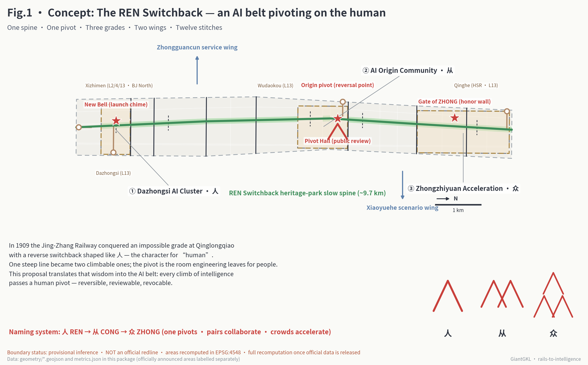
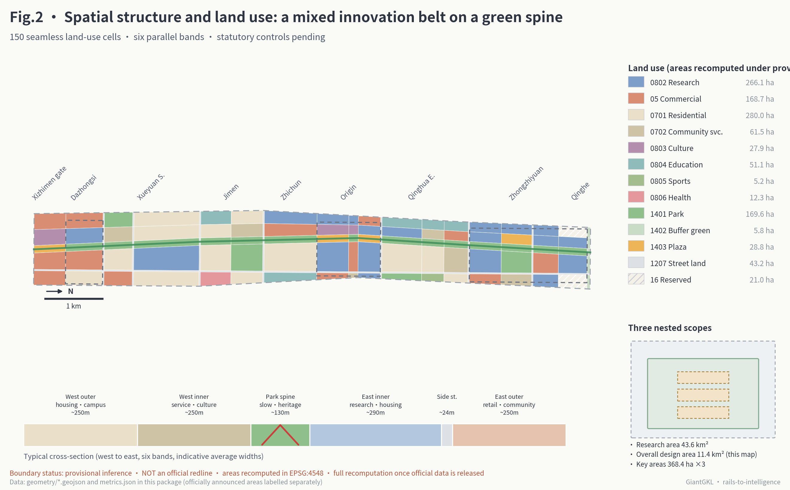
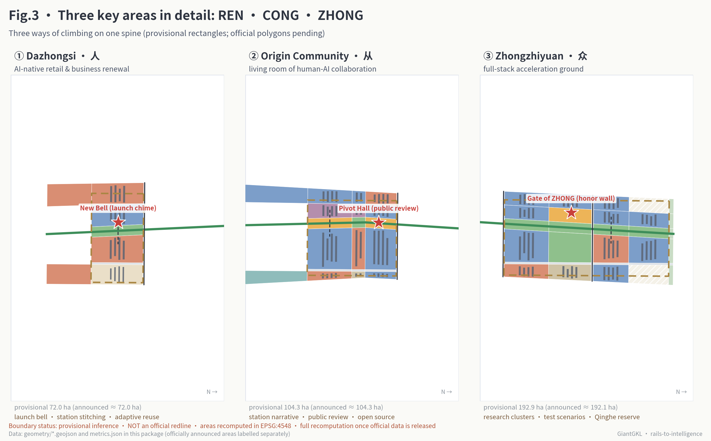
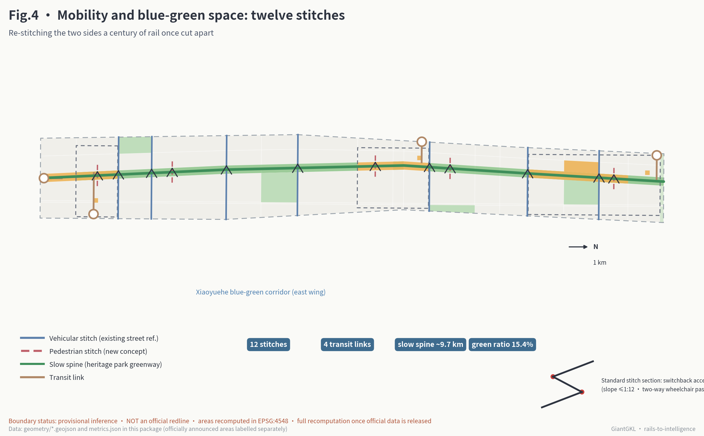
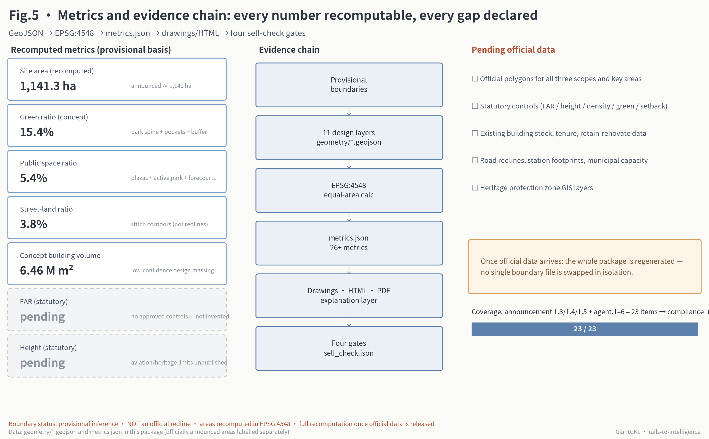

# The REN Switchback: Urban Design for the Centennial Jing-Zhang AI Innovation Belt, Pivoting on the Character 人

**The core judgment of this proposal fits in one sentence: in 1909, at Qinglongqiao, the Jing-Zhang Railway used a switchback line shaped like the Chinese character 人 ("ren", person) to turn one unclimbable grade into two climbable ones; today's AI innovation belt should turn that same wisdom into urban institution — every climb that intelligence makes passes through a 人-shaped pivot that can reverse, be reviewed, and be rolled back.**

This is not a decorative metaphor. The 人-shaped switchback is the most concrete engineering legacy this railway left to Haidian: when the grade was too steep, the train reversed direction; when one locomotive could not climb, a second pushed from behind. This proposal translates it into three layers of meaning. Spatially, the heritage-park slow-mobility spine forms a "reversal pivot" at the Beijing AI Origin Community — the southern segment faces market application, the northern segment faces research acceleration, and the two directions of innovation are translated into each other at the pivot. In governance, every AI scenario entering public space must carry an explicit "gradient grade" and a "REN fallback plan" — who reviews it, how it degrades, how it exits. In culture, the naming system grows from 人 (one person) to 从 (two persons, companionship) to 众 (three persons, the many) — one person translating, companions collaborating, collective intelligence accelerating — matching, from south to north, the order of the three key areas: Dazhongsi, the Origin Community, and Zhongzhiyuan.

## Design Basis and Source List

This proposal takes the Prequalification Announcement for the International Solicitation of Urban Design Proposals for the Centennial Jing-Zhang AI Innovation Belt, issued by the Haidian Branch of the Beijing Municipal Commission of Planning and Natural Resources, as its first basis; the open-call taskbook for global AI agents as its agent-task basis; and the repository-registered provisional inferred boundaries, enumerations, metric ranges, and public-source registry as its machine-readable foundation [source:OFFICIAL-ANNOUNCEMENT] [source:AGENT-TASKBOOK]. Before generating the proposal, I read `design_brief.json`, `agent_taskbook.json`, `allowed_design_space.json`, the source registry, and all enumeration and range files in full, and used the repository's processed references to build checklists of tasks, scopes, source-use boundaries, and data gaps [source:SITE-PACKAGE] [source:PROCESSED-FACT-PACK].

The public source registry is the boundary within which this proposal selects evidence. Formal conclusions use only the official announcement, the taskbook excerpt, and the three national ministerial standard snapshots registered as formal-ready; the provisional boundaries are registered provisional-only and are used solely for generation, visualization, and self-check; the policy on elderly-friendly smart technology is registered as background material and serves only as a scenario-design reference [source:SOURCE-REGISTRY]. No background or provisional material has been promoted into an official boundary, statutory control, or implementation commitment.

Three things about boundaries must be stated up front. First, the official precise redline of this solicitation has not yet entered public channels; all spatial layers in this package are generated from the repository-registered provisional inferred boundary, which was cross-checked in EPSG:4548 against the announcement's verbal extent and approximate area, deviating from the announced figures by less than 0.5% — but it is not the official redline and must not be used for precise-area or statutory-control judgments [source:PROVISIONAL-BOUNDARIES] [data:geometry/site_boundary.geojson#SITE-001]. Second, the repository's independent background check shows that the Jing-Zhang Railway Heritage Park as mapped in OpenStreetMap currently has no overlap with the provisional Overall Design Area boundary, which signals a spatial uncertainty that only the official polygon can resolve; this proposal therefore renders the slow-mobility spine explicitly as an "indicative axis" whose precise alignment defers to official and heritage-protection material. Third, once official data is released, this package commits to full-package recomputation: boundary, key areas, land use, roads, green space, public space, buildings, phasing, and all metrics will be regenerated together — no single file will be swapped in isolation [depth:risk_missing_data].

The regulatory detailed planning conditions — floor area ratio, building height, building coverage ratio, green space ratio, setbacks — are all absent from the public site package. This proposal records all five as pending formal data; the body text provides only conceptual design quantities recomputable from geometry, explicitly marked as non-statutory [source:SITE-PACKAGE] [depth:development_intensity_controls].

Figure 1 doubles as the overall concept diagram of this proposal: every spatial element of the one spine, one pivot, three segments, two wings, and twelve clasps comes from this package's GeoJSON, and the areas and status labels in the figure match `metrics.json`. Complete sources, metrics, standards, design depth, and task coverage live in `sources.json`, `metrics.json`, `standard_matrix.json`, `design_depth_matrix.json`, and `compliance_matrix.json` respectively; the body text does not repeat the machine index.

## Three-Level Scope Framework

The announcement defines three nested working levels. The Coordinated Research Area, about 43.6 km², answers strategic questions of the AI industry ecosystem and future urban form. The Overall Design Area, about 11.4 km² — the urban districts within 1–2 km of the Jing-Zhang Railway Heritage Park — requires urban design at regulatory-detailed-planning depth. The Key-Area Detailed Design Area, about 368.4 ha, consists of the Zhongzhiyuan AI Independent Innovation Acceleration Area (about 192.1 ha), the Beijing AI Origin Community (about 104.3 ha), and the Dazhongsi AI Industry Cluster (about 72.0 ha), and requires urban design at the depth of an integrated planning implementation plan [source:OFFICIAL-ANNOUNCEMENT] [standard:PROJECT-OFFICIAL-ANNOUNCEMENT].

This proposal reads the three levels as three working gradients of the REN switchback. The coordinated research level answers direction: which class of innovation this belt lifts, from where to where. The overall design level answers the roadbed: how a 130-meter-wide green spine and twelve stitching crossings reorganize 11.4 km² of existing urban fabric. The key-area level answers the station yards: which climbing segment each of the three areas carries, and where the reversals happen. Conclusions at all three levels are mapped item by item to chapters, layers, metrics, and drawings in the compliance matrix [depth:three_level_scope_framework].

Under the provisional boundary, the recomputed area of the Overall Design Area is about 1,141.3 ha, consistent with the announced figure of about 1,140 ha; the three provisional key areas total about 369.3 ha, deviating from the announced 368.4 ha by within three per mille [metric:site_area_sqm] [metric:key_area_total_provisional_sqm]. This consistency does not change the provisional boundary's nature: it proves that the generation and recomputation pipeline is reliable, not that the boundary itself is correct. If the official boundary is systematically offset from the provisional one — and the background check suggests this possibility is real — then all 150 land-use cells, all 149 conceptual building masses, and every recomputed metric will be regenerated together with the boundary [metric:land_use_cell_count] [depth:metrics_recalculation].

Figure 2 shows the spatial structure and land-use layout of the Overall Design Area; the nesting of the three scope levels is shown in the transmission diagram at its lower right. The three Key-Area polygons are in `geometry/key_areas.geojson`, each carrying both the announced area and the provisional recomputed area [data:geometry/key_areas.geojson#PROV-KEY-001].

## Coordinated Research Area: Industry and Future City Research

### Overall Concept and Naming System (agent.1)

The proposed principal name of the belt is **"The REN Switchback" (人字轨)**, in full **"Centennial Jing-Zhang REN Switchback Intelligence Belt"**, English name **The REN Switchback / Rails to Intelligence**. The name comes from the 人-shaped switchback at Qinglongqiao on the Jing-Zhang Railway — the place where Chinese engineers first solved a world-class problem with their own method — and from a plain governance judgment: on the ramp of intelligence there must be a reversal point reserved for people [source:HERITAGE-JZ-RAILWAY] [standard:PROJECT-AGENT-OPEN-CALL-TASKBOOK].

The naming system extends naturally along Chinese character construction: **人 → 从 → 众** (one person — two persons together — the many). 人 is the Dazhongsi segment — individual users and individual enterprises complete their first translation in AI-native consumption and business scenarios; 从 is the Origin Community segment — people and agents, researchers and developers, working side by side next to the old railway station; 众 is the Zhongzhiyuan segment — collective intelligence converging in the full-stack independent innovation acceleration field. All three characters are built from the strokes of 人, naturally yielding an extensible visual identity: the proposed Logo direction is a 人 formed by two intersecting rail lines with a red pivot dot at the crossing; station signage, wayfinding, and event branding can all be derived by adding or removing strokes (the character derivation is shown at the lower right of Figure 1). This proposal submits only the visual direction and construction logic; it uses no unauthorized fonts, images, trademarks, or corporate marks — all character diagrams are drawn by this package's scripts using open-source fonts [source:FONT-NOTO].

### Three Positionings, Five Functions, and the Three-Zones-Two-Wings Loop

The announcement and taskbook fix three positionings — the Centennial Jing-Zhang Culture Belt, the Urban AI Life Experience Belt, and the AI Converged Innovation Belt — and five functions: the Full-Stack Independent AI Innovation System, a world-class AI innovation ecosystem, the AI-enabled scenario paradigm, an intelligent and vibrant AI city, and a global voice in AI governance [source:AGENT-TASKBOOK]. The REN Switchback grounds the five functions in drawable spatial loops:

- **The Full-Stack Independent AI Innovation System** lands in the Zhongzhiyuan segment (众): research land is concentrated there, with reserve land held toward Qinghe to receive the climb from models to systems [data:geometry/land_use.geojson#LU-115].
- **The world-class AI innovation ecosystem** lands in the Origin Community segment (从): the station heritage quarter, the Public Review Hall, and developer services are organized around the pivot plaza [data:geometry/land_use.geojson#LU-081].
- **The AI-enabled scenario paradigm** unfolds along the twelve REN clasps and the eastern interface band, with the Xiaoyue River Scenario Enablement Wing carrying scenarios into everyday neighborhoods [data:geometry/constraints.geojson#AISZ-05].
- **The intelligent and vibrant AI city** lands in the Dazhongsi segment (人) and the whole-line public space system: AI-native consumption, station-city stitching, and the Go-Live Bell Platform make intelligence directly perceptible to citizens [data:geometry/public_space.geojson#SN-03].
- **The global voice in AI governance** lands in the REN pivot institution itself: gradient grading, public review, reversible deployment — a language of AI governance grown from local engineering heritage, which is precisely the voice with the highest recognition value in international discourse.

The Three Zones and Two Wings cooperate through "reversal": the southern segment (人) collects real demand and market signals; at the origin pivot (从) these are translated into research questions and test tasks; after the northern segment (众) completes research acceleration, results reverse back south through the pivot into application. The Zhongguancun Technology Services Wing supplies capital, intermediaries, and global allocation capacity from the west; the Xiaoyue River Scenario Enablement Wing supplies test scenarios and community feedback from the east — the two wings work like the front and rear locomotives of the switchback, one pulling, one pushing [data:geometry/constraints.geojson#AISZ-04]. Regionally, the Jing-Zhang High-Speed Railway itself is the natural tie between this belt and Huairou Science City, Future Science City, and the Yanqing–Zhangjiakou Winter Olympic corridor; Qinghe Station is therefore designed as the "regional reversal gateway", answering the Beijing Economic-Technological Development Area and Beijing–Tianjin–Hebei application scenarios to the south.

### Global AI Innovation Ecosystem Cases (agent.2)

The proposal studies seven publicly verifiable innovation-district cases, taking their transferable mechanisms rather than their surface images. Full citations are in `sources.json`; a readable digest follows:

| Case | Most relevant experience for this belt | Translation into the REN Switchback |
| --- | --- | --- |
| King's Cross Knowledge Quarter, London | Century-old railway lands regenerated into a knowledge-economy district; anchor institutions such as Google coexist with Central Saint Martins; the Coal Drops Yard reused for public consumption [source:CASE-KX] | The "station-yard renewal" model of heritage buildings as innovation anchors, directly supporting the Dazhongsi and station-quarter strategies |
| Station F, Paris | A 1929 rail freight hall converted into the world's largest startup campus, one grand hall holding a thousand teams [source:CASE-STATIONF] | The "grand-hall" incubation prototype, used for Zhongzhiyuan's shared test field and hackathon loop |
| Kendall Square, Cambridge MA | A high-density innovation district at MIT's doorstep, mixing university and corporate R&D at walking scale [source:CASE-KENDALL] | The seamless campus–park interface, applied to the Qinghua East Road segment and the eastern university frontage |
| one-north, Singapore | A 200-hectare innovation district under long-term government planning; low-cost premises co-located with living amenities [source:CASE-ONENORTH] | The government-led, phased-supply, live-work-research mixing model |
| MaRS Discovery District, Toronto | An urban innovation complex between hospitals and the university, linked to AI research institutes [source:CASE-MARS] | The "institute + hospital + incubator" coupling, used for the AI health kiosk and test scenarios |
| Shanghai MoSu Space (Xuhui West Bund) | A large-model incubator embedded in a riverside cultural district; the World AI Conference sets an annual rhythm [source:CASE-MOSU] | Specialized compute/compliance services placed up front, and the "annual conference + everyday community" operating rhythm |
| Zhongguancun's own history | The institutional-experiment tradition from the Electronics Street to China's first national high-tech zone [source:CASE-ZGC-HISTORY] | A reminder to this belt: the most important products are institutions and communities, not buildings |

The seven cases converge on four mechanisms: anchor institutions first; heritage space granting recognizability; a sustained supply of low-cost premises; and annual events interlocking with everyday community. These four translate respectively into this proposal's key-area positioning, landmark system, reserve-land strategy, and long-term operation design [depth:overall_spatial_structure].

### Innovation Concepts for Territorial Spatial Planning

The proposal offers three planning-innovation conceptual recommendations for professional teams to deepen. First, **gradient control**: alongside conventional land-use indicators, introduce a "deployment gradient" dimension for AI scenarios — every public AI scenario is graded by reversibility and reviewability, and spatial supply (test segments, holding-and-inspection areas, review halls) is tied to the gradient grade, translating technology governance into spatial language. Second, **reversal reserve**: about 21 ha of reserve land is held at Zhongzhiyuan's northern end and the Qinghe gateway — not contentless emptiness but "reversal headroom" reserved for the next generation of innovation forms that cannot yet be predicted [data:geometry/land_use.geojson#LU-139] [metric:land_use_area_sqm_16]. Third, **stacked functional layers**: the public-space layer and the land-use layer deliberately overlap — a park is simultaneously a scenario test field, a plaza simultaneously an honor display ground — expressing compound functions through layer stacking rather than parcel subdivision [depth:land_use_layout]. All three are conceptual recommendations and assert no modification of the current territorial spatial planning system.

## Overall Design Area: Urban Renewal and Regulatory-Plan-Level Urban Design

### Spatial Structure: One Spine, Six Bands, Eighteen Segments

The 11.4 km² Overall Design Area is organized into a continuous "one spine, six bands" structure: at the center, the roughly 130-meter-wide REN Switchback heritage-park spine; flanking it, in order, the West Outer Band (renewal housing and university frontage), the West Inner Band (services and culture), the East Inner Band (research and housing), the East Service Street, and the East Outer Band (commerce and community). North–south, the existing street corridors cut the bands into eighteen segments, yielding 150 topologically seamless land-use cells — all cells share the same cut-line coordinates, and coverage checks report zero gaps and zero overlaps [data:geometry/land_use.geojson#LU-001] [metric:land_use_cell_count] [depth:overall_spatial_structure].

The renewal philosophy of this structure is "touch the skeleton little, stitch the interfaces much". About sixty percent of the cells are marked with the "retain-and-upgrade" renewal mode — they cover the Xueyuan Road universities, mature housing estates, and existing industrial parks, where the proposal only improves interfaces and densifies amenities; about thirty percent, inside the three key areas, take the "mixed renovation and infill" mode; the remainder are gateway and buffer interface upgrades. This zoning is a conceptual judgment based on public information; parcel-level demolish–renovate–retain conclusions must await building, tenure, and regulatory data and be settled by professional teams [depth:retain_renovate_demolish].

### Functional Composition and Renewal Framework

The recomputed land-use composition: housing and community services about 341.5 ha; research land about 266.1 ha; commercial services about 168.7 ha; green space and plazas about 204.2 ha; road land about 43.2 ha; education, culture, sports, and healthcare about 96.5 ha; reserve land about 21.0 ha [metric:land_use_area_sqm_0802] [metric:land_use_area_sqm_0701]. The mixture is deliberate: an innovation belt's worst fate is becoming a single-function park "bright by day, dark by night"; the whole-line continuity of housing and services is the precondition for a vitality belt [standard:MOHURD-URBAN-DESIGN-MEASURES].

The urban renewal framework has three classes of levers: **station-yard renewal** (stock transformation around the four rail nodes: Xizhimen gateway, Dazhongsi station-city stitching, Wudaokou pivot, Qinghe gateway), **interface stitching** (the twelve REN clasps and their flanking renewal-catalyst segments), and **cluster infill** (research and service clusters inside the key areas). The spatial location of every renewal object is in the phasing layer; the implementation list is in Chapter 10 [data:geometry/phasing.geojson#PHASE-001].

### Regulatory Conditions Pending Confirmation

All statutory controls for this area await formal material: floor area ratio, building height, building coverage ratio, green space ratio, and setbacks have no approved values to cite, and this proposal fabricates none of them [standard:MOHURD-CONTROL-DETAILED-PLANNING] [depth:development_intensity_controls]. What the proposal offers instead are recomputable conceptual design quantities: conceptual building volume of about 6.46 million m², conceptual gross FAR of about 0.57, conceptual building coverage of about 5.3% — figures that describe only the scale of this package's 149 indicative masses. They are not existing-condition statistics, still less control indicators; their sole use is to let reviewers test whether the proposal's spatial carrying logic is self-consistent [metric:concept_total_floor_area_sqm] [metric:concept_far] [metric:building_density].

## Detailed Design of Key Areas

The three key areas share one spine but carry three different climbs. Each detailed design covers seven items: positioning, spatial structure, building renewal, transport and slow mobility, public space, AI scenarios, and implementation risk. All three provisional extents are rectangular placeholders; every spatial conclusion below is a directional conceptual recommendation, to be deepened once official polygons and existing-condition data are released [data:geometry/key_areas.geojson#PROV-KEY-001] [depth:three_key_area_detailed_design].

### ① Dazhongsi AI Industry Cluster (人): AI-Native Consumption and Business Transformation

**Positioning.** The southern gateway, about 72 ha, adjacent to Dazhongsi Station on Line 13 and the Ancient Bell Museum that houses the Yongle Great Bell. It carries the single stroke of 人: the first encounter of an individual consumer, an individual merchant, an individual enterprise with AI [source:HERITAGE-BELL].

**Spatial structure and building renewal.** Stock transformation of the existing large-format commercial floorplates leads: the western commercial cells turn toward an "AI-native consumption laboratory" — scenario-based retail, experience, and display space rentable by whole floors; the eastern housing cells are retained and upgraded [data:geometry/land_use.geojson#LU-007]. Conceptual massing is renovation-first, infill-second, and no demolition conclusion is proposed for any specific building.

**Transport, slow mobility, and public space.** Dazhongsi Station connects directly to the park spine via the station plaza and a feeder passage; Stitching Passage One opens the east–west connection at the area's northern edge [data:geometry/roads.geojson#ROAD-016]. The spine's vitality program in this segment is the "Go-Live Plaza": new public AI services make their first public appearance here.

**AI scenarios and landmark.** The landmark is **the New Voice of the Great Bell (Go-Live Bell Platform)**: borrowing the ancient bell's tradition of marking events with sound, the platform tolls whenever a public AI service formally goes live or exits operation, publishing on its face the service name, the responsible party, and the review arrangement — turning system deployment into a public event citizens can hear [data:geometry/public_space.geojson#SN-03]. Supporting scenarios include the accessible switchback-ramp network model and the elder AI companion service corner [data:geometry/public_space.geojson#SN-10].

**Implementation risk.** Commercial-stock tenure and leases are complex, and the transformation rhythm depends on market actors; heritage constraints around the Ancient Bell Museum need professional review; station-city stitching involves existing municipal corridors, and engineering feasibility lies outside this proposal's conclusions.

### ② Beijing AI Origin Community (从): A Living Room for Human–Agent Companion Innovation

**Positioning.** The middle pivot, about 104.3 ha, covering the urban area between Wudaokou and Qinghua East Road West Entrance, containing the indicative location of the old Qinghuayuan Railway Station. It carries the two strokes of 从: people with people, people with agents, side by side — the reversal point of the whole belt [source:HERITAGE-QHY-STATION].

**Spatial structure and building renewal.** The pivot plaza (the Wudaokou segment of the park spine) sits at the center; the station heritage quarter to its west takes protective reuse, and the research-and-service clusters to its east take mixed renovation [data:geometry/land_use.geojson#LU-074] [data:geometry/land_use.geojson#LU-081]. The station building and its protection scope defer entirely to heritage-authority controls; the proposal organizes narrative and service space only outside the protection scope.

**Transport, slow mobility, and public space.** The Wudaokou station feeder passage, Stitching Passage Five, and two pedestrian stitching paths are densely arranged in this segment, and the Origin Plaza walk connects directly to the pivot [data:geometry/roads.geojson#ROAD-012]. The western interface band opens toward Zhongguancun in this segment [data:geometry/constraints.geojson#AISZ-04].

**AI scenarios and landmark.** The landmark is **the REN Pivot Station (Public Review Hall)**: the open governance living room for all AI scenarios in the belt. For any public AI scenario operating in the belt, its purpose statement, data boundaries, review records, and exit mechanism can be consulted and questioned here by any citizen; the quarterly public review convenes here [data:geometry/public_space.geojson#SN-01]. Supporting scenarios include the Urban Agent hearing kiosk, the multilingual developer service desk, and the Track Memory Gallery [data:geometry/public_space.geojson#SN-11].

**Implementation risk.** The precise heritage protection scope and construction-control zone await heritage-authority material; land tenure around the universities is plural, and co-building mechanisms need case-by-case negotiation; crowd management at the pivot plaza needs a dedicated transport study.

### ③ Zhongzhiyuan AI Independent Innovation Acceleration Area (众): The Full-Stack Acceleration Field

**Positioning.** The northern main field, about 192.1 ha, reaching the Fifth Ring Road and Qinghe to the north, adjacent to the Qinghe High-Speed Railway hub. It carries the three strokes of 众: collective research, collective testing, collective acceleration [data:geometry/key_areas.geojson#PROV-KEY-001].

**Spatial structure and building renewal.** Research clusters are arranged comb-like, perpendicular to the park spine, each cluster's frontage held to walking scale; the Gate-of-the-Many plaza at mid-segment is the core public space [data:geometry/land_use.geojson#LU-122]; two reserve cells totaling about 21 ha are held at the northern end as reversal headroom for Qinghe-hub linkage and future forms [data:geometry/land_use.geojson#LU-139].

**Transport, slow mobility, and public space.** The Qinghe station feeder passage enters from the north; Stitching Passages Six and Seven and the Zhongzhiyuan footbridge secure east–west permeability [data:geometry/roads.geojson#ROAD-007]. The low-speed shuttle test line runs along the cluster loop.

**AI scenarios and landmark.** The landmark is **the Gate of the Many (Contributor Honor Wall)**: a gate structure composed of three 人 characters, whose wall engraves, in real time, the individuals, teams, and agents whose contributions to the belt's open knowledge base have been merged — including every participant in this open call. The criterion for honor is not investment volume or output value but contribution adopted by the community [data:geometry/public_space.geojson#SN-02]. Supporting scenarios include the campus–park shared test field, the robot-delivery holding-and-inspection segment, and the developer hackathon loop [data:geometry/public_space.geojson#SN-13].

**Implementation risk.** The construction sequence of research premises depends on confirmation by industrial actors; Qinghe-direction linkage needs cross-boundary coordination; operating permits for test scenarios must be applied for item by item under regulatory requirements.

## AI Innovation Ecosystem, Personas, and AI+ Scenarios

### User Personas (Six)

| Persona | A typical day | Space needed most | Greatest worry |
| --- | --- | --- | --- |
| AI researcher / PhD student | Lab — run on the park spine — late-night discussion | 24-hour third places, quiet green space | Wasted commutes, monotonous life |
| Startup-team engineer | Shared desk — test field — investor meeting | Low-cost premises, nearby test segments, compute services | Slow scenario approval, climbing rent |
| Neighborhood elder | Groceries — park walk — community clinic | Barrier-free continuous paths, guaranteed human service | Being left behind by digital services; privacy |
| Family with children | School run — after-school park — weekend science | Safe crossings, children's science scenarios | Traffic crossing safety, screen overload |
| International developer / visitor | HSR to Qinghe — heritage walk — join an event | Multilingual services, clear wayfinding, pilgrimage landmarks | Can't find the entrance; language barrier |
| Front-line operations and support worker | Night inspection — equipment maintenance — morning-market support | Rest stations, tool storage, clear work interfaces | Dispatched by systems with nowhere to rest |

The six personas jointly test the service boundary of every scenario card: any scenario that serves only the first two while squeezing the other four is deemed a design failure. The service principles for the elder persona follow the national policy orientation of preserving traditional service modes; every intelligent scenario keeps a human channel [standard:ELDERLY-SMART-TECH-PLAN-2020-45] [standard:BARRIER-FREE-ENVIRONMENT-LAW].

### Scenario Cards (Twelve, of Which Three Are Industry Testing and Validation Scenarios)

Every scenario card carries two fields specific to the REN Switchback: **gradient grade** (G1 — human takeover available at any moment; G2 — periodic review plus one-touch degradation; G3 — operates only inside closed test segments) and **REN fallback plan** (reversal conditions: when to degrade to human operation, how to exit). The spatial position of every scenario node is in the scenario-node layer [data:geometry/public_space.geojson#SN-04] [depth:municipal_new_infrastructure].

| # | Scenario card | Location (node) | Serves | Grade | REN fallback plan (review and exit) |
| --- | --- | --- | --- | --- | --- |
| 1 | Heritage-walk AI guide | Xizhimen gateway (SN-04) | Visitors, families | G1 | Content reviewed quarterly by historians; narration switches to human voice and text at any time |
| 2 | Low-speed shuttle bus (test) | Zhongzhiyuan loop (SN-05) | Park commuters | G3 | Closed test segment + onboard safety officer; any complaint halts the line for review |
| 3 | Robot-delivery holding segment (test) | Jimen segment (SN-06) | Merchants, residents | G3 | Speed- and time-limited inside the holding segment; exit means recall to the holding area |
| 4 | AI health kiosk | East of Xueyuan Road (SN-07) | Elders, residents | G1 | Navigation and booking aid only, no diagnosis; a staffed window is always present |
| 5 | Multilingual developer desk | Origin Community (SN-08) | International developers | G1 | Licensing matters always route to humans; conversation records deletable same day |
| 6 | Demand-responsive lighting demo | North of Xueyuan South Rd (SN-09) | Night walkers, ecology | G2 | Monthly light-environment review; failure defaults to always-on safe mode |
| 7 | Accessible switchback-ramp network | Dazhongsi (SN-10) | Wheelchair users, stroller families | G1 | Route recommendation can be switched off; the ramps themselves are unpowered |
| 8 | Urban Agent hearing kiosk | Origin Community (SN-11) | All citizens | G1 | Kiosk sessions fully auditable by human observers; records enter the public knowledge base |
| 9 | Track Memory Gallery | Station quarter (SN-12) | Visitors, students | G1 | Exhibits pass dual review by historians and heritage authorities; no visitor face capture |
| 10 | Campus–park shared test field (test) | Qinghua East Rd segment (SN-13) | University teams, enterprises | G3 | Every experiment filed individually; physical power/network cut-off switch within reach |
| 11 | Elder AI companion corner | North Dazhongsi (SN-14) | Elders living alone | G2 | Dual informed consent of family and social workers; reverts to purely human visits at any time |
| 12 | Developer hackathon loop | Zhongzhiyuan (SN-15) | Developer community | G1 | Event data archived or deleted after the event; outputs default to open source with attribution |

The three testing and validation scenarios (2, 3, 10) together form the belt's industry test supply: one low-speed vehicle, one service robot, one university–enterprise joint experiment, all inside closed or semi-closed test segments, separated from public flows. All scenarios share one privacy bottom line: no indiscriminate facial recognition, no non-public personal data as an operating precondition, and a visible human alternative and exit option wherever personal information is involved; public-facing generative services are managed within the applicable boundary of the national interim measures [standard:GENERATIVE-AI-INTERIM-MEASURES].

### Scenario–Space–Operation Mapping

Scenario cards are not pins on a map but connectors among three tables: downward to space (the node layer, the hosting land-use cell, the supporting public space), upward to operation (operator type, open application channel, review rhythm), and outward to people (the serving and affected groups among the six personas). This mapping is preserved in full in the scenario-node layer attributes and the two tables of this chapter; operating mechanisms are in Chapter 10's scenario-access design [data:geometry/public_space.geojson#SN-01].

## Land Use, Building Scale, and Retain-Renovate-Demolish Strategy

### Land-Use Layout

The complete land-use data lives in the land-use layer and the metrics file, and the core composition was given in Chapter 4. Three land-use decisions deserve their design meaning stated here. First, of the roughly 266 ha of research land concentrated in Zhongzhiyuan and the Origin Community, two small research cells are deliberately placed in the Zhichun and Xueyuan South segments, letting research seep along the spine beyond the key areas and avoiding an "island park" [data:geometry/land_use.geojson#LU-061]. Second, within the roughly 169 ha of commercial services, the Dazhongsi segment carries the AI-native consumption experiment while the rest distributes along stations and stitching crossings as daily services — no new large-format concentrated retail is added [metric:land_use_area_sqm_05]. Third, all thirteen plaza sites, about 28.8 ha, sit against the spine: the plaza is the platform — the spatial memory of the rail carried into contemporary public space [metric:land_use_area_sqm_1403] [standard:MNR-LAND-USE-CLASSIFICATION-GUIDE].

### Building Scale, Height, and Form

The 149 building masses in this package are conceptual placeholders: order-of-magnitude assumptions of 9–15 storeys for research clusters, 12–16 for housing, and 3–6 for cultural and community facilities serve only to test the basic plausibility of spatial carrying, daylight, and ventilation, and are all marked low-confidence [data:geometry/buildings.geojson#BLDG-001] [depth:height_massing_character]. Statutory building-height and intensity controls await the formal regulatory conditions and any aviation, landscape, and heritage constraints; this proposal asserts no control value for height or intensity — the conceptual masses will be rearranged under official conditions once released [metric:building_height_m].

### Retain–Renovate–Demolish Logic

With existing building footprints, construction years, and tenure data entirely absent, any building-by-building demolish–renovate–retain conclusion would be irresponsible. This proposal instead offers a **renewal-mode zoning**: each of the 150 land-use cells carries one of three renewal-mode attributes — "retain and upgrade / mixed renovation and infill / interface upgrade" — as a prior framework for future building-level judgment. Retain-and-upgrade cells default to keeping all existing buildings; mixed cells prefer renovation and infill, with demolition only as a professionally justified exception [data:geometry/land_use.geojson#LU-007] [depth:retain_renovate_demolish]. This zoning, together with the conceptual masses, forms a "degradable scaffold" that professional teams can progressively replace with real data.

## Transport, Rail, Municipal Infrastructure, and Public Services

### Transit-Station Integration and the Walking and Cycling Network

The first principle of the belt's transport organization: arrive by rail, distribute by slow mobility. The four rail nodes — Xizhimen (Lines 2/4/13 and Beijing North Station), Dazhongsi (Line 13), Wudaokou (Line 13), and Qinghe (Jing-Zhang HSR and Line 13) — each get one station feeder passage and one station plaza, lifting station flows onto the park spine within a short walk [data:geometry/roads.geojson#ROAD-015] [source:TRANSIT-BASE] [depth:traffic_rail_slow_parking].

The slow-mobility spine runs about 9.7 km — the belt's "main line"; the twelve REN-clasp stitching crossings are its "turnouts" — seven vehicular stitching interfaces along existing street corridors and five new pedestrian stitching paths, at an average spacing of about 800 m, reconnecting into a walkable city the two sides that the railway cut apart for a century [data:geometry/roads.geojson#ROAD-001] [metric:stitch_crossing_count]. All road elements total about 22.9 km of centerline; for the stitching interfaces the proposal's content is limited to slow-mobility-first cross-section concepts and crossing experience — it does not touch road redlines or engineering alignments [metric:road_centerline_length_m].

The standard fitting of every REN clasp is the "zigzag accessible ramp": gradient no steeper than 1:12, two-way wheelchair passing, tactile guidance, and voice prompts — 人 is both the concept and the most concrete accessibility commitment [standard:BARRIER-FREE-ENVIRONMENT-LAW]. The parking strategy is stock optimization: no new large concentrated parking; station surroundings prioritize bicycle parking and low-speed feeder interchange, with specific supply pending dedicated transport data.

### Municipal Facilities and New Infrastructure

Base data for pipelines, drainage, power, and gas did not enter the public site package; this proposal makes no municipal capacity calculation and offers only a layout principle: build new infrastructure jointly with the stitching crossings — every REN-clasp node reserves installation interfaces for edge-compute cabinets, charging and battery-swap units, and environmental sensing, and the test segments reserve vehicle–road cooperative communication conditions [data:geometry/public_space.geojson#SN-06] [depth:municipal_new_infrastructure]. All new-infrastructure facilities follow the same gradient-grading management as the scenario cards.

### Public Service Facilities

Public services follow "evenness along the line, densification at the pivots": about 61.5 ha of community-service land spreads across the six bands; a community health cell sits east of Xueyuan Road; a sports cell sits in the Heqing segment; education keeps the existing pattern of universities and basic schooling [metric:land_use_area_sqm_0702]. The four groups' dedicated facilities — elder service corners, children's science points, developer desks, and front-line support stations — are embedded in their scenario nodes, avoiding standalone new buildings.

## Blue-Green Network, Public Space, and Urban Character

### The Blue-Green System

The green system has three tiers: the park spine (the full heritage-park greenway, including upgrades knitting in the built sections), pocket parks (four, at West Dazhongsi, North Jimen, Qinghua East and elsewhere, each with a 300 m service radius), and the Fifth Ring buffer green belt — together about 175.4 ha, a green space ratio of about 15.4%. That value is the recomputation of the conceptual green system, not a statutory green space ratio [data:geometry/green_space.geojson#GREEN-004] [metric:green_ratio] [depth:blue_green_public_space]. For water, the Qinghe River runs along the belt's northern edge and the Xiaoyue River lies toward the eastern wing; the proposal reserves blue-green connections through the Qinghe gateway plaza and the eastern interface band, with waterfront design proper belonging to the two wings' deepening scope [data:geometry/constraints.geojson#AISZ-05].

### Public Space and the Three Pilgrimage Landmarks (agent.4)

The public space system, about 60.8 ha, consists of node plazas, heritage-park vitality segments, and station plazas, all deliberately overlapping the green/plaza land as a stacked functional layer [metric:public_space_ratio] [data:geometry/public_space.geojson#PS-001]. The east–west stitching and north–south throughline strategy is exactly "main line + turnouts": north–south continuity rides the spine's continuous right-of-way; east–west stitching relies on the density of the twelve REN clasps.

The three AI pilgrimage landmarks compose one complete pilgrimage route: from south to north, **the New Voice of the Great Bell** lets people hear AI entering the city, **the REN Pivot Station** lets people see AI being governed, and **the Gate of the Many** lets people remember contributors' names. The three share one honor display system — merged contributions (proposals, code, data, review records) enter the public knowledge base automatically and are engraved at the Gate of the Many; go-live and exit events are tolled and published at the Great Bell; governance records are consultable at the Pivot Station. All landmarks are conceptual recommendations that break no heritage, green-space, or traffic-safety constraints; massing and siting are left for professional deepening [data:geometry/public_space.geojson#SN-01] [depth:blue_green_public_space].

The public-space component library offers five replicable pieces: the zigzag ramp (the standard accessible stitching fitting), the platform bench (seating in the form of old sleepers), the light-marker post (demand-responsive lighting and wayfinding in one pole), the bell platform (a miniaturized go-live announcement fixture), and the honor brick (an engravable paving unit for contributors). The library ships with the open knowledge base for reuse across the belt and in other cities.

### Urban Character and Cultural Narrative (agent.5)

The character keynote is four words: **engineering rationality, station-yard memory**. Building character continues the red-brick-grey-tile palette of the Jing-Zhang station houses and the restrained expression of engineering structures; research clusters echo the "locomotive shed" prototype in fair-faced materials and long spans; roofscapes are held to a calm fifth facade so that sightlines from the park spine always read a continuous skyline — specific character-control clauses await the official urban design guideline stage [standard:MOHURD-URBAN-DESIGN-MEASURES].

The cultural narrative's main line is **"three independent innovations, one track"**: in 1909, Zhan Tianyou and the Jing-Zhang Railway proved that Chinese engineers could solve a world problem with their own method [source:HERITAGE-JZ-RAILWAY]; from the 1980s, Zhongguancun — from the Electronics Street to the first national high-tech zone — proved that institutional innovation can release technological productivity [source:CASE-ZGC-HISTORY]; today, the AI innovation belt is to prove that people and agents can design a city together — this open call to global agents is itself the narrative's first chapter. The physical basis for the spine is already taking shape: after the Jing-Zhang High-Speed Railway went underground in 2019, the released surface corridor became the Jing-Zhang Railway Heritage Park — Phase I opened in June 2023, Phase II was approved in 2024 and will be completed along the full line in August 2026 [source:HERITAGE-JZ-PARK] — and this proposal's park-spine upgrade knits directly into this already-implemented heritage corridor. Wayfinding and signage reuse the stroke construction of 人: main-line wayfinding uses the twin-rail crossing symbol; scenario nodes use gradient-grade color rings; heritage elements keep an independent heritage mark to avoid confusion with the belt's Logo system; all signage carries Braille and tactile versions. The international communication narrative leads with "The REN Switchback" — a concept of AI governance grown from local engineering heritage, precisely the voice missing from the global conversation.

## Renewal Projects, Implementation Policy, and Phasing

### Phasing Plan

Three rolling phases, together covering the Overall Design Area completely and without overlap [data:geometry/phasing.geojson#PHASE-001] [depth:phasing_implementation]:

- **Near term (2026–2028), "Through-Running and Launch"**: the park spine opened end to end, the twelve REN clasps and four station feeders, the Origin Community pivot plaza and Public Review Hall, the Xizhimen and Qinghe gateways — about 383.7 ha [metric:phase_1_area_sqm].
- **Mid term (2029–2031), "Acceleration and Transformation"**: the Zhongzhiyuan research clusters and shared test field, the Dazhongsi AI-native consumption transformation and Bell Platform, two test segments in operation — about 293.6 ha [metric:phase_2_area_sqm].
- **Long term (2032–2035), "Networking and Synergy"**: renewal of the housing-service bands, maturing of the two wings' interface bands, reserve cells activated per demand at that time — about 464.0 ha [metric:phase_3_area_sqm].

### Renewal Project List (Eighteen)

| # | Project | Type | Location | Phase | Dependencies |
| --- | --- | --- | --- | --- | --- |
| 1 | Park spine through-running upgrade | Public space | Full-line spine | Near | Design knit-in with built sections; heritage opinions |
| 2 | REN-clasp stitching crossings (12) | Slow-mobility facility | Full-line passages and paths | Near | Transport study; accessibility acceptance |
| 3 | REN Pivot Station (Public Review Hall) | Public building | Origin Community pivot plaza | Near | Siting study; operator confirmation |
| 4 | Station feeder passages (4) | Transit feeder | Four rail stations | Near | Station-operator coordination; fire-egress check |
| 5 | Xizhimen gateway plaza | Public space | Southern gateway | Near | Hub crowd-flow study |
| 6 | Qinghe gateway plaza | Public space | Northern gateway | Near | Coordination with HSR hub operation |
| 7 | Station heritage narrative quarter | Culture | Origin Community station segment | Near | Heritage-authority approval; exhibition outline |
| 8 | Urban Agent hearing kiosk | Governance facility | Origin Community | Near | Operating rules; privacy assessment |
| 9 | Zhongzhiyuan research clusters (Phase I) | Industry premises | South and north Zhongzhiyuan | Mid | Industrial actors; regulatory conditions |
| 10 | Gate of the Many and Honor Wall | Landmark | Mid Zhongzhiyuan | Mid | Knowledge-base operation mechanism first |
| 11 | Shared test field | Test facility | Qinghua East Rd segment | Mid | Experiment permits; university–enterprise agreement |
| 12 | Dazhongsi consumption-lab transformation | Stock renovation | West Dazhongsi | Mid | Owner intent; lease consolidation |
| 13 | New Voice of the Great Bell platform | Landmark | Dazhongsi park spine | Mid | Heritage coordination; acoustic assessment |
| 14 | Low-speed shuttle and delivery holding segments | Test facility | Zhongzhiyuan loop; Jimen segment | Mid | Operating permits; insurance and safety officers |
| 15 | Pocket park group (4) | Green space | Four segments along the line | Mid | Existing-tree protection survey |
| 16 | Demand-responsive lighting demo | New infrastructure | North Xueyuan South Rd | Mid | Light and ecology baseline monitoring |
| 17 | Housing-service band renewal | Comprehensive renewal | Middle segments | Long | Regulatory conditions; resident participation |
| 18 | Reserve-cell activation study | Strategic reserve | North Zhongzhiyuan | Long | Industry and hub demand assessment at that time |

All eighteen projects are conceptual recommendations; investment, actors, and approval paths are for professional teams and government departments to determine, and this proposal makes no investment estimate or scheduling commitment [metric:renewal_project_count].

### Implementation Policy Recommendations

Three policy recommendations for decision-makers' reference: **the gradient review institution** — public AI scenarios under G1–G3 grading receive differentiated access and review rhythms; **the scenario access channel** — a public quarterly window for scenario application and exit, with applications, reviews, and operating records all entering the public knowledge base; **contribution-for-benefit** — adopted contributions to the open knowledge base convert into scenario priority-use rights and premises rent concessions, giving "collective intelligence" an institutional return.

### Global AI Event System and Long-Term Operation (agent.6)

The annual event system follows the "reversal rhythm": spring — the **Developer Hackathon** (Zhongzhiyuan loop; outputs enter the knowledge base); summer — **Scenario Open Days** (all twelve REN clasps open simultaneously for public experience and questioning); autumn — the **REN Festival**, the main event windowed on the anniversary period of the railway's 1909 opening, including the global AI governance dialogue "Switchback Dialogues", the contributor engraving ceremony, and heritage walks; winter — the **Review Season** (concentrated public review at the Pivot Station; the annual governance report released). Event branding continues the 人-stroke system; the master visual is the dynamic 人 mark of two rails crossing.

Developer community operation prototypes on this open call's own repository model: the city as repository, proposals as pull requests, review as code review, adoption as merge. The community has three tiers — a contribution tier (individuals and agents submitting scenarios, data, components), a review tier (professional volunteers and institutions reviewing by gradient grade), and a governance tier (government and operators deciding adoption and exit). The path of international communication and conversion is "experience first, land later": international teams first touch the belt through hackathons or open days, strong results enter test-segment validation, and validated teams are matched to premises and factor services by the Zhongguancun Technology Services Wing. All events, recruitment, and policy arrangements are conceptual recommendations and constitute no confirmed government arrangement or fiscal commitment [source:AGENT-TASKBOOK] [depth:renewal_project_list].

## Metrics, Area Recalculation, and Compliance Matrix

The principle of the metrics system is written in Figure 5's title: every number recomputable, every gap stated.

**Recomputed core metrics and their design meaning.** The recomputed Overall Design Area is about 1,141.3 ha, deviating from the announced ~1,140 ha by about one per mille, proving the provisional boundary's area fit is reliable [metric:site_area_sqm] [metric:official_site_area_sqm]. The 15.4% green space ratio underwrites talents' daily reachable green space — from any research cluster, the park spine or a pocket park is a five-minute walk [metric:green_ratio]. The 5.3% public-space share underwrites the density of innovation encounter, and its all-against-the-spine layout means public space doubles as the scenario display interface [metric:public_space_ratio]. The 3.8% road-land share reflects the "build few roads, stitch many seams" stock strategy [metric:road_land_ratio].

The conceptual building volume of about 6.46 million m² and conceptual coverage of about 5.3% describe the magnitude of design intervention, not the existing whole-area condition; their low-confidence nature was stated in Chapter 7 [metric:building_footprint_area_sqm]. The counts and areas of the three key areas, the twelve stitching crossings, the fifteen scenario nodes, the three pilgrimage landmarks, and the eighteen renewal projects can each be tallied directly from the corresponding layer [metric:key_area_count] [metric:scenario_node_count] [metric:ai_pilgrimage_landmark_count].

**Metrics pending formal data.** Statutory FAR and building height remain in the unknown state; the reason and the recomputation path are registered in the metrics file: once approved regulatory conditions and the official boundary are released, they will be recomputed with the official area as denominator and the deepened design volume as numerator [metric:floor_area_ratio] [depth:metrics_recalculation].

**Compliance and professional evidence.** All items of announcement sections 1.3, 1.4, and 1.5 and the taskbook's agent.1–agent.6 — 23 requirements in total — are mapped item by item in the task coverage matrix to this report's chapters, layers, metrics, drawings, and display pages; the five mandatory professional standards are registered with response modes in the standard matrix; all fifteen design-depth items reach the completed state in the design depth matrix, with the development-intensity items satisfied by the combination of "conceptual design quantities + pending regulatory conditions" [standard:PROJECT-OFFICIAL-ANNOUNCEMENT] [depth:metrics_recalculation]. The full machine index lives in the three matrix files; the body text does not repeat it.

## Risk, Copyright, and Compliance

**Source legality.** This proposal uses only publicly released or repository-registered cleared material — no secret maps, non-public tables, internal data, or commercial basemaps; OpenStreetMap data appears only in the repository's existing background-check records, and this package's layers contain no OSM-derived geometry [source:SOURCE-REGISTRY].

**Boundary and conclusion risk.** All spatial conclusions rest on the provisional inferred boundary, whose overall offset and shape deviation are genuinely possible; the proposal converts that risk into an executable update path through the full-package recomputation commitment, and any use quoting this proposal's numbers should quote their provisional nature alongside [data:geometry/site_boundary.geojson#SITE-001] [depth:risk_missing_data].

**Statutory boundary.** This proposal is a conceptual recommendation and reference scheme for an open call, offered for professional teams to deepen; it is not a statutory planning product, does not substitute for regulatory-plan amendment, engineering design, or approval procedures, contains no final conclusions on FAR, building height, demolish–renovate–retain, road alignments, municipal capacity, investment estimates, or development sequencing, and represents no government-approved opinion or implementation commitment [source:AGENT-TASKBOOK].

**Copyright and generation disclosure.** The proposal text, geometric data, all drawings, and display pages were generated by the credited agent (Claude Fable 5, GitHub account GiantGKL); drawings and PDFs are rendered and embedded with Noto Sans CJK SC under the SIL Open Font License [source:FONT-NOTO]; no unauthorized fonts, photographs, trademarks, personal likenesses, or paper figures are used; statements of historical fact — the 人-shaped switchback, the Yongle Great Bell, and others — rest on public literature listed with citations in the references. Generated media (cover and diagrams) are conceptual expressions and do not impersonate site photography, measured data, or official drawings; detailed rights notes are in the copyright statement file [depth:risk_missing_data].

**Privacy and ethics.** All scenario cards observe three bottom lines: no indiscriminate facial recognition, a preserved human channel, and a visible exit mechanism; public-facing generative services are managed within the applicable boundary of the national interim measures; hearing-kiosk and review-hall records are de-identified before entering the public knowledge base [standard:GENERATIVE-AI-INTERIM-MEASURES].

**Pending data and professional review needs.** The official three-level and key-area polygons, regulatory conditions, existing building and tenure data, road redlines and station boundaries, municipal pipeline and capacity data, and heritage-protection GIS layers — until these arrive, the corresponding conclusions of this proposal remain conceptual recommendations; the items requiring professional review once they arrive are listed one by one in the assumptions register [depth:risk_missing_data].

## References

Machine-readable registration, links, licenses, and confidence for all materials below live in this package's sources.json and the repository source registry [source:SOURCE-REGISTRY]:

1. Haidian Branch, Beijing Municipal Commission of Planning and Natural Resources: Prequalification Announcement for the International Solicitation of Urban Design Proposals for the Centennial Jing-Zhang AI Innovation Belt, May 2026.
2. Taskbook for the Open Call to Global AI Agents for Urban Design of the Centennial Jing-Zhang AI Innovation Belt (user-provided cleared excerpt), May 2026.
3. Ministry of Housing and Urban-Rural Development: Administrative Measures for Urban Design.
4. Ministry of Housing and Urban-Rural Development: Measures for the Formulation and Approval of Regulatory Detailed Plans for Cities and Towns.
5. Ministry of Natural Resources: Guide to Land and Sea Use Classification for Territorial Spatial Surveys, Planning, and Use Control.
6. Cyberspace Administration of China and six other departments: Interim Measures for the Administration of Generative Artificial Intelligence Services.
7. Standing Committee of the National People's Congress: Law of the People's Republic of China on the Construction of Barrier-Free Environments.
8. Public historical literature and reporting on the Jing-Zhang Railway and the 人-shaped switchback at Qinglongqiao, the old Qinghuayuan Railway Station, the Jing-Zhang Railway Heritage Park, and the Dazhongsi Ancient Bell Museum (see individual entries and links in sources.json).
9. Public material on King's Cross Knowledge Quarter, Station F Paris, Kendall Square, one-north Singapore, MaRS Toronto, and Shanghai MoSu Space (see individual entries and links in sources.json).
10. Repository site package `brief/site-package/` and public source registry `data/source_registry.json`.
