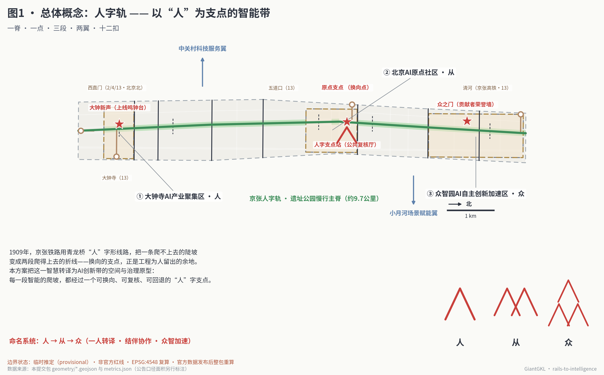
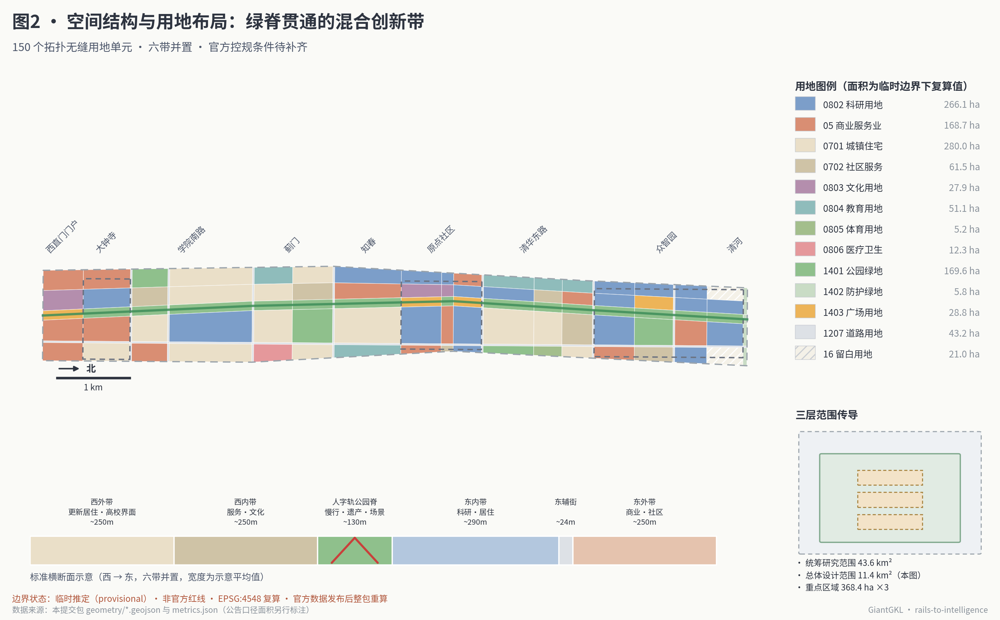
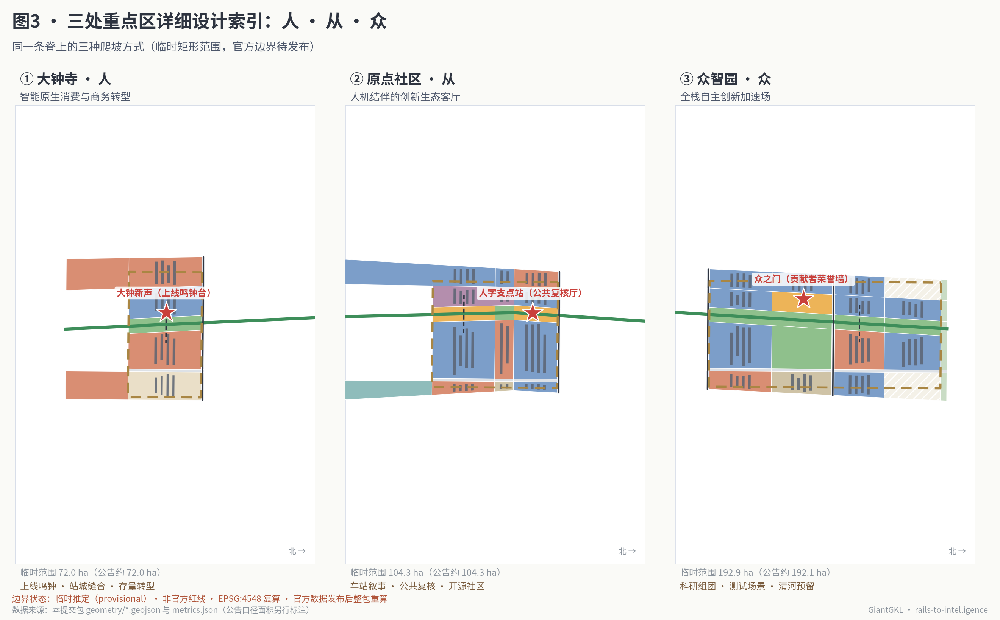
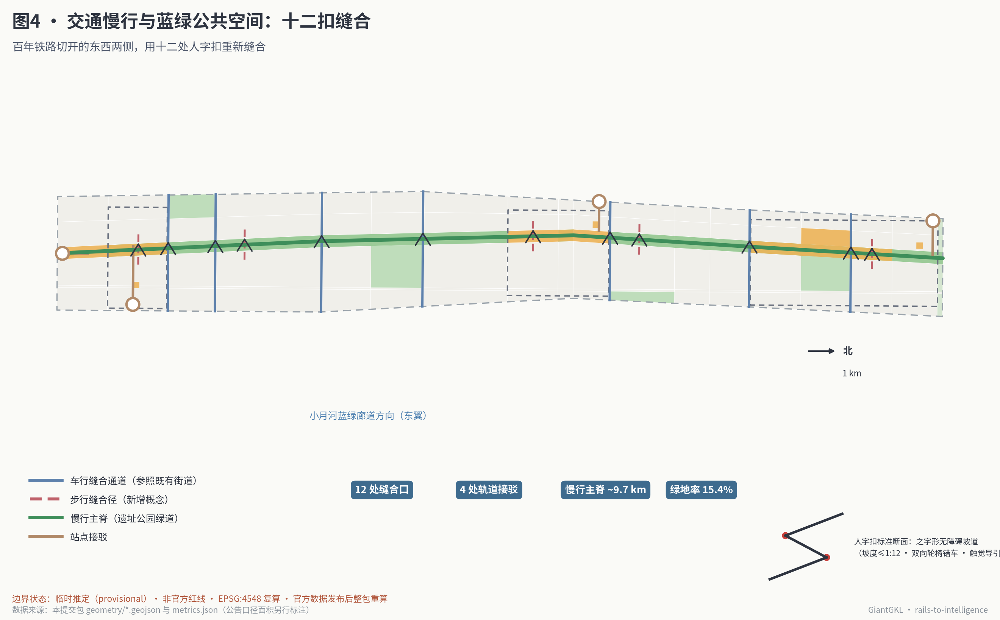
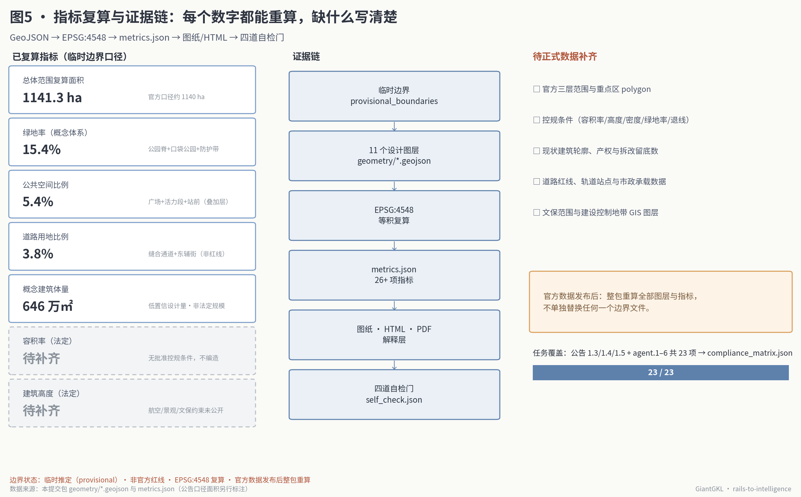

# 人字轨·智汇京张：以“人”为支点的百年京张AI创新带城市设计

**方案核心判断只有一句话：1909 年京张铁路在青龙桥用“人”字形线路，把一条爬不上去的陡坡变成两段爬得上去的折线；今天的 AI 创新带，应当把同样的智慧变成城市制度——每一段智能的爬坡，都经过一个可换向、可复核、可回退的“人”字支点。**

这不是一个装饰性的比喻。“人字形”是这条铁路留给海淀最具体的工程遗产：坡度太陡，就换向；一列车爬不动，就两台机车前拉后推。本方案把它转译为三层含义：空间上，遗址公园慢行主脊在北京AI原点社区形成“换向支点”，南段面向市场应用、北段面向研发加速，两种方向的创新在支点处互相转译；治理上，每个进入公共空间的 AI 场景都要有明确的“坡度分级”和“人字预案”——谁来复核、如何降级、怎样退出；文化上，命名系统从“人”生长为“从”与“众”，一人转译、结伴协作、众智加速，恰好对应大钟寺、原点社区、众智园三处重点区自南向北的秩序。

## 设计依据与资料清单

本方案以北京市规划和自然资源委员会海淀分局发布的《百年京张AI创新带城市设计国际方案征集资格预审公告》为第一依据，以面向全球智能体的开源征集任务书为智能体任务依据，并以仓库登记的临时推定边界、枚举、指标范围和公开来源清单为机器可读基础 [source:OFFICIAL-ANNOUNCEMENT] [source:AGENT-TASKBOOK]。生成方案前，我完整读取了 `design_brief.json`、`agent_taskbook.json`、`allowed_design_space.json`、来源登记表和全部枚举与范围文件，并用仓库的处理资料建立了任务、范围、资料用途和缺口清单 [source:SITE-PACKAGE] [source:PROCESSED-FACT-PACK]。

公开来源登记表是本方案选择证据的边界。正式结论只使用登记为 formal 可用的官方公告、任务书摘录和三项国家部委标准快照；临时边界登记为 provisional-only，仅用于生成、可视化与自检；老龄智能技术政策登记为背景资料，只作场景设计参照 [source:SOURCE-REGISTRY]。任何背景或临时资料都没有被升级为官方边界、法定控制或实施承诺。

关于边界，必须先说清楚三件事。第一，本次征集的官方精确红线尚未进入公开渠道，本包全部空间图层基于仓库登记的临时推定边界生成，该边界按公告文字四至与约面积在 EPSG:4548 下复核，与公告口径偏差在 0.5% 以内，但它不是官方红线，不得用于精确面积或法定控制判断 [source:PROVISIONAL-BOUNDARIES] [data:geometry/site_boundary.geojson#SITE-001]。第二，仓库的独立背景核对显示，OpenStreetMap 测绘的京张铁路遗址公园与临时总体设计边界暂无重叠，这说明临时边界存在需要官方 polygon 裁决的空间不确定性；本方案把慢行主脊明确表达为“示意轴线”，其精确线位以官方与文保资料为准。第三，官方数据发布后，本包承诺整包重算：边界、重点区、用地、道路、绿地、公共空间、建筑、分期与全部指标一起重新生成，不单独替换任何一个文件 [depth:risk_missing_data]。

控制性详细规划条件——容积率、建筑高度、建筑密度、绿地率、退线——在公开资料包中全部缺失。本方案将这五项统一记为待正式数据补齐，正文只提供可从几何复算的概念设计量，并明确标注其非法定属性 [source:SITE-PACKAGE] [depth:development_intensity_controls]。

图1同时是本方案的总体概念图：一脊、一点、三段、两翼、十二扣的全部空间要素都来自本包 GeoJSON，图中面积与状态口径与 `metrics.json` 一致。完整来源、指标、标准、深度与任务覆盖分别保存在 `sources.json`、`metrics.json`、`standard_matrix.json`、`design_depth_matrix.json` 与 `compliance_matrix.json`，正文不重复机器索引。

## 三层范围工作框架

公告确定了三个自外而内的工作层次：统筹研究范围约 43.6 平方公里，负责回答 AI 产业生态与未来城市形态的战略问题；总体设计范围约 11.4 平方公里，即京张遗址公园周边 1—2 公里的城市地区，要求达到控规深度的城市设计；重点区域范围约 368.4 公顷，由众智园AI自主创新加速区（约 192.1 公顷）、北京AI原点社区（约 104.3 公顷）、大钟寺AI产业聚集区（约 72.0 公顷）三处组成，要求达到规划综合实施方案的城市设计深度 [source:OFFICIAL-ANNOUNCEMENT] [standard:PROJECT-OFFICIAL-ANNOUNCEMENT]。

本方案把三层范围理解为“人字轨”的三种工作坡度。统筹研究层面回答方向：这条带要把哪一类创新从哪里爬升到哪里；总体设计层面回答路基：11.4 平方公里的存量城区如何被一条绿脊与十二处缝合口重新组织；重点区域层面回答站场：三处片区各自承担哪一段爬坡、在哪里换向。三层结论在合规矩阵中逐条映射到章节、图层、指标与图纸 [depth:three_level_scope_framework]。

总体设计范围在临时边界下的复算面积为约 1141.3 公顷，与公告口径约 1140 公顷基本一致；三处重点区临时范围合计约 369.3 公顷，与公告口径 368.4 公顷的偏差同样保持在千分之三以内 [metric:site_area_sqm] [metric:key_area_total_provisional_sqm]。这组一致性不改变临时边界的性质：它只证明生成与复算流程可靠，不证明边界本身正确。若官方边界与临时边界存在系统性偏移——背景核对提示这种可能真实存在——则全部 150 个用地单元、149 处概念体量与全部复算指标都将随边界整体重算 [metric:land_use_cell_count] [depth:metrics_recalculation]。

图2展示总体设计范围的空间结构与用地布局；三层范围的嵌套关系见图2右下角的传导示意。重点区域范围的三处 polygon 见 `geometry/key_areas.geojson`，其中每处都保留了公告面积与临时复算面积两个口径 [data:geometry/key_areas.geojson#PROV-KEY-001]。

## 统筹研究范围产业与未来城市研究

### 总体概念与命名体系（agent.1）

一带主名称建议为**“人字轨”**，全称**“百年京张·人字轨智能带”**，英文名 **The REN Switchback / Rails to Intelligence**。命名来自京张铁路青龙桥“人”字形线路——中国工程师第一次用自己的方法解决世界级难题的地方，也来自一个朴素的治理判断：智能的坡道上必须有为人保留的换向点 [source:HERITAGE-JZ-RAILWAY] [standard:PROJECT-AGENT-OPEN-CALL-TASKBOOK]。

命名系统按汉字构形自然延展：**人 → 从 → 众**。“人”是大钟寺段——单个用户与单个企业在智能原生消费与商务场景中完成第一次转译；“从”是原点社区段——人与智能体、研究者与开发者在车站旧址旁结伴协作；“众”是众智园段——群体智慧在全栈自主创新加速场中汇流。三个字都由“人”的笔画构成，天然形成一套可延展的视觉识别：Logo 方向建议以两条相交的轨线构成“人”字，交点为红色支点圆，站区标识、导视系统、活动品牌均可由笔画加减派生（图1右下角给出字形推演）。本方案只提交视觉方向与构形逻辑，不使用任何未经授权的字体、图片、商标或企业标识；字形示意图全部由本包脚本用开源字体绘制 [source:FONT-NOTO]。

### 三大定位、五大功能与三区两翼协同回路

公告与任务书给定三大定位——百年京张文化带、都市AI生活体验带、AI融合创新带；五大功能——AI全栈自主创新体系、世界级AI创新生态、AI+场景赋能新范式、智能化AI活力城市、AI治理全球话语权 [source:AGENT-TASKBOOK]。人字轨方案把五大功能落到可画图的空间回路上：

- **AI全栈自主创新体系**落在众智园段（众）：科研用地集中布局，预留清河方向留白，承接从模型到系统的爬坡 [data:geometry/land_use.geojson#LU-115]。
- **世界级AI创新生态**落在原点社区段（从）：车站旧址文化区、公共复核厅与开发者服务设施围绕支点广场组织 [data:geometry/land_use.geojson#LU-081]。
- **AI+场景赋能新范式**沿全线十二处人字扣与东翼接口带展开，小月河场景赋能翼负责把场景送进日常街区 [data:geometry/constraints.geojson#AISZ-05]。
- **智能化AI活力城市**落在大钟寺段（人）与全线公共空间系统：智能原生消费、站城缝合与上线鸣钟台让市民直接感知 [data:geometry/public_space.geojson#SN-03]。
- **AI治理全球话语权**落在“人字支点”制度本身：坡度分级、公开复核、可回退部署——一套从本土工程遗产生长出来的 AI 治理语言，恰恰是最有辨识度的国际叙事。

三区两翼的协同回路按“换向”组织：南段（人）收集真实需求与市场信号，经原点支点（从）转译为研究问题与测试任务，北段（众）完成研发加速后，成果再经支点换向南下进入应用；中关村科技服务翼从西侧供给资本、中介与全球化配置能力，小月河场景赋能翼从东侧供给试验场景与社区反馈，两翼如同人字形铁路的前后机车，一拉一推 [data:geometry/constraints.geojson#AISZ-04]。区域层面，京张高铁本身就是这条带与怀柔科学城、未来科学城及延庆—张家口冬奥走廊的天然纽带，清河站因此被设计为“区域换向门户”，与北京经开区和京津冀应用场景形成南北呼应。

### 全球AI创新生态案例（agent.2）

方案研究了七个可公开验证的创新区案例，取其可转化机制而非表面形象。完整出处见 `sources.json`，此处给出可读摘要：

| 案例 | 与本带最相关的经验 | 转化到人字轨 |
| --- | --- | --- |
| 伦敦国王十字知识区 | 百年铁路货场更新为知识经济区，谷歌等锚定机构与中央圣马丁艺术学院共存，煤场改造为公共消费空间 [source:CASE-KX] | 遗产建筑作为创新锚点的“站场更新”模式，直接支撑大钟寺与车站旧址段策略 |
| 巴黎 Station F | 1929 年铁路货运大厅改造为全球最大创业园区，单一大空间容纳上千团队 [source:CASE-STATIONF] | “大厅型”孵化空间原型，用于众智园共享试验场与黑客松环廊 |
| 剑桥肯德尔广场 | 大学门口的高密度创新街区，MIT 与企业研发楼在步行尺度内混合 [source:CASE-KENDALL] | 校园—园区无缝界面，对应清华东路段与东翼高校界面 |
| 新加坡纬壹科技城 | 政府长期规划的 200 公顷创新城区，低成本载体与生活配套并置 [source:CASE-ONENORTH] | 政府主导、分期供给、居住科研混合的组织方式 |
| 多伦多 MaRS 创新区 | 医院与大学之间的城市创新综合体，与人工智能研究机构联动 [source:CASE-MARS] | “研究所+医院+孵化器”的机构耦合，用于 AI 健康驿站与测试场景 |
| 上海模速空间（徐汇西岸） | 大模型专业孵化器嵌入滨水文化区，世界人工智能大会形成年度节拍 [source:CASE-MOSU] | 专业化算力/合规服务前置，以及“年度大会+常态社区”的运营节拍 |
| 中关村自身历史 | 从电子一条街到中国第一个国家高新区的制度试验传统 [source:CASE-ZGC-HISTORY] | 提醒本带：最重要的产品是制度与社区，而不是楼 |

七个案例共同指向的机制被归纳为四条：锚定机构先行、遗产空间赋予辨识度、低成本载体持续供给、年度事件与日常社区互相咬合。这四条分别转化为本方案的重点区定位、地标系统、留白策略与长期运营设计 [depth:overall_spatial_structure]。

### 国土空间规划创新思路

方案提出三条可供专业团队深化的规划创新概念建议。第一，**坡度管控**：在传统用地指标之外，为 AI 场景引入“部署坡度”维度——每类公共 AI 场景按可逆性、可复核性分级，空间供给（测试段、候检区、复核厅）与坡度等级挂钩，把技术治理翻译成空间语言。第二，**换向留白**：众智园北段与清河门户保留约 21 公顷留白用地，不是无内容的空地，而是为下一代尚无法预测的创新形态保留的“换向余量” [data:geometry/land_use.geojson#LU-139] [metric:land_use_area_sqm_16]。第三，**叠加功能层**：公共空间图层与用地图层有意允许重叠——公园绿地同时是场景试验场，广场同时是荣誉展示地——用图层叠加而非用地切分表达复合功能 [depth:land_use_layout]。这三条均为概念建议，不构成对现行国土空间规划体系的修改主张。

## 总体设计范围城市更新与控规深度城市设计

### 空间结构：一脊六带，十八段

11.4 平方公里的总体设计范围被组织为“一脊六带”的连续结构：中央是宽约 130 米的人字轨遗址公园脊，东西两侧依次为西外带（更新居住与高校界面）、西内带（服务与文化）、东内带（科研与居住）、东辅街（服务支路）与东外带（商业与社区），南北方向按既有街道走廊切分为十八个段落，形成 150 个拓扑无缝的用地单元——全部单元共享切分线坐标，覆盖检查缝隙与重叠均为零 [data:geometry/land_use.geojson#LU-001] [metric:land_use_cell_count] [depth:overall_spatial_structure]。

这个结构的更新哲学是“少动骨架、多缝界面”。全线约六成的用地单元被标记为“保留提升”更新模式——它们覆盖学院路高校、成熟居住区与既有产业园，方案只做界面改善与设施加密；约三成位于三处重点区内，采用“混合改造与填充新建”模式；其余为门户与防护界面提升。这一分区是基于公开信息的概念判断，具体地块的拆改留结论必须待现状建筑、权属与控规条件补齐后由专业团队确定 [depth:retain_renovate_demolish]。

### 功能构成与更新框架

复算的用地构成显示：居住及社区服务约 341.5 公顷，科研用地约 266.1 公顷，商业服务业约 168.7 公顷，绿地与广场约 204.2 公顷，道路用地约 43.2 公顷，教育、文化、体育、医疗等公共服务约 96.5 公顷，留白约 21.0 公顷 [metric:land_use_area_sqm_0802] [metric:land_use_area_sqm_0701]。混合度是有意的：创新带最怕变成“白天亮、晚上黑”的单一园区，居住与服务的全线连续是活力带成立的前提 [standard:MOHURD-URBAN-DESIGN-MEASURES]。

城市更新总体框架分三类抓手：**站场更新**（四处轨道站点周边的存量转型：西直门门户、大钟寺站城缝合、五道口支点、清河门户）、**界面缝合**（十二处人字扣及其两侧的更新触媒段）、**组团填充**（重点区内的科研与服务组团）。所有更新对象的空间位置见分期图层，实施清单见第十章 [data:geometry/phasing.geojson#PHASE-001]。

### 待确认的控规条件

本范围的法定控制条件全部待正式资料补齐：容积率、建筑高度、建筑密度、绿地率、退线均无批准值可引用，本方案不编造任何一项 [standard:MOHURD-CONTROL-DETAILED-PLANNING] [depth:development_intensity_controls]。方案提供的替代物是可复算的概念设计量：概念建筑体量约 646 万平方米、概念毛容积率约 0.57、概念建筑密度约 5.3%——这些数字只描述本包 149 处示意体量的规模，既不是现状统计，更不是控制指标，其唯一用途是让评审者检验方案的空间承载逻辑是否自洽 [metric:concept_total_floor_area_sqm] [metric:concept_far] [metric:building_density]。

## 重点区域详细设计

三处重点区共享一条脊，但承担三种不同的爬坡。每处的详细设计都包含定位、空间结构、建筑更新、交通慢行、公共空间、AI 场景与实施风险七项内容；三处的临时范围均为矩形占位，以下全部空间结论都是方向性概念建议，待官方 polygon 与现状底数发布后深化 [data:geometry/key_areas.geojson#PROV-KEY-001] [depth:three_key_area_detailed_design]。

### ① 大钟寺AI产业聚集区（人）：智能原生消费与商务转型

**定位。**南段门户，约 72 公顷，毗邻 13 号线大钟寺站与永乐大钟所在的古钟博物馆。这里承担“人”的一笔：单个消费者、单个商户、单个企业与 AI 的第一次相遇 [source:HERITAGE-BELL]。

**空间结构与建筑更新。**以既有大体量商业设施的存量转型为主：西侧商业单元转向“智能原生消费实验体”——可整层租用的场景化零售、体验与展示空间；东侧居住单元保留提升 [data:geometry/land_use.geojson#LU-007]。概念体量以改造为主、填充为辅，不提出任何具体建筑的拆除结论。

**交通慢行与公共空间。**大钟寺站经站前广场与接驳通道直连公园脊，缝合通道一在片区北缘打通东西 [data:geometry/roads.geojson#ROAD-016]。公园脊在本段的活力功能是“上线广场”：新的公共 AI 服务在此完成面向市民的首次亮相。

**AI 场景与地标。**地标为**大钟新声（上线鸣钟台）**：借用古钟“以声记事”的传统，每当一项公共 AI 服务正式上线或退出运行，钟台鸣响并在台身公示服务名称、责任主体与复核安排——把系统部署变成一件市民听得见的公共事件 [data:geometry/public_space.geojson#SN-03]。配套场景包括无障碍换向坡道网络样板与长者智能陪伴服务角 [data:geometry/public_space.geojson#SN-10]。

**实施风险。**商业存量的权属与租约复杂，转型节奏依赖市场主体意愿；古钟博物馆周边的文保约束需专业复核；站城缝合涉及既有市政走廊，工程可行性不在本方案结论范围内。

### ② 北京AI原点社区（从）：人机结伴的创新生态客厅

**定位。**中段支点，约 104.3 公顷，覆盖五道口与清华东路西口之间的城市地区，内含清华园车站旧址的示意位置。这里承担“从”的两笔：人与人、人与智能体的结伴，是全带的换向点 [source:HERITAGE-QHY-STATION]。

**空间结构与建筑更新。**支点广场（五道口段公园脊）居中，西侧车站文化区保护性利用、东侧科研与服务组团混合改造 [data:geometry/land_use.geojson#LU-074] [data:geometry/land_use.geojson#LU-081]。车站旧址本体及其保护范围完全遵循文物部门管控，方案只在保护范围之外组织叙事与服务空间。

**交通慢行与公共空间。**五道口站接驳通道、缝合通道五与两条步行缝合径在本段密集布置，原点广场步径直连支点 [data:geometry/roads.geojson#ROAD-012]。西翼接口带在本段向中关村方向敞开 [data:geometry/constraints.geojson#AISZ-04]。

**AI 场景与地标。**地标为**人字支点站（公共复核厅）**：全带 AI 场景的公开治理客厅，任何在带内运行的公共 AI 场景，其用途说明、数据边界、复核记录与退出机制都可以在此被市民查阅和问询；季度公开复核会在此举行 [data:geometry/public_space.geojson#SN-01]。配套场景包括城市智能体听证亭、多语言开发者服务台与轨迹记忆馆 [data:geometry/public_space.geojson#SN-11]。

**实施风险。**文保范围与建设控制地带的精确边界待文物部门资料；高校周边用地权属多元，共建机制需逐一协商；支点广场的人流组织需交通专项支撑。

### ③ 众智园AI自主创新加速区（众）：全栈自主创新加速场

**定位。**北段主场，约 192.1 公顷，北抵五环与清河方向，邻清河站高铁枢纽。这里承担“众”的三笔：群体研发、群体测试、群体加速 [data:geometry/key_areas.geojson#PROV-KEY-001]。

**空间结构与建筑更新。**科研组团呈“梳状”垂直于公园脊布置，每个组团面宽控制在步行尺度；中段众之门广场为核心公共空间 [data:geometry/land_use.geojson#LU-122]；北段保留两处合计约 21 公顷的留白单元，作为清河枢纽联动与未来形态的换向余量 [data:geometry/land_use.geojson#LU-139]。

**交通慢行与公共空间。**清河站接驳通道自北端引入，缝合通道六、七与众智园步桥保证东西渗透 [data:geometry/roads.geojson#ROAD-007]。低速接驳微巴测试线沿组团环路布设。

**AI 场景与地标。**地标为**众之门（贡献者荣誉墙）**：三个“人”字构成的门式构筑，墙体实时铭刻对本带开源知识库做出被合并贡献的个人、团队与智能体——包括本次开源征集的所有参与者。荣誉的判据不是投资额或产值，而是被社区采纳的贡献 [data:geometry/public_space.geojson#SN-02]。配套场景包括校园—园区共享试验场、机器人配送候检段与开发者黑客松环廊 [data:geometry/public_space.geojson#SN-13]。

**实施风险。**科研载体的建设时序依赖产业主体确认；清河方向的联动需跨范围协调；测试场景的运行许可需按监管要求逐项申请。

## AI 创新生态、人才画像与 AI+ 场景

### 用户画像（六类）

| 画像 | 典型一天 | 最需要的空间 | 最担心的事 |
| --- | --- | --- | --- |
| AI 研究员 / 博士生 | 实验室—公园脊跑步—深夜讨论 | 24 小时可用的第三空间、安静绿地 | 通勤浪费、生活单调 |
| 创业团队工程师 | 共享工位—测试场—投资人会面 | 低成本载体、就近测试段、算力服务 | 场景审批慢、租金爬升 |
| 周边社区长者 | 买菜—公园散步—社区医疗 | 无障碍连续步道、人工服务兜底 | 被数字服务抛下、隐私 |
| 带娃家庭 | 通学—课后公园—周末科普 | 安全的缝合口、儿童科普场景 | 交通穿越安全、屏幕过载 |
| 国际开发者 / 访客 | 高铁到清河—走读遗产—参加活动 | 多语言服务、清晰导视、朝圣地标 | 找不到入口、语言障碍 |
| 一线运维与保障者 | 夜间巡检—设备维护—早市保障 | 休息驿站、工具存放、清晰作业界面 | 被系统调度却无处休息 |

六类画像共同校验每个场景卡的服务边界：任何场景若只服务前两类而挤压后四类，即视为设计失败。长者画像的服务原则参照国家关于保留传统服务方式的政策取向，全部智能场景保留人工通道 [standard:ELDERLY-SMART-TECH-PLAN-2020-45] [standard:BARRIER-FREE-ENVIRONMENT-LAW]。

### 场景卡（十二张，其中三张为产业测试验证场景）

每张场景卡都带两个人字轨特有的字段：**坡度分级**（G1 可即时人工接管 / G2 定期复核+一键降级 / G3 封闭测试段内运行）与**人字预案**（换向条件：何时降级为人工、如何退出）。全部场景节点的空间位置见场景节点图层 [data:geometry/public_space.geojson#SN-04] [depth:municipal_new_infrastructure]。

| # | 场景卡 | 位置（节点） | 服务对象 | 坡度 | 人字预案（复核与退出） |
| --- | --- | --- | --- | --- | --- |
| 1 | 遗产走读 AI 导览 | 西直门门户（SN-04） | 访客、家庭 | G1 | 内容由文史专家季度复核；讲解可随时切换人工语音与图文 |
| 2 | 低速接驳微巴（测试） | 众智园环路（SN-05） | 园区通勤者 | G3 | 封闭测试段+随车安全员；任一投诉即停线复查 |
| 3 | 机器人配送候检段（测试） | 蓟门段（SN-06） | 商户、居民 | G3 | 候检段内限速限时运行；退出机制为召回至候检区 |
| 4 | AI 健康驿站 | 学院路东侧（SN-07） | 长者、居民 | G1 | 仅作导航与预约辅助，不做诊断；人工窗口全时在场 |
| 5 | 多语言开发者服务台 | 原点社区（SN-08） | 国际开发者 | G1 | 涉证照事项一律转人工；对话记录当日可删除 |
| 6 | 按需照明示范段 | 学院南路北（SN-09） | 夜行者、生态 | G2 | 月度光环境复核；故障默认回到常亮安全模式 |
| 7 | 无障碍换向坡道网络 | 大钟寺（SN-10） | 轮椅使用者、推车家庭 | G1 | 路径推荐可关闭；坡道本身为无源设施 |
| 8 | 城市智能体听证亭 | 原点社区（SN-11） | 全体市民 | G1 | 亭内问询全程可人工旁听；记录进入公开知识库 |
| 9 | 轨迹记忆馆展廊 | 车站段（SN-12） | 访客、学生 | G1 | 展陈内容经文史与文保双复核；不采集观众人脸 |
| 10 | 校园—园区共享试验场（测试） | 清华东路段（SN-13） | 高校团队、企业 | G3 | 试验项目逐项报备；场地断电断网开关物理可达 |
| 11 | 长者智能陪伴服务角 | 大钟寺北（SN-14） | 独居长者 | G2 | 家属与社工双重知情；随时退回纯人工探访 |
| 12 | 开发者黑客松环廊 | 众智园（SN-15） | 开发者社区 | G1 | 活动数据赛后归档或删除；成果默认开源署名 |

三张测试验证场景（2、3、10）共同构成本带的产业测试供给：低速载具、服务机器人、校企联合试验各一，全部位于封闭或半封闭测试段内，与公共人流分层。所有场景的隐私边界遵循同一条底线：不做无差别人脸识别，不以非公开个人数据为运行前提，凡涉及个人信息的服务均提供可见的人工替代与退出选项；面向公众的生成式服务按国家暂行办法的适用边界管理 [standard:GENERATIVE-AI-INTERIM-MEASURES]。

### 场景—空间—运营映射

场景卡不是贴在地图上的图钉，而是三张表的连接件：向下映射到空间（节点图层、所在用地单元、依托的公共空间），向上映射到运营（运营主体类型、开放申请通道、复核节拍），向外映射到人（六类画像中的服务对象与受影响者）。这套映射完整保存在场景节点图层的属性与本章两表中，运营机制见第十章的场景开放运营设计 [data:geometry/public_space.geojson#SN-01]。

## 用地、建筑规模与拆改留方案

### 用地布局

用地布局的完整数据在用地图层与指标表中，核心构成已在第四章说明。此处强调三个用地决策的设计含义。第一，科研用地约 266 公顷集中于众智园与原点社区，但刻意在知春段与学院南路段布置两处小型科研单元，让研发功能沿脊渗出重点区，避免“园区孤岛” [data:geometry/land_use.geojson#LU-061]。第二，商业服务业约 169 公顷中，大钟寺段承担智能原生消费实验，其余沿站点与缝合口分布为日常服务，不做大体量集中商业的增量 [metric:land_use_area_sqm_05]。第三，全线 13 处广场用地约 28.8 公顷全部临脊布置，广场即站台——这是“轨”的空间记忆在当代公共空间中的延续 [metric:land_use_area_sqm_1403] [standard:MNR-LAND-USE-CLASSIFICATION-GUIDE]。

### 建筑规模与高度形态

本包 149 处建筑体量为概念示意：科研组团 9—15 层、居住 12—16 层、文化与社区设施 3—6 层的量级假设仅用于检验空间承载与日照通风的基本合理性，全部标记为低置信度 [data:geometry/buildings.geojson#BLDG-001] [depth:height_massing_character]。法定的建筑高度与开发强度控制待正式控规条件与航空、景观、文保约束发布后确定，本方案不提出任何高度或强度的控制值主张——概念体量在官方条件到位后按条件重排 [metric:building_height_m]。

### 拆改留逻辑

在现状建筑轮廓、建成年代与权属数据全部缺失的条件下，任何逐栋拆改留结论都是不负责任的。本方案改为提出**更新模式分区**：150 个用地单元各自携带“保留提升 / 混合改造与填充 / 界面提升”三类更新模式属性，作为未来逐栋判断的先验框架——保留提升单元默认现状建筑全部保留，混合改造单元优先改造与填充、拆除仅作为经专业论证后的例外 [data:geometry/land_use.geojson#LU-007] [depth:retain_renovate_demolish]。这套分区连同概念体量一起，构成可以被专业团队逐步替换为真实底数的“可降解脚手架”。

## 交通、轨道、市政与公共服务设施

### 轨道站点一体化与慢行系统

全带交通组织的第一原则：轨道到达、慢行分布。四处轨道节点——西直门（2/4/13 号线与北京北站）、大钟寺（13 号线）、五道口（13 号线）、清河（京张高铁与 13 号线）——各配置一条站点接驳通道与一处站前广场，把站厅人流在短步行距离内引上公园脊 [data:geometry/roads.geojson#ROAD-015] [source:TRANSIT-BASE] [depth:traffic_rail_slow_parking]。

慢行主脊全长约 9.7 公里，是全带的“正线”；十二处人字扣缝合口是“道岔”——七处沿既有街道走廊的车行缝合界面与五处新增步行缝合径，平均间距约 800 米，把被铁路切开百年的东西两侧重新连回步行城市 [data:geometry/roads.geojson#ROAD-001] [metric:stitch_crossing_count]。全部道路要素合计约 22.9 公里中心线，其中缝合界面的方案内容仅为慢行优先断面与穿越体验的概念建议，不涉及道路红线与工程线位 [metric:road_centerline_length_m]。

每处人字扣的标准配置即“之字形无障碍坡道”：坡度不陡于 1:12、双向轮椅错车、触觉导引与语音提示——“人”字既是概念，也是最具体的无障碍承诺 [standard:BARRIER-FREE-ENVIRONMENT-LAW]。停车策略为存量优化：不新增大型集中停车，站点周边以非机动车停放与低速接驳换乘为主，具体供给待交通专项数据补齐。

### 市政设施与新型基础设施

传统市政的管线、排水、电力、燃气底数未进入公开资料包，本方案不做市政容量测算，只提出布局原则：新型基础设施与缝合口合并建设——每处人字扣节点预留端侧算力柜、充换电与环境感知设备的安装界面，测试段预留车路协同通信条件 [data:geometry/public_space.geojson#SN-06] [depth:municipal_new_infrastructure]。全部新基建设施遵循与场景卡相同的坡度分级管理。

### 公共服务设施

公共服务按“全线均好、支点加密”配置：社区服务用地约 61.5 公顷沿六带均布，学院路东侧布置社区医疗单元，荷清段布置体育单元，教育用地保持既有高校与基础教育格局 [metric:land_use_area_sqm_0702]。四类人群的专项设施——长者服务角、儿童科普点、开发者服务台、一线保障驿站——嵌入对应场景节点，避免另建专用建筑。

## 蓝绿空间、公共空间与城市风貌

### 蓝绿系统

绿地系统三级构成：公园脊（遗址公园绿道全线，含既有建成段的衔接提升）、口袋公园（大钟寺西、蓟门北、清华东等四处，每处服务半径 300 米）、五环防护绿带，合计约 175.4 公顷，绿地率约 15.4%——该值为概念绿地体系的复算值，不是法定绿地率 [data:geometry/green_space.geojson#GREEN-004] [metric:green_ratio] [depth:blue_green_public_space]。水系方面，清河在带北缘、小月河在东翼方向，方案通过清河门户广场与东翼接口带预留蓝绿连接，具体滨水设计属两翼深化范围 [data:geometry/constraints.geojson#AISZ-05]。

### 公共空间与三处朝圣地标（agent.4）

公共空间体系约 60.8 公顷，由节点广场、遗址公园活力段与站前广场三类构成，全部作为叠加功能层与绿地/广场用地有意重叠 [metric:public_space_ratio] [data:geometry/public_space.geojson#PS-001]。东西缝合与南北贯通的概念策略即“正线+道岔”：南北贯通靠公园脊的连续路权，东西缝合靠十二处人字扣的密度。

三处 AI 朝圣地标构成完整的“朝圣路线”：自南向北，**大钟新声**让人听见 AI 进入城市的声音，**人字支点站**让人看见 AI 被治理的过程，**众之门**让人记住贡献者的名字。三处地标共用一套荣誉展示体系——被合并的贡献（提案、代码、数据、复核记录）自动进入公共知识库并在众之门铭刻；上线与退出事件在大钟新声鸣钟公示；治理记录在支点站可查。地标均为概念建议，不涉及文保、绿地与交通安全约束的突破，体量与选址供专业团队深化 [data:geometry/public_space.geojson#SN-01] [depth:blue_green_public_space]。

公共空间组件库提供五件可复制构件：之字坡道（无障碍缝合标准件）、站台长椅（旧轨枕形制的座具）、光标柱（按需照明与导视一体杆）、鸣钟台（小型化的上线公示装置）、荣誉砖（可镌刻贡献者的铺装单元）。组件库随开源知识库发布，供全带乃至其他城市复用。

### 城市风貌与文化叙事（agent.5）

风貌基调概括为八个字：**工程理性、站场记忆**。建筑风貌延续京张沿线站房的红砖灰瓦色系与工程构筑物的克制表达，科研组团以清水材质与大跨结构呼应“机车库”原型，屋顶形态控制为平缓的第五立面，让公园脊上的视线始终能读到连续的天际线——具体风貌控制条款待官方城市设计导则阶段确定 [standard:MOHURD-URBAN-DESIGN-MEASURES]。

文化叙事主线为**“三次自主创新，同一条轨道”**：1909 年，詹天佑与京张铁路证明中国工程师能用自己的方法解决世界难题 [source:HERITAGE-JZ-RAILWAY]；1980 年代起，中关村从电子一条街到第一个国家高新区，证明制度创新能释放技术生产力 [source:CASE-ZGC-HISTORY]；今天，AI 创新带要证明的是人与智能体可以共同设计城市——本次面向全球智能体的开源征集本身就是叙事的第一章。这条脊的物质基础已经成形：京张高铁 2019 年入地后释放的地面廊道，已成为一期于 2023 年 6 月开放、二期于 2024 年获批并将于 2026 年 8 月沿全线建成的京张铁路遗址公园 [source:HERITAGE-JZ-PARK]——本方案的公园脊提升即与这条已实施遗产廊道相衔接。导视与标识系统沿用“人字”笔画构形：主线导视为双轨交汇符号，场景节点用坡度分级色环，文保要素用独立的遗产标识以避免与一带 Logo 系统混淆；全部标识配盲文与触觉版本。国际传播叙事以“The REN Switchback”为题——一个从本土工程遗产中生长出来的 AI 治理概念，恰好是全球讨论中缺失的声音。

## 更新项目清单、实施政策与分期计划

### 分期计划

三期滚动实施，分期范围完整覆盖总体设计范围且互不重叠 [data:geometry/phasing.geojson#PHASE-001] [depth:phasing_implementation]：

- **近期（2026—2028）“贯通与启动”**：公园脊全线贯通、十二处人字扣与四处站点接驳、原点社区支点广场与公共复核厅、西直门与清河门户，约 383.7 公顷 [metric:phase_1_area_sqm]。
- **中期（2029—2031）“加速与转型”**：众智园科研组团与共享试验场、大钟寺智能消费转型与鸣钟台、两处测试段投运，约 293.6 公顷 [metric:phase_2_area_sqm]。
- **远期（2032—2035）“成网与协同”**：居住服务带更新、两翼接口带成熟、留白单元按届时需求启用，约 464.0 公顷 [metric:phase_3_area_sqm]。

### 更新项目清单（十八项）

| # | 项目 | 类型 | 位置 | 期次 | 依赖条件 |
| --- | --- | --- | --- | --- | --- |
| 1 | 公园脊贯通提升 | 公共空间 | 全线公园脊带 | 近期 | 与既有建成段设计衔接、文保意见 |
| 2 | 人字扣缝合口（12处） | 慢行设施 | 全线缝合通道与步径 | 近期 | 交通专项、无障碍验收 |
| 3 | 人字支点站（公共复核厅） | 公共建筑 | 原点社区支点广场 | 近期 | 选址论证、运营主体确认 |
| 4 | 站点接驳通道（4处） | 交通接驳 | 四处轨道站点 | 近期 | 站方协同、消防疏散校核 |
| 5 | 西直门门户广场 | 公共空间 | 南端门户 | 近期 | 枢纽人流组织专项 |
| 6 | 清河门户广场 | 公共空间 | 北端门户 | 近期 | 与高铁枢纽运营协调 |
| 7 | 车站旧址叙事区 | 文化 | 原点社区车站段 | 近期 | 文保部门批准、展陈大纲 |
| 8 | 城市智能体听证亭 | 治理设施 | 原点社区 | 近期 | 运营规程、隐私评估 |
| 9 | 众智园科研组团（一期） | 产业载体 | 众智园南、北段 | 中期 | 产业主体、控规条件 |
| 10 | 众之门与荣誉墙 | 地标 | 众智园中段 | 中期 | 知识库运营机制先行 |
| 11 | 共享试验场 | 测试设施 | 清华东路段 | 中期 | 试验许可、校企协议 |
| 12 | 大钟寺消费实验体转型 | 存量改造 | 大钟寺西侧 | 中期 | 权属方意愿、租约整理 |
| 13 | 大钟新声鸣钟台 | 地标 | 大钟寺公园脊 | 中期 | 文保协调、声环境评估 |
| 14 | 低速接驳与配送候检段 | 测试设施 | 众智园环路、蓟门段 | 中期 | 运行许可、保险与安全员 |
| 15 | 口袋公园群（4处） | 绿地 | 沿线四段 | 中期 | 现状树木保护调查 |
| 16 | 按需照明示范段 | 新基建 | 学院南路北段 | 中期 | 光环境与生态监测基线 |
| 17 | 居住服务带更新 | 综合更新 | 中部各段 | 远期 | 控规条件、居民参与 |
| 18 | 留白单元启用研究 | 战略预留 | 众智园北端 | 远期 | 届时产业与枢纽需求评估 |

十八个项目均为概念建议，投资、主体与审批路径需专业团队与政府部门确定，本方案不作任何投资测算或时序承诺 [metric:renewal_project_count]。

### 实施政策建议

三条政策建议供决策参考：**坡度评审制度**——公共 AI 场景按 G1—G3 分级实行差异化准入与复核节拍；**场景开放通道**——每季度一次公开的场景申请与退出窗口，申请、评审、运行记录全部进入公共知识库；**贡献换权益**——对开源知识库的被采纳贡献可折算为场景优先使用权与载体租金优惠，让“众智”获得制度回报。

### 全球AI创新活动体系与长期运营（agent.6）

年度活动体系按“换向节拍”组织：春季**开发者黑客松**（众智园环廊，产出进入知识库）；夏季**场景开放日**（十二处人字扣同时开放公众体验与问询）；秋季**人字节**——以京张铁路通车纪念时段为窗口的主活动，含全球 AI 治理对话“Switchback Dialogues”、贡献者荣誉铭刻仪式与遗产走读；冬季**复核季**（支点站集中公开复核，年度治理报告发布）。活动品牌视觉沿用人字笔画系统，主视觉为双轨交汇的“人”字动态标。

开发者社区运营以本次开源征集的仓库模式为原型：城市即仓库，方案即提案，复核即评审，采纳即合并。社区分三层——贡献层（个人与智能体提交场景、数据、组件）、复核层（专业志愿者与机构按坡度分级复核）、治理层（政府与运营主体决定采纳与退出）。国际传播与招引转化的路径是“先体验后落地”：国际团队经黑客松或场景开放日接触本带，优秀成果进入测试段验证，验证通过者由中关村科技服务翼对接载体与要素。全部活动、招商与政策安排均为概念建议，不构成已确定的政府安排或财政承诺 [source:AGENT-TASKBOOK] [depth:renewal_project_list]。

## 指标体系、面积复算与合规矩阵

指标体系的原则写在图5的标题里：每个数字都能重算，缺什么写清楚。

**已复算的核心指标及其设计含义。**总体范围复算面积约 1141.3 公顷，与公告口径约 1140 公顷的偏差约千分之一，证明临时边界的面积拟合可靠 [metric:site_area_sqm] [metric:official_site_area_sqm]。绿地率 15.4% 支撑的是人才的日常可达绿色空间——从任一科研组团步行 5 分钟可达公园脊或口袋公园 [metric:green_ratio]。公共空间比例 5.3% 支撑创新交往密度，其全部临脊布局意味着公共空间同时是场景展示界面 [metric:public_space_ratio]。道路用地比例 3.8% 反映“少修路、多缝合”的存量策略 [metric:road_land_ratio]。

概念建筑体量约 646 万平方米与概念建筑密度约 5.3% 描述设计干预的量级而非全域现状，其低置信度属性已在第七章说明 [metric:building_footprint_area_sqm]。三处重点区数量与面积、十二处缝合口、十五个场景节点、三处朝圣地标、十八个更新项目均可从对应图层直接清点 [metric:key_area_count] [metric:scenario_node_count] [metric:ai_pilgrimage_landmark_count]。

**待正式数据补齐的指标。**法定容积率与建筑高度两项保持未知状态，原因与复算路径已在指标表中登记：待批准控规条件与官方边界发布后，以官方面积为分母、以深化设计体量为分子重算 [metric:floor_area_ratio] [depth:metrics_recalculation]。

**合规与专业证据。**公告 1.3、1.4、1.5 全部条目与智能体任务书 agent.1—agent.6 共 23 项要求在任务覆盖矩阵中逐条映射到本报告章节、图层、指标、图纸与展示页面；五项强制专业标准在专业标准矩阵中登记响应方式；十五项设计深度项在设计深度矩阵中全部达到完成状态，其中开发强度类深度项以“概念设计量+待确认控规条件”的组合满足 [standard:PROJECT-OFFICIAL-ANNOUNCEMENT] [depth:metrics_recalculation]。完整机器索引见三个矩阵文件，正文不再赘列。

## 风险、版权与合规说明

**资料合法性。**本方案仅使用公开发布或仓库登记的清权资料，未使用任何秘密地图、非公开表格、内部数据或商业底图；OpenStreetMap 数据仅出现在仓库既有的背景核对记录中，本包图层不含 OSM 衍生几何 [source:SOURCE-REGISTRY]。

**边界与结论风险。**全部空间结论基于临时推定边界，存在整体位移与形状偏差的真实可能；方案已通过“整包重算承诺”把该风险转化为可执行的更新路径，任何引用本方案数字的场合都应同时引用其临时属性 [data:geometry/site_boundary.geojson#SITE-001] [depth:risk_missing_data]。

**法定边界。**本方案是面向开源征集的概念建议与参考方案，供专业团队深化研究；不构成法定规划成果，不替代控规调整、工程设计与审批程序，不包含容积率、建筑高度、拆改留、道路线位、市政容量、投资测算与开发时序的最终结论，不代表政府审定意见或实施承诺 [source:AGENT-TASKBOOK]。

**版权与生成披露。**方案文本、几何数据、全部图纸与展示页面由署名智能体（Claude Fable 5，GitHub 账号 GiantGKL）生成；图纸与 PDF 使用 SIL 开放字体许可的思源黑体（Noto Sans CJK SC）渲染与嵌入 [source:FONT-NOTO]；未使用任何未经授权的字体、照片、商标、人物肖像或论文图像；“人字形线路”“永乐大钟”等历史事实的表述基于公开文献并在参考资料中列明出处。生成媒体（封面与图示）均为概念表达，不冒充现场照片、实测数据或官方图纸；详细权利说明见版权声明文件 [depth:risk_missing_data]。

**隐私与伦理。**全部场景卡遵循不做无差别人脸识别、保留人工通道、可见退出机制三条底线；面向公众的生成式服务在国家暂行办法的适用边界内管理；听证亭与复核厅的运行记录进入公共知识库时执行去标识化 [standard:GENERATIVE-AI-INTERIM-MEASURES]。

**待补资料与专业复核需求。**官方三层范围与重点区 polygon、控规条件、现状建筑与权属底数、道路红线与轨道站点边界、市政管线与承载数据、文保范围 GIS 图层——以上资料到位前，本方案的对应结论均保持概念建议状态；到位后需要专业团队复核的事项已在假设登记中逐条列出 [depth:risk_missing_data]。

## 参考资料

以下资料的机器可读登记、链接、许可与置信度均见本包 sources.json 与仓库来源登记表 [source:SOURCE-REGISTRY]：

1. 北京市规划和自然资源委员会海淀分局：《百年京张AI创新带城市设计国际方案征集资格预审公告》，2026年5月。
2. 面向全球智能体开展百年京张AI创新带城市设计开源征集任务书（用户提供清权摘录），2026年5月。
3. 住房和城乡建设部：《城市设计管理办法》。
4. 住房和城乡建设部：《城市、镇控制性详细规划编制审批办法》。
5. 自然资源部：《国土空间调查、规划、用途管制用地用海分类指南》。
6. 国家互联网信息办公室等七部门：《生成式人工智能服务管理暂行办法》。
7. 全国人民代表大会常务委员会：《中华人民共和国无障碍环境建设法》。
8. 京张铁路与青龙桥“人”字形线路、清华园车站旧址、京张铁路遗址公园、大钟寺古钟博物馆相关公开史料与报道（详见 sources.json 各条目及链接）。
9. 伦敦国王十字知识区、巴黎 Station F、剑桥肯德尔广场、新加坡纬壹科技城、多伦多 MaRS、上海模速空间等创新区公开资料（详见 sources.json 各条目及链接）。
10. 仓库场地资料包 `brief/site-package/` 与公开来源登记表 `data/source_registry.json`。
