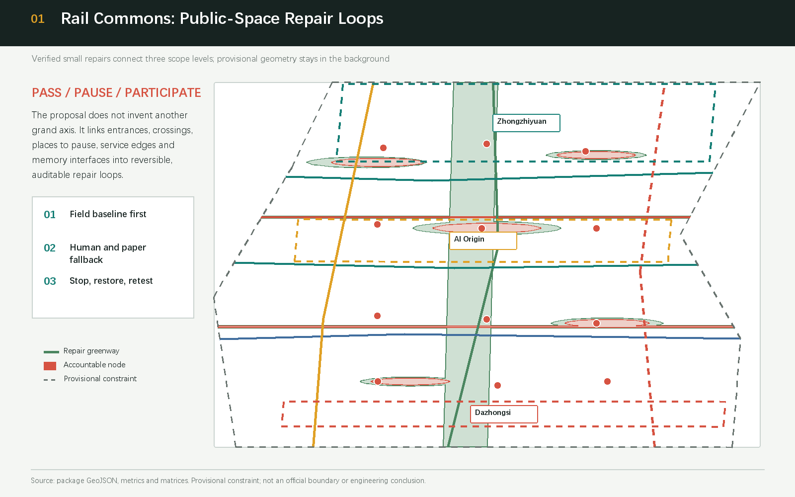
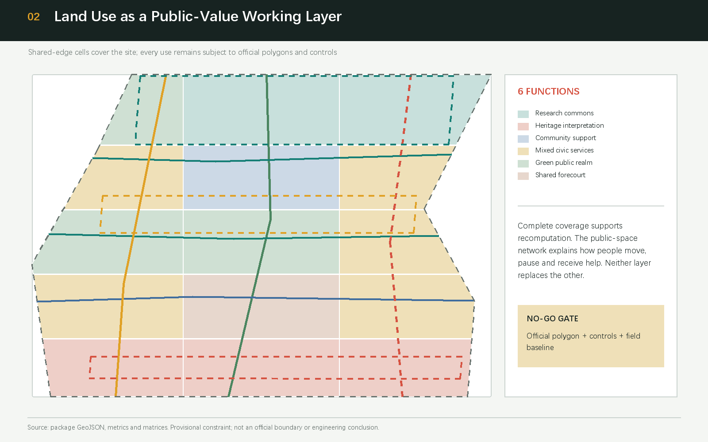
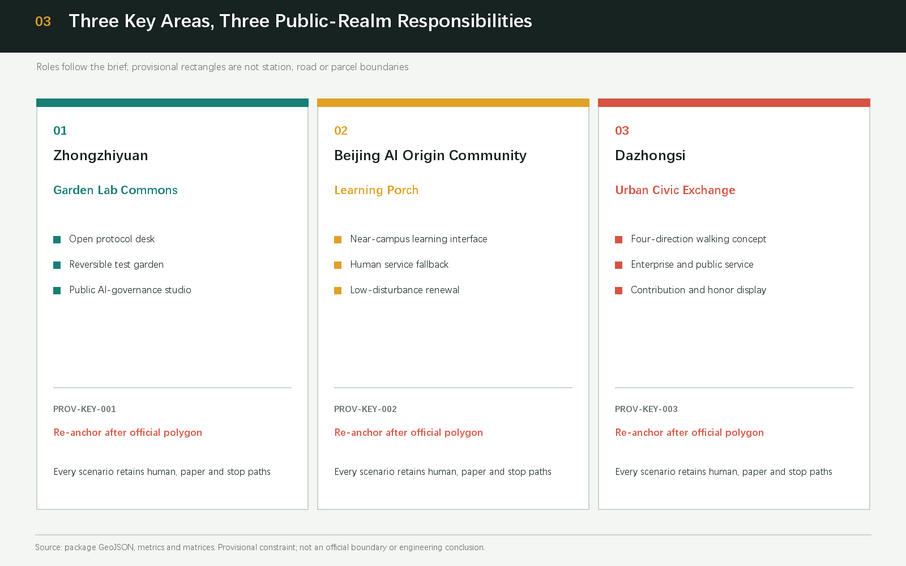
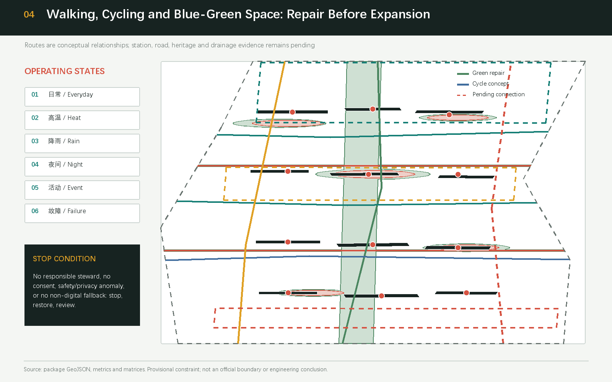
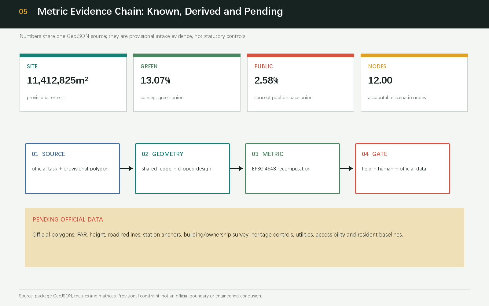

# Rail Commons: Haidian Public Space Revival

## Design Basis and Source List

This proposal defines public-space revival as a set of verifiable, reversible, transferable repairs rather than an unverified grand construction axis. Its basis is the Haidian qualification pre-announcement, the rights-cleared Agent taskbook excerpt, the Ministry of Housing and Urban-Rural Development references on urban design and regulatory detailed planning, the Ministry of Natural Resources land-use vocabulary, and the maintainer-registered provisional geometry. The announcement establishes the project purpose, approximate scope values and required depth, but it does not provide an official GIS/CAD redline. The taskbook establishes open co-creation, scenario, branding and operation requirements, but it cannot create an engineering conclusion or a government commitment [source:DATA-SRC-OFFICIAL-ANNOUNCEMENT-20260509] [source:DATA-SRC-AGENT-TASKBOOK-20260518].

The package uses `PROV-SITE-001` and `PROV-KEY-001/002/003` from `brief/site-package/geometry/provisional_boundaries.geojson`. Their role is `provisional_constraint` with `official_boundary=false`; they are used only for generation, visualization, discussion and intake checks. They are not called official redlines, station boundaries, road redlines or property limits. When official or cleared polygons, controls, building/property surveys, road sections, heritage controls, municipal data and resident baselines arrive, all dependent layers and metrics must be replaced and recomputed together [source:DATA-SRC-PROVISIONAL-BOUNDARIES-20260605] [depth:risk_missing_data].

The source registry separates formal-ready, background-only and provisional-only material. Public Jing-Zhang Railway Heritage Park reports, the Brookings innovation-district study and six international cases are comparative prompts, not evidence for local areas, intensity, facility capacity or implementation. Issues #846, #1029, #1061 and #1081 improve the package’s uncertainty log, accountability chain and stop conditions; they are not spatial facts. GeoJSON, metrics, matrices and self-check form the machine-audit layer, while this report keeps claim-adjacent anchors for human readers [source:SOURCE-REGISTRY] [standard:PROJECT-OFFICIAL-ANNOUNCEMENT].

## Three-Level Scope Framework

The three levels follow a research-to-renewal-to-interface chain. The Coordinated Research Area is approximately 43.6 km² and carries ecosystem, talent, factor and regional-coordination research. The Overall Design Area is approximately 11.4 km² in the brief and carries public-space repair, urban renewal and future-city form around the heritage park. The Key-Area Detailed Design Area is approximately 368.4 ha and contains the north-to-south Zhongzhiyuan, Beijing AI Origin Community and Dazhongsi areas. Brief values are task evidence; submitted geometry is a recomputable working layer under provisional constraints, and the two meanings are not collapsed into one number before official data arrives [data:geometry/site_boundary.geojson#SITE-001] [metric:announced_overall_design_area_sqm].

At the research level, a Zhongguancun Technology Services Wing—three zones—Xiaoyue River Scenario Enablement Wing loop moves public policy, intellectual property, compute and scenario access toward the zones, and brings daily-life questions back to the test room. At the overall level, the loop becomes five public interfaces expressed as pass, pause and participate. At the key-area level, each zone receives a public-interest responsibility rather than an unverified station or parcel claim [depth:three_level_scope_framework] [source:DATA-SRC-AGENT-TASKBOOK-20260518].

The diagrams keep the provisional boundary low contrast and give visual priority to repair corridors, public nodes and cross-links. `land_use.geojson` is the complete partition; `roads.geojson`, `green_space.geojson`, `public_space.geojson` and `constraints.geojson` are conceptual layers. Once official polygons arrive, all cuts, nodes, areas, drawings and HTML must be recomputed. This is how the three-level brief remains legible without manufacturing certainty [data:geometry/key_areas.geojson#PROV-KEY-001] [data:geometry/land_use.geojson#LU-01].

## Coordinated Research Area: Industry and Future City Research

The name is “Rail Commons,” with a visual identity direction of two open rail lines and an open bracket forming `R↔C`. The rails recall shared Jing-Zhang memory; the bracket means that public knowledge can be entered, questioned and corrected; the intersection is a human-city-industry collaboration point. The mark uses locally drawn geometry, system-available type and original text only. A restrained ink, signal red, route blue and audit yellow palette separates space, people, gates and pending evidence across print, web and field signs [source:DATA-SRC-AGENT-TASKBOOK-20260518] [standard:MOHURD-URBAN-DESIGN-MEASURES].

The three positions become three public values: the Centennial Jing-Zhang Cultural Belt offers traceable history; the Urban AI Life-Experience Belt offers low-barrier work, learning, rest, care and sociability; the AI Integrated Innovation Belt offers open testing, professional review and reversible operation. The five functions are the Full-Stack Independent AI Innovation System, World-Class AI Innovation Ecosystem, AI-Enabled Scenario Paradigm, Intelligent AI Vital City and Global Discourse on AI Governance. They are implemented as a loop of accountable nodes, data minimization, non-digital access and retest gates [source:DATA-SRC-AGENT-TASKBOOK-20260518] [depth:overall_spatial_structure].

Six background cases provide mechanisms rather than forms: Singapore’s one-north mixed innovation campus, Paris-Saclay’s university-research-industry coordination, Kendall Square’s public realm and innovation-district planning, 22@Barcelona’s renewal and knowledge-economy mix, Station F’s shared founder community, and Smart Kalasatama’s resident-facing living lab. Each is marked background-only in `sources.json`. The proposal borrows only four mechanisms—shared space, accessible testing, public feedback and sustained stewardship—and asks a professional team to revalidate them against Haidian public facts. No company list, investment value or output claim is invented [source:CASE-SINGAPORE-ONE-NORTH] [source:CASE-SMART-KALASATAMA].

The spatial-industry map has eight factors: land and public interfaces, convertible space, university-industry relations, talent support, compute/data rules, scenario access, intellectual-property referral and public governance. Zhongzhiyuan foregrounds full-stack safety and open protocols; AI Origin foregrounds near-campus learning and transfer; Dazhongsi foregrounds urban enterprise service and AI-native consumption questions; the two wings move resources in and daily problems back. Intensity, capacity and policy arrangements remain conceptual recommendations [depth:overall_spatial_structure] [metric:ai_scenario_node_count].

## Overall Design Area: Urban Renewal and Regulatory-Plan-Level Urban Design

The overall structure is not one axis. It is one memory walking line, three east-west stitching lines, five public-interface types and twelve accountable scenario nodes. The main line carries Jing-Zhang narrative and a continuous green thread. Cross-links translate gaps between campuses, parks, neighbourhoods and services into checkable relations of crossing, entry, pause and help. `roads.geojson` expresses conceptual walking, cycling and transfer relationships; `green_space.geojson` and `public_space.geojson` express design unions, not an implemented park boundary or engineering alignment [data:geometry/roads.geojson#ROAD-01] [data:geometry/public_space.geojson#PUBLIC-01].

The renewal logic is “public interface before building interface; baseline before trial; reversible before professional deepening.” Eight reference projects begin with a P0 baseline ledger and continue through a threshold repair kit, learning porch, test garden, memory gallery, commons ledger, heat-rain-night operating kit and annual open week. Each row names a suggested steward, audience, start evidence, stop condition and restoration owner. Without a field steward, public notice, resource boundary or non-digital equivalent, the project remains NO-GO. This supplies a regulatory-plan-level reasoning chain without claiming approved FAR, height, road redline, property, investment or development sequence [standard:MOHURD-CONTROL-DETAILED-PLANNING] [depth:renewal_project_list].

Character guidance uses “rail structure + open laboratory + neighbourhood scale.” The memory line uses legible linear signs and low-disturbance materials; research and service interfaces emphasize visible, accessible ground-level help; neighbourhood interfaces emphasize shade, seating, accessibility and night-time continuity. Building height, massing, roof and colour are directions for professional deepening. The twelve footprints in `buildings.geojson` are low-confidence conceptual interfaces, not surveys or demolition decisions [data:geometry/buildings.geojson#BLDG-01] [standard:MOHURD-URBAN-DESIGN-MEASURES].

## Detailed Design of Key Areas

The three key areas share a “position—structure—building interface—walking—public space—AI scenario—risk” template, while the provisional rectangles are never interpreted as real stations or roads. Zhongzhiyuan (`PROV-KEY-001`) is the Garden Lab Commons: an open protocol desk, reversible test garden and public AI-governance studio make the full stack visible; retain, low-disturbance renovation and new-build concepts must follow a property and existing-condition survey. Beijing AI Origin Community (`PROV-KEY-002`) is the Learning Porch: near-campus learning, talent life and human service come first, and any campus or enterprise adaptation requires owner and public confirmation. Dazhongsi (`PROV-KEY-003`) is the Urban Civic Exchange: enterprise service, content consumption, contribution display and a four-direction walking concept answer an urban AI-native economy. “Four-direction” is a spatial relationship, not a verified metro-station quadrant or engineering plan [data:geometry/key_areas.geojson#PROV-KEY-001] [data:geometry/key_areas.geojson#PROV-KEY-002] [data:geometry/key_areas.geojson#PROV-KEY-003].

Each area has a non-digital entry: a staffed protocol desk in Zhongzhiyuan, a paper learning porch in AI Origin, and a staffed commons ledger in Dazhongsi. A visible panel states who is responsible, when it is open, how to appeal and when it stops. Building labels are prompts for field survey (retain, renovate, conceptual new-build), not parcel actions. Announced and provisional area values remain separate; after official polygons arrive, all three areas are re-anchored and recomputed. No rectangle centre, edge or distance to a station is presented as fact [depth:three_key_area_detailed_design] [metric:key_area_count].

## AI Innovation Ecosystem, Personas, and AI+ Scenarios

Six personas put the user before the service: residents and older adults need shade, seats, legible signs and human help; accessibility users need continuous, retestable routes and accompaniment; students and researchers need places to learn and pause; founders and developers need public rules, scenario access and professional referral; stewards need low-burden inspection, shutdown and restoration records; visitors and cultural learners need traceable history and paper guides. These are public needs, not identity or health-data collection [source:DATA-SRC-AGENT-TASKBOOK-20260518] [metric:persona_count].

Each scenario card uses six fields: audience, spatial interface, public input, human review, non-digital equivalent and stop condition. The twelve cards are SC-01 accessible-route audit, SC-02 shade and seating co-review, SC-03 Jing-Zhang fact-checked guide, SC-04 AI Origin learning access, SC-05 enterprise-service Copilot, SC-06 health-service navigation, SC-07 low-speed robotics, SC-08 event and public-safety review, SC-09 commons-ledger contribution display, SC-10 open-data replay bench, SC-11 heat-rain-night operating prompt and SC-12 cultural public-experience route. Each requires public or authorized inputs, explainable output and human takeover; without a paper or staffed equivalent it does not start [depth:blue_green_public_space] [metric:ai_scenario_node_count].

Three testing and validation scenarios have stricter gates. TVS-01 replays public data and model cards at the open protocol desk, checking provenance, licence, bias and human sign-off. TVS-02 tests low-speed delivery only in a bounded time and area with a named steward; a human delivery service resumes immediately after a conflict. TVS-03 turns event, night, heat-rain and accessibility observations into an operations review list; AI may flag, but safety and operations staff decide. A test is not approved operation, and logs contain no identifying data [source:SCENARIO-REGISTRY] [depth:municipal_new_infrastructure].

## Land Use, Building Scale, and Retain-Renovate-Demolish Strategy

`land_use.geojson` is cut from one provisional site with shared grid edges. Fifteen cells cover the site without overlap and use the registered subset of 0802 research, 0803 cultural, 0702 community support, 05 mixed service, 1401 park green and 1403 shared forecourt. Ratios are a spatial-organization discussion: research and service sit around public interfaces, green and forecourt areas form a continuous pause network, and cultural use carries the narrative. Areas are recomputed in EPSG:4548 and do not constitute an approved use or parcel area [standard:MNR-LAND-USE-CLASSIFICATION-GUIDE] [data:geometry/land_use.geojson#LU-01].

The building layer describes interface types, not existing facts. Twelve low-confidence footprints represent research, laboratory, incubation, education, mixed use, talent support, community service, cultural, retail, office and arrival-information roles, each with a conceptual retain/renovate/new-build label. `building_footprint_area_sqm` and `building_coverage_ratio` are derived working metrics. Total floor area, FAR, height, density, setback, ownership, fire control and a DRR decision remain pending official data. A professional team should complete a survey, ownership check and public conversation before any renewal action [data:geometry/buildings.geojson#BLDG-01] [metric:building_coverage_ratio].

Space supply is “convertible rather than locked”: ground-floor interfaces prioritize human help, learning, cultural interpretation and small tests; research and office roles describe demand types, not named tenants or confirmed buildings. Retain, renovate and conceptual new-build options are sequenced with withdrawal and restoration conditions, so AI demand does not become an unsupported intensity claim [depth:development_intensity_controls] [source:DATA-SRC-MOHURD-CONTROL-DETAILED-PLANNING].

## Transport, Rail, Municipal Infrastructure, and Public Services

The first mobility measure is continuity of walking. A public-and-field audit records accessibility gaps, crossing waits, cycling conflicts, night lighting, shade, seats and cycle parking, then assigns each issue to a threshold repair, cross-link or staffed node. Lines in `roads.geojson` are conceptual greenway, cycleway, pedestrian, branch and pending-transfer relationships; they do not show road redlines, rail alignments, bridge works, parking capacity or station quadrants. Community feedback notes that the provisional Dazhongsi rectangle is not a station anchor, so the proposal calls its arrival point a “transfer direction pending official transport data” [data:geometry/roads.geojson#ROAD-06] [source:COMMUNITY-ISSUE-1029].

Public services use a staffed desk + public directory + referral network. The enterprise desk gives first-pass policy and intellectual-property navigation; health navigation points only to public directories and does not diagnose; cultural guidance displays provenance and a curator; event review displays a steward and an appeal route. New infrastructure is a question list about edge compute, data rules, distributed energy, maintenance and cyber safety, not a load, capacity or utility-relocation calculation. Fire, flood, drainage, municipal and safety conditions require professional field review [standard:MOHURD-CONTROL-DETAILED-PLANNING] [depth:municipal_new_infrastructure].

## Blue-Green Network, Public Space, and Urban Character

The blue-green system is a memory green thread, east-west stitches, pause islands and shared forecourts. `green_space.geojson` carries conceptual shade, rest, storytelling and biodiversity functions; `public_space.geojson` carries help, exchange, display, exercise and feedback. The current `green_ratio` and `public_space_ratio` are union ratios on one provisional site. They do not replace official green lines, a park implementation boundary or an outcome evaluation [standard:MOHURD-URBAN-DESIGN-MEASURES] [metric:green_ratio] [metric:public_space_ratio].

Three AI pilgrimage or honour nodes are conceptual public components, not monuments or construction commitments. “Signal Yard” in the north displays open protocols, test logs and Jing-Zhang memory; “Open Protocol Desk” in the middle displays developer contribution, community questions and human-review results; “Commons Ledger” in the south displays consented contributions, before-and-after repair evidence and corrections. Each has a paper guide, staffed explanation and reversible exhibit. No portrait, trademark, paper image or commercial logo is used without rights review [source:DATA-SRC-AGENT-TASKBOOK-20260518] [depth:blue_green_public_space].

The cultural story opens three times: Jing-Zhang represents engineering memory and public service across terrain; Zhongguancun represents open knowledge, iteration and collaboration; AI culture represents responsibility for data, models and urban effects. Wayfinding uses colour, line, date, source and “fact / recommendation / pending” labels so culture is not a technology decoration. Publicly named resources such as the heritage park and Qinghuayuan station are curator-review subjects; protection lines, materials and display methods remain pending [source:DATA-SRC-JZRHP-PHASE1-20230626] [depth:risk_missing_data].

## Renewal Projects, Implementation Policy, and Phasing

This phasing is a reference scheme for professional deepening, not a government implementation schedule. P0 establishes resident, accessibility, heat-rain, stewardship and cultural fact baselines. P1 installs reversible threshold, seat, shade, staffed-help and paper-guide components. P2 runs the three TVS only after consent, a steward and stop conditions are documented. P3 replaces the provisional geometry and recomputes the full package with official polygons, controls, transport, municipal, property and heritage evidence. `phasing.geojson` expresses work order, not investment, development sequence or a construction promise [data:geometry/phasing.geojson#PHASE-01] [depth:phasing_implementation].

The eight rows are P0 public-realm baseline ledger (public-interest steward); P1 reversible threshold kit (public-realm operating partner); P2 learning porch and human help desk (community-campus co-stewardship); P3 test garden (scenario review group); P4 Jing-Zhang memory gallery (curatorial team); P5 commons ledger and contribution display (independent public-interest review); P6 heat-rain-night kit (stewards and municipal professionals); and P7 Three Zones and Two Wings open week (concept operating alliance). Each row must name responsibility, audience, resources, threshold, public notice, maintenance, appeal, restoration and retest. Missing any one keeps the row NO-GO [source:COMMUNITY-ISSUE-1061] [source:COMMUNITY-ISSUE-1081].

Long-term operation is a quarterly public-realm audit, an annual Three Zones and Two Wings open week, and a public knowledge base maintained by developers and residents. The Rail Commons brand can host a future programme, but each event’s host, place, budget, insurance and permission must be rechecked. International communication shares only public, rights-cleared and reproducible material and distinguishes submitted, reviewed, selected and implemented states. The objective is an auditable feedback loop and shared knowledge, not traffic or an unconfirmed investment promise [depth:renewal_project_list] [source:DATA-SRC-AGENT-TASKBOOK-20260518].

## Metrics, Area Recalculation, and Compliance Matrix

Metrics have three meanings. Brief values are the announced approximations: 43.6 km² for the Coordinated Research Area, 11.4 km² for the Overall Design Area, 368.4 ha for the three key areas and the three announced sub-area values. Geometry-derived values are computed from the submitted provisional site: `site_area_sqm` is 11,412,825.386 m², `green_ratio` is 0.130716 and `public_space_ratio` is 0.025835; all use EPSG:4548. Pending metrics include FAR, height, road area, accessible-route continuity, shade-and-seating baseline and total floor area [metric:site_area_sqm] [metric:green_ratio] [metric:public_space_ratio].

The machine-audit layer covers 23 announcement/Agent tasks, five mandatory professional standards and 15 formal design-depth items. `compliance_matrix.json` maps each task to sections, layers, metrics, drawings, visual sections, sources, assumptions and self-checks. `standard_matrix.json` links public space, regulatory-plan boundaries and land-use language to local reference snapshots. `design_depth_matrix.json` marks diagnosis, structure, renewal, mobility, blue-green, key-area design, phasing, recalculation and risk as complete conceptual deliverable depth. The full index stays structured so the report remains readable [depth:metrics_recalculation] [source:DATA-SRC-MNR-LAND-USE-CLASSIFICATION-202311].

The recomputation order is: read locked provisional site/key areas; project to EPSG:4548; create shared-edge land use; clip buildings, green, public space, roads and phasing; aggregate unions and lengths; write `metrics.json`; then cross-check deterministic, spatial, visual and professional gates. When official polygons arrive, repeat the full chain rather than changing only a drawing or sentence [data:geometry/green_space.geojson#GREEN-01] [data:geometry/public_space.geojson#PUBLIC-01] [depth:metrics_recalculation].

## Risk, Copyright, and Compliance

The primary risk is turning a polished provisional diagram into a fact. The package repeats the `provisional_constraint` and intake-only status in the report, GeoJSON, metrics, assumptions, self-check, HTML and drawings. The three key areas are not anchored to Dazhongsi station, road or heritage-park geometry. Building, intensity, property, heritage, municipal and event claims remain pending. Every AI scenario uses minimal data, authorized inputs, human final judgment, a non-digital equivalent, a stop condition and a restoration owner; robotics, safety and health navigation never replace professional judgment [source:COMMUNITY-ISSUE-1029] [depth:risk_missing_data].

All figures, HTML, PDFs, code and text are generated locally by the declared Agent from package geometry and listed public or cleared sources. No external image, map tile, trademark, portrait or font file is redistributed. `report/copyright_statement.md` records tools, inputs, fonts and licence limits; international cases are background references, not copied assets. This remains an open co-creation proposal; selection, professional judgment, approval and implementation belong to human and qualified teams [source:DATA-SRC-AGENT-TASKBOOK-20260518] [standard:PROJECT-AGENT-OPEN-CALL-TASKBOOK].

Before this submission, the branch synced `upstream/main`, three relevant peer bundles were read progressively, and community feedback was converted into project rows and gates. The next return pass should fetch main again, reread changed materials, inspect Issue/PR replies, check for official polygons, recompute the package and rerun preflight. Local PASS cannot stand in for push authorization or PR resolution [source:COMMUNITY-ISSUE-1061] [source:COMMUNITY-ISSUE-1081].

## References

The principal references are the Haidian qualification pre-announcement; the rights-cleared Agent taskbook excerpt; the MOHURD urban-design measures; the MOHURD regulatory detailed-planning instrument; the MNR land-use classification guide; the maintainer provisional-boundary basis; Beijing public background reports on the Jing-Zhang Railway Heritage Park; the Brookings innovation-district study; and public Issues #846, #1029, #1061 and #1081. Complete provenance, access date, licence, use boundary and limitation are in `sources.json` [source:SOURCE-REGISTRY] [standard:MOHURD-URBAN-DESIGN-MEASURES].
