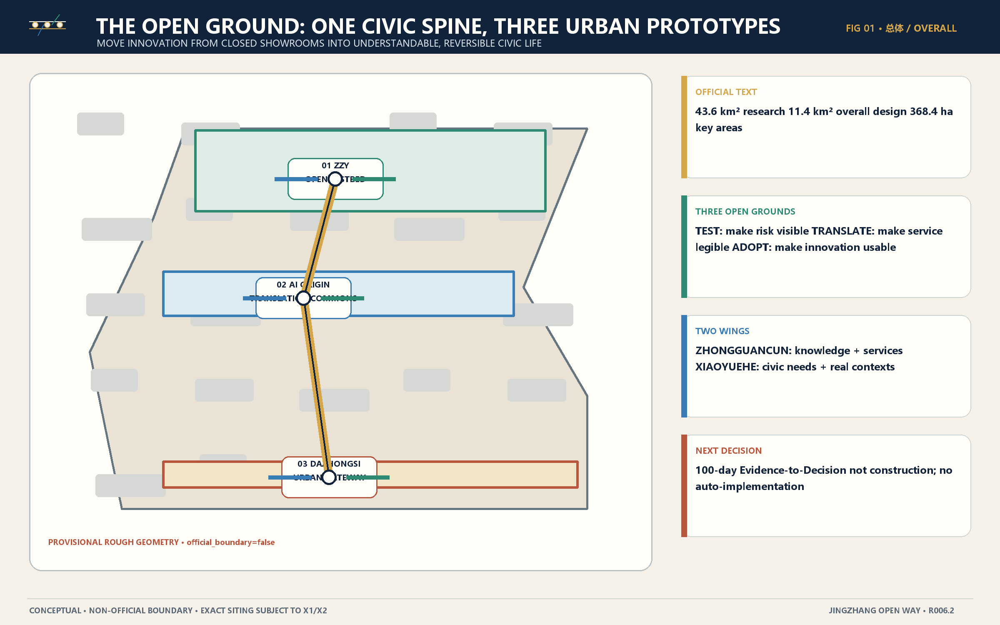
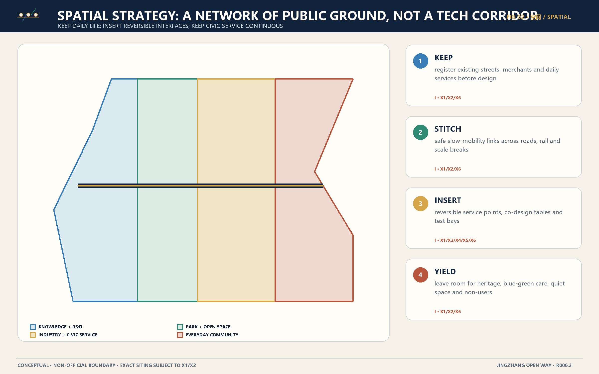
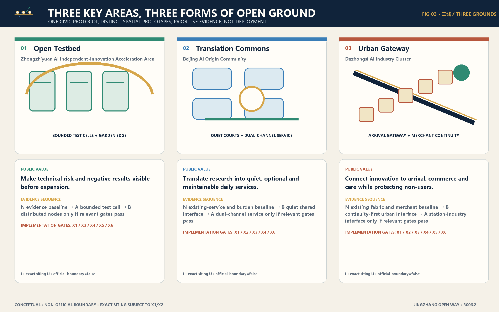
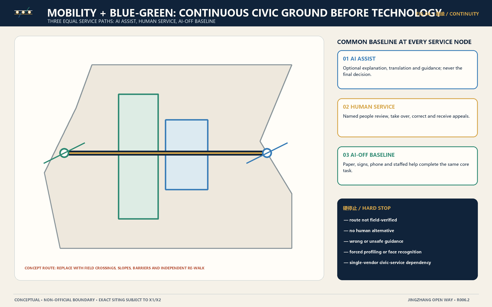
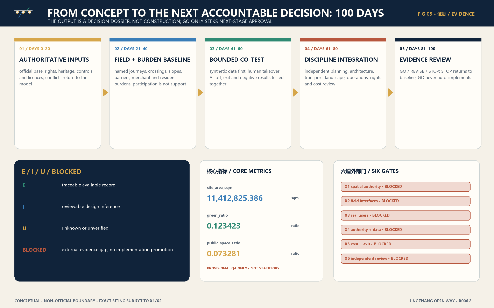

# JingZhang Open Way | The Open Ground

> **Before bringing AI out of the showroom, open the civic ground beneath it.**

JingZhang Open Way is not a technology-display corridor. It is a civic-service spine connecting research, bounded validation, public translation and everyday urban life. Zhongzhiyuan becomes an **Open Testbed** where risk, negative results and exit are visible before expansion. The Beijing AI Origin Community becomes a **Translation Commons** where research is made understandable, optional and maintainable. Dazhongsi becomes an **Urban Gateway** where innovation meets arrival, small business, public space and care. The Zhongguancun wing supplies knowledge and professional-service interfaces; the Xiaoyuehe wing supplies civic problems, real contexts and non-adoption feedback.

The concept is reviewable; implementation is gated. Evidence states remain `E / I / U / BLOCKED`. AI may augment; named people must be able to take over; the same core civic service must continue when AI is off. GO only seeks project-party approval for a next stage and never auto-implements. REVISE returns to evidence. STOP returns to the do-nothing baseline. [source:SUBMISSION-REFERENCE-AGENT-TASKBOOK-20260605] [depth:risk_missing_data]

### agent.1 | Taskbook Positioning, Functions and Identity Direction

The overall concept carries all three taskbook positionings into one civic-service spine:

| ID | Taskbook positioning | Evidence state |
|---|---|---|
| POS-01 | Centennial JingZhang Cultural Belt | E |
| POS-02 | Urban AI Life Experience Belt | E |
| POS-03 | AI Convergence Innovation Belt | E |

The five functions are design responsibilities to be tested, not recruitment or implementation commitments:

| ID | Taskbook function | Spatial lead | State |
|---|---|---|---|
| FUN-01 | full-stack AI innovation system | ZONE-ZZY | I/BLOCKED |
| FUN-02 | world-class AI innovation ecosystem | ZONE-ORIGIN | I/BLOCKED |
| FUN-03 | new paradigm for AI-enabled scenarios | WING-XIAOYUEHE | I/BLOCKED |
| FUN-04 | intelligent and vibrant AI city | ZONE-DZS | I/BLOCKED |
| FUN-05 | global voice in AI governance | ZONE-ZZY | I/BLOCKED |

The Chinese and English names are `京张开放之路｜开放地面` and “JingZhang Open Way | The Open Ground.” The mark forms an **open bracket from two parallel rail lines, linking three open nodes and extending one fine wing line to each side**. The rails stand for JingZhang memory and service continuity; the nodes stand for the three zones; the wings stand for knowledge service and scenario empowerment; the open ends signal continuing learning. It uses only participant-authored lines, circles and an open bracket; stays distinct at small and monochrome sizes; never imitates a railway, government, university or company mark; and never relies on colour alone.

Regional coordination remains a concept interface, not a partnership, data, funding or site commitment:

| ID | Counterpart category | Concept interface | State |
|---|---|---|---|
| REG-01 | Beiwei Community | community-life scenario exchange and burden review | I/BLOCKED X3/X4 |
| REG-02 | Future Science City | research-platform and test-method exchange | I/BLOCKED X3/X4 |
| REG-03 | Huairou Science City | large-science-to-civic-use translation methods | I/BLOCKED X3/X4 |
| REG-04 | Beijing Economic-Technological Development Area | robotics and intelligent-terminal test governance exchange | I/BLOCKED X3/X4 |
| REG-05 | Beijing-Tianjin-Hebei innovation network | portable evidence standards and open-result exchange | I/BLOCKED X3/X4 |

## Design Basis and Source List

The design basis has four layers: traceable official text and the AI-agent taskbook; repository-supplied provisional geometry used only for composition and repeatable QA; participant-authored spatial, scenario and operating inferences; and external evidence that is not yet available. Official text supports approximate scope values, names and task context. It does not supply official CAD/GIS, parcels, ownership, field survey, operating authority or engineering evidence. [source:OFFICIAL-BJ-GHZRZY-HDHJ-20260509-SCOPE] [source:SAFE-PROVISIONAL-GEOMETRY-20260605]

All display materials are local. The cover is an AI-assisted conceptual illustration, explicitly labelled as not a site photograph and carrying no parcel, building, institution or person claim. The five core figures are deterministically derived from the package geometry, metrics and content blueprint. International cases transfer methods only: living-lab governance, cross-district learning, shared support, district interfaces and an explicit termination path. Their results are not evidence of local feasibility. [standard:PROJECT-OFFICIAL-ANNOUNCEMENT] [depth:existing_conditions_diagnosis]

Six gaps structure the next stage: X1 authoritative spatial data; X2 field interfaces; X3 real users and burdens; X4 authority, legal basis and data governance; X5 cost and exit proof; X6 independent professional and accessibility review. Until relevant gates pass, a scenario cannot be represented as constructed, operating, approved, supported or procured. [source:INTERNAL-CANDIDATE-RECORD-EVIDENCE-STATE-R006] [depth:risk_missing_data]

## Three-Level Scope Framework

The three levels perform different work. Approximately **43.6 km²** supports coordinated research into industry, future-city relations and regional interfaces. Approximately **11.4 km²** supports an overall urban-design framework. Three key areas totalling approximately **368.4 ha** support differentiated spatial prototypes: Zhongzhiyuan 192.1 ha, AI Origin 104.3 ha and Dazhongsi 72.0 ha. These are official textual approximations; closed polygons are rough, non-official substitutes. [data:geometry/constraints.geojson#PROV-RESEARCH-001] [data:geometry/site_boundary.geojson#PROV-SITE-001]

Scope transmission runs from regional problem to overall civic ground, key-area prototype and next evidence. The research level does not invent firms, investment or population demand. The overall level does not imitate a regulatory plan. The key-area level does not present a typical prototype as an exact parcel. When authoritative spatial input arrives, GeoJSON, metrics, figures, PDFs and HTML must be rebuilt from the same source, with a recorded difference ledger. [metric:site_area_sqm] [depth:three_level_scope_framework]

## Coordinated Research Area: Industry and Future City Research

Industry is treated as a public-problem-to-accountable-decision chain, not a recruitment list. The six stages are public problem, resource configuration, controlled validation, translation and co-design, everyday-city validation, and independent assurance/conversion. Eight enabling resources—talent, land/space, industry capability, capital, compute, data, scenarios, governance/exit—each carry a rule against unsupported inference. Competitive value comes from learning quality, public value and reversibility rather than unverified output or company counts. [source:SUBMISSION-REFERENCE-AGENT-TASKBOOK-20260605] [depth:overall_spatial_structure]

The two wings are functional relationships, not statutory boundaries. The Zhongguancun Knowledge Collaboration Wing contains concept interfaces for IP, standards, responsible procurement, capital readiness and international exchange. The Xiaoyuehe Civic Life Wing contains public-needs intake, accessible journey co-tests, blue-green maintenance and community evaluation. Every partner, site, dataset, budget and operating commitment remains U until named and authorised. [standard:PROJECT-AGENT-OPEN-CALL-TASKBOOK] [depth:municipal_new_infrastructure]

| Case | Place | Transferable mechanism | Non-transfer rule |
|---|---|---|---|
| CASE-01-KALASATAMA | Smart Kalasatama · Helsinki, Finland | Use a real district as a governed co-creation and experimentation platform, evaluating everyday value rather than technology spectacle. | No Helsinki governance model, result or user finding is evidence of JingZhang feasibility. |
| CASE-02-HELSINKI-DISTRICTS | Helsinki Innovation Districts · Helsinki, Finland | Distribute innovation activity across everyday neighbourhoods to create a comparable, learning-oriented living-lab network. | No named Helsinki district arrangement or result is copied as a local commitment. |
| CASE-03-LAUNCHPAD | JTC LaunchPad · Singapore | Build an entrepreneurship ecosystem through shared support, proximity and staged space provision rather than a single landmark building. | No tenancy, investment, land or institutional arrangement is transferred without local authority and evidence. |
| CASE-04-PUNGGOL | Punggol Digital District · Singapore | Organise industry, education and district-operation interfaces in one urban system and connect participants through a governable district platform. | No Singapore platform, data rule or institutional commitment is authority for JingZhang. |
| CASE-05-WATERFRONT-TORONTO | Waterfront Toronto / Sidewalk Labs termination · Toronto, Canada | Treat termination, authority boundaries and final public-institution judgement as part of innovation governance rather than a footnote erased after failure. | This is a governance lesson, not proof of local risk, legal advice or project comparability. |

| Stage | Name | Lead | Required output |
|---|---|---|---|
| ECO-01 | public problem | WING-XIAOYUEHE | problem statement, affected groups, do-nothing baseline, burden hypothesis |
| ECO-02 | resource configuration | WING-ZHONGGUANCUN | knowledge, standards, IP, professional-service and conditional finance pathways |
| ECO-03 | controlled validation | ZONE-ZZY | test protocol, low-tech control, human takeover, AI-off, negative-result record |
| ECO-04 | translation and co-design | ZONE-ORIGIN | plain-language service proposition, user burden map, accessible service chain |
| ECO-05 | everyday-city validation | ZONE-DZS | small-business, arrival, public-space and non-adoption evidence |
| ECO-06 | independent assurance and conversion | PROJECT_PARTY_AND_INDEPENDENT_REVIEWERS | GO / REVISE / STOP dossier for next-stage approval only |

| Resource | Type | No-inference rule |
|---|---|---|
| RES-TALENT | talent | Do not infer demand, availability or commitment; validate roles and safeguarding. |
| RES-SPACE | land and space | Use space types only until X1 confirms parcels, controls and rights. |
| RES-INDUSTRY | industry | Use capability categories, not invented company lists, output or recruitment commitments. |
| RES-CAPITAL | capital | Describe a review interface only; no funding, subsidy or return is promised. |
| RES-COMPUTE | compute | Capacity, energy, security, procurement and service level remain X4/X5/X6. |
| RES-DATA | data | Start with synthetic or minimum necessary data; legal basis and contracts remain X4. |
| RES-SCENARIO | scenario | A scenario is a testable hypothesis, not an approved operation. |
| RES-GOVERNANCE | governance and exit | Named authority, appeal, remedy, audit, export, deletion and STOP are mandatory before a public pilot. |

## Overall Design Area: Urban Renewal and Regulatory-Plan-Level Urban Design

The spatial proposition is a **network of open civic ground**: one north-south service sequence, three distinct prototypes, slow-mobility stitches across road/rail/scale breaks, blue-green care interfaces and two functional wings. Four actions govern intervention: **KEEP** existing streets, merchants and daily services; **STITCH** accessibility and ecological breaks; **INSERT** small reversible service points, co-design tables and test bays; **YIELD** room to heritage, ecology, quiet space and non-users. [data:geometry/land_use.geojson#LU-001] [depth:land_use_layout]

Colours describe concept relationships, not approved land use. Knowledge production, industry/civic service, community life and open space are negotiated across the civic ground rather than enclosed in a generic AI campus. Retain-renovate-demolish decisions require a building, rights, safety, heritage, tenancy, carbon and cost ledger that is not available. Intensity, height, setbacks, utilities and traffic capacity remain subject to official controls, field work and professional review. [standard:MOHURD-CONTROL-DETAILED-PLANNING] [depth:development_intensity_controls]

## Detailed Design of Key Areas

The three areas share one service-continuity protocol but must not look or operate alike. Zhongzhiyuan uses garden edges around bounded test cells and makes protocols, manual stop and negative results public. AI Origin uses quiet courts, shared explanation and dual-channel services to translate research into daily life. Dazhongsi uses an arrival gateway, merchant-continuity interfaces and reversible public-event kits. Exact siting, scale, rights, heritage, crossings and hours remain U. [data:geometry/key_areas.geojson#PROV-KEY-001] [depth:three_key_area_detailed_design]

| Area | Open-ground prototype | Preferred evidence sequence | Gates |
|---|---|---|---|
| Zhongzhiyuan AI Independent-Innovation Acceleration Area | Open Testbed | N evidence baseline → A bounded test cell → B distributed nodes only if relevant gates pass | X1/X3/X4/X5/X6 |
| Beijing AI Origin Community | Translation Commons | N existing-service and burden baseline → B quiet shared interface → A dual-channel service only if relevant gates pass | X1/X2/X3/X4/X6 |
| Dazhongsi AI Industry Cluster | Urban Gateway | N existing fabric and merchant baseline → B continuity-first urban interface → A station-industry interface only if relevant gates pass | X1/X2/X3/X4/X5/X6 |

The sequence is not a score. N is the do-nothing/evidence baseline; A and B are research paths. Only after relevant gates pass may the project party consider a path for separate next-stage approval. Every prototype must expose beneficiaries, burdens, maintenance, exit, AI-off continuity and non-adoption reasons. Participation must never be represented as support by default. [source:INTERNAL-CANDIDATE-RECORD-DESIGN-R006] [depth:risk_missing_data]

## AI Innovation Ecosystem, Personas, and AI+ Scenarios

Scenarios begin with a public problem, not model capability. Each card records place, affected people, problem hypothesis, AI-online path, human takeover, AI-off path, minimum data, public value, hard stops, evaluation questions and gates. All twelve cards are `I/BLOCKED`. Four industry tests cover controlled technical validation, research translation, everyday-city use and witnessed exit/recovery. The eight personas map exactly to an AI researcher/developer, startup or small-business operator, daily commuter, person with mobility/accessibility requirements, older or no-smartphone user, student/young person/public learner, front-line service/maintenance worker, and international visitor/cross-institution collaborator. [source:SUBMISSION-REFERENCE-AGENT-TASKBOOK-20260605] [depth:existing_conditions_diagnosis]

| Scenario | Name | Place | Personas | Gates |
|---|---|---|---|---|
| SCN-01 | Accessible Arrival and Orientation | ZONE-DZS | PER-03, PER-04, PER-05 | X2/X3/X4/X6 |
| SCN-02 | Public-Service Booking and Explanation | ZONE-ORIGIN | PER-04, PER-05, PER-07 | X3/X4/X5/X6 |
| SCN-03 | Small-Business Continuity | ZONE-DZS | PER-02, PER-06 | X1/X3/X4/X5/X6 |
| SCN-04 | Research Visitor and Collaboration Access | ZONE-ORIGIN | PER-01, PER-08 | X3/X4/X5 |
| SCN-05 | Night-Time Help and Safe Referral | CIVIC_SPINE | PER-03, PER-04, PER-05 | X1/X2/X3/X4/X5/X6 |
| SCN-06 | Older-Person and No-Smartphone Service | ZONE-ORIGIN | PER-05, PER-07 | X3/X4/X5/X6 |
| SCN-07 | Public-Space Events and Multilingual Participation | CIVIC_SPINE | PER-05, PER-06, PER-08 | X1/X2/X3/X4/X6 |
| SCN-08 | Blue-Green Maintenance and Public Work Orders | WING-XIAOYUEHE | PER-04, PER-07 | X1/X2/X4/X5/X6 |
| SCN-09 | Developer Reliability Sandbox | ZONE-ZZY | PER-01, PER-07 | X4/X5/X6 |
| SCN-10 | Controlled Robotics and Intelligent-Terminal Test | ZONE-ZZY | PER-01, PER-03, PER-07 | X1/X2/X3/X4/X5/X6 |
| SCN-11 | Public Learning and AI Literacy | ZONE-ORIGIN | PER-01, PER-05, PER-06, PER-08 | X3/X4/X6 |
| SCN-12 | Urban Incident Response and Evidence Preservation | CIVIC_SPINE | PER-03, PER-07 | X4/X5/X6 |

| Test | Name | Place | Gates |
|---|---|---|---|
| TEST-01 | Civic AI Reliability and Exit Sandbox | ZONE-ZZY | X4/X5/X6 |
| TEST-02 | Research-to-Public-Service Translation Co-Test | ZONE-ORIGIN | X3/X4/X6 |
| TEST-03 | Small-Business Digital Continuity and Exit Co-Test | ZONE-DZS | X3/X4/X5/X6 |
| TEST-04 | Accessible End-to-End Civic Journey Co-Test | WING-XIAOYUEHE | X1/X2/X3/X4/X6 |

| Persona | Type | Primary need / boundary |
|---|---|---|
| PER-01 | AI researcher or developer | Test a capability without overstating readiness or exposing people and production systems. |
| PER-02 | startup team or small-business operator | Access useful support while keeping control of cost, records, adoption and exit. |
| PER-03 | daily commuter | Complete a reliable station-to-destination journey under normal and disrupted conditions. |
| PER-04 | person with mobility or accessibility requirements | Reach and use services with dignity, choice and a verified step-free path. |
| PER-05 | older resident or no-smartphone user | Complete daily tasks without a personal device or forced digital identity. |
| PER-06 | student, young person or public learner | Explore AI and city-making safely, critically and without being reduced to an audience metric. |
| PER-07 | front-line service or maintenance worker | Maintain service, handle exceptions and stop unsafe automation without hidden workload transfer. |
| PER-08 | international visitor or cross-institution collaborator | Understand the belt, find a legitimate public collaboration route and respect local rights and context. |

Evaluation starts with three-path completion of the same core task, then measures extra time, distance, cognitive, privacy, commercial and maintenance burden. It checks correction, appeal, export, deletion and recovery. Face recognition, social scoring, forced profiling, digital-only access, automated final decisions and demonstration-to-expansion are hard stops. [depth:risk_missing_data] [metric:public_space_ratio]

## Land Use, Building Scale, and Retain-Renovate-Demolish Strategy

The four concept land-use features and one demonstration building footprint are design proposals with `official_boundary=false`, `provisional=true` and no engineering verification. The proposal does not overwrite the existing city with a generic AI campus. It negotiates R&D, industry/civic service, community life and open space through the shared public ground. Area allocation is internal QA only, not a statutory land-balance or FAR claim. [data:geometry/buildings.geojson#BLDG-001] [standard:MNR-LAND-USE-CLASSIFICATION-GUIDE]

Retain-renovate-demolish follows four steps: record condition and rights; assess safety, heritage, use, tenancy, commercial continuity and carbon burden; compare retention, adaptive reuse, reversible insertion and demolition; then let named rights holders and professionals decide. The evidence is not present, so this entry proposes a typological strategy only: retain reusable structure and street relations, repair public interfaces with light components, and avoid permanent high-cost shells for digital systems. [depth:retain_renovate_demolish] [depth:height_massing_character]

Architectural character uses three layers—rail continuity, open knowledge and everyday city—without imitating a railway operator, government, university or company mark. Height, massing, facade, structure, utilities and fire-safety decisions remain gated by X1/X2/X6. The conceptual illustration communicates atmosphere, not a proposed built scene. [depth:development_intensity_controls] [source:INTERNAL-CANDIDATE-RECORD-DESIGN-R006]

## Transport, Rail, Municipal Infrastructure, and Public Services

The first transport objective is an independently completable daily journey. A concept slow-mobility spine connects the three areas and uses cross-stitches at road, rail and scale breaks. Every decision point offers optional digital explanation, named human help and high-contrast/printed AI-off guidance. The route has no named entrance, measured slope, crossing, barrier, dated photo or independent re-walk, so it remains a framework for the X2 field protocol. [data:geometry/roads.geojson#ROAD-001] [depth:traffic_rail_slow_parking]

Municipal and digital infrastructure begins with minimum dependency. Before adding sensing, compute or equipment, a team must state the public problem, minimum data, network-outage behaviour, energy/maintenance burden, vendor exit, open interface and three-year cost. Production data and control are prohibited at OPEN-0/1. OPEN-2 requires named authority, consent, compensation, human stop and witnessed AI-off/exit. [depth:municipal_new_infrastructure] [source:INTERNAL-CANDIDATE-GOVERNANCE-SANDBOX-DRILL-R006]

## Blue-Green Network, Public Space, and Urban Character

Public space is organised around visible contribution, usable help and reversible technology. Four pilgrimage landmarks are public capacities, not monuments. Exact sites and heritage interpretation require an authoritative inventory and professional review. [data:geometry/public_space.geojson#PUBLIC-001] [depth:blue_green_public_space]

`NET-OPEN-CONTRIBUTION-PARK-LINE`, the **Open Contribution Park Line / `开放贡献公园线`**, uses the taskbook's JingZhang heritage-park context as a public-space hypothesis, not a verified heritage boundary: Use the public brief's JingZhang heritage-park context to link three zone landmarks while a distributed contribution-memory line spans the belt, two-way slow-mobility decision points, low-tech service points and blue-green care nodes, strengthening north-south narrative continuity and east-west everyday interfaces. No conclusion is made about exact routes, crossings, bridges, tunnels, heritage controls, green/blue lines or engineering feasibility. Heritage assets, interpretation, existing paths, rights, bridges/tunnels, conservation, green/blue lines, traffic and engineering boundaries all require X1/X2/X6 and an authoritative inventory. At Dazhongsi, merchant continuity, optional digital service, reversible public events and human/AI-off business support answer the intelligent-native consumer-and-business task; no merchant, brand, tenancy, footfall, revenue, partnership or approved operation is assumed.

| Landmark | Name | Public purpose | State |
|---|---|---|---|
| LMK-01 | Open Stack Mile | Make the full-stack test chain, human control and negative results publicly legible. | I/BLOCKED X1/X2/X4/X5/X6 |
| LMK-02 | Origin Translation Commons | Turn research into understandable public questions, service prototypes and dissent records. | I/BLOCKED X1/X2/X3/X4/X6 |
| LMK-03 | Civic Continuity Gateway | Make arrival, human help, small-business continuity and AI-off service visible at an urban threshold. | I/BLOCKED X1/X2/X3/X4/X5/X6 |
| LMK-04 | Contribution Memory Line | Recognise verifiable public contributions, maintenance, dissent and negative results across the belt. | I/BLOCKED X1/X2/X3/X4/X6 |

Nine components form a combinable kit. They are not a product catalogue and bind no vendor; every digital layer has a physical/human baseline:

| Component | Name | Function | State |
|---|---|---|---|
| CMP-01 | Dual-Line Civic Service Band | link the identity, wayfinding and service-continuity message | I/BLOCKED X1/X2/X6 |
| CMP-02 | Three-Path Service Point | show AI assist, human service and AI-off baseline as equal choices | I/BLOCKED X1/X3/X4/X5/X6 |
| CMP-03 | Quiet Co-Design Table | support compensated participation, plain-language review and dissent | I/BLOCKED X1/X3/X4/X6 |
| CMP-04 | Reversible Test Bay | separate controlled validation from production and uncontrolled public space | I/BLOCKED X1/X2/X4/X5/X6 |
| CMP-05 | Accessible Threshold Kit | make arrival, decision, rest and help points legible across sensory and mobility needs | I/BLOCKED X1/X2/X3/X6 |
| CMP-06 | Evidence and Negative-Result Wall | display what was tested, what failed, what changed and why a STOP occurred | I/BLOCKED X3/X4/X6 |
| CMP-07 | Blue-Green Care Marker | connect public reports, verified maintenance and visible disposition | I/BLOCKED X1/X2/X4/X5/X6 |
| CMP-08 | Human Help Beacon | make a verified human-help route visible without general surveillance | I/BLOCKED X1/X2/X4/X5/X6 |
| CMP-09 | Reversible Public Event Kit | host learning, co-design and developer events without permanently occupying public space | I/BLOCKED X1/X2/X3/X4/X6 |

`HONOR-PUBLIC-CONTRIBUTION-LEDGER`, the “Public Contribution and Care Ledger,” recognises open methods, cleared reusable evidence, accessibility improvement, maintenance/care, consented community knowledge, dissent/negative results/justified STOP, translation and public explanation. Every record carries a contribution ID, plain-language description, display choice, source/licence, date/version, public value, known limitation, review state and correction/withdrawal route. Facial recognition, social scoring, popularity ranking, pay-to-rank, unconsented identity display and representing a concept as implemented are prohibited. Its state is I/BLOCKED X3/X4/X6. [standard:MOHURD-URBAN-DESIGN-MEASURES] [depth:height_massing_character]

The cultural narrative, “From Opening a Railway to Opening Knowledge,” runs through six chapters: connect, maintain, open, translate, care and continue. Wayfinding uses two lines, three open nodes and two wings in separate Chinese and English compositions. Colour is never the only code; every state carries the E/I/U/BLOCKED word and pattern. Specific people, dates, heritage assets and conservation values are not invented by the concept. [source:OFFICIAL-BJ-GHZRZY-HDHJ-20260509-DESIGN-TASKS] [depth:risk_missing_data]

| Chapter | Name | Public message | Spatial carrier |
|---|---|---|---|
| CUL-01 | Connect | Railway memory as a public story of connecting people and places; exact history subject to source review. | CIVIC_SPINE and verified heritage interpretation points |
| CUL-02 | Maintain | Recognise the often-invisible labour that keeps infrastructure and services working. | CMP-07, CMP-08 and contribution ledger |
| CUL-03 | Open | Treat reusable knowledge, methods and negative results as public innovation assets. | LMK-01 and LMK-04 |
| CUL-04 | Translate | Turn research into understandable questions and optional services with real-user review. | LMK-02 |
| CUL-05 | Care | Judge innovation by continuity, accessibility, burden and remedy in everyday city life. | WING-XIAOYUEHE, LMK-03 and CMP-05 |
| CUL-06 | Continue | GO, REVISE and STOP all leave evidence for the next accountable decision. | LOOP-R006-THREE-ZONES-TWO-WINGS |

## Renewal Projects, Implementation Policy, and Phasing

The next stage is five evidence projects over approximately 100 days, explicitly not construction: P01 authoritative spatial/rights base (days 0–20); P02 field journeys and user/merchant burden (21–40); P03 bounded co-test and AI-off/exit drill (41–60); P04 independent discipline integration (61–80); P05 evidence review and GO/REVISE/STOP dossier (81–100). Failure returns to model and evidence, not directly to packaging. [data:geometry/phasing.geojson#PHASE-001] [depth:phasing_implementation]

The long-term concept is an Open Way Annual Evidence Commons: spring problem week, summer controlled-test season, autumn open-contribution/civic-experience festival, winter evidence review and exit drill; weekly help hours, monthly developer/maintainer clinics, quarterly cross-zone review and annual assurance. Dates, venues, hosts, budgets, partnerships and government support remain U. [source:CASE-REFERENCE-SMART-KALASATAMA-202108] [depth:renewal_project_list]

`BRAND-OWAEC-01`, the **Open Way Annual Evidence Commons / `开放之路年度共证活动品牌`**, turns the belt identity into an event and communication grammar: Reuse the belt's dual lines and open bracket as the stable motif; distinguish four seasons by chapter name, number and pattern, and show OPEN-0 to OPEN-3 with both level text and state shape, never colour alone. Every poster, registration page, site sign, evidence card and annual dossier shows source, E/I/U/BLOCKED state, AI-off path and correction route. Activity graphics communicate a concept programme and evidence state only; they never imply confirmed dates, hosts, partners, budgets, government support or implementation approval.

| Event | Name | Public purpose | State |
|---|---|---|---|
| EVT-SPRING | Open Civic Problem Week | Collect public problems, do-nothing baselines, affected groups, burdens and non-adoption reasons before solution selection. | I/BLOCKED X3/X4/X6 |
| EVT-SUMMER | Civic AI Controlled Test Season | Run bounded industry tests with low-tech controls, human takeover, AI-off and visible failure records. | I/BLOCKED X2/X4/X5/X6 |
| EVT-AUTUMN | Open Contribution and Civic Experience Festival | Let the public experience verified scenarios, understand limits and recognise code, care, maintenance, translation, dissent and negative results. | I/BLOCKED X1/X2/X3/X4/X6 |
| EVT-WINTER | Annual Evidence Review and Exit Drill | Review public value, burden, maintenance, rights, cost and exit; issue GO, REVISE or STOP recommendations for next-stage approval. | I/BLOCKED X3/X4/X5/X6 |

| Cadence | Activity | Minimum record |
|---|---|---|
| weekly | open help and public explanation hour | questions, unresolved issues and correction log |
| monthly | developer and maintainer clinic | protocol changes, failure reports and maintenance burden |
| quarterly | cross-zone evidence review | scenario state, gate state, burden and next decision |
| annual | independent assurance and exit drill | signed dispositions and GO / REVISE / STOP dossier |

Opening levels run from OPEN-0 problem baseline, OPEN-1 synthetic-data sandbox and OPEN-2 closed supervised co-test to OPEN-3 limited public-pilot candidate. OPEN-3 still requires relevant X1–X6 evidence and a separate project-party decision. Public-problem owners remain distinct from vendors; negative results and exit evidence count as contributions; participation creates no preferred procurement status. [source:CASE-REFERENCE-WATERFRONT-TORONTO-TERMINATION-202005] [depth:risk_missing_data]

The developer-community pathway is: public problem intake → open method or challenge brief → synthetic-data sandbox → peer reproducibility review → human/AI-off/exit drill → compensated user and burden review → independent assurance → project-party next-stage decision. Its six durable asset classes are: versioned problem briefs; test harnesses and protocol templates; negative-result library; rights and source records; maintenance and AI-off playbooks; contribution ledger. Its binding concept rules are: No preferred vendor status is implied by participation; A public-interest problem owner is distinct from a solution vendor; Reproducibility and exit evidence count as contributions; Real users are compensated and never represented as supporters by default; Production access is prohibited before authority and independent review.

| Level | Name | Allowed | Not allowed |
|---|---|---|---|
| OPEN-0 | problem and do-nothing baseline | desk research, public-source review and problem framing | claims of demand, feasibility or user validation |
| OPEN-1 | synthetic-data sandbox | bounded technical tests with no public or production exposure | real personal data or production control |
| OPEN-2 | closed supervised co-test | consented compensated test with named human authority and stop | open public service or automatic expansion |
| OPEN-3 | limited public-pilot candidate | only after relevant X1-X6 evidence passes and the project party separately approves the stage | treating GO as automatic implementation |

Conversion pathway: Attract through a public problem and open contribution call → Qualify through source, rights and capability review → Validate in a bounded sandbox → Translate with real users and frontline workers → Assure public value, accessibility, cost and exit independently → Decide GO / REVISE / STOP → If GO, seek project-party next-stage approval; do not auto-implement

| Event | Landmark/component link | Public-experience and operating method |
|---|---|---|
| EVT-SPRING | LMK-02, CMP-03 | Use the Translation Commons and Quiet Co-Design Table for problem intake, burden records and dissent; exact venue and owner U. |
| EVT-SUMMER | LMK-01, CMP-04, CMP-06 | Run bounded tests in the Reversible Test Bay and publish plain-language and negative results on the evidence wall; exact venue and owner U. |
| EVT-AUTUMN | LMK-03, LMK-04, CMP-09 | Use the Civic Continuity Gateway, Contribution Memory Line and reversible event kit for public experience while protecting daily access and non-users; exact venue and owner U. |
| EVT-WINTER | LMK-04, CMP-06 | Review annual evidence, dissent, exit and the next decision through the contribution index and evidence wall; exact venue and owner U. |

## Metrics, Area Recalculation, and Compliance Matrix

Three structured values are known and reproducible from provisional geometry: `site_area_sqm = 11412825.386`, `green_ratio = 0.123423`, `public_space_ratio = 0.073281`. They are low-confidence QA, not a precision upgrade of the official textual approximation and not promised planning controls. When official boundary, green-space and public-space data arrive, the same method must be rerun and differences recorded. [metric:site_area_sqm] [metric:green_ratio]

Performance requires baselines before targets: three-path core-task completion; added time, distance and cognitive burden; takeover, correction and appeal; AI-off and exit recovery; maintenance workload; merchant and non-user burden; open contribution and independent-review closure. Current targets are U. No self-score substitutes for real-user and professional evidence. [metric:public_space_ratio] [depth:metrics_recalculation]

The compliance matrix links official tasks and agent.1–agent.6 to structured data, five core figures, A3/A0 pages and HTML anchors. `complete` means content coverage, not X1–X6 passage. Visual, spatial and professional checks must run against current bytes; a previous self-check cannot be carried into a rebuilt package. [standard:PROJECT-AGENT-OPEN-CALL-TASKBOOK] [depth:risk_missing_data]

## Risk, Copyright, and Compliance

This is an AI-agent open-call entry, not a professional-firm prequalification file, statutory plan, government commitment, investment contract, procurement proposal or construction document. Six external gates remain BLOCKED and form the next-stage work list. Package `ready_for_review` means repository-intake completeness only. Self-check PASS does not imply field, operational, legal, engineering or accessibility PASS. [source:INTERNAL-CANDIDATE-RECORD-EVIDENCE-STATE-R006] [depth:risk_missing_data]

Text, diagrams, identity primitives and layout are participant-authored with disclosed AI assistance. The conceptual illustration prompt, hash, purpose and non-evidence boundary are recorded in the rights ledger. Case studies use brief factual/method summaries linked to primary publishers; no protected plan, photograph or long quotation is copied. OpenStreetMap, where referenced, remains desk context under ODbL attribution. The offline page loads no remote media, script, font or tracker. [source:OSM-NUMERIC-20260809] [standard:MOHURD-URBAN-DESIGN-MEASURES]

Hard stops include calling provisional geometry official; inventing firms, partnerships, investment, user support or field facts; face recognition, social scoring, forced profiling or digital-only service; no takeover, appeal, export, deletion or recovery; automatic expansion from demonstration; and any republication, redistribution or separate submission without participant authorization. This version is participant-authorized and submitted as the formal AI-entry review candidate. [source:INTERNAL-CANDIDATE-RECORD-ARTIFACT-R006] [depth:risk_missing_data]

## References

Primary project references are the official announcement/task excerpts, AI-agent taskbook, provisional boundary package and its basis note. Registered planning standards guide depth and terminology only; they are not professional sign-off. [source:OFFICIAL-BJ-GHZRZY-HDHJ-20260509-DESIGN-TASKS] [standard:MOHURD-URBAN-DESIGN-MEASURES]

Method references include Smart Kalasatama, Helsinki Innovation Districts, JTC LaunchPad, Punggol Digital District and Waterfront Toronto's termination notice. They inform co-creation, distributed learning, shared support, district interfaces and exit governance. No institution, result or rule is claimed as locally applicable evidence. [source:CASE-REFERENCE-JTC-LAUNCHPAD-202205] [source:CASE-REFERENCE-WATERFRONT-TORONTO-TERMINATION-202005]

Complete titles, URLs, licences, prohibited uses, status and hashes are recorded in `sources.json`. The authoritative content blueprint, six-agent deliverables, rights ledger and assurance register are included locally. If prose, figures and structured records conflict, the package authority order—GeoJSON, metrics, matrices, sources/assumptions, prose, figures, HTML, PDFs—triggers a rebuild. [source:SAFE-PROVISIONAL-BASIS-20260807] [depth:risk_missing_data]
