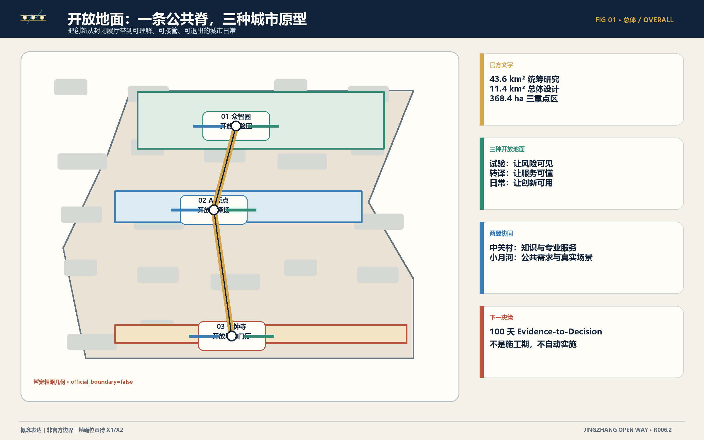
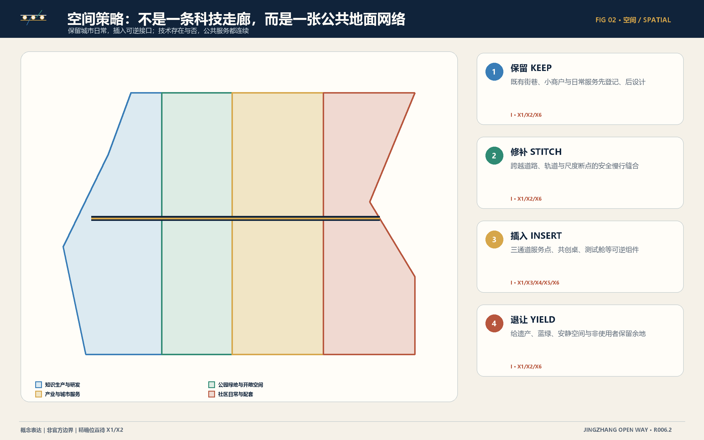
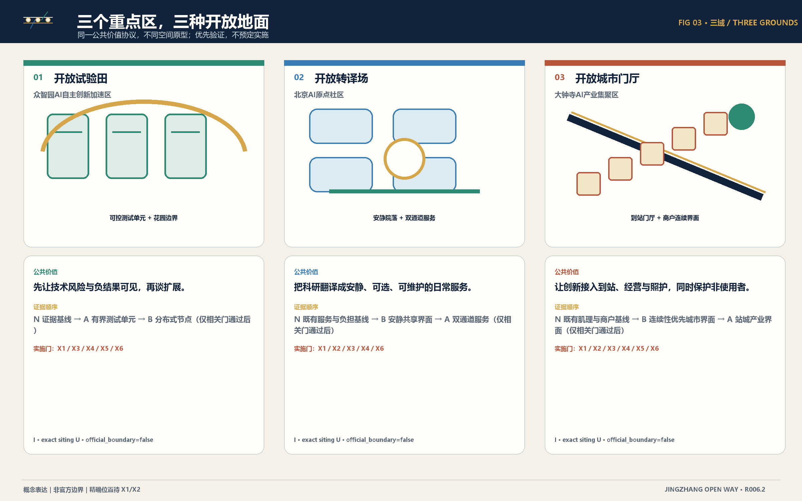
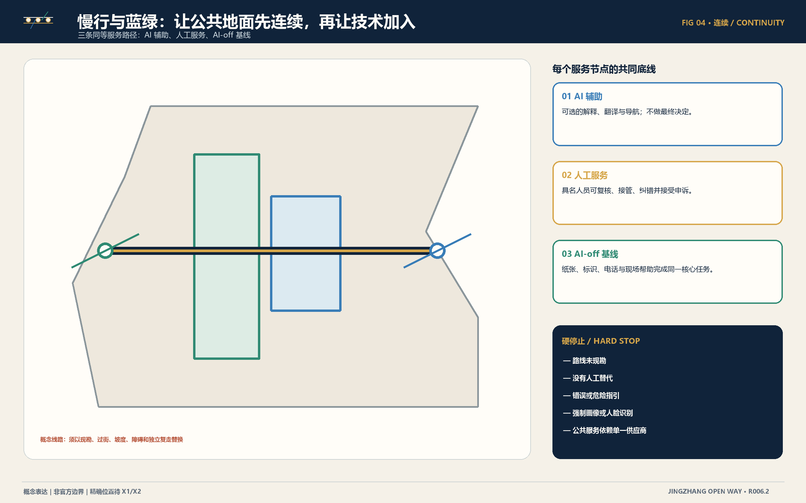
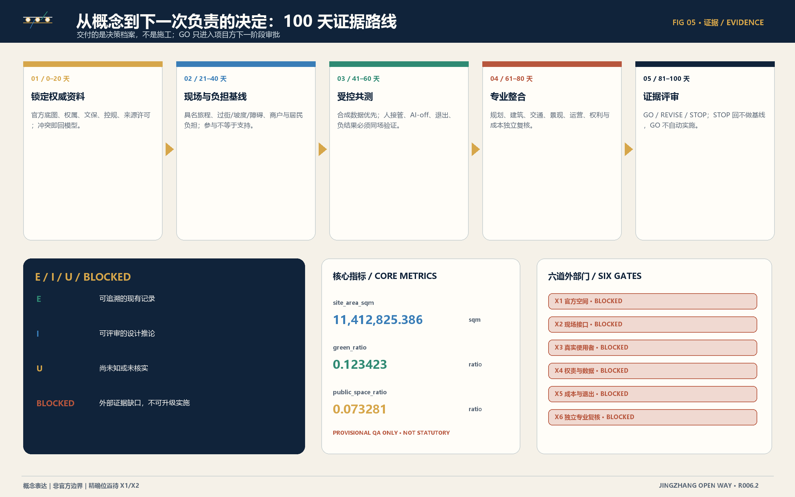

# 京张开放之路｜开放地面

> **把 AI 从展厅带到城市，先把城市的公共地面打开。**

京张开放之路不是一条以技术展陈为目的的“科技走廊”，而是一条把研究、验证、转译和城市日常串起来的公共服务脊。北部众智园成为**开放试验田**，让风险、负结果和退出先被看见；中部北京 AI 原点社区成为**开放转译场**，把科研翻译成普通人可以理解、选择和拒绝的服务；南部大钟寺成为**开放城市门厅**，让创新进入到站、小商户、公共空间和照护的日常。中关村科技服务翼提供知识、标准、资本准备度与专业服务接口，小月河场景赋能翼提供公共问题、真实情境和非使用者反馈。概念可评审，实施有门槛。

本稿只声称“可进入下一轮负责的判断”，不声称官方边界、现场事实、运营授权、采购、合作或实施批准。证据状态保持 `E / I / U / BLOCKED`；AI 在线时只能增强，具名人工可以接管，AI 关闭时同一核心公共服务仍须继续。GO 只进入项目方下一阶段审批，不自动实施；REVISE 回到取证；STOP 回到不做基线。[source:SUBMISSION-REFERENCE-AGENT-TASKBOOK-20260605] [depth:risk_missing_data]

### agent.1｜任务书定位、功能与标志方向

总体概念严格承接任务书的三项定位，并把它们转成同一条公共服务脊的三种读法：

| ID | 任务书定位 | 证据状态 |
|---|---|---|
| POS-01 | 百年京张文化带 | E |
| POS-02 | 都市AI生活体验带 | E |
| POS-03 | AI融合创新带 | E |

五项功能不是招商或实施承诺，而是待证据解锁的设计职责：

| ID | 任务书功能 | 空间牵头 | 状态 |
|---|---|---|---|
| FUN-01 | AI全栈自主创新体系 | ZONE-ZZY | I/BLOCKED |
| FUN-02 | 世界级AI创新生态 | ZONE-ORIGIN | I/BLOCKED |
| FUN-03 | AI+场景赋能新范式 | WING-XIAOYUEHE | I/BLOCKED |
| FUN-04 | 智能化AI活力城市 | ZONE-DZS | I/BLOCKED |
| FUN-05 | AI治理全球话语权 | ZONE-ZZY | I/BLOCKED |

中英文主名称分别为“京张开放之路｜开放地面”和 “JingZhang Open Way | The Open Ground”。标志以**两条平行轨线构成开放括号，串联三个非封闭节点，并向左右伸出两条细翼线**：双轨代表京张记忆与公共服务连续性，三节点代表三区，两翼代表知识服务与场景赋能；开放端表示持续学习。标志只用自制线、圆与开放括号，小尺寸和单色仍须可辨，不模仿铁路、政府、大学或企业标识；颜色不是唯一编码。

区域协同只表达概念接口，不声称合作、数据、资金或场地承诺：

| ID | 对接类型 | 概念接口 | 状态 |
|---|---|---|---|
| REG-01 | 北纬社区 | 社区生活场景交流与负担复核 | I/BLOCKED X3/X4 |
| REG-02 | 未来科学城 | 科研平台与测试方法交流 | I/BLOCKED X3/X4 |
| REG-03 | 怀柔科学城 | 大科学能力向城市公共用途转译的方法交流 | I/BLOCKED X3/X4 |
| REG-04 | 北京经开区 | 机器人与智能终端测试治理交流 | I/BLOCKED X3/X4 |
| REG-05 | 京津冀创新网络 | 可迁移证据标准与开放结果交流 | I/BLOCKED X3/X4 |

## 设计依据与资料清单

设计依据分为四层。第一层是公告与面向智能体任务书中可追溯的文字事实，包括三层范围约数、三区名称与任务方向；第二层是仓库提供的暂定粗略几何，仅用于构图和复算 QA；第三层是本参赛者提出的空间、场景、运营与治理推论；第四层是尚未取得的官方、现场、使用者、权责、成本和独立专业证据。前两层不能循环证明第三层，生成图也不能反过来成为事实来源。[source:OFFICIAL-BJ-GHZRZY-HDHJ-20260509-SCOPE] [source:SAFE-PROVISIONAL-GEOMETRY-20260605]

所有图面使用本地来源与参与者自制图形。封面概念插画由本地 AI 图像工具根据参赛者提示生成，明确标为“概念插画，非现场影像”，不包含地块、建筑、机构或人物的事实主张；五张核心图由本包 GeoJSON、metrics 与权威内容蓝图确定性派生。案例只转译机制，不复制结论：赫尔辛基提供生活实验与跨区学习方法，新加坡案例提示共享支持和地区级接口，Toronto 终止案例提醒我们把退出与公共机构最终判断写入设计。[standard:PROJECT-OFFICIAL-ANNOUNCEMENT] [depth:existing_conditions_diagnosis]

资料缺口不是脚注，而是方案结构的一部分：X1 官方空间、X2 现场接口、X3 真实使用者与负担、X4 权责与数据、X5 成本与退出、X6 独立专业与可访问性验证。在任一相关门未满足时，场景只能停留在问题基线、合成数据沙盒或受监督共测，不得被包装为已建成、已运营或得到政府支持。[source:INTERNAL-CANDIDATE-RECORD-EVIDENCE-STATE-R006] [depth:risk_missing_data]

## 三层范围工作框架

三层范围承担不同工作，不相互替代：约 **43.6 km²** 的统筹研究范围讨论产业、未来城市与区域接口；约 **11.4 km²** 的总体设计范围组织更新、公共空间、交通、蓝绿和服务骨架；三个重点区约 **368.4 ha** 用于形成可比较的空间原型，其中众智园约 192.1 ha、AI 原点约 104.3 ha、大钟寺约 72.0 ha。以上是公告文字约数；闭合多边形为非官方粗略替代边界。[data:geometry/constraints.geojson#PROV-RESEARCH-001] [data:geometry/site_boundary.geojson#PROV-SITE-001]

范围传导遵循“区域问题—总体骨架—重点原型—下一证据”的顺序。统筹层不虚构企业、投资和人口需求；总体层不把概念分区冒充控规；重点层不把典型原型冒充精确地块。官方 CAD/GIS 到位后，必须从同一权威输入重建 GeoJSON、面积、图件、PDF 和网页，并保留差异台账。若新证据否定当前假设，设计回到 REVISE 或 STOP，而不是修饰证据。[metric:site_area_sqm] [depth:three_level_scope_framework]

## 统筹研究范围产业与未来城市研究

统筹研究把“产业”理解为公共问题进入创新生态的完整转化链，而不是招商名单。六个环节是：公共问题、要素配置、受控验证、转译共创、城市日常验证、独立复核与转化。八类支撑资源分别是人才、土地与空间、产业能力、资金、算力、数据、场景、治理与退出；每一类都附带禁止推断规则。这里的竞争力来自学习速度、公共价值和可退出性，而不是未经证实的产值或独角兽数量。[source:SUBMISSION-REFERENCE-AGENT-TASKBOOK-20260605] [depth:overall_spatial_structure]

两翼不是新的法定范围。中关村科技服务翼是知识协作关系：IP 与标准诊所、负责采购、资本准备度和国际研发交流；小月河场景赋能翼是城市生活关系：公共需求受理、无障碍旅程共测、蓝绿维护和社区评价。所有合作方、数据权限、资金、场地和运营承诺均为 U；后续必须由具名主体、许可和服务协议确认。[standard:PROJECT-AGENT-OPEN-CALL-TASKBOOK] [depth:municipal_new_infrastructure]

五个国际案例形成“机制—本地转译—不可转移”的三栏证据，不以国外结果证明京张可行：

| 案例 | 地点 | 可借鉴机制 | 不可转移边界 |
|---|---|---|---|
| CASE-01-KALASATAMA | Smart Kalasatama · Helsinki, Finland | 以真实城区作为受治理的共创与试验平台，把居民日常价值而非技术炫示作为评估对象。 | 赫尔辛基的治理模式、结果或使用者发现均不能证明京张可行。 |
| CASE-02-HELSINKI-DISTRICTS | Helsinki Innovation Districts · Helsinki, Finland | 把创新活动分布到多个日常社区，形成可比较、可学习的生活实验网络。 | 任何具名的赫尔辛基地区安排或结果都不转写为本地承诺。 |
| CASE-03-LAUNCHPAD | JTC LaunchPad · Singapore | 通过共享支持、邻近协作和分阶段空间供给形成创业生态，而不是只提供一栋标志建筑。 | 租赁、投资、土地或机构安排未经本地授权与证据不得迁移。 |
| CASE-04-PUNGGOL | Punggol Digital District · Singapore | 把产业、教育与地区运营界面组织在同一城区系统中，并以可管理的地区平台连接参与方。 | 新加坡的平台、数据规则或机构承诺不构成京张的授权依据。 |
| CASE-05-WATERFRONT-TORONTO | Waterfront Toronto / Sidewalk Labs termination · Toronto, Canada | 把终止、权责边界和公共机构最终判断视为创新治理的一部分，而不是失败后删除的附注。 | 这是治理与退出教训，不是本地风险证明、法律意见或项目可比性结论。 |

| 阶段 | 名称 | 牵头 | 必须产出 |
|---|---|---|---|
| ECO-01 | 公共问题 | WING-XIAOYUEHE | 问题陈述、受影响群体、不做基线与负担假设 |
| ECO-02 | 要素配置 | WING-ZHONGGUANCUN | 知识、标准、知识产权、专业服务与有条件资金路径 |
| ECO-03 | 受控验证 | ZONE-ZZY | 测试协议、低技术对照、人工接管、AI-off 与负结果记录 |
| ECO-04 | 转译共创 | ZONE-ORIGIN | 通俗服务主张、使用者负担图与无障碍服务链 |
| ECO-05 | 城市日常验证 | ZONE-DZS | 小商户、到达、公共空间与不采用证据 |
| ECO-06 | 独立复核与转化 | PROJECT_PARTY_AND_INDEPENDENT_REVIEWERS | 仅用于下一阶段审批的 GO / REVISE / STOP 档案 |

| 资源 | 类型 | 禁止推断规则 |
|---|---|---|
| RES-TALENT | 人才 | 不得推定需求、可用性或承诺；须验证具名角色、权利与证据。 |
| RES-SPACE | 土地与空间 | 不得推定需求、可用性或承诺；须验证具名角色、权利与证据。 |
| RES-INDUSTRY | 产业 | 不得推定需求、可用性或承诺；须验证具名角色、权利与证据。 |
| RES-CAPITAL | 资金 | 不得推定需求、可用性或承诺；须验证具名角色、权利与证据。 |
| RES-COMPUTE | 算力 | 不得推定需求、可用性或承诺；须验证具名角色、权利与证据。 |
| RES-DATA | 数据 | 不得推定需求、可用性或承诺；须验证具名角色、权利与证据。 |
| RES-SCENARIO | 场景 | 不得推定需求、可用性或承诺；须验证具名角色、权利与证据。 |
| RES-GOVERNANCE | 治理与退出 | 不得推定需求、可用性或承诺；须验证具名角色、权利与证据。 |

## 总体设计范围城市更新与控规深度城市设计

总体空间主张是**开放地面网络**。它由一条南北公共服务序列、三处不同原型、跨越道路/轨道/尺度断点的慢行缝合、蓝绿照护界面和两类功能翼构成。空间上采用四个动作：**保留**既有街巷、小商户和日常服务；**修补**过街、无障碍和蓝绿断点；**插入**三通道服务点、安静共创桌、可逆测试舱等小型组件；**退让**给遗产、生态、安静空间和非使用者留下余地。[data:geometry/land_use.geojson#LU-001] [depth:land_use_layout]

用地颜色仅表达概念关系，不是审定用地。研发与知识生产、产业与城市服务、社区日常、公园与开敞空间之间通过公共地面而非封闭园区连接；建筑策略以“先登记、后判断”为原则，没有逐栋测绘、结构鉴定、产权、租约或成本时，不输出拆改留定案。开发强度、高度、退线、市政容量和交通承载均待官方控规、现勘与专业复核。[standard:MOHURD-CONTROL-DETAILED-PLANNING] [depth:development_intensity_controls]

## 重点区域详细设计

三个重点区共用服务连续性协议，但必须呈现不同空间性格。众智园以花园边界包围可控测试单元，先公开测试协议、人工停止和负结果；AI 原点以安静院落、共享解释界面和双通道服务形成研究到日常的转译；大钟寺以到站门厅、连续经营界面和可逆公共活动工具包连接城市日常。精确选址、尺度、产权、文保、过街和运营时段均为 U。[data:geometry/key_areas.geojson#PROV-KEY-001] [depth:three_key_area_detailed_design]

| 重点区 | 开放地面原型 | 任务角色 | 建议证据顺序 | 相关门 |
|---|---|---|---|---|
| 众智园AI自主创新加速区 | 开放试验田 | AI全栈自主创新体系与AI治理全球话语权 | N 证据基线 → A 有界测试单元 → B 分布式节点（仅相关门通过后） | X1/X3/X4/X5/X6 |
| 北京AI原点社区 | 开放转译场 | 世界级AI创新生态 | N 既有服务与负担基线 → B 安静共享界面 → A 双通道服务（仅相关门通过后） | X1/X2/X3/X4/X6 |
| 大钟寺AI产业集聚区 | 开放城市门厅 | 智能原生新业态 | N 既有肌理与商户基线 → B 连续性优先城市界面 → A 站城产业界面（仅相关门通过后） | X1/X2/X3/X4/X5/X6 |

“建议证据顺序”不是方案评分。N 是不做与现状基线，A/B 是待验证的空间路径；只有相关门通过后，项目方才可能把某一路径纳入下一阶段批准。每个原型均需复核受益者、负担、退出、维护、AI-off 和非采纳理由，且参与者不得被默认表述为支持者。[source:INTERNAL-CANDIDATE-RECORD-DESIGN-R006] [depth:risk_missing_data]

## AI 创新生态、人才画像与 AI+ 场景

场景从公共问题开始，不从模型能力开始。每张卡固定记录空间、受影响者、问题假设、AI 在线、人工接管、AI-off、最小数据、公共价值、硬停止、评估问题和证据门；所有 12 张卡均为 `I/BLOCKED`。四项产业测试覆盖受控技术验证、研究转译、城市日常和退出恢复；八类 persona 精确对应：AI 研究者或开发者、初创团队或小商户经营者、日常通勤者、行动不便或无障碍需求者、长者或非智能手机使用者、学生/青年或公共学习者、一线服务与维护人员、国际访客或跨机构协作者，避免只为“理想早期使用者”设计。[source:SUBMISSION-REFERENCE-AGENT-TASKBOOK-20260605] [depth:existing_conditions_diagnosis]

| 场景 | 名称 | 主要位置 | Persona | 门 |
|---|---|---|---|---|
| SCN-01 | 无障碍到站与换向 | ZONE-DZS | PER-03, PER-04, PER-05 | X2/X3/X4/X6 |
| SCN-02 | 公共服务预约与解释 | ZONE-ORIGIN | PER-04, PER-05, PER-07 | X3/X4/X5/X6 |
| SCN-03 | 小商户连续经营 | ZONE-DZS | PER-02, PER-06 | X1/X3/X4/X5/X6 |
| SCN-04 | 科研访客与协作接入 | ZONE-ORIGIN | PER-01, PER-08 | X3/X4/X5 |
| SCN-05 | 夜间求助与安全转介 | CIVIC_SPINE | PER-03, PER-04, PER-05 | X1/X2/X3/X4/X5/X6 |
| SCN-06 | 长者与非智能手机服务 | ZONE-ORIGIN | PER-05, PER-07 | X3/X4/X5/X6 |
| SCN-07 | 公共空间活动与多语参与 | CIVIC_SPINE | PER-05, PER-06, PER-08 | X1/X2/X3/X4/X6 |
| SCN-08 | 蓝绿空间维护与公众工单 | WING-XIAOYUEHE | PER-04, PER-07 | X1/X2/X4/X5/X6 |
| SCN-09 | 开发者可靠性沙盒 | ZONE-ZZY | PER-01, PER-07 | X4/X5/X6 |
| SCN-10 | 机器人与智能终端受控测试 | ZONE-ZZY | PER-01, PER-03, PER-07 | X1/X2/X3/X4/X5/X6 |
| SCN-11 | 公共学习与AI素养 | ZONE-ORIGIN | PER-01, PER-05, PER-06, PER-08 | X3/X4/X6 |
| SCN-12 | 城市事件响应与证据保全 | CIVIC_SPINE | PER-03, PER-07 | X4/X5/X6 |

| 测试 | 名称 | 位置 | 门 |
|---|---|---|---|
| TEST-01 | 城市AI可靠性与退出沙盒 | ZONE-ZZY | X4/X5/X6 |
| TEST-02 | 科研到公共服务转译共测 | ZONE-ORIGIN | X3/X4/X6 |
| TEST-03 | 小商户数字连续性与退出共测 | ZONE-DZS | X3/X4/X5/X6 |
| TEST-04 | 无障碍端到端城市旅程共测 | WING-XIAOYUEHE | X1/X2/X3/X4/X6 |

| Persona | 类型 | 首要需求/边界 |
|---|---|---|
| PER-01 | AI研究者或开发者 | 在不夸大成熟度、不暴露真实人群与生产系统的条件下验证能力。 |
| PER-02 | 初创团队或小商户经营者 | 获得有用支持，同时保留对成本、记录、采纳与退出的控制。 |
| PER-03 | 日常通勤者 | 在正常与中断条件下，可靠完成从到站点到日常目的地的旅程。 |
| PER-04 | 行动不便或无障碍需求者 | 以有尊严、有选择的方式，沿经核验的无障碍路径到达并使用服务。 |
| PER-05 | 长者或非智能手机使用者 | 无需个人智能设备或强制数字身份，也能完成同一日常任务。 |
| PER-06 | 学生、青年或公共学习者 | 安全且批判性地学习 AI 与城市营造，不被简化为观众流量指标。 |
| PER-07 | 一线服务与维护人员 | 维护服务、处理例外并停止不安全自动化，同时避免隐性工作量转嫁。 |
| PER-08 | 国际访客或跨机构协作者 | 理解创新带并找到正当的公共协作路径，同时尊重本地权利与语境。 |

评价不采用未经基线的分数。先测核心任务能否由 AI、人工和 AI-off 三条路径完成，再测额外时间、距离、认知、隐私、经营和维护负担；随后检查纠错、申诉、导出、删除和恢复。人脸识别、社会评分、强制画像、数字唯一通道、自动最终决定和展示即扩张均为硬停止。[depth:risk_missing_data] [metric:public_space_ratio]

## 用地、建筑规模与拆改留方案

现有 GeoJSON 中四类概念用地和一处示范建筑基底仅是设计提议；`official_boundary=false`、`provisional=true` 和未工程验证属性必须保留。方案不以通用 AI 园区覆盖既有城市，而是将研发、产业服务、社区日常与公园开敞空间放在同一公共地面上协商。任何面积分配只支持内部 QA，不支持法定用地平衡或容积率推导。[data:geometry/buildings.geojson#BLDG-001] [standard:MNR-LAND-USE-CLASSIFICATION-GUIDE]

拆改留采用四步：先形成现状与权利台账；再检查安全、文保、功能、租约、经营连续与碳负担；然后比较保留、适应性改造、可逆插入和拆除；最后由具名权利主体与专业人员作决定。当前包缺少这些证据，故只提出类型策略：优先保留可复用结构和街巷关系，以轻量组件修补公共界面，避免为数字设施制造永久高成本壳体。[depth:retain_renovate_demolish] [depth:height_massing_character]

建筑风貌采用“铁路连续、知识开放、城市日常”三层语言：双线构件表达连续服务，开放节点表达三区，材质和照明服从现地遗产、眩光、维护和可访问性审查。任何高度、体量、立面、结构、市政或消防判断都须由 X1/X2/X6 解锁；效果图只说明空间气质，不是拟建实景。[depth:development_intensity_controls] [source:INTERNAL-CANDIDATE-RECORD-DESIGN-R006]

## 交通、轨道、市政与公共服务设施

交通策略的第一目标不是“智能”，而是可独立完成的日常旅程。概念慢行脊连接三重点区，并以横向缝合跨越道路、轨道和尺度断点；每个决策点都同时提供可选数字解释、具名人工帮助和 AI-off 的高对比标识/纸质路线。当前线路没有具名站口、实测坡度、过街、障碍、照片或独立复走，故只能作为 X2 现勘协议的空间框架。[data:geometry/roads.geojson#ROAD-001] [depth:traffic_rail_slow_parking]

市政与新型基础设施从最小依赖开始：先使用现有电力、通信和人工服务能力；新增传感、算力或设备前必须说明公共问题、最小数据、网络中断行为、能源和维护负担、供应商退出、开放接口和三年成本。生产数据与控制不得在 OPEN-0/1 使用；OPEN-2 仅允许具名权责、同意、补偿和硬停止下的封闭共测。[depth:municipal_new_infrastructure] [source:INTERNAL-CANDIDATE-GOVERNANCE-SANDBOX-DRILL-R006]

## 蓝绿空间、公共空间与城市风貌

公共空间以“看得见的贡献、可使用的帮助、可退出的技术”为主题。四个朝圣地标不是纪念性物体，而是公共能力：开放协议站公开方法与负结果；转译客厅把研究变成可懂问题；城市日常门厅服务到站、商户与非使用者；年度证据议场公开 GO/REVISE/STOP 的理由。确切场地和历史叙事须在权威遗产清单和专业审查后确认。[data:geometry/public_space.geojson#PUBLIC-001] [depth:blue_green_public_space]

`NET-OPEN-CONTRIBUTION-PARK-LINE`“**开放贡献公园线 / Open Contribution Park Line**”把任务书中的京张遗址公园作为待核验的公共空间语境，而不是已核实遗产边界：以京张遗址公园的公开任务语境串联三处区域地标，并以分布式贡献长廊贯穿全带、双向慢行决策点、低技术服务点与蓝绿照护节点；强调南北叙事连续和东西日常接口。具体路径、跨越、桥隧、文保、绿地、蓝线和工程可行性均不作结论。 遗产资源、历史解释、现状路径、产权、桥隧、文保、绿地、蓝线、交通与工程边界全部须由 X1/X2/X6 和权威清单复核。大钟寺以既有商户连续、可选数字服务、可逆公共活动和人工/AI-off 商务支持回应智能原生消费与商务任务；不推定具体商户、品牌、租约、客流、收入、合作或获批运营。

| 地标 | 名称 | 公共目的 | 状态 |
|---|---|---|---|
| LMK-01 | 开源栈里程场 | 让全栈测试链、人工控制与负结果成为公众可读的开放知识。 | I/BLOCKED X1/X2/X4/X5/X6 |
| LMK-02 | 原点转译公地 | 把科研命题转成公众可理解、可质疑、可共同修改的问题。 | I/BLOCKED X1/X2/X3/X4/X6 |
| LMK-03 | 连续城市门厅 | 把到站、人工求助、小商户连续与 AI-off 服务组织成城市门厅。 | I/BLOCKED X1/X2/X3/X4/X5/X6 |
| LMK-04 | 贡献可记忆长廊 | 公开可核验贡献、维护、异议、负结果与年度决定理由。 | I/BLOCKED X1/X2/X3/X4/X6 |

九件组件形成可组合的公共空间工具箱；它们不是产品目录，也不绑定供应商：

| 组件 | 名称 | 功能 | 状态 |
|---|---|---|---|
| CMP-01 | 双线公共服务标带 | 连接身份、导视与服务连续承诺 | I/BLOCKED X1/X2/X6 |
| CMP-02 | 三通道服务点 | 把 AI 辅助、人工服务和 AI-off 基线显示为同等选择 | I/BLOCKED X1/X3/X4/X5/X6 |
| CMP-03 | 安静共创桌 | 支持有补偿参与、通俗复核与异议表达 | I/BLOCKED X1/X3/X4/X6 |
| CMP-04 | 可逆测试舱 | 把受控验证与生产及无控制公共空间隔离 | I/BLOCKED X1/X2/X4/X5/X6 |
| CMP-05 | 无障碍门槛工具包 | 让到达、判断、休息与求助适应不同感官和行动需求 | I/BLOCKED X1/X2/X3/X6 |
| CMP-06 | 证据与负结果墙 | 公开测试、失败、修改与停止理由 | I/BLOCKED X3/X4/X6 |
| CMP-07 | 蓝绿照护标记 | 连接公众报告、现场核验维护与可见处置 | I/BLOCKED X1/X2/X4/X5/X6 |
| CMP-08 | 人工求助灯标 | 在无普遍监控前提下显示经核实的人工求助路径 | I/BLOCKED X1/X2/X4/X5/X6 |
| CMP-09 | 可逆公共活动工具包 | 以可逆方式承载学习、共创与开发者活动 | I/BLOCKED X1/X2/X3/X4/X6 |

`HONOR-PUBLIC-CONTRIBUTION-LEDGER`“公共贡献与照护台账”承认开源方法、获准复用数据、无障碍改善、维护照护、经同意的社区知识、异议/负结果/合理 STOP、翻译与公共解释。每条至少记录贡献 ID、通俗说明、展示选择、来源许可、日期版本、公共价值、已知限制、审查状态及纠错撤回路径；禁止人脸识别、社会评分、热度榜、付费排名、未经同意展示身份或把概念称为已实施。状态为 I/BLOCKED X3/X4/X6。

文化叙事“从铁路开路到知识开源”以连接、维护、开源、转译、照护、再出发六章展开。导视用双线、三节点和两翼构成独立中文/英文版式；颜色不是唯一编码，每个状态同时显示 E/I/U/BLOCKED 文字和图形。[standard:MOHURD-URBAN-DESIGN-MEASURES] [depth:height_massing_character]

具体历史人物、年份、遗存与文保价值不由概念稿补造，必须回到任务书与权威历史资源清单复核。[source:OFFICIAL-BJ-GHZRZY-HDHJ-20260509-DESIGN-TASKS] [depth:risk_missing_data]

| 章节 | 名称 | 公共信息 | 空间载体 |
|---|---|---|---|
| CUL-01 | 连接 | 把铁路记忆讲成连接人与地方的公共故事；具体史实须经来源复核。 | 公共服务脊与经核验的遗产解说点 |
| CUL-02 | 维护 | 承认维持基础设施与服务运转、往往不被看见的劳动。 | CMP-07、CMP-08 与公共贡献台账 |
| CUL-03 | 开源 | 把可复用知识、方法与负结果视为公共创新资产。 | LMK-01 与 LMK-04 |
| CUL-04 | 转译 | 把科研转成可理解的问题和可选服务，并接受真实使用者复核。 | LMK-02 |
| CUL-05 | 照护 | 以服务连续、无障碍、负担与补救判断城市日常中的创新。 | WING-XIAOYUEHE、LMK-03 与 CMP-05 |
| CUL-06 | 再出发 | GO、REVISE 与 STOP 都为下一次可问责决定留下证据。 | LOOP-R006-THREE-ZONES-TWO-WINGS |

## 更新项目清单、实施政策与分期计划

建议将下一阶段组织为五个**证据项目包**，总周期约 100 天，明确不是施工期：P01 权威空间与权利底图（0–20 天）；P02 现场旅程、经营与使用者负担（21–40 天）；P03 受控共测与 AI-off/退出演练（41–60 天）；P04 规划、建筑、交通、景观、运营、权利和成本整合（61–80 天）；P05 独立证据评审与 GO/REVISE/STOP 档案（81–100 天）。任何阶段证据失败，都回到模型和取证，而不是直接进入包装封印。[data:geometry/phasing.geojson#PHASE-001] [depth:phasing_implementation]

长期运营是“开放之路年度共证计划”：春季城市问题开放周、夏季城市 AI 受控测试季、秋季开源贡献与城市体验节、冬季证据年审与退出演练；每周帮助/解释、每月开发者与维护者诊所、每季跨区证据复核、每年独立保证。日期、场地、主办方、预算、合作与政府支持全部为 U，不在本稿中承诺。[source:CASE-REFERENCE-SMART-KALASATAMA-202108] [depth:renewal_project_list]

`BRAND-OWAEC-01`“**开放之路年度共证活动品牌 / Open Way Annual Evidence Commons**”把总体双线与开放括号转成活动传播语法：沿用总体双线与开放括号作为稳定母题；四季以章节名称、序号和纹理区分，OPEN-0 至 OPEN-3 以级别文字与图形状态并列，颜色从不单独编码。每一海报、报名页、现场标牌、证据卡和年度档案都必须显示来源、E/I/U/BLOCKED、AI-off 路径与纠错入口。 活动视觉只表达概念计划和证据状态，不暗示已确定日期、主办方、伙伴、预算、政府支持或实施批准。

| 活动 | 名称 | 公共目的 | 状态 |
|---|---|---|---|
| EVT-SPRING | 城市问题开放周 | 在选择方案前收集公共问题、不做基线、受影响群体、负担与不采用理由。 | I/BLOCKED X3/X4/X6 |
| EVT-SUMMER | 城市AI受控测试季 | 以低技术对照、人工接管、AI-off 和可见失败记录开展有界测试。 | I/BLOCKED X2/X4/X5/X6 |
| EVT-AUTUMN | 开源贡献与城市体验节 | 让公众体验经核验场景、理解局限，并承认代码、照护、维护、转译、异议和负结果。 | I/BLOCKED X1/X2/X3/X4/X6 |
| EVT-WINTER | 证据年审与退出演练 | 复核公共价值、负担、维护、权利、成本与退出，形成下一阶段决定档案。 | I/BLOCKED X3/X4/X5/X6 |

| 节律 | 活动 | 最低记录 |
|---|---|---|
| 每周 | 开放帮助与公共解释时段 | 问题、未决事项与纠错日志 |
| 每月 | 开发者与维护者诊所 | 协议变更、故障报告与维护负担 |
| 每季度 | 跨区证据复核 | 场景状态、门槛状态、负担与下一决定 |
| 每年 | 独立保证与退出演练 | 签署的处置意见与 GO / REVISE / STOP 档案 |

政策原则是公共问题所有者与供应商分离、真实参与得到补偿、负结果和退出也算贡献、供应商参与不获得优先采购地位、可复现和可导出优先。四级开放从 OPEN-0 问题基线、OPEN-1 合成数据沙盒、OPEN-2 封闭受监督共测到 OPEN-3 限量公共试点候选；OPEN-3 仍需相关 X1–X6 通过且项目方另行批准。[source:CASE-REFERENCE-WATERFRONT-TORONTO-TERMINATION-202005] [depth:risk_missing_data]

开发者社区八步路径为：公共问题受理 → 开放方法或挑战简报 → 合成数据沙盒 → 同行可复现性复核 → 人工、AI-off 与退出演练 → 有补偿使用者与负担复核 → 独立保证 → 项目方下一阶段决定。六类长期资产为：带版本的问题简报、测试工具与协议模板、负结果库、权利与来源记录、维护与 AI-off 手册、公共贡献台账。关键规则是：参与不形成优选供应商地位；公共利益问题所有者与解决方案供应商必须分离；可复现性和退出证据都计入贡献；真实使用者获得补偿，且不得被默认表述为支持者；在权责和独立复核通过前禁止接入生产系统。

| 级别 | 名称 | 允许 | 禁止 |
|---|---|---|---|
| OPEN-0 | 问题与不做基线 | 桌面研究、公开来源复核与问题界定 | 关于需求、可行性或使用者验证的主张 |
| OPEN-1 | 合成数据沙盒 | 不接触公众与生产系统的有界技术测试 | 真实个人数据或生产控制 |
| OPEN-2 | 封闭受监督共测 | 有具名人工权力与停止机制、经同意且有补偿的封闭共测 | 开放公共服务或自动扩张 |
| OPEN-3 | 限量公共试点候选 | 仅在相关 X1–X6 通过且项目方另行批准本阶段后 | 把 GO 当作自动实施 |

转化路径：以公共问题与开放贡献征集吸引参与 → 通过来源、权利与能力复核进行资格筛选 → 在有界沙盒中验证 → 与真实使用者和一线人员共同转译 → 独立复核公共价值、无障碍、成本与退出 → 形成 GO / REVISE / STOP 决定 → 若为 GO，仅申请项目方下一阶段批准，不自动实施

| 活动 | 地标/组件连接 | 公共体验与运营方式 |
|---|---|---|
| EVT-SPRING | LMK-02, CMP-03 | 以安静共创桌受理问题、记录负担与异议；具体场地与负责人 U。 |
| EVT-SUMMER | LMK-01, CMP-04, CMP-06 | 在可逆测试舱完成受控测试，并在证据墙公开通俗结果与负结果；具体场地与负责人 U。 |
| EVT-AUTUMN | LMK-03, LMK-04, CMP-09 | 以城市门厅、贡献长廊与可逆活动工具包组织公共体验，并保护日常通行和非使用者；具体场地与负责人 U。 |
| EVT-WINTER | LMK-04, CMP-06 | 在贡献索引和证据墙复核年度记录、异议、退出与下一决定；具体场地与负责人 U。 |

## 指标体系、面积复算与合规矩阵

结构化指标只保留仓库可重算的三个已知值：`site_area_sqm = 11412825.386`、`green_ratio = 0.123423`、`public_space_ratio = 0.073281`。它们来自暂定几何，是低置信度 QA，不是公告约 11.4 km² 的精确化，也不是规划指标承诺。官方范围、绿地和公共空间底图到位后必须按相同方法重算，并比较差异。[metric:site_area_sqm] [metric:green_ratio]

衡量框架先建立基线，再设目标：核心任务三通道完成率、额外时间/距离/认知负担、人工接管、申诉与纠错、AI-off 和退出恢复、维护工作量、商户与非使用者负担、公开贡献和独立复核闭合。当前目标值均为 U，避免用自评分代替真实使用者和专业证据。[metric:public_space_ratio] [depth:metrics_recalculation]

合规矩阵逐项关联官方任务、agent.1–agent.6、结构化数据、五张核心图、A3/A0 与网页锚点；“complete”只表示内容响应完整，不表示 X1–X6 已通过。视觉自检、空间复算和专业证据检查必须从当前字节重跑；旧 self_check 不可移植到新产物。[standard:PROJECT-AGENT-OPEN-CALL-TASKBOOK] [depth:risk_missing_data]

## 风险、版权与合规说明

本提交是 AI 智能体开放征集的参赛方案，不是专业机构资格预审文件、法定规划、政府承诺、招商合同、采购方案或施工图。六个外部门继续 BLOCKED，并作为下一阶段工作清单显示；包级 `ready_for_review` 只表示仓库 intake 材料齐备。不得从自检 PASS 推导现场、运营、法律、工程或可访问性 PASS。[source:INTERNAL-CANDIDATE-RECORD-EVIDENCE-STATE-R006] [depth:risk_missing_data]

版权方面，文字、图表、图形母题和排版由参赛者与所披露 AI 工具共同生成；概念插画的提示、文件 hash、用途和非证据边界记录在权利台账。国外案例只作简短事实与方法转译，并链接原发布者；不复制受版权保护的图纸、摄影或长段文本。OpenStreetMap 如被引用，只作桌面语境并保留 ODbL 归属；本地页面不加载远程媒体、脚本、字体或追踪。[source:OSM-NUMERIC-20260809] [standard:MOHURD-URBAN-DESIGN-MEASURES]

硬停止包括：把暂定边界称为官方；虚构企业、合作、投资、用户支持或现场事实；使用人脸识别、社会评分、强制画像或数字唯一通道；没有人工接管、申诉、导出、删除和恢复；以示范自动扩张；以及未经参与者授权再次发布、转载或另行提交。本版本已获参与者授权并作为正式 AI 智能体参赛评审候选提交。[source:INTERNAL-CANDIDATE-RECORD-ARTIFACT-R006] [depth:risk_missing_data]

## 参考资料

主要事实来源包括项目官方公告与设计任务摘录、面向智能体任务书、暂定边界及其推导说明；规划术语参考城市设计管理、控规与国土空间用地分类的登记快照。以上标准仅约束表述深度，不构成专业签章。[source:OFFICIAL-BJ-GHZRZY-HDHJ-20260509-DESIGN-TASKS] [standard:MOHURD-URBAN-DESIGN-MEASURES]

案例来源包括 Smart Kalasatama、Helsinki Innovation Districts、JTC LaunchPad、Punggol Digital District 与 Waterfront Toronto termination notice。它们用于形成共创、分布式学习、共享支持、地区级接口与退出治理的方法对照；任何机构、结果或制度均未被声称适用于京张。[source:CASE-REFERENCE-JTC-LAUNCHPAD-202205] [source:CASE-REFERENCE-WATERFRONT-TORONTO-TERMINATION-202005]

完整来源标题、URL、许可、禁止用途、来源状态与哈希记录在 `sources.json`；权威内容蓝图、六项 agent 交付登记、权利台账和审查登记位于本地包内。若正文、图件与结构化记录冲突，以 GeoJSON/metrics/矩阵/来源/假设的权威顺序为准，并触发重建。[source:SAFE-PROVISIONAL-BASIS-20260807] [depth:risk_missing_data]
