# RailWeave: Urban Renewal and Coordinated Transformation Plan for the Centennial Jing-Zhang AI Innovation Belt

“RailWeave Open City” takes the historical development of the Jing-Zhang Railway as its foundation and coordinates three fields of work: technological innovation, urban renewal, and public governance. Following the principles of improving existing assets, coordinating innovation, and proceeding prudently, the plan proposes an overall framework of “one axis, three corridors, three hubs, and three coordinated chains.” It connects the full process of identifying innovation needs, testing and validating technologies, and transforming applications into operational scenarios, with the aim of developing an open and shared Centennial Jing-Zhang AI Innovation Belt with clear responsibilities and controllable risks.

### Executive Review Summary: Urban Fabric and Withdrawable AI Threads

The proposal's distinctive proposition is to **treat the Jing-Zhang public realm and ordinary public services as a continuously usable urban fabric, while admitting each AI service as a thread that can be accepted, paused and unwoven**. Spatial readiness never creates automatic AI admission, and a passed algorithm test never proves that a site is ready. Every scenario must independently pass the Fabric Maturity Gate and Thread Admission Gate. After exit, staffed, paper, telephone, fixed-sign or another ordinary service remains available.

| Review dimension | RailWeave response | Verifiable deliverable | Evidence ceiling |
|---|---|---|---|
| Space and brief | One axis, three corridors and three hubs connect demand, independent validation and first-use conversion | 9 audit segments, 8 anchors, 6 variable sections and 6 reversible components | L5 research tasks only; official boundary, baseline, rights and engineering conditions remain pending |
| AI × planning | AI enters the urban fabric as a thread governed by two independent gates, human final decision and fail-closed logic | 12/12 contracts have both gates; 72 synthetic branches and 1,498 assertions | Protocol logic only; not proof of real efficacy, lawfulness or safety |
| Delivery handoff | Three registers move through G0–G6 and connect evidence, duty, quantity, pricing, budget and exit | 3 project registers, 8 handoff checks, 10 cost-evidence items and 90/180-day review | Roles are not lawfully appointed and prices are not evidenced; no budget or procurement result is claimed |
| Public interest | Refusing AI adds no charge, unreasonable wait or off-site journey; human review, ordinary service, appeal and exit receipt remain | 12/12 coverage for human review, ordinary-service equivalence and exit-restoration receipts | Coverage measures contract-field completeness; real service equivalence requires affected-user verification |

**A day in the life of a visitor who needs step-free support and chooses not to create an account.** With AI off, the visitor can still arrive and obtain assistance through fixed signs, paper information, telephone and staffed service. If the visitor voluntarily switches AI on, it provides advice while people retain exception handling, final decisions and appeals. Network loss, wrong guidance, version drift or a data-boundary breach immediately blocks the thread; staff take over and restore the ordinary route without an extra charge or unreasonable delay. At the 90/180-day review or project exit, access is revoked, data are lawfully handled, equipment is removed, the site is restored and the alternative service is confirmed, while ordinary service remains. The journey defines the S06 design acceptance logic; field performance remains unobserved.

Available public information indicates that sections of the Jing-Zhang public-space system have been built and continue to advance.[source:PARK-PHASE1] [source:PARK-PHASE2]

As of 12 August 2026, the pages identified by two historical search records for Zhongzhiyuan and Dazhongsi had been withdrawn or deleted and could not be reproduced. This proposal adopts no specific boundary, entity, or implementation claim from either record. AI Origin's distributed facilities and service network remain supported by accessible official public information.[source:ZHONGZHIYUAN-RENEWAL] [source:DAZHONGSI-RENEWAL] [source:AI-ORIGIN-2026]

Official GIS data, parcel and property-right information, a building survey from a consistent date, complete road boundaries, and river and rail-safety conditions are not yet available. The plan therefore distinguishes confirmed facts, planning assessments, and design recommendations. It establishes a project framework for spatial planning, operating mechanisms, data governance, responsible entities, funding arrangements, and exit and restoration procedures, providing a basis for subsequent professional development.[depth:existing_conditions_diagnosis]

At this stage, the plan is an urban-design study developed through open co-creation. The provisional working boundary of approximately 11.4 km² is used only to organise the plan and conduct technical checks. Functional-component symbols describe spatial interfaces and do not represent existing or proposed buildings. AI-generated concept images are not baseline, site or engineering evidence. Structured self-checks and synthetic regression tests do not replace statutory planning, field survey, compliance review or engineering-feasibility studies. Original design content produced by the participant is licensed under CC BY 4.0; third-party material is cited in accordance with its licence terms and permitted scope.[source:SOURCE-REGISTRY]

Version 2.2 converts “RailWeave” from a spatial concept into a project rule set. Each scenario must pass two independent gates. The weave-readiness gate checks space, rights, professional inputs, operations and resources; the thread-admission gate checks public purpose, data boundaries, human review, equivalent ordinary service, appeal and time-limited exit. Passing one gate never compensates for failing the other. `visual/assets/weave_contracts.json` registers weave-in conditions and unweaving triggers for all twelve scenarios. An offline verifier replays synthetic cases to test rule consistency; a PASS proves only that the contract logic is reproducible, not that field performance, technical safety or legal compliance has been established.

## Design Basis and Source List

### Five Evidence Levels and Limits on Representation

Every chapter follows the same sequence: existing-condition basis, planning assessment, working recommendation, and conditions for further development. Combining sources does not change their evidence level. For example, consistency between an official written boundary description and OSM roads does not establish an Official Planning Boundary.

| Level | Definition | Permitted wording | Graphic convention | Typical use in this plan |
|---|---|---|---|---|
| **L1 Statutory or approved basis** | Approved, formally delineated, or formally reviewed material issued by an institution with direct authority | Use “approved,” “formally delineated,” or “review requirement” only within the parcel or section to which the document applies | Use a solid line only where formal coordinates or an official drawing are available | Written heritage-protection requirements for Qinghuayuan Station and local implementation material for Lanjing Lijia; neither may be extrapolated [source:QINGHUAYUAN-HERITAGE] [source:LANJING-IMPLEMENTATION] |
| **L2 Official project facts and phase status** | Engineering, renewal, or phase statistics published by government or a statutory operating entity | Use “official information as of [date] indicates,” retaining the date and project scope | Dash-dot nodes or implemented sections; does not replace a statutory boundary | Phase I of Jing-Zhang Railway Heritage Park and Phase II supporting works [source:PARK-PHASE1] [source:PARK-PHASE2] |
| **L3 Official written scope and indicative relationship** | Official approximate area, written boundary description, or scope semantics without measurable coordinates | Use “the research scale is approximately,” “the written boundary description is,” or “shown only as an index” | Broad dashed line, halo, or arrow; not a statutory boundary | Approximate scales of 43.6 km², 11.4 km², and 368.4 ha, and the approximately 3 km² AI Origin network [source:OFFICIAL-ANNOUNCEMENT] [source:AI-ORIGIN-2026] |
| **L4 Open-data working basemap** | Non-survey and non-statutory open data such as OSM | May identify candidate roads, buildings, waterways, POIs, and field-survey targets | Grey basemap with date, licence, and error limitations | OSM roads, waterways, and stations dated 2026-08-11; buildings dated 2026-07-08; POIs dated 2026-05-06 [source:OSM-WORKING-DATA] |
| **L5 Design recommendations and provisional geometry** | Strategies, functional interfaces, conceptual alignments, and simulated values generated by this plan | Consistently use “recommended,” “conceptual,” and “subject to verification before implementation” | High-visibility proposal colour; `NOT FOR CONSTRUCTION` | One axis, three corridors, three hubs, three priority demonstration projects, provisional working areas, and conceptual connection corridors [source:BOUNDARY-SOURCE] [source:KEY-AREA-SOURCE] |

The empty `geometry/constraints.geojson` file indicates only that no formal constraint coordinates suitable for submission have been obtained. It does not indicate an absence of heritage, river, road, railway, rail-transit, or municipal constraints on site.[data:geometry/constraints.geojson#DATA-GAP-REGISTER] The two historical renewal-notice links for Zhongzhiyuan and Dazhongsi have been withdrawn or deleted. They are recorded only as background search leads and are excluded from the currently credible L2/L3 evidence until a restored page, official archive or cleared attachment is available. Formal sources, repository material, open basemaps, and participant-generated designs are recorded separately in `sources.json`, `assumptions.json`, and the in-package `visual/assets/source_registry.json`. `visual/assets/fact_index.json` is used only to navigate the source material and is not an additional authoritative source.[source:SOURCE-REGISTRY] [source:PROCESSED-FACT-PACK] Task responses, professional standards, and design-depth limits are mapped in `compliance_matrix.json`, `standard_matrix.json`, and `design_depth_matrix.json`.[source:SITE-PACKAGE] [standard:PROJECT-OFFICIAL-ANNOUNCEMENT] [standard:MOHURD-URBAN-DESIGN-MEASURES]

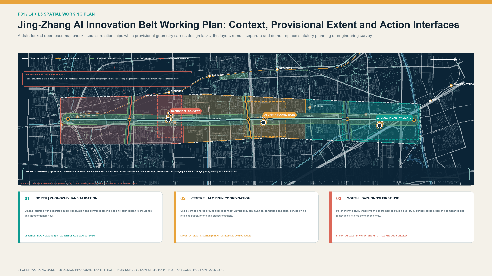

### Existing Basis and Information to Be Supplemented

- **Available information**: The Open Call announcement defines the approximate scales of the three planning levels and the tasks for the three Key-Area Detailed Design Areas. Regulatory Detailed Plans for blocks including `HD00-1601`, together with some formally accepted matters, have been published.[source:OFFICIAL-ANNOUNCEMENT] [source:JINGZHANG-CONTROL-NOTICE]
- **Available information**: Phase I of Jing-Zhang Railway Heritage Park has been implemented, and the Phase II supporting project has been completed; continuous public access still requires field verification.[source:PARK-PHASE1] [source:PARK-PHASE2]
- **Non-reproducible historical leads**: The two former search links for Zhongzhiyuan and Dazhongsi are withdrawn or deleted. No specific content from them is adopted or used to support a spatial or implementation conclusion. AI Origin's approximately 3 km² distributed network has separate accessible official support.[source:ZHONGZHIYUAN-RENEWAL] [source:DAZHONGSI-RENEWAL] [source:AI-ORIGIN-2026]
- **Open-basemap reconciliation flag**: The L5 provisional working extent does not overlap the L4 polygons named “Jing-Zhang Railway Heritage Park.” Using the 2026-05-06 OSM named-park polygons and `SITE-001` as inputs, the archived planar minimum boundary-distance value in EPSG:4547 is approximately 412.684 m and is displayed to the nearest metre as approximately 413 m. The complete polygons, nearest points, query, method, and limitations are delivered in-package. This result exposes a source conflict only and is not a survey or boundary conclusion. The whole package must be recalculated when the official boundary arrives. Using the brief's named-station clue and the L4 station location, the Dazhongsi study window has been approximately translated while retaining its longitude and latitude spans; its projected area differs from the earlier window by about 0.027%. The window remains within the provisional `SITE-001` extent. The named station lies about 90 m west of the window; the geometry still does not represent an official key-area boundary, station entrance, or engineering location.[source:KEY-AREA-SOURCE] [source:SPATIAL-SOURCE-CONFLICT-REGISTER] [data:visual/assets/spatial_source_conflicts.json#SC-OSM-SITE-001]
- **Information to be supplemented**: official vector boundaries; parcel and property-right information; existing-building conditions; complete Regulatory Detailed Planning drawings; road boundaries; river blue lines; flood levels; rail-transit and railway safety-protection areas; municipal capacity; application-entity budgets; and five-year operating income and expenditure. Related indicators are not assigned values at this stage, and proposal diagrams do not substitute for baseline surveys.[depth:risk_missing_data]

## Three-Level Scope Framework

All three levels derive from official approximate scales and written descriptions and are classified as L3 evidence. Current geometries serve only as research indexes.[source:OFFICIAL-ANNOUNCEMENT]

| Level | Official task scale | Working objective | Deliverable depth | Limits on use |
|---|---|---|---|---|
| Coordinated Research Area | Approximately 43.6 km² | Study how Haidian’s concentrated AI innovation resources can be coordinated and transformed into applications | Map relationships among institutions, industry, talent, public services, and blue-green and transport systems | Not used to determine area-wide land use, building scale, or investment-promotion commitments |
| Overall Design Area | Approximately 11.4 km² | Assess construction and public access across the Jing-Zhang public-space system and improve network connections through three linked corridors: Qinghe, Xiaoyue River and universities, and Zhuanhe | Establish existing relationships, functional layout, continuity-improvement tasks, and interfaces with renewal projects | `SITE-001` is not an Official Planning Boundary; conceptual partitions do not replace Regulatory Detailed Planning deliverables |
| Key-Area Detailed Design Area | Three areas totalling approximately 368.4 ha | Propose differentiated priority projects in accordance with the documented basis and implementation conditions | Establish district-level validation interfaces at Zhongzhiyuan, networked innovation-service interfaces at AI Origin, and scenario-transformation interfaces within the Dazhongsi renewal area | Provisional working boundaries are not used to calculate statutory area, Development Intensity, or Demolish–Renovate–Retain decisions |

`SITE-001` is used only for submission-package topology checks, self-checks, and conceptual recalculation.[data:geometry/site_boundary.geojson#SITE-001]

`KEY-V2-001/002/003` are working indexes for the three Key-Area Detailed Design Areas, and the number of key areas is checked internally against the task requirements.[data:geometry/key_areas.geojson#KEY-V2-001] [data:geometry/key_areas.geojson#KEY-V2-002] [metric:key_area_count] The third index follows the same provisional-boundary rules as the first two.[data:geometry/key_areas.geojson#KEY-V2-003]

Once official vector boundary data are obtained, all outputs shall be recalculated in the following sequence to ensure a common boundary version: site boundary → key areas → existing layers → proposal layers → metrics → five principal figures → HTML/PDF.[depth:three_level_scope_framework] [depth:metrics_recalculation]

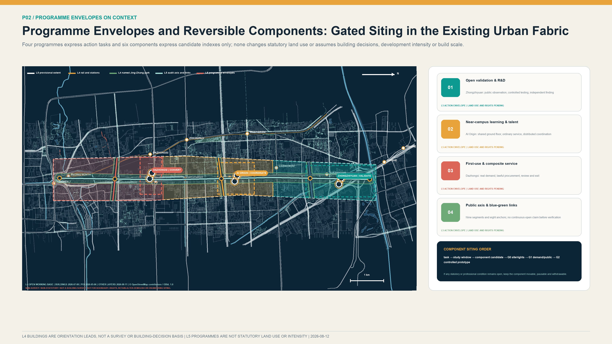

## Coordinated Research Area: Industry and Future City Research

### Overall Structure: One Axis, Three Corridors, Three Hubs, and Three Coordinated Chains

**One axis**: the Jing-Zhang Innovation and Coordinated Development Axis. Building on railway heritage, parkland, Walking and Cycling Network space, and public-service resources, the axis accommodates demand publication, display of test results, exchange on scenario applications, and public feedback. It forms the principal north–south public-space framework for innovation.

**Three corridors**: the Qinghe Linkage Corridor, the Xiaoyue River and University Collaboration Corridor, and the Zhuanhe Transit–Urban Integration Corridor. They strengthen lateral connections among waterfront spaces, universities and research institutes, rail-transit stations, communities, and innovation facilities.

**Three chains** cover the full project life cycle:

1. **Demand coordination chain**: Residents, public-service entities, enterprises, and research teams submit needs. Demand verification, user participation, data-boundary review, and proof of concept (PoC) convert them into testable project assignments.
2. **Testing and validation chain**: Version reproducibility, safety, energy use, accessibility, red-team testing, offline operation, and human takeover are assessed separately, resulting in a finding of “pass,” “restricted use,” “rectification,” or “stop.”
3. **Application-transformation chain**: Projects with an identified application entity and suitable implementation conditions proceed, in accordance with applicable law and procedure, to market research, procurement, deployment, operation, and 90/180-day follow-up evaluation. Projects that do not yet meet procurement conditions receive a written assessment.

**The three hubs** have differentiated functions. AI Origin coordinates innovation needs and proof of concept; Zhongzhiyuan undertakes professional testing and credible validation; Dazhongsi supports supply–demand matching, lawful procurement advice, operations and maintenance, and application evaluation. A common project identifier links work across the three areas. A project is regarded as entering implementation only after the demand, validation, and transformation stages are complete. Drawing on Beijing’s scenario-demand solicitation mechanism and Haidian District’s laboratories, large-model resources, and technology-trading base, the plan strengthens the testing, validation, and scenario-transformation stages between research outcomes and urban application.[source:BEIJING-SCENARIO-DEMAND] [source:HAIDIAN-STATS-2025]

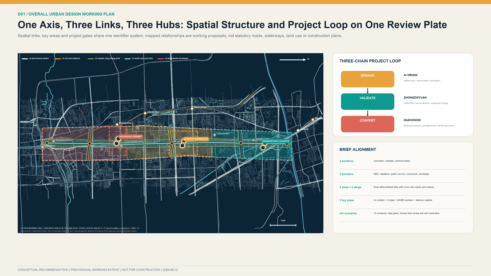

Brief requirements are no longer covered by one undifferentiated set of chapters. Each is translated into a spatial object, operating mechanism, evidence address, responsible role, acceptance artifact and stop condition. The three positions correspond to coordinated technological innovation, renewal of existing urban assets and evidence-based international communication. The five functions are collaborative R&D, independent validation, inclusive public service, first-use conversion and exchange. The three key areas receive separate project registers. The Zhongguancun Technology Service Wing organises professional-service inputs, while the Xiaoyue River Scenario Empowerment Wing returns public-scenario evidence. External coordination is expressed only through inputs, outputs and project interfaces; it does not indicate that Beiwei Community, Future Science City, Huairou Science City, Beijing E-Town or other Beijing–Tianjin–Hebei entities have agreed to participate.

| Brief item | Spatial and operating deliverable | Responsibility and acceptance | What cannot be inferred |
|---|---|---|---|
| Three positions | Axis public interface, three-hub project chain, bilingual evidence archive | Coordination role; annual publication of reviewable outputs | No government endorsement or international partnership is implied |
| Five functions | Collaborative R&D, independent validation, inclusive service, first-use conversion, exchange | Each is bound to a register, RACI, KPI and exit receipt | No site, budget, supplier or application owner is assumed |
| Three areas and two wings | Three key-area study windows and two cross-area coordination interfaces | Inputs, outputs, responsibility, data and gate conditions are registered | Provisional study windows are not official boundaries |
| `agent.1`–`agent.6` | Narrative, spatial data, metrics, drawings, web and self-check cross-reference one another | Structured matrices and persistent receipts provide replayable checks | Passing a digital gate is not professional approval |

The six specialist tasks use one evidence discipline so that concept language cannot substitute for a required output:

| Specialist task | Submission-stage required output | Review entry point | Object IDs and current status |
|---|---|---|---|
| `agent.1` overall concept and functional coordination | One-axis/three-corridor/three-hub plan, three-hub/two-wing coordination, spatial–operating cross-index | `overall-design-plan.en.png`; `ecosystem_operating_map.json`; `implementation_register.json` | `SITE-001`, three hubs, `RW-A01/RW-B01/RW-C01`, `G0–G6`; a submission-stage concept response has been developed, while official extent and delivery entities remain pending |
| `agent.2` full-stack AI innovation ecosystem | Three hubs × two wings × eight elements, five-step developer chain, evidence gates and knowledge return | `ecosystem_operating_map.json`; `annual_operations_register.json` | `EL-LAND/EL-SPACE/EL-INDUSTRY/EL-FUNDING/EL-TALENT/EL-COMPUTE/EL-DATA/EL-SCENARIO`, `DEV-CHAIN-01–05`; resource evidence, licences and operator pending |
| `agent.3` AI+ scenarios and active city | Twelve scenario contracts, three implementation-readiness prototypes, S06 Days 0–90 minimum package | `ai-service-blueprints.en.png`; `weave_contracts.json`; `s06_minimum_delivery_package.json` | `S01–S12`, `S06-MDP-P1–P3`; a controlled-evidence framework has been established at submission stage, while field work and specialist reviews remain pending |
| `agent.4` AI public realm and innovation landmarks | Three public innovation nodes, continuous-access audit, reversible components and accessible wayfinding | `identity-landmarks.en.png`; `public_space.geojson`; `roads.geojson` | `PUBLIC-V2-001–003`, `AN-V21-001–008`, `AUD-V21-SPINE-01–06`; siting, dimensions, utilities and approvals pending |
| `agent.5` integrated cultural narrative | Three-part walkable storyline, four responsibility-recognition records, bilingual and accessible content rules | `culture_storyline.json`; `identity-landmarks.en.png` | `CS-01–03`, `RR-PROBLEM/VALIDATION/FAILURE/EXIT`; history, rights and specialist editorial review pending |
| `agent.6` global activities and long-term operations | Five annual cycles, developer handoff, international communication and exit yearbook | `annual_operations_register.json`; `implementation-ledger.en.png` | `AO-01–05`, `DEV-CHAIN-01–05`; operator, event approval, budget and publication permission pending |

All are reviewable competition-stage concepts and implementation-readiness materials; none substitutes for statutory planning, administrative approval, professional review, procurement decisions or partnership agreements.

### Three Hubs, Two Wings, and an Eight-Element Coordination Map

The three hubs are not treated as parallel campuses. They divide responsibilities along one project-evidence chain. AI Origin organises real demand, the ordinary-service baseline, and a rejectable PoC. Zhongzhiyuan undertakes version reproduction, safety takeover, and independent validation. Dazhongsi connects an identified application owner, market research, lawful procurement, bounded deployment, and 90/180-day post-review. The Zhongguancun Technology Service Wing provides candidate inputs in intellectual property, talent, technology transfer, finance, and legal services. The Xiaoyue River Scenario Empowerment Wing organises feedback from communities, public services, and open-space problems.

| Element | Three-hub coordination task | Required evidence | Control boundary |
|---|---|---|---|
| Land and space | Verify rights, opening hours, and separation of public and controlled interfaces | Site-rights record, accessible route, fire-egress review, and reversible-component plan | A provisional work window determines no parcel, building footprint, or retain–renovate–demolish decision |
| Industry and funding | Convert a real problem into a reproducible test and comparison among alternatives | Demand brief, non-AI baseline, quantity evidence, and public market-price evidence | Invents no enterprise, output, investment, fiscal support, or procurement result |
| Talent and compute | Co-define problems and train reproduction, red-team, human-takeover, and operations capability | Participation charter, version/equipment/energy log, training record, and conflict disclosure | Predetermines no job, supplier, compute capacity, or deployment capability |
| Data and scenarios | Move from minimum-necessary data and synthetic tests to actual use and accountable exit | Provenance and licence, access and deletion, human final review, ordinary-service equivalence, and exit receipt | Test passage does not establish procurement, field safety, or public value |

The full machine-readable map is in `visual/assets/ecosystem_operating_map.json`. Beiwei Community, Future Science City, Huairou Science City, Beijing E-Town, and the Beijing–Tianjin–Hebei region remain candidate interfaces for problem inputs, testing methods, or portable knowledge outputs only. No participation, authority, or partnership is represented as confirmed.

| Candidate interface | Input requiring confirmation by the relevant entity | Output RailWeave can provide | Preconditions before activation |
|---|---|---|---|
| Beiwei Community | Real public-service problem, ordinary-service baseline, and representative-user views | No-account service blueprint, accessibility audit, and appeal/exit template | Local, site/property, service-duty, and participation authority lawfully established |
| Future Science City | Publishable research problem, testing-method need, and knowledge-licence boundary | Reproducible test assignment, comparative finding, and limitations register | Technology, data, intellectual-property, and publication duties confirmed |
| Huairou Science City | Translatable scientific problem, facility-interface need, and safety boundary | Scenario brief, controlled validation method, and portable knowledge summary | Facility, safety, confidentiality, data, and result-use authority established |
| Beijing E-Town | Real application-owner need, non-AI baseline, and production/operation constraints | First-use evidence pack, whole-life cost method, and exit/restoration method | Application owner, site, safety, procurement, and operations duties established |
| Beijing–Tianjin–Hebei entities | Cross-regional common problem, applicable standards, and local differences | Reusable problem/test templates, bilingual failure cases, and applicability limits | Each jurisdiction separately confirms authority, standards, data, IP, and cooperation procedure |

These are candidate interface designs only. They establish no invitation, authority, partnership fact, fiscal arrangement, or delivery commitment.

### Lessons from International Operating Models

| Case | Transferable mechanism | Conditions for application | Limits on local transfer |
|---|---|---|---|
| Toronto Vector Institute | An independent non-profit institution connects research, talent, engineering support, and trustworthy application | Separate validation judgments from commercial services and provide multi-party governance | Its certification authority, Canadian funding, and university system are not directly applicable locally [source:CASE-VECTOR-TORONTO] |
| Montréal Mila | Open science, rigorous PoC, entrepreneurship support, and public-interest governance operate in parallel | Complete agreements govern problems, data, experimentation, and knowledge transfer | Open source does not mean unconditional disclosure of enterprise or personal data [source:CASE-MILA-MONTREAL] |
| Paris STATION F | Multiple specialist programmes share one campus and common services | Provide project routing, a public charter, and shared back-office services | Do not copy its scale, brand, investment figures, or French leasing system [source:CASE-STATION-F] |
| Helsinki Maria 01 | Pilot operations begin in a small area of existing space and expand gradually based on membership and use evidence | Confirm property rights, fire safety, leases, and opening hours first | Experience from a former hospital does not establish that buildings along the corridor can be directly converted [source:CASE-MARIA-01] |
| Toronto MaRS | Public-interest functions, spatial operations, application services, and investment connections form complementary business lines | Account separately for public-interest and commercial activities and involve identified application entities | Canadian charity, tax, and property systems are used only for comparison [source:CASE-MARS-TORONTO] |
| Barcelona 22@ | Innovation, housing, infrastructure, and social inclusion are managed together | Evaluate renewal returns and community benefit together | Do not copy its land-value capture, Floor Area Ratio, or affordable-housing system [source:CASE-22BARCELONA] |
| Copenhagen BLOXHUB | A limited set of annual problem agendas organizes members, applied research, and cross-sector cooperation | Publish projects, budgets, partners, and annual results | Membership and visit counts do not substitute for local public value [source:CASE-BLOXHUB] |

International cases support comparison of mechanisms and local applicability. They do not establish that site conditions, partnerships, investment arrangements, or investment-promotion outcomes have been secured.[source:AGENT-TASKBOOK] [standard:PROJECT-AGENT-OPEN-CALL-TASKBOOK]

### Plan Name and Visual Identity System

The principal name, “RailWeave,” refers to the history of the Jing-Zhang Railway, the progression of technological innovation, and the traceability of project responsibility. The mark uses parallel tracks that divide and converge at nodes, representing the comparison of alternatives and complete process records. Railway navy signifies historical continuity and institutional assurance; open teal signifies collaborative innovation; amber signifies Human Review and risk notification. The wayfinding system corresponds to evidence levels L1 through L5 and to the three project states of demand, validation, and transformation, with tactile and written coding suitable for all age groups. Corporate marks are not included in the principal public identity system. The plan mark, type, and wayfinding system are original works.[depth:overall_spatial_structure]

## Overall Design Area: Urban Renewal and Regulatory-Plan-Level Urban Design

### Coordinating Improvements to Existing Space and Network Connections

Official information available through 2026 indicates that Phase I of Jing-Zhang Railway Heritage Park has been completed and the Phase II supporting project has made staged progress. Completion of supporting works and continuous, accessible public use of the full corridor require separate verification.[source:PARK-PHASE1] [source:PARK-PHASE2] The Overall Design establishes a four-level working register: `built / supporting-works-completed / open-status-to-verify / gap-to-audit`. Field survey and continuity assessment focus on the North Fifth Ring Road, North Fourth Ring Road, Chengfu Road, Zhichun Road, Xueyuan South Road, North Third Ring Road, rail-transit stations, and river interfaces.

The spatial structure comprises “one axis, three corridors, and three hubs”:

- Jing-Zhang Axis: the common interface for existing parks, railway heritage, public services, and project status;
- Qinghe Linkage Corridor: connects renewal clusters across subdistricts, parks, and rivers, with priority verification of walking and cycling connections, waterfront safety, flood-control access, and the Fifth Ring Road interface;
- Xiaoyue River and University Collaboration Corridor: connects universities, distributed innovation facilities, communities, and rail-transit stations, improving ten-minute walking connections and ground-floor public services;
- Zhuanhe Transit–Urban Integration Corridor: connects rail-transit stations, renewal areas, communities, enterprises, and waterfront spaces, with priority improvements to accessible routes outside stations and interfaces with renewal projects.

`ROAD-V2-001` through `ROAD-V2-004` represent continuity-review and spatial-connection tasks. They are not evidence for roads, bridges, tunnels, greenways, or construction alignments.[data:geometry/roads.geojson#ROAD-V2-001] [data:geometry/roads.geojson#ROAD-V2-004] [metric:crosslink_count] Their internally recalculated length is an L5 conceptual-audit-alignment working value used only to check the plan. It is not included in quantities, government construction schedules, or the statutory road network.[metric:conceptual_audit_alignment_length_m] [depth:traffic_rail_slow_parking]

### Urban Renewal and Functional Orientation

Information for the Overall Design Area is organized in four categories: existing-condition basis, open-data-assisted assessment, design recommendation, and matter for further development. The north prioritizes open validation and research collaboration; the central area strengthens university-adjacent innovation and talent services; and the south develops scenario application and mixed services. The Jing-Zhang Axis and three lateral corridors support public-space access and network connection.[data:geometry/land_use.geojson#LU-V2-001] [data:geometry/land_use.geojson#LU-V2-004]

`LU-V2-001` through `LU-V2-004` are L5 conceptual functional partitions. They describe the overall functional organization and do not constitute a statutory Land-Use Plan or land-use balance.[standard:MNR-LAND-USE-CLASSIFICATION-GUIDE] [depth:land_use_layout]

Available official material confirms the existence of relevant Regulatory Detailed Plans and some intersecting relationships, but complete road boundaries, land-use classifications, Floor Area Ratio, Building Height, Building Coverage Ratio, setbacks, and municipal capacity remain to be supplemented.[source:JINGZHANG-CONTROL-NOTICE] [standard:MOHURD-CONTROL-DETAILED-PLANNING] Urban Character principles include articulated massing, walkable ground floors, shared courtyards, low-reflectance materials, maintainable roofs, priority for historic fabric, and control of the scale of night-time media installations and dynamic lighting. Building massing, Demolish–Renovate–Retain decisions, and permanent structures shall be developed further after survey, property-right, structural and fire-safety, heritage, and Regulatory Detailed Planning conditions are obtained.[depth:height_massing_character]

## Detailed Design of Key Areas

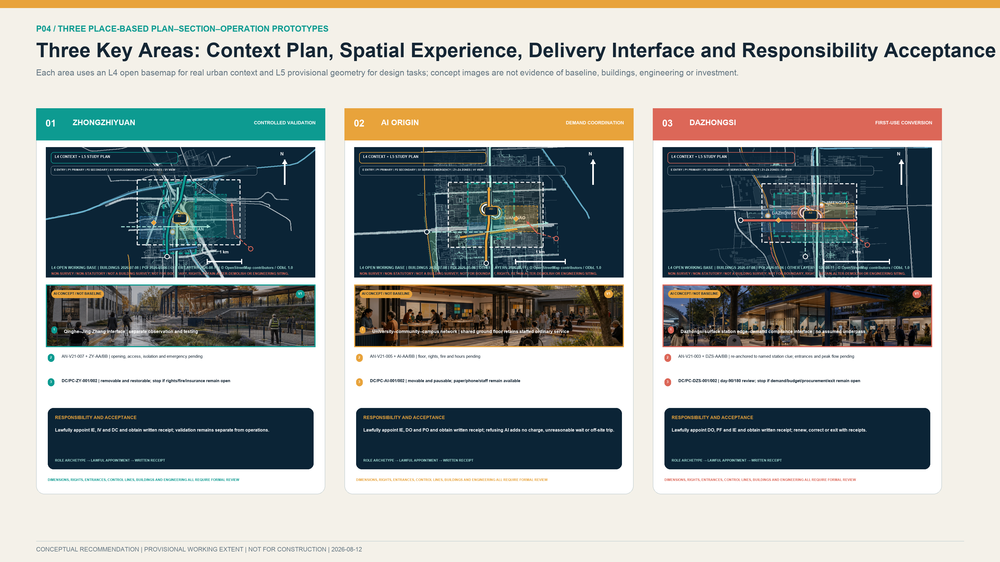

The three Key-Area Detailed Design Areas use a common Public Interest and Inclusivity evaluation framework, with differentiated design depth determined by the documented basis and implementation conditions. Each project shall define public interest, data minimization, Human Review, reversibility, maintenance responsibility, incident response, and exit and restoration requirements. Spatial massing, Development Intensity, and the Demolish–Renovate–Retain Strategy shall be developed strictly from credible information for each area.[depth:three_key_area_detailed_design]

### Zhongzhiyuan: Open Validation Demonstration Park

**Existing basis and work priorities.** The official page identified by a historical Zhongzhiyuan search record is withdrawn or deleted, and its original wording cannot now be verified. This proposal quotes or adopts no specific boundary, node, or implementation claim from it. `KEY-V2-001` is a working index under the Open Call brief and is not an announced or verified boundary.[source:ZHONGZHIYUAN-RENEWAL] [source:OFFICIAL-ANNOUNCEMENT] [data:geometry/key_areas.geojson#KEY-V2-001]

**Planning recommendations.** Subject to verified site rights, professional conditions, operating responsibility, and all legally required procedures, study whether an Open Validation Demonstration Park function could be formed and whether its spatial interfaces could include a trustworthy testing and validation space, provisionally named the “Validation Lab,” a reconfigurable workshop, an enclosed testing ground, a controlled walking and cycling test loop, and a public observation and evaluation corridor. A workflow for further study could cover project admission, enclosed reproduction, itemised validation, limited testing, conclusion assessment, information disclosure, and transfer to application. Near-term study may prioritise indoor model testing, edge-device energy-use testing, offline fallback, and robotic testing in enclosed environments. Public parks should not, in principle, serve as robotic road-testing sites without a dedicated assessment.

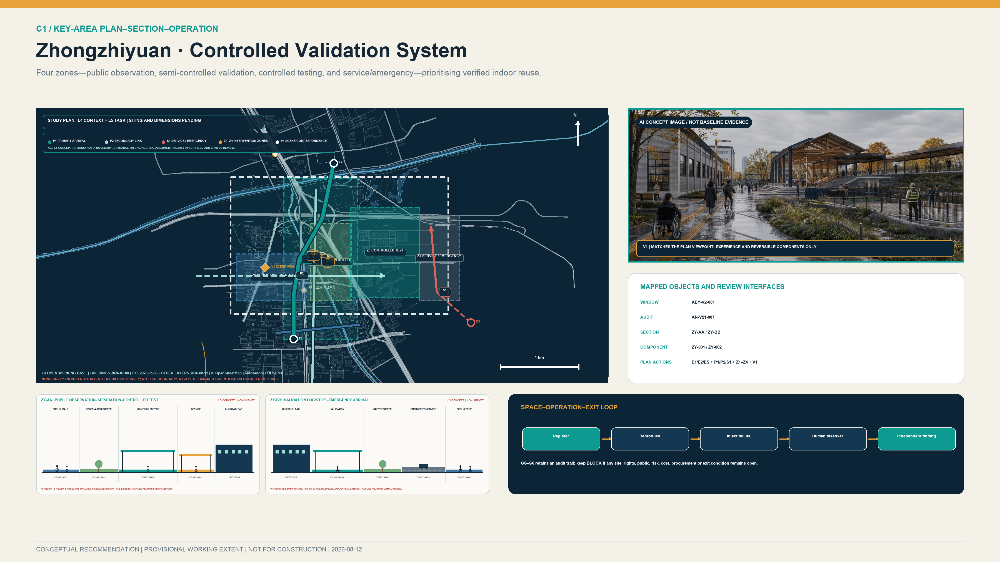

The spatial system separates public observation, results interpretation, controlled testing and equipment/service zones. Public and test activities do not share an unmanaged boundary. Higher-risk equipment requires enclosure, emergency stop, insurance, emergency access and independent review. The `DC-V21-*` objects embedded in `geometry/public_space.geojson` use movable conceptual anchors to represent the validation space and observation interface. These anchors are not building footprints, test qualifications or site authorisation. Outdoor mobility and robotic tests require separate transport, fire, insurance and public-safety assessment.

**Recommended implementation entities.** If relevant parties express willingness to participate and their duties, authority, budget, site, and data boundaries are lawfully confirmed, a lawfully appointed coordination role could organise the work, while technical operations, independent review, site management, insurance, and emergency roles could be appointed through agreements or applicable lawful procurement. Those roles could assume responsibilities only after lawful appointment, and a channel for user representatives to recommend suspension and review could then be studied. This proposal does not appoint a Zhongguancun Science City management platform, site owner, property manager, insurer, emergency entity, or any other body. Institutional names identify possible types of entity only and do not indicate participation or authorisation.[source:CASE-VECTOR-TORONTO]

**Conditions for further development.** The precise boundary, parcels, property rights, existing buildings, road boundaries, river-management lines, development scale, Building Height, fire safety, municipal capacity, and testing qualifications remain to be verified. Specific building massing, bridge and tunnel alignments, and enterprise partnerships shall not be determined before the relevant information and review opinions are obtained.[depth:development_intensity_controls]

### AI Origin: Open and Collaborative Innovation District

**Existing basis and work priorities.** Official information describes AI Origin as an approximately 3 km² distributed innovation network centred on Wudaokou, integrating several facilities and extending into surrounding areas. It already has a foundation of enterprise services, talent services, and human–AI service windows.[source:AI-ORIGIN-2026] [source:AI-ORIGIN-TALENT-STATION] `KEY-V2-002` represents only a working area and is not a statutory boundary.[data:geometry/key_areas.geojson#KEY-V2-002]

**Planning recommendations.** After property rights, fire safety, leasing, opening hours, and operating responsibility are verified, study whether a shared ground floor could be selected and whether an “Innovation Demand and Outcome Transformation Service Room” and interfaces for demand intake, open-source reproduction, outcome-transformation advice, time-limited PoC work, integrated talent services, and evening exchange would be appropriate. A common demand-registration form for residents, public-service staff, researchers, and enterprises may be studied. A proposed project should identify its service users and lawful data sources before a recommendation is made to enter testing and validation at Zhongzhiyuan, remain in the research reserve, or receive a termination assessment.

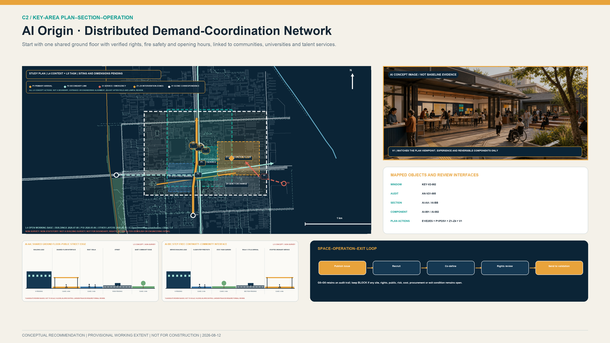

AI Origin is treated as a network, not a new campus. The first stage studies one shared ground floor after rights, fire safety, leasing and opening hours are verified. It provides a staffed desk, parallel paper and digital demand walls, a co-definition workshop and a quiet evening interface; other facilities are connected through referrals and walking links. Step-free routes, night noise, waiting capacity and evacuation conditions require field verification. A geometric circle or provisional study window is not a real service catchment.

**Recommended implementation entities.** If relevant parties express willingness to participate and their duties, authority, budget, site, and data boundaries are lawfully confirmed, the existing AI Origin operating network could be studied as a community-collaboration interface. Universities, research institutes, incubators, and roles related to human resources, talent, housing, and enterprise services could provide professional services only after lawful appointment or agreement. Residents’ committees, property managers, young people, older people, persons with disabilities, and merchant representatives could be invited to consultation. Intelligent question-answering should be limited primarily to information explanation and form pre-filling; exceptions, formal acceptance, and appeals should be handled by a lawfully appointed staffed-service role. This proposal does not appoint Dongsheng, any public authority, university, institution, or community body, and does not indicate that it has participated, authorised, or agreed to implementation.[source:AI-ORIGIN-TALENT-STATION]

**Conditions for further development.** Facility property rights, the specific ground-floor location, rent, night-time noise, fire safety, equitable access, intellectual property, and residents’ preferences remain to be confirmed. Connections between universities and parks and any specific building conversion require the consent of the relevant rights holders and professional assessment.[source:BEIJING-URBAN-RENEWAL]

### Dazhongsi: First-Use Scenario Transformation Centre

**Existing basis and work priorities.** The official page identified by a historical Dazhongsi search record is withdrawn or deleted, and its original wording cannot now be verified. This proposal quotes or adopts no specific boundary, entity, project, or funding claim from it. `KEY-V2-003` is a working index under the Open Call brief and is not a verified boundary or entity record.[source:DAZHONGSI-RENEWAL] [source:OFFICIAL-ANNOUNCEMENT] [data:geometry/key_areas.geojson#KEY-V2-003] The approximately 5.03 ha area, approximately 96,500 m² of floor area, and traffic forecast for Lanjing Lijia apply only to the corresponding implementation unit and are not extrapolated to the entire area.[source:LANJING-IMPLEMENTATION] [source:LANJING-TRAFFIC]

**Planning recommendations.** After real demand, site, procurement authority, budget, and operating conditions are verified, study whether a First-Use Scenario Transformation Centre function and interfaces for public demand publication, procurement-compliance advice, supply–demand matching, multipurpose publication, 90/180-day application evaluation, and rail-transit-facing services would be appropriate. A proposed demand owner should first identify its current business process, accountable role, budget conditions, and risk limits. Procurement routes for mature products, testing agreements for validation-only work, and possible mechanisms for substantiated innovation needs should be studied separately by lawfully appointed procurement and legal roles and are not predetermined by this proposal. Information proposed for publication may cover authorised demand, validation findings, contract performance, actual use, and exit and restoration.

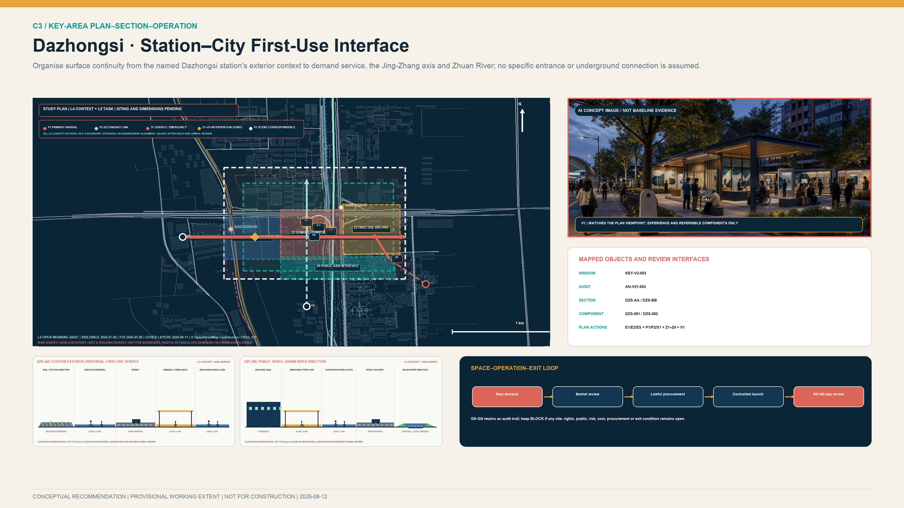

The spatial study organises four surface interfaces: station-forecourt circulation, demand and compliance service, the first-use project archive, and links toward the Jing-Zhang axis and Zhuan River. Commuter peaks, event peaks, deliveries and emergency access are checked separately. Station entrances, step-free routes beyond the fare line and waterfront directions must be verified from operator information and field survey. The plan does not assume an underground passage, station-entrance works, a four-quadrant project or permanent waterfront facilities.

**Recommended implementation entities.** If relevant parties express willingness to participate and their duties, authority, budget, site, and data boundaries are lawfully confirmed, a subsequently appointed coordination role could organise cross-sector demand verification. Spatial implementation, whole-life financial balance, application, procurement, legal, intellectual-property, data, and audit duties would be undertaken only by lawfully appointed entities within their authority. Public authorities, public institutions, state-owned enterprises, and market entities identify possible application-entity types only and are not confirmed participants or demand owners. Any technology supplier would be selected through an applicable lawful procedure, and an early PoC relationship does not predetermine a subsequent procurement result. This proposal does not appoint any district authority, renewal entity, application owner, or professional body.[source:BEIJING-SCENARIO-DEMAND] [source:BEIJING-URBAN-RENEWAL]

**Conditions for further development.** Application entities, funding sources, procurement authority, data authorization, transport capacity, accessibility outside the station, underground connections, and building conditions require further verification. The four quadrants around the rail-transit station and underground works alignments are subject to specialist study and approval outcomes.

## AI Innovation System, Service Groups, and AI+ Scenarios

### Six Priority Service Groups and Their Use Processes

| Service group | Demand formation | Testing and validation | Scenario transformation | Data and human safeguards | Adjustment and exit mechanism |
|---|---|---|---|---|---|
| Early-career researchers | Select an identified need at AI Origin and undertake a PoC with frontline service users | Complete version, safety, and energy-use testing at Zhongzhiyuan | Engage with several potential application entities at Dazhongsi | Unauthorized research information and identity trails are not disclosed; lawfully appointed transformation and independent-review roles sign off | Projects without identified service users do not enter the next prototype-validation gate in this proposal; projects that cannot be reproduced remain in research |
| Start-up teams | Use outcome-transformation, talent, and housing-referral services without being tied to an investor | Disclose commercial data on a minimum-necessary basis and complete testing | Engage with potential application entities identified through market research and compliant procedures | Enterprise and personal-service data are authorized by category; application entities may not obtain unrelated data | Sales-oriented pilots end where no identified demand exists; projects do not proceed to procurement without operations and maintenance capacity |
| Community residents | Submit needs anonymously in person, by telephone, or online | Participate voluntarily in a limited-scope PoC and withdraw at any time | Review application-evaluation results and submit complaints and appeals in accordance with law | No facial profiling; non-digital channels and human services remain available | Refusal to participate does not affect ordinary services; a complaint triggers suspension and review |
| Public-service staff | Describe the current business process, common errors, and duties that cannot be delegated | Test false positives, false negatives, offline operation, and safe fallback | Participate as the demand entity in acceptance and 90/180-day application evaluation | Use de-identified samples; humans make the final decision, and algorithms do not replace statutory duties | Projects that materially increase human workload or fail to meet the minimum standard return for rectification |
| International visitors | Learn about public issues from rail transit and the principal axis without registration | View non-sensitive explanations of validation work | Participate in project exchanges; only subsequent project activity counts as an outcome | Bilingual, accessible, paper-based, and human alternatives are provided; identities are not tracked across nodes | Visitors may provide anonymous feedback and have contact information deleted |
| Operations, maintenance, and frontline workers | Review energy use, networks, cleaning, spare parts, and shifts before design | Rehearse power loss, emergency stops, and manual takeover | Sign off jointly on deployment, maintenance, and exit | No labour-performance profiling; two-person operation and safety training | Projects do not go live without maintenance resources; sites are restored and data deleted on exit |

### Twelve Scenario Modules and Project Processes

The twelve scenarios are coordinated through demand organization, testing and validation, and application transformation. Each scenario shall specify spatial prerequisites, responsible entities, pilot duration, data boundaries, Human Review, risk indicators, and stop conditions. Its specific location shall be determined only after a lawful site-use agreement is obtained.[metric:scenario_card_count]

| # | Scenario module / process | Spatial conditions and service users | Data, human oversight, and maintenance | Pilot duration, outcomes, and risk indicators | Admission limits and exit mechanism |
|---|---|---|---|---|---|
| S01 | **Model reproducibility validation** / P1 validation | Trustworthy testing and validation space at Zhongzhiyuan; researchers, enterprises, and application entities | Use public or authorized data and record the version hash; researchers reproduce results and an independent third party conducts spot checks; the testing party bears computing costs | Duration for each test batch is set by agreement; assess reproducibility, file completeness, leakage events, and non-reproducible cases | No admission without permission, a version record, and a responsible person; projects that fail validation return to research |
| S02 | **Edge-device energy use and offline resilience** / P1 evidence | Indoor controlled node; equipment teams and operations staff | Device-level energy and fault logs without collecting personal data; two-person operations review | Same batch as S01; energy per task, offline fallback, and human-takeover time | Stop if safe offline fallback is unavailable or the load is unknown |
| S03 | **Controlled embodied-intelligence testing** / P1 validation | Enclosed testing ground with fire-safety, insurance, and emergency-stop provisions; robotics teams and safety officers | Anonymous event logs with a limited retention period; safety officers retain emergency-stop authority throughout; the technical team bears loss and restoration responsibility | Conduct enclosed testing first, then consider limited opening; assess collisions, boundary incursions, and takeover success | No direct deployment in general public green space; any incident triggers immediate isolation and investigation |
| S04 | **Incident response, appeal, and exit exercise** / P1 validation | Incident-evaluation room and removable components; all project entities | Retain only necessary audit records; independent reviewers oversee notification, deletion, and restoration | Conduct an exercise before every launch; assess closure time, completion of deletion, and site restoration | Projects without exit funding or a responsible person may not go live; projects that fail the exercise return for rectification |
| S05 | **Shared-learning and career-development assistant** / P2 demand | Shared ground floor at AI Origin; young people, teachers, and mentors | Voluntary learning goals; teachers or mentors make final decisions; the operator maintains content | Time-limited PoC; completion rate, staff time saved, erroneous advice, and withdrawal rate | No automated evaluation or admissions or employment decisions; may be closed at any time |
| S06 | **All-ages accessible information service** / P2 demand | Continuous routes among station exits, the principal axis, and public-service facilities; older people, persons with disabilities, and visitors | Use edge or aggregated route-event data; retain human and paper wayfinding | Survey key routes first; assess completion of accessible routes, misdirection events, and requests for assistance | Do not collect faces or continuous identity trails; suspend and rectify the service if errors recur |
| S07 | **Human–AI collaborative public-service work orders** / P2 demand | Community or park service counter; residents and frontline staff | De-identified work orders; staff confirm classification and responses; the demand entity operates the service | Pilot a limited set of work-order types; resolution time, repeat complaints, and human workload | No automated enforcement or denial of service; stop if human workload increases |
| S08 | **Multilingual review of railway-heritage content** / P2 demand | Existing display or reversible media; the public and international visitors | Rights-cleared historical material; AI content is clearly labelled; curatorial and heritage review | Single-theme content period; correction time, accessible readability, and historical errors | Qinghuayuan Station content and equipment require heritage review; remove infringing material [source:QINGHUAYUAN-HERITAGE] |
| S09 | **Procurement and data-compliance advice** / P3 transformation | Dazhongsi demand hall; small and medium-sized enterprises, application entities, and technology teams | Enterprises submit only the minimum necessary information; procurement, legal, and data specialists review | Ongoing service with quarterly evaluation; rate of useful pathway advice and number of corrections | Does not replace statutory review or create a directed award; major disputes proceed to a dedicated human review |
| S10 | **Supply–demand matching for first-use scenarios** / P3 transformation | Supply–demand meeting room and public demand pool; demand entities and multiple technology teams | Publish non-sensitive demand; confidential data are governed by a separate agreement; supervise fairness | Each demand batch has a deadline and recorded conclusion; identified-demand-entity rate, contract-formation rate, and decisions not to procure | Projects without an identified application entity or budget conditions do not enter the pool; no supplier may be predetermined |
| S11 | **90/180-day application evaluation** / P3 transformation | Prospective controlled deployment site and application-evaluation room; application entities, service users, and operations staff | Collect business and maintenance indicators under the contract on a minimum-necessary basis; the application entity accepts the work and a user-appeal channel remains available | 90/180 days after deployment; assess active use, faults, human input, complaints, and continued use | Restore the original business process where sustained use or maintenance is absent, or risk exceeds the threshold |
| S12 | **Project-responsibility information register** / three-chain coordination | Three public nodes and a webpage; the public | Disclose authorized demand, findings, limitations, contracts, complaints, and corrections; maintained by designated staff | Continuous operation and quarterly archiving; record-completeness rate and appeal-closure rate | Do not disclose personal information or trade secrets; correct errors promptly and disclose project suspension and exit |

S01 through S04 are industrial Testing and Validation Scenarios and meet the requirement for at least three industrial validation scenarios. S08 is revised as multilingual review of railway-heritage content. In the absence of an identified medical demand entity and continuing responsibility for content, medical question-answering is not established as a separate scenario at this stage. Public-service automation shall retain human decisions, non-intelligent service channels, explanations, withdrawal, and appeal mechanisms.[source:AGENT-TASKBOOK] [standard:PROJECT-AGENT-OPEN-CALL-TASKBOOK]

### Three Concept Prototype Specifications for Controlled Validation and the Weave-In–Unweaving Contract

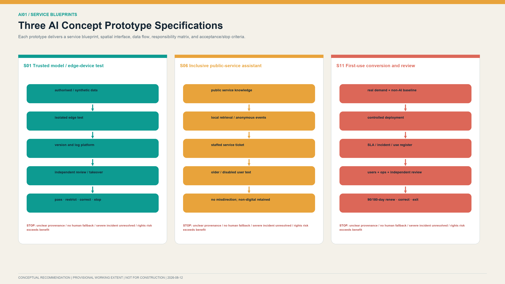

Version 2.2 develops S01, S06 and S11 into concept prototype specifications for controlled professional validation; it does not indicate that the technology, site, or service is field-ready. Each provides a service blueprint, spatial interface, data-flow diagram, responsibility matrix, and acceptance and stop conditions. Inputs, outputs, model or device version, data controller, human takeover, failure modes and site restoration are registered in `visual/assets/scenario_prototypes.json`.

| Prototype | Edge–platform–human-review architecture | Acceptance focus | Stop condition |
|---|---|---|---|
| S01 trusted-model and edge-device test | Authorised or synthetic data enter an isolated edge test; the platform records version, energy, network loss and injected failures; an independent body reviews | Reproducible pack, version identifier, failure record, human takeover and redacted summary | Unclear provenance/version, no safe fallback, unresolved major issue |
| S06 inclusive public-service assistant | Public knowledge and local retrieval produce suggestions; a staffed desk retains decisions, exceptions and appeals; paper, telephone and in-person routes remain available | Older people, disabled people and non-digital users complete an equivalent service without extra charge or unreasonable additional travel | Repeated misdirection, increased staff burden, loss of non-digital route or rights-related harm |
| S11 first-use conversion and post-review | Real demand and a non-AI baseline enter controlled deployment; the platform records SLA, incidents and actual use; users, operators and an independent body review | Launch checklist, training, actual use, 90/180-day evaluation and exit receipt | Demand disappears, whole-life cost is unaffordable, severe risk or low continued use |

The weave-in contract is neither an approval nor a certification. It is the minimum information structure before a project enters public space or a public service. Each scenario records the public problem, longitudinal safeguard, cross-link interface, node responsibility, prohibited data, human review, equivalent ordinary service and unweaving trigger. Complaints, necessary audit records, deletion evidence, equipment removal and site restoration remain as residual maintenance obligations after exit. `visual/assets/railweave_runner.js` replays synthetic branches covering normal operation, missing human review, missing ordinary-service fallback, data overreach, responsibility drift and failed unweaving. Results are persisted in `visual/assets/receipt.json`. The tests prove only input–rule–output consistency. Field performance remains `unknown` until baseline work, professional tests and review by legally authorised entities are complete.

S06 is proposed as a 90-day implementation slice. Days 0–30 establish the ordinary-service, accessibility and frontline-work baseline. Days 31–60 run synthetic and shadow validation in an enclosed environment without changing the current service. Days 61–90 permit co-testing within limited users, hours and premises. Pilot costs must separately identify staffed service, participation support, insurance, data governance and exit-restoration resources sufficient to cover interface shutdown, data clearance, sign correction, restoration of staffed service, equipment removal, site repair and independent review. Quantities, prices, amounts and funding sources require verification and lawful determination; no fixed percentage is prescribed. A severe safety or privacy event, loss of human service, an unresolved critical accessibility barrier, or unclear site and exit responsibility stops progression immediately.

#### S06 Options and Selection Rationale

| Candidate mode | No-account/offline access | Privacy and accessibility | Human workload and exit | Plan decision |
|---|---|---|---|---|
| App- or account-first | Account, device, network, or digital skill may become a precondition | Tends to expand identity, location, and profiling needs and disadvantages non-digital users | Appears to reduce in-person channels, but exceptions, appeals, failure, and migration duties remain | Not the default; no compulsory download or registration |
| Unstaffed AI-terminal-first | No independent service path when the terminal, network, or interface fails | Dynamic interaction can create new barriers for visual, hearing, cognitive, or physical differences | Failure, misdirection, and safety incidents still require human takeover; fixed equipment raises removal cost | Not an independent backbone; voluntary assistance only while ordinary service remains available |
| Staffed and paper foundation with switchable AI | Fixed signs, tactile/easy-read information, paper, telephone, and staffed channels come first | Minimum-necessary advice is offered only by choice, with human final review and no-penalty refusal | Staff shifts and maintenance are costed honestly, but offline service continues, the dynamic interface can stop, and ordinary service can be restored | **Selected as the S06 concept prototype for three-stage controlled evidence collection** |

This is a qualitative service-architecture decision, not a field-test result, and no fictional scores are assigned. The third mode is selected because the same ordinary-service foundation remains basically reachable when AI is not enabled, declined, offline, failed, or exited. True equivalence remains to be demonstrated through the Days 0–30 baseline and representative-user review.

#### S06 Minimum Delivery Package and Stage Acceptance

| Work period | Responsibility and minimum inputs | Acceptance artifacts | Stop and exit |
|---|---|---|---|
| Days 0–30: ordinary-service and accessibility baseline | A lawfully appointed application/site role accepts the route, opening hours, paper/telephone/staffed channels, and representative-user plan | Segment accessibility audit, ordinary-service map, and non-AI completion, wait, distance, and cost baseline | No progression where site rights are unclear, a critical barrier lacks equivalent service, or staffed shifts are absent |
| Days 31–60: closed synthetic and shadow validation | The independent-validation role accepts a fixed version, lawful or synthetic data, prohibited fields, and network-loss/misdirection/profiling/unweaving tests | Human-versus-shadow comparison, version and failure logs, human-takeover drill, and independent finding | Stop and clear data/access for prohibited data, high-risk misdirection, failed takeover, or an unresolved major issue |
| Days 61–90: limited co-testing after authorisation | Only after site, data, participation, and stop authority exist, the application role organises a bounded space, period, and user group | Ordinary/digital route comparison, help/misdirection/appeal register, and reasoned day-90 renew, correct, pause, or exit finding | Exit immediately if an authority is absent or withdrawn, ordinary service stops, a severe safety/privacy/fairness event occurs, or exit responsibility/resources are unavailable |

The three-phase preregistration, RACI, control metrics, and six exit receipts are in `visual/assets/s06_minimum_delivery_package.json`. It is a template for later professional development by lawfully appointed teams and approves no site, data processing, participant recruitment, budget, procurement, or launch.

## Land Use, Building Scale, and Retain-Renovate-Demolish Strategy

### Principles for Determining Land-Use and Building Indicators

`land_use.geojson` represents four conceptual functional partitions. It is used only to check consistency within the provisional working extent; official boundary data are unavailable. It does not constitute a statutory Land-Use Plan or Regulatory Detailed Planning indicator.[data:geometry/land_use.geojson#LU-V2-002] [depth:land_use_layout] The empty `buildings.geojson` layer indicates that no verified Building Footprint data are currently available; it does not indicate an absence of buildings on site. Functional components are represented through public-space action areas and project interfaces, and `building_footprint_area_sqm` remains to be verified.[data:geometry/buildings.geojson#NO-VERIFIED-BUILDING-FOOTPRINTS] [metric:building_footprint_area_sqm]

The existing-building inventory shall combine L4 open Building Footprints, remote-sensing time series, and field surveys, with features marked `existing-observed / to-verify`. Specific renewal categories require sequential verification of property rights and leases, heritage protection, legality of construction, structural and fire safety, current use and vacancy, carbon emissions, public services, effects on tenants and workers, alternative accommodation, funding arrangements, and subsequent operating conditions.[standard:MOHURD-ARCH-DESIGN-DEPTH-2016] [depth:retain_renovate_demolish]

The Demolish–Renovate–Retain decision tree is:

1. Buildings with heritage value or sound structures and uses: retain and maintain as a priority.
2. Buildings with inadequate spatial performance that can be repaired safely: adaptively reuse, beginning with limited sharing at defined times.
3. Conditions that impair public continuity but can be addressed through management: adjust hours, access, and wayfinding before considering demolition and construction.
4. Buildings for which demolition is necessary: complete assessments of safety, carbon, property rights, public interest, tenants, and alternatives.
5. Additions: prioritize lightweight, reversible, and demountable structures; do not proceed to medium-term construction without a viable five-year operating account.

Material for Lanjing Lijia applies only to the corresponding implementation unit. Drawings shall use a bold boundary and the note “valid within this frame; do not extrapolate.” The material shall not be used to calculate indicators for the Overall Design Area or other Key-Area Detailed Design Areas. Area-wide Floor Area Ratio, Building Height, and development scale cannot be determined at this stage.[source:LANJING-IMPLEMENTATION] [source:LANJING-TRAFFIC] [depth:development_intensity_controls]

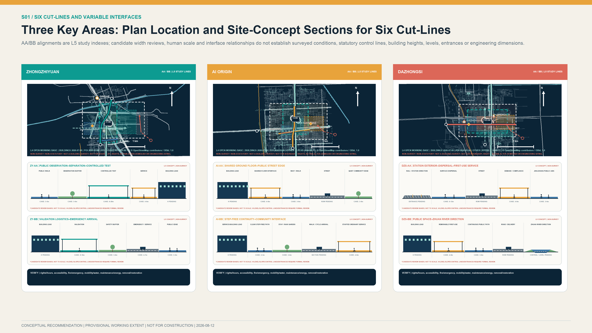

Version 2.2 embeds five detailed object groups in the repository's canonical layers. `geometry/roads.geojson` adds `AUD-V21-*` audit segments and `SEC-V21-*` study section lines; `geometry/public_space.geojson` adds `AN-V21-*` accessibility checkpoints and `DC-V21-*` movable components; and `geometry/phasing.geojson` adds `PC-V21-*` component-level phases. Every object is L5, `diagrammatic`, `official_boundary=false`, `NOT FOR CONSTRUCTION`, and excluded from road or built-quantity calculations through `metric_inclusion=false`. Unknown opening, accessibility, rights, fire, operating and existing-dimension fields remain `unknown`. Typical sections use variable W for width to be surveyed; they do not establish a road section, building height, river-control line or engineering alignment.

### Closing the Evidence–Spatial Action–Responsibility–Acceptance Chain in Each Key Area

The table adds no precise coordinates or development quantities. It places the available evidence, questions for field verification, design action and first reversible component in one acceptance chain. Components are studied for siting only after prerequisites are met; where survey findings contradict an assumption, the component must move, reduce or be cancelled.

| Area | Evidence status and questions to verify | Siting rationale and spatial action | Variable scale and interface | First reversible component | Responsibility and acceptance |
|---|---|---|---|---|---|
| Zhongzhiyuan | The Open Call task and repository provisional envelope are available; the historical renewal notice is withdrawn or deleted. Rights, fire safety, testing qualification, river controls and existing dimensions require verification.[source:OFFICIAL-ANNOUNCEMENT] [source:ZHONGZHIYUAN-RENEWAL] | Reproduction and testing are organised only in a verified controllable indoor or courtyard setting. Public observation, controlled testing and equipment/service areas are separated; ordinary public green space is not treated as a test ground. | `AN-V21-007` is a survey anchor. `SEC-V21-ZY-AA/BB` use W for surveyed width and check enclosure, emergency stop, evacuation and emergency access.[data:geometry/roads.geojson#SEC-V21-ZY-AA] | `DC-V21-ZY-001/002` and `PC-V21-ZY-001/002`: begin with indoor reproduction, then assess a public-observation interface; every component can be removed or suspended.[data:geometry/public_space.geojson#DC-V21-ZY-001] | Lawfully appointed site, test-operations, independent-review, insurance and emergency roles sign separately. Controlled testing cannot begin where any site right, fire, insurance, human-takeover or restoration-funding condition is absent. |
| AI Origin | Accessible official information supports an approximately 3 km² distributed network and existing talent services; the specific shared ground floor, step-free route, lease, fire conditions and opening hours are unknown.[source:AI-ORIGIN-2026] [source:AI-ORIGIN-TALENT-STATION] | No new enclosed campus is proposed. Study one verified existing shared ground floor connecting a staffed desk, parallel paper/digital demand wall and quiet exchange space to the existing walking network. | `AN-V21-005` is a survey anchor. `SEC-V21-AI-AA/BB` check the street interface, continuous step-free arrival, waiting, evacuation and night noise.[data:geometry/roads.geojson#SEC-V21-AI-AA] | `DC-V21-AI-001/002` and `PC-V21-AI-001/002`: start with a movable desk and demand wall, retain equivalent ordinary service, and use referrals for other facilities.[data:geometry/public_space.geojson#DC-V21-AI-001] | Lawfully appointed site-rights, operations, staffed-service and community-consultation roles sign. S06 limited testing follows only after rights, fire, opening hours, non-digital service and accessibility checks are closed. |
| Dazhongsi | The Open Call task and local Lanjing Lijia material are available; the historical area notice is withdrawn or deleted. Station exits, step-free routes beyond the fare line, flows, Zhuan River direction and procurement authority require verification.[source:OFFICIAL-ANNOUNCEMENT] [source:LANJING-IMPLEMENTATION] [source:DAZHONGSI-RENEWAL] | Study continuous surface arrival first, with no underground connection assumed. Arrange demand, compliance, first-use archive and post-evaluation interfaces between station-forecourt circulation and verified existing service space. | `AN-V21-003` is a survey anchor. `SEC-V21-DZS-AA/BB` use W and peak-flow checks for forecourt, delivery, emergency and waterfront directions without establishing engineering alignment.[data:geometry/roads.geojson#SEC-V21-DZS-AA] | `DC-V21-DZS-001/002` and `PC-V21-DZS-001/002`: begin with movable advice and archive components; physical scale follows verified demand and lawful site availability.[data:geometry/public_space.geojson#DC-V21-DZS-001] | Lawfully appointed demand, site, procurement/legal, operations and audit roles sign. Progression requires verified demand, budget, procurement authority, step-free access beyond the fare line, 90/180-day evaluation and exit/restoration conditions. |

## Transport, Rail, Municipal Infrastructure, and Public Services

The transport strategy focuses on network continuity and actual travel conditions. Records for rail-transit entrances and road intersections shall cover gradients, steps and lifts, crossing waits, barriers, under-bridge space, night lighting, winter maintenance, bicycle parking, walking–cycling conflicts, help points, and human services. The Jing-Zhang Axis and three lateral corridors first serve as continuity-review corridors. Continuous public access and the length of the accessible network will be calculated only after field verification.[metric:continuous_open_greenway_length_m] [depth:traffic_rail_slow_parking]

Current operator information shall be used to verify station names, entrances, and facilities at Dazhongsi, Wudaokou, Qinghuadongluxikou, Liudaokou, Zhichunlu, Qinghe, and other stations. Routes outside stations require separate field surveys; the presence of a station does not establish interchange or accessibility outside the station. At Dazhongsi, the plan defines only a continuous-arrival objective linking the metro, demand hall, Jing-Zhang Axis, and Zhuanhe. It does not determine an underground passage or engineering alignments in the four quadrants.

Municipal infrastructure uses a three-level interface of device, district, and area. Devices follow data-minimization principles and support offline operation and human takeover. District nodes record requirements for electricity, networks, charging, heat dissipation, recycling, and maintenance. The area level identifies needs for coordination with existing energy, communications, drainage, fire-safety, and emergency systems. Capacity data are not available; the plan therefore makes no commitment at this stage regarding computing, electricity, water supply and drainage, charging or battery exchange, or utility relocation capacity.[depth:municipal_new_infrastructure]

Public services follow the principles of digital assistance, retained human channels, and accessible provision. Services affecting individual rights shall provide in-person, telephone, or paper-based options and shall not require the installation of an application. AI is used primarily to explain information, pre-fill forms, retrieve information, and route requests. Statutory decisions, exceptions, remedies, and appeals remain the responsibility of staff. AI Origin has official experience with 17 talent services and a three-level officer-assistance system. This may inform a human–AI service interface but does not authorize unrestricted cross-departmental data flows.[source:AI-ORIGIN-TALENT-STATION]

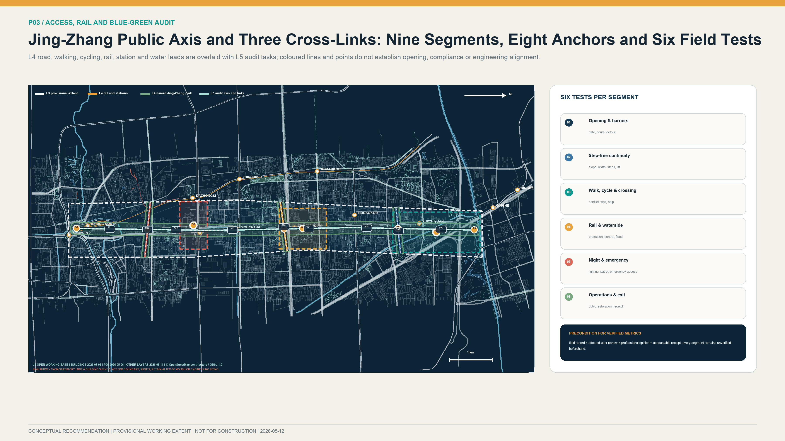

## Blue-Green Network, Public Space, and Urban Character

The Blue-Green Space system is represented in three levels. L2 records built and engineering status for Jing-Zhang Railway Heritage Park, while L4 assists in identifying Qinghe, Xiaoyue River, Zhuanhe, and the open road network.[source:PARK-PHASE1] [source:PARK-PHASE2] [source:OSM-WORKING-DATA]

L5 proposes connections between the longitudinal axis and three lateral corridors.[data:geometry/green_space.geojson#GREEN-V2-001] River blue lines, management areas, flood levels, ecological banks, and maintenance access are not yet available. All waterfront activities, lighting, and installations are therefore reversible and subject to specialist water, flood-control, and maintenance review.[depth:blue_green_public_space]

Public Space expresses AI-governance requirements through disclosure across the full process. Each project shall disclose the entity that submitted the demand, the scope of data use, the reviewing entity, test findings, maintenance responsibility, evaluation period, and methods for appeal and exit. The night-time environment shall control glare, the scale of media installations, and dynamic lighting. Materials shall be repairable, replaceable, and low-reflectance, and shall be compatible with the railway-heritage setting.

### Walkable Cultural Narrative and Responsibility Record

A three-chapter Engineering–Innovation–Responsibility walk is proposed along the Jing-Zhang public axis. It binds cultural resources, innovation methods, and AI public responsibility to accessible, correctable, and removable spatial carriers rather than treating history as technological decoration.

| Narrative chapter | Candidate carrier | Content and accessible form | Review and stop rule |
|---|---|---|---|
| Jing-Zhang engineering culture: understand connection through evidence | Zhongzhiyuan Validation-Outcomes Display Corridor | Rights-cleared historical nodes, engineering questions, measurement, testing, and correction; easy-read text, tactile mileage, paper leaflet, and bilingual captions | Heritage, history, and curatorial review; do not publish material with unclear rights or unlabelled contested facts |
| Zhongguancun innovation culture: organise collaboration through open problems | AI Origin Collaborative Innovation Courtyard | Problems, differing views, rejectable PoC, contribution, reproduction, and non-adoption reasons; paper and digital problem walls operate in parallel | Intellectual-property, participation, and editorial review; pause completion display while major objections remain unanswered |
| AI public-responsibility culture: disclose limits, failure, and exit | Dazhongsi Jing-Zhang Innovation Transformation Gateway | Data boundaries, human final review, pass/restrict/correct/stop/no-procurement states, and 90/180-day outcomes | Technical, data, legal, accessibility, and ethics review; a serious incident or erroneous statement triggers withdrawal and correction |

The proposed RailWeave Responsibility Record ranks neither traffic, contracts, nor success alone. It separately preserves public-problem contribution, independent validation, learning from failure and correction, and responsible exit. Full chapters, carriers, accessible forms, and correction rules are in `visual/assets/culture_storyline.json`.

### Three Public Innovation Display Nodes

1. **Zhongzhiyuan Validation-Outcomes Display Corridor**: Located within the Provisional action area for the priority project, this node uses reversible display structures to present findings of pass, restricted use, rectification, and stop. Public content is limited to non-sensitive information, while professional logs remain in a controlled environment. The node strengthens the connection between the Open Validation Demonstration Park and the Jing-Zhang Public-Space Axis and does not perform a statutory certification function.[data:geometry/public_space.geojson#PUBLIC-V2-001]
2. **AI Origin Collaborative Innovation Courtyard**: Displays community needs, research responses, PoC progress, differing views, and exit records in one place. Movable learning facilities and a paper demand wall ensure that people who do not use intelligent devices can participate on equal terms.[data:geometry/public_space.geojson#PUBLIC-V2-002]
3. **Dazhongsi Jing-Zhang Innovation Transformation Gateway**: Uses railway mileage and project identifiers to connect history and culture, scenario demands, testing and validation, contract implementation, and 90/180-day application evaluation, with priority given to outcomes from actual use. Its location, massing, and media format require further study against Transit-Station Integration, property-right, fire-safety, and heritage-protection requirements.[data:geometry/public_space.geojson#PUBLIC-V2-003]

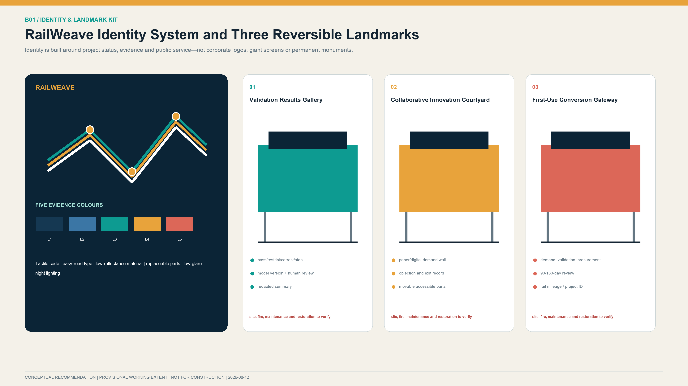

The three landmarks use one family of replaceable parts, tactile codes, easy-read text and low-glare lighting. Corporate master branding and continuous-tracking equipment are excluded. The Validation Results Gallery shows pass, restricted-use, corrective-action and stop states. The Collaborative Innovation Courtyard retains paper demand, objection and exit records. The First-Use Conversion Gateway explains the chain from demand and validation through lawful procurement, launch and post-review. No element proceeds to permanent construction until daily maintenance, night management, content rights, data boundaries and removal and restoration responsibility are clear.

All three nodes are L5 low-impact design recommendations. Their development scale and visual effect shall be controlled to avoid oversized landmark structures. The visual identity, type, people, images, and historical material require rights clearance. New structures, lighting, activities, and underground works near Qinghuayuan Station require prior verification of the heritage-protection area, construction-control zone, archaeology, and event-capacity requirements.[source:QINGHUAYUAN-HERITAGE]

## Renewal Projects, Implementation Policy, and Phasing

### Proposed Near-Term Work Package: “One Room, One Lab, One Pool, and Four Manuals”

- **One room**: After site rights, fire safety, operating responsibility, and opening hours are verified, study whether an existing shared ground floor at AI Origin could accommodate demand intake, technical reproduction, outcome-transformation advice, and talent and housing referral functions.
- **One lab**: After site, testing qualifications, and professional conditions are established, study whether an indoor trustworthy testing and validation space at Zhongzhiyuan would be appropriate, prioritising the study of version, energy, offline-operation, and human-takeover tests. High-risk public robotic testing requires a separate specialist assessment.
- **One pool**: After demand, procurement authority, and operating conditions are established, study whether an online scenario-demand list and procurement-compliance advisory mechanism at Dazhongsi would be appropriate, with any physical publication space justified by actual demand.
- **Four manuals**: Lawfully appointed roles could study the preparation of a Multi-Party Governance Charter, Project Admission and Tiered Testing Manual, Data and Personal Information Inventory, and Incident Response, Appeal, and Exit Manual.

### Phased Implementation Packages

| Phase | Core projects | Deliverables | Entry conditions | Adjustment and exit conditions |
|---|---|---|---|---|
| **Proposed Months 0–6 after G0 conditions are met: institutional framework and baseline preparation** | Study one room, one lab, one pool, four manuals, and registers of sites, role types, and service users for the three hubs | Proposed common project identifier; demand-registration, testing, procurement, and exit forms; indicator-baseline survey plan | Site use, on-site responsibility, demand owner, data use, and human fallback are lawfully confirmed | Missing demand ownership, data basis, or exit funding prevents progression to the next gate in this proposal [data:geometry/phasing.geojson#PHASE-V2-001] |
| **Proposed Months 6–18 after G0 conditions are met: controlled prototype validation** | Study 2–3 rounds of PoC and assess model, edge-device, enclosed-environment robotics validation, and low-risk scenario applications | Proposed public test reports, a complete research opinion on lawful procurement or no procurement at present, and quarterly risk and financial records | Reproducible PoC, independent review of key matters, and lawfully confirmed potential application and operations roles | Suspend where incident response is incomplete, human workload materially increases, or budget and operations conditions are insufficient [data:geometry/phasing.geojson#PHASE-V2-002] |
| **Proposed Months 18–36 after G0 conditions are met: evaluation and conditional extension** | Study the need for an improved AI Origin service network, limited open testing at Zhongzhiyuan, and physical conversion and international-exchange functions at Dazhongsi | Proposed five-year project register, professionally developed drawings, and results from two consecutive evaluation cycles | Property-right, planning, fire-safety, heritage, transport, municipal, operating-account, and public-consultation conditions are confirmed through applicable procedures | No extension where actual use is insufficient, continuing funding is absent, risks exceed thresholds, or rights holders do not agree [data:geometry/phasing.geojson#PHASE-V2-003] |

The phases are prioritised by evidence maturity, reversibility, and public benefit. The month count begins only after G0 prerequisites are lawfully satisfied and expresses a proposed relative sequence independent of calendar construction dates. No pilot, budget, international project, or extension is represented as approved; the sequence is outside any government construction schedule or administrative commitment.[depth:phasing_implementation]

### Three Project Registers and Seven Gates

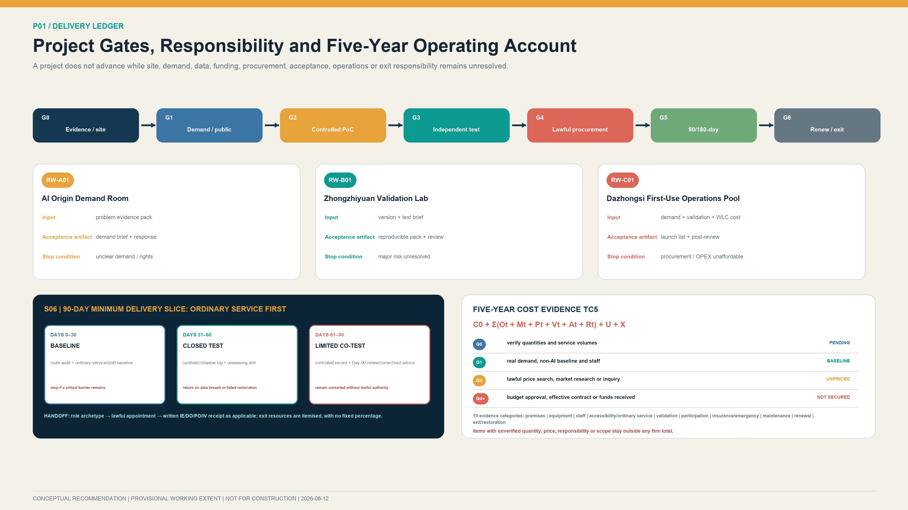

Version 2.2 completes three whole-life registers: `RW-A01` for demand coordination at AI Origin, `RW-B01` for independent validation at Zhongzhiyuan and `RW-C01` for first-use conversion at Dazhongsi. Full records are in `visual/assets/implementation_register.json`. A register does not confirm a site, entity, funding source or procurement outcome; it makes clear which unresolved conditions prevent progression.

| Project | Main inputs | Acceptance artifacts | Proposed funding character | Pause and exit |
|---|---|---|---|---|
| RW-A01 AI Origin Demand Coordination Room | Public sources, user problem, non-AI baseline, site and rights conditions | Demand brief, evidence pack, public response and written PoC admission/rejection grounds | Primarily a public-interest foundational service; source subject to lawful determination | Pause if demand owner/rights are unclear or staffed service cannot be retained; delete data and restore site on exit |
| RW-B01 Zhongzhiyuan Independent Validation Laboratory | Test brief, model/device version, risk level, acceptance and stop conditions | Reproducible pack, version identifier, failure and takeover record, independent opinion and public summary | Shared test base and project validation accounted separately | Stop for unclear provenance, unresolved major risk or conflict; clear data and access on exit |
| RW-C01 Dazhongsi First-Use Conversion and Operations Pool | Real demand, independent validation, market review, whole-life cost and compliance advice | Procurement/cooperation recommendation, launch list, SLA, training, 90/180-day review and exit receipt | Public-interest, validation and market applications accounted separately | Exit if demand disappears, procurement is unavailable, cost is unaffordable or users reject adoption |

All projects follow G0 evidence and site verification, G1 demand and public review, G2 controlled prototype, G3 independent validation, G4 lawful procurement or cooperation, G5 90/180-day post-deployment review, and G6 renewal, corrective action or exit. A project should not advance while the preceding gate lacks responsible roles, deliverables, risk closure or sign-off. The six `PC-V21-*` objects in `geometry/phasing.geojson` assign phases to movable components instead of using an entire key area as a first-stage construction extent.

### Evidence Verification, Responsibility Handoff, and Cost Evidence

`visual/assets/verification_handoff_register.json` converts the G0–G2 phrase “to be verified” into eight transferable tasks: recovery of withdrawn source pages; official boundaries and site rights; continuous opening and accessibility of the Jing-Zhang axis; the AI Origin shared ground floor; controlled-testing conditions at Zhongzhiyuan; actual demand and procurement prerequisites at Dazhongsi; the non-AI service baseline; and written acceptance of G0–G6 duties. The proposed method is role placeholder–lawful appointment–written receipt. A proposed evidence-steward archetype may transfer the question, source, field method, required confirmation, no-go condition and handoff artifact only after lawful appointment. No object is described as implementable until the appointment basis, written receipt and acceptance time are recorded.[metric:verification_handoff_item_count]

`visual/assets/cost_evidence_plan.json` divides the five-year total-cost model into ten evidence categories covering premises and safety, equipment and version renewal, staffing and human takeover, accessibility and ordinary-service equivalence, independent validation, participation, insurance and emergency provision, maintenance and renewal, and exit and restoration.[metric:cost_evidence_item_count] After G0, the site, quantities and service volumes are verified; G1 confirms actual demand and the non-AI baseline; at G4, a lawfully determined procurement, finance and legal role carries out public price research, market research or inquiry under applicable rules and aligns tax, warranty, staffing, energy, maintenance, renewal and exit scopes. Any early service, including G1 participation and G3 independent validation, requires applicable lawful authorisation and an identified funding source before cost is incurred; G4 cannot be used as retrospective approval. Each item exposes machine fields for quantity evidence, dated price samples, comparability adjustments, tax basis, budget or funding, procurement or contract documents and confirmation status; empty values explicitly mean not evidenced. An item with unverified quantity, unit price, accountable entity or service scope stays outside any firm total. No amount is secured before budget approval, effective contract or actual receipt of funds. Staffed service, accessibility, appeals, independent review, maintenance and exit are necessary costs and may not be removed merely to lower a quotation.

To avoid an empty pricing register, S06 records two official Beijing project-level public samples from 2026. A human guide service for people with visual disabilities had a contract value of CNY 441,500 for at least 3,000 service events and up to one year. An accessibility home-adaptation audit had a CNY 170,000 budget and ceiling for 1,000 home inspections, 4,000 telephone surveys, and follow-up on prior issues over six months.[source:BJ-ACCESS-GUIDE-SERVICE-2026] [source:BJ-ACCESS-HOME-AUDIT-2026] They identify future inquiry objects and project scale only. Neither is converted into a unit rate or pro-rated into an S06 amount, and neither is a budget, government guidance price, or procurement outcome for this proposal. A CNY 360,000 accessibility-evaluation ceiling without a quantity denominator is retained as context only, while a 2020 fixed illuminated-signage sample is expressly rejected because its date, specification, and line-price basis are not comparable.[source:BJ-ACCESS-EVALUATION-2026] [source:BJ-HOSPITAL-SIGNAGE-2020] G4 cost review requires verified points, hours, shifts, user sample, and acceptance requirements, followed by at least three contemporaneous comparable quotations.

### Organisation, Funding, Operations and Participation

A proposed mechanism combines district-level coordination, local collaboration, responsibility of the legally determined implementation entity, demand-owner leadership, professional review and public oversight. RACI covers eight role types: coordination; implementation or site rights; demand or application; technology and operations; independent validation; data security; procurement, finance, legal and audit; and public/user oversight. Each activity should normally have one accountable role. Organisations and authority boundaries remain subject to lawful procedures, agreements and procurement outcomes.

Site area, equipment lists, concurrency, staffing and market quotations remain unknown, so no fixed RMB investment conclusion is offered. Five-year total cost uses `TC5 = C0 + Σ(Ot + Mt + Pt + Vt + At + Rt) + U + X`, covering initial configuration, staffing and operations, technology/computing/software, premises and facilities, independent validation, participation and accessibility, insurance and emergency provision, mid-term renewal, and exit and restoration. Concept-stage bands for technology/premises, staffing/operations, independent validation/compliance, participation/accessibility and insurance/emergency/exit may overlap and shall not be added into a quotation. Funding is not secured before budget approval, an effective contract or receipt of funds.[source:BEIJING-URBAN-RENEWAL] [source:HAIDIAN-RENEWAL-GUIDE]

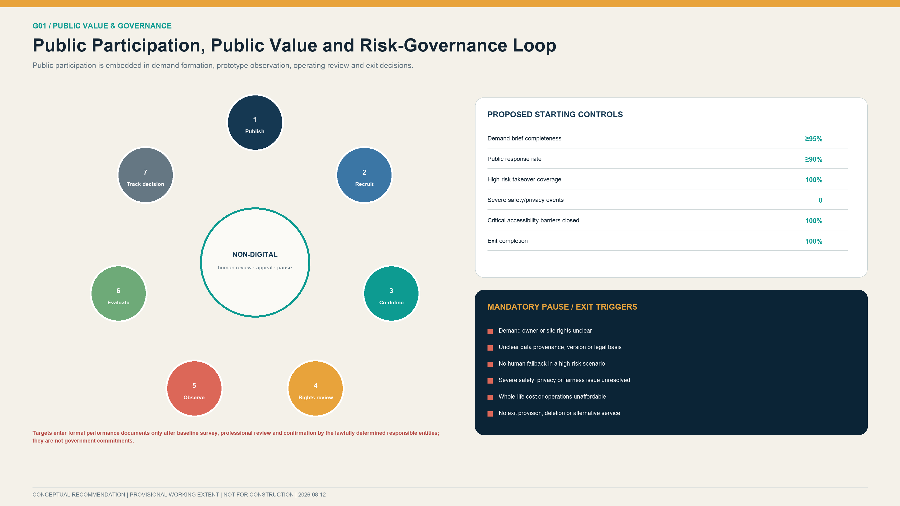

Participation follows seven stages: publish the issue, recruit representatively, co-define, review rights and data, observe in a controlled setting, evaluate publicly, and decide and track. Online, in-person, paper, telephone and staffed channels operate in parallel, with appropriate support for older people, disabled people, minors and other groups requiring additional protection. Participation does not replace personal-data consent, site-rights consent or statutory approval. Major objections require an itemised response; higher-risk matters retain a public pause recommendation, independent review and appeal route.

### Annual Operations and International Communication

Annual operations follow one chain: problem intake, independent validation, first-use conversion, public-value review, and unweaving archive. The names below are candidate operating brands, not confirmed events, sites, or calendar dates.

| Annual operation | Core space and gate | Key delivery | Performance and exit decision |
|---|---|---|---|
| Jing-Zhang Open Problem Season | AI Origin; only G0/G1 work may enter PoC | Demand brief, non-AI baseline, public response, and reason not to enter PoC | Valid demand, response to major objections, and retained ordinary service; exit where demand/rights are unclear |
| Trusted Validation Open Week | Zhongzhiyuan; G2/G3 controlled reproduction and bounded public observation | Reproducible test pack, failure and takeover record, independent finding, and redacted summary | Reproducibility, record completeness, and human takeover; stop for an unresolved major issue or conflict |
| First-Use Evidence Season | Dazhongsi; G3/G4 connect to a lawful pathway | Market review, whole-life cost, and written procurement/cooperation or no-procurement opinion | Record legal pathway and actual use separately; exit without an application owner or budget/procurement authority |
| 90-Day Public Value Review | Actual deployment and public-review interface; G5/G6 determine renewal, correction, or exit | Actual use, failure and appeal, human workload, ordinary-service equivalence, and unresolved actions | Sustained use, appeal closure, and incident recovery; exit for safety/privacy events or unavailable maintenance/exit resources |
| RailWeave Unweaving and Public Knowledge Yearbook | Three-hub bilingual archive; only projects with complete G6 responsibility handoff | Failure and exit cases, reusable problem/test templates, and contribution/correction record | Exit completion, accountability closure, and archive access; do not publish unclear rights or sensitive information |

The developer community handoff chain is: co-understand an open problem; submit a fixed version and reproducible pack; undergo independent review; develop an application opinion under comparable multi-team and lawful procedures; co-review actual use; and retain cleared public knowledge. Participation creates no procurement preference, supplier qualification, investment commitment, or deployment permission. The full register is in `visual/assets/annual_operations_register.json`.

International communication uses publication-review boundaries aligned with each annual operation. `AO-01` publishes a bilingual open problem and non-AI baseline only after rights, privacy and data review. `AO-02` publishes only a redacted finding, applicability limits and unresolved matters. `AO-03` separates the application pathway from a procurement decision and does not describe display, testing or participation as adoption. `AO-04` publishes only aggregated actual-use, failure, appeal, correction and exit information after redaction, privacy and rights review. `AO-05` compiles the yearbook and reusable templates only after copyright, intellectual-property, cross-border-data and export-control review. Material that fails any review is not published, and correction, withdrawal and version records remain available.

International communication uses bilingual project archives, open problem lists, reproducible findings and failure records. Cross-border data, export controls, intellectual property and cooperation require separate lawful review. Visitor numbers, signatures and institution names do not imply that a partnership has been secured.[source:CASE-BLOXHUB]

## Metrics, Area Recalculation, and Compliance Matrix

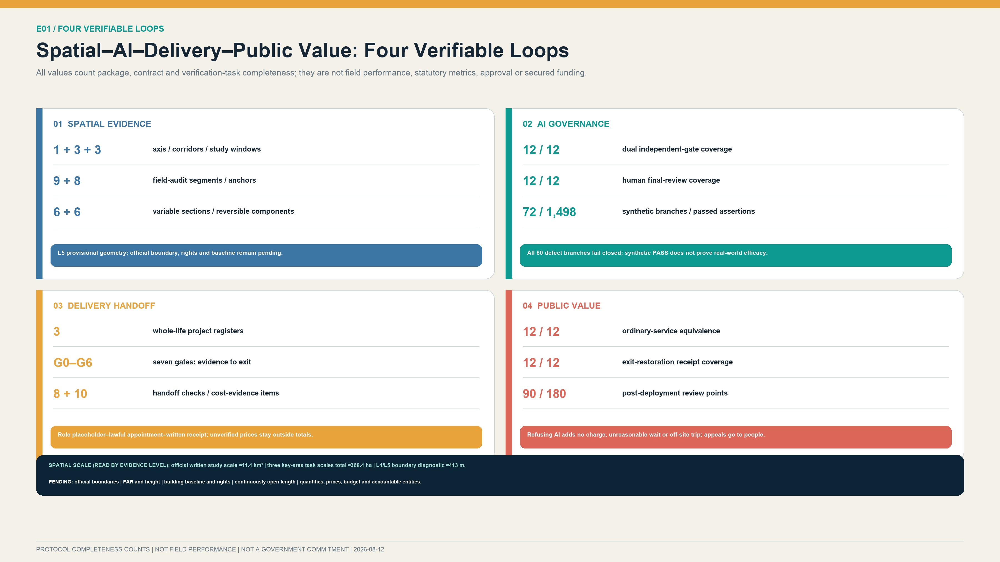

The indicator system has four categories: official baselines, open-data-assisted assessment, L5 plan indicators, and implementation performance. Every ratio reports its numerator and denominator, and suspended, terminated, and exited projects remain in the statistics.

To satisfy the repository's current static-visual review contract, `metrics.json` retains `site_area_sqm`, `green_ratio` and `public_space_ratio` as deprecated compatibility aliases for the provisional working-extent area, conceptual blue-green network envelope ratio and conceptual action-envelope ratio respectively.[metric:site_area_sqm] [metric:green_ratio] [metric:public_space_ratio] The legacy identifiers do not recover statutory-planning meaning and shall not be cited as an official site area, green-space ratio or public-space ratio. External interpretation must use the corresponding new names, L5 evidence level and non-official limitations.

| Indicator group | Indicator | Definition and status | Management use |
|---|---|---|---|
| Official baseline | Number of Key-Area Detailed Design Areas and scenario modules | Three Key-Area Detailed Design Areas and twelve scenario modules are known counts [metric:key_area_count] [metric:scenario_card_count] | Verify task coverage; does not confirm a boundary or constitute project approval |
| Open-data assessment | Length of continuously open accessible network | `field-verified step-free open network length`, currently to be verified [metric:continuous_open_greenway_length_m] | Evaluate the actual level of continuous public access across the Walking and Cycling Network |
| L5 internal recalculation | Provisional working extent, blue-green envelope, action envelope and audit alignment | Recorded as `provisional_working_extent_area_sqm`, `conceptual_blue_green_network_envelope_ratio`, `conceptual_action_envelope_ratio` and `conceptual_audit_alignment_length_m` | Internal consistency only; these are not green-space ratio, public-space ratio, road length or verified open length |
| L5 project | Number of priority projects and lateral corridors | Three priority projects and three lateral corridors are plan counts [metric:flagship_project_count] [metric:crosslink_count] | Check the completeness of the three core functional hubs and overall structure |
| Protocol completeness | Dual gates and human review | Both are covered in 12/12 contracts [metric:dual_independent_gate_coverage_ratio] [metric:human_review_contract_coverage_ratio] | Check mandatory contract fields only; not proof of field execution or performance |
| Protocol completeness | Ordinary-service equivalence and exit-restoration receipts | Both are covered in 12/12 contracts [metric:ordinary_service_equivalence_coverage_ratio] [metric:exit_restoration_receipt_coverage_ratio] | Check mandatory contract fields only; not proof of field execution or performance |
| Delivery handoff | Project registers and stage gates | 3 registers and 7 gates [metric:implementation_register_count] [metric:stage_gate_count] | Check chain completeness; does not establish projects or appointed entities |
| Delivery handoff | Verification handoff and cost evidence | 8 verification tasks and 10 cost-evidence items [metric:verification_handoff_item_count] [metric:cost_evidence_item_count] | Check evidence continuity; does not establish funding, pricing or procurement |
| Implementation performance | Valid-demand rate | Number of projects passing demand verification ÷ total submissions; set a target after the baseline survey | Avoid scenarios without identified service users and actual demand |
| Implementation performance | PoC reproducibility rate | Number successfully reproduced by a third party ÷ number submitted for testing | Assess the quality of evidence moving from AI Origin to Zhongzhiyuan |
| Implementation performance | Test-file completeness rate | Number of projects completing all mandatory fields ÷ number of projects with a finding | Completeness does not indicate technical approval but is a procedural threshold |
| Implementation performance | Human-takeover success rate | Number of takeover exercises completed within the required time ÷ total exercises | Quantify human-takeover and operations and maintenance capacity |
| Implementation performance | Appeal-closure rate | Number answered and recorded within charter time limits ÷ appeals due | Report “answered” and “resolved” separately |
| Implementation performance | Post-validation application rate | Number entering a lawful contract or deployment ÷ validated projects with an identified application entity | Record projects without an application entity separately; contract signature does not substitute for actual-use evaluation |
| Implementation performance | 90-day active-use rate | Deployments still in actual use after 90 days ÷ deployments that have reached 90 days | A signed but unused deployment counts as zero |
| Implementation performance | Five-year operating gap | Five-year OPEX + renewal and maintenance − confirmed income / purchased services / contributions | Exclude unconfirmed income; use the result to determine whether expansion should proceed |

The following figures are proposed starting controls, not government commitments or approved performance targets. A baseline survey comes first; targets are then reviewed by the legally determined responsible entities and professional bodies. Failure to meet safety, public-interest or continued-use thresholds triggers restriction, correction, pause or exit.

| Starting control | Proposed band / threshold | Frequency | Corrective action |
|---|---|---|---|
| Demand-brief completeness | ≥95% | Each batch | Return incomplete cases; no PoC |
| Public-response rate | ≥90%; status stated for 100% of major objections | Each round | Complete response; pause gate if necessary |
| Retention of non-digital service | 100% for essential public services | Monthly | Pause launch and restore alternative service |
| PoC reproducibility | Proposed 80%–90% | Each batch | Freeze version, retest, restrict or stop |
| Human-takeover coverage for higher-risk scenarios | 100% | Before launch and quarterly | No launch or immediate restriction |
| Severe safety or privacy incidents | 0; any event triggers special review | Real time / monthly report | Stop, notify, remediate and independently review |
| 90-day continued use | Proposed 60%–80% | Per project at 90 days | User review, adjustment or stop |
| 180-day continued use | Proposed 50%–70% | Per project at 180 days | Renew, replace or exit |
| Critical accessibility barriers closed | 100% before launch or equivalent service provided | Before launch / quarterly | Delay launch |
| Exit completion | 100%, covering data, contract, equipment, site and alternative service | Each exit | Keep register open and continue remediation |

Floor Area Ratio (FAR), Building Height, development scale, municipal capacity, verified continuously open length, verified step-free length, accessible-crossing rate and building-inventory coverage remain to be verified. `building_footprint_area_sqm` does not use the v1 conceptual Building Footprint value.[metric:building_footprint_area_sqm] [depth:development_intensity_controls] Topology, synthetic regression and internal self-checks establish only structural completeness of the digital package or rule logic; they do not demonstrate field implementability. `design_depth_matrix.status=complete` means that an item has a reviewable submission response. Design readiness, evidence ceiling and missing inputs are recorded separately in `current_depth`, `evidence_ceiling` and `blocking_inputs`.[depth:metrics_recalculation] [depth:risk_missing_data]

## Risk, Copyright, and Compliance

### Highest-Priority Publication Risks (P0)

1. **A provisional working extent is misread as a statutory boundary**: `SITE-001` and the three Key-Area Detailed Design Areas shall be prominently marked “research index; official boundary unavailable.” Figures shall not be published until the legend and linework distinguish statutory boundaries, provisional working extents, and design recommendations.[source:BOUNDARY-SOURCE] [source:KEY-AREA-SOURCE]
2. **Conceptual functional components are misread as a building design**: One room, one lab, one pool, and the three display nodes are represented only as project interfaces and Provisional action areas. Building Footprints and development scale shall not be determined before building surveys and approval conditions are in place.
3. **Local implementation data are used beyond their scope**: Local area, scale, height, and traffic data for Lanjing Lijia shall be bounded by a bold line showing their scope of application and shall not be used to calculate indicators for the Dazhongsi area or the Overall Design Area.[source:LANJING-IMPLEMENTATION] [source:LANJING-TRAFFIC]
4. **Engineering completion is confused with public-access status**: Completion of the Phase II supporting project does not establish that the full approximately 9 km corridor is continuously open. Public access, barriers, and accessibility shall be recorded section by section.[source:PARK-PHASE2]
5. **Heritage, water, railway, and rail-transit safety conditions are absent**: Where formal coordinates are unavailable for Qinghuayuan Station, rivers, underground railways, Line 13, and roads, the plan does not determine permanent equipment, bridges and tunnels, crossings, or underground works.[source:QINGHUAYUAN-HERITAGE]
6. **Digital deliverable checks are confused with professional design depth**: Internal checks of JSON, topology, and rendering do not establish that the work has reached the depth of Regulatory Detailed Planning, an Integrated Planning Implementation Plan, or architectural design.[standard:MOHURD-CONTROL-DETAILED-PLANNING]
7. **Open-data accuracy and existing-condition verification are insufficient**: The open basemap is used only as a working basemap and field-survey index. The archived calculation value is approximately 412.684 m, displayed to the nearest metre as approximately 413 m, registered as a source conflict, and not used to amend a statutory boundary. Property rights, structure, fire safety, use, station entrances, pedestrian volumes, and accessibility shall be determined through official inputs, site surveys, and professional verification.[source:OSM-WORKING-DATA] [source:SPATIAL-SOURCE-CONFLICT-REGISTER] [data:visual/assets/spatial_source_conflicts.json#SC-OSM-SITE-001]
8. **AI concept images are mistaken for baseline or engineering design**: The three scene images explain intended spatial experience only. Each retains an “AI-generated concept image; not baseline evidence” notice and does not determine location, architecture, landscape, people, investment or built effect.
9. **Conflicts among testing, procurement and commercial conversion**: A tested supplier may not issue the independent finding alone. Test results do not predetermine procurement method, supplier or award; conflicts and recusals are disclosed.
10. **Cybersecurity, minors and labour impacts**: Projects involving cyberattack exposure, children’s data or frontline work organisation require separate assessment. Worker-performance profiling, covert monitoring and automated decisions do not replace duties assigned to people.
11. **Supplier exit and operating continuity**: Contracts and architecture retain data export, restoration of human service, alternative service, equipment return, access revocation and site restoration. Proprietary interfaces do not create an inescapable dependency.
12. **Synthetic tests are mistaken for field outcomes**: The 72 synthetic branches test weave-contract logic only. They do not establish accuracy, safety, public acceptance, legal compliance or actual use.

### AI Governance, Personal Information Protection, and Public Responsibility

All public services shall retain human decisions and non-intelligent service channels and shall provide clear notice, withdrawal, and appeal mechanisms. Covert facial recognition, continuous identity tracking, and emotion or behaviour profiling without consent are prohibited, and algorithms shall not replace statutory duties. Public data and school, medical, and park data shall not be combined without authorisation merely because they relate to the same innovation belt. Projects involving personal data, higher-risk AI, public safety, minors or cross-border data require a clear opinion from the lawfully determined data-control, security and professional-responsibility roles. Technology suppliers register versions, data, energy, maintenance, incident response, insurance, labour impacts, intellectual property and exit responsibility, and participate through applicable fair procedures.[source:BEIJING-SCENARIO-DEMAND]

### Copyright and Open Licensing

The main text, participant-generated GeoJSON, information design, HTML, booklets, verification script and synthetic cases are licensed under CC BY 4.0. The v2.2 spatial figures embed selected L4 OSM vector snapshots and retain the data date, `© OpenStreetMap contributors`, and ODbL 1.0 attribution on every relevant figure; no commercial map tiles are used. Building footprints are orientation leads only, and named Jing-Zhang park polygons are used only to expose the provisional-extent discrepancy; neither enters participant-generated formal GeoJSON or indicators. Three key-area experiential images were created with OpenAI image generation from original prompts for this proposal and are used as language-neutral concept images. Their prompts, generated status, limits of use and file list are recorded in `report/copyright_statement.md`. The project does not reproduce restricted news images, corporate marks, or peer-proposal text, figures, schemas or code. Institutional names identify sources or possible types of entity only and do not indicate participation, authorization, endorsement, or commitment.[source:SOURCE-REGISTRY] [source:OSM-WORKING-DATA]

## References

### L1 / L2 / L3 Official Tasks, Planning, Renewal, and Engineering Facts

- Open Call announcement for the Centennial Jing-Zhang AI Innovation Belt: defines the approximate scales, written scopes, and tasks for the three planning levels; official vector boundary data have not been obtained.[source:OFFICIAL-ANNOUNCEMENT]
- Notice concerning accepted matters in Regulatory Detailed Plans for blocks including `HD00-1601` along the Jing-Zhang corridor: supports only the existence of the plans and the published accepted matters.[source:JINGZHANG-CONTROL-NOTICE]
- Historical urban-renewal notices for Zhongzhiyuan and Dazhongsi: the links are now withdrawn or deleted and are retained only as search leads pending an official archive or cleared attachment; they do not support boundaries, entities, parcel-level Demolish–Renovate–Retain decisions, or implementation conclusions.[source:ZHONGZHIYUAN-RENEWAL] [source:DAZHONGSI-RENEWAL]
- Lanjing Lijia implementation and transport material: valid only within the corresponding local implementation unit.[source:LANJING-IMPLEMENTATION] [source:LANJING-TRAFFIC]
- Official information for Phases I and II of Jing-Zhang Railway Heritage Park: records construction and public-access status by section; Phase II material does not establish continuous public access to the entire corridor.[source:PARK-PHASE1] [source:PARK-PHASE2]
- Qinghuayuan Station heritage-protection requirements: the written requirements may be used, while formal coordinates still need to be obtained.[source:QINGHUAYUAN-HERITAGE]
- AI Origin Community and talent-service station: support the distributed-facility and human–AI service models; do not constitute spatial authorization.[source:AI-ORIGIN-2026] [source:AI-ORIGIN-TALENT-STATION]
- Haidian 2025 statistical bulletin and Beijing scenario-demand mechanism: support a district-level innovation-system baseline and the scenario mechanism; do not support extrapolation of enterprise numbers or budgets to the corridor.[source:HAIDIAN-STATS-2025] [source:BEIJING-SCENARIO-DEMAND]
- Beijing Urban Renewal Regulations and Haidian implementation guidance: support requirements for implementation entities, consultation with rights holders, funding, and operations.[source:BEIJING-URBAN-RENEWAL] [source:HAIDIAN-RENEWAL-GUIDE]

### L4 Open-Data Working Basemap

- OpenStreetMap roads, walking and cycling routes, railways, stations, and waterways are dated 2026-08-11; buildings are dated 2026-07-08; POIs are dated 2026-05-06. All are governed by ODbL. Figures load filtered main roads, walking and cycling routes, operational railways, named stations, waterways, building footprints, and named Jing-Zhang park polygons. Buildings serve as orientation leads and park polygons serve only for extent-discrepancy diagnosis; neither enters participant-generated formal GeoJSON or indicators.[source:OSM-WORKING-DATA]

### L5 Taskbook, Design Package, and Professional Standards

- `brief/site-package/`, the agent taskbook, and the Source Registry.[source:SITE-PACKAGE] [source:AGENT-TASKBOOK] [source:SOURCE-REGISTRY]
- The project announcement, Agent taskbook, and urban-design administration requirements establish the task and Urban Design basis.[standard:PROJECT-OFFICIAL-ANNOUNCEMENT] [standard:PROJECT-AGENT-OPEN-CALL-TASKBOOK] [standard:MOHURD-URBAN-DESIGN-MEASURES]
- Regulatory Detailed Planning, territorial spatial land-use classification, and architectural-design-depth standards define the limits of representation.[standard:MOHURD-CONTROL-DETAILED-PLANNING] [standard:MNR-LAND-USE-CLASSIFICATION-GUIDE] [standard:MOHURD-ARCH-DESIGN-DEPTH-2016]
- The Vector Institute, Mila, and Station F cases are used only to compare AI innovation-system organisation mechanisms.[source:CASE-VECTOR-TORONTO] [source:CASE-MILA-MONTREAL] [source:CASE-STATION-F]
- The Maria 01 and MaRS cases are used only to compare spatial operation and transformation-service mechanisms.[source:CASE-MARIA-01] [source:CASE-MARS-TORONTO]
- The 22@Barcelona and BLOXHUB cases are used only to compare innovation-district and public-value mechanisms.[source:CASE-22BARCELONA] [source:CASE-BLOXHUB]

Review of this plan focuses on distinguishing formal bases, official written scopes, open data, design recommendations, and information to be supplemented, and on establishing a corresponding update and recalculation process. All spatial recommendations are L5 design recommendations for plan research and subsequent development only (not a basis for construction / NOT FOR CONSTRUCTION). They do not replace statutory planning, government approval, engineering-feasibility studies, procurement outcomes, or investment commitments.[depth:risk_missing_data]
