# 轨迹织城：百年京张 AI 创新带城市更新与协同转化方案

“轨迹织城 / RailWeave Open City”以京张铁路历史脉络为基础，统筹科技创新、城市更新和公共治理三类工作逻辑。方案坚持存量提质、创新协同、审慎实施，提出“一轴三廊三核、三链协同”的总体思路，推动创新需求提出、技术测试验证、场景应用转化全过程衔接，建设开放共享、责任清晰、安全可控的百年京张 AI 创新带。

### 评审首屏摘要：城市织体与可退出 AI 线程

本方案的不可替换命题是：**以京张公共空间和普通公共服务构成持续可用的“城市织体”，以单项 AI 服务构成可准入、可暂停、可解编的“技术线程”**。空间成熟不等于 AI 自动准入，算法测试通过也不等于场地可以实施；每项场景必须分别通过织体成熟门和线程准入门，并在退出后保留可用的人工、纸质、电话、固定导视或其他普通服务。

| 评审维度 | 本方案回答 | 可核验交付 | 证据上限 |
|---|---|---|---|
| 空间与任务书 | 一轴三廊三核串联需求组织、独立验证和首用转化 | 9 个核查分段、8 个锚点、6 组变量剖面、6 个可逆组件 | 均为 L5 研究任务；正式边界、现状、权利和工程条件待核 |
| AI 与规划创新 | AI 作为“线程”进入既有城市织体，实行双独立门、人工最终决定和失败关闭 | 12/12 契约双门覆盖；72 个合成分支、1498 条断言 | 仅证明提交协议逻辑，不证明真实有效、合法或安全 |
| 实施接续 | 三份项目台账按 G0—G6 推进，并补足证据、责任、工程量、取价、预算和退出接续 | 3 份项目台账、8 项核查接续、10 项成本取证、90/180 日复核 | 角色尚未依法任命；金额未取证，不构成预算或采购结果 |
| 公共利益 | 拒绝 AI 不增加费用、不合理等待或异地行程；保留人工复核、普通服务、申诉和退出回执 | 12/12 人工复核、普通服务等价和退出恢复回执覆盖 | 覆盖率为契约字段完整度，真实服务等价须与受影响用户共同核验 |

**一名需要无障碍支持且选择不注册账号的访客的一天。** AI 关闭时，访客仍可通过固定导视、纸质资料、电话和人工服务完成到达与咨询；自愿启用 AI 时，系统只提供建议，由人工处理例外、决定和申诉；出现断网、错误引导、版本漂移或数据越界时，线程立即阻断，人工接管并恢复普通路径，访客不承担额外费用或不合理延误；到 90/180 日复核或项目退出时，依法完成访问撤销、数据处置、设备撤离、场地恢复和替代服务确认，普通服务继续存在。该旅程是 S06 的设计验收逻辑，不是已经发生的现场绩效。

根据现有公开资料，京张公共空间已具备分段建设和持续推进基础。[source:PARK-PHASE1] [source:PARK-PHASE2]

众智园、大钟寺两条历史检索记录所指页面，截至 2026 年 8 月 12 日已撤稿或删除，现不具备可复核条件；本方案不采信其中任何具体范围、主体或实施信息。AI 原点的分布式创新载体和服务网络仍有可访问的官方公开信息支撑。[source:ZHONGZHIYUAN-RENEWAL] [source:DAZHONGSI-RENEWAL] [source:AI-ORIGIN-2026]

现阶段尚缺官方 GIS、宗地权属、统一时点建筑调查、完整道路红线以及河道、轨道安全条件等基础资料。本方案据此严格区分已确认事实、规划研判和设计建议，围绕空间布局、运营机制、数据治理、责任主体、资金安排和退出恢复建立可衔接后续专业深化的项目框架。[depth:existing_conditions_diagnosis]

本方案现阶段定位为开放共创的城市设计研究成果。约 11.4 平方公里临时工作边界仅用于方案组织和技术校核；功能组件符号仅表达空间接口，不代表现状或拟建建筑；AI 生成概念图不作为现状、场地或工程证据；结构化自检与合成回归结果不替代法定规划、现场调查、合规审查和工程可行性论证。参与者原创设计内容按 CC BY 4.0 开放，第三方资料按照许可条件和适用范围引用。[source:SOURCE-REGISTRY]

v2.2 将“轨迹织城”从空间概念进一步转化为项目执行规则。每项场景同时通过“织体成熟门”和“线程准入门”：前者核验空间、权利、专业条件、运维和资源，后者核验公共目的、数据边界、人工复核、普通服务等价、申诉和到期退出。任一门未通过，不因另一门条件成熟而进入部署。`visual/assets/weave_contracts.json` 对十二类场景逐项登记织入条件与解编触发，离线验证脚本使用合成案例检查规则一致性；其 PASS 只说明协议逻辑可复跑，不证明现场服务质量、技术安全或法律合规。

## 设计依据与资料清单

### 五级证据与表达上限

各章节统一按照“现状依据、规划研判、工作建议、深化条件”组织。不同来源资料叠加使用不改变其证据等级，例如官方文字四至与 OSM 道路关系相符，仍不得据此形成法定红线。

| 等级 | 定义 | 允许表达 | 图面规则 | 本方案典型 |
|---|---|---|---|---|
| **L1 正式法定或批准依据** | 经批复、正式划定或正式审核且机构具有直接职权 | 仅在文件适用地块/河段内使用“已批复、正式划定、审核要求” | 只有取得正式坐标或附图才画实线 | 清华园车站文字保护要求；蓝景丽家局部实施资料，均不得外推 [source:QINGHUAYUAN-HERITAGE] [source:LANJING-IMPLEMENTATION] |
| **L2 官方项目事实与阶段状态** | 政府或法定运营主体发布的工程、更新和阶段统计 | 使用“截至某日官方口径显示”，保留日期与项目范围 | 点划线节点或已实施区段，不代替法定界线 | 京张公园一期、二期配套项目 [source:PARK-PHASE1] [source:PARK-PHASE2] |
| **L3 官方文字范围与示意关系** | 官方约面积、文字四至或范围语义，无可量测坐标 | 使用“研究尺度约为、文字四至为、图中仅作索引” | 宽虚线、色晕和箭头；非法定边界 | 43.6 km²、11.4 km²、368.4 ha 约规模，原点约 3 km² 网络 [source:OFFICIAL-ANNOUNCEMENT] [source:AI-ORIGIN-2026] |
| **L4 开放数据工作底图** | OSM 等非测绘、非法定开放资料 | 可识别候选道路、建筑、水系、POI和踏勘对象 | 灰色底图，注明日期、许可和误差 | OSM 路网、水系、站点为 2026-08-11，建筑为 2026-07-08，POI 为 2026-05-06 [source:OSM-WORKING-DATA] |
| **L5 设计建议与临时几何** | 本方案生成的策略、功能接口、概念线路和模拟值 | 统一使用“建议、概念性、待核验后实施” | 高辨识建议色；`NOT FOR CONSTRUCTION` | 一轴三廊三核、三项重点示范项目、临时工作范围与概念性联系廊道 [source:BOUNDARY-SOURCE] [source:KEY-AREA-SOURCE] |

目前 `geometry/constraints.geojson` 为空，只说明没有取得可提交的正式约束坐标，并不代表现场无文保、河道、道路、铁路、轨道或市政约束。[data:geometry/constraints.geojson#DATA-GAP-REGISTER] 众智园和大钟寺两项历史公示链接已撤稿或删除，现仅登记为背景检索线索，不纳入当前 L2/L3 可采信证据；恢复页面、官方归档或清权附件到位后方可复核使用。正式来源、仓库资料、开放底图和参与者设计分别登记在 `sources.json`、`assumptions.json` 与随包交付的 `visual/assets/source_registry.json`；`visual/assets/fact_index.json` 仅作为资料导航，不作为新增权威来源。[source:SOURCE-REGISTRY] [source:PROCESSED-FACT-PACK] 任务响应、专业标准和深度上限对应 `compliance_matrix.json`、`standard_matrix.json` 与 `design_depth_matrix.json`。[source:SITE-PACKAGE] [standard:PROJECT-OFFICIAL-ANNOUNCEMENT] [standard:MOHURD-URBAN-DESIGN-MEASURES]

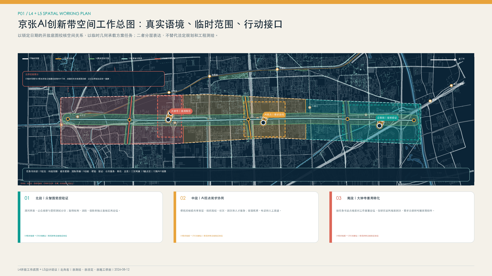

### 现状基础与待补充资料

- **已掌握资料**：征集公告明确三层研究尺度和三处重点区域任务，`HD00-1601` 等街区控规及部分采信事项已公开。[source:OFFICIAL-ANNOUNCEMENT] [source:JINGZHANG-CONTROL-NOTICE]
- **已掌握资料**：京张公园一期已实施，二期配套项目已完成，连续开放状态尚需现场核实。[source:PARK-PHASE1] [source:PARK-PHASE2]
- **不可复核的历史线索**：众智园、大钟寺两条原检索链接现已撤稿或删除，不采信其具体内容，不用于支撑空间或实施结论；AI 原点约 3 km² 分布式创新网络另有可访问官方信息支撑。[source:ZHONGZHIYUAN-RENEWAL] [source:DAZHONGSI-RENEWAL] [source:AI-ORIGIN-2026]
- **开放底图校核提示**：L5 临时工作范围与 L4 具名“京张铁路遗址公园”多边形不重叠；以 2026-05-06 OSM 具名公园多边形和 `SITE-001` 为输入，在 EPSG:4547 下计算的平面最短边界距离留档值约 412.684 米，按整米显示为约 413 米。完整多边形、最近点、查询条件、方法和限制随包登记。该结果仅用于暴露资料冲突，不是测绘或边界结论；正式边界到位后须统一重算。大钟寺工作窗依据任务书具名站点线索和 L4 站点位置作近似平移，保持经纬度跨度，投影面积较原工作窗变化约 0.027%，并控制在 `SITE-001` 临时范围内；具名站点约位于工作窗西侧 90 米，仍不代表正式重点区边界、站口或工程定位。[source:KEY-AREA-SOURCE] [source:SPATIAL-SOURCE-CONFLICT-REGISTER] [data:visual/assets/spatial_source_conflicts.json#SC-OSM-SITE-001]
- **待补充资料**：官方矢量边界、宗地及产权、建筑现状、完整控规图纸、道路红线、河道蓝线、防洪水位、轨道及铁路安全保护区、市政容量、应用单位预算和五年运营收支。相关指标现阶段暂不赋值，不以方案示意替代基础调查。[depth:risk_missing_data]

## 三层范围工作框架

三层范围均来自官方约规模和文字语义，证据等级为 L3；当前图形只是研究索引。[source:OFFICIAL-ANNOUNCEMENT]

| 层次 | 官方任务尺度 | 工作目标 | 成果深度 | 使用边界 |
|---|---|---|---|---|
| 统筹研究范围 | 约 43.6 km² | 研究海淀高密度 AI 创新资源的协同组织和成果转化机制 | 形成机构、产业、人才、公共服务及蓝绿交通关系图谱 | 不用于确定全域用地、建筑规模或招商承诺 |
| 总体设计范围 | 约 11.4 km² | 评估京张公共空间建设和开放状况，依托清河、小月河与高校、转河三条联动廊道完善网络衔接 | 形成现状关系、功能布局、连续性提升任务和更新项目接口 | `SITE-001` 不作为法定红线，概念分区不替代控规成果 |
| 重点区域范围 | 三处合计约 368.4 ha | 结合资料基础和实施条件提出差异化重点项目 | 众智园形成片区级验证接口；AI 原点形成网络化创新服务接口；大钟寺形成更新片区场景转化接口 | 临时工作边界不用于计算法定面积、开发强度和拆改留 |

当前 `SITE-001` 仅用于提交包拓扑校核、自检和概念复算。[data:geometry/site_boundary.geojson#SITE-001]

`KEY-V2-001/002/003` 仅作为三处重点区域工作索引，三处重点区域数量按任务要求进行内部校核。[data:geometry/key_areas.geojson#KEY-V2-001] [data:geometry/key_areas.geojson#KEY-V2-002] [metric:key_area_count] 第三处索引与前两处采用同一临时边界规则。[data:geometry/key_areas.geojson#KEY-V2-003]

取得官方发布的矢量边界数据后，应按照 site boundary → key areas → existing layers → proposal layers → metrics → 五张主图 → HTML/PDF 的顺序整体重算，确保各类成果采用同一版本边界。[depth:three_level_scope_framework] [depth:metrics_recalculation]

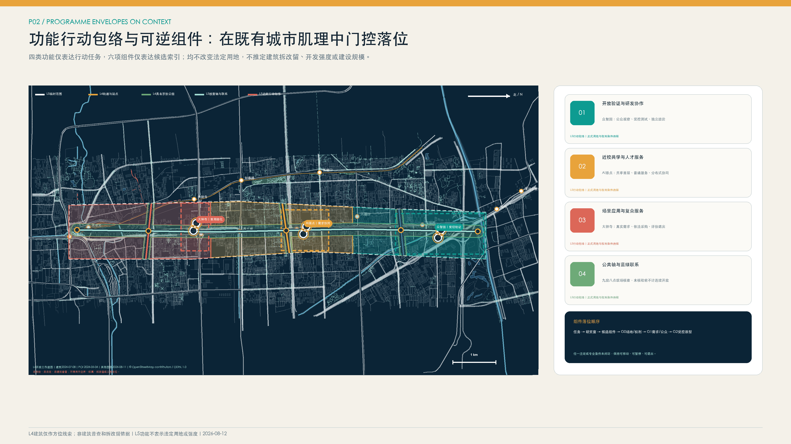

## 统筹研究范围产业与未来城市研究

### 总体结构：一轴三廊三核、三链协同

**一轴**为京张创新协同发展轴。依托铁路遗产、公园绿地、慢行空间和公共服务资源，统筹设置需求发布、测试成果展示、场景应用交流和公众意见反馈等功能，形成贯通南北的创新公共空间骨架。

**三廊**分别为清河联动廊、小月河与高校协同廊和转河站城融合廊，重点加强滨水空间、高校院所、轨道站点、社区和创新载体之间的横向联系。

**三链**为项目全生命周期的三类实施链条：

1. **需求组织链**：居民、公共服务单位、企业和研究团队提出需求，经需求核实、用户参与、数据边界审查和概念验证（PoC），形成可测试的项目任务；
2. **测试验证链**：围绕版本复现、安全、能耗、无障碍、红队测试、断网运行和人工接管开展分项验证，形成“通过、限用、整改或停止”结论；
3. **应用转化链**：具备明确应用单位和实施条件的项目，依法依规进入市场调研、采购实施、部署运行和 90/180 天跟踪评估；暂不具备采购条件的，形成书面评估意见。

**三核**实行差异化功能分工：AI 原点承担创新需求组织和概念验证，众智园承担专业测试和可信验证，大钟寺承担场景供需对接、依法采购咨询、运行维护和应用评估。项目采用统一编号跨区域衔接，需求、验证和转化环节完整后方可认定进入实施阶段。依托北京市场景需求征集机制以及海淀区实验室、大模型和技术交易基础，重点补充从科研成果到城市应用之间的测试验证与场景转化环节。[source:BEIJING-SCENARIO-DEMAND] [source:HAIDIAN-STATS-2025]

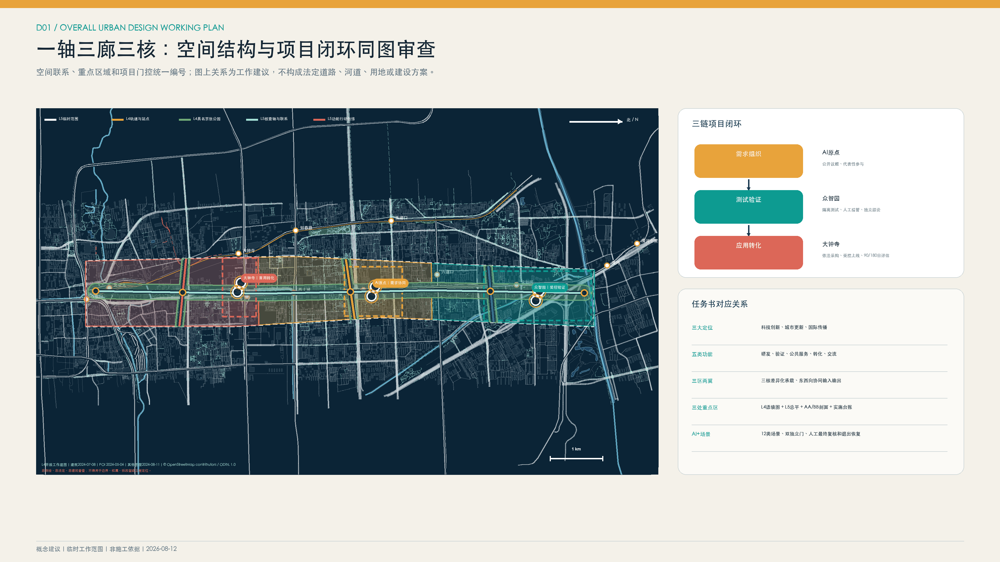

任务书要求不再由同一组章节笼统覆盖，而是逐项落实为“空间对象—运行机制—证据地址—责任角色—验收物—停止条件”。三大定位分别对应科技创新协同、存量城市更新和可复核国际传播；五大功能分别由协同研发、测试验证、公共服务、成果转化和交流展示承担；三处重点区域形成差异化项目台账，中关村科技服务翼与小月河场景赋能翼分别组织专业服务输入和公共场景反馈。外部协同只提出输入输出和项目接口，不预设北纬社区、未来科学城、怀柔科学城、经开区、京津冀相关主体已经同意参与。

| 任务要点 | 空间与机制交付 | 责任及验收 | 不可推断事项 |
|---|---|---|---|
| 三大定位 | 一轴公共界面、三核项目链、双语证据档案 | 统筹协调角色组织，按年度公开可复核成果 | 不代表政府背书或国际合作已经形成 |
| 五大功能 | 协同研发、独立验证、包容服务、首用转化、成果交流 | 每项绑定台账、RACI、KPI和退出回执 | 不预设场地、预算、供应商和应用单位 |
| 三区两翼 | 三个重点设计研究窗与两类跨区协同接口 | 输入、输出、责任、数据和转段条件逐项登记 | 不把临时工作窗解释为官方边界 |
| `agent.1`—`agent.6` | 正文、空间数据、指标、图纸、网页和自检互相指向 | 以结构化矩阵和持久化回执复核 | 数字门禁通过不代表专业审批通过 |

六项专项任务采用统一证据口径，避免以概念表述代替必需成果：

| 专项任务 | 投稿阶段必交付成果 | 评审入口 | 对象编号与工作状态 |
|---|---|---|---|
| `agent.1` 总体概念与功能统筹 | 一轴三廊三核总体设计、三核两翼功能统筹、空间—运营对象交叉索引 | `overall-design-plan.png`；`ecosystem_operating_map.json`；`implementation_register.json` | `SITE-001`、三核、`RW-A01/RW-B01/RW-C01`、`G0—G6`；概念响应已形成，正式边界和实施主体待核 |
| `agent.2` AI 全栈创新生态 | 三核×两翼×八要素运营图、开发者社区五步链、证据门和知识回流 | `ecosystem_operating_map.json`；`annual_operations_register.json` | `EL-LAND/EL-SPACE/EL-INDUSTRY/EL-FUNDING/EL-TALENT/EL-COMPUTE/EL-DATA/EL-SCENARIO`、`DEV-CHAIN-01—05`；资源供给、许可和运营主体待核 |
| `agent.3` AI+场景与活力城市 | 十二类场景契约、三项实施准备度原型、S06 0—90 日最小实施包 | `ai-service-blueprints.png`；`weave_contracts.json`；`s06_minimum_delivery_package.json` | `S01—S12`、`S06-MDP-P1—P3`；受控取证框架已形成，现场与专项审查待开展 |
| `agent.4` AI 公共空间与创新地标 | 三处公共创新节点、连续可达核查段、可逆构件和无障碍导视 | `identity-landmarks.png`；`public_space.geojson`；`roads.geojson` | `PUBLIC-V2-001—003`、`AN-V21-001—008`、`AUD-V21-SPINE-01—06`；位置、尺寸、供电和审批待核 |
| `agent.5` 三类文化融合叙事 | 三段可行走故事线、四类责任荣誉记录、双语与无障碍内容规则 | `culture_storyline.json`；`identity-landmarks.png` | `CS-01—03`、`RR-PROBLEM/VALIDATION/FAILURE/EXIT`；史料、版权和专业审校待核 |
| `agent.6` 全球活动与长期运营 | 五段年度运营周期、开发者接续链、国际传播和退出年鉴 | `annual_operations_register.json`；`implementation-ledger.png` | `AO-01—05`、`DEV-CHAIN-01—05`；运营主体、活动审批、预算和发布许可待核 |

上述成果均为投稿阶段可复核的概念建议和实施准备度材料，不替代法定规划、行政审批、专业审查、采购决定或合作协议。

### 三核两翼与八类要素协同图谱

三核不作并列园区处理，而是按项目证据链分工：AI 原点组织真实需求、普通服务基线和可拒绝的 PoC；众智园开展版本复现、安全接管与独立验证；大钟寺衔接真实应用单位、市场调研、依法采购、限定部署及 90/180 日后评估。中关村科技服务翼提供候选知识产权、人才、技术转移和财法服务输入；小月河场景赋能翼组织社区、公共服务和开放空间问题反馈。

| 要素 | 三核协同任务 | 必须形成的证据 | 控制边界 |
|---|---|---|---|
| 土地、空间 | 核实权利、开放时段、公众与受控界面 | 场地权利核验单、无障碍路径、消防疏散和可逆组件图 | 不据临时工作窗确定宗地、建筑轮廓或拆改留 |
| 产业、资金 | 将真实问题转为可复现测试和多方案比较 | 需求简报、非 AI 基线、工程量与市场价格取证 | 不编造企业、产值、投资、财政或采购结果 |
| 人才、算力 | 共同定义问题，训练复现、红队、人工接管和运维能力 | 参与章程、版本设备与能耗日志、培训和利益冲突记录 | 不预设就业、供应商、算力容量或部署能力 |
| 数据、场景 | 从最小必要数据、合成测试到真实使用与责任退出 | 来源许可、访问删除、人工终审、普通服务等价与退出回执 | 测试通过不等于采购、现场安全或公共价值成立 |

完整机器可读图谱见 `visual/assets/ecosystem_operating_map.json`。北纬社区、未来科学城、怀柔科学城、经开区和京津冀在现阶段均仅作候选问题输入、测试方法或可移植知识输出接口，不表示任何主体已参与、授权或承诺合作。

| 候选协同接口 | 须由相关主体确认的输入 | RailWeave 可提供的输出 | 启动前置条件 |
|---|---|---|---|
| 北纬社区 | 真实公共服务问题、普通服务基线和代表性用户意见 | 无账号服务蓝图、无障碍核查与申诉退出模板 | 属地、场地/物业、服务责任和参与授权依法明确 |
| 未来科学城 | 可公开的研究问题、测试方法需求和知识许可边界 | 可复现测试任务、对照结论和限制清单 | 技术、数据、知识产权和发布责任经相关主体确认 |
| 怀柔科学城 | 可转译的科学问题、设施接口需求和安全边界 | 场景问题简报、受控验证方法和可迁移知识摘要 | 设施、安全、保密、数据和成果使用权限依法核定 |
| 北京经开区 | 真实应用单位需求、非 AI 基线和生产运行约束 | 首用转化证据包、全生命周期成本和退出恢复方法 | 应用主体、场地、安全、采购和运维责任成立 |
| 京津冀相关区域 | 跨区域共性问题、适用标准和差异条件 | 可复用问题/测试模板、双语失败案例和适用边界 | 各地权责、标准、数据、知识产权和合作程序分别确认 |

以上均为候选接口设计，不构成邀约、授权、合作事实、财政安排或项目落地承诺。

### 国际案例的机制借鉴

| 案例 | 可借鉴机制 | 适用前提 | 本地转化边界 |
|---|---|---|---|
| Toronto Vector Institute | 独立非营利机构连接研究、人才、工程支持和可信应用 | 验证判断与商业服务分权，多方治理 | 其认证权限、加拿大资金和大学制度不属于本地直接适用条件 [source:CASE-VECTOR-TORONTO] |
| Montréal Mila | 开放科学、严谨 PoC、创业支持和公共利益治理并行 | 对问题、数据、实验和知识转移有完整协议 | 开源不等于企业/个人数据无条件公开 [source:CASE-MILA-MONTREAL] |
| Paris STATION F | 多个专业项目共享同一校园和基础服务 | 项目分流、公开章程和共享后台 | 不复制体量、品牌、投资数字或法国租赁制度 [source:CASE-STATION-F] |
| Helsinki Maria 01 | 从小范围存量空间试运营，以会员和使用证据逐步扩展 | 权属、消防、租赁和开放时段先明确 | 旧医院经验不能证明沿线建筑可直接改造 [source:CASE-MARIA-01] |
| Toronto MaRS | 公益任务、空间运营、应用服务和投资连接形成互补业务线 | 公益与商业分类核算，明确应用单位参与 | 加拿大慈善、税收和房地产制度仅作机制比较 [source:CASE-MARS-TORONTO] |
| Barcelona 22@ | 创新、居住、基础设施和社会融合同时管理 | 更新收益与社区受益共同评价 | 不复制土地增值回收、容积率和保障房制度 [source:CASE-22BARCELONA] |
| Copenhagen BLOXHUB | 用少数年度问题议程组织会员、应用研究和跨界合作 | 项目、预算、伙伴和年度结果公开 | 不用成员数与访问量替代本地公共价值 [source:CASE-BLOXHUB] |

国际案例用于开展机制比较和适用性分析，不作为地块条件、合作关系、投资安排或招商成果已经落实的依据。[source:AGENT-TASKBOOK] [standard:PROJECT-AGENT-OPEN-CALL-TASKBOOK]

### 方案名称与视觉识别系统

主名称“轨迹织城”体现京张铁路历史脉络、科技创新演进路径和项目责任追溯机制。标志采用平行轨迹在节点处分合的图形语言，表达多方案比选和全过程留痕。铁路深蓝体现历史传承和制度保障，开放青体现协同创新，琥珀体现人工复核和风险提示。导视系统对应 L1 至 L5 五级证据以及需求、验证、转化三类项目状态，并配置适用于全龄人群的触觉和文字编码。企业标志不纳入公共主标识体系，方案标志、字体和导视均采用原创内容。[depth:overall_spatial_structure]

## 总体设计范围城市更新与控规深度城市设计

### 统筹既有空间提质与网络衔接

根据截至 2026 年的官方信息，京张公园一期已建成，二期配套项目已取得阶段性进展；配套工程完成情况与全线连续开放、无障碍通行状况应分别核实。[source:PARK-PHASE1] [source:PARK-PHASE2] 总体设计建立 `built / supporting-works-completed / open-status-to-verify / gap-to-audit` 四级工作台账，重点对北五环、北四环、成府路、知春路、学院南路、北三环、轨道站点和河道接口开展现场踏勘与连续性评估。

空间结构形成“一轴三廊三核”：

- 京张纵轴：既有公园、铁路遗产、公共服务和项目状态的共同界面；
- 清河联动廊：连接跨街镇、跨园区和跨河更新组团，重点核实步骑衔接、滨水安全、防汛通道和五环接口；
- 小月河与高校协同廊：连接高校、分布式创新载体、社区与轨道站点，完善十分钟步行联系和首层公共服务；
- 转河站城融合廊：连接轨道站点、更新片区、社区、企业和滨水空间，重点加强站外无障碍衔接和更新项目接口。

`ROAD-V2-001` 至 `ROAD-V2-004` 用于表达连续性核查和空间联系任务，不作为道路、桥隧、绿道或施工线位依据。[data:geometry/roads.geojson#ROAD-V2-001] [data:geometry/roads.geojson#ROAD-V2-004] [metric:crosslink_count] 其内部复算长度属于 L5 概念核查线工作值，仅用于方案校核，不计入工程量、政府建设时序或法定路网。[metric:conceptual_audit_alignment_length_m] [depth:traffic_rail_slow_parking]

### 城市更新与功能倾向

总体范围按照“现状依据、开放数据辅助研判、设计建议、深化事项”四类信息组织。北部重点布局开放验证与研发协作功能，中部重点完善近校协同创新与人才服务，南部重点发展场景应用与复合服务，京张轴线及三条横向廊道承担公共空间开放和网络衔接功能。[data:geometry/land_use.geojson#LU-V2-001] [data:geometry/land_use.geojson#LU-V2-004]

`LU-V2-001` 至 `LU-V2-004` 为 L5 概念性功能分区，仅用于表达总体功能组织，不构成法定用地调整或用地平衡方案。[standard:MNR-LAND-USE-CLASSIFICATION-GUIDE] [depth:land_use_layout]

现有官方资料可确认相关街区控规及部分交叉关系，但完整道路红线、用地性质、容积率、建筑高度、密度、退线和市政容量等指标仍待补充。[source:JINGZHANG-CONTROL-NOTICE] [standard:MOHURD-CONTROL-DETAILED-PLANNING] 城市风貌提出细分体量、首层步行友好、庭院共享、材料低反射、屋顶可维护、历史本体优先以及控制夜间媒体设施规模和动态光环境等原则。建筑体量、拆改留和永久构筑物方案应在取得测绘、权属、结构消防、文保和控规条件后进一步深化。[depth:height_massing_character]

## 重点区域详细设计

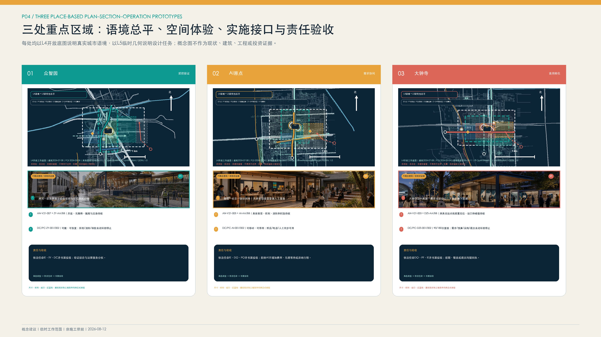

三处重点区域统一采用公共利益评价框架，并结合现状资料和实施条件确定差异化设计深度。项目应明确公共利益、数据最小化、人工复核、可逆性、维护责任以及事故处置和退出恢复要求；空间体量、开发强度和拆改留方案应严格依据各区域可采信资料深化。[depth:three_key_area_detailed_design]

### 众智园：开放验证示范园

**现状基础与工作重点。** 众智园历史检索记录所指官方页面已撤稿或删除，现无法核验其原始表述；本方案不援引或采信其中任何具体范围、节点或实施信息。图中 `KEY-V2-001` 仅为征集任务下的工作索引，不作为公示红线或已核实边界使用。[source:ZHONGZHIYUAN-RENEWAL] [source:OFFICIAL-ANNOUNCEMENT] [data:geometry/key_areas.geojson#KEY-V2-001]

**规划建议。** 建议在场地权利、专业条件、运营责任和依法履行程序等前提具备后，研究形成开放验证示范园功能，并论证可信测试验证空间（暂定名“验证舱”）、可重构工坊、封闭测试场、受控慢行测试环和公众观察评估廊等空间接口。可供后续深化的工作流程包括项目准入、封闭复现、分项验证、限定试验、结论评估、信息公开和转入应用。近期可优先研究室内模型、端侧能耗、断网回退和封闭环境机器人测试；公共公园原则上不作为未经专项论证的机器人道路测试场地。

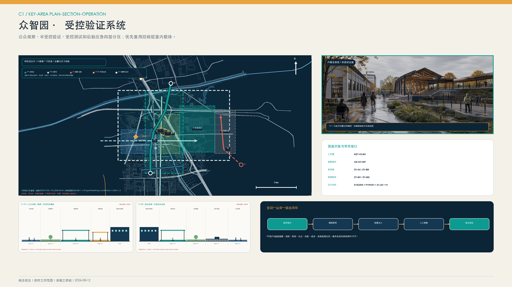

空间组织划分公众观察、结果说明、受控测试和设备后勤四类界面。公众与试验活动不共用无管理边界的通道；高风险设备应具备围合、急停、保险、应急到达和独立复核条件。`geometry/public_space.geojson` 中 `DC-V21-*` 对象仅以可迁移概念锚点表达验证空间与公众观察界面，不构成建筑轮廓、测试资质或场地授权；室外慢行和机器人测试须另行完成交通、消防、保险及公共安全论证。

**实施主体建议。** 如相关主体表达参与意愿，且职责、授权、预算、场地和数据边界经依法确认，可研究由依法任命的统筹协调角色组织工作，并通过协议或依法适用的采购程序确定技术运营、独立复核、现场管理、保险和应急等角色。相关角色在依法任命后方可承担相应责任，并可研究建立用户代表提出暂停和复核建议的渠道。本方案不指定中关村科学城相关管理服务平台、场地业主、物业、保险、应急或任何其他主体承担职责；文中机构名称仅用于说明可能的主体类型，不代表其已经参与或授权。[source:CASE-VECTOR-TORONTO]

**深化条件。** 精确范围、宗地、产权、建筑现状、道路红线、河道管理线、建设规模、建筑高度、消防、市政容量和测试资质尚待核实。取得相关资料和审查意见前，不确定具体建筑体量、桥隧线位和企业合作安排。[depth:development_intensity_controls]

### AI 原点：开放协同创新街区

**现状基础与工作重点。** 根据官方信息，AI 原点是以五道口为核心、整合多个载体并向周边辐射的约 3 km² 分布式创新网络，已具备企业服务、人才服务和人机协同服务窗口等实践基础。[source:AI-ORIGIN-2026] [source:AI-ORIGIN-TALENT-STATION] `KEY-V2-002` 仅表达工作范围，不代表法定边界。[data:geometry/key_areas.geojson#KEY-V2-002]

**规划建议。** 建议在权属、消防、租赁关系、开放时段和运营责任经核验后，研究选择一处共享首层，并进一步论证是否设置“创新需求与成果转化服务室”及需求受理、开源复现、成果转化、限期概念验证、人才综合服务和夜间交流等功能接口。可研究由居民、公共服务人员、科研人员和企业使用统一需求登记表；拟纳入项目应具备明确服务对象和合法数据来源，完成初步研判后方可建议转入众智园测试验证、继续研究储备或形成终止评估意见。

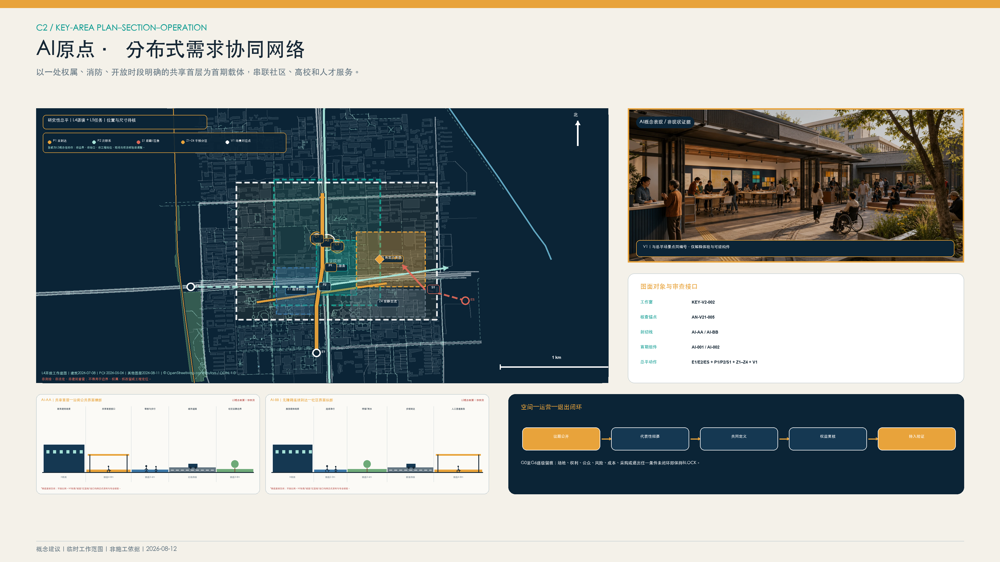

AI 原点采用“网络”而非“新园区”表达。首期只研究一处经权利、消防、租赁和开放时段核验的共享首层，配置人工服务台、纸质与数字并行的需求墙、共同定义工坊和安静夜间交流界面；其余载体以服务转介和步行联系组织。无障碍路径、夜间噪声、等候容量和疏散条件须现场核验，几何圆或临时工作窗不得解释为真实服务半径。

**实施主体建议。** 如相关主体表达参与意愿，且职责、授权、预算、场地和数据边界经依法确认，可研究利用现有 AI 原点运营网络形成社区协同接口；高校、科研院所、孵化机构以及人社、人才、住房和企业服务等相关角色，仅可在依法任命或协议授权后承担相应专业服务。可邀请居委会、物业、青年、老年人、残障人士和商户代表参与协商；智能问答宜限于信息解释和表单预填，例外事项、业务受理和申诉应由依法确定的人工服务角色处理。本方案不指定东升镇、任何政府部门、高校、机构或社区主体承担职责，也不表示其已经参与、授权或同意实施。[source:AI-ORIGIN-TALENT-STATION]

**深化条件。** 载体产权、具体首层、租金、夜间噪声、消防、公平准入、知识产权和居民意愿尚待确认。高校及园区连通和具体建筑改造应在取得相关权利人同意及专业论证后确定。[source:BEIJING-URBAN-RENEWAL]

### 大钟寺：首用场景转化中心

**现状基础与工作重点。** 大钟寺历史检索记录所指官方页面已撤稿或删除，现无法核验其原始表述；本方案不援引或采信其中任何具体范围、主体、项目或资金信息。`KEY-V2-003` 仅为征集任务下的工作索引，不作为已核实边界或主体依据。[source:DAZHONGSI-RENEWAL] [source:OFFICIAL-ANNOUNCEMENT] [data:geometry/key_areas.geojson#KEY-V2-003] 蓝景丽家约 5.03 ha、约 9.65 万 m²及交通预测仅适用于对应实施单元，不外推至整个片区。[source:LANJING-IMPLEMENTATION] [source:LANJING-TRAFFIC]

**规划建议。** 建议在真实需求、场地、采购权限、预算和运营条件经核验后，研究形成首用场景转化中心功能，并论证公共需求发布、采购合规咨询、供需对接、综合发布、90/180 天应用评估和面向轨道站点的综合服务等空间接口。拟进入后续程序的需求单位应先明确现行业务流程、责任角色、预算条件和风险底线。成熟产品的具体采购路径、仅需验证项目的测试协议以及创新需求可能适用的采购机制，均应由依法确定的采购和法务角色另行研究，不由本方案预设。拟公开信息可涵盖经授权的需求、验证结论、合同履行、实际使用和退出恢复情况。

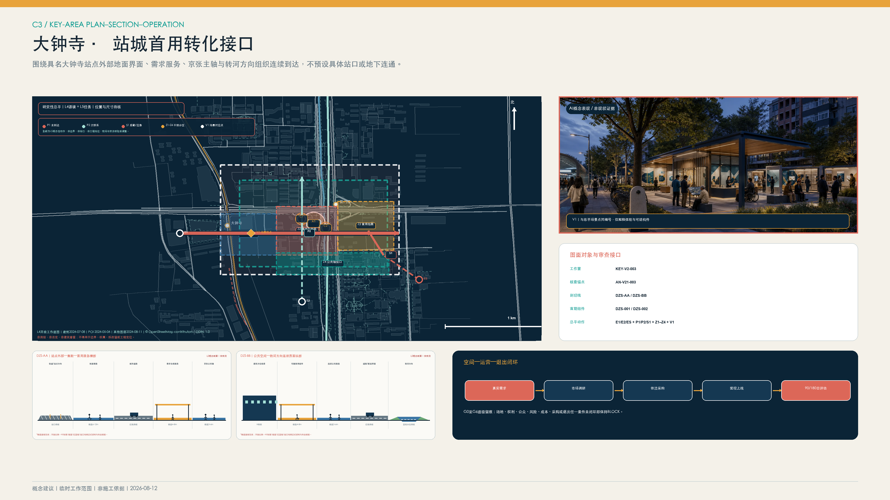

空间设计围绕站前集散、需求与合规服务、首用项目档案、京张轴与转河方向四类地面接口组织，并分别核查通勤峰、活动峰、配送和应急流线。轨道出入口、站外无障碍路径和滨水方向均须以运营方信息和现场调查复核；本方案不预设地下连廊、站口改造、四象限工程或永久滨水设施。

**实施主体建议。** 如相关主体表达参与意愿，且职责、授权、预算、场地和数据边界经依法确认，可研究由后续依法任命的统筹协调角色组织跨部门需求核验；空间实施、全周期资金平衡、应用、采购、法务、知识产权、数据和审计等职责，分别由依法确定的主体在其授权范围内承担。政府部门、公共机构、国有企业或市场主体仅作为可能的应用主体类型，不表示已经参与或形成需求。技术供应单位如参与，应通过依法适用的程序确定，前期概念验证不预设后续采购结果。本方案不指定任何区级部门、更新主体、应用单位或专业机构承担职责。[source:BEIJING-SCENARIO-DEMAND] [source:BEIJING-URBAN-RENEWAL]

**深化条件。** 应进一步核实应用单位、预算来源、采购权限、数据授权、交通容量、站外无障碍、地下连通和建筑条件。轨道站点四象限和地下工程线位以专项论证及审批成果为准。

## AI 创新生态、人才画像与 AI+ 场景

### 六类重点服务对象及使用流程

| 服务对象 | 需求形成 | 测试验证 | 场景转化 | 数据与人工保障 | 调整退出机制 |
|---|---|---|---|---|---|
| 青年研究者 | 在 AI 原点选择明确需求，与一线服务对象共同开展概念验证 | 在众智园完成版本、安全和能耗测试 | 在大钟寺对接多个潜在应用单位 | 未授权研究信息和身份轨迹不公开，由依法确定的转化和独立复核角色签认 | 缺少明确服务对象的项目不进入本方案下一阶段原型验证；不可复现的项目继续研究 |
| 初创团队 | 使用成果转化、人才和住房转介服务，不绑定投资机构 | 按最小必要原则披露商业数据并完成测试 | 经市场调研和合规程序对接潜在应用单位 | 企业和个人服务数据分类授权，应用单位不得获取无关数据 | 缺少明确需求时终止销售型试点；运维条件不具备时不进入采购 |
| 社区居民 | 可通过线下、电话或网页匿名提出需求 | 自愿参与限定范围的概念验证，并可随时撤回 | 查看应用评估结果，依法提出投诉和申诉 | 不开展人脸画像；持续保留非数字渠道和人工服务 | 拒绝参与不影响正常服务；投诉触发暂停和复核程序 |
| 公共服务人员 | 描述现行业务流程、易错环节和不可替代职责 | 测试误报、漏报、断网和安全回退 | 作为需求单位参与验收和 90/180 天应用评估 | 使用脱敏样例，人工承担最终决定，不以算法替代法定职责 | 人工负担明显增加或未达到最低标准的项目退回整改 |
| 国际访客 | 从地铁和主脉了解公开问题，无需注册 | 参观非敏感验证解释 | 参加项目对接，只有后续项目才计成果 | 双语、无障碍、纸质/人工替代，不追踪跨点身份 | 可匿名反馈并删除联系信息 |
| 运维与一线工作者 | 在设计前审核能耗、网络、清洁、备件和班次 | 演练停电、急停和手动接管 | 对部署、维护和退出共同签字 | 不做劳动绩效画像，双人操作和安全培训 | 无维护资源不上线；退出时恢复场地和删除数据 |

### 十二类场景模块及项目流程

十二类场景按照需求组织、测试验证和应用转化三类流程进行统筹。每个场景均应明确空间前置条件、责任主体、试点期限、数据边界、人工复核、风险指标和停止条件，并在取得合法场地使用协议后确定具体位置。[metric:scenario_card_count]

| # | 场景模块 / 流程 | 空间条件与服务对象 | 数据、人工与维护 | 试点期限、成效与风险指标 | 准入限制与退出机制 |
|---|---|---|---|---|---|
| S01 | **模型复现验证** / P1验证 | 众智园可信测试验证空间；科研人员、企业、应用单位 | 采用公开或获授权数据并记录版本哈希；由研究人员复现、第三方独立抽查；测试方承担算力 | 单批次测试期限由协议确定；评价可复现率、档案完整率以及泄露和不可复现数量 | 缺少许可、版本或负责人时不予准入；验证未通过的项目退回研究 |
| S02 | **端侧能耗与断网韧性** / P1证据 | 室内可控节点；设备团队、运维 | 设备级能耗和故障日志，不采人；运维双人复核 | 与S01同批；单位任务能耗、断网回退、人工接管时间 | 断网无法安全回退或负荷不明即停止 |
| S03 | **具身智能受控测试** / P1验证 | 围合测试场，消防、保险和急停条件齐备；机器人团队和安全员 | 采用匿名事件日志并限定保存期限；安全员全程掌握急停权限；技术团队承担损耗和恢复责任 | 先开展封闭测试，再研究限定开放；评价碰撞、越界和接管成功率 | 一般公共绿地不直接部署；发生事故时立即封存并开展调查评估 |
| S04 | **事故处置、申诉与退出演练** / P1验证 | 事故评估室与可撤组件；全部项目主体 | 仅保留必要审计记录；由独立复核人员监督通知、删除和恢复 | 每次上线前组织演练；评价闭环时间、删除完成和空间恢复情况 | 缺少退出经费或责任人的项目不得上线；演练不合格的项目退回整改 |
| S05 | **共学与职业成长助手** / P2问题 | 原点共享首层；青年、教师、导师 | 自愿学习目标，教师/导师最终决定；运营方维护内容 | 限期PoC；完成率、人工节时、错误建议与退出率 | 不做自动评价、招生或就业决定；可随时关闭 |
| S06 | **全龄无障碍信息服务** / P2需求 | 站口、主轴和公共服务设施之间的连续路径；老年人、残障人士和访客 | 采用端侧或聚合路线事件数据；保留人工和纸质导览渠道 | 先行核查关键路径；评价无障碍路径完成率、误导和求助数量 | 不采集人脸或持续身份轨迹；错误频发时暂停服务并整改 |
| S07 | **人机协同公共工单** / P2问题 | 社区/园区服务前台；居民与一线人员 | 脱敏工单，人员确认分类与回复；需求单位承担运行 | 小范围工单类型试点；解决时间、重复投诉、人工负担 | 不自动执法/拒绝服务；人工负担上升则停止 |
| S08 | **铁路遗产多语内容审校** / P2问题 | 既有展示或可逆媒介；公众和国际访客 | 清权史料，AI内容显著标识；策展/文保审核 | 单主题内容期；更正时间、无障碍可读、史实错误 | 清华园车站相关内容/设备须文保核验；侵权即撤除 [source:QINGHUAYUAN-HERITAGE] |
| S09 | **采购与数据合规咨询** / P3转化 | 大钟寺需求发布厅；中小企业、应用单位、技术团队 | 企业按最小必要原则提交资料；采购、法务和数据专家复核 | 常态服务、季度评估；有效路径意见率、纠错数 | 不替代法定审查或形成定向中标；重大争议转入人工专项审查 |
| S10 | **首用场景供需对接** / P3转化 | 供需对接室和公开需求池；需求单位、多家技术团队 | 公开非敏感需求，保密数据另行签订协议；开展公平性监督 | 每批需求设定截止时间并形成结论；实名需求单位率、合同形成率和暂不采购结论 | 缺少明确应用单位或预算条件的项目不入池；不得预设供应单位 |
| S11 | **90/180 天应用评估** / P3转化 | 实际部署现场与应用评估室；应用单位、服务对象和运维人员 | 业务和维护指标按合同最小必要原则采集；由应用单位验收并保留用户申诉渠道 | 部署后 90/180 天；评价活跃使用、故障、人工投入、投诉和续用情况 | 缺少持续使用或维护条件，或风险超过阈值时，恢复原业务流程 |
| S12 | **项目责任信息台账** / 三链协同 | 三处公共节点和网页；社会公众 | 经授权公开需求、结论、限制、合同、投诉和更正；由专人维护 | 持续运行、季度归档；记录完整率、申诉闭环率 | 不公开个人信息和商业秘密；错误信息应及时更正，暂停和退出项目同步公开 |

S01 至 S04 为产业测试验证模块，满足不少于三项产业验证场景的任务要求。S08 调整为铁路遗产多语内容审校；在缺少明确医疗需求单位和持续内容责任的条件下，医疗问答暂不设置为独立场景。公共服务自动化应保留人工决定、非智能服务渠道以及解释、撤回和申诉机制。[source:AGENT-TASKBOOK] [standard:PROJECT-AGENT-OPEN-CALL-TASKBOOK]

### 三个实施准备度概念原型与“织入—解编”契约

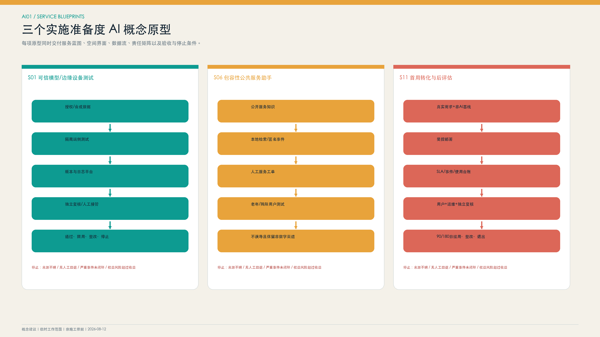

v2.2 从十二类场景中选择 S01、S06 和 S11，形成可供专业团队受控验证的实施准备度概念原型规格，并不表示技术、场地或服务已可现场运行。每项原型交付服务蓝图、空间界面图、数据流图、责任矩阵、验收与停止条件五件套，并同步登记输入、输出、模型或设备版本、数据控制者、人工接管、失败模式和场地恢复。完整字段见 `visual/assets/scenario_prototypes.json`。

| 原型 | 端侧、边缘、平台与人工复核架构 | 验收重点 | 停止条件 |
|---|---|---|---|
| S01 可信模型与边缘设备测试 | 授权或合成数据进入隔离端侧测试；平台记录版本、能耗、断网与故障；独立机构复核 | 可复现包、版本标识、故障记录、人工接管和脱敏摘要 | 来源或版本不清、无安全回退、重大问题未关闭 |
| S06 包容性公共服务助手 | 公开知识与本地检索形成建议；人工服务台保留决定、例外和申诉；纸质/电话/现场渠道常设 | 老年人、残障人士及非数字用户完成同等服务，不增加费用或不合理异地行程 | 误导持续、人工负担上升、非数字渠道中断、权益受损 |
| S11 首用转化与后评估 | 真实需求和非AI基线进入受控部署；平台记录SLA、事件与实际使用；用户、运维和独立机构共同复核 | 上线清单、培训、实际使用、90/180日评价和退出回执 | 需求消失、全生命周期成本不可承受、严重风险或低持续使用 |

“织入契约”不是审批或认证，而是项目进入公共空间和公共服务前的最低信息结构。每张场景卡登记公共问题、经线保障、纬线接入、结点责任、数据禁区、人工复核、普通服务等价和解编触发；退出后仍须保留投诉处理、必要审计记录、数据删除证明、设备撤除和场地恢复等残留维护物。`visual/assets/railweave_runner.js` 对正常、缺人工、缺普通后备、数据越界、责任漂移和解编失败等合成分支进行离线回归，结果记录在 `visual/assets/receipt.json`。这些测试只证明输入、规则与输出保持一致，真实绩效继续保持 `unknown`，须经现场基线、专业测试和有权主体复核。

S06 建议先开展 90 日实施切片：第 0 至 30 日完成普通服务、无障碍与现场工作基线；第 31 至 60 日在封闭环境开展合成和影子验证，不影响现行业务；第 61 至 90 日在限定用户、时段和场所内共同测试。试点成本应单列人工服务、参与支持、保险、数据治理，以及足以覆盖接口停用、数据清理、导视校正、人工服务恢复、设备撤离、场地修复和独立复核的退出恢复资源。相关工程量、价格、金额和资金来源须经核验并依法确定，不预设固定比例。任何阶段出现重大安全或隐私事件、人工服务不可用、无障碍关键阻断未关闭，或者场地和退出责任未明确，应立即停止转段。

#### S06 方案比选与取舍依据

| 候选模式 | 无账号/断网可达 | 隐私与无障碍 | 人工负担与可退出 | 本方案判断 |
|---|---|---|---|---|
| App 或账号优先 | 账号、设备、网络或数字能力可能成为前置条件 | 容易扩大身份、位置和画像数据需求，对非数字用户不利 | 表面上减少现场渠道，但例外、申诉、故障和迁移责任仍存在 | 不作默认模式；不得强制下载或注册 |
| 无人 AI 终端优先 | 终端断网、故障或界面不可用时缺少独立服务路径 | 动态交互可能对视觉、听觉、认知和肢体差异形成新门槛 | 现场故障、误导和安全事件仍需人工接管；固定设备撤出成本较高 | 不作独立骨干；只可在普通服务可用时作自愿辅助 |
| 人工与纸质为底、AI可关闭的多渠道服务 | 固定导视、触觉/易读信息、纸质、电话和人工渠道先行 | 只在用户自愿启用时提供最小必要建议，保留人工终审和无惩罚拒绝 | 需如实计入人工班次和维护成本，但断网可继续、动态接口可停用、普通服务可恢复 | **选定为 S06 概念原型，进入三阶段受控取证** |

本比选是对服务架构的定性判断，不是现场测试结论；不对三类模式设置虚构分数。选择第三类的核心理由，是它在 AI 未启用、被拒绝、断网、故障或退出后，仍可以同一组普通服务保持基本可达性；是否真正等价，须由第 0—30 日基线和代表性用户复核证明。

#### S06 最小实施包与阶段签收

| 工作段 | 责任与最小输入 | 验收物 | 停转与退出 |
|---|---|---|---|
| 0—30日：普通服务与无障碍基线 | 依法确定的应用/场地责任角色签收路径、开放时段、纸质/电话/人工渠道和代表性用户参与计划 | 逐段无障碍核查、普通服务图、非AI完成率、等待、距离和费用基线 | 场地权利不清、关键阻断无等价服务或人工班次不成立时不转段 |
| 31—60日：封闭合成与影子验证 | 独立验证角色签收固定版本、合法或合成数据、禁用字段与断网/误导/画像/解编测试任务 | 影子建议—人工判断对照、版本与故障日志、人工接管演练、独立意见 | 出现禁用数据、高风险误导、无法接管或重大问题未关闭时停止并清理数据/权限 |
| 61—90日：授权成立后的限量共测 | 在场地、数据、参与和停止权限依法成立后，由应用责任角色组织限定空间、时段和服务对象共测 | 普通与数字路径对照、求助/误导/申诉台账、第90日续期、整改、暂停或退出意见 | 任一授权缺失或撤回、普通服务中断、严重安全/隐私/公平事件、退出责任或资源不可用时立即退出 |

三阶段预登记、RACI、控制指标和六项退出回执见 `visual/assets/s06_minimum_delivery_package.json`。该文件仅供依法确定的专业团队后续深化，不构成场地、数据处理、参与招募、预算、采购或上线批准。

## 用地、建筑规模与拆改留方案

### 用地与建筑指标确定原则

`land_use.geojson` 表达四类概念性功能分区，仅用于临时工作边界内的方案一致性校核，不构成法定用地布局或控规指标。[data:geometry/land_use.geojson#LU-V2-002] [depth:land_use_layout] `buildings.geojson` 为空图层，表示现阶段尚无经核验的建筑基底数据，不表示现场不存在建筑。功能组件通过公共空间行动范围和项目接口表达，`building_footprint_area_sqm` 暂列为待核实。[data:geometry/buildings.geojson#NO-VERIFIED-BUILDING-FOOTPRINTS] [metric:building_footprint_area_sqm]

现状建筑清单应综合 L4 开放建筑基底轮廓、遥感时相和现场调查建立，并标注 `existing-observed / to-verify`。具体更新分类应依次核实权属与租约、文物保护、建设合法性、结构与消防、现状使用与空置、碳排放、公共服务、租户和职工影响、替代安置、资金安排及后期运营条件。[standard:MOHURD-ARCH-DESIGN-DEPTH-2016] [depth:retain_renovate_demolish]

拆改留决策树为：

1. 有遗产价值或结构/使用良好：优先保留和维护；
2. 空间性能不足但安全可修复：适应性再利用，先小范围时段共享；
3. 影响公共连续性但可通过管理解决：先调时、开门和导向，不先拆建；
4. 确需拆除：完成安全、碳、权属、公共利益、租户和替代方案论证；
5. 新增：优先轻量、可逆、可拆卸，五年运营账未成立不进入中期建设。

蓝景丽家相关资料仅适用于对应实施单元，图面应以加粗边界注明“本框内有效，不外推”，不得用于总体设计范围或其他重点区域的指标推算。全域容积率（FAR）、建筑高度和建设规模现阶段暂不具备确定条件。[source:LANJING-IMPLEMENTATION] [source:LANJING-TRAFFIC] [depth:development_intensity_controls]

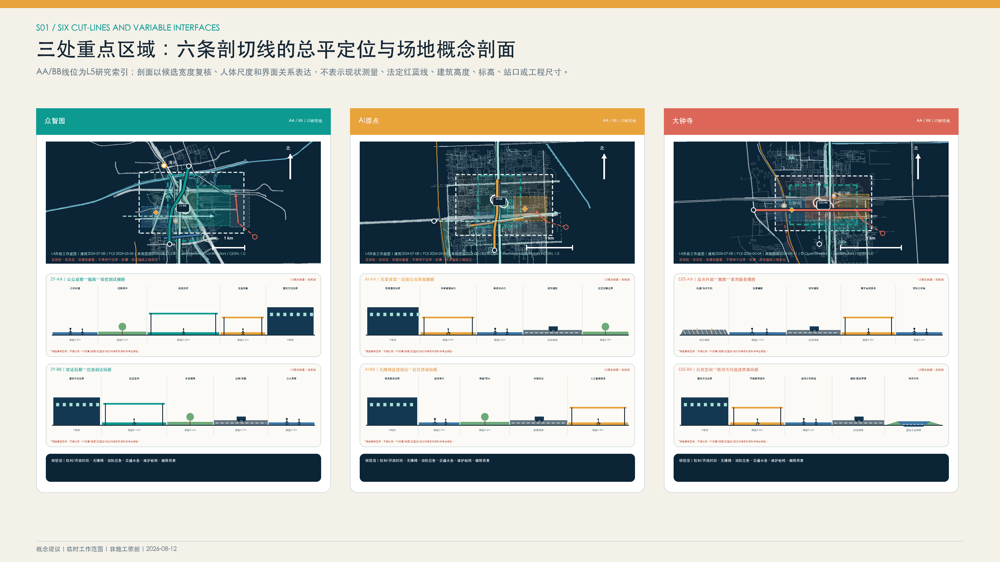

v2.2 将五类深化对象嵌入仓库规定的规范图层：`geometry/roads.geojson` 增补 `AUD-V21-*` 核查分段和 `SEC-V21-*` 研究性剖切线，`geometry/public_space.geojson` 增补 `AN-V21-*` 无障碍核查节点和 `DC-V21-*` 可迁移组件，`geometry/phasing.geojson` 增补 `PC-V21-*` 组件级分期。全部对象均标注为 L5、`diagrammatic`、`official_boundary=false`、`NOT FOR CONSTRUCTION`，并以 `metric_inclusion=false` 排除于道路或建成量统计；未知开放、无障碍、权属、消防、运维和现状尺寸继续保持 `unknown`。典型剖面以变量 W 表达待实测宽度，不形成道路断面、建筑高度、河道蓝线或工程线位结论。

### 三处重点区的“证据状态—空间动作—责任验收”闭环

下表不新增精确坐标或建设规模，而是将现有证据、待核问题、设计动作和首期可逆组件对应到同一验收链。组件仅在前置条件成立后研究落位；调查结果与假设不一致时，应移动、缩减或取消组件。

| 区域 | 证据状态与待核问题 | 落点理由和空间动作 | 变量尺度与界面 | 首期可逆组件 | 责任与验收 |
|---|---|---|---|---|---|
| 众智园 | 征集任务和仓库临时包络可用；历史更新公示已撤稿或删除。权属、消防、测试资质、河道及现状尺寸待核。[source:OFFICIAL-ANNOUNCEMENT] [source:ZHONGZHIYUAN-RENEWAL] | 仅在可控室内或院落经核验后组织复现与测试；公众观察、受控试验和设备后勤分界，避免将一般公共绿地直接作为测试场。 | `AN-V21-007` 为调查锚点；`SEC-V21-ZY-AA/BB` 以 W 表达待实测宽度，核查围合、急停、疏散和应急到达。[data:geometry/roads.geojson#SEC-V21-ZY-AA] | `DC-V21-ZY-001/002` 与 `PC-V21-ZY-001/002`：先室内复现，再论证公众观察接口；均可撤除或停用。[data:geometry/public_space.geojson#DC-V21-ZY-001] | 依法确定的场地、测试运营、独立复核、保险和应急角色分别签认；权利、消防、保险、人工接管或恢复资金任一未成立，不进入受控测试。 |
| AI 原点 | 可访问官方信息支持约 3 km² 分布式网络及现有人才服务，但具体共享首层、无障碍路径、租赁、消防和开放时段未知。[source:AI-ORIGIN-2026] [source:AI-ORIGIN-TALENT-STATION] | 不新设封闭园区；优先研究利用一处经核验的存量共享首层，把人工服务台、纸质/数字需求墙和安静交流界面连接到既有步行网络。 | `AN-V21-005` 为调查锚点；`SEC-V21-AI-AA/BB` 核查沿街界面、无障碍连续到达、等候、疏散和夜间噪声。[data:geometry/roads.geojson#SEC-V21-AI-AA] | `DC-V21-AI-001/002` 与 `PC-V21-AI-001/002`：先启用可移动服务台和需求墙，普通服务保持等价，其他载体只做转介。[data:geometry/public_space.geojson#DC-V21-AI-001] | 依法确定的场地权利、运营、人工服务和社区协商角色签认；完成权属、消防、开放时段、非数字渠道和无障碍核查后，方可进入 S06 限定测试。 |
| 大钟寺 | 征集任务与蓝景丽家局部资料可用；历史片区公示已撤稿或删除。站口、站外无障碍、客流、转河方向和采购权限待核。[source:OFFICIAL-ANNOUNCEMENT] [source:LANJING-IMPLEMENTATION] [source:DAZHONGSI-RENEWAL] | 先研究地面连续到达，不预设地下连接；在站前集散与既有服务空间之间组织需求、合规、首用档案和后评估接口。 | `AN-V21-003` 为调查锚点；`SEC-V21-DZS-AA/BB` 以 W 和峰值流线核查站前、配送、应急及滨水方向，不形成工程线位。[data:geometry/roads.geojson#SEC-V21-DZS-AA] | `DC-V21-DZS-001/002` 与 `PC-V21-DZS-001/002`：先采用可移动咨询和档案组件，实体规模依据真实需求和合法场地再论证。[data:geometry/public_space.geojson#DC-V21-DZS-001] | 依法确定的需求、场地、采购法务、运营和审计角色签认；需求、预算、采购权限、站外无障碍、90/180 日评估及退出恢复条件齐备后方可转段。 |

## 交通、轨道、市政与公共服务设施

交通策略以网络连续性和实际通行条件核查为重点。轨道站口和道路交叉口应记录坡度、台阶与电梯、过街等待、围挡、桥下空间、夜间照明、冬季维护、非机动车停放、步骑冲突、求助设施和人工服务等情况。京张纵轴与三条横向廊道先作为连续性核查走廊，完成现场核实后再测算连续开放和无障碍网络长度。[metric:continuous_open_greenway_length_m] [depth:traffic_rail_slow_parking]

大钟寺、五道口、清华东路西口、六道口、知春路、清河等站点应以运营方最新信息核对站名、出入口和设施，站外路径另做现场调查；站点存在不等于换乘或站外无障碍。大钟寺仅提出地铁、需求厅、京张主轴与转河之间的连续到达目标，不确定地下连廊或四象限工程线位。

市政基础设施采用端侧、街区、区域三级接口：端侧设备遵循数据最小化原则，具备断网运行和人工接管能力；街区节点登记电力、网络、充电、散热、回收和维护需求；区域层提出与现有能源、通信、排涝、消防和应急系统协同的需求清单。容量资料尚未取得，现阶段不对算力、电力、给排水、充换电或管线迁改能力作出承诺。[depth:municipal_new_infrastructure]

公共服务遵循数字化辅助、人工渠道保留和无障碍可达原则。涉及个人权益的服务应提供线下、电话或纸质办理方式，不强制要求下载应用程序。人工智能主要用于信息解释、表单预填、检索和分派，法定决定、例外处理、救济和申诉仍由工作人员承担。AI 原点已有 17 项人才服务和三级专员帮办实践，可作为人机协同服务接口，不作为跨部门数据自由流通的依据。[source:AI-ORIGIN-TALENT-STATION]

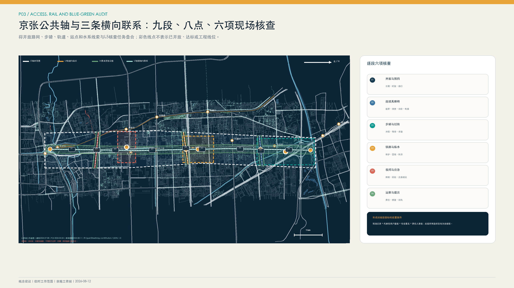

## 蓝绿空间、公共空间与城市风貌

蓝绿系统分三层表达：L2 反映京张公园已建及工程状态，L4 辅助识别清河、小月河、转河和开放路网。[source:PARK-PHASE1] [source:PARK-PHASE2] [source:OSM-WORKING-DATA]

L5 提出纵轴与三条横向廊道的衔接完善建议。[data:geometry/green_space.geojson#GREEN-V2-001] 河道蓝线、管理范围、洪水位、生态岸线和运维通道尚未取得，临水活动、照明和装置均采用可逆方式，并应通过水务、防洪和养护专项核验。[depth:blue_green_public_space]

公共空间通过全过程信息公示体现人工智能应用治理要求。各项目应公示需求提出主体、数据使用范围、复核主体、测试结论、维护责任、评估周期以及申诉和退出方式。夜间环境应控制眩光、媒体设施规模和动态光源强度，材料以可维修、可替换和低反射为原则，并与铁路遗产环境相协调。

### 可行走文化叙事与责任荣誉记录

沿京张公共轴组织“工程—创新—责任”三章式步行叙事，把文化资源、创新方法和 AI 公共责任落到可到达、可更正、可撤除的空间载体，避免将历史文化处理为科技装饰。

| 叙事章节 | 候选载体 | 内容与可达表达 | 审校与停止 |
|---|---|---|---|
| 京张工程文化：以证据理解跨越 | 众智园验证成果展示廊 | 清权历史节点、工程问题、测量试验与纠错；配置易读文字、触觉里程、纸质折页和双语字幕 | 文保、历史和策展专业复核；史料许可不清或争议未标注不发布 |
| 中关村创新文化：以开放问题组织协作 | AI原点协同创新庭院 | 展示问题、不同意见、可拒绝PoC、贡献、复现和未采用理由；纸质/数字问题墙并行 | 知识产权、公众参与和内容责任复核；重大异议未回应时暂停结项展示 |
| AI公共责任文化：公开限制、失败与退出 | 大钟寺京张创新转化门户 | 讲清数据边界、人工终审、通过/限用/整改/停止/暂不采购与90/180日结果 | 技术、数据、法务、无障碍和伦理复核；严重事件或错误说明触发撤展更正 |

建立“轨迹责任记录”：不以流量、签约或单一成功结果排名，而是对公共问题贡献、独立验证、失败纠错和负责任退出分类留档。完整三章内容、载体、可达方式和更正规则见 `visual/assets/culture_storyline.json`。

### 三处公共创新展示节点

1. **众智园·验证成果展示廊**：位于重点项目临时行动范围内，通过可逆展架展示通过、限用、整改和停止等验证结论。公众展示内容仅限非敏感信息，专业日志在受控环境保存。节点加强开放验证示范园与京张公共空间主轴的联系，不承担法定认证职能。[data:geometry/public_space.geojson#PUBLIC-V2-001]
2. **AI 原点·协同创新庭院**：集中展示社区需求、研究回应、概念验证进度、不同意见和退出记录，配置可移动学习设施和纸质需求墙，保障不使用智能设备的公众同样可以参与。[data:geometry/public_space.geojson#PUBLIC-V2-002]
3. **大钟寺·京张创新转化门户**：以铁路里程和项目编号串联历史文化、场景需求、测试验证、合同实施和 90/180 天应用评估，突出实际使用成效。具体位置、体量和媒体形式应结合站城一体化、产权、消防和文物保护要求进一步论证。[data:geometry/public_space.geojson#PUBLIC-V2-003]

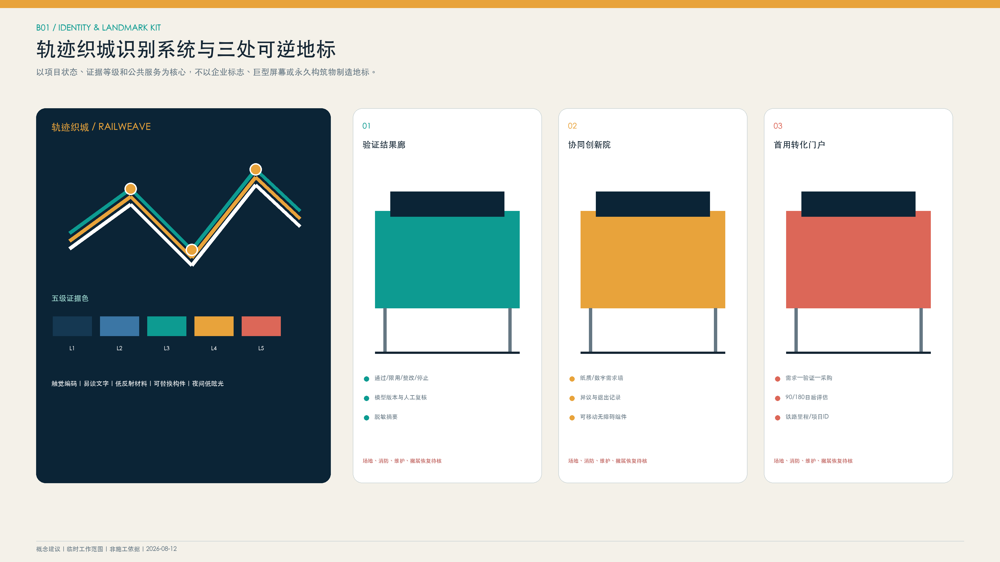

三处地标采用同一套可替换构件、触觉编码、易读文字和低眩光照明，不设置企业主标识和持续追踪设备。验证结果廊呈现通过、限用、整改和停止四类状态；协同创新院同步保留纸质需求、异议和退出记录；首用转化门户解释需求、验证、依法采购、上线与后评估全链条。地标在日常维护、夜间管理、内容清权、数据边界和撤展恢复责任未明确前，不转入永久建设。

三处节点均属于 L5 低扰动设计建议，应控制建设体量和视觉影响，避免形成过度标志性构筑物；视觉标志、字体、人物、图片和史料须完成版权核验。清华园车站周边新增构筑物、灯光、活动和地下工程，应先核实文物保护范围、建设控制地带、考古和活动容量要求。[source:QINGHUAYUAN-HERITAGE]

## 更新项目清单、实施政策与分期计划

### 近期建议工作包：“一室、一舱、一池、四册”

- **一室**：建议在权属、消防、运营责任和开放时段经核验后，研究是否在 AI 原点利用一处共享首层设置需求受理、技术复现、成果转化咨询和人才住房转介功能；
- **一舱**：建议在场地、测试资质和专业条件具备后，研究是否在众智园设置室内可信测试验证空间，优先论证版本、能耗、断网运行和人工接管测试；高风险公共机器人测试须另行专项论证；
- **一池**：建议在需求、采购权限和运营条件具备后，研究是否在大钟寺建立线上场景需求清单和采购合规咨询机制，并依据实际需求论证实体发布空间规模；
- **四册**：建议由依法确定的责任角色研究编制《多方治理章程》《项目准入与分级测试手册》《数据与个人信息清单》《事故处置、申诉与退出手册》。

### 分期项目包

| 阶段 | 核心项目 | 交付成果 | 进入条件 | 调整退出条件 |
|---|---|---|---|---|
| **G0条件成立后建议0至6月：建章立制与基础准备** | 研究一室、一舱、一池、四册及三核场地、责任角色和服务对象台账 | 建议形成统一项目编号、需求登记、测试、采购和退出表单及指标基线调查计划 | 场地合法使用、现场责任、需求主体、数据使用和人工回退机制均经依法确认 | 缺少需求主体、数据依据或退出经费时不进入本方案下一阶段 [data:geometry/phasing.geojson#PHASE-V2-001] |
| **G0条件成立后建议6至18月：受控原型验证** | 可研究开展 2 至 3 期概念验证，并论证模型、端侧和封闭环境机器人验证及低风险场景应用 | 建议形成公开测试报告、依法采购或暂不采购的完整研究意见及季度风险和财务记录 | 概念验证可复现，关键事项完成独立复核，潜在应用和运维责任角色经依法确认 | 事故处置未闭环、人工负担明显增加或预算运维条件不足时暂停 [data:geometry/phasing.geojson#PHASE-V2-002] |
| **G0条件成立后建议18至36月：评估完善与条件性扩展** | 可研究完善 AI 原点多点服务网络、众智园限定开放测试以及大钟寺实体转化和国际交流功能的必要性 | 建议形成五年项目实施台账、专业深化图纸和连续两个评估周期结果 | 权属、规划、消防、文保、交通、市政、运营收支和公众协商条件均经相应程序确认 | 实际使用不足、持续资金缺失、风险超过阈值或权利人未同意时不予扩展 [data:geometry/phasing.geojson#PHASE-V2-003] |

本分期按照证据成熟度、可逆性和公共收益综合排序。月份从 G0 前置条件依法成立后起算，仅表达建议相对时序，不对应日历开工时间，不表示试点、预算、国际项目或扩建已经批准，也不作为政府建设时序或行政承诺。[depth:phasing_implementation]

### 三份项目台账与七级门控

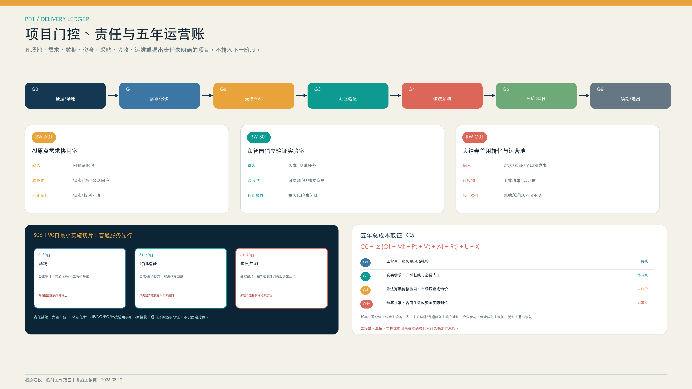

围绕 AI 原点需求协同、众智园独立测试验证和大钟寺首用转化，v2.2 已分别填实 `RW-A01`、`RW-B01`、`RW-C01` 三份全生命周期项目台账。完整内容见 `visual/assets/implementation_register.json`。台账不是对场地、主体、资金或采购结果的确认，而是明确哪些条件未满足时项目不得转段。

| 项目 | 主要输入 | 验收物 | 建议资金属性 | 暂停与退出 |
|---|---|---|---|---|
| RW-A01 AI原点需求协同室 | 公开依据、用户问题、非AI基线、场地与权益条件 | 需求简报、证据包、公众回应、PoC进入或不进入的书面理由 | 公益性基础服务为主；具体来源依法确定 | 需求所有者/权利不清、无法保留人工服务时暂停；删除数据并恢复场地 |
| RW-B01 众智园独立验证实验室 | 测试任务书、模型设备版本、风险分级、验收与停止条件 | 可复现测试包、版本标识、故障和接管记录、独立意见、公开摘要 | 共性测试底座与单项目验证分类核算 | 来源不清、重大风险或利益冲突未闭环时停止；清理数据和访问权限 |
| RW-C01 大钟寺首用转化与运营池 | 真实需求、独立验证、市场调研、全周期成本和合规意见 | 采购/合作建议、上线清单、SLA、培训、90/180日评价和退出回执 | 公益、验证与市场化应用分别核算 | 需求消失、采购条件不足、成本不可承受或用户拒绝采用时退出 |

项目统一执行 G0 证据与场地核验、G1 需求及公众复核、G2 受控原型、G3 独立验证、G4 依法采购或合作、G5 上线后 90/180 日评价、G6 续期整改或退出。前一阶段的责任角色、交付物、风险处置和签字条件未满足时，不建议转入下一阶段。`geometry/phasing.geojson` 中六项 `PC-V21-*` 对象将分期落实到可迁移组件，不再以整片重点区域代表一期建设范围。

### 证据核查、责任接续与成本取证

`visual/assets/verification_handoff_register.json` 将 G0 至 G2 的“待核实”转化为 8 项可移交任务，分别覆盖撤稿来源恢复、正式边界与场地权利、京张轴连续开放和无障碍、AI 原点共享首层、众智园受控测试条件、大钟寺真实需求及采购前提、非 AI 服务基线和 G0 至 G6 责任接收。建议后续按照“角色占位、依法任命、书面接收”的程序推进：拟议资料维护角色须在依法任命后，将问题、来源、现场方法、所需确认、禁止转段条件和交接物一并移交；任命依据、接收回执和接收时间未形成机器记录前，不得将对象表述为具备实施条件。[metric:verification_handoff_item_count]

`visual/assets/cost_evidence_plan.json` 将五年总成本拆解为 10 项取证科目，覆盖空间与安全配置、设备与版本更新、人员和人工接管、无障碍与普通服务等价、独立验证、公众参与、保险应急、维护更新及退出恢复。[metric:cost_evidence_item_count] G0 后先核验场地、工程量和服务量，G1 确认真实需求及非 AI 基线，G4 由依法确定的采购财务法务角色依适用规则开展公开价格检索、市场调查或询价，并统一税费、质保、人员、能耗、维护、更新和退出口径。G1 公众参与、G3 独立验证等前置服务如需发生费用，必须在服务开始前取得适用的合法授权和明确资金来源，不得先发生费用后在 G4 补办。每项均预留工程量证据、价格样本及日期、可比性调整、税费口径、预算资金、采购合同和确认状态等机器字段；空值明确表示未取证。工程量、单价、责任主体或服务范围未核验的条目排除在确定性总额之外；预算批准、合同生效或资金实际到位前，不得标记为已落实。人工服务、无障碍、申诉、独立复核、维护和退出属于必要成本，不得为压低报价而删除。

为避免“空表取价”，S06 已登记两项 2026 年北京市官方公开项目级样本：视力导医人工服务成交额 44.15 万元，对应不少于 3000 次、最长一年服务；无障碍改造抽查项目预算及最高限价 17 万元，工作包为 1000 人入户检查、4000 人电话调查及历史问题回访，履行期六个月。[source:BJ-ACCESS-GUIDE-SERVICE-2026] [source:BJ-ACCESS-HOME-AUDIT-2026] 两者均只用于识别后续询价对象和项目量级：不换算单价，不按周期直接折算 S06 金额，不构成预算、政府指导价或采购结果。另将缺少工作量分母的 36 万元评测项目仅列为背景上限，并排除年份、规格与报价口径不可比的 2020 年固定导视样本。[source:BJ-ACCESS-EVALUATION-2026] [source:BJ-HOSPITAL-SIGNAGE-2020] 后续只有在点位、时段、班次、用户样本和验收要求确定，且取得不少于三份同期可比报价后，方可进入 G4 成本评审。

### 组织责任、资金运营与公众参与

建议构建“区级统筹、属地协同、实施主体负责、需求单位牵引、专业机构复核、公众代表监督”的工作机制。RACI 设置统筹协调、依法确定的实施主体或场地权利人、需求或应用单位、技术与运营服务、独立验证、数据安全、采购财务法务审计、公众与用户监督八类角色；原则上每项任务只设一个最终负责者。具体单位及授权边界应依照法定程序、协议和采购结果确定。

现阶段缺少场地面积、设备清单、并发能力、人员编制和市场报价，不给出人民币总投资结论。五年总成本采用 `TC5 = C0 + Σ(Ot + Mt + Pt + Vt + At + Rt) + U + X`：分别计入初始配置、人员运营、技术算力软件、场地设施、独立验证、公众参与与无障碍、保险应急、中期更新以及退出恢复。直接技术/设备/场地、人员运营、独立验证与合规、公众与无障碍、保险应急退出等比例区间只用于概念阶段控制，允许交叉，不得直接相加成报价；预算未批复、合同未生效或资金未到账前，不得表述为已落实。[source:BEIJING-URBAN-RENEWAL] [source:HAIDIAN-RENEWAL-GUIDE]

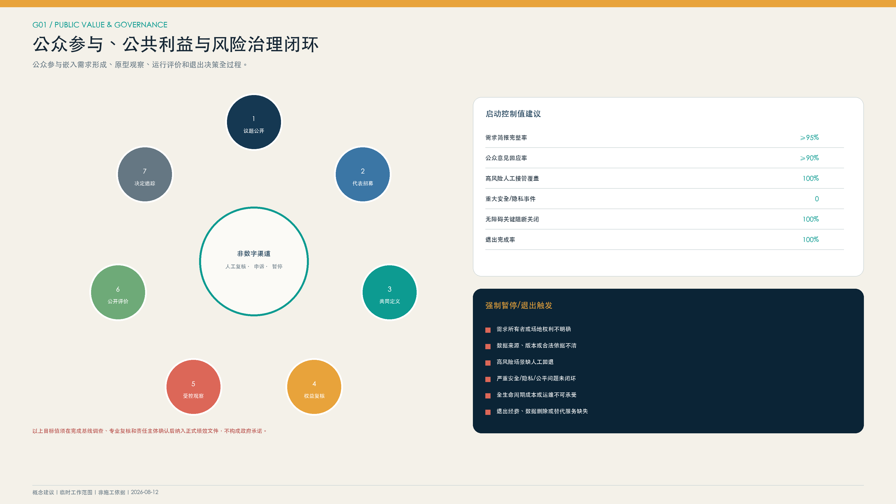

公众参与采用“议题公开—代表性招募—共同定义—权益与数据复核—受控观察—公开评价—决定与追踪”七阶段闭环，线上、线下、纸质、电话和人工协助渠道并行。对老年人、残障人士、未成年人及其他需要特别保护的群体提供相应支持；参与意见不替代个人信息同意、场地权利同意或法定审批。重大异议须逐项回应，高风险事项保留公众代表暂停建议、独立复核和申诉渠道。

### 年度运营与国际传播

年度运营以“问题进场—独立验证—首用转化—公共价值复盘—解编归档”为主线。下列名称是候选运营品牌，不是已确定的活动、场地或日历安排。

| 年度环节 | 核心空间与转段 | 关键交付 | 绩效与退出判断 |
|---|---|---|---|
| “京张开放问题季” | AI原点，G0/G1 后方可转入 PoC | 需求简报、非AI基线、公众回应和不进入PoC的理由 | 有效需求、重大异议回应和普通服务保留；需求/权利不清即退出 |
| “可信验证开放周” | 众智园，G2/G3受控复现与限定公众观察 | 可复现测试包、故障接管记录、独立意见和脱敏摘要 | 复现率、档案完整和人工接管；重大问题或利益冲突未闭环则停止 |
| “首用转化证据季” | 大钟寺，G3/G4后衔接合法路径 | 市场调研、全周期成本、依法采购/合作或暂不采购的书面意见 | 合法路径和实际应用分列；无应用单位、预算/采购权限不成立时退出 |
| “90日公共价值复盘” | 实际部署现场与公开复盘接口，G5/G6决定续期、整改或退出 | 实际使用、故障申诉、人工负担、普通服务等价和未解决事项 | 持续使用、申诉闭环、事件恢复；安全/隐私事件或维护退出资源不足时退出 |
| “轨迹解编与公共知识年鉴” | 三核双语档案，仅G6责任接续完成项目可归档 | 失败/退出案例、可复用问题和测试模板、贡献更正记录 | 退出完成、责任关闭和档案可访问；权利未清或含敏感信息不公开 |

开发者社区按“共同理解开放问题—提交固定版本和可复现包—接受独立验证—在多团队可比较与合法程序下形成应用意见—共同复核真实使用—清权后沉淀公共知识”接续。参与不构成采购优先权、供应商资格、投资承诺或部署许可。完整登记内容见 `visual/assets/annual_operations_register.json`。

国际传播与年度运营同步设置发布审查边界：`AO-01` 经权利、隐私和数据审查后发布双语开放问题及非 AI 基线；`AO-02` 仅发布脱敏验证结论、适用限制和未关闭事项；`AO-03` 区分应用转化路径与采购决定，不将展示、测试或参与表述为采用；`AO-04` 经脱敏、隐私和权益审查后，以汇总方式发布实际使用、失败、申诉、整改和退出情况；`AO-05` 在完成版权、知识产权、数据跨境和出口管制审查后，汇编年鉴与可复用模板。任一审查未通过的内容不对外发布，并保留纠错、撤回和版本记录。

国际传播以中英双语项目档案、开放问题清单、可复核结果和失败案例为主要载体；数据跨境、出口管制、知识产权和合作事项须另行依法审查，不以访问量、签约数或机构名称暗示合作已经落地。[source:CASE-BLOXHUB]

## 指标体系、面积复算与合规矩阵

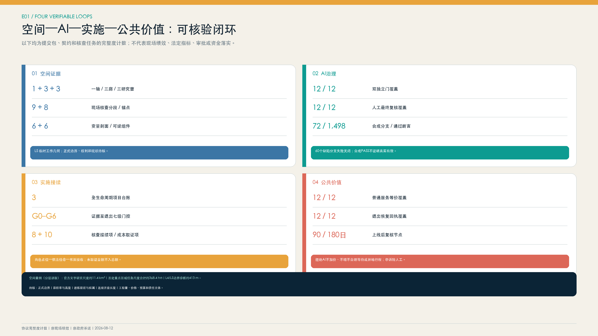

指标体系分为官方基线、开放数据辅助研判、L5 方案指标和实施绩效四类。所有比例指标同步报告分子与分母，暂停、终止和退出项目均纳入统计。

为兼容仓库现行静态可视化校验契约，`metrics.json` 保留 `site_area_sqm`、`green_ratio` 和 `public_space_ratio` 三个旧字段作为弃用兼容别名，分别映射到临时工作范围面积、概念蓝绿网络包络比和概念行动包络比。[metric:site_area_sqm] [metric:green_ratio] [metric:public_space_ratio] 旧字段不恢复其法定规划语义，不得作为正式用地面积、绿地率或公共空间率引用；对外解释应使用对应的新字段名称、L5 等级及非官方限制。

| 指标组 | 指标 | 定义与状态 | 管理用途 |
|---|---|---|---|
| 官方基线 | 重点区域数量、场景模块数量 | 三处重点区域和十二类场景模块为已知计数 [metric:key_area_count] [metric:scenario_card_count] | 用于核验任务覆盖情况，不作为边界确认或项目批准依据 |
| 开放诊断 | 连续开放无障碍长度 | `field-verified step-free open network length`，当前待核实 [metric:continuous_open_greenway_length_m] | 评价慢行网络实际连续开放水平 |
| L5内部复算 | 临时工作范围、蓝绿网络包络、行动包络和核查线 | 分别登记为 `provisional_working_extent_area_sqm`、`conceptual_blue_green_network_envelope_ratio`、`conceptual_action_envelope_ratio` 和 `conceptual_audit_alignment_length_m` | 只校验方案内部一致性；不得称绿地率、公共空间率、道路长度或建成开放长度 |
| L5项目 | 重点项目与横向廊道数量 | 三项重点项目、三条横向廊道为方案计数 [metric:flagship_project_count] [metric:crosslink_count] | 校核三个核心功能节点和总体结构的完整性 |
| 协议完整度 | 双独立门与人工复核覆盖 | 两项均为 12/12 [metric:dual_independent_gate_coverage_ratio] [metric:human_review_contract_coverage_ratio] | 只校核十二份契约必填字段，不表示现场已执行或绩效达标 |
| 协议完整度 | 普通服务等价与退出恢复回执覆盖 | 两项均为 12/12 [metric:ordinary_service_equivalence_coverage_ratio] [metric:exit_restoration_receipt_coverage_ratio] | 只校核十二份契约必填字段，不表示现场已执行或绩效达标 |
| 实施接续 | 项目台账与阶段门控 | 3 份台账、7 级门控 [metric:implementation_register_count] [metric:stage_gate_count] | 检查实施链条是否完整；不代表项目或责任主体已落实 |
| 实施接续 | 核查交接与成本取证 | 8 项核查接续、10 项成本取证 [metric:verification_handoff_item_count] [metric:cost_evidence_item_count] | 检查证据接续是否完整；不代表资金、价格或采购已落实 |
| 实施绩效 | 有效需求率 | 通过需求核验项目数÷提交总数；完成基线调查后确定目标 | 避免设置缺少明确服务对象和实际需求的应用场景 |
| 实施绩效 | PoC可复现率 | 第三方复现成功数÷送测数 | 检验原点到众智园的证据质量 |
| 实施绩效 | 测试档案完整率 | 完成强制字段项目数÷已出结论项目数 | 完整不代表技术通过，但属于程序门槛 |
| 实施绩效 | 人工接管成功率 | 按时完成接管演练次数÷演练总数 | 量化人工接管和运营维护保障能力 |
| 实施绩效 | 申诉闭环率 | 章程时限内答复并记录结果数÷到期申诉数 | “已回复”和“已解决”分别报告 |
| 实施绩效 | 验证后应用率 | 进入合法合同或部署的项目数÷通过验证且有明确应用单位的项目数 | 缺少应用单位的项目单列，合同签署不替代实际使用评价 |
| 实施绩效 | 90天活跃使用率 | 满90天仍真实使用部署数÷已满90天部署数 | 签约未使用计为零 |
| 实施绩效 | 五年运营缺口 | 五年OPEX+更新维护−已确认收入/购买服务/出资 | 未确认收入不得纳入，决定是否扩建 |

下列数值为启动控制值建议，不是政府承诺或正式绩效目标。项目启动后，应先完成基线调查，再由依法确定的责任主体和专业机构复核；未达到安全、公共利益或持续使用门槛时，采取限用、整改、暂停或退出措施。

| 启动控制项 | 建议区间/门槛 | 频率 | 未达标处置 |
|---|---|---|---|
| 需求简报字段完整率 | 不低于95% | 每批 | 退回补充，不进入PoC |
| 公众意见回应率 | 不低于90%；重大异议100%说明状态 | 每轮 | 补充回应，必要时暂停转段 |
| 非数字服务保留率 | 涉及基本公共服务的场景100%保留 | 月度 | 暂停上线并恢复替代服务 |
| PoC可复现率 | 建议80%至90% | 每批 | 固定版本、补测、限用或停止 |
| 高风险人工接管覆盖 | 100% | 上线前及季度 | 不上线或立即限用 |
| 严重安全或隐私事件 | 0；发生即专项复核 | 实时/月报 | 停止、通报、修复和独立复核 |
| 90日持续使用率 | 建议60%至80% | 每项目90日 | 用户复核、调整或停止 |
| 180日持续使用率 | 建议50%至70% | 每项目180日 | 续期、替代或退出 |
| 无障碍关键阻断关闭 | 上线前100%关闭或提供等效服务 | 上线前/季度 | 延迟上线 |
| 退出完成率 | 100%，覆盖数据、合同、设备、场地和替代服务 | 每次退出 | 台账不关闭并持续整改 |

容积率（FAR）、建筑高度、建设规模、市政容量、经核验连续开放长度、无障碍连续长度、过街可达率和逐栋调查覆盖率现阶段均为待核实指标；`building_footprint_area_sqm` 不采用 v1 概念性建筑基底值。[metric:building_footprint_area_sqm] [depth:development_intensity_controls] 拓扑、合成回归和内部自检只确认数字化提交包或协议逻辑的结构完整性，不证明现实可实施性。`design_depth_matrix.status=complete` 表示该事项已形成可审查的投稿响应；设计准备度、证据上限和待补充资料分别记录在 `current_depth`、`evidence_ceiling` 和 `blocking_inputs` 字段中。[depth:metrics_recalculation] [depth:risk_missing_data]

## 风险、版权与合规说明

### 最高优先级成果发布风险（P0）

1. **临时工作边界被误读为法定边界**：`SITE-001` 和三处重点区域应显著标注“研究索引，非法定红线”。未完成法定边界、临时工作边界和设计建议的图例及线型区分前，相关图件不纳入发布成果。[source:BOUNDARY-SOURCE] [source:KEY-AREA-SOURCE]
2. **概念性功能组件被误读为建筑方案**：一室、一舱、一池和三处展示节点仅以项目接口和临时行动范围表达。建筑调查和审批条件未落实前，不确定建筑基底或建设规模。
3. **局部实施数据超范围使用**：蓝景丽家局部面积、规模、高度和交通数据应通过加粗边界限定适用范围，不用于大钟寺片区或总体设计范围指标推算。[source:LANJING-IMPLEMENTATION] [source:LANJING-TRAFFIC]
4. **工程建设状态与开放使用状态混淆**：二期配套项目完成情况不作为约 9 km 全线连续开放的依据，应逐段记录开放、围挡和无障碍状态。[source:PARK-PHASE2]
5. **文物保护、水务、铁路和轨道安全条件缺失**：清华园车站、河道、地下铁路、13 号线和道路条件缺少正式坐标时，不确定永久设备、桥隧、跨线和地下工程方案。[source:QINGHUAYUAN-HERITAGE]
6. **数字化成果校验与专业设计深度混淆**：JSON、拓扑和渲染内部校核结果不代表已达到控规、综合实施方案或建筑设计深度。[standard:MOHURD-CONTROL-DETAILED-PLANNING]
7. **开放数据精度与现状核验不足**：开放底图仅用于工作底图和踏勘索引。其与临时范围出现的计算留档值约 412.684 米，按整米显示为约 413 米，并按资料冲突登记，不据此修正法定边界；产权、结构、消防、用途、站口、客流和无障碍条件应通过正式资料、现场调查和专业核验确定。[source:OSM-WORKING-DATA] [source:SPATIAL-SOURCE-CONFLICT-REGISTER] [data:visual/assets/spatial_source_conflicts.json#SC-OSM-SITE-001]
8. **AI概念表现被误认作现状或工程方案**：三张场景图只用于解释空间体验，均须保留“AI生成概念表现、非现状证据”说明，不据此确定位置、建筑、景观、人物、投资或建设效果。
9. **测试、采购与商业转化利益冲突**：被测供应单位不得单方出具独立验证结论；测试结果不预设采购方式、供应商或成交结果，利益冲突须披露并记录回避措施。
10. **网络安全、未成年人和劳动影响**：涉及网络攻击、儿童数据或一线劳动组织的项目须另行开展风险评估；不得以劳动绩效画像、隐性监控或自动决定替代依法应由人员承担的职责。
11. **供应商退出与持续运营风险**：合同和技术架构应保留数据导出、人工业务恢复、替代服务、设备返还、账号撤销和场地恢复条件，不因专有接口形成不可退出依赖。
12. **合成测试被误读为现场成效**：72条合成分支只验证织入契约的逻辑回归，不证明技术准确、安全、公众接受、法律合规或实际使用效果。

### 人工智能治理、个人信息保护与公共责任

所有公共服务应保留人工决定和非智能服务渠道，落实清晰告知、撤回和申诉机制。禁止开展无感人脸识别、持续身份轨迹采集、未经同意的情绪或行为画像，不得以算法替代法定职责。公共数据以及学校、医疗、园区数据不得因同属创新带而擅自合并使用。涉及个人信息、高风险AI、公共安全、未成年人或跨境数据的项目，须由依法确定的数据控制、安全和专业责任角色出具明确意见。技术供应单位应登记版本、数据、能耗、维护、事故处置、保险、劳动影响、知识产权和退出责任，并通过依法适用的公平程序参与项目。[source:BEIJING-SCENARIO-DEMAND]

### 版权与开放

正文、参与者原创 GeoJSON、信息设计、HTML、图册、验证脚本与合成案例按 CC BY 4.0 开放。v2.2 空间图件嵌入经筛选的 L4 OSM 矢量快照，并在每张相关图件内保留数据日期、`© OpenStreetMap contributors` 与 ODbL 1.0 署名；不使用商业地图瓦片。建筑轮廓仅作方位线索，具名京张公园多边形仅用于暴露临时范围错位，均不写入参与者正式 GeoJSON 或指标。三张重点片区体验图由 OpenAI 图像生成工具依据本方案原创提示生成，作为语言中性的概念表现使用；提示词、生成性质、使用边界和文件清单登记在 `report/copyright_statement.md`。项目不复制受限新闻图片、企业商标、同行方案文字、图件、schema或代码。机构名称仅用于来源或潜在主体类型，不代表其参与、授权、背书或承诺。[source:SOURCE-REGISTRY] [source:OSM-WORKING-DATA]

## 参考资料

### L1 / L2 / L3 官方任务、规划、更新与工程事实

- 百年京张 AI 创新带征集公告：明确三层约规模、文字范围与任务；尚未取得官方发布的矢量边界数据。[source:OFFICIAL-ANNOUNCEMENT]
- 京张沿线 `HD00-1601` 等街区控规采信通告：只支撑控规存在和公开采信事项。[source:JINGZHANG-CONTROL-NOTICE]
- 众智园、大钟寺历史城市更新公示：当前链接已撤稿或删除，仅保留为待官方归档或清权附件补证的检索线索，不支撑边界、主体、宗地拆改或实施结论。[source:ZHONGZHIYUAN-RENEWAL] [source:DAZHONGSI-RENEWAL]
- 蓝景丽家实施和交通资料：只在对应局部实施单元内有效。[source:LANJING-IMPLEMENTATION] [source:LANJING-TRAFFIC]
- 京张公园一期、二期官方信息：分段记录建设与开放状态；二期资料不作为全线连续开放的认定依据。[source:PARK-PHASE1] [source:PARK-PHASE2]
- 清华园车站保护要求：文字要求可用，正式坐标仍需索取。[source:QINGHUAYUAN-HERITAGE]
- AI 原点社区和人才服务站：支撑分布式载体与人机协同服务原型，不代表空间授权。[source:AI-ORIGIN-2026] [source:AI-ORIGIN-TALENT-STATION]
- 海淀 2025 统计公报与北京市场景需求：支撑区级生态基线和场景机制，不外推廊道企业数量或预算。[source:HAIDIAN-STATS-2025] [source:BEIJING-SCENARIO-DEMAND]
- 北京城市更新条例、海淀更新实施指引：支撑实施主体、权利人协商、资金和运营要求。[source:BEIJING-URBAN-RENEWAL] [source:HAIDIAN-RENEWAL-GUIDE]

### L4 开放工作底图

- OpenStreetMap 路网、步骑、轨道、站点和水系快照日期为 2026-08-11，建筑为 2026-07-08，POI 为 2026-05-06；ODbL。成图加载经筛选的主路、步骑、运营铁路、具名轨道站、水系、建筑轮廓和具名京张公园多边形。建筑只作方位线索，公园多边形只作范围错位诊断；二者均不进入参与者正式 GeoJSON 或指标。[source:OSM-WORKING-DATA]

### L5 任务书、设计包与专业标准

- `brief/site-package/`、面向智能体任务书与来源注册表。[source:SITE-PACKAGE] [source:AGENT-TASKBOOK] [source:SOURCE-REGISTRY]
- 项目公告、面向智能体任务书和城市设计管理要求构成任务及城市设计依据。[standard:PROJECT-OFFICIAL-ANNOUNCEMENT] [standard:PROJECT-AGENT-OPEN-CALL-TASKBOOK] [standard:MOHURD-URBAN-DESIGN-MEASURES]
- 控规、国土空间用地分类和建筑设计深度标准用于限定方案表达深度。[standard:MOHURD-CONTROL-DETAILED-PLANNING] [standard:MNR-LAND-USE-CLASSIFICATION-GUIDE] [standard:MOHURD-ARCH-DESIGN-DEPTH-2016]
- Vector Institute、Mila 与 Station F 案例仅用于创新生态组织机制比较。[source:CASE-VECTOR-TORONTO] [source:CASE-MILA-MONTREAL] [source:CASE-STATION-F]
- Maria 01 与 MaRS 案例仅用于空间运营和转化服务机制比较。[source:CASE-MARIA-01] [source:CASE-MARS-TORONTO]
- 22@Barcelona 与 BLOXHUB 案例仅用于创新城区和公共价值机制比较。[source:CASE-22BARCELONA] [source:CASE-BLOXHUB]

本方案成果的审查重点是明确区分正式依据、官方文字范围、开放数据、设计建议和待补充资料，并建立相应的更新复算机制。全部空间建议均属于 L5 设计建议，仅供方案研究和后续深化使用（非施工依据 / NOT FOR CONSTRUCTION），不替代法定规划、政府审定、工程可行性论证、采购结果或投资承诺。[depth:risk_missing_data]
