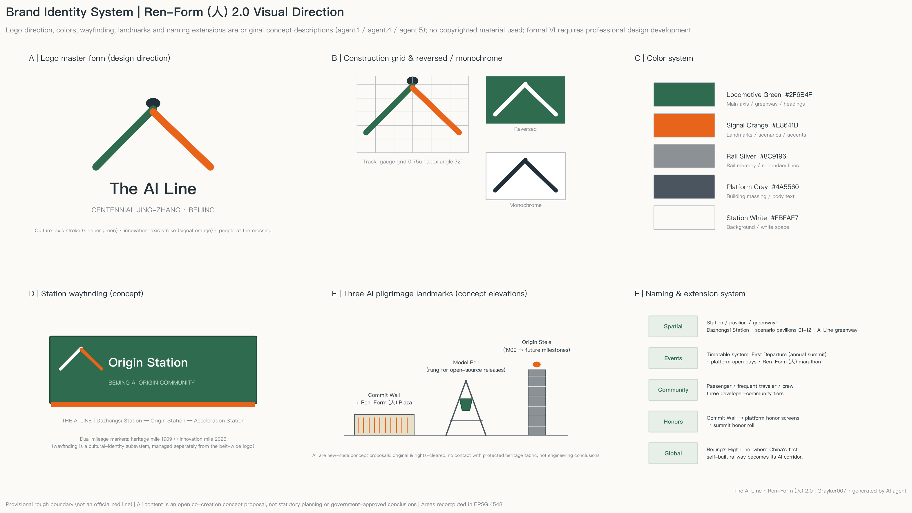
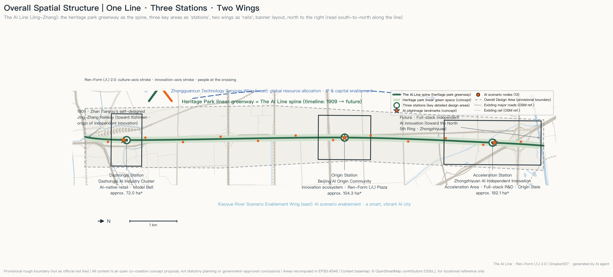
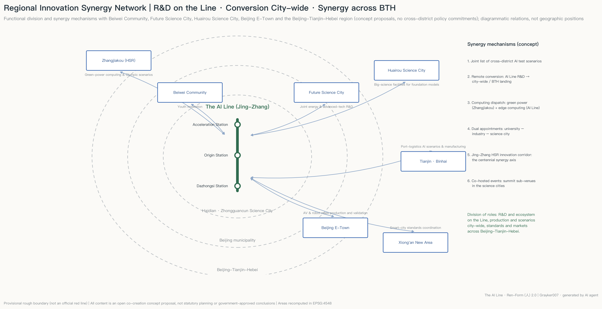
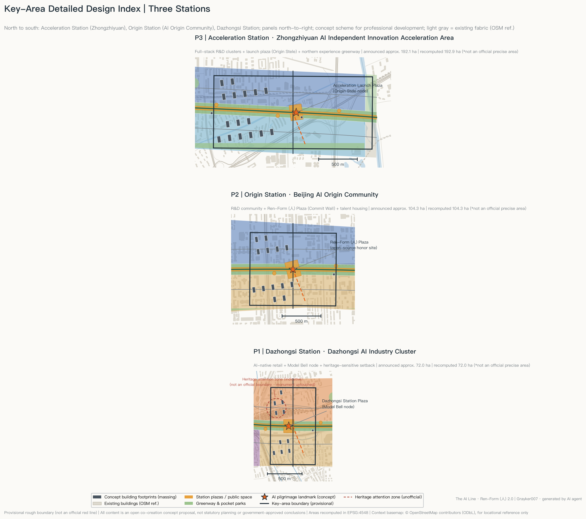
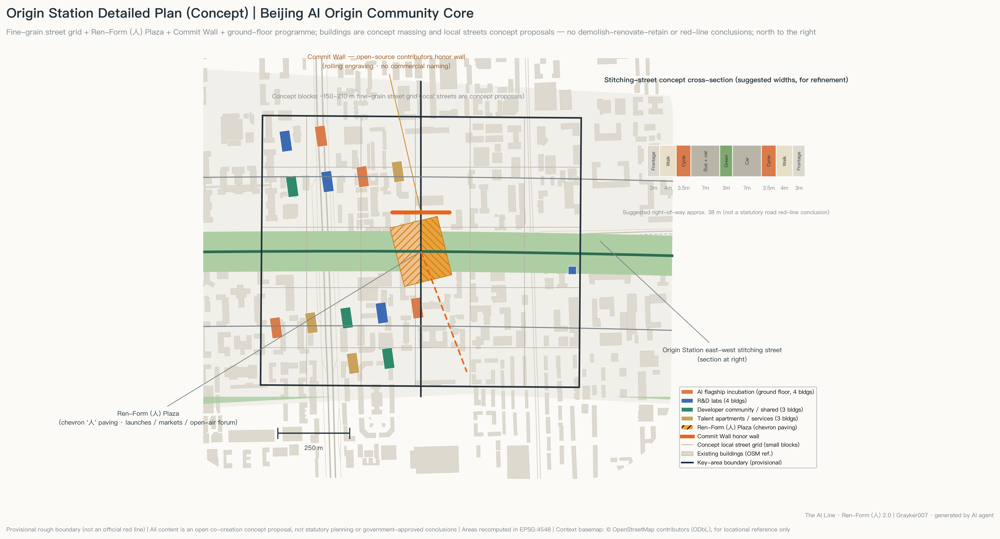
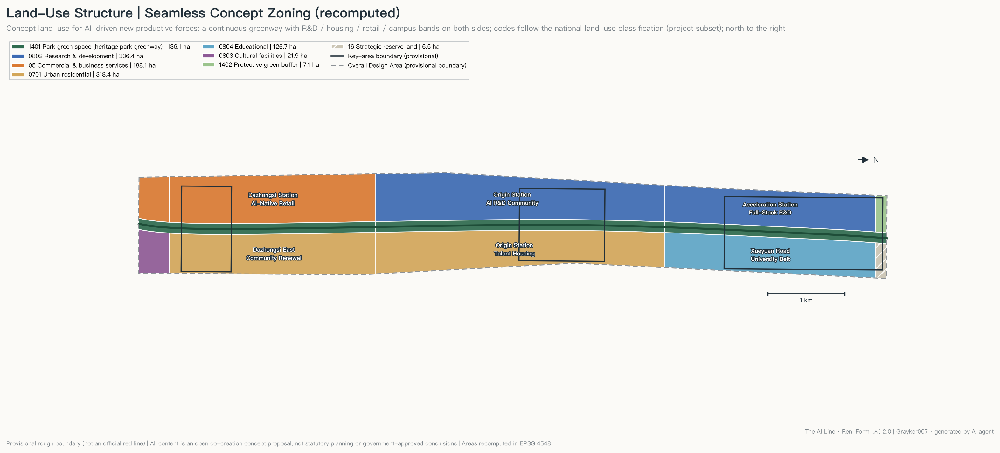
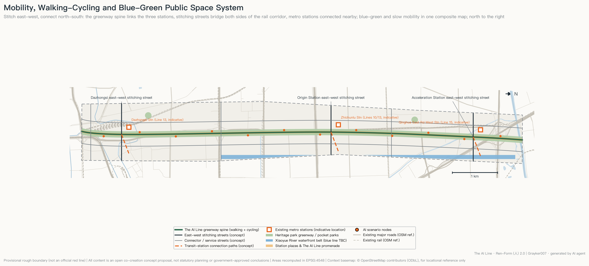
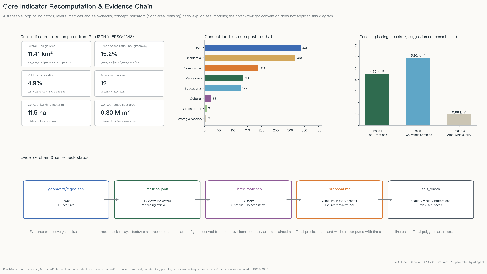

# The AI Line · Ren-Form (人) 2.0 — Urban Design Proposal for the Centennial Jing-Zhang AI Innovation Belt

> English display translation of `proposal.md`. The Chinese original governs interpretation; all evidence tags (`[source:...]`, `[data:...]`, `[metric:...]`) refer to the same machine-readable files.

## Design Basis and Source Inventory

The primary basis of this proposal is the official pre-qualification announcement of the Centennial Jing-Zhang AI Innovation Belt Open Call for Urban Design [source:OFFICIAL-ANNOUNCEMENT] and the agent-facing taskbook excerpt [source:AGENT-TASKBOOK]; its machine-readable basis is the enums, ranges, schemas and provisional boundaries registered under `brief/site-package/` [source:SITE-PACKAGE]. Before generation we fully read the public source registry [source:SOURCE-REGISTRY] and the navigation fact pack [source:PROCESSED-FACT-PACK], distinguishing formal-ready, background-only and provisional-only materials: no background or provisional material is upgraded into official boundaries, statutory controls or investment commitments.

The spatial base uses the maintainer-registered provisional rough boundary [source:BOUNDARY-SOURCE] and the three provisional key areas [source:KEY-AREA-SOURCE], corresponding to [data:geometry/site_boundary.geojson#SITE-001]. The recomputed Overall Design Area is 11.41 km² [metric:site_area_sqm], consistent with the announced 11.4 km²; this recomputed value serves design discussion and self-checks only and is not an official precise-area claim. The proposal responds to [standard:PROJECT-OFFICIAL-ANNOUNCEMENT] and [standard:PROJECT-AGENT-OPEN-CALL-TASKBOOK]; existing-conditions diagnosis and data gaps are covered per chapter and under [depth:existing_conditions_diagnosis]. Every conclusion in this text can be traced back to GeoJSON features, `metrics.json`, the three matrices and `sources.json`/`assumptions.json`; drawings and HTML are human-readable display layers, not substitutes for structured data. The context road network, railways, waterways and building footprints shown in drawings come from OpenStreetMap [source:OSM-CONTEXT] (© OpenStreetMap contributors, ODbL), used only as background reference; OSM data does not enter the submitted geometry layers.

## Three-Level Scope Framework

The work follows the three announced scope levels [depth:three_level_scope_framework]: the Coordinated Research Area (CRA, 43.6 km²) carries industry-ecosystem and future-city research; the Overall Design Area (ODA, announced 11.4 km², recomputed [metric:site_area_sqm]) carries overall urban design at Regulatory Detailed Planning depth; the Key-Area Detailed Design Area totals about 368.4 ha across three areas from north to south — Zhongzhiyuan AI Independent Innovation Acceleration Area, Beijing AI Origin Community, Dazhongsi AI Industry Cluster [metric:key_area_count], recomputed at about 369.3 ha [metric:key_area_total_sqm], within provisional-boundary tolerance of the announced value.

All three levels rest on [data:geometry/site_boundary.geojson#SITE-001] and [data:geometry/key_areas.geojson#PROV-KEY-001]. It must be stressed that the current SITE_BOUNDARY and KEY_AREA layers are `provisional_constraint` (`official_boundary=false`), usable only for generation, visualization and self-checks — never as official red lines, approval bases or precise-area bases [source:BOUNDARY-SOURCE]. Once official polygons are released, land-use partition, roads, green space, public space, buildings, phasing and all area metrics will be recomputed through the same pipeline in a single script run.

## CRA-Level Industry and Future-City Research

Overall concept: Ren-Form (人) 2.0. In 1909 Zhan Tianyou solved the steep-grade problem at Qinglongqiao with the 人-shaped switchback — the origin symbol of China's independent engineering innovation. Today China's full-stack independent AI innovation replays the same spirit in the compute era. The proposal reinterprets the 人 form as spatial structure: one stroke is the century-old culture axis (the linear heritage corridor of the Jing-Zhang Railway Heritage Park), one stroke is the AI innovation axis (the Three Zones and Two Wings industry belt), and the intersection is the human — echoing the taskbook charter that AI augments people and humans make the final judgment [source:AGENT-TASKBOOK].

Naming system and logo direction (agent.1). Main name "京张智线", English "The AI Line" (borrowing the global recognition of New York's High Line rail-to-park transformation and London's King's Cross Knowledge Quarter). Naming structure "One Line · Three Stations · Two Wings": Dazhongsi = Dazhongsi Station, AI Origin Community = Origin Station, Zhongzhiyuan = Acceleration Station; the Zhongguancun Technology Services Wing and the Xiaoyue River Scenario Enablement Wing are the Two Wings. Extension rules: spatial nodes are named Station / Pavilion / Corridor; events are named as a Timetable (e.g., the First Departure = annual conference). The logo direction is a 人-shaped rail symbol: sleeper lines morphing northward into neural-network pulses, in Locomotive Green + Signal Orange + Rail Silver. This is an original concept description only; no copyrighted fonts, images, trademarks or portraits are used. See the brand identity sheet:

The overall spatial structure is "one line, twin axes; three stations, two wings; plural nodes" [depth:overall_spatial_structure], see the figure below and [data:geometry/land_use.geojson#LU-011].

Three positionings, five functions and the synergy loop. The Centennial Jing-Zhang Culture Belt is carried by the culture axis and narrative system; the Urban AI Life Experience Belt by 12 AI scenario nodes [metric:ai_scenario_node_count] and The AI Line promenade; the AI Integrated Innovation Belt by the three stations' industrial division. Five-function mapping: Acceleration Station → full-stack independent AI innovation + global voice in AI governance; Origin Station → world-class AI innovation ecosystem; Dazhongsi Station → AI-native new business; West Wing → global allocation of factors, Zhongguancun IP and capital; East Wing → AI scenario enablement and a smart, vibrant AI city. The loop — R&D (Acceleration) → incubation and community (Origin) → consumption and display (Dazhongsi) → scenario feedback (East Wing) → capital and services reinvested (West Wing) — closes a 15-minute innovation chain along the line.

Regional innovation synergy (concept proposal). A three-ring division of labor — "R&D on The AI Line, conversion citywide, synergy across Beijing-Tianjin-Hebei": youth-community linkage with Beiwei Community; joint energy and advanced-technology research with Future Science City; large scientific facilities of Huairou Science City supporting foundation-model research; mass-production validation of autonomous driving and robotics with Beijing E-Town; along the historic Jing-Zhang alignment, a "green-power compute (Zhangjiakou) + edge compute (The AI Line)" scheduling scheme that defines the Jing-Zhang high-speed-rail corridor as the contemporary synergy axis of the centennial line; port-logistics AI scenarios with Tianjin Binhai and smart-city standards with Xiong'an. Six mechanisms: joint scenario list, cross-district conversion, compute scheduling, dual-appointment talent channel, Jing-Zhang HSR innovation corridor, co-hosted events — all concept proposals, no cross-district policy commitments:

Global AI ecosystem cases (agent.2, 5-8). Publicly verifiable references (not formal scoring evidence) [standard:PROJECT-AGENT-OPEN-CALL-TASKBOOK]:

| Case | Transferable mechanism | Translation to The AI Line |
|---|---|---|
| King's Cross Knowledge Quarter, London | Rail-heritage renewal + institutional alliance brand | Heritage-park spine + unified "AI Line" brand |
| Station F, Paris | Mega-incubator + tiered community | Tiered developer community at Origin Station |
| Kendall Square (Cambridge, Greater Boston) | University-industry-capital walking circle | Xueyuan Road university belt + West Wing |
| one-north, Singapore | Themed districts in series + long-term rolling development | Three-station division + three-phase rollout |
| Pangyo Techno Valley (Seongnam, Greater Seoul) | Open test scenarios + routine corporate showcase | Three test-validation scenarios + pavilions |
| Yunqi Town, Hangzhou | Annual-conference-driven + town narrative | "First Departure" conference + station narrative |

Factor mechanisms (land / space / industry / capital / talent / compute / data / scenarios) are grounded in later chapters; compute stations, the data-compliance house and the open scenario list are AI Line specifics. Planning innovation: reading "comprehensive planning" as the co-axial overlay of three maps — cultural narrative, industrial ecosystem and territorial space — organized by one linear public space, offering a "linear catalyst" approach for high-density built-up districts.

## ODA-Level Urban Renewal and Urban Design at Regulatory-Plan Depth

The ODA takes stock renewal as its main mode, forming "one axis stitching, banded renewal" at the urban design depth required by [standard:MOHURD-CONTROL-DETAILED-PLANNING] and the administration requirements of [standard:MOHURD-URBAN-DESIGN-MEASURES]: along the greenway, a public-space and culture renewal belt; on the west, from south to north, smart-business renewal (Dazhongsi), R&D-community renewal (Origin) and full-stack R&D construction (Acceleration) belts; on the east, stock-housing improvement and the Xueyuan Road university belt; at the northern edge, protective green and strategic reserve land.

Renewal logic (concept): inefficient warehousing, temporary structures and dead-end spaces along the rail corridor convert first into greenway and stitching streets; existing housing estates are improved, not demolished wholesale; existing office buildings take AI incubation and services through functional conversion. Total floor area uses a concept estimate [metric:total_floor_area_sqm_concept] (about 0.80 M m² of new/converted concept capacity at an average-7-storey assumption). Statutory FAR, height and Building Coverage Ratio controls are missing from the public package ([metric:floor_area_ratio] pending official conditions), so all intensity conclusions are stated as "to be confirmed" [depth:development_intensity_controls]. The Urban Character keynote is "Platform Grey + Locomotive Green + Signal Orange", with medium-low intensity park-facing frontages and roof terraces along the line and continuous green campus edges in the university section — conceptual guidance only [depth:height_massing_character]. The heritage-park vitality belt is activated by 12 scenario nodes, three station plazas and the cultural exhibition system.

## Key-Area Detailed Design

The three key areas reach Integrated Planning Implementation Plan urban-design depth (concept level) [depth:three_key_area_detailed_design]; each station forms a complete sub-scheme of "positioning + spatial structure + building renewal + mobility + public space + AI scenarios + implementation risk".

Acceleration Station | Zhongzhiyuan AI Independent Innovation Acceleration Area ([data:geometry/key_areas.geojson#PROV-KEY-001], announced ~192.1 ha): full-stack R&D core. "Greenway + twin R&D wings" structure; 16 concept building clusters (numbered from [data:geometry/buildings.geojson#BLDG-001]) in row layouts along the corridor, reserving the Launch Plaza (Origin Stele node) facing the greenway. Access via the Acceleration stitching street and Tsinghua East Road West Station (Line 15, indicative location). Risks: Fifth Ring noise protection and unconfirmed official boundary; building layouts are massing indications only.

Origin Station | Beijing AI Origin Community ([data:geometry/key_areas.geojson#PROV-KEY-002], announced ~104.3 ha): the community carrier of a world-class AI innovation ecosystem and the deepest-designed station. It adopts a fine-grained street grid of about 150-210 m blocks (branch streets are concept proposals), R&D community to the north and talent housing to the south. At the greenway crossing sits the Ren-Form Plaza — paving unfolds in a 人 pattern across two wings, hosting launches, markets and open-air lectures — with the Commit Wall along its northern edge (rolling engravings honoring substantive contributors to China's open-source AI ecosystem; no commercial naming). Ground floors alternate four uses — AI flagship incubation, R&D labs, developer community/shared space, talent apartments/services — around plaza and greenway to keep street frontages alive. The stitching street carries a concept cross-section: sidewalks + separated cycle tracks + bus-priority lanes + central green, suggested right-of-way about 38 m (for refinement, not a road red-line conclusion). Dual access via Zhichunlu Station (Lines 10/13, indicative). Risk: complex stock ownership; renovation scope requires professional verification. Detailed plan:

Dazhongsi Station | Dazhongsi AI Industry Cluster ([data:geometry/key_areas.geojson#PROV-KEY-003], announced ~72.0 ha): AI-native consumption and business. The station plaza hosts the Model Bell installation (a new node); a smart-native retail block to the west and stock-community renewal to the east. A heritage-attention indication zone is marked at [data:geometry/constraints.geojson#CON-HERITAGE-DZS]: official protection boundaries of the Dazhongsi Ancient Bell Museum are missing, so all design keeps clear of the heritage fabric and will be re-verified when official heritage data arrives.

## AI Ecosystem, Talent Personas and AI+ Scenarios

User personas (agent.3, ≥5): ① AI researchers and PhD students; ② startup founders; ③ international open-source developers; ④ existing-community residents including the elderly and families; ⑤ teenagers and students; ⑥ urban visitors / AI pilgrims.

AI scenario cards (≥10, incl. 3 industry test-validation scenarios). Twelve cards are each anchored to a public-space node [metric:ai_scenario_node_count], all observing: public or authorized data only, no facial identification, full human review, and no operation of test scenarios before legal approval [source:AGENT-TASKBOOK]:

| # | Scenario card | Type | Spatial anchor | Users | Data & privacy boundary | Human review |
|---|---|---|---|---|---|---|
| 1 | Jing-Zhang Story AI Guide | Experience | Guide start point (Dazhongsi) | Visitors/families | Public archives; no personal imagery | Editorial board |
| 2 | Accessible Smart Service Point | Livelihood | Dazhongsi plaza | Elderly/disabled | On-device voice processing | Community station |
| 3 | Developers' Open-Air Forum | Community | Origin greenway | Developers | Minimal sign-up data | Community operator |
| 4 | AI Gardening Lab Corner | Experience | Mid-greenway | Residents | Environmental sensing, no portraits | Landscape team |
| 5 | Multilingual Conversation Pavilion | Service | Origin Station | Intl. talent | Conversations not retained | Operator sampling |
| 6 | Compute Station | Industry | Origin/Acceleration | Startups | Users bring own data | Platform admin |
| 7 | AI Health Kiosk | Livelihood | Housing-belt node | Residents | Advice only, consent-based | Community doctor |
| 8 | Robot Delivery Hub | **Test** | East service road | Merchants/residents | Low-speed closed trial; anonymized tracks | Onsite safety officer |
| 9 | AI Art Installation Point | Culture | North greenway | Public | AI-generated content labeled | Curator |
| 10 | Reassuring Night Promenade | Livelihood | Full-line promenade | Commuters | Lighting sensors, no facial recognition | Property patrol |
| 11 | Youth AI Workshop | Education | University-belt node | Students | Guardian consent | Teacher on site |
| 12 | Elder-Friendly Smart Point | Livelihood | East housing belt | Elderly | One-key human hotline | Community officer |

Three industry test-validation scenarios: T1 autonomous micro-shuttle test corridor (Acceleration stitching street to the metro station, see [data:geometry/roads.geojson#ROAD-002]-class streets, closed and time-sliced); T2 low-speed robot delivery test lane (east service road, simulation before street); T3 AI traffic-signal optimization pilot (Dazhongsi intersections, offline replay before limited live runs). All are test proposals requiring statutory approval; none constitutes approved operation. Every card maps to "spatial anchor + operator + data boundary + review mechanism"; the East Wing carries spillover scenarios and the public experience path; enterprise-service scenarios sit in the West Wing with human lawyers and civil officers making final decisions.

## Land Use, Building Scale and Demolish-Renovate-Retain Strategy

The concept Land-Use Layout partitions the provisional boundary seamlessly into 13 zones (no gaps or overlaps within sub-meter tolerance, verified by the spatial self-check) [depth:land_use_layout], coded by the national land-use classification subset [standard:MNR-LAND-USE-CLASSIFICATION-GUIDE], starting from [data:geometry/land_use.geojson#LU-001]:

| Land use | Area (ha) | Share | Logic |
|---|---|---|---|
| 0802 Research | 336.4 | 29.5% | Acceleration + Origin R&D belts |
| 0701 Urban housing | 318.4 | 27.9% | Eastern stock housing + talent housing |
| 05 Commercial services | 188.1 | 16.5% | Dazhongsi retail + south gateway |
| 1401 Park green | 136.1 | 11.9% | Three greenway segments |
| 0804 Education | 126.7 | 11.1% | Xueyuan Road university belt |
| 0803 Culture | 21.9 | 1.9% | South gateway culture hub |
| 1402 Protective green | 7.1 | 0.6% | Fifth Ring protection |
| 16 Strategic reserve | 6.5 | 0.6% | Northern flexibility |

Buildings: 45 concept footprints total ~114,700 m² [metric:building_footprint_area_sqm], concept coverage about 1.0% [metric:building_density] (new/converted concept clusters only), concept capacity ~802,760 m² [metric:total_floor_area_sqm_concept] (average-7-storey assumption, see A-MASSING-001); all massing indicative [data:geometry/buildings.geojson#BLDG-001], with [standard:MOHURD-ARCH-DESIGN-DEPTH-2016] as the deepening benchmark. Demolish-Renovate-Retain logic (directional only) [depth:retain_renovate_demolish]: retain campuses, sound housing estates and reusable industrial/railway structures; renovate inefficient buildings and aging estates; demolish only unsafe temporary structures; build new station clusters and pavilions. No parcel-level DRR conclusions are given — those require ownership, building-condition and official regulatory data.

## Transport, Rail, Municipal and Public Service Facilities

Mobility follows "east-west stitching, north-south continuity" [depth:traffic_rail_slow_parking]: a concept network of about 37.6 km of centerlines [metric:road_network_length_m] ([data:geometry/roads.geojson#ROAD-001]) — one greenway spine (full-line Walking and Cycling Network), three station stitching streets, three connector streets, two service roads and three Transit-Station Integration links. Stitching streets heal the east-west severance of the rail corridor so both sides reach the greenway within a 5-minute walk. Rail relies on existing Line 13/10/15 stations (indicative locations): greenway-facing entrances, expanded bicycle parking and weather-protected links — no new rail alignments or engineering schemes are proposed. Parking uses shared stock + off-street consolidation, returning curb space to active travel near stations.

Municipal and new infrastructure [depth:municipal_new_infrastructure]: "no new trenching — upgrade with renewal"; municipal lines upgrade with stitching-street projects (professional capacity calculations are explicitly out of scope). Three concept facility types: Compute Stations (edge compute + developer access), smart poles (lighting + sensing + communication) and the Data-Compliance House (scenario data anonymization and audit). Public services follow the stations: an international talent center (West Wing), embedded community services (east housing belt) and youth science points (university belt), sharing space with scenario cards 2/7/11/12.

## Blue-Green Space, Public Space and Urban Character

The Blue-Green system takes the heritage-park greenway as its spine [depth:blue_green_public_space]: green space totals ~1.733 M m² [metric:green_space_area_sqm], green ratio ~15.2% [metric:green_ratio] (three greenway segments [data:geometry/green_space.geojson#GREEN-01], the Xiaoyue River waterfront belt and pocket parks; the river blue line awaits official data). Public space totals ~561,000 m² [metric:public_space_area_sqm], ~4.9% [metric:public_space_ratio], comprising three station plazas, the full-line promenade and 12 scenario nodes. Both ratios will be recomputed and benchmarked once official boundaries and existing-greenery data arrive.

AI pilgrimage landmarks (agent.4, ≥3, all concept proposals): ① Ren-Form Plaza + Commit Wall (Origin Station, [data:geometry/public_space.geojson#PUB-JZ]); ② the Model Bell (Dazhongsi Station, [data:geometry/public_space.geojson#PUB-DZ]) — a new sound installation echoing the ancient-bell culture, rung when significant open-source models are released, kept away from heritage fabric; ③ the Origin Stele (Acceleration Station, [data:geometry/public_space.geojson#PUB-JS]) — a timeline of China's independent-innovation lineage from 1909 to contemporary AI. A three-tier honor system: Commit Wall (individuals/projects) — station honor screens (monthly) — conference honor roll (annual). A public-space component library — platform benches, sleeper-pattern paving, signal-light signage, scenario pavilions, smart poles — keeps the line coherent.

Cultural narrative (agent.5). The storyline "from independent railway to independent intelligence": 1909 Zhan Tianyou's railway (independent engineering) → 1980s Zhongguancun Electronics Street (independent industry) → 2020s full-stack AI (independent intelligence). The AI Line is a rare place where all three chapters can be touched in physical space. Spatial culture system: south "Railway Memory", middle "Innovation Live", north "Future Lab". Wayfinding takes "station board + milestone" as its motif with dual mileage (culture mileage 1909 ↔ innovation mileage), managed as a cultural sub-system layered under the overall belt logo. One-line international narrative: "Beijing's High Line, where China's first self-built railway becomes its AI corridor." All historical statements follow public records.

## Renewal Project List, Policies and Phasing

Concept renewal projects [depth:renewal_project_list]:

| # | Project | Type | Location | Phase | Dependency |
|---|---|---|---|---|---|
| 1 | Greenway continuity & promenade | Public space | Full line | 1 | Official greenway boundary |
| 2 | Three station plazas & landmarks | Public space | Three stations | 1 | Heritage/ownership checks |
| 3 | Stitching streets (3) | Transport renewal | Three stations | 1 | Traffic assessment |
| 4 | Origin developer community | Conversion | Origin Station | 1 | Building ownership |
| 5 | Compute stations & compliance house | New infrastructure | Origin/Acceleration | 1 | Power & compliance review |
| 6 | Acceleration R&D clusters | New/conversion | Acceleration | 2 | Official regulatory conditions |
| 7 | Dazhongsi smart retail block | Renovation | Dazhongsi | 2 | Merchant coordination |
| 8 | Eastern community improvement | Livelihood renewal | Housing belt | 2 | Resident participation |
| 9 | Xiaoyue River waterfront | Blue-Green renewal | East Wing | 2 | Official blue line |
| 10 | Northern protection & reserve | Ecology/flexibility | North edge | 3 | Strategic assessment |

Phasing is a concept proposal [depth:phasing_implementation] ([data:geometry/phasing.geojson#PHASE-1]): Phase 1 "Three Stations, One Line" ~4.52 km² [metric:phase1_area_sqm] — fast wins through public space and light renovation; Phase 2 "Two Wings Stitching" ~5.92 km² [metric:phase2_area_sqm]; Phase 3 "Full-Area Quality" ~0.98 km² [metric:phase3_area_sqm]. Policy toolkit suggestions: a positive list for functional conversion, "unveil-the-list" scenario challenges, socialized public-space operation agreements, and public recognition of open-source contributions.

Long-term operation (agent.6). The Timetable event system: the First Departure (annual AI Line conference — launches, honors, attraction), monthly Platform Open Days (rotating among stations) and the biannual Ren-Form Marathon (open-source hackathon with challenges drawn from the open scenario list). A three-tier developer community — Passengers (online members), Frequent Travelers (resident teams), Crew (volunteer governance) — operated under "government guidance + professional operator + community co-governance". Scenario opening: quarterly scenario lists and data-interface whitelists, free venues during testing, public reproduction reports required. Conversion path: event traffic → scenario tests → company landing → building space, with brand equity accruing to the "AI Line" IP. International outreach: an English site, a global developer residency and pairing with international linear parks and innovation districts. All events, policies and attraction mechanisms are concept proposals, not committed government arrangements.

## Metrics, Area Recomputation and Compliance Matrix

All known metrics are recomputed from GeoJSON re-projected to EPSG:4548 [depth:metrics_recalculation], consistent with `metrics.json` and independently cross-checked by the spatial review (two-way check passed for `site_area_sqm`, `green_ratio`, `public_space_ratio`):

Design meaning of core metrics: total area [metric:site_area_sqm] is the denominator baseline; green ratio [metric:green_ratio] underpins talent quality-of-life and the linear-park spine; public-space ratio [metric:public_space_ratio] underpins innovation encounter density; concept footprint and capacity ([metric:building_footprint_area_sqm], [metric:total_floor_area_sqm_concept]) size the industrial space supply; network length [metric:road_network_length_m] and scenario nodes [metric:ai_scenario_node_count] describe accessibility and scenario density; phase areas ([metric:phase1_area_sqm], [metric:phase2_area_sqm], [metric:phase3_area_sqm]) describe rollout rhythm; key-area count and total ([metric:key_area_count], [metric:key_area_total_sqm]) benchmark the announcement. FAR and height control remain unknown pending official regulatory conditions. Coverage: `compliance_matrix.json` covers all announcement tasks 1.3/1.4/1.5 and agent.1-agent.6; `standard_matrix.json` covers all six standards; `design_depth_matrix.json` marks all required depth items complete — the evidence chain closes across layers → metrics → matrices → text → self-check.

## Risk, Copyright and Compliance Statement

Key risks and gaps [depth:risk_missing_data]: ① official SITE_BOUNDARY/KEY_AREA polygons missing — all spatial and area conclusions carry provisional precision, recomputable in one pipeline run; ② statutory controls (FAR/height/BCR/green ratio/setbacks) missing — all intensity conclusions "to be confirmed"; ③ heritage data missing — avoidance-first design with an attention zone [data:geometry/constraints.geojson#CON-HERITAGE-DZS]; ④ ownership and building-stock data missing — DRR remains directional; ⑤ scenario compliance — tests need statutory approval; privacy boundaries stated per card with human review retained. Copyright and generation: all text, drawings, GeoJSON and HTML were generated by an AI agent (Claude Fable 5, operated by Grayker007) from public repository materials; no third-party copyrighted assets, font libraries or trademarks are used; logo and installations are original concept descriptions; license COMMUNITY-DISPLAY-ONLY, see `report/copyright_statement.md`. This proposal is an open co-creation suggestion — it does not replace statutory planning and constitutes no government-approved conclusion or implementation commitment [source:AGENT-TASKBOOK]; every spatial suggestion is a concept proposal / reference scheme for professional teams to deepen.

## References

- `brief/site-package/design_brief.json`, `agent_taskbook.json`, `allowed_design_space.json` [source:SITE-PACKAGE]
- `brief/site-package/geometry/provisional_boundaries.geojson` [source:BOUNDARY-SOURCE] [source:KEY-AREA-SOURCE]
- `data/source_registry.json` [source:SOURCE-REGISTRY]; `data/processed/agent_fact_pack.md` [source:PROCESSED-FACT-PACK]
- Official announcement [source:OFFICIAL-ANNOUNCEMENT]; agent taskbook excerpt [source:AGENT-TASKBOOK]
- Context basemap: OpenStreetMap (© OpenStreetMap contributors, ODbL) [source:OSM-CONTEXT], background reference only
- Standards: [standard:PROJECT-OFFICIAL-ANNOUNCEMENT] [standard:PROJECT-AGENT-OPEN-CALL-TASKBOOK] [standard:MOHURD-URBAN-DESIGN-MEASURES] [standard:MOHURD-CONTROL-DETAILED-PLANNING] [standard:MNR-LAND-USE-CLASSIFICATION-GUIDE] [standard:MOHURD-ARCH-DESIGN-DEPTH-2016]
- Structured evidence of this package: `geometry/*.geojson`, `metrics.json`, the three matrices, `sources.json`, `assumptions.json`, `self_check.json`
