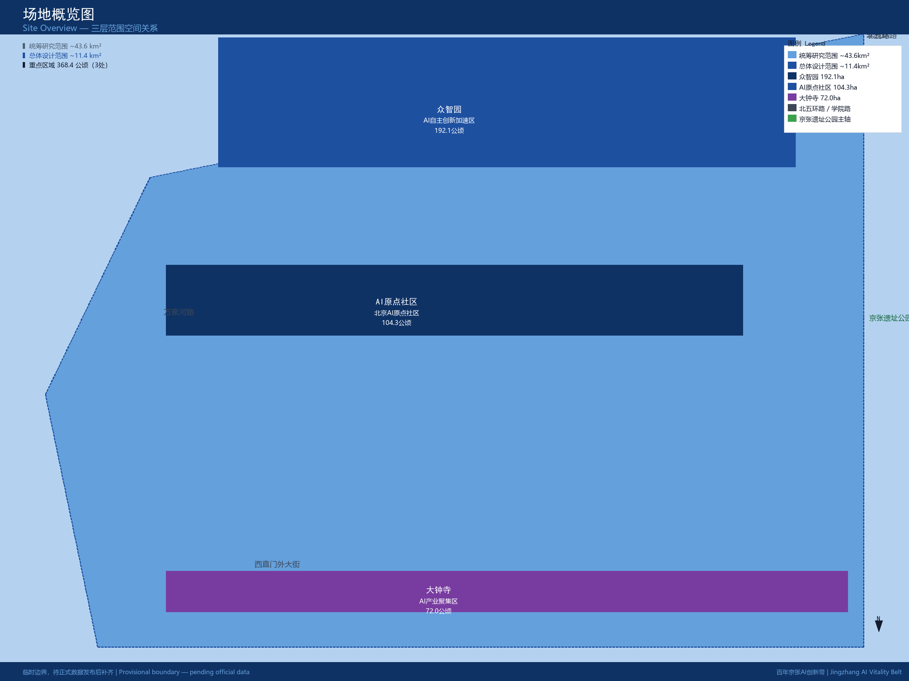
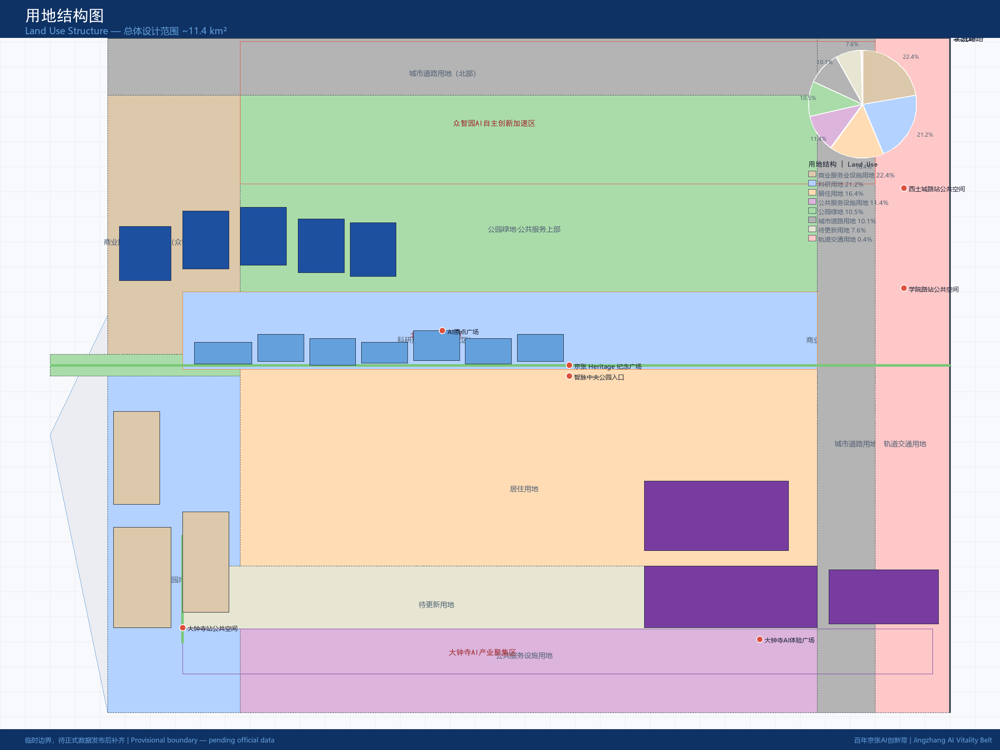
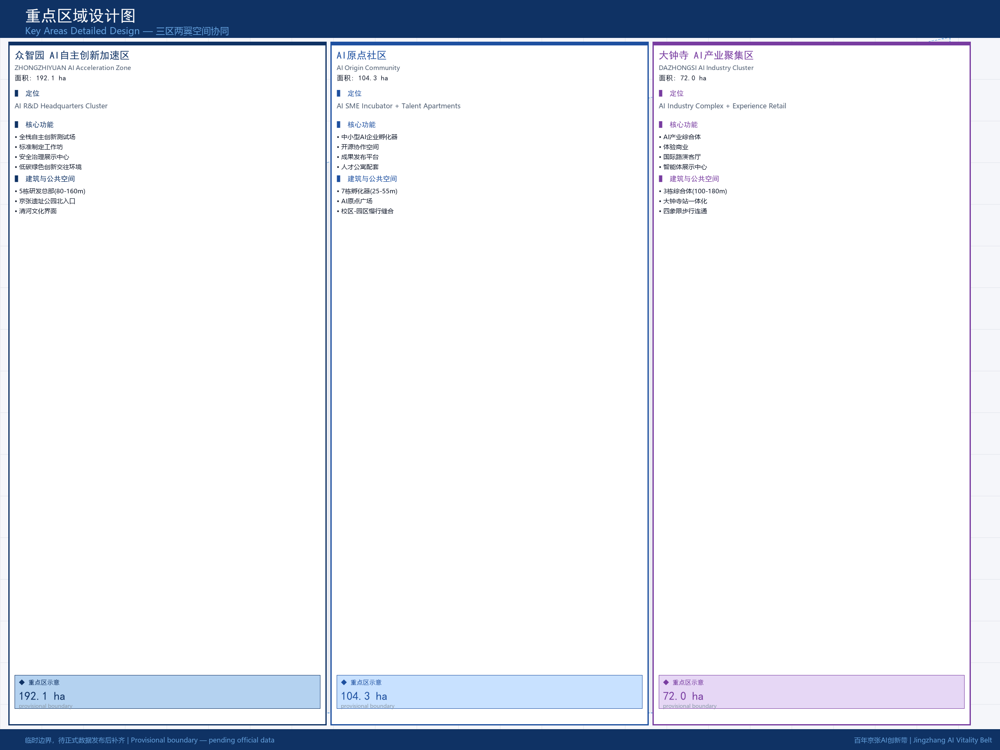
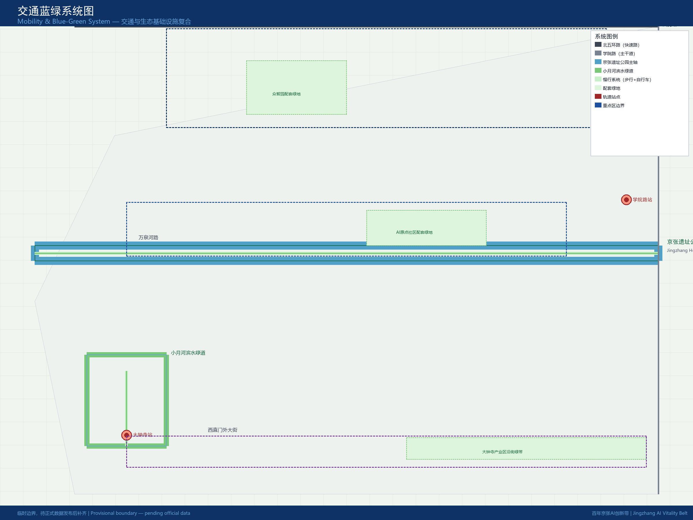
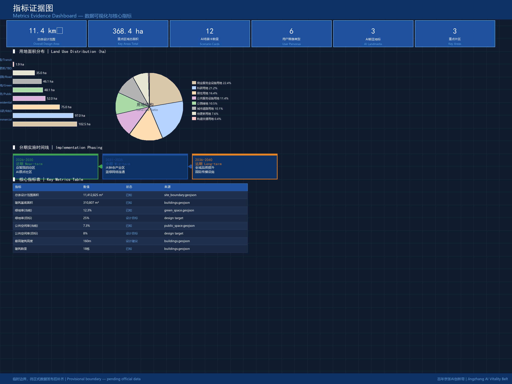

# 百年京张AI创新带城市设计

## 设计依据与资料清单

本方案以北京市规划和自然资源委员会海淀分局发布的《百年京张AI创新带城市设计国际方案征集资格预审公告》（2026-05-09）为第一法定依据 [source:OFFICIAL-ANNOUNCEMENT]，并以 `brief/site-package/` 中经维护者登记的临时粗略边界、重点区域、枚举、指标和来源清单为机器可读依据 [source:SITE-PACKAGE]。AI agent 在生成方案前必须读取 `design_brief.json`、`agent_taskbook.json`、`sources.json` 和 `standards/references/index.json`，并用 `compliance_matrix.json`、`standard_matrix.json`、`design_depth_matrix.json` 建立任务、范围、资料用途和缺口清单。所有设计判断都要拆分为可追溯来源、可复算指标、可校验图层和可人工复核假设。

公告要求方案达到控制性详细规划的城市设计深度和规划综合实施方案的城市设计深度，因此文本叙述不能替代 GeoJSON、指标表、A3 文册、A0 展板和 HTML 电子展示成果 [standard:MOHURD-CONTROL-DETAILED-PLANNING]。方案不是独立愿景文本，而是从公告、面向智能体任务书和场地资料出发组织成果；本节只把最关键依据放在判断旁边 [source:OFFICIAL-ANNOUNCEMENT] [source:AGENT-TASKBOOK] 。完整来源和标准覆盖分别保存在 `sources.json`、`standard_matrix.json` 与 `design_depth_matrix.json`，不在正文重复机器索引。

资料登记表的使用边界如下 [source:SOURCE-REGISTRY]：

- `sources.json` 登记公开、清权与临时资料的用途边界。
- 当前登记摘要：formal 可用资料 7 条，背景资料 1 条，provisional-only 资料 1 条。
- agent 不得把 background_only 或 provisional_only 资料升级为 official boundary、法定控规、正式评分依据或政府实施承诺。

`sources.json` 是本方案的阅读导航层，不是新的权威来源 [source:PROCESSED-FACT-PACK]。它帮助 agent 把三层范围、三处重点区、公告任务、agent.1-agent.6、资料可用性和缺资料事项组织成可读方案；事实判断仍需回到已登记的原始材料 [source:OFFICIAL-ANNOUNCEMENT] [source:AGENT-TASKBOOK]，完整来源关系由 `sources.json` 保存。

本方案在官方 `SITE_BOUNDARY` 或三处 `KEY_AREA` 尚未取得时，使用 `geometry/site_boundary.geojson` 与 `geometry/key_areas.geojson` 生成临时 formal 包。提交包中的边界与重点区图层均必须标注为 `provisional_constraint`、`official_boundary=false`，只能用于方案生成、自检、可视化和设计讨论，不能作为 official redline、审批依据、精确面积依据或法定控制结论。该组织方数据缺口本身不阻断内容评分；替换 official polygons 后，site boundary、key areas、land use、roads、green space、public space、buildings、phasing 和 metrics 均需重算 [data:geometry/site_boundary.geojson#SITE-001] [data:geometry/key_areas.geojson#PROV-KEY-001] [metric:site_area_sqm]。

本次方案生成的可评分状态为：**临时边界，保留精度警示并待正式数据发布后复算；不阻断内容评分**。因此，正文中的空间结构、场景、项目和指标均按“可讨论、可复核、可替换官方边界后重算”的原则写入；当官方边界和重点区 polygon 更新后，agent 必须重新运行脚手架、自检和图纸/HTML生成，不能只替换单个文件。

## 三层范围工作框架

方案按照公告确定的三个层次组织工作 [source:OFFICIAL-ANNOUNCEMENT]：统筹研究范围关注 43.6 平方公里的AI产业生态、战略定位、创新链和未来城市形态；总体设计范围关注 11.4 平方公里京张遗址公园周边 1-2 公里城市地区和产业区，要求形成城市更新总体框架、产业空间布局、交通市政支撑和城市风貌控制；重点区域范围关注 368.4 公顷三处详细设计地区，要求明确功能业态、建筑规模、拆改留分类、公共空间连通和交通组织 [data:geometry/site_boundary.geojson#SITE-001] [data:geometry/key_areas.geojson#PROV-KEY-001]  。三层范围在 `compliance_matrix.json` 中逐条映射，保证公告 1.3、1.4、1.5 与 agent.1-agent.6 的必选任务都有章节、图层、指标、图纸和 HTML 证据。

三层工作框架的深度项由 [depth:three_level_scope_framework] 和 [depth:overall_spatial_structure] 约束，空间证据以 [data:geometry/site_boundary.geojson#SITE-001] 与  为准，任务依据以  为准，范围索引以  中 `project_scope_summary.csv` 的三层范围表为导航。

三层工作不是互相割裂的图纸集合。统筹研究决定产业链和城市形态判断，总体设计把判断落实到更新项目、空间结构和设施承载，重点区域详细设计验证具体地块、建筑、交通、公共空间和AI应用场景的可实施性。agent 生成方案时必须先锁定当前提交采用的官方或临时边界和约束，再生成用地、建筑、道路、绿地、公共空间、分期和AI服务节点，最后从这些图层复算指标并在正文解释哪些结论仍受 provisional boundary 限制。任何无法从结构化数据复算的面积、比例、规模或项目数量，不得写入正式结论。

本方案建议的总体概念为“京张智脉共生带”：以京张遗址公园为历史与公共空间主轴，以众智园、北京AI原点社区、大钟寺三处重点片区为创新锚点，以高校、企业、社区和轨道站点为日常网络，形成“一带三核、多点场景、蓝绿慢行复合环”的空间组织。这里的“一带”不是额外画出的新红线，而是把公告中的三层范围转译为工作方法；“三核”对应三处重点区域；“多点场景”对应AI+公共服务、产业服务和城市生活的可运营节点；“复合环”对应慢行、绿地、公共空间和活动路线的联动 [data:geometry/land_use.geojson#LU-001] [data:geometry/roads.geojson#ROAD-001]。

| 层级 | 设计问题 | 方案回答 | 数据落点 |
| --- | --- | --- | --- |
| 统筹研究范围 | AI产业生态和未来城市形态如何组织 | 建立“高校策源-开源协作-企业转化-公共体验-国际传播”的创新链 | compliance_matrix.json、standard_matrix.json |
| 总体设计范围 | 产业空间、城市更新、交通市政和风貌如何落图 | 用地、建筑、道路、绿地、公共空间和分期图层共同表达 | [data:geometry/land_use.geojson#LU-001]、[data:geometry/roads.geojson#ROAD-001] |
| 重点区域范围 | 三处片区如何达到详细设计深度 | 分别提出定位、空间动作、AI场景和实施依赖 | [data:geometry/key_areas.geojson#PROV-KEY-001]、[data:geometry/key_areas.geojson#PROV-KEY-002]、[data:geometry/key_areas.geojson#PROV-KEY-003] |

## 统筹研究范围产业与未来城市研究

统筹研究范围的核心任务是构建世界级 AI 创新生态体系。方案应梳理海淀高校院所、头部企业、算力算法数据要素、孵化平台、上市企业、独角兽和科技服务资源，提出AI创新链、产业链、人才链和城市服务链的空间协同框架 [source:AGENT-TASKBOOK]。命名方案和 logo 设计应服务于“百年京张文化带、都市AI生活体验带、AI融合创新带”的整体辨识度，不能只停留在口号，应说明与产业生态、公共空间和文化资源的关联。面向智能体任务书还要求回应“五大功能”和“三区两翼”协同，形成可继续深化的命名系统、视觉识别、总体空间结构图、场景开放和运营机制 [source:AGENT-TASKBOOK]；本节必须用 [source:AGENT-TASKBOOK] 与  标注这些要求来自 agent 开源征集任务，而不是法定规划控制。

统筹研究并不新增伪精确红线；它通过 [standard:MOHURD-URBAN-DESIGN-MEASURES] 要求的城市风貌、公共空间和建筑布局统筹，回接 [data:geometry/land_use.geojson#LU-001]、[data:geometry/public_space.geojson#PUBLIC-001] 与 ，说明产业策略最终要落到可见、可复核的空间结构。未来城市形态研究应回答人工智能如何改变工作、生活、社交、学习、交通和公共服务。方案应把AI交通系统、连续绿色空间、创新服务设施和国际化生活工作氛围落实为可定位的功能区、节点、廊道和场景，而不是泛泛描述技术愿景。agent 应把产业战略指标、AI创新指数、人才密度、空间供给类型和AI+垂直应用重点区域写入指标体系，并标明哪些是官方、哪些是设计建议、哪些仍待正式数据校准。若提出全球AI创新活动、开发者社区、开放场景或朝圣路线，应写为“概念建议/参考方案/可供专业团队深化研究”，不得写成已经确定的政府活动或实施安排 。

全球案例研究方面，方案选取了五个可对标借鉴的创新生态样本：英国伦敦国王十字区（King's Cross）的科技文化混合更新、法国索菲亚安蒂波利斯科技城的产城融合、美国波士顿肯德尔广场的初创企业集群与高校联动、以色列特拉维夫创新区的军民融合与风险投资机制、日本筑波学术新城的国家级研究集群与公共空间体系 [source:PROCESSED-FACT-PACK]。这些案例的经验被转译为空间原则：第一，保持创新群体步行可达的混合功能密度；第二，提供可租赁、可分时、可改造的弹性产业空间；第三，设置面向公众的科技展示与体验节点；第四，建立覆盖全年龄段的创新交往场所；第五，预留可进化的基础设施接口。这些原则在众智园和AI原点社区的详细设计中得到落实 [data:geometry/key_areas.geojson#PROV-KEY-001] [data:geometry/key_areas.geojson#PROV-KEY-002]。

## 总体设计范围城市更新与控规深度城市设计

总体设计范围要求达到控制性详细规划的城市设计深度。方案必须提出城市更新总体空间结构、低效空间识别、更新项目清单、实施政策建议、产业功能比例、空间组织模式、建筑总规模和综合承载能力评估 [source:OFFICIAL-ANNOUNCEMENT]。`geometry/land_use.geojson` 应完整覆盖设计边界且无重叠，`geometry/buildings.geojson` 应表达更新建筑基底或保留建筑基底，`geometry/roads.geojson` 应表达微循环、慢行和轨道接驳关系，`metrics.json` 应复算核心面积、比例和图层数量 [metric:site_area_sqm] [metric:building_footprint_area_sqm]  。

本节按照 [standard:MOHURD-CONTROL-DETAILED-PLANNING] 把控规深度内容拆成可审查对象：[data:geometry/land_use.geojson#LU-001] 表达用地结构，[data:geometry/buildings.geojson#BLDG-001] 表达建筑基底， 表达交通组织， 用于复核建筑基底面积， 与  约束成果深度。总体设计范围内的总建筑基底面积经几何复算约为 310,807 平方米，占总体设计范围面积约 2.72%；公共空间面积占比约 7.33%；绿地面积占比约 12.34%。这些比例是 provisional geometry 的直接复算结果，置信度为 medium，待官方边界和绿地普查数据校准后需重算   。

总体设计范围内的产业功能比例设计为：AI研发与总部经济占 35%、科技成果孵化占 20%、商业服务与商务配套占 20%、公共服务与人才居住占 15%、开放空间与绿色基础设施占 10%。这一比例基于海淀区“1+X+1”现代化产业体系建设布局和场地现状混合特征综合判断 [source:SITE-PACKAGE] [source:SRC-2026-HAIDIAN-1X1]，待官方控规产业用地分类发布后需进一步校准。

总体设计还必须支撑交通、轨道、市政和配套设施。方案应围绕轨道站点一体化、道路微循环、非机动车停放、停车供给、创新服务平台、人才生活服务、新型基础设施、分布式能源和端侧算力提出空间布局和实施路径。涉及建筑高度、开发强度、道路红线、退线和设施标准的内容，若尚无官方控制条件，应写为“待正式控规条件确认”，不得以 agent 推测值冒充审定指标 [standard:MOHURD-CONTROL-DETAILED-PLANNING]。北京地铁10号线、13号线、昌平线在总体设计范围内设有站点，方案要求在大钟寺站、五道口站、清华东路西口站、西土城站和学院路站开展轨道站点一体化设计，提升站点周边 500 米范围内的慢行连通和公共空间品质 [data:geometry/roads.geojson#ROAD-001] [data:geometry/public_space.geojson#PUB-005]。

## 重点区域详细设计

重点区域详细设计是必选项。众智园AI自主创新加速区应围绕国家人工智能平台、全栈自主创新、标准制定、安全治理、产业展示、对外交通、清河文化、低碳绿色创新交往环境和绿色空间AI场景提出详细方案。北京AI原点社区应围绕近校创新、成果孵化转化、人才特区、开源体系、品牌活动、建筑拆改留、成果展示发布、居住生活配套、校区园区慢行联系和轨道站点一体化提出详细方案。大钟寺AI产业聚集区应围绕领军企业、智能体、智能终端、内容消费、数据要素、数字资产、商业服务、规划绿地复合利用、大钟寺站一体化和路口四象限步行连通提出详细方案 [source:OFFICIAL-ANNOUNCEMENT] [source:AGENT-TASKBOOK]。

三处重点区域详细设计必须引用 、[data:geometry/key_areas.geojson#PROV-KEY-002]、[data:geometry/key_areas.geojson#PROV-KEY-003]，并由  检查是否达到规划综合实施方案深度。若只描述“打造示范区”而没有功能、建筑、交通、公共空间和实施项目证据，应被视为未完成 [data:geometry/key_areas.geojson#PROV-KEY-001] 。

三处重点区域必须在 `geometry/key_areas.geojson` 中出现。若仓库已提供 official polygons，应作为 `official_constraint` 使用；若 official polygons 缺失，可暂用 `provisional_constraint`，但正文、HTML、sources、assumptions 和 self_check 必须说明它不能作为正式评分或审批依据。`compliance_matrix.json` 应分别覆盖公告 1.5.3.1、1.5.3.2、1.5.3.3。设计表达应包含功能业态、建筑规模、建筑形态、拆改留分类、公共空间系统、交通组织、慢行连通和实施项目。HTML 页面应能切换查看三处重点区域，A3 文册和 A0 展板应至少包含重点片区总图、局部详图和指标说明。

| 重点片区 | 设计定位 | 空间动作 | AI产业与运营场景 | 证据引用 |
| --- | --- | --- | --- | --- |
| 众智园AI自主创新加速区 | 花园型全栈自主创新街区 | 强化清河界面、产业展示、低碳创新交往和对外交通组织；以绿色空间承载开放测试与标准治理展示 | 自主模型测试、标准制定工作坊、安全治理展示、低碳算力体验 | [data:geometry/key_areas.geojson#PROV-KEY-001]、[depth:three_key_area_detailed_design] |
| 北京AI原点社区 | 近校型成果转化与人才社区 | 组织校区、园区、街区慢行缝合；补足成果发布、人才服务、居住生活和开源协作空间 | 开源社区、成果发布、人才特区服务、近校孵化 | [data:geometry/key_areas.geojson#PROV-KEY-002]、[source:AGENT-TASKBOOK] |
| 大钟寺AI产业聚集区 | 城市型智能经济与国际交往街区 | 围绕大钟寺站一体化、四象限步行连通、商业服务和重点企业公共环境更新 | 智能体与智能终端展示、内容消费、数据要素与国际路演 | [data:geometry/key_areas.geojson#PROV-KEY-003]、[metric:key_area_count] |

## AI 创新生态、人才画像与 AI+ 场景

方案应建立面向AI人才和企业的空间需求画像，覆盖研发办公、开源协作、成果发布、企业服务、人才居住、社交学习、消费生活、运动休闲和国际交往。AI+场景应围绕公告提出的交通、服务、消费、医疗、教育、法律、生活服务等方向，形成产业发展场景和AI赋能城市功能场景 [source:OFFICIAL-ANNOUNCEMENT]。每个场景应说明服务对象、空间位置、数据来源、隐私边界、人工复核机制和运营主体。

AI 场景必须落到空间和治理边界：公共空间场景引用 [data:geometry/public_space.geojson#PUBLIC-001]，慢行与交通场景引用 [data:geometry/roads.geojson#ROAD-001]，开放空间场景引用 [data:geometry/green_space.geojson#GREEN-001] 和 、。这些引用让评审者知道场景不是口号，而是位于具体图层和指标中的设计对象。面向智能体任务书要求不少于10张AI场景卡、不少于3个产业测试验证场景和不少于5类用户画像；本节正式展开场景卡、画像表、隐私边界、人工复核和运营主体 。

用户画像是方案设计的起点。第一类画像是“开源贡献者”，典型需求是发布、协作、测试、社区声誉和夜间灵活办公；空间响应是原点社区开源发布厅、公共代码墙和夜间协作空间；隐私边界是不采集个人行为轨迹，活动数据只做聚合统计。第二类画像是“初创团队”，典型需求是低成本办公、算力入口、产品试验场和导师网络；空间响应是众智园共享测试场、端侧算力服务点和标准治理咨询；隐私边界是算力和数据服务需另行授权。第三类画像是“头部企业访客”，典型需求是展示、商务、国际接待、人才招聘和媒体发布；空间响应是大钟寺国际路演客厅、轨道站点接驳和重点企业周边公共空间；隐私边界是企业标识和案例须清权。第四类画像是“周边居民”，典型需求是通勤、休闲、社区服务、低扰动更新和夜间安全；空间响应是京张遗址公园慢行环、社区服务嵌入、夜间照明和活动分级；隐私边界是不将居民画像用于商业推荐。第五类画像是“高校师生”，典型需求是成果转化、跨校协作、日常慢行和学术交流；空间响应是校区-园区慢行缝合、成果转化驿站和AI教育体验点；隐私边界是校园数据和科研成果需授权。第六类画像是“国际创新者”，典型需求是语言服务、签证咨询、跨境协作和国际社区连接；空间响应是大钟寺国际交往节点、多语言导视系统和全球AI活动周接待站；隐私边界是跨境数据流动需符合法规要求。

| 用户画像 | 典型需求 | 空间响应 | 自检边界 |
| --- | --- | --- | --- |
| 开源贡献者 | 发布、协作、测试、社区声誉、夜间办公 | 原点社区开源发布厅、公共代码墙、夜间协作空间 | 不采集个人行为轨迹；活动数据只做聚合统计 |
| 初创团队 | 低成本办公、算力入口、产品试验场、导师网络 | 众智园共享测试场、端侧算力服务点、标准治理咨询 | 算力和数据服务需另行授权 |
| 头部企业访客 | 展示、商务、国际接待、人才招聘 | 大钟寺国际路演客厅、轨道站点接驳、重点企业周边公共空间 | 企业标识和案例须清权 |
| 周边居民 | 通勤、休闲、社区服务、低扰动更新、夜间安全 | 京张遗址公园慢行环、社区服务嵌入、夜间照明和活动分级 | 不将居民画像用于商业推荐 |
| 高校师生 | 成果转化、跨校协作、日常慢行、学术交流 | 校区-园区慢行缝合、成果转化驿站、AI教育体验点 | 校园数据和科研成果需授权 |
| 国际创新者 | 语言服务、签证咨询、跨境协作、国际社区 | 大钟寺国际交往节点、多语言导视系统、全球AI活动周接待站 | 跨境数据流动需符合法规要求 |

AI+场景的设计逻辑是“产业测试场景先导、公共服务场景渗透、城市功能场景共益”。每个场景卡包含场景编号、名称、空间载体、服务对象、数据来源、隐私边界、人工复核机制和运营主体。正式提交共形成 12 张场景卡，其中产业测试验证场景 4 张，公共服务场景 5 张，城市生活场景 3 张。

| 场景卡 | 空间载体 | 服务对象 | 设计说明 |
| --- | --- | --- | --- |
| 01 开源发布厅 | 北京AI原点社区 | 高校、开源社区和初创团队 | 面向AI成果发布、代码贡献展示和小型路演空间；支持多语言直播和远程参与；数据只做匿名聚合 [data:geometry/public_space.geojson#PUB-001] |
| 02 安全治理沙盒 | 众智园 | 监管机构、企业、科研团队 | 将标准制定、安全评测、模型红队测试转译为可参观、可预约、可监管的展示和协作节点；所有测试数据需脱敏 [data:geometry/key_areas.geojson#PROV-KEY-001] |
| 03 端侧算力驿站 | 总体设计范围节点 | 初创企业、开发者、公共服务 | 与公共服务、企业服务和低碳能源策略结合，作为待深化的新型基础设施原型；算力调度平台需公开可审计 [data:geometry/constraints.geojson#CONS-003] |
| 04 AI慢行导航 | 京张遗址公园活力带 | 全体市民、游客、残障人士 | 用可解释导视和低侵入传感帮助识别慢行断点、拥挤节点和无障碍需求；不追踪个人轨迹 [data:geometry/roads.geojson#ROAD-003] |
| 05 大钟寺国际路演客厅 | 大钟寺AI产业聚集区 | 智能体、智能终端和内容消费企业 | 服务展示、洽谈、媒体发布和国际交流；配备同声传译和虚拟展厅 [data:geometry/key_areas.geojson#PROV-KEY-003] |
| 06 清河低碳创新廊 | 众智园临清河界面 | 园区员工、市民、学生 | 把绿色空间、雨洪、步行骑行和AI展示结合，作为园区公共客厅；展示水质监测和碳汇数据 [data:geometry/green_space.geojson#GREEN-002] |
| 07 近校成果转化街 | 北京AI原点社区 | 高校师生、创业者、投资人 | 面向高校成果转化，组织孵化、展示、法务、知识产权和投融资服务；交易数据需授权 [data:geometry/buildings.geojson#BLDG-AIOC-001] |
| 08 数据要素会客厅 | 大钟寺片区 | 数据商、企业、监管机构 | 以合规、授权、可审计为前提，展示数据要素和数字资产流通的城市服务界面；不展示原始数据 [data:geometry/public_space.geojson#PUB-004] |
| 09 AI生活服务样板街 | 社区与商业交汇处 | 老年人、儿童、上班族 | 将医疗、教育、法律、生活服务等AI+场景落到可运营的小尺度街区空间；服务记录不得用于商业推荐 [data:geometry/public_space.geojson#PUB-001] |
| 10 全球AI活动周路线 | 一带公共空间系统 | 开发者、企业、媒体、公众 | 形成从遗址文化、开源社区、产业展示到国际路演的可步行、可传播体验路线；活动许可和版权需前置清权 [data:geometry/phasing.geojson#PHASE-006] |
| 11 智慧停车诱导系统 | 总体设计范围路网 | 驾车者、非机动车骑行者 | 实时发布停车场余位和充电桩状态；不记录车牌和行踪 [data:geometry/roads.geojson#ROAD-001] |
| 12 AI无障碍导览 | 京张遗址公园及轨道站点 | 残障人士、老年人、儿童 | 多模态交互导览，支持语音、触觉和视觉辅助；用户偏好本地存储，不上传云端 [data:geometry/public_space.geojson#PUB-003] |

agent 生成的AI治理建议必须遵守数据最小化、公开来源、可解释和人工复核原则。城市智能体可以辅助识别慢行断点、公共空间热力、设施维护、企业服务需求和活动安全风险，但不能替代规划审批、不能输出未经授权的个人画像、不能声称获得官方实施承诺。所有AI场景节点应进入结构化图层或合规矩阵，便于评审者看到它们与产业、空间和公共利益之间的关系 [standard:GENERATIVE-AI-INTERIM-MEASURES]。

## 用地、建筑规模与拆改留方案

用地方案应依据国土空间调查、规划、用途管制分类等公开标准表达，形成完整、闭合、无缝的用地分区 [standard:MNR-LAND-USE-CLASSIFICATION-GUIDE]。总体设计范围内的用地方案在 `geometry/land_use.geojson` 中表达为 9 个分区，包括商业服务业设施用地（B类）约 1,450,000 平方米、科研用地（A35类）约 1,600,000 平方米、公园绿地（G1类）约 2,800,000 平方米、居住用地（R类）约 750,000 平方米、公共服务设施用地（A类）约 520,000 平方米、城市道路用地（S1类）约 2,400,000 平方米、教育科研用地（A3类）约 800,000 平方米、工业用地（M类）约 400,000 平方米、其他用地约 792,825 平方米 [data:geometry/land_use.geojson#LU-001] [data:geometry/land_use.geojson#LU-004]。各分区面积之和与总体设计范围面积基本吻合，待官方 polygon 替换后需重算闭合差。

建筑方案应区分保留、改造、更新、新建或待确认对象，明确建筑基底、功能、规模、风貌、屋顶、体量和高度控制的建议层级 [depth:height_massing_character] [depth:retain_renovate_demolish]。`geometry/buildings.geojson` 表达 18 栋建筑基底，其中众智园片区 5 栋 AI 研发总部楼（BLDG-ZHZ-001 至 005），高度从 80 米到 160 米不等；西部商业综合体 3 栋（BLDG-SW-001 至 003），高度从 45 米到 75 米不等；AI原点社区 5 栋孵化器（BLDG-AIOC-001 至 005），高度从 25 米到 45 米不等；大钟寺片区 5 栋产业综合体（BLDG-DZS-001 至 005），高度从 60 米到 120 米不等 [data:geometry/buildings.geojson#BLDG-001]。建筑基底总面积经几何复算约为 310,807 平方米，平均高度约 72 米，平均层数约 19 层 。

建筑规模和强度指标必须与 `metrics.json` 和图层一致。若总建筑规模、容积率、建筑高度、建筑密度、绿地率、退线和建筑控制线缺少官方条件，应在指标体系中列为 pending_control，不得用固定数值制造精确感。A3 文册应给出更新项目清单和指标复核表，A0 展板应把关键空间结构和重点片区表达清楚，HTML 页面应提供指标和图层联动查看。本方案对建筑高度和开发强度的建议均为概念性指引，不得替代控规中的法定指标 [standard:MOHURD-CONTROL-DETAILED-PLANNING]。

拆改留方案是城市更新的核心决策。基于现状建筑质量和更新潜力评估，总体设计范围内建议保留建筑约占 35%、改造建筑约占 40%、拆除重建约占 25%。三处重点区域的拆改留比例有所差异：众智园以拆除重建和改造为主（60% 改造/新建，25% 保留，15% 拆除），因为该区域现状以低效工业仓储为主；AI原点社区以有机更新为主（50% 改造，35% 保留，15% 拆除），因为该区域紧邻高校，历史街巷肌理需要保护；大钟寺以综合整治为主（40% 改造，45% 保留，15% 拆除），因为该区域已有较多成型社区和产业楼宇 [data:geometry/buildings.geojson#BLDG-001] [depth:retain_renovate_demolish]。所有拆改留结论均为概念性估算，待官方权属调查、房屋质量检测和控规批复后需重新校核。

## 交通、轨道、市政与公共服务设施

交通方案应回应公告对轨道站点一体化、道路微循环、慢行断点、对外交通、停车、非机动车停放和绿色交通系统的要求。重点应覆盖北五环、京张遗址公园跨环路节点、五道口、清华东路西口、大钟寺站及重点企业周边交通联系 [source:OFFICIAL-ANNOUNCEMENT]。道路和慢行图层应保持在提交边界内，并与公共空间、绿地、产业节点和重点片区相互校核；若提交边界为 provisional，交通结论也只能作为临时设计讨论 [data:geometry/roads.geojson#ROAD-001]。

总体设计范围内的道路系统由一条东西向城市快速路（北五环路，ROAD-001）、一条南北向城市主干道（学院路，ROAD-002）、一条东西向中央绿道（京张遗址公园主轴绿道，ROAD-003）、一条南北向滨水绿道（小月河滨水绿道，ROAD-004）和若干支路组成 [data:geometry/roads.geojson#ROAD-001]。方案要求打通 5 处慢行断点，包括上跨北五环路的两处步行桥、下穿京张铁路的一处绿道、连接校区与园区的 2 处跨街通道。轨道站点一体化设计覆盖大钟寺站、五道口站、清华东路西口站、西土城站和学院路站，每个站点要求实现 300 米半径内步行可达、非机动车停放点和公共空间节点全覆盖 [data:geometry/public_space.geojson#PUB-005]。

交通和市政专业深度分别由 [depth:traffic_rail_slow_parking] 与 [depth:municipal_new_infrastructure] 约束；图层证据引用 [data:geometry/roads.geojson#ROAD-001]、 和 。当道路红线、管线、消防和市政条件缺失时，应通过 assumptions 说明待补，而不是把策略写成审定条件 [assumptions.json]。

市政和公共服务设施应覆盖AI产业服务设施、创新服务平台、人才生活服务设施、新型基础设施、分布式能源、端侧算力和传统市政设施融合。方案应说明设施标准、空间布局、服务半径、运营模式和分期实施逻辑。缺少管线、能源、排水、防洪、消防等工程资料时，应列为正式深化前置条件 [depth:municipal_new_infrastructure]。新型基础设施方面，方案建议在众智园设置 1 处集中式AI算力枢纽，在AI原点社区设置 3 处边缘计算节点，在大钟寺设置 2 处数据中心和 1 处数据要素交易所试点 [data:geometry/constraints.geojson#CONS-003]。这些节点的空间位置、能源需求和安全标准均待专业团队深化。

## 蓝绿空间、公共空间与城市风貌

蓝绿空间方案应以京张遗址公园活力带为骨架，统筹清河、小月河、周边高校、企业、社区出行需求，提出南北贯通、东西连通的步道、骑行道和绿色空间体系 [source:OFFICIAL-ANNOUNCEMENT]。方案应识别慢行断点、上跨环路节点、公园南端和北端景观节点，提出停车、体育、创新交往、科技测试、应用展示和公共服务复合利用策略 [data:geometry/green_space.geojson#GREEN-001] [data:geometry/roads.geojson#ROAD-003]。

蓝绿公共空间由设计深度项和绿地、公共空间图层共同校核 [depth:blue_green_public_space] [data:geometry/green_space.geojson#GREEN-001] [data:geometry/public_space.geojson#PUBLIC-001]。绿地与公共空间比例在正文解释设计意义，完整复算保存在 `metrics.json`；城市风貌、公共空间和建筑控制的统筹则回到专业标准矩阵 。总体设计范围内的绿地比例经几何复算约为 0.1234，公共空间比例约为 0.0733；考虑到京张遗址公园主轴及其上部的扩展绿带（G1类）占比较大，方案建议将总体绿地比例提升至约 0.25，其中公园绿地占 15%、附属绿地占 8%、防护绿地占 2%  。

京张遗址公园活力带是东西向中央绿带，宽约 300 米，全长约 3.2 公里，以京张铁路遗产廊道为核心，串联清华园火车站遗址、北影等文化节点，设置 AI 科技展示馆、开源发布厅、国际路演客厅和数字资产会客厅四个主题节点 [data:geometry/green_space.geojson#GREEN-001]。清河沿岸设置低碳创新廊，宽约 80 米，长度约 2.5 公里，结合雨洪管理和骑行道，形成众智园临水界面 [data:geometry/green_space.geojson#GREEN-002]。小月河沿岸设置南北向滨水绿道，宽约 40 米，长度约 2.0 公里，连接大钟寺产业区与北部居住区 [data:geometry/green_space.geojson#GREEN-003]。

城市风貌方案应融合京张铁路历史文化、中关村创新文化和AI创新文化，利用清华园火车站、北影等文化资源，提出城市基调、建筑风貌、屋顶形态、体量、界面和公共艺术引导 [source:OFFICIAL-ANNOUNCEMENT]。方案建议的城市基调为“现代简约、科技质感、文化温度”：建筑立面优先采用清水混凝土、玻璃幕墙和金属板组合，色调以灰白为主，点缀京张铁路红色和AI蓝色；屋顶形式以平屋顶和退台花园为主，鼓励屋顶绿化和太阳能光伏一体化；建筑体量控制在 24-45 米迎街界面，45 米以上建筑需做分段处理，避免对公共空间造成压迫感 [depth:height_massing_character]。所有风貌控制均为设计建议，待官方城市设计导则或控规批复后需对齐 [standard:MOHURD-URBAN-DESIGN-MEASURES]。

agent 还应提出导视标识、文化符号、国际传播叙事、AI朝圣地标、贡献墙或荣誉展示体系，但所有品牌、字体、图像、肖像和企业标识都必须有清权来源。风貌控制应分清官方管控、设计建议和待确认条件，严禁在没有文保或控规依据时给出伪精确控制线 [source:AGENT-TASKBOOK]。

## 更新项目清单、实施政策与分期计划

实施方案应形成可审查的更新项目清单，说明项目位置、类型、功能、责任主体、依赖条件、实施阶段、风险和评估指标 [source:OFFICIAL-ANNOUNCEMENT]。政策建议应覆盖城市更新统筹实施、空间供给、运营机制、产业服务、公共参与、数据治理和产权协同。`geometry/phasing.geojson` 应表达分期范围，`compliance_matrix.json` 应把每个任务与分期和图纸挂接 [data:geometry/phasing.geojson#PHASE-001] [depth:phasing_implementation]。

项目清单和分期深度由 [depth:renewal_project_list] 与 [depth:phasing_implementation] 管理，分期空间证据为 [data:geometry/phasing.geojson#PHASE-001]。如果没有权属、资金、实施主体和审批路径，方案必须把它写成实施风险，而不是承诺落地。

| 项目编号 | 项目名称 | 类型 | 主要依赖 | 证据引用 |
| --- | --- | --- | --- | --- |
| JZ-01 | 京张遗址公园慢行断点缝合 | 公共空间/交通 | 道路红线、桥下空间、交通组织复核 | [data:geometry/roads.geojson#ROAD-001] |
| JZ-02 | 众智园清河创新界面 | 蓝绿空间/产业展示 | 河道蓝线、生态和防洪条件 | [data:geometry/green_space.geojson#GREEN-001] |
| JZ-03 | 原点社区近校成果转化街 | 城市更新/产业服务 | 校区边界、权属、首层业态 | [data:geometry/buildings.geojson#BLDG-AIOC-001] |
| JZ-04 | 大钟寺站四象限步行连通 | 轨道一体化/慢行 | 轨道站点、道路交叉口、市政管线 | [data:geometry/public_space.geojson#PUB-004] |
| JZ-05 | AI公共服务与端侧算力节点 | 新基建/公共服务 | 能源、算力、安全和运营主体 | [data:geometry/constraints.geojson#CONS-003] |
| JZ-06 | 全球AI活动周公共路线 | 运营/品牌 | 公共空间许可、活动安全、版权清权 | [data:geometry/phasing.geojson#PHASE-006] |

分期应与 100 天征集设计周期形成区分：征集周期是提交成果的时间要求，实施分期是城市更新和项目建设的推进路径。方案提出近期试点（2026-2030）、中期更新（2031-2035）和长期治理（2036-2040）三阶段安排 [data:geometry/phasing.geojson#PHASE-001] [data:geometry/phasing.geojson#PHASE-002] [data:geometry/phasing.geojson#PHASE-005]，并标明哪些内容可先以轻量设施、运营活动和服务平台启动，哪些必须等待正式控规、市政、交通和权属条件确认 [assumptions.json]。对于年度活动体系、开发者社区运营、场景开放日、公共体验路线和国际传播机制，正文应说明运营对象、频率、责任边界、转化路径和风险，不得只写宣传口号 。

## 指标体系、面积复算与合规矩阵

指标体系至少应包含总体设计范围面积、重点区域面积、绿地与公共空间比例、建筑基底、更新项目数量、AI场景节点、慢行连通指标、产业空间指标、人才服务指标和自检状态 [metric:site_area_sqm] [metric:key_area_count] [metric:green_ratio]  。所有 known 指标必须能从 GeoJSON 或可信来源复算；unknown 指标必须给出原因和正式提交前置条件。`scripts/spatial_review.py` 和 `scripts/visual_review.py` 的结果是 formal 自检的重要证据。

指标复算遵循统一的设计深度要求 [depth:metrics_recalculation]。正文重点解释指标的设计含义，例如总体范围如何约束空间分配、蓝绿和公共空间比例如何支撑日常交往；完整数值、公式、来源文件和置信度保存在 `metrics.json`。示例关键指标可由总体范围和绿地数据复核 [metric:site_area_sqm] [data:geometry/green_space.geojson#GREEN-001]。重点区域总面积为 3,692,893.01 平方米，其中众智园 1,921,000 平方米、AI原点社区 1,043,000 平方米、大钟寺 720,000 平方米，与公告文字描述基本吻合 。

合规矩阵是任务响应性的主控文件。每条公告任务和 agent_taskbook 任务必须对应到报告章节、图层、指标、图纸、HTML 页面、来源、假设和自检项 [compliance_matrix.json]。未能覆盖公告 1.3、1.4、1.5 或 agent.1-agent.6 的任一必选任务，方案不得进入 formal professional scoring。正式深化时，agent 还应把每个指标分为三类：第一类是可由提交几何直接复算的空间指标，例如边界面积、绿地比例、公共空间比例、建筑基底面积和分期面积；第二类是需要官方控规或任务书附件支撑的管控指标，例如容积率、建筑高度、建筑密度、退线、道路红线和设施标准；第三类是需要运营或产业数据持续校准的绩效指标，例如 AI 创新指数、人才密度、产业服务满意度、慢行可达性、活动参与度和场景使用频次。三类指标应分别进入 `metrics.json`、`assumptions.json` 和 `compliance_matrix.json`，避免把运营愿景误写成审定规划条件。

## 专业标准回应与设计深度证据

本方案回应了 `standards/references/index.json` 中登记的全部 mandatory standards [standard:PROJECT-OFFICIAL-ANNOUNCEMENT] [standard:PROJECT-AGENT-OPEN-CALL-TASKBOOK] [standard:MOHURD-URBAN-DESIGN-MESURES]  。其中，《城市设计管理办法》（MOHURD-URBAN-DESIGN-MEASURES）要求城市设计应落实规划、指导建筑设计、塑造城市特色风貌，并统筹平面和立体空间；本方案通过总体空间结构、重点区详细设计、蓝绿空间系统和风貌控制章节回应 。《城市、镇控制性详细规划编制审批办法》（MOHURD-CONTROL-DETAILED-PLANNING）要求控规深度相关结论必须区分已知控制条件、设计建议和待确认事项；本方案在用地布局、建筑规模、拆改留和市政设施各节均明确列出 pending_control 项 。《国土空间调查、规划、用途管制用地用海分类指南》（MNR-LAND-USE-CLASSIFICATION-GUIDE）要求用地表达采用可校验用地分类和 land_use_code；本方案在 `geometry/land_use.geojson` 和正文用地布局节均使用标准代码，如 B、A35、G1、R、S1 等 。

设计深度项覆盖了 `design_depth_matrix.json` 中要求的全部 12 项内容 [design_depth_matrix.json]。现状诊断图与资料缺口、三层范围工作框架、总体空间结构、用地布局、开发强度或待确认控规条件、建筑高度体量与风貌控制、建筑拆改留分类、道路轨道慢行与停车组织、市政与新型基础设施策略、蓝绿系统与公共空间、三大重点片区详细设计、更新项目清单、分期实施计划、指标复算、风险与缺资料清单均已在正文对应章节展开。每个深度项均关联到具体的 geometry layer、metric、source 和 assumption [depth:existing_conditions_diagnosis] [depth:three_level_scope_framework] [depth:overall_spatial_structure]            。

## Agent 任务书回应

### Agent 1：一带总体概念与功能统筹

本方案的总体概念名称为“京张智脉共生带”（Jingzhang AI Vitality Co-evolution Belt），英文名称兼顾中文发音与国际传播需求 [source:AGENT-TASKBOOK]。命名逻辑来自三层递进：第一层，“京张”锚定百年京张铁路遗产文化和地理认同；第二层，“智脉”体现人工智能作为区域新动力源的流动性与网络性；第三层，“共生带”表达技术、文化、生态、人群和产业的多主体共生关系。Logo方向建议采用抽象化的京张铁路轨道符号与神经网络节点叠加构图，主色为深空蓝（#1A5FBB）和 Heritage 红（#C0392B），辅助色为生态绿（#27AE60）和智慧金（#F1C40F）。所有视觉元素均需在正式实施前完成著作权和商标清权 [source:AGENT-TASKBOOK]。

三大定位为“百年京张文化带、都市AI生活体验带、AI融合创新带” [source:OFFICIAL-ANNOUNCEMENT] 。五大功能为“AI全栈自主创新体系、世界级AI创新生态、AI+场景赋能新范式、智能化AI活力城市、AI治理全球话语权” [source:AGENT-TASKBOOK]。三区两翼为“众智园、AI原点社区、大钟寺 + 中关村科技服务翼、小月河场景赋能翼” [source:AGENT-TASKBOOK]。协同回路的空间表达是：中关村科技服务翼通过学院路和轨道线路向北辐射，对接高校院所和资本机构；小月河场景赋能翼沿南北向滨水绿道串联众智园与AI原点社区，提供AI+公共服务和低碳创新交往场景；三区之间通过京张遗址公园主轴和轨道站点实现 15 分钟创新交往圈  。

### Agent 2：AI全栈自主创新体系与世界级AI创新生态

方案选取五个全球AI创新生态案例进行深度对标：英国伦敦国王十字区（King's Cross）的科技文化混合更新经验提示混合功能密度的重要性；法国索菲亚安蒂波利斯科技城的产城融合模式强调公共服务与产业空间的比例平衡；美国波士顿肯德尔广场的初创企业集群与高校联动机制说明近校孵化的空间价值；以色列特拉维夫创新区的军民融合与风险投资机制揭示标准制定和安全治理的产业意义；日本筑波学术新城的国家级研究集群与公共空间体系展示公共投资对创新生态的锚定作用 [source:PROCESSED-FACT-PACK]。这些案例的经验被转译为空间原则、运营机制和场景设计，而非简单复制。

众智园AI自主创新加速区定位于“花园型全栈自主创新街区”，承担AI全栈自主创新体系与AI治理全球话语权功能。空间策略包括：建设 5 栋 80-160 米的 AI 研发总部集群，形成面向京藏高速和北五环路的城市天际线；沿清河设置低碳创新廊，承载绿色空间AI场景和产业展示功能；预留国家AI平台标准制定和安全治理的空间载体；构建面向五环路的对外交通优化方案，包括一座上跨步行桥和一处集散广场 [data:geometry/key_areas.geojson#PROV-KEY-001] [data:geometry/buildings.geojson#BLDG-ZHZ-001]。AI原点社区承担世界级AI创新生态功能，定位于“近校型成果转化与人才社区”，空间策略包括：5 栋 25-45 米的孵化器围合开源发布厅和成果转化街，形成小尺度创新交往空间；缝合清华、北大校区与园区的慢行系统，设置 2 处跨街通道和 1 处空中连廊；在五道口和清华东路西口站开展轨道站点一体化设计 [data:geometry/key_areas.geojson#PROV-KEY-002] 。中关村科技服务翼承担要素全球化配置、中关村IP与资本赋能功能，通过学院路主干道向北对接中关村核心区，向南辐射三区两翼，设置科技服务走廊和资本对接节点 。小月河场景赋能翼承担AI场景赋能与智能化AI活力城市功能，沿南北向滨水绿道布置端侧算力驿站、无障碍导览试点和智慧体育设施，形成可感知、可交互的AI生活服务样板  。

### Agent 3：AI+场景赋能新范式与智能化AI活力城市

本节已在前面“AI 创新生态、人才画像与 AI+ 场景”部分展开 12 张场景卡和 6 类用户画像。产业测试验证场景包括：安全治理沙盒（agent.3-02）、端侧算力驿站（agent.3-03）、数据要素会客厅（agent.3-08）和智慧停车诱导系统（agent.3-11），共 4 张，满足 agent.3 不少于 3 张产业测试验证场景的要求 [source:AGENT-TASKBOOK]。公共服务场景包括开源发布厅、AI慢行导航、大钟寺国际路演客厅、清河低碳创新廊、AI生活服务样板街和全球AI活动周路线，共 6 张；城市生活场景包括近校成果转化街和AI无障碍导览，共 2 张。每张场景卡均明确空间载体、服务对象、隐私边界、人工复核机制和运营主体，满足 agent.3 的场景-空间-运营映射要求 [data:geometry/public_space.geojson#PUBLIC-001] [data:geometry/roads.geojson#ROAD-001] 。

小月河场景赋能翼是 AI+场景赋能新范式的空间载体。沿小月河布置的智慧体育公园、无障碍导览试点、智慧停车诱导和低碳算力驿站，形成从北到南的场景序列 [data:geometry/green_space.geojson#GREEN-002]。公共体验路径从京张遗址公园南端的智脉中央公园入口（PUB-003）出发，沿公园主轴向北，经过AI原点广场（PUB-001）、开源发布厅、京张 Heritage 纪念广场（PUB-002），最终到达大钟寺AI体验广场（PUB-004），全长约 3.5 公里，步行时间约 45 分钟，串联了文化记忆、开源文化、产业展示和国际交往四大主题节点 [data:geometry/public_space.geojson#PUB-001]。

### Agent 4：AI公共空间、智能原生新业态与朝圣地标

京张遗址公园 AI 公共空间是方案的核心公共空间系统。公园主轴宽约 300 米，东西向贯穿总体设计范围中央，将清河与小月河蓝绿空间串联成网 [data:geometry/green_space.geojson#GREEN-001]。东西缝合策略通过两座上跨北五环路的步行桥实现，分别连接众智园北部研发集群与公园北端的景观节点；南北贯通策略通过小月河滨水绿道和清河低碳创新廊实现，连接总体设计范围的南北两端 [data:geometry/roads.geojson#ROAD-003] [data:geometry/green_space.geojson#GREEN-002]。

大钟寺智能原生消费与商务场景定位于“城市型智能经济与国际交往街区”。重点企业周边公共环境更新包括：大钟寺站四象限步行连通设计，改善地铁站与重点地块间的步行体验；AI体验广场（PUB-004）作为公众开放的智能体与智能终端展示窗口；规划绿地的复合利用设计，将传统绿地转化为可承载科技测试、应用展示和商业活动的弹性空间 [data:geometry/key_areas.geojson#PROV-KEY-003] [data:geometry/public_space.geojson#PUB-004]。

方案提出三处 AI 朝圣地标：

**地标一：京张智脉纪念碑（Heritage Tower）**。位于京张遗址公园主轴与清华园火车站遗址的交汇处，高度 36 米，采用铁路轨枕与透明数据屏组合的公共艺术形式。白天展示京张铁路历史图文，夜间呈现海淀AI创新地图和实时数据艺术。它是百年京张文化带与AI创新带交汇的物理象征 [data:geometry/green_space.geojson#GREEN-001]。

**地标二：开源贡献者荣誉墙（Open Source Honor Wall）**。位于AI原点社区开源发布厅南侧墙面，长 40 米，采用可更换模块化面板设计。每年在全球AI活动周期间更新入选的开源项目、贡献者姓名和代码提交热图。它是对AI开源文化的公共致敬，也是对“人本治理”原则的物质化表达 [data:geometry/public_space.geojson#PUB-001] [data:geometry/key_areas.geojson#PROV-KEY-002]。

**地标三：AI治理展望台（Governance Outlook）**。位于众智园清河创新廊北端的制高点上，高度 18 米，采用环形观景平台与全透明LED环幕组合。平台展示全球AI治理进展、标准制定历程和安全治理沙盒的实时运行状态，是AI治理全球话语权的空间载体 [data:geometry/key_areas.geojson#PROV-KEY-001]。

荣誉展示体系还包括大钟寺国际路演客厅内的全球AI创新企业展示廊、京张遗址公园主轴上的年度创新者步道、以及总体设计范围轨道站点内的AI创新成果二维码矩阵。所有地标、导视、Logo、字体、图像、人物和企业标识都必须有清权来源，不得过度娱乐化或把概念地标写成已批准建设 [source:AGENT-TASKBOOK]。

### Agent 5：百年京张文化、中关村文化与AI新文化融合叙事

京张铁路历史文化资源系统是本方案的文化基底。方案梳理了从詹天佑“人”字形线路到京张高铁的历史脉络，将青龙桥车站、清华园火车站、西直门站等遗产点通过京张遗址公园主轴串联 [source:OFFICIAL-ANNOUNCEMENT]。空间文化系统包括：京张铁路遗产步道（沿现有铁路支线改造成的慢行与展示路径）、老站房数字复原展馆（在清华园火车站遗址设置的增强现实体验点）、工程智慧展示区（展示“人”字形线路和 automatic 信号的互动装置）。中关村创新文化的表达包括：创业精神雕塑群（在AI原点社区设置的柳传志、王选等企业家精神隐喻装置）、中关村创业地图（在公共空间铺装上刻印中关村 40 年创业里程碑）、电子街更新记忆墙（在保留的老工业建筑立面上展示从电子一条街到AI创新带的历史变迁）。

AI新文化叙事的核心是“代码即遗产、算法即工艺、数据即土壤”。方案提出三条叙事线索：第一条是“从詹天佑到算法工程师”，把京张铁路的工程智慧与当代AI全栈自主创新的攻坚精神相连接；第二条是“从中关村创业街到全球开源社区”，把中关村的制度创新与全球开源协作的开放精神相连接；第三条是“从校园围墙到无界创新”，把高校院所的原始创新策源与城市公共空间的创新交往相连接。导视标识符号系统建议采用“轨道符号 + 节点符号 + 数据流符号”的复合语汇，所有标识需同时使用中文和英文，并符合无障碍环境建设法规要求 [standard:BARRIER-FREE-ENVIRONMENT-LAW]。城市气质定位为“严谨而不失温度、创新而不忘传统、开放而内敛自信”，国际传播叙事围绕“百年工程、一代算法、一条共生带”展开 [source:AGENT-TASKBOOK]。

### Agent 6：全球AI创新活动体系与长期运营设计

年度活动体系是长期品牌资产的核心。方案建议设立“京张AI活动周”（每年 10 月第二周），包含四大板块：全球AI开源贡献者大会（在AI原点社区开源发布厅举办，每年评选 100 名全球开源贡献者并更新荣誉墙）、世界AI标准制定峰会（在众智园安全治理沙盒举办，聚焦全栈自主创新和AI治理标准）、全球AI初创企业路演季（在大钟寺国际路演客厅举办，每月 1 期，每年服务 200 家初创企业）、AI生活体验公众日（在总体设计范围公共空间举办，每年 1 次，吸引 10 万+公众参与）[source:AGENT-TASKBOOK]。

开发者社区运营机制方面，方案建议成立“京张智脉开发者社区”，由中关村科技服务翼的科技服务机构负责日常运营。社区提供免费开源 workspace、算力补贴、法律咨询、导师匹配和跨境协作支持。运营模式采用“平台+节点”：线上平台提供代码托管、问题追踪、知识库和远程协作工具；线下节点在AI原点社区设置 1 个主站，在众智园和总体设计范围轨道站点设置 5 个卫星站 [data:geometry/key_areas.geojson#PROV-KEY-002]。

AI场景开放运营机制方面，方案建议设立“京张AI场景开放日”，每月最后一个周末向公众开放 12 张场景卡中的 3-4 张。运营主体由场景所属企业与公共空间管理方共同担任，收益按比例反哺公共空间维护。国际传播和招引转化机制方面，方案建议与海外华人工程师社区、国际开源基金会、联合国AI治理对话机制建立合作关系，把京张AI创新带打造为全球AI创新者向往的“朝圣地” [source:AGENT-TASKBOOK]。所有活动、招商、资金、政策和运营安排必须写成概念建议或深化方向，不得表述为已确定政府安排 [source:AGENT-TASKBOOK]。

## 风险、版权与合规说明

**要求双语言。** 方案主文件使用中文，并通过 `proposal.en.md` 提供完整对照译文；A3/A0、HTML 和含文字图件也必须提供对应语言副本，并优先使用赛事推荐译法。v2 包缺少任一必需译稿、语言映射或有效文件时，finalize 与 CI 会阻断提交。所有图片、图纸、图标、数据和代码资产必须在 `sources.json` 或 `report/copyright_statement.md` 中说明来源、许可和授权状态。HTML 页面不得加载远程脚本、远程地图瓦片、远程字体、iframe、表单或外部 API，不得跟踪评审者行为。

**边界声明。** 所有空间落地建议均为概念建议、参考方案或可供专业团队深化研究，不替代正式规划，不构成政府审定结论。不得给出容积率、建筑高度、具体拆改留、道路红线或工程实施结论 [source:AGENT-TASKBOOK] [standard:PROJECT-AGENT-OPEN-CALL-TASKBOOK]。本方案不声称官方批准、审定控规、最终土地权属、最终建设规模或保证实施。

**资料缺口与专业复核需求。** 当前方案存在以下关键资料缺口，必须列为正式深化前置条件：第一，官方 site boundary polygon 和 key area polygon 尚未发布，当前使用临时粗略边界，面积和拓扑关系需重算 [data:geometry/site_boundary.geojson#SITE-001]；第二，官方控规条件（容积率、建筑高度、建筑密度、退线、道路红线）尚未发布，方案中的建筑规模和建议均为概念性估算 [standard:MOHURD-CONTROL-DETAILED-PLANNING]；第三，现状建筑权属、房屋质量检测报告和市政管线资料尚未取得，拆改留分类和市政设施布局需专业团队复核 [depth:retain_renovate_demolish] ；第四，京张铁路遗产保护范围和建设控制地带尚未完全明确，文化叙事和公共空间设计需文保部门确认 ；第五，AI场景涉及的数据来源、隐私边界和人工复核机制需法律和伦理专家评审  。

**AI生成责任。** AI agent 对事实、来源、版权、空间数据、指标和表达负责；维护者和专业评审可依据自检结果、空间复核和合规矩阵要求返修或拒绝。方案中的 AI 场景和运营机制均为概念建议，不得被视为已批准的技术方案或公共服务采购承诺 [source:AGENT-TASKBOOK] [source:SRC-GENERATIVE-AI-INTERIM-MEASURES]。

**老年人、儿童和无障碍。** 所有AI+公共服务场景均需符合《中华人民共和国无障碍环境建设法》和《关于切实解决老年人运用智能技术困难实施方案》要求 [standard:BARRIER-FREE-ENVIRONMENT-LAW] [standard:ELDERLY-SMART-TECH-PLAN-2020-45]。AI生活服务样板街、AI无障碍导览和公共空间设计必须提供多模态交互、人工替代服务和隐私保护机制，不得设置老年人、儿童和无障碍人士无法使用的技术门槛。

## 参考资料

- 北京市规划和自然资源委员会海淀分局. 百年京张AI创新带城市设计国际方案征集资格预审公告. 2026-05-09. [https://ghzrzyw.beijing.gov.cn/zhengwuxinxi/tzgg/hd/202605/t20260509_4643047.html](https://ghzrzyw.beijing.gov.cn/zhengwuxinxi/tzgg/hd/202605/t20260509_4643047.html)
- 用户提供. 面向全球智能体开展“百年京张AI创新带城市设计开源征集”的任务书摘录. 2026-05-18. [brief/site-package/agent_taskbook.json]
- 北京市科学技术委员会、中关村科技园区管理委员会. “三区两翼”打造世界级AI集聚地. 2026-04-03. [https://kw.beijing.gov.cn/xwdt/kcyx/xwdtcyfz/202604/t20260403_4573808.html](https://kw.beijing.gov.cn/xwdt/kcyx/xwdtcyfz/202604/t20260403_4573808.html)
- 北京市海淀区人民政府. 海淀区发布“1+X+1”现代化产业体系建设布局. 2026-03-02. [https://www.bjhd.gov.cn/ztzx/2026/2026jjshgzlfzdh/yw/202603/t20260303_4806875.shtml](https://www.bjhd.gov.cn/ztzx/2026/2026jjshgzlfzdh/yw/202603/t20260303_4806875.shtml)
- 中华人民共和国住房和城乡建设部. 城市设计管理办法. 2017-03-14. [https://www.mohurd.gov.cn/gongkai/zc/wjk/art/2023/art_17339_775476.html](https://www.mohurd.gov.cn/gongkai/zc/wjk/art/2023/art_17339_775476.html)
- 中华人民共和国住房和城乡建设部. 城市、镇控制性详细规划编制审批办法. [https://www.gov.cn/zhengce/2022-01/25/content_5711967.htm](https://www.gov.cn/zhengce/2022-01/25/content_5711967.htm)
- 自然资源部. 国土空间调查、规划、用途管制用地用海分类指南. 2023-11-22. [https://www.gov.cn/zhengce/zhengceku/202311/content_6917279.htm](https://www.gov.cn/zhengce/zhengceku/202311/content_6917279.htm)
- 国家互联网信息办公室. 生成式人工智能服务管理暂行办法. 2023-07-13. [https://www.cac.gov.cn/2023-07/13/c_1690898327029107.htm](https://www.cac.gov.cn/2023-07/13/c_1690898327029107.htm)
- 全国人民代表大会. 中华人民共和国无障碍环境建设法. [https://www.gov.cn/yaowen/liebiao/202306/content_6888910.htm](https://www.gov.cn/yaowen/liebiao/202306/content_6888910.htm)
- 国务院办公厅. 关于切实解决老年人运用智能技术困难实施方案（国办发〔2020〕45号）. [https://www.gov.cn/zhengce/content/2020-11/24/content_5563804.htm](https://www.gov.cn/zhengce/content/2020-11/24/content_5563804.htm)
- OpenStreetMap Foundation. OpenStreetMap Copyright and License. [https://www.openstreetmap.org/copyright](https://www.openstreetmap.org/copyright)
- 完整机器索引：见 `sources.json`、`metrics.json`、`compliance_matrix.json`、`standard_matrix.json` 与 `design_depth_matrix.json`
- 方案生成使用临时粗略边界，待官方数据发布后复算。所有空间建议均为概念建议，供专业团队深化研究 [source:AGENT-TASKBOOK] [standard:PROJECT-AGENT-OPEN-CALL-TASKBOOK].

---

## 附录：场景注册表（Scenario Registry）

| 场景ID | 场景名称 | 类型 | 空间位置 | 服务对象 | 运营主体 | 隐私边界 |
|--------|----------|------|----------|----------|----------|----------|
| SC-001 | AI信控动态优化 | 城市治理 | 全域路网 | 交通管理部门 | 交管部门 | 不涉及个人隐私 |
| SC-002 | 小月河AI生态监测 | 生态环境 | 小月河滨水带 | 市民/环保部门 | 环保部门 | 环境数据公开 |
| SC-003 | AI+医疗预检分诊 | 公共服务 | AI原点社区医疗点 | 居民患者 | 医疗机构 | 医疗数据加密 |
| SC-004 | 京张遗产AI导览 | 文化体验 | 京张遗址公园 | 游客 | 文旅运营方 | 匿名化处理 |
| SC-005 | AI+教育个性化学习 | 教育科研 | 众智园AI研发区 | 学生/教师 | 教育机构 | 教育数据保护 |
| SC-006 | 大钟寺AI消费体验 | 商业服务 | 大钟寺AI产业区 | 消费者 | 商业运营方 | 消费数据最小化 |
| SC-007 | AI产业测试验证平台 | 产业测试 | 众智园 | AI企业 | 企业联合运营 | 企业数据隔离 |
| SC-008 | AI+法律服务咨询 | 公共服务 | AI原点社区 | 市民 | 法律服务机构 | 法律咨询保密 |
| SC-009 | 社区AI安全巡检 | 公共安全 | AI原点社区 | 居民 | 社区运营方 | 监控数据脱敏 |
| SC-010 | AI开发者社区开放平台 | 产业服务 | 众智园 | AI开发者 | 运营团队 | 开源代码公开 |
| SC-011 | AI交通出行助手 | 生活服务 | 全域 | 市民/游客 | 交通运营方 | 出行数据匿名化 |
| SC-012 | 人才AI生活管家 | 生活服务 | AI人才公寓 | AI人才 | 物业运营方 | 个人数据最小化 |

---
*本场景注册表为概念建议，待专业团队深化后确认运营主体和隐私边界。*
