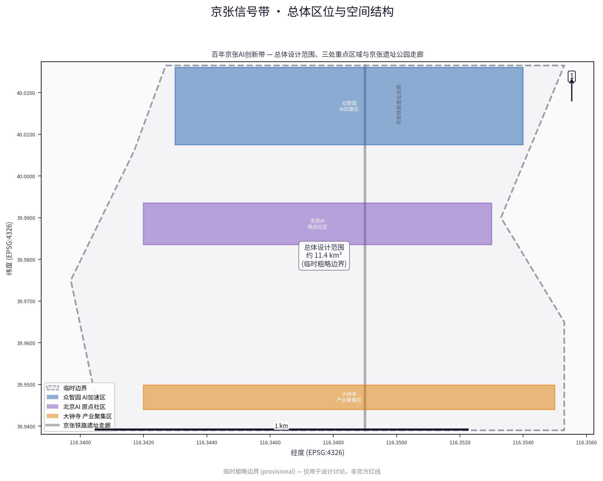
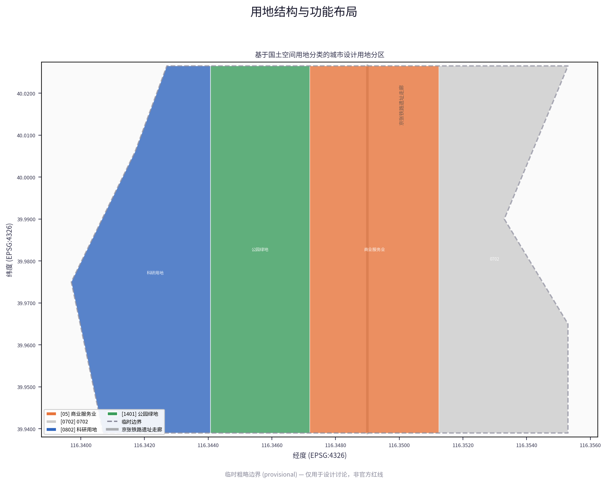
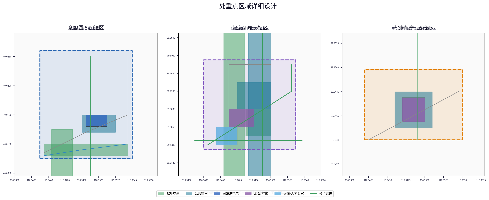
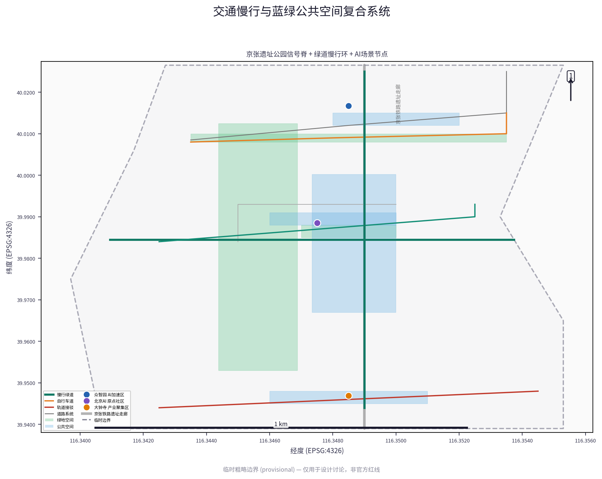
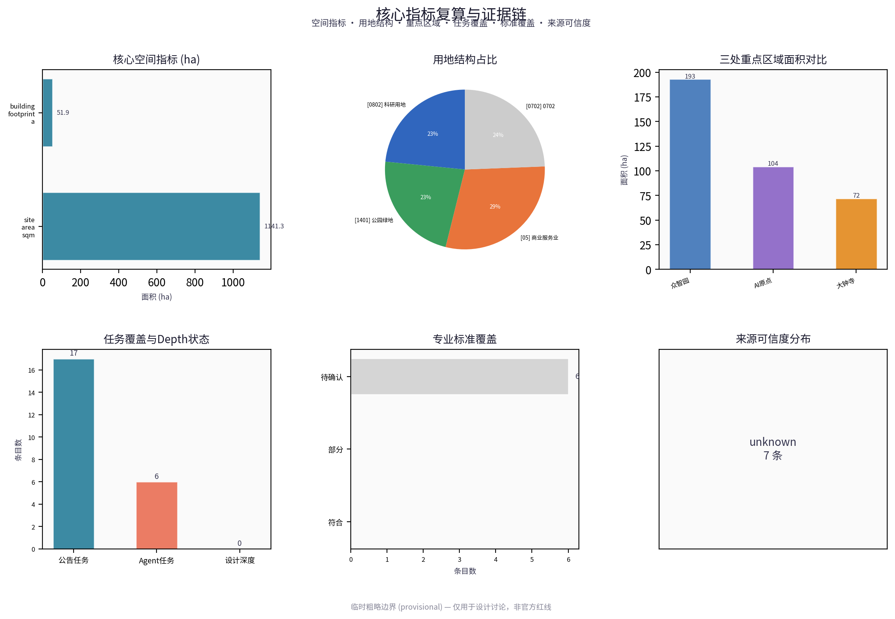

# 京张信号带 THE SIGNAL CORRIDOR：让穿行于公共空间的AI服务亮起信号

> 京张铁路安全运转了一百年，靠的不是某台永不出故障的机车，而是一套人人都看得懂、越界会被记录、红灯亮起必须停下的信号系统。
>
> 今天AI服务正在成为穿行于城市公共空间的新"列车"，而它们大多没有信号灯：上线即永久有效，出错悄悄修补，没有红灯可亮，也没有人知道信号灯在哪里。**本方案把铁路的信号纪律转译为AI治理的空间制度**——每个进入走廊的AI服务必须"发信号"：公开它做什么、用什么数据、谁负责、何时可停；信号可以被任何居民看到、质疑、叫停。
>
> 服务城市的AI不需要被证明永远正确，需要被证明**随时亮着信号**。

## 设计依据与资料清单

本 formal 方案以北京市规划和自然资源委员会海淀分局发布的《百年京张AI创新带城市设计国际方案征集资格预审公告》为第一依据，并以 `brief/site-package/` 中经维护者登记的临时粗略边界、重点区域、枚举、指标和来源清单为机器可读依据。AI agent 在生成方案前必须读取 `design_brief.json`、`allowed_design_space.json`、`sources.json`、`enums/`、`ranges/`、`schemas/`、`data/source_registry.json` 和 `data/processed/agent_fact_pack.md`，并用 `project_scope_summary.csv`、`agent_task_requirements.csv`、`source_use_matrix.csv`、`missing_data_checklist.csv` 建立任务、范围、资料用途和缺口清单。所有设计判断都要拆分为可追溯来源、可复算指标、可校验图层和可人工复核假设。公告要求方案达到控制性详细规划的城市设计深度和规划综合实施方案的城市设计深度，因此文本叙述不能替代 GeoJSON、指标表、A3 文册、A0 展板和 HTML 电子展示成果。

方案不是独立愿景文本，而是从公告、面向智能体任务书和场地资料出发组织成果；本节只把最关键依据放在判断旁边 [source:OFFICIAL-ANNOUNCEMENT] [source:AGENT-TASKBOOK] [depth:existing_conditions_diagnosis]。完整来源和标准覆盖分别保存在 `sources.json`、`standard_matrix.json` 与 `design_depth_matrix.json`，不在正文重复机器索引。

资料登记表的使用边界如下 [source:SOURCE-REGISTRY]：

- data/source_registry.json 登记公开、清权与临时资料的用途边界。
- 当前登记摘要：formal 可用资料 7 条，背景资料 1 条，provisional-only 资料 1 条。
- agent 不得把 background_only 或 provisional_only 资料升级为 official boundary、法定控规、正式评分依据或政府实施承诺。

`data/processed/agent_fact_pack.md` 是本方案的阅读导航层，不是新的权威来源 [source:PROCESSED-FACT-PACK]。它帮助 agent 把三层范围、三处重点区、公告任务、agent.1-agent.6、资料可用性和缺资料事项组织成可读方案；事实判断仍需回到已登记的原始材料 [source:OFFICIAL-ANNOUNCEMENT] [source:AGENT-TASKBOOK]，完整来源关系由 `sources.json` 保存。

本脚手架在官方 `SITE_BOUNDARY` 或三处 `KEY_AREA` 尚未取得时，使用 `brief/site-package/geometry/provisional_boundaries.geojson` 生成临时 formal 包。提交包中的 `geometry/site_boundary.geojson` 与 `geometry/key_areas.geojson` 均必须标注为 `provisional_constraint`、`official_boundary=false`，只能用于方案生成、自检、可视化和设计讨论，不能作为 official redline、审批依据、精确面积依据或法定控制结论。该组织方数据缺口本身不阻断内容评分；替换 official polygons 后，site boundary、key areas、land use、roads、green space、public space、buildings、phasing 和 metrics 均需重算。

本次脚手架生成的可评分状态为：**临时边界，保留精度警示并待正式数据发布后复算；不阻断内容评分**。因此，正文中的空间结构、场景、项目和指标均按“可讨论、可复核、可替换官方边界后重算”的原则写入；当官方边界和重点区 polygon 更新后，agent 必须重新运行脚手架、自检和图纸/HTML生成，不能只替换单个文件。

边界解释可回到总体范围图层和面积复算 [data:geometry/site_boundary.geojson#SITE-001] [metric:site_area_sqm]。三处重点区则由独立图层和数量指标核对 [data:geometry/key_areas.geojson#PROV-KEY-001] [metric:key_area_count]。这意味着读者可以从正文进入证据，但不必先读一串机器编号。

## 三层范围工作框架

方案按照公告确定的三个层次组织工作：统筹研究范围关注 43.6 平方公里的AI产业生态、战略定位、创新链和未来城市形态；总体设计范围关注 11.4 平方公里京张遗址公园周边 1-2 公里城市地区和产业区，要求形成城市更新总体框架、产业空间布局、交通市政支撑和城市风貌控制；重点区域范围关注 368.4 公顷三处详细设计地区，要求明确功能业态、建筑规模、拆改留分类、公共空间连通和交通组织。三层范围在 `compliance_matrix.json` 中逐条映射，保证公告 1.3、1.4、1.5 与 agent.1-agent.6 的必选任务都有章节、图层、指标、图纸和 HTML 证据。

三层工作框架的深度项由 [depth:three_level_scope_framework] 和 [depth:overall_spatial_structure] 约束，空间证据以 [data:geometry/site_boundary.geojson#SITE-001] 与 [data:geometry/key_areas.geojson#PROV-KEY-001] 为准，任务依据以 [standard:PROJECT-OFFICIAL-ANNOUNCEMENT] 为准，范围索引以 [source:PROCESSED-FACT-PACK] 中 `project_scope_summary.csv` 的三层范围表为导航。

三层工作不是互相割裂的图纸集合。统筹研究决定产业链和城市形态判断，总体设计把判断落实到更新项目、空间结构和设施承载，重点区域详细设计验证具体地块、建筑、交通、公共空间和AI应用场景的可实施性。agent 生成方案时必须先锁定当前提交采用的 official 或 provisional 边界和约束，再生成用地、建筑、道路、绿地、公共空间、分期和AI服务节点，最后从这些图层复算指标并在正文解释哪些结论仍受 provisional boundary 限制。任何无法从结构化数据复算的面积、比例、规模或项目数量，不得写入正式结论。

本方案的总体概念为"京张信号带 / THE SIGNAL CORRIDOR"：京张铁路用信号灯指挥列车进退——绿灯行、红灯停、越线即记录——让强大的机器安全穿行于城市。今天AI服务正在成为穿行于公共空间的新"列车"，它们需要同样的信号制度。沿京张遗址公园9公里主脊布置**一条信号脊、三座信号站、十二个信号点**。每座信号站职能不可互换：众智园为**基准信号站**（制定信号标准与安全底线），AI原点社区为**发信号站**（服务入场登记、信号发布与开源校信），大钟寺为**报信号站**（运行状态向公众广播、误点档案公示）。十二个信号点挂靠沿线社区服务设施，任何居民可在步行五分钟内读到附近AI服务的信号并发起复核。这里的"一带"不是新红线，而是把公告三层范围转译为可运行的信号治理方法；"三站"对应三处重点区域；"十二点"把可见与可申诉的权利放进日常步行尺度。

| 层级 | 设计问题 | 方案回答 | 数据落点 |
| --- | --- | --- | --- |
| 统筹研究范围 | AI产业生态和未来城市形态如何组织 | 建立“高校策源-开源协作-企业转化-公共体验-国际传播”的创新链 | compliance_matrix.json、standard_matrix.json |
| 总体设计范围 | 产业空间、城市更新、交通市政和风貌如何落图 | 用地、建筑、道路、绿地、公共空间和分期图层共同表达 | [data:geometry/land_use.geojson#LU-001]、[data:geometry/roads.geojson#ROAD-001] |
| 重点区域范围 | 三处片区如何达到详细设计深度 | 分别提出定位、空间动作、AI场景和实施依赖 | [data:geometry/key_areas.geojson#PROV-KEY-001]、[data:geometry/key_areas.geojson#PROV-KEY-002]、[data:geometry/key_areas.geojson#PROV-KEY-003] |

## 一带总体概念：京张信号带 [source:AGENT-TASKBOOK] [standard:PROJECT-AGENT-OPEN-CALL-TASKBOOK]

### 统一命名与品牌识别

本方案统一中英文命名：「京张信号带 / Jing-Zhang Signal Corridor」。"京张"承接1909年詹天佑主持修建的京张铁路——这条铁路率先以中国人自己的信号系统在复杂地形上安全运转列车；"信号"取铁路信号灯的双重含义——既是行车控制的物理装置，也是"让行为可见、让责任可追"的治理语法。每个进入公共空间的AI服务持有一份"信号表"：服务标识、功能范围、数据来源、责任主体、停止条件与到期日，公开可读、可质疑、可叫停。命名体系下含三个子品牌：基准信号站（众智园·Benchmark Signal Station）、发信号站（AI原点社区·Origin Signal Station）、报信号站（大钟寺·Public Signal Station），形成主品牌+三站子品牌的双层识别结构。

### Logo 设计方向（概念建议）

logo 以铁路"臂板信号机"为母题：臂板水平表示"停止"、下垂表示"通行"。方案将其抽象为"一竖一斜"的简洁几何——竖线为信号柱，斜线为臂板角度，臂板端点的实心圆代表人工介入点。该符号权力延展：三座信号站各取臂板的不同角度位置，形成同族异构的子标识。色彩取京张信号色系：信号红（#B5443A，仅用于停止、降级与人工介入状态，严禁装饰性使用）、准点青（#1F7A72，标记在期合规服务）、历史砖红（取清华园火车站旧站房红砖色相，待实地采样）、科技深蓝与暖灰用于辅助层。logo 可降维为单色版本用于印章、导视铭牌和黑白打印；具备横向和竖向两种版式。所有字体须为开源许可。

### 色彩与字体系统方向（参考方案）

主色系建议三色：历史砖红（取清华园火车站旧站房红砖墙色相，最终色值待实地采样确认）、创新青绿（取清河—小月河水系与海淀绿地系统色相）、科技深蓝（取中关村企业群与夜间算力设施灯光色相）。辅助色为暖灰和中性灰，用于导视底板与信息层级区分。字体系统建议中文采用思源黑体（或同等开源无衬线中文字体），英文采用 Inter 或 IBM Plex Sans，数据与代码采用等宽字体如 JetBrains Mono，保证中英文混排、数字标识和代码展示的视觉一致性。所有字体须为开源或已授权许可，不得使用未清权商业字体。

### 三区两翼信号协同环（概念建议）

"三区"为三座职能不可互换的信号站：基准信号站（众智园·信号标准制定与安全底线维护）、发信号站（AI原点社区·服务入场登记与开源校信）、报信号站（大钟寺·状态公开与误点公示）。"两翼"为功能延伸：**中关村科技服务翼**（中关村大街沿线标准、知识产权、投融资、法务资源，近五道口—中关村站轴向）、**小月河场景翼**（小月河沿线社区、教育、医疗、消费场景应用与居民反馈）。三区两翼构成"发信号→校信号→报信号→反馈修正→基准更新"的闭环：基准站制定信号标准 → 发信号站组织服务入场与开源校信 → 报信号站向公众广播运行状态与误点记录 → 小月河场景翼收集场景反馈与居民申诉 → 反馈回流至基准站更新标准。该协同环为概念建议，可视化图纸保存于 `report/` 目录，不作为法定空间控制。

### 区域协同联动（概念建议）

京张信号带在更大尺度上与北京科技创新格局联动：

- **北纬社区**：北五环至北清路沿线科技创新社区，作为人才生活与产业服务延伸腹地，建议通过京张遗址公园慢行环向北衔接。
- **未来科学城（昌平）**：北京国际科创中心"三城一区"之一，聚焦能源与前沿技术，建议通过轨道13号线/昌平线与京张带形成"基础研究—应用转化"双轴联动。
- **怀柔科学城**：聚焦大科学装置与基础研究，与海淀高校策源形成"基础科学—AI应用"互补关系，以学术交流、数据共享和联合实验室为纽带。
- **经开区（亦庄）**：聚焦高精尖产业与智能制造，与京张带形成"算法+制造"链条，以标准互认、场景共建和企业双向落地为路径。
- **京津冀**：协同天津算力与河北数据标注、内容审核等产业，形成"海淀算法策源—津冀算力与数据配套"的区域分工，依托京津冀协同发展框架。

上述区域协同均为概念建议，需在正式规划中由相关主体确认，不作为已确定的政府实施安排。

## 统筹研究范围产业与未来城市研究

统筹研究范围的核心任务是构建世界级 AI 创新生态体系。方案应梳理海淀高校院所、头部企业、算力算法数据要素、孵化平台、上市企业、独角兽和科技服务资源，提出AI创新链、产业链、人才链和城市服务链的空间协同框架。命名方案和 logo 设计应服务于“百年京张文化带、都市AI生活体验带、AI融合创新带”的整体辨识度，不能只停留在口号，应说明与产业生态、公共空间和文化资源的关联。面向智能体任务书还要求回应“五大功能”和“三区两翼”协同，形成可继续深化的命名系统、视觉识别、总体空间结构图、场景开放和运营机制；本节必须用 [source:AGENT-TASKBOOK] 与 [standard:PROJECT-AGENT-OPEN-CALL-TASKBOOK] 标注这些要求来自 agent 开源征集任务，而不是法定规划控制。

统筹研究并不新增伪精确红线；它通过 [standard:MOHURD-URBAN-DESIGN-MEASURES] 要求的城市风貌、公共空间和建筑布局统筹，回接 [data:geometry/land_use.geojson#LU-001]、[data:geometry/public_space.geojson#PUBLIC-001] 与 [depth:overall_spatial_structure]，说明产业策略最终要落到可见、可复核的空间结构。

未来城市形态研究应回答人工智能如何改变工作、生活、社交、学习、交通和公共服务。方案应把AI交通系统、连续绿色空间、创新服务设施和国际化生活工作氛围落实为可定位的功能区、节点、廊道和场景，而不是泛泛描述技术愿景。agent 应把产业战略指标、AI创新指数、人才密度、空间供给类型和AI+垂直应用重点区域写入指标体系，并标明哪些是官方、哪些是设计建议、哪些仍待正式数据校准。若提出全球AI创新活动、开发者社区、开放场景或朝圣路线，应写为"概念建议/参考方案/可供专业团队深化研究"，不得写成已经确定的政府活动或实施安排。

### 全球AI创新生态对标研究 [source:AGENT-TASKBOOK]

为构建世界级AI创新生态体系，本方案对标六个全球AI创新集聚区，提取可迁移至京张场地的空间与运营经验。以下案例信息来源于各机构官方网站和公开报道，仅供设计参考，不构成对本场地与上述机构合作关系的声明。

| 序号 | 全球案例 | 核心构成 | 空间/运营特征 | 对京张场地的可迁移启示 |
| --- | --- | --- | --- | --- |
| 1 | 美国硅谷AI生态圈（Silicon Valley） | 斯坦福大学技术转移办公室、Google DeepMind、Meta AI、NVIDIA总部、Sand Hill路风投集聚区 | 高校技术转移—企业研发—风险投资—孵化器—产业社区形成连续可达链条，密度高但依赖小汽车；园区与城市边界模糊 | 强化海淀高校（清华、北大、北航等）技术转移与园区物理可达性，以慢行环替代小汽车依赖，避免园区孤立化 |
| 2 | 美国波士顿AI创新走廊（Kendall Square—Mass Ave走廊） | MIT CSAIL、哈佛医学院、麻省总医院(MGH)、Kendall Square创新广场 | 沿地铁Red Line和Mass Ave形成"实验室—医院—产业广场"线性走廊，产学研医垂直整合，企业总部首层向街道开放 | 大钟寺—原点社区可参考"轨道走廊+首层开放+产学研医嵌入"模式，将企业展示面与公共街道融合 |
| 3 | 英国伦敦国王十字创新街区（King's Cross Innovation Quarter） | Google DeepMind总部、Central Saint Martins学院、Coal Drops Yard商业改造、Granary广场 | 利用铁路遗存（火车站货场）改造为创新街区，保留工业遗产骨架，嵌入公共广场、学院和企业总部；文化商业科技混合 | 京张铁路遗址公园可直接借鉴"铁路遗存+创新街区+公共广场"模式，保留铁路文化骨架同时嵌入AI产业与公共生活 |
| 4 | 日本东京筑波科学城（Tsukuba Science City） | 筑波大学、NIMS、KEK、JAXA筑波 | 规划型科学城，大量国家级研究机构集聚，但早期因远离东京通勤导致产城分离、夜间活力低；后期通过筑波快线改善可达性 | 避免重研究轻生活，同步配置人才居住、夜间经济与社区服务，保证轨道可达性为先决条件 |
| 5 | 新加坡AI政府计划（AI Singapore + GovTech） | AI Singapore 100E政府场景开放、AI Verify治理框架、国家AI战略 | 政府主导场景开放与数据供给，以"100个实验"模式让企业用政府真实数据测试AI方案，配套治理沙盒 | 众智园安全治理沙盒可借鉴"政府场景开放+治理框架先行"模式，数据要素会客厅可参考AI Verify可审计思路 |
| 6 | 中国深圳鹏城实验室AI生态（Pengcheng Laboratory） | 鹏城实验室、深圳大学城、腾讯、华为、大疆、前海深港合作区 | "基础研究+龙头牵引+垂直应用"模式，鹏城实验室作为新型研发机构连接高校与企业，以算力平台为公共基础设施降本 | 众智园可参考鹏城模式以"国家级平台+共享算力+企业垂直应用"组织产业生态，端侧算力驿站作为公共基建降低初创团队门槛 |

对标启示可归纳为五条空间与运营原则：①高校技术转移须与产业园物理可达；②轨道走廊是创新集聚的关键骨架；③铁路/工业遗产改造为创新街区有全球先例支撑；④政府场景开放与治理框架先行是AI落地的关键制度条件；⑤共享算力与公共数据平台是支撑初创生态的公共基础设施。以上原则已融入"三区两翼协同环"与场景卡设计，空间证据参见 [data:geometry/land_use.geojson#LU-001]、[data:geometry/roads.geojson#ROAD-001]。

## 总体设计范围城市更新与控规深度城市设计

总体设计范围要求达到控制性详细规划的城市设计深度。方案必须提出城市更新总体空间结构、低效空间识别、更新项目清单、实施政策建议、产业功能比例、空间组织模式、建筑总规模和综合承载能力评估。`geometry/land_use.geojson` 应完整覆盖设计边界且无重叠，`geometry/buildings.geojson` 应表达更新建筑基底或保留建筑基底，`geometry/roads.geojson` 应表达微循环、慢行和轨道接驳关系，`metrics.json` 应复算核心面积、比例和图层数量。

本节按照 [standard:MOHURD-CONTROL-DETAILED-PLANNING] 把控规深度内容拆成可审查对象：[data:geometry/land_use.geojson#LU-001] 表达用地结构，[data:geometry/buildings.geojson#BLDG-001] 表达建筑基底，[data:geometry/roads.geojson#ROAD-001] 表达交通组织，[metric:building_footprint_area_sqm] 用于复核建筑基底面积，[depth:land_use_layout] 与 [depth:development_intensity_controls] 约束成果深度。

总体设计还必须支撑交通、轨道、市政和配套设施。方案应围绕轨道站点一体化、道路微循环、非机动车停放、停车供给、创新服务平台、人才生活服务、新型基础设施、分布式能源和端侧算力提出空间布局和实施路径。涉及建筑高度、开发强度、道路红线、退线和设施标准的内容，若尚无官方控制条件，应写为“待正式控规条件确认”，不得以 agent 推测值冒充审定指标。

## 重点区域详细设计

重点区域详细设计是必选项。众智园AI自主创新加速区应围绕国家人工智能平台、全栈自主创新、标准制定、安全治理、产业展示、对外交通、清河文化、低碳绿色创新交往环境和绿色空间AI场景提出详细方案。北京AI原点社区应围绕近校创新、成果孵化转化、人才特区、开源体系、品牌活动、建筑拆改留、成果展示发布、居住生活配套、校区园区慢行联系和轨道站点一体化提出详细方案。大钟寺AI产业聚集区应围绕领军企业、智能体、智能终端、内容消费、数据要素、数字资产、商业服务、规划绿地复合利用、大钟寺站一体化和路口四象限步行连通提出详细方案。

三处重点区域详细设计必须引用 [data:geometry/key_areas.geojson#PROV-KEY-001]、[data:geometry/key_areas.geojson#PROV-KEY-002]、[data:geometry/key_areas.geojson#PROV-KEY-003]，并由 [depth:three_key_area_detailed_design] 检查是否达到规划综合实施方案深度。若只描述“打造示范区”而没有功能、建筑、交通、公共空间和实施项目证据，应被视为未完成。

三处重点区域必须在 `geometry/key_areas.geojson` 中出现。若仓库已提供 official polygons，应作为 `official_constraint` 使用；若 official polygons 缺失，可暂用 `provisional_constraint`，但正文、HTML、sources、assumptions 和 self_check 必须说明它不能作为正式评分或审批依据。`compliance_matrix.json` 应分别覆盖公告 1.5.3.1、1.5.3.2、1.5.3.3。设计表达应包含功能业态、建筑规模、建筑形态、拆改留分类、公共空间系统、交通组织、慢行连通和实施项目。HTML 页面应能切换查看三处重点区域，A3 文册和 A0 展板应至少包含重点片区总图、局部详图和指标说明。

| 重点片区 | 设计定位 / 信号站职能 | 空间动作 | AI产业与运营场景 | 证据引用 |
| --- | --- | --- | --- | --- |
| 众智园AI自主创新加速区 | 基准信号站·制定信号标准与安全底线 | 强化清河界面、产业展示；以绿色空间承载开放测试与标准治理展示；设基准实验庭与安全治理沙盒 | 信号标准制定、基准答案集维护、模型红队评测 | [data:geometry/key_areas.geojson#PROV-KEY-001]、[depth:three_key_area_detailed_design] |
| 北京AI原点社区 | 发信号站·服务入场登记与开源校信 | 组织慢行缝合；补足成果发布、人才服务、可负担空间与开源协作；设开源首发厅与失败运行档案 | 开源社区、成果发布、服务信号表登记、近校孵化 | [data:geometry/key_areas.geojson#PROV-KEY-002]、[source:AGENT-TASKBOOK] |
| 大钟寺AI产业聚集区 | 报信号站·运行状态公开与误点公示 | 大钟寺站一体化、四象限步行连通、商业服务更新；设误点档案公开墙与国际路演客厅 | 智能体展示、内容消费、数据要素、误点档案公示 | [data:geometry/key_areas.geojson#PROV-KEY-003]、[metric:key_area_count] |

## AI 创新生态、人才画像与 AI+ 场景

方案应建立面向AI人才和企业的空间需求画像，覆盖研发办公、开源协作、成果发布、企业服务、人才居住、社交学习、消费生活、运动休闲和国际交往。AI+场景应围绕公告提出的交通、服务、消费、医疗、教育、法律、生活服务等方向，形成产业发展场景和AI赋能城市功能场景。每个场景应说明服务对象、空间位置、数据来源、隐私边界、人工复核机制和运营主体。

AI 场景必须落到空间和治理边界：公共空间场景引用 [data:geometry/public_space.geojson#PUBLIC-001]，慢行与交通场景引用 [data:geometry/roads.geojson#ROAD-001]，开放空间场景引用 [data:geometry/green_space.geojson#GREEN-001] 和 [metric:public_space_ratio]、[metric:green_ratio]。这些引用让评审者知道场景不是口号，而是位于具体图层和指标中的设计对象。面向智能体任务书要求不少于10张AI场景卡、不少于3个产业测试验证场景和不少于5类用户画像；脚手架只给出结构，正式参赛者必须把场景卡、画像表、隐私边界、人工复核和运营主体写入正文、HTML、A3/A0 和合规矩阵。

| 用户画像 | 典型需求 | 空间响应 | 自检边界 |
| --- | --- | --- | --- |
| 开源开发者 | 发布、协作、测试、社区声誉 | 原点社区开源发布厅、公共代码墙、夜间协作空间 | 不采集个人行为轨迹；活动数据只做聚合统计 |
| 初创团队 | 低成本办公、算力入口、产品试验场 | 众智园共享测试场、端侧算力服务点、标准治理咨询 | 算力和数据服务需另行授权 |
| 头部企业访客 | 展示、商务、国际接待、人才招聘 | 大钟寺国际路演客厅、轨道站点接驳、重点企业周边公共空间 | 企业标识和案例须清权 |
| 周边居民 | 通勤、休闲、社区服务、低扰动更新 | 京张遗址公园慢行环、社区服务嵌入、夜间照明和活动分级 | 不将居民画像用于商业推荐 |
| 高校师生 | 成果转化、跨校协作、日常慢行 | 校区-园区慢行缝合、成果转化驿站、AI教育体验点 | 校园数据和科研成果需授权 |
| 老年居民与非智能设备使用者 | 不依赖AI获得同等服务；就近读到AI服务信号与停止条件 | 信号点纸质信号公告板、人工服务窗口、非AI等价路径 | 默认保留传统服务方式；拒绝AI不降低服务质量 [standard:BARRIER-FREE-ENVIRONMENT-LAW] |
| 视障与行动不便使用者 | 连续无障碍通行、人工求助兜底 | 全线无障碍连续通道、伴行服务、信号点人工求助 | 端侧即时删除；代表性使用者参与信号复核回放 |
| 儿童与照护者 | 安全、遮蔽、可停留 | 站前广场、母婴设施、低速配送与人群分时分区 | 不采集未成年人个人数据 |

| 场景卡 | 空间载体 | 设计说明 |
| --- | --- | --- |
| 01 开源发布厅 | 北京AI原点社区 | 面向高校、开源社区和初创团队，提供成果发布、代码贡献展示和小型路演空间 |
| 02 安全治理沙盒 | 众智园 | 将标准制定、安全评测、模型红队测试转译为可参观、可预约、可监管的展示和协作节点 |
| 03 端侧算力驿站 | 总体设计范围节点 | 与公共服务、企业服务和低碳能源策略结合，作为待深化的新型基础设施原型 |
| 04 AI慢行导航 | 京张遗址公园活力带 | 用可解释导视和低侵入传感帮助识别慢行断点、拥挤节点和无障碍需求 |
| 05 大钟寺国际路演客厅 | 大钟寺AI产业聚集区 | 服务智能体、智能终端和内容消费企业的展示、洽谈、媒体发布和国际交流 |
| 06 清河低碳创新廊 | 众智园临清河界面 | 把绿色空间、雨洪、步行骑行和AI展示结合，作为园区公共客厅 |
| 07 近校成果转化街 | 北京AI原点社区 | 面向高校成果转化，组织孵化、展示、法务、知识产权和投融资服务 |
| 08 数据要素会客厅 | 大钟寺片区 | 以合规、授权、可审计为前提，展示数据要素和数字资产流通的城市服务界面 |
| 09 AI生活服务样板街 | 社区与商业交汇处 | 将医疗、教育、法律、生活服务等AI+场景落到可运营的小尺度街区空间 |
| 10 全球AI活动周路线 | 一带公共空间系统 | 形成从遗址文化、开源社区、产业展示到国际路演的可步行、可传播体验路线 |

### 场景卡完整标注（agent.3 必选，共10张）

以下为10张AI场景卡的完整标注，每张明确数据来源、隐私边界、人工复核机制和运营主体。所有场景均为概念建议，须由运营主体在正式实施前完成数据合规审查和伦理评估。

| 场景卡 | 类型 | 数据来源 | 隐私边界 | 人工复核机制 | 运营主体 |
| --- | --- | --- | --- | --- | --- |
| 01 开源发布厅 | AI+公共服务 | 公开发布的开源代码与模型仓库（GitHub/HuggingFace公开数据） | 不采集发布者个人行为数据；代码贡献记录仅展示已公开信息 | 发布内容经社区志愿审核与运营方人工抽检；敏感模型需安全审查 | 原点社区运营公司+开源社区委员会 |
| 02 安全治理沙盒 | 产业测试验证 | 授权提供的模型测试数据集与标准评测基准 | 测试数据脱敏处理；不关联自然人身份；模型输入输出留存审计日志 | 独立安全专家委员会复核红队测试结果与风险评估报告 | 国家AI平台授权机构+第三方安全评测机构 |
| 03 端侧算力驿站 | 新基建/公共服务 | 公共设施数据（能耗、利用率）经授权采集 | 不采集个人设备信息；算力调度记录匿名化 | 运营方设置用量阈值预警，异常用量人工审核 | 区属国企或特许经营算力服务商 |
| 04 AI慢行导航 | AI+交通出行 | 公开交通与慢行路网数据；匿名化人流热力（聚合非个体，≥20人匿名化） | 不采集个体轨迹；热力数据仅聚合统计 | 路线建议经交通部门复核；无障碍标注由市政部门校验 | 交通管理部门+技术服务商 |
| 05 大钟寺国际路演客厅 | AI+产业服务 | 企业公开产品信息与发布授权材料 | 企业商业秘密按授权协议保护；不接受未授权用户数据接入 | 路演内容经运营方与参展企业双审；涉外内容报备 | 大钟寺片区运营公司+企业联合会 |
| 06 清河低碳创新廊 | AI+低碳/蓝绿空间 | 公开环境监测数据（气象、水质、碳排放） | 不采集进入空间的人员个体信息 | 环境数据经环保部门复核后才用于公共展示 | 园林绿化部门+众智园运营方 |
| 07 近校成果转化街 | AI+成果转化 | 高校经授权的已公示科研成果（专利、论文） | 不涉及未公开科研成果；个人成果需本人授权 | 成果转化须经高校技术转移办公室审核确认 | 高校技术转移办公室+专业孵化运营机构 |
| 08 数据要素会客厅 | AI+数据要素/城市治理 | 合规数据交易平台登记的公共数据产品 | 数据使用遵循最小必要、授权访问、可审计原则；不开放自然人原始数据 | 数据流通经合规审查委员会复核；建立数据使用留痕和退出机制 | 数据交易机构+合规审查委员会 |
| 09 AI生活服务样板街 | AI+生活服务（医疗/教育/法律） | 公共服务开放数据与授权机构专业数据 | 医疗健康数据不离开授权机构内网；教育数据按未成年人保护法规处理；法律AI输出标注"仅供参考" | 医疗/教育/法律场景必须保留专业人工终审机制；AI仅作辅助 | 各行业主管部门授权服务机构 |
| 10 全球AI活动周路线 | AI+国际传播/公共空间 | 活动公开信息与公共空间开放数据 | 活动报名信息最小化采集；不用于个人画像 | 活动安全方案经公安部门审核；大型活动须取得行政许可 | 区文旅/科技部门+活动运营方 |

### 产业测试验证场景（agent.3 必选，不少于3个）

以下三个场景专项用于AI产业测试验证，以"可测试—可评估—可迭代"为核心，区别于公共服务类场景：

| 测试场景 | 测试目标 | 空间载体 | 验证指标 | 数据与隐私 | 人工复核 | 运营主体 |
| --- | --- | --- | --- | --- | --- | --- |
| T1 自主模型评测场 | 国产大模型在安全、能力、效率维度的标准化评测与红队对抗 | 众智园安全治理沙盒 | 评测覆盖率、红队发现率、修复时效 | 评测数据集经授权脱敏；模型输入输出留存审计日志 | 国家AI平台安全专家委员会终审评测结论后方可公开 | 国家AI平台授权机构 |
| T2 自主智能体真实场景验证 | 智能体在交通、社区治理、公共服务场景的端到端能力验证 | 总体设计范围端侧算力节点+京张慢行环 | 任务完成率、人工接管率、用户满意度 | 场景传感器采集实时数据须脱敏；不识别自然人面部特征 | 智能体关键决策设人工审核节点；高危操作必须人工确认 | 运营公司+场景需求方+技术服务商三方共管 |
| T3 数据要素流通测试 | 公共数据与社会数据在合规沙盒内加工、流通、增值的链路验证 | 大钟寺数据要素会客厅 | 数据产品上线数、调用频次、合规通过率 | 数据加工在可信执行环境(TEE)内完成；不出沙盒；全流程审计 | 合规审查委员会复核数据产品准入与退出 | 数据交易机构+合规审查委员会 |

### 用户画像完整性标注（agent.3 必选，8类覆盖全人群）

上表列出8类用户画像（开源开发者、初创团队、头部企业访客、周边居民、高校师生、老年居民与非智能设备使用者、视障与行动不便使用者、儿童与照护者）。其中后三类——老年与非智能设备使用者、视障与行动不便使用者、儿童与照护者——是公共服务设计中不可省略的底线人群：全国60岁及以上人口占23.0%、互联网普及率80.1%，意味着约五分之一人口不在网上，双通道不是为少数人保留的例外通道，是按人口结构设防的主通道之一 [standard:BARRIER-FREE-ENVIRONMENT-LAW]。以下补充空间需求量化与AI服务设计约束，空间证据参见 [data:geometry/public_space.geojson#PUBLIC-001]：

| 用户画像 | 日均活动时段 | 核心空间需求 | AI服务介入点 | 数据与隐私约束 | 运营主体响应 |
| --- | --- | --- | --- | --- | --- |
| 开源开发者 | 10:00-24:00（夜间高发） | 发布厅、协作工位、算力入口、社交休息区 | 代码检索、模型对比、社区声誉可视化 | 仅聚合公开贡献数据；不追踪个人行为轨迹 | 原点社区运营公司维护夜间协作空间与算力调度 |
| 初创团队 | 工作日全天+周末弹性 | 低成本办公、共享测试场、路演空间 | 算力配额管理、政策匹配、投融资对接 | 企业数据经授权使用；不接受未授权第三方数据接入 | 众智园+孵化运营机构 |
| 头部企业访客 | 工作日白天为主 | 国际路演厅、商务会客厅、展示空间、轨道接驳 | 企业案例展示、国际媒体传播、双语导览 | 企业标识和案例须清权；不采集访客个人画像 | 大钟寺片区运营公司 |
| 周边居民 | 通勤高峰+早晚休闲 | 慢行通廊、社区服务点、休闲绿地、夜间安全照明 | 慢行导航、社区服务匹配、活动信息推送 | 绝不将居民画像用于商业推荐；导航数据聚合匿名化 | 社区街道+园林部门 |
| 高校师生 | 教学日+晚间 | 成果转化驿站、跨校慢行、教学体验点、孵化工位 | 成果转化匹配、文献检索、跨校协作 | 校园数据和科研成果需授权；不采集教学行为数据 | 高校技术转移办公室+原点社区 |
| 老年居民与非智能设备使用者 | 通勤+早晚休闲+白天就医 | 慢行通廊、人工窗口、信号点纸质公告板、社区服务点 | 不使用任何设备即可读到附近AI服务信号与停止条件 | 默认保留非数字化路径；不采集任何个人画像 [standard:BARRIER-FREE-ENVIRONMENT-LAW] | 社区街道维护人工窗口与纸质公告 |
| 视障与行动不便使用者 | 全天弹性 | 连续无障碍通道、伴行服务点、信号点人工求助 | 伴行导航（端侧即时删除）；人工求助兜底 | 端侧数据即时删除；不识别面部特征；代表性使用者参与信号复核 | 无障碍管理部门+场景运营方 |
| 儿童与照护者 | 周末+放学后 | 站前广场、母婴设施、遮蔽休息区、分时活动区 | 慢行安全提示、分时分区管理 | 不采集未成年人个人数据；家长知情同意 | 社区街道+园林部门 |

画像数据均来自公开统计与设计假设，不构成对具体个人画像或政府实施安排的声明，仅供专业团队深化研究。

### 信号表：每个AI服务的公开信号

信号带的核心治理工具是"信号表"——每个进入走廊公共空间的AI服务必须持有一份。信号表含六项必填字段：①服务标识与功能范围（它做什么）、②最小必要数据与来源（它用什么数据）、③责任主体（谁负责）、④停止条件与到期日（何时可停）、⑤非AI等价路径（人工兜底）、⑥信号广播位置（在哪个信号点公开）。服务经发信号站登记后获得最长180天运行窗口；到期未校信号即自动降级为非AI等价路径——停止是默认结果，续期才需要证据。误点记录进入报信号站的公开档案，只增不删。任何居民可在最近的信号点发起复核。

城市智能体可辅助识别慢行断点、公共空间热力、设施维护与活动安全风险，但不替代规划审批、不输出未经授权的个人画像、不声称获得官方实施承诺。所有AI场景数据须遵守最小必要、公开来源、可解释与人工复核原则，进入结构化图层与合规矩阵 [standard:GENERATIVE-AI-INTERIM-MEASURES] [standard:BARRIER-FREE-ENVIRONMENT-LAW]。每个场景同时登记"谁在运行、数据边界是什么、谁能叫停"三项信息，并在信号点公示。不做人脸识别驱动的公共管理场景，不把未成熟技术描述为可全面部署。

## 用地、建筑规模与拆改留方案

用地方案应依据国土空间调查、规划、用途管制分类等公开标准表达，形成完整、闭合、无缝的用地分区。建筑方案应区分保留、改造、更新、新建或待确认对象，明确建筑基底、功能、规模、风貌、屋顶、体量和高度控制的建议层级。若缺少现状建筑、权属、控规和工程条件，方案只能提出方法和待校准清单，不能编造拆改留结论。

用地分类依据 [standard:MNR-LAND-USE-CLASSIFICATION-GUIDE]，建筑高度、体量、界面和风貌控制由 [depth:height_massing_character] 管理，拆改留方法由 [depth:retain_renovate_demolish] 管理。用地和建筑的主要证据是 [data:geometry/land_use.geojson#LU-001]、[data:geometry/buildings.geojson#BLDG-001] 和 [metric:building_footprint_area_sqm]。

建筑规模和强度指标必须与 `metrics.json` 和图层一致。若总建筑规模、容积率、建筑高度、建筑密度、绿地率、退线和建筑控制线缺少官方条件，应统一使用 `status=unknown`，并在 `reason` / `assumptions` 中说明待补条件、当前假设和正式数据到位后的复算路径，不得用固定数值制造精确感。A3 文册应给出更新项目清单和指标复核表，A0 展板应把关键空间结构和重点片区表达清楚，HTML 页面应提供指标和图层联动查看。

## 交通、轨道、市政与公共服务设施

交通方案应回应公告对轨道站点一体化、道路微循环、慢行断点、对外交通、停车、非机动车停放和绿色交通系统的要求。重点应覆盖北五环、京张遗址公园跨环路节点、五道口、清华东路西口、大钟寺站及重点企业周边交通联系。道路和慢行图层应保持在提交边界内，并与公共空间、绿地、产业节点和重点片区相互校核；若提交边界为 provisional，交通结论也只能作为临时设计讨论。

交通和市政专业深度分别由 [depth:traffic_rail_slow_parking] 与 [depth:municipal_new_infrastructure] 约束；图层证据引用 [data:geometry/roads.geojson#ROAD-001]、[data:geometry/public_space.geojson#PUBLIC-001] 和 [data:geometry/constraints.geojson#CONSTRAINTS]。当道路红线、管线、消防和市政条件缺失时，应通过 assumptions 说明待补，而不是把策略写成审定条件。

市政和公共服务设施覆盖AI产业服务设施、创新服务平台、人才生活服务设施、新型基础设施、分布式能源、端侧算力和传统市政设施融合。所有公共服务保持双通道：基础服务不依赖AI（人工窗口、纸质信号公告、无障碍设施、应急求助），增强服务由AI辅助且按信号表对时。这不是设计偏好，是无障碍环境建设法第三十九条"保留现场指导、人工办理等传统服务方式"的执行——全国60岁及以上人口占23.0%、互联网普及率80.1%，约五分之一人口不在网上，双通道是按人口结构设防的主通道之一 [standard:BARRIER-FREE-ENVIRONMENT-LAW]。信号脊全线连续无障碍，信号点保留人工窗口；任何AI服务被停止或降级时，等价人工路径须同步上线，公共服务本身不断线。缺少管线、能源、排水、防洪、消防等工程资料时，列为正式深化前置条件 [depth:municipal_new_infrastructure]。

## 蓝绿空间、公共空间与城市风貌

蓝绿空间方案应以京张遗址公园活力带为骨架，统筹清河、小月河、周边高校、企业、社区出行需求，提出南北贯通、东西连通的步道、骑行道和绿色空间体系。方案应识别慢行断点、上跨环路节点、公园南端和北端景观节点，提出停车、体育、创新交往、科技测试、应用展示和公共服务复合利用策略。

蓝绿公共空间由设计深度项和绿地、公共空间图层共同校核 [depth:blue_green_public_space] [data:geometry/green_space.geojson#GREEN-001] [data:geometry/public_space.geojson#PUBLIC-001]。绿地与公共空间比例在正文解释设计意义，完整复算保存在 `metrics.json`；城市风貌、公共空间和建筑控制的统筹则回到专业标准矩阵 [standard:MOHURD-URBAN-DESIGN-MEASURES]。

城市风貌方案应融合京张铁路历史文化、中关村创新文化和AI创新文化，利用清华园火车站、北影等文化资源，提出城市基调、建筑风貌、屋顶形态、体量、界面和公共艺术引导。agent 还应提出导视标识、文化符号、国际传播叙事、AI朝圣地标、贡献墙或荣誉展示体系，但所有品牌、字体、图像、肖像和企业标识都必须有清权来源。风貌控制应分清官方管控、设计建议和待确认条件，严禁在没有文保或控规依据时给出伪精确控制线。

## AI 朝圣地标（agent.4 必选，概念建议） [source:AGENT-TASKBOOK]

方案沿京张信号带设置三处可步行串联的AI朝圣地标，形成从基准信号到公共报信的体验序列。三处地标均为概念建议，须由专业团队深化研究和文保、规划部门确认后实施。

| 地标编号 | 地标名称 | 选址方向 | 设计概念（参考方案） | 文化与技术内涵 |
| --- | --- | --- | --- | --- |
| LM-1 | 基准灯塔｜Benchmark Lighthouse | 众智园临清河界面（概念建议，待正式控规确认） | 以铁路臂板信号机为造型原型：塔身集成一面公共"信号板"，全天显示走廊内在役AI服务的绿灯（在期合规）、黄灯（测试中）、红灯（降级或停止）状态。底层为基准答案集维护与争议裁决的公开旁听厅 | 将"谁在维护信号标准"变成可见的公共空间——朝圣的对象是制度，不是设备 |
| LM-2 | 零号信号所｜Signal Station Zero | 北京AI原点社区中央公共广场（近校缝合节点） | 以清华园火车站旧站房砖墙肌理为基座，设"信号登记台"与"失败运行档案墙"：每个AI服务在此登记信号表后方可进入走廊；被中止或退役的服务记录永久公开。夜间以慢速呼吸光效标注在期服务数量 | 让服务入场与可信赖的失败记录可视化——一个允许"红灯"被永久记录的城市，才配谈论可信AI |
| LM-3 | 报钟广场｜The Tolling Square | 大钟寺站四象限步行连通节点上方（轨道一体化节点） | 大钟寺以古钟闻名——钟是前工业时代的公共报时装置，AI时代的公共通报单位是"信号状态"。广场以地面铺装与灯柱呈现全带AI服务的信号矩阵，居民不使用设备即可读到附近服务的运行状态与责任主体。四象限连廊集成双语导视 | 以"报钟"意象连接古钟的公共通报传统与AI服务的可见性——让信号像钟声一样覆盖所有人群 |

三处地标应纳入 [data:geometry/public_space.geojson#PUBLIC-001] 与 [depth:blue_green_public_space] 校核，具体高度、体量和退线控制待正式控规条件确认后方可作为设计依据；在 provisional 条件下仅作为概念建议使用。

## 文化叙事与导视系统（agent.5 必选，概念建议） [source:AGENT-TASKBOOK]

### 文化叙事三重层叠

京张信号带的文化叙事由三重层叠构成，沿公共空间慢行系统形成可步行体验的文化序列：

1. **京张铁路历史叙事层（1909—）**：以詹天佑主持修建的京张铁路为起点，重点呈现青龙桥"人"字形展线工程创举、清华园火车站历史站房、京张铁路作为中国第一条自建铁路的里程碑意义。这条铁路率先以中国人自己的信号系统在复杂地形上安全运转列车——信号灯、臂板信号机与闭塞制度让强大的机器得以在城市中可控制地穿行，这正是信号带概念的历史原型。建议在京张遗址公园沿线设置不少于5处历史标记节点，采用低介入嵌入式标识（地刻、铭牌、导轨遗存展示），不新建大体量构筑物；文保范围内严格遵守文物保护法要求，所有标记须经文物部门审批。
2. **中关村创新文化叙事层（1980—）**：以中关村电子一条街、海淀试验区、国家自主创新示范区为脉络，呈现"中关村电子一条街—海淀试验区—国家自主创新示范区—北京国际科创中心核心区"四级演进。建议在原点社区设置创新文化时间轴墙（概念建议），结合已公开的历史影像和报道文献，所有图像须经版权清权。
3. **AI新文化叙事层（2020—）**：以大模型、智能体、开源社区、AI+城市治理为前沿内容，呈现AI从实验室走向公共空间与日常生活的转化过程。本方案对AI新文化的定义是：**可亮信号、可被叫停、误点可查**——这正是京张铁路信号文化在智能时代的延续。建议在大钟寺片区设置AI文化橱窗与误点档案公开墙（概念建议），展示智能体、智能终端的公共可见形象与运行记录，企业案例须清权。

### 导视标识系统方向（参考方案）

导视系统建议四级层次：①区域级——京张信号带主标识设于三处信号站入口与轨道站点，采用统一logo与信号色系识别；②片区级——基准信号站/发信号站/报信号站各自子品牌标识，在主标识下方标注站名与主题色；③节点级——十二个信号点采用金属铭牌+纸质信号公告板+二维码轻量方案，公告板展示附近AI服务信号表（服务名称、运行状态、责任主体、停止条件），二维码链接至HTML电子展示页（禁远程脚本，数据本地化）；④文化标记级——铁路信号历史标记采用地刻与嵌入式铭牌。导视系统信息层级、字号比和材质建议保存于 `report/signage-guide.md`（待生成），具体材质与安装方案须待文保、城管和规划部门确认后实施 [source:AGENT-TASKBOOK] [depth:height_massing_character]。

## 更新项目清单、实施政策与分期计划

实施方案应形成可审查的更新项目清单，说明项目位置、类型、功能、责任主体、依赖条件、实施阶段、风险和评估指标。政策建议应覆盖城市更新统筹实施、空间供给、运营机制、产业服务、公共参与、数据治理和产权协同。`geometry/phasing.geojson` 应表达分期范围，`compliance_matrix.json` 应把每个任务与分期和图纸挂接。

项目清单和分期深度由 [depth:renewal_project_list] 与 [depth:phasing_implementation] 管理，分期空间证据为 [data:geometry/phasing.geojson#PHASE-001]。如果没有权属、资金、实施主体和审批路径，方案必须把它写成实施风险，而不是承诺落地。

| 编号 | 项目名称 | 类型 | 责任主体（概念） | 成本量级 | 审批路径 | 验收指标 | 风险触发 |
| --- | --- | --- | --- | --- | --- | --- | --- |
| JZ-01 | 信号脊慢行断点缝合 | 公共空间/交通 | 区城管委+园林局 | 0.8-2亿 | 市政工程审批+慢行专项联审 | 慢行贯通率100%；无障碍连续路径覆盖100% | 严重无障碍缺口立即隔离；一般问题5工作日给处置路径 |
| JZ-02 | 众智园清河界面与基准信号站 | 蓝绿/产业/治理 | 区属平台公司+国家AI平台授权机构 | 5-15亿 | 区重大项目审批+河道蓝线核准+能评 | PUE≤1.3；基准答案集版本化100%；信号标准覆盖在役服务100% | 能耗超标或基准维护角色缺位即冻结 |
| JZ-03 | 原点社区成果转化街与发信号站 | 城市更新/产业服务 | 原点社区运营公司+高校技术转移办公室 | 1-3亿 | 更新单元审批+校区权属协调+网信备案 | 信号表登记率100%；可负担空间占比≥30% | 权属争议1工作日先暂停再复核 |
| JZ-04 | 大钟寺四象限连通与报信号站 | 轨道一体化/慢行/治理 | 区城投+大钟寺片区运营公司 | 1-3亿 | 轨道一体化审批+文保专项审查 | 误点档案公开率100%；四象限步行连通 | 文保冲突即停工 |
| JZ-05 | 端侧算力驿站与信号节点 | 新基建/公共服务 | 区属国企或特许经营算力服务商 | 0.5-1.5亿 | 能源审批+数据安全备案 | 算力调度异常率≤2%；每站保留人工窗口100% | 数据安全事件即下线 |
| JZ-06 | 十二信号点挂靠与复核系统 | 运营/治理/无障碍 | 社区街道+合规审查委员会 | 0.05-0.15亿 | 街道备案+无障碍审计 | 居民复核请求5工作日回应率≥90%；纸质公告覆盖100% | 挂靠设施权属未确认不挂牌 |

成本为概念量级区间，非工程预算。分期区分100天征集周期与实施推进路径：一期（信号脊、信号点、轻量公告系统）可先以轻量设施和运营活动启动；二期（三座信号站与慢行贯通）须等待正式控规、市政与权属条件确认；三期（全域街区更新与场景扩容）须运营评估与法定程序后推进。

## 长期运营机制（agent.6 必选，概念建议） [source:AGENT-TASKBOOK]

本方案建立"一个联盟、四条运营线"的长期运营框架，以支撑京张信号带从空间建设到持续活力的转化。所有运营机制均为概念建议，须在正式实施方案中由区政府、运营主体和参与企业确认后启动，不构成已确定的政府实施安排。

### 运营主体与治理结构（概念建议）

建议设立"京张信号带运营联盟"（联合体）作为长期运营平台，成员包括：区属国企（持有公共空间资产）、国家AI平台授权机构（负责安全治理沙盒与基准信号维护）、高校技术转移办公室代表、企业联合会、社区街道代表和第三方合规审查机构。联盟设联席会议机制（季度），下设四个专项运营工作组。空间证据参见 [data:geometry/phasing.geojson#PHASE-001]。

### 年度活动体系

| 活动名称 | 频率 | 时段 | 内容与转化路径 | 责任边界 |
| --- | --- | --- | --- | --- |
| 京张AI创新周（Jing-Zhang AI Week） | 每年1届 | 9月（配合京张铁路通车纪念月） | 贯穿三处重点区域的可步行活动路线，串联开源发布、安全治理展示、国际路演和公共体验；转化为品牌曝光与招商引资线索 | 区科技/文旅部门主办，运营公司承办，活动安全须报公安审批 |
| 开源贡献者大会 | 每年1届 | 配合AI创新周或高校毕业季 | 面向全球开源社区发布京张带年度模型贡献报告与信号表年度复核报告，颁发"零号信号所"贡献墙铭刻资格（须贡献者授权） | 原点社区运营公司+开源社区委员会 |
| 场景开放日 | 每季度1次 | 季末工作日+次日公众日 | T1-T3产业测试场景阶段性成果向企业和公众开放参观；公众日限流、预约制，须保护未公开测试数据 | 众智园/大钟寺运营方+合规审查委员会 |
| 社区AI体验日 | 每月1次 | 周末 | 面向周边居民开放AI生活服务样板街体验，收集用户体验反馈用于场景迭代；不采集居民个人数据用于商业推荐 | 社区街道+生活服务场景运营方 |

### 开发者社区运营

建议在北京AI原点社区设立常驻开发者社区空间（开源发布厅+夜间协作区+算力入口），运营策略包括：①开源贡献积分体系——按代码合并、模型发布、评测参与记录积分，积分可兑换算力配额和路演时段，积分数据须经贡献者授权同意且只展示已公开信息；②季度黑客松——每季度围绕京张带真实场景（慢行导航、低碳监测、社区服务等）发包问题，获奖方案进入T2真实场景验证通道；③开源导师计划——邀请高校教师和企业资深开发者担任社区导师，降低初创团队进入门槛。运营风险：算力补贴可持续性依赖区属国企或特许经营协议保障 [data:geometry/land_use.geojson#LU-001]。

### 场景开放运营

T1-T3三个产业测试验证场景建议采用"滚动开放、阶段退出"机制：每个测试场景设置6-12个月开放周期，期满后由合规审查委员会评估是否继续、调整或退出；测试数据全流程审计留存，退出时数据按最小必要原则销毁或归档。T3数据要素会客厅的公共数据产品实行准入清单制，上线须合规审查委员会审批，下线须留痕。公共服务类场景（场景卡04/06/09）建议由相关行业主管部门授权的服务机构长期运营，运营方须定期向联盟联席会议报告场景使用频次、用户满意度和数据合规状态。

### 国际传播与转化路径

建议建立四条国际传播与转化路径：①学术传播——联合海淀高校举办"京张AI城市论坛"年度学术会议，发布京张带AI治理与城市场景白皮书（内容须经清权和合规审计）；②产业传播——AI创新周邀请国际媒体和行业分析师实地走访，三处朝圣地标作为可拍摄可传播的视觉锚点，企业案例须清权后方可对外展示；③人才传播——面向全球AI人才设立"京张访问学者/开发者驻地计划"（概念建议），3-6个月短期驻地，提供算力、办公和场景资源；④标准传播——众智园基准信号站产出的AI评测标准与信号治理实践，通过国家标准机构向ISO/IEEE等国际标准组织推送转化。

对外传播主句：**A city that makes its AI services signal — visible to all, accountable by name, stoppable by hand.**（一座让AI服务亮起信号的城市——人人可见、责任有名、人手可停。）传播内容中的所有企业标识、人物肖像和数据均须清权，涉外活动须履行报备程序。

## 指标体系、面积复算与合规矩阵

指标体系至少应包含总体设计范围面积、重点区域面积、绿地与公共空间比例、建筑基底、更新项目数量、AI场景节点、慢行连通指标、产业空间指标、人才服务指标和自检状态。所有 known 指标必须能从 GeoJSON 或可信来源复算；unknown 指标必须给出原因和正式提交前置条件。`scripts/spatial_review.py` 和 `scripts/visual_review.py` 的结果是 formal 自检的重要证据。

指标复算遵循统一的设计深度要求 [depth:metrics_recalculation]。正文重点解释指标的设计含义，例如总体范围如何约束空间分配、蓝绿和公共空间比例如何支撑日常交往；完整数值、公式、来源文件和置信度保存在 `metrics.json`。示例关键指标可由总体范围和绿地数据复核 [metric:site_area_sqm] [data:geometry/green_space.geojson#GREEN-001]。

合规矩阵是任务响应性的主控文件。每条公告任务和 agent_taskbook 任务必须对应到报告章节、图层、指标、图纸、HTML 页面、来源、假设和自检项。未能覆盖公告 1.3、1.4、1.5 或 agent.1-agent.6 的任一必选任务，方案不得进入 formal professional scoring。

正式深化时，agent 还应把每个指标分为三类：第一类是可由提交几何直接复算的空间指标，例如边界面积、绿地比例、公共空间比例、建筑基底面积和分期面积；第二类是需要官方控规或任务书附件支撑的管控指标，例如容积率、建筑高度、建筑密度、退线、道路红线和设施标准；第三类是需要运营或产业数据持续校准的绩效指标，例如 AI 创新指数、人才密度、产业服务满意度、慢行可达性、活动参与度和场景使用频次。三类指标应分别进入 `metrics.json`、`assumptions.json` 和 `compliance_matrix.json`，避免把运营愿景误写成审定规划条件。

## 风险、版权与合规说明

**要求双语言。** 方案主文件可使用中文或英文，但必须通过 `proposal.en.md` 或 `proposal.zh.md` 提供完整对照译文；A3/A0、HTML 和含文字图件也必须提供对应语言副本，并优先使用 `docs/terminology-glossary.md` 的赛事推荐译法。v2 包缺少任一必需译稿、语言映射或有效文件时，finalize 与 CI 会阻断提交。所有图片、图纸、图标、数据和代码资产必须在 `sources.json` 或 `report/copyright_statement.md` 中说明来源、许可和授权状态。HTML 页面不得加载远程脚本、远程地图瓦片、远程字体、iframe、表单或外部 API，不得跟踪评审者行为。

风险和缺资料清单由风险深度项、约束图层和场地包共同校核 [depth:risk_missing_data] [data:geometry/constraints.geojson#CONSTRAINTS] [source:SITE-PACKAGE]。`missing_data_checklist.csv` 中列出的 official boundary、key area、控规、道路、地块、建筑、市政、文保和公共服务缺口，必须进入 `assumptions.json`、自检和正文风险章节。任何缺少官方控规、道路红线、权属、市政、消防或文保条件的结论，都必须降级为待确认事项；完整专业核对保存在标准矩阵中。

本方案不声称官方批准、审定控规、最终土地权属、最终建设规模或保证实施。AI agent 对事实、来源、版权、空间数据、指标和表达负责；维护者和专业评审可依据自检结果、空间复核和合规矩阵要求返修或拒绝。

## 参考资料

- brief/public-brief.md
- brief/site-package/design_brief.json
- brief/site-package/allowed_design_space.json
- brief/site-package/enums/
- brief/site-package/ranges/planning_limits.json
- data/processed/agent_fact_pack.md
- data/processed/project_scope_summary.csv
- data/processed/agent_task_requirements.csv
- data/processed/source_use_matrix.csv
- data/processed/missing_data_checklist.csv
- 完整机器索引：见 `sources.json`、`metrics.json`、`compliance_matrix.json`、`standard_matrix.json` 与 `design_depth_matrix.json`
- 本节书目入口依据场地包登记，完整出处和许可见结构化来源清单 [source:SITE-PACKAGE]
