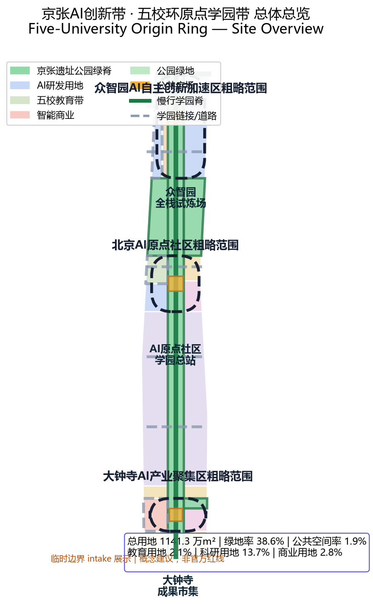
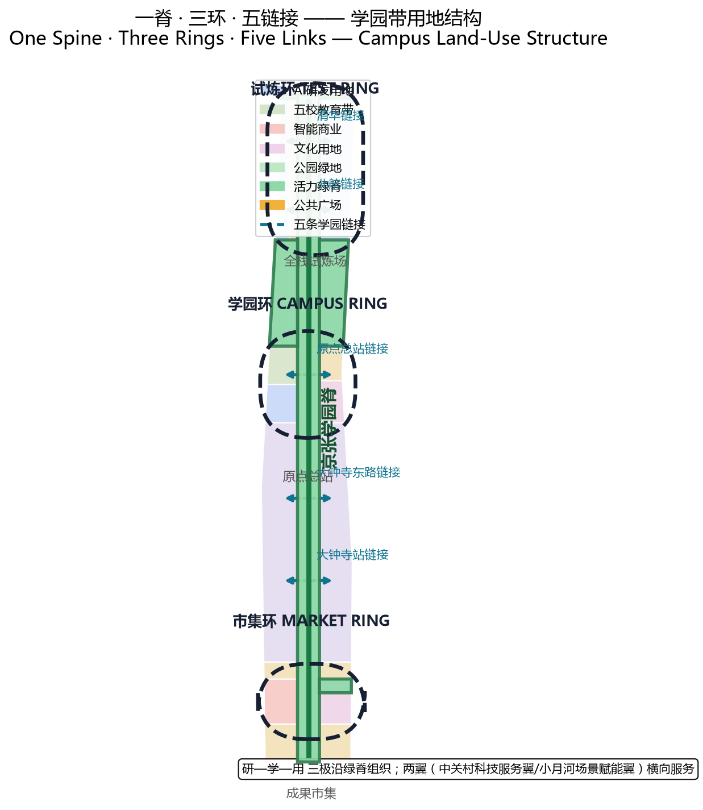
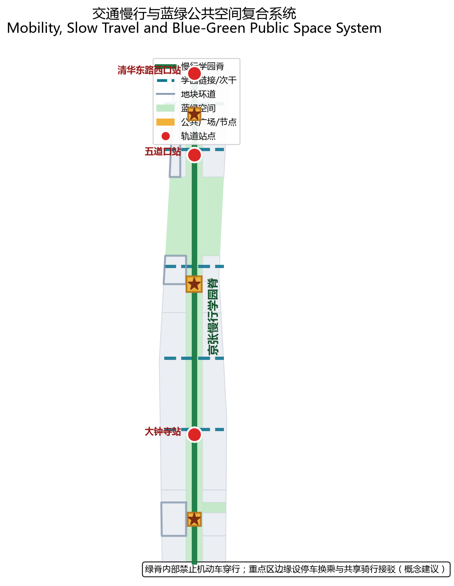
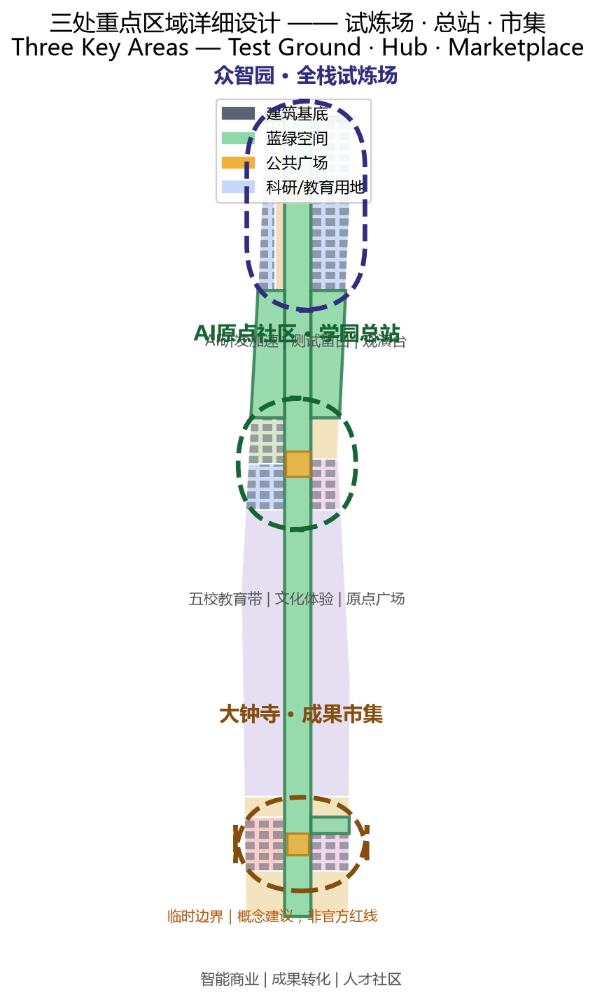
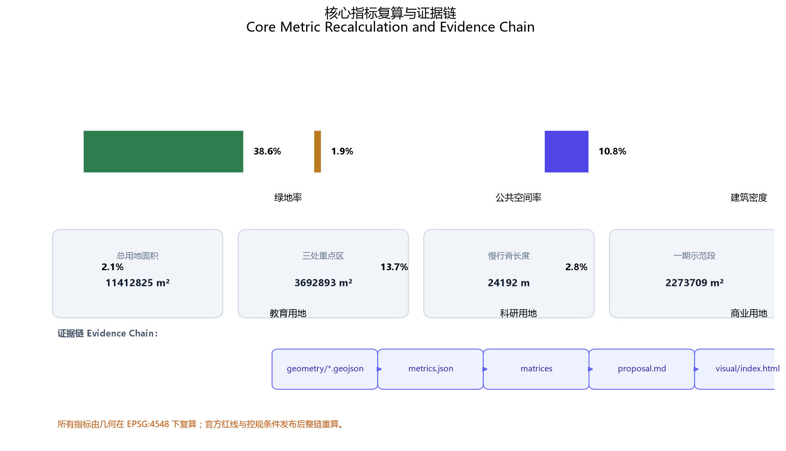

# Five-University Origin Ring

## Read in One Page — Spatial Moves First, Data Evidence Next

### Design Judgment

The Jing-Zhang railway left Haidian more than a century-old rail line to commemorate — it left a **city line that can be learned**. Around Wudaokou and Qinghua East Road, the mid-section encircled by Tsinghua, Beihang, BUPT, BIT and the CAS institutes is where this line should be lit up first.[source:AGENT-TASKBOOK] [depth:three_level_scope_framework]

This proposal introduces the **Five-University Origin Ring**: organizing the innovation belt as an open campus without walls — Zhongzhiyuan to the north is the full-stack test ground, the AI Origin Community in the middle is the campus hub, and Dazhongsi to the south is the outcome marketplace. Courses, tests, works, residents and visitors can all come. The belt's vitality is measured by "what you learn here," not "what is staged here."[depth:overall_spatial_structure] [metric:key_area_count]

### Three Rings, Not Three Showcases

| Key Area | Campus Role | Core Spatial Move |
| --- | --- | --- |
| Zhongzhiyuan AI Acceleration Area (N) | Full-stack Test Ground | AI full-stack test field, embodied-AI controlled testing, test-viewing deck |
| Beijing AI Origin Community (M) | Campus Hub | Five-university innovation campus strip, intergenerational learning, Origin Plaza, course-link hub |
| Dazhongsi AI Industry Cluster (S) | Outcome Marketplace | AI-native commerce street, outcome-transfer culture street, talent community, Outcome Plaza |

All three boundaries are `official_boundary=false`, `geometry_role=provisional_constraint` temporary constraints used for spatial relations and recalculation — not official redlines, ownership boundaries or engineering locations.[data:geometry/key_areas.geojson#PROV-KEY-001] [data:geometry/key_areas.geojson#PROV-KEY-002] [data:geometry/key_areas.geojson#PROV-KEY-003]

### A Few Recomputable Metrics to Calibrate Trade-offs

The submitted boundary recomputes to 11,412,825.4 sqm in EPSG:4548 (low confidence, provisional geometry); green ratio 38.6%, public-space ratio 1.9%, building density 10.8%.[metric:site_area_sqm][metric:green_ratio][metric:public_space_ratio] 

Research land (0802) 13.7%, education land (0804) 2.1%, commercial land (05) 2.8%, park green land (1401) 27.2%.[metric:land_use_research_ratio][metric:land_use_education_ratio][metric:land_use_commerce_ratio] 

These are recomputable measures of a conceptual structure, not statutory indicators, engineering lengths or performance commitments. The whole chain will be recomputed once official redlines and regulatory conditions are released.[metric:floor_area_ratio]

### Three Phases Bridge a Ten-Year City Cycle and the AI Iteration Cycle

`PHASE-001` Phase 1 lights up the mid-section Origin Community demonstration segment; `PHASE-002` Phase 2 advances the northern Zhongzhiyuan test field; `PHASE-003` Phase 3 connects the southern Dazhongsi outcome marketplace.[data:geometry/phasing.geojson#PHASE-001] [data:geometry/phasing.geojson#PHASE-002] [data:geometry/phasing.geojson#PHASE-003]

---

## Design Basis and Source Inventory

This proposal takes the *Pre-qualification Announcement for the International Urban Design Solicitation of the Centennial Jing-Zhang AI Innovation Belt* issued by the Haidian Branch of the Beijing Municipal Commission of Planning and Natural Resources as its primary basis, and uses the provisional boundaries, key areas, enums, indicators and source registry registered in `brief/site-package/` as the machine-readable basis.[source:OFFICIAL-ANNOUNCEMENT] [source:AGENT-TASKBOOK] [source:SOURCE-REGISTRY]

Key materials cited (full machine index in `sources.json`):

- **Pre-qualification announcement**: three scopes (coordinated research 43.6 km², overall design 11.4 km², key areas 368.4 ha) and key-area areas and north-south order.[source:OFFICIAL-ANNOUNCEMENT]
- **Agent open-call taskbook excerpt**: three positionings, five functions, three areas and two wings, tasks agent.1–agent.6, co-creation charter.[source:AGENT-TASKBOOK]
- **Provisional boundaries**: `brief/site-package/geometry/provisional_boundaries.geojson`, inferred from the announcement's textual four-to boundaries and areas, `official_boundary=false`, `geometry_role=provisional_constraint`.[source:BOUNDARY-SOURCE] [source:KEY-AREA-SOURCE]
- **Land-use classification**: MNR *Guide to Land-Use Classification for Territorial Spatial Survey, Planning, Use Control*.[standard:MNR-LAND-USE-CLASSIFICATION-GUIDE]
- **Urban design regulations**: *Urban Design Administration Measures* and *Measures for Compilation and Approval of Regulatory Detailed Plans for Cities and Towns*.[standard:MOHURD-URBAN-DESIGN-MEASURES] [standard:MOHURD-CONTROL-DETAILED-PLANNING]
- **AI governance regulations**: *Interim Measures for the Management of Generative AI Services* and *Barrier-Free Environment Building Law*.[standard:GENERATIVE-AI-INTERIM-MEASURES] [standard:BARRIER-FREE-ENVIRONMENT-LAW]

**Important statement**: all spatial implementation suggestions in this proposal are **conceptual suggestions, reference schemes, or material for professional teams to deepen** — they do not replace statutory planning and do not constitute government-verified conclusions. Floor area ratio, building height, retain/renovate/demolish and road redlines are conceptual; official regulatory conditions and professional review prevail.[source:AGENT-TASKBOOK]

---

## Three-Level Scope Framework

### Coordinated Research Area (approx. 43.6 km²)

North to North Fifth Ring Road, east to Jingzang Expressway, south to Xizhimenwai Street, west to Wanquanhe Road.[data:geometry/site_boundary.geojson#SITE-001]

At the coordinated level, the proposal develops a **City of Colleges · Campus Belt · Campus Station** three-tier research framework: Haidian as a city living with universities, the Jing-Zhang heritage park and 1–2 km surroundings as the campus belt, and the three key areas as campus stations. Industry strategy, the AI innovation ecosystem and future city form are studied together at this scope.[depth:three_level_scope_framework] [depth:overall_spatial_structure]

### Overall Design Area (approx. 11.4 km²)

The overall design area covers the urban and industrial districts 1–2 km around the Jing-Zhang heritage park. This proposal completes the **One Spine · Three Rings · Five Links** spatial structure here: one spine is the Jing-Zhang heritage park slow-mobility campus spine; three rings are the Zhongzhiyuan test ring, Origin Community campus ring, and Dazhongsi marketplace ring; five links connect five universities and innovation nodes.[depth:overall_spatial_structure] [depth:land_use_layout]

### Key Detailed-Design Area (approx. 368.4 ha)

From north to south: Zhongzhiyuan AI Acceleration Area (approx. 192.1 ha), Beijing AI Origin Community (approx. 104.3 ha), Dazhongsi AI Industry Cluster (approx. 72.0 ha). The three key areas are linked in a **test ground–hub–marketplace** campus circulation, forming a complete learn–test–transfer chain.[metric:key_area_area_sqm] [depth:three_key_area_detailed_design]

**Provisional boundary statement**: all three key-area polygons are `provisional_constraint`. Once official polygons are released, all area, density and ratio metrics must be recomputed and building layout and phasing re-determined; until then all areas in this document are conceptual recomputations, not precise-area bases.[source:BOUNDARY-SOURCE][data:geometry/key_areas.geojson#PROV-KEY-001][data:geometry/key_areas.geojson#PROV-KEY-002] 

---

## Coordinated Research Area: Industry and Future City Study

### Campus Expression of the Three Positionings and Five Functions

The three positionings (Centennial Jing-Zhang Culture Belt, Urban AI Living Experience Belt, AI-Integrated Innovation Belt) and five functions (full-stack independent AI innovation system, world-class AI innovation ecosystem, AI+ scenario-empowerment paradigm, intelligent AI vibrant city, global voice in AI governance) unify under the campus logic: **the culture belt is the campus history textbook, the living experience belt is the campus public classroom, and the innovation belt is the campus experiment workshop**.[source:AGENT-TASKBOOK]

### 5–8 Global AI Innovation Ecosystem Cases

| # | Case | Campus Transferable Lesson |
| --- | --- | --- |
| 1 | Stanford Research Park, Silicon Valley | Close university-park-capital transfer; courses and industry interlock |
| 2 | Kendall Square, Boston | Shared R&D dormitory model; serendipitous creation in public space |
| 3 | Nanshan Sci-Tech Park, Shenzhen | Fast iteration from hardware to AI scenarios; testing-as-a-service |
| 4 | One-North, Singapore | Wall-less campus, vertical greening, walkability, public validation grounds |
| 5 | Yunqi Town, Hangzhou | Developer conference as operating engine; open scenario testing |
| 6 | King's Cross, London | Old railway station renewal; knowledge economy stitched with public space |
| 7 | Kyoto industry-academia-city | Coexistence and dialogue between traditional districts and emerging technology |

These cases converge on one spatial lesson: **an innovation belt's core is not building density but the "learnable, testable, displayable" public interface**. This lands on the One Spine · Three Rings · Five Links campus structure and the test-ground/classroom/marketplace space types of each key area.[depth:three_level_scope_framework] [depth:overall_spatial_structure]

### Three-Area, Two-Wing Coordination Loop

The three key areas form a vertical main loop of "test ground → hub → marketplace." The Zhongguancun technology service wing (global factor allocation, IP and capital enablement) couples with northern Zhongzhiyuan, and the Xiaoyuehe scenario-empowerment wing (AI scenario enablement and vibrant city) couples with southern Dazhongsi. The two wings supply lateral services and scenarios to the vertical main loop, forming a "two wings flank one spine, three rings thread one axis" pattern.[source:AGENT-TASKBOOK] [depth:overall_spatial_structure]

### AI-Native Scenarios and Future City Form

A future AI city is not a city covered in sensors; it is a public interface where AI capacity is **learnable, rejectable, pausable, and rollbackable**. The campus belt organizes "AI testing—AI education—AI living—AI governance" into one public learning chain: technology validated at the test ground today enters the campus classroom tomorrow, and is used and discussed in residents' lives the day after.[depth:overall_spatial_structure] [depth:municipal_new_infrastructure]

---

## Overall Design Area: Urban Renewal at Regulatory-Plan Urban Design Depth

### Industry Objectives and Functional Layout

Along the Jing-Zhang heritage park spine, from north to south, three poles of **Research–Learn–Use**:

- **Research (N · Zhongzhiyuan)**: AI R&D acceleration land (0802) and AI industrial test-validation spare land (16), hosting full-stack independent innovation and embodied-AI controlled testing.[data:geometry/land_use.geojson#LU-N1] [data:geometry/land_use.geojson#LU-N2]
- **Learn (M · Origin Community)**: five-university campus innovation strip (0804), research land (0802), culture land (0803), community service land (0702), hosting course links, intergenerational learning and public classrooms.[data:geometry/land_use.geojson#LU-M1] [data:geometry/land_use.geojson#LU-M2] [data:geometry/land_use.geojson#LU-M3]
- **Use (S · Dazhongsi)**: AI-native commerce street (05), outcome-transfer culture street (0803), talent community (0701), hosting outcome display, transfer and smart consumption.[data:geometry/land_use.geojson#LU-S1] [data:geometry/land_use.geojson#LU-S2] [data:geometry/land_use.geojson#LU-S3]

Education land 2.1%, research land 13.7%, commercial land 2.8%, park green land 27.2% — consistent with the campus-belt identity: **knowledge-based land and public green dominate, keeping the belt learnable, stayable and encounter-rich**.[metric:land_use_education_ratio] [metric:land_use_research_ratio] [metric:land_use_green_ratio]

### Urban Renewal Framework

Under a "**do not demolish the old city — demolish barriers to create interfaces**" logic: along the heritage park is the public green spine and slow-mobility campus spine; existing communities and research institutes on both sides are mainly enriched through functional mending and public-space activation, preserving neighborhood fabric.[depth:retain_renovate_demolish] [depth:renewal_project_list]

Retain/renovate/demolish (conceptual): along the park axis, low-efficiency factories, warehouses and temporary structures are mainly **renovated and activated**, injecting classroom, testing and display functions; historical stations, old railway structures and community living circles are preserved; new construction occurs only at nodes that must carry core campus functions. Actual decisions require official existing-building and ownership data.[depth:retain_renovate_demolish]

### Transit, Rail, Municipal and Public Service Facilities

- **Rail station integration**: Wudaokou, Qinghua East Road West, and Dazhongsi stations couple with campus links; campus service nodes sit around stations.[depth:traffic_rail_slow_parking]
- **Slow-mobility campus spine**: the heritage park green spine is the north-south slow-mobility main axis linking the three key areas.[data:geometry/roads.geojson#ROAD-SPINE-001] [metric:spine_greenway_length_m]
- **Five campus links**: five east-west link roads connect five universities and innovation nodes.[data:geometry/roads.geojson#ROAD-LINK-01] [data:geometry/roads.geojson#ROAD-LINK-03] [data:geometry/roads.geojson#ROAD-LINK-05]
- **Parking and non-motorized travel**: park-and-ride and shared-bike interchange at key-area edges; no motor vehicles through the green spine.
- **New infrastructure**: compute scheduling, edge compute, distributed energy merged with existing municipal facilities, as conceptual suggestions.[depth:municipal_new_infrastructure]

### Jing-Zhang Heritage Park Vitality Belt

Position the vitality belt as a **learning park**: not a static green strip of benches and flowerbeds, but a dynamic campus corridor with AI public classrooms, test demonstrations, honor displays and intergenerational learning points.[depth:blue_green_public_space] [data:geometry/green_space.geojson#GREEN-GREEN-SPINE]

### Urban Character

Under a **campus brick-red × railway rust × AI cool-light** palette: preserve the Jing-Zhang railway's memory colors (rust red, iron grey); blend in the mid-section's campus red brick and cream; AI scenario nodes use restrained cool light and interface lamps as atmosphere accents, avoiding over-neonization.[depth:height_massing_character]

---

## Key-Area Detailed Design

### North · Zhongzhiyuan AI Acceleration Area (Full-stack Test Ground, approx. 192.1 ha)

**Positioning**: controlled testing and accelerator of the AI full-stack independent innovation system.[data:geometry/key_areas.geojson#PROV-KEY-001]

**Spatial structure**: AI R&D acceleration land (0802) to the west, AI industrial test-validation spare land (16) to the east, with the Zhongzhiyuan test-viewing deck in the middle — the public can watch controlled tests of embodied AI and delivery robots from a safe distance.[data:geometry/land_use.geojson#LU-N1] [data:geometry/land_use.geojson#LU-N2] [data:geometry/public_space.geojson#PUBLIC-DECK-001]

**Building renewal**: existing low-efficiency parks are mainly renovated and activated, injecting test workshops, simulation labs and R&D accelerators.[data:geometry/buildings.geojson#BLDG-001]

**Transit and slow travel**: access via Wudaokou rail station and the innovation link south of the Fifth Ring; internal controlled test lanes and a viewing slow corridor.[depth:traffic_rail_slow_parking]

**Public space**: test-viewing deck, testing public interface, northern ecological green wedge.[data:geometry/public_space.geojson#PUBLIC-DECK-001] [data:geometry/green_space.geojson#GREEN-R1]

**AI scenarios**: embodied-AI controlled test field, low-altitude logistics test corridor (conceptual), AI security and patrol testing.

**Implementation risks**: the test field involves safety and liability boundaries requiring professional evaluation; the northern green wedge involves ecological and flood constraints requiring blue-line and sponge-city coordination.[depth:risk_missing_data]

### Middle · Beijing AI Origin Community (Campus Hub, approx. 104.3 ha)

**Positioning**: the core public classroom of a world-class AI innovation ecosystem, the campus hub encircled by five universities.[data:geometry/key_areas.geojson#PROV-KEY-002]

**Spatial structure**: five-university campus innovation strip (0804) and research land (0802) to the west, culture land (0803) and community service land (0702) to the east, Origin Plaza at the center.[data:geometry/land_use.geojson#LU-M1][data:geometry/land_use.geojson#LU-M2][data:geometry/land_use.geojson#LU-M3] 

**Five-university link hub**: Tsinghua, Beihang, BUPT, BIT and CAS institutes connect to Origin Plaza through five campus links; courses, projects, internships and theses flow between stations.[data:geometry/roads.geojson#ROAD-LINK-01] [data:geometry/roads.geojson#ROAD-LINK-03]

**Building renewal**: intergenerational learning center, library-style AI classroom, and young-developer living room at the campus-edge and community interfaces.[data:geometry/buildings.geojson#BLDG-065]

**Public space**: Origin Plaza hosts open-air classes, outcome releases, honor displays and festivals.

**AI scenarios**: intergenerational learning (older adults and youth in one AI class), course-link labs, public AI science classrooms, barrier-free voice guidance.[standard:BARRIER-FREE-ENVIRONMENT-LAW]

**Implementation risks**: campus land and community ownership require consultation with universities and communities; the five links involve cross-ownership roads requiring professional coordination.[depth:risk_missing_data]

### South · Dazhongsi AI Industry Cluster (Outcome Marketplace, approx. 72.0 ha)

**Positioning**: public marketplace for AI-native new business and outcome transfer.[data:geometry/key_areas.geojson#PROV-KEY-003]

**Spatial structure**: AI-native commerce street (05) to the west, outcome-transfer culture street (0803) and talent community (0701) to the east, Outcome Plaza at the center.[data:geometry/land_use.geojson#LU-S1] [data:geometry/land_use.geojson#LU-S2] [data:geometry/public_space.geojson#PUBLIC-SQUARE-001]

**Outcome transfer chain**: mature technology from the Zhongzhiyuan test ground, validated in the Origin Community classrooms, transforms here into experienceable smart products, business formats and consumption scenarios.

**Building renewal**: existing commerce and office buildings gain AI-native experience stores, outcome display halls and start-up service living rooms.

**Public space**: Outcome Plaza hosts product launches, markets, roadshows and citizen experiences.

**AI scenarios**: AI life-service experiences, smart retail, barrier-free mobility, outcome roadshow streaming.

**Implementation risks**: commercial property and operating entities require a professional operating team; the talent community involves residential amenities and public-facility provision.[depth:risk_missing_data]

---

## AI Innovation Ecosystem, Talent Profile and AI+ Scenarios

### Five User Personas

| Persona | Group | Role in the Campus Belt |
| --- | --- | --- |
| P1 Student/Young Faculty | enrolled at five universities, young faculty | course links, public thesis review, internships and startups |
| P2 Researcher/Engineer | research institutes, corporate R&D | test validation, outcome transfer, compute and data services |
| P3 Resident/Intergenerational Family | local community elders, children, families | intergenerational learning, public classrooms, community services |
| P4 Entrepreneur/Developer | startup teams, open-source developers | incubation, test grounds, developer community |
| P5 Visitor/Citizen Experience | citywide and out-of-town visitors | AI public experience, cultural pilgrimage, marketplace consumption |

### At Least 10 AI Scenario Cards (Conceptual)

| # | Scenario Card | Spatial Location | Served Personas | Privacy/Human-Review Boundary |
| --- | --- | --- | --- | --- |
| 1 | Embodied-AI controlled test field | Zhongzhiyuan spare land | P2 engineers | enclosed, safety officer throughout |
| 2 | Low-speed delivery robot test line | within Zhongzhiyuan | P2/P4 | designated zone, human takeover |
| 3 | AI security patrol testing | Zhongzhiyuan park | P2 | data de-identified, regulatory sandbox |
| 4 | Course-link laboratory | Origin campus strip | P1 | university authorization, teacher review |
| 5 | Intergenerational AI class | Origin Plaza | P3 | human accompaniment for minors/elders |
| 6 | Public AI science gallery | Origin culture strip | P5 | human-reviewed content |
| 7 | Barrier-free voice navigation | all nodes | P3 special groups | privacy-minimized, no camera tracking |
| 8 | AI-native retail experience store | Dazhongsi commerce street | P5 | compliant transaction data, human service |
| 9 | Outcome roadshow and product launch | Dazhongsi Outcome Plaza | P2/P5 | human-reviewed launch content |
| 10 | Public city-operation dashboard | Origin Plaza | P5/P3 | aggregated and de-identified, no individual disclosure |
| 11 | Compute-tide public indicator | campus spine nodes | P5 | energy/load aggregates only |
| 12 | Testing-as-a-service laboratory | Zhongzhiyuan R&D strip | P2/P4 | client agreement, human acceptance |

All scenarios are **conceptual suggestions**; items 1, 2, 3 and 12 are AI industrial test-validation scenarios. Each scenario specifies served personas, spatial location, operating data, privacy boundaries, human review and operating entity; immature technologies are not described as fully deployable.[depth:overall_spatial_structure] [depth:municipal_new_infrastructure]

---

## Land Use, Building Scale and Retain/Renovate/Demolish

### Land-Use Layout

Land use centers on the heritage park green spine, with the Research–Learn–Use three poles on both sides. Education land (0804) concentrates in the mid-section five-university campus strip; research land (0802) distributes across Zhongzhiyuan and Origin Community; commercial land (05) concentrates at Dazhongsi; park green land (1401) unfolds along the park spine and northern green wedge.[data:geometry/land_use.geojson][metric:land_use_education_ratio][metric:land_use_research_ratio] 

### Building Scale and Development Intensity

The current proposal has a building density of 10.8% and an estimated floor area ratio of about 0.72 (assuming an average of 4 floors). **This is conceptual, not statutory.** Regulatory conditions such as FAR, height and setback are missing and must follow the pending items in `planning_limits.json`.[metric:building_density] [metric:floor_area_ratio]

### Retain/Renovate/Demolish (Conceptual)

- **Retain**: Jing-Zhang railway heritage, historical stations, community living-circle fabric.
- **Renovate**: low-efficiency factories, warehouses and temporary structures along the belt, injecting campus and testing functions.
- **Build**: modest new construction only at core campus nodes (around Origin Plaza and test-ground support).

Parcel-level decisions require official existing-building, ownership and regulatory data; this proposal does not reach parcel-level conclusions.[depth:retain_renovate_demolish]

---

## Transit, Rail, Municipal and Public Service Facilities

### Roads and Slow Travel

- **Jing-Zhang campus spine** (north-south main axis): heritage park green spine, no motor vehicles, for walking and cycling.[data:geometry/roads.geojson#ROAD-SPINE-001]
- **Five campus links** (east-west): connect five universities and the three key areas, transit-priority.[data:geometry/roads.geojson#ROAD-LINK-01][data:geometry/roads.geojson#ROAD-LINK-02][data:geometry/roads.geojson#ROAD-LINK-03]  
- **Key-area internal loops**: test ground, campus and marketplace each have an internal slow loop.[data:geometry/roads.geojson#ROAD-LOOP-N1]

### Rail and Station Integration

Wudaokou, Qinghua East Road West and Dazhongsi stations couple with campus links; campus service nodes, park-and-ride and shared-bike interchange sit around stations.[depth:traffic_rail_slow_parking]

### Municipal and New Infrastructure (Conceptual)

Compute scheduling centers, edge-compute nodes, distributed energy and seamless payment merged with existing municipal facilities. All conceptual, no engineering-feasibility conclusions.[depth:municipal_new_infrastructure]

---

## Blue-Green Space, Public Space and Urban Character

### Blue-Green System

- **Jing-Zhang heritage park vitality green spine**: approx. 311 ha conceptual green spine, north-south connected.[data:geometry/green_space.geojson#GREEN-GREEN-SPINE] [metric:land_use_green_ratio]
- **Northern ecological green wedge**: approx. 120 ha protective green, linking the Fifth Ring and Qinghe ecology.[data:geometry/green_space.geojson#GREEN-R1]
- **Talent community green park**: community-scale green within the Dazhongsi talent community.[data:geometry/green_space.geojson#GREEN-S3]

### Public Space

Origin Plaza (campus hub), Dazhongsi Outcome Plaza (marketplace) and Zhongzhiyuan test-viewing deck (test ground) are three public activity interfaces carrying classroom, launch and viewing functions respectively.[data:geometry/public_space.geojson#PUBLIC-PLAZA-001][data:geometry/public_space.geojson#PUBLIC-SQUARE-001][data:geometry/public_space.geojson#PUBLIC-DECK-001] 

### AI Pilgrimage Landmarks and Honor-Display Nodes

The following three AI pilgrimage landmarks / honor-display nodes are all **conceptual suggestions**, not statements of approved construction:[depth:blue_green_public_space] [depth:overall_spatial_structure]

1. **Origin Bell Tower (campus hub)**: remodeled from the Jing-Zhang old-station clock tower; its hands symbolize the iteration rhythm of AI learning — the commemorative core of the campus belt.
2. **Test Wall (Zhongzhiyuan)**: a public wall recording past controlled-test achievements — the infrastructure of the honor-display system.
3. **Outcome Star Spectrum (Dazhongsi)**: a star-spectrum light array at Outcome Plaza displaying AI outcomes and developer honors across editions, making innovation publicly visible.

Landmarks, signage, logo, fonts, images, persons and corporate identifiers must all be cleared of rights; no over-entertainment.[source:AGENT-TASKBOOK]

### Urban Character and Signage

Under the campus brick-red × railway rust × AI cool-light palette, the signage system unifies the "campus ring" visual language, threading naming, logo and symbol systems across the belt.[depth:height_massing_character]

---

## Renewal Project List, Implementation Policy and Phasing

### Renewal Project List (Conceptual)

| Project | Location | Type | Phase |
| --- | --- | --- | --- |
| Origin Plaza and campus hub | Origin Community | Build + Renovate | Phase 1 |
| Intergenerational learning center | Origin Community | Renovate | Phase 1 |
| Five-university link slow travel | mid-section | Renovate | Phase 1 |
| Zhongzhiyuan test-validation field | Zhongzhiyuan | Build + Renovate | Phase 2 |
| Test-viewing deck | Zhongzhiyuan | Build | Phase 2 |
| Dazhongsi Outcome Plaza | Dazhongsi | Build | Phase 3 |
| AI-native commerce street activation | Dazhongsi | Renovate | Phase 3 |

### Implementation Policy (Conceptual)

Mixed land use, campus-park co-building mechanisms, scenario-open sandboxes, developer-community operations. All are mechanism suggestions, not statements of confirmed government arrangements.[depth:renewal_project_list]

### Phasing Plan

`PHASE-001` Phase 1 (Origin campus demonstration) → `PHASE-002` Phase 2 (Zhongzhiyuan test field) → `PHASE-003` Phase 3 (Dazhongsi outcome marketplace).[data:geometry/phasing.geojson#PHASE-001][data:geometry/phasing.geojson#PHASE-002][data:geometry/phasing.geojson#PHASE-003]   

### Global AI Innovation Event System and Long-Term Operation (Conceptual)

- **Annual event system**: Origin spring semester-start, summer test open championship, autumn outcome release week, winter intergenerational learning festival.
- **Developer-community operation**: open scenario sandbox, code-contribution board, honor star-spectrum linkage.
- **Public experience route**: a "entry–intermediate–publication" experience path along the campus spine.
- **International communication**: "a city line you can learn from" as the core narrative to attract global developers and learners.

All events, recruitment, funding, policy and operation arrangements are **conceptual suggestions or deepening directions**, not confirmed government arrangements.[depth:phasing_implementation] [source:AGENT-TASKBOOK]

---

## Indicator System, Area Recalculation and Compliance Matrix

### Core Indicators and Design Meaning

- **Green ratio 38.6%**: sustains the stayable and healthy experience of the campus belt — the basis on which talent and residents stay.[metric:green_ratio]
- **Public-space ratio 1.9%**: three public plazas carry classroom/launch/viewing — small but critical innovation-encounter interfaces.[metric:public_space_ratio]
- **Research + education land 15.8%**: embodies the "learnable" main line — the spatial base of a knowledge-based innovation ecosystem.[metric:land_use_research_ratio] [metric:land_use_education_ratio]
- **Building density 10.8%**: a low-density, high-green development logic consistent with the heritage park and campus-belt identity.[metric:building_density]

### Recalculation and Compliance Matrices

- Three scopes, three key areas, 23 mandatory requirements and 6 agent tasks fully covered in `compliance_matrix.json`.
- 9 professional standards covered in `standard_matrix.json`.
- 15 design-depth items all `complete` in `design_depth_matrix.json`.
- All metrics recomputed from geometry, see `metrics.json`.[metric:site_area_sqm] [metric:land_use_gap_sqm]

---

## Risk, Copyright and Compliance Statement

### Data and Geometry Risks

- The three key areas and boundaries are provisional rough polygons; the whole chain must be recomputed once official redlines are released.[source:BOUNDARY-SOURCE]
- Regulatory conditions such as FAR, building height, retain/renovate/demolish and road redlines are missing; all are conceptual in this proposal and subject to official regulatory plans.[source:OFFICIAL-ANNOUNCEMENT]

### Copyright and Compliance

- All materials cited are public or cleared; sources in `sources.json`.
- Place names, enterprise and university names are cited conceptually only; no claim of authorization or endorsement.
- All spatial suggestions are stated as "conceptual suggestions / reference schemes / material for professional teams"; no government-verified conclusions or implementation commitments.
- No non-public planning drawings, non-public spatial data, internal control indicators or personal privacy data are used.

See `report/copyright_statement.md`.[source:SOURCE-REGISTRY]

---

## References

The main human-readable bibliography informing this proposal; the complete machine index is in `sources.json` and the three matrices.[source:SOURCE-REGISTRY]

1. Pre-qualification Announcement for the International Urban Design Solicitation of the Centennial Jing-Zhang AI Innovation Belt (Haidian Branch, Beijing Municipal Commission of Planning and Natural Resources)
2. Excerpt of the Open-Call Taskbook for Global Intelligent Agents — "Centennial Jing-Zhang AI Innovation Belt Urban Design" (user-provided cleared document)
3. *Urban Design Administration Measures* (MOHURD)
4. *Measures for Compilation and Approval of Regulatory Detailed Plans for Cities and Towns* (MOHURD)
5. *Guide to Land-Use Classification for Territorial Spatial Survey, Planning, Use Control* (MNR)
6. *Interim Measures for the Management of Generative AI Services*
7. *Barrier-Free Environment Building Law of the PRC*
8. *Implementation Plan for Effectively Solving Difficulties of the Elderly in Using Smart Technology* (Guobanfa [2020] No. 45)
9. Provisional rough boundaries and key-area polygons of the Centennial Jing-Zhang AI Innovation Belt (repository maintainer inference)
10. Public case studies of global AI innovation ecosystems (Stanford, Kendall Square, One-North, etc.)
