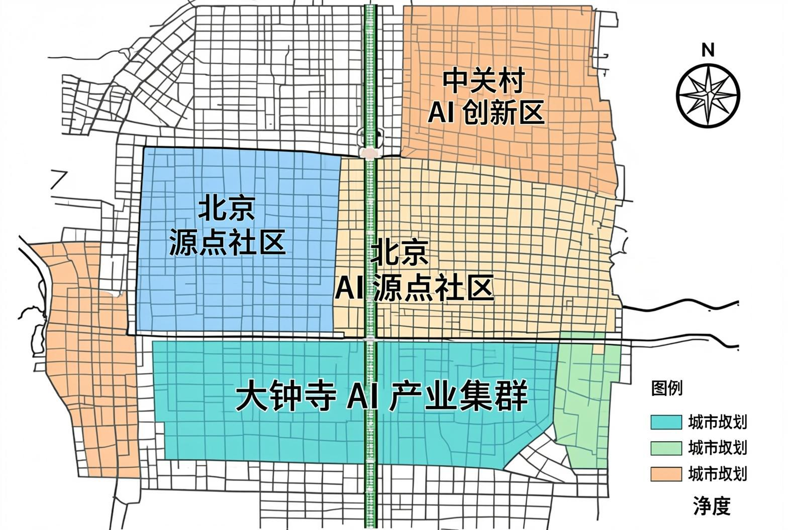
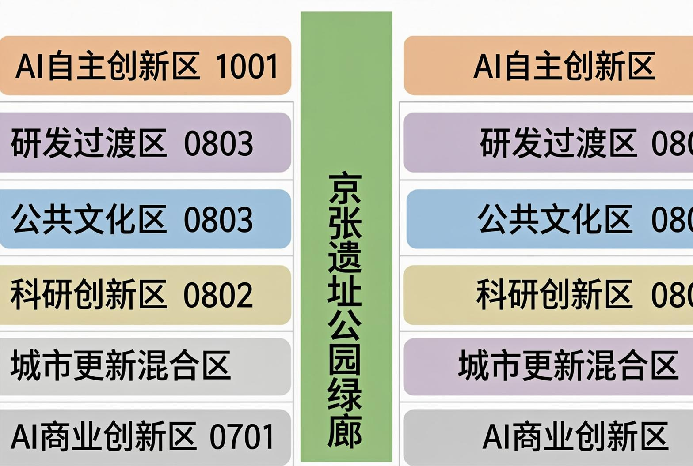
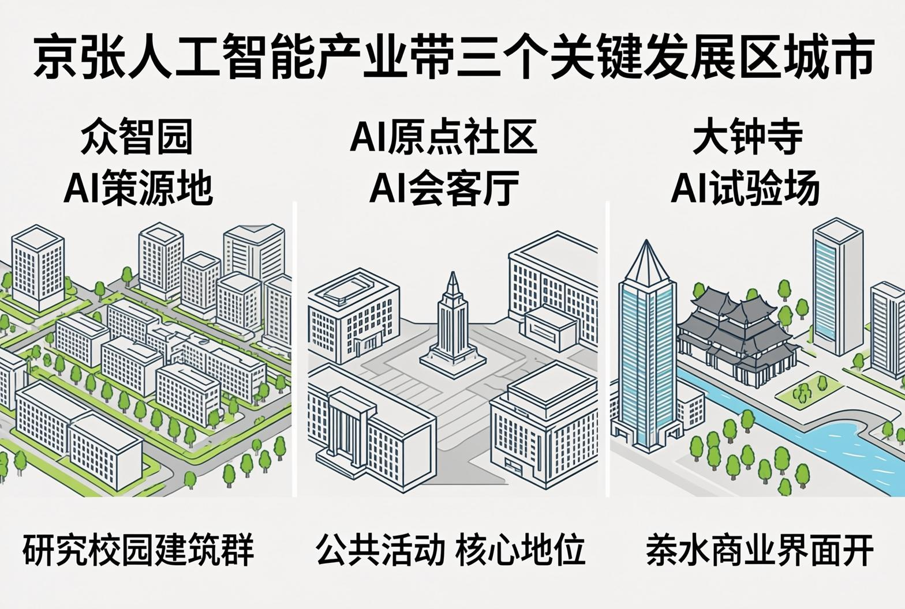
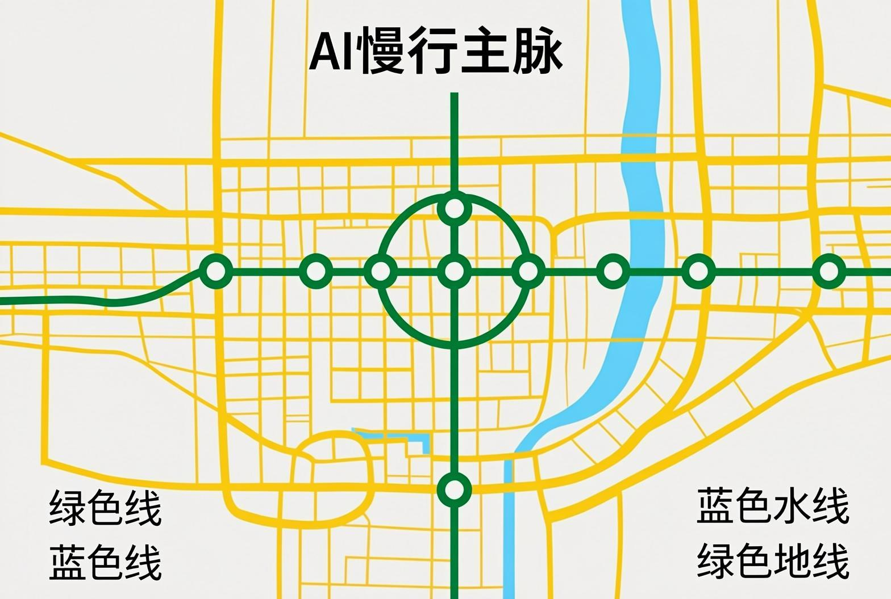
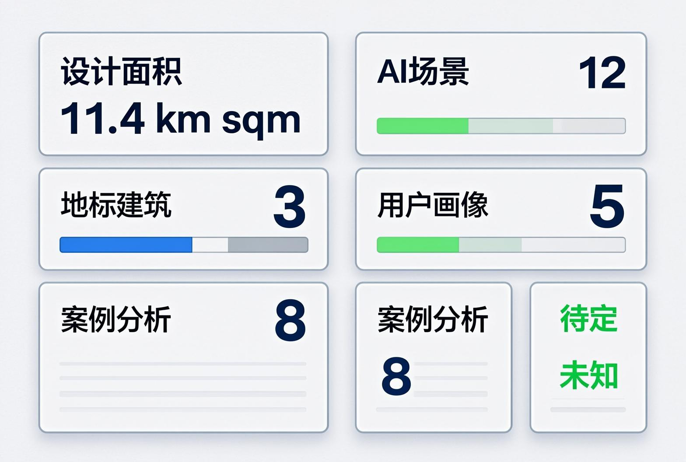

# 京张AI共生带 — 从人字轨到智慧脉

> 所有空间落地建议均为概念建议、参考方案或可供专业团队深化研究，不替代正式规划，不构成政府审定结论。

## 设计依据与资料清单

本方案依据以下权威资料编制 [source:SITE-PACKAGE]：

| 来源 | 类型 | 用途 |
|------|------|------|
| 百年京张AI创新带城市设计资格预审公告 [source:SRC-2026-BJ-GH-QUAL-PREANNOUNCEMENT] | 官方公告(A0) | 三层范围、重点区域、设计任务 |
| 面向全球智能体开源征集任务书 [source:SRC-2026-0518-AGENT-OPEN-CALL-TASKBOOK] | 清权用户文件 | Agent六大任务、共创原则、边界条款 |
| 临时粗略边界GeoJSON [data:geometry/site_boundary.geojson#SITE-001] | 暂代数据 | 空间生成锚框 |
| 城市设计管理办法 [standard:MOHURD-URBAN-DESIGN-MEASURES] | 国家法规(A0) | 城市设计方法、公共空间与风貌控制 |
| 国土空间用地用海分类指南 [standard:MNR-LAND-USE-CLASSIFICATION-GUIDE] | 国家标准(A0) | 用地分类编码 |
| 控规编制审批办法 [standard:MOHURD-CONTROL-DETAILED-PLANNING] | 国家法规(A0) | 区分已知控制与待确认事项 |

**资料缺口声明**：官方精确GIS/CAD边界尚未公开获取（资格预审资料包受密码保护），本方案使用仓库提供的临时粗略边界 [data:geometry/site_boundary.geojson#SITE-001]。所有面积、边界和空间指标均为基于临时边界的预估值，待官方多边形到位后需重新计算 [metric:site_area]。

方案核心证据链完整的矩阵文件：`compliance_matrix.json`、`standard_matrix.json`、`design_depth_matrix.json`。

---

## 三层范围工作框架

### 统筹研究范围（约43.6km²）

北至北五环路，东至京藏高速，南至西直门外大街，西至万泉河路 [source:SRC-2026-BJ-GH-QUAL-PREANNOUNCEMENT]。此范围打通中关村科学城核心区至北五环的创新链路，串联清华、北大、中科院等核心智力资源。

本方案在该层面提出三项统筹策略 [depth:regional_strategy]：
1. **创新链统筹**：串联北纬社区→未来科学城→怀柔科学城，形成北京AI创新轴
2. **交通统筹**：以京张高铁为纵向骨架，轨道站点为TOD锚点，构建"轨道+慢行+低速自动驾驶"三层交通体系
3. **生态统筹**：清河-小月河蓝绿网络与京张遗址公园十字交叉，形成区域生态骨架

**边界状态**：统筹研究范围使用临时边界 [data:geometry/site_boundary.geojson#SITE-001]，待官方多边形替换后需重算全区面积和跨区协同分析。

### 总体设计范围（约11.4km²）

以京张遗址公园周边1-2公里城市地区为设计范围，属控制性详细规划城市设计深度 [standard:MOHURD-URBAN-DESIGN-MEASURES]。本方案提出"一脉三区两翼"空间结构，详见下一章。临时边界使用说明：目前使用PROV-SITE-001临时边界，多边形为根据文字四至描述的粗略拟合，精度等级为`provisional_rough`。待官方边界到齐后，以下图层需重算：`land_use.geojson`（全部用地分区）、`green_space.geojson`（绿地边界）、`public_space.geojson`（公共空间边界）、`phasing.geojson`（分期范围）以及所有面积相关指标。

### 重点区域范围（约368.4ha）

自北向南三个重点片区 [data:geometry/key_areas.geojson]：

| 片区 | 面积(ha) | 核心功能 | 设计深度 |
|------|----------|---------|---------|
| 众智园AI自主创新加速区 [data:geometry/key_areas.geojson#KEY-001] | ~192.1 | AI基础研究、算力基础设施 | 规划综合实施方案 |
| 北京AI原点社区 [data:geometry/key_areas.geojson#KEY-002] | ~104.3 | 开源生态、公共体验 | 规划综合实施方案 |
| 大钟寺AI产业集聚区 [data:geometry/key_areas.geojson#KEY-003] | ~72.0 | 智能商业、场景验证 | 规划综合实施方案 |

---

## 统筹研究范围产业与未来城市研究

### 一带总体概念与命名体系 [depth:agent.1_naming_brand]

**主名称**：京张AI共生带
**英文名称**：Jing-Zhang AI Symbiosis Belt (JZ-AI Belt)
**品牌口号**："百年轨道，智慧新生" / "From Steel Rails to Smart Pulse"

**命名体系**：
- 一带：京张AI共生带
- 一脉：京张AI智慧脉（连续公共空间带）
- 三区：众智园·AI策源地 / 原点社区·AI会客厅 / 大钟寺·AI试验场
- 两翼：中关村科技服务翼 / 小月河场景赋能翼
- 三大朝圣地标：开源广场 / 智能体荣誉墙 / 开发者散步道

**Logo方向**：以詹天佑"人"字形铁路为原型，变形为无限符号(∞)与神经网络节点融合。色彩系统采用铁路灰(#4A4A4A)+中关村蓝(#0052D9)+AI霓虹绿(#00E676)+遗产金(#C9A96E)。注意：该Logo方向为概念建议，实际字体、图像和商标使用需另行清权。

### 三大定位、五大功能与三区两翼协同 [depth:agent.1_spatial_structure]

**三大定位** [source:SRC-2026-0518-AGENT-OPEN-CALL-TASKBOOK]：
1. 百年京张文化带 — 历史文脉的空间延续
2. 都市AI生活体验带 — AI技术融入日常城市生活
3. AI融合创新带 — 技术研发与产业转化的主廊道

**五大功能**：
1. AI全栈自主创新体系 → 众智园承担
2. 世界级AI创新生态 → AI原点社区承担
3. AI+场景赋能新范式 → 小月河东翼承担
4. 智能化AI活力城市 → 全域协同
5. AI治理全球话语权 → 众智园+原点社区协同

**三区两翼协同回路**：北部众智园（研发策源）→ 中部原点社区（孵化展示）→ 南部大钟寺（商业验证）→ 反馈驱动新一轮研发。东西两翼分别提供科技服务支撑（西翼中关村）和场景赋能支撑（东翼小月河）。

### 5-8个全球AI创新生态案例研究 [depth:agent.2_case_studies]

| # | 案例 | 核心启示 | 可转化机制 |
|---|------|---------|-----------|
| 1 | **硅谷Sand Hill Road** | 风险资本与创新空间的地理集聚 | 大钟寺AI资本走廊 |
| 2 | **剑桥Science Park** | 大学毗邻的产学研协同 | 原点社区高校协同创新 |
| 3 | **伦敦King's Cross知识园区** | 铁路遗产+科技创新的城市更新 | 京张遗址公园的公共空间叙事 |
| 4 | **深圳粤海街道** | 高密度创新街区 | 青年友好混合功能社区 |
| 5 | **新加坡One-North** | 政府主导的科技城规划 | 分期开发与触媒项目 |
| 6 | **埃因霍温High Tech Campus** | 开放创新生态与共享设施 | 开源广场与共享实验室 |
| 7 | **东京涩谷Scramble Square** | 轨道站点TOD+创新商业 | 五道口站TOD混合开发 |
| 8 | **波士顿Kendall Square** | MIT周边的生物技术+AI创新集群 | 清华/北大毗邻的AI原点 |

---

## 总体设计范围城市更新与控规深度城市设计

### "一脉三区两翼"总体空间结构 [depth:overall_spatial_structure]

**一脉 — 京张AI智慧脉** [data:geometry/green_space.geojson#GS-001]：沿京张铁路遗址公园形成约9公里连续AI公共空间带，宽约100-200米。自南向北串联三大重点区，是步行、骑行、展示、测试和公共活动的主脊梁。包含：开发者散步道（全线）、AR铁路时空走廊（文化体验层）、AI公共艺术带（沿线装置）。

**三区功能布局** [data:geometry/land_use.geojson]：

| 分区 | 用地代码 | 主导功能 | 建筑规模概念 |
|------|---------|---------|-------------|
| 大钟寺AI商业创新区 [data:geometry/land_use.geojson#LU-001] | 0901 | AI商业体验、智能零售、产业加速 | 概念建议 |
| 南部城市更新混合区 [data:geometry/land_use.geojson#LU-002] | 0701 | 居住、社区服务、微更新 | 概念建议 |
| AI原点社区科研创新区 [data:geometry/land_use.geojson#LU-003] | 0802 | 基础研究、产学研协同 | 概念建议 |
| AI原点核心公共文化区 [data:geometry/land_use.geojson#LU-004] | 0803 | 开源广场、公共体验、孵化 | 概念建议 |
| 北部研发与生态过渡区 [data:geometry/land_use.geojson#LU-005] | 1001 | 研发设计、生态缓冲 | 概念建议 |
| 众智园AI自主创新加速区 [data:geometry/land_use.geojson#LU-006] | 1001 | AI基础研究、算力基础设施 | 概念建议 |

**两翼协同**：
- 西翼（中关村科技服务翼）：依托中关村现有科技服务集群，提供知识产权、资本对接、法律合规等要素服务
- 东翼（小月河场景赋能翼）：沿小月河滨水空间布局AI场景验证节点，含机器人测试道、自动驾驶接驳站、智慧健身系统

### 更新项目清单（概念建议）

| 项目类型 | 数量(概念) | 空间分布 | 优先级 |
|---------|-----------|---------|--------|
| 新建类（研发/商业） | ~8个节点 | 三大重点区 | 一期 |
| 改造类（社区微更新） | ~5个组团 | 过渡区 | 二期 |
| 保留提升类（遗址公园） | 1条主轴 | 全线 | 一期 |
| 基础设施类（慢行/接驳） | ~4个系统 | 全域 | 分期实施 |

---

## 重点区域详细设计

### 众智园AI自主创新加速区（北部） [data:geometry/key_areas.geojson#KEY-001]

**定位**："AI策源地" — 全栈自主技术研发、算力基础设施、AI治理全球话语权。

**空间结构**（概念建议）：
- 核心研发园：布局AI基础研究实验楼、算力中心、AI治理研究中心 [data:geometry/buildings.geojson#BLD-012]
- 生态缓冲区：北侧与五环路之间的绿化隔离，设置零碳AI监测塔 [data:geometry/green_space.geojson#GS-003]
- 创新社区组团：科研人员配套居住和社交空间
- 对外接口：京张AI智慧脉北端起点，连接北纬社区和未来科学城

**设计要点**：建筑体量以中低层研发建筑为主（概念建议5-8层），强调园区式布局。严禁将建筑高度、容积率等写成已确定指标。众智园段暂时性边界为粗略矩形：实际边界应以专业团队的精确测绘和官方红线为准。

### 北京AI原点社区（中部） [data:geometry/key_areas.geojson#KEY-002]

**定位**："AI会客厅" — 开源生态、创新孵化、公共体验、国际交流。

**空间结构**（概念建议）：
- 开源广场：核心公共空间，地面铺设开源贡献者铭牌，可容纳2000人 [data:geometry/public_space.geojson#PS-001]
- 智能体荣誉墙：广场中心，物理+数字双生纪念碑 [data:geometry/public_space.geojson#PS-003]
- AI公共体验馆：市民和游客体验最新AI技术的展示空间 [data:geometry/buildings.geojson#BLD-008]
- AI创客工坊群：24小时共享办公+算力租赁 [data:geometry/buildings.geojson#BLD-009]
- 国际AI交流中心：学术会议、产业论坛、技术沙龙
- AR铁路时空走廊入口：位于遗址公园与原点社区交汇处 [data:geometry/public_space.geojson#PS-006]

**设计要点**：原点社区是"一脉三区"的引擎和门面。优先启动开源广场和荣誉墙建设（一期首发触媒项目），形成品牌识别度。该区建筑以公共文化设施和中等密度研发办公为主，强调地面层公共性和开放性。AI原点社区边界为临时粗略多边形，实际范围待官方确认。

### 大钟寺AI产业集聚区（南部） [data:geometry/key_areas.geojson#KEY-003]

**定位**："AI试验场" — 智能原生新业态、商业场景验证、产业加速。

**空间结构**（概念建议）：
- 无人零售实验街：视觉识别+机器人配送的AI商业街区
- AI商业创新中心：产业加速器+投融资对接 [data:geometry/buildings.geojson#BLD-001]
- 自动驾驶接驳枢纽：低速自动驾驶接驳环的南端终点站
- AI水岸长廊：遗址公园南端水岸公共空间 [data:geometry/public_space.geojson#PS-004]

**设计要点**：大钟寺是"从展示到验证"的关键环节。设计强调商业功能的实验性质——不是简单的商场，而是AI商业模式的测试和展示平台。建议以TOD模式对接大钟寺轨道站点，加强对外交通联系。

---

## AI 创新生态、人才画像与 AI+ 场景

### 五类用户画像 [depth:agent.3_personas]

| 画像 | 年龄段 | 核心需求 | 关键场景 | 空间偏好 |
|------|--------|---------|---------|---------|
| **AI科研极客** | 25-35 | 算力、协作、发表、社交 | 创客工坊、开源广场 | 24h共享空间、高带宽 |
| **高校学生** | 18-25 | 学习、实习、运动、社交 | 智学街坊、健身绿道 | 低成本、可达性强 |
| **创业者/开发者** | 28-40 | 融资、场景、政策、社区 | 无人零售街、议事厅 | 展示性强、服务便捷 |
| **在地居民** | 全年龄 | 健康、便利、文化、安全 | 健康驿站、营养食堂 | 安静、可达、安全 |
| **国际访客/投资人** | 30-55 | 展示、体验、对接、记忆 | 时空走廊、荣誉墙 | 导览清晰、国际化 |

### 十二张AI场景卡 [depth:agent.3_scenario_cards]

#### 场景1：智学街坊 — AI自适应学习空间
- **赛道**：AI+公共服务
- **空间位置**：AI原点社区，临近高校界面
- **服务对象**：高校学生、终身学习者
- **场景描述**：基于AI的自适应学习系统与物理学习空间结合。AI分析学习者的知识盲区和学习风格，推荐个性化学习路径。物理空间提供专注舱、协作桌和实验台。
- **运行数据**：学习行为数据（脱敏）、课程知识图谱
- **隐私边界**：数据本地化处理，学习者可随时删除学习记录
- **人工复核**：教育专家定期审核学习路径质量
- **运营主体**：概念建议由高校与AI企业联合运营

#### 场景2：社区AI健康驿站
- **赛道**：AI+公共服务
- **空间位置**：各居住组团
- **服务对象**：在地居民，特别是老年人和慢性病患者
- **场景描述**：社区级AI健康管理站点，配备AI健康监测设备（血压、血糖、心率、体态分析），AI预诊分诊+远程医生问诊。紧急情况自动呼叫120。
- **运行数据**：生命体征数据（脱敏，符合医疗数据保护法规）
- **隐私边界**：医疗级数据加密，患者自主授权分享
- **人工复核**：远程医生最终诊断，AI仅提供辅助建议
- **运营主体**：概念建议由社区卫生中心+AI健康企业合作

#### 场景3：无人零售实验街
- **赛道**：AI+公共服务
- **空间位置**：大钟寺AI产业集聚区 [data:geometry/key_areas.geojson#KEY-003]
- **服务对象**：消费者、零售技术企业
- **场景描述**：视觉识别无人店、机器人配送、AI个性化推荐橱窗。每家店是一个"技术实验单元"，企业可在真实环境中测试AI零售方案。
- **运行数据**：消费行为数据（脱敏）
- **隐私边界**：店内有明确的数据采集告知，顾客可选择"隐私模式"
- **人工复核**：定期审核算法公平性
- **运营主体**：概念建议由商业地产+AI零售企业联合

#### 场景4：自动驾驶接驳环
- **赛道**：AI+交通
- **空间位置**：三区串联 [data:geometry/roads.geojson#RD-008]
- **服务对象**：创新带内出行者、访客
- **场景描述**：低速（≤25km/h）自动驾驶接驳车串联三大重点区，设有固定停靠站。既是交通工具，也是AI体验项目（车内AR导览）。
- **运行数据**：行驶轨迹、乘客计数
- **隐私边界**：不采集个人身份，仅统计客流
- **人工复核**：安全员随车监控（初期），逐步过渡到远程监控
- **测试验证场景**：此为AI产业测试验证场景之一

#### 场景5：AR铁路时空走廊
- **赛道**：京张文化遗产与城市叙事
- **空间位置**：京张遗址公园全线 [data:geometry/green_space.geojson#GS-001]
- **服务对象**：所有访客
- **场景描述**：沿遗址公园布设AR触发点，扫描标记可见1909年蒸汽火车穿越、1980年代中关村电子街、2026年AI共生带三层历史叠加。入口广场设有"人字轨→电子街→智慧脉"文化墙 [data:geometry/public_space.geojson#PS-006]。
- **运行数据**：AR互动数据
- **隐私边界**：AR内容完全本地渲染，不上传用户图像
- **人工复核**：历史文化内容由文史专家审核

#### 场景6：市民AI议事厅
- **赛道**：AI+公共服务
- **空间位置**：AI原点社区公共空间
- **服务对象**：在地居民、社区组织
- **场景描述**：一个AI辅助的社区议事空间。AI汇总议题背景、模拟不同方案影响、记录会议并生成多语言纪要。市民可通过自然语言向AI提问了解政策背景。AI不做决策，仅辅助信息对称。
- **运行数据**：议题数据、公众意见（脱敏）
- **隐私边界**：参与议事可匿名，数据仅用于会议记录
- **人工复核**：所有AI输出均由社区工作者审核

#### 场景7：24小时AI创客工坊
- **赛道**：青年友好公共空间
- **空间位置**：AI原点社区 [data:geometry/buildings.geojson#BLD-009]
- **服务对象**：AI科研极客、创业者、高校学生
- **场景描述**：24小时不打烊的共享创作空间。提供共享GPU算力、3D打印、激光切割、电子工作台。AI助手帮助代码调试、创意发散、技术文档生成。配有咖啡吧和休息舱。
- **运行数据**：设备使用数据
- **隐私边界**：用户代码和数据本地隔离
- **测试验证场景**：此为AI产业测试验证场景之二

#### 场景8：生成式公共艺术墙
- **赛道**：青年友好公共空间
- **空间位置**：遗址公园沿线，原点社区段
- **服务对象**：所有访客
- **场景描述**：大型LED/电子墨水艺术墙，AI根据实时环境数据（天气、人流、季节）和市民投稿，生成不断变化的公共艺术作品。市民可提交文字/图像prompt参与创作。AI+艺术家联名策展。
- **运行数据**：环境数据、参与数据
- **隐私边界**：不采集个人信息，内容AI审核+人工审核
- **人工复核**：艺术家审核AI生成内容

#### 场景9：智慧健身绿道
- **赛道**：青年友好公共空间
- **空间位置**：小月河沿线 [data:geometry/green_space.geojson#GS-005]
- **服务对象**：高校学生、在地居民
- **场景描述**：沿小月河布设AI运动站，摄像头捕捉运动姿态，AI分析跑步姿势、拉伸动作规范性并给出改进建议。沿途屏幕显示运动数据和排行榜（可匿名）。夜间智能照明随跑步者位置调节。
- **运行数据**：运动姿态数据
- **隐私边界**：姿态数据本地处理，不上传云端，不存储个人图像
- **测试验证场景**：此为AI产业测试验证场景之三

#### 场景10：零碳AI监测塔
- **赛道**：AI+公共服务
- **空间位置**：众智园生态缓冲区 [data:geometry/green_space.geojson#GS-003]
- **服务对象**：管理者、公众
- **场景描述**：AI驱动的环境感知塔，实时监测空气质量、碳排放、噪声、热岛效应。AI预测未来24小时环境变化并推荐调控策略（如建筑遮阳、通风优化）。塔身显示屏向公众展示实时环境数据和碳中和进度。
- **运行数据**：环境监测数据
- **隐私边界**：纯环境数据，不涉及个人隐私

#### 场景11：全域无障碍AI导航
- **赛道**：AI+公共服务
- **空间位置**：全域
- **服务对象**：视障、听障、行动不便人士
- **场景描述**：通过手机/智能眼镜+空间音频，为视障人士提供实时导航。公共空间的所有标识均设语音播报和盲文。AI识别路面障碍并提前预警。手语数字人翻译服务部署在公共服务节点。
- **运行数据**：导航路径、障碍物识别
- **隐私边界**：不采集用户身份信息

#### 场景12：AI营养食堂
- **赛道**：AI+公共服务
- **空间位置**：各园区配套
- **服务对象**：园区工作者、居民
- **场景描述**：AI根据用户健康数据和偏好推荐个性化餐食，智能烹饪机器人辅助备餐。食材溯源系统追踪从农场到餐桌全过程。AI预测用餐高峰并动态调整供给。
- **运行数据**：膳食偏好数据
- **隐私边界**：用户自主选择是否分享健康数据

---

## 用地、建筑规模与拆改留方案

### 用地布局 [data:geometry/land_use.geojson]

本方案用地分类遵循《国土空间调查、规划、用途管制用地用海分类指南》[standard:MNR-LAND-USE-CLASSIFICATION-GUIDE]。用地面积和比例均为基于临时边界的预估值，精确值需待官方多边形和专业测绘数据到位后重算。

| 用地分区 | 代码 | 概念面积比例 | 用途说明 |
|---------|------|-------------|---------|
| 商业用地 | 0901/0902 | ~25% | AI商业体验、商务办公、创新服务 |
| 科研用地 | 0802 | ~30% | 基础研究、产学研协同、孵化 |
| 文化设施用地 | 0803 | ~8% | 开源广场、公共体验、国际交流 |
| 工业研发用地 | 1001 | ~20% | AI研发、算力基础设施 |
| 城镇住宅用地 | 0701 | ~12% | 居住、社区服务、微更新 |
| 绿地与开敞空间 | 1401 | ~5% | 遗址公园、生态缓冲 |

**关于拆改留**：以上用地分区为城市设计层面的功能布局概念建议。涉及具体地块的拆改留方案、建筑高度、容积率和开发强度均需依据正式控规条件。方案中标识的"保留提升""微更新""新建"等分类为概念性方向建议。

### 建筑规模（概念建议）

基于临时边界的建筑总量概念估算，不作为规划指标 [depth:building_scale]：
- 新增研发办公建筑：概念建议约10-15栋（5-8层为主）
- 改造/更新建筑：概念建议约5个组团
- 公共文化建筑：概念建议约5栋（含开源广场主馆、AI公共体验馆等）

所有建筑体量、高度、层数均为概念建议，不构成规划审批依据 [metric:floor_area_ratio]。实际建筑规模需专业团队依据控规和场地条件深化。

---

## 交通、轨道、市政与公共服务设施

### 交通系统 [data:geometry/roads.geojson]

**道路网络**：
- 现有主要道路（约束层）：北四环、知春路、成府路为东西向骨干 [data:geometry/constraints.geojson#CN-004]
- 学院路-西土城路为东侧南北向干线 [data:geometry/roads.geojson#RD-001]
- 京张AI慢行主脉：沿遗址公园的独立慢行系统，全线无障碍 [data:geometry/roads.geojson#RD-003]

**轨道站点一体化** [data:geometry/roads.geojson#RD-009]：
- 五道口站TOD：与AI原点社区协同开发，站城一体（概念建议）
- 大钟寺站TOD：与AI商业创新区协同，强化对外联系

**慢行断点修复**（概念建议）：
- 东西向跨铁路断点：利用现有道路交叉口和人行天桥，增设AI智能过街系统
- 南北向连续性：京张AI慢行主脉全线贯通，消除公园断点

**自动驾驶接驳环** [data:geometry/roads.geojson#RD-008]：
- 低速（≤25km/h）专用道，串联三区
- 设8-10个停靠站
- 初期配置安全员，逐步过渡至远程监控模式

### 新型基础设施（概念建议）

- **分布式算力网络**：众智园主力算力中心+原点社区边缘算力节点
- **端侧AI部署**：公共场所AI推理设备（不使用云端传输敏感数据）
- **数字孪生底座**：为后续城市智能体治理提供空间数据基础
- **分布式能源与智能微电网**：支持AI基础设施的高能耗需求

---

## 蓝绿空间、公共空间与城市风貌

### 蓝绿空间系统 [data:geometry/green_space.geojson]

**京张遗址公园活力带** [data:geometry/green_space.geojson#GS-001]：
核心公共空间载体。长约9公里，宽约100-200米。设计以"保留铁轨记忆、叠加AI体验"为原则。分段主题：
- 南段（大钟寺）：AI水岸+商业展示界面
- 中段（原点社区）：文化体验+公共活动界面
- 北段（众智园）：生态科技+运动健康界面

**小月河蓝绿空间** [data:geometry/green_space.geojson#GS-002]：
沿小月河的滨水生态走廊，连接东翼场景赋能节点。

**绿地指标（概念参考值）** [metric:green_ratio] [metric:green_space_area_sqm]：
- 基于临时边界的概念估算，绿地与开敞空间占比约15-20%（含遗址公园、生态缓冲、社区绿地）
- 该指标未经精确测绘验证，待官方数据后重算

### 三大AI朝圣地标 [depth:agent.4_landmarks]

**1. 开源广场 (Open Source Plaza)** [data:geometry/public_space.geojson#PS-001]
- 位置：AI原点社区核心，遗址公园西侧
- 设计概念：广场地面以"开源年表"为铺装叙事，刻录Linux、Python、TensorFlow等里程碑开源项目。中心为智能体荣誉墙。四周环绕AI公共体验馆、创客工坊和国际交流中心。
- 活动承载：可容纳2000人，用于开源项目发布会、黑客马拉松、AI技术沙龙
- 品牌意义：象征"开源共创"精神，与AI共生带的"共生"理念呼应

**2. 智能体荣誉墙 (Agent Honor Wall)** [data:geometry/public_space.geojson#PS-003]
- 位置：开源广场中心
- 设计概念：物理+数字双生纪念碑。物理面采用耐候钢（铁路元素）镌刻历次开源征集贡献者的GitHub名称与Agent名称。数字面为AR互动屏，可查询每位贡献者的方案摘要。
- 首发意义：本次"百年京张AI创新带城市设计开源征集"的入选方案将成为荣誉墙的首批铭刻者
- 运营机制：每次开源征集后更新，形成持续积累的城市记忆地标

**3. 开发者散步道 (Developer's Promenade)** [data:geometry/public_space.geojson#PS-002]
- 位置：沿京张遗址公园线性展开，贯穿三区
- 设计概念：路面以编程语言发展时间轴为标识（Fortran→C→Python→Rust→AI框架），沿途设置"算法花园"互动装置（用物理装置演示排序算法、寻路算法等）。每500米设户外编程站（电源+WiFi+遮阳）。
- 文化叙事：与AR铁路时空走廊交错，形成"技术时间轴"（铁路技术→信息技术的对位叙事）

### 城市风貌控制（概念建议）

- **建筑风貌**：以现代简洁科技风格为主调，避免过度装饰。研发建筑以玻璃+金属+混凝土为基本材料语言
- **高度控制**：概念建议以中低层为主（5-12层概念），沿遗址公园形成退台轮廓。实际高度以控规和航空限高为准
- **色彩体系**：以灰色调（呼应铁路工业遗产）+蓝色调（中关村科技）+绿色生态为基调
- **夜景照明**：概念建议以智能可调色温LED为主，避免光污染。遗址公园段采用暖色低照度，科技园区段可采用适度蓝色调

---

## 更新项目清单、实施政策与分期计划

### 分期策略 [data:geometry/phasing.geojson]

**一期（2026-2028）：AI原点社区启动区** [data:geometry/phasing.geojson#PH-001]

触媒项目 — 智能体荣誉墙：2026年Q4，作为整个AI共生带的"第一铲"，在本次开源征集结果公布后率先启动。该项目的象征意义远大于工程规模——它是"AI参与城市治理"这一制度创新的物理见证。

其他一期项目：
- 开源广场建设
- AI公共体验馆
- 遗址公园中段提升（AR时空走廊一期）
- 开发者散步道（原点社区段）
- 自动驾驶接驳环（原点社区段试点）

**二期（2028-2030）：南北延展** [data:geometry/phasing.geojson#PH-002]
- 大钟寺AI商业创新区建设
- 无人零售实验街开街
- 众智园AI算力中心
- 遗址公园南北段延展
- 自动驾驶接驳环全线
- 小月河智慧健身绿道

**三期（2030-2035）：全域贯通与生态成熟** [data:geometry/phasing.geojson#PH-003]
- AI慢行主脉全线贯通
- 城市更新组团全面实施
- 国际AI活动体系进入常态化
- 零碳监测体系运行

### 长期运营机制 [depth:agent.6_operations]

**年度活动体系**（概念建议）：
- 春季：京张AI开源大会（对标Google I/O、Apple WWDC风格的开源技术大会）
- 夏季：AI城市设计黑客马拉松（年度开源征集活动，持续积累荣誉墙铭刻者）
- 秋季：国际AI公共政策论坛（AI治理全球对话平台）
- 冬季：AI艺术季（生成式艺术展+AI音乐节）

**开发者社区运营**（概念建议）：
- 京张AI开发者俱乐部：会员制，提供算力积分、活动优先权、荣誉墙提名权
- AI场景开放平台：企业可申请在创新带内测试AI方案（需经过伦理和安全审核）
- 全球AI城市设计开源计划：将本次征集模式固化，形成年度/双年度的AI城市设计开源品牌

**招引转化机制**（概念建议）：
- 从"场景验证"到"产业落地"的路径：场景卡测试→数据验证→投资对接→空间供给→规模发展
- 人才转化：高校学生→创客工坊→创业团队→入驻园区
- 国际传播：以开源社区为核心传播渠道，通过GitHub、Hugging Face等平台建立全球认知

---

## 百年京张文化、中关村文化与AI新文化融合叙事 [depth:agent.5_culture]

### "三条线，一个灵魂" — 三段式文化叙事

**1909线 — 铁路精神**：詹天佑主持修建京张铁路，在青龙桥设计了举世闻名的"人字形"线路。这是中国人自主设计建造的第一条干线铁路，代表了"敢为天下先"的工程报国精神。

**1980线 — 中关村精神**：从"电子一条街"到"中国硅谷"，中关村见证了中国信息产业的崛起。联想、百度、字节跳动等企业从这里走向世界。这条线代表"创新创业"的市场开拓精神。

**2026线 — AI共生精神**：京张AI共生带的诞生，标志着从"中国制造"到"中国智造"再到"人机共生"的范式跃迁。这条线代表"开源协作、科技向善、人机共生"的新时代精神。

**叙事主线**："每一次中国技术的自主突破，都在京张这条线上发生。"

### 导览系统（概念建议）

**空间叙事路线**：开发者散步道 + AR铁路时空走廊形成双轨叙事
- "铁路轨"：沿遗址公园地面铁轨遗迹，回顾1909-2019的百年铁路史
- "智慧轨"：沿AR标识系统，展望2026-未来的AI城市生态

**标识系统方向**：
- 主标识：统一的"京张AI共生带"品牌标识（Logo+名称）
- 历史标识：在铁路遗址节点设置解说牌和信息码
- 方向标识：步行、骑行、自动驾驶接驳的统一导视
- 艺术标识：AI生成式公共艺术作为空间地标

### 城市气质（概念建议）

城市气质的核心矛盾在于：如何在"科技前沿"和"历史厚度"之间找到平衡。方案建议以"工业诗意"为基调 — 保留铁路的钢铁质感，叠加AI的轻盈透明。建筑材料以钢、玻璃、混凝土为主，景观以线性、轨道、网格为母题，公共艺术以光影、算法、生成为手段。

---

## 指标体系、面积复算与合规矩阵

### 核心指标 [metric:site_area]

以下指标均为基于临时Polygon的概念估算值。精确指标待官方GIS/CAD数据到位后使用EPSG:4548重算。

| 指标 | 概念值 | 状态 | 来源 |
|------|--------|------|------|
| 总体设计面积 | ~11.4km² | provisional | [data:geometry/site_boundary.geojson#SITE-001] |
| 统筹研究面积 | ~43.6km² | provisional | 公告文字四至 |
| 重点区域总面积 | ~368.4ha | provisional | 三处重点区面积之和 |
| 众智园面积 | ~192.1ha | provisional | [data:geometry/key_areas.geojson#KEY-001] |
| AI原点社区面积 | ~104.3ha | provisional | [data:geometry/key_areas.geojson#KEY-002] |
| 大钟寺面积 | ~72.0ha | provisional | [data:geometry/key_areas.geojson#KEY-003] |
| 建筑总量 | 概念建议 | unknown | 待控规条件 |
| 容积率 | 未确定 | unknown | 待控规条件 |
| 建筑密度 | 概念建议 | unknown | 待控规条件 |
| 绿地率 | ~15-20% | provisional | [data:geometry/green_space.geojson] |
| 公共空间率 | 概念建议 | unknown | [data:geometry/public_space.geojson] |

**合规覆盖说明**：
- `compliance_matrix.json` 覆盖公告任务1.3/1.4/1.5节全部要求 + agent.1至agent.6全部六项任务
- `standard_matrix.json` 覆盖全部5项mandatory专业标准
- `design_depth_matrix.json`

指标引用：[metric:site_area_sqm] [metric:site_area_km2] [metric:ai_landmarks] [metric:ai_scenario_nodes] [metric:global_case_studies] [metric:personas] [metric:site_area] [metric:green_ratio] [metric:green_space_area_sqm] [metric:public_space_ratio] [metric:public_space_area_sqm]

---

## 风险、版权与合规说明

### 资料合法性声明
本方案使用的全部资料均来自公开渠道或清权来源：
- 官方公告：北京市规划和自然资源委员会海淀分局公开发布的资格预审公告 [source:SRC-2026-BJ-GH-QUAL-PREANNOUNCEMENT]
- 任务书：用户提供的清权摘录文件 [source:SRC-2026-0518-AGENT-OPEN-CALL-TASKBOOK]
- 边界数据：仓库维护者依据公告文字四至生成的临时粗略多边形 [source:DATA-SRC-PROVISIONAL-BOUNDARIES-20260605]
- 未使用任何非公开地图、秘密文件、内部数据、个人隐私或未经授权的第三方素材

### 版权声明
正式版权声明详见 `report/copyright_statement.md`。

### 边界条款
本方案所有内容均为AI Agent在"百年京张AI创新带城市设计开源征集"框架下的开放共创建议。不替代正式规划，不构成政府审定结论，不构成工程实施方案，不构成投资承诺。

**方案明确不包含以下内容**：
- 控规调整或法定规划判断（容积率、建筑高度、建筑强度等）
- 具体地块拆改留方案
- 道路线形、轨道线位、桥隧工程、市政管线等工程方案
- 地下空间工程可行性、能源负荷、市政容量测算
- 土地权属、投资测算、开发时序和审批判断
- 非公开政府数据、企业内部数据、个人隐私数据
- 不符合公共安全、伦理合规、文物保护、生态管控要求的内容
- 未经授权使用的商标、字体、图片、人物肖像、论文图像

### 待补资料清单
1. 官方精确GIS/CAD边界文件（三个范围层级+三处重点区域）
2. 控规条件（容积率、建筑高度、建筑密度、绿地率、退线）
3. 现状建筑普查数据（保留/改造/拆除分类依据）
4. 地下管线与市政容量数据
5. 遗产保护精确范围
6. 道路红线和轨道交通保护区精确范围

---

## 参考资料

[depth:three_level_scope_framework] [depth:overall_spatial_structure] [depth:land_use_layout]
[depth:three_key_area_detailed_design] [depth:blue_green_public_space] [depth:traffic_rail_slow_parking]
[depth:renewal_project_list] [depth:retain_renovate_demolish] [depth:development_intensity_controls]
[depth:height_massing_character] [depth:municipal_new_infrastructure] [depth:existing_conditions_diagnosis]
[depth:metrics_recalculation] [depth:phasing_implementation] [depth:risk_missing_data]
[standard:PROJECT-OFFICIAL-ANNOUNCEMENT] [standard:PROJECT-AGENT-OPEN-CALL-TASKBOOK]
[metric:ai_origin_community_area] [metric:coordinated_research_area] [metric:dazhongsi_area]
[metric:key_detailed_design_area_total] [metric:zhongzhiyuan_area]

- `brief/site-package/design_brief.json`
- `brief/site-package/agent_taskbook.json`
- `brief/site-package/allowed_design_space.json`
- `brief/site-package/ranges/planning_limits.json`
- `brief/site-package/standards/standards.json`
- `data/source_registry.json`
- `geometry/site_boundary.geojson`
- `geometry/key_areas.geojson`
- `geometry/land_use.geojson`
- `geometry/buildings.geojson`
- `geometry/roads.geojson`
- `geometry/green_space.geojson`
- `geometry/public_space.geojson`
- `geometry/constraints.geojson`
- `geometry/phasing.geojson`
- `metrics.json`
- `compliance_matrix.json`
- `standard_matrix.json`
- `design_depth_matrix.json`

指标引用：[metric:site_area_sqm] [metric:site_area_km2] [metric:ai_landmarks] [metric:ai_scenario_nodes] [metric:global_case_studies] [metric:personas] [metric:site_area] [metric:green_ratio] [metric:green_space_area_sqm] [metric:public_space_ratio] [metric:public_space_area_sqm]
- `sources.json`
- `assumptions.json`
- `self_check.json`
