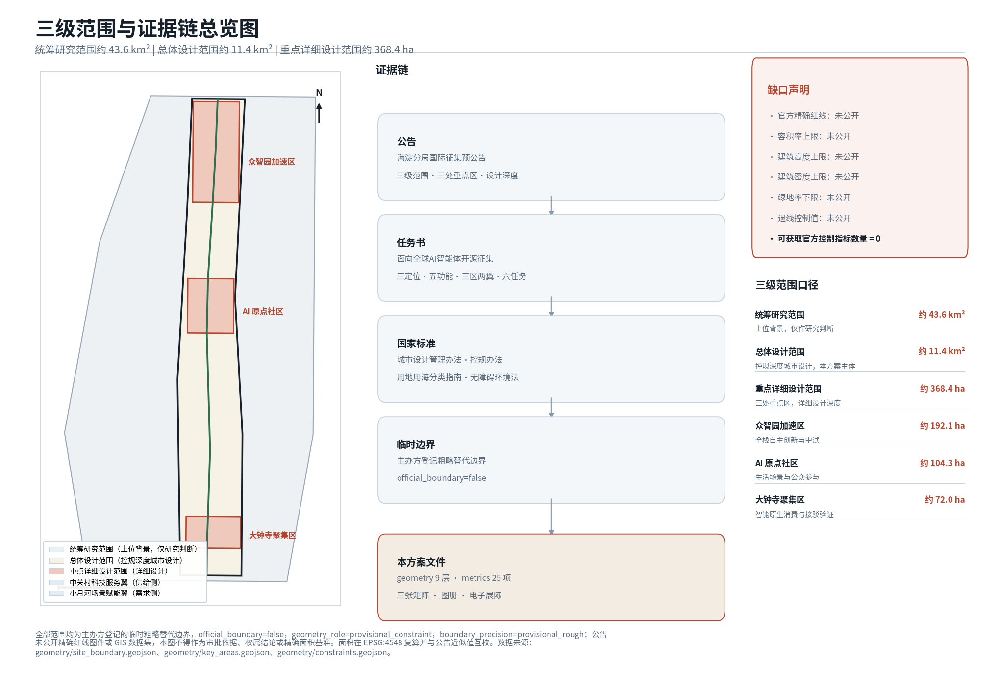
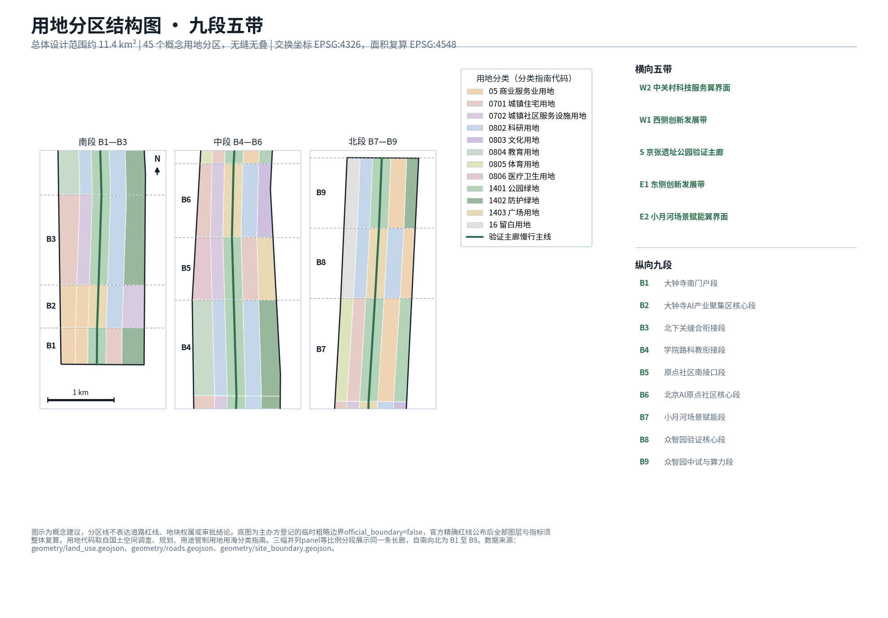
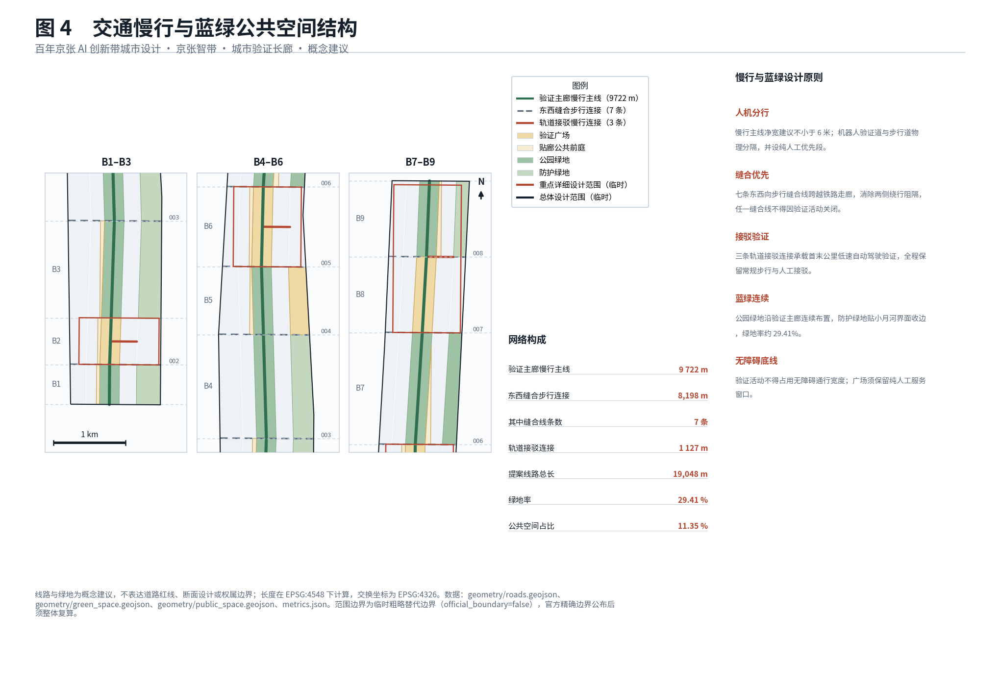
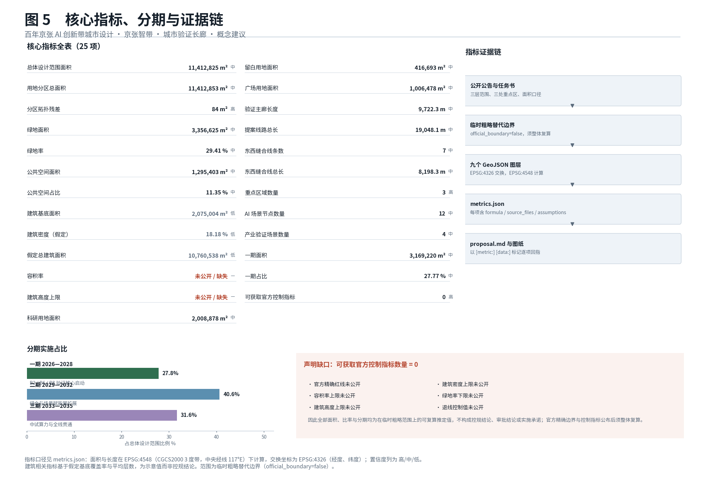
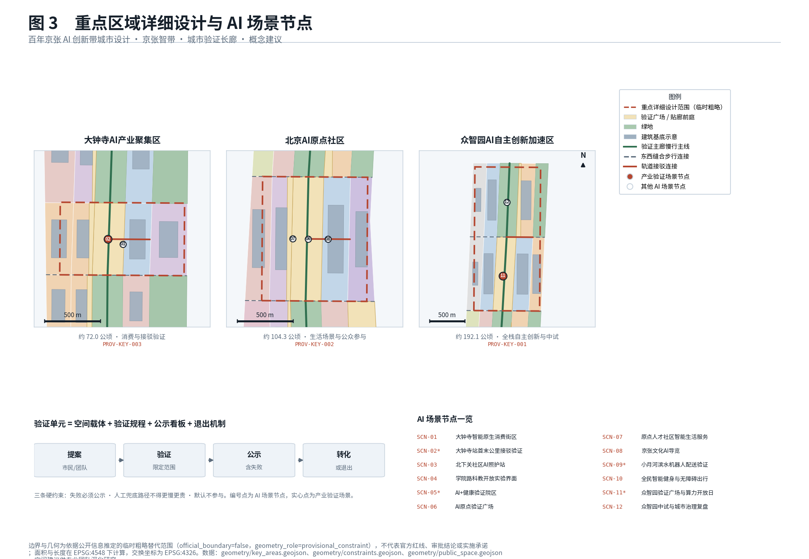

# Jing-Zhang Intelligence Belt · The Urban Proving Corridor

This document is the English counterpart of `proposal.md`. The Chinese text is authoritative where the two differ.

## Design Basis and Source List

The primary basis of this proposal is the prequalification announcement for the international urban design competition for the Centennial Jing-Zhang AI Innovation Belt, issued by the Haidian Branch of the Beijing Municipal Commission of Planning and Natural Resources. It fixes the three-level scope, the three key areas, the required design depth, and the deliverable context [standard:PROJECT-OFFICIAL-ANNOUNCEMENT]. The second basis is the user-cleared excerpt of the open-call task book addressed to global AI agents, which adds the three positionings, five functions, three districts and two wings, six tasks, and the common boundary clauses [standard:PROJECT-AGENT-OPEN-CALL-TASKBOOK]. Design depth follows the national urban design and regulatory detailed planning administrative measures [standard:MOHURD-URBAN-DESIGN-MEASURES], and every land-use code is taken verbatim from the national land and sea use classification guideline rather than invented [standard:MNR-LAND-USE-CLASSIFICATION-GUIDE].

Source usability is explicitly separated into four classes: usable for formal deliverables, background only, provisional substitute only, and requiring further verification. The complete registry of sources is kept in `sources.json` and standard coverage in `standard_matrix.json`; this section only places the decisive references next to the judgements they support [source:OFFICIAL-ANNOUNCEMENT] [source:AGENT-TASKBOOK]. The repository maintains the usability register centrally [source:SOURCE-REGISTRY], and the reading navigation layer is not itself an authoritative source [source:PROCESSED-FACT-PACK].

One thing must be stated at the outset: **this proposal has not obtained the official precise red line**. The announcement gives areas and textual extents for the three scope levels but publishes no boundary drawing or GIS dataset. The work therefore uses the organiser-registered provisional rough polygons as its working extents [source:BOUNDARY-SOURCE], with every feature marked `official_boundary=false` and `geometry_role=provisional_constraint`. These geometries serve only as placeholders for generation, display, and discussion; they express no road red line, no parcel tenure, and no approval conclusion [data:geometry/site_boundary.geojson#SITE-001]. Areas are recomputed in EPSG:4548 and cross-checked against the announced approximate figures [metric:site_area_sqm].

Equally important, no approved floor area ratio, building height, building density, green ratio, or setback control value for this project is available through public channels; all five official control indicators are missing [metric:official_planning_controls_available]. The response is not evasion: the gap is written into the metric system as an explicit indicator, and every conclusion affected by it is flagged for recalculation [depth:risk_missing_data]. Once official boundaries and control conditions are published, all layers, drawings, metrics, and the electronic exhibit must be regenerated as a whole rather than patched file by file.

## Three-Level Scope Framework

The three levels defined by the announcement call for three different working methods, and the proposal is organised accordingly [depth:three_level_scope_framework]. The coordinated research area of roughly 43.6 square kilometres answers questions of industrial ecology and future urban form; at this level the proposal offers research judgements only and lands no spatial scheme, citing the provisional extent as upper-level background [data:geometry/constraints.geojson#PROV-RESEARCH-001].

The overall design area of roughly 11.4 square kilometres is the main theatre of work. It requires an urban renewal framework, an industrial spatial layout, transport and municipal support, and urban character control at regulatory-plan depth [standard:MOHURD-CONTROL-DETAILED-PLANNING]. At this level the proposal delivers a topologically seamless land-use partition, a slow-mobility skeleton, a blue-green and public space network, and a phasing arrangement [depth:overall_spatial_structure].

The key detailed design area of roughly 368.4 hectares comprises the Zhongzhiyuan AI Independent Innovation Acceleration Area, the Beijing AI Origin Community, and the Dazhongsi AI Industry Cluster, arranged from north to south [data:geometry/key_areas.geojson#PROV-KEY-001]. Their combined extent serves as the depth cross-check reference [data:geometry/constraints.geojson#PROV-KEY-SCOPE-001], and the count matches the announcement [metric:key_area_count].

| Level | Announced area | Working depth here | Principal deliverable |
| --- | ---: | --- | --- |
| Coordinated research area | 43.6 km² | Research judgement only | Industrial ecology and future urban form conclusions |
| Overall design area | 11.4 km² | Regulatory-depth urban design | Land-use partition, slow mobility, blue-green and public space, phasing |
| Key detailed design area | 368.4 ha | Detailed design | Programme mix, building scale order of magnitude, retain-renovate-demolish, public space connectivity |

The three levels are not simple zoom steps. The coordinated level answers why here, the overall level answers how the skeleton is built, and the key level answers how the first brick is laid. This chain is fixed as the three-tier deployment rule for validation units: the coordinated level tests whether a demand is real, the overall level fixes where a unit is placed, and the key level fixes how it is built.

## Coordinated Research Area: Industry and Future City Research

At the 43.6 square kilometre scale, the central judgement is that Haidian does not lack AI research capacity; what it lacks is **a channel through which AI can be repeatedly tested in the real city, publicly judged, and institutionally adopted** [standard:PROJECT-AGENT-OPEN-CALL-TASKBOOK]. The global playbook for AI districts — build a park, offer subsidies, host a conference — is already fully available here. The genuinely scarce resources are legally accessible real scenarios, failure-tolerant testing space, and an institutional interface that converts validation results into procurement and standards.

The proposal therefore does not add another AI-themed park. It converts the linear heritage corridor of the Centennial Jing-Zhang into an **urban proving corridor**: simultaneously a public space and a continuously operating, city-scale validation infrastructure. This single positioning answers all three announced positionings at once — the centennial Jing-Zhang cultural belt supplies narrative and place, the metropolitan AI living-experience belt supplies real people, and the AI convergence innovation belt supplies the industrial interface [source:AGENT-TASKBOOK].

International experience suggests that the competitiveness of innovation districts rests on three stacked capabilities: the technical depth of a full-stack independent innovation system, the institutional maturity of scenario opening, and the ability to convert failure into public knowledge. The third is absent in most districts, and it is precisely the differentiating advantage this proposal seeks to build along the Jing-Zhang line [depth:existing_conditions_diagnosis]. No specific company lists, investment figures, or output forecasts are cited, because such data cannot be verified through public channels and fabricating it would directly damage the credibility of the work.

On future urban form, the proposal expects a relationship in which research sits on the belt, living sits beside the belt, and validation happens within the belt. The compute, model, and pilot-production links of a full-stack independent innovation system need continuous, controllable space rather than scattered office floors [metric:research_and_development_land_area_sqm]. Reserved land is therefore placed in the Zhongzhiyuan segment to absorb compute and pilot-production demand that cannot yet be specified [metric:reserved_land_area_sqm].

## Overall Design Area: Urban Renewal and Regulatory-Plan-Level Urban Design

The spatial skeleton of the overall design area is **nine segments and five bands** [depth:overall_spatial_structure]. Longitudinally, the Jing-Zhang Heritage Park corridor is divided from south to north into the Dazhongsi south gateway segment, the Dazhongsi AI industry core segment, the Beixiaguan stitching segment, the Xueyuan Road science-education interface segment, the Origin Community south interface segment, the Beijing AI Origin Community core segment, the Xiaoyue River scenario-enabling segment, the Zhongzhiyuan validation core segment, and the Zhongzhiyuan pilot-production and compute segment. Transversely, from west to east, five bands run the full length: the Zhongguancun technology-service wing interface, the western innovation development band, the Jing-Zhang Heritage Park proving spine, the eastern innovation development band, and the Xiaoyue River scenario-enabling wing interface [data:geometry/land_use.geojson#LU-001].

Everything depends on the central proving spine. It carries four identities at once: continuous park green space, the principal north-south slow-mobility line, the main validation line for low-speed autonomous driving and delivery robots, and the display interface where the public can watch validation happen [data:geometry/roads.geojson#ROAD-001]. Its length is independently recomputable [metric:validation_spine_length_m].

For urban renewal the overall strategy is to lead with the corridor and advance through points: build one validation unit in each of the three key areas first to create visible exemplars, then extend north and south along the spine, and only then address the more complex existing-fabric conditions of Beixiaguan and Xueyuan Road [depth:phasing_implementation]. This sequence front-loads the institutional running-in cost into the most tractable segments and avoids burning the start-up period on tenure-complex ground.

For urban character the proposal recommends the principle of heritage as ground, validation as form. Railway heritage elements are retained through low-intervention treatment; new massing sets back along both sides of the corridor to form a continuous public forecourt; and validation facilities use demountable, replaceable lightweight components so the corridor can be renewed as technology iterates [standard:MOHURD-URBAN-DESIGN-MEASURES]. Height control awaits publication of official indicators [metric:max_building_height_m].

## Detailed Design of Key Areas

The three key areas are not three homogeneous parks but three distinct links in a validation chain [depth:three_key_area_detailed_design].

**Zhongzhiyuan AI Independent Innovation Acceleration Area** (about 192.1 hectares, northern segment) carries the full-stack independent innovation system and pilot-production validation [data:geometry/key_areas.geojson#PROV-KEY-001]. Research land and reserved land are deliberately placed side by side: reserved land presumes no programme and absorbs compute facilities, pilot lines, and facility types that do not yet exist. This is the proposal's spatial answer to technological uncertainty. Its principal public space is the Zhongzhiyuan proving plaza, paired with a compute open-day mechanism through which independent developers and start-up teams can apply for public compute quotas [data:geometry/constraints.geojson#SCN-11].

**Beijing AI Origin Community** (about 104.3 hectares, middle segment) carries living scenarios and public participation [data:geometry/key_areas.geojson#PROV-KEY-002]. It mixes talent housing, community services, cultural display, and research incubation around the AI Origin proving plaza, the physical venue for public proposals and disclosure [data:geometry/constraints.geojson#SCN-06]. Disclosure is deliberately built as physical space rather than a web page alone: projects under validation, published results, and recorded failures all have fixed display positions on the plaza.

**Dazhongsi AI Industry Cluster** (about 72.0 hectares, southern segment) carries intelligence-native consumption and transport interchange validation [data:geometry/key_areas.geojson#PROV-KEY-003]. Building on rail station conditions, it hosts an intelligence-native consumption district and first-and-last-mile interchange validation [data:geometry/constraints.geojson#SCN-02], making it the segment most tightly bound to everyday urban life.

All three key areas share one construction standard for validation units: each unit must contain an open plaza or corridor section of at least community scale, a public disclosure board, a continuous barrier-free circulation surface, and a purely human service counter. This standard makes validation units replicable beyond the belt and lets reviewers verify built quality against a single yardstick.

## AI Innovation Ecosystem, Personas, and AI+ Scenarios

Twelve AI scenario nodes are distributed along the corridor, covering consumption, transport, care, science education, health, governance, culture, delivery, fitness, and compute opening [metric:scenario_node_count]. Four of them are industry validation scenarios whose access conditions must be jointly confirmed by sector regulators and enterprises [metric:industry_validation_scenario_count].

| Scenario node | Principal persona | Data boundary |
| --- | --- | --- |
| Dazhongsi intelligence-native consumption district | Commuters, nearby residents | Anonymous aggregate counts only, no facial recognition [data:geometry/constraints.geojson#SCN-01] |
| Dazhongsi station first-and-last-mile interchange | Travellers with luggage, people with reduced mobility | On-vehicle de-identification, no publication of identifiable raw footage |
| Beixiaguan community AI care station | Older people living alone, carers | Resident-initiated authorisation, local processing preferred |
| Xueyuan Road open science-education interface | University students, early-career researchers | No access to personal enrolment or grade data |
| AI+ health validation precinct | Chronic-disease patients, primary-care doctors | Medical data stays on site, only de-identified outcome metrics published |
| AI Origin proving plaza | All citizens, proposers | Proposals published under anonymous reference numbers |
| Origin talent community smart living | Young workers, dual-income families | No sharing of housing or mobility data with employers |
| Jing-Zhang cultural AI guide | Domestic and international visitors, children | No facial capture, location data deleted at session end |
| Xiaoyue River waterfront robot delivery | Riders, merchants, residents along the route | Takeover and avoidance failures must be published |
| Inclusive smart fitness and barrier-free mobility | Wheelchair users, blind and low-vision people, older people | No disability status labels recorded |
| Zhongzhiyuan compute open day | Start-up teams, independent developers | Quota allocation results public, trade secrets not published |
| Zhongzhiyuan urban governance review | Sub-district staff, emergency responders | Automated conclusions require human review before adoption |

Five key personas are identified with a spatial response for each: full-stack research talent needing continuous controllable research and pilot space; founders and independent developers needing low-threshold access to compute and scenarios; young workers needing affordable housing and commuting; long-standing residents and older people needing everyday services that do not exclude them; and visitors and international peers needing legible narrative and wayfinding.

On ecosystem structure, the Zhongguancun technology-service wing acts as the supply side, concentrating enterprise services, proof of concept, and commercialisation resources [data:geometry/constraints.geojson#AIZ-WING-W], while the Xiaoyue River scenario-enabling wing acts as the demand side, providing daily services, cultural experience, and waterfront public life [data:geometry/constraints.geojson#AIZ-WING-E]. Two wings and one belt form a complete resource-validation-demand loop; this is what three districts and two wings means concretely here.

## Land Use, Building Scale, and Retain-Renovate-Demolish Strategy

The land-use partition uses the codes of the national land and sea use classification guideline and forms 45 partition cells that tile the overall design area without gap or overlap [standard:MNR-LAND-USE-CLASSIFICATION-GUIDE]. Topological quality is independently verifiable: the residual between the summed partition area and the site area is far below the validation tolerance [metric:land_use_partition_gap_sqm], and the totals agree [metric:land_use_total_area_sqm].

The principal categories are research land, commercial and business service land, urban residential land, urban community service facility land, park green space, protective green space, plaza land, cultural land, education land, sports land, medical and health land, and reserved land [data:geometry/land_use.geojson#LU-001]. Research land is the body of the industrial space [metric:research_and_development_land_area_sqm], and plaza land carries the public interface of the validation units [metric:plaza_land_area_sqm].

Building scale must be stated with care. Thirty indicative building footprints are generated, with total footprint area and coverage both recomputable [metric:building_footprint_area_sqm] [metric:site_coverage_ratio]. The floor area derived from an assumed average storey count expresses order of magnitude only [metric:assumed_gross_floor_area_sqm]. **This figure is not a floor area ratio conclusion and constitutes no development commitment**: the official FAR control is missing [metric:floor_area_ratio], and back-calculating a ratio from assumed storeys would not be defensible [depth:development_intensity_controls]. Principles for height, massing, and character are set out in the overall design section [depth:height_massing_character].

For the retain-renovate-demolish strategy the proposal takes validation value, not construction date, as the primary criterion [depth:retain_renovate_demolish]. Railway heritage elements and structures with narrative value are retained without exception. Structurally sound existing buildings capable of hosting validation functions are prioritised for renovation and become the indoor carriers of validation units. Demolition is proposed only where there is genuinely no retention or renovation value and where the structure obstructs north-south continuity or east-west stitching. Building-by-building conclusions require field survey and tenure verification; no individual case is adjudicated here.

## Transport, Rail, Municipal Infrastructure, and Public Services

The slow-mobility system consists of one spine, seven east-west stitching connections, and three rail interchange connections [depth:traffic_rail_slow_parking]. All are conceptual alignments and express no road red line [data:geometry/roads.geojson#ROAD-001]. The spine runs continuously north-south along the proving corridor [metric:validation_spine_length_m], and the total length of all proposed alignments is recomputable [metric:total_proposed_centerline_length_m].

East-west stitching is the direct response to the announced requirement of stitching east to west and connecting north to south [metric:east_west_stitch_count]. The long-standing barrier of the rail corridor means that actual walking distances between the two sides greatly exceed straight-line distances. Seven stitching connections are placed at key positions [metric:east_west_stitch_length_m], each of which must include a barrier-free ramp or lift and retain a staffed enquiry point that does not depend on a mobile phone. Whether each crossing becomes an underpass, a bridge, or an at-grade connection must be developed by qualified teams against rail operations and utility conditions; no conclusion is presumed here.

For rail interchange, each key area has one interchange slow-mobility connection carrying first-and-last-mile validation [data:geometry/roads.geojson#ROAD-009]. The design requirement for interchange sections is a continuous barrier-free surface plus physical signage; service must never depend on scanning a code alone. This is a hard constraint of the proposal rather than a recommendation [standard:BARRIER-FREE-ENVIRONMENT-LAW].

Municipal and new-type infrastructure must supply three things to the proving corridor: low-latency communications and edge compute nodes along the corridor, a continuous hard circulation surface with charging and swapping points for robots and low-speed vehicles, and stable power and data links for the disclosure boards [depth:municipal_new_infrastructure]. Exact capacities, positions, and routing must follow municipal authority data, which is currently unavailable through public channels and is explicitly listed as outstanding. Public service facilities follow community life-circle principles along the two wings, with care, fitness, and cultural display functions reinforced.

## Blue-Green Network, Public Space, and Urban Character

The blue-green network takes the Jing-Zhang Heritage Park proving spine as its continuous north-south backbone, combined with Xiaoyue River waterfront green space and protective green belts along the corridor [depth:blue_green_public_space]. Green space quantity and green ratio are recomputable [metric:green_space_area_sqm] [metric:green_ratio], as are public space quantity and share [metric:public_space_area_sqm] [metric:public_space_ratio].

Public space has two components. The first is the proving plazas at the core of each key area, the principal carriers of the validation units. The second is the corridor-facing public forecourt, the open space between building setback lines and the proving spine [data:geometry/public_space.geojson#PUBLIC-001]. The forecourt is intended to open the ground floors of corridor-side buildings onto public space so that validation can be seen by passers-by; visibility is the precondition of public oversight. Public space, building footprints, and green space do not overlap geometrically, so no area is double-counted [data:geometry/green_space.geojson#GREEN-001].

On character, the corridor should present a legible technicality: rather than concealing equipment, sensors, robot channels, and disclosure boards are organised as recognisable landscape elements, while unified materials and colour control prevent visual clutter [standard:MOHURD-URBAN-DESIGN-MEASURES]. Historic Jing-Zhang railway elements are retained through low-intervention treatment and folded into the narrative system, producing a continuous reading line from the steam age to the intelligent age. Wayfinding uses triple encoding — Chinese, English, and graphic symbols — so that older people, children, blind and low-vision people, and international visitors can all understand it.

## Renewal Projects, Implementation Policy, and Phasing

Implementation proceeds in three phases, whose extents are aggregated from land-use partition cells [depth:renewal_project_list]. Phase one, 2026 to 2028, builds one proving plaza and one exemplar section of the proving spine in each of the three key areas and runs the full propose-validate-disclose-convert loop end to end [data:geometry/phasing.geojson#PHASE-001]. Phase one area and its share of the site are recomputable [metric:phase_1_area_sqm] [metric:phase_1_share_of_site].

| Phase | Period | Core task | Measurable indicator |
| --- | --- | --- | --- |
| Phase 1 | 2026—2028 | Three validation units built, loop closed | 3 validation units built; at least 30 disclosed projects cumulatively; 100% failure disclosure rate |
| Phase 2 | 2029—2031 | North-south continuity, east-west stitching, two wings delivered | Spine continuous end to end; 7 stitching connections built; barrier-free continuous surface across the whole line |
| Phase 3 | 2032—2035 | Belt-wide stitching and operational conversion | Publicly reportable conversion rate of validation results into procurement or standards; permanent operating entity established |

Implementation policy rests on three institutional designs [depth:implementation_policy]. The first is the **validation protocol**: before any validation unit is deployed, a public agreement must be signed stating the scope of data collection, the retention period, the exit method, and the responsible party, and the agreement itself is published. The second is **failure disclosure**: failures, suspensions, and takeover events must be disclosed on the same footing as successes, with no selective release. This is what distinguishes the proposal from a conventional demonstration zone, because only recorded failure spares those who come later from paying the same bill twice. The third is the **conversion channel**: validation results need an explicit adoption path, whether inclusion in government procurement catalogues, conversion into local or group standards, or publication as technical guidance.

The renewal project list is organised in three tiers — corridor segment, validation unit, supporting facility — each with a defined spatial extent, responsibility level, and acceptance criterion. The three phases correspond to a near-term, mid-term, and long-term implementation stage, and the suggested division of roles in each stage is as follows: government departments and sub-district offices provide the administrative basis for scenario admission, public-space handover, and the disclosure regime; the implementing body or operating team builds and maintains the validation units and keeps the disclosure boards current; enterprises and start-up teams apply as validation proponents, deploy the technology, and carry the failure-disclosure obligation; universities and research institutes act as third-party assessors; and residents and users take part in scenario selection and exit decisions through proposals and feedback. The measurable indicators for each stage are listed in the table above; the implementing body should publish annual monitoring data on the same definitions used in this package's `metrics.json`. Specific investment and delivery arrangements must be set by the implementing body after tenure verification and funding channels are settled; no fiscal commitment or investment estimate is made here.

## Metrics, Area Recalculation, and Compliance Matrix

All areas and lengths are computed in EPSG:4548 (CGCS2000 3-degree zone, central meridian 117°E), GeoJSON exchange coordinates are EPSG:4326, and units are metres and square metres throughout [depth:metrics_recalculation]. The metric system contains 25 entries, each declaring status, value, unit, source file, formula, confidence, and assumptions.

| Metric | Value | Note |
| --- | ---: | --- |
| Overall design area | 11,412,825 sqm | Recomputed provisional extent, consistent with the announced 11.4 km² [metric:site_area_sqm] |
| Land-use partition residual | 83.7 sqm | Far below tolerance, proving a seamless partition [metric:land_use_partition_gap_sqm] |
| Green ratio | 0.294 | Recomputed from the green space layer [metric:green_ratio] |
| Public space share | 0.114 | No overlap with buildings or green space [metric:public_space_ratio] |
| Official control indicators available | 0 | Explicit declaration of the gap [metric:official_planning_controls_available] |

Metrics fall into three classes. Geometric recomputation metrics can be recalculated independently from the layers in `geometry/`, and any third party using the same CRS should obtain the same result. Assumption-derived metrics such as the floor area order of magnitude carry a confidence bounded by their assumptions, marked with a `caveat` in the metric entry. Gap-declaration metrics such as the count of available official control indicators exist precisely to make the gap visible [depth:metrics_recalculation].

The compliance matrix in `compliance_matrix.json` maps the 17 mandatory tasks of the announcement and the 6 agent tasks of the open call one by one, linking each requirement to sections, layers, metrics, drawings, exhibit blocks, sources, and self-check items [standard:PROJECT-OFFICIAL-ANNOUNCEMENT]. Standard coverage and design depth coverage are kept in `standard_matrix.json` and `design_depth_matrix.json` respectively and are not duplicated as machine indexes in the prose.

## Risk, Copyright, and Compliance

**Data and boundary risk** comes first [depth:risk_missing_data]. Every spatial conclusion rests on provisional rough extents. Once the official precise red line is published the extents may shift, and the response must be a full recalculation rather than local patching [metric:site_area_sqm]. With five official planning control indicators missing, intensity and height conclusions can only remain judgements of magnitude [metric:floor_area_ratio]. Rail operating conditions, heritage protection extents, utility routing, and parcel tenure are all unavailable as public material, so crossing methods for east-west stitching and case-by-case retain-renovate-demolish decisions are left open.

**Privacy and data compliance risk** is handled through three hard constraints: non-participation by default, meaning residents are outside collection without taking any action; local processing first, meaning anything computable on-device or on-site is not uploaded; and minimum retention, with retention periods written into the published validation protocol. Scenarios involving generative AI services must comply with the applicable national administrative requirements [standard:GENERATIVE-AI-INTERIM-MEASURES]. Every automated conclusion must pass human review before entering a governance decision [data:geometry/constraints.geojson#SCN-12].

**Inclusion risk** is the risk most easily overlooked in intelligent districts. The line drawn here is that every scenario must retain a staffed path that does not depend on a smart device, and that path may not be slower, costlier, or require an extra trip [standard:ELDERLY-SMART-TECH-PLAN-2020-45]. A continuous barrier-free circulation surface is mandatory in every validation unit, and validation activity may never occupy barrier-free clearance width [standard:BARRIER-FREE-ENVIRONMENT-LAW].

**Statement boundaries and copyright**: all spatial recommendations in this proposal are conceptual suggestions and reference schemes for further study by qualified professional teams. They constitute no approval basis, no tenure conclusion, and no construction commitment [source:AGENT-TASKBOOK]. The work uses only publicly verifiable material and organiser-registered cleared material; it uses no restricted material that has not been publicly released, no personal privacy data, no fabricated company lists, investment figures, output values, or fiscal commitments, and it claims no government approval. Drawings and the electronic exhibit are original content generated for this submission under a community display licence; see `report/copyright_statement.md`.

## References

The basis of this proposal falls into four classes, with the full index kept in structured files; only the trunk is listed here [source:SITE-PACKAGE].

**Official public material**: the prequalification announcement for the international urban design competition for the Centennial Jing-Zhang AI Innovation Belt, issued by the Haidian Branch of the Beijing Municipal Commission of Planning and Natural Resources on 9 May 2026, is the controlling basis for the three-level scope, the three key areas, and the design tasks and depth [standard:PROJECT-OFFICIAL-ANNOUNCEMENT].

**Cleared task book**: the excerpt of the open-call task book addressed to global AI agents, supplying the three positionings, five functions, three districts and two wings, six tasks, and common boundary clauses [standard:PROJECT-AGENT-OPEN-CALL-TASKBOOK].

**National standards and regulations**: the urban design administrative measures and the measures for the formulation and approval of regulatory detailed plans for cities and towns [standard:MOHURD-CONTROL-DETAILED-PLANNING]; the guideline for land and sea use classification in territorial spatial survey, planning, and use control [standard:MNR-LAND-USE-CLASSIFICATION-GUIDE]; the Barrier-Free Environment Construction Law and the State Council General Office implementation plan on resolving older people's difficulties in using smart technology [standard:ELDERLY-SMART-TECH-PLAN-2020-45]; and the interim measures for the administration of generative AI services [standard:GENERATIVE-AI-INTERIM-MEASURES].

**Repository-registered material**: the provisional rough boundaries and their derivation note [source:BOUNDARY-SOURCE], the provisional extents of the three key areas [source:KEY-AREA-SOURCE], the source usability register [source:SOURCE-REGISTRY], and the reading navigation layer [source:PROCESSED-FACT-PACK]. The complete source list with usage boundaries is in `sources.json`, and the proposal's assumptions are in `assumptions.json`.
