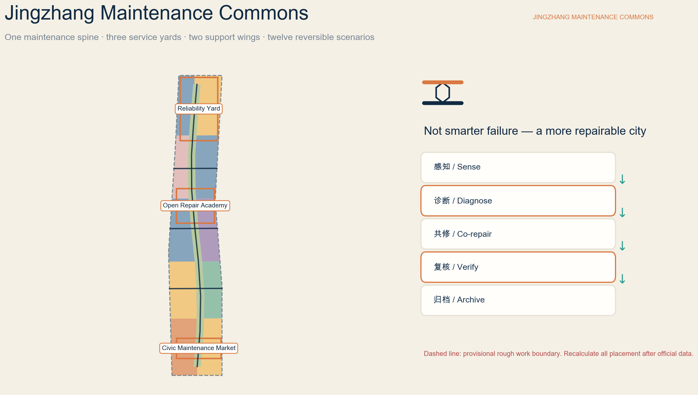
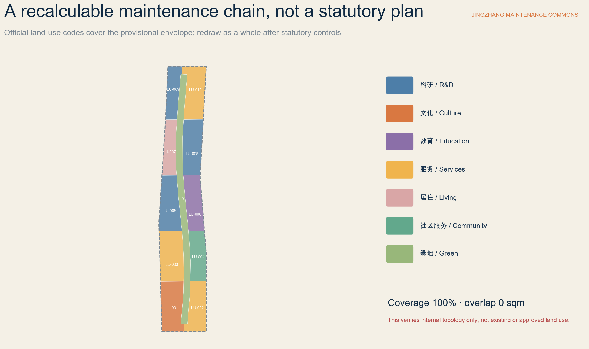
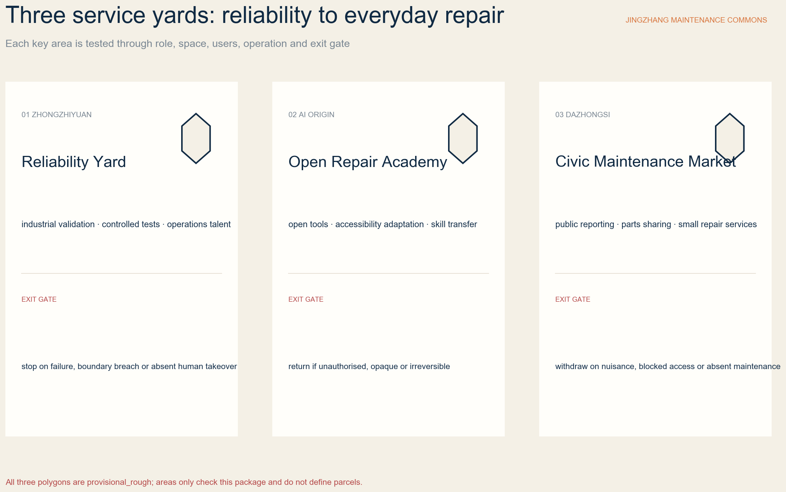
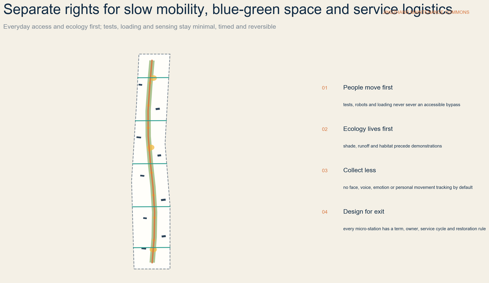
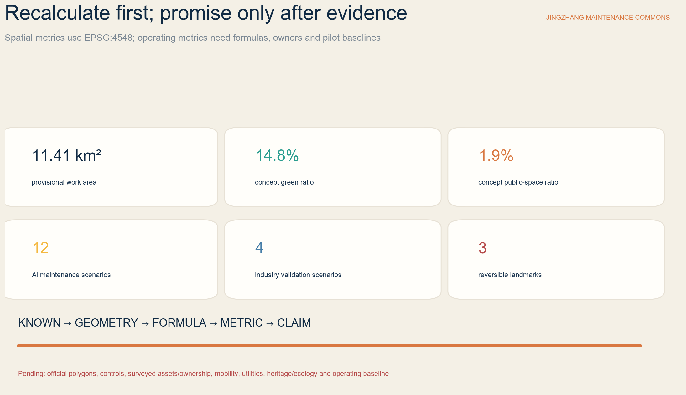

# JINGZHANG MAINTENANCE COMMONS / 京张常新

> The advancement of an AI district is measured not only by what it can launch, but by whether failure can be detected, responsibility located, assets repaired, services verified and systems safely withdrawn.

## Design Basis and Data Boundary

This proposal first follows the official announcement: its three spatial scales, three key areas, urban-design tasks and required depth. The agent taskbook adds identity, global cases, AI scenarios, personas, public space, cultural narrative and long-term operation. Registered repository references govern land-use classification, urban design and regulatory-plan language. The narrative, nine GeoJSON files, metrics, three matrices, bilingual figures, offline pages and PDFs form one evidence chain. [source:OFFICIAL-ANNOUNCEMENT] [source:AGENT-TASKBOOK] [standard:PROJECT-OFFICIAL-ANNOUNCEMENT]

Public material confirms the written tasks and announced approximate areas, but it does not provide precise boundaries, surveyed buildings, ownership, road or rail controls, utility capacity, heritage and ecology constraints, or statutory development controls. SITE-001 and all three key-area polygons come from maintainer-provided provisional rough work geometry. They retain official_boundary=false, geometry_role=provisional_constraint and boundary_precision=provisional_rough. They support concept generation and internal checks only; they are not official redlines, parcels, approvals or precise-area evidence. [source:BOUNDARY-SOURCE] [data:geometry/site_boundary.geojson#SITE-001] [depth:existing_conditions_diagnosis]

The proposal therefore separates:

- Known facts: official tasks and approximate areas, registered sources and results recalculated from submitted layers.
- Design proposals: the Maintenance Commons identity, spatial system, scenarios, projects, operations and concept metrics.
- Pending matters: official polygons, controls, existing conditions, ownership, heritage and ecology, utilities, engineering feasibility, operators, budgets and dates.

External cases are paraphrased from institutional pages as mechanisms only. No external image, logo, scale or investment figure is copied, and foreign policy is never represented as local Chinese law. A school, company, community or institution is not a committed partner without written confirmation. See sources.json for permitted use and assumptions.json for unresolved matters. [source:SOURCE-REGISTRY] [depth:risk_missing_data]

## Three Scales and Problem Definition

Maintenance is not treated as a back-office property cost. It becomes civic infrastructure for the AI Innovation Belt: software and equipment must be diagnosable, public space cared for, buildings adaptable, services accountable, and failures reversible. A railway survives a century through inspection, repair, calibration and handover rather than one act of construction. That maintenance culture joins Zhongguancun engineering practice and AI-supported diagnosis. [source:OFFICIAL-ANNOUNCEMENT] [standard:PROJECT-AGENT-OPEN-CALL-TASKBOOK]

| Scale | Announced approximate size | Question answered here | Delivery and exit condition |
| --- | ---: | --- | --- |
| Coordinated research | 43.6 sq km | How can reliability R&D, repair services, skills, parts circulation and public governance form an ecosystem? | Define regional mechanisms and interfaces, not invented redlines or partners |
| Overall design | 11.4 sq km | How can maintenance enter renewal, land use, slow mobility, blue-green systems, utilities, services and character? | Redraw the whole proposal after official boundaries, controls, surveys and professional data |
| Three key areas | 368.4 ha total | How can Zhongzhiyuan, AI Origin and Dazhongsi test industrial, learning and everyday service models? | Each area defines users, space, operation, data and an exit gate |

The submitted rough envelope recalculates to about 11,412,825 sqm in EPSG:4548. This is a topology check for the current package; the official written figure remains approximately 11.4 sq km. Once official polygons arrive, land use, buildings, roads, green space, public space, constraints and phasing must be clipped together, every metric recalculated, and all figures, PDFs, HTML and checks regenerated. [metric:site_area_sqm] [data:geometry/phasing.geojson#PHASE-001] [depth:metrics_recalculation]

## Identity and Global Cases

The Chinese name 京张常新 means keeping Jingzhang continually serviceable and renewed. JINGZHANG MAINTENANCE COMMONS describes shared maintenance knowledge, tools, places and responsibility rather than another technology showroom. The original logo combines two rail lines and a hexagonal bolt: navy is a reliable base, copper is visible human repair, green is everyday ecology, and amber marks test status only. It does not reuse railway, temple, university or corporate marks. [source:AGENT-TASKBOOK] [depth:overall_spatial_structure]

The spatial identity is “one spine, three yards, two wings, twelve stations”:

- Maintenance Green Spine: slow mobility, shade, runoff, low-impact service access and public reporting; ecology and ordinary access always take priority.
- Three service yards: Zhongzhiyuan Reliability Yard, Beijing AI Origin Open Repair Academy, and Dazhongsi Civic Maintenance Market.
- Two support wings: Zhongguancun provides standards, legal and insurance services, supply chains, compute and enterprise support; Xiaoyue River provides ecological, community, accessibility and public-space test settings.
- Twelve maintenance micro-stations: one for each AI scenario, using removable components rather than permanent spectacle.

Seven global cases contribute mechanisms, not templates:

| Case | Institutional mechanism | Jingzhang translation |
| --- | --- | --- |
| Singapore Punggol Digital District Open Digital Platform | Cross-system interoperability, historical replay, simulation and a district living lab [source:JTC-PDD-ODP] | Test failure, rollback and human takeover in Zhongzhiyuan with synthetic or cleared data |
| Amsterdam Circular Economy | A repair map, longer product lives, renovation of municipal property and reuse in public space [source:AMSTERDAM-CIRCULAR] | Place repair access, material reuse and procurement within the service network |
| Repair Café International | Low-threshold co-repair, volunteer skills, learning and social connection [source:REPAIR-CAFE] | Combine co-repair with qualified referral at AI Origin; never replace professional repair |
| Open Repair Data Standard | Structured records of item, problem, result and repair barrier [source:OPEN-REPAIR] | Create a minimum service ledger, remove personal data and restrict reuse |
| EU Right to Repair | Policy support for access to repair and a service ecosystem [source:EU-RIGHT-TO-REPAIR] | Borrow the design question of access to repair, parts and services; do not present it as local law |
| Seoul Sewoon regeneration | Preserve an industrial ecosystem while experienced technicians work with new entrepreneurs [source:SEOUL-SEWOON] | Protect skills and small businesses before adding AI tools and shared space |
| EU BAMB | Material passports and reversible building design support upkeep, reuse and disassembly [source:EU-BAMB] | Inventory buildings and components before light retrofit; discuss demolition only after specialist review |

World-class performance is not a giant screen, landmark height or company count. It means small teams can access facilities; maintenance workers gain recognition and skills; disabled users define successful adaptations; residents can refuse intrusive sensing; failures are recorded; and exits restore public space. [metric:global_case_count] [depth:risk_missing_data]

## Overall Urban Renewal and Spatial Structure

The overall design is organised by a maintenance chain rather than a single industrial campus. The north emphasises reliability R&D and controlled validation; the middle supports education, open tools and daily-life programmes; the south supports cultural archives, public reporting and small repair services. A maintenance green spine provides continuous walking and low-impact service access. Zhongguancun supports standards and enterprise conversion; the Xiaoyue River wing brings ecological, community and public-space feedback. This is a movable functional relationship, not a proposed statutory plan. [data:geometry/land_use.geojson#LU-001] [standard:MNR-LAND-USE-CLASSIFICATION-GUIDE] [depth:land_use_layout]

Renewal follows “observe first, maintain first, reactivate first, retrofit lightly, and only then assess additions.” Nine BLDG features are programme placeholders for a Reliability Test Hall, Maintenance Twin Lab, Open Repair Academy, Accessible Technology Clinic, Parts and Tool Library, Civic Repair Market, Material Passport Workshop, Century Maintenance Archive and Maintenance Operations Room. They are not surveyed buildings and express no mandatory construction or demolition. Every real building requires surveys of ownership, tenancy, structure, fire, heritage, energy and accessibility. [data:geometry/buildings.geojson#BLDG-001] [depth:retain_renovate_demolish]

Land-use geometry uses registered codes 0802, 0803, 0804, 05, 0701, 0702 and 1401. It completely covers the provisional work envelope without overlap. This proves internal topology and functional logic only; it does not prove existing use, proposed approved use or statutory mix. [metric:land_use_coverage_ratio] [metric:land_use_overlap_area_sqm] [standard:MNR-LAND-USE-CLASSIFICATION-GUIDE]

Character avoids the generic “giant screen plus neon blue” image. Visible repair, removable equipment boxes, durable materials, low-glare status labels and honest structural joints are preferred. New layers remain legible beside old buildings without dominating heritage silhouettes. Massing, height, roofs, interfaces, views and colour require official urban-design and heritage controls at parcel level. [standard:MOHURD-URBAN-DESIGN-MEASURES] [depth:height_massing_character]

## Detailed Design for the Three Key Areas

Each key area uses the same test: role, space, users, operation, data and exit gate. Because all polygons are provisional, these are directional detailed-design proposals rather than parcel, engineering or government decisions. [data:geometry/key_areas.geojson#PROV-KEY-001] [depth:three_key_area_detailed_design]

### Zhongzhiyuan: Reliability Yard

Zhongzhiyuan is a low-public-exposure validation setting for models, smart terminals, sensors, robots and estate-service workflows. Controlled test halls, fault-replay rooms, isolated parts stores, human-takeover stations and a small observation window are proposed. Logistics and tests are separated from public walking; equipment operates with physical separation, low speed, an on-site safety steward and emergency stop. Synthetic, minimised or authorised asset data is preferred, with no unrelated face, voice or personal movement collection. [data:geometry/buildings.geojson#BLDG-001] [source:JTC-PDD-ODP]

Public release requires a clear failure taxonomy, working rollback, named human takeover, effective network and equipment isolation, and acceptable energy, light, noise and fire conditions. Failure of any gate keeps the work indoors, reduces its complexity or ends the test. [data:geometry/phasing.geojson#PHASE-003] [depth:municipal_new_infrastructure]

### Beijing AI Origin: Open Repair Academy

AI Origin is an urban academy where students, developers, technicians, maintenance workers, residents, disabled users and startups learn and repair together. Proposed spaces include an open repair bench, accessible-technology clinic, parts and tool library, material passport workshop, quiet learning room and small residency. Nearby academic and arts resources are cues from the brief, not assumed partnerships or property rights. [data:geometry/public_space.geojson#PUBLIC-002] [source:AGENT-TASKBOOK]

Unauthorised opening of devices is not encouraged. Ownership, warranty, product liability, cyber security, parts provenance and required qualifications must be checked first. High-voltage, gas, medical, transport and critical assets are referred directly to qualified operators. Disabled users set the final success criterion for assistive-technology adaptation; AI gives suggestions but does not replace the user or professional. [metric:persona_count] [depth:risk_missing_data]

### Dazhongsi: Civic Maintenance Market

Dazhongsi makes public reporting, small repair businesses, parts sharing, material circulation, service information and an annual public service review part of daily city life. Removable market stalls, repair desks, tool loans, material samples, complaints and referral services must not obstruct commuting or accessible routes. Station integration, four-quadrant connections, mixed use of planned green space and heritage relationships all require specialist approval. [data:geometry/public_space.geojson#PUBLIC-003] [standard:MOHURD-CONTROL-DETAILED-PLANNING]

The market values service quality over footfall. It publishes repair outcomes, barriers, referral, warranty, complaint response and exit records. Fair fees, portable tools and non-proprietary digital interfaces protect small businesses. Persistent nuisance, absent upkeep, blocked access or missing responsibility suspends both stalls and digital services. [source:OPEN-REPAIR] [depth:renewal_project_list]

## Seven Personas and Twelve AI Scenarios

Maintenance is not one-way AI surveillance of the city. Seven groups co-define the problem, evidence and success: facility workers and operators; AI engineers and startups; residents and older users; disabled people and assistive-technology users; students and young makers; small businesses, tenants and venue operators; and planning, architecture, structure, fire, mobility, utility, ecology, heritage, data and legal professionals. [metric:persona_count] [source:AGENT-TASKBOOK]

Each scenario records users, setting, minimum data, human review, operating role and exit risk. A star marks an industry validation scenario.

| ID / scenario | Setting and users | Minimum data, human review and exit gate |
| --- | --- | --- |
| SC-01 Public-space fault triage | Eight micro-stations; residents and workers | Collect location, asset class, fault and urgency only; humans dispatch. Refer cases with personal data, unclear ownership or another responsible service |
| SC-02 Co-audit accessible routes | Spine and cross-links; disabled users, mobility and facility teams | No individual tracking; disabled users define continuity and equivalent bypass on site. Remove immediate obstacles before formal works |
| SC-03 Blue-green health walk | Green spine; landscape, ecology and community | AI flags anomalies only; ecology professionals and field evidence decide intervention |
| SC-04 ★ Asset reliability sandbox | Controlled Zhongzhiyuan hall; vendors and operators | Record failure, rollback, takeover and energy; connect no unauthorised system. Stop when isolation or human takeover fails |
| SC-05 ★ Smart-terminal repairability lab | Zhongzhiyuan; hardware, software, repair and security teams | Test open interfaces, parts access, logs and safe isolation. Do not power on when warranty, liability or cyber security is unclear |
| SC-06 ★ Maintenance-twin replay | Zhongzhiyuan; estate operators and researchers | Simulate loads and faults with synthetic or cleared data. Unexplained or unreliable outputs remain research and never dispatch work automatically |
| SC-07 ★ Controlled robotic inspection | Enclosed Zhongzhiyuan route; engineers and accessibility observers | Low speed, enclosure, safety steward, physical stop and equal bypass. Exit on boundary breach, loss of control, obstruction or public discomfort |
| SC-08 Open repair bench and parts library | AI Origin; residents, students and technicians | Record problem, outcome and barrier while repairing together. Refer dangerous, regulated or uncertain-parts cases |
| SC-09 Assistive-technology adaptation clinic | AI Origin; disabled users, engineers and accessibility professionals | The user defines success and retention. Do not train models without consent; restore the original state after failure |
| SC-10 Building material passport | AI Origin and surveyed existing buildings; built-environment teams | Record component, condition, source, reversibility and reuse condition. No reuse before survey, testing and hazardous-material checks |
| SC-11 Century maintenance archive | Cultural archive and Jingzhang public interfaces; historians, memory holders and students | Separate fact, oral history, inference and AI reconstruction. Historians and community review together; disputed material is contextualised or withdrawn |
| SC-12 Maintenance Week and public service review | Rotating across the three yards; public, operators and firms | Publish de-identified success, failure, complaint, upkeep and exit records. No public event without responsible people or data boundaries |

Four visible statuses govern every scenario: research, controlled test, time-limited public service, and paused or archived. A named human reviewer and non-digital feedback route remain available. Public fault reporting must never become performance surveillance of residents, workers or small businesses. [metric:scenario_count] [metric:industry_validation_scenario_count] [depth:risk_missing_data]

## Land Use, Buildings and Retain–Retrofit–Remove

Concept green space is about 14.76% of the current envelope and concept public space about 1.93%. Nine programme footprints total about 101,816 sqm. The first two are recalculated design-layer ratios; the last expresses spatial placeholders only and cannot establish total building volume, FAR, construction quantity or investment. [metric:green_ratio] [metric:public_space_ratio] [metric:building_footprint_area_sqm]

Five gates govern buildings:

1. Confirm that a building exists and establish ownership and tenancy.
2. Survey structure, fire, heritage, energy, environment and accessibility.
3. Prefer retention of valuable, safe and adaptable buildings and small industrial ecosystems.
4. Use reversible interiors, equipment boxes, shared interfaces and time-based operation for light retrofit.
5. Discuss removal only after public interest, whole-life carbon, tenant arrangements, alternatives and legal procedure; this proposal marks no mandatory demolition.

Reliability facilities need isolation, loads, logistics, fire safety and visible stops. The academy needs daylight, divisible worktables, quiet rooms, accessible toilets and safe tool storage. Public markets need queues that do not block movement, removable stalls, transparent prices, referral and complaints, and low-glare interfaces. [data:geometry/buildings.geojson#BLDG-003] [source:SEOUL-SEWOON] [depth:height_massing_character]

Development intensity is managed as known, design proposal and unknown. Known items are official tasks and announced areas; design proposals are functional relationships and reversible components; unknown items include FAR, floor area, height, density, setbacks, parking and facility standards. Null values are professional restraint, not missing boxes to fill with generated numbers. [metric:floor_area_ratio] [metric:total_floor_area_sqm] [metric:building_height_m]

## Mobility, Rail, Utilities and Public Services

ROAD-001 is a concept maintenance and slow-mobility spine approximately 9.15 km long, with five cross-links. It expresses priority connections, not existing roads, a railway, a park boundary or proposed redlines. Any crossing of rail, express roads, waterways or closed land needs transport, engineering, heritage, ecology, flood, ownership and investment studies. [data:geometry/roads.geojson#ROAD-001] [metric:maintenance_spine_length_m] [depth:traffic_rail_slow_parking]

Four rules separate rights:

- People move first: demonstrations, loading, robots and queues never sever a continuous accessible bypass.
- Public transport and commuting first: official station, flow, interchange and four-quadrant data govern; near-term work uses removable wayfinding and booking only.
- Fewer, consolidated service trips: edge transshipment, small carts, combined orders and off-peak windows protect fire and accessible paths.
- Enclosed tests: robots operate only when permitted, slow, enclosed, supervised and equipped with a physical stop.

Utilities and digital infrastructure have three levels: a minimum asset ledger and service protocol; controlled sensing, edge processing and role permissions; then power, communications, cooling, fire and equipment expansion only after capacity review. Before verified capacity and cyber-security assessment, equipment stays removable and concurrency limited. Predictive maintenance may prioritise events for inspection, but it must not automatically disable life-safety systems, penalise workers or replace professional sign-off. [source:JTC-PDD-ODP] [depth:municipal_new_infrastructure]

Public services include an open repair bench, assistive-technology clinic, parts and tool library, small-business referral, material passports, worker training, and a complaint and exit desk. Every service needs accessible hours, prices and responsibility, qualified referrals, rest for children and carers, a walk-in route and an equal non-app path. [data:geometry/public_space.geojson#PUBLIC-004] [depth:blue_green_public_space]

## Blue-Green Public Space, Culture and Three Landmarks

The Maintenance Green Spine is first for shade, runoff, habitat, walking, cycling and ordinary rest; repair demonstrations and low-impact service access are secondary. Sensing avoids face, voice, emotion and individual movement recognition by default. Light points downward, remains timed and low-glare. Equipment must not injure trees, harden root zones or close primary paths. Official heritage and ecological data must redraw actual relationships with Jingzhang Heritage Park, Qinghe, Xiaoyue River and trees. [data:geometry/green_space.geojson#GREEN-001] [depth:blue_green_public_space]

Three AI pilgrimage landmarks are reversible prototypes outside any unverified protected fabric:

1. FIRST BOLT at Zhongzhiyuan displays one reliability test's version, failure, human takeover and repair record; an algorithmic score never becomes a safety certificate.
2. OPEN REPAIR BENCH at AI Origin makes tools, parts, problems, contributors, successes and unresolved barriers visible; dangerous work goes to qualified services.
3. CENTURY MAINTENANCE LEDGER at Dazhongsi separates railway service memories, urban renewal, public service and AI-system versions; it neither occupies nor alters protected heritage.

The narrative is not “old railway plus new screen.” Railway culture shows how infrastructure is cared for across generations. Zhongguancun culture shows technical progress through debugging, reproducibility, patching and peer criticism. AI culture must admit model drift, sensor error, equipment ageing and data overreach; diagnosis, repair, takeover and exit become public values. [source:OFFICIAL-ANNOUNCEMENT] [metric:pilgrimage_landmark_count] [standard:PROJECT-AGENT-OPEN-CALL-TASKBOOK]

The public-space kit includes seats with arms, shade, tool cabinets, parts drawers, state labels, accessible reporting, non-digital feedback, low-glare lighting and removable power boxes. Every component has an installation term, responsible person, service cycle, spares and restoration condition. An unmaintained maintenance landmark fails its annual review and exits. [data:geometry/public_space.geojson#PUBLIC-001] [depth:height_massing_character]

## Renewal Projects, Policy and Long-Term Operation

Twelve projects are ordered from governance and skills to services, space and only then capital:

| Project | Near-term output | Gate to the next stage |
| --- | --- | --- |
| P01 Minimum asset and repair ledger | Asset ID, problem, outcome, barrier and responsibility | Data minimisation, ownership, purpose and deletion rules |
| P02 Jingzhang service protocol | Response, referral, review, complaint and exit templates | Real owner, operator and service level |
| P03 Three reversible public rooms | Reliability Court, Open Repair Bench and Civic Market prototypes | Access, fire, noise, upkeep and restoration |
| P04 Accessible-route co-audit | A baseline produced with disabled users | Real rectification responsibility and budget |
| P05 Open Repair Academy curriculum | Safety, diagnosis, parts, software, materials and ethics | Qualification, liability and tool safety |
| P06 Assistive-technology clinic | Small user-led adaptation service | Medical or product liability, privacy and referral |
| P07 Parts and tool library | Loan, return, calibration, retirement and referral | Parts provenance, insurance and sustainable operating cost |
| P08 Material passport pilot | Inventory for selected surveyed buildings | Survey, testing, hazardous materials and reuse standards |
| P09 Small repair service network | Transparent price, platform portability and qualified referral | Small-business fairness, rent and lock-in review |
| P10 Reliability validation sandbox | Controlled prototypes for four industry scenarios | Network, equipment, fire, takeover and independent review |
| P11 Century Maintenance Archive | Separation of fact, oral history, inference and synthesis | History, community, copyright and withdrawal process |
| P12 Jingzhang Maintenance Week | Annual public service, failure and exit report | Low disturbance, maintainability, bounded data and named responsibility |

Phasing follows geometry/phasing.geojson. Near term creates ledgers, protocols, baselines and reversible stations. Medium term opens the academy, clinic, library, material passports and service network only with pilot evidence. Long term merely evaluates capital reliability facilities and utility upgrades. Every phase can stop, downgrade, move indoors, archive or restore the site. [data:geometry/phasing.geojson#PHASE-001] [metric:phase_count] [depth:phasing_implementation]

Suggested policy tools include repair and parts information templates, open interfaces and data portability, worker credit and training, co-procurement with disabled users, material passports, public-space restoration bonds, light-retrofit priority and small pilot commissions. These are proposals for authorities, professionals, operators and the public to develop. They are not adopted law, finance, procurement or investment arrangements. [source:EU-RIGHT-TO-REPAIR] [depth:renewal_project_list]

Operation combines daily service, monthly co-repair, quarterly drills, semi-annual red teams and an annual public review. JINGZHANG MAINTENANCE WEEK is conceptual: it publishes successful repairs, unresolved barriers, complaints, upkeep costs and exits. A seven-party human group represents residents, maintenance workers, disabled users, technology, professional safety, ecology and history, and operation. AI organises evidence but never gives final approval. [source:REPAIR-CAFE] [standard:PROJECT-AGENT-OPEN-CALL-TASKBOOK]

## Metrics, Recalculation and Evidence Chain

Spatial metrics project EPSG:4326 exchange geometry into EPSG:4548: the work envelope is about 11,412,825 sqm, concept green ratio about 14.76%, concept public-space ratio about 1.93%, nine programme footprints about 101,816 sqm, and the maintenance spine about 9,154 m. They test internal consistency, not statutory indicators or existing-condition statistics. [metric:site_area_sqm] [metric:green_ratio] [metric:public_space_ratio]

Operational metrics define formulas and responsibility before baselines:

- Median and P95 first response: valid report to named human acknowledgement.
- First-time repair rate: tasks confirmed functional by user and professional / closed tasks.
- Referral rate: unresolved tasks with a clear qualified path / unresolved tasks.
- Rollback success: events restored to a safe state / rollback events.
- Accessible continuity: key paths passed through disabled-user field audit / audited paths.
- Legitimate parts reuse: reused parts with provenance, condition, responsibility and compatibility / all reused parts.
- Public-space restoration time: exit trigger to removal, restoration and verification.
- Skill transfer: workers, students and residents completing safe practice review; never a personal ranking.

No operator, collection method or baseline means no invented target. Privacy, life-safety, critical-infrastructure and labour metrics cannot be automated by AI alone. compliance_matrix.json covers official sections 1.3, 1.4 and 1.5 plus agent.1–agent.6. standard_matrix.json separates mandatory standards from the missing architecture-depth document. design_depth_matrix.json completes fifteen items through readable conclusions, geometry, recalculation or explicit unknown status, assumptions and professional gates. [standard:MOHURD-CONTROL-DETAILED-PLANNING] [depth:metrics_recalculation]

## Risk, Copyright, Privacy and Exit

Eight gates apply to every scenario:

1. Source and space: provisional geometry supports composition only; no parcel or engineering decision precedes official polygons and professional data.
2. Ownership and authority: without asset ownership, warranty, operating authority or data permission, do not open, connect or collect.
3. Life safety: qualified operators retain responsibility for fire, medical, gas, transport, power and critical assets; AI never signs off.
4. Privacy and labour: no face, voice, emotion or personal movement recognition by default; reporting never becomes worker or resident performance surveillance.
5. Technology and network: tests are isolatable, stoppable, reversible and supervised; unexplained output remains a clue.
6. Public space: failure of access, accessibility, ecology, light, noise, fire or heritage conditions moves work indoors, downgrades or removes it.
7. Service fairness: prices, referral, complaint, data use and platform portability are clear; small firms and people without apps have equal access.
8. Exit and restoration: missing responsibility, persistent nuisance, intrusive collection, serious error or maintenance failure pauses service, isolates assets, notifies affected parties, keeps minimum audit evidence, removes equipment and restores public space.

The text, original identity, code-generated graphics, design geometry, HTML and PDF layouts were created for this submission. External pages are briefly paraphrased and linked; no external image, logo or long passage is copied. Figures rasterise a local system font and PDFs embed only required glyph subsets. The full statement is in report/copyright_statement.md. The package uses COMMUNITY-DISPLAY-ONLY. [source:SOURCE-REGISTRY] [depth:existing_conditions_diagnosis]

Professional development needs planning, urban design, architecture, structure, fire, mobility, rail, utilities, landscape ecology, heritage, accessibility, product safety, cyber and data protection, labour, legal, insurance, operation and community review. Every date, budget, partner, tenant, government support or award remains a concept proposal until written confirmation. [standard:PROJECT-OFFICIAL-ANNOUNCEMENT] [depth:risk_missing_data]

## References

1. Beijing Haidian planning authority, official prequalification announcement for the Centennial Jingzhang AI Innovation Belt, 2026. [source:OFFICIAL-ANNOUNCEMENT]
2. open-city-ai/haidian agent taskbook, site package, source registry and missing-data checklist, 2026. [source:AGENT-TASKBOOK] [source:SOURCE-REGISTRY]
3. Singapore JTC, Punggol Digital District Open Digital Platform. [source:JTC-PDD-ODP]
4. City of Amsterdam, Circular Economy policy and implementation agenda. [source:AMSTERDAM-CIRCULAR]
5. Repair Café International Foundation; Open Repair Alliance, Open Repair Data Standard. [source:REPAIR-CAFE] [source:OPEN-REPAIR]
6. Council of the European Union, Right-to-Repair Directive adoption notice. [source:EU-RIGHT-TO-REPAIR]
7. Seoul Metropolitan Government, Sewoon industrial regeneration. [source:SEOUL-SEWOON]
8. EU Circular Cities and Regions Initiative, Buildings as Material Banks / BAMB. [source:EU-BAMB]

External material informs methods for open interfaces, co-repair, structured data, industrial regeneration and reversible buildings only. Jingzhang Maintenance Commons, its one-spine three-yard system, landmarks, twelve scenarios and eight gates are a synthesis for this call. Local spatial, legal, financial, partner and engineering conclusions remain subject to official data and professional procedure. [source:OFFICIAL-ANNOUNCEMENT] [depth:risk_missing_data]
