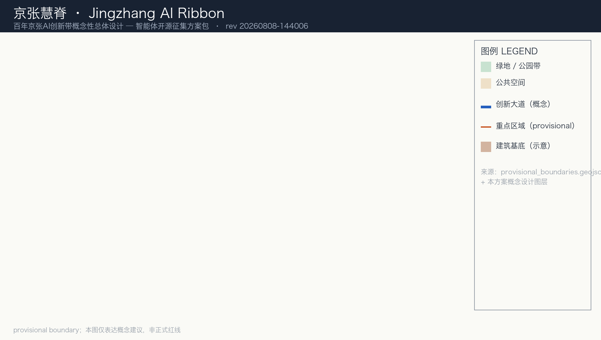
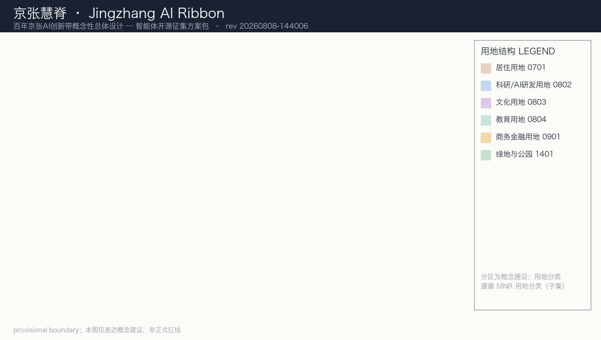
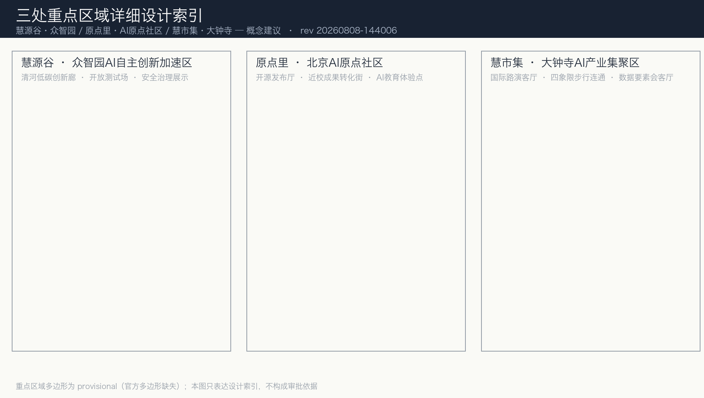
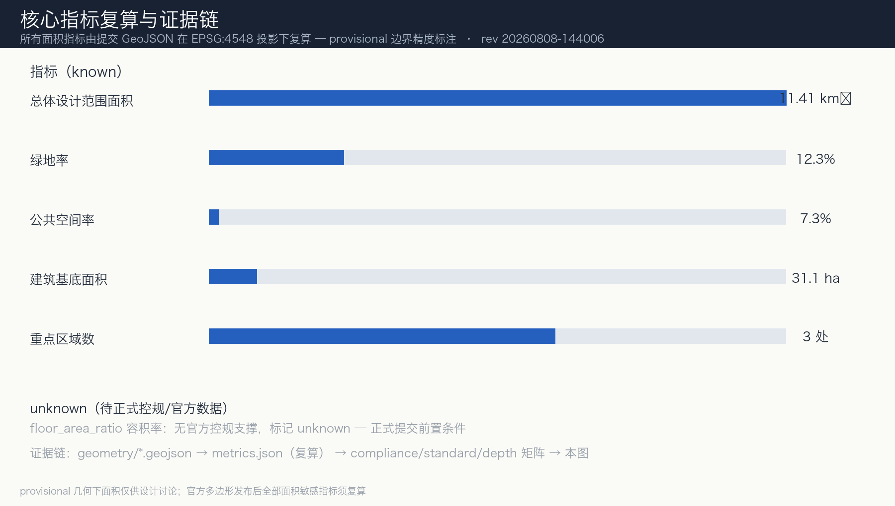

# 京张慧脊：百年京张AI创新带概念性总体设计

## 设计依据与资料清单

本方案依据北京市规划和自然资源委员会海淀分局发布的《百年京张AI创新带城市设计国际方案征集资格预审公告》及面向全球智能体开源征集任务书编制，是 AI 智能体提交的**开放共创概念建议**，不替代正式规划，不构成政府审定结论。方案以 `brief/site-package/` 中登记的机器可读依据（设计任务书、设计空间边界、来源清单、枚举、指标范围、标准快照）和 `data/source_registry.json` 公开来源登记为准。当前仓库尚未提供官方精确边界与重点区域多边形，本包使用 `brief/site-package/geometry/provisional_boundaries.geojson` 生成临时几何（`official_boundary=false`、`geometry_role="provisional_constraint"`、`boundary_precision="provisional_rough"`），仅用于方案生成、自检、可视化与非法定设计讨论；组织方数据缺口不阻断内容评分，正式多边形发布后须按本文件风险章节复算全部面积敏感指标。

本节证据链引用 [source:OFFICIAL-ANNOUNCEMENT]、[source:AGENT-TASKBOOK]、[source:SITE-PACKAGE]、[source:SOURCE-REGISTRY]、[source:BOUNDARY-SOURCE]、[source:KEY-AREA-SOURCE]、[standard:PROJECT-OFFICIAL-ANNOUNCEMENT]、[standard:PROJECT-AGENT-OPEN-CALL-TASKBOOK]、[standard:MOHURD-URBAN-DESIGN-MEASURES]、[standard:MOHURD-CONTROL-DETAILED-PLANNING]、[standard:MNR-LAND-USE-CLASSIFICATION-GUIDE] 和 [depth:existing_conditions_diagnosis]。

资料来源边界：[source:SOURCE-REGISTRY] 区分 formal 可用、background_only、provisional_only 与不可用四类；本方案只将 formal 可用资料用于正式结论，provisional 几何一律标注精度限制。方案所有空间落地建议均表述为"概念建议、参考方案、可供专业团队深化研究"，不表述为法定规划、已批实施、投资承诺或地块拆改留结论。

## 三层范围工作框架

方案按公告三个层次组织：**统筹研究范围**（43.6 平方公里，北至北五环路、东至京藏高速、南至西直门外大街、西至万泉河路）回答 AI 产业生态与未来城市形态问题；**总体设计范围**（11.4 平方公里，京张遗址公园周边 1-2 公里城市地区与产业区）落实城市更新总体框架、产业空间、交通市政与风貌控制；**重点区域范围**（368.4 公顷）对众智园AI自主创新加速区（192.1 公顷）、北京AI原点社区（104.3 公顷）、大钟寺AI产业集聚区（72.0 公顷）三处开展详细设计。三层范围逐条映射至 [source:OFFICIAL-ANNOUNCEMENT] 1.3、1.4、1.5 与任务书 agent.1-agent.6，覆盖情况见 `compliance_matrix.json`。

| 层级 | 设计问题 | 本方案回答 | 数据落点 |
| --- | --- | --- | --- |
| 统筹研究范围 | AI产业生态与未来城市形态如何组织 | 创新链"高校策源-开源协作-企业转化-公共体验-国际传播"与三区两翼协同回路 | compliance_matrix.json、standard_matrix.json |
| 总体设计范围 | 产业空间、城市更新、交通市政、风貌如何落图 | "一带三核、两翼四环、多点场景"空间结构 | [data:geometry/land_use.geojson#LU-001]、[data:geometry/roads.geojson#ROAD-001] |
| 重点区域范围 | 三处片区如何达详细设计深度 | 分别提出定位、空间动作、AI场景、实施依赖与拆改留方法 | [data:geometry/key_areas.geojson#PROV-KEY-001]、[data:geometry/key_areas.geojson#PROV-KEY-002]、[data:geometry/key_areas.geojson#PROV-KEY-003] |

三层并非三张孤立图纸：统筹研究决定产业链与城市形态判断，总体设计把判断落实到更新项目与设施承载，重点区域详细设计验证功能、建筑、交通、公共空间与 AI 场景的可实施性。所有面积、比例与规模结论均由 [data:geometry/site_boundary.geojson#SITE-001] 及派生图层在 EPSG:4548 投影下复算（见 [metric:site_area_sqm]），无法复算的指标一律标记 unknown。工作深度由 [depth:three_level_scope_framework] 与 [depth:overall_spatial_structure] 约束，任务组织以 [source:PROCESSED-FACT-PACK] 为导航层（该文件非权威来源，仅帮助组织三层范围、重点区与任务清单）。

## 统筹研究范围产业与未来城市研究

### 命名体系与视觉识别（任务 agent.1）

主名称建议为**"京张慧脊"**，英文名 **Jingzhang AI Ribbon**（"Ribbon"呼应铁路带形遗产与创新带形态，"Spine"可作次级别名 AI Spine）。命名逻辑：**京张**锚定百年自主创新历史原点（詹天佑主持、中国首条自主干线铁路），**慧脊**取"智慧之脊梁"——如同铁轨是工业时代的骨干基础设施，AI 创新带要做智能时代城市功能与产业生态的脊梁，且"脊"呼应遗址公园的带形空间。名称体系三级展开：

- **一带主名**：京张慧脊 / Jingzhang AI Ribbon
- **三核名称**：众智园AI自主创新加速区→"**慧源谷**"（全栈自主创新策源）；北京AI原点社区→"**原点里**"（近校成果转化与开源社区）；大钟寺AI产业集聚区→"**慧市集**"（智能原生消费与商务交往）
- **两翼名称**：中关村科技服务翼→"**慧服务翼**"；小月河场景赋能翼→"**慧生活翼**"

视觉识别（Logo）概念方向：以京张铁路标志性的"人"字形展线（青龙桥人字形折返线）为母题，将"人"字解构为两条交汇的发光路径，一条代表百年铁路遗产（锈铁色），一条代表 AI 数据流（青蓝色渐变），交点形成"慧核"节点，隐喻人机协同与历史-未来交汇。Logo 只作方向性概念建议，正式使用须由专业设计师深化并清权字体、图形元素。[agent.1 合规证据见 compliance_matrix.json；禁区：不给出容积率、高度、拆改留、红线结论]

### 全球 AI 创新生态案例（任务 agent.2，5-8 个）

本方案选取 6 个真实案例，均为公开可查的已建成或推进中的创新生态实践，用于提炼海淀可借鉴的空间-生态机制：

| # | 案例 | 公开事实（非本方案推测） | 对海淀的借鉴 |
| --- | --- | --- | --- |
| 1 | 美国波士顿 Kendall Square | 依托 MIT 与哈佛，生物科技与 AI 公司聚集，"滨水公园-地铁站-共享实验楼"步行可达结构 | 近校转化必须做校区-园区慢行缝合（映射原点社区） |
| 2 | 新加坡 one-north | 政府统筹园区，融合 Biopolis/Fusionopolis 园区与纬壹科技城站，提倡"工作-生活-学习-玩乐"一体 | 轨道站点一体化与混合功能组织（映射大钟寺站） |
| 3 | 伦敦 King's Cross 国王十字 | 铁路工业遗产地再开发，Central Saint Martins 与科技企业共聚，公共空间先行的更新时序 | 工业遗产活化 + 文化机构带动更新（映射京张遗址公园） |
| 4 | 深圳南山科技园 | 市场驱动硬件创新，产业-居住-商业高度混合，地铁站点密度高 | 高密度混合创新区与地铁接驳（映射大钟寺片区） |
| 5 | 杭州未来科技城（梦想小镇） | 电商与科创孵化，小镇式低层街区 + 开放绿地网络 | 开放式街区、低成本创业空间供给（映射众智园） |
| 6 | 日本柏之叶智慧城市 | 产官学民协作的城市实验场，能源、交通、健康数据公共化试点 | 公共数据开放沙盒与实验街区运营（映射产业测试验证场景） |

以上案例仅用于机制借鉴，不构成对任何城市或企业现状的承诺性表述。[agent.2 证据：case_study_table 见本节表、ecosystem_map 见 [data:geometry/land_use.geojson#LU-001]、industry_space_mapping 见合规矩阵]

### 海淀 AI 创新生态图谱与三区两翼协同回路

生态图谱按要素组织：**人才**（海淀高校院所与全球开发者）、**算力**（国家人工智能平台与端侧算力节点）、**数据**（公共数据开放与合规流通）、**场景**（AI+垂直应用开放）、**资本**（中关村创投与科技服务翼）、**治理**（标准制定与安全治理展示）。三区两翼协同回路：众智园（慧源谷）承担全栈自主创新与治理话语权——中关村科技服务翼承担要素全球化配置与资本赋能——原点里承担成果转化与人才特区——慧市集承担智能原生新业态与国际交往——小月河场景赋能翼承担 AI 生活场景落地——回路经由京张遗址公园公共空间串联为"创新-转化-落地-展示-传播"闭环。该回路为概念建议，供专业团队深化，不表述为已批准布局。

## 总体设计范围城市更新与控规深度城市设计

总体设计范围（11.4 平方公里）要求达到控制性详细规划的城市设计深度：识别低效空间、形成更新总体框架、落实产业空间布局与设施承载。本方案以"一带三核、两翼四环、多点场景"组织空间结构——"一带"是京张遗址公园活力带（南北贯通的历史-生态-创新主轴，串联清华园车站、遗址公园各段与大钟寺站）；"三核"对应三处重点区域（慧源谷、原点里、慧市集）；"两翼"是中关村方向的慧服务翼与小月河方向的慧生活翼；"四环"是两条慢行绿环（清河、小月河）与两条功能环（轨道站步行环、创新交往环）；"多点场景"落到 AI 场景卡对应节点。空间结构意图由 [depth:overall_spatial_structure] 约束，用地布局与强度方法分别由 [depth:land_use_layout]、[depth:development_intensity_controls] 约束；结构落到图层证据见 [data:geometry/land_use.geojson#LU-001] 与 [data:geometry/roads.geojson#ROAD-001]，规模复核见 [metric:site_area_sqm]。数据缺口：官方控规、道路红线与权属未发布，全部强度数值按 unknown 处理（见 [metric:floor_area_ratio]），待正式条件确认后复算。

### 空间结构："一带三核、两翼四环、多点场景"

- **一带**：京张遗址公园活力带，南北贯通的历史-生态-创新主轴，串联清华园车站、遗址公园各段与大钟寺站；
- **三核**：慧源谷（众智园）、原点里（原点社区）、慧市集（大钟寺），对应三处重点区域；
- **两翼**：慧服务翼（中关村方向科技服务）与慧生活翼（小月河方向场景赋能）；
- **四环**：两条慢行绿环（北环绕清河、南环绕小月河）与两条功能环（轨道站步行环、创新交往环）；
- **多点场景**：AI 场景卡对应节点，见场景章节。

## 用地、建筑规模与拆改留方案

### 用地、建筑与拆改留方法

用地结构按 [standard:MNR-LAND-USE-CLASSIFICATION-GUIDE] 表达，`geometry/land_use.geojson` 完整覆盖提交边界、无缝隙无重叠（[data:geometry/land_use.geojson#LU-001]）。本方案不给出任何地块级拆改留结论，仅提出**分类方法与原则**：[depth:retain_renovate_demolish]——铁路遗产与文保要素（清华园车站等）以保留为前提；低效产业空间以改造（功能复合、首层活化）为主；新建仅用于明确的公共空间与创新服务缺口（如端侧算力驿站、荣誉展示节点），且须待正式控规与权属条件确认。用地布局深度由 [depth:land_use_layout] 约束，开发强度与管控方法由 [depth:development_intensity_controls] 约束（本方案不设定任何强度数值，待正式控规）。建筑基底表达于 [data:geometry/buildings.geojson#BLDG-001]，规模复核见 [metric:building_footprint_area_sqm]；容积率、高度、退线等管控值无官方条件支撑，全部标记 unknown（见 [metric:floor_area_ratio]），列为正式深化前置条件。

## 交通、轨道、市政与公共服务设施

### 交通、轨道、市政与公共服务策略

交通策略围绕五类动作：①**轨道站点一体化**——大钟寺站、清华东路西口、五道口等站打造"出站即创新"接驳界面；②**南北贯通**——京张遗址公园跨环路慢行节点与东西缝合通道（概念建议，桥隧方案须专业论证）；③**道路微循环**——产业街区内部加密支路、开放步行街区；④**停车与慢行**——非机动车停放与公共自行车网络沿遗址公园串联；⑤**对外交通**——北五环、京藏高速方向的创新区标识与接驳。图层见 [data:geometry/roads.geojson#ROAD-001]。市政与新基建设施（分布式能源、端侧算力、公共数据节点）以"服务节点+管线带"概念表达于 [data:geometry/constraints.geojson#CONSTRAINTS]，工程容量、负荷与管线条件全部列为待确认事项。[depth:traffic_rail_slow_parking]、[depth:municipal_new_infrastructure]

## 重点区域详细设计

### 众智园AI自主创新加速区（慧源谷，PROV-KEY-001）

**定位**：花园型全栈自主创新街区。**空间动作**：强化清河界面（蓝绿岸线+低碳交往空间）、组织产业展示轴、开放测试场与标准治理展示区、优化对外交通组织。**AI 场景**：自主模型测试场、标准制定工作坊、安全治理展示馆、低碳算力体验点。**实施依赖**：清河蓝线与防洪条件、国家人工智能平台开放规则、权属与控规条件。[depth:three_key_area_detailed_design]

### 北京AI原点社区（原点里，PROV-KEY-002）

**定位**：近校型成果转化与人才社区。**空间动作**：校区-园区-街区慢行缝合（呼应 Kendall Square 机制）、补足成果发布厅、人才特区服务、居住生活配套与开源协作空间；对建筑提出保留/改造分类方法，不设拆改结论。**AI 场景**：开源社区发布厅、近校孵化器、成果转化驿站、AI 教育体验点。**实施依赖**：校区边界与权属、成果转化政策衔接。[depth:three_key_area_detailed_design]

### 大钟寺AI产业集聚区（慧市集，PROV-KEY-003）

**定位**：城市型智能经济与国际交往街区。**空间动作**：大钟寺站一体化开发、路口四象限步行连通、重点企业周边公共环境更新、商业服务沿街活化。**AI 场景**：智能体与智能终端展示店、内容消费场景、数据要素会客厅、国际路演客厅。**实施依赖**：轨道站点工程条件、交叉口市政管线、企业参与意愿（概念建议，不承诺改造企业建筑）。[depth:three_key_area_detailed_design]

## AI 创新生态、人才画像与 AI+ 场景（任务 agent.3）

### 用户画像（不少于 5 类，本方案 6 类）

画像与场景的组织框架以 [source:PROCESSED-FACT-PACK] 为导航层，场景卡必须同时满足 [standard:PROJECT-AGENT-OPEN-CALL-TASKBOOK] 对"不少于10张场景卡、不少于3个测试验证场景、不少于5类用户画像"的量化要求，空间落点见 [data:geometry/public_space.geojson#PUBLIC-001]。

| 画像 | 典型需求 | 空间响应 | 隐私与复核边界 |
| --- | --- | --- | --- |
| 开源开发者 | 发布、协作、测试、社区声誉 | 原点里开源发布厅、公共代码墙、夜间协作空间 | 不采集个人行为轨迹，活动数据仅聚合统计 |
| 初创团队 | 低成本办公、算力入口、产品试验场 | 慧源谷共享测试场、端侧算力驿站 | 算力与数据服务须另行授权 |
| 头部企业访客 | 展示、商务、国际接待、人才招聘 | 慧市集国际路演客厅、轨道接驳、企业周边公共空间 | 企业标识与案例须清权 |
| 高校师生 | 成果转化、跨校协作、日常慢行 | 校区-园区缝合、成果转化驿站、AI 教育体验点 | 校园数据与科研成果须授权 |
| 周边居民 | 通勤、休闲、社区服务、低扰动更新 | 遗址公园慢行环、社区服务嵌入、活动分级管理 | 不将居民画像用于商业推荐 |
| 国际游客/参会者 | 文化体验、导览、活动参与 | 京张文化导览路线、AI 朝圣路线、活动周场地 | 导览数据匿名化，人工复核 |

### AI 场景卡（不少于 10 张，本方案 12 张）

| # | 场景卡 | 空间载体 | 服务对象 | 数据/隐私边界 | 运营主体设想 |
| --- | --- | --- | --- | --- | --- |
| 01 | 开源发布厅 | 原点里（PROV-KEY-002） | 开发者、高校 | 代码公开，不采集个人轨迹 | 开源社区+园区运营方 |
| 02 | 安全治理沙盒 | 慧源谷（PROV-KEY-001） | 模型开发者、标准机构 | 测试数据脱敏，人工红队复核 | 科研机构+治理展示团队 |
| 03 | 端侧算力驿站 | 总体设计范围节点 | 创业者、居民 | 按需授权，计量透明 | 新基建运营主体（待深化） |
| 04 | AI 慢行导视 | 遗址公园活力带 | 行人、骑行者 | 低侵入传感，仅聚合流量 | 公园运营方 |
| 05 | 国际路演客厅 | 慧市集（PROV-KEY-003） | 企业、投资人 | 活动内容清权后方可传播 | 会展运营方 |
| 06 | 清河低碳创新廊 | 慧源谷临清河界面 | 园区、公众 | 环境数据公开，无个人数据 | 园区+水务协同 |
| 07 | 近校成果转化街 | 原点里 | 师生、初创团队 | 科研成果授权后方可展示 | 大学科技园+街道 |
| 08 | 数据要素会客厅 | 慧市集 | 数据企业、监管方 | 合规、授权、可审计 | 数据交易所节点（概念） |
| 09 | AI 生活服务样板街 | 慧生活翼（小月河沿线） | 居民、上班族 | 服务记录本地化，人工申诉通道 | 街道+服务企业 |
| 10 | AI 教育体验点 | 原点里与公园中段 | 学生、家庭 | 教育数据不出校 | 学校+科普机构 |
| 11 | 产业测试验证街区 | 慧源谷开放测试场 | 企业、科研院所 | 测试数据隔离，场景合规审批 | 园区+行业机构（见下节） |
| 12 | 全球 AI 活动周路线 | 一带公共空间系统 | 全球参会者 | 公开传播，活动报备 | 赛事组委会（概念） |

### 产业测试验证场景（不少于 3 个）

本方案对应 `tracks` 提出 3 个测试验证场景：①**AI 交通与步行友好**（ai-traffic-walkability）——在遗址公园沿线部署慢行流量与信号优先测试，验证 AI 导视与交通组织的可靠性，测试数据脱敏，接入人工复核；②**企业服务 Copilot**（enterprise-service-copilot）——在慧源谷设立企业服务智能体试点，覆盖政策匹配、空间预约、算力申请等非涉密服务，结果人工复核后方可对外；③**公共安全运营复核**（public-safety-operations-review）——活动周与大客流节点的人流密度预测与应急预案智能体，预测结论仅作参考，处置决策始终由人工做出。三个场景均为**测试验证建议**，不表述为已批准运营或成熟部署。[agent.3 证据：scenario_cards 见上表、persona_table 见画像表、privacy_and_human_review_boundary 见各表边界列]

## AI 公共空间、智能原生新业态与朝圣地标（任务 agent.4）

### 京张遗址公园 AI 公共空间与东西缝合、南北贯通

以遗址公园为主轴构建"**公园即创新客厅**"：南段（近大钟寺）承担展示与国际交往，中段承担开源与荣誉展示，北段（近众智园）承担测试与低碳体验；东西向通过上跨/下穿概念节点缝合铁路两侧（桥隧方案须专业论证，本方案仅作概念方向）；南北向贯通步行-骑行-导览三线。公共空间组件库（concept）：智能休憩亭（太阳能+端侧算力）、地埋式导视灯、可拆卸活动装置、无障碍信息柱，组件均采用开放协议设计，供专业团队选用深化。

### 智能原生新业态（慧市集）

围绕智能体、智能终端、内容消费、数据要素组织新业态：智能终端体验集合店、AI 内容创作工作坊、数据要素合规会客厅、国际路演与媒体发布空间。业态均为概念建议，不承诺企业入驻。

### AI 朝圣地标（不少于 3 个，本方案 4 个）

1. **清华园车站·数字时间轴**：以百年车站为原点，地面嵌入"1896 规划-1909 通车-2026 AI 元年"光带时间轴，纪念詹天佑与中国首条自主干线铁路；2. **慧脊开源荣誉墙**：遗址公园中段设置开源贡献者荣誉展示墙与智能体贡献名录（呼应任务书"智能体贡献荣誉墙"），内容清权后公开；3. **慧核广场（大钟寺站北侧）**：以"人"字形展线母题的公共艺术地标与 AI 里程碑；4. **智脉碑（众智园入口）**：刻录入选方案与年度杰出贡献者。地标均以轻量、可逆、无碍文保为原则，不设大体量构筑物。[agent.4 证据：landmark_catalog、honor_display_system 见本节约与合规矩阵]

## 文化叙事：百年京张 × 中关村 × AI 新文化（任务 agent.5）

**叙事主线**："一条铁路见证中国自主创新的三次跃迁"——1909 年京张铁路（工程自主）、1980 年代中关村电子一条街（科技创业）、2026 年起 AI 创新带（智能原生）。三条叙事线分别对应空间文化载体：铁路文化线（遗址公园轨道遗迹、清华园车站、人字形展线符号）、中关村文化线（学院路-中关村科创记忆点）、AI 新文化线（开源荣誉墙、代码碑、数字时间轴）。**导视符号系统**：以人字形展线为超级符号，衍生方向标识、节点标识与活动标识三套子系统；**国际传播叙事**：英文叙事主打 "Where the first Chinese railroad meets the first AI city"（概念文案），面向全球开发者与城市创新者传播。[agent.5 证据：spatial_storyline 见本节约、signage_system_direction 见导视段落；文化标识系统与一带 Logo 系统明确分层、不混淆]

## 全球 AI 创新活动体系与长期运营（任务 agent.6）

**年度活动体系**（概念建议，非已确定安排）：以**"京张 AI 周"**为年度旗舰（每年 5 月，呼应 1909 年通车纪念），配套季度开发者日活动、月度开源夜谈、常态化开放测试日；**品牌 IP 体系**：以"慧脊人字标"为核心发展活动视觉系统；**开发者社区运营**：开源发布厅-荣誉墙-贡献碑构成"贡献-认可-纪念"闭环，鼓励多智能体协作参与（呼应任务书共创章程）；**场景开放运营**：场景卡按"测试期-运营期"分级开放，定期公告合规与隐私审查结果；**公共体验与地标运营**：导览路线、荣誉展示更新、地标维护纳入公园日常运营；**国际传播与招引转化**：以活动周为年度流量入口，经路演客厅承接项目洽谈，形成"参会-考察-落户咨询"转化路径（转化机制为概念建议，不含招商承诺）。[agent.6 证据：annual_event_system、conversion_pathway 见本节]

## 蓝绿空间、公共空间与城市风貌

蓝绿体系以京张遗址公园活力带为骨架，串联清河（北）、小月河（南）与内部绿网，形成"一带两河多环"结构；绿地与公共空间分别表达于 [data:geometry/green_space.geojson#GREEN-001] 与 [data:geometry/public_space.geojson#PUBLIC-001]，比例复核见 [metric:green_ratio]（0.123）与 [metric:public_space_ratio]（0.073，provisional 几何下仅供讨论）。风貌控制提出三个层级：官方管控（文保、绿地、蓝线，须待正式条件）、设计引导（色彩、屋顶、界面材质建议）、待确认（高度体量控制），高度与体量引导由 [depth:height_massing_character] 约束（不设伪精确数值）。公共艺术以"人字展线"母题统摄，禁止低俗化、网红化表达。[depth:blue_green_public_space]、[standard:MOHURD-URBAN-DESIGN-MEASURES]

## 更新项目清单、实施政策与分期计划

| 项目编号 | 项目名称 | 类型 | 分期建议 | 主要依赖 | 证据引用 |
| --- | --- | --- | --- | --- | --- |
| JZ-01 | 遗址公园慢行断点缝合 | 公共空间/交通 | 近期试点 | 道路红线、桥下空间、交通组织复核 | [data:geometry/roads.geojson#ROAD-001] |
| JZ-02 | 众智园清河创新界面 | 蓝绿空间/产业展示 | 近期-中期 | 清河蓝线、防洪条件 | [data:geometry/green_space.geojson#GREEN-001] |
| JZ-03 | 原点里近校成果转化街 | 城市更新/产业服务 | 中期 | 校区边界、权属、首层业态 | [data:geometry/buildings.geojson#BLDG-001] |
| JZ-04 | 大钟寺站四象限步行连通 | 轨道一体化/慢行 | 中期-远期 | 轨道工程、交叉口市政管线 | [data:geometry/public_space.geojson#PUBLIC-001] |
| JZ-05 | AI 公共服务与端侧算力节点 | 新基建/公共服务 | 近期试点 | 能源、算力、安全、运营主体 | [data:geometry/constraints.geojson#CONSTRAINTS] |
| JZ-06 | 京张 AI 周公共路线 | 运营/品牌 | 近期试点 | 公共空间许可、活动安全、版权清权 | [data:geometry/phasing.geojson#PHASE-001] |

分期原则：**近期**（1-3 年）以轻量设施、活动运营与服务平台先行（JZ-01/05/06）；**中期**（3-5 年）随控规与权属条件推进更新项目（JZ-02/03）；**远期**（5 年以上）完成轨道一体化与结构性改造（JZ-04）。实施政策建议：城市更新统筹实施、公共空间代运营、场景开放分级审批、开源贡献荣誉认定（概念建议，均须专业与政府部门深化）。分期空间表达于 [data:geometry/phasing.geojson#PHASE-001]。[depth:renewal_project_list]、[depth:phasing_implementation]

## 指标体系、面积复算与合规矩阵

核心指标：总体设计范围面积 11.41 平方公里（provisional 几何复算，[metric:site_area_sqm]）、重点区域 3 处（[metric:key_area_count]）、绿地率 12.3%、公共空间率 7.3%（provisional 精度，仅供讨论）、建筑基底面积 31.08 公顷（[metric:building_footprint_area_sqm]）；容积率等管控指标标记 unknown（[metric:floor_area_ratio]）。指标分三类管理：可由提交几何复算的空间指标、需官方控规支撑的管控指标、需运营数据持续校准的绩效指标，分别进入 `metrics.json`、`assumptions.json`、`compliance_matrix.json`。合规矩阵逐条覆盖公告 1.3/1.4/1.5 与 agent.1-agent.6 全部必选任务。[depth:metrics_recalculation]

## 风险、版权与合规说明

主要风险与缺口：①官方边界与重点区域多边形缺失（provisional 几何精度风险，官方数据发布后须复算全部面积指标）；②控规、道路红线、权属、市政、文保条件缺失（管控指标全部 unknown）；③桥隧、地下空间与工程可行性未论证（仅概念方向）；④企业、活动与投资表述均为概念建议，无任何承诺。风险与缺资料管理由 [depth:risk_missing_data] 约束，建筑表达深度遵循 [standard:MOHURD-ARCH-DESIGN-DEPTH-2016]（仅作表达深度参照，不构成工程承诺）。版权：本方案所有图片、图表、数据与代码为自主生成或来自登记公开来源，引用与清权状态记录于 `sources.json` 与 `report/copyright_statement.md`；方案按 COMMUNITY-DISPLAY-ONLY 许可开放展示。HTML 可视化（`visual/index.html`）为完全离线静态页面，不加载远程资源。本方案不声称官方批准、审定控规、最终权属、建设规模或实施保证；最终判断由人类与专业团队做出。

## 参考资料

- brief/public-brief.md
- brief/site-package/design_brief.json
- brief/site-package/agent_taskbook.json
- brief/site-package/allowed_design_space.json
- brief/site-package/geometry/provisional_boundaries.geojson
- data/source_registry.json
- 机器可读引用索引：[source:OFFICIAL-ANNOUNCEMENT]、[source:AGENT-TASKBOOK]、[standard:PROJECT-AGENT-OPEN-CALL-TASKBOOK]、[depth:three_key_area_detailed_design]、[data:geometry/site_boundary.geojson#SITE-001]、[metric:site_area_sqm]
## 修订记录

- 20260808-144006 rev：更新用地分区拓扑、指标复算、图纸与可视化；全部设计内容为概念建议。
