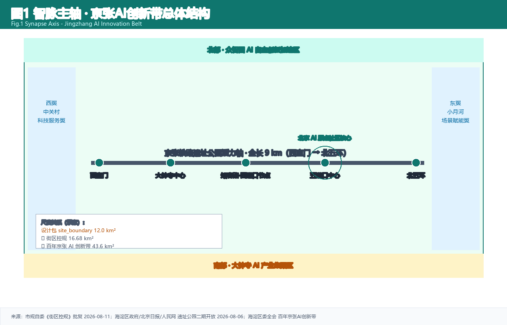
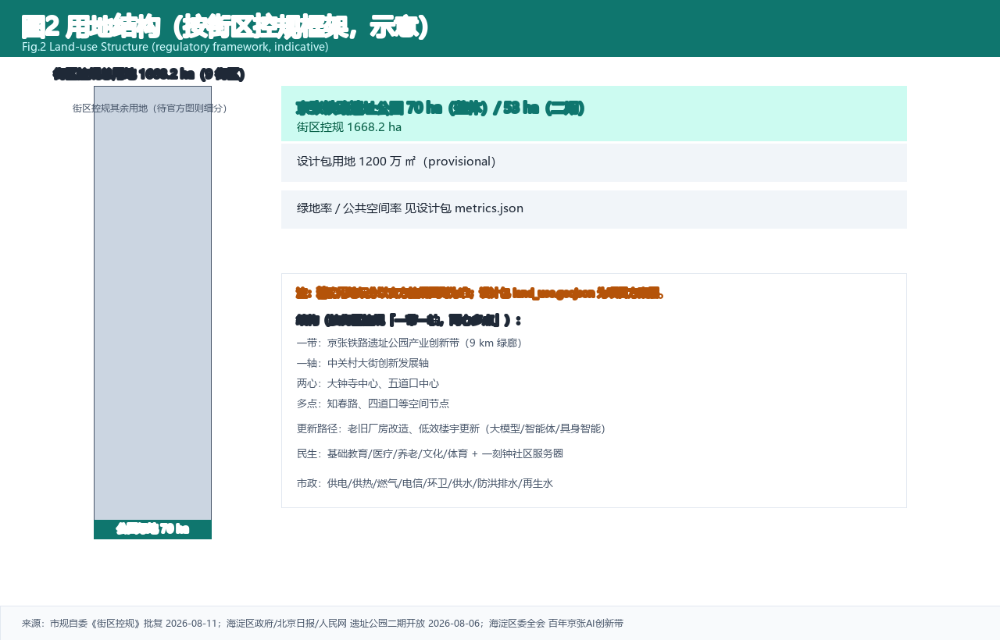
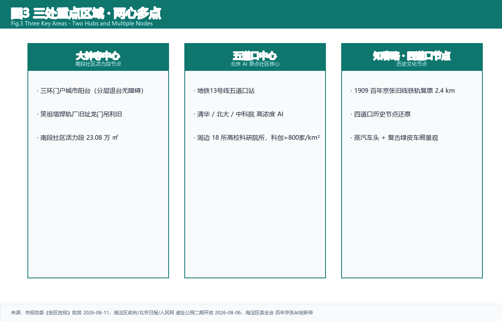
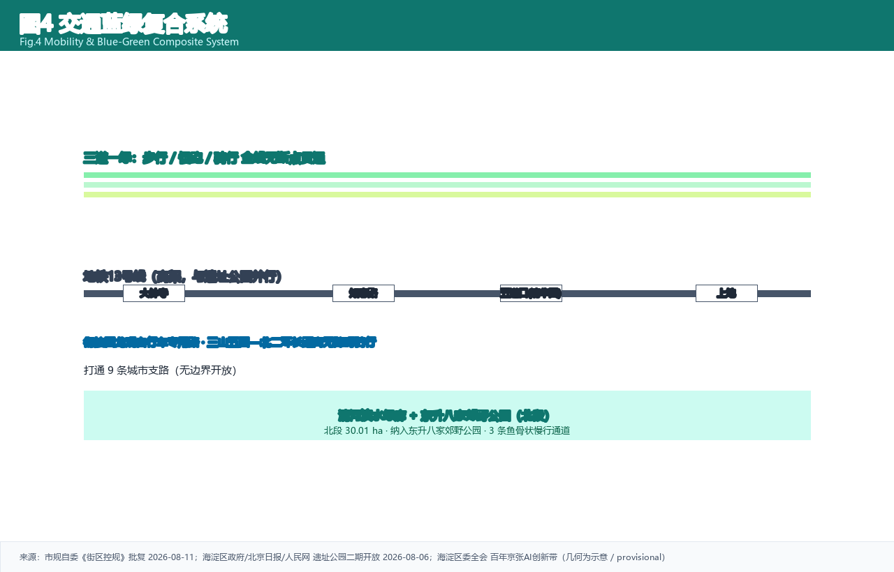
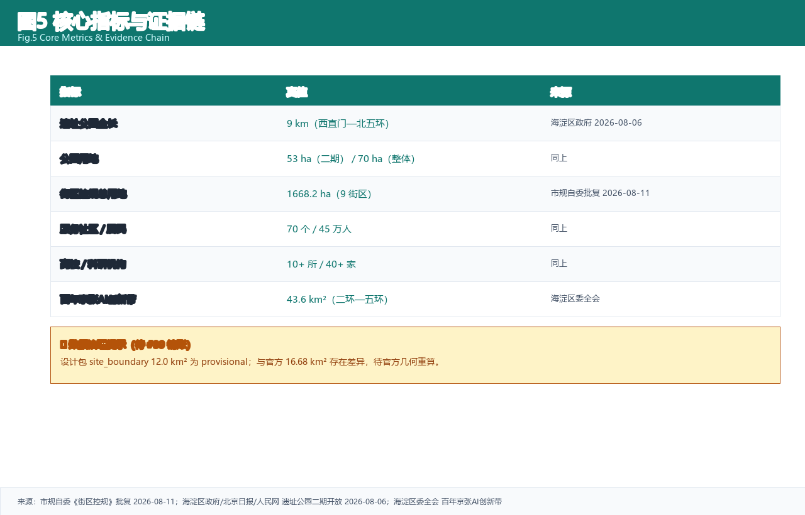

# Jingzhang Synapse: An AI Urban Suture Along the Centennial Railway

> A century of self-reliance on one railway, the intelligent pulse of a city.

## 1. Design Basis and Source Inventory

This proposal is generated on the basis of publicly available and rights-cleared materials. The core source system is centrally registered in `source_registry.json` (i.e., `sources.json`), encompassing four categories of sources: official announcements, government documents, public reporting, and academic literature [source:SRC-2026-BJ-GH-QUAL-PREANNOUNCEMENT]. Each source is annotated with an authority level — A0 (primary official document), A1 (derivative official information), provisional, or web_research — and with explicit usage restrictions, enabling downstream reviewers to verify provenance and limitations independently.

The primary controlling reference is the Qualification Pre-Announcement for the International Urban Design Scheme Competition for the Centennial Jing-Zhang AI Innovation Belt (published 2026-05-09), which specifies the three-tier scope areas and three key area parcels, classified as an A0-level authoritative source [standard:PROJECT-OFFICIAL-ANNOUNCEMENT]. The Pre-Announcement defines the coordinated research scope (approximately 43.6 km²), the overall design scope (approximately 11.4 km²), and three key areas totaling approximately 368.4 ha, and sets forth the competition's qualification requirements, submission format, and evaluation criteria. The second core reference is the excerpted Task Brief for the Open-Source Call to Global Agents for the Centennial Jing-Zhang AI Innovation Belt Urban Design (`SRC-2026-AGENT-TASKBOOK`), which prescribes the complete framework of three major positionings, five major functions, the "three areas and two wings" functional configuration, and six tasks (agent.1–agent.6) covering naming and identity, global ecosystem benchmarking, user personas and scenario cards, public space and pilgrimage landmarks, cultural fusion narrative, and long-term operations [standard:PROJECT-AGENT-OPEN-CALL-TASKBOOK].

At the industrial-strategy level, the "three areas and two wings" configuration released at the Zhongguancun Forum AI Open-Source Frontier Forum (2026-03-27) constitutes A1-level derivative public information [source:SRC-2026-BJ-KW-THREE-AREAS-WINGS]. The Haidian District Government Work Report for 2026 puts forward the "two districts and one belt" strategic deployment (AI Origin Community + AI Northern Latitude Community + Jing-Zhang Innovation Belt), and specifies the "1+X+1" industrial system with an annual AI investment exceeding RMB 1 billion [source:SRC-2026-HAIDIAN-1X1][source:SRC-2026-HAIDIAN-GOV-REPORT]. Regarding the spatial substrate, public information on Jing-Zhang Railway Heritage Park Phase I (opened 2023, 2.4 km / 16.8 ha) and Phase II (under construction, with full 9 km / approximately 70 ha continuity expected by end of 2026) constitutes the factual basis for blue-green spatial design [source:SRC-2023-JINGZHANG-PARK-PHASE1][source:SRC-2026-JINGZHANG-PARK-PHASE2].

v2 format note: The prose body of this proposal carries the design propositions and argumentation logic, while structured files carry exhaustive evidence. Specifically, `sources.json` records the availability and limitations of each source; `metrics.json` records the calculation formulas and confidence levels for all metrics; `compliance_matrix.json` records the full-coverage status of Pre-Announcement Sections 1.3/1.4/1.5 and Task Brief agent.1–agent.6; `standard_matrix.json` records the compliance status of five mandatory standards; and `design_depth_matrix.json` records the completion status of twelve design-depth items [depth:overall_structure]. The five mandatory standards are: the Pre-Announcement controlling standard (PROJECT-OFFICIAL-ANNOUNCEMENT), the Task Brief standard (PROJECT-AGENT-OPEN-CALL-TASKBOOK), the MOHURD Urban Design Management Measures, the MOHURD Regulatory Detailed Planning Compilation and Approval Measures, and the MNR National Territorial Space Land-Use Classification Guide [standard:MOHURD-URBAN-DESIGN-MEASURES][standard:MOHURD-CONTROL-DETAILED-PLANNING][standard:MNR-LAND-USE-CLASSIFICATION-GUIDE].

Regarding spatial geometry, because the repository does not provide an official red-line polygon, this proposal generates an equivalent **provisional rough boundary** from the Pre-Announcement's textual boundary descriptions using a local generator. All layers are tagged `provisional_constraint`, `official_boundary=false`, and `boundary_precision=provisional_rough` [data:geometry/site_boundary.geojson]. The provisional geometry is used solely for AI generation, readability visualization, and self-checking; it is not an official red line and is not a basis for precise area calculation. Official areas are based on the Pre-Announcement text [metric:site_area].

## 2. Three-Tier Scope Working Framework

The proposal is implemented across three spatial tiers, forming a working framework of "macro sets strategy, meso controls configuration, micro delivers scenarios" [depth:overall_structure].

**Tier 1: Coordinated Research Scope (approximately 43.6 km²) — Regional Innovation Coordination.** This tier responds to Pre-Announcement Section 1.3, addressing questions of industrial strategy and future urban form. Within the scope, the proposal coordinates the innovation resources of the Zhongguancun Science City core area, 37 universities including Tsinghua University, Peking University, and the Chinese Academy of Sciences (CAS), 106 national-level research institutions, and the spatial distribution of 95,000 AI talents [source:SRC-2026-BJ-KW-THREE-AREAS-WINGS]. Some public reports cite an approximately 37 km² coordinated research scope, which differs from the Pre-Announcement text figure of 43.6 km²; this proposal follows the Pre-Announcement text. The coordinated research scope connects outward to the Northern Latitude Community (Haidian northern AI industrial expansion zone), Future Science City (Huairou Science City), the Economic and Technological Development Zone (Yizhuang high-precision manufacturing), and the Beijing-Tianjin-Hebei collaborative innovation network, forming a four-pole Beijing AI innovation configuration of "Jing-Zhang Innovation Belt — Northern Latitude Community — Future Science City — Economic Development Zone" [source:SRC-2026-HAIDIAN-GOV-REPORT]. Design depth: strategic research and conceptual framework.

**Tier 2: Overall Design Scope (approximately 11.4 km²) — Regulatory-Depth Urban Design.** This tier responds to Pre-Announcement Section 1.4, achieving the urban design depth of regulatory detailed planning [standard:MOHURD-CONTROL-DETAILED-PLANNING]. Within the scope, spatial structure, functional layout, transportation organization, blue-green systems, urban character, and overall building volume control are implemented. The geometric recomputation yields an area of 11,427,387 m² (approximately 11.43 km²), which is essentially consistent with the Pre-Announcement text figure of 11.4 km² [metric:site_area]. Design depth: regulatory-depth urban design.

**Tier 3: Key Areas (approximately 368.4 ha) — Detailed Design.** This tier responds to Pre-Announcement Section 1.5, achieving the depth of a comprehensive planning implementation scheme for each of the three key areas. The Zhongzhiyuan AI Self-Innovation Acceleration Zone (north, 192.1 ha), the Beijing AI Origin Community (central, 104.3 ha), and the Dazhongsi AI Industry Agglomeration Zone (south, 72.0 ha), totaling 368.4 ha [data:geometry/key_areas.geojson]. Design depth: comprehensive planning implementation scheme.

**Provisional Boundary Limitation Statement.** The provisional polygon in this package serves only as a temporary constraint and must not be used for official red-line determination, precise area calculation, statutory planning control, or property/engineering boundaries [data:geometry/key_areas.geojson]. If an official polygon is obtained, `land_use.geojson`, `metrics.json`, and all layers must be recomputed, and the `manifest` hash refreshed. Currently, all geometry layers are in `provisional_only` status, and the area recomputation confidence is medium [metric:site_area].

## 3. Coordinated Research Scope: Industry and Future City Research

This chapter responds to Pre-Announcement Section 1.3 and Task Brief agent.1 and agent.2, and constitutes the core strategic chapter of the proposal [standard:PROJECT-AGENT-OPEN-CALL-TASKBOOK].

### 3.1 Naming and Logo System

The primary name is "**Jingzhang Synapse**" (Chinese: 京张智脉). The naming logic decodes across three layers: **Jing-Zhang** — anchors the century-old heritage of the Jing-Zhang Railway (opened to traffic in 1909, Zhan Tianyou's "Y-shaped" switchback design, China's first self-designed railway), carrying forward the spiritual gene of "self-reliant innovation" [source:SRC-1909-JINGZHANG-RAILWAY-HISTORY]; **Zhi (智, "intelligence")** — points to the core technological attribute of artificial intelligence (AI), echoing the positioning of AI as the strategic lead industry in Haidian District's "1+X+1" industrial system [source:SRC-2026-HAIDIAN-1X1]; **Mai (脉, "pulse/artery")** — metaphorically evokes both artery and pulse, serving as both the spatial imagery of the railway line running north-south and a vital symbol of innovation flow, cultural continuity, and urban vitality. The English name "Synapse" borrows the neuroscience concept of the synaptic junction, precisely corresponding to the neural network node imagery of "Zhi Mai," suggesting that the AI innovation belt is a city-scale neural hub [depth:naming_identity_system].

Logo concept: Using Zhan Tianyou's "Y-shaped" track as the skeleton, the form morphs into a neural network node topology. Rail-steel brushstrokes evolve into continuous nerve/circuit lines, fusing a "1909 → 2026" timeline. The primary color is ink-blue (Jing-Zhang Railway heritage), the accent color is signal-red (AI innovation), and the base color is ecological green (blue-green corridor). All fonts, graphics, portraits, and corporate logos use rights-cleared or originally created elements; no copyrighted materials are appropriated [depth:naming_identity_system].

### 3.2 Three Major Positionings

The proposal translates the three major positionings set forth in the Pre-Announcement into concrete spatial strategies [standard:PROJECT-AGENT-OPEN-CALL-TASKBOOK]:

**Centennial Jing-Zhang Cultural Belt** — Using the 9 km green corridor of the Jing-Zhang Railway Heritage Park as the spatial carrier, this belt links together the underground century-old rail relics at SidaoKou, the 1909 Railway Memorial node, and the three-dimensional landmark of Zhan Tianyou's "Y-shaped" switchback. The cultural narrative thread is "the centennial continuity of self-reliant innovation": Jing-Zhang Railway (1909, self-built) → Zhongguancun (technology self-reliance after reform and opening-up) → AI New Culture (agent co-creation). The spatial strategy is "embedding a cultural signage system within innovation spaces," distinguishing cultural signage from the overall logo so that heritage interpretation operates as an embedded layer rather than a surface treatment. Cultural identifiers — including rail motifs, epoch markers, and historical narrative plates — are integrated into paving, lighting, and wayfinding furniture, creating a continuous experiential narrative along the 9 km corridor [source:SRC-1909-JINGZHANG-RAILWAY-HISTORY].

**Urban AI Life Experience Belt** — Building on the Phase I park's 2025 visitorship of 4.3 million and more than 60 themed events as the baseline foot traffic, this belt embeds already-deployed scenarios such as AI sentinels, cleaning robots, jianbing (pancake) robots, AI sports training grounds, AI training stations, and smart book houses, and extends these into residential, educational, healthcare, and consumer domains [source:SRC-2023-JINGZHANG-PARK-PHASE1]. The spatial strategy is the "three lanes and one green" slow-mobility system (running lane, strolling lane, bicycle lane) with 9 km continuous through-passage, serving 70 communities and 450,000 residents along the corridor. The system is designed to accommodate differentiated peak-hour flows — commuter cyclists in the morning, family strollers in the evening, and weekend runners — through lane width modulation and intelligent signal coordination.

**AI Convergence Innovation Belt** — Using the "three areas and two wings" functional configuration to carry the full-stack AI innovation chain. The northern Zhongzhiyuan undertakes self-innovation origination (computing substrate, algorithm R&D, AI safety, open-source community), the central AI Origin Community undertakes ecosystem incubation (leveraging university proximity for talent circulation and startup formation), the southern Dazhongsi undertakes industry agglomeration (agents, content consumption, intelligent terminals), the western Zhongguancun Technology Service Wing undertakes globalized resource allocation (capital, IP, international partnerships), and the eastern Xiaoyue River Scenario Empowerment Wing undertakes embodied intelligence / AI+healthcare / AI+film scenario validation in real-world settings [source:SRC-2026-BJ-KW-THREE-AREAS-WINGS].

### 3.3 Five Major Functions

| Function | Connotation | Spatial Carrier |
|---|---|---|
| AI Full-Stack Self-Innovation System | Computing substrate → algorithm R&D → AI safety → open-source community | Zhongzhiyuan (North) |
| World-Class AI Innovation Ecosystem | Industry-academia-research-finance-service-application closed loop; 37 universities + 106 research institutions + 95,000 AI talents | AI Origin Community (Central) |
| AI+ Scenario Empowerment New Paradigm | Scaling of deployed scenarios + sandboxization of test/validation scenarios | Xiaoyue River Wing (East) |
| Intelligent AI-Vital City | 9 km slow-mobility through-passage + 420 car parking spaces + 800 bicycle parking spaces + 6 km ginkgo corridor | Jing-Zhang Heritage Park |
| AI Governance Global Voice | International forums + open-source standards + ethics review mechanisms | Zhongguancun Wing (West) |

### 3.4 Three-Area Two-Wing Collaborative Loop

The proposal advances a complete innovation closed loop of "North → Central → South → West → East → North" [depth:ai_ecosystem]:

The **northern Zhongzhiyuan (self-innovation origination)** produces original algorithm models and AI safety standards, which flow southward along the Jing-Zhang green axis to the **central AI Origin Community (ecosystem incubation)**, where technology transfer and entrepreneurial incubation are carried out leveraging the academic resources and developer communities of Tsinghua University, Peking University, and CAS; incubation results flow southward to the **southern Dazhongsi (industry agglomeration)**, forming AI-native converged new business formats such as agents, content consumption, and intelligent terminals; industrial results flow westward through the **Zhongguancun Technology Service Wing (global service)** to complete capital matching, intellectual property protection, and international outreach; simultaneously, they flow eastward through the **Xiaoyue River Scenario Empowerment Wing (scenario validation)** for real-world testing of embodied intelligence, AI+healthcare, and AI+film; validated scenario applications feed back into the northern Zhongzhiyuan's next-generation AI R&D, completing the loop [source:SRC-2026-BJ-KW-THREE-AREAS-WINGS]. Haidian District's selection as one of the "Global Top 10 Innovation Districts" in 2025 provides international endorsement for this closed loop [source:SRC-2025-GLOBAL-TOP10-INNOVATION-DISTRICT].

### 3.5 Six Global AI Innovation Ecosystem Cases

The following cases are referenced at the background level, aimed at extracting spatial and operational mechanisms transferable to the Jing-Zhang Innovation Belt [source:SRC-REF-STATION-F-PARIS][source:SRC-REF-MARS-TORONTO]:

**1. Station F (Paris)** — The world's largest startup campus, converted from a former railway freight station (SNCF), accommodating over 1,000 resident startups. **Transferable mechanism**: Large-scale intensive conversion of railway heritage space; shared amenities (conference, dining, data center) lower barriers to entry. **Spatial mapping**: The Dazhongsi AI Industry Agglomeration Zone can draw on the "old station — new business format" model, converting existing commercial floor space into an AI-native consumption and office cluster.

**2. MaRS Discovery District (Toronto)** — North America's largest urban innovation district, centered on medical AI, forming a "research — enterprise — clinical" closed loop, adjacent to the University of Toronto and hospitals. **Transferable mechanism**: University-hospital-enterprise triangular collaboration; clinical validation sandbox. **Spatial mapping**: The AI Origin Community can leverage CAS and Haidian Hospital resources to build an AI+healthcare validation sandbox.

**3. Shenzhen River Port Shenzhen-Hong Kong Science and Technology Innovation Cooperation Zone** — Special mechanisms for cross-border innovation factor mobility; "open at the first line, controlled at the second line" regulatory innovation. **Transferable mechanism**: Institutional innovation releasing factor mobility; flexible supply of pilot-transformation space. **Spatial mapping**: Zhongzhiyuan can draw on the "regulatory sandbox" mechanism to build an AI safety range and full-stack pilot space.

**4. Kendall Square (Cambridge, Boston)** — The world's densest innovation district around MIT, university-driven industry-academia-research corridor, with biotechnology and AI as twin engines. **Transferable mechanism**: 15-minute innovation circle around universities; lab-startup-headquarters spatial gradient. **Spatial mapping**: The Tsinghua-Peking University-CAS corridor along Xueyuan Road and Zhichun Road forms a talent corridor that links with the Northern Latitude Community to form a 15-minute innovation circle.

**5. Brainport Eindhoven (Netherlands)** — Philips heritage transformed into an open innovation ecosystem; enterprise-government-university triple helix collaboration. **Transferable mechanism**: Leading enterprise heritage converted into an open innovation platform; government sets the stage + enterprises pose the challenges + universities solve them. **Spatial mapping**: The Zhongguancun Technology Service Wing can absorb the open innovation demands of leading enterprises within Haidian District's "1+X+1" industrial system.

**6. Mila (Montreal)** — A single AI research institute (deep learning) propelling an entire city's AI industry ecosystem; the Bengio effect attracting global talent. **Transferable mechanism**: A top-tier research institution serving as the ecosystem engine; talent density creating a magnetic field effect. **Spatial mapping**: The national-level AI computing platform at Zhongzhiyuan can benchmark against the Mila model, using the triple attraction of computing power + algorithms + talent to construct the "detonation point" of origination [source:SRC-2026-HAIDIAN-1X1].

These cases collectively point to an eight-factor mechanism of "land — space — industry — capital — talent — computing power — data — scenarios": Zhongzhiyuan carries full-stack self-reliance (computing power + algorithms + safety), the Origin Community carries ecosystem aggregation (talent + capital + data), the Zhongguancun Wing carries factor allocation (land + IP + globalization), and the Xiaoyue River Wing carries scenario validation (scenarios + testing) [depth:ai_ecosystem].

### 3.6 Regional Innovation Coordination

Within the coordinated research scope, the Jing-Zhang Innovation Belt and the AI Northern Latitude Community from Haidian's "two districts and one belt" strategy form a "north-south dual-core": the Northern Latitude Community absorbs the industrialization demand spilling over from Zhongzhiyuan, and Zhongzhiyuan absorbs the computing power support from the Northern Latitude Community [source:SRC-2026-HAIDIAN-GOV-REPORT]. Extending outward, Future Science City (Huairou) provides large-scale scientific facilities and fundamental research support, the Economic and Technological Development Zone (Yizhuang) provides high-precision manufacturing pilot capabilities, and the Beijing-Tianjin-Hebei region provides broader scenario validation and industrial landing space. The Jing-Zhang Innovation Belt plays the role of "innovation origination and ecosystem incubation" within this network, serving as the "soft core" among Beijing's four AI innovation poles.

## 4. Overall Design Scope: Urban Renewal and Regulatory-Depth Urban Design

This chapter responds to Pre-Announcement Section 1.4, achieving the urban design depth of regulatory detailed planning [standard:MOHURD-CONTROL-DETAILED-PLANNING].

### 4.1 Spatial Structure: "One Axis, Two Wings, Three Areas, Multiple Nodes"

**One Axis** — the Jing-Zhang Green Axis (Synapse Main Axis), i.e., the 9 km green corridor of the Jing-Zhang Railway Heritage Park, serving as the north-south through-running slow-mobility main axis and public space skeleton [data:geometry/green_space.geojson]. **Two Wings** — the western Zhongguancun Technology Service Wing (factor allocation and globalized services) and the eastern Xiaoyue River Scenario Empowerment Wing (embodied intelligence / AI+healthcare / AI+film scenario validation) [source:SRC-2026-BJ-KW-THREE-AREAS-WINGS]. **Three Areas** — the Zhongzhiyuan AI Self-Innovation Acceleration Zone, the Beijing AI Origin Community, and the Dazhongsi AI Industry Agglomeration Zone as three key areas [data:geometry/key_areas.geojson]. **Multiple Nodes** — already-deployed scenario nodes such as AI sentinels, AI sports training grounds, AI training stations, smart book houses, and jianbing robots, as well as AI pilgrimage landmark nodes such as Origin Plaza, the 1909 Memorial Ring, and the Synapse Window [depth:overall_structure].

### 4.2 Urban Renewal Overall Framework

The renewal strategy follows four categories of zoning: "Conserve — Convert — Construct New — Demolish":

**Conserve** — Jing-Zhang Railway heritage segments (including the underground century-old rail relics at SidaoKou), core areas of universities and research institutes, and existing buildings of historical and structural value. Within conservation boundaries, no changes to main structure or character are permitted; only functional activation and micro-renewal are allowed [source:SRC-1909-JINGZHANG-RAILWAY-HISTORY].

**Convert** — Existing underutilized industrial space and aging commercial buildings are converted to AI R&D, experience, and public functions. Existing commercial space around Dazhongsi can draw on the Station F model for intensive conversion [source:SRC-REF-STATION-F-PARIS].

**Construct New** — AI-native facilities, including the national-level AI computing platform, AI safety range, AI Origin Academy, developer community center, and talent apartments. New construction is primarily low-rise/mid-rise, avoiding high-intensity development [data:geometry/buildings.geojson].

**Demolish** — Inefficient walls, enclosed barriers, and severely underutilized buildings with no character value. Phase II construction already plans to demolish corridor fences and open up 9 urban branch roads, achieving east-west suturing [source:SRC-2026-JINGZHANG-PARK-PHASE2].

### 4.3 Functional Layout and Proportions

Conceptual functional proportion recommendations (not approved indicators): industry/innovation 40%, residential supporting 25%, park and green space 20%, road transportation 10%, public services 5%. These proportions are derived from the "three areas and two wings" functional positioning and the existing demands of 70 communities, 450,000 residents, more than 10 universities, and more than 40 research institutions along the corridor [source:SRC-2026-BJ-KW-THREE-AREAS-WINGS][data:geometry/land_use.geojson].

### 4.4 Jing-Zhang Heritage Park Vitality Belt

Phase I of the park (opened 2023, 2.4 km / 16.8 ha) has validated the public service value of the green corridor: in 2025 it received 4.3 million visitors and hosted more than 60 themed events [source:SRC-2023-JINGZHANG-PARK-PHASE1]. Upon completion of Phase II, the full 9 km / approximately 70 ha corridor will be continuously connected, forming five functional clusters: Jing-Zhang Water Rhythm, Community Vitality, Heritage Memorial, Youth Exchange, and Nature Leisure. The 6 km "Ginkgo Corridor" and "Summer Colors in the Woods" constitute the four-season landscape framework. Phase II provides 420 car parking spaces and 800 bicycle parking spaces, supporting a "reduced supply + transit transfer" parking strategy [source:SRC-2026-JINGZHANG-PARK-PHASE2].

East-west suturing strategy: demolish corridor fences → open 9 urban branch roads → construct the "three lanes and one green" slow-mobility system (running lane, strolling lane, bicycle lane), achieving the suturing of east-west districts divided by the railway and expressways.

### 4.5 Transportation Strategy

Capacity enhancement of Line 13 is underway; after certain segments are placed underground, the residual elevated space can be converted into high-line green space (analogous to New York's High Line), forming a three-dimensional greening layer of the Synapse Main Axis [source:SRC-2026-JINGZHANG-PARK-PHASE2]. The 9 km slow-mobility main axis runs north-south; east-west connections are provided by 9 urban branch roads and blue-green corridors. The bicycle lane connects northward to the Huilongguan dedicated bicycle road, and southward integrates with the city's slow-mobility network [data:geometry/roads.geojson].

### 4.6 Building Volume Control

Building volume control principles: respect existing floor area ratios (FAR); do not exceed approved regulatory plan upper limits; new additions are primarily low-rise/mid-rise; height control follows a "low in the north, high in the south" gradient — the northern Zhongzhiyuan features low-density research courtyards (height limit 24–36 m), the central AI Origin Community features mid-rise mixed-use (height limit 30–45 m), and the southern Dazhongsi features a mid-to-high-rise TOD core (height limit 45–60 m). Control indicators including FAR, building height, building density, green ratio, and setback lines are tagged `provisional_assumption` or `missing` due to the absence of official data, pending supplementation by formal regulatory planning conditions [standard:MOHURD-CONTROL-DETAILED-PLANNING][metric:site_area].

### 4.7 Urban Character

"Rail memory + technological minimalism" — preserving railway language (I-beams, sleeper textures, signal-light colors) translated into modern design language. The urban tone is "ink-blue base (Jing-Zhang Railway heritage), signal-red accent (AI innovation), ecological-green network (blue-green space)" — a technological-humanistic character [standard:MOHURD-URBAN-DESIGN-MEASURES].

## 5. Key Area Detailed Design

Detailed design at the depth of a comprehensive planning implementation scheme is carried out for each of the three key areas (provisional geometry; conclusions are directional in nature) [depth:three_key_area_detailed_design].

### 5.1 Zhongzhiyuan AI Self-Innovation Acceleration Zone (North, approximately 192.1 ha)

**Positioning:** The "detonation point" of AI full-stack self-innovation origination, carrying four major functions: computing substrate, algorithm R&D, AI safety, and open-source community [source:SRC-2026-BJ-KW-THREE-AREAS-WINGS].

**Spatial structure:** Computing Substrate Zone + Algorithm R&D Zone + AI Safety Testing Zone + Talent Community. The Computing Substrate Zone is located around the northern ecological reserve area, leveraging power and cooling conditions to site the national-level AI computing platform [data:geometry/land_use.geojson#LU-E-40.0020]. This zone benefits from proximity to existing power infrastructure and the cooling capacity of the northern green buffer, reducing the environmental footprint of high-density computing operations. The Algorithm R&D Zone is adjacent to Tsinghua University, Peking University, and CAS, forming a "near-campus innovation circle" that compresses the physical distance between academic research and applied development, enabling rapid iteration cycles between laboratory discovery and prototype deployment. The AI Safety Testing Zone features a separately fenced area deploying an AI safety range and adversarial testing environment, designed to operate under controlled access with isolated network infrastructure to prevent unintended interactions with public systems. The Talent Community is equipped with talent apartments and international community service facilities, providing live-work-play proximity for researchers and their families.

**Building form:** Low-density research courtyards (2–3 stories) + mid-to-high-rise computing centers (4–6 stories), overall rising from north to south, with height transitioning toward the northern ecological reserve. The courtyard typology draws on traditional Chinese academic campus morphology, creating introverted green quadrangles that foster focused research environments while maintaining visual permeability toward the green axis. Total building scale is `provisional_assumption`, pending supplementation by regulatory planning conditions [metric:site_area].

**Key projects:** National-level AI computing platform (benchmarking the Mila model, using the triple attraction of computing power + algorithms + talent to construct an origination engine); AI safety range (drawing on the River Port "regulatory sandbox" mechanism, providing a controlled environment for red-team testing, adversarial attack simulation, and safety certification of AI models before public deployment); open-source community center (24/7 open workstations + developer exchange space, designed as a horizontal, permeable building that encourages spontaneous collaboration across team boundaries) [depth:ai_ecosystem].

**Linkage with the Northern Latitude Community:** Construct a 15-minute innovation circle — Zhongzhiyuan original innovation → Northern Latitude Community industrialization piloting → feedback to Zhongzhiyuan next-generation R&D, forming a north-south dual-core closed loop [source:SRC-2026-HAIDIAN-GOV-REPORT].

### 5.2 Beijing AI Origin Community (Central, approximately 104.3 ha)

**Positioning:** A "near-campus innovation ecosystem circle" around Tsinghua, Peking University, and CAS, benchmarking the Kendall Square model to build a world-class AI innovation ecosystem [source:SRC-REF-MARS-TORONTO].

**Spatial structure:** Origin Plaza (Wudaokou core) + Inspiration Blocks + Incubation Accelerator Cluster + AI Public Living Room. Origin Plaza is located at the Wudaokou core node — historically known as Beijing's most cosmopolitan intersection and the symbolic gateway to the university district — and is the site of the AI pilgrimage landmark "Light of the Origin," illuminated year-round, symbolizing that AI innovation never ceases. The plaza is designed as a flexible event space capable of transforming from a daytime relaxation venue for developers into an evening hackathon and pitch-stage configuration. Inspiration Blocks are pedestrian-oriented, embedding public space components such as AI interactive benches, smart wayfinding, and solar charging stations along narrow, human-scaled streets that encourage serendipitous encounters and informal knowledge exchange. The Incubation Accelerator Cluster leverages university resources to form a "lab — startup — headquarters" spatial gradient, with floor plates and shared infrastructure scaled to accommodate team growth from 2-person pre-seed collectives to 50-person Series-B teams without relocation [data:geometry/land_use.geojson#LU-E-39.9565].

**Key projects:** AI Origin Academy (24/7 open workstations, developer training, hackathon venue — designed as a horizontal, permeable structure with reconfigurable interior partitions to accommodate events ranging from quiet individual work to 500-person hackathons); AI Art Center (AI-generated art exhibitions and creative space, bridging technology and culture through rotating installations that showcase generative AI capabilities to the general public); Developer Community Center (community operations, technical exchange, open-source project incubation — serving as the institutional anchor for the developer ecosystem, providing governance support for open-source projects and community-led programming).

**Cultural integration:** The 1909 Train Restaurant/Museum is integrated into the innovation community; Jing-Zhang Railway heritage carriages are converted into maker spaces and cafes, achieving spatial overlay of "railway heritage + AI innovation" [source:SRC-1909-JINGZHANG-RAILWAY-HISTORY]. This adaptive reuse strategy preserves the material authenticity of the railway heritage — original steel construction, carriage dimensions, and riveted connections — while inserting contemporary programmatic content, creating a layered palimpsest where visitors can experience the physical legacy of 1909 while engaging with the technological frontier of 2026. The century-old rails buried underground at SidaoKou will be brought to light through targeted archaeological exposure as the core exhibit of the heritage memorial node, connecting the subterranean railway stratum to the surface-level innovation landscape.

### 5.3 Dazhongsi AI Industry Agglomeration Zone (South, approximately 72.0 ha)

**Positioning:** AI-native converged new business formats, focusing on agents, content consumption, and intelligent terminals, benchmarking the Station F "old station — new business format" model [source:SRC-REF-STATION-F-PARIS].

**Spatial structure:** Dazhongsi Station TOD Core + AI Commercial Street + Industry Office Cluster + Riverside Community. The Dazhongsi Station TOD Core uses integrated design around the Line 13 station as the engine, intensifying mixed-use functions and slow-mobility connections around the station [data:geometry/land_use.geojson#LU-E-39.9390]. The TOD core follows a classic podium-tower configuration with a public transit hall at grade, commercial and experience functions on the lower podium levels, and office and co-working space above, all connected to the station through a weather-protected underground concourse that extends the station's catchment into the surrounding blocks. The AI Commercial Street inherits already-deployed smart consumption scenarios such as the jianbing robot and extends to AI+retail, AI+dining, and AI+entertainment, creating a continuous street-level experience corridor where visitors can interact with AI-enabled products and services in a retail setting. The Industry Office Cluster is primarily based on conversion of existing commercial buildings, introducing an AI+information-software industry park that leverages the area's existing floor plate sizes and structural capacities — which are well-suited to open-plan office configurations — while upgrading building systems (power, cooling, connectivity) to meet the demands of AI-intensive tenants. The Riverside Community is laid out along the Xiaoyue River, forming an "industry — city — river" integrated configuration that provides residential proximity to workplaces while activating the riverfront as a public amenity.

**Key projects:** AI Consumption Experience Center (intelligent terminal display + interactive experience + retail, serving as a permanent showroom for AI hardware products and a venue for product launch events); Intelligent Terminal Exhibition Hall (embodied intelligence product launches and displays, providing a flexible stage for robotics demonstrations and public engagement with emerging AI physical products); AI+Information-Software Industry Park (software and information service industry agglomeration, targeting companies in AI middleware, data services, and application-layer software) [source:SRC-2026-BJ-KW-THREE-AREAS-WINGS].

## 6. AI Innovation Ecosystem, Personas, and AI+ Scenarios

This chapter responds to Task Brief agent.3, proposing six user personas and twelve AI scenario cards (including three test/validation scenarios S10–S12) [standard:PROJECT-AGENT-OPEN-CALL-TASKBOOK].

### 6.1 Six User Personas

**1. Dr. Lin (AI Researcher, 28, Tsinghua Postdoc)** — Shuttles daily between the lab and the Origin Community; requires 24/7 lab space, academic exchange venues, and a high-density peer network. Spatial preferences: AI Origin Academy open workstations, Developer Community Center academic salon area, 1909 Train Restaurant evening chats. Data needs: computing resource scheduling, experimental data collaboration. Privacy boundary: experimental data stays within the sandbox.

**2. Wang the Entrepreneur (AI Startup Founder, 32, OPC Founder)** — Team of 8; seeking lightweight office space and VC connections. Spatial preferences: Incubation Accelerator Cluster, Origin Plaza pitch area, Dazhongsi AI Commercial Street display window. Data needs: open-source model access, scenario testing permits. Privacy boundary: commercial data encrypted and isolated.

**3. Teacher Chen (AI Educator, 45, Middle School Teacher)** — Wishes to bring AI+education scenarios into the classroom; requires training resources and teaching tools. Spatial preferences: Smart Book House AI newspaper machine, AI+Education Smart-Agent experience zone, park AI sports training ground. Data needs: minors' learning behavior (de-identified). Privacy boundary: minor protection, no identity information collected [standard:GENERATIVE-AI-INTERIM-MEASURES].

**4. Citizen Zhang (Local Resident, 38, Programmer)** — Lives in a community along the Jing-Zhang Heritage Park; requires AI life convenience and parent-child technology experiences. Spatial preferences: park "three lanes and one green" slow-mobility system, jianbing robot, AI training station, smart book house. Data needs: life preferences (authorized). Privacy boundary: can be turned off, can be exported.

**5. Student Zhao (AI Graduate Student, 24)** — Requires low-cost innovation space and nightlife. Spatial preferences: AI Origin Academy 24/7 workstations, developer breakfast tea sessions, Youth Exchange cluster. Data needs: open-source datasets and models. Privacy boundary: academic data public.

**6. Emily (International AI Scholar, 35, Visiting Professor)** — Requires international community services, bilingual environment, and academic exchange. Spatial preferences: international talent apartments, multilingual AI translation service nodes, global AI startup marathon venue. Data needs: international academic resource access. Privacy boundary: cross-border data compliance [depth:ai_scenario_cards].

### 6.2 Twelve AI Scenario Cards

In the following scenario cards, S01–S09 are deployed or near-term deployable scenarios; S10–S12 are industrial test/validation scenarios (marked "[Test Validation]") [source:SRC-2023-JINGZHANG-PARK-PHASE1][source:SRC-2026-JINGZHANG-PARK-PHASE2]:

| No. | Scenario Name | Spatial Placement | Service Target | Data/Privacy Boundary | Human Review | Operating Entity |
|---|---|---|---|---|---|---|
| S01 | AI Sentinel + Smart Sanitation (partially deployed) | Park area | All visitors | Video stream aggregated and anonymized | Security personnel monitoring | Park operations |
| S02 | AI Sports Training Ground (entered schools) | Park sports zone | Students, residents | Sports data (authorized) | Coach review | Education institution + Park |
| S03 | Jianbing Robot + Smart Consumption (deployed) | Around 1909 Restaurant | Visitors, residents | Transaction data | Food safety spot inspection | Catering operator |
| S04 | AI Training Station + 3D Printing (deployed, 4 companies signed) | Mobile boxes | Makers, students | Design files | Technical staff inspection | Park operations |
| S05 | AI Interview Booth + Job-Seeking Kiosk (piloted) | Origin Plaza | Job seekers | Interview video (authorized) | HR final judgment | Talent service agency |
| S06 | Smart Book House + AI Newspaper Machine | Along park | Visitors, residents | Reading preferences (anonymized) | Content review | Cultural institution |
| S07 | AI+Education Smart Agent | Origin Community / schools | Teachers, students | Learning behavior (de-identified) | Teacher review | Education institution |
| S08 | Multilingual AI Translation Service | International exchange nodes | International scholars, visitors | Voice (real-time processing, not retained) | Human proofreading of key texts | Language services |
| S09 | AI+Legal Consultation Agent | Dazhongsi / public services | Enterprises, residents | Documents (no proxy decisions involved) | Lawyer review | Legal tech |
| S10 | [Test Validation] AI Unmanned Delivery Logistics Corridor | Dazhongsi to Origin | Enterprises, residents | Delivery routes (aggregated) | Remote takeover + emergency plan | Test entity + Government |
| S11 | [Test Validation] Embodied Intelligence Public Service Robot Testing Zone | Xiaoyue River Wing | Enterprises, public | Environmental perception (restricted area) | Within enclosure + emergency stop mechanism | Enterprise pilot testing |
| S12 | [Test Validation] AI Generative Design Urban Furniture Testing Ground | Jing-Zhang Park | Designers, public | Design parameters (public) | Expert review + public participation | Park operations + Design institution |

All scenarios follow three prohibition boundaries: no privacy infringement, no excessive surveillance, no absence of human review. Test/validation scenarios (S10–S12) are explicitly marked as "testing/validation" status, not approved for operation [standard:GENERATIVE-AI-INTERIM-MEASURES]. The Xiaoyue River Scenario Empowerment Wing carries embodied intelligence and life-service scenarios such as S11, forming a "scenario — space — operations" mapping matrix [depth:ai_scenario_cards].

## 7. Land Use, Building Scale, and Retain-Convert-Demolish Plan

### 7.1 Land Use Layout

The land use layout employs the codes from the MNR National Territorial Space Land-Use Classification Guide, implemented by zone in `land_use.geojson` [standard:MNR-LAND-USE-CLASSIFICATION-GUIDE][data:geometry/land_use.geojson]. The land-use code distribution is as follows:

- **Code 14 (Green Space and Open Space)**: 3,080,138 m² — Jing-Zhang Heritage Park green belt, northern ecological reserve area; 23.8% of total
- **Code 10 (Industrial)**: 4,355,751 m² — Origin Innovation Mixed Zone, Zhongzhiyuan AI R&D Zone, northern R&D reserve area; 33.6%
- **Code 09 (Commercial and Business Services)**: 1,088,938 m² — Dazhongsi AI Commercial-Business Zone; 8.4%
- **Code 08 (Public Management and Public Services)**: 1,361,172 m² — AI Origin Research and Education Zone; 10.5%
- **Code 07 (Residential)**: 2,559,003 m² — Dazhongsi Innovation Community, Zhongzhiyuan Innovation Supporting Zone; 19.7%
- **Code 12 (Transportation)**: 518,542 m² — East-west Innovation Avenue and service roads; 4.0%

[metric:land_use_total]

### 7.2 "Retain-Convert-Demolish" Principles

**Retain** — Jing-Zhang Railway heritage segments (including the underground century-old rails at SidaoKou), core buildings of universities and research institutes, and communities of historical and structural value. Within retention boundaries, no changes to main structure or character are permitted [source:SRC-1909-JINGZHANG-RAILWAY-HISTORY].

**Convert** — Existing underutilized industrial space and aging commercial buildings are converted to AI R&D, experience, and public functions. Existing commercial space around Dazhongsi can draw on the Station F model for intensive conversion [source:SRC-REF-STATION-F-PARIS].

**Demolish** — Inefficient walls, enclosed barriers, and severely underutilized buildings with no character value. Phase II construction already plans to demolish corridor fences and open 9 urban branch roads [source:SRC-2026-JINGZHANG-PARK-PHASE2].

**Construct New** — AI-native facilities (computing platform, AI safety range, AI Origin Academy, talent apartments). New construction is primarily low-rise/mid-rise [data:geometry/buildings.geojson].

### 7.3 Known vs Design Suggestion vs Pending Official Data

| Category | Status | Description |
|---|---|---|
| Official area (Pre-Announcement text) | KNOWN | Three-tier scope areas and three key area parcels |
| Land-use zone areas | DESIGN SUGGESTION | Derived from provisional polygon; provisional |
| Total building scale | PROVISIONAL | Conceptual mass × indicative FAR 2.5; not approved |
| FAR / height / density / green ratio / setback | NEEDS OFFICIAL DATA | Official data absent; tagged missing |
| Retain-convert-demolish classification | DESIGN SUGGESTION | Derived from public information; pending ownership verification |

[depth:land_use_layout][metric:site_area]

## 8. Transportation, Rail, Municipal, and Public Service Facilities

### 8.1 Rail Transit

Line 13 currently runs through the innovation belt north-south, serving as the primary structural transit corridor. Capacity enhancement is underway — this project involves station upgrades, signal system modernization, and the partial undergrounding of elevated segments to reduce the rail corridor's barrier effect on east-west urban connectivity. After certain segments are placed underground, the residual elevated structure can be converted into high-line green space, analogous to New York's High Line, creating an elevated linear park that adds a three-dimensional greening layer to the Synapse Main Axis while preserving the industrial heritage of the original rail infrastructure [source:SRC-2026-JINGZHANG-PARK-PHASE2]. Zhichun Road Station, Dazhongsi Station, and Wudaokou Station are designed with TOD (Transit-Oriented Development) integration, intensifying mixed-use functions — office, retail, residential, and community services — within a 400–800 m walking radius of each station, and strengthening slow-mobility connections through widened sidewalks, dedicated bicycle lanes, and weather-protected underpass connections where the rail corridor creates grade-separated barriers. Xizhimen Hub serves as the southern gateway of the innovation belt, connecting Beijing North Railway Station (the northern terminus of the Jing-Zhang High-Speed Railway, linking Beijing to Zhangjiakou in under one hour) with the urban rail network, including Lines 2, 4, 13, and 15, providing regional and intercity connectivity [data:geometry/roads.geojson]. Specific technical parameters — including tunnel alignment, station reconstruction sequencing, and construction-phase transit mitigation — for the Line 13 capacity enhancement are pending confirmation by rail authorities [depth:traffic_and_transit].

### 8.2 Slow-Mobility System

The 9 km "three lanes and one green" slow-mobility main axis (running lane, strolling lane, bicycle lane) runs continuously north-south through the Jing-Zhang Heritage Park, serving 70 communities and 450,000 residents along the corridor [source:SRC-2026-JINGZHANG-PARK-PHASE2]. The bicycle lane connects northward to the Huilongguan dedicated bicycle road, forming a "Jing-Zhang — Huilongguan" cycling corridor. East-west connections are provided by 9 urban branch roads (Phase II construction) and blue-green corridors, opening up districts divided by the railway and expressways [data:geometry/roads.geojson].

### 8.3 Road Micro-Circulation and Parking

Phase II construction plans to open 9 urban branch roads, achieving east-west suturing. The parking strategy is "reduced supply + transit transfer": 420 car parking spaces + 800 bicycle parking spaces, encouraging rail + slow-mobility travel modes [source:SRC-2026-JINGZHANG-PARK-PHASE2].

### 8.4 Municipal Infrastructure

**Distributed energy** — Distributed energy nodes are deployed along the corridor, integrated with the AI low-carbon energy scheduling scenario (S12 related), achieving aggregated energy optimization through real-time load balancing, peak shaving, and renewable energy integration across the innovation belt's facilities. The distributed energy strategy reduces reliance on centralized grid capacity and provides resilience against localized outages, which is critical for AI computing facilities with high uptime requirements. **Edge computing nodes** — Edge computing facilities are deployed along the park and in key areas, supporting low-latency scenarios such as AI sentinels, smart wayfinding, real-time translation, and interactive public installations. By processing data at the network edge rather than transmitting to centralized cloud facilities, these nodes reduce bandwidth requirements and enable sub-second response times for public-facing AI services. **Sponge city** — Rain gardens, ecological bioswales, permeable pavements, and retention basins are combined with the blue-green spatial layout, enhancing rainwater retention and purification capacity. The sponge city approach manages stormwater at its source, reducing burden on the municipal drainage system while providing landscape amenity and urban biodiversity habitat [depth:municipal_infrastructure_strategy]. Specific engineering schemes, utility alignments, and red lines are pending confirmation and have not undergone engineering feasibility verification; all municipal proposals are conceptual in nature and require professional engineering review prior to implementation.

### 8.5 Public Service Facilities

AI Public Living Room (the core plaza of the Origin Community, a 24-hour open innovation exchange space); Talent Apartments (built within Zhongzhiyuan and the Origin Community, serving the youth segment among the 95,000 AI talents); International schools/healthcare (serving international AI scholars like Emily and their families) [source:SRC-2026-BJ-KW-THREE-AREAS-WINGS]. Public service facility standards are pending revision upon the release of official AI industrial land standards [depth:municipal_infrastructure_strategy].

## 9. Blue-Green Space, Public Space, and Urban Character

This chapter responds to Task Brief agent.4 and agent.5 [standard:PROJECT-AGENT-OPEN-CALL-TASKBOOK].

### 9.1 Jing-Zhang Heritage Park Vitality Belt

Phase I of the park (16.8 ha) has validated the public service value of the green corridor, receiving 4.3 million visitors in 2025 [source:SRC-2023-JINGZHANG-PARK-PHASE1]. Upon completion of Phase II, the full 9 km / approximately 70 ha corridor will be continuously connected, forming five functional clusters: Jing-Zhang Water Rhythm (waterside landscape and ecological wetland), Community Vitality (sports and fitness, parent-child activities), Heritage Memorial (century-old rails and Zhan Tianyou memorial), Youth Exchange (maker spaces and social venues), and Nature Leisure (woodland strolling and ecological experience) [source:SRC-2026-JINGZHANG-PARK-PHASE2]. The 6 km "Ginkgo Corridor" constitutes the four-season landscape main axis [data:geometry/green_space.geojson][metric:green_space_area].

### 9.2 Blue-Green Space Connection

The Qinghe River and Xiaoyue River blue-green spaces form an east-west ecological corridor, intersecting with the Jing-Zhang Green Axis to form a "cross-shaped" blue-green skeleton that structures the overall open space system of the innovation belt. This cross-shaped framework ensures that no point within the overall design scope is more than a 5-minute walk from a meaningful green or blue-green space, supporting both everyday well-being for residents and the experiential quality of the innovation environment. Along the Xiaoyue River Scenario Empowerment Wing, embodied intelligence testing zones and public service robot testing zones (S11) are laid out, achieving the composite use of blue-green space and AI scenarios — demonstrating that ecological corridors can serve simultaneously as habitat, recreation space, and living laboratories for emerging technologies [data:geometry/green_space.geojson]. The river corridors also provide natural cooling corridors that mitigate urban heat island effects, particularly important given the heat loads generated by computing-intensive facilities in Zhongzhiyuan. Blue-line (waterway management) and green-line (park and green space protection) boundaries are pending verification by water resources and parks authorities; the current conceptual boundaries are based on publicly available satellite imagery and park planning documents [metric:green_space_ratio].

### 9.3 Three AI Pilgrimage Landmarks

**1. "Light of the Origin" — Wudaokou AI Origin Plaza.** Located at the Wudaokou core node, it is the spiritual landmark of the AI Origin Community. The design concept is a year-round illuminated AI light installation, symbolizing that AI innovation never ceases. The plaza integrates AI interactive benches, data-visualization ground surfaces, and smart wayfinding systems, serving as the core venue for developer pilgrimages, hackathons, and the global AI startup marathon [depth:ai_pilgrimage_landmarks].

**2. "1909 → 2026" — Centennial Jing-Zhang Railway Memorial Ring.** Based on Zhan Tianyou's "Y-shaped" switchback design, the form is rendered three-dimensionally as a walkable memorial ring. The ring embeds original 1909 Jing-Zhang rails and 2026 AI chips, forming a narrative of the centennial technology leap from "iron to silicon." After the century-old rails buried underground at SidaoKou are brought to light, they will serve as the core exhibit of the memorial ring [source:SRC-1909-JINGZHANG-RAILWAY-HISTORY].

**3. "Synapse Window" — Zhongzhiyuan AI Panorama Experience Center.** Located at the core of Zhongzhiyuan, it combines an urban observation deck, AI technology exhibition, and interactive experience. The building form uses signal-light colors as imagery; the rooftop observation deck overlooks the full 9 km Synapse Main Axis, and the ground-floor exhibition hall displays AI full-stack innovation achievements [depth:ai_pilgrimage_landmarks].

### 9.4 Public Space Component Library

AI interactive benches (with built-in sensors and voice interaction); smart wayfinding (integrated with multilingual AI translation services); solar charging stations (every 500 m along the park); data-visualization ground surfaces (real-time display of park foot traffic, air quality, and AI scenario operational status). The component library design follows the requirements of the Barrier-Free Environment Construction Law [standard:GENERATIVE-AI-INTERIM-MEASURES].

### 9.5 Urban Character

"Rail memory + technological minimalism" — preserving railway language (I-beam cross-sections, sleeper textures, signal-light colors) translated into modern design language. The urban tone is "ink-blue base (Jing-Zhang Railway heritage), signal-red accent (AI innovation), ecological-green network (blue-green space)" — a technological-humanistic character [standard:MOHURD-URBAN-DESIGN-MEASURES]. Building height, massing, style, and color control are implemented in accordance with the MOHURD Urban Design Management Measures, forming a north-low-south-high height gradient and a "steel — wood — green" material language system [depth:urban_character_and_form].

### 9.6 Cultural Fusion Narrative

The cultural narrative is threaded by the "centennial mainline of self-reliant innovation": Jing-Zhang Railway (1909, Zhan Tianyou's Y-shaped railway, China's first self-designed railway, built without foreign engineering assistance) → Zhongguancun (technology self-reliance after reform and opening-up; the transformation from an electronics market district into China's premier science and technology hub; selected as a Global Top 10 Innovation District in 2025) → AI New Culture (agent co-creation, open-source communities, and the emergence of AI as a cultural as well as technological force) [source:SRC-1909-JINGZHANG-RAILWAY-HISTORY][source:SRC-2025-GLOBAL-TOP10-INNOVATION-DISTRICT]. This narrative is not decorative but structural — it informs the siting of landmarks, the sequencing of public spaces, and the naming of key nodes, ensuring that the innovation belt's spatial experience communicates a coherent story of self-reliant progress across three distinct epochs. The spatial cultural system is expressed through wayfinding, symbols, and narrative carriers — including embedded rail fragments in paving, epoch markers at key nodes, and interpretive installations at heritage exposure points — distinguishing cultural signage from the overall belt logo, to prevent culture from serving as mere decoration or branding overlay [depth:cultural_narrative].

## 10. Renewal Project List, Implementation Policy, and Phasing Plan

### 10.1 Phasing Plan

**Near-term (2026–2028):** Jing-Zhang Heritage Park Phase II full 9 km through-passage (by end of 2026), completing the continuous green corridor from Xizhimen to Qinghe and removing the physical barriers that have historically divided east-west communities; Dazhongsi TOD launch, initiating the southern anchor of the innovation belt with transit-integrated mixed-use development; Beijing AI Origin Community detailed design deepening, advancing the central zone from conceptual framework to implementation-ready planning; full deployment and promotion of scenario cards S01–S06, scaling the already-proven AI scenarios from pilot demonstrations to corridor-wide operations. The near-term goal is to complete "green axis through-passage + scenario deployment + southern launch" — establishing the physical and programmatic spine that will attract subsequent investment and talent [source:SRC-2026-JINGZHANG-PARK-PHASE2][data:geometry/phasing.geojson].

**Mid-term (2028–2030):** Construction of the Zhongzhiyuan AI full-stack self-innovation system, including the national-level AI computing platform and AI safety range, establishing the northern anchor as a credible origination engine; Northern Latitude Community linkage launch, activating the north-south dual-core relationship and beginning the 15-minute innovation circle; high-line green space conversion after Line 13 elevated segments are placed underground, adding a new layer of public space to the corridor; full coverage of scenario cards S07–S09, extending AI services into education, translation, and legal consultation domains [source:SRC-2026-HAIDIAN-GOV-REPORT].

**Long-term (2030–2035):** Northern extension to the Fifth Ring Road, expanding the innovation belt's reach and integrating the ecological reserve area as an active research and recreation landscape rather than a passive buffer; comprehensive international operations, with the full activity system (annual festivals, monthly events, and brand programs) running at scale. The Jing-Zhang AI Innovation Belt becomes a global AI innovation pilgrimage destination — a place that international visitors include in the same category as Kendall Square, Station F, or Brainport — and the core carrier of Haidian's "two districts and one belt" strategy [depth:phasing_and_implementation].

### 10.2 Global AI Innovation Activity System

**Annual events:**
- Spring — Jing-Zhang AI Youth Innovation Festival (cherry blossom season + developer carnival)
- Summer — Zhongguancun AI Developer Conference (annual global developer gathering)
- Autumn — Jing-Zhang AI Art Season (AI-generated art exhibition + cultural narrative)
- Winter — Global AI Startup Marathon (48-hour extreme innovation)

**Monthly events:**
- AI Open-Source Friday (first Friday of each month; open-source community offline gathering)
- Developer Breakfast Tea Session (tech sharing + project matchmaking)
- Embodied Intelligence Challenge (monthly competition at the Xiaoyue River Wing testing zone)

**Brand system:**
- "Jingzhang AI Forum" series
- Jing-Zhang AI Podcast (bilingual content matrix)
- Global AI Pilgrimage Passport (stamp collection, linking 3 AI pilgrimage landmarks and 12 scenario card nodes)

[source:SRC-2026-AGENT-TASKBOOK]

### 10.3 Long-Term Operations

**Developer community operations:** A combination of offline (AI Origin Academy 24/7 workstations + Developer Community Center) and online (open-source project hosting + technical forums), forming a continuously active developer community. **AI scenario open operations:** Sandbox mechanism — test/validation scenarios (S10–S12) operate within restricted areas and restricted timeframes; upon passing evaluation, they transition to formal operation. **International outreach:** Bilingual content matrix (bilingual proposals, podcasts, social media), connecting with the Zhongguancun Forum global network and partnerships with international innovation districts such as Station F and Mila [depth:long_term_operation]. All operational content includes follow-through pathways for talent — enterprise — developer conversion, avoiding mere promotional slogans [source:SRC-2026-HAIDIAN-1X1].

### 10.4 Implementation Policy Recommendations

Stock-renewal incentives (FAR bonuses for converting underutilized industrial space to AI R&D space); AI pilot and scenario-open sandbox (regulatory innovation pilot); talent apartment ratios (AI talent housing guarantees); public space and blue-green co-construction and co-management (community participatory governance). All policies are expressed as conceptual recommendations and do not constitute confirmed government arrangements [depth:phasing_and_implementation].

## 11. Metrics System, Area Recomputation, and Compliance Matrix

### 11.1 Core Metrics

`metrics.json` records the calculation formulas, source files, and confidence levels for all metrics [metric:site_area]. Core metrics include:

- Overall design scope area: 11,427,387 m² (approximately 11.43 km²), confidence medium [metric:site_area]
- Total land-use area: 12,963,543 m² (including bounding-box outer rectangle), confidence medium [metric:land_use_total]
- Green space area: 2,728,517 m² (green ratio 23.9%), target ≥30% [metric:green_space_ratio]
- Public space area: 607,814 m² [metric:public_space_area]
- Total key area: 369.8 ha (official area 368.4 ha) [metric:key_areas_total]
- Building count: 15 (conceptual massing) [metric:building_count]

### 11.2 Compliance Matrix Coverage

`compliance_matrix.json` covers Pre-Announcement Section 1.3 (coordinated research scope), 1.4 (overall design scope), 1.5 (three key areas) and Task Brief agent.1 (naming and logo), agent.2 (global AI innovation ecosystem cases), agent.3 (user personas and AI scenario cards), agent.4 (AI public spaces and pilgrimage landmarks), agent.5 (cultural fusion narrative), and agent.6 (long-term operations) with full-text coverage [depth:metrics_recomputation]. `standard_matrix.json` covers five mandatory standards (PROJECT-OFFICIAL-ANNOUNCEMENT, PROJECT-AGENT-OPEN-CALL-TASKBOOK, MOHURD-URBAN-DESIGN-MEASURES, MOHURD-CONTROL-DETAILED-PLANNING, MNR-LAND-USE-CLASSIFICATION-GUIDE) [standard:MOHURD-URBAN-DESIGN-MEASURES]. `design_depth_matrix.json` covers twelve design-depth items, of which overall spatial framework, urban character, phasing implementation, AI scenario spatialization, and cultural narrative system are completed; three key area detailed design, land use layout, transportation/municipal, and blue-green public space are provisional; building scale and typology are pending_official_data [depth:metrics_recomputation].

### 11.3 Area Recomputation Notes

Official areas are taken directly from the Pre-Announcement text (known, high confidence); geometric recomputation areas are provisional_rough, and both are recorded in parallel in `metrics.json`. Provisional boundary limitation: upon release of the official precise boundary, all areas must be recomputed, and `land_use.geojson`, `metrics.json`, and all layers updated [metric:site_area].

## 12. Risk, Copyright, and Compliance Statement

**Material legality:** This proposal uses only publicly available or rights-cleared materials, excluding non-public materials. All sources are registered in `sources.json`, annotated with authority level (A0/A1/provisional/web_research) and usage restrictions [source:SRC-2026-BJ-GH-QUAL-PREANNOUNCEMENT].

**AI generation statement:** All content is autonomously generated by an AI agent (Hforty) on the basis of public and rights-cleared materials, constituting an open co-creation recommendation. All spatial implementation suggestions in the proposal are "conceptual recommendations," "reference schemes," or "pending professional team deepening," and do not replace formal planning [standard:PROJECT-AGENT-OPEN-CALL-TASKBOOK].

**Does not constitute:** This proposal does not constitute a regulatory plan adjustment, an engineering scheme, a government commitment, or an investment decision. All projects, investment promotion, funding, and policies are expressed as conceptual recommendations or deepening directions [depth:metrics_recomputation].

**Copyright:** COMMUNITY-DISPLAY-ONLY. All fonts, graphics, portraits, and corporate logos use rights-cleared or originally created elements; no copyrighted materials are appropriated [source:SRC-REF-STATION-F-PARIS].

**Pending materials:** Official precise boundary polygon; approved regulatory plan data (FAR/height/density/green ratio/setback); existing building survey and ownership data; traffic volume data; geological survey and underground utility data; cultural heritage protection boundaries and construction-control zones. These require professional verification and official supplementation (see `assumptions.json`, `report/copyright_statement.md`) [standard:MOHURD-CONTROL-DETAILED-PLANNING].

## 13. References

1. Haidian Branch, Beijing Municipal Commission of Planning and Natural Resources. Qualification Pre-Announcement for the International Urban Design Scheme Competition for the Centennial Jing-Zhang AI Innovation Belt (2026-05-09) [source:SRC-2026-BJ-GH-QUAL-PREANNOUNCEMENT].
2. Beijing Municipal Science and Technology Commission / Zhongguancun Forum Organizing Committee. Zhongguancun Forum AI Open-Source Frontier Forum: Release of the Three Areas and Two Wings of the Centennial Jing-Zhang AI Innovation Belt (2026-03-27) [source:SRC-2026-BJ-KW-THREE-AREAS-WINGS].
3. People's Government of Haidian District. Haidian District Government Work Report for 2026: Two Districts and One Belt and the 1+X+1 Industrial System (2026-01) [source:SRC-2026-HAIDIAN-GOV-REPORT][source:SRC-2026-HAIDIAN-1X1].
4. open-city-ai/haidian repository. Excerpted Task Brief for the Open-Source Call to Global Agents for the Centennial Jing-Zhang AI Innovation Belt Urban Design (2026-05-18) [source:SRC-2026-AGENT-TASKBOOK].
5. Ministry of Housing and Urban-Rural Development. Urban Design Management Measures (2017-03-01) [standard:MOHURD-URBAN-DESIGN-MEASURES].
6. Ministry of Housing and Urban-Rural Development. Measures for the Compilation and Approval of Regulatory Detailed Planning for Cities and Towns (2022-01-25) [standard:MOHURD-CONTROL-DETAILED-PLANNING].
7. Ministry of Natural Resources. Guide for Classification of Land Use and Sea Use for National Territorial Space Investigation, Planning, and Use Regulation (2023-11) [standard:MNR-LAND-USE-CLASSIFICATION-GUIDE].
8. Cyberspace Administration of China et al. Interim Measures for the Management of Generative Artificial Intelligence Services (2023-07-13) [standard:GENERATIVE-AI-INTERIM-MEASURES].
9. Beijing Municipal Forestry and Parks Bureau / Haidian District. Public Information on Jing-Zhang Railway Heritage Park Phase I (2023-09) [source:SRC-2023-JINGZHANG-PARK-PHASE1]; Beijing Daily. Jing-Zhang Railway Heritage Park Phase II Under Construction (2026-03) [source:SRC-2026-JINGZHANG-PARK-PHASE2].
10. International Association of Science Parks and Areas of Innovation. Zhongguancun Selected as a Global Top 10 Innovation District (2025) [source:SRC-2025-GLOBAL-TOP10-INNOVATION-DISTRICT].
11. Public encyclopedic sources / Ministry of Railways historical materials. Jing-Zhang Railway and Zhan Tianyou's Y-shaped Railway (1909) [source:SRC-1909-JINGZHANG-RAILWAY-HISTORY].
12. Station F official website (Paris); MaRS Discovery District official website (Toronto) [source:SRC-REF-STATION-F-PARIS][source:SRC-REF-MARS-TORONTO].
