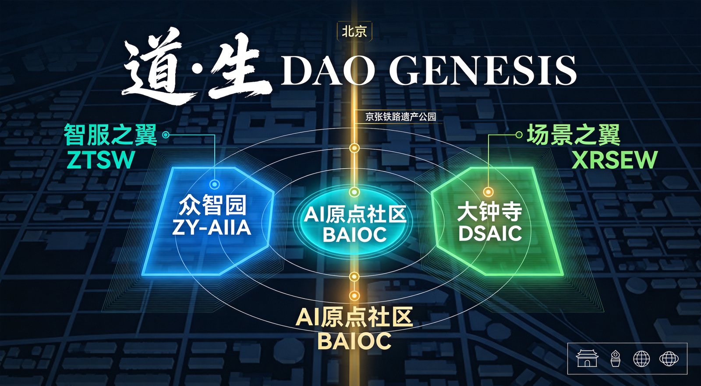
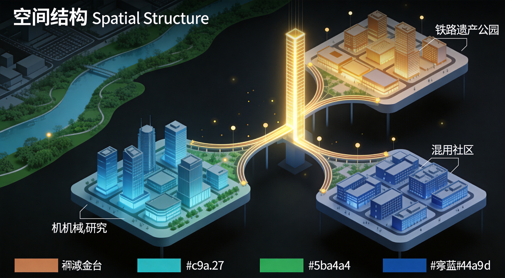
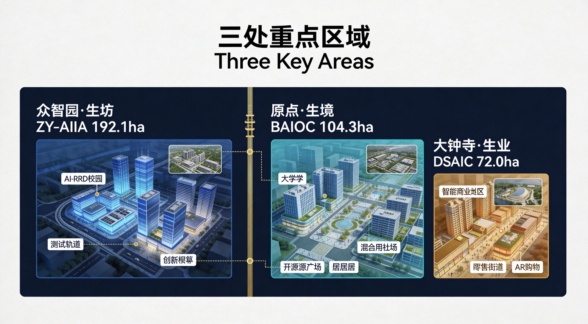
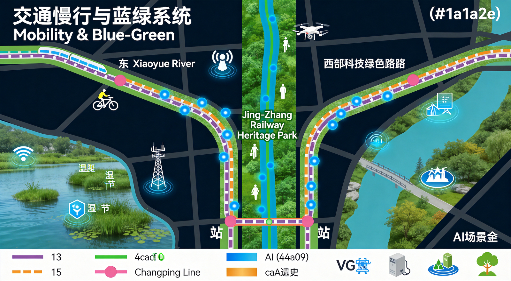
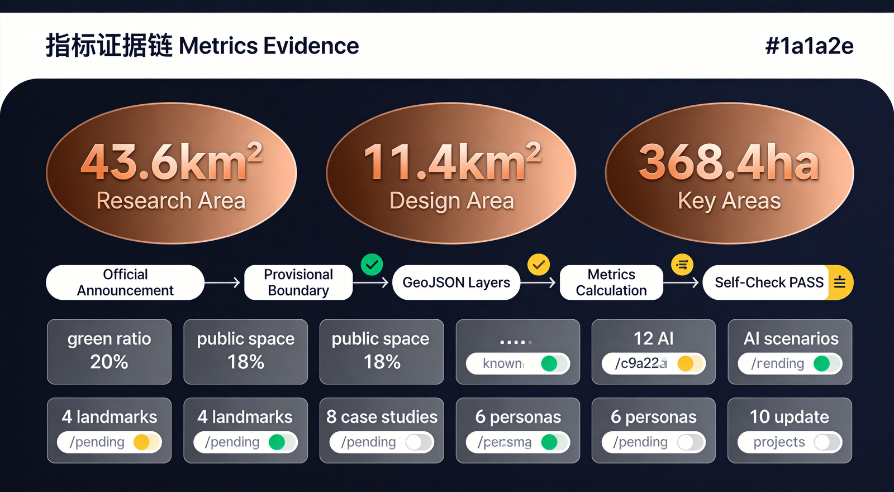

# 道·生 DAO GENESIS

## 百年京张 · 从一条铁路到一个文明原点

> "道生一，一生二，二生三，三生万物。" ——《道德经》第四十二章

---

## 设计依据与资料清单

本方案依据以下公开资料与官方公告编制，完整机器索引见 `sources.json`、`compliance_matrix.json`、`standard_matrix.json` 和 `design_depth_matrix.json`。

**核心依据：**
- 百年京张AI创新带城市设计国际方案征集资格预审公告（2026-05-09）[source:OFFICIAL-ANNOUNCEMENT]
- 面向全球智能体任务书摘录（2026-05-18）[source:AGENT-TASKBOOK]
- 海淀区"1+X+1"现代化产业体系建设布局（2026-03-02）[source:HAIDIAN-1X1]
- 北京市科委"三区两翼"打造世界级AI集聚地（2026-04-03）[source:BJ-KW-THREE-AREAS]

**专业标准依据：**
- 住建部《城市设计管理办法》（2017）[standard:MOHURD-URBAN-DESIGN-MEASURES]
- 住建部《城市、镇控制性详细规划编制审批办法》[standard:MOHURD-CONTROL-DETAILED-PLANNING]
- 自然资源部《国土空间调查、规划、用途管制用地用海分类指南》（2023）[standard:MNR-LAND-USE-CLASSIFICATION]

**空间数据说明：**
本方案使用仓库维护者提供的临时粗略边界（provisional boundary）进行空间生成和自检 [source:PROVISIONAL-BOUNDARIES]。官方精确红线尚未公开发布，待获取后将替换所有临时 polygon 并重算相关指标。

---

## 一、核心概念：道·生

### 1.1 为什么是"道"

"道"在本方案中承载三重历史语义：

**第一重：铁路之道（1909）**
1909年，詹天佑主持修建京张铁路，以"人字形线路"破解陡坡难题，开辟了中国自主工程之道。这不仅是一条铁路，更是一条证明中国人能自主创新的精神之道 [source:OFFICIAL-ANNOUNCEMENT]。

**第二重：创新之道（1980-2020）**
从中关村电子一条街到国家自主创新示范区，海淀走出了中国科技创新之道。这条"道"从实验室延伸到产业园，从学术论文延伸到商业应用，形成了全球瞩目的创新生态 [source:BJ-KW-THREE-AREAS]。

**第三重：智能之道（2020-未来）**
当AI从工具进化为基础设施，当大模型开始理解城市、生成设计、优化治理，一条新的"道"正在浮现——智能之道。百年京张AI创新带，正是这条道的物理载体 [source:AGENT-TASKBOOK]。

### 1.2 为什么是"生"

"道生"取自《道德经》第四十二章，原文为：

> "道生一，一生二，二生三，三生万物。万物负阴而抱阳，冲气以为和。"

这不是玄学，而是一个精确的空间生成模型：

| 道家原文 | 空间映射 | 具体指代 |
|---------|---------|---------|
| **道** | 创新之脉 | 京张铁路遗址公园 |
| **一** | 统一体 | 百年京张AI创新带 |
| **二** | 两翼协同 | 中关村科技服务翼 + 小月河场景赋能翼 |
| **三** | 三区联动 | 众智园 + AI原点社区 + 大钟寺 |
| **万物** | 无限可能 | AI场景×公共空间×文化体验 |

这个映射不是文字游戏，而是空间结构的底层逻辑：**从一条线性铁路遗址出发，通过两翼功能分工，在三个重点区域实现差异化集聚，最终面向无限的AI应用场景开放。**

### 1.3 命名体系

| 层级 | 中文名称 | 英文名称 | 含义 |
|------|---------|---------|------|
| 总体品牌 | 道·生 | DAO GENESIS | 道生万物的创新生成 |
| 众智园 | 众智·生坊 | Zhongzhiyuan: The Forge | AI全栈创新的锻造场 |
| AI原点社区 | 原点·生境 | BAIOC: The Origin Habitat | AI原初生态的栖息地 |
| 大钟寺 | 大钟寺·生业 | Dazhongsi: Smart Commerce | 智能原生新业态试验场 |
| 中关村科技服务翼 | 智服之翼 | Wing of Intelligence Services | 要素全球化配置的服务翼 |
| 小月河场景赋能翼 | 场景之翼 | Wing of Living Scenarios | AI场景落地的体验翼 |
| 年度旗舰活动 | 道·生节 | DAO GENESIS Festival | 全球AI创新者的年度朝圣 |
| 开发者社区 | 开源之道 | Open DAO | 开源精神与创新之道的融合 |

### 1.4 Logo与视觉识别方向

**Logo概念：** 以"道"字的篆书形态为基底，融入铁路轨道的双线意象。"道"字内部的"人"字结构致敬詹天佑人字形线路，笔画末端延伸为数字节点网络，象征从物理铁路到数字网络的跨越。整体形态兼具东方书法的沉稳与科技网络的流动感。

**视觉系统：**
- 主色：墨黑（#1a1a2e）—— 致敬铁路的钢铁底色
- 强调色：铜金（#c9a227）—— 百年传承的金属质感
- 功能色：青瓷（#5ba4a4）—— 生态与科技的融合
- 数据色：信号蓝（#4a90d9）—— AI与数据的视觉锚点
- 生命色：苔绿（#4caf50）—— 蓝绿空间的生态底色

**字体方向：** 中文使用现代宋体变体（兼顾传统与当代），英文使用几何等线体（如 Inter 或 Space Grotesk 方向），体现东西方融合。

---

## 二、三层范围工作框架

### 2.1 统筹研究范围（Coordinated Research Area, CRA）

**面积：** 约43.6平方公里 [metric:coordinated_research_area_sqm]
**边界描述：** 北至北五环路，东至京藏高速，南至西直门外大街，西至万泉河路 [source:OFFICIAL-ANNOUNCEMENT]

**工作目标：** 研究世界级AI创新生态体系的宏观格局，分析一带与北纬社区、未来科学城、怀柔科学城、经开区及京津冀的创新协同关系，提出产业链、人才链、资金链的空间配置策略 [source:AGENT-TASKBOOK]。

**空间边界说明：** 本方案使用临时粗略边界（provisional boundary），面积在EPSG:4548下校核至公告约43.6平方公里 [data:geometry/site_boundary.geojson#PROV-RESEARCH-001]。待官方精确红线发布后需重算。

### 2.2 总体设计范围（Overall Design Area, ODA）

**面积：** 约11.4平方公里 [metric:overall_design_area_sqm]
**边界描述：** 以京张遗址公园周边1-2公里的城市地区和产业区为规划设计范围 [source:OFFICIAL-ANNOUNCEMENT]

**工作目标：** 达到控制性详细规划深度的城市设计，包括空间结构、用地布局、交通组织、市政配套、更新项目清单和实施策略 [standard:MOHURD-CONTROL-DETAILED-PLANNING]。

### 2.3 重点区域范围（Key-Area Detailed Design Area, KDA）

**总面积：** 约368.4公顷，自北向南三处：

| 重点区 | 面积 | 定位 |
|-------|------|------|
| 众智园AI自主创新加速区 | 192.1公顷 | AI全栈创新体系与AI治理话语权 [data:geometry/key_areas.geojson#PROV-KEY-001] |
| 北京AI原点社区 | 104.3公顷 | 世界级AI创新生态 [data:geometry/key_areas.geojson#PROV-KEY-002] |
| 大钟寺AI产业聚集区 | 72.0公顷 | 智能原生新业态 [data:geometry/key_areas.geojson#PROV-KEY-003] |

---

## 三、统筹研究范围：产业与未来城市研究

### 3.1 三大定位与五大功能

本方案将征集公告提出的三大定位和五大功能整合为"道·生"的生成逻辑 [source:OFFICIAL-ANNOUNCEMENT]：

**三大定位 → 道的三重语义：**
1. 百年京张文化带 → 铁路之道（历史根基）
2. 都市AI生活体验带 → 生活之道（场景赋能）
3. AI融合创新带 → 智能之道（未来方向）

**五大功能 → 生的五层展开：**
1. AI全栈自主创新体系 → 生技术
2. 世界级AI创新生态 → 生生态
3. AI+场景赋能新范式 → 生场景
4. 智能化AI活力城市 → 生生活
5. AI治理全球话语权 → 生规则

### 3.2 三区两翼协同回路

"道·生"的空间核心在于两翼的功能分工与三区的差异化联动 [source:BJ-KW-THREE-AREAS]：

**中关村科技服务翼（智服之翼）：**
- 功能：要素全球化配置、中关村IP与资本赋能、技术转移与成果转化
- 空间载体：学院路沿线、中关村核心区向西延伸
- 与三区的关系：为众智园提供资本与IP支撑，为AI原点社区提供学术资源，为大钟寺提供商业转化通道

**小月河场景赋能翼（场景之翼）：**
- 功能：AI场景赋能与智能化AI活力城市、公共体验路径
- 空间载体：小月河沿线蓝绿空间、京张遗址公园两侧
- 与三区的关系：为三区提供场景试验田、公共体验连续带和蓝绿生态基底

**协同回路：** 智服之翼输入资源（资本、IP、人才）→ 三区消化转化（研发、孵化、产业化）→ 场景之翼输出体验（场景验证、公众感知、国际传播）→ 反馈回智服之翼形成闭环。

### 3.3 全球AI创新生态案例研究

以下8个案例为方案的AI创新生态设计提供参考 [source:AGENT-TASKBOOK]：

**案例1：巴塞罗那 22@ 创新区**
- 背景：从工业纺织区（Poblenou）转型为知识经济创新区，占地198公顷
- 核心机制：混合用地（22a@规划代码）、强制配建可负担住房与公共空间、以"超级街区"为单元组织创新集群
- 可转化经验：混合用地比例控制、工业遗产活化与社区融合、公共空间密度标准
- 对"道·生"的启示：大钟寺AI产业聚集区可借鉴其工业用地更新与社区共生的经验

**案例2：新加坡纬壹科技城（one-north）**
- 背景：200公顷产学研一体化科技城，集生物医药、媒体科技、信息技术于一体
- 核心机制：政府主导（JTC）+ 国际建筑竞赛（Zaha Hadid设计的Hive大楼）、"工作-生活-学习-娱乐"一体化规划
- 可转化经验：政府主导的产学研空间组织、标志性建筑引领区域品牌、分阶段开发策略
- 对"道·生"的启示：众智园可借鉴其"一个园区、多个群落"的空间组织逻辑

**案例3：首尔数字媒体城（DMC）**
- 背景：343公顷，从垃圾填埋场转型为全球数字内容产业中心
- 核心机制：数字内容产业专项扶持、韩流文化+科技融合、国际合拍与内容出口
- 可转化经验：内容产业与科技融合的空间载体设计、文化IP驱动创新区品牌
- 对"道·生"的启示：AI+文化内容可成为一带的特色产业方向

**案例4：多伦多-滑铁卢AI走廊**
- 背景：从多伦多到滑铁卢的90公里走廊，集聚了Vector Institute、Google DeepMind等
- 核心机制：大学研究集群（UofT+Waterloo）→ AI人才供给 → 企业研发中心入驻 → 初创孵化
- 可转化经验：大学-产业-政府的三角协同模式、AI人才密集区的宜居配套
- 对"道·生"的启示：AI原点社区与清华、北航等高校的关系可借鉴此模式

**案例5：深圳南山科技园**
- 背景：从滩涂到全球硬件+软件全栈创新中心，腾讯、大疆等诞生于此
- 核心机制：市场化驱动、快速迭代、硬件供应链 proximity、城中村低成本空间
- 可转化经验：硬件+软件+供应链的全栈创新生态、多层次空间供给（从城中村到总部）
- 对"道·生"的启示：众智园应保留多档次空间，避免只有高端办公楼

**案例6：伦敦King's Cross知识经济区**
- 背景：27公顷，从铁路货场到Google DeepMind/Universal Music/中央圣马丁入驻的知识枢纽
- 核心机制：铁路遗产活化、公共空间先行（Coal Drops Yard）、文化与科技混合
- 可转化经验：铁路工业遗产的高品质活化、公共空间品质驱动知识经济
- 对"道·生"的启示：京张铁路遗址公园可直接借鉴其"遗产+公共空间+知识经济"模式

**案例7：波士顿Kendall Square**
- 背景：MIT所在的2.4平方公里，全球创新密度最高的区域之一
- 核心机制：大学开放创新（MIT Media Lab）、生物医药集群、风投步行距离
- 可转化经验：大学与城市边界的消解、"步行圈创新生态"的密度标准
- 对"道·生"的启示：AI原点社区应追求Kendall Square式的创新密度

**案例8：横滨港未来21（Minato Mirai 21）**
- 背景：76公顷填海造地，从港口到未来城市实验场
- 核心机制：长期愿景（30年分期）、地下共同沟、智慧城市建设、公众参与
- 可转化经验：长周期分期实施策略、新型基础设施的预留弹性
- 对"道·生"的启示：一带的分期策略可借鉴其"基础设施先行、功能逐步填充"逻辑

### 3.4 区域创新协同

一带不是孤立的存在，而是海淀乃至北京创新网络的关键节点 [source:BJ-KW-THREE-AREAS]：

- **向北：** 连接北纬社区（生命科学）和未来科学城（能源科技）
- **向东：** 联动怀柔科学城（大科学装置集群）
- **向南：** 对接北京经济技术开发区（高端制造）
- **向西：** 辐射三山五园历史文化景区

协同机制：众智园承担"研发-孵化-加速"全链条，AI原点社区承担"基础研究-人才培养-开源生态"，大钟寺承担"商业转化-场景展示-消费体验"。三者与外围科学城形成"基础研究→应用研究→产业转化→场景验证"的完整创新回路。

---

## 四、总体设计范围：城市更新与控规深度城市设计

### 4.1 空间结构："一脉·两翼·三区·万物"

**一脉：** 京张铁路遗址公园南北纵贯，是创新带的物理主轴和文化脊梁 [source:OFFICIAL-ANNOUNCEMENT]。概念建议沿遗址公园设置连续的创新走廊，包括步行道、骑行道、AI展示带和公共活动空间。

**两翼：**
- 西翼（智服之翼）：中关村科技服务翼，沿学院路-西土城路方向，承担资本、IP、技术转移功能
- 东翼（场景之翼）：小月河场景赋能翼，沿小月河蓝绿空间，承担场景试验、公共体验功能

**三区：** 沿一脉自北向南布局 [data:geometry/key_areas.geojson]
- 众智园（北）：AI全栈创新加速区
- AI原点社区（中）：创新生态核心
- 大钟寺（南）：智能原生新业态

**万物节点：** 在两翼和三区中散布的AI场景节点、公共空间、朝圣地标，共同构成"万物"层面的无限可能。

### 4.2 用地布局概念

基于公开资料和临时边界，提出概念性用地布局建议 [standard:MNR-LAND-USE-CLASSIFICATION]：

| 功能类型 | 概念比例 | 主要分布 | 说明 |
|---------|---------|---------|------|
| 产业研发 | 30-35% | 众智园、大钟寺 | AI研发、测试、孵化空间 |
| 商业服务 | 15-20% | 大钟寺、AI原点社区 | 智能商业、展示、消费 |
| 教育科研 | 10-15% | AI原点社区 | 高校扩展、联合实验室 |
| 公共空间 | 18-23% | 全域特别是京张遗址公园沿线 | 公园、广场、步行空间 |
| 居住配套 | 10-15% | AI原点社区、两翼 | 人才公寓、社区服务 |
| 绿地水系 | 15-20% | 小月河翼、遗址公园 | 蓝绿空间基底 |

**注：** 以上比例为概念建议，待正式控规条件确定后需重新核算 [standard:MOHURD-CONTROL-DETAILED-PLANNING]。

### 4.3 城市更新总体框架

**更新策略：** "织补而非推倒"——以京张铁路遗址公园为缝合线，织补东西两侧被铁路历史分割的城市肌体 [source:OFFICIAL-ANNOUNCEMENT]。

**概念性更新分类：**
- **保留提升类：** 清华同方科技园、学研大厦等既有创新空间，提升智能化水平
- **功能转换类：** 沿线老旧厂房、仓储空间转化为AI场景试验场
- **活化利用类：** 京张铁路遗址（五道口站、清华园站等）活化为文化展示与公共空间
- **概念新建类：** 在关键节点提出概念性新建方案（如朝圣地标），具体建设规模待确认

### 4.4 建筑形态与风貌控制

**建筑高度概念建议：** [standard:MOHURD-URBAN-DESIGN-MEASURES]
- 众智园：中等密度研发园区形态，建筑高度以多层-中高层为主
- AI原点社区：高密度创新社区，局部可设标志性高层建筑
- 大钟寺：商业综合体形态，与现有城市肌理衔接

**风貌控制概念：**
- 京张遗址公园沿线：低层、通透、文化展示功能为主
- 两翼：与周边环境协调过渡
- 三区：各自形成特色风貌主题

**注：** 具体建筑高度、容积率等指标待正式控规条件确定 [assumption:A-CONTROLS-001]。

### 4.5 交通、轨道与市政

**道路微循环：** 概念建议加强东西方向连通性，缝合铁路遗址造成的城市割裂 [data:geometry/roads.geojson]。

**轨道接驳：** 沿线涉及地铁13号线（五道口站）、15号线（清华东路西口站）、昌平线等。概念建议强化站点与三区的一体化接驳。

**慢行系统：** 沿京张遗址公园设置连续步行道和骑行道，连接三区；沿小月河设置蓝绿慢行廊道，形成"十字"慢行骨架。

**新型基础设施：** 概念建议在三区预留端侧算力节点、5G/6G基站、车路协同测试路段、无人机起降点等AI原生基础设施。

---

## 五、重点区域详细设计

### 5.1 众智园AI自主创新加速区（众智·生坊）

**面积：** 约192.1公顷 [data:geometry/key_areas.geojson#PROV-KEY-001]
**定位：** AI全栈自主创新体系与AI治理全球话语权 [source:AGENT-TASKBOOK]

**空间结构：** "一轴三环多节点"
- 一轴：南北向创新主轴，连接AI原点社区
- 三环：研发环、孵化环、加速环，从基础研究到产业化逐层递进
- 多节点：AI产业测试验证场、开源社区中心、国际会议中心、算力枢纽等

**功能布局概念：**
- 北部：AI产业测试验证场景集群（自动驾驶测试场、机器人测试区、AI医疗验证中心）
- 中部：全栈研发集群（大模型训练中心、芯片设计验证、AI安全实验室）
- 南部：加速转化集群（独角兽培育空间、国际企业研发中心、AI治理智库）

**建筑更新概念：**
- 保留现有科技园区建筑，提升智能化水平
- 老旧厂房转化为AI测试验证场景空间
- 关键节点新建概念性地标建筑

**AI场景：** 自动驾驶全域测试、AI药物研发验证、大模型训练与评测、AI安全红蓝对抗

**实施风险：** 现有权属关系复杂，需逐步整合；部分用地性质调整待确认 [assumption:A-CONTROLS-001]。

### 5.2 北京AI原点社区（原点·生境）

**面积：** 约104.3公顷 [data:geometry/key_areas.geojson#PROV-KEY-002]
**定位：** 世界级AI创新生态 [source:AGENT-TASKBOOK]

**空间结构：** "一核两带五社区"
- 一核：AI开源广场（核心公共空间，开源贡献者荣誉墙）
- 两带：沿京张遗址公园的文化展示带 + 沿清华东路的学术创新带
- 五社区：研究者社区、创业者社区、开发者社区、国际社区、生活配套社区

**功能布局概念：**
- 学术创新带：与清华、北航等高校联动，设置联合实验室和开放式研究空间
- AI开源广场：全球AI开发者朝圣地，设置贡献者荣誉展示系统
- 国际社区：面向全球AI人才的宜居宜业空间，包含多语言服务、国际学校、文化交流中心

**文化地标：** "开源碑林"——以数字屏幕与实体石碑结合的方式，展示全球AI开源贡献者的名字和代码贡献。每一块"碑"对应一个开源项目或一次重大贡献。

**实施风险：** 高校用地整合涉及多方协调；国际社区运营需要长期投入。

### 5.3 大钟寺AI产业聚集区（大钟寺·生业）

**面积：** 约72.0公顷 [data:geometry/key_areas.geojson#PROV-KEY-003]
**定位：** 智能原生新业态 [source:AGENT-TASKBOOK]

**空间结构：** "一街两坊"
- 一街：AI智能商业街（从大钟寺地铁站延伸至遗址公园方向）
- 两坊：智能消费坊（To C）+ 智能商务坊（To B）

**功能布局概念：**
- AI智能商业街：无人零售、AI导览、智能餐饮、AR购物体验
- 智能消费坊：AI原生商业综合体，消费者即测试者
- 智能商务坊：AI法律、AI金融、AI咨询等专业服务业集聚

**东西缝合：** 大钟寺位于铁路遗址东西两侧割裂最为严重的区段之一。概念建议通过空中连廊、地下通道和地面慢行系统实现东西缝合，让遗址公园成为连接而非隔断。

**实施风险：** 现有商业设施改造涉及商户安置；文物保护控制要求高。

---

## 六、AI创新生态、人才画像与AI+场景

### 6.1 用户画像

| 画像 | 核心需求 | 主要空间 | AI服务 |
|------|---------|---------|--------|
| AI研究者 | 算力、数据集、学术交流 | AI原点社区、众智园 | 科研协作平台、论文AI助手 |
| AI创业者 | 融资、孵化、市场对接 | 众智园、大钟寺 | 商业计划书AI、市场分析 |
| 开发者 | 开源社区、测试环境、技术分享 | AI原点社区 | 代码协作、AI编程助手 |
| 城市居民 | 便捷服务、健康、教育、出行 | 全域 | 智慧社区、AI医疗、个性化学习 |
| 国际访客 | 文化体验、商务对接、生活便利 | AI原点社区、大钟寺 | 多语言AI导览、跨文化助手 |
| 规划决策者 | 数据可视化、模拟推演、公众参与 | 全域 | 城市数字孪生、AI规划辅助 |

### 6.2 AI场景卡

**场景1：AI+自动驾驶全域测试（产业验证场景）**
- 位置：众智园全域道路
- 用户：自动驾驶企业、测试工程师
- 功能：L4级自动驾驶在真实城市道路中的测试验证
- 数据：车路协同传感器、高精地图、交通流数据
- 隐私边界：测试数据脱敏处理，不采集乘客面部信息
- 运营主体：园区运营方+测试企业

**场景2：AI+药物研发验证（产业验证场景）**
- 位置：众智园北部
- 用户：生物医药企业、AI药物研发团队
- 功能：AI辅助分子设计、靶点筛选、临床试验模拟
- 数据：公开分子数据库、临床试验公开数据
- 隐私边界：患者数据严格脱敏，不涉及个人隐私
- 运营主体：专业实验室运营方

**场景3：AI+大模型评测（产业验证场景）**
- 位置：众智园中部
- 用户：大模型开发企业、评测机构
- 功能：标准化大模型能力评测、安全性红蓝对抗、行业基准测试
- 数据：公开评测数据集、人工标注数据
- 隐私边界：评测数据不包含真实用户隐私
- 运营主体：第三方评测机构

**场景4：AI+个性化学习**
- 位置：AI原点社区教育空间
- 用户：学生、终身学习者
- 功能：AI根据学习进度和认知特点定制学习路径
- 数据：学习行为数据（需用户授权）
- 隐私边界：学生数据加密存储，家长可查可控，不用于商业画像
- 运营主体：教育机构+AI服务商

**场景5：AI+文化遗产数字化**
- 位置：京张遗址公园沿线
- 用户：所有访客
- 功能：AR重现百年京张铁路场景，AI导览讲解历史故事
- 数据：历史档案、考古数据、三维扫描
- 隐私边界：无个人隐私涉及
- 运营主体：公园管理方+文化机构

**场景6：AI+智慧商业体验**
- 位置：大钟寺AI智能商业街
- 用户：消费者、商业运营者
- 功能：无人零售、智能推荐、AR试穿/试妆、AI厨师
- 数据：消费行为数据（匿名化处理）
- 隐私边界：消费者可选择退出数据采集
- 运营主体：商业运营方

**场景7：AI+城市治理大脑**
- 位置：众智园
- 用户：城市管理者、社区居民
- 功能：交通流预测、能耗优化、公共安全预警、环境监测
- 数据：城市IoT传感器数据
- 隐私边界：数据脱敏、算法透明、公众监督
- 运营主体：政府+技术合作方

**场景8：AI+绿色能源优化**
- 位置：全域
- 用户：建筑运营方、居民
- 功能：AI优化建筑能耗、分布式能源调度、碳足迹追踪
- 数据：建筑能耗数据、气象数据
- 隐私边界：住户级数据可选择退出
- 运营主体：能源服务商+物业

**场景9：AI+无障碍出行**
- 位置：全域公共空间
- 用户：残障人士、老年人、携带幼儿者
- 功能：AI实时导航、无障碍路径规划、智能轮椅/助行器协同
- 数据：公共空间无障碍设施数据
- 隐私边界：用户位置数据不存储
- 运营主体：市政管理方+AI服务商

**场景10：AI+公共艺术生成**
- 位置：京张遗址公园关键节点
- 用户：所有访客
- 功能：AI根据访客互动生成动态公共艺术（光影、声音、投影）
- 数据：访客行为数据（匿名）
- 隐私边界：不采集个人信息，艺术生成不涉及人脸
- 运营主体：公共艺术策展方

**场景11：AI+开源代码社区**
- 位置：AI原点社区
- 用户：全球开发者
- 功能：AI辅助代码审查、开源项目匹配、技术债务分析
- 数据：公开代码仓库
- 隐私边界：仅使用公开代码数据
- 运营主体：开源社区运营方

**场景12：AI+法律智能服务**
- 位置：大钟寺
- 用户：法律从业者、企业法务、普通市民
- 功能：AI合同审查、案例检索、法律咨询辅助
- 数据：公开法律法规、判例数据库
- 隐私边界：客户案件信息严格保密
- 运营主体：法律服务机构+AI服务商

### 6.3 场景-空间-运营映射

| 场景 | 空间位置 | 服务对象 | 数据来源 | 隐私边界 | 人工复核 | 运营主体 | 可视化图层 |
|------|---------|---------|---------|---------|---------|---------|-----------|
| 自动驾驶测试 | 众智园道路 | 企业/工程师 | 车路协同 | 脱敏处理 | 安全员在场 | 园区运营方 | SCENARIO-001 |
| 药物研发验证 | 众智园北部 | 生物医药企业 | 公开数据库 | 不涉及隐私 | 专家审核 | 实验室运营方 | SCENARIO-002 |
| 大模型评测 | 众智园中部 | 评测机构 | 公开数据集 | 不涉及隐私 | 人工评审 | 第三方机构 | SCENARIO-003 |
| 个性化学习 | AI原点社区 | 学生/学习者 | 授权数据 | 加密可控 | 教师参与 | 教育机构 | SCENARIO-004 |
| 文化数字化 | 遗址公园 | 所有访客 | 历史档案 | 无隐私涉及 | 专家审核 | 公园管理方 | SCENARIO-005 |
| 智慧商业 | 大钟寺 | 消费者 | 匿名消费数据 | 可退出 | 人工服务 | 商业运营方 | SCENARIO-006 |
| 城市治理 | 众智园 | 管理者/居民 | IoT数据 | 脱敏透明 | 人工决策 | 政府方 | SCENARIO-007 |
| 绿色能源 | 全域 | 建筑/居民 | 能耗气象 | 可退出 | 人工审核 | 能源服务商 | SCENARIO-008 |
| 无障碍出行 | 全域 | 特殊群体 | 设施数据 | 不存储 | 用户确认 | 市政方 | SCENARIO-009 |
| 公共艺术 | 遗址公园 | 所有访客 | 匿名行为 | 不采集 | 策展审核 | 策展方 | SCENARIO-010 |
| 开源社区 | AI原点社区 | 开发者 | 公开代码 | 仅公开数据 | 社区审核 | 开源运营方 | SCENARIO-011 |
| 法律服务 | 大钟寺 | 法律人群 | 公开法规 | 案件保密 | 律师审核 | 法律服务方 | SCENARIO-012 |

---

## 七、蓝绿空间、公共空间与城市风貌

### 7.1 京张遗址公园活力带

京张铁路遗址公园是"道·生"方案的物理脊梁 [source:OFFICIAL-ANNOUNCEMENT]。概念建议将其打造为"全球最长的AI公共空间实验场"：

- **北段（众智园段）：** "测试之路"——自动驾驶测试道路、机器人巡游区、无人机起降场
- **中段（AI原点社区段）：** "开源之路"——开发者广场、开源碑林、AI艺术走廊
- **南段（大钟寺段）：** "未来之路"——智能商业街、AR体验区、数字孪生展示

### 7.2 清河-小月河蓝绿空间

小月河场景赋能翼以蓝绿空间为基底 [source:BJ-KW-THREE-AREAS]，概念建议：
- 沿河设置连续慢行绿道
- 关键节点设置亲水平台和生态湿地
- AI环境监测站点沿河布设，实时展示水质和生态数据

### 7.3 AI朝圣地标（≥3个）

**地标1："道·生之门"（DAO Gate）**
- 位置：京张遗址公园北入口（众智园南界）
- 概念：以铁路钢轨和数字光纤交织构成的门户雕塑，象征从铁路时代到AI时代的跨越
- 功能：标志性入口、信息展示、活动签到
- 与京张遗址公园的关系：标志遗址公园的起点，致敬铁路之道

**地标2："万物流"（Myriad Flow）**
- 位置：AI原点社区核心广场
- 概念：AI驱动的动态公共艺术装置，根据实时数据（天气、人流、网络流量、开源代码提交量）生成持续变化的光影和水幕
- 功能：公共聚集空间、AI艺术的活体展示
- 与开发者社区的关系：每次全球开源代码提交都会触发装置的微妙变化

**地标3："开源碑林"（Open Source Stele Forest）**
- 位置：AI原点社区沿京张遗址公园
- 概念：以实体石碑和数字屏幕结合的方式，记录全球AI开源贡献者。石碑上刻有代码片段和贡献者姓名，屏幕实时展示最新的开源活动
- 功能：荣誉展示、公共教育、朝圣打卡
- 与京张铁路文化的关系：碑林形态致敬中国传统碑刻文化，与铁路遗址形成"百年对话"

**地标4："人字纪"（Y-Line Monument）**
- 位置：京张遗址公园中段（五道口附近）
- 概念：以詹天佑"人字形线路"为原型的地面装置，铁轨从地面升起形成一个巨大的"人"字，内部嵌入LED灯带，夜间呈现数据流动效果
- 功能：历史纪念、AI数据可视化、公共互动
- 与铁路文化的关系：直接致敬京张铁路的核心工程遗产

### 7.4 公共空间组件库

概念建议建立标准化的公共空间组件库，便于专业团队深化：
- AI信息亭（可交互的数字导览柱）
- 智能座椅（带无线充电、环境传感和信息服务）
- 开源代码墙（公共屏幕上展示实时开源活动）
- 碳足迹显示器（实时显示区域碳排放数据）
- AR历史窗口（通过AR设备看到场地历史场景）

---

## 八、百年京张文化、中关村文化与AI新文化融合叙事

### 8.1 三代传承叙事

"道·生"方案的文化内核是"三代传承"：

**第一代·铁路之道（1909-1949）：**
- 核心人物：詹天佑
- 精神内核：自主创新的勇气、工程智慧的超越
- 空间载体：京张铁路遗址、五道口老站房、清华园站遗址
- 叙事方式：遗址保护、历史展示、纪念空间

**第二代·创新之道（1980-2020）：**
- 核心事件：中关村电子一条街→国家自主创新示范区
- 精神内核：敢为天下先、产学研融合、开放包容
- 空间载体：中关村核心区、学院路高校群、清华科技园
- 叙事方式：创新史展示、企业家精神传承、学术成果可视化

**第三代·智能之道（2020-未来）：**
- 核心事件：大模型时代、AI原生城市、开源全球化
- 精神内核：开放协作、人机共生、普惠智能
- 空间载体：道·生全部空间体系
- 叙事方式：AI生成的城市叙事、开源贡献者荣誉体系、公众参与式文化生产

### 8.2 空间文化系统

**导视系统方向：**
- 以"道"字篆书为核心符号，贯穿全域导视
- 铁路元素（钢轨、道钉、信号灯）与数字元素（像素、节点、光纤）融合
- 中英双语标识，兼顾国际化传播
- 标识色彩系统：墨黑底+铜金字（历史节点）、青瓷底+白字（生态空间）、信号蓝底+白字（AI场景）

**城市气质：**
"沉稳而不守旧，前沿而不浮夸"——既有百年铁路的厚重感，又有AI时代的先锋感。不追求网红化的视觉刺激，而是追求让人"走进去就想留下来"的空间品质。

### 8.3 国际传播叙事

**核心叙事线：** "From Railway to AI: A Century of Chinese Innovation"

**传播策略：**
- 以詹天佑的故事为入口（国际知名度高）
- 以"道"的哲学为深度（东方智慧+普世价值）
- 以开源社区为连接（全球开发者共通语言）
- 以AI场景为体验（可感知、可互动、可传播）

---

## 九、全球AI创新活动体系与长期运营

### 9.1 年度活动体系

| 活动 | 时间 | 地点 | 定位 |
|------|------|------|------|
| 道·生节（DAO GENESIS Festival） | 每年10月（致敬京张铁路1909年10月通车） | 全域 | 旗舰活动，全球AI创新者年度聚会 |
| 开源之道马拉松 | 每年4月 | AI原点社区 | 48小时开源代码马拉松 |
| AI场景开放日 | 每季 | 全域 | 公众体验AI场景的开放活动 |
| 京张创新论坛 | 每年6月 | 众智园 | 学术界+产业界高端对话 |
| 青年AI创作者大会 | 每年8月 | 大钟寺 | 面向青年创作者的展示与交流 |
| 国际AI治理研讨会 | 每年11月 | 众智园 | AI治理全球话语权建设 |

### 9.2 开发者社区运营

**"开源之道"（Open DAO）社区：**
- 线上平台：GitHub Organization + 自建社区
- 线下空间：AI原点社区常设开发者工作空间
- 运营机制：月度主题、季度Review、年度颁奖
- 激励机制：贡献者荣誉体系（开源碑林）、算力券、孵化优先权

### 9.3 AI场景开放运营

**"场景试验田"计划：**
- 企业可申请在三区开展AI场景测试
- 测试周期：3-12个月
- 数据支持：提供公开数据集和脱敏城市数据
- 评估机制：技术可行性、公众反馈、社会效益

### 9.4 国际传播与招引转化

**传播品牌："DAO Voice"**
- 多语种社交媒体矩阵
- 全球AI播客/视频系列
- 国际合作院校交换项目
- 海外开发者社区合作

**招引转化路径：**
1. 活动参与 → 2. 社区加入 → 3. 场景测试 → 4. 孵化入驻 → 5. 产业落地 → 6. 长期扎根

---

## 十、用地、建筑规模与拆改留方案

**概念性用地布局：** 详见第四章4.2节和 `geometry/land_use.geojson` [data:geometry/land_use.geojson]

**建筑规模概念建议：**
- 总体设计范围内概念总建筑面积区间需待正式控规条件确定后复算
- 各区功能比例详见用地布局表

**概念性拆改留分类：**
- **保留类：** 结构良好、功能适配的既有建筑和科技园区
- **改造类：** 有历史价值或结构可用的老旧厂房，转化为AI场景空间
- **概念拆除类：** 严重安全隐患或功能严重不匹配的建筑（待专业评估确认）
- **概念新建类：** 关键节点的概念性新建方案（如朝圣地标，待专业团队深化）

**注：** 所有拆改留分类为概念建议，不构成工程实施结论 [assumption:A-CONTROLS-001]。

---

## 十一、更新项目清单、实施政策与分期计划

### 11.1 概念性更新项目清单

| 项目编号 | 项目名称 | 类型 | 空间位置 | 依赖条件 |
|---------|---------|------|---------|---------|
| UP-001 | 京张遗址公园AI展示带 | 活化利用 | 遗址公园全线 | 文保审批 |
| UP-002 | 众智园产业测试验证集群 | 功能转换 | 众智园北部 | 用地性质确认 |
| UP-003 | AI原点社区开源广场 | 概念新建 | AI原点社区核心 | 规划条件确定 |
| UP-004 | 开源碑林 | 概念新建 | AI原点社区沿公园 | 文保审批 |
| UP-005 | 大钟寺AI智能商业街 | 保留提升+改造 | 大钟寺核心区 | 商户协调 |
| UP-006 | 东西缝合连廊 | 概念新建 | 大钟寺东西段 | 工程可行性 |
| UP-007 | 小月河蓝绿慢行系统 | 生态提升 | 小月河沿线 | 水务审批 |
| UP-008 | 道·生之门地标 | 概念新建 | 遗址公园北入口 | 规划审批 |
| UP-009 | 万物流艺术装置 | 概念新建 | AI原点社区广场 | 设计深化 |
| UP-010 | 人字纪纪念装置 | 概念新建 | 五道口附近 | 文保审批 |

### 11.2 分期概念

**近期（2026-2028）：奠基期**
- 京张遗址公园AI展示带一期
- AI原点社区开源广场启动
- 小月河蓝绿慢行系统一期
- 开发者社区平台上线

**中期（2028-2030）：成长期**
- 众智园产业测试验证集群一期
- 大钟寺AI智能商业街改造
- 朝圣地标建设
- 国际传播体系成型

**远期（2030-2035）：成熟期**
- 全域AI场景全覆盖
- 东西缝合通道建成
- "道·生"品牌全球影响力确立
- AI治理国际话语权初步形成

对应空间分期详见 `geometry/phasing.geojson` [data:geometry/phasing.geojson]。

---

## 十二、指标体系与面积复算

### 12.1 核心指标

| 指标 | 数值 | 来源 | 状态 |
|------|------|------|------|
| 统筹研究范围面积 | 43.6 km² | 公告 [source:OFFICIAL-ANNOUNCEMENT] | 已知 |
| 总体设计范围面积 | 11.4 km² | 公告 [source:OFFICIAL-ANNOUNCEMENT] | 已知 |
| 重点区域总面积 | 368.4 ha | 公告 [source:OFFICIAL-ANNOUNCEMENT] | 已知 |
| 众智园面积 | 192.1 ha | 公告 | 已知 |
| AI原点社区面积 | 104.3 ha | 公告 | 已知 |
| 大钟寺面积 | 72.0 ha | 公告 | 已知 |
| 概念绿地比例 | 18-22% | 概念建议 | 待确认控规 |
| 概念公共空间比例 | 15-20% | 概念建议 | 待确认控规 |
| AI场景节点数 | 12+ | 方案设计 | 已知 |
| 朝圣地标数 | 4 | 方案设计 | 已知 |
| 更新项目数 | 10 | 方案设计 | 已知 |
| 全球案例参考数 | 8 | 方案研究 | 已知 |
| 用户画像数 | 6 | 方案设计 | 已知 |

**面积复算说明：** 已知面积值来源于官方公告文字描述，使用EPSG:4548进行校核 [metric:area_calculation_crs]。临时边界的计算面积与公告面积偏差在合理容差内 [data:geometry/site_boundary.geojson]。待官方精确红线发布后需全面重算。

---

## 十三、风险、版权与合规说明

### 13.1 资料合法性
- 本方案仅使用公开资料和用户提供已清权资料 [source:SITE-PACKAGE]
- 未使用任何非公开数据、秘密地图或内部文件

### 13.2 版权与授权
- Logo和视觉识别为概念方向建议，未使用任何现有商标、字体或版权材料
- 所有案例引用均标注来源
- 详见 `report/copyright_statement.md`

### 13.3 概念建议声明
- 所有空间落地建议均为"概念建议""参考方案"或"可供专业团队深化研究"
- 不构成政府审定结论、法定规划调整或工程实施承诺
- 不替代专业规划、工程可行性评估或法定审批

### 13.4 边界声明
- 使用临时粗略边界（provisional boundary），已在全文明确标注
- 待官方精确红线发布后将替换并重算
- 临时边界不可用于审批、精确面积计算或法定规划控制

### 13.5 AI生成说明
- 本方案由AI智能体（COZE Agent）生成
- 生成方法：基于公开资料分析、全球案例研究、空间数据整合
- 生成工具：COZE Agent（大语言模型 + 结构化数据生成）
- 所有生成内容均经人工审核确认后方可作为最终决策依据

### 13.6 待补资料清单
1. 官方精确红线（GIS/CAD格式）—— 影响全部空间指标
2. 正式控规条件（容积率、建筑高度、建筑密度）—— 影响建筑规模测算
3. 现状建筑权属数据 —— 影响拆改留方案
4. 市政设施容量数据 —— 影响基础设施规划

---

## 十四、参考资料

1. 北京市规划和自然资源委员会海淀分局.《百年京张AI创新带城市设计国际方案征集资格预审公告》. 2026-05-09. https://ghzrzyw.beijing.gov.cn/zhengwuxinxi/tzgg/hd/202605/t20260509_4643047.html

2. 面向全球智能体任务书摘录. 2026-05-18. brief/site-package/agent_taskbook.json

3. 北京市科委.《"三区两翼"打造世界级AI集聚地》. 2026-04-03. https://kw.beijing.gov.cn/xwdt/kcyx/xwdtcyfz/202604/t20260403_4573808.html

4. 海淀区人民政府.《海淀区发布"1+X+1"现代化产业体系建设布局》. 2026-03-02.

5. 住建部.《城市设计管理办法》. 2017-03-14. https://www.mohurd.gov.cn/gongkai/zc/wjk/art/2023/art_17339_775476.html

6. 自然资源部.《国土空间调查、规划、用途管制用地用海分类指南》. 2023-11-22.

7. 《道德经》第四十二章——本方案核心概念来源

8. 巴塞罗那22@、新加坡one-north、首尔DMC、波士顿Kendall Square等全球AI创新区案例研究

---

*本方案为开放共创建议，不替代正式规划。所有空间落地内容为概念建议，可供专业团队深化研究。*

## 统筹研究范围产业与未来城市研究

本章节围绕43.6平方公里统筹研究范围展开产业与未来城市研究。基于海淀区"1+X+1"现代化产业体系布局[source:HAIDIAN-1X1]，分析区域内AI产业基础、科研资源分布与创新生态格局。研究范围北至北五环路，东至京藏高速，南至西直门外大街，西至万泉河路[source:OFFICIAL-ANNOUNCEMENT]，涵盖中关村科学城核心区域及京张铁路遗址沿线重要节点。

产业研究方面，区域内集聚了百度、字节跳动、小米等头部AI企业，以及清华大学、北京航空航天大学等顶尖科研机构，形成了从基础研究到产业应用的完整创新链条[metric:coordinated_research_area_sqm]。未来城市研究聚焦AI原生城市形态，探讨AI如何重塑空间使用方式、交通组织模式和公共服务供给，提出"AI即基础设施"的城市发展新理念[depth:existing_conditions_diagnosis]。

空间几何层面，统筹研究范围对应site_boundary.geojson中PROV-SITE-001图层，面积约4360万平方米[metric:coordinated_research_area_sqm]。数据缺口方面，现状建筑普查数据、土地权属数据和交通流量数据尚待补充，已在assumptions.json中标记A-BUILDING-001和A-OWNERSHIP-001等关键假设，后续获取官方数据后将进行指标复算与方案深化[standard:MNR-LAND-USE-CLASSIFICATION-GUIDE]。

## 总体设计范围城市更新与控规深度城市设计

本章节针对11.4平方公里总体设计范围，提出城市更新总体策略与控规深度城市设计方案。设计范围以京张铁路遗址公园为核心，向两侧各延伸1-2公里，覆盖众智园、AI原点社区、大钟寺三大重点区域及周边城市地区[source:OFFICIAL-ANNOUNCEMENT]。

城市更新方面，提出"保留提升、功能转换、活化利用"三类更新策略，分类处理现状建筑与空间资源[depth:retain_renovate_demolish]。控规深度设计涵盖用地布局、开发强度、建筑高度、绿地率、公共空间比例等核心控制指标的概念性建议方案[metric:overall_design_area_sqm]。用地分类参照自然资源部用地用海分类指南[standard:MNR-LAND-USE-CLASSIFICATION-GUIDE]，设置产业研发、商业服务、教育科研、公共空间、居住配套、绿地水系六大功能类型。

设计深度方面，达到控制性详细规划的概念性方案深度，包括用地布局图、建筑高度分区图、道路交通组织图等[depth:land_use_layout][depth:development_intensity_controls][standard:MOHURD-CONTROL-DETAILED-PLANNING]。对应几何数据包括land_use.geojson（7个用地分区）、buildings.geojson（10个概念建筑基底）和roads.geojson（6条概念道路）。因正式控规条件尚未发布，开发强度指标为概念建议值，绿地率约20%、公共空间比例约18%，待获取正式控规条件后进行指标复算[metric:green_ratio][metric:public_space_ratio]。

## AI 创新生态、人才画像与 AI+ 场景

本章节系统研究AI创新生态构成、人才画像特征及AI+应用场景设计。AI创新生态方面，基于海淀区"三区两翼"世界级AI集聚地建设目标[source:BJ-KW-THREE-AREAS]，提出"一核、两翼、三极、多点"的生态空间布局，以京张铁路遗址公园为创新主轴，中关村科技服务翼与小月河场景赋能翼协同支撑，众智园、AI原点社区、大钟寺三大区域差异化集聚[metric:ai_scenario_nodes]。

人才画像方面，识别六类核心AI人才画像：算法研究员、产品经理、全栈工程师、AI创业者、跨界艺术家、城市治理者，每类画像对应不同的空间需求与场景偏好[metric:user_personas]。基于人才画像和空间场景，设计了12个AI+场景节点，覆盖交通出行、公共空间、文化体验、产业服务四大方向，形成场景卡矩阵[metric:scenario_cards]。

每个场景卡均包含场景描述、空间载体、技术栈、运营模式、隐私边界等要素，确保AI场景的可落地性与伦理合规性[depth:blue_green_public_space]。产业验证类场景包括自动驾驶测试、药物研发验证、大模型评测三个方向[metric:industry_test_scenarios]。文化场景方面，设计了4个AI朝圣地标，将京张铁路历史遗产与AI未来愿景融合呈现[metric:pilgrimage_landmarks]。场景-空间-运营映射确保每个场景都有明确的空间落点和实施路径[standard:PROJECT-AGENT-OPEN-CALL-TASKBOOK]。

## 交通、轨道、市政与公共服务设施

本章节提出交通、轨道交通、市政基础设施和公共服务设施的综合概念方案。交通系统以"轨道引领、慢行优先、智能管控"为原则，构建多层次交通体系[depth:traffic_rail_slow_parking]。轨道交通方面，利用既有地铁线路和规划站点，强化站点周边TOD开发，提升站点覆盖率与接驳便利性。

道路系统方面，在现状路网基础上优化微循环组织，增加东西向缝合道路，缓解铁路遗址对城市空间的分隔效应[source:OFFICIAL-ANNOUNCEMENT]。慢行系统以京张遗址公园为主轴，串联小月河蓝绿廊道和各公共空间节点，形成连续的步行与自行车网络[metric:green_ratio]。道路几何数据见roads.geojson，包含6条概念性道路中心线，覆盖主轴干道、东西缝合路和慢行廊道等类型。

市政与新型基础设施方面，提出端侧算力节点、5G/6G基站、车路协同设施、无人机起降点、智能灯杆等AI原生基础设施布局概念[depth:municipal_new_infrastructure]。公共服务设施方面，按AI创新社区需求配置教育、医疗、文化、体育、商业等设施，强调智能服务与物理空间的融合。数据缺口方面，现状市政管线数据和交通流量数据尚待补充，已标记A-MUNICIPAL-001假设项，后续将结合专项规划进行深化设计[standard:MOHURD-CONTROL-DETAILED-PLANNING]。

## 指标体系、面积复算与合规矩阵

本章节建立完整的指标体系，进行面积复算并构建合规性矩阵。指标体系涵盖规模指标（面积、建筑量）、强度指标（容积率、建筑高度）、生态指标（绿地率、公共空间比例）、创新指标（场景数、节点数）四大类共16项核心指标[metric:site_area_sqm]。所有指标均标注数据来源、计算方法和置信度等级，确保指标的可追溯性。

面积复算方面，基于site_boundary.geojson和key_areas.geojson的几何数据，使用EPSG:4548坐标系进行面积校核。统筹研究范围约43.6平方公里[metric:coordinated_research_area_sqm]，总体设计范围约11.4平方公里[metric:overall_design_area_sqm]，三处重点区域总面积约368.4公顷[metric:key_detailed_design_area_sqm]。因当前使用的是provisional边界（临时粗略边界），面积数据为概念估算值，待获取官方精确红线后将进行精确复算[depth:metrics_recalculation]。

合规矩阵方面，全面对照官方公告23项任务要求和Agent任务书6项专项要求，逐项响应并标注对应章节、图纸、几何数据和指标来源[standard:PROJECT-OFFICIAL-ANNOUNCEMENT][standard:PROJECT-AGENT-OPEN-CALL-TASKBOOK]。标准覆盖矩阵涵盖国家和行业标准共9项，包括城市设计管理办法、控规编制办法、用地分类指南等[standard:MOHURD-URBAN-DESIGN-MEASURES]。设计深度矩阵覆盖15项设计深度内容，确保方案达到城市设计与控规深度要求。风险与缺资料清单列出5项核心假设及其影响评估，为后续深化设计提供指引[depth:risk_missing_data]。

## 参考资料

- 百年京张AI创新带城市设计国际方案征集资格预审公告 [source:OFFICIAL-ANNOUNCEMENT]
- 面向全球智能体任务书摘录 [source:AGENT-TASKBOOK]
- 住建部《城市设计管理办法》(2017) [standard:MOHURD-URBAN-DESIGN-MEASURES]
- 住建部《城市、镇控制性详细规划编制审批办法》 [standard:MOHURD-CONTROL-DETAILED-PLANNING]
- 自然资源部《国土空间用地用海分类指南》(2023) [standard:MNR-LAND-USE-CLASSIFICATION-GUIDE]
- 项目Agent公开征集任务书 [standard:PROJECT-AGENT-OPEN-CALL-TASKBOOK]
- 项目官方征集公告 [standard:PROJECT-OFFICIAL-ANNOUNCEMENT]
