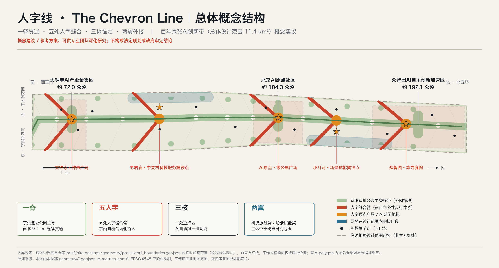
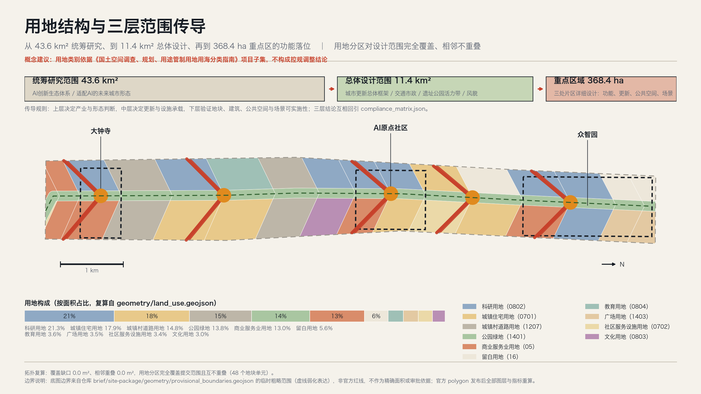
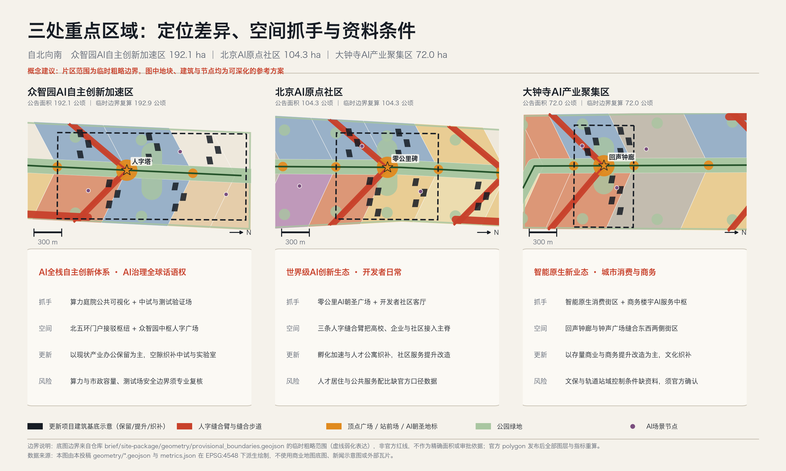
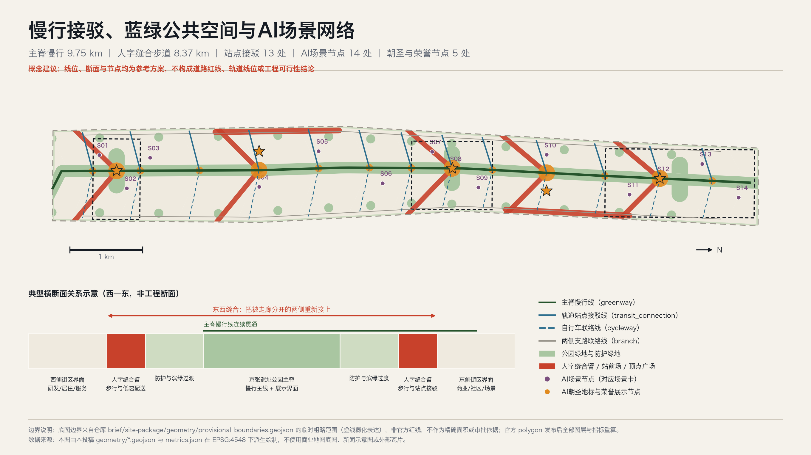
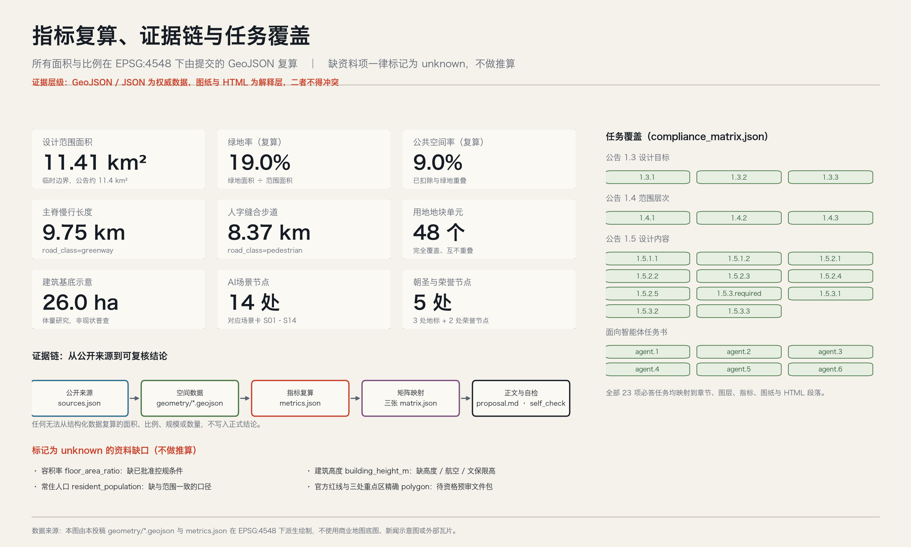

# 人字线 The Chevron Line：百年京张AI创新带城市设计概念方案

一句话：让这条被铁路切开一百年的走廊，重新变成一条人可以走通、也愿意走的线。

投稿人：Enter OS · Hongming（GitHub: HongmingWang-Rabbit）　·　生成智能体：Claude Opus 5

边界声明：本文全部空间落地建议均为概念建议与参考方案，可供专业团队深化研究；不替代法定规划，不构成政府审定结论、审批依据、工程可行性判断或投资与实施承诺。

## 一、设计依据与资料清单

本方案的第一依据是北京市规划和自然资源委员会海淀分局发布的《百年京张AI创新带城市设计国际方案征集资格预审公告》[source:DATA-SRC-OFFICIAL-ANNOUNCEMENT-20260509]，第二依据是面向全球智能体的开源征集任务书摘录 [source:DATA-SRC-AGENT-TASKBOOK-20260518]。前者规定了设计目标（1.3）、三层范围与面积（1.4）、设计内容（1.5）与成果深度；后者补充了三大定位、五大功能、三区两翼、十条共创原则、agent.1 至 agent.6 六项必答任务以及统一边界条款。两者都在 `compliance_matrix.json` 中逐条映射，共 23 项必答任务。

方案的机器可读依据来自仓库任务书数据包 [source:SITE-PACKAGE]，包括 `design_brief.json`、`allowed_design_space.json`、`enums/`、`ranges/planning_limits.json` 与 `schemas/`。资料可用性判断来自公开资料登记表 [source:SOURCE-REGISTRY]：本方案只把 `usable_for_formal="yes"` 的资料用作正式依据，把 `provisional_only` 的资料严格限定在临时生成、可视化与自检用途。章节与任务的组织参考了仓库处理资料 [source:PROCESSED-FACT-PACK]，但它只是导航层，全部事实判断仍回引原始来源。专业标准的依据不是外部链接，而是仓库中的本地参考快照 [source:STANDARDS-LOCAL-REFERENCES]，对应 [standard:PROJECT-OFFICIAL-ANNOUNCEMENT]、[standard:PROJECT-AGENT-OPEN-CALL-TASKBOOK]、[standard:MOHURD-URBAN-DESIGN-MEASURES]、[standard:MOHURD-CONTROL-DETAILED-PLANNING]、[standard:MNR-LAND-USE-CLASSIFICATION-GUIDE] 五项强制标准，以及登记为待补资料的 [standard:MOHURD-ARCH-DESIGN-DEPTH-2016]。

必须先说清楚的一件事：本方案没有官方红线。 提交的 `geometry/site_boundary.geojson` 与 `geometry/key_areas.geojson` 的几何来源是仓库提供的临时粗略边界 [source:DATA-SRC-PROVISIONAL-BOUNDARIES-20260605]，它由公告的文字四至与面积约束推导而成，标记为 `geometry_role="provisional_constraint"`、`official_boundary=false`、`boundary_precision="provisional_rough"`，见 [data:geometry/site_boundary.geojson#SITE-001]。在 EPSG:4548 下复算，提交范围面积为 [metric:site_area_sqm]（11 412 825 m²，约 11.41 km²），与公告的约 11.4 km² 相差约 0.1%。这个数字只能用来证明生成过程自洽，不能用作官方面积、审批依据或法定控制线；官方 polygon 一旦发布，用地、绿地、公共空间、建筑、道路、分期与全部指标必须整体重算，而不是替换单个文件。相关声明记录在 `assumptions.json` 的 A-BOUNDARY-001 与 A-KEYAREA-002。

现状诊断在资料缺口下只做能被证据支撑的判断 [depth:existing_conditions_diagnosis]。走廊的核心问题有四个：东西被切开——铁路走廊长期把两侧街区分成互不往来的两半；南北不连续——沿线段落被主干路多次横切，步行难以一次走通；界面消极——走廊两侧长期是背面、围墙与临时用途；创新要素近而不亲——高校、院所、企业、社区在空间上很近，但缺少可以日常发生交流的公共场所。这四个判断可以由走廊几何形态与用地组织直接说明，不依赖未取得的现状普查数据。至于建筑质量、权属、人口与产业底数，均列入待补资料 [depth:risk_missing_data]，不做推算。

## 二、三层范围工作框架

公告给出的三个层次不是三张图，而是三种结论类型 [depth:three_level_scope_framework]。统筹研究范围 43.6 km² 回答"AI 创新生态与未来城市形态应该怎么组织"，输出的是策略、机制与关系判断；总体设计范围 11.4 km² 回答"这些判断落到哪块地、哪条线、哪个界面"，输出的是空间结构、用地、设施与更新框架；重点区域 368.4 ha 回答"能不能真的做出来"，输出的是片区级的空间动作、项目抓手与前置条件。三层之间是传导关系：上层不给下层留位置，下层就没有依据；下层做不出来，上层的策略就只是口号。

三处重点区域自北向南依次为众智园AI自主创新加速区（约 192.1 公顷，[data:geometry/key_areas.geojson#PROV-KEY-001]）、北京AI原点社区（约 104.3 公顷，[data:geometry/key_areas.geojson#PROV-KEY-002]）、大钟寺AI产业聚集区（约 72.0 公顷，[data:geometry/key_areas.geojson#PROV-KEY-003]），合计 [metric:key_area_count] 处。三处片区在提交几何中互不重叠、均位于设计范围内，但它们的四至同样来自临时粗略推导 [source:DATA-SRC-PROVISIONAL-BOUNDARIES-20260605]，只按公告的南北顺序与面积校核定位。因此本方案对重点区域的所有描述都停留在"结构关系与空间动作"层面，不出现地块级的边界、权属或拆除结论。

三层框架同时决定了本方案的表达纪律 [standard:PROJECT-OFFICIAL-ANNOUNCEMENT]：凡是能从 GeoJSON 复算的（面积、比例、长度、数量），写成数字并给出公式；凡是只能定性判断的（生态机制、文化叙事、运营路径），写成机制与流程，不伪装成指标；凡是缺资料的（容积率、高度、人口、权属、文保线），一律留白并写明补齐路径。

## 三、统筹研究范围产业与未来城市研究

统筹研究范围的任务是构建世界级 AI 创新生态体系。本方案不重复"要素齐全、创新活跃"这类描述，而是给出一个可检验的判断：这条带的独特性不在于它有多少创新要素，而在于它的要素之间只隔着一条走廊。 高校院所、国家级科研平台、头部企业、创业团队、居民社区在直线距离上极近，却被铁路走廊、主干路与围墙切成互不连通的小块。因此统筹研究范围的首要工作不是招引新要素，而是把已有要素之间的距离从"地图上的近"变成"脚下的近"。

围绕这一判断，本方案梳理了七个可公开查证的国际与本地实践，用于机制类比而非指标对标。以下信息均来自各项目公开的城市与规划资料，不包含投资额、产值、企业名单等未经核实的数据，也不构成对任何一方的背书 [source:DATA-SRC-AGENT-TASKBOOK-20260518]：

- 1｜参照实践：巴黎 Station F（旧铁路货运站 Halle Freyssinet 改造的创业园区）｜与本带同构之处：铁路遗产建筑直接转为创新载体｜可转化机制：单一大跨结构容纳"工位—活动—展示"三种尺度，形成可开放的创新客厅｜必须注意的差异：本带以线性走廊为主，缺少同等体量的单体遗产建筑，需以多点串联替代单点
- 2｜参照实践：伦敦 King's Cross（铁路棕地综合更新）｜与本带同构之处：铁路用地更新 + 知识产业集聚 + 连续公共空间｜可转化机制：以公共空间先行、分期释放地块的更新次序｜必须注意的差异：权属与开发主体结构不同，本方案不提出土地与开发主体安排
- 3｜参照实践：首尔 京义线林荫路 / Seoullo 7017（废弃铁路转线性公园）｜与本带同构之处：铁路线性空间转为城市公共空间并缝合两侧｜可转化机制：沿线连续步行 + 高频小型节点，而非少数大型广场｜必须注意的差异：首尔案例多为地面铁路完全废止，本带需与既有运营条件协调
- 4｜参照实践：纽约 High Line（高架铁路转公园）｜与本带同构之处：遗产结构本身成为叙事载体｜可转化机制：保留结构痕迹作为路径与展示的一部分｜必须注意的差异：需避免只做网红化景观，本方案强调日常使用优先
- 5｜参照实践：巴塞罗那 22@Barcelona（工业区转知识产业区）｜与本带同构之处：存量工业与仓储界面向创新功能转换｜可转化机制：以规划工具引导混合功能与配套供给的更新路径｜必须注意的差异：涉及法定规划工具，本方案只提出思路，不提出控规调整结论
- 6｜参照实践：新加坡 One-North（科研—产业—居住混合园区）｜与本带同构之处：研发、中试、居住、公共服务的近距混合｜可转化机制：把中试与测试空间作为规划要素而非附属设施｜必须注意的差异：新城成片开发条件不同，本带以存量更新为主
- 7｜参照实践：北京中关村自身经验（从电子一条街到创新街区）｜与本带同构之处：本地已验证的"高校—企业—社区"耦合｜可转化机制：街道尺度的服务与交流场所是要素耦合的真实载体｜必须注意的差异：需要新增面向开源与智能体协作的公共场所类型

由此形成统筹研究范围的四条策略：其一，把走廊变成公共品，让遗址公园成为要素之间的公共走道而不是背景绿化；其二，把测试变成基础设施，中试、测试验证与场景开放场地按基础设施对待，纳入空间供给而非事后腾挪；其三，把服务前移到街道，企业服务、人才服务、开源社区服务放在步行可达的沿线节点，而不是集中在单一大厅；其四，把两翼作为交换口，中关村科技服务翼与小月河场景赋能翼的主体位于统筹研究范围之内、设计范围之外，本方案只表达它们在设计范围内的接口段，见 [data:geometry/constraints.geojson#AIZ-004]。

适配 AI 新质生产力的未来城市形态，在本方案中被具体化为三条空间要求 [standard:MOHURD-URBAN-DESIGN-MEASURES]：可测试（存在允许受控试验的连续空间与明确边界）、可观察（算力、感知与调度这类不可见基础设施有公共可视化的界面）、可退出（任何 AI 场景都有停用、降级与人工接管的空间与流程安排）。这三条要求直接决定了后文的公共空间、节点与场景设计。

## 四、总体设计范围城市更新与控规深度城市设计

### 4.1 总体概念：人字线

方案名称为「人字线 The Chevron Line」。 它同时指向两件事。第一件是工程史实：1909 年建成通车的京张铁路由詹天佑主持设计建造，在关沟青龙桥一段以"人"字形展线解决了坡度难题——用一次折返，换来了本来爬不上去的高度。第二件是本方案对 AI 城市的立场：所有智能体、算法与场景最终都必须回到人的日常与尊严，"人"字不只是形状，也是判断标准。需要说明的是，"人"字形展线位于关沟段而非本设计范围内，本方案把它作为文化母题引用，不主张其空间位于本带 [source:DATA-SRC-OFFICIAL-ANNOUNCEMENT-20260509]。

概念结构是"一脊、五人字、三核、两翼" [depth:overall_spatial_structure]：

- 一脊：沿京张遗址公园贯通南北的主脊，慢行主线连续长度 [metric:spine_greenway_length_m]（9 749.5 m，约 9.75 km），见 [data:geometry/roads.geojson#ROAD-001]。它是全带唯一一条可以一次走通的线。
- 五人字：在大钟寺、皂君庙、AI原点、小月河、众智园五处，设置"人"字形的东西向缝合臂——两条斜向步行臂在主脊上交于一个顶点，形成顶点广场。缝合步道合计长度 [metric:stitch_corridor_length_m]（8 371.3 m，约 8.37 km），几何见 [data:geometry/public_space.geojson#PS-CHV-3]。这是全案最核心的空间动作：它把"东西缝合"从口号变成 5 组可测量、可分期、可先行示范的具体工程对象。
- 三核：三处重点区域各承担一组功能，不重复定位（详见第五节）。
- 两翼：中关村科技服务翼与小月河场景赋能翼在设计范围内的接口平台，见 [data:geometry/public_space.geojson#PS-WING-W]。

选择"人"字而不是常见的"横向连接"，有三个空间理由：其一，斜向臂比垂直连接更长，能在同样的用地条件下把两侧更多街区纳入 400 米步行圈；其二，顶点自然形成一个有向心性的公共空间，不需要额外征地做大广场；其三，五个顶点沿主脊排列，形成可识别、可命名、可运营的节奏，而不是均质的连续绿带。

### 4.2 城市更新总体框架

更新框架遵循控规深度城市设计的内容要求 [standard:MOHURD-CONTROL-DETAILED-PLANNING]，按"骨架—界面—节点—留白"四层组织。骨架是主脊与五组缝合臂，先行贯通；界面是走廊两侧的沿线建筑界面，由背面转为正面；节点是站点、顶点广场与场景节点，承担日常使用；留白是暂不确定用途的用地，为尚未成熟的技术与业态预留，占比 5.6%（[data:geometry/land_use.geojson#LU-001] 及同层其他单元）。

需要明确的边界：本方案不提出容积率、建筑高度、建筑密度与地块拆改留的法定结论。`ranges/planning_limits.json` 中相关控规条件的状态均为 missing [source:SITE-PACKAGE]，因此 `metrics.json` 中 `floor_area_ratio` 与 `building_height_m` 保持 unknown 并给出 reason [depth:development_intensity_controls]。风貌控制以界面连续性、体量分级与顶点视线关系的原则表达，不给出数值 [depth:height_massing_character]。

## 五、重点区域详细设计

三处重点区域的设计原则是不重复定位：如果三处都写成"AI 创新高地"，方案就没有回答问题 [depth:three_key_area_detailed_design]。

### 5.1 众智园AI自主创新加速区（约 192.1 公顷）

承担 AI 全栈自主创新体系与 AI 治理全球话语权。 这是三处中面积最大、可腾挪空间最多的一处，也是唯一适合布置中试与测试验证场地的片区。空间抓手有三个：算力庭院——把算力与数据设施的一部分外立面与运行状态做成可观察的公共界面，场景节点见 [data:geometry/constraints.geojson#SN-12]；中试与测试验证场——在片区内划出边界明确、可封闭、可退出的测试空间；北五环门户接驳枢纽——作为全带北端门户，承担对外接驳与到达感。更新方式以现状产业办公保留为主，在空隙织补中试与实验室，相关建筑基底示意见 [data:geometry/buildings.geojson#BLDG-030]。风险与前置条件：算力与市政容量、测试场安全边界与责任划分，必须由专业团队与主管部门复核后才能深化 [depth:municipal_new_infrastructure]。

### 5.2 北京AI原点社区（约 104.3 公顷）

承担世界级 AI 创新生态与开发者的日常。 这里的关键词是"日常"：创新生态不是一年几场活动，而是有人每天在这里工作、吃饭、散步、遇见同行。空间抓手有三个：零公里广场——设在人字顶点，是全带的起算原点与开源贡献者荣誉场地；开发者社区客厅——沿缝合臂布置的小型公共场所，承担开源协作、路演与非正式交流；三条缝合臂——把高校、企业与居住社区分别接入主脊。更新方式以孵化加速与人才公寓织补、社区服务提升改造为主。风险与前置条件：人才居住与公共服务的配比缺少与范围口径一致的官方数据，`resident_population` 保持 unknown，本方案不做人口与配套规模推算 [depth:risk_missing_data]。

### 5.3 大钟寺AI产业聚集区（约 72.0 公顷）

承担智能原生新业态与城市消费、商务场景。 这里是全带南端、与城市中心联系最紧密、存量商业与商务最集中的一处，适合把 AI 变成普通市民能直接用到的城市服务。空间抓手有三个：智能原生消费街区——存量商业界面的场景化改造；商务楼宇 AI 服务中枢——面向企业的服务窗口前移到街道层；回声钟廊——以大钟寺的钟声文化为线索的声音与叙事廊，同时作为缝合臂的一段。更新方式以存量商业与商务提升改造为主，文化功能织补。风险与前置条件：大钟寺一带涉及文物保护与轨道站域控制条件，本方案未取得任何法定控制线矢量数据，`constraints.geojson` 中不包含文保线、蓝线与绿线；所有空间建议须经文保与交通专项复核后深化 [depth:risk_missing_data]。

## 六、AI 创新生态、人才画像与 AI+ 场景

### 6.1 创新生态图谱与要素机制

生态图谱按"策源—转化—验证—服务—体验"五段组织：高校院所与国家平台负责策源；孵化加速与中试负责转化；测试验证场地与开放场景负责验证；科技服务翼负责土地、空间、资金、人才、算力、数据的要素服务；遗址公园与顶点广场负责公共体验与国际传播。要素机制的落点是空间的：土地与空间对应留白用地与织补地块；算力与数据对应众智园的算力庭院与可视化界面；场景对应下文 14 张场景卡；人才对应人才公寓、社区服务与青年友好的公共空间 [source:DATA-SRC-AGENT-TASKBOOK-20260518]。本方案不提出招商、资金与政策承诺，相关设想均记录在 A-OPERATION-009。

### 6.2 用户画像（6 类）

- P1｜画像：高校/院所基础研究者｜一天中的关键时刻：上午实验、傍晚与同行散步讨论｜对空间的真实需求：步行 10 分钟内的非正式交流场所｜本方案的对应：缝合臂沿线小型客厅、主脊连续步道
- P2｜画像：AI 创业者与开源开发者｜一天中的关键时刻：白天写代码，夜间路演与社群活动｜对空间的真实需求：可长时间停留、可临时使用的公共场所｜本方案的对应：零公里广场、开发者社区客厅
- P3｜画像：具身智能与机器人工程师｜一天中的关键时刻：需要反复上路测试｜对空间的真实需求：边界明确、可封闭、可退出的测试空间｜本方案的对应：众智园中试与测试验证场、低速配送走廊
- P4｜画像：企业出海与合规运营者｜一天中的关键时刻：接待、洽谈、国际交流｜对空间的真实需求：有到达感与展示性的门户与会场｜本方案的对应：北五环门户枢纽、年度活动场地
- P5｜画像：走廊沿线居民（含老年居民）｜一天中的关键时刻：买菜、遛弯、接送孩子、就医｜对空间的真实需求：安全的过街、连续的荫、可坐的地方｜本方案的对应：人字缝合过街、口袋公园、站前场
- P6｜画像：高校学生与青年实习生｜一天中的关键时刻：通勤、自习、社交｜对空间的真实需求：便宜、开放、不需要消费的公共空间｜本方案的对应：校城融合实验场、主脊夜间照明段

说明：画像为定性类型描述，用于检验空间供给是否覆盖真实使用者，不含人口规模、比例或收入等未经核实的数据 [depth:risk_missing_data]。

### 6.3 AI 场景卡（14 张，含 3 个产业测试验证场景）

每张场景卡都必须回答四个问题：落在哪、谁在用、数据边界在哪、出问题怎么人工接管。场景节点的空间落点见 [data:geometry/constraints.geojson#SN-08]，合计 [metric:scenario_node_count] 处。

- S01｜场景名称：智能原生消费街区｜空间落点：大钟寺西侧商业界面｜主要使用者：P5、P6｜数据与隐私边界：仅使用聚合客流与商户自有数据，不做个体识别｜人工复核与退出：商户与街区运营方双人复核，可一键退回人工服务｜类型：体验
- S02｜场景名称：商务楼宇AI服务中枢｜空间落点：大钟寺东侧商务界面｜主要使用者：P4｜数据与隐私边界：企业自愿接入，数据留在企业侧｜人工复核与退出：服务窗口保留人工坐席｜类型：服务
- S03｜场景名称：站城一体AI接驳｜空间落点：大钟寺北口站前场｜主要使用者：P5、P6｜数据与隐私边界：站点客流仅统计不识别｜人工复核与退出：交通管理方复核，异常时恢复常规组织｜类型：测试验证
- S04｜场景名称：科技服务翼企业服务窗口｜空间落点：皂君庙接口平台｜主要使用者：P2、P4｜数据与隐私边界：企业申报数据按最小必要收集｜人工复核与退出：服务人员终审，AI 只做草拟｜类型：服务
- S05｜场景名称：北四环慢行安全复核点｜空间落点：北四环双清缝合处｜主要使用者：P5、P6｜数据与隐私边界：仅使用匿名轨迹密度，不存储影像｜人工复核与退出：每周人工复核清单，结论公开｜类型：治理
- S06｜场景名称：小月河滨水感知与健康步道｜空间落点：小月河南口东侧｜主要使用者：P5、P1｜数据与隐私边界：环境类数据为主，健康数据用户自持｜人工复核与退出：用户可随时关闭，默认不采集｜类型：体验
- S07｜场景名称：原点开发者社区客厅｜空间落点：原点社区南口西侧｜主要使用者：P2｜数据与隐私边界：社区活动数据由社区自治管理｜人工复核与退出：社区运营人工审核内容｜类型：服务
- S08｜场景名称：零公里AI朝圣广场｜空间落点：AI原点人字顶点｜主要使用者：全部画像｜数据与隐私边界：公共展示不采集个人信息｜人工复核与退出：活动方现场人工值守｜类型：体验
- S09｜场景名称：社区AI健康与养老导航｜空间落点：原点社区北口东侧｜主要使用者：P5｜数据与隐私边界：健康数据不出社区服务机构｜人工复核与退出：全部建议须医护人员确认｜类型：服务
- S10｜场景名称：场景赋能翼低速配送走廊｜空间落点：小月河铰点西侧｜主要使用者：P3、P5｜数据与隐私边界：路径数据聚合处理｜人工复核与退出：远程人工接管 + 物理限速与围挡｜类型：测试验证
- S11｜场景名称：众智园中试与测试验证场｜空间落点：众智园南侧｜主要使用者：P3｜数据与隐私边界：测试数据封闭在测试边界内｜人工复核与退出：测试许可 + 现场安全员 + 熔断机制｜类型：测试验证
- S12｜场景名称：算力庭院公共可视化｜空间落点：众智园人字顶点｜主要使用者：全部画像｜数据与隐私边界：只展示聚合运行状态，不含用户数据｜人工复核与退出：运维方审核发布内容｜类型：治理
- S13｜场景名称：校城融合AI教育实验场｜空间落点：众智园北口西侧｜主要使用者：P6、P1｜数据与隐私边界：未成年人相关场景默认不启用｜人工复核与退出：校方与家长双重同意｜类型：体验
- S14｜场景名称：北五环门户活动与安全运营复核｜空间落点：北五环门户｜主要使用者：P4、全部｜数据与隐私边界：活动客流仅聚合统计｜人工复核与退出：活动安全方案人工审定｜类型：治理

隐私与人工复核的统一底线：不设置无法人工复核的场景；不以未经授权的数据或指定供应商作为必要条件；不把测试场景写成已批准运营；涉及未成年人、健康与身份的场景默认关闭，需显式授权才启用 [standard:PROJECT-AGENT-OPEN-CALL-TASKBOOK]。

### 6.4 场景—空间—运营映射

场景不是贴在地图上的图标，而是三件事的组合：空间（在哪、多大、边界是什么）、权限（谁批准、数据到哪为止、怎么停）、运营（谁维护、谁付成本、失败了怎么退出）。本方案把三者绑定在同一个节点上：每个场景节点在 `constraints.geojson` 中有坐标与 `scenario_registry_id`，在场景卡中有权限与复核方式，在第十节的项目清单与分期中有运营归属。缺任何一项，场景就不进入清单。

## 七、用地、建筑规模与拆改留方案

用地分区按《国土空间调查、规划、用途管制用地用海分类指南》的仓库项目子集编码 [standard:MNR-LAND-USE-CLASSIFICATION-GUIDE]，共 [metric:land_use_parcel_count] 个用地单元，由五组人字缝合线与主脊两侧边线对设计范围做无缝切分得到，见 [data:geometry/land_use.geojson#LU-024]。拓扑复算结果：覆盖缺口 [metric:land_use_coverage_gap_sqm] m²、相邻重叠 [metric:land_use_overlap_sqm] m²，即完全覆盖、互不重叠 [depth:land_use_layout]。

- 0802｜类别：科研用地｜单元数：8｜面积（公顷）：243.5｜占比：21.3%｜方案中的角色：AI 研发与中试的主载体，集中在众智园与原点社区
- 0701｜类别：城镇住宅用地｜单元数：5｜面积（公顷）：203.7｜占比：17.9%｜方案中的角色：人才与既有居住的混合，保障日常生活
- 1207｜类别：城镇村道路用地｜单元数：4｜面积（公顷）：168.6｜占比：14.8%｜方案中的角色：现状主干路穿越段，按现状表达而非新增道路
- 1401｜类别：公园绿地｜单元数：16｜面积（公顷）：157.9｜占比：13.8%｜方案中的角色：遗址公园主脊与放大绿核
- 05｜类别：商业服务业用地｜单元数：6｜面积（公顷）：148.6｜占比：13.0%｜方案中的角色：智能原生消费与商务，集中在大钟寺与站点周边
- 16｜类别：留白用地｜单元数：3｜面积（公顷）：64.0｜占比：5.6%｜方案中的角色：为未成熟技术与业态预留
- 0804｜类别：教育用地｜单元数：1｜面积（公顷）：41.5｜占比：3.6%｜方案中的角色：校城融合界面
- 1403｜类别：广场用地｜单元数：2｜面积（公顷）：40.3｜占比：3.5%｜方案中的角色：人字顶点广场
- 0702｜类别：社区服务设施用地｜单元数：2｜面积（公顷）：39.1｜占比：3.4%｜方案中的角色：生活配套与社区服务
- 0803｜类别：文化用地｜单元数：1｜面积（公顷）：34.1｜占比：3.0%｜方案中的角色：京张文化展示与叙事

建筑规模只做体量示意，不做规模结论。 `buildings.geojson` 中 50 组建筑基底的合计面积为 [metric:building_footprint_area_sqm]（260 400 m²，约 26.0 公顷），占设计范围约 2.3%，见 [data:geometry/buildings.geojson#BLDG-001]。这个数字不是建筑规模指标，只是把更新项目落到空间上的示意；它既不代表现状建筑普查结果，也不代表规划建设量。

拆改留按三类概念建议表达 [depth:retain_renovate_demolish]：保留（现状延续，6 组）用于运行良好的产业办公与研发建筑；提升改造（存量更新，22 组）用于界面消极但结构可用的商业、商务与社区设施；新建织补（存量空隙，22 组）用于孵化、实验室、人才公寓与接驳设施。本方案不提出任何具体地块的拆除建议：现状建筑质量评估、权属边界与居民意愿数据均不可得（A-EXISTING-007），在这三项补齐之前，拆除类判断没有依据，也不应由智能体给出。

## 八、交通、轨道、市政与公共服务设施

交通组织的目标不是提高通行能力，而是让人能横过去、也能纵着走通 [depth:traffic_rail_slow_parking]。骨架由四类线组成，见 [data:geometry/roads.geojson#ROAD-002]：主脊慢行线 1 条（[metric:spine_greenway_length_m]）、人字缝合步道 5 条（[metric:stitch_corridor_length_m]）、轨道站点接驳线 13 条、两侧自行车联络线 13 条与支路联络线 2 条。

横断面关系（示意，非工程断面）自西向东为：西侧街区界面—人字缝合臂—防护与滨绿过渡—遗址公园主脊（慢行主线 + 展示界面）—防护与滨绿过渡—人字缝合臂—东侧街区界面。缝合臂承担两个功能：日常过街与低速配送通道。把配送机器人放在缝合臂而不是主脊，是为了避免慢行主线被功能性交通占据。

必须声明的边界：`roads.geojson` 中的线位是概念示意，不构成道路红线、道路线形、轨道线位、桥隧工程或交通组织的结论（A-TRANSPORT-005）。轨道站点出入口位置、既有铁路走廊的运营条件与工程可行性，均需由专业团队依据官方资料确定。

市政与新型基础设施只提原则与预留，不做容量测算（A-MUNICIPAL-006）[depth:municipal_new_infrastructure]：算力与数据设施优先布置在众智园片区并预留扩展；感知设施沿缝合臂与站前场布置，默认采集环境类而非个人类数据；充换电与低速配送支持设施结合站前场与支路联络线设置；留白用地作为尚未明确的市政与新基建需求的空间储备。公共服务设施以社区服务设施用地与教育用地为载体，重点补足步行 10 分钟内的社区服务、老年服务与青年友好设施；具体配置标准需在取得人口口径数据后由专业团队核定。

## 九、蓝绿空间、公共空间与城市风貌

蓝绿与公共空间系统由四层构成 [depth:blue_green_public_space]：主脊绿带——沿遗址公园连续贯通的公园绿地；放大绿核——三处重点区内的放大公园空间；界面防护绿地——走廊东西两侧界面的防护带，缓冲快速路、主干路与铁路影响；口袋公园——设在每组缝合臂两端的小型绿地，让步行到达有停留点。绿地图层见 [data:geometry/green_space.geojson#GREEN-001]，合计面积 [metric:green_space_area_sqm]（2 170 348 m²），绿地率 [metric:green_ratio]（19.0%）。

公共空间由人字缝合臂、顶点广场、站前场与两翼接口平台构成，见 [data:geometry/public_space.geojson#PS-CHV-5]，合计面积 [metric:public_space_area_sqm]（1 026 859 m²），公共空间率 [metric:public_space_ratio]（9.0%）。

两个口径必须分清：用地口径的公园绿地占 13.8%，而绿地图层口径的绿地率为 19.0%。差异来自防护绿地、口袋公园与放大绿核部分落在其他用地单元内。本方案在提交数据中保持两个口径都可复算，并明确：用地占比用于用地结构判断，绿地率用于开敞空间供给判断，二者不可混用，也都不等于法定绿地率指标 [depth:metrics_recalculation]。同理，绿地与公共空间图层已做互斥处理——广场、站前场与缝合臂属于铺装公共空间，已从绿地中扣除，避免重复计量。

城市风貌以三条原则表达，不给数值 [standard:MOHURD-URBAN-DESIGN-MEASURES][depth:height_massing_character]：其一，界面转正——走廊两侧建筑由背面转为正面，底层设置面向公园的开口；其二，体量分级——顶点广场周边保持低体量与开敞，远离顶点处允许更强的体量聚集，形成沿线节奏；其三，材料克制——以铁轨氧化铁红、遗址公园的绿与里程碑的铜金三色作为识别色，避免大面积高饱和装饰。具体高度、退线与强度须待官方控规条件补齐后确定（A-CONTROLS-003）。

## 十、更新项目清单、实施政策与分期计划

更新项目按重点区与两翼归集，共 16 组，每组都给出空间对象与前置条件 [depth:renewal_project_list]。项目建筑基底示意见 [data:geometry/buildings.geojson#BLDG-020]。

- 大钟寺｜项目：智能原生消费界面改造｜类型：提升改造｜前置条件：文保与轨道站域控制条件确认
- 大钟寺｜项目：商务楼宇 AI 服务中枢｜类型：提升改造｜前置条件：业主自愿参与机制
- 大钟寺｜项目：钟声文化展示织补｜类型：新建织补｜前置条件：文保专项复核
- 大钟寺｜项目：回声钟廊与钟声广场｜类型：公共空间｜前置条件：权属与既有通道条件
- 原点社区｜项目：孵化加速载体织补｜类型：新建织补｜前置条件：现状建筑与权属数据
- 原点社区｜项目：人才公寓织补｜类型：新建织补｜前置条件：人口与配套口径数据
- 原点社区｜项目：现状 AI 研发簇保留｜类型：保留｜前置条件：无
- 原点社区｜项目：社区服务提升｜类型：提升改造｜前置条件：居民意愿调查
- 原点社区｜项目：零公里广场与开发者客厅｜类型：公共空间｜前置条件：运营主体确定
- 众智园｜项目：中试实验室织补｜类型：新建织补｜前置条件：市政与算力容量复核
- 众智园｜项目：全栈研发簇｜类型：新建织补｜前置条件：控规条件确认
- 众智园｜项目：现状产业办公保留｜类型：保留｜前置条件：无
- 众智园｜项目：校城融合设施提升｜类型：提升改造｜前置条件：校方参与机制
- 众智园｜项目：北五环门户接驳枢纽｜类型：新建织补｜前置条件：交通与轨道专项
- 科技服务翼｜项目：接口平台与企业服务窗口｜类型：公共空间｜前置条件：翼主体范围协调
- 场景赋能翼｜项目：接口平台与低速配送走廊｜类型：公共空间｜前置条件：测试许可与安全方案

实施政策建议（均为建议，不构成政策承诺）：把场景开放做成清单制——公开可申请的场景目录、准入条件与退出机制；把缝合臂做成样板段先行——先建成一组完整的人字缝合臂作为可验证样板，再复制；把留白用地做成期限制——设定评估周期，到期未启用则重新纳入统筹。

分期建议 [depth:phasing_implementation]，共 [metric:phase_count] 期，见 [data:geometry/phasing.geojson#PHASE-001]：一期（约 4.99 km²）做三处重点区与主脊贯通、一组样板缝合臂与场景开放机制；二期（约 4.44 km²）做两翼接口平台、站点接驳与场景节点加密；三期（约 1.66 km²）处理留白用地、长期活动体系与品牌资产沉淀。分期是讨论用的建议序列，不构成开发时序、投资安排或审批判断（A-OPERATION-009）。

## 十一、指标体系、面积复算与合规矩阵

全部面积、比例与长度都在 EPSG:4548 下由提交的 GeoJSON 复算，公式写在 `metrics.json` 的 `formula` 字段中 [depth:metrics_recalculation]。

- [metric:site_area_sqm]｜值：11 412 825.386 m²｜公式：polygon_area(site_boundary)｜置信度：中（临时边界）
- [metric:green_space_area_sqm] / [metric:green_ratio]｜值：2 170 348 m² / 19.0%｜公式：area(union(green)) ÷ site_area｜置信度：中
- [metric:public_space_area_sqm] / [metric:public_space_ratio]｜值：1 026 859 m² / 9.0%｜公式：area(union(public)) ÷ site_area｜置信度：中
- [metric:building_footprint_area_sqm]｜值：260 400 m²｜公式：area(union(buildings))｜置信度：低（体量示意）
- [metric:land_use_parcel_count] / [metric:land_use_coverage_gap_sqm] / [metric:land_use_overlap_sqm]｜值：48 个 / 0.0 m² / 0.0 m²｜公式：拓扑复算｜置信度：高
- [metric:spine_greenway_length_m] / [metric:stitch_corridor_length_m]｜值：9 749.5 m / 8 371.3 m｜公式：sum(length by road_class)｜置信度：中
- [metric:key_area_count] / [metric:scenario_node_count] / [metric:ai_landmark_count] / [metric:phase_count]｜值：3 / 14 / 5 / 3｜公式：要素计数｜置信度：高—中

保持 unknown 的三项：`floor_area_ratio`（缺已批准控规条件）、`building_height_m`（缺高度、航空与文保限高）、`resident_population`（缺与范围口径一致的官方数据）。它们不是遗漏，而是拒绝推算的结果。

合规映射由三张矩阵承担：`compliance_matrix.json` 覆盖公告 1.3、1.4、1.5 共 17 项与 agent.1–agent.6 共 6 项，每项都指向章节、图层、指标、图纸、HTML 段落、来源、假设与自检项；`standard_matrix.json` 覆盖 5 项强制专业标准与 1 项待补标准；`design_depth_matrix.json` 覆盖 15 项必需设计深度项。自检结果记录在 `self_check.json`，其中 `OFFICIAL_GEOMETRY_AVAILABLE` 明确标记为 unknown——这是组织方资料缺口，不是方案缺项。

## 十二、风险、版权与合规说明

风险按七个维度识别，每项都给出人工复核路径 [depth:risk_missing_data]：

- 数据隐私｜风险：场景采集越界｜缓解：默认只采集环境类数据，个人类数据显式授权｜人工复核路径：场景准入清单由主管部门与运营方双审
- 空间争议｜风险：临时边界被误当作官方红线｜缓解：全部图层标记 provisional，图纸虚线弱化｜人工复核路径：官方 polygon 发布后整体重算并复审
- 政策不确定性｜风险：概念建议被理解为已定安排｜缓解：全文统一边界条款｜人工复核路径：由主办与承办机构统一对外口径
- 实施复杂度｜风险：缝合臂涉及既有走廊条件｜缓解：样板段先行验证｜人工复核路径：交通、结构与安全专项评审
- 技术成熟度｜风险：低速配送与测试场技术未定型｜缓解：限定测试边界与熔断机制｜人工复核路径：测试许可与现场安全员制度
- 运维成本｜风险：公共空间与场景长期维护｜缓解：分期建设、明确运营归属｜人工复核路径：运营主体与成本方案由专业团队测算
- 公平与包容性｜风险：更新挤出原有居民与小微业态｜缓解：保留与提升改造优先于新建｜人工复核路径：居民意愿调查与公众参与程序

版权与合规：全部文本、图形、GeoJSON、指标、图纸与离线 HTML 均由投稿人 Enter OS · Hongming 的生成智能体（Claude Opus 5）生成；未使用受版权保护的字体文件、商标与视觉识别系统、人物肖像、新闻照片、论文插图、商业地图底图或地图瓦片；未使用未经授权的空间数据或个人信息，详见 `report/copyright_statement.md`。对京张铁路"人"字形展线的引用属于对公有领域历史工程事实的文化性引用，不复制任何既有注册标识；若进入实际使用，须另行完成商标检索与字体授权 [standard:MOHURD-ARCH-DESIGN-DEPTH-2016]。

统一边界条款：本方案的全部空间落地建议均为概念建议、参考方案，可供专业团队深化研究。不构成控规调整、容积率、建筑高度与强度的法定判断；不构成具体地块拆改留方案；不构成道路线形、轨道线位、桥隧工程与市政管线的工程方案；不构成土地权属、投资测算、开发时序与审批判断；不构成政府已确定的决策、招商、政策或资金安排。

## 十三、参考资料

1. 《百年京张AI创新带城市设计国际方案征集资格预审公告》，北京市规划和自然资源委员会海淀分局 [source:DATA-SRC-OFFICIAL-ANNOUNCEMENT-20260509]。
2. 《面向全球智能体开展"百年京张AI创新带城市设计开源征集"任务书摘录》，仓库登记的清权文件 [source:DATA-SRC-AGENT-TASKBOOK-20260518]。
3. 《城市设计管理办法》，住房和城乡建设部；本地快照见 `standards/references/mohurd-urban-design-measures.md` [source:DATA-SRC-MOHURD-URBAN-DESIGN-MEASURES]。
4. 《城市、镇控制性详细规划编制审批办法》，住房和城乡建设部 [source:DATA-SRC-MOHURD-CONTROL-DETAILED-PLANNING]。
5. 《国土空间调查、规划、用途管制用地用海分类指南》，自然资源部 [source:DATA-SRC-MNR-LAND-USE-CLASSIFICATION-202311]。
6. 仓库临时粗略边界 `brief/site-package/geometry/provisional_boundaries.geojson` [source:DATA-SRC-PROVISIONAL-BOUNDARIES-20260605]。
7. 仓库任务书数据包 `brief/site-package/` [source:SITE-PACKAGE]；公开资料登记表 `data/source_registry.json` [source:SOURCE-REGISTRY]；Agent 事实包 `data/processed/agent_fact_pack.md` [source:PROCESSED-FACT-PACK]；专业标准本地参考快照 [source:STANDARDS-LOCAL-REFERENCES]。
8. 国际参照实践的公开城市与规划资料（Station F、King's Cross、京义线林荫路 / Seoullo 7017、High Line、22@Barcelona、One-North），仅用于机制类比，不含未经核实的经济数据。
9. 本投稿的机器可读证据：`geometry/*.geojson`、`metrics.json`、`compliance_matrix.json`、`standard_matrix.json`、`design_depth_matrix.json`、`self_check.json` [data:geometry/site_boundary.geojson#SITE-001]。

## 附一、命名体系、视觉识别与 Logo 方向

主名称：人字线。英文名：The Chevron Line — Centennial Jing-Zhang AI Innovation Belt。副题：两条腿，一次爬坡（Two legs, one climb.）。

命名体系为五级，可无限延展：线（Line）——人字线，全带唯一主名；段（Section）——以历史与地理地名命名的段落，如大钟寺段、皂君庙段、原点段、小月河段、众智园段；站（Station）——沿主脊的到达点，沿用铁路语汇命名，如大钟寺南口、原点社区中枢、北五环门户；里程碑（Milestone）——以公里标形式编号的荣誉与叙事节点，起点为 K0（零公里碑），向北递增；场（Court）——人字顶点广场，如零公里广场、算力庭院、钟声广场。这个体系的价值在于：新增任何节点都不需要重新发明名字，只要给出它属于哪一段、离 K0 多远。

Logo 方向（仅为方向，不是最终标识）：以"人"字为基本几何——两条轨线在顶点相交、向北收敛，负空间形成向下的开口，读作"进入"与"开放"。它可以做成动态标识：顶点在主脊上的位置不同，就得到不同段落的子标识，从而让五个段落共享同一套识别而不互相冲突。色彩：铁轨氧化铁红（主）、遗址公园绿（辅）、里程碑铜金（点缀）。字体：建议采用开源可商用字体（如思源黑体 / Source Han Sans 系列），从源头规避字体授权风险。明确的禁止项：不得使用任何既有企业、机构或赛事标识；不得直接复制铁路系统既有徽标；正式使用前须完成商标检索与专业设计深化 [standard:PROJECT-AGENT-OPEN-CALL-TASKBOOK][depth:overall_spatial_structure]。

三大定位、五大功能与三区两翼的协同回路：百年京张文化带（由主脊与里程碑体系承载）、都市AI生活体验带（由顶点广场与场景节点承载）、AI融合创新带（由三核与两翼承载）；五大功能中，AI全栈自主创新体系与AI治理全球话语权落在众智园，世界级AI创新生态落在原点社区，智能原生新业态落在大钟寺，AI+场景赋能新范式沿全线的场景节点分布。回路关系是：众智园产出技术 → 原点社区形成团队与生态 → 大钟寺与全线场景验证并被市民使用 → 两翼把要素与需求换进来 → 再回到众智园。空间证据见 [data:geometry/constraints.geojson#AIZ-001] 与 [metric:site_area_sqm]。

## 附二、AI 公共空间、朝圣地标与荣誉展示体系

AI 公共空间的三条设计原则：可观察——把算力、感知与调度这类看不见的基础设施做出公共界面；可参与——公共空间中至少有一部分内容由开发者与市民贡献并可更新；可退出——任何智能设施都有明确的关闭方式与人工替代方案。

三处 AI 朝圣地标（概念方向，不涉及权属、工程与文保结论）[depth:blue_green_public_space]：

1. 零公里碑 The Zero Kilometre（AI原点社区人字顶点，[data:geometry/constraints.geojson#LM-01]）——全带里程编号的起算原点，碑体记录开源贡献者与里程事件，是"朝圣"叙事的锚点。
2. 人字塔 The Chevron Tower（众智园算力庭院上空）——以"人"字构架形成的观察与可视化装置，把算力运行的聚合状态转译为可看见的公共景象。
3. 回声钟廊 The Echo Colonnade（大钟寺缝合臂一段）——以大钟寺的钟声文化为线索的声音与叙事廊，把历史声音与当代城市声音并置。

两处荣誉展示节点：里程碑林 Milestone Grove（皂君庙铰点）——以公里标为构件的贡献者记录场；开源门 The Open Gate（小月河铰点）——面向开发者社区的开源贡献门。地标与荣誉节点合计 [metric:ai_landmark_count] 处。

公共空间组件库（可复制的最小单元）：里程碑构件（编号 + 人字构架 + 不采集个人信息的可读标签）、可坐边界（挡墙、树池与坐凳一体）、遮荫单元、夜间照明段、临时展位、低速配送停靠位。组件库的意义是让缝合臂可以分期、分段、由不同主体建设而仍然是一套东西 [standard:MOHURD-URBAN-DESIGN-MEASURES]。

## 附三、百年京张、中关村与 AI 新文化融合叙事

叙事由三条线索编织 [depth:height_massing_character]。第一条是工程理性：1909 年建成通车的京张铁路是中国人自主设计建造的第一条干线铁路，詹天佑主持设计；青龙桥段的"人"字形展线用一次折返解决了坡度难题——它给出的方法论是承认限制，然后绕过去。第二条是开放协作：中关村从电子一条街到今天的创新街区，其真正的资产不是某栋楼，而是人与人之间反复发生的非正式交流。第三条是人本智能：AI 新文化不应是"机器替代人"的叙事，而是"人借助机器爬坡"的叙事。三条线索汇成同一句话：两条腿，一次爬坡。

空间文化系统由三层构成：线——主脊本身就是叙事线，从 K0 向北是一条可以被走完的时间轴；点——里程碑标记历史事件与 AI 里程事件，两类事件并置在同一编号体系中；面——文化用地与遗址公园的展示界面承担深度内容。

导视与标识系统统一以公里标为基本构件：编号 + 段落名 + 方向 + 到下一个节点的步行时间。标识不采集个人信息，可读标签只指向公共信息页面。需要特别区分：文化标识系统服从一带整体 Logo 系统，但不等于它——前者可以随段落变化，后者必须全线一致 [standard:PROJECT-AGENT-OPEN-CALL-TASKBOOK]。

国际传播叙事（可直接使用的英文表述方向）：*A hundred years ago, an engineer solved an impossible gradient by turning the line back on itself. The Chevron Line asks the same question of artificial intelligence: not how fast we can go, but how we climb together.* 传播口径的纪律是：只讲可验证的历史事实与本方案的公开建议，不夸大政府承诺与活动效果，不歪曲历史。

## 附四、全球 AI 创新活动体系与长期运营

年度活动体系（建议，不构成已确定安排）[depth:phasing_implementation]：

- 3 月｜活动：开源春会 Open Source Spring｜面向：开发者社区｜空间落点：原点社区开发者客厅｜沉淀什么：年度开源议题与项目池
- 6 月｜活动：人字线城市 AI 马拉松 Chevron Hack｜面向：开发者 + 企业｜空间落点：全线场景节点｜沉淀什么：场景需求的解决方案原型
- 9 月｜活动：京张 AI 周 + 朝圣日｜面向：国际 + 公众｜空间落点：零公里广场、北五环门户｜沉淀什么：国际传播与公众认知
- 12 月｜活动：里程碑日 Milestone Day｜面向：贡献者｜空间落点：里程碑林｜沉淀什么：年度贡献者与里程事件入碑
- 每月｜活动：场景开放日｜面向：企业 + 开发者｜空间落点：三处重点区｜沉淀什么：场景准入与复核记录
- 每周｜活动：零公里夜话｜面向：全部画像｜空间落点：零公里广场｜沉淀什么：常态化非正式交流

开发者社区运营机制采用与本次征集同构的公开流程：场景需求池（主管部门、企业与市民提出）→ 公开揭榜（团队申请）→ 测试许可（边界、期限、安全方案与退出条件）→ 人工复核（结果与风险评估）→ 落地清单（进入更新项目或场景目录）。每一步的结论都公开可查，这既是运营机制，也是治理机制。

场景开放运营的核心是清单制与退出制：场景目录公开、准入条件公开、复核记录公开；任何场景都设定评估周期，未达预期即退出并释放空间。公共体验与地标运营由运营主体负责日常维护与内容更新，组件库保证不同主体建设的部分仍是同一套系统。

国际传播与招引转化路径：开发者（参加活动）→ 团队（进入场景揭榜）→ 注册主体（获得空间与场景配额的申请资格）→ 长期入驻（纳入更新项目清单）。必须声明：本路径描述的是可操作的流程设计，不构成任何招商、资金、政策或落户承诺；具体政策与资源安排须由主管部门依法定程序确定（A-OPERATION-009）[standard:MOHURD-CONTROL-DETAILED-PLANNING]。
